                 

### 《Web 应用程序的可扩展性和容错性》

> **关键词：**Web 应用程序、可扩展性、容错性、微服务、云计算、分布式系统、容器化、Service Mesh、弹性计算

> **摘要：**本文将深入探讨Web应用程序在当今数字化时代中的两个关键特性：可扩展性和容错性。通过对这些概念的定义、分类、评估方法和实际应用案例的分析，读者将获得对如何设计和实现高效、可靠的Web应用程序的全面理解。文章首先介绍了可扩展性的核心概念，然后详细探讨了架构设计原则，包括微服务架构、容器化与容器编排、云原生技术与服务网格。随后，文章转向容错性，介绍了其核心概念、故障管理机制和分布式故障处理方法。通过实际案例分析，读者将看到这些概念在大型电商平台和金融系统中的应用。最后，文章展望了未来可扩展性和容错性技术的发展趋势和机遇。

### 第一部分：Web 应用程序的可扩展性

在数字化时代，Web 应用程序的可扩展性是其成功的关键因素之一。随着用户数量的增加和业务需求的不断变化，系统需要能够动态地调整其资源使用和性能，以满足不断增长的需求。本部分将深入探讨可扩展性的核心概念、架构设计原则，以及水平扩展与垂直扩展策略。

#### 第1章：可扩展性的核心概念

##### 1.1 什么是可扩展性

可扩展性是指系统在用户数量、数据处理量或功能需求增加时，能够保持或提升性能的能力。在Web应用程序中，可扩展性通常涉及到以下几个方面：

- **系统性能与可扩展性的关系：**系统的性能直接影响到用户的体验和满意度。一个高可扩展性的系统可以在不显著降低性能的情况下，处理更多的请求和数据。

- **可扩展性需求的来源：**随着业务的增长，系统需要能够处理更多的用户请求和数据。此外，不断变化的市场需求和技术进步也可能促使系统进行扩展。

##### 1.1.1 系统性能与可扩展性的关系

系统性能与可扩展性密切相关。一个高可扩展性的系统通常能够在性能方面表现出色。以下是一个简化的Mermaid流程图，展示了系统性能、可扩展性和相关指标之间的关系：

**Mermaid 流程图：**
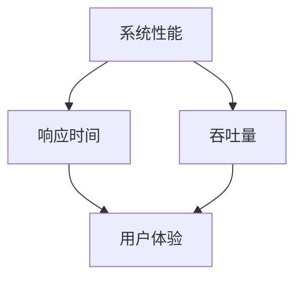

- **响应时间：**系统的响应时间直接影响用户体验。一个高可扩展性的系统能够在用户增加时保持较低的响应时间。

- **吞吐量：**系统的吞吐量是指单位时间内可以处理的请求数量。高吞吐量意味着系统可以同时处理更多的用户请求。

- **用户体验：**用户体验是衡量系统性能的关键指标。一个高可扩展性的系统能够在不影响用户体验的情况下，适应业务增长。

##### 1.1.2 可扩展性需求的来源

可扩展性的需求主要来源于以下几个方面：

- **用户增长：**随着用户数量的增加，系统需要能够处理更多的请求和操作。

- **业务需求变化：**业务的快速发展可能导致系统需要支持更多的功能和服务。

- **硬件限制：**随着数据量和并发请求的增加，系统可能需要更多的硬件资源来保证性能。

- **处理能力提升：**随着技术的发展，系统可能需要提升其处理能力，以支持新的功能和更复杂的数据处理。

以下是用于表示可扩展性需求来源的伪代码：

```python
def scalability需求的来源():
    # 硬件限制
    check_hardware_limit()
    # 用户增长
    check_user_growth()
    # 业务需求变化
    check_business_change()
    # 处理能力提升
    check_processing_power_increase()
```

##### 1.2 可扩展性的分类

可扩展性可以分为线性可扩展性和非线性可扩展性。这两种扩展方式在系统设计和实现中有不同的应用场景。

- **线性可扩展性：**线性可扩展性是指系统性能随着资源增加而成比例提升的能力。数学模型可以表示为：

  $$
  \text{线性可扩展性} = \frac{C_1 \cdot n}{C_2}
  $$
  
  其中，$C_1$ 和 $C_2$ 为常数，$n$ 为系统规模。

- **非线性可扩展性：**非线性可扩展性是指系统性能提升不与资源增加成正比的扩展能力。这种扩展方式通常涉及复杂的算法和优化技术。

##### 1.2.1 线性可扩展性与非线性可扩展性

线性可扩展性通常在硬件扩展和简单的负载均衡方案中实现，而非线性可扩展性则更多地依赖于软件优化和算法改进。

以下是一个Mermaid流程图，展示了线性可扩展性与非线性可扩展性的区别：

**Mermaid 流程图：**
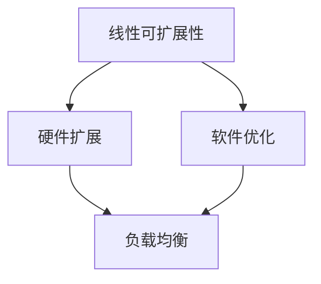

##### 1.2.2 硬件扩展与软件扩展

- **硬件扩展：**硬件扩展是指通过增加服务器、存储设备和网络带宽等硬件资源来提升系统性能。

- **软件扩展：**软件扩展则是指通过优化代码、使用分布式计算和负载均衡等技术来提升系统性能。

以下是一个伪代码示例，展示了硬件扩展和软件扩展的实现方法：

```python
def 硬件扩展():
    # 购买更多服务器
    purchase_more_servers()

def 软件扩展():
    # 优化代码
    optimize_code()
    # 使用分布式计算
    use_distributed_computing()
```

##### 1.3 可扩展性的评估

评估一个系统的可扩展性对于设计和优化系统至关重要。以下是一些常用的可扩展性评估指标和测试方法。

##### 1.3.1 可扩展性指标

- **性能利用率：**性能利用率是指系统当前性能与最大性能的比值。通过计算性能利用率，可以评估系统当前的可扩展性。

  $$
  \text{性能利用率} = \frac{\text{系统当前性能}}{\text{系统最大性能}}
  $$

- **吞吐量：**吞吐量是指单位时间内系统能够处理的请求或数据量。

- **响应时间：**响应时间是指系统处理请求并返回结果所需的时间。

##### 1.3.2 可扩展性测试方法

- **负载测试：**负载测试是一种评估系统在预期负载下的性能和可扩展性的方法。通过模拟高并发请求，可以观察系统的响应时间和吞吐量。

- **性能测试：**性能测试是一种评估系统性能的方法，通常涉及测量系统的响应时间和吞吐量。

以下是用于表示可扩展性评估的伪代码：

```python
def 可扩展性指标(系统性能，系统容量):
    # 计算性能利用率
    performance_utilization = 系统性能 / 系统容量
    # 判断系统是否可扩展
    if performance_utilization < 1:
        print("系统可扩展")
    else:
        print("系统不可扩展")

def 可扩展性测试():
    # 增加系统负载
    increase_system_load()
    # 记录系统性能
    record_system_performance()
    # 分析性能与负载关系
    analyze_performance_load_relationship()
```

#### 第2章：架构设计原则

架构设计是实现Web应用程序可扩展性的关键。合理的架构设计原则能够帮助系统在用户数量和数据处理量增加时，保持良好的性能和稳定性。以下将详细讨论微服务架构、容器化与容器编排、云原生技术与服务网格。

##### 2.1 微服务架构

微服务架构是一种将应用程序分解为多个小型、自治服务的架构风格。每个服务负责实现特定的业务功能，并且可以独立部署、扩展和更新。

##### 2.1.1 微服务架构的定义

微服务架构的核心特点包括：

- **自治服务：**每个服务都是独立部署和管理的，可以独立扩展和更新。

- **分布式系统：**微服务架构通常涉及多个服务，这些服务通过网络进行通信。

- **松耦合：**服务之间通过轻量级的API进行通信，减少依赖和耦合。

- **容器化：**微服务通常运行在容器中，便于部署和管理。

以下是微服务架构的一个简化的Mermaid流程图：

**Mermaid 流程图：**
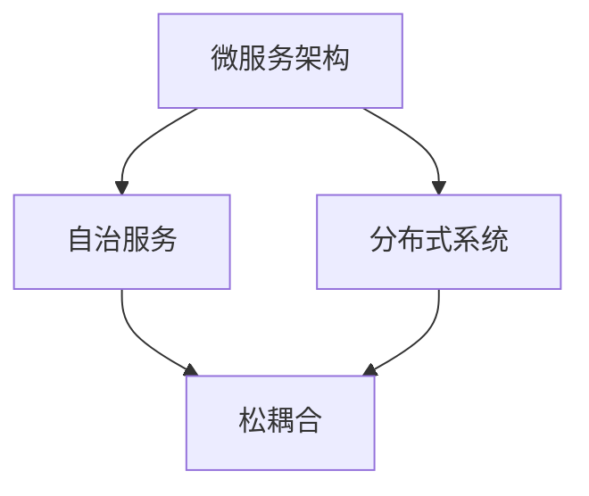

##### 2.1.2 微服务的优势与挑战

微服务架构具有以下优势：

- **灵活扩展：**可以通过独立扩展和更新每个服务，实现系统的弹性扩展。

- **高可用性：**服务间的故障隔离提高了系统的可用性。

- **技术多样性：**每个服务可以使用不同的技术栈，提高开发效率。

然而，微服务架构也面临一些挑战：

- **分布式复杂性：**分布式系统增加了复杂性，如数据一致性和服务间通信。

- **运维难度：**维护多个服务增加了运维难度。

以下是一个Mermaid流程图，展示了微服务的优势与挑战：

**Mermaid 流程图：**
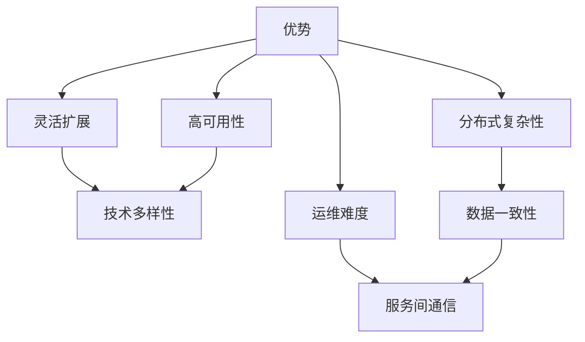

##### 2.1.3 微服务设计原则

为了实现微服务的优势并克服其挑战，以下是一些微服务设计原则：

- **功能分解：**将应用程序分解为独立的、自治的服务。

- **服务自治：**确保每个服务可以独立部署和更新。

- **定义明确的服务接口：**使用轻量级的API定义服务间通信。

- **独立部署：**确保每个服务可以独立部署，不受其他服务的影响。

以下是微服务设计原则的一个伪代码示例：

```python
def 微服务设计原则():
    # 功能分解
    function_decomposition()
    # 服务自治
    service_ownership()
    # 定义明确的服务接口
    define_service_interfaces()
    # 独立部署
    independent_deployment()
    # 服务间解耦合
    service_decoupling()
```

##### 2.2 容器化与容器编排

容器化技术是将应用程序及其依赖项打包到容器中的技术，使得应用程序可以在任何支持容器引擎的环境中运行。

##### 2.2.1 容器化技术的概述

容器化技术具有以下特点：

- **轻量级：**容器是一个轻量级的运行时环境，不包含操作系统，因此启动速度快。

- **隔离性：**容器提供隔离性，确保应用程序之间相互独立。

- **可移植性：**容器可以在不同的环境中部署，如开发、测试和生产。

以下是一个Mermaid流程图，概述了容器化技术的核心概念：

**Mermaid 流程图：**
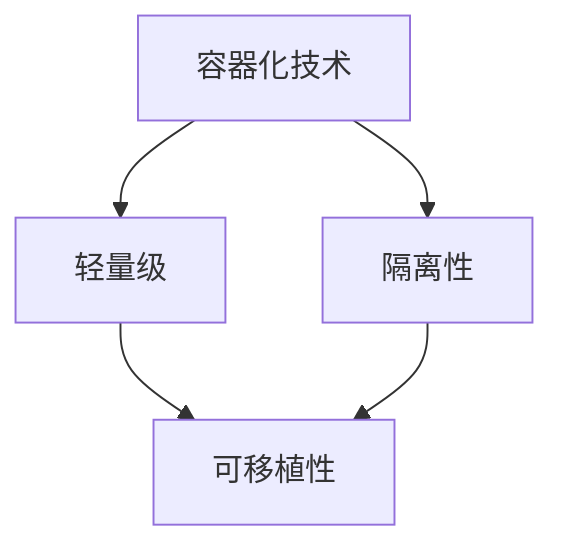

##### 2.2.2 Kubernetes入门

Kubernetes（简称K8s）是一个开源的容器编排平台，用于自动化部署、扩展和管理容器化应用程序。

- **Kubernetes核心组件：**

  - **Pod：**Kubernetes中的最小部署单位，可以包含一个或多个容器。

  - **部署（Deployment）：**用于管理Pod的创建和更新。

  - **服务（Service）：**用于定义如何访问Pod。

  - **Ingress：**用于管理外部流量进入集群。

  - **StatefulSet：**用于管理有状态服务。

以下是一个Mermaid流程图，展示了Kubernetes的核心组件：

**Mermaid 流程图：**
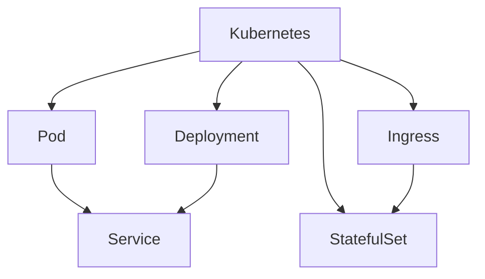

##### 2.2.3 Kubernetes入门

为了入门Kubernetes，以下是一些基础概念和实践步骤：

- **安装Kubernetes集群：**在本地或云环境中安装Kubernetes集群。

- **部署应用程序：**使用Kubernetes部署和管理容器化应用程序。

- **管理Pod和Service：**创建、更新和管理Pod和Service。

- **实现负载均衡：**使用Service实现负载均衡，确保应用程序的流量分发。

以下是Kubernetes入门的伪代码示例：

```python
def Kubernetes入门():
    # 安装Kubernetes集群
    install_Kubernetes_cluster()
    # 部署应用程序
    deploy_applications()
    # 管理Pod和Service
    manage_Pods_and_Services()
    # 实现负载均衡
    implement_load_balancing()
```

##### 2.2.4 容器编排的最佳实践

容器编排的最佳实践包括以下几个方面：

- **自动化部署：**使用CI/CD流程自动化部署应用程序。

- **资源管理：**合理分配资源，避免资源浪费。

- **监控与日志：**实施监控和日志策略，确保系统的健康运行。

- **故障自愈：**实现故障自愈机制，确保系统在故障发生后能够快速恢复。

以下是容器编排最佳实践的伪代码示例：

```python
def 容器编排最佳实践():
    # 确定应用部署策略
    determine_deployment_strategy()
    # 配置容器镜像
    configure_container_images()
    # 实施服务发现
    implement_service_discovery()
    # 管理网络配置
    manage_network_configuration()
    # 实施负载均衡
    implement_load_balancing()
    # 实现存储管理
    implement_storage_management()
    # 实施自动化运维
    implement_automation_operations()
    # 集群监控与维护
    monitor_and_maintain_cluster()
```

##### 2.3 云原生技术与服务网格

云原生技术是一组促进应用程序在云环境中高效运行的技术和实践。服务网格是云原生技术中的一个重要组成部分，用于管理微服务之间的通信。

##### 2.3.1 云原生概念

云原生技术包括以下核心概念：

- **容器化：**应用程序以容器形式部署和运行。

- **微服务：**应用程序分解为小型、自治的服务。

- **动态管理：**使用自动化工具管理应用程序的生命周期。

- **分布式系统：**应用程序在分布式环境中运行，涉及多个节点和服务的通信。

以下是一个Mermaid流程图，展示了云原生技术的核心概念：

**Mermaid 流程图：**
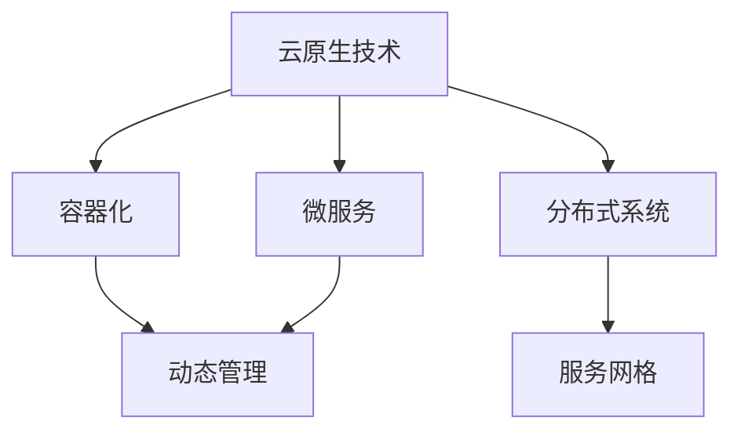

##### 2.3.2 服务网格介绍

服务网格是一种基础设施层，用于管理微服务之间的通信。服务网格的关键功能包括：

- **服务发现与路由：**动态发现服务并路由流量。

- **流量控制与安全：**管理流量，确保通信安全。

- **监控与日志：**收集微服务间的通信数据，实现监控和日志分析。

以下是一个Mermaid流程图，展示了服务网格的核心功能：

**Mermaid 流程图：**
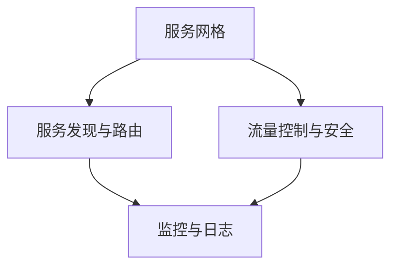

##### 2.3.3 Istio入门与实践

Istio是一种开源服务网格平台，用于管理微服务之间的通信。以下是一些Istio入门与实践的关键步骤：

- **安装Istio：**在Kubernetes集群中安装Istio。

- **配置服务：**将服务加入Istio服务网格。

- **实现服务间路由：**使用Istio的路由规则实现服务间通信。

- **监控与日志：**使用Istio的监控和日志功能，实现服务的监控和日志分析。

以下是Istio入门与实践的伪代码示例：

```python
def Istio入门与实践():
    # 安装Istio
    install_Istio()
    # 配置Istio服务
    configure_Istio_services()
    # 实现服务间路由
    implement_service_to_service_routing()
    # 实现服务监控与日志
    implement_service_monitoring_and_logging()
    # 实现服务弹性与故障自愈
    implement_service_elasticity_and_auto-recovery()
```

#### 第3章：水平扩展与垂直扩展

水平扩展和垂直扩展是系统性能优化和可扩展性实现中的两种主要策略。水平扩展通过增加节点数来提升系统性能，而垂直扩展则通过提升单个节点的性能来实现扩展。以下将详细讨论这两种扩展策略的优势、实现方法和挑战。

##### 3.1 水平扩展

水平扩展，也称为横向扩展，是通过增加服务器或节点数量来提升系统性能和可扩展性的策略。以下水平扩展的优势、实现方法和挑战。

##### 3.1.1 水平扩展的优势

水平扩展具有以下优势：

- **弹性伸缩：**可以通过动态增加或减少节点，快速响应负载变化。

- **高可用性：**多个节点可以提供冗余，提高系统的可用性。

- **可预测性能：**性能提升与节点数量成正比，容易预测。

- **成本低：**相对于垂直扩展，水平扩展的成本较低。

- **易于管理：**每个节点相对独立，便于维护和监控。

以下是一个Mermaid流程图，展示了水平扩展的优势：

**Mermaid 流程图：**
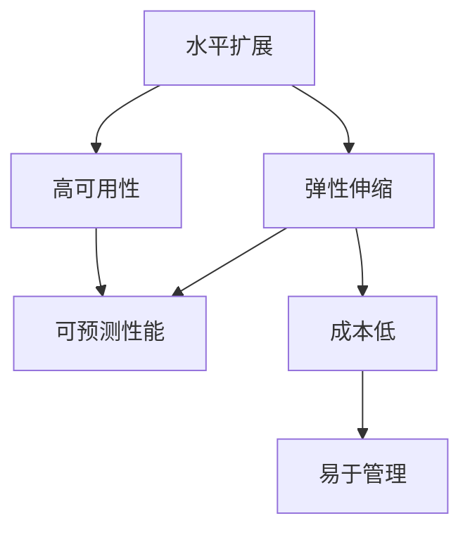

##### 3.1.2 水平扩展的实现方法

水平扩展可以通过以下方法实现：

- **添加更多实例：**在现有集群中添加更多节点。

- **使用负载均衡器：**将请求均匀分配到不同节点。

- **部署分布式系统：**设计分布式系统，使每个节点可以独立处理请求。

- **实施服务网格：**使用服务网格实现服务间通信的负载均衡和故障转移。

以下是水平扩展实现方法的伪代码示例：

```python
def 水平扩展实现方法():
    # 添加更多实例
    add_more_instances()
    # 使用负载均衡器
    use_load_balancer()
    # 部署分布式系统
    deploy_distributed_system()
    # 实施服务网格
    implement_service_mesh()
```

##### 3.1.3 水平扩展的挑战与解决方案

水平扩展面临以下挑战：

- **数据一致性：**分布式系统中的数据一致性是一个挑战。

- **网络延迟：**节点之间的网络通信可能导致延迟。

- **分布式事务：**跨节点的分布式事务管理复杂。

以下是一个Mermaid流程图，展示了水平扩展的挑战与解决方案：

**Mermaid 流程图：**
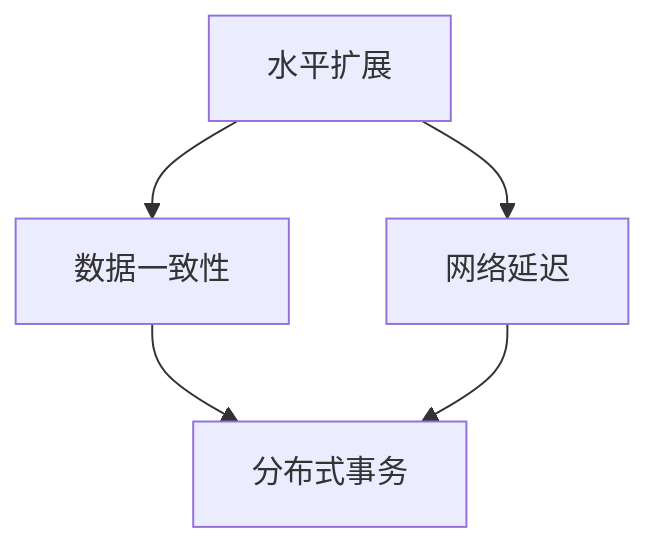

为了解决这些挑战，可以采取以下策略：

- **分布式存储：**使用分布式存储系统，确保数据一致性。

- **一致性协议：**采用一致性协议，如Raft或Paxos，管理分布式事务。

- **优化网络架构：**优化网络架构，减少节点之间的通信延迟。

以下是水平扩展挑战与解决方案的伪代码示例：

```python
def 水平扩展挑战与解决方案():
    # 优化网络架构
    optimize_network_architecture()
    # 使用分布式数据库
    use_distributed_database()
    # 实现一致性协议
    implement_consistency_protocol()
    # 实现故障检测与恢复
    implement_fault_detection_and_recovery()
```

##### 3.2 垂直扩展

垂直扩展，也称为纵向扩展，是通过提升单个节点的性能（如CPU、内存、存储等）来提升系统性能和可扩展性的策略。以下将详细讨论垂直扩展的优势、实现方法和挑战。

##### 3.2.1 垂直扩展的优势

垂直扩展具有以下优势：

- **计算能力提升：**通过增加硬件资源，提高单个节点的计算能力。

- **数据处理效率高：**更高性能的硬件可以更快速地处理大量数据。

- **延迟降低：**减少数据处理时间和网络通信延迟。

- **资源利用率高：**相对于水平扩展，垂直扩展的资源利用率更高。

- **维护成本低：**维护单个高性能节点相对容易。

以下是一个Mermaid流程图，展示了垂直扩展的优势：

**Mermaid 流程图：**
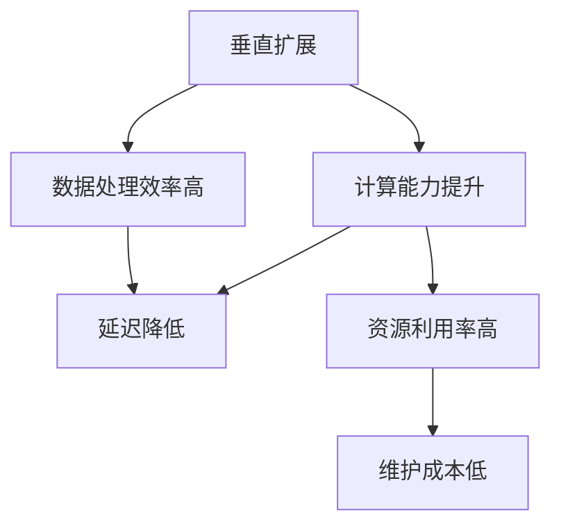

##### 3.2.2 垂直扩展的实现方法

垂直扩展可以通过以下方法实现：

- **增加CPU性能：**使用更高主频或更多核心的CPU。

- **增加内存容量：**使用更大容量或更高频率的内存。

- **增加存储容量：**使用更大容量或更高性能的存储设备。

- **使用更高性能的硬件：**升级到最新一代的硬件设备。

以下是垂直扩展实现方法的伪代码示例：

```python
def 垂直扩展实现方法():
    # 增加CPU性能
    increase_cpu_performance()
    # 增加内存容量
    increase_memory_capacity()
    # 增加存储容量
    increase_storage_capacity()
    # 使用更高性能的硬件
    use_high_performance_hardware()
```

##### 3.2.3 垂直扩展的挑战与解决方案

垂直扩展面临以下挑战：

- **成本高：**高性能硬件的成本较高。

- **性能提升有限：**提升硬件性能对性能提升的效果可能有限。

- **资源浪费：**可能存在资源利用率不均的问题。

以下是一个Mermaid流程图，展示了垂直扩展的挑战与解决方案：

**Mermaid 流程图：**
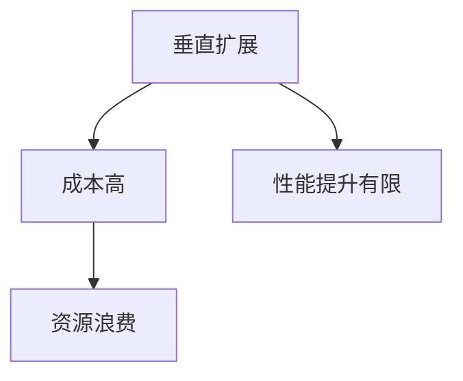

为了解决这些挑战，可以采取以下策略：

- **性能优化：**优化系统配置和代码，提高性能。

- **成本效益分析：**评估不同硬件方案的成本效益。

- **动态资源管理：**动态调整资源分配，提高资源利用率。

以下是垂直扩展挑战与解决方案的伪代码示例：

```python
def 垂直扩展挑战与解决方案():
    # 优化代码
    optimize_code()
    # 优化系统配置
    optimize_system_configuration()
    # 进行成本效益分析
    perform_cost_benefit_analysis()
    # 更新硬件
    update_hardware()
```

#### 第4章：数据库可扩展性

数据库是Web应用程序的核心组成部分，其可扩展性对系统性能和用户体验至关重要。以下将讨论数据库类型选择、分库分表策略和分布式数据库。

##### 4.1 数据库类型选择

数据库类型选择是设计可扩展性系统的重要步骤。以下将介绍关系型数据库与NoSQL数据库的特点和选择标准。

##### 4.1.1 关系型数据库与NoSQL数据库

- **关系型数据库：**关系型数据库使用SQL查询语言，支持结构化数据存储和复杂事务处理。常见的关系型数据库包括MySQL、PostgreSQL和Oracle。

  **特点：**

  - **结构化数据存储：**适合存储和查询结构化数据。

  - **事务处理：**支持事务处理，确保数据的一致性和完整性。

  - **SQL查询：**使用SQL查询语言，易于学习和使用。

  - **数据迁移：**方便数据迁移和备份。

  - **扩展性有限：**在处理大量数据和高并发访问时，扩展性较差。

- **NoSQL数据库：**NoSQL数据库是一种非关系型数据库，支持大规模数据存储和高效读写操作。常见的NoSQL数据库包括MongoDB、Cassandra和Redis。

  **特点：**

  - **分布式存储：**适合分布式系统，支持横向扩展。

  - **高性能读写：**支持高并发读写操作。

  - **灵活性高：**数据结构灵活，可以存储不同类型的数据。

  - **扩展性高：**通过分布式存储和复制，支持大规模数据存储。

  - **事务处理有限：**部分NoSQL数据库不支持完整的事务处理。

以下是一个Mermaid流程图，展示了关系型数据库与NoSQL数据库的特点：

**Mermaid 流程图：**
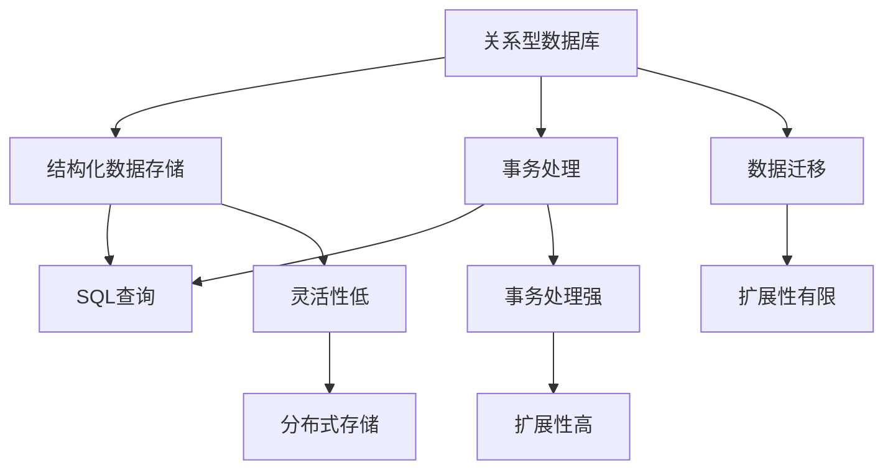

##### 4.1.2 数据库类型选择标准

选择合适的数据库类型取决于数据特点、业务需求和性能要求。以下是一些选择标准：

- **数据特点：**分析数据的结构化程度、一致性要求等。

- **业务需求：**考虑事务处理需求、查询性能等。

- **性能要求：**评估读写性能、扩展性等。

以下是数据库类型选择标准的伪代码示例：

```python
def 数据库类型选择标准(数据特点，业务需求，性能要求):
    # 分析数据特点
    analyze_data_characteristics()
    # 分析业务需求
    analyze_business_requirements()
    # 评估性能要求
    evaluate_performance_requirements()
    # 评估扩展性需求
    evaluate_scalability_requirements()
    # 选择合适的数据库类型
    select_appropriate_database_type()
```

##### 4.2 分库分表策略

分库分表是一种常用的数据库扩展策略，通过将数据拆分为多个数据库和表，提高系统的性能和可扩展性。以下将介绍分库分表的原理、实现方法和挑战。

##### 4.2.1 分库分表的原理

分库分表的基本原理是将数据按照一定的规则拆分为多个数据库和表。拆分后，每个数据库和表都可以独立处理请求，从而提高系统的性能和可扩展性。

以下是一个数学模型，表示分库分表的原理：

$$
\text{分库分表} = \frac{\text{数据库}}{\text{数据库表}}
$$

其中，$n$ 为分库分表的粒度。

##### 4.2.2 分库分表的实现方法

分库分表的实现方法包括以下步骤：

- **确定分库分表策略：**根据数据特点和业务需求，确定分库分表的规则和粒度。

- **实现数据库拆分：**将数据按照规则拆分为多个数据库。

- **实现表拆分：**将数据表按照规则拆分为多个表。

- **管理分布式数据库：**管理分布式数据库，确保数据的一致性和可用性。

- **实现分布式查询：**优化分布式查询，提高查询性能。

以下是分库分表实现方法的伪代码示例：

```python
def 分库分表实现方法():
    # 确定分库分表策略
    determine_sharding_strategy()
    # 实现数据库拆分
    implement_database_sharding()
    # 实现表拆分
    implement_table_sharding()
    # 管理分布式数据库
    manage_distributed_databases()
    # 实现分布式查询
    implement_distributed_queries()
```

##### 4.2.3 分库分表的挑战与优化

分库分表面临以下挑战：

- **数据一致性：**确保分布式数据库中的数据一致性是一个挑战。

- **查询性能：**优化分布式查询性能是一个挑战。

- **维护成本：**分布式数据库的管理和维护成本较高。

以下是分库分表挑战与优化策略的伪代码示例：

```python
def 分库分表挑战与优化():
    # 优化网络架构
    optimize_network_architecture()
    # 使用分布式数据库
    use_distributed_database()
    # 实现一致性协议
    implement_consistency_protocol()
    # 实现分布式查询优化
    implement_distributed_query_optimization()
    # 管理分布式事务
    manage_distributed_transactions()
    # 实现缓存机制
    implement_caching()
    # 使用延迟复制
    use_late_replication()
```

##### 4.3 分布式数据库

分布式数据库是将数据分布在多个节点上的数据库系统，具有高扩展性和高可用性。以下将介绍分布式数据库的概述、架构和选型策略。

##### 4.3.1 分布式数据库概述

分布式数据库具有以下特点：

- **多节点：**分布式数据库由多个节点组成，每个节点可以独立处理请求。

- **全局一致性：**分布式数据库通过一致性协议，确保全局数据一致性。

- **高扩展性：**通过增加节点，可以水平扩展数据库性能。

- **高可用性：**通过节点冗余和故障转移，提高系统的可用性。

以下是分布式数据库的一个简化的Mermaid流程图：

**Mermaid 流程图：**
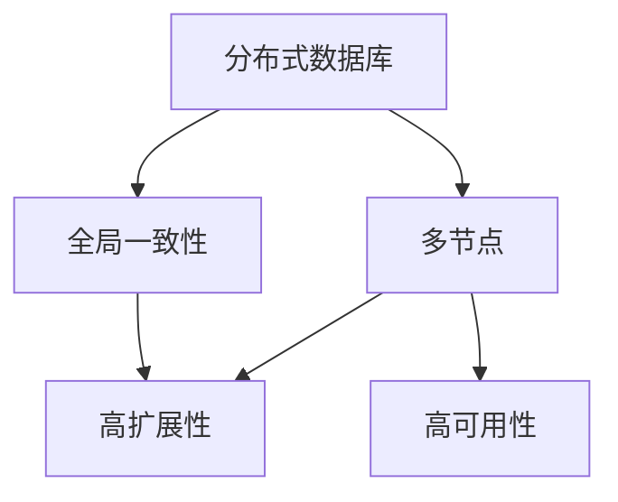

##### 4.3.2 分布式数据库架构

分布式数据库的架构包括以下几个关键组成部分：

- **数据分片：**将数据按照一定的规则拆分为多个分片，分布在不同的节点上。

- **数据复制：**通过复制机制，确保数据的高可用性和一致性。

- **负载均衡：**将请求均匀分配到不同的节点，提高系统性能。

- **分布式事务：**通过一致性协议，确保分布式事务的原子性和一致性。

- **故障容错：**通过故障检测和故障恢复机制，提高系统的可用性。

以下是分布式数据库架构的Mermaid流程图：

**Mermaid 流程图：**
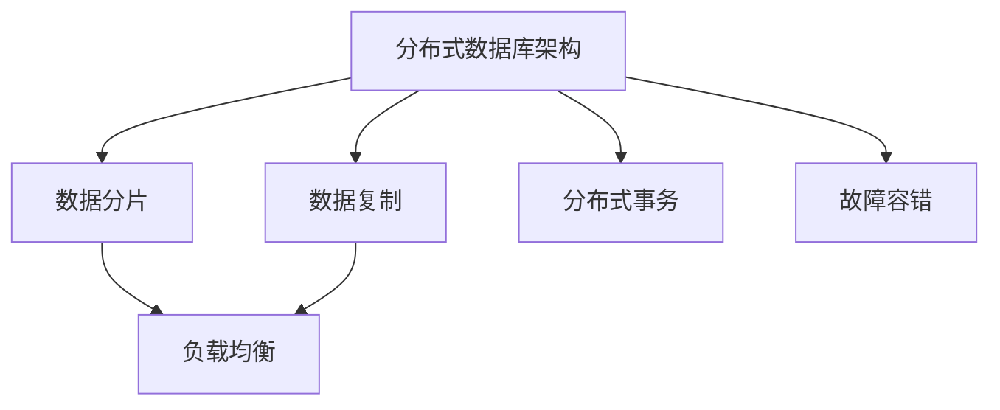

##### 4.3.3 分布式数据库选型策略

选择合适的分布式数据库取决于业务需求、性能要求和扩展性要求。以下是一些选型策略：

- **业务需求：**分析业务场景，确定数据类型、查询需求和事务处理要求。

- **性能要求：**评估系统的读写性能、延迟和吞吐量。

- **扩展性要求：**评估系统的扩展能力和弹性。

以下是分布式数据库选型策略的伪代码示例：

```python
def 分布式数据库选型策略(业务需求，性能要求，扩展性要求):
    # 分析业务需求
    analyze_business_requirements()
    # 分析性能要求
    analyze_performance_requirements()
    # 分析扩展性要求
    analyze_scalability_requirements()
    # 评估常见分布式数据库
    evaluate_common_distributed_databases()
    # 选择合适的分布式数据库
    select_appropriate_distributed_database()
```

#### 第5章：容错性核心概念

在分布式系统中，容错性是确保系统稳定性和业务连续性的关键因素。本章节将深入探讨容错性的核心概念，包括其定义、重要性以及关键机制。

##### 5.1 容错性定义

容错性（Fault Tolerance）是指系统能够在面临故障时，维持正常运行的能力。它涉及以下几个方面：

- **故障容忍：**系统能够容忍一定数量的故障，而不影响整体运行。

- **可用性：**系统在正常运行状态下的时间占比。高可用性通常以“九个九”（99.9% 至 99.99%）衡量。

- **恢复：**系统在发生故障后，能够自动恢复或手动修复，以确保业务连续性。

以下是一个简化的数学模型，用于表示容错性：

$$
\text{容错性} = \frac{\text{系统可靠性}}{\text{系统可用性}}
$$

##### 5.1.1 容错性与可用性的关系

可用性是衡量系统容错性的关键指标。高可用性意味着系统在面临故障时，能够快速恢复并保持正常运行。以下是一个Mermaid流程图，展示了容错性与可用性的关系：

**Mermaid 流程图：**
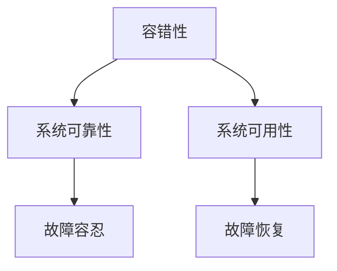

- **系统可靠性：**指系统在正常运行状态下的稳定程度。高可靠性的系统在面对故障时，能够更快地恢复。

- **系统可用性：**指系统可供使用的时长百分比。一个高可用性的系统可以在发生故障时，迅速切换到备用组件，维持业务运行。

##### 5.1.2 容错性的重要性

容错性对于确保业务连续性和用户满意度至关重要。以下是一些重要原因：

- **业务连续性：**确保关键业务在面临故障时能够持续运行，减少业务中断。

- **用户满意度：**保持系统的高性能和可靠性，提升用户体验。

- **风险降低：**通过容错机制，降低系统故障导致的业务损失和用户投诉。

以下是一个Mermaid流程图，展示了容错性的重要性：

**Mermaid 流程图：**
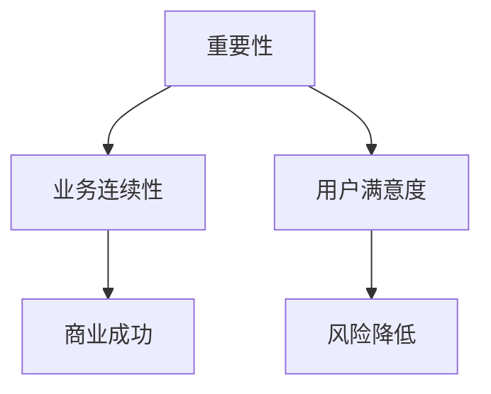

##### 5.2 容错机制

为了实现高容错性，系统需要采用一系列容错机制。以下是一些关键的容错机制：

- **备份与恢复：**通过定期备份和快速恢复，确保数据的安全性和系统的可用性。

- **故障转移与故障切换：**在主组件发生故障时，自动切换到备用组件，确保业务连续性。

- **冗余计算：**通过在多个节点上部署相同的功能，确保在部分节点故障时，系统能够继续运行。

- **故障检测：**监控系统运行状态，及时发现并处理故障。

- **故障恢复：**在故障发生后，自动或手动恢复系统功能。

以下是一个Mermaid流程图，展示了关键容错机制：

**Mermaid 流程图：**
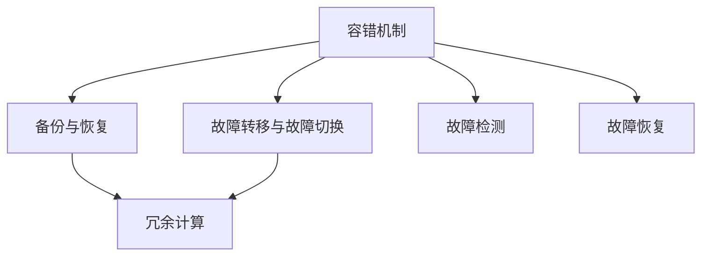

##### 5.2.1 备份与恢复

备份与恢复是确保数据完整性和系统可用性的关键机制。以下是一个数学模型，用于表示备份与恢复：

$$
\text{备份与恢复} = \text{数据备份} + \text{数据恢复}
$$

**数据备份：**定期将数据复制到安全存储位置，以防止数据丢失。备份策略包括：

- **全备份：**备份所有数据。

- **增量备份：**仅备份自上次备份后更改的数据。

- **差异备份：**备份自上次全备份后更改的数据。

**数据恢复：**在数据丢失或系统故障时，从备份中恢复数据。恢复策略包括：

- **热备份：**系统运行时进行备份，不影响业务运行。

- **冷备份：**系统关闭后进行备份。

以下是一个伪代码示例，用于实现备份与恢复：

```python
def 备份与恢复():
    # 数据备份
    backup_data()
    # 数据恢复
    recover_data()
```

##### 5.2.2 故障转移与故障切换

故障转移与故障切换是在主组件发生故障时，将请求自动切换到备用组件的机制。以下是一个数学模型，用于表示故障转移与故障切换：

$$
\text{故障转移} = \text{故障检测} + \text{故障切换}
$$

**故障检测：**监控系统运行状态，及时发现故障。故障检测方法包括：

- **心跳检测：**定期发送心跳信号，检测组件是否正常运行。

- **健康检查：**定期执行检查，确保组件处于健康状态。

以下是一个伪代码示例，用于实现故障检测：

```python
def 故障检测():
    # 检测故障
    detect_fault()
    # 发送心跳信号
    send_heartbeats()
```

**故障切换：**在检测到故障后，自动将请求切换到备用组件。故障切换方法包括：

- **手动切换：**管理员手动将请求切换到备用组件。

- **自动切换：**系统自动将请求切换到备用组件。

以下是一个伪代码示例，用于实现故障切换：

```python
def 故障切换():
    # 检测故障
    detect_fault()
    # 切换至备用组件
    switch_to_backup_component()
```

##### 5.2.3 冗余计算

冗余计算是通过在多个节点上部署相同的功能，确保在部分节点故障时，系统能够继续运行。以下是一个数学模型，用于表示冗余计算：

$$
\text{冗余计算} = \text{冗余节点} + \text{故障检测} + \text{故障恢复}
$$

**冗余节点：**在系统中部署多个相同功能的节点，以提高系统的容错能力。

**故障检测：**定期检测冗余节点的运行状态，确保它们处于健康状态。

**故障恢复：**在检测到故障节点后，将请求切换到其他健康节点，并尝试恢复故障节点。

以下是一个伪代码示例，用于实现冗余计算：

```python
def 冗余计算():
    # 部署冗余节点
    deploy_redundant_nodes()
    # 检测故障节点
    detect_faulty_nodes()
    # 切换至备用节点
    switch_to_backup_nodes()
    # 恢复故障节点
    recover_faulty_nodes()
```

##### 5.2.4 故障检测

故障检测是确保系统稳定运行的关键机制。以下是一个数学模型，用于表示故障检测：

$$
\text{故障检测} = \text{健康检查} + \text{异常监控}
$$

**健康检查：**定期执行系统健康检查，确保组件处于正常状态。

**异常监控：**监控系统运行状态，及时发现异常情况。

以下是一个伪代码示例，用于实现故障检测：

```python
def 故障检测():
    # 健康检查
    health_check()
    # 异常监控
    exception_monitoring()
    # 故障报警
    fault_alert()
```

##### 5.2.5 故障恢复

故障恢复是在故障发生后，确保系统能够恢复正常运行的过程。以下是一个数学模型，用于表示故障恢复：

$$
\text{故障恢复} = \text{自动恢复} + \text{手动恢复}
$$

**自动恢复：**系统在检测到故障后，自动执行恢复操作。

**手动恢复：**管理员在检测到故障后，手动执行恢复操作。

以下是一个伪代码示例，用于实现故障恢复：

```python
def 故障恢复():
    # 自动恢复
    auto_recover()
    # 手动恢复
    manual_recover()
    # 恢复后健康检查
    health_check_after_recovery()
```

##### 5.2.6 容错计算模型

容错计算模型是确保系统在面对故障时，能够保持正常运行的综合策略。以下是一个数学模型，用于表示容错计算模型：

$$
\text{容错计算模型} = \text{冗余计算} + \text{故障检测} + \text{故障恢复}
$$

**冗余计算：**确保系统在部分节点故障时，仍然能够正常运行。

**故障检测：**定期检测系统运行状态，及时发现故障。

**故障恢复：**在检测到故障后，确保系统能够快速恢复正常运行。

以下是一个伪代码示例，用于实现容错计算模型：

```python
def 容错计算模型():
    # 实现冗余计算
    implement_redundant_computing()
    # 实现故障检测
    implement_fault_detection()
    # 实现故障恢复
    implement_fault_recovery()
```

#### 第6章：系统故障管理

在分布式系统中，故障管理是确保系统高可用性和业务连续性的关键环节。本章将详细介绍故障管理的过程，包括故障检测、故障恢复和系统稳定性优化。

##### 6.1 故障检测

故障检测是系统故障管理的基础，目的是及时发现异常情况。以下将讨论故障检测的机制、算法和工具。

##### 6.1.1 故障检测机制

故障检测机制包括以下几个方面：

- **健康检查：**定期执行系统健康检查，确保组件处于正常状态。

- **异常监控：**监控系统运行状态，及时发现异常情况。

- **阈值设置：**设置关键性能指标（KPI）的阈值，当指标超过阈值时触发警报。

以下是一个简化的数学模型，用于表示故障检测机制：

$$
\text{故障检测机制} = \text{健康检查} + \text{异常监控} + \text{阈值设置}
$$

**健康检查：**定期执行健康检查，确保系统组件正常运行。健康检查可以包括以下内容：

- **服务状态检查：**检查服务是否启动并运行。

- **资源利用率检查：**检查CPU、内存、磁盘等资源利用率。

- **网络连接检查：**检查网络连接是否正常。

以下是一个伪代码示例，用于实现健康检查：

```python
def 健康检查():
    # 检查服务状态
    check_service_status()
    # 检查资源利用率
    check_resource_utilization()
    # 检查网络连接
    check_network_connection()
```

**异常监控：**监控系统运行状态，及时发现异常情况。异常监控可以通过以下方法实现：

- **日志分析：**分析系统日志，识别异常行为。

- **性能监控：**监控系统性能指标，识别性能瓶颈。

- **事件监听：**监听系统事件，识别异常事件。

以下是一个伪代码示例，用于实现异常监控：

```python
def 异常监控():
    # 分析系统日志
    analyze_system_logs()
    # 监控性能指标
    monitor_performance_metrics()
    # 监听系统事件
    listen_to_system_events()
```

**阈值设置：**设置关键性能指标的阈值，当指标超过阈值时触发警报。阈值设置可以基于历史数据和业务需求。以下是一个伪代码示例，用于实现阈值设置：

```python
def 阈值设置():
    # 设置CPU利用率阈值
    set_cpu_utilization_threshold()
    # 设置内存利用率阈值
    set_memory_utilization_threshold()
    # 设置磁盘利用率阈值
    set_disk_utilization_threshold()
    # 设置网络延迟阈值
    set_network_delay_threshold()
```

##### 6.1.2 故障检测算法

故障检测算法用于检测系统中的故障。以下是一些常见的故障检测算法：

- **基于阈值的检测算法：**当系统指标超过阈值时，认为系统出现故障。

- **基于模型检测算法：**使用统计模型或机器学习模型，对系统运行状态进行预测，当预测值与实际值差异较大时，认为系统出现故障。

- **基于事件关联检测算法：**通过分析多个事件之间的关联性，识别系统故障。

以下是一个伪代码示例，用于实现基于阈值的故障检测算法：

```python
def 基于阈值的故障检测算法():
    # 设置阈值
    set_thresholds()
    # 检测故障
    detect_fault()
    # 当指标超过阈值时，触发警报
    if metric > threshold:
        trigger_alert()
```

##### 6.1.3 故障检测工具

故障检测工具用于自动化执行故障检测过程。以下是一些常见的故障检测工具：

- **Prometheus：**开源监控解决方案，用于收集和存储时间序列数据，提供告警和可视化功能。

- **Zabbix：**开源监控解决方案，提供故障检测、性能监控和可视化功能。

- **Grafana：**开源可视化工具，用于监控数据可视化。

以下是一个伪代码示例，用于实现故障检测工具的使用：

```python
def 故障检测工具():
    # 使用Prometheus监控
    use_Prometheus_monitoring()
    # 使用Zabbix监控
    use_Zabbix_monitoring()
    # 使用Grafana可视化监控数据
    use_Grafana_for_visualization()
```

##### 6.2 故障恢复

故障恢复是在检测到故障后，确保系统尽快恢复正常运行的过程。以下将讨论故障恢复的策略、算法和性能评估。

##### 6.2.1 故障恢复策略

故障恢复策略可以分为以下几类：

- **自动恢复策略：**系统在检测到故障后，自动执行恢复操作。

- **手动恢复策略：**管理员在检测到故障后，手动执行恢复操作。

- **混合恢复策略：**结合自动和手动恢复策略，实现更灵活的故障恢复。

以下是一个简化的数学模型，用于表示故障恢复策略：

$$
\text{故障恢复策略} = \text{自动恢复} + \text{手动恢复}
$$

**自动恢复策略：**系统在检测到故障后，自动执行恢复操作。以下是一个伪代码示例，用于实现自动恢复策略：

```python
def 自动恢复策略():
    # 检测故障
    detect_fault()
    # 执行自动恢复
    auto_recover()
```

**手动恢复策略：**管理员在检测到故障后，手动执行恢复操作。以下是一个伪代码示例，用于实现手动恢复策略：

```python
def 手动恢复策略():
    # 检测故障
    detect_fault()
    # 手动恢复
    manual_recover()
```

**混合恢复策略：**结合自动和手动恢复策略，实现更灵活的故障恢复。以下是一个伪代码示例，用于实现混合恢复策略：

```python
def 混合恢复策略():
    # 检测故障
    detect_fault()
    # 尝试自动恢复
    try_auto_recover()
    # 如果自动恢复失败，手动恢复
    if not auto_recover_success():
        manual_recover()
```

##### 6.2.2 故障恢复算法

故障恢复算法用于在检测到故障后，选择合适的恢复方法。以下是一些常见的故障恢复算法：

- **备份与恢复算法：**通过备份和恢复数据，确保系统数据的一致性和完整性。

- **故障转移与故障切换算法：**在主组件发生故障时，将请求切换到备用组件。

- **冗余计算算法：**在多个节点上部署相同的功能，确保在部分节点故障时，系统能够继续运行。

以下是一个伪代码示例，用于实现备份与恢复算法：

```python
def 备份与恢复算法():
    # 执行数据备份
    backup_data()
    # 执行数据恢复
    recover_data()
```

##### 6.2.3 故障恢复性能评估

故障恢复性能评估用于评估故障恢复策略和算法的有效性。以下是一些评估指标：

- **恢复时间：**故障发生后，系统恢复正常运行所需的时间。

- **恢复成功率：**故障恢复过程中，成功恢复的比例。

- **恢复成本：**故障恢复过程中，所需的资源和成本。

以下是一个数学模型，用于表示故障恢复性能评估：

$$
\text{恢复性能评估} = \text{恢复时间} + \text{恢复成功率} + \text{恢复成本}
$$

**恢复时间：**故障发生后，系统恢复正常运行所需的时间。以下是一个伪代码示例，用于计算恢复时间：

```python
def 计算恢复时间():
    # 记录故障发生时间
    record_fault_time()
    # 记录恢复完成时间
    record_recovery_time()
    # 计算恢复时间
    recovery_time = recovery_time - fault_time
    return recovery_time
```

**恢复成功率：**故障恢复过程中，成功恢复的比例。以下是一个伪代码示例，用于计算恢复成功率：

```python
def 计算恢复成功率():
    # 记录尝试恢复的次数
    record_recovery_attempts()
    # 记录成功恢复的次数
    record_successful_recoveries()
    # 计算恢复成功率
    recovery_success_rate = successful_recoveries / recovery_attempts
    return recovery_success_rate
```

**恢复成本：**故障恢复过程中，所需的资源和成本。以下是一个伪代码示例，用于计算恢复成本：

```python
def 计算恢复成本():
    # 记录恢复过程中使用的资源
    record_recovery_resources()
    # 计算恢复成本
    recovery_cost = sum(recovery_resources)
    return recovery_cost
```

##### 6.3 故障恢复后的系统稳定性

故障恢复后，系统稳定性是确保系统长期稳定运行的关键。以下将讨论故障恢复对系统性能的影响以及系统稳定性优化。

##### 6.3.1 故障恢复对系统性能的影响

故障恢复对系统性能有一定影响，主要表现在以下几个方面：

- **恢复时间：**故障发生后，系统需要一定时间才能恢复正常运行，这可能导致性能下降。

- **负载转移：**在故障恢复过程中，系统可能会将部分负载转移到备用组件，这可能导致性能波动。

- **资源竞争：**故障恢复后，系统中的资源分配可能发生变化，导致资源竞争。

以下是一个数学模型，用于表示故障恢复对系统性能的影响：

$$
\text{性能影响} = \text{恢复时间} \times \text{负载率}
$$

**恢复时间：**故障发生后，系统恢复正常运行所需的时间。以下是一个伪代码示例，用于计算恢复时间：

```python
def 计算恢复时间():
    # 记录故障发生时间
    record_fault_time()
    # 记录恢复完成时间
    record_recovery_time()
    # 计算恢复时间
    recovery_time = recovery_time - fault_time
    return recovery_time
```

**负载率：**系统在故障恢复过程中的负载率。以下是一个伪代码示例，用于计算负载率：

```python
def 计算负载率():
    # 记录系统负载
    record_system_load()
    # 计算负载率
    load_rate = system_load / max_system_load
    return load_rate
```

##### 6.3.2 系统稳定性优化

为了提高系统稳定性，可以采取以下优化措施：

- **优化系统架构：**设计合理的系统架构，提高系统的可靠性和容错能力。

- **实施负载均衡：**通过负载均衡，确保系统在故障恢复期间能够合理分配负载。

- **增强故障检测能力：**提高故障检测的准确性，尽早发现故障。

- **实现冗余计算：**在关键组件上部署冗余节点，提高系统的容错能力。

以下是一个伪代码示例，用于实现系统稳定性优化：

```python
def 系统稳定性优化():
    # 优化系统架构
    optimize_system_architecture()
    # 实施负载均衡
    implement_load_balancing()
    # 增强故障检测能力
    enhance_fault_detection_ability()
    # 实现冗余计算
    implement_redundant_computing()
```

#### 第7章：应对分布式故障

在分布式系统中，故障是不可避免的。分布式故障处理包括故障检测、故障恢复和故障恢复策略。本章将详细讨论分布式故障的特点、分布式一致性以及分布式故障处理。

##### 7.1 分布式系统的特点

分布式系统具有以下特点：

- **高可用性：**通过冗余设计和故障转移，提高系统的可用性。

- **可扩展性：**通过水平扩展，增加节点数量，提高系统的处理能力。

- **容错性：**系统能够在部分节点故障时，保持正常运行。

- **分布式一致性：**分布式系统中的数据一致性是一个挑战。

以下是一个Mermaid流程图，展示了分布式系统的特点：

**Mermaid 流程图：**
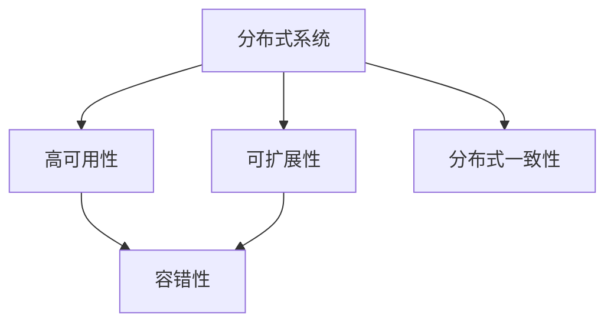

##### 7.1.1 分布式系统的优势

分布式系统的优势包括：

- **负载均衡：**通过分布式系统，可以平均分配负载，提高系统的性能。

- **故障容错：**通过冗余设计和故障转移，提高系统的可用性。

- **动态扩展：**可以根据需求动态增加节点，提高系统的处理能力。

以下是一个Mermaid流程图，展示了分布式系统的优势：

**Mermaid 流程图：**
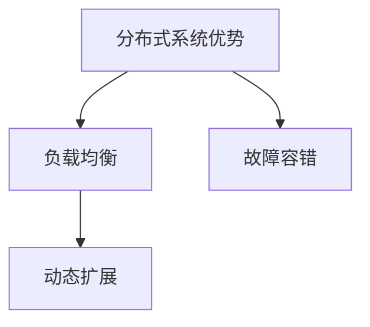

##### 7.1.2 分布式系统的挑战

分布式系统面临的挑战包括：

- **数据一致性：**在分布式环境中，数据一致性是一个挑战。

- **网络延迟：**网络延迟可能导致系统性能下降。

- **分布式锁管理：**分布式锁管理是确保数据一致性的关键。

以下是一个Mermaid流程图，展示了分布式系统面临的挑战：

**Mermaid 流程图：**
```mermaid
graph TD
A[分布式系统挑战] --> B[数据一致性]
A --> C[网络延迟]
B --> D[分布式锁管理]
```

##### 7.2 分布式一致性

分布式一致性是分布式系统中的一个关键问题。分布式一致性指的是在分布式系统中，如何确保不同节点上的数据一致性。以下将介绍分布式一致性的核心概念、一致模型和一致性算法。

##### 7.2.1 分布式一致性定义

分布式一致性是指在分布式系统中，如何保证不同节点上的数据状态一致。以下是一个简化的数学模型，用于表示分布式一致性：

$$
\text{分布式一致性} = \text{多节点一致性} + \text{数据一致性}
$$

**多节点一致性：**在分布式系统中，多个节点同时更新数据，如何保证这些节点的数据状态一致。

**数据一致性：**在分布式系统中，数据在不同节点之间传输和更新时，如何保持数据的一致性。

##### 7.2.2 分布式一致性模型

分布式一致性模型分为以下几种：

- **强一致性：**在分布式系统中，所有节点同时看到相同的数据状态。强一致性保证数据的一致性，但可能牺牲性能。

- **最终一致性：**在分布式系统中，所有节点最终会看到相同的数据状态，但可能存在一定的时间延迟。最终一致性在性能和一致性之间取得平衡。

以下是一个Mermaid流程图，展示了分布式一致性模型：

**Mermaid 流程图：**
```mermaid
graph TD
A[强一致性] --> B[最终一致性]
A --> C[一致性模型]
B --> C
```

##### 7.2.3 分布式一致性算法

分布式一致性算法是确保分布式系统中数据一致性的关键。以下是一些常见的分布式一致性算法：

- **Paxos算法：**Paxos算法是一种分布式一致性算法，用于在多个节点之间达成一致。

- **Raft算法：**Raft算法是一种简化版的Paxos算法，易于理解和实现。

- **Gossip算法：**Gossip算法是一种基于消息传递的分布式一致性算法，适用于大规模分布式系统。

以下是一个Mermaid流程图，展示了分布式一致性算法：

**Mermaid 流程图：**
```mermaid
graph TD
A[Paxos算法] --> B[Raft算法]
A --> C[一致性算法]
B --> C
A --> D[Gossip算法]
```

##### 7.2.4 分布式一致性挑战与解决方案

分布式一致性面临以下挑战：

- **网络延迟：**网络延迟可能导致数据不一致。

- **故障处理：**节点故障可能导致数据不一致。

- **性能优化：**分布式一致性算法可能影响系统性能。

以下是一个Mermaid流程图，展示了分布式一致性挑战与解决方案：

**Mermaid 流程图：**
```mermaid
graph TD
A[分布式一致性挑战] --> B[网络延迟]
A --> C[故障处理]
B --> D[性能优化]
```

为了解决这些挑战，可以采取以下策略：

- **分布式缓存：**使用分布式缓存，提高系统性能。

- **最终一致性模型：**采用最终一致性模型，降低对一致性的要求。

- **分布式事务管理：**使用分布式事务管理，确保数据的一致性。

以下是一个伪代码示例，用于实现分布式一致性解决方案：

```python
def 分布式一致性解决方案():
    # 使用分布式缓存
    use_distributed_cache()
    # 采用最终一致性模型
    use_final_consistency_model()
    # 实现分布式事务管理
    implement_distributed_transactions()
    # 管理分布式锁
    manage_distributed_locks()
```

##### 7.3 分布式故障处理

分布式故障处理包括故障检测、故障恢复和故障恢复策略。以下将详细讨论这些内容。

##### 7.3.1 分布式故障检测

分布式故障检测是指系统如何检测到节点故障。以下是一些常见的分布式故障检测方法：

- **心跳检测：**通过发送心跳信号，定期检测节点的运行状态。

- **健康检查：**定期执行健康检查，确保节点的正常运行。

- **异常监控：**监控系统的异常行为，及时发现故障。

以下是一个Mermaid流程图，展示了分布式故障检测：

**Mermaid 流程图：**
```mermaid
graph TD
A[分布式故障检测] --> B[心跳检测]
A --> C[健康检查]
B --> D[异常监控]
C --> D
```

##### 7.3.2 分布式故障恢复

分布式故障

