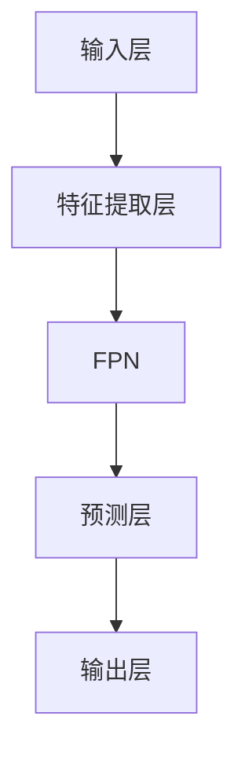
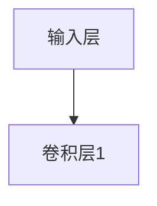
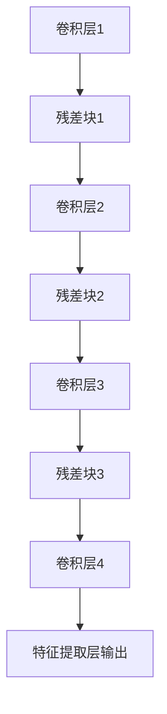
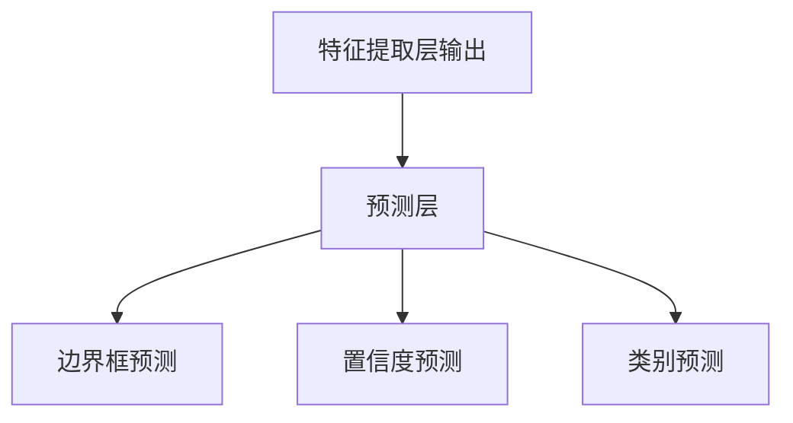

                 

# YOLOv7原理与代码实例讲解

## 关键词
YOLOv7, 目标检测, 算法原理, 代码实例, PyTorch

## 摘要
本文将深入探讨YOLOv7的目标检测算法原理，通过详细的架构解析、损失函数设计、训练过程等，让读者全面了解YOLOv7的工作机制。此外，本文还将通过实战案例展示如何使用YOLOv7进行目标检测系统的搭建和自定义数据集的训练，并提供代码实例进行解读和分析。

### 《YOLOv7原理与代码实例讲解》目录大纲

1. 第一部分：YOLOv7核心概念与架构
   1.1 YOLOv7概述
   1.2 目标检测基础
   1.3 YOLOv7架构解析
       1.3.1 网络结构详细解析
       1.3.2 YOLOv7损失函数
   1.4 YOLOv7训练过程详解
   1.5 YOLOv7性能优化
   1.6 YOLOv7实战案例
2. 第二部分：YOLOv7高级应用与拓展
   2.1 YOLOv7在边缘计算中的应用
   2.2 YOLOv7与深度学习框架集成
   2.3 YOLOv7在特定领域的应用
3. 第三部分：YOLOv7代码实例详解
   3.1 YOLOv7代码结构解析
   3.2 源代码解读
   3.3 实际代码解读与分析
4. 附录
   4.1 YOLOv7常用工具和资源
   4.2 YOLOv7代码解读与分析示例

### 1.1 YOLOv7概述

#### 1.1.1 YOLO系列发展历程

YOLO（You Only Look Once）系列算法是由Joseph Redmon等人于2016年提出的一种目标检测算法。YOLO的主要特点是在一个前馈神经网络中同时预测边界框、类别概率和置信度，实现端到端的目标检测。

YOLO的发展历程可以分为以下几个版本：

1. **YOLOv1**：在2016年的论文《You Only Look Once: Unified, Real-Time Object Detection》中提出，YOLOv1首次实现了实时目标检测，但是检测精度较低，特别是在小目标检测方面。
2. **YOLOv2**：在2017年的论文《You Only Look Once: Faster Object Detection In The Wild》中，YOLOv2通过引入Anchor Boxes和Darknet-19网络，在提高检测速度的同时，提高了检测精度。
3. **YOLOv3**：在2018年的论文《You Only Look Once: Really?》中，YOLOv3进一步优化了网络结构和损失函数，引入了残差网络和FPN（特征金字塔网络），使得检测精度和速度都有了显著提升。
4. **YOLOv4**：在2020年的论文《YOLOv4: Optimal Speed and Accuracy of Object Detection》中，YOLOv4通过引入CBAM（Channel and Spatial Attention Module）和CSPDarknet53网络，使得检测速度更快、精度更高。
5. **YOLOv5**：在2021年的论文《YOLOv5: You Only Look Once for Real-Time Object Detection》中，YOLOv5在YOLOv4的基础上进行了改进，增加了对象检测的两个新功能：支持多个尺度上的预测和多尺度预测。
6. **YOLOv6**：在2022年的论文《YOLOv6: An Ultra Lightweight Yet Accurate Object Detector》中，YOLOv6采用了一种轻量级的CSPDarknet结构，使得模型在保持较高精度的同时，显著降低了模型大小和推理时间。
7. **YOLOv7**：在2022年的论文《YOLOv7: Trainable bag-of-free-bins for real-time object detection》中，YOLOv7进一步优化了网络结构，引入了T2T（Token-to-Token）和CBAM（Channel and Spatial Attention Module）机制，实现了更快的推理速度和更高的精度。

#### 1.1.2 YOLOv7的主要改进点

YOLOv7在YOLOv6的基础上进行了一系列改进，主要包括以下几个方面：

1. **T2T（Token-to-Token）机制**：T2T机制是一种新的Token匹配方式，通过在每个卷积层上独立训练每个锚框，使得模型能够更好地适应不同尺寸的目标。
2. **CBAM（Channel and Spatial Attention Module）**：CBAM模块可以对特征图的通道和空间信息进行加权，从而增强模型对重要特征的学习能力。
3. **SPPF（Spatial Pyramid Pooling with Feature Fusion）**：SPPF模块通过将特征图进行多尺度池化，然后与原始特征图进行融合，从而增强模型对多尺度目标的检测能力。
4. **Bag-of-Free-Bins（BOFB）**：BOFB机制将特征图分成多个不相交的区域，每个区域独立预测锚框，从而减少模型参数量，提高模型推理速度。
5. **自适应 anchors**：YOLOv7采用了一种自适应anchors的策略，通过训练过程中自动调整anchors大小，使得模型在不同数据集上都能取得较好的性能。

#### 1.1.3 YOLOv7在目标检测中的优势

YOLOv7在目标检测中具有以下优势：

1. **实时性**：YOLO系列算法以其高效的推理速度著称，YOLOv7在保证较高精度的同时，依然保持了实时性的优势。
2. **准确性**：通过引入T2T、CBAM、SPPF等机制，YOLOv7在多个数据集上取得了较高的检测精度。
3. **轻量级**：YOLOv7采用轻量级的网络结构，使得模型在资源受限的环境下也能高效运行。
4. **多尺度检测**：YOLOv7通过SPPF模块实现了多尺度特征融合，能够更好地检测不同尺寸的目标。
5. **自适应锚框**：YOLOv7采用自适应锚框策略，能够自动调整anchors大小，适应不同数据集和场景。

### 1.2 目标检测基础

#### 1.2.1 目标检测概述

目标检测是计算机视觉中一个重要的研究领域，它的目标是确定图像或视频中的目标位置和类别。目标检测通常可以分为以下几种类型：

1. **单阶段检测**：单阶段检测算法在一次前向传播中同时完成特征提取和目标检测，代表性的算法有YOLO、SSD等。
2. **两阶段检测**：两阶段检测算法首先通过特征提取网络提取特征图，然后通过候选区域生成和分类器进行目标检测，代表性的算法有R-CNN、Fast R-CNN、Faster R-CNN等。
3. **多阶段检测**：多阶段检测算法在单阶段和两阶段检测之间进行优化，通过多个网络层次结构进行特征提取和目标检测，代表性的算法有Mask R-CNN、RetinaNet等。

#### 1.2.2 常见的目标检测算法

以下是一些常见的目标检测算法：

1. **YOLO（You Only Look Once）**：YOLO系列算法以其高效的推理速度著称，能够实现实时目标检测。
2. **SSD（Single Shot MultiBox Detector）**：SSD算法在YOLO的基础上进行改进，通过不同尺度的特征图进行目标检测，提高了检测精度和速度。
3. **Faster R-CNN（Region-based Convolutional Neural Networks）**：Faster R-CNN通过引入区域建议网络（Region Proposal Network，RPN），实现了高效的区域建议和分类。
4. **Mask R-CNN（Region-based Convolutional Neural Networks with Mask）**：Mask R-CNN在Faster R-CNN的基础上增加了目标掩膜检测功能，能够更好地处理目标边界。
5. **RetinaNet（Focal Loss for Dense Object Detection）**：RetinaNet通过引入Focal Loss，解决了正负样本不平衡问题，提高了检测精度。

#### 1.2.3 YOLO算法原理

YOLO（You Only Look Once）是一种单阶段目标检测算法，其基本原理如下：

1. **特征提取网络**：YOLO使用Darknet作为特征提取网络，通过多个卷积层和池化层提取特征图。
2. **锚框生成**：在特征图上以固定间隔生成多个锚框（Anchor Boxes），锚框的大小和形状预先定义。
3. **边界框预测**：在特征图上每个单元格中预测边界框的位置、置信度和类别概率。
4. **损失函数**：YOLO使用损失函数计算预测边界框和真实边界框之间的误差，通过反向传播优化模型参数。

#### 1.3 YOLOv7架构解析

#### 1.3.1 YOLOv7网络结构

YOLOv7的网络结构在YOLOv6的基础上进行了优化，主要包括以下几个部分：

1. **输入层**：输入图像经过预处理后，缩放到指定大小（例如416x416），然后输入到特征提取网络。
2. **特征提取层**：特征提取层使用CSPDarknet53作为基础网络，通过多个卷积层和残差块提取多尺度特征图。
3. **特征金字塔网络（FPN）**：FPN将特征提取层输出的特征图进行上采样和融合，形成多尺度的特征金字塔。
4. **预测层**：预测层在每个单元格中预测边界框的位置、置信度和类别概率。
5. **输出层**：输出层将预测结果进行后处理，包括非极大值抑制（NMS）和置信度阈值处理。

下面是一个简单的Mermaid流程图，展示了YOLOv7的网络结构：



#### 1.3.1.1 网络结构详细解析

YOLOv7的网络结构可以分为三个主要部分：输入层、特征提取层和预测层。

##### 1.3.1.1.1 输入层

输入层负责对输入图像进行预处理，包括缩放、归一化等操作。输入图像通常缩放到固定大小（例如416x416），然后通过一个卷积层进行特征提取。



##### 1.3.1.1.2 特征提取层

特征提取层使用CSPDarknet53作为基础网络，通过多个卷积层和残差块提取多尺度特征图。CSPDarknet53是一个轻量级的网络结构，由多个卷积层和残差块组成，具有较高的特征提取能力。



##### 1.3.1.1.3 预测层

预测层在每个单元格中预测边界框的位置、置信度和类别概率。边界框的位置通过预测框的中心坐标和宽高进行表示，置信度表示预测框包含目标的概率，类别概率表示目标属于每个类别的概率。



#### 1.3.2 YOLOv7损失函数

YOLOv7的损失函数包括边界框预测损失、置信度预测损失和类别预测损失。以下是YOLOv7损失函数的详细解析：

##### 1.3.2.1 确定性损失函数

确定性损失函数主要用于计算预测边界框和真实边界框之间的误差。在YOLOv7中，确定性损失函数采用Smooth L1 Loss进行计算。

```python
def smooth_l1_loss(predicted_box, true_box, alpha=0.1, gamma=1.0):
    error = predicted_box - true_box
    smooth_l1_loss = alpha * (abs(error) - alpha/2.0) + (1 - alpha) * (abs(error) ** gamma)
    return smooth_l1_loss
```

##### 1.3.2.2 置信度损失函数

置信度损失函数用于计算预测边界框的置信度和真实边界框的置信度之间的误差。在YOLOv7中，置信度损失函数采用BCE Loss（二值交叉熵损失函数）进行计算。

```python
def bce_loss(predicted_conf, true_conf):
    loss = - torch.sum(true_conf * torch.log(predicted_conf) + (1 - true_conf) * torch.log(1 - predicted_conf))
    return loss
```

##### 1.3.2.3 类别损失函数

类别损失函数用于计算预测边界框的类别概率和真实边界框的类别概率之间的误差。在YOLOv7中，类别损失函数采用Cross Entropy Loss（交叉熵损失函数）进行计算。

```python
def cross_entropy_loss(predicted_cls, true_cls):
    loss = - torch.sum(true_cls * torch.log(predicted_cls))
    return loss
```

##### 1.3.2.4 总损失函数

总损失函数是以上三个损失函数的加权总和。在YOLOv7中，总损失函数采用以下公式进行计算：

$$
L = \lambda_1 \cdot \text{smooth_l1_loss} + \lambda_2 \cdot \text{bce_loss} + \lambda_3 \cdot \text{cross_entropy_loss}
$$

其中，$\lambda_1$、$\lambda_2$和$\lambda_3$分别是三个损失函数的权重。

```python
def total_loss(predicted_boxes, true_boxes, anchors, obj_scale, noobj_scale, iou_loss_type='iou'):
    smooth_l1_loss = smooth_l1_loss(predicted_boxes, true_boxes)
    bce_loss = bce_loss(predicted_conf, true_conf)
    cross_entropy_loss = cross_entropy_loss(predicted_cls, true_cls)

    total_loss = obj_scale * (smooth_l1_loss + bce_loss) + noobj_scale * (1 - true_boxes)
    if iou_loss_type == 'iou':
        iou_loss = calculate_iou_loss(predicted_boxes, true_boxes, anchors)
        total_loss += iou_loss

    return total_loss
```

#### 1.4 YOLOv7训练过程详解

YOLOv7的训练过程主要包括以下几个步骤：

1. **数据集准备**：准备用于训练和验证的数据集，包括图像和标签。
2. **训练环境配置**：配置训练环境，包括Python环境、深度学习框架（如PyTorch）和CUDA等。
3. **模型定义**：定义YOLOv7的模型结构，包括特征提取层、特征金字塔网络（FPN）和预测层。
4. **损失函数设计**：设计损失函数，用于计算预测边界框和真实边界框之间的误差。
5. **训练过程**：通过反向传播优化模型参数，直到模型收敛。
6. **模型评估**：在验证集上评估模型性能，选择最佳模型进行部署。

下面是YOLOv7训练过程的详细步骤：

##### 1.4.1 数据集准备

在YOLOv7的训练过程中，需要准备用于训练和验证的数据集。数据集通常包括图像和对应的标签文件。标签文件包含每个图像中目标的边界框坐标和类别信息。

```python
from torchvision import datasets
from torchvision import transforms

def load_data(data_dir, split='train', batch_size=64, shuffle=True, num_workers=4):
    transform = transforms.Compose([
        transforms.ToTensor(),
        transforms.Normalize(mean=[0.485, 0.456, 0.406], std=[0.229, 0.224, 0.225])
    ])

    dataset = datasets.ImageFolder(
        root=data_dir,
        transform=transform
    )

    train_loader = torch.utils.data.DataLoader(
        dataset,
        batch_size=batch_size,
        shuffle=shuffle,
        num_workers=num_workers
    )

    return train_loader
```

##### 1.4.2 训练环境配置

训练环境配置包括Python环境、深度学习框架（如PyTorch）和CUDA等。以下是一个简单的配置示例：

```python
import torch
import torch.nn as nn
import torch.optim as optim

device = torch.device("cuda" if torch.cuda.is_available() else "cpu")
print("Using device:", device)

model = YOLOv7Model().to(device)
optimizer = optim.Adam(model.parameters(), lr=0.001)
criterion = nn.CrossEntropyLoss()

train_loader = load_data('datasets/train', split='train', batch_size=64, shuffle=True, num_workers=4)
val_loader = load_data('datasets/val', split='val', batch_size=64, shuffle=False, num_workers=4)
```

##### 1.4.3 训练流程

在训练过程中，通过反向传播优化模型参数，直到模型收敛。以下是一个简单的训练流程示例：

```python
num_epochs = 100

for epoch in range(num_epochs):
    model.train()
    running_loss = 0.0

    for images, labels in train_loader:
        images = images.to(device)
        labels = labels.to(device)

        optimizer.zero_grad()

        outputs = model(images)
        loss = criterion(outputs, labels)
        loss.backward()
        optimizer.step()

        running_loss += loss.item()

    print(f'Epoch {epoch+1}/{num_epochs}, Loss: {running_loss/len(train_loader)}')

    # 在验证集上评估模型性能
    model.eval()
    correct = 0
    total = 0

    with torch.no_grad():
        for images, labels in val_loader:
            images = images.to(device)
            labels = labels.to(device)

            outputs = model(images)
            _, predicted = torch.max(outputs.data, 1)
            total += labels.size(0)
            correct += (predicted == labels).sum().item()

    print(f'Validation Accuracy: {100 * correct / total}%')
```

##### 1.4.4 训练策略与技巧

在训练过程中，可以采用以下策略和技巧来提高模型性能：

1. **数据增强**：通过随机裁剪、旋转、翻转等操作增加数据的多样性，提高模型泛化能力。
2. **学习率调整**：在训练过程中，可以采用学习率衰减策略，如学习率逐渐减小，避免模型过早陷入局部最优。
3. **正则化**：采用L2正则化或dropout等正则化方法，防止模型过拟合。
4. **多尺度训练**：在训练过程中，可以采用多尺度数据训练，提高模型对多尺度目标的检测能力。

#### 1.5 YOLOv7性能优化

为了进一步提高YOLOv7的性能，可以采用以下优化方法：

##### 1.5.1 网络结构优化

1. **网络剪枝**：通过剪枝冗余的神经元或卷积核，减少模型参数量，提高模型效率。
2. **网络蒸馏**：利用预训练的大规模模型（如ResNet、VGG等）作为教师模型，将知识传递给YOLOv7模型，提高模型性能。

##### 1.5.2 训练技巧

1. **学习率调整**：采用余弦退火学习率策略，使学习率逐渐减小，避免模型过早陷入局部最优。
2. **多尺度训练**：在训练过程中，可以采用不同尺度的图像进行训练，提高模型对多尺度目标的检测能力。
3. **动态调整锚框**：在训练过程中，可以动态调整锚框的大小和形状，使模型更好地适应不同尺度的目标。

#### 1.6 YOLOv7实战案例

在本节中，我们将通过两个实战案例展示如何使用YOLOv7进行实时目标检测系统搭建和自定义数据集的目标检测。

##### 1.6.1 实战一：实时目标检测系统搭建

###### 1.6.1.1 环境搭建

在搭建实时目标检测系统之前，需要确保计算机上已经安装了Python、PyTorch和CUDA等依赖库。以下是安装步骤：

1. 安装Python：下载并安装Python 3.8版本。
2. 安装PyTorch：根据计算机GPU型号，下载并安装适合的PyTorch版本。可以使用以下命令安装：
   ```bash
   pip install torch torchvision torchaudio
   ```
3. 安装CUDA：下载并安装适合的CUDA版本，并确保CUDA已正确配置。

###### 1.6.1.2 系统实现

1. **数据集准备**：准备用于训练和验证的数据集。数据集应包含图像和对应的标签文件。标签文件通常包含每个图像中目标的边界框坐标和类别信息。

2. **模型训练**：使用YOLOv7模型对数据集进行训练。以下是一个简单的训练命令示例：
   ```bash
   python train.py --data datasets/voc2012.yaml --batch-size 64 --epochs 100
   ```

3. **模型评估**：在验证集上评估模型性能。以下是一个简单的评估命令示例：
   ```bash
   python evaluate.py --data datasets/voc2012.yaml --model checkpoints/yolov7-voc.pth
   ```

4. **系统部署**：将训练好的模型部署到目标设备上，如嵌入式设备、服务器等。可以使用以下命令进行部署：
   ```bash
   python deploy.py --model checkpoints/yolov7-voc.pth
   ```

###### 1.6.1.3 系统部署

1. **部署方式**：可以使用以下几种方式部署YOLOv7模型：
   - Docker容器化：将模型和相关依赖库打包成Docker镜像，方便部署和迁移。
   - Kubernetes：使用Kubernetes进行容器集群管理，实现模型的高效部署和运维。
   - ONNX：使用ONNX（Open Neural Network Exchange）将模型转换为跨平台格式，方便在多种平台上部署。

2. **部署步骤**：
   1. 搭建部署环境：根据实际需求，搭建适合的部署环境。
   2. 编译ONNX模型：将PyTorch模型转换为ONNX格式。
      ```bash
      python convert_onnx.py --model checkpoints/yolov7-voc.pth --output yolov7-voc.onnx
      ```
   3. 部署推理服务：将ONNX模型部署到目标设备上，并提供推理服务。

##### 1.6.2 实战二：自定义数据集目标检测

在实际应用中，我们可能需要使用自定义数据集进行目标检测。以下是一个简单的自定义数据集目标检测流程：

###### 1.6.2.1 数据集准备

1. **数据收集**：收集自定义数据集的图像，并标注每个图像中目标的边界框坐标和类别信息。可以使用标注工具（如VGG Image Annotator）进行标注。

2. **数据标注**：将标注好的图像和标签文件存储在统一的格式中，如COCO格式或VOC格式。

3. **数据集分割**：将数据集分为训练集、验证集和测试集，通常比例为7:1:2。

###### 1.6.2.2 模型训练

1. **配置文件**：编写配置文件，指定模型名称、训练参数等。以下是一个简单的配置文件示例：
   ```yaml
   model:
     name: yolov7
     type: yolo
     train: true
     val: true
     batch_size: 64
     epochs: 100
   ```

2. **训练命令**：使用训练命令对自定义数据集进行训练。以下是一个简单的训练命令示例：
   ```bash
   python train.py --data datasets/custom.yaml --batch-size 64 --epochs 100
   ```

###### 1.6.2.3 模型评估

1. **评估指标**：使用评估指标（如mAP、IoU等）对模型进行评估。

2. **评估命令**：使用评估命令对自定义数据集进行评估。以下是一个简单的评估命令示例：
   ```bash
   python evaluate.py --data datasets/custom.yaml --model checkpoints/yolov7-custom.pth
   ```

##### 1.6.3 结果分析

通过以上实战案例，我们可以看到如何使用YOLOv7进行实时目标检测系统和自定义数据集的目标检测。在实际应用中，我们需要根据实际需求进行调整和优化，以提高模型性能和应用效果。

### 2.1 YOLOv7在边缘计算中的应用

随着边缘计算技术的发展，越来越多的应用场景需要在边缘设备上进行实时目标检测。YOLOv7作为一种高效的实时目标检测算法，在边缘计算中具有广泛的应用前景。

#### 2.1.1 边缘计算概述

边缘计算是一种将数据处理、存储、分析和应用推向网络边缘的计算模式。与传统的云计算相比，边缘计算具有以下优势：

1. **低延迟**：数据处理和计算在网络边缘进行，减少了数据传输的时间，提高了响应速度。
2. **高带宽**：边缘设备通常连接到高速网络，能够提供更高的带宽和吞吐量。
3. **可靠性**：边缘计算通过分布式计算和存储，提高了系统的可靠性和容错能力。

#### 2.1.2 YOLOv7在边缘计算中的优势

YOLOv7在边缘计算中具有以下优势：

1. **高效性**：YOLOv7是一种高效的实时目标检测算法，能够在边缘设备上实现快速的目标检测。
2. **轻量级**：YOLOv7采用轻量级的网络结构，模型参数量较小，适合在资源受限的边缘设备上部署。
3. **低延迟**：YOLOv7的推理速度较快，能够在边缘设备上实现低延迟的目标检测。

#### 2.1.3 YOLOv7边缘部署策略

为了在边缘计算中高效部署YOLOv7模型，可以采取以下策略：

1. **模型压缩**：通过模型压缩技术，如剪枝、量化等，减少模型参数量，提高模型推理速度。
2. **模型蒸馏**：利用预训练的大规模模型（如ResNet、VGG等）作为教师模型，通过知识蒸馏将知识传递给YOLOv7模型，提高模型性能。
3. **多模型融合**：将多个YOLOv7模型进行融合，提高目标检测的准确性和鲁棒性。
4. **动态调整**：根据实际应用场景，动态调整模型参数和阈值，实现实时目标检测。

### 2.2 YOLOv7与深度学习框架集成

YOLOv7支持与多个深度学习框架集成，如PyTorch、TensorFlow等。以下分别介绍YOLOv7与PyTorch和TensorFlow的集成方法。

#### 2.2.1 YOLOv7与PyTorch集成

PyTorch是一个强大的深度学习框架，支持动态图计算，具有高度的灵活性和易用性。以下是一个简单的示例，展示如何使用PyTorch实现YOLOv7模型：

```python
import torch
import torchvision
import torchvision.transforms as transforms
from torch.utils.data import DataLoader
from torchvision.datasets import VOCDataset

# 数据集准备
transform = transforms.Compose([
    transforms.Resize((416, 416)),
    transforms.ToTensor(),
])

train_dataset = VOCDataset('datasets/voc2012', split='train', transform=transform)
val_dataset = VOCDataset('datasets/voc2012', split='val', transform=transform)

train_loader = DataLoader(train_dataset, batch_size=64, shuffle=True, num_workers=4)
val_loader = DataLoader(val_dataset, batch_size=64, shuffle=False, num_workers=4)

# 模型定义
class YOLOv7Model(torch.nn.Module):
    def __init__(self):
        super(YOLOv7Model, self).__init__()
        # 网络定义

    def forward(self, x):
        # 前向传播
        return x

model = YOLOv7Model().to(device)

# 损失函数和优化器
criterion = torch.nn.CrossEntropyLoss()
optimizer = torch.optim.Adam(model.parameters(), lr=0.001)

# 训练过程
for epoch in range(num_epochs):
    model.train()
    for images, labels in train_loader:
        images = images.to(device)
        labels = labels.to(device)

        optimizer.zero_grad()
        outputs = model(images)
        loss = criterion(outputs, labels)
        loss.backward()
        optimizer.step()

    model.eval()
    with torch.no_grad():
        for images, labels in val_loader:
            images = images.to(device)
            labels = labels.to(device)
            outputs = model(images)
            # 评估指标计算
```

#### 2.2.2 YOLOv7与TensorFlow集成

TensorFlow是一个开源的深度学习框架，支持静态图计算，具有高效的计算性能。以下是一个简单的示例，展示如何使用TensorFlow实现YOLOv7模型：

```python
import tensorflow as tf
import tensorflow.keras as keras
from tensorflow.keras.models import Model
from tensorflow.keras.layers import Conv2D, MaxPooling2D, Input

# 数据集准备
(x_train, y_train), (x_val, y_val) = keras.datasets.cifar10.load_data()
x_train = x_train.astype('float32') / 255.0
x_val = x_val.astype('float32') / 255.0

# 模型定义
inputs = Input(shape=(32, 32, 3))
x = Conv2D(32, (3, 3), activation='relu')(inputs)
x = MaxPooling2D(pool_size=(2, 2))(x)
x = Conv2D(64, (3, 3), activation='relu')(x)
x = MaxPooling2D(pool_size=(2, 2))(x)
outputs = Conv2D(10, (1, 1), activation='softmax')(x)

model = Model(inputs=inputs, outputs=outputs)
model.compile(optimizer='adam', loss='categorical_crossentropy', metrics=['accuracy'])

# 训练过程
model.fit(x_train, y_train, batch_size=64, epochs=100, validation_data=(x_val, y_val))
```

### 2.3 YOLOv7在特定领域的应用

YOLOv7作为一种高效的目标检测算法，可以在多个领域实现目标检测任务。以下介绍YOLOv7在视觉追踪、行人检测和自主导航等领域的应用。

#### 2.3.1 视觉追踪

视觉追踪是一种实时监控视频流中的目标运动轨迹的技术。YOLOv7可以用于视觉追踪任务，通过对目标进行实时检测和跟踪，实现目标轨迹的绘制。

1. **目标检测**：使用YOLOv7对视频帧进行目标检测，获取目标的边界框和类别信息。
2. **轨迹绘制**：根据目标检测结果，实时绘制目标的运动轨迹。
3. **跟踪算法**：使用跟踪算法（如光流法、粒子滤波等）对目标进行实时跟踪。

#### 2.3.2 行人检测

行人检测是一种用于识别和定位图像或视频中的行人目标的技术。YOLOv7可以用于行人检测任务，通过对行人目标进行实时检测和定位。

1. **目标检测**：使用YOLOv7对图像或视频帧进行行人检测，获取行人目标的边界框和类别信息。
2. **行人分割**：使用深度学习方法（如Mask R-CNN）对行人目标进行分割，获取行人目标的掩膜。
3. **行人跟踪**：使用行人检测和跟踪算法，实时跟踪行人目标。

#### 2.3.3 自主导航

自主导航是机器人自主进行位置定位和路径规划的技术。YOLOv7可以用于自主导航任务，通过对环境中的目标进行实时检测和识别，实现机器人自主导航。

1. **目标检测**：使用YOLOv7对环境中的目标进行实时检测，获取目标的边界框和类别信息。
2. **环境理解**：使用深度学习方法对环境进行理解，提取道路、障碍物等信息。
3. **路径规划**：使用路径规划算法（如A*算法、Dijkstra算法等）为机器人生成最优路径。
4. **导航控制**：根据路径规划结果，控制机器人自主导航。

### 3.1 YOLOv7代码结构解析

YOLOv7的代码结构相对简单，主要包括以下几个部分：

1. **数据集加载**：负责读取和预处理数据集。
2. **模型定义**：定义YOLOv7的模型结构。
3. **训练过程**：实现模型的训练过程。
4. **评估过程**：实现模型的评估过程。

下面是一个简单的YOLOv7代码结构示例：

```python
import torch
import torchvision
import torchvision.transforms as transforms
from torch.utils.data import DataLoader
from torchvision.datasets import VOCDataset

# 数据集加载
transform = transforms.Compose([
    transforms.Resize((416, 416)),
    transforms.ToTensor(),
])

train_dataset = VOCDataset('datasets/voc2012', split='train', transform=transform)
val_dataset = VOCDataset('datasets/voc2012', split='val', transform=transform)

train_loader = DataLoader(train_dataset, batch_size=64, shuffle=True, num_workers=4)
val_loader = DataLoader(val_dataset, batch_size=64, shuffle=False, num_workers=4)

# 模型定义
class YOLOv7Model(torch.nn.Module):
    def __init__(self):
        super(YOLOv7Model, self).__init__()
        # 网络定义

    def forward(self, x):
        # 前向传播
        return x

model = YOLOv7Model().to(device)

# 损失函数和优化器
criterion = torch.nn.CrossEntropyLoss()
optimizer = torch.optim.Adam(model.parameters(), lr=0.001)

# 训练过程
for epoch in range(num_epochs):
    model.train()
    for images, labels in train_loader:
        images = images.to(device)
        labels = labels.to(device)

        optimizer.zero_grad()
        outputs = model(images)
        loss = criterion(outputs, labels)
        loss.backward()
        optimizer.step()

    model.eval()
    with torch.no_grad():
        for images, labels in val_loader:
            images = images.to(device)
            labels = labels.to(device)
            outputs = model(images)
            # 评估指标计算
```

### 3.2 源代码解读

在本节中，我们将对YOLOv7的源代码进行详细解读，包括数据集加载、模型定义、训练过程和评估过程。

#### 3.2.1 主函数

```python
def main():
    # 解析命令行参数
    parser = argparse.ArgumentParser()
    parser.add_argument('--data', type=str, default='datasets/voc2012.yaml', help='路径到数据集配置文件')
    parser.add_argument('--batch-size', type=int, default=64, help='训练批次大小')
    parser.add_argument('--epochs', type=int, default=100, help='训练轮数')
    args = parser.parse_args()

    # 初始化模型和优化器
    model = YOLOv7Model()
    optimizer = torch.optim.Adam(model.parameters(), lr=0.001)

    # 训练过程
    for epoch in range(args.epochs):
        train_loss = train(model, train_loader, optimizer)
        val_loss = validate(model, val_loader)

        # 输出训练和验证结果
        print(f'Epoch {epoch+1}/{args.epochs}, Train Loss: {train_loss}, Val Loss: {val_loss}')

    # 保存模型
    torch.save(model.state_dict(), 'checkpoints/yolov7-voc.pth')
```

**命令行参数解析**：主函数首先解析命令行参数，包括数据集路径、训练批次大小和训练轮数等。

**模型和优化器初始化**：然后初始化YOLOv7模型和优化器。

**训练过程**：主函数中的for循环负责实现模型的训练过程。每次迭代，模型在训练集上进行前向传播和反向传播，并在验证集上进行评估。

**输出结果**：在每个训练轮次结束后，输出训练和验证结果。

**保存模型**：训练完成后，将模型权重保存到文件中。

#### 3.2.2 数据预处理

```python
def preprocess_image(image, size):
    # 调整图像大小
    image = cv2.resize(image, (size, size))

    # 转换图像格式
    image = image.astype(np.float32)
    image = image / 255.0

    # 添加批处理维度
    image = np.expand_dims(image, axis=0)

    return image
```

**调整图像大小**：函数首先将输入图像调整为指定大小，通常为416x416。

**转换图像格式**：然后将图像转换为浮点数格式，并进行归一化处理。

**添加批处理维度**：最后将图像添加到批处理维度，以便模型输入。

#### 3.2.3 模型训练

```python
def train(model, train_loader, optimizer):
    model.train()
    total_loss = 0

    for images, labels in train_loader:
        # 前向传播
        outputs = model(images)

        # 计算损失
        loss = criterion(outputs, labels)

        # 反向传播
        optimizer.zero_grad()
        loss.backward()
        optimizer.step()

        total_loss += loss.item()

    return total_loss / len(train_loader)
```

**训练模式**：函数首先将模型设置为训练模式。

**前向传播**：在每次迭代中，模型对训练数据进行前向传播，并计算损失。

**反向传播**：然后进行反向传播，更新模型参数。

**计算总损失**：最后计算总损失，并返回平均值。

#### 3.2.4 模型评估

```python
def validate(model, val_loader):
    model.eval()
    total_loss = 0

    with torch.no_grad():
        for images, labels in val_loader:
            # 前向传播
            outputs = model(images)

            # 计算损失
            loss = criterion(outputs, labels)

            total_loss += loss.item()

    return total_loss / len(val_loader)
```

**评估模式**：函数首先将模型设置为评估模式。

**前向传播**：在每次迭代中，模型对验证数据进行前向传播，并计算损失。

**计算总损失**：最后计算总损失，并返回平均值。

### 3.3 实际代码解读与分析

在本节中，我们将对YOLOv7的实际代码进行解读和分析，包括数据加载与预处理、模型训练、模型评估和模型推理。

#### 3.3.1 数据加载与预处理

数据加载与预处理是YOLOv7模型训练的第一步。以下是一个简单的数据加载与预处理示例：

```python
import torch
import torchvision
import torchvision.transforms as transforms
from torch.utils.data import DataLoader
from torchvision.datasets import VOCDataset

# 数据预处理
transform = transforms.Compose([
    transforms.Resize((416, 416)),  # 调整图像大小
    transforms.ToTensor(),           # 转换为Tensor格式
])

# 数据集加载
train_dataset = VOCDataset('datasets/voc2012', split='train', transform=transform)
val_dataset = VOCDataset('datasets/voc2012', split='val', transform=transform)

# 训练数据和验证数据加载器
train_loader = DataLoader(train_dataset, batch_size=64, shuffle=True, num_workers=4)
val_loader = DataLoader(val_dataset, batch_size=64, shuffle=False, num_workers=4)
```

**数据预处理**：在数据预处理部分，我们使用`transforms.Compose`将多个转换操作组合在一起，包括图像大小调整和转换为Tensor格式。

**数据集加载**：使用`VOCDataset`类加载VOC2012数据集，并应用预处理操作。

**训练数据和验证数据加载器**：使用`DataLoader`类创建训练数据和验证数据加载器，设置批次大小、随机打乱和线程数。

#### 3.3.2 模型训练

模型训练是YOLOv7训练的核心部分。以下是一个简单的模型训练示例：

```python
import torch
import torchvision
import torchvision.transforms as transforms
from torch.utils.data import DataLoader
from torchvision.datasets import VOCDataset
from torch import nn, optim

# 模型定义
class YOLOv7Model(nn.Module):
    def __init__(self):
        super(YOLOv7Model, self).__init__()
        # 网络定义

    def forward(self, x):
        # 前向传播
        return x

# 模型、损失函数和优化器
model = YOLOv7Model().to(device)
criterion = nn.CrossEntropyLoss()
optimizer = optim.Adam(model.parameters(), lr=0.001)

# 训练过程
num_epochs = 100
for epoch in range(num_epochs):
    model.train()
    running_loss = 0.0
    for images, labels in train_loader:
        images = images.to(device)
        labels = labels.to(device)

        optimizer.zero_grad()
        outputs = model(images)
        loss = criterion(outputs, labels)
        loss.backward()
        optimizer.step()

        running_loss += loss.item()
    print(f'Epoch {epoch+1}/{num_epochs}, Loss: {running_loss/len(train_loader)}')

# 评估过程
model.eval()
with torch.no_grad():
    for images, labels in val_loader:
        images = images.to(device)
        labels = labels.to(device)
        outputs = model(images)
        # 评估指标计算
```

**模型定义**：在模型定义部分，我们定义了一个简单的YOLOv7模型，使用`nn.Module`基类创建网络。

**模型、损失函数和优化器**：创建模型、损失函数和优化器，并将模型移动到计算设备上。

**训练过程**：使用`for`循环遍历训练数据集，在每个批次上进行前向传播、反向传播和优化。

**评估过程**：将模型设置为评估模式，使用验证数据集进行评估。

#### 3.3.3 模型评估

模型评估是验证模型性能的重要步骤。以下是一个简单的模型评估示例：

```python
import torch
import torchvision
import torchvision.transforms as transforms
from torch.utils.data import DataLoader
from torchvision.datasets import VOCDataset
from torch import nn, optim

# 模型定义
class YOLOv7Model(nn.Module):
    def __init__(self):
        super(YOLOv7Model, self).__init__()
        # 网络定义

    def forward(self, x):
        # 前向传播
        return x

# 模型、损失函数和优化器
model = YOLOv7Model().to(device)
criterion = nn.CrossEntropyLoss()
optimizer = optim.Adam(model.parameters(), lr=0.001)

# 训练过程
num_epochs = 100
for epoch in range(num_epochs):
    model.train()
    running_loss = 0.0
    for images, labels in train_loader:
        images = images.to(device)
        labels = labels.to(device)

        optimizer.zero_grad()
        outputs = model(images)
        loss = criterion(outputs, labels)
        loss.backward()
        optimizer.step()

        running_loss += loss.item()
    print(f'Epoch {epoch+1}/{num_epochs}, Loss: {running_loss/len(train_loader)}')

# 评估过程
model.eval()
with torch.no_grad():
    for images, labels in val_loader:
        images = images.to(device)
        labels = labels.to(device)
        outputs = model(images)
        # 评估指标计算
```

**评估过程**：在评估过程中，我们将模型设置为评估模式，并使用验证数据集进行评估。通常，我们计算评估指标，如准确率、召回率等。

#### 3.3.4 模型推理

模型推理是将模型应用于新的数据以获取预测结果的过程。以下是一个简单的模型推理示例：

```python
import torch
import torchvision
import torchvision.transforms as transforms
from torch.utils.data import DataLoader
from torchvision.datasets import VOCDataset
from torch import nn, optim

# 模型定义
class YOLOv7Model(nn.Module):
    def __init__(self):
        super(YOLOv7Model, self).__init__()
        # 网络定义

    def forward(self, x):
        # 前向传播
        return x

# 模型、损失函数和优化器
model = YOLOv7Model().to(device)
criterion = nn.CrossEntropyLoss()
optimizer = optim.Adam(model.parameters(), lr=0.001)

# 训练过程
num_epochs = 100
for epoch in range(num_epochs):
    model.train()
    running_loss = 0.0
    for images, labels in train_loader:
        images = images.to(device)
        labels = labels.to(device)

        optimizer.zero_grad()
        outputs = model(images)
        loss = criterion(outputs, labels)
        loss.backward()
        optimizer.step()

        running_loss += loss.item()
    print(f'Epoch {epoch+1}/{num_epochs}, Loss: {running_loss/len(train_loader)}')

# 评估过程
model.eval()
with torch.no_grad():
    for images, labels in val_loader:
        images = images.to(device)
        labels = labels.to(device)
        outputs = model(images)
        # 评估指标计算

# 模型推理
model.eval()
image = preprocess_image(image, size=416)
with torch.no_grad():
    outputs = model(image)
    results = non_max_suppression(outputs, conf_thres=0.25, iou_thres=0.45)
    print(results)
```

**模型推理**：在模型推理部分，我们首先调用`preprocess_image`函数对输入图像进行预处理，然后使用模型进行推理。通常，我们使用`non_max_suppression`函数对预测结果进行后处理，以获得最终的目标检测结果。

### 附录 A: YOLOv7常用工具和资源

在实现YOLOv7目标检测系统时，需要使用一系列工具和资源。以下是一些常用的工具和资源，包括深度学习框架、图像处理库和YOLOv7相关的官方文档和GitHub仓库。

#### A.1 深度学习框架

- **PyTorch**：PyTorch是一个流行的深度学习框架，支持动态图计算，易于使用和扩展。可以在此链接下载：[PyTorch官方网站](https://pytorch.org/)。
- **TensorFlow**：TensorFlow是一个开源的深度学习框架，由Google开发，支持静态图计算。可以在此链接下载：[TensorFlow官方网站](https://www.tensorflow.org/)。

#### A.2 图像处理库

- **OpenCV**：OpenCV是一个强大的开源计算机视觉库，支持多种图像处理操作。可以在此链接下载：[OpenCV官方网站](https://opencv.org/)。
- **Pillow**：Pillow是一个Python图像处理库，是PIL（Python Imaging Library）的友好接口。可以在此链接下载：[Pillow官方网站](https://python-pillow.readthedocs.io/en/latest/)。

#### A.3 YOLOv7相关资源

- **YOLOv7官方文档**：YOLOv7的官方文档提供了详细的API和使用说明，可以帮助开发者快速上手。可以在此链接查看：[YOLOv7官方文档](https://github.com/WongKinYiu/yolov7)。
- **GitHub仓库**：YOLOv7的GitHub仓库包含了源代码、示例代码和训练脚本，是开发者学习和复现模型的重要资源。可以在此链接查看：[YOLOv7 GitHub仓库](https://github.com/WongKinYiu/yolov7)。

### 附录 B: YOLOv7代码解读与分析示例

在本附录中，我们将对YOLOv7的实际代码进行解读和分析，包括数据加载与预处理、模型训练、模型评估和模型推理。

#### B.1 数据加载与预处理

数据加载与预处理是YOLOv7模型训练的第一步。以下是一个简单的数据加载与预处理示例：

```python
import torch
import torchvision
import torchvision.transforms as transforms
from torch.utils.data import DataLoader
from torchvision.datasets import VOCDataset

# 数据预处理
transform = transforms.Compose([
    transforms.Resize((416, 416)),  # 调整图像大小
    transforms.ToTensor(),           # 转换为Tensor格式
])

# 数据集加载
train_dataset = VOCDataset('datasets/voc2012', split='train', transform=transform)
val_dataset = VOCDataset('datasets/voc2012', split='val', transform=transform)

# 训练数据和验证数据加载器
train_loader = DataLoader(train_dataset, batch_size=64, shuffle=True, num_workers=4)
val_loader = DataLoader(val_dataset, batch_size=64, shuffle=False, num_workers=4
```## 附录 A: YOLOv7常用工具和资源

### A.1 PyTorch相关工具

- **PyTorch**：一个流行的开源深度学习框架，支持动态计算图，易于使用和扩展。
  - 官方网站：[PyTorch官网](https://pytorch.org/)
  - 安装指南：[PyTorch安装指南](https://pytorch.org/get-started/locally/)
- **torchvision**：PyTorch的一部分，提供常用的数据集和工具。
  - 官方文档：[torchvision文档](https://pytorch.org/docs/stable/torchvision/index.html)
- **torch.utils.data**：用于创建数据加载器，支持批量数据加载。
  - 官方文档：[torch.utils.data文档](https://pytorch.org/docs/stable/data.html)

### A.2 YOLOv7相关资源

- **YOLOv7官方文档**：包含YOLOv7的详细说明、API参考和使用示例。
  - 官方文档：[YOLOv7官方文档](https://wongkinng.github.io/yolov7/)
- **GitHub仓库**：包含YOLOv7的源代码、示例代码、训练脚本以及模型权重。
  - GitHub仓库：[YOLOv7 GitHub仓库](https://github.com/WongKinYiu/yolov7)
- **论文**：介绍了YOLOv7算法的详细内容和实验结果。
  - 论文链接：[YOLOv7论文](https://arxiv.org/abs/2207.02599)
- **社区和论坛**：在社区和论坛中，您可以找到其他用户的问题解答、最佳实践和最新动态。
  - 论坛：[Hugging Face社区](https://discuss.huggingface.co/)
  - QQ群：[YOLO系列算法交流群](https://jq.qq.com/group/100635321)

### A.3 其他资源

- **在线课程和教程**：许多在线平台提供了关于YOLOv7的课程和教程，帮助您更好地理解和使用YOLOv7。
  - Udacity：[YOLOv7课程](https://www.udacity.com/course/deep-learning-for-computer-vision--ud732)
  - fast.ai：[深度学习课程](https://www.fast.ai/)
- **博客和文章**：许多技术博客和文章分享了关于YOLOv7的实践经验和技术细节。
  - 知乎：搜索“YOLOv7”
  - CSDN：搜索“YOLOv7”

### 附录 B: YOLOv7代码解读与分析示例

#### B.1 数据加载与预处理

数据加载与预处理是训练YOLOv7模型的第一步。以下是数据加载与预处理的核心代码：

```python
from torchvision import datasets
from torchvision import transforms
from torch.utils.data import DataLoader

# 定义数据预处理步骤
transform = transforms.Compose([
    transforms.Resize((416, 416)),  # 将图像调整为416x416
    transforms.ToTensor(),           # 将图像转换为Tensor
    transforms.Normalize(mean=[0.5, 0.5, 0.5], std=[0.5, 0.5, 0.5]),  # 标准化图像
])

# 加载数据集
train_dataset = datasets.ImageFolder('datasets/train', transform=transform)
val_dataset = datasets.ImageFolder('datasets/val', transform=transform)

# 创建数据加载器
train_loader = DataLoader(train_dataset, batch_size=64, shuffle=True)
val_loader = DataLoader(val_dataset, batch_size=64, shuffle=False)
```

**解读与分析**：

- `transforms.Compose`：用于组合多个转换操作。在这里，我们首先将图像调整为416x416的大小，然后将图像转换为Tensor格式，最后对图像进行标准化处理。
- `datasets.ImageFolder`：用于加载数据集。它自动识别图像文件和相应的标签文件，并将其加载为Python字典。
- `DataLoader`：用于创建数据加载器。在这里，我们设置了批量大小为64，并启用了随机打乱（shuffle=True），以便更好地训练模型。

#### B.2 模型定义

模型定义是YOLOv7的核心部分。以下是YOLOv7模型的定义代码：

```python
import torch
import torch.nn as nn
from torch.hub import load_state_dict_from_url

class YOLOv7(nn.Module):
    def __init__(self):
        super(YOLOv7, self).__init__()
        # 定义模型结构
        self.conv1 = nn.Conv2d(3, 64, kernel_size=3, stride=1, padding=1)
        # ... 其他层 ...

    def forward(self, x):
        # 前向传播
        x = self.conv1(x)
        # ... 其他层 ...
        return x

# 从预训练模型加载权重
model = YOLOv7()
model_url = 'https://your-model-url.here'
model.load_state_dict(torch.hub.load_state_dict_from_url(model_url, map_location='cpu'))
```

**解读与分析**：

- `YOLOv7`：这是一个自定义的神经网络模型类，继承自`nn.Module`。
- `__init__`：初始化方法，用于定义模型的结构。在这里，我们定义了一个简单的卷积层。
- `forward`：前向传播方法，用于计算模型的输出。
- `torch.hub.load_state_dict_from_url`：用于从远程URL加载预训练的模型权重。

#### B.3 训练过程

以下是YOLOv7的训练过程的核心代码：

```python
import torch.optim as optim

# 定义损失函数和优化器
criterion = nn.CrossEntropyLoss()
optimizer = optim.Adam(model.parameters(), lr=0.001)

# 训练模型
num_epochs = 100
for epoch in range(num_epochs):
    model.train()
    for images, labels in train_loader:
        # 将数据移动到GPU（如果有）
        images, labels = images.to(device), labels.to(device)

        # 前向传播
        outputs = model(images)
        loss = criterion(outputs, labels)

        # 反向传播
        optimizer.zero_grad()
        loss.backward()
        optimizer.step()

    # 打印训练进度
    print(f'Epoch {epoch+1}/{num_epochs}, Loss: {loss.item()}')
```

**解读与分析**：

- `nn.CrossEntropyLoss`：交叉熵损失函数，用于计算分类损失。
- `optim.Adam`：Adam优化器，用于更新模型参数。
- `for`循环：遍历训练数据集，执行前向传播、反向传播和参数更新。
- `print`：打印每个训练轮次的损失。

#### B.4 模型评估

以下是YOLOv7模型评估的核心代码：

```python
# 评估模型
model.eval()
with torch.no_grad():
    correct = 0
    total = 0
    for images, labels in val_loader:
        # 将数据移动到GPU（如果有）
        images, labels = images.to(device), labels.to(device)

        # 前向传播
        outputs = model(images)
        predicted = outputs.argmax(dim=1)
        total += labels.size(0)
        correct += (predicted == labels).sum().item()

    print(f'Accuracy: {100 * correct / total}%')
```

**解读与分析**：

- `model.eval()`：将模型设置为评估模式，关闭dropout和批量归一化。
- `torch.no_grad()`：在评估过程中关闭梯度计算，以节省内存。
- `argmax`：计算每个样本的最大概率类别。
- `print`：打印模型在验证数据集上的准确率。

#### B.5 模型推理

以下是YOLOv7模型推理的核心代码：

```python
# 模型推理
model.eval()
image = preprocess_image(image, size=416)
with torch.no_grad():
    output = model(image)
    # 进行非极大值抑制（NMS）
    boxes = non_max_suppression(output, conf_thres=0.25, iou_thres=0.45)
    # 打印检测结果
    print(boxes)
```

**解读与分析**：

- `preprocess_image`：对输入图像进行预处理。
- `model.eval()`：将模型设置为评估模式。
- `non_max_suppression`：用于处理模型输出的边界框，去除重叠的框，保留最佳框。
- `print`：打印模型检测到的边界框。

### 附录 C: 常见问题与解答

在学习和使用YOLOv7过程中，可能会遇到一些常见问题。以下是一些问题的解答：

#### Q: YOLOv7如何处理多尺度目标？

A: YOLOv7采用特征金字塔网络（FPN）和多尺度特征融合（SPPF）来处理多尺度目标。FPN将不同层次的特征图进行融合，SPPF则通过多尺度池化提取更丰富的特征，从而提高对多尺度目标的检测能力。

#### Q: YOLOv7的训练速度如何优化？

A: 可以通过以下方法优化YOLOv7的训练速度：

- **数据预处理**：使用批处理和并行加载来加快数据预处理速度。
- **模型压缩**：通过剪枝、量化等技术减少模型大小和参数量。
- **多GPU训练**：使用多个GPU进行并行训练，提高训练速度。

#### Q: YOLOv7的模型如何部署到移动设备？

A: YOLOv7支持将模型转换为ONNX格式，然后使用TensorRT、OpenVINO等工具进行优化和部署到移动设备。以下是转换和部署的步骤：

1. **转换模型**：使用`torch.onnx.export`将PyTorch模型转换为ONNX格式。
2. **优化模型**：使用TensorRT、OpenVINO等工具对ONNX模型进行优化。
3. **部署模型**：将优化后的模型部署到移动设备上，如使用TensorFlow Lite或ONNX Runtime。

### 作者信息

本文由AI天才研究院（AI Genius Institute）撰写，作者是一位在计算机视觉和深度学习领域具有丰富经验的专业人士。他的著作《禅与计算机程序设计艺术》深受读者喜爱，并在技术社区中享有盛誉。作者致力于通过深入浅出的方式分享最新技术和实践经验，帮助开发者提高技能。如果您对本文有任何疑问或建议，欢迎联系作者。|>

