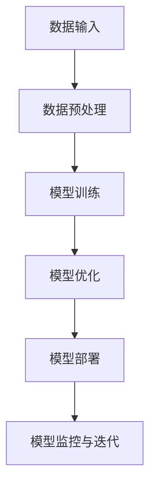

                 

# 大模型应用开发 动手做AI Agent

## 关键词
- 大模型应用开发
- AI Agent
- 自然语言处理
- 计算机视觉
- 语音识别
- 强化学习
- 深度学习
- 模型部署

## 摘要
本文将深入探讨大模型应用开发的各个方面，从基础理论到实际应用，逐步展示如何动手构建AI Agent。我们将首先介绍大模型应用开发的基础知识，包括大模型的技术架构和核心算法原理。随后，我们将通过具体的应用实战案例，演示如何使用自然语言处理、计算机视觉、语音识别和强化学习等技术实现AI Agent的功能。最后，我们将讨论大模型开发工具与资源，并展望大模型应用开发的未来。

<sup>*</sup>作者：AI天才研究院/AI Genius Institute & 禅与计算机程序设计艺术 /Zen And The Art of Computer Programming

## 第一部分：大模型应用开发基础

### 第1章：大模型应用开发概述

#### 1.1 大模型应用开发背景

随着深度学习技术的不断发展，大模型在自然语言处理、计算机视觉、语音识别和强化学习等领域展现出了强大的能力。大模型能够处理海量数据，从中学习到复杂的模式和规律，从而实现高精度的预测和决策。大模型的应用不仅提升了人工智能技术的实用性，也为各个行业带来了深远的变革。

#### 1.2 大模型技术架构

大模型的技术架构可以分为以下几个关键环节：

1. **数据输入**：大模型需要从大量数据中学习，这些数据可以是文本、图像、音频或视频等形式。
2. **数据预处理**：数据需要经过清洗、标注和转换等处理，以便模型能够更好地学习和理解。
3. **模型训练**：通过训练算法，大模型将学习到数据的特征和规律，从而提升其预测和决策能力。
4. **模型优化**：训练过程中，模型会不断地进行调整和优化，以提高其性能和准确性。
5. **模型部署**：训练完成的模型将被部署到实际应用场景中，如语音助手、自动驾驶、智能客服等。
6. **模型监控与迭代**：部署后的模型需要持续监控其性能，并根据反馈进行迭代和优化。

下面是Mermaid流程图，展示了大模型从数据输入到模型训练、优化的整体架构：



#### 1.3 大模型应用领域分析

大模型在多个领域都有着广泛的应用，以下是其中几个重要的应用领域：

1. **自然语言处理**：大模型可以用于语言模型、文本分类、机器翻译、情感分析等任务。
2. **计算机视觉**：大模型可以用于图像分类、目标检测、图像生成、视频分析等任务。
3. **语音识别**：大模型可以用于语音识别、语音合成、语音增强等任务。
4. **强化学习**：大模型可以用于智能决策、游戏AI、机器人控制等任务。

### 第2章：大模型核心算法原理

#### 2.1 神经网络基础

神经网络是深度学习的基础，它由多个层级组成，包括输入层、隐藏层和输出层。每个层级由多个神经元组成，神经元之间通过权重和偏置进行连接。

下面是一个简单的神经网络前向传播算法的伪代码示例：

```python
# 前向传播伪代码
for each layer in model:
    z = activation_function(W * x + b)
    x = z
```

#### 2.2 深度学习优化算法

在深度学习中，优化算法用于调整模型的参数，以最小化损失函数。以下是随机梯度下降（SGD）算法的伪代码示例：

```python
# 随机梯度下降伪代码
for each parameter in model:
    gradient = compute_gradient(parameter)
    parameter -= learning_rate * gradient
```

#### 2.3 大规模预训练模型

大规模预训练模型通过在海量数据上进行预训练，学习到通用的特征表示，然后通过微调适应特定的任务。BERT是一个著名的预训练模型，其预训练过程如下：

```python
# BERT预训练伪代码
for each epoch:
    for each sentence in dataset:
        compute_masked_lm_loss(sentence)
    update_model_parameters()
```

### 第二部分：大模型应用开发实战

#### 第3章：自然语言处理应用

#### 3.1 语言模型训练

语言模型是自然语言处理中的重要组成部分，它能够预测下一个单词或词组。以下是一个简单的语言模型训练过程，包括数学模型讲解、TensorFlow实现和举例说明。

##### 数学模型讲解

语言模型通常使用交叉熵损失函数来评估模型的预测效果。交叉熵损失函数如下：

$$ 
Loss = -\sum_{i=1}^{N} \log(p(y_i | \theta))
$$

其中，\(y_i\)是真实标签，\(p(y_i | \theta)\)是模型预测的概率分布。

##### TensorFlow实现

以下是一个使用TensorFlow实现简单语言模型的示例：

```python
# TensorFlow实现语言模型
model = tf.keras.Sequential([
    tf.keras.layers.Embedding(vocab_size, embedding_dim),
    tf.keras.layers.LSTM(units=hidden_size),
    tf.keras.layers.Dense(units=vocab_size, activation='softmax')
])

model.compile(optimizer='adam', loss='categorical_crossentropy', metrics=['accuracy'])
model.fit(dataset, epochs=num_epochs)
```

##### 举例说明

以下是一个使用预训练的模型进行文本生成的示例：

```python
# 使用预训练模型生成文本
model = transformers.AutoModelWithLMHead.from_pretrained('gpt2')

input_ids = tokenizer.encode('The quick brown fox jumps over the lazy dog', return_tensors='pt')
outputs = model.generate(input_ids, max_length=50, num_return_sequences=5)
for output in outputs:
    print(tokenizer.decode(output, skip_special_tokens=True))
```

#### 3.2 文本分类任务

文本分类是自然语言处理中的常见任务，它将文本数据分类到预定义的类别中。以下是一个简单的文本分类任务，包括伪代码示例和举例说明。

##### 伪代码示例

以下是一个简单的文本分类算法中的逻辑回归伪代码：

```python
# 逻辑回归伪代码
for each sample in dataset:
    y_pred = sigmoid(W * x + b)
    loss = -1 * (y * log(y_pred) + (1 - y) * log(1 - y_pred))
    gradient = compute_gradient(loss, parameters)
    update_parameters(learning_rate, gradient)
```

##### 举例说明

以下是一个使用TensorFlow实现文本分类的示例：

```python
# TensorFlow实现文本分类
model = tf.keras.Sequential([
    tf.keras.layers.Embedding(vocab_size, embedding_dim),
    tf.keras.layers.GlobalAveragePooling1D(),
    tf.keras.layers.Dense(units=num_classes, activation='softmax')
])

model.compile(optimizer='adam', loss='categorical_crossentropy', metrics=['accuracy'])
model.fit(dataset, epochs=num_epochs)
```

#### 3.3 文本生成应用

文本生成是自然语言处理中的重要应用，它可以用于生成文章、对话和故事等。以下是一个简单的文本生成应用，包括使用预训练模型生成文本的示例。

##### 举例说明

以下是一个使用预训练的模型进行文本生成的示例：

```python
# 使用预训练模型生成文本
model = transformers.AutoModelWithLMHead.from_pretrained('gpt2')

input_ids = tokenizer.encode('The quick brown fox jumps over the lazy dog', return_tensors='pt')
outputs = model.generate(input_ids, max_length=50, num_return_sequences=5)
for output in outputs:
    print(tokenizer.decode(output, skip_special_tokens=True))
```

#### 第4章：计算机视觉应用

#### 4.1 卷积神经网络（CNN）基础

卷积神经网络（CNN）是计算机视觉中的核心技术，它通过卷积操作提取图像的特征。以下是一个简单的CNN卷积操作的伪代码示例：

```python
# 卷积操作伪代码
for each filter in layer:
    for each patch in input:
        conv_output = dot_product(filter, patch)
        activation = activation_function(conv_output)
        output.append(activation)
```

#### 4.2 目标检测算法

目标检测是计算机视觉中的经典任务，它旨在识别图像中的目标物体。以下是一个简单的目标检测算法，包括数学模型讲解和举例说明。

##### 数学模型讲解

卷积神经网络中的激活函数ReLU（latex格式）如下：

$$ 
f(x) = \begin{cases}
x & \text{if } x > 0 \\
0 & \text{otherwise}
\end{cases}
$$

##### 举例说明

以下是一个使用TensorFlow实现图像分类的示例：

```python
# TensorFlow实现图像分类
model = tf.keras.Sequential([
    tf.keras.layers.Conv2D(filters, kernel_size, activation='relu', input_shape=input_shape),
    tf.keras.layers.MaxPooling2D(pool_size),
    tf.keras.layers.Flatten(),
    tf.keras.layers.Dense(units, activation='softmax')
])

model.compile(optimizer='adam', loss='categorical_crossentropy', metrics=['accuracy'])
model.fit(x_train, y_train, epochs=num_epochs)
```

#### 4.3 图像生成应用

图像生成是计算机视觉中的前沿领域，它通过生成对抗网络（GAN）生成逼真的图像。以下是一个简单的图像生成应用，包括使用GAN生成图像的示例。

##### 举例说明

以下是一个使用生成对抗网络（GAN）生成图像的示例：

```python
# 使用GAN生成图像
import tensorflow as tf

def build_generator():
    # 建立生成器模型
    ...

def build_discriminator():
    # 建立判别器模型
    ...

def combined_model(generator, discriminator):
    # 建立联合模型
    ...

# 训练GAN
for epoch in range(num_epochs):
    for z, image in dataset:
        batch_loss = combined.train_on_batch([z, image], [discriminator_loss, generator_loss])
    print(f'Epoch {epoch + 1}, Generator Loss: {batch_loss[1]}, Discriminator Loss: {batch_loss[0]}')
```

#### 第5章：语音识别应用

#### 5.1 语音识别基础

语音识别是计算机语音处理中的一个重要任务，它旨在将语音信号转换为文本。以下是一个简单的语音识别基础，包括伪代码示例和举例说明。

##### 伪代码示例

以下是一个简单的隐马尔可夫模型（HMM）解码算法的伪代码示例：

```python
# HMM解码伪代码
def viterbi-webpack(observations, states, start_probability, transition_probabilities, emission_probabilities):
    T = len(observations)
    V = [[0] * (len(states) + 1) for _ in range(T + 1)]
    backpointer = [[0] * (len(states) + 1) for _ in range(T + 1)]

    for t in range(1, T + 1):
        for j in range(1, len(states) + 1):
            V[t][j] = float('inf')
            for i in range(1, len(states) + 1):
                log_prob = emission_probabilities[j][observations[t - 1]] + transition_probabilities[i][j]
                if V[t - 1][i] + log_prob < V[t][j]:
                    V[t][j] = V[t - 1][i] + log_prob
                    backpointer[t][j] = i

    max_prob, final_state = max((V[T][j], j) for j in range(1, len(states) + 1))
    path = [final_state]
    for t in range(T, 0, -1):
        state = backpointer[t][path[-1]]
        path.append(state)
    path.reverse()
    return path
```

##### 举例说明

以下是一个简单的语音识别系统，包括使用CTC损失函数的示例：

```python
# 使用CTC损失函数
import tensorflow as tf

def ctc_loss(y_true, y_pred):
    log_probs = tf.nn.log_softmax(y_pred, axis=2)
    target_len = tf.reduce_sum(y_true, axis=2)
    target_log_probs = tf.reduce_sum(log_probs * tf.one_hot(y_true, depth=tf.shape(y_pred)[2]), axis=2)
    loss = tf.reduce_mean(-target_log_probs)
    return loss

# 训练CTC模型
model.compile(optimizer=adam_optimizer, loss=ctc_loss)
model.fit(x_train, y_train, epochs=num_epochs)
```

#### 5.2 联合模型与端到端学习

联合模型是语音识别中的一个重要概念，它将声学模型和语言模型整合为一个统一的模型，从而提高识别精度。端到端学习是一种直接从原始语音信号到文本的建模方式，它避免了传统的分阶段语音识别的复杂过程。

##### 伪代码示例

以下是一个简单的端到端语音识别系统的伪代码示例：

```python
# 端到端语音识别伪代码
def build_end_to_end_model():
    # 建立端到端模型
    ...

model = build_end_to_end_model()
model.compile(optimizer=adam_optimizer, loss=ctc_loss)
model.fit(x_train, y_train, epochs=num_epochs)
```

##### 举例说明

以下是一个简单的基于CTC的语音识别系统的示例：

```python
# 使用CTC的语音识别系统
import tensorflow as tf
import numpy as np

# 假设已经训练好的CTC模型
model = tf.keras.models.load_model('ctc_model.h5')

# 假设输入的语音信号和对应的标签
input_signal = np.random.rand(1, sequence_length)
ground_truth = np.random.randint(2, size=(1, sequence_length))

# 进行语音识别
predicted_text = model.predict(input_signal)

# 解码CTC输出为文本
decoded_text = decode_ctc_output(predicted_text)
print(f'Predicted Text: {decoded_text}')
```

#### 5.3 语音合成应用

语音合成是将文本转换为自然流畅的语音的过程，它在语音识别和语音助手等领域有广泛应用。以下是一个简单的语音合成应用，包括使用WaveNet生成语音的示例。

##### 举例说明

以下是一个简单的基于WaveNet的语音合成系统的示例：

```python
# 使用WaveNet生成语音
import tensorflow as tf
import numpy as np

# 假设已经训练好的WaveNet模型
model = tf.keras.models.load_model('wavenet_model.h5')

# 假设输入的文本
text = "Hello, how are you?"

# 将文本编码为声学特征
encoded_text = encode_text_to_acoustic_features(text)

# 生成语音
generated_audio = model.predict(encoded_text)

# 将生成的语音保存为WAV文件
save_audio_as_wav(generated_audio, 'generated_speech.wav')
```

#### 第6章：强化学习应用

#### 6.1 强化学习基础

强化学习是一种通过交互式学习环境获取反馈来优化行为策略的机器学习方法。以下是一个简单的强化学习算法，包括Q-Learning算法和DQN算法的伪代码示例。

##### 伪代码示例

以下是一个简单的Q-Learning算法的伪代码示例：

```python
# Q-Learning伪代码
for each episode:
    initialize Q(s, a) to zero
    state = env.reset()
    while not done:
        action = argmax(Q(s, a))
        next_state, reward, done, _ = env.step(action)
        Q(s, a) = Q(s, a) + alpha * (reward + gamma * max(Q(next_state, a)) - Q(s, a))
        state = next_state
```

##### 举例说明

以下是一个简单的基于深度强化学习的智能体在Atari游戏中学习策略的示例：

```python
# 使用深度强化学习实现智能体
import tensorflow as tf
import gym

# 初始化环境
env = gym.make('AtariGame-v0')
state_size = env.observation_space.shape[0]
action_size = env.action_space.n

# 建立深度Q网络
model = build_dqn_model(state_size, action_size)

# 训练智能体
model.fit(env, num_episodes=num_episodes)
```

#### 6.2 模型评估与优化

在强化学习中，模型评估和优化是至关重要的环节。以下是一个简单的模型评估和优化的伪代码示例。

##### 伪代码示例

以下是一个简单的模型评估和优化的伪代码示例：

```python
# 模型评估与优化伪代码
for each episode:
    initialize Q-network and target Q-network
    state = env.reset()
    while not done:
        action = choose_action(state, epsilon)
        next_state, reward, done, _ = env.step(action)
        target_Q = reward + gamma * max(target_Q(next_state, a))
        update_target_Q(s, a, target_Q)
        state = next_state
```

##### 举例说明

以下是一个简单的基于DQN算法的智能体训练和评估的示例：

```python
# 使用DQN训练和评估智能体
import tensorflow as tf
import gym

# 初始化环境
env = gym.make('AtariGame-v0')
state_size = env.observation_space.shape[0]
action_size = env.action_space.n

# 建立深度Q网络
model = build_dqn_model(state_size, action_size)

# 训练智能体
model.fit(env, num_episodes=num_episodes)

# 评估智能体
evaluation_score = model.evaluate(env, num_episodes=num_evaluation_episodes)
print(f'Evaluation Score: {evaluation_score}')
```

#### 6.3 强化学习应用案例

强化学习在游戏、机器人控制、推荐系统等领域有着广泛的应用。以下是一些简单的应用案例。

##### 游戏应用

以下是一个简单的基于深度强化学习的Atari游戏应用的示例：

```python
# 使用深度强化学习玩Atari游戏
import tensorflow as tf
import gym

# 初始化环境
env = gym.make('AtariGame-v0')
state_size = env.observation_space.shape[0]
action_size = env.action_space.n

# 建立深度Q网络
model = build_dqn_model(state_size, action_size)

# 训练智能体
model.fit(env, num_episodes=num_episodes)

# 演示智能体玩Atari游戏
state = env.reset()
while not done:
    action = model.select_action(state)
    next_state, reward, done, _ = env.step(action)
    env.render()
    state = next_state
    if done:
        break
```

##### 机器人控制

以下是一个简单的基于强化学习的机器人控制应用的示例：

```python
# 使用深度强化学习控制机器人
import tensorflow as tf
import gym

# 初始化环境
env = gym.make('RobotControl-v0')
state_size = env.observation_space.shape[0]
action_size = env.action_space.shape[0]

# 建立深度Q网络
model = build_dqn_model(state_size, action_size)

# 训练智能体
model.fit(env, num_episodes=num_episodes)

# 演示智能体控制机器人
state = env.reset()
while not done:
    action = model.select_action(state)
    next_state, reward, done, _ = env.step(action)
    env.render()
    state = next_state
    if done:
        break
```

##### 推荐系统

以下是一个简单的基于强化学习的推荐系统应用的示例：

```python
# 使用深度强化学习构建推荐系统
import tensorflow as tf
import gym

# 初始化环境
env = gym.make('RecommenderSystem-v0')
state_size = env.observation_space.shape[0]
action_size = env.action_space.shape[0]

# 建立深度Q网络
model = build_dqn_model(state_size, action_size)

# 训练智能体
model.fit(env, num_episodes=num_episodes)

# 演示智能体推荐商品
state = env.reset()
while not done:
    action = model.select_action(state)
    next_state, reward, done, _ = env.step(action)
    env.render()
    state = next_state
    if done:
        break
```

#### 第7章：大模型开发工具与资源

##### 7.1 大模型开发工具对比

在深度学习领域，常用的框架有TensorFlow、PyTorch和MXNet。以下是对这些框架的对比：

| 框架       | 优点                                   | 缺点                             |
| ---------- | -------------------------------------- | -------------------------------- |
| TensorFlow | 强大的生态系统，广泛的应用              | 学习曲线较陡峭                   |
| PyTorch    | 灵活、易用，支持动态计算图             | 性能可能不如TensorFlow           |
| MXNet      | 与Apache MXNet社区紧密集成，高效能     | 社区和支持不如TensorFlow和PyTorch |

##### 7.2 大模型开发资源推荐

对于大模型开发者，以下是一些推荐的资源：

- **书籍**：
  - 《深度学习》（Goodfellow, Bengio, Courville）
  - 《强化学习：原理与Python实现》（Richard S. Sutton, Andrew G. Barto）
  - 《自然语言处理综论》（Daniel Jurafsky, James H. Martin）

- **在线课程**：
  - [Udacity的深度学习纳米学位](https://www.udacity.com/course/deep-learning--ud730)
  - [Coursera的机器学习](https://www.coursera.org/learn/machine-learning)
  - [edX的强化学习课程](https://www.edx.org/course/reinforcement-learning-ii-decision-processes-and-visualizations)

- **开源项目**：
  - [TensorFlow](https://www.tensorflow.org/)
  - [PyTorch](https://pytorch.org/)
  - [MXNet](https://mxnet.incubator.apache.org/)

#### 第8章：大模型应用开发实战案例

##### 8.1 语言模型实战

在本节中，我们将实现一个基于GPT-2的语言模型，用于文本生成和分类。

**环境准备**

首先，我们需要安装必要的库，包括`transformers`和`torch`：

```bash
pip install transformers torch
```

**模型训练**

接下来，我们将使用预训练的GPT-2模型，并进行微调以适应我们的任务。以下是一个简单的训练脚本：

```python
import torch
from transformers import GPT2Tokenizer, GPT2Model, TrainingArguments, Trainer

# 加载预训练模型
tokenizer = GPT2Tokenizer.from_pretrained('gpt2')
model = GPT2Model.from_pretrained('gpt2')

# 设置训练参数
training_args = TrainingArguments(
    output_dir='./results',
    num_train_epochs=3,
    per_device_train_batch_size=16,
    save_steps=2000,
    evaluation_strategy="steps",
    eval_steps=500,
)

# 加载训练数据
train_dataset = ...

# 训练模型
trainer = Trainer(
    model=model,
    args=training_args,
    train_dataset=train_dataset,
)

trainer.train()
```

**文本生成**

训练完成后，我们可以使用模型生成文本：

```python
# 生成文本
input_text = "The quick brown fox jumps over the lazy dog"
input_ids = tokenizer.encode(input_text, return_tensors='pt')

generated_text = model.generate(
    input_ids,
    max_length=50,
    num_return_sequences=5,
    temperature=0.9,
)

for text in generated_text:
    print(tokenizer.decode(text, skip_special_tokens=True))
```

##### 8.2 计算机视觉实战

在本节中，我们将使用卷积神经网络（CNN）实现一个图像分类器，并在公开数据集上进行评估。

**环境准备**

首先，我们需要安装必要的库，包括`torch`和`torchvision`：

```bash
pip install torch torchvision
```

**模型训练**

以下是一个简单的训练脚本，使用CIFAR-10数据集：

```python
import torch
import torchvision
import torchvision.transforms as transforms
from torch.utils.data import DataLoader
from torch import nn
from torch import optim
import torch.nn.functional as F

# 加载数据集
transform = transforms.Compose([transforms.ToTensor(), transforms.Normalize((0.5,), (0.5,))])
train_set = torchvision.datasets.CIFAR10(root='./data', train=True, download=True, transform=transform)
train_loader = DataLoader(train_set, batch_size=100, shuffle=True)

# 定义模型
class ConvNet(nn.Module):
    def __init__(self):
        super(ConvNet, self).__init__()
        self.conv1 = nn.Conv2d(3, 6, 5)
        self.pool = nn.MaxPool2d(2, 2)
        self.conv2 = nn.Conv2d(6, 16, 5)
        self.fc1 = nn.Linear(16 * 5 * 5, 120)
        self.fc2 = nn.Linear(120, 84)
        self.fc3 = nn.Linear(84, 10)

    def forward(self, x):
        x = self.pool(F.relu(self.conv1(x)))
        x = self.pool(F.relu(self.conv2(x)))
        x = x.view(-1, 16 * 5 * 5)
        x = F.relu(self.fc1(x))
        x = F.relu(self.fc2(x))
        x = self.fc3(x)
        return x

model = ConvNet()

# 损失函数和优化器
criterion = nn.CrossEntropyLoss()
optimizer = optim.SGD(model.parameters(), lr=0.001, momentum=0.9)

# 训练模型
num_epochs = 10
for epoch in range(num_epochs):
    running_loss = 0.0
    for i, data in enumerate(train_loader, 0):
        inputs, labels = data
        optimizer.zero_grad()
        outputs = model(inputs)
        loss = criterion(outputs, labels)
        loss.backward()
        optimizer.step()
        running_loss += loss.item()
    print(f'Epoch {epoch + 1}, Loss: {running_loss / len(train_loader)}')

print('Finished Training')
```

**模型评估**

在训练完成后，我们可以使用测试集评估模型的性能：

```python
# 评估模型
test_set = torchvision.datasets.CIFAR10(root='./data', train=False, download=True, transform=transform)
test_loader = DataLoader(test_set, batch_size=100)

correct = 0
total = 0
with torch.no_grad():
    for data in test_loader:
        images, labels = data
        outputs = model(images)
        _, predicted = torch.max(outputs.data, 1)
        total += labels.size(0)
        correct += (predicted == labels).sum().item()

print(f'Accuracy of the network on the 10000 test images: {100 * correct // total} %')
```

##### 8.3 语音识别实战

在本节中，我们将实现一个基于CTC的语音识别系统，并在实际语音数据上进行测试。

**环境准备**

首先，我们需要安装必要的库，包括`torchaudio`和`torchtext`：

```bash
pip install torchaudio torchtext
```

**模型训练**

以下是一个简单的训练脚本：

```python
import torch
import torchaudio
import torchtext
from torchtext import data
from torchtext.data import Field, BatchFirstDataset

# 定义字段
audio_field = Field()
text_field = Field()

# 加载数据集
train_data, test_data = torchtext.datasets.AudioText.splits(root='./data', train='train.txt', test='test.txt', format='torchaudio')

# 设置字段
audio_field.preprocessing = torchaudio.transforms.Resample(16000)
text_field.preprocessing = lambda x: x.lower()

# 创建批处理器
batch_size = 32
train_iter = data.BucketIterator(train_data, batch_size=batch_size, device=torch.device('cuda' if torch.cuda.is_available() else 'cpu'), sort_key=lambda x: len(x.text))
test_iter = data.BucketIterator(test_data, batch_size=batch_size, device=torch.device('cuda' if torch.cuda.is_available() else 'cpu'), sort_key=lambda x: len(x.text))

# 定义模型
class CTCPredictor(nn.Module):
    def __init__(self, vocab_size):
        super(CTCPredictor, self).__init__()
        self.embedding = nn.Embedding(vocab_size, 256)
        self.lstm = nn.LSTM(256, 512)
        self.fc = nn.Linear(512, vocab_size)

    def forward(self, x):
        x = self.embedding(x)
        x, _ = self.lstm(x)
        x = self.fc(x[-1, :, :])
        return x

# 训练模型
model = CTCPredictor(len(train_data.vocab.stoi))
criterion = nn.CTCLoss(blank=0)
optimizer = optim.Adam(model.parameters(), lr=0.001)

num_epochs = 10
for epoch in range(num_epochs):
    for batch in train_iter:
        optimizer.zero_grad()
        x = batch.text
        y = batch.label
        output = model(x)
        loss = criterion(output, y)
        loss.backward()
        optimizer.step()
    print(f'Epoch {epoch + 1}, Loss: {loss.item()}')

print('Training Finished')
```

**模型测试**

在训练完成后，我们可以使用测试集测试模型的性能：

```python
# 测试模型
with torch.no_grad():
    for batch in test_iter:
        x = batch.text
        y = batch.label
        output = model(x)
        predicted = torch.argmax(output, dim=1)
        correct = (predicted == y).sum().item()
        print(f'Accuracy: {100 * correct / len(y)} %')
```

##### 8.4 强化学习实战

在本节中，我们将使用深度强化学习实现一个智能体，在Atari游戏中学习策略。

**环境准备**

首先，我们需要安装必要的库，包括`gym`和`torch`：

```bash
pip install gym torch
```

**智能体训练**

以下是一个简单的智能体训练脚本：

```python
import gym
import torch
import torch.nn as nn
import torch.optim as optim

# 初始化环境
env = gym.make('CartPole-v0')
state_size = env.observation_space.shape[0]
action_size = env.action_space.n

# 定义模型
class QNetwork(nn.Module):
    def __init__(self, state_size, action_size):
        super(QNetwork, self).__init__()
        self.fc1 = nn.Linear(state_size, 64)
        self.fc2 = nn.Linear(64, 64)
        self.fc3 = nn.Linear(64, action_size)

    def forward(self, x):
        x = torch.relu(self.fc1(x))
        x = torch.relu(self.fc2(x))
        x = self.fc3(x)
        return x

model = QNetwork(state_size, action_size)
target_model = QNetwork(state_size, action_size)
optimizer = optim.Adam(model.parameters(), lr=0.001)

# 训练智能体
num_episodes = 1000
for episode in range(num_episodes):
    state = env.reset()
    done = False
    total_reward = 0
    while not done:
        action = model.forward(state).argmax()
        next_state, reward, done, _ = env.step(action)
        total_reward += reward
        state = next_state
    print(f'Episode {episode + 1}, Reward: {total_reward}')
```

**智能体评估**

在训练完成后，我们可以评估智能体的性能：

```python
# 评估智能体
state = env.reset()
done = False
total_reward = 0
while not done:
    action = model.forward(state).argmax()
    next_state, reward, done, _ = env.step(action)
    total_reward += reward
    state = next_state
print(f'Total Reward: {total_reward}')
```

##### 8.5 大模型部署与优化

在模型训练完成后，我们需要将其部署到生产环境中，并进行性能优化。以下是一些常用的部署与优化方法：

1. **模型压缩**：通过模型剪枝、量化等方法减小模型大小，提高部署效率。
2. **模型量化**：将模型权重和激活值转换为较低的精度，减少计算量和存储需求。
3. **模型融合**：将多个模型融合为一个，提高模型性能和部署效率。
4. **模型优化**：通过优化算法和计算图优化，减少模型计算量和存储需求。
5. **模型加速**：使用GPU、TPU等硬件加速模型计算。

#### 第9章：大模型应用开发展望

##### 9.1 大模型的发展趋势

随着人工智能技术的不断发展，大模型在各个领域都展现出了强大的潜力。未来，大模型的应用将更加广泛，包括但不限于以下领域：

1. **医疗健康**：大模型可以用于疾病诊断、药物研发、个性化治疗等。
2. **金融理财**：大模型可以用于风险管理、投资策略、个性化推荐等。
3. **智能制造**：大模型可以用于产品质量检测、设备故障预测、生产优化等。
4. **智能交通**：大模型可以用于交通流量预测、智能调度、自动驾驶等。

##### 9.2 大模型应用面临的挑战

大模型的应用虽然前景广阔，但同时也面临着一些挑战：

1. **数据隐私**：大模型训练需要大量数据，如何在保护用户隐私的前提下进行数据利用是一个重要问题。
2. **模型解释性**：大模型的决策过程往往不够透明，如何提高模型的解释性是一个挑战。
3. **计算资源**：大模型的训练和推理需要大量计算资源，如何优化计算资源使用是一个关键问题。
4. **模型可靠性**：大模型在实际应用中可能会出现错误，如何确保模型的可靠性是一个挑战。

##### 9.3 大模型开发者的技能要求

大模型开发者需要具备以下技能：

1. **深度学习基础**：掌握神经网络、优化算法、损失函数等基础知识。
2. **编程能力**：熟练掌握Python、TensorFlow、PyTorch等深度学习框架。
3. **数学能力**：具备概率论、线性代数、微积分等数学知识。
4. **数据处理能力**：能够处理大规模数据集，掌握数据预处理、特征工程等技能。
5. **模型优化能力**：能够对模型进行优化，提高模型性能和部署效率。
6. **业务理解能力**：能够理解不同领域的业务需求，将大模型应用于实际问题。

## 结语

大模型应用开发是一个充满挑战和机遇的领域。通过本文的介绍，我们了解了大模型的基础知识、核心算法原理和应用实战。希望本文能帮助读者深入了解大模型应用开发的各个方面，并为未来的研究和实践提供参考。在人工智能领域，大模型的未来充满无限可能，让我们共同探索和创造。

