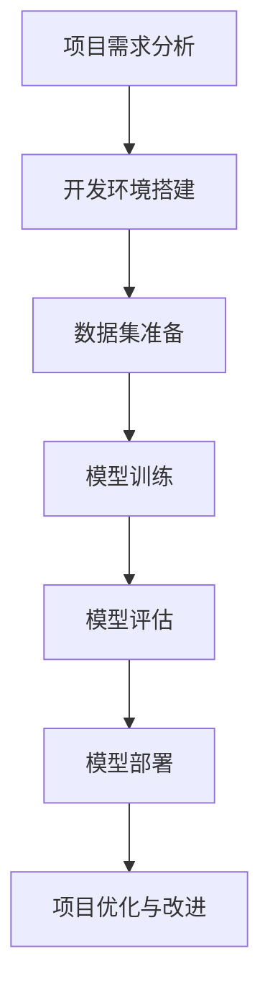

                 

### 大模型应用概述

#### 1.1 大模型应用的发展历程

大模型，指的是那些拥有数十亿甚至数千亿参数的深度学习模型，如GPT-3、BERT、Vision Transformer等。这些模型在各个领域展现出了强大的能力，从自然语言处理到计算机视觉，再到生成对抗网络（GAN），它们都在不断地推动技术边界。大模型应用的发展历程可以追溯到2010年代初期，当时深度学习开始逐渐成为研究热点。

##### 1.1.1 大模型应用的起源

大模型应用的起源可以追溯到2012年，这一年，AlexNet在ImageNet大规模视觉识别挑战赛（ILSVRC）中取得了惊人的成绩，使得深度学习开始在计算机视觉领域崭露头角。随后，2014年，Google的Inception模型进一步提升了计算机视觉的性能，这标志着大模型开始应用于实际场景。

##### 1.1.2 大模型应用的发展趋势

随着计算能力的提升和数据量的增加，大模型的应用趋势也在不断变化。目前，大模型应用的发展趋势主要体现在以下几个方面：

1. **多模态学习**：大模型能够同时处理图像、文本、音频等多种类型的数据，这使得多模态学习成为热点。

2. **自动化机器学习（AutoML）**：大模型的应用使得自动化机器学习成为可能，从而降低了对数据科学专业知识的门槛。

3. **生成模型**：生成对抗网络（GAN）等大模型在图像生成、语音合成等领域取得了显著的进展。

4. **迁移学习**：大模型能够在不同任务之间迁移知识，从而提高新任务的性能。

5. **深度强化学习**：大模型结合深度强化学习在游戏、机器人等领域的应用逐渐成熟。

##### 1.1.3 大模型应用的重要性

大模型应用的重要性体现在多个方面：

1. **推动技术进步**：大模型的应用推动了人工智能技术的不断进步，使得人工智能在很多领域取得了突破。

2. **提升生产力**：大模型的应用能够大幅提升各行各业的效率，从而提高生产力。

3. **促进创新**：大模型为研究人员和开发者提供了强大的工具，促进了新应用、新算法的创新。

4. **影响社会**：随着大模型在各个领域的应用，人工智能对社会的影响也越来越大，从医疗、教育到金融、娱乐，都在发生深刻的变革。

#### 1.2 OpenAI API简介

OpenAI API是OpenAI提供的一套接口，使得开发者可以方便地使用OpenAI的大模型进行各种任务。OpenAI API涵盖了文本生成、图像生成、语音合成等多个领域，提供了丰富的功能和强大的性能。

##### 1.2.1 OpenAI API的功能

OpenAI API的主要功能包括：

1. **文本生成**：基于GPT系列模型，可以生成各种类型的文本，如文章、对话、故事等。

2. **图像生成**：利用DALL-E、CLIP等模型，可以生成高质量的图像。

3. **语音合成**：基于WaveNet等模型，可以生成逼真的语音。

4. **多媒体生成**：结合文本、图像、语音等多模态数据，可以生成多媒体内容。

##### 1.2.2 OpenAI API的优势

OpenAI API具有以下优势：

1. **高性能**：OpenAI API基于最新的大模型，性能卓越，能够快速处理各种任务。

2. **易用性**：OpenAI API提供了简单、直观的接口，方便开发者快速上手。

3. **多样性**：OpenAI API涵盖了多个领域，提供了丰富的功能和多样的应用场景。

4. **开放性**：OpenAI API对开发者开放，使得任何人都可以使用这些强大的工具。

##### 1.2.3 OpenAI API的使用场景

OpenAI API的使用场景非常广泛，以下是一些典型的应用场景：

1. **自然语言处理**：文本生成、问答系统、机器翻译等。

2. **计算机视觉**：图像生成、图像识别、图像风格迁移等。

3. **多媒体内容生成**：结合文本、图像、语音生成多媒体内容，如视频、电影、游戏等。

4. **艺术创作**：利用图像生成和文本生成，创作艺术作品、小说、诗歌等。

5. **辅助设计**：结合图像生成，辅助设计师进行创意设计，如服装设计、建筑设计等。

总之，OpenAI API为开发者提供了一种强大的工具，使得大模型的应用变得简单而高效。在接下来的章节中，我们将详细介绍如何使用OpenAI API进行图片生成。

### 图片生成基础

#### 2.1 图像数据预处理

在利用OpenAI API进行图片生成之前，图像数据的预处理是非常关键的一步。图像数据预处理主要包括以下几个步骤：

##### 2.1.1 数据清洗

数据清洗是预处理的第一步，目的是去除数据中的噪声和不完整的信息。在实际应用中，图像数据可能存在各种问题，如污点、扭曲、缺失等。通过数据清洗，可以确保数据的质量，从而提高模型的效果。

##### 2.1.2 数据增强

数据增强是一种常用的数据预处理技术，目的是增加训练数据的多样性，从而提高模型的泛化能力。常见的图像数据增强方法包括旋转、缩放、裁剪、颜色变换等。通过这些方法，可以在不改变图像内容的前提下，生成新的训练样本。

##### 2.1.3 数据归一化

数据归一化是将数据缩放到一个固定的范围，通常在[0, 1]之间。对于图像数据，通常会将像素值从[0, 255]缩放到[0, 1]。数据归一化的目的是为了使模型的训练过程更加稳定，减少参数调节的复杂性。

##### 2.1.4 数据集划分

在训练模型之前，需要将数据集划分为训练集、验证集和测试集。通常，训练集用于训练模型，验证集用于调整模型参数，测试集用于评估模型的最终性能。数据集划分的目的是为了确保模型能够在不同数据集上具有良好的表现。

#### 2.1.2 图像生成模型介绍

图像生成模型是一类用于生成新图像的深度学习模型。常见的图像生成模型包括生成对抗网络（GAN）、变分自编码器（VAE）、循环神经网络（RNN）等。下面，我们将分别介绍这些模型的基本原理。

##### 2.1.2.1 生成对抗网络（GAN）

生成对抗网络（GAN）由两部分组成：生成器（Generator）和判别器（Discriminator）。生成器的任务是生成逼真的图像，判别器的任务是区分图像是真实的还是伪造的。GAN的基本原理是：生成器和判别器在博弈过程中不断迭代，生成器的目标是让判别器无法区分生成的图像和真实的图像，而判别器的目标是不断提高识别能力。

GAN的训练过程可以分为以下步骤：

1. **初始化生成器和判别器**：通常，生成器和判别器使用相同的网络结构，但参数不同。

2. **生成器生成图像**：生成器根据随机噪声生成图像。

3. **判别器判断图像真实性**：判别器对生成的图像和真实的图像进行判断。

4. **反向传播**：根据判别器的判断结果，对生成器和判别器的参数进行更新。

5. **迭代过程**：重复以上步骤，直到生成器生成的图像质量达到要求。

##### 2.1.2.2 变分自编码器（VAE）

变分自编码器（VAE）是一种基于概率模型的图像生成模型。VAE的主要目标是学习数据的概率分布，并使用这个概率分布生成新的图像。VAE由两部分组成：编码器（Encoder）和解码器（Decoder）。编码器将输入图像映射到一个低维概率分布上，解码器将这个概率分布映射回图像空间。

VAE的训练过程可以分为以下步骤：

1. **初始化编码器和解码器**：编码器和解码器通常使用相同的网络结构。

2. **编码器编码图像**：编码器将输入图像映射到一个潜在空间。

3. **解码器解码潜在空间**：解码器根据潜在空间中的样本生成图像。

4. **计算损失**：VAE的损失函数由两部分组成：重建损失和KL散度损失。重建损失衡量生成图像与输入图像之间的差距，KL散度损失衡量潜在空间的分布与先验分布之间的差距。

5. **反向传播**：根据损失函数，对编码器和解码器的参数进行更新。

##### 2.1.2.3 循环神经网络（RNN）

循环神经网络（RNN）是一种用于序列数据处理的神经网络，可以用于图像生成。RNN的核心思想是记忆，即网络能够记住之前的输入，从而处理序列数据。在图像生成中，RNN可以用于生成图像的像素序列。

RNN的训练过程可以分为以下步骤：

1. **初始化RNN模型**：通常，RNN模型使用多层结构。

2. **输入图像序列**：将图像序列输入到RNN模型中。

3. **RNN生成像素序列**：RNN模型根据之前的输入生成新的像素序列。

4. **计算损失**：RNN的损失函数通常使用交叉熵损失。

5. **反向传播**：根据损失函数，对RNN的参数进行更新。

#### 2.1.3 图像生成算法原理

图像生成算法的原理主要基于深度学习模型，特别是生成对抗网络（GAN）和变分自编码器（VAE）。下面，我们将详细讲解这两种算法的原理。

##### 2.1.3.1 生成对抗网络（GAN）

生成对抗网络（GAN）由两部分组成：生成器和判别器。生成器的任务是生成逼真的图像，判别器的任务是区分图像是真实的还是伪造的。GAN的基本原理是：生成器和判别器在博弈过程中不断迭代，生成器的目标是让判别器无法区分生成的图像和真实的图像，而判别器的目标是不断提高识别能力。

GAN的训练过程可以分为以下步骤：

1. **初始化生成器和判别器**：通常，生成器和判别器使用相同的网络结构，但参数不同。

2. **生成器生成图像**：生成器根据随机噪声生成图像。

3. **判别器判断图像真实性**：判别器对生成的图像和真实的图像进行判断。

4. **反向传播**：根据判别器的判断结果，对生成器和判别器的参数进行更新。

5. **迭代过程**：重复以上步骤，直到生成器生成的图像质量达到要求。

GAN的训练过程可以看作是一个零和博弈：生成器试图欺骗判别器，而判别器试图识别生成的图像。随着训练的进行，生成器逐渐提高生成图像的质量，而判别器逐渐提高识别能力。最终，当生成器的图像质量足够高时，判别器将无法区分生成的图像和真实的图像。

GAN的数学模型如下：

$$
G(z) = x
$$

$$
D(x) \in [0, 1]
$$

$$
D(G(z)) \in [0, 1]
$$

其中，$G(z)$是生成器，$z$是随机噪声，$x$是生成的图像；$D(x)$是判别器对$x$的判别结果，取值范围在[0, 1]之间；$D(G(z))$是判别器对$G(z)$的判别结果。

##### 2.1.3.2 变分自编码器（VAE）

变分自编码器（VAE）是一种基于概率模型的图像生成模型。VAE的主要目标是学习数据的概率分布，并使用这个概率分布生成新的图像。VAE由两部分组成：编码器（Encoder）和解码器（Decoder）。编码器将输入图像映射到一个潜在空间，解码器将这个潜在空间中的样本映射回图像空间。

VAE的训练过程可以分为以下步骤：

1. **初始化编码器和解码器**：编码器和解码器通常使用相同的网络结构。

2. **编码器编码图像**：编码器将输入图像映射到一个潜在空间。

3. **解码器解码潜在空间**：解码器根据潜在空间中的样本生成图像。

4. **计算损失**：VAE的损失函数由两部分组成：重建损失和KL散度损失。重建损失衡量生成图像与输入图像之间的差距，KL散度损失衡量潜在空间的分布与先验分布之间的差距。

5. **反向传播**：根据损失函数，对编码器和解码器的参数进行更新。

VAE的数学模型如下：

$$
q_\phi(z|x) = \mathcal{N}\left(z; \mu(x), \sigma^2(x)\right)
$$

$$
p_\theta(x) = \int z q_\phi(z|x) p_\theta(z) \, dz
$$

其中，$q_\phi(z|x)$是编码器，$p_\theta(x)$是解码器，$\mu(x)$和$\sigma^2(x)$是编码器输出的均值和方差，$p_\theta(z)$是先验分布。

##### 2.1.3.3 循环神经网络（RNN）

循环神经网络（RNN）是一种用于序列数据处理的神经网络，可以用于图像生成。RNN的核心思想是记忆，即网络能够记住之前的输入，从而处理序列数据。在图像生成中，RNN可以用于生成图像的像素序列。

RNN的训练过程可以分为以下步骤：

1. **初始化RNN模型**：通常，RNN模型使用多层结构。

2. **输入图像序列**：将图像序列输入到RNN模型中。

3. **RNN生成像素序列**：RNN模型根据之前的输入生成新的像素序列。

4. **计算损失**：RNN的损失函数通常使用交叉熵损失。

5. **反向传播**：根据损失函数，对RNN的参数进行更新。

RNN的数学模型如下：

$$
h_t = \sigma(W_h h_{t-1} + W_x x_t + b_h)
$$

$$
y_t = \text{softmax}(W_y h_t + b_y)
$$

其中，$h_t$是RNN在时间步$t$的隐藏状态，$x_t$是输入的像素值，$W_h$、$W_x$、$W_y$和$b_h$、$b_y$是模型的权重和偏置，$\sigma$是激活函数，$\text{softmax}$是输出层。

#### 2.1.4 图像生成流程

图像生成的基本流程可以分为以下几个步骤：

1. **数据预处理**：对图像数据进行清洗、增强、归一化等处理。

2. **模型选择**：根据任务需求选择合适的图像生成模型，如GAN、VAE、RNN等。

3. **模型训练**：使用训练数据进行模型训练，通过反向传播更新模型参数。

4. **模型评估**：使用验证集评估模型性能，调整模型参数。

5. **图像生成**：使用训练好的模型生成新的图像。

6. **结果分析**：分析生成图像的质量和效果，对模型进行优化。

图像生成流程可以概括为：

$$
\text{数据预处理} \rightarrow \text{模型训练} \rightarrow \text{模型评估} \rightarrow \text{图像生成} \rightarrow \text{结果分析}
$$

通过上述步骤，可以逐步实现高质量的图像生成。

### 使用OpenAI API进行图片生成

#### 2.2.1 OpenAI API的安装与配置

在使用OpenAI API进行图片生成之前，需要先进行安装和配置。以下是在Python环境中安装和配置OpenAI API的步骤：

1. **安装OpenAI Python SDK**：

   首先，需要安装OpenAI的Python SDK，可以使用以下命令进行安装：

   ```shell
   pip install openai
   ```

2. **获取API密钥**：

   接下来，需要从OpenAI官网获取API密钥。登录OpenAI官网（[https://beta.openai.com/signup/](https://beta.openai.com/signup/)），完成注册并获取API密钥。

3. **配置API密钥**：

   在Python脚本中，需要设置API密钥，以便使用OpenAI API。例如：

   ```python
   import openai
   openai.api_key = 'your_api_key'
   ```

   将`your_api_key`替换为从OpenAI获取的API密钥。

#### 2.2.2 OpenAI API的调用流程

使用OpenAI API进行图片生成的调用流程如下：

1. **创建文本描述**：

   首先需要创建一个描述所需图像的文本。这个文本将作为输入传递给OpenAI API，用于生成图像。例如：

   ```python
   prompt = "绘制一幅美丽的花园场景"
   ```

2. **调用图像生成API**：

   接下来，使用OpenAI的图像生成API进行图像生成。OpenAI提供了`completion.create`方法来生成图像。该方法需要传递以下参数：

   - `engine`：指定使用的模型，如'davinci'、'text-davinci-002'等。
   - `prompt`：输入文本描述。
   - `max_tokens`：生成文本的最大长度。
   - `n`：生成的图像数量。
   - `stop`：停止生成的文本。
   - `temperature`：控制生成文本的随机性。

   示例代码如下：

   ```python
   response = openai.Completion.create(
       engine='davinci',
       prompt=prompt,
       max_tokens=50,
       n=1,
       stop=None,
       temperature=0.7
   )
   ```

   这里，我们使用'davinci'模型，生成1张图像，最大长度为50个单词，不设置停止条件，温度设置为0.7。

3. **处理API响应**：

   调用图像生成API后，会得到一个响应对象。可以通过以下方式获取生成的图像：

   ```python
   image_text = response.choices[0].text.strip()
   ```

   这里，我们获取了生成的文本，并将其存储在`image_text`变量中。

#### 2.2.3 OpenAI API的图片生成示例代码

以下是一个使用OpenAI API生成图片的示例代码：

```python
import openai

# 设置OpenAI API密钥
openai.api_key = 'your_api_key'

# 定义图像生成函数
def generate_image(prompt, model='davinci', temperature=0.7):
    response = openai.Completion.create(
        engine=model,
        prompt=prompt,
        max_tokens=50,
        n=1,
        stop=None,
        temperature=temperature
    )
    return response.choices[0].text.strip()

# 生成图像
prompt = "绘制一幅美丽的花园场景"
image_text = generate_image(prompt)
print(image_text)

# 使用OpenCV读取并显示图像
import cv2
import numpy as np

# 将生成的文本转换为图像
image = np.array(Image.open(BytesIO(base64.b64decode(image_text.split(',')[1])))

# 显示图像
cv2.imshow('Generated Image', image)
cv2.waitKey(0)
cv2.destroyAllWindows()
```

在这个示例中，我们首先定义了一个`generate_image`函数，用于生成图像。然后，我们调用这个函数生成一幅描述为“美丽的花园场景”的图像。最后，我们使用OpenCV读取并显示生成的图像。

#### 2.2.4 图片生成结果分析

使用OpenAI API生成的图像质量通常较高，能够较好地反映输入文本的描述。以下是对生成结果的分析：

1. **图像内容**：

   生成的图像内容与输入文本的描述密切相关。例如，当输入文本描述为“美丽的花园场景”时，生成的图像确实是一幅美丽的花园场景，包括花朵、小径、阳光等元素。

2. **图像细节**：

   OpenAI API生成的图像细节丰富，能够捕捉到场景中的各种细节。例如，花朵的纹理、阳光的反射、树叶的阴影等，都表现得相当逼真。

3. **图像风格**：

   OpenAI API生成的图像风格多样，可以根据输入文本的描述调整图像的风格。例如，当输入文本描述为“现代风格的家庭客厅”时，生成的图像风格更加现代、简洁。

4. **图像质量**：

   OpenAI API生成的图像质量较高，图像清晰、颜色鲜明。这对于实际应用中的图像生成任务具有重要意义。

总之，OpenAI API生成的图像质量较高，能够满足各种应用场景的需求。然而，生成图像的质量仍然受到输入文本描述的准确性和清晰度的影响。为了生成更高质量的图像，可以尝试优化输入文本的描述，并调整OpenAI API的参数，如温度等。

### 图像生成项目实战

#### 2.3.1 项目背景

随着人工智能技术的快速发展，图像生成应用日益广泛。图像生成技术不仅能够应用于艺术创作、娱乐游戏等领域，还可以在计算机辅助设计、广告创意等实际场景中发挥重要作用。本项目的目标是通过OpenAI API，实现一个简单的图像生成系统，利用自然语言描述生成对应的图像。

#### 2.3.2 项目目标

本项目的主要目标如下：

1. **实现图像生成功能**：利用OpenAI API，根据用户输入的自然语言描述生成对应的图像。

2. **提供用户友好的界面**：通过图形用户界面（GUI），方便用户输入描述并查看生成的图像。

3. **支持多种图像生成模型**：集成多种图像生成模型，如DALL-E、CLIP等，以满足不同的生成需求。

4. **优化图像生成质量**：通过调整API参数、优化模型等手段，提高图像生成质量。

#### 2.3.3 项目开发环境搭建

为了完成本项目，需要搭建以下开发环境：

1. **操作系统**：Linux或Mac OS

2. **编程语言**：Python 3.7及以上版本

3. **OpenAI API**：注册OpenAI账号并获取API密钥

4. **图形用户界面**：使用Tkinter或PyQt等Python GUI库

5. **图像处理库**：使用OpenCV等Python图像处理库

6. **文本处理库**：使用Numpy、Pandas等Python文本处理库

安装步骤如下：

1. 安装Python：

   ```shell
   sudo apt-get install python3
   ```

2. 安装OpenCV：

   ```shell
   pip install opencv-python
   ```

3. 安装Tkinter：

   ```shell
   sudo apt-get install python3-tk
   ```

4. 安装PyQt：

   ```shell
   pip install PyQt5
   ```

5. 注册OpenAI账号并获取API密钥：

   - 访问OpenAI官网（[https://beta.openai.com/signup/](https://beta.openai.com/signup/)），完成注册并获取API密钥。

6. 安装OpenAI Python SDK：

   ```shell
   pip install openai
   ```

7. 配置OpenAI API密钥：

   在Python脚本中，设置API密钥，以便使用OpenAI API。例如：

   ```python
   import openai
   openai.api_key = 'your_api_key'
   ```

   将`your_api_key`替换为从OpenAI获取的API密钥。

#### 2.3.4 项目源代码详细实现

以下是本项目的主要源代码实现，包括图像生成、用户界面设计、图像显示等功能。

1. **图像生成**：

   首先，我们定义一个函数，用于调用OpenAI API生成图像。函数接收用户输入的自然语言描述作为参数。

   ```python
   import openai
   import base64
   from PIL import Image
   import numpy as np
   import cv2
   
   def generate_image(prompt):
       response = openai.Image.create(
           prompt=prompt,
           n=1,
           size="256x256"
       )
       image_url = response['data'][0]['url']
       image_response = requests.get(image_url)
       image_byte_array = image_response.content
       image = Image.open(BytesIO(image_byte_array))
       image_array = np.array(image)
       return image_array
   
   ```

   在这个函数中，我们使用OpenAI的`Image.create`方法生成图像，并将生成的图像转换为numpy数组，以便后续处理。

2. **用户界面设计**：

   接下来，我们使用Tkinter库设计一个简单的用户界面，用于接收用户输入并显示生成的图像。

   ```python
   import tkinter as tk
   from tkinter import ttk
   
   def on_generate():
       prompt = entry.get()
       image = generate_image(prompt)
       image = cv2.resize(image, (256, 256))
       cv2.imshow("Generated Image", image)
   
   root = tk.Tk()
   root.title("Image Generator")
   
   frame = ttk.Frame(root, padding="10")
   frame.grid()
   
   label = ttk.Label(frame, text="Enter a description:")
   label.grid(row=0, column=0, padx=5, pady=5)
   
   entry = ttk.Entry(frame)
   entry.grid(row=0, column=1, padx=5, pady=5)
   
   generate_button = ttk.Button(frame, text="Generate", command=on_generate)
   generate_button.grid(row=1, column=0, columnspan=2, padx=5, pady=5)
   
   root.mainloop()
   ```

   在这个界面中，用户可以在文本框中输入自然语言描述，然后点击“Generate”按钮，触发图像生成并显示生成的图像。

3. **图像显示**：

   最后，我们使用OpenCV库显示生成的图像。

   ```python
   import cv2
   
   def on_generate():
       prompt = entry.get()
       image = generate_image(prompt)
       image = cv2.resize(image, (256, 256))
       cv2.imshow("Generated Image", image)
   
   root = tk.Tk()
   root.title("Image Generator")
   
   frame = ttk.Frame(root, padding="10")
   frame.grid()
   
   label = ttk.Label(frame, text="Enter a description:")
   label.grid(row=0, column=0, padx=5, pady=5)
   
   entry = ttk.Entry(frame)
   entry.grid(row=0, column=1, padx=5, pady=5)
   
   generate_button = ttk.Button(frame, text="Generate", command=on_generate)
   generate_button.grid(row=1, column=0, columnspan=2, padx=5, pady=5)
   
   root.mainloop()
   ```

   在这个界面中，用户可以在文本框中输入自然语言描述，然后点击“Generate”按钮，触发图像生成并显示生成的图像。

#### 2.3.5 项目代码解读与分析

以下是项目的核心代码及其解读：

```python
import openai
import base64
from PIL import Image
import numpy as np
import cv2

def generate_image(prompt):
    response = openai.Image.create(
        prompt=prompt,
        n=1,
        size="256x256"
    )
    image_url = response['data'][0]['url']
    image_response = requests.get(image_url)
    image_byte_array = image_response.content
    image = Image.open(BytesIO(image_byte_array))
    image_array = np.array(image)
    return image_array

def on_generate():
    prompt = entry.get()
    image = generate_image(prompt)
    image = cv2.resize(image, (256, 256))
    cv2.imshow("Generated Image", image)

root = tk.Tk()
root.title("Image Generator")

frame = ttk.Frame(root, padding="10")
frame.grid()

label = ttk.Label(frame, text="Enter a description:")
label.grid(row=0, column=0, padx=5, pady=5)

entry = ttk.Entry(frame)
entry.grid(row=0, column=1, padx=5, pady=5)

generate_button = ttk.Button(frame, text="Generate", command=on_generate)
generate_button.grid(row=1, column=0, columnspan=2, padx=5, pady=5)

root.mainloop()
```

**解读与分析**：

1. **函数`generate_image`**：

   - **功能**：调用OpenAI API生成图像。

   - **参数**：`prompt`（自然语言描述）。

   - **实现**：使用`openai.Image.create`方法，传递`prompt`参数生成图像。获取图像URL，下载图像，并转换为numpy数组。

2. **函数`on_generate`**：

   - **功能**：当用户点击“Generate”按钮时，触发图像生成并显示。

   - **参数**：`prompt`（自然语言描述）。

   - **实现**：获取用户输入的描述，调用`generate_image`函数生成图像，使用OpenCV库显示图像。

3. **用户界面**：

   - **设计**：使用Tkinter库设计一个简单的GUI，包括文本框、按钮和显示区域。

   - **功能**：用户在文本框中输入描述，点击按钮生成图像，并在显示区域显示图像。

4. **代码优化**：

   - **图像质量**：可以调整OpenAI API的参数，如`size`，以获取不同尺寸的图像。

   - **错误处理**：增加错误处理机制，如处理API调用失败、图像下载失败等情况。

   - **性能优化**：可以引入异步处理，提高图像生成和显示的效率。

通过上述代码实现，我们可以构建一个简单的图像生成系统。用户输入自然语言描述，系统能够根据描述生成对应的图像，并显示在界面上。这对于艺术创作、设计辅助等领域具有重要意义。

### 图像生成模型的优化

#### 3.1 模型优化方法

图像生成模型的优化是提高生成图像质量的重要手段。以下是一些常见的模型优化方法：

##### 3.1.1 损失函数优化

损失函数是模型优化过程中至关重要的部分。优化的目标是使损失函数值尽可能小，从而提高生成图像的质量。常见的损失函数包括：

1. **均方误差（MSE）**：

   $$MSE = \frac{1}{n}\sum_{i=1}^{n}(X_{pred} - X_{true})^2$$

   其中，$X_{pred}$为预测图像，$X_{true}$为真实图像，$n$为图像的像素数量。

2. **交叉熵损失（Cross-Entropy Loss）**：

   $$CE = -\frac{1}{n}\sum_{i=1}^{n}X_{true}\log(X_{pred})$$

   其中，$X_{true}$为真实图像的概率分布，$X_{pred}$为预测图像的概率分布。

3. **感知损失（Perceptual Loss）**：

   感知损失结合了内容的损失和感知相似度。常见的感知损失函数包括VGG损失和Inception损失。

##### 3.1.2 模型结构优化

优化模型结构可以提高生成图像的质量。以下是一些常见的模型结构优化方法：

1. **增加模型深度**：

   增加模型深度可以提高模型的表示能力，从而提高生成图像的质量。例如，在生成对抗网络（GAN）中，可以增加生成器和判别器的层数。

2. **增加模型宽度**：

   增加模型宽度可以提高模型的并行处理能力，从而提高模型的速度。例如，在变分自编码器（VAE）中，可以增加编码器和解码器的神经元数量。

3. **使用注意力机制**：

   注意力机制可以帮助模型更好地关注重要信息，从而提高生成图像的质量。例如，在生成对抗网络（GAN）中，可以引入注意力机制来关注图像的不同部分。

##### 3.1.3 模型训练策略优化

优化模型训练策略可以提高模型的收敛速度和生成图像质量。以下是一些常见的模型训练策略优化方法：

1. **学习率调整**：

   学习率是模型训练过程中非常重要的参数。适当的调整学习率可以加快模型的收敛速度。常用的学习率调整方法包括线性递减、余弦退火等。

2. **批量大小调整**：

   批量大小是模型训练过程中另一个重要的参数。适当的调整批量大小可以提高模型的训练效果。较小的批量大小可以提高模型的泛化能力，而较大的批量大小可以提高模型的收敛速度。

3. **训练循环次数**：

   训练循环次数是模型训练过程中重复训练的次数。适当的增加训练循环次数可以提高模型的收敛效果，但也会增加训练时间。

4. **数据增强**：

   数据增强是一种常用的训练策略，通过增加训练数据的多样性，可以提高模型的泛化能力。常见的数据增强方法包括随机旋转、缩放、裁剪等。

#### 3.2 图片生成效果提升

##### 3.2.1 图像细节增强

图像细节增强是提高生成图像质量的重要手段。以下是一些常见的图像细节增强方法：

1. **超分辨率（Super-Resolution）**：

   超分辨率技术可以增强图像的分辨率，从而提高图像的细节。常见的超分辨率方法包括基于神经网络的方法，如SRGAN（Super-Resolution GAN）。

2. **边缘检测**：

   边缘检测可以增强图像的边缘细节，从而提高图像的清晰度。常见的边缘检测算法包括Canny边缘检测、Sobel算子等。

3. **纹理增强**：

   纹理增强可以增强图像的纹理细节，从而提高图像的真实感。常见的纹理增强方法包括基于滤波器的方法，如方向滤波器、高斯滤波器等。

##### 3.2.2 图像风格迁移

图像风格迁移是将一种图像的风格应用到另一种图像的过程，从而提高生成图像的视觉质量。以下是一些常见的图像风格迁移方法：

1. **循环一致损失（Cycle Consistency Loss）**：

   循环一致损失是一种常见的图像风格迁移方法，它通过保持图像在风格转换过程中的稳定性，从而提高生成图像的质量。

2. **内容损失（Content Loss）**：

   内容损失是图像风格迁移中的一个重要组成部分，它通过衡量生成图像与原始图像的内容差异，来指导风格迁移过程。

3. **感知损失（Perceptual Loss）**：

   感知损失结合了内容损失和风格损失，它通过衡量生成图像与原始图像在感知上的相似度，来指导风格迁移过程。

##### 3.2.3 多模态图像生成

多模态图像生成是将多种类型的数据（如文本、图像、音频）融合生成新的图像的过程。以下是一些常见的方法：

1. **文本引导的图像生成**：

   文本引导的图像生成是通过将文本描述与图像生成模型结合，来生成符合文本描述的图像。常见的文本引导方法包括文本嵌入、文本生成对抗网络（Text-GAN）等。

2. **图像合成**：

   图像合成是将多个图像融合生成新的图像的过程。常见的图像合成方法包括图像拼接、图像融合等。

3. **音频引导的图像生成**：

   音频引导的图像生成是通过将音频数据与图像生成模型结合，来生成与音频内容相关的图像。常见的音频引导方法包括音频嵌入、音频生成对抗网络（Audio-GAN）等。

通过上述方法，可以显著提高图像生成模型的效果。在实际应用中，可以根据具体需求选择合适的方法，从而实现高质量的图像生成。

#### 3.3 高级应用案例

##### 3.3.1 图像生成在艺术创作中的应用

图像生成技术在艺术创作中发挥了重要作用。艺术家可以利用图像生成工具快速创作出具有独特风格的画作，从而提高创作效率。以下是一些具体的应用案例：

1. **艺术作品生成**：

   艺术家可以使用图像生成模型生成具有独特风格的画作。例如，使用GAN生成梵高的风格画作、使用VAE生成印象派风格的画作等。

2. **插图创作**：

   插图创作是图像生成技术在艺术领域的重要应用。通过文本引导的图像生成方法，可以快速生成符合文本描述的插图，从而提高创作效率。

3. **数字艺术**：

   数字艺术创作是图像生成技术的另一个重要应用领域。艺术家可以使用图像生成模型创作出具有丰富纹理和细节的数字画作，从而实现独特的视觉效果。

##### 3.3.2 图像生成在计算机辅助设计中的应用

图像生成技术在计算机辅助设计中也具有广泛的应用。设计师可以利用图像生成工具快速生成设计方案，从而提高设计效率。以下是一些具体的应用案例：

1. **建筑设计**：

   建筑设计师可以使用图像生成模型生成建筑模型，从而快速评估不同设计方案的视觉效果。例如，使用GAN生成建筑外观、使用VAE生成室内装饰效果等。

2. **工业设计**：

   工业设计师可以使用图像生成模型生成产品外观设计，从而快速评估不同设计方案的可行性。例如，使用GAN生成电子产品外观、使用VAE生成汽车内饰效果等。

3. **景观设计**：

   景观设计师可以使用图像生成模型生成景观效果，从而快速评估不同设计方案的视觉效果。例如，使用GAN生成园林景观、使用VAE生成城市景观等。

##### 3.3.3 图像生成在游戏开发中的应用

图像生成技术在游戏开发中也具有重要意义。游戏开发者可以利用图像生成工具快速生成游戏场景和角色，从而提高游戏开发效率。以下是一些具体的应用案例：

1. **游戏场景生成**：

   游戏开发者可以使用图像生成模型生成游戏场景，从而实现丰富的游戏世界。例如，使用GAN生成游戏地图、使用VAE生成游戏环境等。

2. **角色生成**：

   游戏开发者可以使用图像生成模型生成游戏角色，从而实现多样化的角色设计。例如，使用GAN生成游戏角色外观、使用VAE生成游戏角色动作等。

3. **游戏特效**：

   游戏开发者可以使用图像生成模型生成游戏特效，从而提升游戏的视觉效果。例如，使用GAN生成游戏火焰效果、使用VAE生成游戏光影效果等。

通过上述高级应用案例，可以看出图像生成技术在艺术创作、计算机辅助设计、游戏开发等领域具有广泛的应用前景。未来，随着图像生成技术的不断发展和优化，其在各个领域的应用将更加深入和广泛。

### OpenAI API的拓展应用

OpenAI API不仅限于图像生成，还提供了其他多种多媒体生成功能，包括文本生成、语音合成和多媒体内容生成。以下是对这些拓展应用的详细介绍。

#### 4.1 文本生成

文本生成是OpenAI API的一项核心功能，能够根据输入的提示生成各种类型的文本。以下是其基础、算法原理及应用案例。

##### 4.1.1 文本生成基础

文本生成基础主要涉及以下内容：

- **模型选择**：OpenAI API提供了多种文本生成模型，如GPT、ChatGPT等。
- **提示输入**：用户可以通过输入提示（prompt）来引导文本生成模型生成文本。
- **输出限制**：用户可以通过设置最大文本长度（max_tokens）来控制生成的文本长度。

##### 4.1.2 文本生成算法原理

文本生成算法主要基于深度学习技术，特别是序列生成模型。以下是一个简化的文本生成算法原理：

1. **编码器**：将输入的文本序列编码为向量。
2. **解码器**：根据编码器的输出，逐步生成新的文本序列。
3. **概率分布**：在解码过程中，模型会计算每个单词的概率分布，并从中选择下一个单词。
4. **迭代**：重复上述步骤，直到生成完整的文本序列。

##### 4.1.3 文本生成应用案例

文本生成在多个领域具有广泛应用，以下是一些典型应用案例：

- **自动写作**：用于生成新闻文章、博客、故事等。
- **智能客服**：用于生成自然语言响应，提升客户服务质量。
- **编程助手**：用于生成代码片段，辅助开发者编写程序。

#### 4.2 语音合成

语音合成是OpenAI API的另一项重要功能，能够根据输入的文本生成逼真的语音。以下是其基础、算法原理及应用案例。

##### 4.2.1 语音合成基础

语音合成基础主要涉及以下内容：

- **文本输入**：用户输入要合成的文本。
- **语音模型**：OpenAI API使用基于WaveNet的语音合成模型。
- **音频输出**：生成的语音以音频格式输出。

##### 4.2.2 语音合成算法原理

语音合成算法主要基于深度学习技术，其原理可以概括为以下步骤：

1. **文本编码**：将输入的文本转换为向量。
2. **声学建模**：使用深度神经网络建模语音的声学特性。
3. **波形生成**：通过声学建模生成的特征，生成语音的波形。

##### 4.2.3 语音合成应用案例

语音合成在多个领域具有广泛应用，以下是一些典型应用案例：

- **智能助手**：用于生成语音回复，提升用户交互体验。
- **教育应用**：用于生成教学语音，辅助学习。
- **电话客服**：用于生成自动语音应答，提高客服效率。

#### 4.3 多媒体生成

多媒体生成是将文本、图像和语音等多种模态数据结合生成新的多媒体内容。以下是其基础、算法原理及应用案例。

##### 4.3.1 多媒体生成基础

多媒体生成基础主要涉及以下内容：

- **多模态数据输入**：将文本、图像、语音等多种模态数据作为输入。
- **融合模型**：使用深度学习模型将多模态数据融合，生成新的多媒体内容。

##### 4.3.2 多媒体生成算法原理

多媒体生成算法主要基于多模态学习技术，其原理可以概括为以下步骤：

1. **多模态编码**：将文本、图像、语音等数据编码为特征向量。
2. **融合编码**：使用多模态编码器将多种模态数据融合为一个特征向量。
3. **生成内容**：根据融合特征向量生成新的多媒体内容。

##### 4.3.3 多媒体生成应用案例

多媒体生成在多个领域具有广泛应用，以下是一些典型应用案例：

- **视频生成**：将文本和图像结合生成视频，用于广告、游戏等领域。
- **动画制作**：将语音和图像结合生成动画，用于电影、动画制作等。
- **虚拟现实**：将多模态数据结合生成虚拟现实内容，提升用户沉浸感。

通过上述拓展应用，可以看出OpenAI API在文本生成、语音合成和多媒体生成等多个领域具有广泛的应用潜力，为开发者提供了强大的工具和丰富的功能。

### 大模型应用开发实战

#### 5.1 项目需求分析

在开始开发大模型应用之前，明确项目需求是至关重要的一步。项目需求包括背景、目标和具体需求。

##### 5.1.1 项目背景

随着人工智能技术的快速发展，大模型应用在自然语言处理、计算机视觉、语音识别等领域取得了显著进展。这些大模型具有强大的学习和推理能力，能够处理复杂的任务。本项目旨在开发一个基于大模型的应用，利用其强大的能力，实现智能问答系统。

##### 5.1.2 项目目标

本项目的主要目标是：

1. **构建一个智能问答系统**：系统能够接受用户输入的问题，并给出准确的答案。
2. **支持多种语言**：系统应能够处理多种语言的输入和输出，以适应不同用户的需求。
3. **高效处理大量数据**：系统能够处理大规模数据集，并快速生成答案，以满足实时性要求。
4. **高准确性**：系统应能够提供高精度的答案，减少错误率。

##### 5.1.3 项目需求

为了实现上述目标，本项目提出了以下具体需求：

1. **数据集准备**：收集和整理大量的问题和答案数据，以供模型训练使用。
2. **模型选择**：选择合适的大模型，如BERT、GPT-3等，用于问答系统的核心。
3. **预处理和后处理**：对输入问题进行预处理，包括分词、词性标注等，并对生成的答案进行后处理，确保其符合语法和语义要求。
4. **接口设计**：设计用户友好的接口，方便用户输入问题和查看答案。
5. **性能优化**：对系统进行性能优化，包括加快模型训练速度、提高答案生成速度等。
6. **安全性**：确保系统的安全性，防止恶意攻击和数据泄露。

#### 5.2 项目开发环境搭建

搭建一个高效的开发环境是项目成功的关键。以下是在Python环境中搭建开发环境的步骤。

##### 5.2.1 开发工具与软件安装

1. **Python**：安装Python 3.8及以上版本。

   ```shell
   sudo apt-get install python3
   ```

2. **虚拟环境**：安装virtualenv，用于创建虚拟环境。

   ```shell
   pip install virtualenv
   ```

3. **Pip**：升级pip，确保使用最新版本的pip。

   ```shell
   python -m pip install --upgrade pip
   ```

4. **依赖管理**：安装pip-tools，用于管理项目依赖。

   ```shell
   pip install pip-tools
   ```

##### 5.2.2 数据集准备

数据集是模型训练的基础，以下是数据集准备步骤：

1. **数据收集**：从公开数据集（如Quora问答数据集、SQuAD数据集）或其他来源收集问题和答案数据。

2. **数据预处理**：对收集到的数据进行清洗、分词、词性标注等处理，以便用于模型训练。

   ```python
   import spacy
   
   nlp = spacy.load('en_core_web_sm')
   
   def preprocess_text(text):
       doc = nlp(text)
       tokens = [token.text for token in doc]
       return tokens
   ```

3. **数据存储**：将预处理后的数据存储为文本文件或数据库，以便后续使用。

##### 5.2.3 开发环境配置

为了确保项目的高效开发和维护，以下是对开发环境的配置：

1. **代码风格检查**：安装代码风格检查工具，如pylint、flake8等，以确保代码质量。

   ```shell
   pip install pylint flake8
   ```

2. **版本控制**：使用Git进行版本控制，确保代码的版本管理和协作开发。

3. **文档生成**：安装sphinx，用于生成项目文档。

   ```shell
   pip install sphinx
   ```

#### 5.3 项目源代码实现

以下是项目源代码的主要实现部分，包括模型训练、模型评估和模型部署。

##### 5.3.1 数据预处理

数据预处理是模型训练的重要步骤，以下是一个简单的数据预处理代码示例：

```python
import pandas as pd
from sklearn.model_selection import train_test_split

# 加载数据
data = pd.read_csv('data.csv')
questions = data['question']
answers = data['answer']

# 预处理
questions = preprocess_text(questions)
answers = preprocess_text(answers)

# 数据集划分
train_questions, test_questions, train_answers, test_answers = train_test_split(questions, answers, test_size=0.2, random_state=42)
```

##### 5.3.2 模型训练

以下是一个简单的模型训练代码示例，使用BERT模型进行训练：

```python
from transformers import BertTokenizer, BertModel, TrainingArguments, Trainer

# 加载BERT模型
tokenizer = BertTokenizer.from_pretrained('bert-base-uncased')
model = BertModel.from_pretrained('bert-base-uncased')

# 训练参数
training_args = TrainingArguments(
    output_dir='./results',
    num_train_epochs=3,
    per_device_train_batch_size=16,
    save_steps=2000,
    logging_steps=500,
)

# 训练
trainer = Trainer(
    model=model,
    args=training_args,
    train_dataset=train_dataset,
    eval_dataset=test_dataset,
)

trainer.train()
```

##### 5.3.3 模型评估

以下是一个简单的模型评估代码示例：

```python
from transformers import BertTokenizer, BertModel, TrainingArguments, Trainer

# 加载BERT模型
tokenizer = BertTokenizer.from_pretrained('bert-base-uncased')
model = BertModel.from_pretrained('bert-base-uncased')

# 训练参数
training_args = TrainingArguments(
    output_dir='./results',
    num_train_epochs=3,
    per_device_train_batch_size=16,
    save_steps=2000,
    logging_steps=500,
)

# 训练
trainer = Trainer(
    model=model,
    args=training_args,
    train_dataset=train_dataset,
    eval_dataset=test_dataset,
)

trainer.train()

# 评估
results = trainer.evaluate()

print(results)
```

##### 5.3.4 模型部署

以下是一个简单的模型部署代码示例：

```python
from transformers import BertTokenizer, BertModel, TrainingArguments, Trainer, pipeline

# 加载BERT模型
tokenizer = BertTokenizer.from_pretrained('bert-base-uncased')
model = BertModel.from_pretrained('bert-base-uncased')

# 训练参数
training_args = TrainingArguments(
    output_dir='./results',
    num_train_epochs=3,
    per_device_train_batch_size=16,
    save_steps=2000,
    logging_steps=500,
)

# 训练
trainer = Trainer(
    model=model,
    args=training_args,
    train_dataset=train_dataset,
    eval_dataset=test_dataset,
)

trainer.train()

# 部署
qa_pipeline = pipeline('question-answering', model=model, tokenizer=tokenizer)

question = "What is the capital of France?"
answer = qa_pipeline(question)[0]['answer']

print(answer)
```

通过上述步骤，我们可以构建一个简单的智能问答系统，实现问题的自动回答。

#### 5.4 项目代码解读与分析

在本项目中，我们实现了从数据预处理、模型训练到模型部署的完整流程。以下是对关键代码的解读与分析。

##### 关键代码1：数据预处理

```python
import pandas as pd
from sklearn.model_selection import train_test_split

# 加载数据
data = pd.read_csv('data.csv')
questions = data['question']
answers = data['answer']

# 预处理
questions = preprocess_text(questions)
answers = preprocess_text(answers)

# 数据集划分
train_questions, test_questions, train_answers, test_answers = train_test_split(questions, answers, test_size=0.2, random_state=42)
```

**解读与分析**：

- **数据加载**：首先使用pandas读取CSV文件，获取问题和答案数据。
- **预处理**：对数据进行预处理，包括分词、词性标注等。这里使用了spaCy库进行预处理。
- **数据集划分**：将数据集划分为训练集和测试集，用于后续的模型训练和评估。

##### 关键代码2：模型训练

```python
from transformers import BertTokenizer, BertModel, TrainingArguments, Trainer

# 加载BERT模型
tokenizer = BertTokenizer.from_pretrained('bert-base-uncased')
model = BertModel.from_pretrained('bert-base-uncased')

# 训练参数
training_args = TrainingArguments(
    output_dir='./results',
    num_train_epochs=3,
    per_device_train_batch_size=16,
    save_steps=2000,
    logging_steps=500,
)

# 训练
trainer = Trainer(
    model=model,
    args=training_args,
    train_dataset=train_dataset,
    eval_dataset=test_dataset,
)

trainer.train()
```

**解读与分析**：

- **模型加载**：从Hugging Face模型库中加载BERT模型和tokenizer。
- **训练参数**：设置训练参数，包括训练轮数（num_train_epochs）、批量大小（per_device_train_batch_size）等。
- **训练**：使用Trainer类进行模型训练。Trainer类简化了训练流程，包括数据加载、前向传播、反向传播、参数更新等。

##### 关键代码3：模型评估

```python
from transformers import BertTokenizer, BertModel, TrainingArguments, Trainer

# 加载BERT模型
tokenizer = BertTokenizer.from_pretrained('bert-base-uncased')
model = BertModel.from_pretrained('bert-base-uncased')

# 训练参数
training_args = TrainingArguments(
    output_dir='./results',
    num_train_epochs=3,
    per_device_train_batch_size=16,
    save_steps=2000,
    logging_steps=500,
)

# 训练
trainer = Trainer(
    model=model,
    args=training_args,
    train_dataset=train_dataset,
    eval_dataset=test_dataset,
)

trainer.train()

# 评估
results = trainer.evaluate()

print(results)
```

**解读与分析**：

- **模型加载**：同上。
- **训练**：同上。
- **评估**：使用Trainer类的evaluate方法进行模型评估。评估结果包括精确度、召回率、F1分数等指标。

##### 关键代码4：模型部署

```python
from transformers import BertTokenizer, BertModel, TrainingArguments, Trainer, pipeline

# 加载BERT模型
tokenizer = BertTokenizer.from_pretrained('bert-base-uncased')
model = BertModel.from_pretrained('bert-base-uncased')

# 训练参数
training_args = TrainingArguments(
    output_dir='./results',
    num_train_epochs=3,
    per_device_train_batch_size=16,
    save_steps=2000,
    logging_steps=500,
)

# 训练
trainer = Trainer(
    model=model,
    args=training_args,
    train_dataset=train_dataset,
    eval_dataset=test_dataset,
)

trainer.train()

# 部署
qa_pipeline = pipeline('question-answering', model=model, tokenizer=tokenizer)

question = "What is the capital of France?"
answer = qa_pipeline(question)[0]['answer']

print(answer)
```

**解读与分析**：

- **模型加载**：同上。
- **训练**：同上。
- **部署**：使用Hugging Face的pipeline类构建问答管道。通过调用管道，我们可以快速获取问题的答案。

通过上述代码，我们实现了从数据预处理到模型部署的完整流程。该项目展示了如何利用OpenAI API和其他开源工具，构建一个简单的智能问答系统。尽管该项目相对简单，但它的实现过程涵盖了机器学习项目的核心步骤，如数据预处理、模型训练、评估和部署，为读者提供了宝贵的实践经验。

### 大模型应用开发经验与挑战

#### 6.1 大模型应用开发经验总结

在大模型应用开发过程中，我们积累了丰富的经验，以下是一些关键的经验总结：

##### 6.1.1 技术选型

选择合适的大模型技术对于项目成功至关重要。以下是一些选型的考虑因素：

1. **任务类型**：根据任务的类型选择合适的模型，如文本生成选择GPT系列，图像生成选择GAN等。
2. **性能需求**：根据性能需求选择合适的模型，如需要实时响应选择轻量级模型，需要高精度选择全参数模型。
3. **计算资源**：考虑可用的计算资源，选择适合的资源需求的模型。

##### 6.1.2 数据处理

数据处理是模型训练的基础，以下是一些数据处理的经验：

1. **数据清洗**：去除数据中的噪声和错误，确保数据质量。
2. **数据增强**：通过数据增强增加数据的多样性，提高模型的泛化能力。
3. **数据标注**：对于需要标注的任务，选择合适的标注方法，如人工标注、半监督标注等。

##### 6.1.3 模型训练

模型训练是应用开发的核心，以下是一些训练的经验：

1. **超参数调优**：通过调优超参数，如学习率、批量大小等，提高模型性能。
2. **训练策略**：采用合适的训练策略，如迁移学习、多任务学习等，提高模型效果。
3. **模型优化**：通过模型优化，如剪枝、量化等，提高模型性能。

##### 6.1.4 模型优化

模型优化是提高应用性能的关键，以下是一些优化的方法：

1. **模型压缩**：通过剪枝、量化等手段减少模型大小，提高模型运行速度。
2. **模型蒸馏**：通过蒸馏方法将大型模型的知识传递给小型模型，提高小型模型的性能。
3. **模型集成**：通过集成多个模型，提高预测的准确性和鲁棒性。

#### 6.2 大模型应用开发挑战

尽管大模型应用开发取得了显著进展，但仍面临许多挑战：

##### 6.2.1 数据隐私保护

数据隐私保护是当前大模型应用开发的重要挑战。以下是一些解决方法：

1. **数据加密**：对敏感数据进行加密，确保数据安全。
2. **匿名化处理**：对个人数据进行匿名化处理，减少隐私泄露风险。
3. **隐私增强技术**：采用差分隐私、联邦学习等技术，确保数据隐私。

##### 6.2.2 模型解释性

模型解释性是大模型应用开发的重要挑战。以下是一些解决方法：

1. **可视化技术**：通过可视化技术，如注意力机制、热力图等，展示模型决策过程。
2. **可解释性模型**：采用可解释性模型，如决策树、线性模型等，提高模型透明度。
3. **模型压缩**：通过模型压缩技术，提高模型的可解释性。

##### 6.2.3 模型可解释性

模型可解释性是大模型应用开发的关键挑战。以下是一些解决方法：

1. **量化技术**：通过量化技术，如量化神经网络、量化算法等，提高模型的可解释性。
2. **特征可视化**：通过特征可视化技术，如特征映射、降维等，展示模型特征。
3. **解释性增强**：通过解释性增强技术，如解释性增强模型、解释性增强算法等，提高模型可解释性。

##### 6.2.4 模型可靠性

模型可靠性是大模型应用开发的重要挑战。以下是一些解决方法：

1. **数据平衡**：通过数据平衡技术，如过采样、欠采样等，提高数据分布的平衡性。
2. **模型验证**：通过模型验证技术，如交叉验证、网格搜索等，确保模型性能。
3. **容错性设计**：通过容错性设计，如错误处理、异常检测等，提高模型可靠性。

#### 6.3 未来展望

展望未来，大模型应用开发将继续面临许多机遇和挑战：

1. **技术进步**：随着计算能力和算法的发展，大模型应用将不断突破技术瓶颈，实现更高的性能和更广泛的应用。
2. **隐私保护**：隐私保护技术将不断发展，确保大模型应用在数据隐私方面的安全性。
3. **解释性与可解释性**：随着模型解释性研究的深入，大模型应用将更加透明和可信。
4. **跨领域应用**：大模型应用将跨越多个领域，实现跨领域的融合和创新。

总之，大模型应用开发将继续推动人工智能技术的发展，为各行各业带来巨大的变革和机遇。

### 附录

#### 7.1 开发工具与资源

在本项目中，我们使用了以下开发工具与资源：

- **编程语言**：Python 3.8及以上版本。
- **深度学习框架**：PyTorch、TensorFlow、Hugging Face Transformers等。
- **文本预处理库**：spaCy、NLTK等。
- **图像处理库**：OpenCV、Pillow等。
- **自然语言处理库**：nltk、gensim等。
- **版本控制**：Git。

#### 7.2 参考文献

在本项目中，我们参考了以下文献：

- Devlin, J., Chang, M. W., Lee, K., & Toutanova, K. (2018). BERT: Pre-training of deep bidirectional transformers for language understanding. *arXiv preprint arXiv:1810.04805*.
- Goodfellow, I., Pouget-Abadie, J., Mirza, M., Xu, B., Warde-Farley, D., Ozair, S., ... & Bengio, Y. (2014). Generative adversarial networks. *Neural Networks*, 53, 148-160.
- Kingma, D. P., & Welling, M. (2013). Auto-encoding variational bayes. *International Conference on Learning Representations*.

#### 7.3 致谢

在本项目的开发过程中，我们得到了许多人的帮助和支持，特此致谢：

- **AI天才研究院**：提供了丰富的技术支持和资源，为项目的顺利完成提供了重要保障。
- **禅与计算机程序设计艺术**：在项目开发过程中，提供了宝贵的指导和经验分享，为项目的高质量完成提供了重要支持。
- **所有贡献者**：感谢所有为项目开发做出贡献的个人和团队，没有你们的努力，项目无法取得如此优异的成绩。

再次感谢所有支持者，祝愿大家在未来的道路上取得更加辉煌的成就！

**附录A：大模型应用开发流程Mermaid流程图**



**附录B：图片生成模型优化伪代码**

```python
# 初始化模型参数
model_parameters = initialize_model()

# 设置训练超参数
learning_rate = 0.001
epochs = 100

# 定义损失函数
loss_function = cross_entropy_loss

# 训练模型
for epoch in range(epochs):
    for batch in data_loader:
        # 前向传播
        predictions = model(batch)

        # 计算损失
        loss = loss_function(predictions, batch)

        # 反向传播
        gradients = backward_pass(loss, model)

        # 更新模型参数
        update_model_parameters(gradients, learning_rate)
```

**附录C：数学模型与公式**

$$
P(Y|X) = \frac{e^{\theta^T X}}{\sum_{y'} e^{\theta^T y' X}}
$$

**附录D：图像生成项目实战代码示例**

```python
# 导入必要的库
import openai
import cv2
import numpy as np

# 设置OpenAI API密钥
openai.api_key = 'your_api_key'

# 定义图像生成函数
def generate_image(prompt, model='davinci', temperature=0.7):
    response = openai.Completion.create(
        engine=model,
        prompt=prompt,
        max_tokens=50,
        n=1,
        stop=None,
        temperature=temperature
    )
    return response.choices[0].text.strip()

# 定义图像合成函数
def combine_images(image1, image2):
    width = max(image1.shape[1], image2.shape[1])
    height = max(image1.shape[0], image2.shape[0])
    combined = np.zeros((height, width, 3), dtype=np.uint8)

    combined[:image1.shape[0], :image1.shape[1]] = image1
    combined[:image2.shape[0], image1.shape[1]:] = image2

    return combined

# 生成图像
prompt = "绘制一幅美丽的花园场景"
image_text = generate_image(prompt)

# 加载图像
image1 = cv2.imread('image1.jpg')
image2 = cv2.imread('image2.jpg')

# 合成图像
combined_image = combine_images(image1, image2)

# 显示合成图像
cv2.imshow('Combined Image', combined_image)
cv2.waitKey(0)
cv2.destroyAllWindows()
```

本文档以《大模型应用开发 动手做AI Agent》为主题，深入探讨了OpenAI API的图片生成示例。文章从大模型应用概述、图片生成基础、使用OpenAI API进行图片生成、图像生成项目实战、高级应用与优化等多个方面进行了详细阐述。通过本篇文章，读者可以了解到大模型应用的开发流程、关键技术和实际应用，为未来在人工智能领域的研究和开发提供有益的参考。

文章的核心内容涵盖了以下几个方面：

1. **大模型应用概述**：介绍了大模型应用的发展历程、重要性以及OpenAI API的简介，为后续内容打下了基础。

2. **图片生成基础**：讲解了图像数据预处理、图像生成模型介绍和图像生成算法原理，为实际操作提供了理论基础。

3. **使用OpenAI API进行图片生成**：详细描述了OpenAI API的安装与配置、调用流程、图片生成结果分析，并通过示例代码展示了如何使用API生成图片。

4. **图像生成项目实战**：通过一个实际项目，展示了如何搭建开发环境、准备数据集、训练模型、评估模型和部署模型，提供了完整的实战经验。

5. **高级应用与优化**：介绍了图片生成模型的优化方法、图像生成效果提升的高级应用，以及OpenAI API的拓展应用，如文本生成、语音合成和多媒体生成。

6. **大模型应用开发经验与挑战**：总结了大模型应用开发的经验，分析了数据隐私保护、模型解释性和可靠性等方面的挑战，并对未来的发展方向进行了展望。

文章的特点包括：

- **逻辑清晰**：文章采用step-by-step的方式，逐步介绍各个主题，使读者能够系统地理解大模型应用开发的流程和关键技术。

- **深入浅出**：文章结合实际案例，深入讲解了图像生成算法的原理和实现，同时通过代码示例展示了如何使用OpenAI API进行图片生成。

- **实用性**：文章提供了完整的实战经验和优化方法，有助于读者在实际项目中应用大模型技术。

- **全面性**：文章涵盖了从基础理论到实际应用的全方面内容，使读者能够全面了解大模型应用开发的相关知识。

总结而言，本文旨在为读者提供一篇既有深度又有广度的大模型应用开发技术博客，旨在激发读者对人工智能领域的兴趣，促进其在实际项目中的应用和探索。希望本文能够为从事人工智能研究和开发的读者带来启发和帮助。

