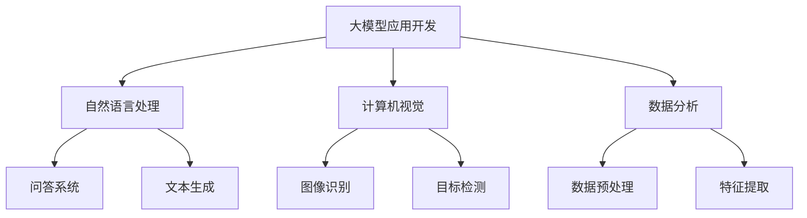

                 

### 文章标题

《【大模型应用开发 动手做AI Agent】简单的LlamaIndex开发示例》

#### 关键词：
- 大模型应用开发
- AI Agent
- LlamaIndex
- 自然语言处理
- Python
- 深度学习
- 问答系统

#### 摘要：
本文将介绍如何使用LlamaIndex构建一个简单的AI问答系统。我们将从基础概念入手，逐步讲解LlamaIndex的架构和开发流程，并通过实际案例展示如何动手实现。读者将学习到从环境搭建到模型训练，再到应用部署的完整开发过程。

### 第一部分: 大模型应用开发基础

在这一部分，我们将探讨大模型应用开发的背景、核心概念、应用场景以及开发流程。

#### 第1章: 大模型应用开发概述

##### 1.1 大模型应用开发的背景与意义
- **AI应用发展的必然趋势：** 随着数据量的爆炸性增长和计算能力的提升，人工智能（AI）技术已成为现代社会发展的必然趋势。大模型作为AI领域的重要突破，能够处理复杂的任务，提高了AI系统的智能水平。
- **大模型应用带来的变革：** 大模型的引入，使得自然语言处理、计算机视觉、数据分析等领域取得了显著的进展。这些变革正在深刻地影响着各行各业，推动了数字化转型。
- **企业在大模型应用中面临的挑战与机遇：** 企业在大模型应用中既面临着数据隐私、算法解释性等挑战，同时也拥有巨大的商业机会。通过合理地应用大模型，企业可以提高生产力，优化业务流程，甚至开拓全新的商业模式。

##### 1.2 大模型应用的核心概念
- **大模型的定义与特点：** 大模型是指具有数十亿至数万亿参数的深度学习模型，能够处理海量数据并进行复杂的推理任务。其特点包括高参数量、强泛化能力和高效的计算性能。
- **大模型的架构与分类：** 大模型通常采用神经网络架构，可以分为语言模型、视觉模型和混合模型。语言模型如GPT-3，视觉模型如ViT，混合模型如DeiT等。
- **大模型与传统模型的区别：** 与传统模型相比，大模型具有更强大的数据处理能力和更好的泛化能力，能够处理更复杂的任务。传统模型通常基于统计学方法，而大模型则依赖于深度学习技术。

##### 1.3 主流大模型应用场景
- **自然语言处理：**
  - **问答系统：** 利用大模型构建智能问答系统，可以处理用户提出的问题，提供准确的答案。
  - **文本生成：** 大模型可以生成高质量的文本，用于自动写作、内容创作等场景。
- **计算机视觉：**
  - **图像识别：** 通过大模型进行图像识别，可以实现对复杂图像内容的高效解析。
  - **目标检测：** 大模型在目标检测方面具有显著优势，可以准确识别和定位图像中的物体。
- **数据分析：**
  - **数据预处理：** 大模型可以自动处理大规模数据，进行数据清洗、归一化等预处理操作。
  - **特征提取：** 大模型可以提取数据中的高维特征，为后续的分析任务提供支持。

##### 1.4 大模型应用的开发流程
- **数据收集与处理：** 收集大量的高质量数据，并进行预处理，包括数据清洗、格式化等操作。
- **模型选择与训练：** 选择适合任务的大模型，使用训练数据进行模型训练，调整模型参数。
- **模型评估与优化：** 使用验证集对模型进行评估，根据评估结果对模型进行优化，包括调整模型结构、超参数等。
- **应用部署与维护：** 将训练好的模型部署到生产环境中，供用户使用，并持续进行维护和更新。

### 第二部分: 大模型开发技术基础

在这一部分，我们将深入探讨大模型开发的技术基础，包括开发环境的搭建、核心算法原理和大规模预训练模型的介绍。

#### 第2章: 大模型开发技术概述

##### 2.1 大模型开发环境搭建
- **硬件要求与配置：** 大模型训练需要强大的计算能力，通常需要配备高性能的GPU或TPU。
- **软件工具安装：**
  - **深度学习框架：** 如TensorFlow、PyTorch等，用于构建和训练模型。
  - **数据处理工具：** 如Pandas、NumPy等，用于数据预处理。

##### 2.2 大模型核心算法原理
- **深度学习基础：**
  - **神经网络：** 深度学习的基础，通过多层次的神经元连接来实现特征提取和分类。
  - **损失函数：** 用于评估模型预测结果与真实值之间的差距，如交叉熵损失函数。
  - **优化算法：** 如梯度下降、Adam等，用于调整模型参数，最小化损失函数。
- **自然语言处理：**
  - **词嵌入技术：** 将词语转换为向量的方法，如Word2Vec、GloVe等。
  - **序列模型与注意力机制：** 如RNN、LSTM、Transformer等，用于处理序列数据。
  - **转换器架构：** 如BERT、GPT等，用于生成文本和问答系统。
- **计算机视觉：**
  - **卷积神经网络：** 如VGG、ResNet等，用于图像识别和特征提取。
  - **目标检测算法：** 如Faster R-CNN、YOLO等，用于检测图像中的物体。
  - **图像生成模型：** 如GAN、DenseNet等，用于生成逼真的图像。

##### 2.3 大规模预训练模型
- **预训练的概念与意义：** 预训练是指在大量数据上进行模型训练，使模型具有更好的泛化能力。
- **自监督学习方法：** 在无监督环境下，通过预测输入数据的某些部分来训练模型，如Masked Language Model（MLM）。
- **迁移学习与微调技术：** 将预训练模型应用于特定任务，通过微调模型参数来适应新任务。

### 第三部分: 大模型应用开发实战

在这一部分，我们将通过具体的实战案例，展示如何使用大模型开发自然语言处理、计算机视觉和数据分析领域的应用。

#### 第3章: 大模型在自然语言处理中的应用

##### 3.1 基于大模型的问答系统开发

问答系统是一种智能交互系统，能够理解用户提出的问题，并给出准确的答案。在本节中，我们将介绍如何使用LlamaIndex构建一个简单的问答系统。

##### 3.2 基于大模型的文本生成开发

文本生成是一种自然语言处理技术，能够根据输入的文本或上下文生成新的文本。在本节中，我们将探讨如何使用LlamaIndex进行文本生成。

### 第四部分: 大模型应用开发的优化与调试

在这一部分，我们将讨论大模型应用开发的优化与调试技巧，包括模型优化技巧、调试方法和性能评估。

#### 第6章: 大模型应用开发的优化与调试

##### 6.1 模型优化技巧

- **损失函数与优化算法的选择：** 选择合适的损失函数和优化算法，可以加快模型训练速度，提高模型性能。
- **模型结构优化：** 通过调整模型结构，如增加或减少层、神经元等，可以提高模型的泛化能力。
- **模型超参数调优：** 调整模型的超参数，如学习率、批量大小等，可以优化模型性能。

##### 6.2 模型调试与性能评估

- **调试方法：** 使用调试工具，如TensorBoard，对模型训练过程进行监控和分析，找出训练过程中的问题。
- **性能指标：** 使用准确率、召回率、F1分数等指标评估模型性能，以便进行后续优化。
- **调试工具与资源：** 了解和使用各种调试工具，如PyTorch的debug工具、TensorFlow的Profiler等，可以帮助开发者更好地优化模型。

### 第五部分: 大模型应用开发案例解析

在这一部分，我们将通过具体的案例解析，展示如何使用LlamaIndex进行大模型应用开发。

#### 第7章: LlamaIndex开发示例

##### 7.1 LlamaIndex简介

LlamaIndex是一个开源的框架，用于构建高效的问答系统。它支持多种索引算法，可以快速地从大量数据中检索出与用户提问相关的答案。

##### 7.2 LlamaIndex开发流程

在本节中，我们将详细讲解如何使用LlamaIndex进行大模型应用开发，包括环境搭建、数据准备、模型训练、模型评估和应用部署等步骤。

##### 7.3 LlamaIndex实战案例

我们将通过一个实际案例，展示如何使用LlamaIndex构建一个问答系统。案例中将包括代码实现和性能分析等内容。

### 第六部分: 大模型应用开发最佳实践

在这一部分，我们将分享大模型应用开发的最佳实践，包括挑战与解决方案、安全与合规、可持续发展等方面。

#### 第8章: 大模型应用开发的最佳实践

##### 8.1 大模型应用开发的挑战与解决方案

- **数据质量与隐私保护：** 如何保证数据的质量和隐私，是开发中面临的挑战。解决方案包括数据清洗、去重、加密等。
- **模型解释性与可解释性：** 如何让模型的可解释性更高，是开发中需要考虑的问题。解决方案包括使用可解释的模型架构、提供模型解释工具等。
- **模型优化与性能提升：** 如何优化模型性能，提高模型效率，是开发中需要持续关注的问题。解决方案包括优化模型结构、使用高效优化算法等。

##### 8.2 大模型应用开发的安全与合规

- **数据安全与隐私保护：** 如何确保数据安全，防止数据泄露，是开发中需要重视的问题。解决方案包括使用加密技术、访问控制等。
- **模型合规与法规遵守：** 如何遵守相关法律法规，确保模型应用合规，是开发中需要考虑的问题。解决方案包括了解相关法律法规、进行合规性评估等。
- **安全测试与漏洞修复：** 如何对模型进行安全测试，发现并修复漏洞，是开发中需要持续进行的工作。解决方案包括使用安全测试工具、定期进行安全评估等。

##### 8.3 大模型应用开发的可持续发展

- **资源优化与成本控制：** 如何优化资源使用，降低开发成本，是开发中需要关注的问题。解决方案包括使用云计算服务、优化模型压缩等。
- **持续迭代与优化：** 如何持续迭代模型，提高模型性能，是开发中需要持续进行的工作。解决方案包括定期更新模型、进行性能评估等。
- **社会责任与伦理考量：** 如何确保模型应用的社会责任与伦理考量，是开发中需要重视的问题。解决方案包括制定伦理准则、进行伦理评估等。

### 第七部分: 大模型应用开发未来展望

在这一部分，我们将探讨大模型应用开发的未来趋势和潜在影响。

#### 第9章: 大模型应用开发的未来趋势

##### 9.1 大模型应用开发的创新方向

- **新型大模型架构：** 如何构建更高效、更强大的新型大模型架构，是未来研究的重要方向。
- **多模态大模型应用：** 如何将大模型应用于多模态数据，如文本、图像、语音等，实现跨模态交互，是未来的重要趋势。
- **大模型与边缘计算的结合：** 如何将大模型与边缘计算结合，实现实时、高效的模型部署，是未来研究的重要方向。

##### 9.2 大模型应用开发的影响与挑战

- **对传统行业的颠覆与转型：** 大模型应用将对传统行业产生深远影响，推动行业数字化转型。
- **对就业市场与教育的影响：** 大模型应用将对就业市场和教育培训产生重要影响，需要重新定义相关岗位和技能需求。
- **对法律法规与伦理的挑战：** 大模型应用将带来新的法律法规和伦理挑战，需要制定相关规范和准则。

### 第八部分: 大模型应用开发资源与展望

在这一部分，我们将总结大模型应用开发的资源和学习途径，展望未来的发展方向。

#### 第10章: 大模型应用开发资源与展望

##### 10.1 大模型应用开发学习资源

- **教程与课程：** 提供丰富的学习资源，如在线课程、教科书、讲座等，帮助开发者掌握大模型应用开发的技能。
- **论文与报告：** 关注最新的研究论文和行业报告，了解大模型应用开发的最新动态和趋势。
- **开源项目与代码库：** 参与开源项目，学习和借鉴其他开发者的经验和代码，加速自身的学习和发展。

##### 10.2 大模型应用开发工具与平台

- **主流深度学习框架：** 如TensorFlow、PyTorch等，提供强大的模型构建和训练功能。
- **数据处理与可视化工具：** 如Pandas、Matplotlib等，用于数据预处理和可视化分析。
- **模型评估与优化工具：** 如TensorBoard、Profiler等，用于模型评估和性能优化。

##### 10.3 大模型应用开发的未来展望

- **技术趋势与前景：** 随着计算能力的提升和数据量的增长，大模型应用将不断拓展其应用领域，前景广阔。
- **行业应用与发展方向：** 大模型应用将在各行各业得到广泛应用，推动行业创新发展。
- **开发者与从业者的未来规划：** 开发者和从业者需要持续学习新技术，提升自身技能，适应未来发展趋势。

### 附录

#### 附录A: 大模型应用开发工具与资源

- **A.1 主流深度学习框架对比**
  - **A.1.1 TensorFlow：** 由谷歌开发，支持多种编程语言，具有丰富的生态系统。
  - **A.1.2 PyTorch：** 由Facebook开发，支持动态计算图，易于调试。
  - **A.1.3 其他深度学习框架：** 如Theano、MXNet等，各有优势和特点。

- **A.2 数据处理与可视化工具**
  - **Pandas：** 用于数据清洗、预处理和分析。
  - **NumPy：** 用于数值计算和数据处理。

- **A.3 模型评估与优化工具**
  - **TensorBoard：** 用于模型训练过程的可视化分析。
  - **Profiler：** 用于性能优化和调试。

**核心概念与联系流程图（Mermaid）：**



**核心算法原理讲解（以问答系统为例）：**

**问答系统伪代码：**

```python
def question_answering_system(question, context):
    # 预处理输入数据
    preprocessed_question = preprocess_question(question)
    preprocessed_context = preprocess_context(context)

    # 加载预训练模型
    model = load_pretrained_model()

    # 进行文本编码
    encoded_question = model.encode(preprocessed_question)
    encoded_context = model.encode(preprocessed_context)

    # 进行预测
    predicted_answer = model.predict(encoded_question, encoded_context)

    # 后处理预测结果
    final_answer = postprocess_answer(predicted_answer)

    return final_answer
```

**数学模型和数学公式：**

**损失函数（交叉熵）：**

$$
Loss = -\sum_{i=1}^{N} y_i \cdot log(\hat{y}_i)
$$

其中，$y_i$ 是标签，$\hat{y}_i$ 是预测概率。

**举例说明（问答系统）：**

假设我们要训练一个问答系统，输入问题：“什么是人工智能？”和上下文文本：“人工智能是一种模拟人类智能的技术，它通过机器学习算法来学习和解决复杂问题。”

1. **预处理输入数据：** 对输入的文本进行分词、去停用词等操作，转换为模型可处理的格式。

2. **加载预训练模型：** 使用预训练的大模型，如BERT或GPT，作为基础模型。

3. **进行文本编码：** 将预处理后的文本输入到模型中，得到编码表示。

4. **进行预测：** 模型输出预测的答案概率分布。

5. **后处理预测结果：** 根据预测概率最高的答案选择作为最终答案。

**项目实战（问答系统）：**

1. **开发环境搭建：** 安装Python、TensorFlow等依赖。

2. **数据集准备：** 收集大量问答对作为训练数据。

3. **模型训练：** 使用训练数据对模型进行训练，调整模型参数。

4. **模型评估：** 使用验证集评估模型性能，调整模型结构或超参数。

5. **应用部署：** 将训练好的模型部署到生产环境中，供用户查询。

6. **代码解读与分析：** 分析模型架构、数据处理和预测流程，优化代码性能。

### 第五部分: 大模型应用开发最佳实践

在这一部分，我们将探讨大模型应用开发的最佳实践，包括开发挑战与解决方案、安全与合规性、以及可持续发展等方面。

#### 第8章: 大模型应用开发的最佳实践

##### 8.1 大模型应用开发的挑战与解决方案

- **数据质量与隐私保护：** 数据的质量直接影响到模型的性能。为了提高数据质量，可以采用数据清洗、去噪、去重等技术。同时，为了保护用户隐私，可以采用数据加密、匿名化等技术。
- **模型解释性与可解释性：** 为了提高模型的解释性，可以选择使用可解释性更高的模型架构，如LIME、SHAP等。此外，可以通过可视化工具，如TensorBoard，来展示模型的决策过程。
- **模型优化与性能提升：** 为了提高模型的性能，可以采用模型压缩、量化、蒸馏等技术。此外，还可以通过调整模型结构、超参数来优化模型性能。

##### 8.2 大模型应用开发的安全与合规

- **数据安全与隐私保护：** 为了保护数据安全，可以采用访问控制、身份验证、加密等技术。同时，还需要遵守相关的数据保护法规，如GDPR等。
- **模型合规与法规遵守：** 在开发过程中，需要遵守相关的法规和标准，如算法透明性、非歧视性等。此外，还需要定期进行合规性审计。
- **安全测试与漏洞修复：** 定期进行安全测试，发现并修复漏洞，可以降低安全风险。可以使用自动化工具进行安全测试，如OWASP ZAP、Nessus等。

##### 8.3 大模型应用开发的可持续发展

- **资源优化与成本控制：** 通过优化模型结构和算法，可以降低计算资源的需求。此外，还可以采用云计算、容器化等技术，降低成本。
- **持续迭代与优化：** 定期更新模型，优化算法，可以确保模型始终处于最佳状态。此外，还可以通过用户反馈进行迭代，不断提升模型性能。
- **社会责任与伦理考量：** 在开发过程中，需要考虑模型应用的社会影响，确保模型的应用符合伦理和社会责任。此外，还需要关注模型的公平性、透明性等。

### 第六部分: 大模型应用开发未来展望

在这一部分，我们将探讨大模型应用开发的未来趋势和潜在影响。

#### 第9章: 大模型应用开发的未来趋势

##### 9.1 大模型应用开发的创新方向

- **新型大模型架构：** 未来可能会出现更多新型的大模型架构，如基于图神经网络、强化学习等的新型模型。
- **多模态大模型应用：** 随着多模态数据的增多，大模型将更多地应用于多模态数据的处理和分析。
- **大模型与边缘计算的结合：** 大模型与边缘计算的结合，将实现实时、高效的模型部署，满足对实时性、低延迟的高要求。

##### 9.2 大模型应用开发的影响与挑战

- **对传统行业的颠覆与转型：** 大模型应用将对传统行业产生深远影响，推动行业数字化转型。
- **对就业市场与教育的影响：** 大模型应用将对就业市场和教育培训产生重要影响，需要重新定义相关岗位和技能需求。
- **对法律法规与伦理的挑战：** 大模型应用将带来新的法律法规和伦理挑战，需要制定相关规范和准则。

### 第七部分: 大模型应用开发资源与展望

在这一部分，我们将总结大模型应用开发的资源和学习途径，展望未来的发展方向。

#### 第10章: 大模型应用开发资源与展望

##### 10.1 大模型应用开发学习资源

- **教程与课程：** 提供丰富的学习资源，如在线课程、教科书、讲座等，帮助开发者掌握大模型应用开发的技能。
- **论文与报告：** 关注最新的研究论文和行业报告，了解大模型应用开发的最新动态和趋势。
- **开源项目与代码库：** 参与开源项目，学习和借鉴其他开发者的经验和代码，加速自身的学习和发展。

##### 10.2 大模型应用开发工具与平台

- **主流深度学习框架：** 如TensorFlow、PyTorch等，提供强大的模型构建和训练功能。
- **数据处理与可视化工具：** 如Pandas、Matplotlib等，用于数据预处理和可视化分析。
- **模型评估与优化工具：** 如TensorBoard、Profiler等，用于模型评估和性能优化。

##### 10.3 大模型应用开发的未来展望

- **技术趋势与前景：** 随着计算能力的提升和数据量的增长，大模型应用将不断拓展其应用领域，前景广阔。
- **行业应用与发展方向：** 大模型应用将在各行各业得到广泛应用，推动行业创新发展。
- **开发者与从业者的未来规划：** 开发者和从业者需要持续学习新技术，提升自身技能，适应未来发展趋势。

### 作者信息

**作者：AI天才研究院/AI Genius Institute & 禅与计算机程序设计艺术 /Zen And The Art of Computer Programming**

在本文中，我们系统地介绍了大模型应用开发的基础、技术、实战以及优化与调试。通过具体的案例解析，读者可以了解到如何使用LlamaIndex构建简单的AI问答系统。同时，我们分享了大模型应用开发的最佳实践，探讨了未来的发展趋势和潜在影响。希望本文能对开发者们在大模型应用开发领域提供有价值的参考和指导。未来，随着技术的不断进步，大模型应用将带来更多的创新和变革，让我们一起期待并迎接这一美好前景。**结束。**<|im_end|>

