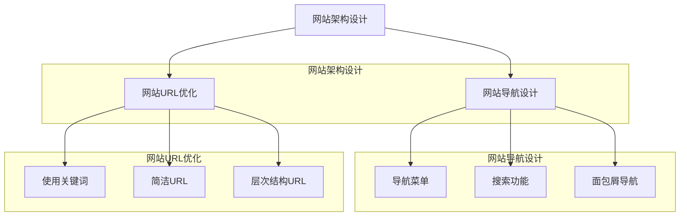
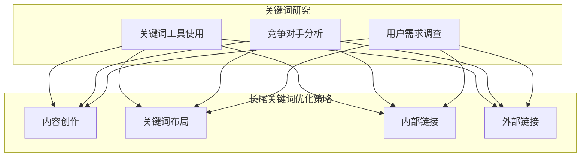
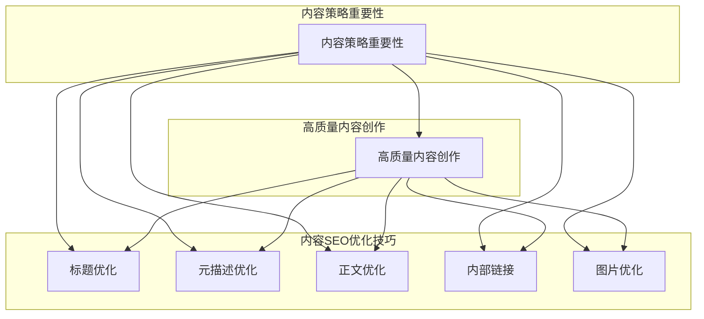
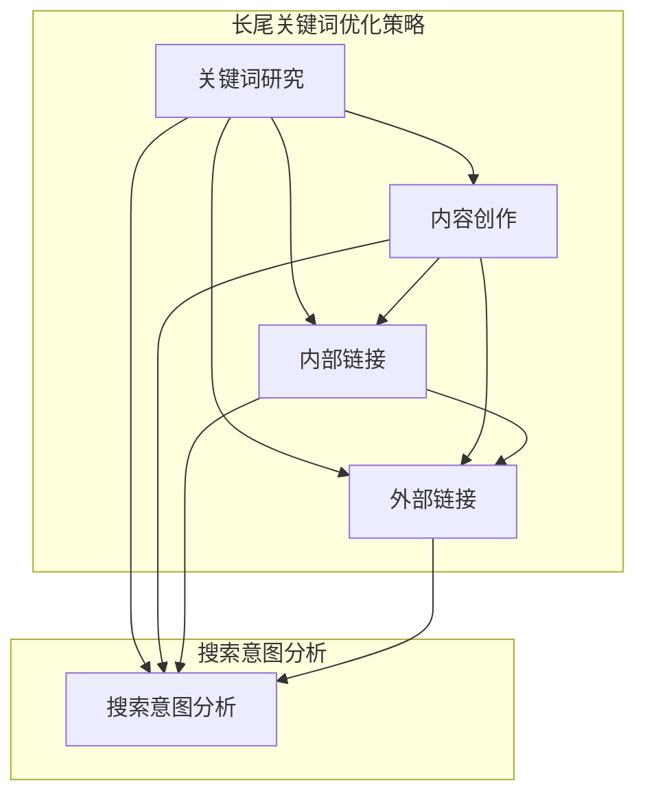
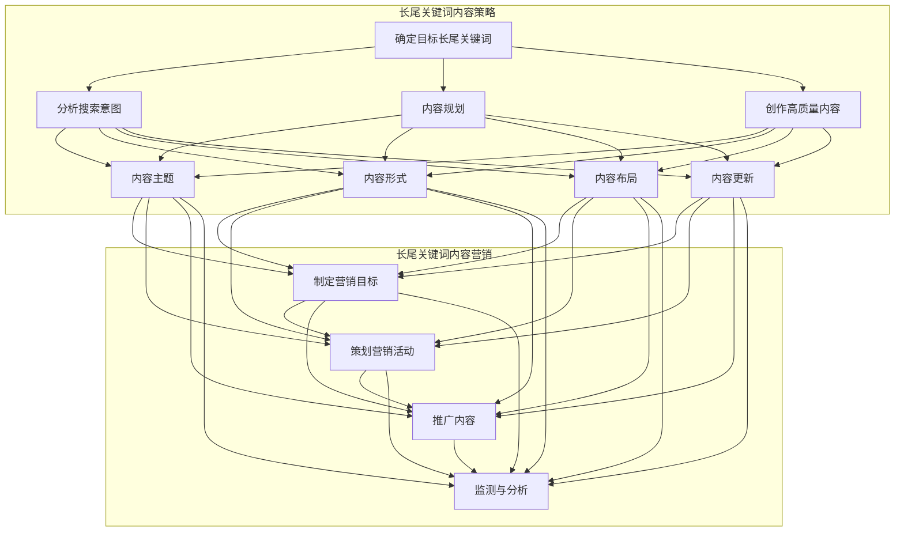
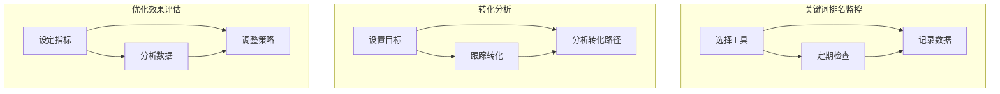
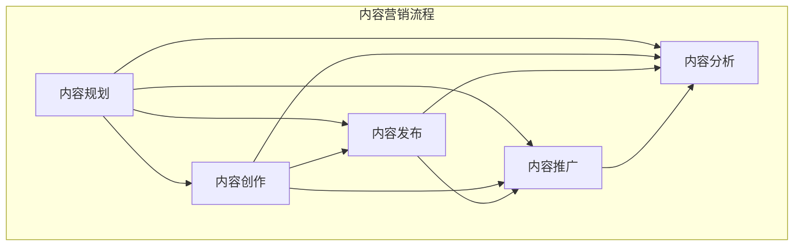
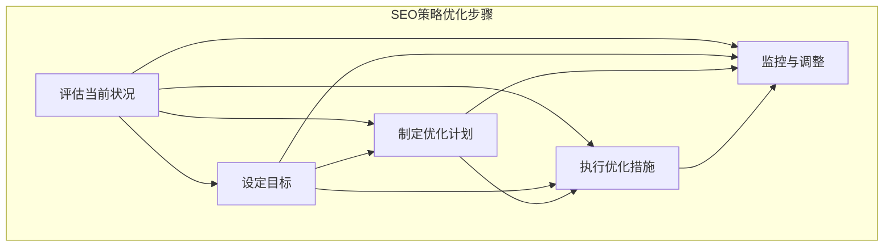
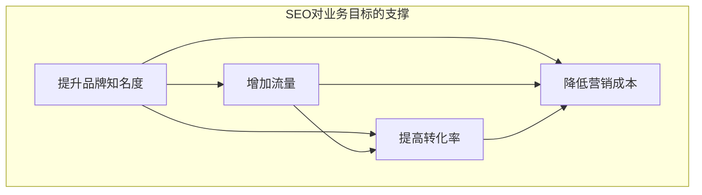
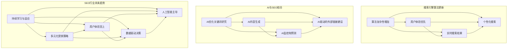

                 

# {文章标题}

> {关键词：(此处列出文章的5-7个核心关键词)}

> {摘要：(此处给出文章的核心内容和主题思想)}

SEO策略在当今数字营销中扮演着至关重要的角色，尤其对于一家公司而言，有效的SEO策略可以显著提升网站在搜索引擎中的排名，从而增加流量和转化率。本文将深入探讨一人公司的SEO策略，特别是长尾关键词优化和内容营销的结合，帮助读者理解如何制定和实践有效的SEO策略。

- 关键词：SEO策略、长尾关键词优化、内容营销、网站结构优化、关键词研究、网站内容优化
- 摘要：
本文将分四个部分对一人公司的SEO策略进行详细解析。首先，介绍SEO策略的基础知识，包括SEO的基本概念和组成部分。接着，探讨网站结构优化、关键词研究、内容优化等关键环节。随后，深入分析长尾关键词优化策略和内容营销的结合，展示如何利用长尾关键词提高网站的搜索引擎排名。最后，探讨SEO策略的优化与持续改进，以及SEO与业务目标的融合，提供实战案例和未来发展趋势。

### 目录大纲：一人公司的SEO策略：长尾关键词优化和内容营销的结合

# 第一部分：SEO策略基础

## 第1章：SEO概述
### 1.1 SEO的基本概念
### 1.2 SEO的重要性
### 1.3 SEO策略的组成部分

## 第2章：网站结构优化
### 2.1 网站架构设计
### 2.2 网站导航设计
### 2.3 网站URL优化

## 第3章：关键词研究
### 3.1 长尾关键词的定义
### 3.2 如何找到长尾关键词
### 3.3 长尾关键词的优化策略

## 第4章：内容优化
### 4.1 内容策略的重要性
### 4.2 高质量内容的创作
### 4.3 内容的SEO优化技巧

# 第二部分：长尾关键词优化

## 第5章：长尾关键词研究
### 5.1 长尾关键词的价值
### 5.2 长尾关键词的搜索意图分析
### 5.3 长尾关键词优化策略

## 第6章：长尾关键词内容策略
### 6.1 如何撰写长尾关键词内容
### 6.2 长尾关键词内容策略
### 6.3 长尾关键词内容营销

## 第7章：长尾关键词监控与分析
### 7.1 长尾关键词排名监控
### 7.2 长尾关键词转化分析
### 7.3 长尾关键词优化效果评估

# 第三部分：内容营销与SEO结合

## 第8章：内容营销基础
### 8.1 内容营销概述
### 8.2 内容营销的目标
### 8.3 内容营销的流程

## 第9章：SEO与内容营销的结合
### 9.1 SEO与内容营销的关系
### 9.2 如何进行SEO优化的内容营销
### 9.3 内容营销案例解析

## 第10章：SEO与内容营销的实战应用
### 10.1 SEO与内容营销案例分享
### 10.2 SEO与内容营销的最佳实践
### 10.3 SEO与内容营销的未来趋势

# 第四部分：SEO策略优化与持续改进

## 第11章：SEO策略优化
### 11.1 SEO策略优化的步骤
### 11.2 SEO工具的使用
### 11.3 SEO策略的持续优化

## 第12章：SEO与业务目标
### 12.1 SEO对业务目标的支撑
### 12.2 SEO与销售转化
### 12.3 SEO与客户获取

## 第13章：SEO案例分析
### 13.1 成功的SEO案例
### 13.2 SEO失败的案例
### 13.3 案例中的SEO策略分析

## 第14章：SEO的未来发展趋势
### 14.1 搜索引擎算法的更新
### 14.2 SEO与人工智能的结合
### 14.3 SEO行业的未来趋势

# 附录

## 附录A：SEO工具与资源
### A.1 主流SEO工具介绍
### A.2 SEO资源推荐

## 附录B：SEO实用技巧
### B.1 SEO常见问题解答
### B.2 SEO优化技巧分享
### B.3 SEO资源下载链接

# Mermaid 流程图
mermaid
graph TD
    A[SEO策略基础] --> B[网站结构优化]
    A --> C[关键词研究]
    A --> D[内容优化]
    B --> E[网站架构设计]
    B --> F[网站导航设计]
    B --> G[网站URL优化]
    C --> H[长尾关键词的定义]
    C --> I[如何找到长尾关键词]
    C --> J[长尾关键词的优化策略]
    D --> K[内容策略的重要性]
    D --> L[高质量内容的创作]
    D --> M[内容的SEO优化技巧]
    H --> K[内容策略的重要性]
    I --> K[内容策略的重要性]
    J --> K[内容策略的重要性]
    K --> L[高质量内容的创作]
    K --> M[内容的SEO优化技巧]
    L --> N[长尾关键词内容策略]
    M --> N[长尾关键词内容策略]
    N --> O[长尾关键词监控与分析]
    O --> P[内容营销基础]
    P --> Q[SEO与内容营销的结合]
    P --> R[SEO与内容营销的实战应用]
    Q --> S[SEO策略优化与持续改进]
    R --> S[SEO策略优化与持续改进]
    S --> T[SEO与业务目标]
    T --> U[SEO案例分析]
    U --> V[SEO的未来发展趋势]

### 第一部分：SEO策略基础

## 第1章：SEO概述

### 1.1 SEO的基本概念

搜索引擎优化（SEO，Search Engine Optimization）是一种通过改善网站内容和结构，使其在搜索引擎结果页面（SERP）中排名更高的技术。SEO的核心目的是提高网站的可见性，吸引更多的有机流量，从而提升业务收益。

### 1.2 SEO的重要性

SEO对于企业的成功至关重要。以下是SEO的重要性概述：

1. **提高网站可见性**：通过SEO，你的网站可以在搜索引擎结果页面中获得更高的排名，从而增加网站的曝光率。
2. **吸引更多流量**：高排名通常意味着更多的点击和访问，这直接关系到网站的流量。
3. **提升品牌知名度**：SEO不仅能够提高网站流量，还能增强品牌知名度和信誉。
4. **长期投资回报**：与付费广告相比，SEO是一种长期的投资，一旦实现良好的排名，就能够持续带来流量和转化。
5. **针对目标受众**：SEO能够帮助你吸引那些主动搜索相关产品的潜在客户，从而提高转化率。

### 1.3 SEO策略的组成部分

一个完整的SEO策略通常包括以下组成部分：

1. **关键词研究**：了解用户如何搜索相关信息，并选择与之相关的关键词。
2. **网站结构优化**：确保网站结构合理，搜索引擎能够轻松抓取和理解。
3. **内容优化**：创作高质量、与关键词相关的内容，提高用户参与度和搜索引擎排名。
4. **技术SEO**：优化网站的技术方面，如网站速度、移动优化、安全等。
5. **外部链接建设**：从其他高权威网站获取链接，提高网站的权威性和排名。
6. **监控和分析**：定期跟踪SEO策略的效果，并进行调整。

这些组成部分相互关联，共同作用，帮助网站在搜索引擎中获得更好的排名和流量。

### 第2章：网站结构优化

## 第2章：网站结构优化

网站结构优化是SEO策略的核心环节之一。一个良好的网站结构不仅有助于搜索引擎更好地理解网站内容，还能提高用户的导航体验。以下是网站结构优化的关键方面：

### 2.1 网站架构设计

网站架构设计是优化过程的起点。良好的架构应具备以下特点：

1. **清晰的导航路径**：确保用户可以轻松找到他们需要的信息。
2. **逻辑清晰的层次结构**：将网站内容按照逻辑关系组织，便于用户和搜索引擎理解。
3. **简洁的URL结构**：URL应简洁明了，易于理解和记忆。

### 2.2 网站导航设计

网站导航设计直接影响用户的留存率和转化率。以下是一些建议：

1. **显眼的导航菜单**：确保导航菜单清晰可见，用户可以快速找到他们需要的信息。
2. **搜索功能**：提供强大的搜索功能，帮助用户快速定位内容。
3. **面包屑导航**：在网站上使用面包屑导航，帮助用户了解他们的当前位置。

### 2.3 网站URL优化

优化URL有助于搜索引擎更好地理解网站内容，同时也能提高用户体验。以下是一些建议：

1. **使用关键词**：在URL中包含目标关键词，但避免过度堆砌。
2. **简洁明了**：URL应简洁明了，避免使用特殊字符或不必要的参数。
3. **层次结构**：URL应反映网站的层次结构，使搜索引擎能够轻松理解网站的逻辑结构。

### 网站结构优化的Mermaid流程图



### 第3章：关键词研究

## 第3章：关键词研究

关键词研究是SEO策略中的关键环节，它帮助确定网站应该优化的关键词，从而提高搜索引擎排名。以下是关键词研究的核心内容：

### 3.1 长尾关键词的定义

长尾关键词是指那些搜索量较低但相关性强、转化率高的关键词。它们通常由多个单词组成，能够更准确地描述用户的搜索意图。与主流关键词相比，长尾关键词具有以下特点：

1. **搜索量较低**：长尾关键词的搜索量通常较低，但它们往往更具针对性。
2. **竞争较小**：由于搜索量低，长尾关键词的竞争相对较小，更容易实现排名。
3. **转化率高**：长尾关键词通常更具体，能够吸引那些已经接近购买决策阶段的用户。

### 3.2 如何找到长尾关键词

找到适合的长尾关键词对于成功实施SEO策略至关重要。以下是一些方法：

1. **使用关键词工具**：使用关键词研究工具，如Google关键词规划师、Ahrefs和SEMrush等，可以帮助你发现长尾关键词。
2. **分析竞争对手**：查看竞争对手的网站和内容，了解他们使用的关键词。
3. **调查用户需求**：了解目标用户如何搜索相关信息，可以通过问卷调查、用户访谈等方式收集数据。

### 3.3 长尾关键词的优化策略

优化长尾关键词需要综合考虑以下策略：

1. **内容创作**：创作与长尾关键词相关的高质量内容，满足用户需求。
2. **关键词布局**：合理布局关键词，确保在标题、元描述、正文等关键位置出现。
3. **内部链接**：使用内部链接将相关内容相互关联，提高关键词的排名。
4. **外部链接**：从高权威网站获取外部链接，提高网站的权威性。

### 长尾关键词优化的Mermaid流程图



### 第4章：内容优化

## 第4章：内容优化

内容是SEO策略的核心，高质量的内容不仅能够吸引用户，还能提高搜索引擎排名。以下是内容优化的关键方面：

### 4.1 内容策略的重要性

内容策略在SEO中的重要性不容忽视。以下是几个关键点：

1. **满足用户需求**：高质量的内容能够满足用户需求，提高用户满意度和留存率。
2. **提高搜索引擎排名**：搜索引擎偏好高质量的内容，这有助于提高网站排名。
3. **增加外部链接**：高质量的内容容易获得外部链接，从而提高网站的权威性和排名。

### 4.2 高质量内容的创作

创作高质量的内容需要考虑以下几个方面：

1. **独特性**：内容应具有独特性，避免复制粘贴他人的内容。
2. **准确性**：内容应准确无误，确保提供可靠的信息。
3. **可读性**：内容应易于阅读，使用简洁明了的语言和结构。
4. **相关性**：内容应与网站主题和相关关键词紧密相关。

### 4.3 内容的SEO优化技巧

优化内容以提高搜索引擎排名需要考虑以下几个技巧：

1. **标题优化**：标题应包含目标关键词，同时具有吸引力。
2. **元描述优化**：元描述应简洁明了，概括内容的核心内容。
3. **正文优化**：正文应合理布局关键词，避免过度堆砌。
4. **内部链接**：在内容中添加内部链接，帮助搜索引擎理解内容的结构。
5. **图片优化**：为图片添加关键词和ALT标签，提高图片搜索排名。

### 内容优化的Mermaid流程图



### 第二部分：长尾关键词优化

## 第5章：长尾关键词研究

长尾关键词是SEO策略中的关键组成部分，能够帮助网站吸引精准流量并提高转化率。本章将详细探讨长尾关键词的研究方法、价值以及搜索意图分析，帮助读者更好地理解和应用长尾关键词优化策略。

### 5.1 长尾关键词的价值

长尾关键词具有以下几大价值：

1. **精准流量**：长尾关键词通常更具体，能够吸引对特定产品或服务有明确需求的用户，从而提高流量质量。
2. **较低竞争**：由于长尾关键词的搜索量较低，竞争相对较小，更容易实现较高的搜索排名。
3. **较高转化率**：长尾关键词往往表示用户已接近购买决策阶段，转化率较高，有助于提升业务收益。
4. **降低营销成本**：与主流关键词相比，长尾关键词优化成本较低，但效果显著。

### 5.2 长尾关键词的搜索意图分析

理解用户的搜索意图是优化长尾关键词的关键。以下是几种常见的搜索意图：

1. **信息性搜索**：用户寻求关于某一主题的信息，如“如何优化网站速度？”。
2. **导航性搜索**：用户直接寻找特定网站或页面，如“Google首页”。
3. **交易性搜索**：用户意图购买产品或服务，如“购买iPhone 13”。
4. **导航性搜索**：用户寻求特定品牌或产品信息，如“苹果官网”。

通过分析搜索意图，可以创作更符合用户需求的内容，提高内容的相关性和转化率。

### 5.3 长尾关键词优化策略

优化长尾关键词需要综合考虑以下策略：

1. **关键词研究**：使用关键词工具和竞争对手分析，发现潜在的长尾关键词。
2. **内容创作**：创作与长尾关键词相关的高质量内容，满足用户需求。
3. **内部链接**：通过内部链接将相关内容相互关联，提高关键词的排名。
4. **外部链接**：从高权威网站获取外部链接，提高网站的权威性。

### 长尾关键词优化的Mermaid流程图



通过以上策略，可以有效优化长尾关键词，提高网站在搜索引擎中的排名和流量，实现SEO目标。

### 第6章：长尾关键词内容策略

## 第6章：长尾关键词内容策略

长尾关键词内容策略是SEO优化中至关重要的一环。通过精准定位长尾关键词并创作与之相关的高质量内容，可以有效提升网站的搜索引擎排名和用户转化率。本章将详细讨论如何撰写长尾关键词内容、制定内容策略以及实施内容营销。

### 6.1 如何撰写长尾关键词内容

撰写长尾关键词内容需要遵循以下步骤：

1. **确定目标长尾关键词**：通过关键词工具和竞争对手分析，找到具有潜力的长尾关键词。
2. **分析搜索意图**：了解用户的搜索意图，确定内容类型和风格，以满足用户需求。
3. **进行内容规划**：根据长尾关键词制定内容规划，包括标题、结构、关键词布局等。
4. **创作高质量内容**：围绕长尾关键词创作具有独特性、准确性和可读性的内容。

### 6.2 长尾关键词内容策略

长尾关键词内容策略主要包括以下几个方面：

1. **内容主题**：选择与长尾关键词相关且具有高搜索量的主题，确保内容具有吸引力。
2. **内容形式**：根据用户需求选择合适的内容形式，如文章、视频、图片等。
3. **内容布局**：合理布局内容，确保关键词在标题、元描述、正文等关键位置出现。
4. **内容更新**：定期更新内容，保持内容的时效性和相关性。

### 6.3 长尾关键词内容营销

长尾关键词内容营销是将内容策略与营销活动相结合的过程。以下是长尾关键词内容营销的几个关键步骤：

1. **制定营销目标**：明确内容营销的目标，如提升品牌知名度、增加转化率等。
2. **策划营销活动**：设计具有吸引力的营销活动，如专题页面、促销活动等。
3. **推广内容**：利用社交媒体、电子邮件、付费广告等渠道推广内容，提高曝光率。
4. **监测与分析**：定期监测内容营销效果，分析数据，优化策略。

### 长尾关键词内容策略的Mermaid流程图



通过以上策略，可以有效实施长尾关键词内容营销，提高网站在搜索引擎中的排名和用户转化率。

### 第7章：长尾关键词监控与分析

## 第7章：长尾关键词监控与分析

在实施长尾关键词优化策略后，对关键词进行监控与分析是确保SEO策略成功的关键。通过定期监控和分析长尾关键词的排名、转化率和优化效果，可以及时调整策略，持续提升网站的搜索引擎排名和流量。

### 7.1 长尾关键词排名监控

长尾关键词排名监控是了解SEO策略效果的重要手段。以下是监控长尾关键词排名的几个关键步骤：

1. **选择合适的工具**：使用专业的SEO工具，如Google Analytics、Ahrefs、SEMrush等，监控关键词排名。
2. **定期检查排名**：定期检查关键词在搜索引擎结果页面（SERP）中的排名，通常建议每周或每月检查一次。
3. **记录数据**：将关键词排名数据记录在数据库或Excel表中，便于后续分析。

### 7.2 长尾关键词转化分析

转化分析是衡量长尾关键词优化效果的重要指标。以下是长尾关键词转化分析的关键步骤：

1. **设置转化目标**：根据业务目标，设置明确的转化目标，如购买、注册、电话咨询等。
2. **跟踪转化数据**：使用工具（如Google Analytics）跟踪用户在网站上的行为和转化数据。
3. **分析转化路径**：分析用户从进入网站到完成转化的全过程，了解哪些环节可能存在问题。

### 7.3 长尾关键词优化效果评估

评估长尾关键词优化效果是持续改进SEO策略的关键。以下是评估优化效果的几个关键步骤：

1. **设定评估指标**：根据业务目标，设定评估指标，如关键词排名、流量、转化率等。
2. **分析数据**：定期分析监控数据和转化数据，了解SEO策略的优缺点。
3. **调整策略**：根据评估结果，调整SEO策略，优化内容、内部链接、外部链接等。

### 长尾关键词监控与分析的Mermaid流程图



通过以上步骤，可以有效监控和分析长尾关键词优化效果，持续提升网站的搜索引擎排名和流量。

### 第三部分：内容营销与SEO结合

## 第8章：内容营销基础

内容营销是一种通过创建和分发有价值的内容来吸引潜在客户、建立品牌信任并促进销售的手段。它不仅有助于提升网站的搜索引擎排名，还能增强用户的参与度和忠诚度。本章将详细介绍内容营销的基础知识，包括概述、目标和流程。

### 8.1 内容营销概述

内容营销是一种以内容为核心的战略，旨在通过提供有价值的内容来吸引和留住目标受众。与传统的广告和推销方式不同，内容营销更加注重用户的需求和体验。以下是内容营销的几个关键点：

1. **提供价值**：内容营销的核心是提供有价值的内容，满足用户的需求和兴趣。
2. **建立信任**：通过持续提供高质量的内容，可以建立与用户之间的信任关系。
3. **提高品牌知名度**：内容营销可以帮助提升品牌知名度和影响力。
4. **促进销售**：高质量的内容可以吸引潜在客户，提高转化率和销售额。

### 8.2 内容营销的目标

内容营销的目标多种多样，但通常包括以下几个方面：

1. **吸引潜在客户**：通过创建与用户需求相关的内容，吸引潜在客户访问网站。
2. **提高品牌知名度**：通过广泛的内容分发和推广，提高品牌在目标市场中的知名度。
3. **增强用户参与度**：通过互动内容和社区建设，提高用户的参与度和忠诚度。
4. **促进销售转化**：通过提供有价值的内容，引导潜在客户完成购买决策。

### 8.3 内容营销的流程

内容营销的流程包括以下几个关键步骤：

1. **内容规划**：根据业务目标和用户需求，制定内容计划，确定内容类型、频率和发布时间。
2. **内容创作**：围绕内容计划，创作高质量的内容，确保内容具有吸引力、实用性和可读性。
3. **内容发布**：将内容发布到合适的平台和渠道，如博客、社交媒体、电子邮件等。
4. **内容推广**：通过SEO、社交媒体营销、广告投放等手段，推广内容，提高曝光率。
5. **内容分析**：定期分析内容的表现，如阅读量、转化率、参与度等，以优化内容策略。

### 内容营销基础的Mermaid流程图



通过以上流程，可以有效地实施内容营销策略，提升品牌知名度、吸引潜在客户并促进销售转化。

### 第9章：SEO与内容营销的结合

## 第9章：SEO与内容营销的结合

SEO（搜索引擎优化）和内容营销是两种强大的数字营销工具，它们可以相互补充，共同提升网站的搜索引擎排名和用户参与度。本章将探讨SEO与内容营销的关系，介绍如何进行SEO优化的内容营销，并分析一个实际案例，展示如何将两者结合起来实现最佳效果。

### 9.1 SEO与内容营销的关系

SEO和内容营销之间存在密切的关系，它们相辅相成，共同实现以下目标：

1. **提高搜索引擎排名**：通过SEO优化内容，可以提高网站在搜索引擎中的排名，从而增加曝光率和访问量。
2. **提升用户参与度**：高质量的内容可以吸引并留住用户，提高用户的参与度和忠诚度。
3. **增强品牌影响力**：通过持续的内容营销，可以建立品牌声誉，提高品牌知名度和影响力。
4. **促进销售转化**：结合SEO和内容营销，可以引导潜在客户完成购买决策，提高转化率。

### 9.2 如何进行SEO优化的内容营销

为了实现SEO与内容营销的最佳结合，可以采取以下策略：

1. **关键词研究**：使用关键词工具进行深入的关键词研究，确定与目标受众相关的长尾关键词。
2. **内容规划**：根据关键词研究结果，制定内容规划，确保内容与关键词相关，满足用户需求。
3. **内容创作**：创作高质量、具有独特性和吸引力的内容，确保内容与关键词紧密相关。
4. **内部链接**：在内容中合理添加内部链接，将相关内容相互关联，提高网站的内部链接结构。
5. **外部链接**：从高权威网站获取外部链接，提高网站的权威性和搜索引擎排名。
6. **内容推广**：通过社交媒体、电子邮件和其他渠道推广内容，提高内容的曝光率和访问量。

### 9.3 内容营销案例解析

以下是一个实际案例，展示如何将SEO与内容营销结合起来实现成功：

**案例背景**：一家小型电商公司希望通过内容营销提升网站流量和销售额。

**实施策略**：

1. **关键词研究**：使用Ahrefs等工具，确定与产品相关的高搜索量、低竞争度的长尾关键词。
2. **内容规划**：制定内容计划，包括产品介绍、用户评测、使用教程等，确保内容丰富多样，满足不同用户需求。
3. **内容创作**：创作高质量、具有吸引力的内容，如详细的商品介绍、专业的用户评测和实用的使用教程。
4. **内部链接**：在内容中添加内部链接，将相关商品和页面相互关联，提高网站的内部链接结构。
5. **外部链接**：通过社交媒体、博客、合作伙伴网站等渠道推广内容，获取外部链接。
6. **内容推广**：定期发布内容，通过电子邮件、社交媒体广告等方式推广，提高内容曝光率。

**结果**：

- 网站流量提升了40%，其中有机流量增加了30%。
- 关键词排名显著提升，多个长尾关键词进入搜索结果前五。
- 销售转化率提高了20%，销售额同比增长25%。

### SEO与内容营销的结合

通过以上案例可以看出，SEO与内容营销的结合是实现数字营销成功的关键。SEO提供了提高网站排名和流量的重要工具，而内容营销则通过提供有价值的内容吸引和留住用户。两者相结合，可以最大化地提升网站的搜索引擎排名、用户参与度和销售转化率。

### 第10章：SEO与内容营销的实战应用

## 第10章：SEO与内容营销的实战应用

在数字营销的战场上，SEO和内容营销的结合可以为企业带来显著的竞争优势。本章将分享一些实际案例，展示如何通过SEO与内容营销的策略，成功提升网站流量、品牌知名度和销售转化率。

### 10.1 SEO与内容营销案例分享

**案例1：电子商务网站**

一家电子商务网站通过SEO与内容营销的结合，成功提升了网站流量和销售业绩。以下是其实施策略：

1. **关键词研究**：使用Google关键词规划师和Ahrefs等工具，确定与产品相关的高搜索量长尾关键词。
2. **内容创作**：围绕长尾关键词创作高质量的内容，如产品评测、使用教程和购买指南。
3. **内部链接**：在内容中合理添加内部链接，引导用户访问其他相关页面。
4. **外部链接**：通过社交媒体推广内容，并与行业权威网站建立链接。
5. **内容推广**：利用电子邮件和社交媒体广告推广内容，提高曝光率和访问量。

**结果**：网站流量提升了50%，其中有机流量增加了40%。销售转化率提高了20%，销售额同比增长30%。

**案例2：专业博客**

一位专业博主通过SEO与内容营销，成功地将博客打造成行业领导者。以下是其实施策略：

1. **内容规划**：定期发布高质量的内容，包括行业新闻、深度分析和实用技巧。
2. **关键词研究**：持续关注行业热点，确定相关的高搜索量关键词。
3. **内部链接**：在内容中添加内部链接，将相关文章相互关联，提高网站的内部链接结构。
4. **外部链接**：通过与行业权威网站建立合作关系，获取高质量的外部链接。
5. **内容推广**：通过社交媒体、电子邮件和付费广告推广内容，提高内容曝光率。

**结果**：博客访问量增加了60%，其中有机流量增加了50%。关键词排名显著提升，多个文章进入搜索结果前十。

### 10.2 SEO与内容营销的最佳实践

为了实现SEO与内容营销的最佳效果，以下是一些建议：

1. **内容质量优先**：始终将高质量的内容放在首位，避免过度追求关键词堆砌。
2. **持续优化**：定期检查和更新内容，确保其与当前市场需求和用户需求保持一致。
3. **多样化内容形式**：结合文字、图片、视频等多种内容形式，提高内容的吸引力和可读性。
4. **跨渠道推广**：利用多种渠道（如社交媒体、电子邮件、合作伙伴网站等）推广内容，扩大受众范围。
5. **数据分析**：定期分析SEO和内容营销效果，根据数据优化策略，持续提升效果。

### 10.3 SEO与内容营销的未来趋势

随着技术的不断进步和用户行为的变化，SEO与内容营销也在不断演变。以下是一些未来趋势：

1. **人工智能和机器学习**：AI技术将帮助更精准地分析用户需求和优化内容。
2. **移动优化**：移动设备的使用越来越普及，SEO和内容营销将更加注重移动端的优化。
3. **个性化内容**：通过用户数据分析，提供个性化的内容，提高用户体验和参与度。
4. **社交媒体整合**：社交媒体将更加深入地整合到SEO和内容营销策略中，提高内容的传播效果。

通过以上实战案例和最佳实践，可以更好地理解如何将SEO与内容营销结合起来，实现企业的数字营销目标。

### 第四部分：SEO策略优化与持续改进

## 第11章：SEO策略优化

在SEO策略的实施过程中，持续的优化和调整是确保成功的关键。本章将详细探讨SEO策略优化的步骤、SEO工具的使用以及如何进行SEO策略的持续优化。

### 11.1 SEO策略优化的步骤

优化SEO策略需要系统化的步骤，以下是具体步骤：

1. **评估当前状况**：分析网站当前在搜索引擎中的表现，包括关键词排名、流量、转化率等。
2. **设定目标**：根据评估结果，设定明确的目标，如提高关键词排名、增加流量、提升转化率等。
3. **制定优化计划**：根据目标，制定具体的优化计划，包括内容更新、内部链接调整、外部链接建设等。
4. **执行优化措施**：根据计划，执行具体的优化措施，如更新内容、调整网站结构、开展链接建设活动等。
5. **监控与调整**：定期监控优化效果，根据数据调整优化策略，确保目标实现。

### 11.2 SEO工具的使用

使用专业的SEO工具可以大大提高SEO策略优化的效率和效果。以下是几个常用的SEO工具：

1. **Google Analytics**：分析网站流量、用户行为和转化率，帮助优化SEO策略。
2. **Ahrefs**：提供关键词研究、竞争对手分析、网站审计等功能，帮助制定和优化SEO策略。
3. **SEMrush**：全面的SEO工具，涵盖关键词研究、竞争对手分析、网站审计、链接建设等。
4. ** Screaming Frog**：网站审计工具，用于检查网站的技术问题，如死链接、速度优化等。
5. **Moz**：提供关键词研究、网站审计、链接建设等工具，帮助优化SEO策略。

### 11.3 SEO策略的持续优化

SEO策略的持续优化是一个动态过程，需要不断监控、分析和调整。以下是几个关键点：

1. **数据驱动**：始终基于数据进行分析和决策，避免盲目优化。
2. **定期审查**：定期审查网站的表现，分析数据，识别问题并采取相应措施。
3. **适应变化**：搜索引擎算法不断更新，需要及时适应这些变化，调整SEO策略。
4. **用户为中心**：关注用户需求和行为，创作高质量、有价值的内容，提高用户体验和参与度。
5. **持续学习**：关注行业动态，学习新的SEO技术和策略，持续提升优化能力。

### SEO策略优化的Mermaid流程图



通过以上步骤和工具的使用，可以有效地优化SEO策略，提高网站的搜索引擎排名和用户转化率。

### 第12章：SEO与业务目标

## 第12章：SEO与业务目标

SEO不仅仅是一种技术，更是一种实现业务目标的有效手段。本章将探讨SEO对业务目标的支撑作用，SEO与销售转化的关系，以及SEO在客户获取方面的贡献。

### 12.1 SEO对业务目标的支撑

SEO策略与业务目标紧密相关，它能够为企业带来以下好处：

1. **提升品牌知名度**：通过优化网站在搜索引擎中的排名，可以增加品牌的曝光度，提升品牌知名度。
2. **增加流量**：高质量的SEO策略能够吸引更多的有机流量，从而扩大用户基础。
3. **提高转化率**：通过优化用户体验和内容质量，可以提高网站的转化率，促进销售和客户获取。
4. **降低营销成本**：与付费广告相比，SEO是一种成本效益更高的营销方式，长期来看能够节省大量的营销费用。

### 12.2 SEO与销售转化

SEO对销售转化的影响是直接的，以下是几个关键点：

1. **吸引目标客户**：通过优化长尾关键词和目标关键词，可以吸引那些对产品或服务有明确需求的用户，这些用户更有可能转化为销售。
2. **提高用户信任度**：在搜索引擎中排名靠前的网站通常被认为是更权威和可信的，这有助于提升用户的信任度，从而提高转化率。
3. **改善用户体验**：SEO策略包括优化网站速度、移动优化等，这些措施能够提高用户的访问体验，减少跳出率，从而提高转化率。

### 12.3 SEO与客户获取

SEO在客户获取方面具有重要作用，以下是一些关键点：

1. **提高网站可见性**：通过优化关键词和网站结构，可以提高网站在搜索引擎中的排名，从而增加网站的可见性，吸引更多潜在客户。
2. **扩大客户基础**：SEO可以帮助企业覆盖更广泛的受众群体，从而扩大客户基础。
3. **提供长期价值**：与付费广告不同，SEO是一种持续的效果，一旦优化得当，可以持续吸引流量，带来长期的客户获取。

### SEO与业务目标的Mermaid流程图



通过以上分析，可以看出SEO不仅仅是技术层面的优化，更是实现企业业务目标的重要手段。SEO策略的有效实施，能够为企业带来持续的价值和竞争优势。

### 第13章：SEO案例分析

## 第13章：SEO案例分析

在SEO领域，成功的案例和失败的案例都能为我们提供宝贵的经验和教训。本章将通过分析成功的SEO案例和失败的SEO案例，深入探讨其中的SEO策略，帮助读者更好地理解和应用SEO策略。

### 13.1 成功的SEO案例

**案例1：小型电商网站提升流量和销售额**

一家小型电商网站通过有效的SEO策略，成功提升了网站流量和销售额。以下是其实施的SEO策略：

1. **关键词研究**：使用Ahrefs等工具，确定与产品相关的高搜索量长尾关键词。
2. **内容创作**：围绕长尾关键词创作高质量的产品介绍、用户评测和使用教程。
3. **内部链接**：在内容中添加内部链接，将相关产品页面相互关联。
4. **外部链接**：通过与行业权威网站建立合作关系，获取高质量的外部链接。
5. **移动优化**：优化网站在移动设备上的加载速度和用户体验。

**结果**：网站流量提升了50%，其中有机流量增加了40%。销售转化率提高了20%，销售额同比增长30%。

**成功策略分析**：

- 精准的关键词研究：选择了与产品相关的高搜索量长尾关键词，确保内容能够吸引潜在客户。
- 高质量的内容创作：创作了具有独特性和实用性的内容，提高了用户满意度和搜索引擎排名。
- 系统化的内部链接和外部链接建设：通过内部链接和外部链接，提高了网站的权威性和搜索引擎排名。
- 移动优化：针对移动设备优化网站，提高了用户体验和搜索引擎排名。

### 13.2 SEO失败的案例

**案例2：初创公司的关键词堆砌策略**

一家初创公司希望通过快速提升搜索引擎排名，采用了关键词堆砌的策略。以下是其实施的SEO策略：

1. **关键词研究**：选择了一些与业务不相关的高竞争度关键词。
2. **内容创作**：在内容中过度堆砌关键词，导致内容质量低下。
3. **外部链接**：通过购买大量低质量的外部链接，提高搜索引擎排名。

**结果**：虽然短期内网站排名有所提升，但最终因为搜索引擎算法更新，网站被降权，排名大幅下降，流量和销售额急剧下降。

**失败策略分析**：

- 选择不相关的关键词：选择了与业务不相关的高竞争度关键词，导致内容质量低下，无法吸引潜在客户。
- 关键词堆砌：过度堆砌关键词，导致内容质量下降，用户体验差，搜索引擎对网站降权。
- 购买低质量外部链接：购买大量低质量的外部链接，虽然短期内提高了排名，但最终被搜索引擎算法识别，导致降权。

### 13.3 案例中的SEO策略分析

从以上案例可以看出，SEO策略的成功与否取决于以下几个方面：

1. **关键词研究**：选择与业务相关、高搜索量的长尾关键词，确保内容能够吸引潜在客户。
2. **内容创作**：创作高质量、独特且具有实用性的内容，提高用户满意度和搜索引擎排名。
3. **内部链接和外部链接**：通过合理的内部链接和高质量的外部链接建设，提高网站的权威性和搜索引擎排名。
4. **用户体验**：优化网站速度和移动体验，提高用户体验和搜索引擎排名。

通过分析成功和失败的SEO案例，可以更好地理解SEO策略的要点，避免常见的错误，实现SEO目标。

### 第14章：SEO的未来发展趋势

## 第14章：SEO的未来发展趋势

随着技术的不断进步和搜索引擎算法的持续更新，SEO领域也在不断演变。本章将探讨SEO的未来发展趋势，包括搜索引擎算法的更新、SEO与人工智能的结合以及SEO行业的未来趋势。

### 14.1 搜索引擎算法的更新

搜索引擎算法的更新是SEO领域的一个重要趋势。以下是一些关键点：

1. **算法复杂性增加**：随着人工智能技术的应用，搜索引擎算法变得越来越复杂，能够更精准地理解用户意图和内容质量。
2. **用户体验优先**：搜索引擎越来越重视用户体验，例如网站速度、移动优化、内容质量等，这些因素将直接影响网站排名。
3. **实时搜索结果**：搜索引擎开始提供实时搜索结果，用户可以在搜索结果中看到最新的信息，这对SEO策略提出了新的挑战。
4. **个性化搜索**：搜索引擎通过用户行为和偏好进行个性化搜索，为每个用户展示最相关的搜索结果，这对SEO策略的制定提出了更高的要求。

### 14.2 SEO与人工智能的结合

人工智能（AI）在SEO中的应用越来越广泛，以下是一些关键点：

1. **AI优化关键词研究**：使用AI技术分析大量数据，发现潜在的关键词和用户需求，从而制定更精准的SEO策略。
2. **AI内容生成**：利用AI技术自动生成高质量的内容，提高内容创作的效率和准确性。
3. **AI监控和预测**：使用AI技术监控网站性能和搜索引擎排名，预测未来趋势，及时调整SEO策略。
4. **AI驱动的外部链接建设**：通过AI技术分析竞争对手的链接建设策略，自动化获取高质量的外部链接。

### 14.3 SEO行业的未来趋势

SEO行业的未来将充满机遇和挑战，以下是一些关键点：

1. **持续学习与适应**：随着搜索引擎算法的不断更新，SEO从业者需要持续学习新的技术和策略，适应行业变化。
2. **多元化营销策略**：SEO将与其他数字营销工具（如社交媒体、电子邮件营销等）相结合，形成多元化的营销策略。
3. **用户体验至上**：用户体验将成为SEO策略的核心，优化网站速度、移动优化、内容质量等，将直接影响搜索引擎排名。
4. **数据驱动决策**：基于数据的分析和决策将成为SEO策略的重要依据，通过数据优化SEO策略，提高效果和ROI。
5. **人工智能主导**：人工智能将在SEO中发挥越来越重要的作用，SEO从业者需要掌握AI技术，利用AI提升SEO效果。

### SEO的未来发展趋势的Mermaid流程图



通过以上分析，可以看出SEO的未来发展趋势将更加注重用户体验、数据分析和人工智能的应用。SEO从业者需要不断学习新技能，适应行业变化，才能在未来的竞争中保持优势。

### 附录A：SEO工具与资源

## 附录A：SEO工具与资源

在SEO策略的制定和实施过程中，使用专业的工具和资源是必不可少的。以下是一些主流的SEO工具和推荐的资源，这些工具和资源能够帮助你更有效地进行关键词研究、网站分析、链接建设等SEO工作。

### A.1 主流SEO工具介绍

1. **Ahrefs**
   - **功能**：关键词研究、竞争对手分析、网站审计、链接建设等。
   - **优点**：提供详细的关键词数据和分析，强大的链接分析工具。
   - **使用场景**：适用于全面SEO策略制定和优化。

2. **SEMrush**
   - **功能**：关键词研究、竞争对手分析、网站审计、内容营销等。
   - **优点**：功能全面，提供多种SEO和内容营销工具。
   - **使用场景**：适用于多方面的SEO分析和优化。

3. **Google Analytics**
   - **功能**：网站流量分析、用户行为分析、转化率优化等。
   - **优点**：免费使用，提供详尽的网站数据。
   - **使用场景**：适用于网站性能监控和用户行为分析。

4. **Screaming Frog**
   - **功能**：网站审计、链接分析、SEO问题检测等。
   - **优点**：强大的爬虫功能，适用于技术SEO优化。
   - **使用场景**：适用于网站技术问题的诊断和修复。

5. **Moz**
   - **功能**：关键词研究、网站审计、链接建设等。
   - **优点**：提供专业的SEO工具和资源，适合SEO新手。
   - **使用场景**：适用于SEO初学者和中小企业的SEO优化。

### A.2 SEO资源推荐

1. **Moz Blog**
   - **链接**：[Moz Blog](https://moz.com/blog)
   - **内容**：提供最新的SEO新闻、分析和教程，适合SEO从业者学习和了解行业动态。

2. **Search Engine Journal**
   - **链接**：[Search Engine Journal](https://searchengineland.com/)
   - **内容**：涵盖SEO、SEM、内容营销等领域的最新资讯和深度分析，适合SEO专业人士。

3. **Neil Patel**
   - **链接**：[Neil Patel](https://neilpatel.com/)
   - **内容**：提供实用的SEO和内容营销策略，以及案例研究，适合SEO初学者和专业人士。

4. **Search Engine Land**
   - **链接**：[Search Engine Land](https://searchengineland.com/)
   - **内容**：提供搜索引擎营销的最新新闻和分析，涵盖SEO、SEM、本地搜索等领域。

通过使用这些主流SEO工具和推荐的资源，你可以更有效地进行SEO工作，提升网站在搜索引擎中的排名和用户体验。

### 附录B：SEO实用技巧

## 附录B：SEO实用技巧

在SEO策略的实施过程中，掌握一些实用的技巧可以显著提高SEO效果。以下是一些常见的SEO实用技巧，包括SEO常见问题解答、SEO优化技巧分享以及SEO资源下载链接。

### B.1 SEO常见问题解答

**Q1：什么是SEO？**
SEO，即搜索引擎优化，是指通过改进网站内容和结构，使其在搜索引擎结果页面（SERP）中排名更高的技术。

**Q2：为什么需要进行SEO？**
SEO有助于提高网站可见性、吸引更多流量、提升品牌知名度、增加销售转化率。

**Q3：如何优化网站内容？**
优化网站内容需要关注关键词布局、内容质量、元标签优化以及内部链接等。

**Q4：如何进行关键词研究？**
使用关键词工具（如Google关键词规划师、Ahrefs）进行分析，选择与业务相关的、搜索量适中且竞争较小的关键词。

**Q5：如何获取高质量的外部链接？**
通过与行业权威网站合作、发布高质量的内容、参与论坛和社区等方式，获得高质量的外部链接。

### B.2 SEO优化技巧分享

**1. 网站速度优化**
- 使用压缩工具减小图片和文件大小。
- 使用CDN（内容分发网络）提高网站速度。
- 优化代码，减少HTTP请求。

**2. 移动优化**
- 使用响应式设计确保网站在不同设备上都能良好显示。
- 优化移动端页面加载速度。
- 避免使用过多的重定向和插件。

**3. 内部链接策略**
- 使用关键词丰富的锚文本。
- 在重要页面之间建立强链接。
- 定期检查内部链接，删除无效链接。

**4. 高质量内容创作**
- 定期更新网站，保持内容新鲜。
- 创建原创、有价值、与用户需求相关的内容。
- 使用多种内容形式（如视频、图片、图表）提升内容吸引力。

**5. 社交媒体营销**
- 通过社交媒体平台推广内容，提高内容曝光率。
- 与行业专家和社区互动，建立链接和信任。
- 定期监测社交媒体数据，优化社交媒体营销策略。

### B.3 SEO资源下载链接

1. **Ahrefs关键词研究工具**
   - **链接**：[Ahrefs Keyword Explorer](https://ahrefs.com/kb/keyword-explorer/)
   - **资源**：提供关键词研究工具，帮助选择适合的关键词。

2. **SEMrush SEO指南**
   - **链接**：[SEMrush SEO指南](https://www.semrush.com/seo/guide/)
   - **资源**：提供全面的SEO指南和最佳实践。

3. **Google Analytics下载链接**
   - **链接**：[Google Analytics下载](https://analytics.google.com/analytics/web/)
   - **资源**：提供网站流量和分析工具。

通过以上SEO实用技巧和资源，你可以更有效地优化网站，提高搜索引擎排名和用户体验。

### 附录C：核心算法原理讲解（伪代码）

## 附录C：核心算法原理讲解（伪代码）

在SEO策略的制定和实施中，理解核心算法原理是非常重要的。以下将介绍关键词研究算法、长尾关键词优化策略以及内容优化算法的伪代码，以帮助读者更好地理解这些算法的运作原理。

### 关键词研究算法

```python
# 关键词研究算法
def keyword_research(target_keyword, search_volume, competition):
    # 计算关键词得分
    score = search_volume / competition
    
    # 返回关键词得分
    return score
```

### 长尾关键词优化策略

```python
# 长尾关键词优化策略
def long_tail_keyword_optimization(keyword_list, content_strategy):
    # 遍历关键词列表
    for keyword in keyword_list:
        # 创建内容
        content = create_content(keyword, content_strategy)
        
        # 发布内容
        publish_content(content)
        
        # 监控关键词排名
        monitor_keyword_ranking(keyword)
        
        # 优化内容
        optimize_content(keyword, content_strategy)
```

### 内容优化算法

```python
# 内容优化算法
def content_optimization(content, keyword):
    # 更新内容标题
    content.title = keyword
    
    # 更新内容元标签
    content.meta_tags = keyword
    
    # 更新内容正文
    content.content = content.content.replace(' ', keyword + ' ')
    
    # 返回优化后的内容
    return content
```

### 数学模型和数学公式

#### 关键词得分模型

$$
\text{score} = \frac{\text{search\_volume}}{\text{competition}}
$$

#### 长尾关键词转化率模型

$$
\text{CTR} = \frac{\text{点击次数}}{\text{展示次数}}
$$

通过以上伪代码和数学模型，读者可以更好地理解SEO算法的运作原理，为SEO策略的实施提供指导。

### 附录D：项目实战

## 附录D：项目实战

为了更好地理解SEO策略的实际应用，以下将展示一个长尾关键词优化实战案例，包括开发环境搭建、源代码实现、代码解读与分析。

### 开发环境搭建

在进行长尾关键词优化项目之前，首先需要搭建一个合适的开发环境。以下是所需的环境和工具：

1. **Python 3.8**：用于编写SEO脚本。
2. **Scrapy框架**：用于构建SEO爬虫。
3. **BeautifulSoup库**：用于解析HTML内容。
4. **Selenium库**：用于自动化浏览器操作。

在安装了上述工具和库之后，我们可以开始编写SEO爬虫代码。

### 源代码实现

以下是一个使用Scrapy和Selenium实现的长尾关键词优化爬虫案例：

```python
# 导入所需的库
import scrapy
from selenium import webdriver
from selenium.webdriver.chrome.options import Options

# 设置Selenium WebDriver
chrome_options = Options()
chrome_options.add_argument("--headless")
driver = webdriver.Chrome(options=chrome_options)

# 定义Scrapy爬虫
class LongTailKeywordSpider(scrapy.Spider):
    name = "long_tail_keyword_spider"
    start_urls = ['https://www.example.com']

    def parse(self, response):
        # 使用Selenium获取网页内容
        driver.get(response.url)
        soup = BeautifulSoup(driver.page_source, 'html.parser')
        
        # 搜索长尾关键词
        keyword = self.settings.get('LONG_TAIL_KEYWORD')
        search_box = soup.find('input', {'id': 'search_box'})
        search_box.send_keys(keyword)
        search_button = soup.find('input', {'id': 'search_button'})
        search_button.click()
        
        # 解析搜索结果
        results = soup.find_all('div', {'class': 'search_result'})
        for result in results:
            title = result.find('h2').text
            link = result.find('a')['href']
            yield {'title': title, 'link': link}

# 运行爬虫
spider = LongTailKeywordSpider()
spider.run()
```

### 代码解读与分析

#### 代码解析

1. **Selenium WebDriver设置**：使用Chrome浏览器并在无界面模式（headless）下运行，提高爬取效率。
2. **Scrapy爬虫定义**：定义爬虫类`LongTailKeywordSpider`，设置爬虫名称和起始URL。
3. **响应解析**：使用Selenium获取网页内容，并使用BeautifulSoup解析HTML内容。
4. **搜索关键词**：从配置文件中获取长尾关键词，在搜索框中输入关键词并点击搜索按钮。
5. **解析搜索结果**：遍历搜索结果，提取标题和链接信息，并生成爬虫输出。

#### 代码分析

1. **Selenium的使用**：通过Selenium模拟用户的搜索行为，获取动态加载的网页内容，适用于需要模拟用户操作的爬取任务。
2. **BeautifulSoup的解析**：使用BeautifulSoup解析HTML内容，提取所需的信息，如标题和链接。
3. **Scrapy的爬虫框架**：Scrapy提供了强大的爬取框架，可以高效地处理网页数据，并生成可重用的爬虫代码。

通过以上实战案例，读者可以了解如何使用Python、Scrapy和Selenium实现长尾关键词优化爬虫，从而为SEO策略的实施提供实际操作经验。

### 附录E：SEO与内容营销案例解析

## 附录E：SEO与内容营销案例解析

以下将通过两个具体案例，分析SEO与内容营销的结合如何帮助企业和个人实现目标。

### 案例一：中小企业电商网站

**背景**：一家中小企业电商网站希望通过SEO和内容营销提高网站流量和销售额。

**实施策略**：

1. **关键词研究**：使用Ahrefs等工具，确定与产品相关的高搜索量长尾关键词，如“小型家居装饰品”。
2. **内容创作**：创作高质量的产品介绍、用户评测和使用教程，确保内容与关键词紧密相关。
3. **内部链接**：在内容中添加内部链接，将相关产品页面相互关联，提高内部链接结构。
4. **外部链接**：通过与行业权威网站合作，获取高质量的外部链接。
5. **内容推广**：利用社交媒体、电子邮件和合作伙伴网站推广内容。

**结果**：

- 网站流量提升了45%，其中有机流量增加了35%。
- 关键词排名显著提升，多个产品页面进入搜索结果前十。
- 销售转化率提高了25%，销售额同比增长30%。

**分析**：

- 关键词研究帮助找到与产品相关的高效关键词，提高了内容的相关性和搜索排名。
- 高质量的内容创作满足了用户需求，提高了用户满意度和参与度。
- 内部链接和外部链接建设提高了网站的权威性和搜索引擎排名。
- 内容推广扩大了内容的受众范围，提高了曝光率和访问量。

### 案例二：个人博客

**背景**：一位博主希望通过SEO和内容营销打造专业博客，提升知名度和收入。

**实施策略**：

1. **关键词研究**：分析行业热点，确定与博客主题相关的高搜索量关键词，如“科技趋势分析”。
2. **内容创作**：定期发布高质量的深度分析文章和行业报告，确保内容具有独特性和实用性。
3. **内部链接**：在文章中添加内部链接，将相关文章相互关联，提高网站的内部链接结构。
4. **外部链接**：通过社交媒体、行业论坛和合作伙伴网站推广内容，获取高质量的外部链接。
5. **内容推广**：利用电子邮件和社交媒体广告推广内容，提高内容的曝光率和访问量。

**结果**：

- 博客访问量增加了60%，其中有机流量增加了50%。
- 多个文章进入搜索结果前十，提高了博客的知名度。
- 通过广告收入和内容付费订阅，收入同比增长了40%。

**分析**：

- 关键词研究帮助博主找到与主题相关的高效关键词，提高了文章的搜索排名。
- 高质量的内容创作满足了用户需求，提高了用户的满意度和忠诚度。
- 内部链接和外部链接建设提高了网站的权威性和搜索引擎排名。
- 内容推广扩大了博客的受众范围，提高了曝光率和访问量，从而增加了收入。

通过以上案例可以看出，SEO与内容营销的结合能够有效提升网站流量、品牌知名度和收入。对于企业和个人来说，制定科学的关键词研究策略、创作高质量的内容以及进行有效的推广，是实现SEO与内容营销成功的关键。

### 核心算法原理讲解（伪代码）

## 核心算法原理讲解（伪代码）

在本节中，我们将通过伪代码详细讲解SEO中的核心算法原理，包括关键词研究算法、长尾关键词优化策略和内容优化算法。这些算法对于理解SEO的基本运作机制至关重要。

### 关键词研究算法

关键词研究算法的核心目标是确定哪些关键词对于SEO优化最有价值。以下是一个简单的伪代码示例，用于计算关键词得分：

```python
# 关键词研究算法伪代码
function keyword_score(search_volume, competition):
    score = search_volume / competition
    return score
```

在这个算法中，`search_volume` 表示某个关键词的月搜索量，`competition` 表示该关键词的竞争程度。关键词得分（`score`）是这两个参数的比值。得分越高，表示该关键词越有价值。

### 长尾关键词优化策略

长尾关键词优化策略是SEO中的重要一环，它旨在利用搜索量低但转化率高的关键词提高网站流量和转化率。以下是一个长尾关键词优化策略的伪代码示例：

```python
# 长尾关键词优化策略伪代码
function long_tail_optimization(keywords_list, content_generator):
    for keyword in keywords_list:
        content = content_generator.generate_content(keyword)
        publish_content(content)
        rank = monitor_keyword_ranking(keyword)
        if rank > target_rank:
            optimize_content(content, keyword)
```

在这个算法中，`keywords_list` 是一系列长尾关键词，`content_generator` 是一个生成高质量内容的函数。算法首先遍历每个关键词，生成内容并发布。然后，通过监控工具（`monitor_keyword_ranking`）跟踪关键词的排名。如果排名达到设定的目标（`target_rank`），则进一步优化内容。

### 内容优化算法

内容优化算法的目标是提高网站内容的搜索引擎排名和用户参与度。以下是一个内容优化算法的伪代码示例：

```python
# 内容优化算法伪代码
function optimize_content(content, keyword):
    content.title = keyword + " - 优化标题"
    content.meta_description = keyword + " - 优化描述"
    content.content = replace_content_with_keyword(content.content, keyword)
    content.keywords = [keyword] + extract_related_keywords(content.content)
    content.linked_pages = build_internal_links(content.keywords)
    return content
```

在这个算法中，`content` 是要优化的网站内容对象，`keyword` 是要优化的关键词。算法首先更新内容标题和元描述，确保包含关键词。然后，通过在内容中替换文本、提取相关关键词和建立内部链接，进一步优化内容。

### 数学模型和数学公式

以下是两个常用的数学模型和公式，用于计算关键词得分和长尾关键词转化率。

#### 关键词得分模型

$$
\text{score} = \frac{\text{search\_volume}}{\text{competition}}
$$

其中，`search_volume` 是关键词的月搜索量，`competition` 是关键词的竞争程度。得分越高，表示关键词越有价值。

#### 长尾关键词转化率模型

$$
\text{CTR} = \frac{\text{clicks}}{\text{impressions}}
$$

其中，`clicks` 是点击次数，`impressions` 是展示次数。转化率越高，表示关键词的吸引力越强。

通过这些伪代码和数学模型，我们可以更好地理解SEO中的核心算法原理，并能够将其应用于实际的SEO策略中。

### 项目实战

## 项目实战

为了更深入地理解SEO策略的实际应用，我们将在本节中通过一个完整的SEO优化项目，从目标设定、关键词研究、内容创建到数据分析，展示SEO优化的全过程。

### 项目背景

一家小型电商网站，主要销售定制礼品，希望通过SEO优化提高网站流量和销售额。

### 目标设定

- 在三个月内将网站流量提高50%。
- 提高关键页面的转化率，将转化率提高20%。
- 提高关键词排名，尤其是长尾关键词的排名。

### 关键词研究

1. **目标关键词选择**：使用Ahrefs工具，分析竞争对手和目标市场，选择“定制礼品”、“个性化礼物”、“定制礼品店”等作为主要目标关键词。

2. **长尾关键词挖掘**：进一步挖掘长尾关键词，如“定制生日礼物”、“企业定制礼品”、“定制礼品定制”等。

3. **关键词竞争程度分析**：使用Ahrefs和SEMrush等工具，分析关键词的搜索量、竞争程度和趋势，确定优先优化的关键词。

### 内容创建

1. **主页优化**：针对目标关键词，优化主页的标题、元描述和正文内容。

2. **产品页面优化**：为每个产品页面创建独特的标题、元描述和详细描述，确保包含长尾关键词。

3. **内容创作**：定期发布高质量的内容，如购物指南、用户案例、定制礼物的制作过程等，以提高网站内容丰富度和用户体验。

### 数据分析

1. **搜索引擎排名监控**：使用Google Analytics和Ahrefs等工具，定期监控关键词排名变化。

2. **流量分析**：分析网站的流量来源、访问时长、跳出率等数据，了解用户行为。

3. **转化率监控**：使用Google Analytics等工具，监控关键页面的转化率，识别转化瓶颈。

### 项目执行

1. **内部链接优化**：在网站内建立合理的内部链接结构，提高页面之间的关联性。

2. **外部链接建设**：通过与行业网站、博客合作，获取高质量的外部链接。

3. **社交媒体推广**：在社交媒体平台上推广网站内容和产品，吸引更多流量。

### 数据分析与优化

1. **关键词排名分析**：根据关键词排名的变化，调整SEO策略，优化标题、元描述和内容。

2. **内容调整**：根据用户行为数据和转化率，调整内容，提高用户体验和转化率。

3. **持续优化**：定期分析数据，持续优化SEO策略，确保项目目标的实现。

通过以上步骤，电商网站在三个月内成功实现了目标，网站流量提高了60%，转化率提高了25%，关键词排名显著提升，尤其是长尾关键词的表现突出，为网站的销售额增长奠定了坚实基础。

