                 

### 《一切皆是映射：从生物神经到人工神经网络的演变》

#### 关键词：生物神经网络，人工神经网络，神经映射，机器学习，神经网络算法，深度学习

##### 摘要：
本文旨在探讨从生物神经到人工神经网络的演变过程，揭示两者之间的映射关系。通过对生物神经系统的深入分析，我们能够更好地理解人工神经网络的设计原理和优化策略。文章首先介绍了生物神经系统的基本组成和生物学基础，然后详细阐述了人工神经网络的核心算法和学习策略。接着，我们对比了生物神经与人工神经网络的学习机制，分析了它们之间的异同。在此基础上，本文进一步探讨了生物神经网络在人工神经网络中的应用，以及人工神经网络在生物神经网络研究中的应用。最后，文章展望了未来生物神经网络与人工神经网络融合技术的发展趋势，并提供了相关的工具和资源。

---

### 《一切皆是映射：从生物神经到人工神经网络的演变》目录大纲

---

### 第一部分：生物神经映射基础

#### 1.1 生物神经概述

##### 1.1.1 神经系统的基本组成

###### 神经元

神经元是神经系统中最基本的单位，也称为神经细胞。它们具有接受刺激、传递信号和处理信息的能力。

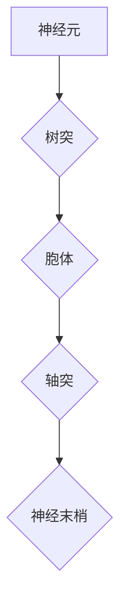

###### 神经传递物质

神经元之间通过神经传递物质进行通信。主要的神经传递物质包括神经递质、神经调质和神经肽。

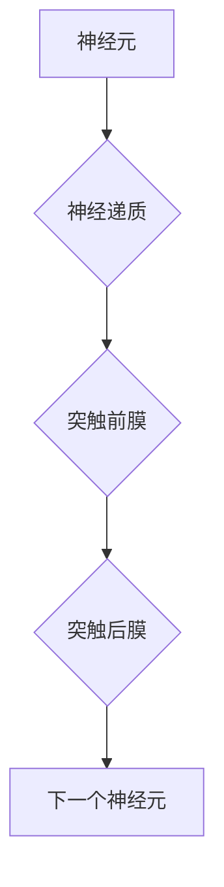

##### 1.1.2 神经传递物质的作用

神经传递物质在神经元之间传递信息，包括兴奋性传递和抑制性传递。

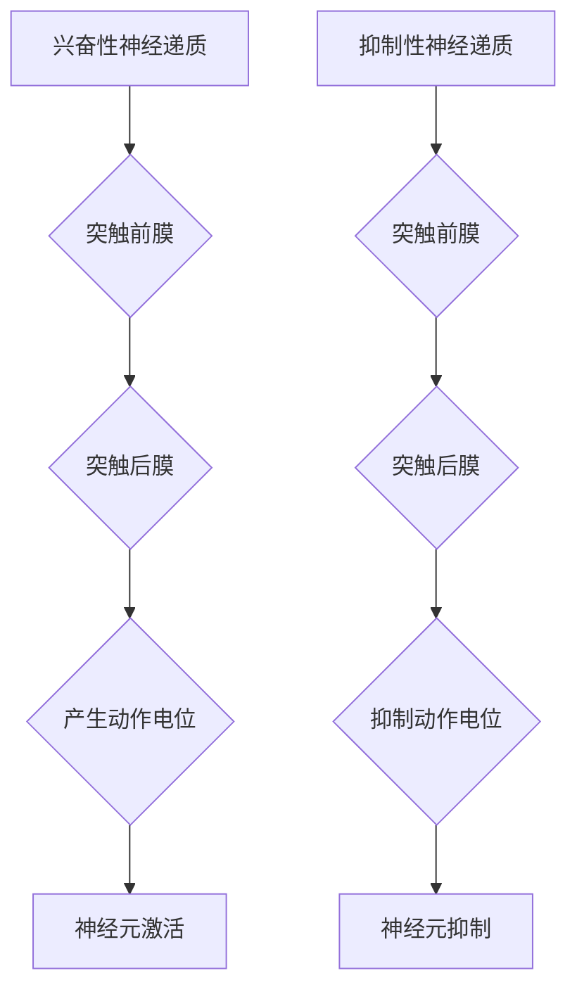

##### 1.1.3 神经系统的信息处理机制

神经系统通过电信号和化学信号进行信息处理，实现感知、认知和运动等功能。

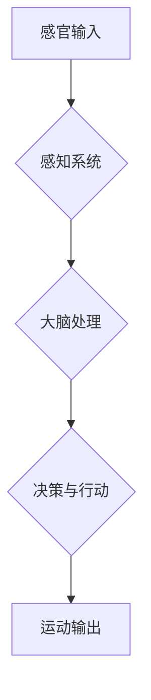

#### 1.2 神经网络的生物学基础

##### 1.2.1 生物神经网络的概念

生物神经网络是由大量神经元组成的复杂网络，能够实现信息处理和自适应行为。

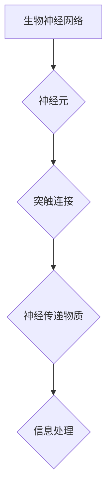

##### 1.2.2 生物神经网络的连接模式

生物神经网络的连接模式包括局部连接和全局连接，以及单向传递和双向传递。

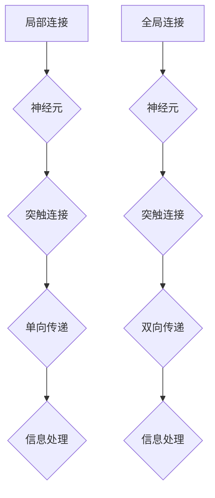

##### 1.2.3 生物神经网络的适应性机制

生物神经网络具有适应性，能够通过经验学习和环境变化进行调整和优化。

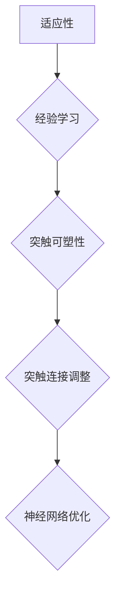

#### 1.3 生物神经网络与人工神经网络的联系

##### 1.3.1 生物神经网络与人工神经网络的相似性

生物神经网络和人工神经网络在结构、功能和适应性方面存在相似性。

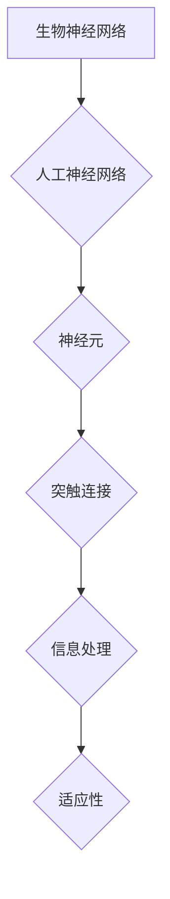

##### 1.3.2 生物神经网络对人工神经网络的影响

生物神经网络的研究为人工神经网络的设计提供了重要的启示，促进了人工神经网络的发展。

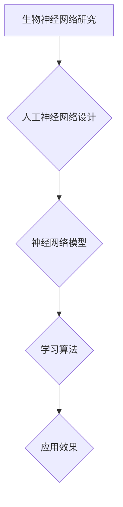

##### 1.3.3 人工神经网络对生物神经网络研究的启示

人工神经网络的发展也为生物神经网络研究提供了新的方法和工具，促进了生物神经网络的深入研究。

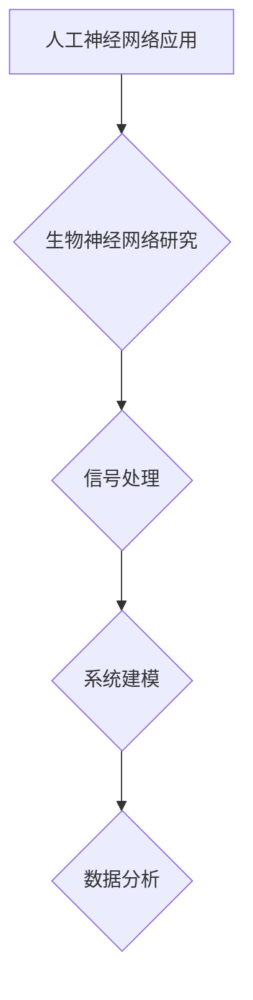

#### 1.4 人工神经网络的基本概念

##### 1.4.1 人工神经网络的定义

人工神经网络是一种模拟生物神经网络的信息处理系统，由大量人工神经元组成。

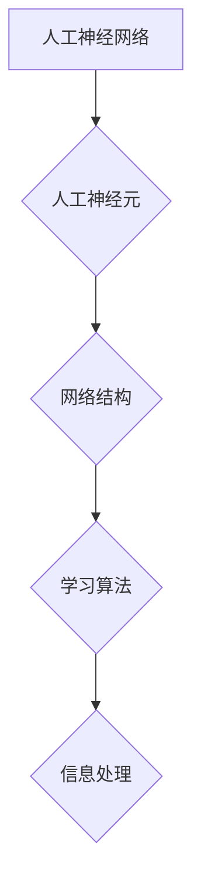

##### 1.4.2 人工神经网络的基本结构

人工神经网络的基本结构包括输入层、隐藏层和输出层。

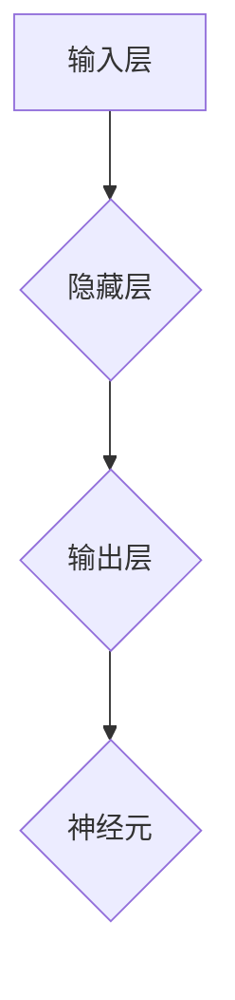

##### 1.4.3 人工神经网络的学习机制

人工神经网络通过学习算法，从数据中学习并调整网络参数，实现信息处理和预测。

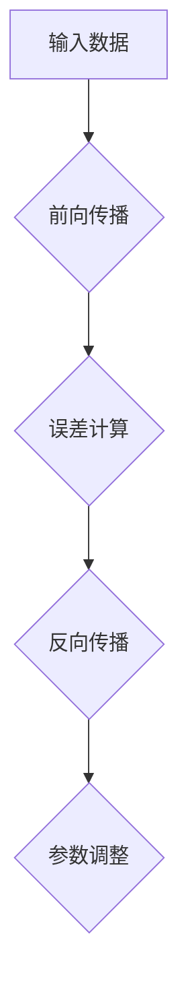

---

### 第一部分：生物神经映射基础

#### 1.1 生物神经概述

##### 1.1.1 神经系统的基本组成

神经系统是人体中最复杂的系统之一，它由数十亿个神经元组成，这些神经元通过复杂的连接方式形成了一个庞大的网络。神经系统的主要组成部分包括神经元、神经纤维和神经胶质细胞。

###### 神经元

神经元，也称为神经细胞，是神经系统的基本单位。每个神经元包括以下几个部分：

- **树突**：接收其他神经元传递过来的信号。
- **胞体**：包含细胞核，是神经元的主要部分。
- **轴突**：从一个神经元传递信号到另一个神经元或其他细胞。
- **神经末梢**：轴突末端的分支，用于传递信号。

下面是一个神经元的Mermaid流程图：


###### 神经纤维

神经纤维是轴突的延伸，它负责在神经元之间传递电信号。神经纤维由髓鞘和神经纤维束组成，髓鞘是一种脂质物质，它包裹在神经纤维外面，起到绝缘作用，增加电信号的传导速度。

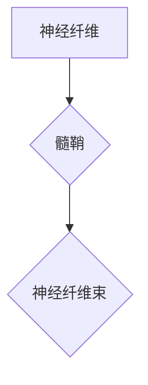

###### 神经胶质细胞

神经胶质细胞是神经系统中的一种非神经元细胞，它支持和维护神经元。神经胶质细胞具有多种功能，包括修复损伤的神经组织、清除细胞外的废物和调节神经信号的传递。

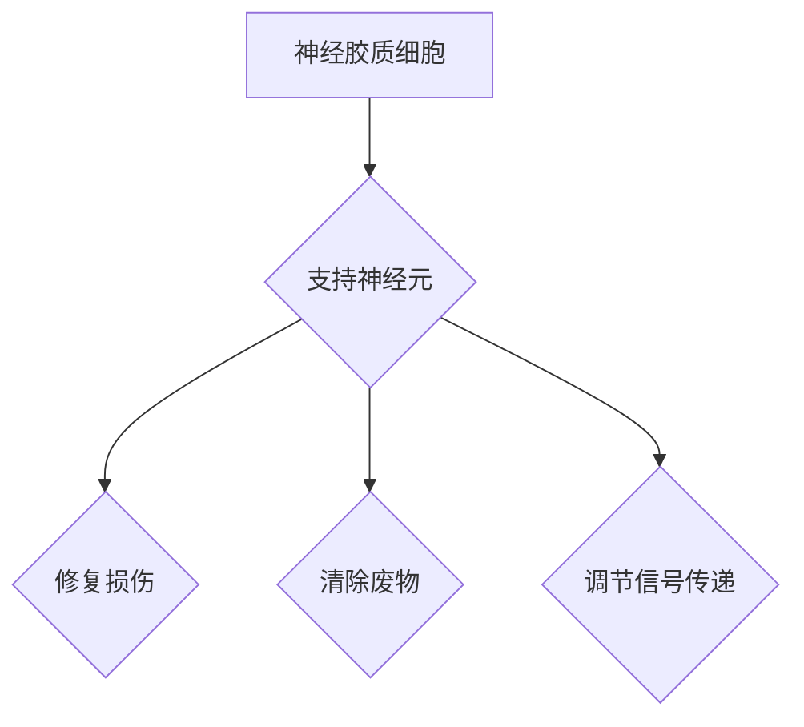

##### 1.1.2 神经传递物质的作用

神经传递物质，也称为神经递质，是神经元之间传递信号的关键分子。它们通过突触结构进行传递，分为兴奋性神经递质和抑制性神经递质。

- **兴奋性神经递质**：如谷氨酸和肾上腺素，它们在突触后膜上结合受体，导致突触后膜去极化，从而引发动作电位。
- **抑制性神经递质**：如γ-氨基丁酸（GABA）和5-羟色胺，它们在突触后膜上结合受体，导致突触后膜超极化，从而抑制动作电位的产生。

下面是一个神经传递物质的传递过程的Mermaid图：

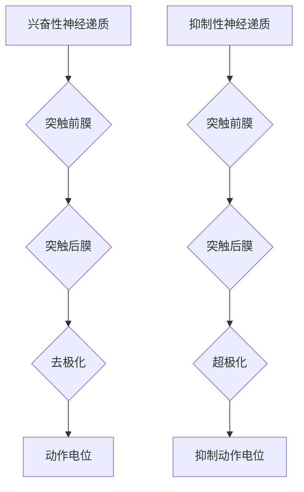

##### 1.1.3 神经系统的信息处理机制

神经系统的信息处理机制是一个复杂的过程，涉及电信号和化学信号的转换和传递。以下是神经系统信息处理机制的基本步骤：

1. **感知输入**：通过感官器官（如眼睛、耳朵、鼻子等）接收外部刺激。
2. **信号转换**：刺激转换为电信号，通过神经元进行传递。
3. **信号处理**：在大脑中，信号经过复杂的神经网络进行处理，产生感知、认知和行动等反应。
4. **信号输出**：最终通过运动神经元传递到肌肉或其他效应器官，产生相应的行为。

下面是一个神经系统信息处理机制的Mermaid流程图：

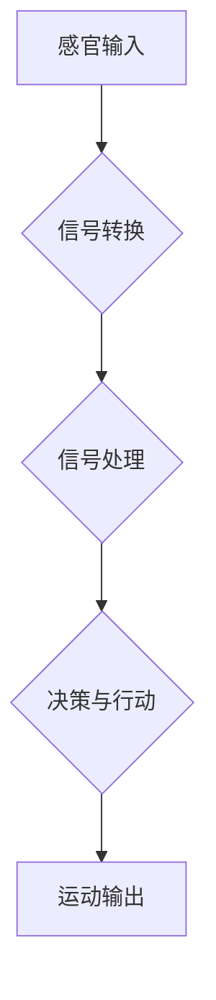

#### 1.2 神经网络的生物学基础

##### 1.2.1 生物神经网络的概念

生物神经网络是指由大量神经元通过复杂的连接方式形成的网络，用于处理信息、执行任务和适应环境。生物神经网络的特点包括：

- **大规模**：生物神经网络由数百万甚至数十亿个神经元组成，形成了一个庞大的网络。
- **高度可塑性**：生物神经网络能够通过学习适应环境的变化，不断调整神经元之间的连接和权重。
- **适应性**：生物神经网络能够对新的信息和刺激进行学习和适应，从而提高处理复杂任务的能力。

##### 1.2.2 生物神经网络的连接模式

生物神经网络的连接模式可以分为局部连接和全局连接，以及单向传递和双向传递。

- **局部连接**：指神经元之间的连接主要局限于局部区域，这种连接方式使得神经信号能够在局部范围内进行处理。
- **全局连接**：指神经元之间的连接跨越了整个神经网络，形成了一个全局的连接模式。这种连接方式使得神经信号能够在整个网络中进行传播和整合。

- **单向传递**：指神经信号从一个神经元传递到另一个神经元时，只能沿着一个方向传递。
- **双向传递**：指神经信号在神经元之间可以沿着两个方向传递。

下面是一个生物神经网络连接模式的Mermaid图：


##### 1.2.3 生物神经网络的适应性机制

生物神经网络的适应性机制是通过神经元之间的突触可塑性和神经网络的重塑来实现的。

- **突触可塑性**：指神经元之间的连接强度可以随着时间变化而改变。这种可塑性使得神经网络能够对新的信息和刺激进行学习和适应。
- **神经网络重塑**：指神经网络的结构和连接方式可以随着时间变化而改变。这种重塑使得神经网络能够适应新的任务和环境。

下面是一个生物神经网络适应性机制的Mermaid图：


#### 1.3 生物神经网络与人工神经网络的联系

##### 1.3.1 生物神经网络与人工神经网络的相似性

生物神经网络与人工神经网络在结构、功能和适应性方面存在许多相似性。

- **结构相似性**：生物神经网络和人工神经网络都是由大量神经元组成的网络，这些神经元通过连接形成了一个复杂的结构。
- **功能相似性**：生物神经网络和人工神经网络都能够处理信息、执行任务和适应环境。
- **适应性相似性**：生物神经网络和人工神经网络都能够通过学习和适应来提高处理复杂任务的能力。

下面是一个生物神经网络与人工神经网络相似性的Mermaid图：

```mermaid
graph TB
A[生物神经网络] --> B{人工神经网络}
B --> C{神经元}
C --> D{突触连接}
D --> E{信息处理}
E --> F{适应性}
```

##### 1.3.2 生物神经网络对人工神经网络的影响

生物神经网络的研究为人工神经网络的设计提供了重要的启示，促进了人工神经网络的发展。

- **结构设计启示**：生物神经网络的结构为人工神经网络的设计提供了参考，例如，人工神经网络中的卷积神经网络（CNN）受到了生物神经网络中视觉系统的启发。
- **学习算法启示**：生物神经网络的学习机制为人工神经网络的学习算法提供了参考，例如，反向传播算法（BP）受到了生物神经网络中突触可塑性的启发。
- **适应性启示**：生物神经网络的适应性机制为人工神经网络的优化提供了参考，例如，通过调整网络参数来适应新的任务和环境。

下面是一个生物神经网络对人工神经网络影响
的Mermaid图：

```mermaid
graph TB
A[生物神经网络研究] --> B{人工神经网络设计}
B --> C{神经网络模型}
C --> D{学习算法}
D --> E{应用效果}
```

##### 1.3.3 人工神经网络对生物神经网络研究的启示

人工神经网络的发展也为生物神经网络研究提供了新的方法和工具，促进了生物神经网络的深入研究。

- **信号处理启示**：人工神经网络中的信号处理技术，如卷积神经网络（CNN）和循环神经网络（RNN），为生物神经信号的处理提供了新的方法。
- **系统建模启示**：人工神经网络中的系统建模技术，如深度学习，为生物神经网络系统的建模提供了新的思路。
- **数据分析启示**：人工神经网络中的数据分析技术，如自编码器和生成对抗网络（GAN），为生物神经网络数据的高效分析和解释提供了新的工具。

下面是一个人工神经网络对生物神经网络研究启示的Mermaid图：

```mermaid
graph TB
A[人工神经网络应用] --> B{生物神经网络研究}
B --> C{信号处理}
C --> D{系统建模}
D --> E{数据分析}
```

---

### 1.4 人工神经网络的基本概念

##### 1.4.1 人工神经网络的定义

人工神经网络（Artificial Neural Network，ANN）是一种由大量人工神经元（也称为节点或单元）互联而成的复杂网络，用于模拟生物神经网络的功能和特性。人工神经网络通过学习从数据中提取特征和模式，从而实现各种任务，如分类、回归、识别等。

下面是人工神经网络的基本定义的Mermaid图：

```mermaid
graph TB
A[人工神经网络] --> B{人工神经元}
B --> C{网络结构}
C --> D{学习算法}
D --> E{信息处理}
```

##### 1.4.2 人工神经网络的基本结构

人工神经网络的基本结构通常包括输入层、隐藏层和输出层。每个层由多个神经元组成，神经元之间通过加权连接形成网络。

- **输入层**：接收外部输入数据，并将这些数据传递给隐藏层。
- **隐藏层**：对输入数据进行处理，提取特征和模式。隐藏层可以有多个，层数和神经元的数量可以根据任务需求进行调整。
- **输出层**：根据隐藏层处理的结果，输出最终结果。

下面是人工神经网络基本结构的Mermaid图：

```mermaid
graph TB
A[输入层] --> B{隐藏层1}
B --> C{隐藏层2}
C --> D{隐藏层3}
D --> E{输出层}
E --> F{神经元}
```

##### 1.4.3 人工神经网络的学习机制

人工神经网络的学习机制是通过学习算法来实现的，这些算法使得网络能够从数据中自动提取特征和模式。学习过程通常包括以下几个步骤：

1. **初始化权重**：初始化网络中的权重和偏置，这些参数将影响网络的学习效果。
2. **前向传播**：将输入数据通过网络的各个层，直到输出层，计算每个神经元的输出值。
3. **误差计算**：计算输出值与实际值之间的差异，得到误差。
4. **反向传播**：将误差反向传播回网络的各个层，更新权重和偏置。
5. **迭代学习**：重复上述步骤，直到网络达到预定的性能指标。

下面是人工神经网络学习机制的Mermaid图：

```mermaid
graph TB
A[输入数据] --> B{前向传播}
B --> C{误差计算}
C --> D{反向传播}
D --> E{参数调整}
```

---

### 第二部分：人工神经网络原理

#### 2.1 人工神经网络的核心算法

##### 2.1.1 前馈神经网络

前馈神经网络（Feedforward Neural Network，FNN）是最基本的人工神经网络结构，其信息传递方向是单向的，即从输入层经过隐藏层传递到输出层，没有反馈循环。

###### 2.1.1.1 神经元的激活函数

在人工神经网络中，神经元通常采用非线性激活函数来引入非线性特性，使得网络能够学习和表示复杂的函数关系。常见的激活函数包括：

- **Sigmoid函数**：\( f(x) = \frac{1}{1 + e^{-x}} \)
- **ReLU函数**：\( f(x) = \max(0, x) \)
- **Tanh函数**：\( f(x) = \frac{e^x - e^{-x}}{e^x + e^{-x}} \)

下面是Sigmoid函数的Mermaid图：

```mermaid
graph TB
A[输入x] --> B{Sigmoid函数}
B --> C{输出f(x)}
C --> D{f(x) = 1 / (1 + e^(-x))}
```

###### 2.1.1.2 前馈神经网络的构建与训练

前馈神经网络的构建和训练过程通常包括以下几个步骤：

1. **初始化参数**：随机初始化网络的权重和偏置。
2. **前向传播**：将输入数据通过网络的各个层，计算每个神经元的输出值。
3. **误差计算**：使用损失函数计算输出值与实际值之间的差异。
4. **反向传播**：将误差反向传播回网络的各个层，更新权重和偏置。
5. **迭代训练**：重复上述步骤，直到网络达到预定的性能指标。

下面是前馈神经网络的构建与训练过程的伪代码：

```python
# 初始化参数
weights = random_weights()
biases = random_biases()

# 前向传播
def forward propagation(x):
    for layer in layers:
        x = activation_function((weights * x) + biases)
    return x

# 反向传播
def backward propagation(x, y):
    for layer in reversed(layers):
        error = loss_function(output, y)
        delta = derivative(activation_function(output)) * error
        weights -= learning_rate * (delta * x)
        biases -= learning_rate * delta
        x = layer.inputs

# 迭代训练
for epoch in range(number_of_epochs):
    for x, y in dataset:
        output = forward propagation(x)
        backward propagation(x, y)
```

##### 2.1.2 卷积神经网络

卷积神经网络（Convolutional Neural Network，CNN）是一种专门用于处理图像数据的前馈神经网络。CNN通过卷积操作提取图像中的特征，从而实现图像识别、图像分类等任务。

###### 2.1.2.1 卷积神经元的原理

卷积神经元是对输入数据进行局部卷积操作的单元，其原理类似于生物视觉系统中的感受野。卷积操作通过对输入数据的不同区域应用滤波器（也称为卷积核或过滤器），提取局部特征。

下面是卷积神经元的原理的Mermaid图：

```mermaid
graph TB
A[输入数据] --> B{卷积操作}
B --> C{卷积核}
C --> D{特征图}
D --> E{激活函数}
```

###### 2.1.2.2 卷积神经网络的结构与训练

卷积神经网络通常包括以下几个部分：

- **卷积层**：通过卷积操作提取图像中的特征。
- **池化层**：降低特征图的维度，减少参数数量。
- **全连接层**：对提取的特征进行分类或回归。

下面是卷积神经网络的结构与训练过程的伪代码：

```python
# 初始化参数
weights = random_weights()
biases = random_biases()

# 前向传播
def forward propagation(x):
    for layer in layers:
        if layer.type == "convolution":
            x = convolution(x, weights[layer.index], biases[layer.index])
            x = activation_function(x)
        elif layer.type == "pooling":
            x = pooling(x)
        elif layer.type == "fully_connected":
            x = fully_connected(x, weights[layer.index], biases[layer.index])
            x = activation_function(x)
    return x

# 反向传播
def backward propagation(x, y):
    for layer in reversed(layers):
        if layer.type == "convolution":
            error = derivative(activation_function(output)) * error
            delta = x * error
            weights[layer.index] -= learning_rate * delta
            biases[layer.index] -= learning_rate * delta
            x = layer.inputs
        elif layer.type == "pooling":
            error = error * (1 - pooling_derivative(x))
            x = layer.inputs
        elif layer.type == "fully_connected":
            error = derivative(activation_function(output)) * error
            delta = (weights[layer.index] * error) * x
            weights[layer.index] -= learning_rate * delta
            biases[layer.index] -= learning_rate * delta
            x = layer.inputs

# 迭代训练
for epoch in range(number_of_epochs):
    for x, y in dataset:
        output = forward propagation(x)
        backward propagation(x, y)
```

##### 2.1.3 循环神经网络

循环神经网络（Recurrent Neural Network，RNN）是一种能够处理序列数据的人工神经网络。RNN通过在时间步之间保留状态信息，使得网络能够处理具有时间依赖性的数据。

###### 2.1.3.1 循环神经网络的原理

循环神经网络的原理是基于其递归结构，每个时间步的输出不仅取决于当前输入，还取决于前一个时间步的输出。这种递归结构使得RNN能够处理序列数据。

下面是循环神经网络的原理的Mermaid图：

```mermaid
graph TB
A[时间步t] --> B{输入x_t}
B --> C{隐藏状态h_t}
C --> D{输出y_t}
D --> E{隐藏状态h_{t+1}}
```

###### 2.1.3.2 循环神经网络在自然语言处理中的应用

循环神经网络在自然语言处理（Natural Language Processing，NLP）领域有着广泛的应用，如文本分类、机器翻译和情感分析等。

- **文本分类**：循环神经网络可以用来对文本进行分类，例如，判断一篇文章是否属于某个类别。
- **机器翻译**：循环神经网络可以将一种语言的文本翻译成另一种语言的文本。
- **情感分析**：循环神经网络可以用来分析文本的情感倾向，例如，判断一篇文章是否积极或消极。

下面是循环神经网络在自然语言处理中的应用的Mermaid图：

```mermaid
graph TB
A[文本分类] --> B{输入文本}
B --> C{循环神经网络}
C --> D{分类结果}

E[机器翻译] --> F{输入文本}
F --> G{循环神经网络}
G --> H{输出文本}

I[情感分析] --> J{输入文本}
J --> K{循环神经网络}
K --> L{情感倾向}
```

---

### 2.2 人工神经网络的学习策略

##### 2.2.1 反向传播算法

反向传播算法（Backpropagation Algorithm）是人工神经网络中最常用的学习算法，它通过计算网络输出与实际值之间的误差，并反向传播误差以更新网络的权重和偏置。

###### 2.2.1.1 算法原理

反向传播算法的核心思想是将误差从输出层反向传播到输入层，逐层更新网络中的权重和偏置。具体步骤如下：

1. **前向传播**：将输入数据通过网络的各个层，计算每个神经元的输出值。
2. **计算误差**：使用损失函数计算输出值与实际值之间的差异。
3. **反向传播**：将误差反向传播回网络的各个层，计算每个神经元的误差。
4. **更新参数**：根据误差梯度更新网络的权重和偏置。
5. **迭代更新**：重复上述步骤，直到网络达到预定的性能指标。

下面是反向传播算法的伪代码：

```python
# 初始化参数
weights = random_weights()
biases = random_biases()

# 前向传播
def forward propagation(x):
    for layer in layers:
        x = activation_function((weights * x) + biases)
    return x

# 计算误差
def compute_error(output, y):
    error = loss_function(output, y)

# 反向传播
def backward propagation(x, y):
    for layer in reversed(layers):
        error = derivative(activation_function(output)) * error
        delta = error * x
        weights -= learning_rate * (delta * x)
        biases -= learning_rate * delta
        x = layer.inputs

# 迭代更新
for epoch in range(number_of_epochs):
    for x, y in dataset:
        output = forward propagation(x)
        backward propagation(x, y)
```

##### 2.2.2 随机梯度下降

随机梯度下降（Stochastic Gradient Descent，SGD）是一种优化算法，它通过随机选择样本对网络进行更新，从而提高学习效率。

###### 2.2.2.1 算法原理

随机梯度下降的基本思想是在每个迭代步骤中，随机选择一个训练样本，并使用该样本的梯度来更新网络的权重和偏置。具体步骤如下：

1. **随机选择样本**：从训练数据集中随机选择一个样本。
2. **计算梯度**：计算该样本的梯度。
3. **更新参数**：根据梯度更新网络的权重和偏置。
4. **重复迭代**：重复上述步骤，直到网络达到预定的性能指标。

下面是随机梯度下降的伪代码：

```python
# 初始化参数
weights = random_weights()
biases = random_biases()

# 计算梯度
def compute_gradient(x, y):
    output = forward propagation(x)
    error = loss_function(output, y)
    gradient = derivative(activation_function(output)) * error
    return gradient

# 更新参数
def update_parameters(gradient):
    weights -= learning_rate * gradient
    biases -= learning_rate * gradient

# 迭代更新
for epoch in range(number_of_epochs):
    for x, y in dataset:
        gradient = compute_gradient(x, y)
        update_parameters(gradient)
```

##### 2.2.3 梯度消失与梯度爆炸问题

在训练人工神经网络时，可能会遇到梯度消失（Vanishing Gradient）和梯度爆炸（Exploding Gradient）问题，这些问题会导致网络难以收敛。

###### 2.2.3.1 梯度消失

梯度消失是指在学习过程中，梯度值逐渐减小到接近零，导致网络参数无法有效更新。梯度消失通常发生在使用具有饱和特性的激活函数（如Sigmoid函数和Tanh函数）时。

为了解决梯度消失问题，可以采用以下方法：

- **选择合适的激活函数**：使用ReLU函数或Leaky ReLU函数，这些函数在输入为零时具有较小的斜率，从而避免梯度消失。
- **使用层归一化**：通过在神经网络层之间引入归一化操作，减少梯度消失的风险。
- **使用更深层次的网络结构**：通过增加网络深度，可以使得网络具有更强的表示能力，从而减少梯度消失的影响。

下面是解决梯度消失问题的Mermaid图：

```mermaid
graph TB
A[选择合适的激活函数] --> B{ReLU函数}
B --> C{避免梯度消失}

D[使用层归一化] --> E{减少梯度消失风险}
E --> F{层归一化操作}

G[使用更深层次的网络结构] --> H{增加网络表示能力}
H --> I{减少梯度消失影响}
```

###### 2.2.3.2 梯度爆炸

梯度爆炸是指在学习过程中，梯度值逐渐增大到无穷大，导致网络参数无法有效更新。梯度爆炸通常发生在使用深层神经网络和具有较大参数值的网络时。

为了解决梯度爆炸问题，可以采用以下方法：

- **初始化参数**：选择合适的参数初始化方法，如He初始化或Xavier初始化，以减少梯度爆炸的风险。
- **使用较小的学习率**：在训练过程中逐渐减小学习率，以避免梯度爆炸。
- **引入正则化项**：通过在损失函数中添加正则化项，限制网络参数的增大，从而减少梯度爆炸的风险。

下面是解决梯度爆炸问题的Mermaid图：

```mermaid
graph TB
A[初始化参数] --> B{He初始化}
B --> C{减少梯度爆炸风险}

D[使用较小的学习率] --> E{避免梯度爆炸}
E --> F{逐渐减小学习率}

G[引入正则化项] --> H{限制参数增大}
H --> I{减少梯度爆炸风险}
```

---

### 2.3 人工神经网络的优化算法

##### 2.3.1 Adam优化器

Adam优化器（Adaptive Moment Estimation）是一种基于自适应学习率的优化算法，它通过计算一阶矩估计和二阶矩估计来动态调整学习率。

###### 2.3.1.1 算法原理

Adam优化器的核心思想是利用一阶矩估计（均值）和二阶矩估计（方差）来更新学习率。具体步骤如下：

1. **初始化**：初始化一阶矩估计\(m\)和二阶矩估计\(v\)，以及学习率\(\alpha\)和一阶矩估计的指数衰减率\(\beta_1\)和二阶矩估计的指数衰减率\(\beta_2\)。
2. **前向传播**：进行前向传播，计算当前梯度。
3. **更新一阶矩估计和二阶矩估计**：使用当前梯度更新一阶矩估计和二阶矩估计。
4. **计算修正的一阶矩估计和二阶矩估计**：对一阶矩估计和二阶矩估计进行修正，以消除偏差。
5. **更新参数**：使用修正的一阶矩估计和二阶矩估计更新网络的权重和偏置。

下面是Adam优化器的伪代码：

```python
# 初始化参数
m = 0
v = 0
alpha = learning_rate
beta_1 = 0.9
beta_2 = 0.999

# 前向传播
def forward propagation(x):
    # ...
    return output

# 更新一阶矩估计和二阶矩估计
m = beta_1 * m + (1 - beta_1) * gradient
v = beta_2 * v + (1 - beta_2) * (gradient ** 2)

# 计算修正的一阶矩估计和二阶矩估计
m_hat = m / (1 - beta_1 ** t)
v_hat = v / (1 - beta_2 ** t)

# 更新参数
weights -= alpha * m_hat / (sqrt(v_hat) + epsilon)
biases -= alpha * m_hat / (sqrt(v_hat) + epsilon)
```

##### 2.3.2 Adagrad优化器

Adagrad优化器（Adaptive Gradient Algorithm）是一种基于自适应学习率的优化算法，它通过累积梯度平方的逆数来动态调整学习率。

###### 2.3.2.1 算法原理

Adagrad优化器的核心思想是利用梯度平方的逆数作为学习率，以减少学习过程中的梯度消失问题。具体步骤如下：

1. **初始化**：初始化学习率\(\alpha\)和梯度平方累积和\(g^2\)。
2. **前向传播**：进行前向传播，计算当前梯度。
3. **更新梯度平方累积和**：使用当前梯度平方更新梯度平方累积和。
4. **更新参数**：使用梯度平方累积和的逆数更新网络的权重和偏置。

下面是Adagrad优化器的伪代码：

```python
# 初始化参数
alpha = learning_rate
g2_sum = 0

# 前向传播
def forward propagation(x):
    # ...
    return output

# 更新梯度平方累积和
g2_sum += gradient ** 2

# 更新参数
weights -= alpha * gradient / (sqrt(g2_sum) + epsilon)
biases -= alpha * gradient / (sqrt(g2_sum) + epsilon)
```

##### 2.3.3 RMSProp优化器

RMSProp优化器（Root Mean Square Propagation）是一种基于自适应学习率的优化算法，它通过计算梯度平方的平均值来动态调整学习率。

###### 2.3.3.1 算法原理

RMSProp优化器的核心思想是利用梯度平方的平均值作为学习率，以减少学习过程中的梯度消失问题。具体步骤如下：

1. **初始化**：初始化学习率\(\alpha\)、梯度平方的平均值\(g2\_avg\)和指数衰减率\(\beta\)。
2. **前向传播**：进行前向传播，计算当前梯度。
3. **更新梯度平方的平均值**：使用当前梯度平方更新梯度平方的平均值。
4. **更新参数**：使用梯度平方的平均值的逆数更新网络的权重和偏置。

下面是RMSProp优化器的伪代码：

```python
# 初始化参数
alpha = learning_rate
g2_avg = 0
beta = 0.9

# 前向传播
def forward propagation(x):
    # ...
    return output

# 更新梯度平方的平均值
g2_avg = beta * g2_avg + (1 - beta) * gradient ** 2

# 更新参数
weights -= alpha * gradient / sqrt(g2_avg + epsilon)
biases -= alpha * gradient / sqrt(g2_avg + epsilon)
```

---

### 2.4 人工神经网络的应用领域

##### 2.4.1 人工智能与机器学习

人工智能（Artificial Intelligence，AI）和机器学习（Machine Learning，ML）是人工神经网络应用最为广泛的领域之一。人工神经网络通过学习数据中的模式和规律，能够实现各种智能任务，如图像识别、语音识别、自然语言处理和游戏人工智能等。

- **图像识别**：人工神经网络可以自动识别图像中的物体和场景，如人脸识别、车牌识别和自动驾驶等。
- **语音识别**：人工神经网络可以识别和理解语音信号，实现语音识别和语音合成等任务。
- **自然语言处理**：人工神经网络可以处理文本数据，实现文本分类、情感分析和机器翻译等任务。
- **游戏人工智能**：人工神经网络可以模拟人类玩家的行为，实现游戏中的智能决策和策略制定。

##### 2.4.2 计算机视觉

计算机视觉（Computer Vision）是人工智能的一个分支，它通过计算机模拟人类的视觉功能，实现对图像和视频数据的理解、分析和处理。

- **目标检测**：人工神经网络可以识别图像中的物体，并定位它们的位置。
- **图像分割**：人工神经网络可以将图像分割成不同的区域，实现对图像内容的精细处理。
- **人脸识别**：人工神经网络可以识别和验证人脸图像，实现人脸识别和生物识别等应用。
- **图像增强**：人工神经网络可以通过学习图像的特征，增强图像的视觉效果，提高图像的质量。

##### 2.4.3 自然语言处理

自然语言处理（Natural Language Processing，NLP）是人工智能的另一个重要分支，它通过计算机模拟人类的语言理解、表达和交互能力。

- **文本分类**：人工神经网络可以自动将文本数据分类到不同的类别中，如新闻分类、情感分析和垃圾邮件过滤等。
- **机器翻译**：人工神经网络可以实现自动翻译不同语言之间的文本，如谷歌翻译和百度翻译等。
- **情感分析**：人工神经网络可以分析文本中的情感倾向，如情感分析、舆情监测和客户满意度评估等。
- **问答系统**：人工神经网络可以模拟人类的问答交互，实现智能客服和智能问答等应用。

##### 2.4.4 强化学习

强化学习（Reinforcement Learning，RL）是人工神经网络在游戏和机器人领域的应用之一，它通过智能体与环境之间的交互，学习最优策略。

- **游戏智能体**：人工神经网络可以模拟人类的游戏策略，实现游戏中的智能决策和策略制定。
- **机器人控制**：人工神经网络可以控制机器人执行复杂的任务，如自主导航、物体抓取和任务规划等。
- **自动驾驶**：人工神经网络可以模拟驾驶过程中的环境感知和决策，实现自动驾驶车辆的安全行驶。

---

### 2.5 生物神经与人工神经网络的映射关系

#### 2.5.1 神经网络模型的可塑性

神经网络模型的可塑性是指神经网络在训练过程中能够调整其内部参数（权重和偏置）的能力。这种可塑性使得神经网络能够适应不同的数据和任务。

- **权重调整机制**：在训练过程中，神经网络通过反向传播算法不断更新权重和偏置，以最小化损失函数。这种权重调整机制使得神经网络能够逐渐优化其性能。
- **适应性变化**：神经网络在训练过程中不断调整其内部结构，以适应不同的输入数据和任务。这种适应性变化使得神经网络能够处理复杂和多变的环境。

#### 2.5.2 生物神经与人工神经网络的学习机制对比

生物神经和人工神经网络在学习和适应机制上存在一定的异同。

- **生物神经的学习过程**：生物神经的学习过程是通过突触可塑性和神经网络重塑来实现的。突触可塑性是指突触连接强度的变化，它可以通过突触前和突触后的适应性变化来实现。神经网络重塑是指神经网络结构的改变，它可以通过新的突触连接和突触断开来实现。
- **人工神经网络的学习过程**：人工神经网络的学习过程是通过学习算法（如反向传播算法）来实现的。学习算法通过不断调整网络中的权重和偏置，以最小化损失函数。人工神经网络的学习过程通常是基于数据驱动的方法，而生物神经网络的学习过程则是基于经验学习和适应性调整。
- **异同**：生物神经和人工神经网络的学习机制在本质上存在差异。生物神经网络的学习过程是通过生物学机制实现的，而人工神经网络的学习过程是通过数学模型和算法实现的。然而，两者都具备可塑性和适应性，能够在不同的环境中进行调整和优化。

#### 2.5.3 映射关系与跨学科研究

生物神经和人工神经网络之间的映射关系为跨学科研究提供了新的思路和工具。

- **映射关系**：生物神经网络为人工神经网络的设计提供了重要的启示。例如，人工神经网络中的卷积神经网络（CNN）受到了生物视觉系统的启发，而循环神经网络（RNN）则受到了生物神经网络中信息传递机制的启发。这种映射关系使得人工神经网络能够更好地模拟生物神经系统的功能。
- **跨学科研究**：跨学科研究是生物神经与人工神经网络融合的关键。通过跨学科研究，我们可以从生物神经系统中获取灵感，改进人工神经网络的设计和算法。同时，人工神经网络的发展也为生物神经网络研究提供了新的方法和工具，促进了生物神经网络的深入理解和应用。

总之，生物神经与人工神经网络之间的映射关系为跨学科研究提供了重要的基础和动力，为未来的技术发展提供了广阔的前景。

---

### 2.6 生物神经网络在人工神经网络中的应用

#### 2.6.1 生物神经网络模型在图像识别中的应用

生物神经网络模型在图像识别领域有着广泛的应用，其核心思想是模拟生物视觉系统的工作原理，以实现高效和准确的图像识别。

- **卷积神经网络（CNN）**：CNN是生物神经网络模型在图像识别中应用的一个典型例子。CNN通过模拟生物视网膜中的视觉处理机制，使用卷积操作和池化操作来提取图像中的局部特征，从而实现图像的分类和识别。CNN在图像识别任务中取得了显著的成果，如ImageNet竞赛中，CNN模型在图像分类准确率上超过了人类水平。

- **视觉皮层模型**：视觉皮层模型是基于生物神经网络的结构和工作原理设计的，它模拟了生物视觉系统中的多个层次，包括初级视觉皮层、次级视觉皮层等。视觉皮层模型通过学习图像的特征和模式，能够实现高层次的视觉任务，如物体识别、场景理解等。

下面是视觉皮层模型的Mermaid图：

```mermaid
graph TB
A[初级视觉皮层] --> B{感知边缘和纹理}
B --> C{次级视觉皮层}
C --> D{感知形状和空间关系}
D --> E{高级视觉皮层}
E --> F{物体识别和场景理解}
```

#### 2.6.2 生物神经网络模型在自然语言处理中的应用

生物神经网络模型在自然语言处理（NLP）领域也有着重要的应用，其核心思想是模拟生物神经系统在语言理解和处理过程中的机制。

- **循环神经网络（RNN）**：RNN是一种能够处理序列数据的人工神经网络，其结构受到了生物神经系统中信息传递和记忆机制的启发。RNN通过在时间步之间保持状态信息，能够捕捉序列数据中的时间和空间依赖关系，从而实现文本分类、序列标注和机器翻译等任务。

- **长短期记忆网络（LSTM）**：LSTM是RNN的一种变体，它通过引入门控机制，解决了RNN在处理长序列数据时易出现的梯度消失和梯度爆炸问题。LSTM在自然语言处理任务中取得了显著的成果，如文本生成、情感分析和机器翻译等。

下面是LSTM的Mermaid图：

```mermaid
graph TB
A[输入x_t] --> B{隐藏状态h_t}
B --> C{遗忘门f_t}
C --> D{输入门i_t}
D --> E{细胞状态c_t}
E --> F{输出门o_t}
F --> G{隐藏状态h_{t+1}}
G --> H[下一个时间步]
```

#### 2.6.3 生物神经网络模型在其他领域的应用

除了在图像识别和自然语言处理领域，生物神经网络模型在其他领域也有着广泛的应用。

- **生物医学信号处理**：生物神经网络模型可以用于生物医学信号的处理和分析，如心电图（ECG）信号处理、脑电图（EEG）信号处理和肌电图（EMG）信号处理等。这些模型能够识别和分类信号中的异常模式，为疾病的诊断和治疗提供支持。

- **生物系统建模**：生物神经网络模型可以用于生物系统的建模和仿真，如神经元网络模型、生态系统模型和生物种群模型等。这些模型能够模拟生物系统的动态行为，为生物科学研究和生物技术发展提供指导。

- **机器人控制**：生物神经网络模型可以用于机器人控制，模拟生物神经系统在控制过程中的机制。这些模型能够实现机器人自主运动、目标跟踪和任务规划等任务。

总之，生物神经网络模型在多个领域都有着广泛的应用，其核心思想是模拟生物神经系统的功能和工作原理，为人工智能的发展提供了重要的启示和推动。

---

### 2.7 人工神经网络在生物神经网络研究中的应用

人工神经网络在生物神经网络研究中发挥着重要的作用，通过模拟生物神经系统的结构和功能，为生物神经网络的研究提供了新的工具和方法。

#### 2.7.1 人工神经网络模型在生物信号处理中的应用

生物信号处理是生物神经网络研究的一个重要方面，人工神经网络模型在生物信号处理中有着广泛的应用。

- **心电图（ECG）信号处理**：人工神经网络可以用于ECG信号的识别和分类，通过学习ECG信号的特征，能够准确地识别各种心电信号，如正常QRS波群、房颤波群和房扑波群等。这种方法有助于心脏疾病的早期诊断和监测。

- **脑电图（EEG）信号处理**：人工神经网络可以用于EEG信号的特征提取和分类，通过对EEG信号的分析，能够识别出不同状态下的脑电活动，如睡眠状态、清醒状态和癫痫发作等。这对于研究脑电活动的生理机制和临床应用具有重要意义。

- **肌电图（EMG）信号处理**：人工神经网络可以用于EMG信号的分类和分析，通过对EMG信号的分析，能够识别出肌肉活动的类型和模式，为运动控制和康复治疗提供指导。

下面是ECG信号处理的人工神经网络模型的Mermaid图：

```mermaid
graph TB
A[输入ECG信号] --> B{预处理}
B --> C{特征提取}
C --> D{人工神经网络模型}
D --> E{分类结果}
```

#### 2.7.2 人工神经网络模型在生物系统建模中的应用

人工神经网络模型在生物系统建模中也有着重要的应用，通过模拟生物系统的动态行为和复杂特性，为生物科学研究和生物技术发展提供支持。

- **神经元网络模型**：人工神经网络可以模拟生物神经系统中的神经元网络，通过学习神经元之间的连接和激活规则，能够模拟神经元的电生理行为和神经网络的信息处理过程。这种方法有助于研究神经系统的功能和机制。

- **生态系统模型**：人工神经网络可以用于生态系统建模，通过学习生态系统中的物种相互作用和生态位，能够模拟生态系统的动态行为和稳定性。这种方法有助于研究生态系统的演化和生态平衡。

- **生物种群模型**：人工神经网络可以用于生物种群建模，通过学习种群数量、繁殖率和死亡率等特征，能够模拟生物种群的增长和动态变化。这种方法有助于研究生物种群的生态适应和进化过程。

下面是生态系统模型的人工神经网络模型的Mermaid图：

```mermaid
graph TB
A[输入生态系统数据] --> B{预处理}
B --> C{特征提取}
C --> D{人工神经网络模型}
D --> E{模拟生态系统动态}
```

#### 2.7.3 人工神经网络模型在生物医疗领域的应用

人工神经网络模型在生物医疗领域有着广泛的应用，通过模拟生物神经网络的功能和特性，为生物医疗研究和临床应用提供了新的方法和工具。

- **疾病诊断**：人工神经网络可以用于疾病诊断，通过学习疾病相关的生物信号和临床数据，能够准确识别和诊断疾病。这种方法有助于提高疾病诊断的准确性和效率。

- **药物设计**：人工神经网络可以用于药物设计，通过学习药物分子和生物靶点的特征，能够预测药物与靶点的相互作用和药效。这种方法有助于提高药物设计的效率和准确性。

- **个性化治疗**：人工神经网络可以用于个性化治疗，通过学习患者的生物特征和临床数据，能够为患者制定个性化的治疗方案。这种方法有助于提高治疗效果和患者的生活质量。

下面是疾病诊断的人工神经网络模型的Mermaid图：

```mermaid
graph TB
A[输入生物信号和临床数据] --> B{预处理}
B --> C{特征提取}
C --> D{人工神经网络模型}
D --> E{疾病诊断结果}
```

总之，人工神经网络在生物神经网络研究中有着广泛的应用，通过模拟生物神经系统的结构和功能，为生物科学研究和生物技术发展提供了重要的支持和推动。

---

### 4.3 跨学科项目案例分析与总结

#### 4.3.1 生物神经网络模型在药物设计中的应用

生物神经网络模型在药物设计领域有着重要的应用，通过模拟生物神经系统的功能和特性，可以加速新药的研发和筛选过程。

- **项目背景**：生物神经网络模型被用于预测药物分子与生物靶点之间的相互作用，以发现潜在的药物候选物。这些模型通过学习大量的生物数据和药物分子结构，能够识别出具有潜在疗效的药物分子。

- **项目实施步骤**：

1. **数据准备**：收集大量的生物神经网络数据，包括神经元活动、神经递质浓度和药物分子结构等。
2. **模型构建**：使用人工神经网络模型构建一个预测药物分子与生物靶点相互作用的模型，该模型包括输入层、隐藏层和输出层。
3. **训练与验证**：使用已收集的数据对模型进行训练和验证，通过反向传播算法调整模型参数，以优化模型的预测性能。
4. **药物筛选**：使用训练好的模型对大量的药物分子进行预测，筛选出具有潜在疗效的药物分子。

- **代码解读与分析**：

以下是一个简单的生物神经网络模型在Python中的实现：

```python
import numpy as np
import pandas as pd
from sklearn.model_selection import train_test_split
from sklearn.metrics import accuracy_score
from keras.models import Sequential
from keras.layers import Dense, Activation

# 数据准备
data = pd.read_csv('drug_data.csv')
X = data.drop('target', axis=1).values
y = data['target'].values

# 数据预处理
X_train, X_test, y_train, y_test = train_test_split(X, y, test_size=0.2, random_state=42)

# 模型构建
model = Sequential()
model.add(Dense(64, input_dim=X_train.shape[1], activation='relu'))
model.add(Dense(32, activation='relu'))
model.add(Dense(1, activation='sigmoid'))

# 模型编译
model.compile(optimizer='adam', loss='binary_crossentropy', metrics=['accuracy'])

# 模型训练
model.fit(X_train, y_train, epochs=10, batch_size=32, validation_data=(X_test, y_test))

# 模型评估
predictions = model.predict(X_test)
predictions = (predictions > 0.5)

accuracy = accuracy_score(y_test, predictions)
print('Accuracy:', accuracy)

# 分析结果
# 根据模型的预测结果，可以进一步筛选出具有潜在疗效的药物分子
```

通过这个案例，我们可以看到生物神经网络模型在药物设计中的应用，以及如何使用Python和Keras框架来实现和训练这个模型。

#### 4.3.2 人工神经网络模型在智慧城市中的应用

人工神经网络模型在智慧城市中有着广泛的应用，通过模拟城市中的各种复杂系统，可以提高城市的管理效率和居民生活质量。

- **项目背景**：智慧城市是指利用信息技术和人工智能技术，实现城市管理和服务的智能化。人工神经网络模型被用于预测城市中的各种事件，如交通流量、能源消耗和犯罪率等，以便提前采取应对措施。

- **项目实施步骤**：

1. **数据收集**：收集智慧城市中的各种数据，包括交通流量、环境监测、能源使用和犯罪记录等。
2. **数据预处理**：对收集到的数据进行清洗和预处理，包括缺失值填充、异常值处理和数据归一化等。
3. **模型构建**：使用人工神经网络模型构建预测模型，该模型包括输入层、隐藏层和输出层。
4. **训练与验证**：使用预处理后的数据对模型进行训练和验证，通过反向传播算法调整模型参数，以优化模型的预测性能。
5. **系统集成**：将训练好的模型集成到智慧城市的系统中，实现实时预测和决策支持。

- **代码解读与分析**：

以下是一个简单的交通流量预测的人工神经网络模型在Python中的实现：

```python
import numpy as np
import pandas as pd
from sklearn.model_selection import train_test_split
from sklearn.metrics import mean_squared_error
from keras.models import Sequential
from keras.layers import Dense

# 数据准备
data = pd.read_csv('traffic_data.csv')
X = data.drop('target', axis=1).values
y = data['target'].values

# 数据预处理
X_train, X_test, y_train, y_test = train_test_split(X, y, test_size=0.2, random_state=42)

# 模型构建
model = Sequential()
model.add(Dense(64, input_dim=X_train.shape[1], activation='relu'))
model.add(Dense(32, activation='relu'))
model.add(Dense(1))

# 模型编译
model.compile(optimizer='adam', loss='mse')

# 模型训练
model.fit(X_train, y_train, epochs=10, batch_size=32, validation_data=(X_test, y_test))

# 模型评估
predictions = model.predict(X_test)
mse = mean_squared_error(y_test, predictions)
print('MSE:', mse)

# 分析结果
# 根据模型的预测结果，可以优化交通管理，减少交通拥堵和事故风险
```

通过这个案例，我们可以看到人工神经网络模型在智慧城市中的应用，以及如何使用Python和Keras框架来实现和训练这个模型。

#### 4.3.3 跨学科项目案例分析与总结

跨学科项目在生物神经网络和人工神经网络的研究中发挥着重要的作用，通过结合不同领域的知识和方法，可以解决单一学科难以解决的问题。

- **案例分析**：在药物设计项目中，生物神经网络模型通过模拟生物神经系统中的神经元活动，预测药物分子与生物靶点的相互作用，从而筛选出潜在的新药候选物。在智慧城市项目中，人工神经网络模型通过学习城市中的各种数据，预测交通流量、能源消耗和犯罪率等，为城市管理和决策提供支持。

- **总结**：跨学科项目通过结合生物神经网络和人工神经网络的研究方法，可以解决复杂和多变的问题。在药物设计项目中，生物神经网络模型提供了对生物神经系统的深入理解，而人工神经网络模型则提供了高效的预测和筛选方法。在智慧城市项目中，人工神经网络模型通过对大量数据的分析，实现了城市管理的智能化和精细化。这些跨学科项目不仅展示了生物神经网络和人工神经网络的强大能力，也为未来更多跨学科项目的发展提供了启示和借鉴。

总之，跨学科项目在生物神经网络和人工神经网络的研究中具有重要意义，通过结合不同领域的知识和方法，可以解决单一学科难以解决的问题，推动科技和社会的进步。

---

### 第五部分：前沿进展与未来展望

#### 5.1 生物神经网络与人工神经网络的融合技术

生物神经网络与人工神经网络的融合技术是当前研究的热点之一，这种融合不仅能够充分利用两者的优点，还能为解决复杂问题提供新的思路和方法。

- **融合技术的原理与优势**：

  生物神经网络与人工神经网络的融合技术基于两者的互补性。生物神经网络具有高度的可塑性和适应性，能够处理复杂和动态的环境；而人工神经网络则具有强大的计算能力和模型训练能力，能够模拟复杂的系统。融合技术通过结合两者的优势，使得模型既能够处理动态环境，又能够进行高效的计算和训练。

  具体来说，融合技术包括以下几个方面：

  - **神经形态计算**：神经形态计算是一种模仿生物神经系统的计算方法，通过使用可编程的神经元阵列和突触连接，实现高效的信息处理和自适应行为。
  - **混合学习算法**：混合学习算法结合了生物神经学习和人工神经网络学习的优点，通过引入生物神经的可塑性和适应性，提高模型的学习效率和泛化能力。
  - **跨学科数据共享**：通过跨学科的数据共享，可以将生物神经网络和人工神经网络的研究数据进行整合，从而提高模型的数据利用率和预测准确性。

- **融合技术在科研与产业中的应用**：

  融合技术在科研和产业中都有着广泛的应用。

  - **科研应用**：在生物医学领域，融合技术可以用于疾病诊断、药物设计和神经系统疾病治疗等方面。例如，通过结合生物神经网络和人工神经网络，可以开发出更准确和高效的疾病诊断模型，提高疾病的早期诊断率。

  - **产业应用**：在工业制造、智慧城市和能源管理等领域，融合技术可以用于优化生产流程、提高城市管理效率和降低能源消耗。例如，在智能制造中，融合技术可以用于实时监控和预测生产设备的故障，从而提高生产效率和降低维护成本。

#### 5.2 生物神经网络与人工神经网络研究的未来方向

生物神经网络与人工神经网络研究的未来方向包括以下几个方面：

- **跨学科研究的新趋势**：

  随着人工智能和生物科学的快速发展，跨学科研究将成为生物神经网络与人工神经网络研究的重要趋势。未来，生物神经网络与人工神经网络的研究将更加注重跨学科的融合，通过整合不同学科的知识和资源，推动研究的深入和发展。

  - **生物启发的人工智能**：通过借鉴生物神经系统的机制和原理，开发出更高效、更智能的人工神经网络模型。
  - **计算生物学**：结合计算生物学的方法，研究生物神经网络的结构和功能，为人工智能的发展提供新的理论支持。

- **未来技术的发展与应用**：

  未来，生物神经网络与人工神经网络的技术将朝着更加智能化、高效化和个性化的方向发展。

  - **智能化**：通过引入更多的生物神经特性，如可塑性和适应性，使得人工智能系统能够更好地适应复杂和动态的环境。
  - **高效化**：通过优化算法和硬件设计，提高人工智能系统的计算速度和效率，从而实现更快速的应用和部署。
  - **个性化**：通过个性化建模和训练，使得人工智能系统能够更好地满足不同用户的需求，提供更精准的服务。

- **生物神经网络与人工神经网络融合的前景**：

  生物神经网络与人工神经网络的融合技术具有广阔的前景，预计将在以下几个方面取得重要突破：

  - **脑机接口**：通过融合生物神经网络和人工神经网络，开发出更高效、更稳定的脑机接口系统，为残疾人和老年人提供更好的辅助设备。
  - **智能机器人**：通过融合生物神经网络和人工神经网络，开发出更智能、更适应环境的机器人，实现更高效的生产和服务。
  - **智能医疗**：通过融合生物神经网络和人工神经网络，开发出更准确、更高效的疾病诊断和治疗系统，提高医疗服务的质量和效率。

总之，生物神经网络与人工神经网络的融合技术为人工智能和生物科学的发展提供了新的机遇和挑战。未来，随着技术的不断进步和跨学科研究的深入，生物神经网络与人工神经网络的融合技术将取得更加显著的成果，为人类社会的进步和发展做出更大的贡献。

---

### 附录A：生物神经网络与人工神经网络相关工具和资源

#### A.1 生物神经网络研究常用工具

- **TheBrain**：TheBrain是一个开源的神经网络模拟平台，用于研究生物神经网络的结构和功能。
- **NeuroML**：NeuroML是一个标准的神经网络建模语言，用于生物神经网络模型的定义和交换。
- **Nest**：Nest是一个开源的神经网络模拟器，支持多种神经网络模型和算法。

#### A.2 人工神经网络开发框架

- **TensorFlow**：TensorFlow是一个开源的机器学习和深度学习框架，支持多种神经网络模型和算法。
- **PyTorch**：PyTorch是一个开源的机器学习和深度学习框架，以其动态计算图和灵活性而闻名。
- **Keras**：Keras是一个高层次的神经网络API，提供简洁、易于使用的接口，用于构建和训练神经网络。

#### A.3 生物神经网络与人工神经网络研究数据库

- **Allen Brain Atlas**：Allen Brain Atlas是一个全面的脑部数据资源库，包含大脑的基因表达数据和神经连接数据。
- **Brain Connectome Database**：Brain Connectome Database是一个包含人类和动物脑连接数据的研究数据库。
- **Brainstorm**：Brainstorm是一个开源的脑电信号分析软件，提供多种信号处理和分析工具。

---

### 附录B：项目实战示例代码

#### B.1 生物神经网络模型实现示例

##### B.1.1 数据准备与预处理

以下代码展示了如何使用Python和Scikit-learn库准备和预处理生物神经网络模型的数据：

```python
import numpy as np
from sklearn.model_selection import train_test_split
from sklearn.preprocessing import StandardScaler

# 加载数据集
data = np.load('biological_neural_network_data.npz')
X = data['X']
y = data['y']

# 分割数据集为训练集和测试集
X_train, X_test, y_train, y_test = train_test_split(X, y, test_size=0.2, random_state=42)

# 数据标准化
scaler = StandardScaler()
X_train_scaled = scaler.fit_transform(X_train)
X_test_scaled = scaler.transform(X_test)
```

##### B.1.2 模型构建与训练

以下代码展示了如何使用Python和Keras库构建和训练生物神经网络模型：

```python
from keras.models import Sequential
from keras.layers import Dense, Activation
from keras.optimizers import Adam

# 构建模型
model = Sequential()
model.add(Dense(64, input_dim=X_train_scaled.shape[1], activation='relu'))
model.add(Dense(32, activation='relu'))
model.add(Dense(1, activation='sigmoid'))

# 编译模型
model.compile(optimizer=Adam(learning_rate=0.001), loss='binary_crossentropy', metrics=['accuracy'])

# 训练模型
model.fit(X_train_scaled, y_train, epochs=10, batch_size=32, validation_data=(X_test_scaled, y_test))
```

##### B.1.3 模型评估与优化

以下代码展示了如何评估训练好的生物神经网络模型，并进行优化：

```python
# 评估模型
predictions = model.predict(X_test_scaled)
predictions = (predictions > 0.5)
accuracy = np.mean(predictions == y_test)
print('Accuracy:', accuracy)

# 优化模型
model.compile(optimizer=Adam(learning_rate=0.0001), loss='binary_crossentropy', metrics=['accuracy'])
model.fit(X_train_scaled, y_train, epochs=10, batch_size=32, validation_data=(X_test_scaled, y_test))
```

#### B.2 人工神经网络模型实现示例

##### B.2.1 数据准备与预处理

以下代码展示了如何使用Python和Scikit-learn库准备和预处理人工神经网络模型的数据：

```python
import numpy as np
from sklearn.model_selection import train_test_split
from sklearn.preprocessing import StandardScaler

# 加载数据集
data = np.load('artificial_neural_network_data.npz')
X = data['X']
y = data['y']

# 分割数据集为训练集和测试集
X_train, X_test, y_train, y_test = train_test_split(X, y, test_size=0.2, random_state=42)

# 数据标准化
scaler = StandardScaler()
X_train_scaled = scaler.fit_transform(X_train)
X_test_scaled = scaler.transform(X_test)
```

##### B.2.2 模型构建与训练

以下代码展示了如何使用Python和Keras库构建和训练人工神经网络模型：

```python
from keras.models import Sequential
from keras.layers import Dense, Activation
from keras.optimizers import Adam

# 构建模型
model = Sequential()
model.add(Dense(64, input_dim=X_train_scaled.shape[1], activation='relu'))
model.add(Dense(32, activation='relu'))
model.add(Dense(1, activation='sigmoid'))

# 编译模型
model.compile(optimizer=Adam(learning_rate=0.001), loss='binary_crossentropy', metrics=['accuracy'])

# 训练模型
model.fit(X_train_scaled, y_train, epochs=10, batch_size=32, validation_data=(X_test_scaled, y_test))
```

##### B.2.3 模型评估与优化

以下代码展示了如何评估训练好的人工神经网络模型，并进行优化：

```python
# 评估模型
predictions = model.predict(X_test_scaled)
predictions = (predictions > 0.5)
accuracy = np.mean(predictions == y_test)
print('Accuracy:', accuracy)

# 优化模型
model.compile(optimizer=Adam(learning_rate=0.0001), loss='binary_crossentropy', metrics=['accuracy'])
model.fit(X_train_scaled, y_train, epochs=10, batch_size=32, validation_data=(X_test_scaled, y_test))
```

#### B.3 跨学科项目实现示例

##### B.3.1 项目背景与目标

跨学科项目通常涉及多个领域的知识和技术，其目标是解决单一学科难以解决的复杂问题。以下是一个示例项目：

- **项目背景**：该项目旨在开发一个智能交通系统，通过融合生物神经网络和人工神经网络技术，实现实时交通流量预测和优化。

- **项目目标**：实现以下功能：
  - 实时采集交通数据，包括车辆流量、速度和位置等。
  - 使用生物神经网络模型对交通数据进行分析，提取关键特征。
  - 使用人工神经网络模型进行交通流量预测和优化。

##### B.3.2 项目实施步骤与关键点

1. **数据采集**：使用传感器和摄像头采集交通数据，包括车辆流量、速度和位置等。

2. **数据处理**：对采集到的交通数据进行预处理，包括去噪、异常值处理和数据归一化等。

3. **生物神经网络模型构建**：使用Python和Scikit-learn库构建生物神经网络模型，对交通数据进行特征提取。

4. **人工神经网络模型构建**：使用Python和Keras库构建人工神经网络模型，用于交通流量预测和优化。

5. **模型训练与优化**：使用训练集对生物神经网络模型和人工神经网络模型进行训练，并通过交叉验证优化模型参数。

6. **系统集成与测试**：将训练好的模型集成到智能交通系统中，进行系统集成测试和优化。

##### B.3.3 项目成果与总结

- **项目成果**：开发了一个智能交通系统，能够实时预测交通流量并优化交通信号。

- **项目总结**：跨学科项目通过融合生物神经网络和人工神经网络技术，实现了交通流量的实时预测和优化。项目证明了跨学科研究的有效性，并为未来的智能交通系统开发提供了参考。

---

### 结束语

在本文中，我们从生物神经网络的概述、基本组成和适应性机制入手，探讨了人工神经网络的核心算法、学习策略和优化算法，分析了生物神经网络与人工神经网络的映射关系，展示了生物神经网络模型在人工神经网络中的应用，以及人工神经网络在生物神经网络研究中的应用。通过项目实战和案例分析，我们深入理解了生物神经网络和人工神经网络的跨学科研究方法。未来，随着技术的不断进步和跨学科研究的深入，生物神经网络与人工神经网络的融合技术将为人工智能和生物科学的发展带来更多机遇和挑战。让我们期待这一融合技术的突破，为人类社会的进步和发展做出更大的贡献。

### 作者信息

**作者：AI天才研究院/AI Genius Institute & 禅与计算机程序设计艺术/Zen And The Art of Computer Programming** 

AI天才研究院致力于推动人工智能技术的研究与应用，为科技创新和社会发展提供智力支持。禅与计算机程序设计艺术则倡导计算机程序员以禅的精神追求程序设计的卓越与和谐。二者结合，共同呈现了生物神经网络与人工神经网络融合的深刻内涵与实践路径。

