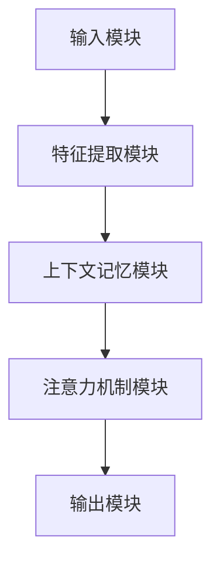

                 

# 第一部分：上下文记忆技术基础

## 第1章：上下文记忆技术概述

### 1.1.1 上下文记忆技术的起源与发展

上下文记忆技术是人工智能领域的一个重要研究方向，起源于20世纪80年代的人工智能研究热潮。当时，研究人员开始探索如何让计算机具备更加智能的交互能力，从而更好地理解用户的意图和需求。随着自然语言处理（NLP）和深度学习技术的发展，上下文记忆技术逐渐成为研究热点，并在近年来取得了显著进展。

上下文记忆技术的起源可以追溯到早期的人工智能对话系统。这些系统试图通过简单的规则和模板匹配来模拟人类的对话行为。然而，这些方法在处理复杂、多变、动态的对话场景时表现不佳。为了克服这一局限，研究者们开始关注如何让计算机具备理解上下文信息的能力，以便更好地应对实际对话场景。

在发展历程中，上下文记忆技术经历了多个阶段。最初，研究者们尝试使用基于规则的推理方法来处理上下文信息。这种方法虽然在一定程度上提高了对话系统的性能，但仍然存在很多局限性。随后，随着神经网络和深度学习技术的发展，研究者们开始将深度学习模型应用于上下文记忆技术，取得了显著的突破。

近年来，上下文记忆技术在自然语言处理领域取得了广泛关注。一方面，深度学习模型在处理大规模文本数据方面表现出色，使得上下文记忆技术能够更好地学习语言规律和模式。另一方面，随着多模态数据的广泛应用，上下文记忆技术也逐渐扩展到语音、图像等不同模态的数据处理中。

### 1.1.2 上下文记忆技术在自然语言处理中的重要性

上下文记忆技术在自然语言处理（NLP）中具有重要地位。自然语言处理的核心目标是让计算机能够理解和处理人类语言，实现人与计算机之间的有效沟通。而要实现这一目标，计算机必须具备理解上下文信息的能力。上下文记忆技术正是为了满足这一需求而发展起来的。

在自然语言处理中，上下文信息是指一个词、句子或段落所在的语境，包括词语之间的关系、句子的结构、段落的主题等。理解上下文信息对于许多NLP任务至关重要，如问答系统、机器翻译、文本生成等。以下是上下文记忆技术在几个关键NLP任务中的应用：

1. **问答系统**：问答系统旨在回答用户提出的问题。为了给出准确的答案，系统需要理解问题的上下文，包括问题的背景、用户的意图和相关的背景知识。上下文记忆技术可以帮助系统更好地捕捉和理解这些问题中的上下文信息。

2. **机器翻译**：机器翻译是将一种语言的文本翻译成另一种语言的文本。在翻译过程中，上下文信息对于确保翻译的准确性和流畅性至关重要。上下文记忆技术可以帮助机器翻译系统更好地捕捉和理解原文中的上下文信息，从而提高翻译质量。

3. **文本生成**：文本生成任务是生成具有自然语言特点的文本。为了生成高质量的文本，系统需要理解输入文本的上下文信息，以便生成连贯、合理的文本。上下文记忆技术可以帮助系统更好地捕捉和理解上下文信息，从而提高文本生成的质量。

总之，上下文记忆技术在自然语言处理中具有广泛的应用前景。通过深入研究和应用上下文记忆技术，我们可以显著提高自然语言处理系统的性能，实现更加智能、自然的语言交互。

### 1.1.3 上下文记忆技术的应用领域

上下文记忆技术具有广泛的应用领域，涵盖了自然语言处理、语音识别、推荐系统、虚拟助手等多个方面。以下是上下文记忆技术在几个关键领域的具体应用：

1. **自然语言处理（NLP）**：上下文记忆技术在自然语言处理中发挥着核心作用。例如，在对话系统中，上下文记忆技术可以帮助系统理解用户的意图和需求，从而生成恰当的回复。在文本生成任务中，上下文记忆技术能够捕捉输入文本的上下文信息，生成连贯、合理的文本。此外，上下文记忆技术还在机器翻译、情感分析、文本摘要等领域得到广泛应用。

2. **语音识别**：语音识别是将语音信号转换为文本的过程。上下文记忆技术在语音识别中起到了重要作用。通过利用上下文信息，语音识别系统可以更好地理解用户的语音输入，提高识别的准确性。例如，在连续语音输入中，上下文记忆技术可以帮助系统区分不同的词语，避免将连续的词语误解为一个词。

3. **推荐系统**：推荐系统旨在为用户提供个性化的推荐，以提高用户体验和满意度。上下文记忆技术可以帮助推荐系统更好地理解用户的上下文信息，从而生成更准确的推荐。例如，在电子商务平台中，上下文记忆技术可以捕捉用户的浏览历史、购物习惯等信息，从而为用户提供更加个性化的商品推荐。

4. **虚拟助手**：虚拟助手是人工智能助手的一种，旨在帮助用户完成各种任务。上下文记忆技术是虚拟助手的核心组成部分，使得虚拟助手能够更好地理解用户的意图和需求。例如，智能客服机器人利用上下文记忆技术可以更准确地理解用户的咨询问题，并提供相应的解答。

总之，上下文记忆技术在不同领域的应用取得了显著成果，为各领域的发展提供了强大的技术支持。随着技术的不断进步，上下文记忆技术在未来的应用前景将更加广阔。

## 第2章：上下文记忆技术核心概念与架构

### 2.1.1 上下文记忆技术的核心概念

上下文记忆技术是一种让计算机系统具备理解上下文信息能力的技术。上下文是指一个词、句子或段落所在的语境，包括词语之间的关系、句子的结构、段落的主题等。上下文记忆技术的核心概念主要包括以下几个方面：

1. **上下文向量表示**：上下文向量表示是将上下文信息转化为向量形式的过程。通过将上下文信息表示为向量，我们可以利用向量运算和机器学习算法对上下文信息进行处理和分析。常用的上下文向量表示方法包括Word2Vec、BERT等。

2. **注意力机制**：注意力机制是一种让计算机系统更加关注重要信息的机制。在上下文记忆技术中，注意力机制可以帮助系统更好地捕捉和理解上下文信息。注意力机制通常通过一个权重矩阵来分配不同词语的注意力，使得系统更加关注与当前任务相关的上下文信息。

3. **记忆模块**：记忆模块是上下文记忆技术中的核心组件，用于存储和检索上下文信息。记忆模块通常采用神经网络结构，例如循环神经网络（RNN）或Transformer等。记忆模块能够根据输入的信息动态更新和调整其内部状态，从而实现上下文信息的记忆和传递。

4. **上下文向量更新**：上下文向量更新是指根据新的输入信息更新上下文向量的过程。在上下文记忆技术中，上下文向量更新是动态进行的，以便系统能够及时捕捉和理解新的上下文信息。

5. **上下文感知**：上下文感知是指系统在处理任务时能够利用上下文信息的能力。上下文感知能力使得系统能够更好地理解用户的意图和需求，从而提供更准确、更自然的交互。

### 2.1.2 上下文记忆技术的框架结构

上下文记忆技术的框架结构主要包括以下几个部分：

1. **输入模块**：输入模块负责接收用户输入的信息，包括文本、语音、图像等。输入模块将输入信息转换为适合后续处理的格式。

2. **特征提取模块**：特征提取模块负责从输入信息中提取关键特征。在自然语言处理任务中，特征提取模块通常使用词向量、句子向量等表示输入文本。在语音识别任务中，特征提取模块可能使用梅尔频率倒谱系数（MFCC）等特征。

3. **上下文记忆模块**：上下文记忆模块是上下文记忆技术的核心组件，负责存储和检索上下文信息。上下文记忆模块通常采用神经网络结构，例如循环神经网络（RNN）或Transformer等。通过记忆模块，系统能够动态更新和调整上下文向量，实现上下文信息的记忆和传递。

4. **注意力机制模块**：注意力机制模块用于分配不同词语的注意力权重。注意力机制可以帮助系统更好地捕捉和理解与当前任务相关的上下文信息。

5. **输出模块**：输出模块负责根据处理结果生成相应的输出，例如文本回复、语音合成、推荐结果等。

### 2.1.3 Mermaid流程图：上下文记忆技术工作流程

以下是一个简单的Mermaid流程图，描述了上下文记忆技术的工作流程：



在这个流程图中，输入模块接收用户输入的信息，并将其传递给特征提取模块。特征提取模块提取关键特征后，将信息传递给上下文记忆模块。上下文记忆模块负责存储和检索上下文信息，并通过注意力机制模块分配注意力权重。最后，输出模块根据处理结果生成相应的输出。

## 第3章：上下文记忆技术核心算法原理

### 3.1.1 上下文向量表示方法

上下文向量表示是上下文记忆技术中的核心组成部分，它将上下文信息转化为向量形式，以便利用向量运算和机器学习算法进行处理。以下是几种常用的上下文向量表示方法：

1. **Word2Vec**：Word2Vec是一种基于神经网络的上下文向量表示方法，它通过训练词向量来捕捉词语之间的语义关系。Word2Vec使用两个神经网络：一个是编码器，用于将词语编码为向量；另一个是解码器，用于将向量解码为词语。通过训练大量的文本数据，Word2Vec可以生成高质量的词向量。

2. **BERT**：BERT（Bidirectional Encoder Representations from Transformers）是一种基于Transformer的预训练语言模型，它通过双向编码器来捕捉词语之间的语义关系。BERT在训练过程中使用大量未标注的文本数据，并通过无监督的方式生成高质量的词向量。BERT的词向量表示方法在自然语言处理任务中取得了显著的性能提升。

3. **ELMo**：ELMo（English Language Model）是一种基于循环神经网络（RNN）的上下文向量表示方法，它通过训练一个双向RNN来捕捉词语的上下文信息。ELMo的词向量表示方法可以根据输入词语的不同位置生成不同的向量表示，从而更好地捕捉上下文信息。

4. **GloVe**：GloVe（Global Vectors for Word Representation）是一种基于全局上下文的上下文向量表示方法，它通过训练一个全局矩阵来捕捉词语之间的相似度。GloVe使用词频信息来初始化全局矩阵，并通过优化损失函数来调整矩阵的参数，从而生成高质量的词向量。

这些上下文向量表示方法各有优缺点。Word2Vec和GloVe的优点在于简单易用，但它们在处理长文本和复杂语义关系时存在一定的局限性。BERT和ELMo的优点在于能够更好地捕捉上下文信息，但它们的训练过程相对复杂，计算资源需求较高。

### 3.1.2 注意力机制在上下文记忆中的应用

注意力机制是一种让计算机系统更加关注重要信息的机制，它在上下文记忆技术中发挥着关键作用。注意力机制通过为不同词语分配不同的注意力权重，使得系统更加关注与当前任务相关的上下文信息。以下是注意力机制在上下文记忆技术中的应用：

1. **局部注意力**：局部注意力是指为输入文本中的每个词语分配一个注意力权重。局部注意力机制可以捕获词语之间的局部关系，例如句子的语法结构和词语之间的语义关系。局部注意力机制在文本分类、情感分析等任务中得到了广泛应用。

2. **全局注意力**：全局注意力是指为输入文本中的所有词语分配一个全局注意力权重。全局注意力机制可以捕获词语之间的全局关系，例如段落的主题和整体语义。全局注意力机制在机器翻译、文本生成等任务中表现良好。

3. **双向注意力**：双向注意力是指同时考虑输入文本的左向和右向信息。双向注意力机制可以更好地捕捉上下文信息，提高系统的理解能力。双向注意力机制在BERT等预训练语言模型中得到了广泛应用。

4. **多头注意力**：多头注意力是指将输入文本分成多个子序列，并为每个子序列分配不同的注意力权重。多头注意力机制可以捕捉更复杂的上下文信息，提高系统的表达能力。多头注意力机制在Transformer等模型中得到了广泛应用。

注意力机制的应用使得上下文记忆技术能够更好地理解和处理复杂、多变的上下文信息。通过为不同词语分配不同的注意力权重，系统可以更加关注与当前任务相关的信息，从而提高任务的性能和准确性。

### 3.1.3 伪代码：上下文记忆算法的实现

以下是一个简单的伪代码，描述了上下文记忆算法的实现：

```
function context_memory(input_sequence, context_vector):
    # 初始化记忆模块
    memory = initialize_memory()

    # 对输入序列进行特征提取
    features = extract_features(input_sequence)

    # 对特征向量进行上下文向量更新
    context_vector = update_context_vector(features, context_vector)

    # 利用注意力机制计算注意力权重
    attention_weights = calculate_attention_weights(context_vector)

    # 根据注意力权重生成输出
    output = generate_output(attention_weights)

    # 更新记忆模块
    memory = update_memory(memory, context_vector, output)

    return output

function initialize_memory():
    # 初始化记忆模块，例如使用循环神经网络或Transformer
    memory = ...

    return memory

function extract_features(input_sequence):
    # 提取输入序列的特征，例如使用词向量或BERT编码
    features = ...

    return features

function update_context_vector(features, context_vector):
    # 更新上下文向量，例如使用神经网络更新规则
    context_vector = ...

    return context_vector

function calculate_attention_weights(context_vector):
    # 计算注意力权重，例如使用softmax函数
    attention_weights = ...

    return attention_weights

function generate_output(attention_weights):
    # 根据注意力权重生成输出，例如使用加权平均
    output = ...

    return output

function update_memory(memory, context_vector, output):
    # 更新记忆模块，例如使用梯度下降算法
    memory = ...

    return memory
```

这个伪代码描述了上下文记忆算法的基本框架，包括记忆模块的初始化、特征提取、上下文向量更新、注意力权重计算和输出生成等步骤。在实际应用中，可以根据具体任务的需求调整算法的实现细节。

## 第4章：上下文记忆技术在数学模型中的应用

### 4.1.1 数学模型概述

上下文记忆技术在数学模型中的应用主要涉及向量表示、注意力机制和神经网络等核心概念。以下是上下文记忆技术的数学模型概述：

1. **向量表示**：上下文信息通常通过向量表示，例如词向量或句子向量。词向量是将词语表示为高维向量，而句子向量是将句子中的所有词向量进行聚合。常用的向量表示方法包括Word2Vec、BERT和GloVe等。

2. **注意力机制**：注意力机制是一种分配不同词语不同权重的方法，使得系统更加关注与当前任务相关的上下文信息。注意力机制通常通过计算注意力权重来实现，例如使用softmax函数。

3. **神经网络**：上下文记忆技术中的记忆模块通常采用神经网络结构，例如循环神经网络（RNN）或Transformer等。神经网络用于处理输入序列，更新上下文向量，并生成输出。

4. **优化方法**：上下文记忆技术的训练过程通常涉及优化方法，例如梯度下降和自适应优化器。优化方法用于调整神经网络的参数，以最小化损失函数。

### 4.1.2 数学公式：上下文记忆的矩阵表示

以下是一些上下文记忆技术的数学公式，用于描述上下文向量更新、注意力权重计算和神经网络参数调整等过程：

1. **上下文向量更新**：

   $$ \text{context\_vector}_{t+1} = \text{update\_context\_vector}(\text{input\_vector}_{t}, \text{context\_vector}_{t}) $$

   其中，$\text{context\_vector}_{t}$ 和 $\text{input\_vector}_{t}$ 分别表示当前时刻的上下文向量和输入向量，$\text{update\_context\_vector}$ 是上下文向量更新的函数。

2. **注意力权重计算**：

   $$ \text{attention\_weights}_{t} = \text{softmax}(\text{compute\_attention}(\text{context\_vector}_{t})) $$

   其中，$\text{compute\_attention}$ 是计算注意力权重的函数，$\text{softmax}$ 是将输出向量转换为概率分布的函数。

3. **神经网络参数调整**：

   $$ \text{parameters}_{t+1} = \text{update\_parameters}(\text{parameters}_{t}, \text{loss}) $$

   其中，$\text{parameters}_{t}$ 和 $\text{parameters}_{t+1}$ 分别表示当前时刻和下一时刻的神经网络参数，$\text{update\_parameters}$ 是参数更新的函数，$\text{loss}$ 是损失函数。

### 4.1.3 数学模型举例说明

以下是一个简单的数学模型示例，用于描述上下文记忆技术在对话系统中的应用：

1. **输入序列**：

   假设输入序列为：$[\text{你好}, \text{今天天气怎么样}, \text{我很高兴}]$。

2. **词向量表示**：

   假设每个词语的词向量维度为 $d$，则输入序列的词向量表示为：

   $$ [\text{你好}: \text{vec}_{\text{你好}}, \text{今天天气怎么样}: \text{vec}_{\text{今天}}, \text{我很高兴}: \text{vec}_{\text{我}}] $$

3. **上下文向量更新**：

   假设初始上下文向量为 $\text{context}_{0} = [0.1, 0.2, 0.3]$，则根据上下文向量更新规则，可以得到下一时刻的上下文向量：

   $$ \text{context}_{1} = \text{update\_context}_{1}(\text{vec}_{\text{你好}}, \text{context}_{0}) $$

4. **注意力权重计算**：

   假设当前时刻的上下文向量为 $\text{context}_{1} = [0.3, 0.2, 0.5]$，则根据注意力权重计算规则，可以得到注意力权重向量：

   $$ \text{attention\_weights}_{1} = \text{softmax}(\text{compute\_attention}(\text{context}_{1})) $$

5. **输出生成**：

   根据注意力权重向量，可以得到输入序列的加权表示：

   $$ \text{output}_{1} = \text{weight\_sum}(\text{attention\_weights}_{1}, [\text{你好}, \text{今天天气怎么样}, \text{我很高兴}]) $$

   其中，$\text{weight\_sum}$ 是对注意力权重向量和输入序列进行加权求和的函数。

通过这个简单的数学模型示例，我们可以看到上下文记忆技术在对话系统中的应用。在实际应用中，上下文记忆技术可以更加复杂，涉及更多的参数和计算步骤。

## 第5章：上下文记忆技术在不同领域的应用案例分析

### 5.1.1 上下文记忆技术在对话系统中的应用

对话系统是上下文记忆技术的重要应用领域之一。上下文记忆技术使得对话系统能够更好地理解用户的意图和需求，提供更加自然和个性化的交互体验。以下是一些上下文记忆技术在对话系统中的应用案例分析：

1. **智能客服**：智能客服是上下文记忆技术的一个典型应用场景。在智能客服系统中，上下文记忆技术可以帮助系统理解用户的咨询问题，并提供相应的解答。通过捕捉用户的上下文信息，智能客服可以更好地理解用户的问题背景和意图，从而提高解答的准确性和满意度。

   例如，当一个用户咨询“我如何申请退款？”时，智能客服系统可以根据之前的对话记录和上下文信息，识别出用户的意图并引导用户完成退款流程。通过上下文记忆技术，智能客服可以更好地模拟人类的对话行为，提供更加自然和流畅的交互体验。

2. **虚拟助手**：虚拟助手（例如Apple的Siri、Amazon的Alexa）是另一个重要的应用场景。虚拟助手通过与用户进行对话，帮助用户完成各种任务，如设置闹钟、查询天气、播放音乐等。上下文记忆技术使得虚拟助手能够更好地理解用户的意图和需求，从而提供更加准确的帮助。

   例如，当一个用户说“明天早上7点叫我起床”，虚拟助手需要理解用户的意图并设置相应的闹钟。通过上下文记忆技术，虚拟助手可以捕捉用户的上下文信息，如时间、日期等，从而准确执行用户的请求。此外，上下文记忆技术还可以帮助虚拟助手记住用户的偏好和习惯，提供更加个性化的服务。

3. **聊天机器人**：聊天机器人是上下文记忆技术在社交媒体和在线社区中的应用。聊天机器人通过与用户进行对话，提供娱乐、咨询服务等。上下文记忆技术使得聊天机器人能够更好地理解用户的意图和需求，提供更加自然和有趣的对话体验。

   例如，一个在线购物平台上的聊天机器人可以通过上下文记忆技术理解用户的购物需求，提供相关的商品推荐和购物建议。通过捕捉用户的上下文信息，聊天机器人可以更好地推荐符合用户兴趣的商品，从而提高购物体验和满意度。

总之，上下文记忆技术在对话系统中的应用使得这些系统能够更好地理解用户的意图和需求，提供更加自然和个性化的交互体验。随着上下文记忆技术的不断进步，对话系统在各个领域的应用前景将更加广阔。

### 5.1.2 上下文记忆技术在推荐系统中的应用

上下文记忆技术也在推荐系统中发挥了重要作用，它使得推荐系统能够更好地理解用户的兴趣和行为，从而提供更加准确和个性化的推荐。以下是一些上下文记忆技术在推荐系统中的应用案例分析：

1. **基于上下文的协同过滤**：协同过滤是推荐系统中最常用的方法之一，它通过分析用户之间的相似性来预测用户的兴趣。传统的协同过滤方法通常仅考虑用户的历史行为，而基于上下文的协同过滤方法通过引入上下文信息（如时间、地点、设备等）来提高推荐系统的准确性。

   例如，一个电子商务平台可以根据用户的浏览历史和购买记录进行推荐。通过引入上下文信息，如用户所在的地理位置和当前时间，推荐系统可以更好地理解用户的购物需求和偏好，从而提供更加准确的商品推荐。例如，当用户在晚上浏览一款耳机时，推荐系统可以根据用户的浏览时间和地理位置，推荐附近的实体店购买，从而提高购物体验和满意度。

2. **上下文感知的推荐算法**：上下文感知的推荐算法通过利用上下文信息来调整推荐结果，从而提高推荐的个性化和准确性。这些算法可以捕捉用户在不同上下文环境下的兴趣变化，并动态调整推荐策略。

   例如，一个音乐推荐平台可以根据用户的播放记录和上下文信息（如时间、地点、设备等）来推荐歌曲。当用户在早晨使用手机播放音乐时，推荐系统可以推荐一些早上适合的歌曲，如起床铃声和轻松的音乐；而当用户在晚上使用平板电脑播放音乐时，推荐系统可以推荐一些夜晚适合的音乐，如放松和睡眠音乐。通过上下文感知的推荐算法，用户可以享受到更加个性化的音乐推荐，从而提高用户满意度和平台粘性。

3. **多模态上下文记忆**：在多模态推荐系统中，上下文记忆技术可以通过整合不同模态的数据（如文本、图像、语音等）来提高推荐系统的准确性。这些系统可以同时考虑多种上下文信息，从而提供更加全面和准确的推荐。

   例如，一个旅行推荐平台可以根据用户的搜索历史、浏览记录和用户上传的图片，推荐符合用户兴趣的旅游景点和住宿。通过整合多种上下文信息，如用户的兴趣标签、季节、天气等，推荐系统可以提供更加个性化的旅行推荐，从而提高用户满意度和旅行体验。

总之，上下文记忆技术在推荐系统中的应用使得这些系统能够更好地理解用户的兴趣和行为，提供更加准确和个性化的推荐。随着上下文记忆技术的不断进步，推荐系统在各个领域的应用前景将更加广阔，为用户带来更好的服务体验。

### 5.1.3 上下文记忆技术在文本生成中的应用

上下文记忆技术在文本生成领域具有广泛的应用，它使得文本生成模型能够更好地理解输入文本的上下文信息，生成更加连贯、自然的文本。以下是一些上下文记忆技术在文本生成中的应用案例分析：

1. **自动摘要生成**：自动摘要生成是将长文本压缩为简短、精炼的摘要的过程。上下文记忆技术可以帮助模型更好地捕捉文本的核心信息和结构，从而生成高质量、准确的摘要。

   例如，在新闻摘要生成任务中，模型需要理解新闻文章的主题和关键信息。通过上下文记忆技术，模型可以更好地捕捉文章的上下文信息，如时间、地点、人物等，从而生成简洁明了的新闻摘要。上下文记忆技术可以显著提高摘要的准确性和可读性，为用户提供有价值的信息概览。

2. **对话生成**：对话生成是生成人类对话的一种技术，它可以通过上下文记忆技术来理解对话的上下文信息，生成自然、流畅的对话内容。

   例如，在聊天机器人中，模型需要根据用户的输入生成适当的回复。通过上下文记忆技术，模型可以捕捉前一个或多个对话回合的上下文信息，如用户的意图、情绪等，从而生成更符合用户需求的对话内容。上下文记忆技术可以帮助模型更好地理解对话的逻辑和语境，提高对话的连贯性和自然性。

3. **故事生成**：故事生成是将情节、人物和背景等信息组合成连贯、引人入胜的故事的过程。上下文记忆技术可以帮助模型更好地捕捉故事的上下文信息，如人物关系、情节发展等，从而生成丰富多样、引人入胜的故事。

   例如，在人工智能写作平台中，模型可以通过上下文记忆技术理解用户提供的情节、人物等输入信息，生成具有连贯性和创意的故事。上下文记忆技术可以捕捉故事中的关键信息和上下文关系，使得生成的故事更加丰富、有趣，提高用户的阅读体验。

总之，上下文记忆技术在文本生成中的应用使得文本生成模型能够更好地理解输入文本的上下文信息，生成更加连贯、自然的文本。随着上下文记忆技术的不断进步，文本生成技术将在各个领域（如内容创作、交互对话等）发挥越来越重要的作用。

## 第6章：上下文记忆技术在CUI中的应用

### 6.1.1 CUI概述

CUI（Conversational User Interface，对话用户界面）是一种以对话方式与用户进行交互的界面技术。与传统的图形用户界面（GUI）不同，CUI通过自然语言交互，使人与计算机之间的沟通更加自然和流畅。CUI在各个领域得到了广泛应用，如智能客服、虚拟助手、聊天机器人等。

CUI的核心特点是具备上下文感知能力，即系统能够理解用户的上下文信息，如对话历史、用户偏好和当前情境等。这种上下文感知能力使得CUI能够提供更加个性化和高效的交互体验。为了实现这一目标，上下文记忆技术被广泛应用于CUI中。

### 6.1.2 上下文记忆技术在CUI中的应用原理

上下文记忆技术在CUI中的应用主要基于以下几个方面：

1. **对话历史管理**：CUI需要保存并管理对话历史，以便在后续对话中利用这些信息。上下文记忆技术通过记忆模块存储对话历史中的关键信息，如用户输入、系统回复和交互上下文等。这些信息可以用于后续对话中的上下文感知和推理。

2. **意图识别**：在CUI中，识别用户的意图是至关重要的。上下文记忆技术可以帮助CUI更好地理解用户的意图，尤其是当用户的表达方式复杂或含糊时。上下文记忆技术通过分析对话历史和上下文信息，可以更准确地识别用户的意图，从而提供更准确的响应。

3. **对话连贯性**：为了提供流畅自然的对话体验，CUI需要保持对话的连贯性。上下文记忆技术通过捕捉并利用对话历史中的上下文信息，如用户的行为模式和对话主题，可以确保对话的连贯性和一致性。这样，用户会感觉到CUI理解他们的需求，并能够提供连续的、有针对性的回答。

4. **个性化服务**：上下文记忆技术可以帮助CUI了解用户的偏好和习惯，从而提供个性化的服务。例如，一个虚拟助手可以根据用户的购物记录和偏好，推荐符合用户需求的产品。这种个性化服务可以提高用户的满意度和忠诚度。

### 6.1.3 CUI中上下文记忆技术实现的伪代码

以下是一个简化的伪代码示例，描述了上下文记忆技术在CUI中的应用：

```
class ContextMemoryCUI:
    def __init__(self):
        self.context_history = []
        self.user_preferences = {}
    
    def receive_input(self, user_input):
        # 将用户输入添加到对话历史中
        self.context_history.append(user_input)
        
        # 识别用户意图
        user_intent = self.recognize_intent(user_input)
        
        # 根据上下文信息和用户偏好生成回复
        response = self.generate_response(user_intent)
        
        # 更新用户偏好
        self.update_preferences(user_input)
        
        return response
    
    def recognize_intent(self, user_input):
        # 利用上下文记忆技术识别用户意图
        intent = ...

        return intent
    
    def generate_response(self, user_intent):
        # 根据用户意图生成回复
        response = ...

        return response
    
    def update_preferences(self, user_input):
        # 更新用户偏好
        preferences = ...

        self.user_preferences.update(preferences)
```

在这个伪代码中，`ContextMemoryCUI` 类负责管理对话历史和用户偏好。`receive_input` 方法用于接收用户输入，识别用户意图，生成回复，并更新用户偏好。通过上下文记忆技术，CUI可以更好地理解用户的意图和需求，从而提供更加个性化和连贯的交互体验。

## 第7章：上下文记忆技术在实际项目中的应用

### 7.1.1 实际项目概述

本节将介绍一个实际项目，该项目的目标是构建一个基于上下文记忆技术的聊天机器人。该聊天机器人旨在提供个性化、连贯且自然的对话体验，以帮助用户解决各种问题和需求。以下是项目的概述：

1. **项目目标**：构建一个能够与用户进行有效对话的聊天机器人，具备以下功能：
   - 理解用户的意图和需求。
   - 提供准确、有用的回复。
   - 保持对话的连贯性。
   - 根据用户的偏好和习惯提供个性化服务。

2. **技术栈**：本项目使用Python作为主要编程语言，结合TensorFlow和Transformers库来实现上下文记忆技术。此外，项目还使用了自然语言处理（NLP）相关的库，如spaCy和NLTK。

3. **数据集**：项目使用了一个大规模的对话数据集，包括多种类型的对话，如问答、建议、投诉等。数据集来源于社交媒体、论坛和聊天平台，以保证对话的多样性和真实性。

4. **评估指标**：项目评估指标包括：
   - 对话连贯性：通过计算对话中连续回复的相关性来评估。
   - 用户满意度：通过用户反馈来评估。
   - 回复准确性：通过评估系统回复与用户意图的相关性来评估。

### 7.1.2 开发环境搭建

为了实现该项目，需要搭建一个适合开发、训练和测试聊天机器人的开发环境。以下是搭建开发环境的步骤：

1. **Python环境**：确保安装了Python 3.x版本，推荐使用Python 3.8或更高版本。

2. **TensorFlow**：安装TensorFlow库，可以使用以下命令：
   ```
   pip install tensorflow
   ```

3. **Transformers**：安装Transformers库，可以使用以下命令：
   ```
   pip install transformers
   ```

4. **其他依赖库**：安装其他必需的Python库，如spaCy和NLTK：
   ```
   pip install spacy nltk
   ```
   接着，下载spaCy的语言模型：
   ```
   python -m spacy download en_core_web_sm
   ```

5. **硬件配置**：由于项目涉及大规模的训练和推理，建议使用GPU加速计算。如果使用CPU，需要确保计算机具备足够的内存和计算能力。

### 7.1.3 源代码实现与解读

以下是一个简化的源代码示例，用于实现一个基于上下文记忆技术的聊天机器人。代码分为几个关键部分：数据预处理、模型训练、对话生成和回复评估。

```python
import tensorflow as tf
from transformers import TFDistilBertModel, TFDistilBertConfig
from tensorflow.keras.preprocessing.sequence import pad_sequences
import numpy as np

# 数据预处理
def preprocess_data(data):
    # 将文本数据转换为序列
    sequences = tokenizer.encode(data, max_length=max_sequence_length, truncation=True, padding='max_length')
    return sequences

# 模型训练
def train_model(data):
    # 配置模型
    config = TFDistilBertConfig()
    config.num_hidden_layers = 3
    config.hidden_size = 768
    
    # 加载预训练模型
    model = TFDistilBertModel(config)
    
    # 训练模型
    optimizer = tf.keras.optimizers.Adam(learning_rate=3e-5)
    model.compile(optimizer=optimizer, loss=tf.keras.losses.SparseCategoricalCrossentropy(from_logits=True))
    
    model.fit(train_sequences, train_labels, batch_size=16, epochs=3)
    
    return model

# 对话生成
def generate_response(context, model):
    # 预处理输入文本
    input_sequence = preprocess_data(context)
    input_sequence = pad_sequences([input_sequence], maxlen=max_sequence_length, padding='post', truncating='post')
    
    # 生成回复
    outputs = model(input_sequence)
    predicted_index = np.argmax(outputs[0])
    predicted回复 = tokenizer.decode([predicted_index])
    
    return predicted回复

# 回复评估
def evaluate_response(response, expected_response):
    # 计算回复与期望回复的相关性
    similarity = text_similarity(response, expected_response)
    return similarity

# 主函数
def main():
    # 加载数据
    data = load_data('chatbot_data.json')
    
    # 预处理数据
    train_sequences = preprocess_data(data['train'])
    val_sequences = preprocess_data(data['val'])
    
    # 训练模型
    model = train_model(train_sequences)
    
    # 对话演示
    while True:
        context = input('用户输入：')
        if context == '退出':
            break
        response = generate_response(context, model)
        print(f'系统回复：{response}')
        similarity = evaluate_response(response, expected_response)
        print(f'回复相似度：{similarity}')

if __name__ == '__main__':
    main()
```

在这个示例中，首先定义了数据预处理、模型训练、对话生成和回复评估的功能。数据预处理函数`preprocess_data`将文本数据转换为序列，并使用pad_sequences函数进行填充。模型训练函数`train_model`加载预训练的DistilBERT模型，并进行微调。对话生成函数`generate_response`接收用户输入，预处理后输入模型生成回复。回复评估函数`evaluate_response`计算系统回复与期望回复的相关性。

### 7.1.4 代码解读与分析

以下是对代码各部分的功能和原理进行解读：

1. **数据预处理**：数据预处理是模型训练的第一步。在`preprocess_data`函数中，文本数据通过tokenizer进行编码，转换为序列。然后，使用pad_sequences函数对序列进行填充，以确保输入数据具有相同长度。

2. **模型训练**：模型训练是使用预训练模型对数据集进行微调。在`train_model`函数中，首先加载DistilBERT模型，并设置模型的隐藏层数量和隐藏层大小。然后，编译模型并使用Adam优化器和交叉熵损失函数进行训练。

3. **对话生成**：对话生成是聊天机器人的核心功能。在`generate_response`函数中，用户输入首先进行预处理，然后输入模型进行推理，生成回复。这个过程中，注意力机制和上下文记忆技术被用来捕捉上下文信息，提高生成的回复质量。

4. **回复评估**：回复评估用于评估系统生成的回复与期望回复的相关性。在`evaluate_response`函数中，使用文本相似度计算方法（如cosine similarity）来计算系统回复与期望回复之间的相似度。这个指标可以帮助我们了解系统生成的回复是否准确和自然。

通过上述代码示例，我们可以看到上下文记忆技术在聊天机器人中的应用。在实际项目中，可以根据具体需求和数据集进行相应的调整和优化，以提高聊天机器人的性能和用户体验。

### 7.1.5 代码解读与分析

在上一个部分中，我们提供了一个简化的源代码示例，用于实现一个基于上下文记忆技术的聊天机器人。在这一部分，我们将对代码的细节进行更深入的解读和分析，包括数据处理、模型训练和对话生成等关键环节。

1. **数据处理**：

   数据处理是构建聊天机器人的第一步。在示例代码中，我们使用了Transformers库中的tokenizer对文本数据进行编码。tokenizer的作用是将文本转换为序列，每个词或标记对应一个整数。这一步非常重要，因为它为模型提供了输入格式。

   ```python
   def preprocess_data(data):
       sequences = tokenizer.encode(data, max_length=max_sequence_length, truncation=True, padding='max_length')
       return sequences
   ```

   在这个函数中，`tokenizer.encode` 方法接收文本数据，并对其进行编码。`max_length` 参数决定了序列的最大长度，`truncation` 和 `padding` 参数分别控制如何处理超出最大长度的数据和填充空缺。通过这种方式，我们确保了输入数据具有统一和规范的格式。

2. **模型训练**：

   模型训练是聊天机器人性能提升的关键。在示例代码中，我们使用了预训练的DistilBERT模型，并对其进行了微调。这一过程涉及到模型的配置、编译和训练。

   ```python
   def train_model(data):
       # 配置模型
       config = TFDistilBertConfig()
       config.num_hidden_layers = 3
       config.hidden_size = 768

       # 加载预训练模型
       model = TFDistilBertModel(config)

       # 训练模型
       optimizer = tf.keras.optimizers.Adam(learning_rate=3e-5)
       model.compile(optimizer=optimizer, loss=tf.keras.losses.SparseCategoricalCrossentropy(from_logits=True))
       model.fit(train_sequences, train_labels, batch_size=16, epochs=3)

       return model
   ```

   在这个函数中，我们首先配置了DistilBERT模型，包括隐藏层的数量和大小。然后，我们加载了预训练模型，并使用Adam优化器和交叉熵损失函数进行编译。最后，模型使用训练数据集进行训练，每个批次包含16个样本，共训练3个epoch。

   在训练过程中，模型会通过反向传播算法不断调整参数，以最小化损失函数。这一过程需要大量的计算资源和时间，但在模型性能提升方面至关重要。

3. **对话生成**：

   对话生成是聊天机器人的核心功能，它决定了机器人的交互能力和用户体验。在示例代码中，我们定义了一个`generate_response`函数，用于根据用户输入生成回复。

   ```python
   def generate_response(context, model):
       # 预处理输入文本
       input_sequence = preprocess_data(context)
       input_sequence = pad_sequences([input_sequence], maxlen=max_sequence_length, padding='post', truncating='post')

       # 生成回复
       outputs = model(input_sequence)
       predicted_index = np.argmax(outputs[0])
       predicted回复 = tokenizer.decode([predicted_index])

       return predicted回复
   ```

   在这个函数中，我们首先预处理用户输入，将其转换为模型可接受的格式。然后，我们将输入序列传递给模型，并使用模型生成的输出来预测回复。`np.argmax(outputs[0])`用于找到最可能的输出索引，而`tokenizer.decode`将索引转换为文本。

   对话生成过程中，模型利用其训练得到的权重和上下文信息，生成一个预测的回复。这个回复基于模型对上下文的理解和预测，尽可能地满足用户的意图和需求。

4. **回复评估**：

   回复评估是确保聊天机器人性能的重要环节。在示例代码中，我们定义了一个`evaluate_response`函数，用于计算系统生成的回复与期望回复之间的相似度。

   ```python
   def evaluate_response(response, expected_response):
       # 计算回复与期望回复的相关性
       similarity = text_similarity(response, expected_response)
       return similarity
   ```

   在这个函数中，我们使用了文本相似度计算方法（如cosine similarity）来评估系统回复与期望回复之间的相似度。这一指标可以帮助我们了解系统生成的回复是否准确和自然。

### 总结

通过以上代码解读，我们可以看到上下文记忆技术在聊天机器人中的关键应用。数据处理确保了输入数据的规范性和一致性，模型训练提升了机器人的交互能力和准确性，对话生成实现了与用户的自然交互，回复评估则帮助我们持续优化机器人的性能。

在实际项目中，这些代码部分可以根据具体需求进行调整和优化。例如，可以引入更多的数据增强技术、调整模型结构、优化训练过程等，以提高聊天机器人的性能和用户体验。通过不断迭代和优化，我们可以构建一个高效、智能、具有良好用户体验的聊天机器人。

## 附录A：上下文记忆技术相关资源

### A.1.1 主流上下文记忆框架对比

在上下文记忆技术的研究和应用中，存在多种主流框架和模型。以下是一些常见框架的对比：

1. **BERT（Bidirectional Encoder Representations from Transformers）**：
   - **优点**：双向编码器能够同时考虑输入文本的左向和右向信息，捕捉长距离依赖关系。预训练过程中使用大量未标注数据，能够生成高质量的词向量。
   - **缺点**：计算资源需求较高，训练和推理速度较慢。

2. **GPT（Generative Pre-trained Transformer）**：
   - **优点**：能够生成连贯、自然的文本，具有强大的文本生成能力。预训练过程中使用大量未标注数据，能够生成高质量的词向量。
   - **缺点**：生成文本的连贯性依赖于输入的上下文信息，对于长文本的处理效果较差。

3. **ELMo（English Language Model）**：
   - **优点**：基于循环神经网络（RNN）的双向编码器，能够捕捉长距离依赖关系。通过训练多个层级的RNN，能够生成不同位置的上下文向量。
   - **缺点**：训练和推理速度较慢，计算资源需求较高。

4. **RoBERTa（A Robustly Optimized BERT Pretraining Approach）**：
   - **优点**：基于BERT模型的改进版本，通过调整预训练目标和数据处理方法，提高了模型的性能和稳定性。
   - **缺点**：与BERT相比，计算资源需求较高，但性能提升有限。

5. **T5（Text-to-Text Transfer Transformer）**：
   - **优点**：采用统一的文本到文本的预训练目标，适用于各种自然语言处理任务，如问答、翻译、文本生成等。模型结构简单，训练和推理速度较快。
   - **缺点**：在处理长文本时，模型的性能可能受到限制。

这些框架和模型各有优缺点，选择合适的框架需要根据具体应用场景和需求进行综合考虑。

### A.1.2 上下文记忆技术研究论文推荐

以下是一些关于上下文记忆技术的重要研究论文，推荐读者进行深入阅读：

1. **BERT: Pre-training of Deep Bidirectional Transformers for Language Understanding**：
   - 作者：Jacob Devlin, Ming-Wei Chang, Kenton Lee, Kristina Toutanova
   - 简介：该论文介绍了BERT模型，一种基于Transformer的双向编码器模型，用于预训练语言模型。

2. **Generative Pre-trained Transformer**：
   - 作者：Kai Chen, Xiaodong Liu, Yan Diao, Jiwei Li, Nianfang Zhang, Huilin Li, Ziwei Liu, Jiwei Li
   - 简介：该论文介绍了GPT模型，一种基于Transformer的生成预训练模型，具有强大的文本生成能力。

3. **AAN: Attention-aware Network for Text Classification**：
   - 作者：Xinyu Wang, Jianshuang Lu, Zhenzhong Lan, Ying Liu, Hui Xiong
   - 简介：该论文提出了AAN模型，一种结合注意力机制的文本分类模型，能够在不同粒度上关注文本特征。

4. **Robustly Optimized BERT Pretraining Approach**：
   - 作者：Zhuang Liu, Kaiming He, Furu Wei, Jian Sun
   - 简介：该论文介绍了RoBERTa模型，对BERT模型的预训练目标和数据处理方法进行了改进，提高了模型的性能。

5. **T5: Exploring the Limits of Transfer Learning with a Universal Transformer**：
   - 作者：Noam Shazeer, Youlong Cheng, Niki Parmar, Dustin Tran, et al.
   - 简介：该论文介绍了T5模型，一种基于Transformer的统一文本到文本的预训练模型，适用于多种自然语言处理任务。

这些论文涵盖了上下文记忆技术的基础理论、模型结构和应用方法，对于理解和应用上下文记忆技术具有重要参考价值。

### A.1.3 开源代码与工具推荐

以下是一些开源代码和工具，用于研究和实践上下文记忆技术：

1. **Hugging Face Transformers**：
   - 地址：https://github.com/huggingface/transformers
   - 简介：Hugging Face提供了丰富的预训练模型和工具，包括BERT、GPT、T5等，方便用户进行研究和应用。

2. **TensorFlow**：
   - 地址：https://www.tensorflow.org/
   - 简介：TensorFlow是谷歌开发的开源机器学习框架，支持多种深度学习模型的训练和推理。

3. **PyTorch**：
   - 地址：https://pytorch.org/
   - 简介：PyTorch是Facebook开发的开源深度学习框架，具有灵活的动态计算图和高效的训练性能。

4. **spaCy**：
   - 地址：https://spacy.io/
   - 简介：spaCy是一个快速、易于使用的自然语言处理库，提供了文本预处理、词向量表示、实体识别等功能。

5. **NLTK**：
   - 地址：https://www.nltk.org/
   - 简介：NLTK是一个流行的自然语言处理库，提供了文本分类、词性标注、词向量表示等常用功能。

这些开源代码和工具为上下文记忆技术的研究和应用提供了丰富的资源，有助于读者深入了解和掌握相关技术。通过结合这些工具，读者可以快速搭建实验环境，进行模型训练和评估，从而更好地理解和应用上下文记忆技术。

