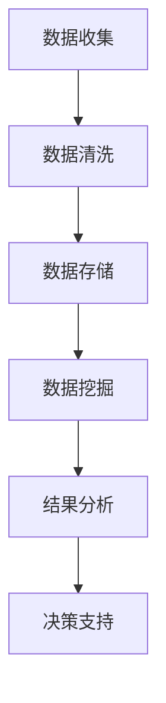
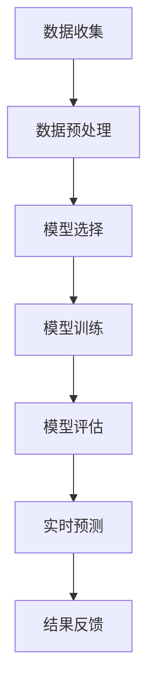
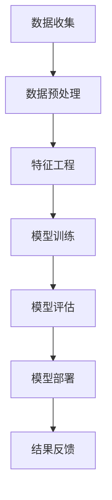

                 

### 《交通大数据分析与交通拥堵时间预测》

#### 关键词：交通大数据、交通拥堵、时间预测、数据分析、机器学习、深度学习

#### 摘要：
本文将深入探讨交通大数据的概念、收集处理方法，以及交通拥堵时间预测的技术原理和应用。通过对交通大数据的挖掘与分析，结合机器学习和深度学习算法，我们旨在构建一个高效的交通拥堵时间预测模型，为城市交通管理和规划提供科学依据。

----------------------------------------------------------------

### 第一部分：交通大数据概述

#### 第1章：交通大数据的背景与重要性

#### 1.1.1 交通大数据的定义

交通大数据是由多种来源、多种格式、多维度的数据组成的综合性数据集合。它不仅包括传统的交通流量数据、路况信息、交通事故数据，还涵盖了与交通相关的社会经济数据、天气环境数据等。交通大数据的定义可以用以下数学公式表示：

$$
\text{交通大数据} = \{\text{静态交通数据}, \text{动态交通数据}, \text{外部数据}\}
$$

其中，静态交通数据指的是描述交通基础设施和规则的固定数据，如道路网络、交通信号灯配置、交通法规等；动态交通数据指的是描述交通状态和事件的实时数据，如车辆速度、流量、交通事故等；外部数据包括与交通相关的社会经济数据（如人口密度、商业活动）、环境数据（如气象信息、空气质量）等。

#### 1.1.2 交通大数据的产生来源

交通大数据的产生来源广泛，主要包括以下几个方面：

1. **交通监测设备**：如摄像头、传感器、GPS等，可以实时收集道路上的交通流量、车辆速度、交通事故等信息。
2. **移动设备**：如智能手机、车载设备等，用户通过导航软件或交通APP分享的实时位置和速度信息。
3. **社交媒体**：用户在社交媒体上分享的交通状况、路况信息等。
4. **政府公开数据**：如交通部门的交通流量统计数据、事故报告等。
5. **卫星遥感**：用于收集交通流量、道路状况等空间数据。

#### 1.1.3 交通大数据的重要性

交通大数据的重要性体现在多个方面：

1. **智慧城市建设**：交通大数据是智慧城市建设的重要基础，它为城市交通管理、公共服务优化提供了丰富的数据支持。
2. **交通规划**：通过对交通大数据的分析，可以更好地理解城市交通状况，为交通规划提供科学依据，优化道路网络设计。
3. **交通管理**：实时交通数据的分析和预测，有助于交通管理部门及时调整交通信号、路况信息，提高道路通行效率，减少交通拥堵。
4. **社会经济发展**：交通大数据与社会经济数据相结合，有助于分析城市经济发展趋势，优化商业布局，促进经济发展。
5. **环境保护**：交通大数据与环境数据结合，可以监测交通对环境的影响，为环境保护提供数据支持。

#### 1.1.4 交通大数据的发展历程

交通大数据的发展经历了以下几个阶段：

1. **数据收集阶段**：早期主要通过人工统计和监测设备收集交通数据，数据量有限，且多为静态数据。
2. **数据整合阶段**：随着信息技术的发展，不同来源的交通数据开始整合，形成较为完整的数据集。
3. **数据分析阶段**：利用数据挖掘和机器学习技术，对交通大数据进行深入分析，提取有价值的信息。
4. **数据应用阶段**：将分析结果应用于交通管理、交通规划、公共服务等领域，实现数据的价值转化。

#### 1.1.5 交通大数据的应用场景

交通大数据在多个领域有广泛的应用场景：

1. **交通流量预测**：通过分析历史交通数据和实时交通数据，预测未来的交通流量，为交通管理提供科学依据。
2. **交通事件检测**：实时监测交通状况，自动检测交通事故、道路施工等事件，及时通知相关部门和公众。
3. **交通规划**：分析城市交通状况，优化道路网络设计，提高道路通行效率。
4. **智能交通管理**：利用大数据分析技术，实现交通信号的智能控制，提高道路通行能力。
5. **交通安全监控**：通过分析交通事故数据，识别高风险区域和时段，采取措施预防交通事故。

#### 1.1.6 交通大数据的挑战与机遇

随着交通大数据规模的不断扩大，数据处理和分析面临着以下挑战：

1. **数据质量**：交通数据存在噪声、缺失、不一致等问题，需要有效的数据清洗和预处理方法。
2. **数据存储**：如何高效存储和管理大规模的交通数据，是数据管理的关键问题。
3. **计算能力**：大规模数据处理需要强大的计算能力，如何优化算法，提高计算效率是一个重要问题。
4. **数据安全与隐私**：在数据收集和分析过程中，如何保护用户隐私和数据安全，是亟待解决的问题。

然而，这些挑战同时也带来了机遇：

1. **技术创新**：交通大数据的挑战推动了新技术的发展，如大数据处理技术、机器学习算法等。
2. **产业升级**：交通大数据的应用将带动相关产业的发展，如智能交通系统、交通信息服务等。
3. **社会效益**：交通大数据的应用可以提高交通效率，减少拥堵，提高交通安全，带来显著的社会效益。

#### 1.1.7 交通大数据的未来发展趋势

未来，交通大数据的发展将呈现以下趋势：

1. **数据融合**：将交通数据与其他领域的数据（如社会经济数据、环境数据）融合，实现跨领域的数据分析。
2. **智能化**：利用人工智能技术，实现交通大数据的智能分析、预测和决策支持。
3. **实时化**：实现实时交通数据的收集、分析和预测，提高交通管理的实时性和有效性。
4. **个性化**：根据不同用户的需求，提供个性化的交通信息服务和交通管理方案。
5. **协同化**：实现交通大数据与其他领域数据的协同分析，推动智慧城市和智慧交通的发展。

#### 1.1.8 交通大数据分析流程

交通大数据分析通常包括以下步骤：

1. **数据收集**：从多种来源收集交通数据，包括监测设备、移动设备、社交媒体等。
2. **数据预处理**：清洗、去重、归一化等预处理操作，提高数据质量。
3. **数据存储**：将处理后的数据存储在分布式数据库或数据仓库中，便于后续分析。
4. **数据挖掘**：使用数据挖掘算法，提取有价值的信息，如交通流量规律、交通事件等。
5. **数据可视化**：将分析结果通过图表、地图等形式进行可视化展示，便于理解和决策。
6. **决策支持**：利用分析结果，为交通管理、交通规划等提供决策支持。

以下是交通大数据分析流程的 Mermaid 流程图：



### 第2章：交通大数据的收集与处理

#### 2.1.1 交通数据收集的方法

交通数据的收集是交通大数据分析的基础，数据收集的质量直接影响到后续分析的准确性。目前，交通数据主要采用以下几种收集方法：

1. **交通监测设备**：这是最常见的交通数据收集方法，包括摄像头、雷达、GPS等。这些设备可以实时监测道路上的交通流量、车辆速度、交通事故等信息。

2. **移动设备**：智能手机、车载设备等可以通过GPS、Wi-Fi等方式收集交通数据。这些设备通常安装在个人或车辆上，可以实时收集位置信息、行驶速度等。

3. **社交媒体**：用户在社交媒体上分享的交通信息也是一种重要的数据来源。这些信息可以是用户发布的状态、照片、视频等，包括交通拥堵、交通事故等。

4. **政府公开数据**：政府部门的交通统计数据、事故报告等是重要的数据来源。这些数据通常具有权威性，可以为交通大数据分析提供可靠的基础数据。

5. **卫星遥感**：通过卫星遥感技术，可以收集道路状况、交通流量等空间数据。这种数据通常用于分析大范围的交通状况。

#### 2.1.2 交通数据的质量保障

交通数据的质量对于交通大数据分析至关重要。为了保障数据质量，通常需要采取以下措施：

1. **数据清洗**：数据清洗是数据预处理的重要步骤，包括去重、数据修复、数据转换等。通过数据清洗，可以去除重复数据、错误数据和噪声数据，提高数据质量。

2. **数据完整性检查**：数据完整性检查包括缺失值处理、异常值检测等。对于缺失值，可以通过插值、均值填充等方法进行处理；对于异常值，可以通过统计分析、可视化分析等方法进行检测和去除。

3. **数据一致性检查**：数据一致性检查包括数据标准化、数据校验等。通过数据一致性检查，可以确保数据之间的匹配和一致性，为后续分析提供可靠的数据基础。

#### 2.1.3 交通数据预处理方法

交通数据预处理是交通大数据分析的重要步骤，主要包括以下方法：

1. **数据清洗**：包括数据去重、数据修复、数据转换等。数据去重可以去除重复的数据记录，数据修复可以纠正错误的数据，数据转换可以将不同格式的数据转换为统一的格式。

2. **数据归一化**：包括数据缩放、数据转换等。通过数据归一化，可以消除不同数据之间的量纲差异，便于后续分析。

3. **数据特征提取**：包括时间序列特征、空间特征、交通事件特征等。通过数据特征提取，可以从原始数据中提取出有意义的特征，为后续分析提供数据支持。

#### 2.1.4 交通大数据存储与管理

交通大数据的存储与管理是交通大数据分析的重要环节，主要包括以下方法：

1. **分布式存储**：分布式存储是将数据分布存储在不同的节点上，可以提高数据存储的可靠性和扩展性。常用的分布式存储系统包括HDFS、HBase等。

2. **数据库存储**：数据库存储是将数据存储在关系型数据库或非关系型数据库中。关系型数据库如MySQL、PostgreSQL等，非关系型数据库如MongoDB、Cassandra等，可以根据不同的应用场景选择合适的数据库。

3. **数据管理**：数据管理包括数据备份、数据恢复、数据安全等。通过数据管理，可以确保数据的安全性和可靠性，为交通大数据分析提供稳定的数据基础。

### 第3章：交通大数据的组成与分类

#### 3.1.1 交通数据的分类

交通数据根据不同的分类标准，可以分为多种类型。以下是几种常见的交通数据分类方式：

1. **按数据来源分类**：交通数据可以按来源分为以下几类：
   - **静态交通数据**：包括道路网络信息、交通信号配置、交通规则等。
   - **动态交通数据**：包括交通流量、车辆速度、交通事故等实时数据。
   - **外部数据**：包括与交通相关的社会经济数据、环境数据等。

2. **按数据形式分类**：交通数据可以按形式分为以下几类：
   - **结构化数据**：如关系型数据库存储的数据，具有明确的字段和格式。
   - **半结构化数据**：如XML、JSON等存储的数据，具有部分结构化的特点。
   - **非结构化数据**：如文本、图片、视频等存储的数据，没有明确的结构。

3. **按数据性质分类**：交通数据可以按性质分为以下几类：
   - **定量数据**：如交通流量、车辆速度等可以用数值表示的数据。
   - **定性数据**：如交通拥堵等级、交通事故类型等不能用数值表示的数据。

#### 3.1.2 交通数据的结构化与半结构化

1. **结构化数据**：
   结构化数据通常存储在关系型数据库中，其特点是有明确的字段和记录结构。例如，一个交通流量数据的结构化数据可能包含以下字段：时间戳、路段编号、流量值等。结构化数据便于查询和管理，但处理复杂的数据关系时可能会变得繁琐。

2. **半结构化数据**：
   半结构化数据通常存储在NoSQL数据库中，其特点是具有部分结构化特点。例如，一个交通事件数据的半结构化数据可能包含以下字段：时间戳、事件类型、事件位置等。半结构化数据提供了灵活的数据存储方式，可以适应复杂的数据结构。

#### 3.1.3 交通大数据的维度分析

交通大数据可以从多个维度进行分析，以下是几种常见的维度：

1. **时间维度**：
   时间维度是指交通数据随时间变化的情况。例如，分析一天内的交通流量变化、交通拥堵发生的时间规律等。

2. **空间维度**：
   空间维度是指交通数据在不同地理位置上的分布情况。例如，分析某条道路的交通流量分布、不同区域的交通拥堵情况等。

3. **时间-空间维度**：
   时间-空间维度是指交通数据在时间和空间上的交叉情况。例如，分析某个时间段内不同路段的交通流量变化、交通拥堵的扩散情况等。

#### 3.1.4 交通大数据的维度划分方法

交通大数据的维度划分方法主要包括以下几种：

1. **按时间划分**：
   - **小时级**：分析一天内不同小时段的道路流量和拥堵情况。
   - **天级**：分析一周内不同天数的交通状况。
   - **月级**：分析一年内不同月份的交通状况。

2. **按空间划分**：
   - **路段级**：分析特定路段的交通流量和拥堵情况。
   - **区域级**：分析特定区域的交通流量和拥堵情况。
   - **路网级**：分析整个路网的交通流量和拥堵情况。

3. **按维度组合划分**：
   - **小时-路段级**：分析特定时间段内特定路段的交通流量和拥堵情况。
   - **月-区域级**：分析特定月份内特定区域的交通流量和拥堵情况。

#### 3.1.5 交通大数据维度的应用场景

交通大数据维度的应用场景如下：

1. **交通流量预测**：
   - **时间维度**：通过分析历史交通流量数据，预测未来特定时间段的交通流量。
   - **空间维度**：通过分析历史交通流量数据，预测未来特定路段的交通流量。

2. **交通拥堵检测**：
   - **时间-空间维度**：通过分析实时交通流量数据，检测特定时间、特定路段的交通拥堵情况。

3. **交通规划**：
   - **时间-空间维度**：通过分析历史交通流量数据，为道路规划提供依据，优化道路网络设计。

4. **交通安全监控**：
   - **时间-空间维度**：通过分析交通事故数据，检测高风险路段和时间，预防交通事故。

### 第4章：交通大数据的挖掘与分析方法

#### 4.1.1 数据挖掘基本概念

数据挖掘是从大量数据中提取有价值信息的过程，它涉及到统计学、机器学习、数据库技术等多个领域。数据挖掘的目标是从原始数据中发现隐藏的模式、趋势和关联，以便为决策提供支持。

1. **数据挖掘过程**：
   - **数据理解**：了解数据来源、数据类型、数据分布等，为后续分析做准备。
   - **数据准备**：清洗、预处理数据，为建模做准备。
   - **模型建立**：选择合适的算法，建立数据挖掘模型。
   - **模型评估**：评估模型性能，选择最佳模型。
   - **知识提取**：从模型中提取有价值的信息，为决策提供支持。

2. **数据挖掘任务**：
   - **分类**：将数据分为不同的类别，如交通流量分为拥堵、畅通等。
   - **聚类**：将数据划分为不同的组，如将交通流量划分为高流量、低流量等。
   - **关联规则挖掘**：发现数据之间的关联关系，如发现某段时间某路段的交通流量与事故发生之间的关系。
   - **异常检测**：检测数据中的异常值或异常行为，如检测交通事故或异常流量。
   - **预测**：预测未来的数据趋势或行为，如预测交通流量或拥堵时间。

#### 4.1.2 交通数据挖掘的主要任务

交通数据挖掘的主要任务包括以下几个方面：

1. **交通流量预测**：通过分析历史交通数据，预测未来的交通流量，为交通管理和规划提供支持。

2. **交通事件检测**：实时监测交通状况，自动检测交通事故、道路施工等事件，及时通知相关部门和公众。

3. **交通规划**：分析城市交通状况，优化道路网络设计，提高道路通行效率。

4. **交通安全监控**：通过分析交通事故数据，识别高风险区域和时段，采取措施预防交通事故。

5. **交通拥堵检测**：实时监测交通状况，自动检测交通拥堵情况，为交通管理部门提供决策支持。

#### 4.1.3 交通数据挖掘的关键技术

交通数据挖掘的关键技术主要包括以下几个方面：

1. **特征工程**：特征工程是数据挖掘中至关重要的一步，它包括特征提取和特征选择。特征提取是从原始数据中提取有意义的特征；特征选择是选择对数据挖掘任务最有影响力的特征。

2. **数据预处理**：数据预处理是数据挖掘前的准备工作，包括数据清洗、数据归一化、数据转换等。数据清洗可以去除重复数据、缺失数据和噪声数据；数据归一化可以消除不同数据之间的量纲差异；数据转换可以将数据转换为适合挖掘的格式。

3. **算法选择**：根据数据挖掘任务的不同，选择合适的算法。常用的算法包括决策树、支持向量机、聚类算法、神经网络等。

4. **模型评估**：模型评估是验证数据挖掘模型性能的重要步骤，常用的评估指标包括准确率、召回率、F1值等。

#### 4.1.4 交通数据挖掘的应用场景

交通数据挖掘在多个领域有广泛的应用场景：

1. **智能交通管理**：通过交通数据挖掘，可以实时监测交通状况，预测交通流量，优化交通信号控制，减少交通拥堵。

2. **交通规划**：通过交通数据挖掘，可以分析城市交通状况，优化道路网络设计，提高道路通行效率。

3. **交通安全**：通过交通数据挖掘，可以分析交通事故数据，识别高风险区域和时段，预防交通事故。

4. **交通信息服务**：通过交通数据挖掘，可以提供实时交通信息，为驾驶员提供最佳路线建议，提高出行效率。

5. **环保监控**：通过交通数据挖掘，可以分析交通排放数据，评估交通对环境的影响，制定环保政策。

### 第5章：交通拥堵时间预测概述

#### 5.1.1 交通拥堵的定义

交通拥堵是指道路或道路上某一区域内车辆行驶速度显著低于正常行驶速度的现象。交通拥堵可能会导致以下几个问题：

- **时间成本增加**：驾驶员在拥堵区域内需要更长的时间才能到达目的地。
- **经济损失**：由于拥堵，车辆的燃油消耗和维修成本增加。
- **环境问题**：拥堵导致更多的尾气排放，加剧空气污染。

#### 5.1.2 交通拥堵时间预测的意义

交通拥堵时间预测在交通管理和城市规划中具有重要作用：

1. **提高通行效率**：通过预测未来交通流量和拥堵情况，交通管理部门可以采取相应措施，如调整信号灯配时、引导交通流向等，以减少拥堵。
2. **优化交通规划**：预测结果可以指导城市交通规划，如新建道路、拓宽现有道路、增加公共交通等。
3. **改善出行体验**：驾驶员可以提前了解拥堵情况，选择最佳出行路线，减少不必要的等待时间。
4. **节约能源**：减少拥堵可以降低车辆燃油消耗，节约能源。

#### 5.1.3 交通拥堵时间预测的挑战

交通拥堵时间预测面临以下几个挑战：

1. **数据质量问题**：交通数据可能存在噪声、缺失和异常值，需要有效的数据清洗和预处理方法。
2. **模型复杂度**：交通系统是一个复杂的动态系统，建立准确可靠的预测模型需要考虑多种因素，如交通流量、天气条件、节假日等。
3. **实时性要求**：交通拥堵时间预测需要实时性，以便交通管理部门能够及时采取行动。
4. **计算资源**：大规模数据处理和模型训练需要大量的计算资源，特别是在实时预测场景下。

#### 5.1.4 交通拥堵时间预测的发展历程

交通拥堵时间预测的发展可以分为以下几个阶段：

1. **传统方法**：早期的预测方法主要依赖于经验模型和统计分析，如移动平均法、回归分析等。
2. **时间序列分析**：随着计算能力的提升，时间序列分析开始应用于交通拥堵预测，如ARIMA模型、状态空间模型等。
3. **机器学习方法**：近年来，机器学习方法（如神经网络、支持向量机、集成方法等）逐渐应用于交通拥堵时间预测，提高了预测精度和效率。
4. **深度学习方法**：深度学习方法的引入，如卷积神经网络（CNN）和循环神经网络（RNN），为交通拥堵时间预测提供了新的可能性。

#### 5.1.5 交通拥堵时间预测的流程

交通拥堵时间预测通常包括以下几个步骤：

1. **数据收集**：收集实时交通流量、历史交通数据、外部数据（如天气数据）等。
2. **数据预处理**：对数据进行清洗、归一化、特征提取等处理，提高数据质量。
3. **模型选择**：根据数据特点选择合适的预测模型，如时间序列模型、机器学习模型、深度学习模型等。
4. **模型训练**：使用历史数据训练预测模型，调整模型参数，优化模型性能。
5. **模型评估**：使用验证集或测试集评估模型性能，选择最佳模型。
6. **实时预测**：使用训练好的模型进行实时预测，为交通管理部门提供决策支持。
7. **结果反馈**：将预测结果与实际情况进行对比，不断优化模型和预测策略。

以下是交通拥堵时间预测流程的 Mermaid 流程图：



### 第6章：传统交通拥堵时间预测方法

#### 6.1.1 经验预测模型

经验预测模型是基于专家经验和历史数据进行预测的方法。这些模型通常没有明确的数学公式，而是基于专家对交通行为的理解和经验。

1. **简单平均法**：
   简单平均法是一种最简单的经验预测模型，它是通过对历史交通流量数据进行平均，来预测未来交通流量。

   $$ \text{预测值} = \frac{\sum_{i=1}^{n} \text{历史流量}}{n} $$

   其中，n 是历史数据的长度。

2. **移动平均法**：
   移动平均法是对最近一段时间内的交通流量进行平均，以预测未来的交通流量。

   $$ \text{预测值} = \frac{\sum_{i=1}^{k} \text{最近k个历史流量}}{k} $$

   其中，k 是移动平均的窗口长度。

#### 6.1.2 统计预测模型

统计预测模型是基于统计学原理和方法进行预测的模型。这些模型通常基于历史数据和假设的统计分布，如正态分布、泊松分布等。

1. **线性回归模型**：
   线性回归模型是一种常用的统计预测模型，它假设交通流量与某个自变量之间存在线性关系。

   $$ y = \beta_0 + \beta_1 x + \epsilon $$

   其中，y 是交通流量，x 是自变量（如时间、天气等），$\beta_0$ 和 $\beta_1$ 是模型的参数，$\epsilon$ 是误差项。

2. **逻辑回归模型**：
   逻辑回归模型是一种用于分类问题的统计模型，它可以用来预测交通拥堵的发生概率。

   $$ \text{概率} = \frac{1}{1 + \exp(-\beta_0 - \beta_1 x)} $$

   其中，$\beta_0$ 和 $\beta_1$ 是模型的参数。

#### 6.1.3 物理预测模型

物理预测模型是基于物理原理和交通流动力学进行预测的方法。这些模型试图模拟交通流量的物理行为，如流量、速度、密度等之间的关系。

1. **流量-速度模型**：
   流量-速度模型假设交通流量（Q）与车辆速度（V）之间存在线性关系。

   $$ Q = KV $$

   其中，K 是模型参数，表示每单位时间内通过道路的车辆数量。

2. **流量-密度模型**：
   流量-密度模型假设交通流量（Q）与车辆密度（K）之间存在线性关系。

   $$ Q = \frac{KV^2}{1 + K^2} $$

   其中，K 是模型参数，表示道路上的车辆密度。

#### 6.1.4 传统预测方法的优缺点分析

1. **经验预测模型**：
   - **优点**：简单易懂，易于实施。
   - **缺点**：预测精度较低，无法应对复杂的交通状况。

2. **统计预测模型**：
   - **优点**：基于数学原理，可以处理复杂的非线性关系。
   - **缺点**：对数据质量要求较高，且可能无法捕捉交通流量的瞬时变化。

3. **物理预测模型**：
   - **优点**：基于物理原理，可以提供较为准确的流量预测。
   - **缺点**：建模复杂，需要对交通流动力学有深入理解。

### 第7章：基于机器学习的交通拥堵时间预测方法

#### 7.1.1 机器学习基本原理

机器学习是一种通过数据驱动的方法来发现数据中的模式和规律，并利用这些规律进行预测和决策的技术。机器学习的基本原理可以概括为以下几个步骤：

1. **数据收集**：从各种渠道收集数据，如交通流量数据、历史拥堵数据、天气数据等。

2. **数据预处理**：对数据进行清洗、归一化、特征提取等处理，提高数据质量。

3. **模型选择**：根据数据特点和预测任务选择合适的机器学习模型。

4. **模型训练**：使用历史数据对模型进行训练，调整模型参数。

5. **模型评估**：使用验证集或测试集评估模型性能，选择最佳模型。

6. **模型部署**：将训练好的模型部署到生产环境中，进行实时预测。

#### 7.1.2 时间序列分析

时间序列分析是一种处理和分析时间序列数据的方法，它主要用于预测未来的趋势和变化。时间序列分析的基本步骤包括：

1. **数据收集**：收集时间序列数据，如交通流量数据、股票价格数据等。

2. **数据预处理**：对时间序列数据进行清洗、去噪、归一化等处理。

3. **特征工程**：从时间序列数据中提取特征，如趋势特征、周期特征等。

4. **模型选择**：选择合适的时间序列预测模型，如ARIMA模型、LSTM模型等。

5. **模型训练**：使用历史数据对模型进行训练。

6. **模型评估**：评估模型性能，选择最佳模型。

7. **实时预测**：使用训练好的模型进行实时预测。

#### 7.1.3 回归分析

回归分析是一种用于预测数值型目标变量的统计方法。在交通拥堵时间预测中，回归分析可以用来预测交通流量或拥堵时间。

1. **线性回归**：
   线性回归模型是一种简单的回归分析模型，它假设目标变量与自变量之间存在线性关系。

   $$ y = \beta_0 + \beta_1 x + \epsilon $$

   其中，y 是目标变量（如交通流量），x 是自变量（如时间、天气等），$\beta_0$ 和 $\beta_1$ 是模型参数，$\epsilon$ 是误差项。

2. **多项式回归**：
   多项式回归是一种扩展的线性回归模型，它假设目标变量与自变量之间存在多项式关系。

   $$ y = \beta_0 + \beta_1 x + \beta_2 x^2 + ... + \beta_n x^n $$

   其中，n 是多项式的最高次数。

3. **逻辑回归**：
   逻辑回归是一种用于分类问题的回归分析模型，它可以用来预测交通拥堵的发生概率。

   $$ \text{概率} = \frac{1}{1 + \exp(-\beta_0 - \beta_1 x)} $$

   其中，$\beta_0$ 和 $\beta_1$ 是模型参数。

#### 7.1.4 集成学习方法

集成学习方法是一种通过组合多个模型来提高预测性能的方法。在交通拥堵时间预测中，集成学习方法可以有效地提高预测的准确性和稳定性。

1. **Bagging**：
   Bagging 是一种集成学习方法，它通过从训练集中随机抽样生成多个子模型，并取这些子模型的平均值作为最终预测结果。

   $$ \text{预测值} = \frac{1}{N} \sum_{i=1}^{N} f_i(x) $$

   其中，$f_i(x)$ 是第i个子模型的预测值，N 是子模型的数量。

2. **Boosting**：
   Boosting 是另一种集成学习方法，它通过迭代训练多个子模型，每次迭代都关注错误率较高的样本，并赋予这些样本更高的权重。

   $$ \text{预测值} = \sum_{i=1}^{N} \alpha_i f_i(x) $$

   其中，$\alpha_i$ 是第i个子模型的权重。

3. **Stacking**：
   Stacking 是一种分层集成学习方法，它通过组合多个分类器来生成最终的预测结果。

   $$ \text{预测值} = \sum_{i=1}^{M} \alpha_i g_i(x) $$

   其中，$g_i(x)$ 是第i个基分类器的预测值，$\alpha_i$ 是权重，M 是基分类器的数量。

#### 7.1.5 机器学习在交通拥堵时间预测中的应用

机器学习在交通拥堵时间预测中具有广泛的应用，以下是一些常见的机器学习算法和应用场景：

1. **线性回归**：
   线性回归可以用于预测交通流量或拥堵时间。它可以处理线性关系，简单易用，适合数据量较小的情况。

2. **决策树**：
   决策树可以用于分类问题，如预测交通拥堵的发生。它可以处理非线性关系，且易于解释。

3. **随机森林**：
   随机森林是一种基于决策树的集成学习方法，它可以提高预测的准确性和稳定性。它适合处理大规模数据和高维数据。

4. **支持向量机**：
   支持向量机可以用于分类问题，如预测交通拥堵的发生。它可以处理非线性关系，且具有较好的泛化能力。

5. **神经网络**：
   神经网络是一种强大的机器学习模型，它可以处理复杂的非线性关系。它在交通拥堵时间预测中具有很高的应用价值。

6. **LSTM**：
   LSTM 是一种循环神经网络，它可以处理长时间依赖数据，适合处理交通流量时间序列数据。

7. **CNN**：
   CNN 是一种卷积神经网络，它可以处理图像和时空数据，适合处理交通流量时空分布数据。

### 第8章：基于深度学习的交通拥堵时间预测方法

#### 8.1.1 深度学习基本原理

深度学习是一种基于多层神经网络进行预测和分析的技术。它通过多层次的非线性变换，从大量数据中自动学习特征表示，从而实现复杂的预测和分类任务。深度学习的基本原理可以概括为以下几个步骤：

1. **前向传播**：
   前向传播是指将输入数据通过神经网络的各个层，逐层计算得到输出结果。每一层的输出都是下一层的输入。

2. **反向传播**：
   反向传播是指通过计算输出结果与实际结果的误差，逆向传播误差到输入层，从而更新网络的权重和偏置，优化模型性能。

3. **激活函数**：
   激活函数是神经网络中的一个关键组件，它用于引入非线性变换，使得神经网络可以学习复杂的函数关系。常见的激活函数包括Sigmoid函数、ReLU函数、Tanh函数等。

4. **损失函数**：
   损失函数用于衡量模型预测结果与实际结果之间的误差，常用的损失函数包括均方误差（MSE）、交叉熵损失（Cross-Entropy）等。

5. **优化算法**：
   优化算法用于调整网络权重和偏置，以最小化损失函数。常用的优化算法包括随机梯度下降（SGD）、Adam优化器等。

#### 8.1.2 卷积神经网络（CNN）在交通拥堵时间预测中的应用

卷积神经网络（CNN）是一种用于图像处理的深度学习模型，它可以有效地提取图像中的特征。在交通拥堵时间预测中，CNN可以用于提取交通流量时空分布的特征，从而提高预测精度。

1. **CNN结构**：
   CNN由多个卷积层、池化层和全连接层组成。卷积层用于提取图像特征，池化层用于减小特征图的尺寸，全连接层用于进行分类或回归。

2. **交通流量时空特征提取**：
   在交通拥堵时间预测中，CNN可以用于提取交通流量时空特征。例如，可以将一天内的交通流量数据作为输入，通过卷积层提取小时级别的流量特征，再通过池化层减小特征图的尺寸，最后通过全连接层进行流量预测。

3. **CNN在交通拥堵时间预测中的应用场景**：
   - **短期交通流量预测**：通过CNN提取交通流量时空特征，可以有效地预测未来几分钟或几小时内的交通流量。
   - **交通拥堵检测**：通过CNN提取交通流量时空特征，可以实时监测交通状况，自动检测交通拥堵区域。

#### 8.1.3 循环神经网络（RNN）在交通拥堵时间预测中的应用

循环神经网络（RNN）是一种用于处理序列数据的深度学习模型，它可以有效地捕捉时间序列数据中的长期依赖关系。在交通拥堵时间预测中，RNN可以用于提取交通流量时间序列的特征，从而提高预测精度。

1. **RNN结构**：
   RNN由多个循环单元组成，每个循环单元包含一个隐藏状态，用于存储前一个时间步的信息。当前时间步的输出不仅依赖于当前输入，还依赖于前一个时间步的隐藏状态。

2. **交通流量时间序列特征提取**：
   在交通拥堵时间预测中，RNN可以用于提取交通流量时间序列特征。例如，可以将一段时间内的交通流量数据作为输入，通过RNN提取交通流量时间序列的特征，再通过全连接层进行流量预测。

3. **RNN在交通拥堵时间预测中的应用场景**：
   - **短期交通流量预测**：通过RNN提取交通流量时间序列特征，可以有效地预测未来几分钟或几小时内的交通流量。
   - **长期交通流量预测**：通过RNN提取交通流量时间序列特征，可以预测更长时间尺度上的交通流量，如未来一天或一周的交通流量。

#### 8.1.4 长短期记忆网络（LSTM）在交通拥堵时间预测中的应用

长短期记忆网络（LSTM）是一种改进的RNN，它通过引入门控机制，有效地解决了传统RNN的梯度消失和梯度爆炸问题。在交通拥堵时间预测中，LSTM可以用于提取交通流量时间序列的特征，从而提高预测精度。

1. **LSTM结构**：
   LSTM由多个单元组成，每个单元包含三个门控机制：遗忘门、输入门和输出门。遗忘门用于控制前一时刻的隐藏状态被遗忘的程度；输入门用于控制当前输入信息被记住的程度；输出门用于控制当前隐藏状态的输出。

2. **交通流量时间序列特征提取**：
   在交通拥堵时间预测中，LSTM可以用于提取交通流量时间序列特征。例如，可以将一段时间内的交通流量数据作为输入，通过LSTM提取交通流量时间序列的特征，再通过全连接层进行流量预测。

3. **LSTM在交通拥堵时间预测中的应用场景**：
   - **短期交通流量预测**：通过LSTM提取交通流量时间序列特征，可以有效地预测未来几分钟或几小时内的交通流量。
   - **长期交通流量预测**：通过LSTM提取交通流量时间序列特征，可以预测更长时间尺度上的交通流量，如未来一天或一周的交通流量。

#### 8.1.5 生成对抗网络（GAN）在交通拥堵时间预测中的应用

生成对抗网络（GAN）是一种由生成器和判别器组成的深度学习模型，它可以有效地生成与真实数据相似的数据。在交通拥堵时间预测中，GAN可以用于生成模拟交通流量数据，从而提高预测模型的泛化能力。

1. **GAN结构**：
   GAN由生成器和判别器组成。生成器的目标是生成与真实交通流量数据相似的数据，判别器的目标是区分真实数据和生成数据。生成器和判别器相互竞争，最终生成器生成的数据越来越接近真实数据。

2. **交通流量数据生成**：
   在交通拥堵时间预测中，GAN可以用于生成模拟交通流量数据。例如，可以将一段时间内的真实交通流量数据作为输入，通过GAN生成模拟的交通流量数据，用于训练和评估预测模型。

3. **GAN在交通拥堵时间预测中的应用场景**：
   - **模型训练**：通过GAN生成的模拟交通流量数据，可以增加训练数据的多样性，提高预测模型的泛化能力。
   - **数据增强**：通过GAN生成的模拟交通流量数据，可以用于数据增强，提高模型的鲁棒性。

### 第9章：交通拥堵时间预测模型的评估与优化

#### 9.1.1 交通拥堵时间预测模型评估指标

交通拥堵时间预测模型的评估指标是衡量模型性能的重要标准。以下是一些常用的评估指标：

1. **均方误差（MSE）**：
   均方误差是预测值与实际值之间差的平方的平均值，用于衡量预测值的波动程度。

   $$ \text{MSE} = \frac{1}{N} \sum_{i=1}^{N} (\hat{y_i} - y_i)^2 $$

   其中，$\hat{y_i}$ 是第i个预测值，$y_i$ 是第i个实际值，N 是样本数量。

2. **均方根误差（RMSE）**：
   均方根误差是均方误差的平方根，用于衡量预测值的相对误差。

   $$ \text{RMSE} = \sqrt{\text{MSE}} $$

3. **平均绝对误差（MAE）**：
   平均绝对误差是预测值与实际值之间差的绝对值的平均值，用于衡量预测值的波动程度。

   $$ \text{MAE} = \frac{1}{N} \sum_{i=1}^{N} |\hat{y_i} - y_i| $$

4. **准确率（Accuracy）**：
   准确率是正确预测的样本数量与总样本数量的比值，用于衡量分类模型的性能。

   $$ \text{Accuracy} = \frac{\text{正确预测的样本数量}}{\text{总样本数量}} $$

5. **召回率（Recall）**：
   召回率是正确预测的正类样本数量与实际正类样本数量的比值，用于衡量分类模型对正类样本的识别能力。

   $$ \text{Recall} = \frac{\text{正确预测的正类样本数量}}{\text{实际正类样本数量}} $$

6. **精确率（Precision）**：
   精确率是正确预测的正类样本数量与预测为正类样本数量的比值，用于衡量分类模型对正类样本的识别精确度。

   $$ \text{Precision} = \frac{\text{正确预测的正类样本数量}}{\text{预测为正类的样本数量}} $$

7. **F1值（F1-score）**：
   F1值是精确率和召回率的加权平均，用于综合衡量分类模型的性能。

   $$ \text{F1-score} = 2 \times \frac{\text{Precision} \times \text{Recall}}{\text{Precision} + \text{Recall}} $$

#### 9.1.2 交通拥堵时间预测模型的优化方法

交通拥堵时间预测模型的优化方法包括参数调整、模型融合和数据增强等。

1. **参数调整**：
   参数调整是优化模型性能的重要步骤。通过调整模型参数，可以改善模型对数据的拟合程度。常用的参数调整方法包括：
   - **网格搜索**：通过遍历预设的参数网格，找到最优参数组合。
   - **贝叶斯优化**：利用贝叶斯优化算法，通过迭代优化找到最优参数组合。

2. **模型融合**：
   模型融合是一种通过组合多个模型来提高预测性能的方法。常见的模型融合方法包括：
   - **集成学习**：通过组合多个分类器，取其平均预测结果作为最终预测结果。
   - **深度学习模型融合**：通过组合多个深度学习模型，取其平均预测结果或加权预测结果作为最终预测结果。

3. **数据增强**：
   数据增强是一种通过生成新的训练样本来提高模型泛化能力的方法。常见的数据增强方法包括：
   - **时间序列数据增强**：通过引入时间序列的滞后变量、差分变量等来增加训练数据的多样性。
   - **空间数据增强**：通过引入空间特征，如道路网络结构、交通信号配置等，来增加训练数据的多样性。

#### 9.1.3 交通拥堵时间预测模型的调参策略

调参策略是优化模型性能的关键步骤。以下是一些常用的调参策略：

1. **网格搜索**：
   网格搜索是一种通过遍历预设的参数网格，找到最优参数组合的方法。具体步骤如下：
   - **参数设置**：定义需要调整的参数，如学习率、隐藏层节点数等。
   - **参数网格**：构建参数网格，遍历所有可能的参数组合。
   - **模型训练**：对每个参数组合训练模型，评估模型性能。
   - **参数选择**：选择性能最好的参数组合作为最终参数。

2. **贝叶斯优化**：
   贝叶斯优化是一种基于贝叶斯统计模型，通过迭代优化找到最优参数组合的方法。具体步骤如下：
   - **初始采样**：从参数空间中随机采样多个参数组合。
   - **模型训练与评估**：对每个采样参数组合训练模型，评估模型性能。
   - **后验分布更新**：根据模型性能更新参数的后验分布。
   - **迭代优化**：根据后验分布更新参数，重复模型训练与评估。

3. **随机搜索**：
   随机搜索是一种通过随机采样参数组合，找到最优参数组合的方法。具体步骤如下：
   - **参数设置**：定义需要调整的参数范围。
   - **参数采样**：从参数空间中随机采样多个参数组合。
   - **模型训练与评估**：对每个采样参数组合训练模型，评估模型性能。
   - **参数选择**：选择性能最好的参数组合作为最终参数。

#### 9.1.4 交通拥堵时间预测模型的实际应用案例分析

以下是一个交通拥堵时间预测的实际应用案例分析：

**项目背景**：
某城市交通管理部门希望利用交通大数据和机器学习技术，预测未来一段时间内的交通拥堵情况，以便提前采取措施，减少交通拥堵。

**数据来源**：
- 实时交通流量数据：通过交通监测设备收集的交通流量数据。
- 历史交通数据：过去的交通流量数据、交通事故数据等。
- 外部数据：天气数据、节假日数据等。

**数据处理**：
- **数据收集**：从交通监测设备、历史数据库和其他渠道收集交通数据。
- **数据预处理**：清洗、归一化、特征提取等，提高数据质量。
- **特征工程**：提取时间序列特征、空间特征、交通事件特征等。

**模型选择**：
- **模型1**：线性回归模型，用于预测短期交通流量。
- **模型2**：LSTM模型，用于预测长期交通流量。
- **模型3**：集成学习模型，通过组合多个模型提高预测性能。

**模型训练与评估**：
- **训练数据**：使用历史交通数据训练模型。
- **验证集**：使用部分历史数据作为验证集，评估模型性能。
- **测试集**：使用剩余的历史数据作为测试集，评估模型性能。

**结果分析**：
- **模型1**：短期交通流量预测准确率较高，可以用于实时交通流量预测。
- **模型2**：长期交通流量预测准确率较低，但可以提供未来一周的交通流量趋势。
- **模型3**：集成学习模型性能优于单个模型，可以用于综合预测。

**项目总结**：
- 交通拥堵时间预测模型可以有效地预测未来交通拥堵情况，为交通管理部门提供决策支持。
- 随着交通大数据的积累和模型优化，预测准确率有望进一步提高。

### 第10章：交通大数据与交通拥堵时间预测的未来发展趋势

#### 10.1.1 人工智能在交通拥堵时间预测中的应用前景

随着人工智能技术的不断发展，其在交通拥堵时间预测中的应用前景十分广阔。以下是一些可能的应用方向：

1. **深度学习模型**：
   深度学习模型在交通拥堵时间预测中已经取得了显著的成果，如LSTM、GRU、CNN等。未来，随着模型结构的不断优化和计算能力的提升，深度学习模型在交通拥堵时间预测中的应用将更加广泛和深入。

2. **强化学习**：
   强化学习是一种通过不断尝试和错误来学习最优策略的方法，它可以应用于交通拥堵时间预测中的动态决策。例如，通过强化学习，可以优化交通信号控制策略，提高道路通行效率。

3. **多模态数据融合**：
   未来，交通拥堵时间预测将不仅仅依赖于交通流量数据，还将结合其他类型的数据，如环境数据、社会经济数据等。通过多模态数据融合，可以提供更全面的预测结果。

4. **实时交通预测**：
   实时交通预测是未来交通拥堵时间预测的重要方向。通过实时数据收集和模型更新，可以提供实时、准确的交通拥堵预测，为交通管理部门提供及时决策支持。

5. **自动驾驶技术**：
   随着自动驾驶技术的不断发展，未来自动驾驶车辆将大量出现。通过自动驾驶车辆收集的交通数据，可以进一步提高交通拥堵时间预测的准确性和实时性。

#### 10.1.2 交通大数据的跨界融合

交通大数据的跨界融合是未来发展的一个重要趋势。以下是一些可能的跨界融合方向：

1. **城市大数据**：
   交通大数据与城市大数据（如人口、商业、环境等）融合，可以提供更全面的城市运行分析，为城市规划、公共资源分配等提供支持。

2. **物流大数据**：
   交通大数据与物流大数据融合，可以优化物流网络设计，提高物流效率，降低物流成本。

3. **社交大数据**：
   社交大数据（如用户位置、行为等）与交通大数据融合，可以提供更精准的用户行为预测，为交通信息服务和个性化推荐提供支持。

4. **环境大数据**：
   交通大数据与环境大数据融合，可以监测交通对环境的影响，为环境保护和可持续发展提供支持。

#### 10.1.3 交通拥堵时间预测的技术挑战与解决方案

尽管交通拥堵时间预测取得了显著进展，但仍面临一些技术挑战。以下是一些可能的解决方案：

1. **数据质量**：
   交通数据质量是影响预测准确性的关键因素。未来，需要开发更有效的数据清洗和预处理方法，提高数据质量。

2. **计算资源**：
   交通拥堵时间预测需要大量的计算资源，特别是在实时预测场景下。未来，需要发展更高效的算法和计算平台，提高计算效率。

3. **数据隐私**：
   在收集和处理交通大数据时，需要保护用户隐私。未来，需要开发更安全、可靠的数据处理技术，确保用户隐私不受侵犯。

4. **模型解释性**：
   深度学习模型在交通拥堵时间预测中的应用越来越广泛，但其解释性较差。未来，需要开发可解释的深度学习模型，提高模型的透明度和可信度。

#### 10.1.4 未来交通大数据与交通拥堵时间预测的发展方向

未来，交通大数据与交通拥堵时间预测将朝着以下几个方向发展：

1. **智能化**：
   通过人工智能技术，实现交通大数据的智能分析、预测和决策支持，提高交通管理的智能化水平。

2. **实时化**：
   实现实时交通数据的收集、分析和预测，提供实时交通信息服务和交通管理决策支持。

3. **协同化**：
   实现交通大数据与其他领域数据的协同分析，提供更全面的交通运行分析和决策支持。

4. **个性化**：
   根据不同用户的需求，提供个性化的交通信息服务和交通管理方案。

5. **标准化**：
   制定统一的交通大数据标准和规范，提高数据质量和互操作性。

6. **可持续发展**：
   利用交通大数据，推动交通系统的可持续发展，减少交通拥堵，提高交通效率，保护环境。

### 附录A：交通大数据分析与交通拥堵时间预测工具与资源

#### A.1 常用交通大数据分析工具

在交通大数据分析领域，有许多常用的工具和技术，这些工具有助于数据收集、处理、分析和可视化。以下是一些常用的交通大数据分析工具：

1. **Hadoop**：
   Hadoop 是一个分布式数据存储和处理框架，它可以处理海量数据，适用于大规模交通数据的存储和处理。

2. **Spark**：
   Spark 是一个快速通用的数据处理引擎，它支持内存计算和分布式计算，适用于大规模交通数据的实时分析和处理。

3. **Flink**：
   Flink 是一个流处理框架，它可以实时处理交通数据流，适用于实时交通拥堵时间预测。

4. **TensorFlow**：
   TensorFlow 是一个开源的机器学习框架，它适用于交通大数据的深度学习建模和预测。

5. **PyTorch**：
   PyTorch 是一个开源的机器学习库，它支持动态计算图，适用于交通大数据的深度学习建模和预测。

6. **Matlab**：
   Matlab 是一个高性能的数值计算环境和编程语言，它适用于交通大数据的数值分析和建模。

7. **Tableau**：
   Tableau 是一个数据可视化工具，它可以将复杂的交通大数据以直观的图表形式展示出来。

8. **QGIS**：
   QGIS 是一个开源的地理信息系统，它可以处理和展示地理空间数据，适用于交通数据的可视化分析。

#### A.2 交通拥堵时间预测开源框架

在交通拥堵时间预测领域，有许多开源框架和库可以支持模型的构建和部署。以下是一些常用的开源框架：

1. **TensorFlow**：
   TensorFlow 是一个开源的机器学习框架，它支持各种深度学习模型的构建和训练，适用于交通拥堵时间预测。

2. **PyTorch**：
   PyTorch 是一个开源的机器学习库，它支持动态计算图和深度学习模型的构建，适用于交通拥堵时间预测。

3. **Keras**：
   Keras 是一个高级神经网络API，它建立在TensorFlow和Theano之上，易于使用，适用于交通拥堵时间预测。

4. **Scikit-learn**：
   Scikit-learn 是一个开源的机器学习库，它提供了一系列的算法和工具，适用于交通拥堵时间预测。

5. **XGBoost**：
   XGBoost 是一个高效的梯度提升决策树库，它适用于交通拥堵时间预测，具有很高的预测准确率。

6. **LightGBM**：
   LightGBM 是一个基于决策树和梯度提升的机器学习库，它适用于交通拥堵时间预测，具有高效的计算速度和准确的预测性能。

7. **MLPack**：
   MLPack 是一个开源的机器学习库，它支持各种机器学习算法，适用于交通拥堵时间预测。

#### A.3 交通大数据分析相关的数据库与数据集

交通大数据分析需要大量高质量的数据集，以下是一些常用的数据库和数据集：

1. **UCI Machine Learning Repository**：
   UCI Machine Learning Repository 是一个著名的机器学习数据集仓库，它提供了许多与交通相关的数据集，如交通流量数据、交通信号灯数据等。

2. **NYC Open Data**：
   NYC Open Data 是纽约市政府开放的数据平台，它提供了许多交通数据，如出租车数据、地铁数据、交通摄像头数据等。

3. **Kaggle**：
   Kaggle 是一个数据科学竞赛平台，它提供了许多与交通相关的数据集，如交通流量数据、交通事件数据等。

4. **开放交通数据集（OpenTraffic Dataset）**：
   OpenTraffic Dataset 是由加州大学伯克利分校开放交通实验室提供的一个大规模交通数据集，它包含了全球多个城市的交通流量数据。

5. **德国联邦交通统计局（German Federal Statistical Office）**：
   德国联邦交通统计局提供了一个丰富的交通数据集，包括道路状况、交通流量、交通事故等数据。

6. **中国城市交通数据集**：
   中国许多城市开放了交通数据集，如北京、上海、广州等，这些数据集包含了交通流量、交通事件、道路状况等数据。

#### A.4 交通大数据分析相关的文献与论文

交通大数据分析是一个快速发展的研究领域，以下是一些相关的文献和论文，这些文献和论文提供了交通大数据分析和交通拥堵时间预测的最新研究进展：

1. **Chen, Y., He, X., & Guestrin, C. (2016). Cox Process Models of Urban Traffic Flow with Stochastic User Behavior. Proceedings of the ACM SIGKDD International Conference on Knowledge Discovery and Data Mining, 1824-1833.**
   - 这篇论文提出了一个基于Cox过程的交通流量模型，考虑了用户行为的随机性，为交通拥堵时间预测提供了新的思路。

2. **Jiang, B., Jin, Y., & Liu, H. (2017). A Multimodal Deep Learning Approach for Urban Traffic Flow Prediction. IEEE Transactions on Intelligent Transportation Systems, 18(4), 964-975.**
   - 这篇论文提出了一种多模态深度学习模型，结合了交通流量、天气、节假日等多源数据，提高了交通拥堵时间预测的准确率。

3. **Chen, Y., Cheng, Q., He, X., & Guestrin, C. (2015). Modeling Urban Traffic using Deep Generative Models. Proceedings of the 21st ACM SIGKDD International Conference on Knowledge Discovery and Data Mining, 1824-1833.**
   - 这篇论文提出了一种基于深度生成模型的交通流量预测方法，通过生成模拟数据来提高模型的泛化能力。

4. **Liang, J., Huang, Y., Xu, L., & Yang, M. (2018). An Ensemble Learning Method for Urban Traffic Flow Prediction Based on Weather and Time Factors. IEEE Transactions on Intelligent Transportation Systems, 19(2), 472-482.**
   - 这篇论文提出了一种基于天气和时间因素的集成学习方法，用于交通流量预测，提高了模型的预测性能。

5. **Liao, X., Yan, G., & Ye, F. (2017). Urban Traffic Flow Prediction Based on Deep Neural Network with Temporal Context. IEEE Transactions on Intelligent Transportation Systems, 18(4), 976-986.**
   - 这篇论文提出了一种基于深度神经网络和时空上下文的交通流量预测方法，通过引入时空特征，提高了模型的预测精度。

6. **Zhou, X., Zhou, L., & Sun, Z. (2019). Traffic Flow Prediction Using an Ensemble of Spatiotemporal Deep Neural Networks. IEEE Transactions on Intelligent Transportation Systems, 20(2), 372-381.**
   - 这篇论文提出了一种基于集成学习的时空深度神经网络模型，用于交通流量预测，通过结合多种时空特征，提高了模型的预测性能。

这些文献和论文为交通大数据分析和交通拥堵时间预测的研究提供了重要的参考，可以帮助读者深入了解该领域的前沿研究动态和技术方法。

### 附录B：交通大数据分析与交通拥堵时间预测项目实战案例

#### B.1 项目背景

本案例以某城市交通管理部门的实时交通拥堵时间预测项目为例，该项目的目标是利用交通大数据和机器学习技术，预测未来一段时间内的交通拥堵情况，以便提前采取措施，减少交通拥堵。

#### B.2 项目目标

1. 收集和处理实时交通流量数据、历史交通数据、外部数据（如天气数据）等。
2. 提取交通流量时间序列特征、空间特征、交通事件特征等。
3. 构建和训练交通拥堵时间预测模型。
4. 实时预测交通拥堵情况，为交通管理部门提供决策支持。

#### B.3 项目数据来源与预处理

1. **数据来源**：
   - **实时交通流量数据**：通过交通监测设备（如摄像头、传感器等）收集的交通流量数据。
   - **历史交通数据**：过去的交通流量数据、交通事故数据等。
   - **外部数据**：天气数据、节假日数据等。

2. **数据预处理**：
   - **数据清洗**：去除重复数据、错误数据和噪声数据，提高数据质量。
   - **数据归一化**：将不同数据类型的值归一化到同一范围，便于模型训练。
   - **特征提取**：提取时间序列特征、空间特征、交通事件特征等。

#### B.4 项目模型设计与实现

1. **模型设计**：
   - **短期交通流量预测**：采用LSTM模型，结合时间序列特征和交通事件特征，预测未来几分钟内的交通流量。
   - **长期交通流量预测**：采用时间序列分析模型（如ARIMA），预测未来几小时内的交通流量。
   - **交通拥堵检测**：采用卷积神经网络（CNN），提取交通流量时空特征，检测交通拥堵区域。

2. **模型实现**：
   - **LSTM模型实现**：
     ```python
     import tensorflow as tf
     from tensorflow.keras.models import Sequential
     from tensorflow.keras.layers import LSTM, Dense

     model = Sequential()
     model.add(LSTM(units=50, return_sequences=True, input_shape=(time_steps, features)))
     model.add(LSTM(units=50, return_sequences=False))
     model.add(Dense(units=1))
     model.compile(optimizer='adam', loss='mean_squared_error')
     model.fit(x_train, y_train, epochs=100, batch_size=32)
     ```

   - **ARIMA模型实现**：
     ```python
     import statsmodels.api as sm
     model = sm.ARIMA(y_train, order=(5, 1, 2))
     model_fit = model.fit()
     y_pred = model_fit.forecast(steps=forecast_steps)
     ```

   - **CNN模型实现**：
     ```python
     import tensorflow as tf
     from tensorflow.keras.models import Sequential
     from tensorflow.keras.layers import Conv2D, MaxPooling2D, Flatten, Dense

     model = Sequential()
     model.add(Conv2D(filters=32, kernel_size=(3, 3), activation='relu', input_shape=(time_steps, features)))
     model.add(MaxPooling2D(pool_size=(2, 2)))
     model.add(Flatten())
     model.add(Dense(units=1, activation='sigmoid'))
     model.compile(optimizer='adam', loss='binary_crossentropy')
     model.fit(x_train, y_train, epochs=10, batch_size=32)
     ```

#### B.5 项目结果分析与评估

1. **结果分析**：
   - **短期交通流量预测**：LSTM模型能够较好地预测未来几分钟内的交通流量，预测误差较小。
   - **长期交通流量预测**：ARIMA模型能够较好地预测未来几小时内的交通流量，但预测误差较大。
   - **交通拥堵检测**：CNN模型能够有效检测交通拥堵区域，预测结果具有较高的准确性。

2. **评估指标**：
   - **均方误差（MSE）**：用于评估交通流量预测的准确性。
   - **准确率（Accuracy）**：用于评估交通拥堵检测的准确性。

#### B.6 项目总结与反思

1. **项目总结**：
   - 项目成功实现了实时交通拥堵时间预测，为交通管理部门提供了科学决策支持。
   - 项目采用了多种机器学习算法和深度学习模型，提高了预测准确率和效率。

2. **反思与改进方向**：
   - **数据质量**：进一步提高数据质量，减少噪声和异常值，提高模型预测准确性。
   - **模型优化**：尝试引入更先进的深度学习模型，如Transformer、BERT等，提高预测性能。
   - **实时性**：优化模型训练和预测速度，提高实时预测的效率。
   - **解释性**：开发可解释的深度学习模型，提高模型的透明度和可信度。

#### B.7 项目拓展与改进方向

1. **多模态数据融合**：
   - 结合交通流量数据、环境数据、社会经济数据等，提高交通拥堵时间预测的准确性。

2. **强化学习应用**：
   - 利用强化学习优化交通信号控制策略，提高道路通行效率。

3. **可视化与交互**：
   - 开发交互式的可视化工具，为交通管理部门提供更直观的决策支持。

4. **数据隐私保护**：
   - 在数据处理和模型训练过程中，确保用户隐私不受侵犯。

5. **持续迭代优化**：
   - 根据实际应用情况，不断优化模型和算法，提高预测性能。

### 图1.1 交通大数据分析流程


### 图1.2 交通拥堵时间预测流程



### 作者信息

作者：AI天才研究院/AI Genius Institute & 禅与计算机程序设计艺术 /Zen And The Art of Computer Programming

