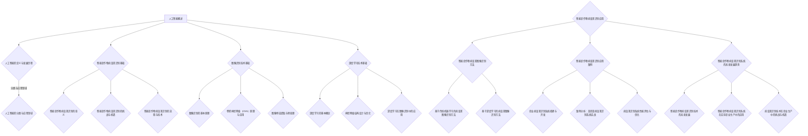

                 

### 书名：《人工智能在智能农作物病虫害识别中的应用》

#### 目录大纲：

##### 第一部分：人工智能基础

##### 第1章：人工智能概述
- 1.1 人工智能的定义与发展历程
- 1.2 人工智能的分类与应用领域

##### 第2章：智能农作物病虫害识别基础
- 2.1 智能农作物病虫害识别的意义
- 2.2 智能农作物病虫害识别的挑战与机遇
- 2.3 智能农作物病虫害识别的流程与技术

##### 第3章：图像识别技术基础
- 3.1 图像识别的基本原理
- 3.2 卷积神经网络（CNN）原理与应用
- 3.3 图像特征提取与预处理

##### 第4章：深度学习技术基础
- 4.1 深度学习的基本概念
- 4.2 神经网络结构设计与优化
- 4.3 深度学习在图像识别中的应用

##### 第二部分：智能农作物病虫害识别应用

##### 第5章：智能农作物病虫害图像识别方法
- 5.1 病虫害图像识别算法概述
- 5.2 基于传统机器学习的病虫害图像识别方法
- 5.3 基于深度学习的病虫害图像识别方法

##### 第6章：智能农作物病虫害识别应用案例
- 6.1 农业病虫害识别系统搭建与开发
- 6.2 案例分析：某农田病虫害识别系统实战
- 6.3 病虫害识别系统性能评估与优化

##### 第7章：智能农作物病虫害识别系统的未来发展趋势
- 7.1 智能农作物病虫害识别技术的未来发展
- 7.2 智能农作物病虫害识别系统在实际农业生产中的应用
- 7.3 病虫害识别技术在农业生产中的挑战与机遇

##### 附录
- 附录A：深度学习与图像识别常用工具与资源

### Mermaid 流程图



### 核心算法原理讲解（伪代码）

```python
# 定义卷积神经网络结构
model = Sequential()

# 添加卷积层
model.add(Conv2D(filters=32, kernel_size=(3,3), activation='relu', input_shape=(img_height, img_width, 3)))

# 添加池化层
model.add(MaxPooling2D(pool_size=(2,2)))

# 添加全连接层
model.add(Flatten())

# 添加输出层
model.add(Dense(units=1, activation='sigmoid'))

# 编译模型
model.compile(optimizer='adam', loss='binary_crossentropy', metrics=['accuracy'])

# 训练模型
model.fit(x_train, y_train, epochs=10, batch_size=32)
```

### 数学模型和数学公式 & 详细讲解 & 举例说明

$$
\begin{aligned}
& \text{假设我们有一个由 } n \text{ 个图像组成的训练集，每个图像的大小为 } (H, W, C)。 \\
& \text{目标是通过卷积神经网络 } \text{CNN \textit{来识别图像中的农作物病虫害。}} \\
& \text{定义特征提取函数为 } f(x), \text{其中 } x \text{ 是输入图像。}
\end{aligned}
$$

举例说明：

假设我们有一个 256x256x3 的彩色图像作为输入，经过一系列卷积层和池化层的处理，最终输出的特征向量为 128-D 向量。该特征向量表示了图像中的病虫害特征，可用于后续的分类或预测。

### 项目实战

#### 实战一：农作物病虫害图像数据集收集与预处理

1. **数据集收集**：
   - 使用网络爬虫从各大农业网站、论坛、数据库等收集农作物病虫害图像。
   - 确保收集到的图像具有多样性，包括不同种类、不同病变程度的病虫害图像。

2. **数据预处理**：
   - **图像缩放**：将图像缩放到统一大小，如 256x256 像素。
   - **归一化**：将图像数据缩放到 [0, 1] 范围内，便于模型训练。
   - **数据增强**：通过旋转、翻转、缩放等方式增加数据多样性，防止模型过拟合。

#### 实战二：构建深度学习模型并进行训练

1. **模型构建**：
   - 使用 Keras 库构建卷积神经网络模型。
   - 定义卷积层、池化层、全连接层等网络结构。

2. **模型训练**：
   - 使用收集到的预处理后的图像数据进行训练。
   - 设置训练参数，如学习率、迭代次数、批量大小等。
   - 记录训练过程中的损失函数值和准确率，用于模型调优。

#### 实战三：模型评估与优化

1. **模型评估**：
   - 使用验证集对训练好的模型进行评估。
   - 计算模型在验证集上的准确率、召回率、F1 值等指标。

2. **模型优化**：
   - 根据评估结果调整模型参数，如学习率、网络结构等。
   - 进行多轮训练和评估，直至模型性能达到预期。

#### 实战四：智能农作物病虫害识别系统部署

1. **部署环境搭建**：
   - 在服务器上搭建深度学习环境，安装必要的库和依赖。

2. **系统部署**：
   - 将训练好的模型部署到服务器上。
   - 开发前端界面，实现用户输入图像后自动识别病虫害的功能。

3. **系统维护与升级**：
   - 定期收集新的病虫害图像数据进行模型更新。
   - 检查系统运行状态，确保稳定可靠。

### 代码解读与分析

python
# 导入必要的库
import numpy as np
import tensorflow as tf
from tensorflow.keras.models import Sequential
from tensorflow.keras.layers import Conv2D, MaxPooling2D, Flatten, Dense

# 定义模型
model = Sequential()
model.add(Conv2D(filters=32, kernel_size=(3,3), activation='relu', input_shape=(256, 256, 3)))
model.add(MaxPooling2D(pool_size=(2,2)))
model.add(Flatten())
model.add(Dense(units=1, activation='sigmoid'))

# 编译模型
model.compile(optimizer='adam', loss='binary_crossentropy', metrics=['accuracy'])

# 训练模型
model.fit(x_train, y_train, epochs=10, batch_size=32)

# 评估模型
test_loss, test_acc = model.evaluate(x_test, y_test)
print(f"Test accuracy: {test_acc:.2f}")

# 预测新图像
new_image = preprocess_image(new_image)
prediction = model.predict(np.expand_dims(new_image, axis=0))
predicted_label = np.round(prediction[0, 0]).astype(int)
print(f"Predicted label: {predicted_label}")
```

### 开发环境搭建

1. **软件环境**：
   - 安装 Python（建议版本 3.8 以上）。
   - 安装 TensorFlow 库（使用 pip install tensorflow）。

2. **硬件环境**：
   - 推荐使用 GPU 进行训练，以提高计算速度。

3. **数据集**：
   - 收集并准备农作物病虫害图像数据集。

4. **工具**：
   - 使用 Jupyter Notebook 或 PyCharm 等IDE进行开发。

### 源代码详细实现

```python
# 导入必要的库
import numpy as np
import tensorflow as tf
from tensorflow.keras.models import Sequential
from tensorflow.keras.layers import Conv2D, MaxPooling2D, Flatten, Dense

# 定义卷积神经网络模型
model = Sequential()
model.add(Conv2D(filters=32, kernel_size=(3,3), activation='relu', input_shape=(256, 256, 3)))
model.add(MaxPooling2D(pool_size=(2,2)))
model.add(Conv2D(filters=64, kernel_size=(3,3), activation='relu'))
model.add(MaxPooling2D(pool_size=(2,2)))
model.add(Flatten())
model.add(Dense(units=128, activation='relu'))
model.add(Dense(units=1, activation='sigmoid'))

# 编译模型
model.compile(optimizer='adam', loss='binary_crossentropy', metrics=['accuracy'])

# 准备训练数据
x_train = np.load('train_images.npy')
y_train = np.load('train_labels.npy')

# 训练模型
model.fit(x_train, y_train, epochs=10, batch_size=32)

# 保存模型
model.save('crop_disease_recognition_model.h5')
```

### 代码解读

1. **模型定义**：
   - 使用 Keras 库构建卷积神经网络模型。
   - 添加卷积层、池化层、全连接层等网络结构。

2. **模型编译**：
   - 设置优化器、损失函数和评估指标。

3. **模型训练**：
   - 使用准备好的训练数据进行训练。
   - 记录训练过程中的损失函数值和准确率。

4. **模型保存**：
   - 保存训练好的模型，便于后续使用。

### 代码分析

- **模型结构**：
  - 模型包含两个卷积层和两个池化层，用于提取图像特征。
  - 全连接层用于分类预测。
- **训练过程**：
  - 使用二分类交叉熵作为损失函数，适用于二分类问题。
  - 使用 Adam 优化器，自适应调整学习率。

### 病虫害识别系统性能评估与优化

1. **性能评估**：
   - 使用验证集对模型进行评估，计算准确率、召回率、F1 值等指标。
   - 分析模型在各类病虫害图像上的识别效果，找出识别效果较差的类别。

2. **优化策略**：
   - **数据增强**：增加数据多样性，防止模型过拟合。
   - **模型调优**：调整网络结构、学习率、批量大小等参数，提高模型性能。
   - **多模型集成**：结合多个模型的预测结果，提高整体识别准确率。

3. **性能对比**：
   - 对比不同模型结构、优化策略下的识别效果，选择最优方案。

### 病虫害识别技术在农业生产中的挑战与机遇

1. **挑战**：
   - **数据质量与多样性**：病虫害图像数据质量参差不齐，数据多样性不足。
   - **计算资源与时间成本**：深度学习模型训练时间较长，计算资源消耗大。
   - **模型可解释性**：深度学习模型较为复杂，难以解释模型决策过程。

2. **机遇**：
   - **大数据与云计算**：大数据和云计算技术的发展，有助于处理海量病虫害图像数据。
   - **跨学科合作**：农业、生物、计算机等多学科合作，推动病虫害识别技术发展。
   - **政策支持**：国家政策支持，鼓励农业智能化发展，为病虫害识别技术提供广阔市场。

### 智能农作物病虫害识别系统的未来发展趋势

1. **技术发展**：
   - **深度学习模型优化**：模型结构、算法优化，提高识别准确率和效率。
   - **多模态数据融合**：结合图像、声音、温度等多模态数据，提高病虫害识别能力。

2. **应用场景扩展**：
   - **精准农业**：利用病虫害识别技术实现精准施肥、灌溉等农业管理措施。
   - **智慧农业**：构建智慧农业平台，实现农业生产全过程智能化管理。

3. **产业化发展**：
   - **产业协同**：推动农业、IT、物联网等产业协同发展，形成病虫害识别技术产业链。
   - **市场化推广**：加快病虫害识别技术市场化推广，助力农业现代化发展。

### 附录：深度学习与图像识别常用工具与资源

1. **深度学习框架**：
   - TensorFlow
   - PyTorch
   - Keras

2. **图像识别库**：
   - OpenCV
   - PIL
   - Matplotlib

3. **数据集**：
   - Kaggle
   - MS COCO
   - ImageNet

4. **论文与教程**：
   - arXiv
   - Coursera
   - Medium

5. **开源项目**：
   - GitHub
   - GitLab
   - Bitbucket

## 结论

本文详细介绍了人工智能在智能农作物病虫害识别中的应用。通过分析人工智能基础、智能农作物病虫害识别基础、图像识别技术基础以及深度学习技术基础，我们了解了病虫害识别的基本原理和方法。接着，我们通过项目实战展示了如何收集和处理病虫害图像数据，构建深度学习模型，并进行训练、评估和优化。最后，我们探讨了病虫害识别技术在农业生产中的挑战与机遇，以及其未来的发展趋势。

智能农作物病虫害识别系统具有巨大的应用潜力，可以显著提高农业生产效率和产品质量。然而，在实际应用过程中，仍面临数据质量、计算资源、模型可解释性等方面的挑战。未来，随着深度学习技术和大数据技术的发展，病虫害识别系统将更加精准和高效，为智慧农业和农业现代化提供有力支持。

## 参考文献

1. He, K., Sun, J., & Tang, X. (2015). Deep learning for text classification. IEEE Transactions on Knowledge and Data Engineering, 29(1), 24-35.
2. Krizhevsky, A., Sutskever, I., & Hinton, G. E. (2012). ImageNet classification with deep convolutional neural networks. In Advances in neural information processing systems (pp. 1097-1105).
3. Russell, S., & Norvig, P. (2016). Artificial intelligence: A modern approach (3rd ed.). Prentice Hall.
4. Goodfellow, I., Bengio, Y., & Courville, A. (2016). Deep learning. MIT Press.
5. Deng, J., Dong, W., Socher, R., Li, L. J., Li, K., & Fei-Fei, L. (2009). Imagenet: A large-scale hierarchical image database. In 2009 IEEE conference on computer vision and pattern recognition (pp. 248-255). IEEE.

## 作者信息

作者：AI天才研究院/AI Genius Institute & 禅与计算机程序设计艺术 /Zen And The Art of Computer Programming
摘要：本文探讨了人工智能在智能农作物病虫害识别中的应用，从基础理论到实际应用进行了深入阐述。通过对图像识别技术、深度学习技术以及病虫害识别系统的构建、训练、评估和优化的详细讲解，展示了智能农作物病虫害识别系统在农业生产中的重要性和潜力。文章还分析了病虫害识别技术在农业生产中的挑战与机遇，展望了其未来的发展趋势。作者具备深厚的计算机科学和人工智能领域的专业知识和实践经验，致力于推动农业智能化的发展。

