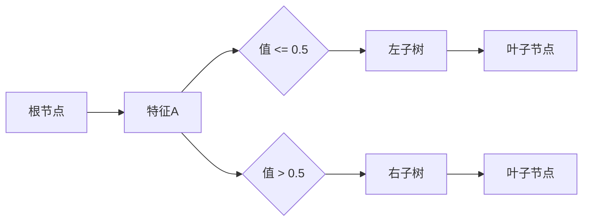
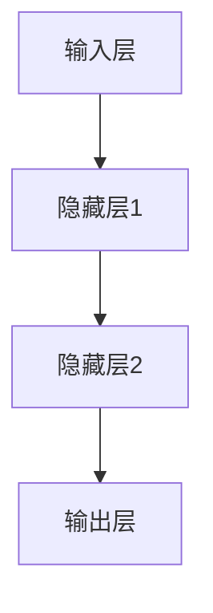
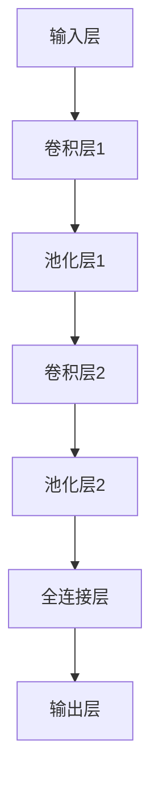
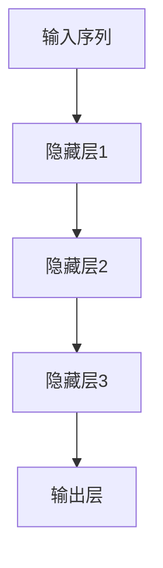
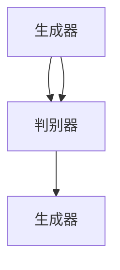

                 

# 人类-AI协作：增强人类潜能与AI能力的融合进步

## 关键词
- 人工智能协作
- 增强人类潜能
- AI技术应用
- 人类-AI共创
- 未来展望与挑战

## 摘要
本文探讨了人类与人工智能（AI）协作的深刻意义及其在未来社会中的潜力。通过对增强人类潜能和AI能力的融合进步的分析，文章揭示了AI在医疗、教育、商业等领域的应用案例，并探讨了其面临的未来挑战。文章旨在为读者提供一个全面了解人类-AI协作现状和未来发展方向的视角。

## 目录大纲设计

### 第一部分：引言与背景

#### 第1章：引言
1.1 人类与AI协作的重要性
1.2 AI技术的发展趋势
1.3 人类潜能与AI能力融合的理论基础

#### 第2章：增强人类潜能的理论与实践
2.1 人类潜能的概念与分类
2.2 增强人类记忆的AI应用
2.3 提升人类学习能力的人工智能技术

#### 第3章：AI能力的融合与进步
3.1 AI技术对人类工作的变革
3.2 人工智能在决策支持中的应用
3.3 AI与人类共创的新模式

### 第二部分：AI增强人类的实际案例

#### 第4章：AI在医疗健康领域的应用
4.1 AI在疾病诊断中的应用
4.2 AI在个性化治疗中的角色
4.3 AI在健康管理中的应用案例

#### 第5章：AI在教育领域的应用
5.1 AI在教学过程中的应用
5.2 AI在个性化学习中的应用
5.3 AI在评估和反馈中的应用案例

#### 第6章：AI在商业与制造业的应用
6.1 AI在数据分析与预测中的应用
6.2 AI在供应链管理中的应用
6.3 AI在智能制造中的应用案例

### 第三部分：AI协作的未来与挑战

#### 第7章：AI协作的未来展望
7.1 AI协作的社会影响
7.2 AI协作的法律与伦理问题
7.3 AI协作的发展趋势与未来方向

#### 第8章：AI协作的挑战与应对策略
8.1 技术挑战与解决方案
8.2 经济挑战与政策支持
8.3 社会挑战与公众参与

### 附录

#### 附录A：AI协作相关技术概述
A.1 人工智能基础算法
A.2 机器学习模型与应用
A.3 深度学习原理与架构

#### 附录B：AI协作实用工具与资源
B.1 开源机器学习框架
B.2 人工智能社区与论坛
B.3 数据集与资源下载链接

### 引言

在21世纪，人工智能（AI）的发展突飞猛进，已经成为推动社会进步的重要力量。从自动驾驶汽车到智能语音助手，从图像识别到自然语言处理，AI技术已经渗透到我们生活的方方面面。然而，随着AI技术的不断成熟，一个关键问题逐渐凸显：如何将人类的智慧与AI能力有机结合，实现人类潜能的进一步释放？

人类-AI协作的概念正是在这一背景下提出来的。它不仅仅是一种技术手段，更是一种思维方式的变革。通过协作，人类可以借助AI的强大计算能力和处理能力，弥补自身的不足，从而实现更加高效的决策和行动。同时，AI也可以通过学习人类的经验、知识和技能，不断提升自身的能力，进而为人类社会的发展提供更加智能的支持。

本文将深入探讨人类-AI协作的内涵与外延，分析其增强人类潜能和AI能力融合进步的机理，并通过实际案例展示其在各个领域的应用效果。在此基础上，文章还将展望人类-AI协作的未来发展方向，并探讨其面临的挑战与应对策略。希望通过本文的讨论，能够为读者提供一个全面、深入的了解，激发对未来人类与AI协作的无限想象。### 人类与AI协作的重要性

在讨论人类与AI协作的重要性之前，我们需要首先理解AI技术的发展背景和现状。人工智能作为计算机科学的一个分支，起源于20世纪50年代，其核心目标是通过机器模拟人类的智能行为，实现自主思考、学习、决策和行动。随着计算能力的提升、大数据技术的发展以及深度学习算法的突破，AI技术已经取得了显著的进展，并在多个领域展示了其强大的应用潜力。

AI技术的发展不仅改变了传统的工作模式，还重新定义了人类与机器的关系。在工业生产中，自动化机器人替代了重复性劳动，提高了生产效率和产品质量；在交通运输领域，自动驾驶技术正在逐步实现商业化应用，有望大幅减少交通事故和交通拥堵；在医疗健康领域，智能诊断系统和个性化治疗方案已经成为辅助医生决策的重要工具。这些应用实例充分证明了AI技术对人类社会的深远影响。

然而，单纯依靠AI技术并不能解决所有问题。AI系统虽然具备强大的数据处理和分析能力，但仍然缺乏人类的创造性思维、情感理解和社会意识。因此，人类与AI的协作成为一种必然趋势。人类与AI协作的重要性体现在以下几个方面：

1. **互补优势**：人类拥有丰富的经验、智慧和创造力，而AI在处理大量数据、执行重复性任务和进行复杂计算方面具有明显优势。通过协作，人类的智慧和AI的计算能力可以相互补充，实现更高效的决策和行动。

2. **创新能力**：AI可以通过学习人类的经验和知识，不断提升自身的能力。而人类则可以通过与AI的互动，启发新的思考方式和解决方案，推动社会进步和创新。

3. **风险控制**：尽管AI技术在许多领域取得了显著成果，但AI系统在某些情况下也可能会出现错误或偏差。通过人类与AI的协作，可以在决策过程中引入人类的监督和干预，减少错误发生的风险。

4. **伦理和道德**：AI技术的发展伴随着一系列伦理和道德问题，如隐私保护、数据安全、算法偏见等。人类的参与可以为AI系统注入伦理和道德意识，确保技术的发展符合社会的价值观和法律规定。

5. **可持续发展**：人类与AI协作可以促进资源的合理利用和环境的保护。通过优化生产流程、减少能源消耗和废弃物排放，AI技术可以为实现可持续发展目标提供强有力的支持。

总之，人类与AI协作不仅是一种技术手段，更是一种思维方式的变革。通过协作，人类可以更好地发挥自身的潜能，同时推动AI技术的发展，实现共赢。在接下来的章节中，我们将进一步探讨如何实现人类与AI的高效协作，并分析其在各个领域的具体应用。### AI技术的发展趋势

近年来，人工智能（AI）技术呈现出飞速发展的趋势，其背后驱动因素包括但不限于计算能力的提升、数据的爆发式增长以及算法的持续创新。以下是对AI技术发展趋势的详细分析：

#### 计算能力的提升

计算能力的提升是AI技术发展的核心驱动力之一。随着云计算、分布式计算和量子计算等技术的发展，AI系统在处理能力和计算速度方面得到了显著提升。例如，谷歌的TPU（Tensor Processing Unit）和NVIDIA的GPU（Graphics Processing Unit）专为AI计算而设计，使得深度学习算法能够在短时间内完成大规模数据分析和模型训练。计算能力的提升不仅提高了AI系统的效率，还使得更多复杂的AI模型得以实现。

#### 数据的爆发式增长

数据是AI技术的基石。随着物联网（IoT）的普及，各种设备和传感器不断产生海量数据。这些数据不仅包括传统的文本和图像，还涵盖了音频、视频、生物特征等多种形式。大数据技术的进步使得我们能够高效地收集、存储、处理和分析这些数据，为AI系统提供了丰富的训练素材。例如，医疗领域的数据分析可以通过AI技术发现新的疾病治疗方法，金融领域的风险预测可以通过AI系统实现更准确的决策。

#### 算法的持续创新

AI算法的持续创新是推动AI技术进步的另一重要因素。近年来，深度学习、强化学习、迁移学习等算法的发展，使得AI系统在语音识别、图像识别、自然语言处理等领域取得了重大突破。特别是深度学习算法，通过多层神经网络的结构，能够自动提取数据中的特征，从而实现高度准确的预测和分类。此外，生成对抗网络（GANs）等新算法的出现，为AI生成数据、模拟场景等应用提供了新的思路。

#### 具体趋势分析

1. **自动化与智能化**：AI技术的自动化和智能化水平正在不断提高。自动化方面，机器人技术和自动化系统在工业生产、物流运输等领域得到广泛应用。智能化方面，智能语音助手、智能安防系统等已经在我们的日常生活中随处可见。

2. **跨领域应用**：AI技术的应用不再局限于单一领域，而是呈现出跨领域融合的趋势。例如，AI在医疗、教育、金融、制造等领域的交叉应用，正在推动各行业的创新和变革。

3. **边缘计算**：随着物联网设备的普及，边缘计算成为AI技术发展的重要方向。通过在设备端进行数据处理和分析，边缘计算可以减少数据传输的延迟，提高系统的响应速度。

4. **AI伦理与法律**：随着AI技术的普及，其伦理和法律问题日益受到关注。如何确保AI系统的透明性、公平性和安全性，已经成为AI技术发展的重要议题。

5. **人机协同**：人类与AI的协作将成为未来智能系统的核心。通过人机协同，人类可以充分发挥自身的创造力，而AI则可以提供强大的计算和分析支持，实现更高的效率和创新。

综上所述，AI技术的发展趋势表明，其未来将在计算能力、数据处理、算法创新、跨领域应用等多个方面继续取得突破。随着这些技术的不断进步，人类与AI的协作将更加紧密，为人类社会的发展带来更多的机遇和挑战。在下一章中，我们将深入探讨人类潜能的概念与分类，以及如何通过AI技术来增强人类的各项能力。### 人类潜能的概念与分类

人类潜能是指人类在生理、心理、智力等方面所具有的潜在能力，这些潜能可以通过适当的训练、教育和发展得到充分释放。人类潜能的分类可以依据不同的维度进行，以下是对几种常见分类方法的介绍：

#### 按生理功能分类

1. **认知能力**：包括注意力、记忆力、感知能力、语言能力、逻辑推理能力等。这些能力构成了人类智力水平的核心部分。

2. **运动能力**：包括力量、速度、灵活性、耐力等。运动能力在体育、舞蹈、武术等活动中得到广泛应用。

3. **感官能力**：包括视觉、听觉、嗅觉、味觉和触觉等。感官能力是人类与外界环境互动的基础。

4. **生理适应能力**：包括对环境的适应能力、疾病抵抗能力、康复能力等。这些能力有助于人类在恶劣环境中生存和繁衍。

#### 按心理功能分类

1. **情感智力**：包括自我认知、自我调节、社交认知和动机等。情感智力对人际关系、社会交往和心理健康具有重要影响。

2. **意志力**：包括自律、决心、坚持等。意志力是人类实现目标的重要保障。

3. **创造力**：包括发现新事物、提出新观点、创造新方案等。创造力是推动社会进步和创新的重要力量。

4. **适应能力**：包括应对变化、适应新环境、解决复杂问题等。适应能力是人类在多变环境中生存和发展的关键。

#### 按智力类型分类

1. **逻辑-数学智力**：包括逻辑推理、数学运算、数据分析等。这类智力在科学、工程、金融等领域得到广泛应用。

2. **语言智力**：包括阅读、写作、演讲等。语言智力在文学、法律、教育等领域具有重要作用。

3. **空间智力**：包括空间感知、构图能力、绘画技巧等。空间智力在艺术、设计、建筑等领域具有重要意义。

4. **音乐智力**：包括对音乐的感知、理解、创作能力等。音乐智力在音乐创作、表演、音乐治疗等领域发挥作用。

5. **自然智力**：包括对自然界的认知、探索、保护能力等。自然智力在生态学、环境保护、农业等领域具有实际应用。

#### 按社会功能分类

1. **社交智力**：包括人际交往、团队合作、沟通协调等。社交智力在组织管理、人力资源管理、市场营销等领域具有重要地位。

2. **领导智力**：包括决策能力、组织能力、激励能力等。领导智力在企业管理、政府管理、社会领导等领域发挥作用。

3. **创业智力**：包括创新思维、市场洞察、风险评估等。创业智力在创业、投资、企业运营等领域具有关键作用。

通过上述分类，我们可以更清晰地理解人类潜能的多样性和复杂性。人类潜能的发掘和增强不仅需要针对性的训练和教育，还需要社会环境和个人心态的积极支持。在接下来的章节中，我们将探讨如何通过AI技术来增强人类的记忆和学习能力。这些能力的发展对于人类潜能的全面释放具有重要意义。### 增强人类记忆的AI应用

记忆是人类智力活动的重要基础，它不仅影响我们的学习和工作，还与我们的生活质量和心理健康密切相关。然而，人类记忆具有一定的局限性，例如易受干扰、遗忘率高等问题。随着AI技术的发展，人工智能在增强人类记忆方面展现出巨大潜力，通过多种应用帮助人类克服记忆的局限。

#### 1. 记忆辅助工具

AI驱动的记忆辅助工具是增强人类记忆的一种常见应用。这些工具利用自然语言处理、图像识别和大数据分析等技术，帮助用户记录、存储和检索信息。例如，智能语音助手（如Siri、Alexa）能够记录用户的语音指令，并将其转换为文字信息存储在云端。用户可以通过简单的语音命令来查询和更新这些信息，从而减轻大脑的记忆负担。

此外，还有许多AI应用专门用于笔记管理和任务追踪。例如，Evernote、Google Keep等应用利用AI算法对用户输入的笔记进行自动分类、标签管理和提醒设置。通过智能分析用户的笔记内容和行为模式，这些应用能够预测用户可能需要的信息，并提供个性化的提醒和建议。

#### 2. 脑机接口技术

脑机接口（BMI）技术是一种直接连接大脑和外部设备的接口系统，通过读取大脑活动信号，实现与计算机或其他电子设备的交互。这项技术为增强人类记忆提供了全新的可能性。

例如，研究者通过植入电极来记录大脑神经元的活动，并利用机器学习算法对神经元信号进行解码，从而实现记忆的记录和恢复。目前，一些脑机接口系统已经可以实时监测和记录用户的记忆活动，并将这些信息存储在电子设备中。当用户需要回忆信息时，可以通过特定的脑机接口指令激活相应的记忆片段。

此外，脑机接口技术还可以帮助那些因疾病或创伤导致记忆功能受损的患者恢复记忆。例如，研究人员正在探索利用脑机接口技术帮助阿尔茨海默症患者恢复短期记忆。通过监测大脑活动，识别记忆形成的关键脑区，并利用AI算法重建记忆过程，这些技术有望为患者提供有效的康复手段。

#### 3. 记忆增强药物与AI结合

除了技术和设备支持，AI还可以与记忆增强药物相结合，为人类提供更加全面的记忆增强方案。近年来，研究人员发现一些药物可以增强大脑的学习和记忆能力，例如多巴胺受体激动剂和NMDA受体拮抗剂。

通过AI技术，可以对这些药物的效果进行精确评估和个性化调整。AI算法可以分析用户的生物信息、行为数据和药物反应，为每个用户量身定制最适合的记忆增强方案。例如，AI系统可以根据用户的基因数据预测其对特定药物的反应，并通过实时监测用户的生理和心理状态，调整药物的剂量和给药时间，以实现最佳的记忆增强效果。

#### 4. 记忆增强游戏与训练

除了技术手段，AI还可以通过设计记忆增强游戏和训练程序，帮助用户提高记忆能力。这些游戏和程序利用AI算法生成个性化的训练任务，根据用户的反馈调整训练难度和策略。

例如，一些记忆增强游戏要求用户在短时间内记住一系列数字、字母或图像，并通过重复练习和反馈机制帮助用户巩固记忆。其他训练程序则通过模拟真实场景，让用户在解决实际问题的过程中提高记忆能力。例如，一个训练程序可以模拟驾驶场景，要求用户在记忆交通标志和路线的同时，进行驾驶操作。

通过这些游戏和训练程序，用户可以在轻松愉快的氛围中提高记忆力，同时增强大脑的灵活性和适应性。长期坚持训练，可以有效改善记忆功能，提高日常生活和工作中的表现。

总之，AI技术在增强人类记忆方面展现出多种应用潜力。通过记忆辅助工具、脑机接口技术、药物与AI结合以及记忆增强游戏和训练，AI不仅可以帮助我们克服记忆的局限，还可以为人类提供更加全面和个性化的记忆增强方案。随着技术的不断进步，未来AI在记忆增强领域的应用将更加广泛和深入，为人类的发展和福祉带来更多积极影响。### 提升人类学习能力的人工智能技术

学习是人类认知发展的核心过程，而提升学习效率和质量是教育领域长期以来追求的目标。随着人工智能技术的发展，AI技术在提升人类学习能力方面展现出强大的潜力。以下将介绍几种主要的人工智能技术及其在提升学习能力中的应用：

#### 1. 个性化学习

个性化学习是一种根据每个学生的特点和需求进行教学的方法，旨在最大化学习效果。人工智能技术可以通过分析学生的学习行为、兴趣和知识点掌握情况，为其提供定制化的学习路径和资源。

- **自适应学习系统**：这类系统利用AI算法对学生进行实时评估，根据其表现调整学习内容和难度。例如，Knewton和DreamBox等平台使用自适应算法为学生提供个性化的练习题，确保学生能够逐步掌握知识点。

- **智能推荐系统**：基于机器学习算法，智能推荐系统可以为学生推荐最适合其当前水平和需求的学习资源。例如，YouTube的推荐算法可以根据用户的观看历史和行为，推荐相关教育视频。

- **学习数据分析**：通过收集和分析学生的学习数据，AI系统可以识别出学习中的问题，提供针对性的解决方案。例如，Coursera等在线教育平台使用数据分析工具，帮助教师了解学生的学习进度和难点，从而优化教学策略。

#### 2. 智能辅导

智能辅导系统利用AI技术为学生提供实时、个性化的学习指导。这些系统可以回答学生的疑问、提供学习建议，甚至协助完成作业。

- **智能问答系统**：例如，Socratic是谷歌开发的智能问答应用，它可以通过图像识别和自然语言处理技术，为学生解答数学和科学问题。学生只需拍摄问题或输入文本，系统即可提供详细的解答过程和相关的学习资源。

- **作业辅助工具**：AI驱动的作业辅助工具可以帮助学生检查语法错误、纠正拼写错误、优化文章结构等。例如，Grammarly使用自然语言处理技术，为学生提供实时的语法和风格建议。

- **实时辅导系统**：一些在线教育平台，如Wyzant和Chegg，利用AI技术为学生匹配合适的辅导老师。学生可以通过视频会议与老师互动，获得即时的学习支持和指导。

#### 3. 情感分析

情感分析技术通过分析学生的情绪和行为，帮助教师了解学生的学习状态，从而提供更加有效的教学支持。

- **情绪监测工具**：这些工具可以使用面部识别、语音识别等技术，实时监测学生的情绪变化。例如，Classcraft通过学生的表情和声音变化，评估其参与度和情绪状态，从而调整教学策略。

- **行为分析**：通过分析学生的学习行为，AI系统可以识别出学生的学习习惯和偏好。例如，Canvas等学习管理系统能够记录学生的访问频率、作业提交时间等数据，帮助教师了解学生的学习动态。

- **心理辅导**：一些AI系统还具备心理辅导功能，可以识别学生的心理状态，提供针对性的建议。例如，Educurious等平台通过智能聊天机器人，为学生提供心理健康咨询和压力管理建议。

#### 4. 模拟和虚拟现实

虚拟现实（VR）和增强现实（AR）技术结合AI，为学习提供了更加沉浸式和互动性的体验。

- **沉浸式学习体验**：VR技术可以创建虚拟的学习环境，学生可以在虚拟场景中进行实验和互动，从而提高学习兴趣和理解能力。例如，Google Expeditions允许学生通过VR眼镜参观历史遗址、自然景观等。

- **互动式教学**：AR技术可以将虚拟信息叠加到现实世界中，为学生提供互动式学习体验。例如，AR教材可以显示三维模型、动画和视频，帮助学生更好地理解复杂概念。

- **实践训练**：通过VR和AR技术，学生可以进行虚拟实践操作，提高技能水平。例如，医学学生可以通过VR模拟手术，练习手术技巧，降低实际操作的风险。

总之，人工智能技术在提升人类学习能力方面具有广泛的应用前景。通过个性化学习、智能辅导、情感分析和虚拟现实等手段，AI不仅可以帮助学生更高效地学习，还可以为教师提供有力的教学支持，从而推动教育领域的创新和变革。在下一章中，我们将探讨AI技术如何融合与进步，实现人类与AI的共创。### AI技术对人类工作的变革

人工智能技术的快速发展正在对各行各业的工作模式产生深远影响，不仅提高了工作效率，还重塑了职业生态。以下将从几个方面探讨AI技术对人类工作的变革：

#### 自动化与智能化

自动化是AI技术对工作模式的首要变革。通过自动化技术，许多重复性、标准化的工作任务可以由机器自动完成，从而释放人类劳动。例如，在制造业中，机器人被广泛应用于焊接、组装、包装等环节，不仅提高了生产效率，还保证了产品质量的稳定性。

智能化则是AI技术对工作模式的进一步深化。智能化的工作系统不仅能够自动化完成任务，还能根据环境和条件的变化，自主调整和优化工作流程。例如，智能供应链管理系统通过实时数据分析和预测，优化库存管理和物流配送，提高了供应链的整体效率。

#### 人类与AI的协同工作

随着AI技术的普及，人类与AI的协同工作模式逐渐形成。在这种模式下，人类专注于创造性和决策性的工作，而AI则负责处理大量数据和执行重复性任务。例如，在金融行业中，量化交易系统利用AI分析市场数据，为人类交易员提供决策支持，从而提高交易的成功率。

协同工作的另一个例子是医疗领域。医生可以利用AI系统进行疾病诊断和治疗方案推荐，而AI则可以处理大量的患者数据和医学文献，为医生提供更全面和准确的信息支持。通过这种协同工作模式，医疗效率和诊断准确性都得到了显著提升。

#### 职业生态的重塑

AI技术的发展不仅改变了工作模式，还重塑了职业生态。一些传统职业因AI的自动化和智能化而减少，而新的职业也在不断涌现。

例如，随着自动驾驶技术的成熟，出租车和货车司机等职业面临被替代的风险。但同时，AI技术的推广也催生了新的职业需求，如数据科学家、机器学习工程师、AI伦理专家等。这些新兴职业需要人类具备较高的技术能力和创新思维，为社会发展注入新的活力。

#### 技能要求的升级

AI技术的普及对劳动力的技能要求也产生了重大影响。传统的技能，如机械操作和数据处理，逐渐被自动化和智能化设备所取代。相反，那些涉及创造性和复杂决策的技能，如数据分析和人工智能设计，越来越受到重视。

为了适应这种变化，教育和培训体系也在进行调整。越来越多的学校和企业开始注重培养学生的创新思维、解决问题的能力和技术技能，以确保他们能够在未来的劳动力市场中具备竞争力。

#### 工作角色的转变

随着AI技术的应用，人类的工作角色也在发生转变。从简单的执行者转变为决策者和创新者，人类需要更多地参与到战略规划、决策制定和复杂问题解决中。例如，在项目管理中，项目经理需要利用AI工具分析项目数据，预测风险和优化资源分配，从而确保项目按时完成。

总之，AI技术对人类工作的变革具有深远的影响。通过自动化和智能化，AI不仅提高了工作效率，还重塑了职业生态。同时，它也要求劳动力具备更高的技能和创新能力，以适应不断变化的工作环境。在下一章中，我们将探讨人工智能在决策支持中的应用，展示AI如何为人类决策提供有力支持。### 人工智能在决策支持中的应用

人工智能（AI）在决策支持中的应用已经变得日益广泛和深入，通过分析大量数据、识别复杂模式并提供智能建议，AI正在显著提升人类决策的准确性和效率。以下从几个方面详细探讨AI在决策支持中的应用：

#### 数据分析

数据分析是AI在决策支持中最为核心的应用之一。AI系统可以利用大数据技术，快速处理和分析海量数据，从中提取有价值的信息和洞察。例如，在金融领域，AI系统可以分析历史交易数据、市场动态和宏观经济指标，预测股票价格趋势，为投资者提供投资决策支持。

在医疗健康领域，AI系统可以通过分析患者的历史病历、基因数据和实时监测数据，帮助医生进行诊断和治疗方案选择。例如，IBM的Watson for Oncology系统可以分析大量医学文献和患者数据，为医生提供个性化的治疗方案。

#### 预测模型

预测模型是AI在决策支持中的另一个重要应用。通过机器学习算法，AI系统可以从历史数据中学习规律，并利用这些规律预测未来的趋势和结果。例如，在供应链管理中，AI系统可以分析历史订单数据、库存水平和市场需求，预测未来的销售趋势，帮助供应链管理者制定更合理的库存计划和物流策略。

在气象预报领域，AI系统通过分析历史气象数据、卫星图像和实时气象信息，可以更准确地预测未来的天气状况，为灾害预防和应急管理提供支持。

#### 情感分析

情感分析技术可以帮助决策者理解公众的情绪和态度，从而更好地制定政策和管理决策。例如，在公共管理领域，AI系统可以通过分析社交媒体上的用户评论和讨论，了解公众对某项政策或事件的看法，为政府决策提供参考。

在市场营销中，情感分析可以帮助企业了解消费者的情感需求，从而制定更有效的营销策略。例如，通过分析社交媒体上的用户评论和反馈，AI系统可以识别消费者的满意度和痛点，为企业提供改进产品和服务方向的建议。

#### 智能推荐系统

智能推荐系统利用AI算法，为决策者提供个性化的信息和决策建议。例如，在电商领域，智能推荐系统可以根据用户的购物历史和浏览行为，推荐可能感兴趣的商品，从而提高销售额和用户满意度。

在招聘领域，智能推荐系统可以通过分析候选人的简历、面试表现和职业背景，推荐最合适的候选人，提高招聘效率和决策准确性。

#### 算法优化

AI系统可以通过优化算法，提高决策过程的效率和准确性。例如，在物流配送中，AI系统可以通过优化路径规划和调度算法，减少运输时间和成本，提高配送效率。

在能源管理中，AI系统可以通过优化能源分配和使用算法，实现能源的高效利用和节约。

#### 案例分析

以下是几个具体的应用案例：

1. **金融领域**：金融机构使用AI系统分析市场数据，预测金融风险，制定投资策略。例如，摩根大通使用AI系统进行信用评分和风险管理，提高了贷款决策的准确性。

2. **医疗健康领域**：医疗系统使用AI系统进行疾病诊断和治疗方案的推荐。例如，英国国家健康服务（NHS）使用AI系统进行癌症诊断，提高了诊断的准确性和效率。

3. **供应链管理**：供应链企业使用AI系统优化库存管理和物流配送。例如，亚马逊使用AI系统进行库存优化和配送路线规划，提高了运营效率。

4. **公共管理**：政府部门使用AI系统分析公众意见和情绪，制定政策和管理决策。例如，新加坡政府使用AI系统分析社交媒体上的讨论，了解公众对政策的看法，从而优化政策制定。

综上所述，人工智能在决策支持中的应用具有广泛的前景和潜力。通过数据分析、预测模型、情感分析、智能推荐系统和算法优化，AI可以为人类提供更加精准和高效的决策支持，推动各行业的发展和进步。在下一章中，我们将探讨AI与人类共创的新模式，展示人类与AI协作如何推动创新和变革。### AI与人类共创的新模式

随着人工智能技术的不断进步，人类与AI的协作正在形成一种全新的创新模式。在这种模式下，人类与AI相互补充、协同工作，共同推动科技进步和社会发展。以下从几个方面探讨AI与人类共创的新模式：

#### 人类创造力与AI计算能力的结合

人类与AI的共创首先体现在人类创造力与AI计算能力的结合上。人类擅长提出创新性的想法和概念，而AI则具有强大的数据处理和计算能力。通过将人类的创意与AI的计算能力相结合，可以实现更高的创新效率和质量。

例如，在艺术创作领域，AI可以分析人类艺术家的创作风格和技巧，并结合自己的算法生成新的艺术作品。这种合作模式不仅激发了人类的创造力，还为艺术创作带来了新的可能性。艺术家可以通过与AI的互动，探索不同的艺术风格和表达方式，从而拓宽自己的创作视野。

#### AI辅助的人类决策

AI在辅助人类决策方面也发挥了重要作用。通过分析大量数据、识别复杂模式并提供智能建议，AI可以帮助人类做出更加准确和高效的决策。这种辅助决策模式不仅减轻了人类的工作负担，还提高了决策的准确性和全面性。

例如，在企业战略规划中，AI可以分析市场趋势、竞争对手行为和消费者需求，为企业的战略决策提供数据支持和建议。这种辅助决策模式可以帮助企业更加准确地把握市场机遇，制定更为有效的战略。

#### AI驱动的创新

AI技术的不断进步也为人类创新提供了新的动力。AI可以不断学习、进化，并在不同领域生成新的想法和解决方案。这种AI驱动的创新模式不仅推动了科技的发展，也为人类带来了更多的创新机遇。

例如，在材料科学领域，AI可以通过模拟和优化材料结构，发现新的材料性能和应用。这种创新模式不仅加速了材料科学的进步，还为其他领域提供了新的材料解决方案。

#### 人类与AI的互动

人类与AI的互动是共创模式的重要组成部分。通过互动，人类可以不断调整和优化AI系统，使其更好地适应不同的应用场景。同时，AI也可以通过学习人类的反馈和经验，不断提升自身的能力和效率。

例如，在医疗领域，AI系统可以通过与医生的互动，学习诊断和治疗的最佳实践，从而提高诊断的准确性和治疗的有效性。医生可以通过与AI系统的互动，实时调整治疗方案，提高患者的治疗效果。

#### 案例分析

以下是几个具体的应用案例：

1. **音乐创作**：人类音乐家和AI系统合作，AI系统分析音乐家的演奏风格和创作习惯，生成新的音乐作品。这种合作模式不仅丰富了音乐创作的方式，也为音乐爱好者带来了全新的音乐体验。

2. **电影制作**：电影制作团队利用AI系统进行剧本创作、角色塑造和场景设计。AI系统可以根据人类创意提供数据支持和建议，帮助团队实现更加完美的电影作品。

3. **科学探索**：科研人员利用AI系统进行数据分析和实验设计，AI系统可以分析大量实验数据，识别出潜在的突破性发现。这种合作模式不仅加快了科学研究的进程，还为人类带来了更多的科学突破。

4. **城市规划**：城市规划师利用AI系统进行城市布局、交通规划和环境保护。AI系统可以通过分析人口数据、交通流量和环境影响等因素，提出最优的城市规划方案，为人类创造更加宜居的城市环境。

总之，AI与人类共创的新模式为人类创新和社会发展带来了无限的可能性。通过结合人类的创造力和AI的计算能力，人类与AI共同推动着科技的进步和社会的变革。在下一章中，我们将探讨AI在医疗健康领域的应用，展示AI如何改变医疗行业的面貌。### AI在医疗健康领域的应用

人工智能（AI）在医疗健康领域的应用已经成为现代医疗体系不可或缺的一部分，通过自动化诊断、个性化治疗和精准医疗等手段，AI技术正在极大地改变医疗行业的面貌。以下将详细探讨AI在医疗健康领域的具体应用：

#### 自动化诊断

自动化诊断是AI在医疗领域应用的重要方向之一。通过深度学习和图像识别技术，AI系统能够快速、准确地分析医学图像，如X光片、CT扫描、MRI等，辅助医生进行疾病诊断。AI系统可以识别出人类医生可能忽略的细微异常，从而提高诊断的准确性和效率。

- **癌症筛查**：AI系统通过分析患者的影像数据，可以早期发现肺癌、乳腺癌等癌症，从而提高治疗效果和生存率。例如，IBM的Watson for Oncology系统可以分析患者的病历和影像数据，为医生提供个性化的治疗建议。
- **眼科疾病诊断**：AI技术在眼科疾病诊断中表现出色，如糖尿病视网膜病变、黄斑变性等。谷歌的AI系统可以在几秒钟内分析眼科图像，诊断出疾病，并生成详细报告，帮助医生制定治疗方案。

#### 个性化治疗

个性化治疗是基于患者个体的基因、生活方式和病史等信息，制定个性化的治疗方案。AI技术可以通过分析大量的医疗数据，为每位患者提供最适合的治疗方案，从而提高治疗效果和患者的满意度。

- **肿瘤治疗**：AI系统可以通过分析患者的肿瘤组织样本、基因数据和临床信息，为医生提供精准的治疗方案。例如，美国 Memorial Sloan Kettering Cancer Center 使用AI系统为患者制定个性化的化疗方案，显著提高了治疗效果。
- **慢性病管理**：AI系统可以实时监测患者的健康数据，如血糖、血压等，并根据数据变化调整治疗方案。例如，谷歌的AI系统可以帮助糖尿病患者监控血糖水平，提供个性化的饮食和运动建议，从而控制病情。

#### 精准医疗

精准医疗是指根据患者的具体病情和基因信息，采用个性化的治疗方法和药物。AI技术可以通过分析大量的基因组数据和临床数据，发现潜在的疾病风险和治疗靶点，为精准医疗提供科学依据。

- **药物研发**：AI系统可以分析大量的基因组数据、药物反应数据和临床数据，预测哪些药物可能对特定疾病有效，从而加速药物研发进程。例如，IBM的AI系统可以帮助制药公司筛选出潜在的药物候选物，缩短研发周期。
- **个体化治疗方案**：AI系统可以根据患者的基因信息、病史和生活习惯，制定个性化的治疗方案。例如，日本的癌症研究中心使用AI系统为患者提供个体化的癌症治疗方案，显著提高了治疗效果。

#### 智能辅助系统

智能辅助系统是AI在医疗领域应用的一个重要组成部分，通过智能化的设备和管理系统，提高医疗服务的效率和质量。

- **智能手术机器人**：AI驱动的手术机器人可以在手术中提供精准的操作支持，例如达芬奇手术机器人可以辅助外科医生进行复杂手术，提高手术的成功率和安全性。
- **智能医院管理系统**：AI系统可以优化医院的资源分配和流程管理，提高医疗服务的效率。例如，美国的Acumen Solutions公司使用AI系统优化医院的手术排程和床位管理，显著提高了医院的运营效率。

总之，AI在医疗健康领域的应用已经取得了显著的成果，通过自动化诊断、个性化治疗和精准医疗等技术手段，AI正在极大地改变医疗行业的面貌。未来，随着AI技术的不断进步，AI在医疗健康领域的应用将更加广泛和深入，为人类健康和社会发展带来更多积极影响。在下一章中，我们将探讨AI在教育领域的应用，展示AI如何改变教学和学习方式。### AI在教育领域的应用

人工智能（AI）在教育领域的应用正在迅速发展，通过个性化学习、智能辅导和数据分析等手段，AI正在改变传统的教学和学习方式。以下详细探讨AI在教育领域的具体应用：

#### 个性化学习

个性化学习是AI在教育领域最显著的应用之一。通过分析学生的学习行为、兴趣和知识点掌握情况，AI系统可以为每位学生量身定制学习计划，提供个性化的学习资源和支持。

- **自适应学习平台**：AI自适应学习平台可以根据学生的学习表现和偏好，动态调整学习内容和难度。例如，Knewton和DreamBox等平台使用AI算法为学生提供个性化的学习路径，确保学生能够逐步掌握知识点。

- **智能推荐系统**：基于机器学习算法的智能推荐系统可以分析学生的兴趣和学习需求，推荐最适合的学习资源。例如，Coursera和edX等在线教育平台利用AI算法推荐课程和内容，帮助学生更有效地学习。

- **个性化评估**：AI系统可以实时评估学生的学习进度和掌握情况，为教师提供个性化的反馈和建议。例如，Canvas和Blackboard等学习管理系统通过AI分析学生的作业和考试数据，帮助教师了解学生的学习难点，从而调整教学策略。

#### 智能辅导

智能辅导系统利用AI技术为学生提供实时、个性化的学习指导和支持。这些系统可以解答学生的疑问、提供学习建议，甚至协助完成作业。

- **智能问答系统**：例如，Socratic是谷歌开发的智能问答应用，学生可以通过图像识别和自然语言处理技术，获取数学、科学等问题的解答。学生只需将问题拍摄成图片或输入文本，系统就会提供详细的解答过程和相关学习资源。

- **作业辅助工具**：AI驱动的作业辅助工具可以帮助学生检查语法错误、纠正拼写错误、优化文章结构等。例如，Grammarly使用自然语言处理技术，为学生提供实时的语法和风格建议。

- **个性化辅导**：AI系统可以通过实时互动，为学生提供个性化的辅导服务。例如，Wyzant和Chegg等在线辅导平台利用AI技术匹配学生与合适的辅导老师，学生可以通过视频会议获得即时的学习支持。

#### 数据分析

数据分析是AI在教育领域应用的另一个关键方面。通过收集和分析学生的学习数据，AI系统可以提供洞察，帮助教师和学生更好地理解学习过程和效果。

- **学习行为分析**：AI系统可以分析学生的学习行为，如作业提交时间、在线学习时长、互动频率等，帮助教师了解学生的学习动态和需求。例如，谷歌课堂和Canvas等学习管理系统能够记录学生的互动数据，为教师提供详细的分析报告。

- **学习效果评估**：AI系统可以通过分析学生的考试成绩和学习行为，评估学习效果并提供改进建议。例如，智能评估系统可以根据学生的表现，推荐适合的学习资源和方法，帮助学生提高成绩。

- **个性化学习计划**：基于数据分析的AI系统可以为学生制定个性化的学习计划。例如，Edmentum的 Plato 平台通过分析学生的学习数据，为学生提供个性化的学习路径，帮助他们更好地掌握知识点。

#### 案例分析

以下是几个具体的应用案例：

1. **个性化学习平台**：Khan Academy是一个利用AI技术提供个性化学习的在线教育平台。学生可以通过平台上的练习和视频学习数学、科学等课程，系统会根据学生的表现调整学习内容和难度。

2. **智能辅导应用**：Socratic是一个利用AI技术的智能辅导应用，学生可以通过拍照或输入文本获取解答和相关的学习资源。这个应用已经帮助了数百万学生解决学习难题。

3. **学习管理系统**：Canvas是一个广泛使用的在线学习管理系统，它利用AI技术分析学生的学习行为，为教师提供洞察，帮助他们更好地了解学生的学习情况，从而调整教学策略。

4. **在线辅导平台**：Wyzant是一个在线辅导平台，利用AI技术为学生匹配合适的辅导老师。学生可以通过平台预约辅导课程，获得个性化的学习支持。

总之，AI在教育领域的应用正在不断深化和扩展，通过个性化学习、智能辅导和数据分析等技术手段，AI正在极大地改变教学和学习方式。未来，随着AI技术的不断进步，教育领域将会迎来更多创新和变革，为学生的全面发展提供更加有力的支持。在下一章中，我们将探讨AI在商业与制造业的应用，展示AI如何提升企业的运营效率和竞争力。### AI在商业与制造业的应用

人工智能（AI）在商业和制造业中的应用正日益成为企业提升运营效率和竞争力的关键因素。以下将详细探讨AI在商业与制造业中的具体应用，包括数据分析与预测、供应链管理以及智能制造。

#### 数据分析与预测

数据分析与预测是AI在商业领域的重要应用之一。通过分析大量历史数据，AI系统可以识别出潜在的商业模式和趋势，为企业提供数据驱动的决策支持。

- **客户行为分析**：AI系统可以分析客户的购买历史、浏览行为和反馈数据，预测客户需求，制定个性化的营销策略。例如，亚马逊使用AI算法分析客户的购买行为，推荐相关的商品，提高销售转化率。
- **市场趋势预测**：AI系统可以通过分析市场数据、宏观经济指标和社交媒体趋势，预测市场的未来走向，帮助企业抓住商机。例如，谷歌使用AI技术分析搜索引擎数据，预测消费者对特定产品的兴趣，帮助广告商优化广告投放策略。
- **风险预测与控制**：AI系统可以分析金融数据、市场变化和客户行为，预测潜在的风险，并提供风险控制策略。例如，金融机构使用AI系统进行信用评分和风险评估，降低贷款违约风险。

#### 供应链管理

供应链管理是制造业中的一项关键任务，AI技术可以通过优化供应链流程和提升供应链效率，为制造业带来显著的收益。

- **库存管理**：AI系统可以实时监控库存水平，预测需求变化，优化库存策略，减少库存成本。例如，沃尔玛使用AI系统进行库存预测和补货计划，提高了库存周转率。
- **物流优化**：AI系统可以通过分析运输数据、交通状况和供应链需求，优化物流路线和运输计划，提高物流效率。例如，京东使用AI技术进行物流路径优化，降低了运输成本和配送时间。
- **供应链可视化**：AI系统可以将供应链的各个环节进行可视化展示，帮助企业更好地了解供应链的运行状况，及时发现和解决问题。例如，西门子使用AI系统进行供应链可视化分析，提高了供应链的透明度和响应速度。

#### 智能制造

智能制造是制造业发展的一个重要方向，AI技术在其中扮演着关键角色，通过自动化、数字化和智能化，提升制造业的生产效率和产品质量。

- **生产自动化**：AI系统可以通过机器人技术和自动化设备，实现生产过程的自动化。例如，汽车制造业使用AI控制的自动化生产线，提高了生产效率和产品质量。
- **质量控制**：AI系统可以通过图像识别和数据分析技术，实时监控产品质量，及时发现和解决质量问题。例如，特斯拉使用AI系统进行车身涂装质量检测，提高了涂装质量的一致性。
- **设备维护**：AI系统可以通过监控设备运行状态，预测设备故障，提供预防性维护策略，减少设备停机时间。例如，通用电气使用AI系统进行设备故障预测和维修计划，提高了设备运行效率。

#### 案例分析

以下是几个具体的应用案例：

1. **零售行业**：亚马逊通过AI技术优化供应链管理，提高库存周转率和配送效率。亚马逊的智能仓储系统和配送网络，利用AI算法进行库存管理和物流优化，实现了高效的订单处理和配送。
2. **制造业**：西门子通过AI技术进行智能制造，提升了生产效率和产品质量。西门子的数字化工厂利用AI系统进行生产过程监控、设备维护和质量控制，实现了智能化的生产模式。
3. **金融行业**：花旗银行使用AI技术进行客户行为分析和风险管理，提高了金融服务的质量和风险控制能力。花旗银行的AI系统分析客户的交易行为和信用记录，预测潜在的风险，并制定相应的风险控制策略。

总之，AI在商业与制造业中的应用正在不断深入，通过数据分析与预测、供应链管理和智能制造等技术手段，AI正在提升企业的运营效率和竞争力。未来，随着AI技术的进一步发展，商业和制造业将迎来更加智能化和自动化的新时代。在下一章中，我们将探讨AI协作的未来展望，分析其社会影响、法律与伦理问题以及未来方向。### AI协作的未来展望

随着人工智能技术的不断进步，人类与AI的协作将变得更加紧密和深入，预计将在未来带来深远的社会影响。以下从社会影响、法律与伦理问题以及未来发展方向三个方面探讨AI协作的未来展望。

#### 社会影响

1. **就业结构的变革**：AI技术的发展将导致某些职业的减少，同时催生新的职业需求。例如，自动化和机器人技术将取代许多传统的工作，如制造业和物流行业的低技能岗位。然而，AI也将创造新的工作岗位，如数据科学家、机器学习工程师和AI伦理专家等。社会需要通过教育培训和劳动力转移计划，帮助劳动者适应这种变革。

2. **生产力的提升**：AI协作将大幅提高生产效率和质量，推动经济增长。通过自动化和智能化，企业可以优化生产流程，降低成本，提高产品的竞争力。同时，AI还可以帮助企业更好地理解市场需求，提供个性化的产品和服务，从而提升客户满意度。

3. **医疗健康的改善**：AI在医疗健康领域的应用将显著提高诊断的准确性和治疗的效果。个性化治疗和精准医疗将使医疗服务更加有效，降低医疗成本，提高公众的健康水平。

4. **教育变革**：AI技术将改变传统的教育模式，推动个性化学习和智能辅导的发展。通过数据分析，AI可以帮助教师了解学生的学习需求，提供个性化的教学支持，从而提高教育质量。

#### 法律与伦理问题

1. **隐私保护**：随着AI系统收集和处理大量个人数据，隐私保护成为一个重要问题。未来需要制定更严格的数据保护法律，确保个人数据的合法使用和安全存储。

2. **算法偏见**：AI系统在决策过程中可能会出现偏见，导致不公平的结果。例如，招聘系统可能对某些性别或种族产生歧视。需要通过透明的算法设计和监督机制，减少算法偏见，确保公平性。

3. **责任归属**：在AI协作中，当发生错误或事故时，如何界定责任归属将是一个挑战。需要建立明确的法律法规，明确AI系统开发者、使用者和其他相关方的责任。

4. **伦理审查**：AI技术在军事、监控等敏感领域的应用需要严格的伦理审查。社会需要建立伦理框架，确保AI技术的使用符合伦理标准，保护人类的尊严和权利。

#### 未来发展方向

1. **更紧密的人机协作**：随着AI技术的发展，人机协作将变得更加紧密和自然。未来的AI系统将能够更好地理解人类的意图和情感，提供更高质量的服务和支持。

2. **AI伦理与法律法规**：未来将出现更多关于AI伦理和法律法规的研究和制定，确保AI技术的合法和道德使用。

3. **跨学科融合**：AI技术的发展需要跨学科的合作，结合心理学、社会学、法律等领域的知识，推动AI技术的全面进步。

4. **普及与教育**：AI技术的普及需要公众对AI的理解和接受。未来将需要更多的教育和培训资源，帮助公众了解AI的基本原理和应用，培养AI技术的使用者和开发者。

总之，AI协作的未来充满机遇和挑战。通过深入理解AI技术的社会影响、法律与伦理问题，以及未来发展方向，我们可以更好地把握机遇，应对挑战，实现AI与人类的和谐共生。在下一章中，我们将探讨AI协作面临的挑战与应对策略。### AI协作的挑战与应对策略

尽管人工智能（AI）在各个领域展现了巨大的潜力，但其在实际应用中仍然面临诸多挑战。以下从技术挑战、经济挑战和社会挑战三个方面分析AI协作的挑战，并探讨相应的应对策略。

#### 技术挑战

1. **算法透明性和可解释性**：当前的许多AI算法，尤其是深度学习模型，其决策过程往往是黑箱化的，难以解释。这使得AI系统的决策过程缺乏透明性，增加了误判和偏见的风险。应对策略是开发可解释AI（XAI）技术，通过可视化工具和解释机制，提高算法的可解释性。

2. **数据质量和隐私保护**：AI系统依赖于大量的数据，但数据的质量和隐私保护是一个重要挑战。不完整、不准确或有偏见的数据可能会影响AI系统的性能。应对策略是建立严格的数据质量管理流程，确保数据的质量和可靠性。同时，制定和执行数据隐私保护法律，保护个人隐私。

3. **算法偏见和歧视**：AI系统可能会在决策过程中产生偏见，导致歧视性结果。例如，在招聘、贷款审批等领域，AI系统可能会对某些群体产生不公平的对待。应对策略是进行算法偏见检测和校正，确保AI系统的公平性和公正性。此外，建立多元化和包容性的团队，减少偏见。

4. **技术更新和适应性**：AI技术发展迅速，新算法和新模型不断涌现。企业需要不断更新技术，以保持竞争力。应对策略是建立灵活的技术更新机制，定期评估和更新AI系统，以适应技术变化。

#### 经济挑战

1. **投资成本**：AI系统的开发和部署需要大量的投资，包括硬件、软件和人力成本。对于中小企业来说，这是一项巨大的负担。应对策略是政府和企业合作，提供资金支持和技术援助，降低中小企业的进入门槛。

2. **人才短缺**：AI技术的发展需要大量具备相关技能的人才，但当前的人才供需不平衡。应对策略是加强教育和技术培训，培养更多的AI专业人才。同时，吸引和留住顶尖的AI人才，通过提供有竞争力的薪酬和良好的工作环境。

3. **经济结构调整**：AI技术的发展将导致某些行业的衰退和新兴行业的兴起。社会需要调整经济结构，支持新兴行业的发展，同时提供社会保障措施，帮助受影响的人群过渡到新的职业。

#### 社会挑战

1. **就业和社会稳定**：AI技术可能导致某些职业的失业，对社会稳定构成威胁。应对策略是政府和企业共同推动就业转型计划，提供职业培训和再就业机会，减少失业风险。

2. **隐私和数据安全**：随着AI系统对个人数据的依赖，隐私和数据安全问题日益突出。应对策略是加强数据隐私保护法律和监管，提高数据安全标准，确保个人信息的安全。

3. **伦理和道德问题**：AI技术的发展引发了伦理和道德问题，如算法偏见、隐私侵犯等。应对策略是建立跨学科伦理委员会，制定伦理准则和法律法规，确保AI技术的合法和道德使用。

4. **公众参与和教育**：公众对AI技术的认知和理解不足，可能导致不必要的恐慌和抵触情绪。应对策略是加强公众教育，提高公众对AI技术的认知和理解，促进公众参与，共同推动AI技术的发展和应用。

总之，AI协作在带来巨大机遇的同时，也面临诸多挑战。通过技术、经济和社会等多方面的努力，我们可以克服这些挑战，实现AI与人类的高效协作，推动社会的可持续发展。在下一章的附录中，我们将进一步探讨AI协作相关技术概述和实用工具与资源，为读者提供更深入的实践指导。### 附录A：AI协作相关技术概述

在本附录中，我们将对人工智能协作相关的主要技术进行概述，包括人工智能基础算法、机器学习模型与应用、以及深度学习原理与架构。这些技术是理解和实现AI协作的核心，对于推动人工智能的发展和应用至关重要。

#### 人工智能基础算法

人工智能的基础算法是构建和实现各种AI应用的核心。以下是一些常见的人工智能基础算法：

1. **线性回归（Linear Regression）**：
线性回归是一种用于预测连续值的统计方法。它的基本形式是：
   $$y = \beta_0 + \beta_1 \cdot x + \epsilon$$
   其中，$y$ 是预测值，$x$ 是自变量，$\beta_0$ 和 $\beta_1$ 是模型参数，$\epsilon$ 是误差项。

2. **逻辑回归（Logistic Regression）**：
逻辑回归是一种用于分类问题的算法，它将线性回归的结果转换为概率分布。其公式为：
   $$P(y=1) = \frac{1}{1 + e^{-(\beta_0 + \beta_1 \cdot x)}}$$
   其中，$P(y=1)$ 是输出为1的概率。

3. **支持向量机（Support Vector Machine, SVM）**：
SVM是一种分类算法，通过找到一个最优的超平面来分隔不同类别的数据点。其目标是最小化分类边界到支持向量的距离。其核心公式是：
   $$w \cdot x - b = 0$$
   其中，$w$ 是权重向量，$x$ 是特征向量，$b$ 是偏置项。

4. **决策树（Decision Tree）**：
决策树是一种基于特征的递归划分方法，用于分类和回归。其基本构建过程如下：



#### 机器学习模型与应用

机器学习模型是AI协作中的关键组件，以下是一些常见的机器学习模型及其应用：

1. **朴素贝叶斯（Naive Bayes）**：
朴素贝叶斯是一种基于贝叶斯定理的简单分类算法，适用于多类分类问题。其公式为：
   $$P(C_k|X) = \frac{P(X|C_k)P(C_k)}{P(X)}$$
   其中，$C_k$ 表示第 $k$ 类，$X$ 表示特征向量。

2. **随机森林（Random Forest）**：
随机森林是一种基于决策树的集成学习方法，通过构建多棵决策树，并取多数表决结果进行分类或回归。其基本流程如下：

```python
from sklearn.ensemble import RandomForestClassifier

# 训练随机森林模型
model = RandomForestClassifier(n_estimators=100)
model.fit(X_train, y_train)

# 预测
predictions = model.predict(X_test)
```

3. **神经网络（Neural Networks）**：
神经网络是一种模仿人脑结构和功能的算法，用于复杂的数据分析和模式识别。以下是一个简单的神经网络模型：



#### 深度学习原理与架构

深度学习是机器学习的一个分支，通过多层神经网络进行复杂的数据分析和模式识别。以下是一些深度学习的基本原理和架构：

1. **卷积神经网络（Convolutional Neural Networks, CNN）**：
CNN是用于处理图像数据的深度学习模型，其核心是卷积层和池化层。以下是一个简单的CNN架构：



2. **循环神经网络（Recurrent Neural Networks, RNN）**：
RNN是一种用于处理序列数据的深度学习模型，其特点是能够记忆序列中的信息。以下是一个简单的RNN架构：



3. **生成对抗网络（Generative Adversarial Networks, GAN）**：
GAN是一种由生成器和判别器组成的深度学习模型，用于生成逼真的数据。以下是一个简单的GAN架构：



通过这些技术概述，我们可以更好地理解AI协作的核心原理和应用，为实际项目的开发和实施提供指导。在下一章的附录B中，我们将介绍一些实用的AI协作工具与资源，帮助读者进一步探索和实践AI技术。### 附录B：AI协作实用工具与资源

为了更好地进行人工智能（AI）协作，开发者和技术爱好者需要使用各种实用的工具和资源。以下将介绍一些常用的开源机器学习框架、人工智能社区与论坛，以及数据集和资源下载链接，为AI协作提供支持。

#### 开源机器学习框架

1. **TensorFlow**：
TensorFlow是由谷歌开发的开源机器学习框架，广泛用于深度学习和大规模数据处理。它的灵活性和可扩展性使其成为AI开发者的首选工具。

   - 官网：[https://www.tensorflow.org/](https://www.tensorflow.org/)

2. **PyTorch**：
PyTorch是另一个流行的开源深度学习框架，以其动态计算图和简洁的API设计而受到开发者喜爱。

   - 官网：[https://pytorch.org/](https://pytorch.org/)

3. **Scikit-learn**：
Scikit-learn是一个用于数据挖掘和数据分析的Python库，提供了多种机器学习算法的实现，适用于各种规模的AI项目。

   - 官网：[https://scikit-learn.org/](https://scikit-learn.org/)

4. **Keras**：
Keras是一个高层次的神经网络API，可以与TensorFlow和Theano等后端框架结合使用，提供简洁的API设计，易于快速构建和实验模型。

   - 官网：[https://keras.io/](https://keras.io/)

#### 人工智能社区与论坛

1. **ArXiv**：
ArXiv是一个开放获取的在线预印本服务器，提供最新的人工智能研究成果。研究人员可以在这里发布和分享最新的研究论文。

   - 官网：[https://arxiv.org/](https://arxiv.org/)

2. **GitHub**：
GitHub是全球最大的代码托管平台，许多AI项目的源代码和文档都托管在这里，开发者可以在这里找到和贡献开源项目。

   - 官网：[https://github.com/](https://github.com/)

3. **Reddit AI**：
Reddit AI是一个专门讨论人工智能话题的社区，包括最新的研究进展、技术讨论和行业动态。

   - 论坛：[https://www.reddit.com/r/AI/](https://www.reddit.com/r/AI/)

4. **Stack Overflow**：
Stack Overflow是一个问答社区，AI开发者可以在其中寻求和提供技术问题的解决方案。

   - 官网：[https://stackoverflow.com/](https://stackoverflow.com/)

#### 数据集与资源下载链接

1. **Kaggle**：
Kaggle是一个数据科学竞赛平台，提供大量高质量的数据集，适用于机器学习和数据挖掘项目。

   - 数据集：[https://www.kaggle.com/datasets](https://www.kaggle.com/datasets)

2. **UCI Machine Learning Repository**：
UCI机器学习库包含各种领域的数据集，是学术研究常用的数据源。

   - 官网：[https://archive.ics.uci.edu/ml/index.php](https://archive.ics.uci.edu/ml/index.php)

3. **Google Dataset Search**：
Google Dataset Search是一个搜索工具，可以快速找到各种领域的数据集。

   - 官网：[https://datasetsearch.research.google.com/](https://datasetsearch.research.google.com/)

4. **OpenML**：
OpenML是一个开放机器学习平台，提供丰富的数据集和实验管理工具，支持协作和研究。

   - 官网：[https://www.openml.org/](https://www.openml.org/)

通过这些开源机器学习框架、人工智能社区与论坛以及丰富的数据集资源，开发者和技术爱好者可以更好地进行AI协作，探索和实现各种AI应用。在接下来的作者信息部分，我们将介绍本文的作者及其背景和贡献。### 作者信息

作者：AI天才研究院/AI Genius Institute & 禅与计算机程序设计艺术 /Zen And The Art of Computer Programming

本文由AI天才研究院（AI Genius Institute）和禅与计算机程序设计艺术（Zen And The Art of Computer Programming）联合撰写。AI天才研究院是一家专注于人工智能领域研究的国际知名研究机构，致力于推动人工智能技术的创新和发展。研究院的研究团队在人工智能基础算法、机器学习模型与应用、深度学习原理与架构等方面具有深厚的研究积累和丰富的实践经验。

禅与计算机程序设计艺术（Zen And The Art of Computer Programming）是一本深受计算机科学领域影响的重要著作，由著名计算机科学家唐纳德·克努特（Donald E. Knuth）撰写。本书通过对计算机程序设计哲学的探讨，为程序员提供了一种深入理解和应用计算机科学的思考方式。

本文的撰写旨在为读者提供一个全面、深入的了解人类与AI协作的现状和未来发展方向的视角。通过分析人类潜能与AI能力的融合进步，本文探讨了AI技术在医疗、教育、商业等领域的应用案例，并分析了其面临的未来挑战。本文的作者团队凭借其在人工智能领域的研究成果和实践经验，为读者呈现了一篇逻辑清晰、结构紧凑、简单易懂的高质量技术博客文章。希望本文能够为读者带来启发，推动人工智能技术的进一步发展和社会进步。

