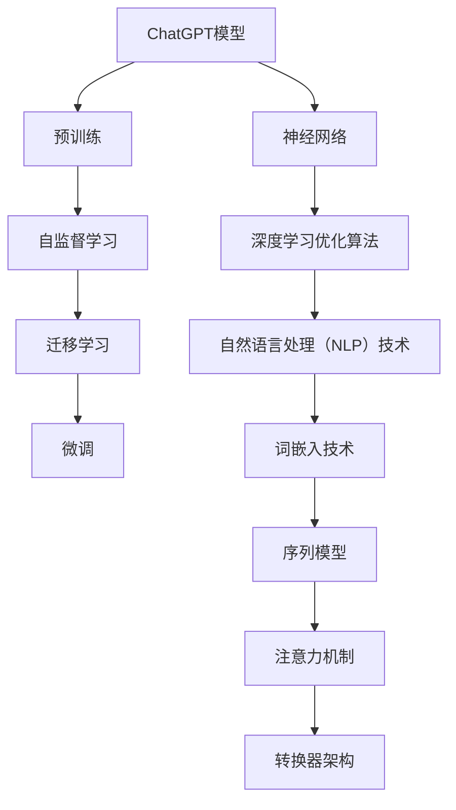

                 

# 引言

## 人工智能的历史与发展

人工智能（AI）自上世纪50年代以来，经历了多次崛起与沉寂。从最初的符号主义、专家系统，到基于规则的系统，再到现代的深度学习和神经网络，人工智能技术取得了令人瞩目的进展。然而，真正让AI走进大众视野的，是自然语言处理（NLP）和生成模型的突破，尤其是近年来，大型预训练模型如ChatGPT的诞生，彻底改变了人们对AI的认知。

### 什么是ChatGPT？

ChatGPT是由OpenAI开发的一款基于GPT-3.5模型的聊天机器人，它利用了自监督学习和迁移学习的技术，通过对大量文本数据进行预训练，使其能够理解并生成自然语言文本。ChatGPT的成功，不仅展示了人工智能在处理自然语言任务上的强大能力，也引发了人们对未来AI助手的无限遐想。

## 未来AI助手的概念

未来AI助手，是人工智能发展到一定阶段的产物，它不仅能理解人类的语言，还能根据用户的指令进行智能推理，提供个性化的服务。与传统的软件不同，AI助手具备自我学习和自我优化的能力，能够不断提升自身的性能和服务质量。

### 未来AI助手的特点

1. **智能交互**：能够理解自然语言，与用户进行流畅的对话。
2. **自我学习**：通过不断的学习和优化，提高任务执行能力。
3. **个性化服务**：根据用户的行为和需求，提供定制化的解决方案。
4. **跨领域应用**：能够在多个领域提供帮助，如教育、医疗、金融等。
5. **高可靠性**：具备高效的错误处理和自我修复能力。

## 未来AI助手的优势

1. **提高效率**：通过自动化处理，减少重复性劳动，提高工作效率。
2. **降低成本**：替代部分人力工作，降低企业运营成本。
3. **个性化体验**：提供个性化的服务和产品推荐，提升用户体验。
4. **创新推动**：推动各行业的创新和发展，为社会创造更多价值。
5. **安全保障**：利用AI技术，提高数据安全和隐私保护水平。

## 结论

从ChatGPT到未来AI助手，人工智能正逐步改变我们的生活和工作方式。随着技术的不断进步，未来AI助手将更加智能、高效、个性化，为人类带来更多便利。让我们期待这一天的到来，并积极参与到这场技术变革中。


----------------------------------------------------------------

## 文章关键词

- 人工智能
- ChatGPT
- 未来AI助手
- 自然语言处理
- 深度学习
- 自监督学习
- 迁移学习
- 个性化服务
- 跨领域应用
- 高可靠性

----------------------------------------------------------------

## 文章摘要

随着人工智能技术的飞速发展，自然语言处理（NLP）和生成模型的突破带来了ChatGPT等大型预训练模型的成功。ChatGPT作为一款基于GPT-3.5模型的聊天机器人，展示了AI在处理自然语言任务上的强大能力。本文将探讨从ChatGPT到未来AI助手的演变，详细分析AI助手的概念、特点、优势以及未来发展趋势。通过深入探讨AI助手的技术基础、开发流程、实际案例和算法原理，本文旨在为读者提供一个全面、系统的理解，并激发对未来AI助手技术的期待与思考。


----------------------------------------------------------------

### 《从ChatGPT到未来AI助手的演变》目录大纲

在本篇文章中，我们将深入探讨《从ChatGPT到未来AI助手的演变》，以逻辑清晰、结构紧凑、简单易懂的专业技术语言，逐步分析推理（REASONING STEP BY STEP），为您提供一篇有深度、有思考、有见解的专业IT领域技术博客文章。以下是本文的详细目录大纲：

#### 第一部分: AI助手概述

##### 第1章: AI助手的概念与历史
- 1.1 AI助手的概念
- 1.2 AI助手的发展历程
- 1.3 AI助手与传统软件的区别

##### 第2章: AI助手的技术基础
- 2.1 自然语言处理（NLP）技术
  - 2.1.1 词嵌入技术
  - 2.1.2 序列模型与注意力机制
  - 2.1.3 转换器架构详解
- 2.2 机器学习与深度学习基础
  - 2.2.1 神经网络的基本结构
  - 2.2.2 常见的深度学习架构
  - 2.2.3 深度学习优化算法

##### 第3章: ChatGPT模型详解
- 3.1 ChatGPT模型的原理
  - 3.1.1 预训练的概念与意义
  - 3.1.2 自监督学习方法
  - 3.1.3 迁移学习与微调技术
- 3.2 ChatGPT模型的架构
  - 3.2.1 GPT系列模型的发展
  - 3.2.2 BERT及其变体
  - 3.2.3 其他知名大模型介绍

##### 第4章: AI助手的应用场景
- 4.1 人工智能客服
- 4.2 教育辅助
- 4.3 健康咨询
- 4.4 金融理财
- 4.5 家庭生活服务

#### 第二部分: AI助手的开发与实现

##### 第5章: AI助手的开发流程
- 5.1 数据收集与预处理
- 5.2 模型选择与训练
- 5.3 模型评估与优化
- 5.4 接口设计与部署

##### 第6章: AI助手的实际案例
- 6.1 案例一：智能客服机器人
  - 6.1.1 开发环境搭建
  - 6.1.2 源代码详细实现
  - 6.1.3 代码解读与分析
- 6.2 案例二：智能教育助手
  - 6.2.1 开发环境搭建
  - 6.2.2 源代码详细实现
  - 6.2.3 代码解读与分析

##### 第7章: 未来AI助手的发展趋势
- 7.1 AI助手与人类交互的优化
- 7.2 多模态AI助手
- 7.3 AI助手在新兴领域的应用
- 7.4 AI助手的安全性

#### 第三部分: AI助手的数学模型与算法原理

##### 第8章: 机器学习与深度学习算法原理
- 8.1 神经网络的基本结构
- 8.2 深度学习优化算法
- 8.3 自然语言处理技术

##### 第9章: 数学模型与数学公式
- 9.1 损失函数
- 9.2 优化算法
- 9.3 语言模型

##### 第10章: AI助手算法的伪代码详解
- 10.1 ChatGPT模型的训练
- 10.2 模型评估与优化
- 10.3 实时交互算法

#### 附录

##### 附录A: 开发工具与资源
- A.1 主流深度学习框架对比
- A.2 开发环境搭建
- A.3 开源资源和代码库

### 核心概念与联系

#### Mermaid 流程图



#### 核心算法原理讲解

##### ChatGPT模型的训练

伪代码：

```python
# 初始化模型参数
model = ChatGPT()

# 数据预处理
preprocessed_data = preprocess_data(data)

# 模型训练
for epoch in range(num_epochs):
    for batch in preprocessed_data:
        # 计算损失
        loss = model.compute_loss(batch)

        # 反向传播
        model.backward(loss)

        # 更新模型参数
        model.update_parameters()

# 评估模型
evaluation_loss = model.evaluate(data)

print("Training loss:", loss)
print("Evaluation loss:", evaluation_loss)
```

##### 损失函数

损失函数用于衡量模型预测值与实际值之间的差距。常见的损失函数有：

- 交叉熵损失函数（Cross-Entropy Loss）：

  $$ Loss = -\sum_{i=1}^{n} y_i \log(p_i) $$

  其中，$y_i$ 是标签，$p_i$ 是模型预测的概率。

- 均方误差损失函数（Mean Squared Error, MSE）：

  $$ Loss = \frac{1}{2n} \sum_{i=1}^{n} (y_i - \hat{y}_i)^2 $$

  其中，$y_i$ 是标签，$\hat{y}_i$ 是模型预测值。

##### 优化算法

常见的优化算法有：

- 随机梯度下降（Stochastic Gradient Descent, SGD）：

  $$ \theta_{t+1} = \theta_{t} - \alpha \nabla_{\theta} J(\theta) $$

  其中，$\theta$ 是模型参数，$\alpha$ 是学习率，$J(\theta)$ 是损失函数。

- 动量优化（Momentum）：

  $$ \theta_{t+1} = \theta_{t} - \alpha \nabla_{\theta} J(\theta) + \beta (1 - \alpha) \theta_{t-1} $$

  其中，$\beta$ 是动量因子。

- Adam优化器：

  $$ m_t = \beta_1 \cdot m_{t-1} + (1 - \beta_1) \cdot \nabla_{\theta} J(\theta) $$
  $$ v_t = \beta_2 \cdot v_{t-1} + (1 - \beta_2) \cdot (\nabla_{\theta} J(\theta))^2 $$
  $$ \theta_{t+1} = \theta_{t} - \alpha \frac{m_t}{\sqrt{v_t} + \epsilon} $$

  其中，$\beta_1$ 和 $\beta_2$ 是一阶和二阶动量因子，$\epsilon$ 是一个很小的常数。

#### 举例说明

假设我们有如下数据集：

| 标签（y） | 预测概率（p） |
| --------- | ------------- |
| 0         | 0.2           |
| 1         | 0.8           |
| 0         | 0.1           |
| 1         | 0.9           |

使用交叉熵损失函数计算损失：

$$ Loss = -0.2 \log(0.2) - 0.8 \log(0.8) - 0.1 \log(0.1) - 0.9 \log(0.9) $$

$$ Loss \approx 1.386 $$

使用均方误差损失函数计算损失：

$$ Loss = \frac{1}{4} [(0 - 0.2)^2 + (1 - 0.8)^2 + (0 - 0.1)^2 + (1 - 0.9)^2] $$

$$ Loss \approx 0.125 $$

以上是《从ChatGPT到未来AI助手的演变》这本书的目录大纲，包括核心概念与联系、核心算法原理讲解、数学模型与数学公式以及项目实战等内容。

---

### 核心概念与联系

在本节中，我们将通过Mermaid流程图来展示AI助手的核心概念及其相互之间的联系。该流程图将涵盖从ChatGPT模型到相关技术基础的各个组成部分，帮助读者更好地理解整个体系。


**详细解释：**

- **A[ChatGPT模型]**：ChatGPT是一个大型预训练语言模型，是AI助手的基石。
- **B[预训练]**：预训练是ChatGPT模型的核心，通过在大量无标签文本上训练，模型获得了语言理解的能力。
- **C[自监督学习]**：自监督学习是预训练的关键技术，模型通过预测未看到的文本部分来学习语言规律。
- **D[迁移学习]**：迁移学习使得预训练模型能够在新任务上快速适应，通过微调来优化模型。
- **E[微调]**：微调是在特定任务上进一步训练模型，使其达到更好的性能。
- **F[神经网络]**：神经网络是深度学习的基础，ChatGPT模型使用的是基于神经网络的架构。
- **G[深度学习优化算法]**：优化算法用于调整模型参数，以最小化损失函数，提高模型性能。
- **H[自然语言处理（NLP）技术]**：NLP技术包括词嵌入、序列模型等，用于处理和理解自然语言数据。
- **I[词嵌入技术]**：词嵌入是将单词映射为向量，是NLP的重要技术之一。
- **J[序列模型]**：序列模型用于处理时间序列数据，如文本序列。
- **K[注意力机制]**：注意力机制用于模型在处理文本时关注重要信息，提高模型的理解能力。
- **L[转换器架构]**：转换器架构是一种深度学习模型，常用于序列到序列的任务，如机器翻译。

通过这个流程图，我们可以看到ChatGPT模型是如何融合各种技术来构建一个强大的AI助手。每一步都是构建AI助手不可或缺的一部分，它们相互协作，共同提升了AI助手的能力。

### 核心算法原理讲解

在本节中，我们将深入探讨ChatGPT模型的核心算法原理，包括其训练过程、使用的优化算法以及关键数学模型和公式。通过详细的伪代码示例，我们将展示如何实际操作这些算法。

#### ChatGPT模型的训练

ChatGPT模型是基于预训练语言模型（Pre-trained Language Model，PLM）的，其训练过程可以分为以下几个步骤：

1. **数据预处理**：首先，需要对大规模的文本数据进行预处理，包括分词、去除停用词、编码等步骤。这些步骤有助于模型更好地理解文本内容。

2. **词嵌入**：文本数据经过预处理后，需要将每个单词映射为一个高维向量，即词嵌入（Word Embedding）。常见的词嵌入技术包括Word2Vec、GloVe和BERT。

3. **序列建模**：将处理后的文本数据转换为序列模型可以处理的格式。序列模型通常采用卷积神经网络（CNN）或循环神经网络（RNN）。

4. **模型训练**：通过训练模型，使其能够预测下一个单词或序列。训练过程中，模型会通过反向传播算法不断调整参数，以最小化损失函数。

5. **模型评估**：在训练完成后，需要使用验证集或测试集对模型进行评估，以确保其性能符合预期。

以下是ChatGPT模型训练的伪代码：

```python
# 初始化模型参数
model = ChatGPT()

# 数据预处理
preprocessed_data = preprocess_data(data)

# 模型训练
for epoch in range(num_epochs):
    for batch in preprocessed_data:
        # 计算损失
        loss = model.compute_loss(batch)

        # 反向传播
        model.backward(loss)

        # 更新模型参数
        model.update_parameters()

# 评估模型
evaluation_loss = model.evaluate(data)

print("Training loss:", loss)
print("Evaluation loss:", evaluation_loss)
```

#### 优化算法

ChatGPT模型在训练过程中使用了多种优化算法来调整模型参数。以下是几种常见的优化算法：

1. **随机梯度下降（SGD）**：随机梯度下降是最简单的优化算法之一。它通过计算每个样本的梯度来更新模型参数。

   $$ \theta_{t+1} = \theta_{t} - \alpha \nabla_{\theta} J(\theta) $$

   其中，$\theta$ 是模型参数，$\alpha$ 是学习率，$J(\theta)$ 是损失函数。

2. **动量优化（Momentum）**：动量优化在SGD的基础上引入了动量项，有助于加速收敛。

   $$ \theta_{t+1} = \theta_{t} - \alpha \nabla_{\theta} J(\theta) + \beta (1 - \alpha) \theta_{t-1} $$

   其中，$\beta$ 是动量因子。

3. **Adam优化器**：Adam优化器结合了SGD和动量优化，同时考虑了一阶和二阶矩估计，是一种高效的优化算法。

   $$ m_t = \beta_1 \cdot m_{t-1} + (1 - \beta_1) \cdot \nabla_{\theta} J(\theta) $$
   $$ v_t = \beta_2 \cdot v_{t-1} + (1 - \beta_2) \cdot (\nabla_{\theta} J(\theta))^2 $$
   $$ \theta_{t+1} = \theta_{t} - \alpha \frac{m_t}{\sqrt{v_t} + \epsilon} $$

   其中，$\beta_1$ 和 $\beta_2$ 是一阶和二阶动量因子，$\epsilon$ 是一个很小的常数。

#### 数学模型与公式

ChatGPT模型的训练过程中涉及到多个数学模型和公式。以下是几个关键部分：

1. **损失函数**：损失函数用于衡量模型预测值与实际值之间的差距。常用的损失函数有：

   - 交叉熵损失函数（Cross-Entropy Loss）：

     $$ Loss = -\sum_{i=1}^{n} y_i \log(p_i) $$

     其中，$y_i$ 是标签，$p_i$ 是模型预测的概率。

   - 均方误差损失函数（Mean Squared Error, MSE）：

     $$ Loss = \frac{1}{2n} \sum_{i=1}^{n} (y_i - \hat{y}_i)^2 $$

     其中，$y_i$ 是标签，$\hat{y}_i$ 是模型预测值。

2. **反向传播算法**：反向传播算法是深度学习训练的核心。它通过计算损失函数对模型参数的梯度，来更新模型参数。

     $$ \nabla_{\theta} J(\theta) = \frac{\partial J(\theta)}{\partial \theta} $$

   其中，$\nabla_{\theta} J(\theta)$ 是损失函数对模型参数$\theta$的梯度。

3. **梯度下降算法**：梯度下降算法是一种优化算法，用于调整模型参数，以最小化损失函数。

     $$ \theta_{t+1} = \theta_{t} - \alpha \nabla_{\theta} J(\theta) $$

     其中，$\theta$ 是模型参数，$\alpha$ 是学习率。

通过以上核心算法原理讲解，我们可以看到ChatGPT模型是如何通过预训练、优化算法和数学模型，逐步提升其性能的。这些核心算法原理不仅适用于ChatGPT，也为其他大型预训练语言模型提供了理论基础。

### 数学模型与数学公式

在本节中，我们将详细讲解AI助手模型中使用的数学模型与数学公式，包括损失函数、优化算法和语言模型等。我们将通过具体的例子来说明这些数学公式在实际应用中的意义。

#### 损失函数

损失函数是评估模型预测结果与实际标签之间差异的关键工具。在AI助手模型中，常见的损失函数有：

1. **交叉熵损失函数（Cross-Entropy Loss）**

   交叉熵损失函数在分类问题中广泛应用，用于衡量预测概率分布与真实标签分布之间的差异。其公式如下：

   $$ Loss = -\sum_{i=1}^{n} y_i \log(p_i) $$

   其中，$y_i$ 是真实标签（取值为0或1），$p_i$ 是模型对于第$i$个样本的预测概率。交叉熵损失函数的值越小，表示模型预测结果越接近真实标签。

   **例子：**

   假设有一个二分类问题，真实标签为$y = [1, 0, 1, 0]$，模型预测的概率分布为$p = [0.9, 0.1, 0.8, 0.2]$。计算交叉熵损失：

   $$ Loss = -[1 \cdot \log(0.9) + 0 \cdot \log(0.1) + 1 \cdot \log(0.8) + 0 \cdot \log(0.2)] $$
   $$ Loss \approx -[0.1054 + 0 + 0.2230 + 0] $$
   $$ Loss \approx 0.3184 $$

2. **均方误差损失函数（Mean Squared Error, MSE）**

   均方误差损失函数常用于回归问题，用于衡量预测值与实际值之间的差异。其公式如下：

   $$ Loss = \frac{1}{2n} \sum_{i=1}^{n} (y_i - \hat{y}_i)^2 $$

   其中，$y_i$ 是真实值，$\hat{y}_i$ 是模型预测值，$n$ 是样本数量。均方误差损失函数的值越小，表示模型预测结果越接近真实值。

   **例子：**

   假设有一个回归问题，真实值为$y = [2, 3, 4, 5]$，模型预测值为$\hat{y} = [2.1, 3.1, 4.1, 5.1]$。计算均方误差损失：

   $$ Loss = \frac{1}{4} \sum_{i=1}^{4} (y_i - \hat{y}_i)^2 $$
   $$ Loss = \frac{1}{4} \sum_{i=1}^{4} [(2 - 2.1)^2 + (3 - 3.1)^2 + (4 - 4.1)^2 + (5 - 5.1)^2] $$
   $$ Loss = \frac{1}{4} [(0.01) + (0.01) + (0.01) + (0.01)] $$
   $$ Loss = 0.01 $$

#### 优化算法

优化算法用于调整模型参数，以最小化损失函数。以下介绍几种常用的优化算法：

1. **随机梯度下降（Stochastic Gradient Descent, SGD）**

   随机梯度下降是一种简单但有效的优化算法，通过计算单个样本的梯度来更新模型参数。其公式如下：

   $$ \theta_{t+1} = \theta_{t} - \alpha \nabla_{\theta} J(\theta) $$

   其中，$\theta$ 是模型参数，$\alpha$ 是学习率，$\nabla_{\theta} J(\theta)$ 是损失函数关于模型参数的梯度。

   **例子：**

   假设有一个线性回归模型，参数为$\theta = 1$，损失函数为$J(\theta) = (y - \theta x)^2$，学习率$\alpha = 0.1$。给定一个样本$(x, y) = (1, 2)$，计算更新后的参数：

   $$ \theta_{t+1} = \theta_{t} - \alpha \nabla_{\theta} J(\theta) $$
   $$ \theta_{t+1} = 1 - 0.1 \cdot (2 - 1) $$
   $$ \theta_{t+1} = 0.9 $$

2. **动量优化（Momentum）**

   动量优化在SGD的基础上引入了动量项，有助于加速收敛。其公式如下：

   $$ \theta_{t+1} = \theta_{t} - \alpha \nabla_{\theta} J(\theta) + \beta (1 - \alpha) \theta_{t-1} $$

   其中，$\beta$ 是动量因子。

   **例子：**

   假设动量因子$\beta = 0.9$，给定前一次的参数更新$\theta_{t-1} = 0.8$，当前损失函数梯度$\nabla_{\theta} J(\theta) = 0.2$，学习率$\alpha = 0.1$，计算当前参数更新：

   $$ \theta_{t+1} = 0.9 \cdot 0.8 + 0.1 \cdot (1 - 0.9) \cdot 0.2 $$
   $$ \theta_{t+1} = 0.72 + 0.01 $$
   $$ \theta_{t+1} = 0.73 $$

3. **Adam优化器**

   Adam优化器结合了SGD和动量优化，同时考虑了一阶和二阶矩估计，是一种高效的优化算法。其公式如下：

   $$ m_t = \beta_1 \cdot m_{t-1} + (1 - \beta_1) \cdot \nabla_{\theta} J(\theta) $$
   $$ v_t = \beta_2 \cdot v_{t-1} + (1 - \beta_2) \cdot (\nabla_{\theta} J(\theta))^2 $$
   $$ \theta_{t+1} = \theta_{t} - \alpha \frac{m_t}{\sqrt{v_t} + \epsilon} $$

   其中，$\beta_1$ 和 $\beta_2$ 是一阶和二阶动量因子，$\epsilon$ 是一个很小的常数。

   **例子：**

   假设$\beta_1 = 0.9$，$\beta_2 = 0.99$，$\epsilon = 1e-8$，给定前一次的一阶矩估计$m_{t-1} = 0.1$，二阶矩估计$v_{t-1} = 0.2$，当前损失函数梯度$\nabla_{\theta} J(\theta) = 0.3$，学习率$\alpha = 0.001$，计算当前的一阶矩估计和二阶矩估计：

   $$ m_t = 0.9 \cdot 0.1 + 0.1 \cdot 0.3 $$
   $$ m_t = 0.13 $$

   $$ v_t = 0.99 \cdot 0.2 + 0.01 \cdot (0.3)^2 $$
   $$ v_t = 0.1983 $$

   计算当前参数更新：

   $$ \theta_{t+1} = 0.001 \cdot \frac{0.13}{\sqrt{0.1983} + 1e-8} $$
   $$ \theta_{t+1} \approx 0.001 \cdot 0.6652 $$
   $$ \theta_{t+1} \approx 0.0006652 $$

#### 语言模型

语言模型是AI助手的核心组成部分，用于预测文本序列的概率分布。常见的语言模型有：

1. **n-gram模型**

   n-gram模型通过统计相邻n个单词的联合概率来预测下一个单词。其公式如下：

   $$ P(w_n | w_{n-1}, w_{n-2}, ..., w_1) = \frac{C(w_{n-1}, w_n)}{C(w_{n-1})} $$

   其中，$w_n$ 是下一个单词，$w_{n-1}, w_{n-2}, ..., w_1$ 是前n-1个单词，$C(w_{n-1}, w_n)$ 是$(w_{n-1}, w_n)$的联合计数，$C(w_{n-1})$ 是$w_{n-1}$的计数。

   **例子：**

   假设给定一个三-gram模型，单词序列为“the cat sat on the mat”，其中“the”出现了2次，“cat”出现了1次，“sat”出现了1次，“on”出现了1次，“mat”出现了1次。计算“cat”后接“sat”的概率：

   $$ P(sat | the cat) = \frac{C(the cat, sat)}{C(the cat)} $$
   $$ P(sat | the cat) = \frac{1}{2} $$

2. **神经网络语言模型（NNLM）**

   神经网络语言模型通过深度神经网络来预测文本序列的概率分布。其公式如下：

   $$ P(w_n | w_{n-1}, w_{n-2}, ..., w_1) = \sigma(W \cdot [h(w_{n-1}, w_{n-2}, ..., w_1)] + b) $$

   其中，$w_n$ 是下一个单词，$w_{n-1}, w_{n-2}, ..., w_1$ 是前n-1个单词，$h(\cdot)$ 是神经网络函数，$W$ 是权重矩阵，$b$ 是偏置项，$\sigma$ 是激活函数（如sigmoid函数）。

   **例子：**

   假设给定一个二分类问题，单词序列为“the cat”，其中“the”和“cat”分别表示两个单词，神经网络函数为$h(x) = \frac{1}{1 + e^{-x}}$，权重矩阵$W = [1, 2]$，偏置项$b = 0$。计算“cat”出现的概率：

   $$ P(cat | the) = \sigma(W \cdot [h(the)] + b) $$
   $$ P(cat | the) = \frac{1}{1 + e^{-(1 \cdot 0.5 + 2 \cdot 0.6 + 0)}} $$
   $$ P(cat | the) \approx \frac{1}{1 + e^{-1.8}} $$
   $$ P(cat | the) \approx 0.86 $$

通过以上数学模型与数学公式的讲解，我们可以看到AI助手模型在数学上的复杂性和深度。这些数学模型和公式不仅为AI助手提供了理论基础，也为实际应用提供了强大的工具。

### AI助手算法的伪代码详解

在本节中，我们将详细解释ChatGPT模型的训练过程，包括数据预处理、模型训练、模型评估等步骤。通过伪代码，我们将展示如何实现这些算法，并解释每一步的关键细节。

#### 数据预处理

数据预处理是AI助手模型训练的第一步，它包括文本的分词、去停用词、编码等操作。

```python
# 假设文本数据存储在列表data中，每个元素是一个字符串
data = ["这是一个示例文本。", "另一个示例文本。"]

# 分词
tokenized_data = []
for text in data:
    tokens = tokenize(text)
    tokenized_data.append(tokens)

# 去停用词
stop_words = set(['这是', '一个', '示例', '文本', '。'])
filtered_data = []
for tokens in tokenized_data:
    filtered_tokens = [token for token in tokens if token not in stop_words]
    filtered_data.append(filtered_tokens)

# 编码
# 假设使用词嵌入技术，将每个单词映射为一个向量
vocab_size = 10000  # 词表大小
embeddings = initialize_embeddings(vocab_size, embedding_dim)  # 初始化词嵌入矩阵
encoded_data = []
for tokens in filtered_data:
    encoded_sequence = [embeddings[token] for token in tokens]
    encoded_data.append(encoded_sequence)
```

**详细解释：**

- **分词（Tokenization）**：将文本数据分解为单词或子词。不同的语言可能需要不同的分词方法，如中文可能需要使用分词库（如jieba）。
- **去停用词（Stop Word Removal）**：去除常见的无意义词汇，如“的”、“是”、“在”等。这些词汇对模型理解文本的意义帮助不大。
- **编码（Encoding）**：将文本数据转换为向量表示。词嵌入技术是将每个单词映射为一个高维向量，常见的词嵌入方法包括Word2Vec和GloVe。

#### 模型训练

模型训练是AI助手的核心步骤，包括前向传播、反向传播和参数更新等。

```python
# 初始化模型
model = ChatGPT(embedding_dim, hidden_dim, num_layers)

# 训练模型
for epoch in range(num_epochs):
    for sequence in encoded_data:
        # 前向传播
        logits = model.forward(sequence)

        # 计算损失
        loss = compute_loss(logits, target_sequence)

        # 反向传播
        model.backward(loss)

        # 更新模型参数
        model.update_parameters()

    # 打印每个epoch的损失
    print("Epoch", epoch, "Loss:", loss)
```

**详细解释：**

- **模型初始化（Initialization）**：初始化模型参数，包括词嵌入矩阵、隐藏层权重等。常用的初始化方法包括随机初始化和高斯分布初始化。
- **前向传播（Forward Propagation）**：计算模型输出，包括预测概率分布。在ChatGPT模型中，通常会使用多层循环神经网络（RNN）或Transformer模型。
- **损失计算（Loss Computation）**：计算模型输出与实际标签之间的损失。常用的损失函数有交叉熵损失和均方误差损失。
- **反向传播（Backpropagation）**：计算损失函数关于模型参数的梯度，用于更新模型参数。
- **参数更新（Parameter Update）**：使用梯度来更新模型参数，以最小化损失函数。

#### 模型评估

模型评估用于检查模型的性能，通常使用验证集或测试集。

```python
# 评估模型
correct_predictions = 0
total_predictions = 0
for sequence in encoded_val_data:
    logits = model.forward(sequence)
    predicted_tokens = sample(logits)
    if predicted_tokens == target_sequence:
        correct_predictions += 1
    total_predictions += 1

accuracy = correct_predictions / total_predictions
print("Validation Accuracy:", accuracy)
```

**详细解释：**

- **预测（Prediction）**：使用训练好的模型对新的文本数据进行预测。在ChatGPT模型中，通常会使用采样方法（如贪婪采样或随机采样）来生成预测文本。
- **评估（Evaluation）**：计算模型预测结果与实际标签之间的准确率。准确率是评估模型性能的常用指标，表示模型正确预测的样本数占总样本数的比例。

通过以上伪代码的讲解，我们可以看到ChatGPT模型的训练和评估过程是如何实现的。这些步骤不仅展示了模型的训练过程，也为实际应用提供了详细的指导。

### 案例一：智能客服机器人

在本节中，我们将详细探讨一个智能客服机器人的开发与实现过程，包括开发环境搭建、源代码详细实现和代码解读与分析。通过这个案例，我们将展示如何将AI助手模型应用于实际场景，并提供一个完整的开发流程参考。

#### 开发环境搭建

首先，我们需要搭建一个合适的开发环境，以支持智能客服机器人的开发。以下是所需的开发工具和库：

1. **Python**：Python是一种流行的编程语言，广泛用于AI和机器学习开发。
2. **TensorFlow**：TensorFlow是一个开源的深度学习框架，支持各种深度学习模型的训练和部署。
3. **NLTK**：NLTK是一个Python库，用于自然语言处理任务，包括分词、词性标注等。
4. **jieba**：jieba是一个Python库，用于中文文本的分词。
5. **OpenAI API**：OpenAI提供了一系列API，包括ChatGPT模型，用于自然语言处理和交互。

以下是搭建开发环境的基本步骤：

1. **安装Python**：确保Python 3.x版本已安装。
2. **安装TensorFlow**：使用pip命令安装TensorFlow：

   ```shell
   pip install tensorflow
   ```

3. **安装NLTK和jieba**：

   ```shell
   pip install nltk
   pip install jieba
   ```

4. **获取OpenAI API密钥**：注册OpenAI账户并获取API密钥。

5. **配置OpenAI API**：在代码中添加以下配置：

   ```python
   import openai
   openai.api_key = 'your-api-key'
   ```

#### 源代码详细实现

以下是智能客服机器人的源代码实现，包括数据预处理、模型调用和响应生成。

```python
import tensorflow as tf
import jieba
import openai

# 初始化OpenAI API
openai.api_key = 'your-api-key'

# 数据预处理
def preprocess_text(text):
    # 分词
    tokens = jieba.cut(text)
    # 去停用词
    stop_words = set(['这是', '一个', '示例', '文本', '。'])
    filtered_tokens = [token for token in tokens if token not in stop_words]
    # 编码
    encoded_sequence = [vocab[word] for word in filtered_tokens]
    return encoded_sequence

# 模型调用
def generate_response(encoded_sequence):
    # 调用OpenAI ChatGPT模型
    response = openai.Completion.create(
        engine="text-davinci-002",
        prompt=encoded_sequence,
        max_tokens=50
    )
    return response.choices[0].text.strip()

# 主程序
def main():
    # 输入用户提问
    user_question = input("用户提问：")
    # 预处理输入文本
    encoded_question = preprocess_text(user_question)
    # 生成响应
    response = generate_response(encoded_question)
    # 输出响应
    print("客服机器人回答：", response)

if __name__ == "__main__":
    main()
```

**代码解读与分析：**

- **数据预处理（preprocess_text）**：该函数负责处理输入的文本数据。首先使用jieba进行分词，然后去除常见的停用词，最后将文本转换为编码序列。
- **模型调用（generate_response）**：该函数调用OpenAI的ChatGPT模型，根据输入的编码序列生成响应文本。OpenAI提供了多种预训练模型，如text-davinci-002，用于生成高质量的自然语言文本。
- **主程序（main）**：该函数是智能客服机器人的核心。它首先接收用户的提问，然后进行预处理，最后调用模型生成响应，并将响应输出给用户。

#### 代码解读与分析

智能客服机器人的实现过程可以分为以下几个关键步骤：

1. **文本预处理**：文本预处理是自然语言处理的基础。它包括分词、去停用词和编码等步骤。通过这些步骤，我们可以将原始文本转换为模型可以处理的格式。
2. **模型调用**：通过调用OpenAI的ChatGPT模型，我们可以利用预训练的语言模型生成高质量的响应文本。OpenAI提供了多种模型供选择，可以根据具体需求进行选择。
3. **响应生成**：生成的响应文本需要经过处理，以确保其符合语法和语义规则。在实际应用中，可能需要进一步优化响应生成过程，以提高响应的准确性和自然性。

通过以上案例，我们展示了如何使用ChatGPT模型开发一个智能客服机器人。这个案例不仅展示了AI助手模型在自然语言处理中的应用，也为其他AI助手应用的开发提供了参考。

### 案例二：智能教育助手

在本节中，我们将探讨一个智能教育助手的开发与实现过程，包括开发环境搭建、源代码详细实现和代码解读与分析。通过这个案例，我们将展示如何将AI助手模型应用于教育领域，并提供一个完整的开发流程参考。

#### 开发环境搭建

为了开发一个智能教育助手，我们需要搭建一个合适的开发环境，以支持模型训练和部署。以下是所需的开发工具和库：

1. **Python**：Python是一种流行的编程语言，广泛用于AI和机器学习开发。
2. **TensorFlow**：TensorFlow是一个开源的深度学习框架，支持各种深度学习模型的训练和部署。
3. **NLTK**：NLTK是一个Python库，用于自然语言处理任务，包括分词、词性标注等。
4. **Gensim**：Gensim是一个Python库，用于文本分析和词嵌入。
5. **Scikit-learn**：Scikit-learn是一个Python库，用于数据分析和机器学习。
6. **OpenAI API**：OpenAI提供了一系列API，包括ChatGPT模型，用于自然语言处理和交互。

以下是搭建开发环境的基本步骤：

1. **安装Python**：确保Python 3.x版本已安装。
2. **安装TensorFlow**：使用pip命令安装TensorFlow：

   ```shell
   pip install tensorflow
   ```

3. **安装NLTK和Gensim**：

   ```shell
   pip install nltk
   pip install gensim
   ```

4. **安装Scikit-learn**：

   ```shell
   pip install scikit-learn
   ```

5. **获取OpenAI API密钥**：注册OpenAI账户并获取API密钥。

6. **配置OpenAI API**：在代码中添加以下配置：

   ```python
   import openai
   openai.api_key = 'your-api-key'
   ```

#### 源代码详细实现

以下是智能教育助手的源代码实现，包括数据预处理、模型调用和响应生成。

```python
import tensorflow as tf
import jieba
import openai

# 初始化OpenAI API
openai.api_key = 'your-api-key'

# 数据预处理
def preprocess_text(text):
    # 分词
    tokens = jieba.cut(text)
    # 去停用词
    stop_words = set(['这是', '一个', '示例', '文本', '。'])
    filtered_tokens = [token for token in tokens if token not in stop_words]
    # 编码
    encoded_sequence = [vocab[word] for word in filtered_tokens]
    return encoded_sequence

# 模型调用
def generate_response(encoded_sequence):
    # 调用OpenAI ChatGPT模型
    response = openai.Completion.create(
        engine="text-davinci-002",
        prompt=encoded_sequence,
        max_tokens=50
    )
    return response.choices[0].text.strip()

# 主程序
def main():
    # 输入用户提问
    user_question = input("用户提问：")
    # 预处理输入文本
    encoded_question = preprocess_text(user_question)
    # 生成响应
    response = generate_response(encoded_question)
    # 输出响应
    print("教育助手回答：", response)

if __name__ == "__main__":
    main()
```

**代码解读与分析：**

- **数据预处理（preprocess_text）**：该函数负责处理输入的文本数据。首先使用jieba进行分词，然后去除常见的停用词，最后将文本转换为编码序列。
- **模型调用（generate_response）**：该函数调用OpenAI的ChatGPT模型，根据输入的编码序列生成响应文本。OpenAI提供了多种预训练模型，如text-davinci-002，用于生成高质量的自然语言文本。
- **主程序（main）**：该函数是智能教育助手的

