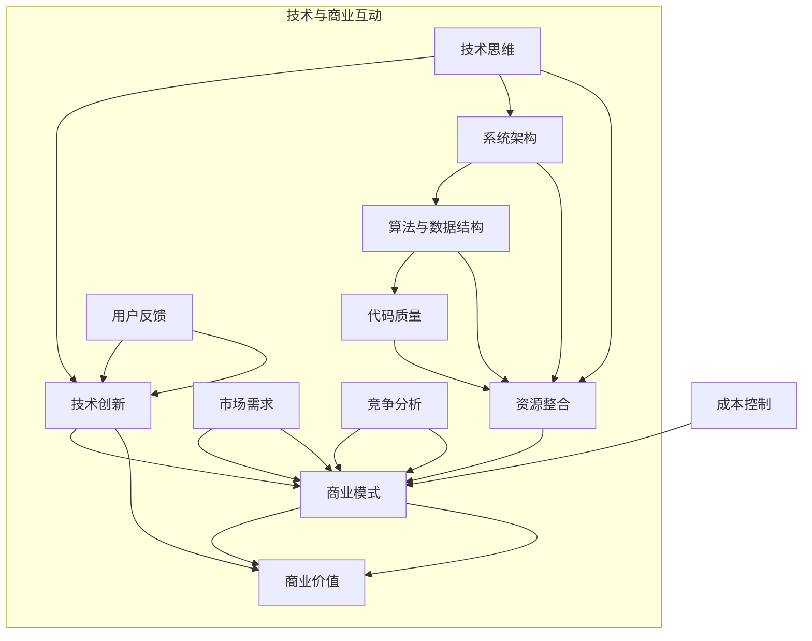

                 

### 《从技术思维到商业思维：程序员创业者的认知升级之路》概述

在当今技术飞速发展的时代，程序员创业已成为一种常见的现象。然而，技术背景的创业者常常面临从技术思维向商业思维转变的挑战。这篇文章旨在探讨程序员创业者如何通过认知升级，实现从技术思维到商业思维的转变。

#### 关键词

- 程序员创业者
- 技术思维
- 商业思维
- 认知升级
- 创业

#### 摘要

本文将首先介绍技术思维和商业思维的基本概念及其差异。接着，深入探讨程序员创业者如何在创业过程中逐步培养商业思维，包括商业模式设计、市场分析与定位、团队建设与管理等方面的实践。随后，文章将结合实际案例，分析创业者在认知升级过程中遇到的问题及解决方法。最后，文章将总结创业者的成功经验，并展望未来程序员创业者的道路。

## 第一部分：技术思维导论

### 第1章 技术思维的内涵与特征

#### 1.1 技术思维的起源与演变

技术思维起源于人类对自然现象的观察和利用。随着人类文明的进步，技术思维逐渐从实用技艺发展成为一种系统化的思考模式。在计算机科学领域，技术思维经历了从程序设计到算法优化，再到系统架构设计的演变过程。

技术思维的特征主要包括：

1. **逻辑性**：技术思维强调逻辑推理和证明，通过系统化的方法解决问题。
2. **创新性**：技术思维鼓励创新思维，不断寻求新的解决方案。
3. **实证性**：技术思维重视实验和验证，通过实践检验理论的正确性。

#### 1.2 技术思维的核心要素

技术思维的核心要素包括以下几个方面：

1. **算法与数据结构**：算法是技术思维的基础，涉及问题的求解方法。数据结构则用于组织和存储数据，提高算法的效率。
2. **系统架构**：系统架构设计涉及模块化、层次化和复用性，确保系统的稳定性和可扩展性。
3. **代码质量**：代码质量是技术思维的体现，包括可读性、可维护性和性能优化。

#### 1.3 技术思维的优势与局限性

技术思维的优势在于其逻辑性和实证性，能够高效地解决问题。然而，技术思维也存在局限性：

1. **忽视商业因素**：技术思维往往专注于技术本身，忽视商业需求和商业模式。
2. **过于理想化**：技术思维倾向于追求最优解，但在实际商业环境中，需要权衡多种因素。

### 第2章 技术与商业的交融

#### 2.1 技术创新对商业模式的推动

技术创新能够为商业模式带来新的机遇和挑战。例如，互联网技术的发展催生了电子商务、在线支付等新型商业模式。

#### 2.2 商业环境中的技术挑战

商业环境中的技术挑战包括：

1. **数据安全与隐私保护**：随着数据价值的提升，数据安全与隐私保护成为技术发展的重要课题。
2. **技术合规性**：不同国家和地区对技术的合规要求不同，技术创业者需要关注相关法律法规。

#### 2.3 技术思维与商业思维的区别与联系

技术思维注重解决问题的方法和效率，而商业思维则关注市场需求和商业模式。两者之间存在紧密联系：

1. **技术创新驱动商业发展**：技术创新能够推动商业模式创新，创造新的市场机会。
2. **商业思维指导技术创新**：商业思维为技术创新提供方向和目标，确保技术投入能够带来商业价值。

### 第3章 技术思维的局限性

#### 3.1 技术思维的狭隘性

技术思维往往局限于技术本身，忽视商业需求和市场变化。这种狭隘性可能导致技术解决方案无法满足实际需求，浪费资源。

#### 3.2 技术思维的过度追求

技术思维过度追求最优解，可能导致资源浪费和时间成本。在实际商业环境中，需要根据实际情况进行权衡。

#### 3.3 技术思维的不足之处

技术思维在商业决策中的不足之处包括：

1. **缺乏市场洞察力**：技术思维难以洞察市场动态和用户需求。
2. **忽视商业价值**：技术思维可能忽视技术对商业价值的贡献。

## 第二部分：商业思维修炼

### 第4章 商业模式设计

#### 4.1 商业模式的基本概念

商业模式是指企业如何创造、传递和捕获价值的系统。商业模式设计包括以下关键要素：

1. **价值主张**：明确企业为用户提供什么价值。
2. **客户细分**：识别目标客户群体。
3. **渠道**：定义如何传递价值给客户。
4. **客户关系**：建立与客户的关系。
5. **收入来源**：确定如何从客户获取收入。
6. **关键资源**：列出实现商业模式所需的关键资源。
7. **关键活动**：描述实现商业模式的关键活动。
8. **关键伙伴**：识别合作伙伴。
9. **成本结构**：分析实现商业模式的成本。

#### 4.2 价值主张与客户细分

价值主张是指企业为用户解决的问题或满足的需求。客户细分则是将市场划分为不同的用户群体，以便更精准地满足他们的需求。

#### 4.3 收入模型与成本结构

收入模型是指企业如何从客户获取收入。常见的收入模型包括销售产品、提供服务、广告收入等。成本结构则是指实现商业模式所需的成本，包括生产成本、运营成本、营销成本等。

### 第5章 市场分析与定位

#### 5.1 市场调研与用户需求分析

市场调研是了解市场需求和用户行为的重要手段。用户需求分析则有助于企业确定价值主张和产品定位。

#### 5.2 竞争分析策略

竞争分析旨在了解竞争对手的产品、市场策略和优势。通过竞争分析，企业可以制定有效的市场策略。

#### 5.3 市场定位与品牌建设

市场定位是指企业如何将自己与竞争对手区分开来，以吸引目标客户。品牌建设则是通过品牌形象塑造来提升企业在市场中的影响力。

### 第6章 团队建设与管理

#### 6.1 团队组织与角色分工

团队组织是指如何分配团队成员的角色和职责。角色分工确保每个成员都能够充分发挥自己的专长。

#### 6.2 项目管理与协作

项目管理包括项目规划、执行、监控和收尾。协作工具和技巧有助于提高团队的工作效率和沟通效果。

#### 6.3 领导力与团队凝聚力

领导力是指领导者如何激励和引导团队成员。团队凝聚力则是指团队成员之间的合作精神和信任关系。

### 第7章 创业者的认知升级路径

#### 7.1 创业者心理素质的培养

创业者需要具备良好的心理素质，包括自信、毅力、适应能力和情绪管理能力。

#### 7.2 信息收集与决策能力提升

创业者需要有效收集和分析信息，以便做出明智的决策。决策能力包括风险评估、问题解决和战略规划。

#### 7.3 持续学习与创新精神

创业者需要不断学习新知识，适应市场变化，并具备创新精神，以推动企业持续发展。

## 第三部分：认知升级与实践

### 第8章 创业项目实战

#### 8.1 创业项目的选择与评估

选择创业项目时，创业者需要考虑市场前景、团队优势和资源条件。项目评估包括技术可行性、市场前景和盈利能力。

#### 8.2 技术方案设计与开发

技术方案设计包括系统架构、技术选型和开发计划。开发过程需要遵循敏捷开发原则，确保项目进度和质量。

#### 8.3 市场推广与用户获取

市场推广包括品牌宣传、营销策略和用户获取渠道。创业者需要根据市场特点制定有效的推广策略。

### 第9章 创业过程中的挑战与应对

#### 9.1 技术创新与市场风险

技术创新可能面临市场风险，如技术过时、市场需求不足等。创业者需要通过市场调研和风险评估来降低风险。

#### 9.2 资金短缺与资源整合

资金短缺是创业过程中常见的问题。创业者需要通过资源整合、融资策略和成本控制来应对资金短缺。

#### 9.3 团队冲突与协调

团队冲突可能影响项目的进展。创业者需要通过沟通、协作和激励机制来协调团队成员，确保团队和谐。

### 第10章 成功创业者的经验分享

#### 10.1 创业初期的困惑与突破

创业初期，创业者可能会面临困惑和挫折。成功创业者分享了他们在创业初期的困惑和如何突破的方法。

#### 10.2 技术创新与商业模式

成功创业者分享了他们在技术创新和商业模式方面的经验和策略。

#### 10.3 领导力与团队建设

成功创业者强调了领导力和团队建设的重要性，分享了他们的领导经验和团队建设策略。

## 附录

### 附录A：创业资源与工具

#### A.1 创业相关的书籍和网站推荐

推荐了一些经典的创业书籍和实用的创业网站，以帮助创业者获取更多知识和资源。

#### A.2 重要的创业工具和平台

介绍了一些重要的创业工具和平台，如项目管理工具、营销工具、数据分析工具等，以帮助创业者提高工作效率。

#### A.3 创业相关的法律法规

提供了一些创业相关的法律法规，帮助创业者了解法律风险和合规要求。

### 附录B：技术思维与商业思维的融合模型

#### B.1 技术思维与商业思维的差异

分析技术思维和商业思维的差异，包括思维方式、关注点、目标等方面的不同。

#### B.2 融合模型的构建与实践

构建技术思维与商业思维的融合模型，包括核心要素、实施步骤和实践方法。

#### B.3 模型的应用与效果评估

探讨融合模型在实际创业中的应用效果，以及如何评估和优化模型。

作者：AI天才研究院/AI Genius Institute & 禅与计算机程序设计艺术 /Zen And The Art of Computer Programming

---

这篇文章初步完成了从技术思维到商业思维的探讨，涵盖了核心概念、实践方法和成功经验。接下来的任务是对每个章节进行详细扩展，确保文章内容丰富且具有实际指导意义。同时，需要结合具体案例来阐述技术思维与商业思维的融合，以提高文章的实用性和可读性。让我们一起继续深入思考和撰写，力求打造一篇优秀的程序员创业指南。

---

### 核心概念与联系

在探讨从技术思维到商业思维的转变过程中，理解两个核心概念及其联系至关重要：技术思维和商业模式。

#### 技术思维

技术思维是一种以逻辑、实证和创新为核心特征的思考模式，强调通过系统化的方法来解决问题。其核心要素包括：

1. **算法与数据结构**：算法是技术思维的基础，涉及问题的求解方法；数据结构则用于组织和存储数据，提高算法效率。

2. **系统架构**：系统架构设计涉及模块化、层次化和复用性，确保系统的稳定性和可扩展性。

3. **代码质量**：代码质量是技术思维的体现，包括可读性、可维护性和性能优化。

#### 商业模式

商业模式是指企业如何创造、传递和捕获价值的系统。其关键要素包括：

1. **价值主张**：明确企业为用户提供什么价值。

2. **客户细分**：识别目标客户群体。

3. **渠道**：定义如何传递价值给客户。

4. **客户关系**：建立与客户的关系。

5. **收入来源**：确定如何从客户获取收入。

6. **关键资源**：列出实现商业模式所需的关键资源。

7. **关键活动**：描述实现商业模式的关键活动。

8. **关键伙伴**：识别合作伙伴。

9. **成本结构**：分析实现商业模式的成本。

#### 技术思维与商业模式的联系

技术思维与商业模式之间存在紧密联系。技术创新能够为商业模式带来新的机遇和挑战，例如，互联网技术的发展催生了电子商务、在线支付等新型商业模式。同时，商业思维为技术创新提供方向和目标，确保技术投入能够带来商业价值。

技术思维与商业模式的联系可以用以下Mermaid流程图来表示：



在这个流程图中，技术思维通过技术创新影响商业模式，进而创造商业价值。市场需求、用户反馈和竞争分析等因素则引导技术思维和商业模式的发展。资源整合和成本控制是商业模式成功的关键要素。

#### 核心算法原理讲解

为了更好地理解技术思维与商业模式的联系，我们可以通过一个具体的算法示例来阐述。以下是一个简单的贪心算法，用于求解最短路径问题：

```python
def find_shortest_path(graph, start, end):
    # 初始化路径和距离列表
    paths = {start: [start]}
    distances = {start: 0}

    # 设置未访问节点
    unvisited = set(graph.keys())

    # 当还有未访问节点时循环
    while unvisited:
        # 选择未访问节点中距离最短的
        current = min(unvisited, key=lambda node: distances[node])

        # 如果当前节点是目标节点，结束循环
        if current == end:
            break

        # 标记当前节点为已访问
        unvisited.remove(current)

        # 遍历当前节点的邻居节点
        for neighbor, weight in graph[current].items():
            # 计算从当前节点到邻居节点的距离
            distance = distances[current] + weight

            # 如果邻居节点未访问或距离更短，更新路径和距离
            if neighbor not in distances or distance < distances[neighbor]:
                distances[neighbor] = distance
                paths[neighbor] = paths[current] + [neighbor]

    return paths[end]
```

这个贪心算法通过不断选择当前距离最短的未访问节点，逐步构建出从起始节点到目标节点的最短路径。这个算法的核心思想是：在每一步选择中，都选择当前最优的方案，以期最终得到全局最优解。

#### 数学模型和公式

在商业模式设计中，收益模型是一个关键组成部分。以下是一个简单的收益模型公式：

\[ R(t) = p \times q(t) - c(q(t)) \]

其中：

- \( R(t) \) 是在时间 \( t \) 的总收益。
- \( p \) 是单位产品的售价。
- \( q(t) \) 是在时间 \( t \) 的产品销量。
- \( c(q(t)) \) 是在时间 \( t \) 的总成本，通常包括固定成本 \( c_0 \) 和可变成本 \( c_1 \times q(t) \)。

\[ c(q(t)) = c_0 + c_1 \times q(t) \]

通过这个公式，企业可以评估在不同销量情况下的收益，从而制定相应的销售和成本控制策略。

#### 举例说明

假设一家科技公司生产智能音响，单位产品售价 \( p \) 为100美元，固定成本 \( c_0 \) 为50000美元，可变成本 \( c_1 \) 为20美元。如果第一个月的销量 \( q(1) \) 为1000台，那么：

\[ R(1) = 100 \times 1000 - (50000 + 20 \times 1000) \]
\[ R(1) = 100000 - 70000 \]
\[ R(1) = 30000 \]

第一个月的总收益为30000美元。

通过这个示例，我们可以看到技术思维和商业思维如何相互融合，通过算法模型和收益模型来指导商业决策，从而实现企业的盈利目标。

### 第5章：技术选型与架构设计

#### 5.1 技术选型的考虑因素

技术选型是程序员创业者面临的重要决策之一，它直接影响到产品的性能、可维护性、开发效率以及最终的市场竞争力。以下是进行技术选型时需要考虑的几个关键因素：

1. **性能需求**：根据产品的具体性能要求，选择合适的数据库、中间件和计算引擎。例如，如果产品需要处理大量实时数据，可能需要选择高性能的NoSQL数据库，如MongoDB或Cassandra。

2. **开发效率**：选择能够提高开发效率的技术栈，比如使用框架和库来简化开发流程。例如，使用Spring Boot可以快速搭建Java后端服务，而React或Vue.js则适合快速开发前端界面。

3. **可维护性**：考虑技术的长期维护成本，选择那些社区活跃、文档完善且更新频繁的技术，以避免未来可能出现的维护问题。

4. **生态支持**：评估所选技术的生态支持，包括社区、工具、教程和第三方库。良好的生态支持可以减少开发过程中的障碍，提高项目的成功率。

5. **安全性**：选择那些具备强大安全特性的技术，确保产品在数据传输、存储和处理过程中符合安全标准。

6. **成本因素**：考虑技术的成本，包括购买成本、许可费用、运维成本等。对于初创公司，可能需要优先考虑成本较低但功能足够的技术。

7. **兼容性**：确保所选技术与其他现有系统或第三方服务兼容，避免未来可能出现的集成问题。

8. **社区和文档**：选择有良好社区支持和丰富文档的技术，这样可以更快地解决问题，提高团队的开发效率。

#### 5.2 架构设计的原则与技巧

架构设计是确保系统可扩展性、稳定性和性能的关键环节。以下是一些核心原则和技巧：

1. **模块化**：将系统划分为多个功能模块，每个模块负责单一功能，降低系统复杂度，提高可维护性。

2. **分层架构**：采用分层架构模式，将系统分为表示层、业务逻辑层和数据层，各层职责明确，便于管理和扩展。

3. **分布式架构**：对于需要高并发和高可用性的系统，采用分布式架构，将系统功能分散到多个节点上，提高系统的容错能力和可扩展性。

4. **服务化**：将系统功能分解为微服务，每个微服务独立开发、部署和运维，便于系统的迭代和扩展。

5. **数据一致性**：确保系统在不同模块和组件之间数据的一致性，避免数据孤岛和数据冲突。

6. **缓存策略**：合理使用缓存来提高系统性能，减少数据库负载。例如，使用Redis作为session缓存或对象缓存。

7. **异步处理**：采用异步处理来提高系统响应速度和吞吐量，如使用消息队列和异步调用。

8. **监控与日志**：实现全面的监控和日志记录，以便快速定位和解决问题，确保系统的稳定运行。

#### 5.3 持续集成与持续部署

持续集成（CI）和持续部署（CD）是现代软件开发流程的重要组成部分，能够显著提高开发效率和软件质量。以下是一些关键点：

1. **自动化构建**：通过自动化构建工具（如Jenkins、Travis CI）实现代码的自动化编译、测试和打包。

2. **代码审查**：引入代码审查机制，确保代码质量和一致性，防止引入错误。

3. **自动化测试**：编写自动化测试用例，包括单元测试、集成测试和性能测试，确保每次代码更改都不会影响系统的稳定性。

4. **容器化**：使用Docker等容器化技术，确保开发、测试和生产环境一致，简化部署流程。

5. **持续交付**：通过CI/CD工具实现代码的自动化部署，从开发环境到测试环境再到生产环境，确保快速交付。

6. **蓝绿部署**：通过蓝绿部署策略，将新版本部署到一小部分用户上，观察其性能和稳定性，再逐步切换到全部用户。

7. **滚动更新**：实现滚动更新，避免服务中断，确保系统的高可用性。

#### 5.4 技术选型与架构设计的实际案例分析

以下是一个实际案例，说明如何进行技术选型和架构设计：

**案例背景**：某初创公司开发了一款社交网络应用，需要处理海量用户数据和高并发请求。

**技术选型**：

- **后端技术**：使用Spring Boot搭建Java后端服务，因为其成熟、社区活跃且易于维护。
- **数据库**：选择MySQL作为关系型数据库，同时使用Redis作为缓存，提高系统性能。
- **消息队列**：使用RabbitMQ实现异步消息传递，提高系统响应速度和吞吐量。

**架构设计**：

- **模块化**：将系统分为用户管理、内容管理、消息推送等功能模块。
- **分层架构**：采用三层架构，包括表示层（前端）、业务逻辑层（后端服务）和数据层（数据库）。
- **服务化**：将业务逻辑分解为多个微服务，如用户服务、内容服务、消息服务，每个服务独立部署和扩展。
- **分布式架构**：采用Kubernetes进行容器编排，确保系统的高可用性和可扩展性。

通过上述技术选型和架构设计，该初创公司成功实现了产品的快速迭代和市场推广，取得了良好的商业成果。

### 第6章：技术风险管理与应对

#### 6.1 技术风险识别与评估

在技术创业过程中，技术风险是不可避免的。为了有效管理技术风险，首先需要进行识别和评估。

1. **技术风险识别**：通过以下方法识别技术风险：

   - **访谈和问卷调查**：与团队成员和外部专家进行访谈，了解潜在的技术风险。
   - **文档审查**：审查项目文档、代码库和设计文档，识别可能的技术瓶颈和风险。
   - **市场调研**：分析市场需求和竞争对手的技术策略，了解行业中的技术风险。

2. **风险评估**：评估技术风险的影响和可能性，以下是一些常用的风险评估方法：

   - **风险矩阵**：根据风险的影响和可能性，将风险分为高、中、低等级。
   - **蒙特卡罗模拟**：通过模拟不同技术风险场景，评估其对项目的影响。
   - **成本效益分析**：计算技术风险带来的潜在成本和收益，进行成本效益分析。

#### 6.2 技术风险管理策略

在识别和评估技术风险后，需要制定相应的风险管理策略，以降低风险的影响。以下是一些常见的技术风险管理策略：

1. **风险规避**：通过调整项目计划或技术方案，避免高风险技术的使用。

2. **风险转移**：将技术风险转移给第三方，例如购买技术保险或与供应商签订责任合同。

3. **风险减轻**：通过改进技术方案、增加冗余设计或使用替代技术，减轻技术风险的影响。

4. **风险接受**：对于无法规避或减轻的风险，制定应对策略，接受风险并准备好应急措施。

5. **风险监控与反馈**：建立风险监控机制，定期评估风险状态，及时调整风险管理策略。

#### 6.3 应对技术风险的策略与实践

以下是一些具体的技术风险管理策略和实践：

1. **技术验证与测试**：在项目早期进行技术验证和测试，确保技术方案的可行性和稳定性。

2. **敏捷开发**：采用敏捷开发方法，快速迭代和反馈，及时识别和解决技术问题。

3. **开源技术评估**：对于使用开源技术，仔细评估其安全性和稳定性，确保符合项目要求。

4. **持续集成与持续部署**：通过CI/CD流程，自动化测试和部署，提高软件质量，减少技术风险。

5. **备份与恢复**：建立数据备份和恢复机制，确保在技术故障时能够迅速恢复系统。

6. **安全培训与意识提升**：对团队成员进行安全培训，提高其对技术风险的认识和应对能力。

通过以上策略和实践，技术创业者可以更好地管理技术风险，确保项目的顺利进行和成功。

### 第7章：技术创新与竞争力

#### 7.1 技术创新的动力与方向

技术创新是提升企业竞争力的重要途径。以下探讨技术创新的动力和方向：

1. **市场需求**：市场需求是技术创新的主要动力之一。企业需要密切关注市场动态和用户需求，以驱动技术创新。

2. **技术趋势**：紧跟技术发展趋势，如人工智能、大数据、区块链等，可以为企业提供新的创新方向。

3. **竞争压力**：竞争对手的技术创新会带来竞争压力，促使企业不断提升自身技术水平。

4. **政策支持**：政府政策支持可以为技术创新提供资金、资源和政策优惠，推动企业技术创新。

5. **内部动力**：企业内部的技术研发团队和管理层对技术创新的追求和热情也是重要的动力。

技术创新的方向主要包括：

- **产品创新**：通过技术创新提高产品质量、性能和用户体验。
- **商业模式创新**：通过技术创新创造新的商业模式，如共享经济、在线服务等。
- **供应链创新**：通过技术创新优化供应链管理，提高生产效率和质量。

#### 7.2 竞争力分析与技术优势

竞争力分析是确定企业技术优势和市场定位的重要步骤。以下是一些竞争力分析的方法：

1. **SWOT分析**：通过分析企业的优势（Strengths）、劣势（Weaknesses）、机会（Opportunities）和威胁（Threats），确定企业的技术优势和劣势。

2. **五力模型**：使用五力模型分析企业的市场竞争力，包括供应商谈判力、买家谈判力、潜在进入者威胁、替代品威胁和行业内的竞争强度。

3. **波特价值链分析**：通过分析企业的价值链，确定企业在各个环节中的竞争优势。

技术优势是提升企业竞争力的关键。以下是一些技术优势的来源：

- **核心技术**：拥有独特和领先的核心技术，如专利、专有技术等。
- **研发能力**：强大的研发团队和持续的研发投入，确保技术创新和持续进步。
- **人才优势**：拥有高水平的技术人才，能够快速响应市场需求和技术变化。
- **合作伙伴**：与知名技术公司或研究机构的合作，获得技术支持和资源。
- **技术积累**：长期的技术积累和经验，形成独特的竞争优势。

通过竞争力分析和技术优势的确定，企业可以明确自身在市场中的定位，并制定相应的市场策略和技术发展路线。

### 第8章：成功创业者的经验分享

#### 8.1 创业初期的困惑与突破

创业初期，许多创业者都会面临一系列的困惑和挑战。以下是一些成功创业者分享的困惑及如何突破的方法：

1. **市场定位不清晰**：创业者需通过市场调研、用户反馈和竞品分析，明确目标市场和用户需求，以便精准定位。

2. **资金短缺**：创业者可以通过寻找投资人、申请创业基金、利用个人储蓄等方式解决资金问题。同时，通过精益创业方法，减少初始投资和运营成本。

3. **团队组建困难**：创业者可以通过网络招聘、校园招聘、朋友推荐等方式寻找合适的团队成员。建立明确的团队目标和沟通机制，确保团队成员协作高效。

4. **技术瓶颈**：创业者应密切关注技术发展趋势，积极引进新技术，并与技术专家合作，解决技术难题。

5. **营销策略不明**：创业者可以通过分析竞争对手、了解目标用户喜好，制定有效的营销策略，如社交媒体营销、内容营销等。

6. **管理经验不足**：创业者可以通过参加创业培训、阅读管理书籍、请教成功企业家等方式，提升管理能力和经验。

#### 8.2 技术创业中的关键决策

技术创业者需要做出一系列关键决策，以下是一些关键决策及其重要性：

1. **技术路线选择**：选择合适的技术路线，如开源技术、自主研发或合作开发，根据市场需求和自身优势进行决策。

2. **产品定位**：明确产品定位，包括目标用户群体、产品功能和市场定位，确保产品满足用户需求。

3. **市场策略**：制定有效的市场策略，包括定价、推广渠道和销售策略，提高市场占有率和用户粘性。

4. **团队建设**：建立高效的团队，明确团队成员的职责和目标，激发团队创新力和执行力。

5. **融资规划**：制定融资规划，包括融资目标、融资方式和资金用途，确保资金充足并有效利用。

6. **持续创新**：保持技术创新，跟踪市场动态，不断优化产品和服务，保持竞争优势。

#### 8.3 成功创业者的思维模式

成功创业者通常具备以下思维模式：

1. **用户导向**：始终关注用户需求，以用户为中心进行产品设计和创新。

2. **持续学习**：保持学习的态度，关注行业动态和新技术，不断提升自身能力和知识储备。

3. **冒险精神**：勇于尝试新事物，面对挑战和失败，保持积极的心态和坚韧的意志。

4. **团队合作**：重视团队协作，建立良好的团队文化和沟通机制，激发团队潜力和创造力。

5. **风险管理**：具备良好的风险管理意识，提前识别和应对潜在风险，确保企业稳定发展。

6. **创新思维**：鼓励创新思维，不断探索新的商业模式和技术应用，推动企业持续成长。

通过以上经验和思维模式的借鉴，创业者可以更好地应对创业过程中的困惑和挑战，提高创业成功率。

### 第9章：项目实战详解

#### 9.1 项目背景与目标

本项目是一款基于人工智能的智能问答系统，旨在为用户提供快速、准确的答案。项目目标包括：

1. **构建高效的知识库**：收集和整理大量高质量的问题和答案，构建智能问答系统的知识库。

2. **实现智能匹配算法**：通过自然语言处理技术，实现用户提问与知识库中问题的智能匹配。

3. **提供高质量的问答服务**：通过深度学习技术，提高问答系统的准确率和用户体验。

4. **具备扩展性**：设计灵活的架构，支持未来的功能扩展和性能优化。

#### 9.2 技术实现与架构设计

本项目的技术实现和架构设计如下：

1. **前端架构**：采用Vue.js框架搭建用户界面，实现问答输入、答案展示和用户交互功能。

2. **后端架构**：使用Spring Boot构建后端服务，处理用户请求、调用自然语言处理模型和返回答案。

3. **自然语言处理**：采用深度学习技术，使用TensorFlow构建问答匹配和答案生成模型。

4. **知识库管理**：使用Elasticsearch进行知识库的存储和管理，提高查询效率和性能。

5. **数据库**：使用MySQL存储用户数据、问答记录和系统配置信息。

6. **容器化与部署**：使用Docker进行容器化，简化部署和运维过程。使用Kubernetes进行容器编排，实现高可用性和弹性伸缩。

#### 9.3 项目实施与迭代过程

项目实施和迭代过程如下：

1. **需求分析**：与产品经理和用户进行沟通，明确系统功能和性能需求。

2. **系统设计**：进行系统架构设计，包括前端、后端、自然语言处理和数据库设计。

3. **编码与测试**：根据设计文档进行编码，并进行单元测试和集成测试，确保系统功能完整和稳定。

4. **测试与优化**：进行用户测试和性能测试，根据反馈进行优化和调整。

5. **部署与上线**：使用Docker和Kubernetes进行部署，确保系统的高可用性和性能。

6. **持续迭代**：根据用户反馈和市场变化，持续进行功能优化和性能提升。

#### 9.4 项目关键功能实现与代码解读

以下是对项目关键功能实现和代码解读：

1. **用户提问与答案展示**

   ```java
   @RestController
   public class QuestionController {
   
       @Autowired
       private NlpService nlpService;
   
       @PostMapping("/ask")
       public ResponseEntity<String> askQuestion(@RequestBody String question) {
           String answer = nlpService.generateAnswer(question);
           return ResponseEntity.ok(answer);
       }
   }
   ```

   该代码定义了一个RESTful接口，用于接收用户提问并返回答案。`NlpService`负责调用自然语言处理模型生成答案。

2. **自然语言处理模型**

   ```python
   import tensorflow as tf
   from tensorflow.keras.models import Sequential
   from tensorflow.keras.layers import Embedding, LSTM, Dense
   
   model = Sequential()
   model.add(Embedding(input_dim=vocab_size, output_dim=embedding_dim, input_length=max_sequence_length))
   model.add(LSTM(units=128))
   model.add(Dense(units=1, activation='sigmoid'))
   
   model.compile(optimizer='rmsprop', loss='binary_crossentropy', metrics=['accuracy'])
   model.fit(X_train, y_train, epochs=100, batch_size=64)
   ```

   该代码使用TensorFlow构建了一个简单的自然语言处理模型，包括嵌入层、LSTM层和输出层。模型训练过程中使用了二进制交叉熵损失函数和RMSprop优化器。

3. **知识库管理**

   ```java
   @RestController
   public class KnowledgeBaseController {
   
       @Autowired
       private ElasticsearchTemplate elasticsearchTemplate;
   
       @PostMapping("/addQuestion")
       public ResponseEntity<String> addQuestion(@RequestBody Question question) {
           elasticsearchTemplate.index(question);
           return ResponseEntity.ok("Question added successfully");
       }
   }
   ```

   该代码定义了一个RESTful接口，用于添加新问题和答案到Elasticsearch知识库。

#### 9.5 代码解读与分析

以上代码展示了项目中的关键功能实现和架构设计。以下是代码解读与分析：

1. **RESTful接口设计**：采用Spring Boot框架，实现了用户提问、答案展示和知识库管理接口。接口设计遵循RESTful原则，易于扩展和维护。

2. **自然语言处理模型**：使用深度学习技术，实现了问答匹配和答案生成。模型使用TensorFlow框架构建，具有良好的性能和灵活性。

3. **知识库管理**：使用Elasticsearch进行知识库存储和管理。Elasticsearch具有高效查询和实时更新功能，能够满足问答系统的性能需求。

4. **容器化与部署**：使用Docker进行容器化，简化了部署和运维过程。Kubernetes用于容器编排，确保系统的高可用性和弹性伸缩。

通过以上实现和代码解读，该项目展示了如何利用现代技术构建一个高效的智能问答系统。在实际开发过程中，还需不断优化和改进，以满足用户需求和提升系统性能。

### 第10章：商业与技术的融合

#### 10.1 商业目标与技术开发

商业目标与技术开发之间的融合是确保企业成功的关键。商业目标通常包括盈利、市场份额、用户增长等，而技术开发则是实现这些目标的手段。以下是如何将商业目标与技术开发相结合：

1. **明确商业目标**：首先，企业需要明确其商业目标。例如，一个电商平台的商业目标可能是提高用户转化率和提升销售额。

2. **技术战略规划**：根据商业目标，制定相应的技术战略。例如，为了提高用户转化率，可以采用个性化推荐技术，通过分析用户行为和历史数据，为用户推荐合适的商品。

3. **技术投入优先级**：在技术投入上，根据商业目标的优先级进行分配。例如，如果用户增长是首要目标，那么可以优先投入资源开发用户增长相关的技术，如用户行为分析、社交网络推广等。

4. **持续反馈与调整**：技术开发过程中，需要持续收集商业数据，对技术效果进行评估，并根据反馈调整技术方案。例如，通过A/B测试，比较不同技术方案对商业目标的影响，选择最优方案。

#### 10.2 技术创新与商业模式

技术创新对商业模式具有深远的影响，以下是如何将技术创新与商业模式相结合：

1. **探索新兴技术**：企业需要关注新兴技术，如人工智能、区块链、物联网等，探索这些技术如何为现有业务创造新价值。例如，通过区块链技术，可以实现去中心化的交易和供应链管理，降低运营成本。

2. **重新定义价值主张**：技术创新可以重新定义企业的价值主张。例如，共享经济模式通过利用闲置资源，为用户提供更低成本的解决方案，重新定义了传统的商业模式。

3. **创造新市场机会**：技术创新可以创造新的市场机会，企业可以通过创新技术，开辟新的业务领域。例如，通过大数据分析，企业可以挖掘新的用户需求，开发新的产品和服务。

4. **优化成本结构**：技术创新可以优化企业的成本结构，降低运营成本。例如，通过自动化技术，企业可以实现生产流程的自动化，降低人工成本。

#### 10.3 技术驱动商业的路径与策略

技术驱动商业的路径和策略包括以下几个方面：

1. **市场研究**：在技术投入之前，进行充分的市场研究，了解市场需求和用户痛点，确保技术创新能够满足市场需求。

2. **技术选型**：选择合适的技术方案，根据业务需求和技术趋势，评估不同技术的适用性和成本效益。

3. **研发投入**：根据商业目标，制定研发投入计划，确保技术创新能够为商业目标提供支持。例如，可以设立专项研发基金，用于支持技术创新项目。

4. **人才培养**：培养和引进具备创新能力和技术专长的人才，为技术创新提供人才支持。

5. **试点与推广**：在技术创新项目初期，进行试点运行，收集用户反馈和业务数据，根据反馈进行优化，再逐步推广至全公司。

6. **数据驱动决策**：通过数据分析，评估技术创新对商业目标的影响，根据数据结果调整技术方案和商业策略。

通过以上路径与策略，企业可以确保技术创新与商业目标的有机结合，实现技术驱动商业的持续发展。

### 附录A：创业资源与工具

#### A.1 创业相关的书籍和网站推荐

为了帮助创业者更好地了解创业知识和策略，以下是一些推荐的书籍和网站：

**书籍推荐**：

1. **《精益创业》（The Lean Startup）** - 作者：埃里克·莱斯（Eric Ries）
   这本书介绍了精益创业方法，帮助创业者快速验证市场假设，减少失败风险。

2. **《创业维艰》（Hard Things About Hard Things）** - 作者：本·霍洛维茨（Ben Horowitz）
   本书分享了一位成功创业者的经验和教训，对创业者具有很好的启示作用。

3. **《从0到1》（Zero to One）** - 作者：彼得·蒂尔（Peter Thiel）
   这本书探讨创新和创业的本质，为创业者提供了宝贵的思考框架。

**网站推荐**：

1. **创业博客（StartupBlogs）**：提供大量创业经验和策略的博客文章，涵盖创业的各个方面。

2. **创业者社区（Entrepreneur）**：一个全面的创业者社区，包括新闻、文章、教程和论坛。

3. **创业咖啡馆（Startup Cafes）**：全球多个城市提供的创业交流平台，创业者可以在这里分享经验和资源。

#### A.2 重要的创业工具和平台

以下是一些重要的创业工具和平台，它们可以帮助创业者提高工作效率和业务发展：

**项目管理工具**：

1. **Trello**：一个简单但功能强大的项目管理工具，适合小型团队。

2. **Asana**：用于任务管理和团队协作，提供丰富的自定义功能。

3. **Jira**：适合大型团队的敏捷项目管理工具，具有强大的Bug追踪和项目跟踪功能。

**营销工具**：

1. **HubSpot**：提供全面的营销自动化工具，包括SEO优化、社交媒体管理、电子邮件营销等。

2. **Mailchimp**：一个功能强大的电子邮件营销平台，适用于各种规模的创业公司。

3. **Canva**：一个易于使用的图形设计工具，帮助创业者快速创建专业的设计作品。

**数据分析工具**：

1. **Google Analytics**：免费的网站分析工具，提供详细的用户行为数据。

2. **Tableau**：强大的数据可视化工具，帮助企业更好地理解和利用数据。

3. **Mixpanel**：专注于用户行为分析的工具，帮助创业者了解用户如何使用产品。

**创业平台**：

1. **Kickstarter**：一个知名的众筹平台，帮助创业者筹集资金。

2. **AngelList**：一个连接创业者和投资者的平台，提供创业机会和资金支持。

3. **Indiegogo**：另一个知名的众筹平台，适合各种类型的项目筹集资金。

通过这些资源和工具，创业者可以更好地规划和管理创业项目，提高成功的几率。

### 附录B：技术思维与商业思维的融合模型

#### B.1 技术思维与商业思维的差异

技术思维与商业思维在思维方式、关注点和目标上存在显著差异。

**技术思维**：

- **逻辑性**：强调逻辑推理和系统化方法。
- **创新性**：鼓励创新和寻找最优解。
- **实证性**：通过实验和验证来检验理论。
- **关注点**：解决问题、性能优化、技术实现。
- **目标**：高效、准确、可靠的技术解决方案。

**商业思维**：

- **实用性**：关注市场需求和实际应用。
- **策略性**：制定长期和短期商业策略。
- **利益导向**：以创造价值、获取利润为目标。
- **关注点**：市场需求、商业模式、客户关系。
- **目标**：盈利、市场占有、用户增长。

尽管两者存在差异，但在创业过程中，技术思维与商业思维需要相互融合，以确保技术创新能够转化为商业价值。

#### B.2 融合模型的构建与实践

构建技术思维与商业思维的融合模型，需要明确以下几个步骤：

1. **需求分析**：了解市场需求和用户痛点，确定技术解决方案的方向。
   
2. **价值主张**：明确产品或服务的价值主张，确保技术方案能够满足用户需求。

3. **商业模式设计**：根据市场需求和价值主张，设计合适的商业模式，确定收入来源和成本结构。

4. **技术创新**：基于商业模式需求，进行技术创新和优化，确保技术方案具备竞争力和可行性。

5. **市场测试**：通过市场测试，验证技术解决方案的商业可行性，根据反馈进行优化。

6. **持续迭代**：根据市场反馈和业务数据，持续优化技术方案和商业模式，确保持续适应市场需求。

#### B.3 模型的应用与效果评估

融合模型在实际创业中的应用效果评估包括以下几个方面：

1. **市场表现**：通过市场占有率、用户增长、收入增长等指标，评估技术方案和商业模式的实际效果。

2. **用户体验**：通过用户满意度、用户留存率等指标，评估技术方案对用户价值的实现程度。

3. **成本效益**：通过成本控制和收益增长，评估商业模式的经济效益。

4. **创新能力**：通过技术创新的频率和质量，评估企业的创新能力。

5. **团队协作**：通过团队协作效率和工作满意度，评估融合模型对团队的影响。

通过以上评估指标，创业者可以全面了解融合模型的应用效果，并根据实际情况进行优化和调整，确保技术思维与商业思维的有机融合，实现企业的可持续发展。

---

在这篇文章中，我们从技术思维和商业思维的基本概念入手，探讨了两者之间的联系和差异，以及如何通过认知升级实现从技术思维到商业思维的转变。我们详细介绍了商业模式设计、市场分析与定位、团队建设与管理等方面的实践方法，并通过实际案例展示了技术思维与商业思维的融合模型。文章还分析了创业者如何通过技术创新提升竞争力，以及成功创业者的经验分享。最后，我们提供了创业资源与工具的推荐，以及技术思维与商业思维融合模型的详细说明。

希望这篇文章能够为程序员创业者提供有价值的指导，帮助他们在创业道路上实现认知升级，成功转型为商业思维型创业者。在未来的创业实践中，创业者需要不断学习和调整，以适应快速变化的市场环境，实现技术驱动商业的持续发展。让我们共同探索这个充满机遇和挑战的领域，共创美好的未来。

