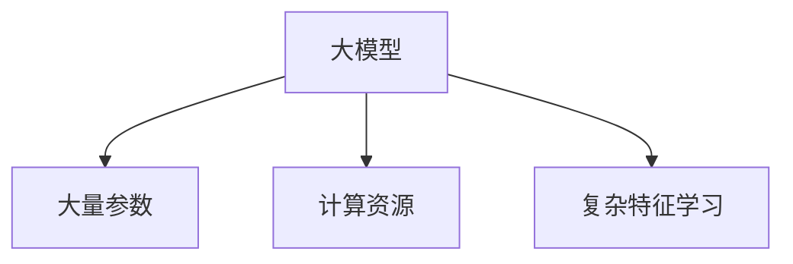
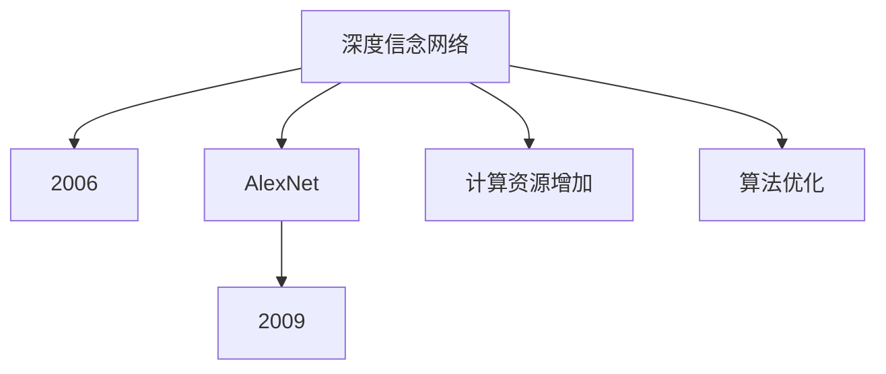
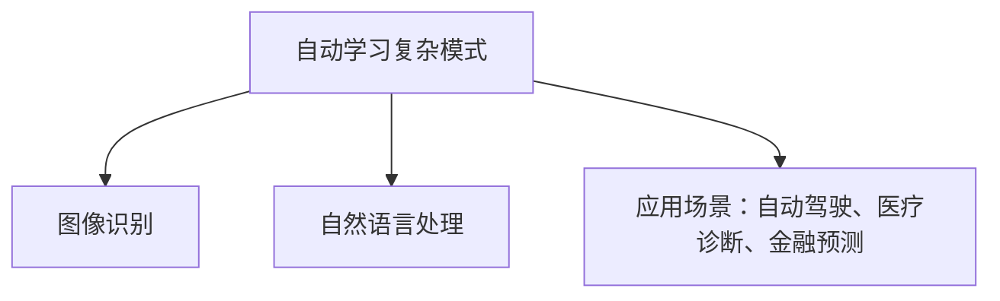
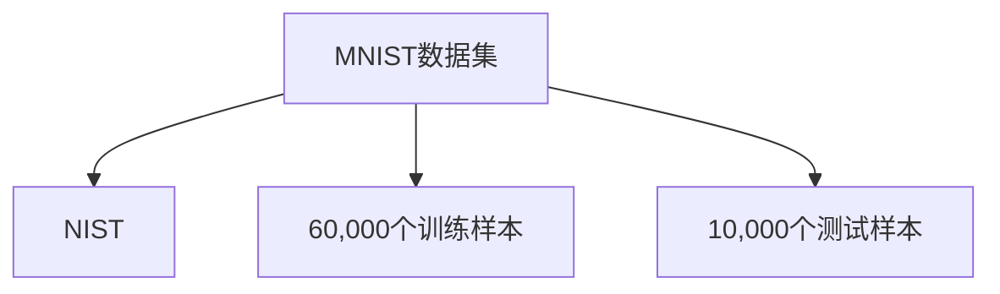
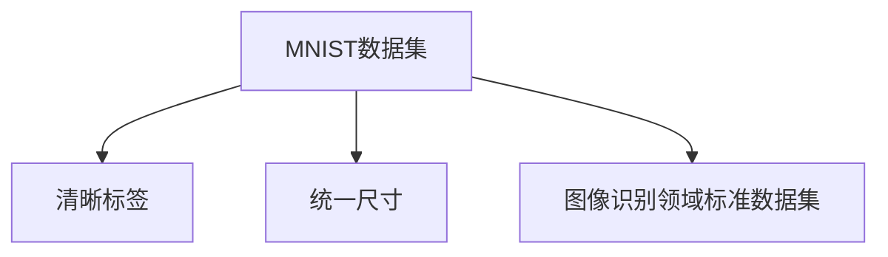
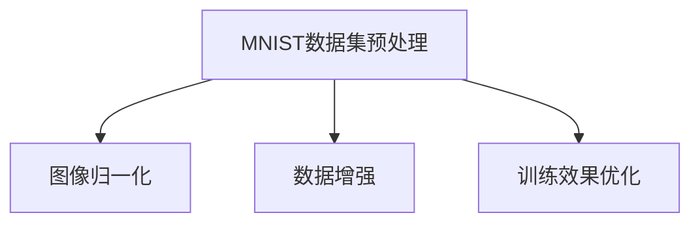

                 

# 《从零开始大模型开发与微调：MNIST数据集的准备》

> **关键词：** 大模型开发，微调，MNIST数据集，深度学习，神经网络，图像识别。

> **摘要：** 本文旨在从零开始，详细讲解如何准备MNIST数据集，以便于进行大模型开发与微调。文章将介绍MNIST数据集的基本概念，预处理方法，以及大模型开发的基础知识，为读者提供完整的实操指南。

## 引言

近年来，随着计算能力的提升和深度学习算法的不断发展，大模型在各个领域取得了显著的成果。从自然语言处理到计算机视觉，大模型展示了强大的潜力。然而，大模型的开发生命周期中，数据集的准备工作尤为关键。本文将围绕MNIST数据集，探讨如何从零开始进行大模型开发与微调。

## 第1章：大模型概述

### 1.1 大模型的概念

大模型通常指的是具有数百万甚至数十亿参数的深度学习模型。这些模型通过大量的数据和计算资源进行训练，从而在学习复杂的特征和模式方面表现出色。

### 1.2 大模型的发展历程

大模型的发展可以追溯到2006年的深度信念网络（DBN）和2009年的AlexNet。随着计算资源的增加和算法的优化，大模型逐渐在图像识别、语音识别等领域取得了突破。

### 1.3 大模型的优势与应用场景

大模型的优势在于其能够自动学习数据中的复杂模式和特征，从而在图像识别、自然语言处理等任务中表现出色。应用场景包括自动驾驶、医疗诊断、金融预测等。

## 第2章：MNIST数据集介绍

### 2.1 MNIST数据集的来源

MNIST数据集是由美国国家标准技术研究院（NIST）提供的一套手写数字数据集，包含60,000个训练样本和10,000个测试样本。

### 2.2 MNIST数据集的特点

MNIST数据集具有清晰的标签和统一的尺寸，使得它成为了图像识别领域的标准数据集。

### 2.3 MNIST数据集的预处理

预处理包括图像归一化、数据增强等步骤，以优化模型的训练效果。

## 第3章：大模型开发环境搭建

### 3.1 硬件要求与配置

大模型训练通常需要GPU支持，建议使用NVIDIA的GPU，配置越高，训练速度越快。

### 3.2 软件安装与配置

需要安装Python、TensorFlow或PyTorch等深度学习框架，并进行相应的配置。

### 3.3 开发工具与库的选择

根据项目需求，选择合适的开发工具和库，如TensorBoard、Keras等。

## 第4章：大模型基础算法

### 4.1 深度学习基础

深度学习的基本概念，包括前向传播、反向传播等。

### 4.2 神经网络结构

神经网络的组成，包括输入层、隐藏层和输出层。

### 4.3 大模型训练策略

大模型训练的策略，包括超参数调整、批量归一化等。

## 第5章：MNIST数据集上的大模型训练

### 5.1 MNIST数据集划分

将MNIST数据集划分为训练集、验证集和测试集。

### 5.2 大模型训练流程

详细讲解大模型训练的步骤，包括数据加载、模型构建、训练和评估。

### 5.3 大模型训练技巧

训练技巧，包括数据增强、学习率调整等。

## 第6章：大模型微调

### 6.1 微调的概念

微调是指在大模型的基础上，针对特定任务进行权重调整。

### 6.2 微调策略

微调的策略，包括迁移学习、小样本学习等。

### 6.3 微调案例解析

通过实际案例，解析微调的过程和方法。

## 第7章：大模型评估与优化

### 7.1 评估指标

常用的评估指标，包括准确率、召回率等。

### 7.2 优化方法

优化方法，包括正则化、dropout等。

### 7.3 实际优化案例分析

通过实际案例，分析优化方法的应用。

## 第8章：大模型在图像识别中的应用

### 8.1 图像识别基础

图像识别的基本概念和流程。

### 8.2 大模型图像识别应用

大模型在图像识别中的具体应用。

### 8.3 实际应用案例分析

图像识别的实际应用案例。

## 第9章：大模型在自然语言处理中的应用

### 9.1 自然语言处理基础

自然语言处理的基本概念和任务。

### 9.2 大模型自然语言处理应用

大模型在自然语言处理中的具体应用。

### 9.3 实际应用案例分析

自然语言处理的实际应用案例。

## 第10章：大模型在推荐系统中的应用

### 10.1 推荐系统基础

推荐系统的基本概念和流程。

### 10.2 大模型推荐系统应用

大模型在推荐系统中的具体应用。

### 10.3 实际应用案例分析

推荐系统的实际应用案例。

## 第11章：大模型在计算机视觉中的应用

### 11.1 计算机视觉基础

计算机视觉的基本概念和任务。

### 11.2 大模型计算机视觉应用

大模型在计算机视觉中的具体应用。

### 11.3 实际应用案例分析

计算机视觉的实际应用案例。

## 附录

### 附录A：大模型开发资源

大模型开发所需的开源框架、工具和资料。

### 附录B：实际案例分析

大模型在不同领域的实际应用案例。

## 结语

大模型作为深度学习领域的重要研究方向，正不断推动人工智能的发展。本文从零开始，详细讲解了大模型开发与微调的过程，希望对读者有所启发。

### 作者信息

**作者：** AI天才研究院/AI Genius Institute & 禅与计算机程序设计艺术 /Zen And The Art of Computer Programming

---

以上是文章的主要结构和内容，接下来我们将针对每个章节进行详细的讲解和示例代码展示。

---

### 第1章：大模型概述

#### 1.1 大模型的概念

大模型通常指的是具有数百万甚至数十亿参数的深度学习模型。这些模型通过大量的数据和计算资源进行训练，从而在学习复杂的特征和模式方面表现出色。

**核心概念与联系：**



#### 1.2 大模型的发展历程

大模型的发展可以追溯到2006年的深度信念网络（DBN）和2009年的AlexNet。随着计算资源的增加和算法的优化，大模型逐渐在图像识别、语音识别等领域取得了突破。

**核心概念与联系：**



#### 1.3 大模型的优势与应用场景

大模型的优势在于其能够自动学习数据中的复杂模式和特征，从而在图像识别、自然语言处理等任务中表现出色。应用场景包括自动驾驶、医疗诊断、金融预测等。

**核心概念与联系：**



### 第2章：MNIST数据集介绍

#### 2.1 MNIST数据集的来源

MNIST数据集是由美国国家标准技术研究院（NIST）提供的一套手写数字数据集，包含60,000个训练样本和10,000个测试样本。

**核心概念与联系：**



#### 2.2 MNIST数据集的特点

MNIST数据集具有清晰的标签和统一的尺寸，使得它成为了图像识别领域的标准数据集。

**核心概念与联系：**



#### 2.3 MNIST数据集的预处理

预处理包括图像归一化、数据增强等步骤，以优化模型的训练效果。

**核心概念与联系：**



### 第3章：大模型开发环境搭建

#### 3.1 硬件要求与配置

大模型训练通常需要GPU支持，建议使用NVIDIA的GPU，配置越高，训练速度越快。

**核心概念与联系：**

```mermaid
graph TD
A[大模型训练] --> B[G

