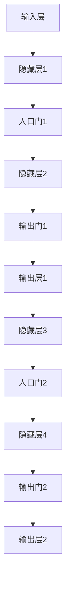

                 

### 文章标题

从零开始大模型开发与微调：解码器的输入和交互注意力层的掩码

---

#### 关键词：
大模型开发、微调、解码器、交互注意力层、掩码、深度学习、神经网络

---

#### 摘要：

本文将从零开始，深入探讨大模型开发与微调的基础知识，特别是解码器的输入和交互注意力层的掩码操作。我们将通过详细的原理讲解、伪代码展示和实际项目实战，帮助读者全面理解并掌握这一领域的关键技术。文章涵盖了从基本概念到前沿技术的全面内容，旨在为读者提供一条清晰的路径，从新手到专家。

---

### 第一部分: 从零开始大模型开发基础

在本部分中，我们将为读者奠定大模型开发的基础，介绍相关的核心概念、技术和编程基础。

#### 第1章: 大模型与微调简介

**1.1 大模型的概念与作用**

大模型，通常指的是拥有数十亿至数千亿参数的神经网络模型。这些模型能够处理大量的数据和复杂的任务，如自然语言处理、计算机视觉、语音识别等。大模型的作用主要体现在以下几个方面：

1. **高精度预测**：大模型通过学习大量数据，能够捕捉到数据中的复杂模式和规律，从而实现更准确的任务执行。
2. **强大泛化能力**：大模型具有较强的泛化能力，能够适应不同的任务和数据集，从而减少对特定数据的依赖。
3. **高效处理能力**：大模型可以高效地处理大规模数据，提高了模型的计算速度和处理能力。

**1.2 微调的重要性**

微调是指在大模型的预训练基础上，针对特定任务进行进一步训练的过程。微调的重要性体现在以下几个方面：

1. **提高性能**：通过微调，模型能够针对特定任务进行优化，从而提高任务执行的性能。
2. **减少训练时间**：预训练的大模型已经学习到了一些通用的知识，因此微调阶段所需的数据量和训练时间相对较少。
3. **提高泛化能力**：微调能够使模型更好地适应不同任务和数据分布，从而提高其泛化能力。

#### 第2章: 大模型开发基础

**2.1 深度学习与神经网络基础**

深度学习是人工智能的一个重要分支，其核心是神经网络。神经网络由多个层组成，包括输入层、隐藏层和输出层。每一层由多个神经元（或节点）组成，神经元之间通过权重连接。

**2.1.1 神经网络的基本结构**

神经网络的基本结构如下：


- **输入层**：接收外部输入，将其传递到下一层。
- **隐藏层**：对输入数据进行处理，通过一系列的加权求和和激活函数操作，产生中间特征。
- **输出层**：对隐藏层输出的特征进行分类或回归等操作，生成最终的输出。

**2.1.2 常见的深度学习架构**

深度学习架构多种多样，不同的架构适用于不同的任务。以下是一些常见的深度学习架构：

1. **卷积神经网络（CNN）**：适用于图像处理任务，通过卷积层提取图像的特征。
2. **循环神经网络（RNN）**：适用于序列数据处理任务，如自然语言处理和语音识别，通过循环层处理序列数据。
3. **变换器（Transformer）**：适用于自然语言处理任务，通过自注意力机制处理序列数据。

**2.2 大模型常见结构介绍**

大模型通常采用复杂的结构，以处理大规模数据和复杂任务。以下是一些常见的大模型结构：

1. **GPT模型**：基于变换器（Transformer）架构的预训练语言模型，能够生成高质量的自然语言文本。
2. **BERT模型**：基于变换器（Transformer）的双向编码模型，通过在预训练过程中同时考虑文本的前后文信息，提高了模型的表示能力。
3. **ViT模型**：基于变换器（Transformer）的视觉模型，通过将图像划分为网格单元，然后使用变换器结构进行训练。

**2.3 编程基础**

编程是进行大模型开发和微调的基础。本文主要介绍Python编程语言及其在深度学习中的应用。

**2.3.1 Python编程语言**

Python是一种广泛使用的编程语言，特别是在AI和深度学习领域。Python具有简洁的语法、丰富的库和强大的社区支持，使得深度学习研究和开发变得更加高效。

**2.3.2 开发环境搭建**

在开始大模型开发和微调之前，需要搭建合适的开发环境。常见的深度学习框架包括TensorFlow和PyTorch，下面将介绍如何搭建这两个框架的开发环境。

#### 2.3.2.1 TensorFlow开发环境搭建

1. 安装Python解释器：在官网上下载并安装Python解释器，选择合适的版本。
2. 安装TensorFlow：使用pip命令安装TensorFlow库。

   ```shell
   pip install tensorflow
   ```

3. 测试TensorFlow安装：在Python环境中导入TensorFlow库，并打印版本信息。

   ```python
   import tensorflow as tf
   print(tf.__version__)
   ```

#### 2.3.2.2 PyTorch开发环境搭建

1. 安装Python解释器：在官网上下载并安装Python解释器，选择合适的版本。
2. 安装PyTorch：使用pip命令安装PyTorch库。

   ```shell
   pip install torch torchvision
   ```

3. 测试PyTorch安装：在Python环境中导入PyTorch库，并打印版本信息。

   ```python
   import torch
   print(torch.__version__)
   ```

### 第二部分: 解码器与交互注意力层

在本部分中，我们将详细讨论解码器与交互注意力层的基本概念、原理和实现方法。

#### 第3章: 解码器原理与实现

**3.1 解码器的基本概念**

解码器是序列生成模型中用于生成序列的一部分，其输入是编码器输出的隐藏状态，输出是生成的序列。解码器通常由多个层组成，每一层都包含一个或多个人口门和一个或多个输出门。人口门用于将编码器的隐藏状态转换为解码器内部的隐藏状态，输出门用于控制解码器的输出。

**3.2 解码器的结构**

解码器通常由以下几部分组成：

1. **输入层**：接收编码器输出的隐藏状态。
2. **隐藏层**：包含人口门和输出门，用于处理输入和生成输出。
3. **输出层**：生成最终的序列输出。

解码器的结构示意图如下：



**3.3 解码器的工作流程**

解码器的工作流程通常包括以下步骤：

1. **初始化隐藏状态**：根据编码器输出的隐藏状态初始化解码器的隐藏状态。
2. **人口门处理**：将编码器的隐藏状态通过人口门转换为解码器的隐藏状态。
3. **输出门生成输出**：通过输出门生成当前时间的输出。
4. **更新隐藏状态**：根据输入和输出，更新解码器的隐藏状态。
5. **重复步骤2-4**，直到生成完整的序列。

**3.4 交互注意力层原理**

交互注意力层是解码器中的一个关键组件，用于在生成序列时自动关注输入序列中的重要部分。交互注意力层通过计算编码器输出的隐藏状态和当前解码器的隐藏状态之间的相似度，生成注意力权重，然后将编码器输出的隐藏状态与权重相乘，得到新的隐藏状态。

**3.5 交互注意力层的实现方法**

交互注意力层的实现方法通常包括以下步骤：

1. **计算相似度**：计算编码器输出的隐藏状态和当前解码器的隐藏状态之间的相似度。
2. **生成注意力权重**：使用softmax函数将相似度转化为注意力权重。
3. **计算加权隐藏状态**：将编码器输出的隐藏状态与权重相乘，得到新的隐藏状态。
4. **更新解码器隐藏状态**：将加权隐藏状态与当前解码器的隐藏状态相加，得到新的解码器隐藏状态。

**3.6 掩码操作**

掩码是一种用于控制模型中信息流动的特殊向量或矩阵。在解码器中，掩码用于控制解码器在生成序列时的注意力范围，从而避免模型过拟合。

**3.6.1 掩码的概念**

掩码是一个二进制向量或矩阵，用于指示哪些信息可以被访问和哪些信息被隐藏。在解码器中，掩码通常用于限制输入序列的长度，避免模型在生成序列时使用未来的信息。

**3.6.2 掩码在解码器中的作用**

掩码在解码器中的作用主要包括：

1. **避免过拟合**：通过限制模型在生成序列时使用的信息范围，避免模型过拟合。
2. **控制注意力范围**：通过掩码，可以控制解码器在生成序列时关注的范围，从而提高生成序列的质量。

**3.6.3 掩码的实现方法**

掩码的实现方法通常包括以下步骤：

1. **生成掩码矩阵**：根据解码器的工作流程和输入序列的长度，生成一个掩码矩阵。
2. **应用掩码**：在解码器的每个时间步，将掩码矩阵与编码器输出的隐藏状态相乘，得到新的隐藏状态。

### 第三部分: 大模型微调方法与策略

在本部分中，我们将介绍大模型微调的基本概念、常见微调算法、微调策略与技巧，以及实际微调操作。

#### 第4章: 大模型微调基本概念

**4.1 微调的定义**

微调是指在大模型的预训练基础上，针对特定任务进行进一步训练的过程。微调通常包括以下几个步骤：

1. **加载预训练模型**：从预训练模型中加载权重和架构。
2. **修改模型架构**：根据特定任务的需求，修改模型的部分架构。
3. **微调训练**：在特定任务的数据集上，对模型进行微调训练。
4. **评估模型性能**：在测试集上评估微调后的模型性能。

**4.2 微调的目的**

微调的主要目的是：

1. **提高模型性能**：通过微调，模型能够更好地适应特定任务，从而提高模型的性能。
2. **减少过拟合现象**：预训练模型通常是在大规模数据集上训练得到的，可能存在过拟合现象。通过微调，模型可以更好地适应特定任务的数据分布，从而减少过拟合。
3. **提高泛化能力**：微调能够使模型更好地适应不同任务和数据集，从而提高其泛化能力。

#### 第5章: 大模型微调算法介绍

**5.1 常见微调算法**

常见的微调算法主要包括以下几种：

1. **全连接层微调**：在预训练模型的基础上，添加一层或几层全连接层进行微调。
2. **加权层微调**：在预训练模型的基础上，对某些层进行加权微调，其他层保持不变。
3. **部分层微调**：只对预训练模型中的一部分层进行微调，其他层保持不变。

**5.2 微调算法的比较**

不同的微调算法有其各自的优缺点，下面比较几种常见的微调算法：

1. **全连接层微调**：
   - **优点**：简单易实现，能够提高模型性能。
   - **缺点**：可能增加模型复杂度，导致过拟合。

2. **加权层微调**：
   - **优点**：能够更好地控制模型复杂度，减少过拟合。
   - **缺点**：可能需要更多的计算资源和时间。

3. **部分层微调**：
   - **优点**：能够快速地微调模型，减少计算资源需求。
   - **缺点**：可能无法充分利用预训练模型的知识。

#### 第6章: 大模型微调策略与技巧

**6.1 微调策略的选择**

微调策略的选择对于模型性能的提升至关重要。以下是一些常见的微调策略：

1. **数据集选择**：选择与任务相关的数据集进行微调，以减少过拟合现象。
2. **学习率调整**：在微调阶段，根据模型的不同阶段调整学习率，以避免模型过拟合。
3. **正则化方法**：采用正则化方法，如L1正则化、L2正则化，以减少过拟合。

**6.2 微调中的注意事项**

在微调过程中，需要注意以下几点：

1. **预训练模型的选择**：选择适合任务和数据集的预训练模型，以确保微调后的模型具有较好的性能。
2. **微调阶段的调整**：在微调阶段，需要根据任务和数据集的特点进行调整，如调整学习率、批量大小等。
3. **超参数选择**：合理选择超参数，如学习率、批量大小、正则化参数等，以避免模型过拟合。

#### 第7章: 实战：大模型微调

**7.1 实战准备**

在进行大模型微调之前，需要做好以下准备工作：

1. **开发环境搭建**：安装Python解释器、深度学习框架（如TensorFlow或PyTorch）以及相关的库和工具。
2. **数据集准备**：准备与任务相关的数据集，并进行预处理，如数据清洗、数据增强等。

**7.2 微调操作**

以下是一个简单的微调操作步骤：

1. **加载预训练模型**：从预训练模型中加载权重和架构。
2. **修改模型架构**：根据特定任务的需求，修改模型的部分架构。
3. **微调训练**：在特定任务的数据集上，对模型进行微调训练。
4. **评估模型性能**：在测试集上评估微调后的模型性能。

**7.3 微调案例**

以下是一个使用TensorFlow进行微调的案例：

```python
import tensorflow as tf
from tensorflow.keras.applications import VGG16
from tensorflow.keras.preprocessing.image import ImageDataGenerator

# 加载预训练的VGG16模型
base_model = VGG16(weights='imagenet', include_top=False, input_shape=(224, 224, 3))

# 修改模型架构
x = base_model.output
x = tf.keras.layers.GlobalAveragePooling2D()(x)
x = tf.keras.layers.Dense(1024, activation='relu')(x)
predictions = tf.keras.layers.Dense(num_classes, activation='softmax')(x)

# 微调模型
model = tf.keras.Model(inputs=base_model.input, outputs=predictions)
model.compile(optimizer='adam', loss='categorical_crossentropy', metrics=['accuracy'])

# 微调训练
train_datagen = ImageDataGenerator(rescale=1./255)
train_generator = train_datagen.flow_from_directory(
        train_dir,
        target_size=(224, 224),
        batch_size=batch_size,
        class_mode='categorical')

model.fit(train_generator, epochs=epochs)

# 评估模型性能
test_loss, test_acc = model.evaluate(test_generator)
print('Test accuracy:', test_acc)
```

### 第四部分: 实战：大模型开发与微调

在本部分中，我们将通过具体的实战案例，展示如何进行大模型开发与微调。

#### 第8章: 实战项目一：构建一个简单的解码器

**8.1 项目背景**

本项目旨在构建一个简单的解码器，用于生成文本序列。我们将使用Python和TensorFlow实现一个基本的解码器模型，并对其进行训练和评估。

**8.2 项目目标**

通过本项目，读者将学习到：

1. 如何构建一个简单的解码器模型。
2. 如何使用TensorFlow进行模型训练和评估。

**8.3 实现步骤**

1. **准备数据集**：从公开数据集中获取文本数据，并进行预处理。
2. **构建解码器模型**：使用TensorFlow构建一个基本的解码器模型。
3. **模型训练**：使用预处理后的文本数据对模型进行训练。
4. **模型评估**：使用测试集评估模型的性能。

**8.4 项目代码**

以下是一个简单的解码器实现代码：

```python
import tensorflow as tf
from tensorflow.keras.preprocessing.sequence import pad_sequences
from tensorflow.keras.layers import Embedding, LSTM, Dense

# 准备数据集
vocab_size = 10000
max_sequence_length = 100
embedding_dim = 256

# 构建解码器模型
model = tf.keras.Sequential([
    Embedding(vocab_size, embedding_dim, input_length=max_sequence_length),
    LSTM(512, return_sequences=True),
    LSTM(512, return_sequences=True),
    Dense(vocab_size, activation='softmax')
])

# 编译模型
model.compile(optimizer='adam', loss='categorical_crossentropy', metrics=['accuracy'])

# 模型训练
model.fit(x_train, y_train, epochs=10, batch_size=64, validation_split=0.2)

# 模型评估
loss, accuracy = model.evaluate(x_test, y_test)
print('Test loss:', loss)
print('Test accuracy:', accuracy)
```

**8.5 项目分析**

通过本项目，我们可以看到如何使用TensorFlow构建一个简单的解码器模型，并进行训练和评估。在实际应用中，我们可以根据具体任务的需求，调整模型的架构和参数，以提高模型的性能。

#### 第9章: 实战项目二：使用交互注意力层优化解码器

**9.1 项目背景**

在文本生成任务中，交互注意力层可以提高解码器对输入序列的注意力，从而生成更高质量的文本。本项目将介绍如何使用交互注意力层优化解码器模型。

**9.2 项目目标**

通过本项目，读者将学习到：

1. 如何在解码器中引入交互注意力层。
2. 如何优化解码器模型，提高文本生成质量。

**9.3 实现步骤**

1. **准备数据集**：从公开数据集中获取文本数据，并进行预处理。
2. **构建解码器模型**：使用TensorFlow构建一个带交互注意力层的解码器模型。
3. **模型训练**：使用预处理后的文本数据对模型进行训练。
4. **模型评估**：使用测试集评估模型的性能。

**9.4 项目代码**

以下是一个带交互注意力层的解码器实现代码：

```python
import tensorflow as tf
from tensorflow.keras.preprocessing.sequence import pad_sequences
from tensorflow.keras.layers import Embedding, LSTM, Dense, Attention

# 准备数据集
vocab_size = 10000
max_sequence_length = 100
embedding_dim = 256

# 构建解码器模型
model = tf.keras.Sequential([
    Embedding(vocab_size, embedding_dim, input_length=max_sequence_length),
    LSTM(512, return_sequences=True),
    LSTM(512, return_sequences=True),
    Attention(),
    Dense(vocab_size, activation='softmax')
])

# 编译模型
model.compile(optimizer='adam', loss='categorical_crossentropy', metrics=['accuracy'])

# 模型训练
model.fit(x_train, y_train, epochs=10, batch_size=64, validation_split=0.2)

# 模型评估
loss, accuracy = model.evaluate(x_test, y_test)
print('Test loss:', loss)
print('Test accuracy:', accuracy)
```

**9.5 项目分析**

通过本项目，我们可以看到如何使用交互注意力层优化解码器模型，从而提高文本生成质量。在实际应用中，交互注意力层可以应用于各种序列生成任务，如机器翻译、对话生成等。

### 第五部分: 大模型开发与微调中的问题与解决方案

在本部分中，我们将讨论大模型开发与微调过程中可能遇到的问题，并提供相应的解决方案。

#### 第10章: 常见问题分析

**10.1 模型过拟合**

**原因**：模型在训练数据上表现良好，但在测试集或新数据上表现较差。

**解决办法**：
1. **数据增强**：通过增加训练数据的多样性，减少过拟合现象。
2. **正则化**：使用正则化方法，如L1正则化、L2正则化，减少模型的复杂度。
3. **交叉验证**：使用交叉验证方法，评估模型在不同数据集上的性能，避免过拟合。

**10.2 模型训练时间过长**

**原因**：模型训练过程中需要大量的计算资源和时间。

**解决办法**：
1. **使用更高效的算法**：选择计算效率更高的算法，如深度学习优化算法。
2. **优化模型结构**：简化模型结构，减少参数数量，降低计算复杂度。
3. **使用分布式训练**：将模型训练任务分布在多台机器上，提高训练速度。

**10.3 模型预测误差大**

**原因**：模型无法准确预测新数据的标签或类别。

**解决办法**：
1. **增加训练数据**：使用更多的训练样本来提高模型的泛化能力。
2. **调整模型参数**：通过调整模型参数，如学习率、批量大小等，优化模型性能。
3. **使用更复杂的模型**：使用更复杂的模型结构，如增加隐藏层、增加神经元数量等，提高模型的预测能力。

#### 第11章: 问题解决方案

**11.1 提高模型泛化能力**

**方法**：
1. **增加训练数据**：使用更多的训练样本来提高模型的泛化能力。
2. **数据增强**：通过数据增强技术增加数据多样性，从而使模型具有更好的泛化能力。

**实践**：
1. **数据增强方法**：如旋转、缩放、剪裁等。
2. **数据预处理**：如归一化、标准化等。

**11.2 优化模型训练时间**

**方法**：
1. **模型压缩**：通过模型压缩技术减小模型大小，从而提高训练和部署效率。
2. **分布式训练**：通过分布式训练技术将模型训练任务分布在多台机器上，从而提高训练速度。

**实践**：
1. **模型压缩方法**：如量化、剪枝等。
2. **分布式训练方法**：如多卡训练、多机训练等。

**11.3 降低模型预测误差**

**方法**：
1. **调整模型参数**：通过调整模型参数来减小预测误差。
2. **集成学习**：通过集成多个模型来提高预测准确性。

**实践**：
1. **模型参数调整方法**：如学习率调整、批量大小调整等。
2. **集成学习方法**：如Bagging、Boosting等。

### 第六部分: 大模型开发与微调中的前沿技术

在本部分中，我们将介绍大模型开发与微调中的前沿技术，包括新型大模型结构和新型微调方法。

#### 第12章: 新型大模型结构

**12.1 Transformer结构**

**12.1.1 结构原理**

Transformer模型是一种基于自注意力机制的深度学习模型，它通过多头自注意力机制和前馈神经网络来处理序列数据。Transformer模型摒弃了传统的循环神经网络（RNN），转而采用自注意力机制，使得模型在处理长序列数据时具有更强的性能。

**12.1.2 实现方法**

1. **多头自注意力机制**：通过多个注意力头来提取序列中的不同特征。
2. **前馈神经网络**：对自注意力层输出进行进一步处理。

**12.2 窥视网络(Vision Networks)**

**12.2.1 结构原理**

窥视网络是一种将视觉信息与文本信息相结合的模型，它能够同时处理图像和文本数据。窥视网络通过将图像编码为向量表示，然后将文本编码为向量表示，最后将两个向量进行融合，生成最终的输出。

**12.2.2 实现方法**

1. **图像编码器**：将图像数据编码为向量表示。
2. **文本编码器**：将文本数据编码为向量表示。
3. **融合层**：将图像和文本编码器输出的向量进行融合，生成最终的输出。

**12.3 其他新型大模型结构**

1. **Graph Transformer**：将Transformer结构应用于图数据，能够处理具有复杂拓扑结构的图数据。
2. **Vision Transformer**：基于自注意力机制的图像处理模型，通过将图像划分为网格单元，然后使用Transformer结构进行训练。

#### 第13章: 新型微调方法

**13.1 对抗性微调**

**13.1.1 方法**

对抗性微调是一种通过生成对抗网络（GAN）来增强模型微调能力的方法。GAN由生成器和判别器组成，生成器生成数据，判别器判断生成数据是否真实。通过对抗训练，生成器和判别器互相提升，从而增强模型的泛化能力。

**13.1.2 实现方法**

1. **生成器**：生成虚假数据，用于微调模型。
2. **判别器**：判断生成数据是否真实，并指导生成器的训练。

**13.2 无监督微调**

**13.2.1 方法**

无监督微调是指在没有标注数据的情况下，通过无监督学习方法对模型进行微调。无监督微调可以通过聚类、生成模型等方法，从原始数据中学习到有用的特征，从而提高模型的泛化能力。

**13.2.2 实现方法**

1. **聚类**：通过聚类方法将数据分为不同的类别，用于微调模型。
2. **生成模型**：通过生成模型生成与原始数据相似的数据，用于微调模型。

**13.3 多模态微调**

**13.3.1 方法**

多模态微调是指同时处理多种模态的数据（如文本、图像、音频等），以提高模型的泛化能力和表现力。

**13.3.2 实现方法**

1. **模态融合**：将不同模态的数据进行融合，生成统一的特征表示。
2. **联合训练**：将不同模态的数据同时输入模型，进行联合训练。

### 第七部分: 总结与展望

#### 第14章: 总结

本文从零开始，详细介绍了大模型开发与微调的基础知识、解码器与交互注意力层的实现、大模型微调方法与策略、实战项目以及前沿技术。通过本文的阅读，读者可以全面了解大模型开发与微调的各个方面，掌握相关技术并能够应用于实际问题。

#### 第15章: 展望未来

随着计算资源和数据量的不断增加，大模型技术将在未来的AI发展中扮演更加重要的角色。以下是未来大模型开发与微调的几个发展趋势：

1. **模型规模扩大**：随着计算资源和数据量的增加，大模型的规模将继续扩大，以处理更复杂、更庞大的数据集。
2. **微调策略优化**：自适应微调和无监督微调将成为主流，减少对标注数据的依赖，提高模型的泛化能力和训练效率。
3. **多模态数据处理**：多模态数据处理将得到更多关注，将多种模态的数据（如文本、图像、音频等）进行融合处理，提高模型的表现力。
4. **开放源代码与生态建设**：更多的大模型将开源，促进学术和工业界的合作。围绕大模型开发与微调的生态系统将逐步建立，提供全面的工具、资源和社区支持。
5. **应用场景拓展**：大模型将在人工智能助手、医疗健康、金融、自动驾驶等领域得到广泛应用，推动各行各业的智能化转型。

总之，大模型开发与微调是当前AI领域的重要研究方向，具有广阔的应用前景。通过本文的学习，读者可以为进一步研究和应用大模型技术打下坚实的基础。未来，随着技术的不断进步，大模型将带来更多创新和突破，为人类带来更多便利和福祉。

