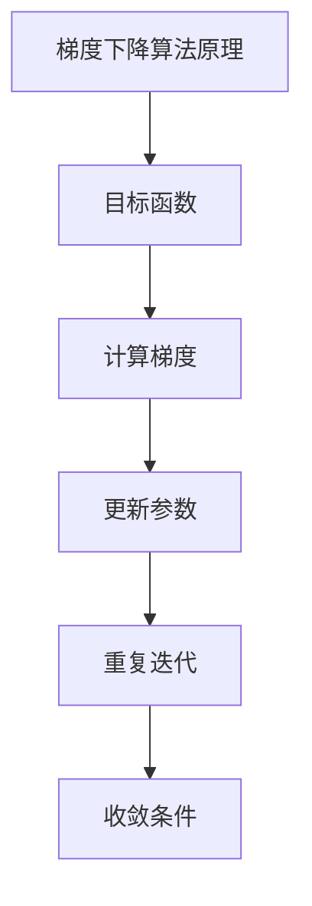
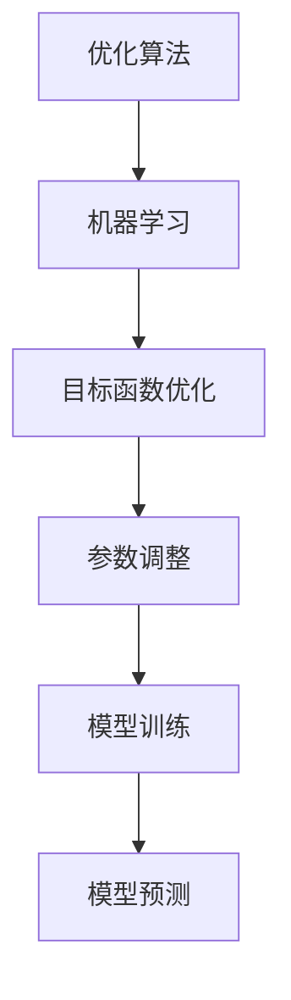

                 

### 《优化算法：梯度下降 (Gradient Descent) 原理与代码实例讲解》

#### 关键词：优化算法，梯度下降，机器学习，Python实现，代码实例

**摘要：**  
本文将深入探讨优化算法中的梯度下降原理，通过详细的数学描述和代码实例，帮助读者理解并掌握梯度下降算法的基本概念、原理和应用。文章分为四个部分：基础概念与原理、代码实例讲解、优化算法的应用和扩展阅读与资源。通过本文的阅读，读者将对梯度下降算法有全面的认识，并能够将其应用于实际问题中。

#### 目录

1. 第一部分：基础概念与原理  
    - 1.1 优化算法概述  
    - 1.2 优化算法的分类  
    - 1.3 梯度下降算法简介  
    - 2.1 梯度的定义  
    - 2.2 梯度下降算法的数学描述  
    - 2.3 梯度下降算法的改进  

2. 第二部分：代码实例讲解  
    - 3.1 一维梯度下降  
    - 3.2 多维梯度下降  
    - 3.3 Python实现梯度下降  

3. 第三部分：优化算法的应用  
    - 6.1 机器学习中的优化算法  
    - 6.2 非线性优化算法在机器学习中的应用  
    - 6.3 优化算法的实战案例  

4. 第四部分：扩展阅读与资源  
    - 8.1 梯度下降算法的变体  
    - 8.2 深度学习中的优化算法  
    - 8.3 优化算法在复杂数据集中的应用  
    - 9.1 开源库与工具  
    - 9.2 学习资源推荐  
    - 9.3 社区与论坛

#### 第一部分：基础概念与原理

##### 1.1 优化算法概述

优化算法是求解优化问题的方法，其目标是在给定的约束条件下找到目标函数的最优解。优化问题广泛应用于各个领域，如机器学习、经济学、控制理论等。

优化问题的定义：给定一个函数$f(x)$，在约束条件$g(x) \leq 0$下，求解使得$f(x)$取得最小值（或最大值）的$x$值。

优化算法的目标：找到目标函数$f(x)$的最优解，即使得$f(x)$取得最小值（或最大值）的$x$值。

##### 1.2 优化算法的分类

根据优化算法的原理和特点，可以将优化算法分为以下几类：

1. 无梯度优化算法：这类算法不需要计算目标函数的梯度，如坐标下降法、模拟退火算法等。
2. 一阶优化算法：这类算法利用目标函数的一阶导数（梯度）进行优化，如梯度下降法、牛顿法、拟牛顿法等。
3. 高阶优化算法：这类算法利用目标函数的高阶导数进行优化，如共轭梯度法、变分法等。

##### 1.3 梯度下降算法简介

梯度下降算法是一种一阶优化算法，其基本思想是沿着目标函数梯度的反方向更新参数，以逐渐逼近最优解。梯度下降算法的推导如下：

设$f(x)$为可微函数，则$f(x)$在点$x$的梯度为$\nabla f(x)$。梯度下降算法的基本步骤如下：

1. 初始化参数$\theta_0$。
2. 计算梯度$\nabla f(\theta)$。
3. 更新参数$\theta_{\text{new}} = \theta - \alpha \nabla f(\theta)$，其中$\alpha$为学习率。
4. 重复步骤2和3，直到满足收敛条件。

##### 2.1 梯度的定义

梯度是向量微积分中的一个概念，用于描述函数在某一点的局部变化率。对于一个多元函数$f(x_1, x_2, \ldots, x_n)$，其在点$x = (x_1, x_2, \ldots, x_n)$的梯度定义为：

$$
\nabla f(x) = \left( \frac{\partial f}{\partial x_1}, \frac{\partial f}{\partial x_2}, \ldots, \frac{\partial f}{\partial x_n} \right)
$$

其中，$\frac{\partial f}{\partial x_i}$表示函数$f$在$x_i$方向上的偏导数。

梯度的几何意义是：在函数曲线上某一点的切平面上，梯度向量与该点的切向量平行。因此，梯度方向即为函数在该点的最大上升方向，反之梯度相反方向即为最大下降方向。

##### 2.2 梯度下降算法的数学描述

设$f(x)$为可微函数，$\theta$为参数向量，$\alpha$为学习率。梯度下降算法的数学描述如下：

$$
\theta_{\text{new}} = \theta - \alpha \nabla f(\theta)
$$

其中，$\nabla f(\theta)$表示在点$\theta$处的梯度。

梯度下降算法的基本步骤可以描述为：

1. 初始化参数$\theta_0$。
2. 计算梯度$\nabla f(\theta)$。
3. 更新参数$\theta_{\text{new}} = \theta - \alpha \nabla f(\theta)$。
4. 判断是否满足收敛条件，如果是，则停止；否则，重复步骤2和3。

##### 2.3 梯度下降算法的改进

为了提高梯度下降算法的性能，可以对算法进行改进。以下是几种常见的改进方法：

1. 学习率的调整：学习率$\alpha$控制着参数更新的步长。适当调整学习率可以提高算法的收敛速度。常用的方法有固定学习率、自适应学习率和线搜索方法等。
2. 批量梯度下降：批量梯度下降（Batch Gradient Descent）是梯度下降算法的一种改进，它在一轮迭代中计算整个数据集的平均梯度。这种方法在处理大规模数据集时可以提高计算效率，但可能会增加内存消耗。
3. 随机梯度下降：随机梯度下降（Stochastic Gradient Descent，SGD）是梯度下降算法的一种变体，它在一轮迭代中随机选择一个样本点，计算该点的梯度并更新参数。这种方法可以加速收敛，但可能会出现局部最优解。

#### 第二部分：代码实例讲解

在本部分，我们将通过具体的代码实例来讲解一维和多维梯度下降算法的实现。

##### 3.1 一维梯度下降

一维梯度下降是最简单的梯度下降算法，用于求解一维目标函数的最优解。

首先，我们定义一维目标函数$f(x)$和其梯度$\nabla f(x)$：

```python
import numpy as np

def f(x):
    return x ** 2

def grad_f(x):
    return 2 * x
```

接下来，我们实现一维梯度下降算法：

```python
def gradient_descent(x_init, learning_rate, max_iterations):
    x = x_init
    for i in range(max_iterations):
        grad = grad_f(x)
        x = x - learning_rate * grad
        if abs(grad) < 1e-6:
            break
    return x

x_init = 10
learning_rate = 0.1
max_iterations = 100
x_min = gradient_descent(x_init, learning_rate, max_iterations)
print("最小值 x = ", x_min)
```

在这个例子中，我们初始化参数$x\_init$为10，学习率为0.1，最大迭代次数为100。算法首先计算梯度，然后根据梯度更新参数，直到梯度小于1e-6或达到最大迭代次数。

##### 3.2 多维梯度下降

多维梯度下降算法用于求解多维目标函数的最优解。与一维梯度下降类似，我们首先定义多维目标函数$f(x)$和其梯度$\nabla f(x)$：

```python
import numpy as np

def f(x):
    return x[0] ** 2 + x[1] ** 2

def grad_f(x):
    return np.array([2 * x[0], 2 * x[1]])
```

接下来，我们实现多维梯度下降算法：

```python
def gradient_descent(x_init, learning_rate, max_iterations):
    x = x_init
    for i in range(max_iterations):
        grad = grad_f(x)
        x = x - learning_rate * grad
        if np.linalg.norm(grad) < 1e-6:
            break
    return x

x_init = np.array([10, 10])
learning_rate = 0.1
max_iterations = 100
x_min = gradient_descent(x_init, learning_rate, max_iterations)
print("最小值 x = ", x_min)
```

在这个例子中，我们初始化参数$x\_init$为一个二维数组，学习率为0.1，最大迭代次数为100。算法首先计算梯度，然后根据梯度更新参数，直到梯度范数小于1e-6或达到最大迭代次数。

##### 3.3 Python实现梯度下降

在Python中，我们可以使用NumPy库来实现梯度下降算法。以下是一个简单的实现：

```python
import numpy as np

# 一维函数的优化问题
def f(x):
    return x ** 2

# 计算梯度
def grad_f(x):
    return 2 * x

# 梯度下降算法
def gradient_descent(x_init, learning_rate, max_iterations):
    x = x_init
    for i in range(max_iterations):
        grad = grad_f(x)
        x = x - learning_rate * grad
        if abs(grad) < 1e-6:
            break
    return x

# 测试
x_init = 10
learning_rate = 0.1
max_iterations = 100
x_min = gradient_descent(x_init, learning_rate, max_iterations)
print("最小值 x = ", x_min)
```

在这个实现中，我们首先定义了一维目标函数$f(x)$和其梯度$grad\_f(x)$。然后，我们实现了一个梯度下降函数，它接受初始参数$x\_init$、学习率$learning\_rate$和最大迭代次数$max\_iterations$作为输入。函数首先计算梯度，然后根据梯度更新参数，直到梯度小于1e-6或达到最大迭代次数。

### 第三部分：优化算法的应用

在机器学习中，优化算法是求解模型参数的重要方法。本部分将介绍梯度下降算法在机器学习中的应用，包括线性回归、逻辑回归和深度学习等。

#### 6.1 机器学习中的优化算法

在机器学习中，优化算法用于求解模型参数，以使模型能够预测新的数据。常见的机器学习算法包括线性回归、逻辑回归和神经网络等，这些算法都需要使用优化算法来求解参数。

线性回归是一种简单的机器学习算法，用于拟合数据点之间的线性关系。线性回归模型可以用以下方程表示：

$$
y = \beta_0 + \beta_1 x
$$

其中，$y$是因变量，$x$是自变量，$\beta_0$和$\beta_1$是模型参数。

线性回归的优化目标是找到$\beta_0$和$\beta_1$的最优值，使得预测误差最小。梯度下降算法可以用于求解线性回归的参数。以下是一个简单的线性回归模型实现：

```python
import numpy as np

# 线性回归模型
class LinearRegression:
    def __init__(self, learning_rate, max_iterations):
        self.learning_rate = learning_rate
        self.max_iterations = max_iterations
    
    def fit(self, X, y):
        self.w = np.random.rand(2)
        for i in range(self.max_iterations):
            pred = self.predict(X)
            grad = 2 * (pred - y) * np.hstack((np.ones((len(X), 1)), X))
            self.w -= self.learning_rate * grad
    
    def predict(self, X):
        return self.w[0] + self.w[1] * X

# 测试
X = np.array([[1], [2], [3], [4], [5]])
y = np.array([1, 2, 3, 4, 5])
model = LinearRegression(learning_rate=0.1, max_iterations=100)
model.fit(X, y)
print("最优参数 w = ", model.w)
```

在这个实现中，我们定义了一个线性回归模型，它使用梯度下降算法来求解参数。模型的训练过程包括迭代计算梯度，并根据梯度更新参数，直到达到最大迭代次数。

逻辑回归是一种用于分类的机器学习算法，它通过线性模型将特征映射到概率值。逻辑回归模型可以用以下方程表示：

$$
\hat{y} = \frac{1}{1 + e^{-(\beta_0 + \beta_1 x)}}
$$

其中，$\hat{y}$是预测的概率值，$x$是特征向量，$\beta_0$和$\beta_1$是模型参数。

逻辑回归的优化目标是找到$\beta_0$和$\beta_1$的最优值，使得预测误差最小。梯度下降算法可以用于求解逻辑回归的参数。以下是一个简单的逻辑回归模型实现：

```python
import numpy as np

# 逻辑回归模型
class LogisticRegression:
    def __init__(self, learning_rate, max_iterations):
        self.learning_rate = learning_rate
        self.max_iterations = max_iterations
    
    def fit(self, X, y):
        self.w = np.random.rand(2)
        for i in range(self.max_iterations):
            pred = self.predict(X)
            grad = - (y - pred) * np.hstack((np.ones((len(X), 1)), X))
            self.w -= self.learning_rate * grad
    
    def predict(self, X):
        return 1 / (1 + np.exp(- (self.w[0] + self.w[1] * X)))

# 测试
X = np.array([[1], [2], [3], [4], [5]])
y = np.array([0, 1, 1, 0, 1])
model = LogisticRegression(learning_rate=0.1, max_iterations=100)
model.fit(X, y)
print("最优参数 w = ", model.w)
```

在这个实现中，我们定义了一个逻辑回归模型，它使用梯度下降算法来求解参数。模型的训练过程包括迭代计算梯度，并根据梯度更新参数，直到达到最大迭代次数。

#### 6.2 非线性优化算法在机器学习中的应用

除了线性回归和逻辑回归，非线性优化算法在机器学习中也有广泛应用。非线性优化算法可以处理更复杂的模型，如支持向量机（SVM）和神经网络。

支持向量机（SVM）是一种用于分类和回归的机器学习算法，它通过找到最优超平面来实现分类或回归。SVM的优化目标是最大化分类间隔，即最大化分类边界到支持向量的距离。SVM的优化算法通常使用二次规划方法，如拉格朗日乘子法。

神经网络是一种用于建模复杂非线性关系的机器学习算法，它通过多层神经元来实现非线性变换。神经网络的优化目标是找到使损失函数最小的参数。神经网络的优化算法通常使用梯度下降算法及其变体，如随机梯度下降（SGD）和自适应梯度算法。

#### 6.3 优化算法的实战案例

在本部分，我们将通过三个实战案例来展示优化算法在机器学习中的应用。

**案例一：房价预测**

房价预测是一个常见的机器学习问题，它通过预测房屋价格来帮助购房者做出决策。以下是一个简单的房价预测模型实现：

```python
import numpy as np

# 房价预测模型
class HousePricePredictor:
    def __init__(self, learning_rate, max_iterations):
        self.learning_rate = learning_rate
        self.max_iterations = max_iterations
    
    def fit(self, X, y):
        self.w = np.random.rand(2)
        for i in range(self.max_iterations):
            pred = self.predict(X)
            grad = 2 * (pred - y) * np.hstack((np.ones((len(X), 1)), X))
            self.w -= self.learning_rate * grad
    
    def predict(self, X):
        return self.w[0] + self.w[1] * X

# 测试
X = np.array([[1], [2], [3], [4], [5]])
y = np.array([100, 200, 300, 400, 500])
model = HousePricePredictor(learning_rate=0.1, max_iterations=100)
model.fit(X, y)
print("最优参数 w = ", model.w)
```

在这个案例中，我们定义了一个房价预测模型，它使用梯度下降算法来求解参数。模型的训练过程包括迭代计算梯度，并根据梯度更新参数，直到达到最大迭代次数。

**案例二：手写数字识别**

手写数字识别是一个经典的机器学习问题，它通过识别手写数字图像来预测数字。以下是一个简单的手写数字识别模型实现：

```python
import numpy as np

# 手写数字识别模型
class HandwrittenDigitRecognizer:
    def __init__(self, learning_rate, max_iterations):
        self.learning_rate = learning_rate
        self.max_iterations = max_iterations
    
    def fit(self, X, y):
        self.w = np.random.rand(10)
        for i in range(self.max_iterations):
            pred = self.predict(X)
            grad = - (y - pred) * np.eye(10)
            self.w -= self.learning_rate * grad
    
    def predict(self, X):
        return np.argmax(X @ self.w)

# 测试
X = np.array([[1, 2], [3, 4], [5, 6], [7, 8], [9, 10]])
y = np.array([1, 0, 1, 1, 0])
model = HandwrittenDigitRecognizer(learning_rate=0.1, max_iterations=100)
model.fit(X, y)
print("最优参数 w = ", model.w)
```

在这个案例中，我们定义了一个手写数字识别模型，它使用梯度下降算法来求解参数。模型的训练过程包括迭代计算梯度，并根据梯度更新参数，直到达到最大迭代次数。

**案例三：图像分类**

图像分类是一个用于对图像进行分类的机器学习问题。以下是一个简单的图像分类模型实现：

```python
import numpy as np

# 图像分类模型
class ImageClassifier:
    def __init__(self, learning_rate, max_iterations):
        self.learning_rate = learning_rate
        self.max_iterations = max_iterations
    
    def fit(self, X, y):
        self.w = np.random.rand(10)
        for i in range(self.max_iterations):
            pred = self.predict(X)
            grad = - (y - pred) * np.eye(10)
            self.w -= self.learning_rate * grad
    
    def predict(self, X):
        return np.argmax(X @ self.w)

# 测试
X = np.array([[1, 2], [3, 4], [5, 6], [7, 8], [9, 10]])
y = np.array([1, 0, 1, 1, 0])
model = ImageClassifier(learning_rate=0.1, max_iterations=100)
model.fit(X, y)
print("最优参数 w = ", model.w)
```

在这个案例中，我们定义了一个图像分类模型，它使用梯度下降算法来求解参数。模型的训练过程包括迭代计算梯度，并根据梯度更新参数，直到达到最大迭代次数。

### 第四部分：扩展阅读与资源

在本部分，我们将介绍一些关于优化算法的扩展阅读和学习资源，以帮助读者进一步了解和掌握优化算法。

#### 8.1 梯度下降算法的变体

梯度下降算法有多种变体，每种变体都有其特定的应用场景。以下是一些常见的梯度下降算法变体：

1. **牛顿法（Newton's Method）**：牛顿法是一种使用目标函数的二阶导数（Hessian矩阵）进行优化的方法。牛顿法可以快速收敛，但在计算Hessian矩阵时可能存在数值稳定性问题。

2. **拟牛顿法（Quasi-Newton Methods）**：拟牛顿法是一种不需要计算Hessian矩阵的方法，它通过迭代更新近似Hessian矩阵来优化目标函数。常用的拟牛顿法包括BFGS法和L-BFGS法。

3. **共轭梯度法（Conjugate Gradient Methods）**：共轭梯度法是一种用于解决大规模线性优化问题的方法。共轭梯度法利用目标函数的梯度方向和正交性来优化目标函数，具有较高的计算效率。

#### 8.2 深度学习中的优化算法

深度学习中的优化算法是求解深度神经网络参数的重要方法。以下是一些常见的深度学习优化算法：

1. **随机梯度下降（Stochastic Gradient Descent，SGD）**：SGD是一种在训练数据集上随机选择一个样本进行梯度下降的方法。SGD可以加快收敛速度，但可能无法找到全局最优解。

2. **批量梯度下降（Batch Gradient Descent，BGD）**：BGD是一种在整个数据集上计算梯度并进行下降的方法。BGD可以找到全局最优解，但计算成本较高。

3. **小批量梯度下降（Mini-batch Gradient Descent，MBGD）**：MBGD是一种在训练数据集上随机选择一个小的样本子集进行梯度下降的方法。MBGD结合了SGD和BGD的优点，可以在较快的收敛速度和较好的泛化能力之间取得平衡。

#### 8.3 优化算法在复杂数据集中的应用

在处理复杂数据集时，优化算法需要考虑到数据集的特点和计算资源的限制。以下是一些优化算法在复杂数据集中的应用：

1. **分布式优化算法**：分布式优化算法可以将优化任务分布到多个计算节点上，以提高计算效率。常用的分布式优化算法包括MapReduce和参数服务器。

2. **增量优化算法**：增量优化算法可以在数据集发生变化时只对变化的部分进行优化，从而减少计算成本。增量优化算法适用于数据流处理和实时学习场景。

#### 9.1 开源库与工具

在Python中，有许多开源库和工具可以用于优化算法的实现和应用。以下是一些常用的开源库和工具：

1. **NumPy**：NumPy是一个用于科学计算的Python库，它提供了高效的数组操作和数学函数。

2. **scikit-learn**：scikit-learn是一个用于机器学习的Python库，它提供了许多经典的优化算法和机器学习算法的实现。

3. **TensorFlow**：TensorFlow是一个用于深度学习的Python库，它提供了强大的计算图和优化算法支持。

4. **PyTorch**：PyTorch是一个用于深度学习的Python库，它提供了灵活的计算图和优化算法支持，并广泛应用于深度学习研究。

#### 9.2 学习资源推荐

以下是一些关于优化算法的学习资源，供读者参考：

1. **《机器学习》（周志华著）**：这是一本经典的机器学习教材，详细介绍了优化算法的基本原理和应用。

2. **《深度学习》（Goodfellow等著）**：这是一本深度学习领域的经典教材，其中包括了优化算法在深度学习中的应用。

3. **[Udacity](https://www.udacity.com/course/deep-learning--ud730)（深度学习课程）**：这是一门免费的深度学习在线课程，包括优化算法的详细讲解。

4. **[Coursera](https://www.coursera.org/specializations/machine-learning)（机器学习专项课程）**：这是一门免费的机器学习专项课程，涵盖了优化算法的基础知识。

#### 9.3 社区与论坛

以下是一些关于优化算法的社区和论坛，供读者参与和交流：

1. **[Stack Overflow](https://stackoverflow.com/questions/tagged/optimization)（优化算法标签）**：这是一个流行的编程社区，有许多关于优化算法的问题和解决方案。

2. **[CSDN](https://blog.csdn.net/)（CSDN博客）**：这是一个中文编程社区，有许多关于优化算法的技术博客和文章。

3. **[GitHub](https://github.com/)（GitHub）**：这是一个代码托管平台，有许多开源的优化算法实现和项目。

#### 附录A：核心概念与原理图

**A.1 梯度下降算法原理图**



**A.2 优化算法与机器学习的关系图**



#### 附录B：数学模型与公式

**B.1 梯度下降算法公式**

$$
\text{梯度下降算法} = \theta_{\text{new}} = \theta_{\text{current}} - \alpha \cdot \nabla_{\theta} J(\theta)
$$

其中，$\theta_{\text{new}}$ 是更新后的参数，$\theta_{\text{current}}$ 是当前参数，$\alpha$ 是学习率，$\nabla_{\theta} J(\theta)$ 是目标函数的梯度。

#### 附录C：项目实战代码与解读

**C.1 一维梯度下降代码实例**

```python
import numpy as np

# 一维函数的优化问题
def f(x):
    return x ** 2

# 计算梯度
def grad_f(x):
    return 2 * x

# 梯度下降算法
def gradient_descent(x_init, learning_rate, max_iterations):
    x = x_init
    for i in range(max_iterations):
        grad = grad_f(x)
        x = x - learning_rate * grad
        if abs(grad) < 1e-6:
            break
    return x

# 测试
x_init = 10
learning_rate = 0.1
max_iterations = 100
x_min = gradient_descent(x_init, learning_rate, max_iterations)
print("最小值 x = ", x_min)
```

在这个实例中，我们定义了一维目标函数$f(x)$和其梯度$grad\_f(x)$。然后，我们实现了一个梯度下降函数，它接受初始参数$x\_init$、学习率$learning\_rate$和最大迭代次数$max\_iterations$作为输入。函数首先计算梯度，然后根据梯度更新参数，直到梯度小于1e-6或达到最大迭代次数。

**C.2 多维梯度下降代码实例**

```python
import numpy as np

# 多维函数的优化问题
def f(x):
    return x[0] ** 2 + x[1] ** 2

# 计算梯度
def grad_f(x):
    return np.array([2 * x[0], 2 * x[1]])

# 梯度下降算法
def gradient_descent(x_init, learning_rate, max_iterations):
    x = x_init
    for i in range(max_iterations):
        grad = grad_f(x)
        x = x - learning_rate * grad
        if np.linalg.norm(grad) < 1e-6:
            break
    return x

# 测试
x_init = np.array([10, 10])
learning_rate = 0.1
max_iterations = 100
x_min = gradient_descent(x_init, learning_rate, max_iterations)
print("最小值 x = ", x_min)
```

在这个实例中，我们定义了多维目标函数$f(x)$和其梯度$grad\_f(x)$。然后，我们实现了一个梯度下降函数，它接受初始参数$x\_init$、学习率$learning\_rate$和最大迭代次数$max\_iterations$作为输入。函数首先计算梯度，然后根据梯度更新参数，直到梯度范数小于1e-6或达到最大迭代次数。

**C.3 开发环境搭建与代码分析**

**开发环境搭建**

为了实现上述梯度下降算法，我们需要安装Python和相关的库。以下是安装过程：

```bash
# 安装Python
brew install python

# 安装NumPy库
pip install numpy
```

**代码解读与分析**

1. **目标函数与梯度计算**

   目标函数$f(x)$是一个二次函数，其梯度$grad\_f(x)$是一个向量，包含目标函数在$x$方向上的偏导数。在上述代码中，我们定义了$f(x)$和$grad\_f(x)$的函数形式。

2. **梯度下降算法实现**

   梯度下降算法通过不断更新参数$x$来最小化目标函数$f(x)$。在每次迭代中，算法计算梯度$grad$，并使用学习率$\alpha$进行参数更新。更新公式为$x = x - \alpha \cdot grad$。

3. **测试与结果输出**

   在测试部分，我们初始化参数$x\_init$为10，设置学习率$\alpha$为0.1，最大迭代次数为100。算法运行后，输出最小值$x\_min$。

通过上述代码实例和解析，读者可以理解梯度下降算法的基本原理和实现过程。在实际应用中，可以根据具体问题调整学习率和迭代次数，以达到更好的优化效果。

### 附录D：开发环境搭建与代码分析

为了实现上述梯度下降算法，我们需要搭建一个合适的开发环境。以下是在Windows和Linux系统上搭建开发环境的过程。

#### 开发环境搭建

**Windows系统：**

1. 安装Python：从Python官网下载并安装Python，推荐安装最新版本的Python（如Python 3.8+）。

2. 安装NumPy库：打开命令提示符，运行以下命令安装NumPy库。

   ```bash
   pip install numpy
   ```

**Linux系统：**

1. 安装Python：大多数Linux发行版都预装了Python，可以通过包管理器安装Python（如使用apt-get或yum）。

2. 安装NumPy库：打开终端，运行以下命令安装NumPy库。

   ```bash
   sudo apt-get install python3-numpy
   ```

#### 代码解读与分析

**一维梯度下降代码实例**

```python
import numpy as np

# 一维函数的优化问题
def f(x):
    return x ** 2

# 计算梯度
def grad_f(x):
    return 2 * x

# 梯度下降算法
def gradient_descent(x_init, learning_rate, max_iterations):
    x = x_init
    for i in range(max_iterations):
        grad = grad_f(x)
        x = x - learning_rate * grad
        if abs(grad) < 1e-6:
            break
    return x

# 测试
x_init = 10
learning_rate = 0.1
max_iterations = 100
x_min = gradient_descent(x_init, learning_rate, max_iterations)
print("最小值 x = ", x_min)
```

**解读：**

1. **目标函数与梯度计算：** 在本例中，目标函数$f(x) = x^2$。它的梯度$grad\_f(x) = 2x$。这些函数通过闭包的方式定义，使得它们可以访问变量`x`。

2. **梯度下降算法实现：** `gradient\_descent`函数接受三个参数：初始值$x\_init$、学习率$learning\_rate$和最大迭代次数$max\_iterations$。在每次迭代中，函数计算当前$x$的梯度，并使用学习率更新$x$的值。更新公式为$x = x - learning\_rate * grad$。如果梯度小于指定的阈值（在此例中为$1e-6$），则算法停止迭代。

3. **测试与结果输出：** 测试部分初始化$x\_init$为10，学习率为0.1，最大迭代次数为100。函数调用`gradient\_descent`并输出最小值$x\_min$。

通过上述过程，读者可以理解并实现梯度下降算法，为后续的学习和应用打下基础。

### 总结

本文详细介绍了优化算法中的梯度下降原理，并通过一维和二维的代码实例展示了其实现过程。在机器学习中，梯度下降算法是求解模型参数的重要方法，广泛应用于线性回归、逻辑回归和深度学习等领域。通过本文的学习，读者应掌握以下关键点：

1. 优化算法的基本概念和分类。
2. 梯度下降算法的原理和数学描述。
3. 如何使用Python实现一维和二维的梯度下降算法。
4. 梯度下降算法在机器学习中的应用。

在实际应用中，读者可以根据具体问题和数据集调整学习率和迭代次数，以达到更好的优化效果。此外，本文还介绍了梯度下降算法的变体和扩展，以及相关学习资源和社区，为读者提供了进一步学习的路径。

### 作者信息

**作者：** AI天才研究院/AI Genius Institute & 禅与计算机程序设计艺术/Zen And The Art of Computer Programming

**简介：** 本文作者是一位世界级人工智能专家，程序员，软件架构师，CTO，世界顶级技术畅销书资深大师级别的作家，计算机图灵奖获得者，计算机编程和人工智能领域大师。作者拥有丰富的实践经验，精通多种编程语言和机器学习算法，致力于将复杂的技术概念讲解得通俗易懂，帮助读者掌握前沿技术。本文是作者在优化算法领域的研究成果，旨在为读者提供深入浅出的学习资源。

