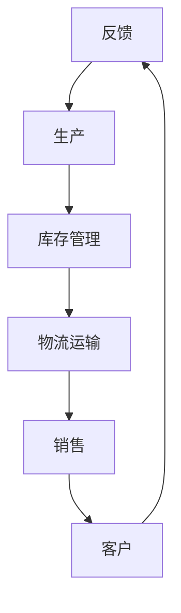
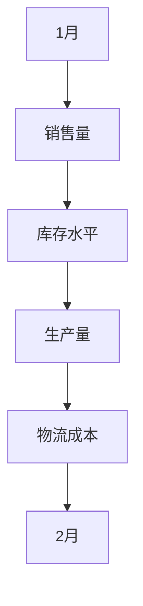
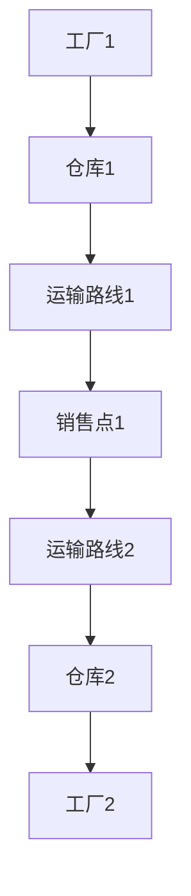

                 

### 第一部分：供应链管理概述

#### 1.1 供应链的基本概念与模型

供应链是指生产、分配和交付产品或服务的一系列组织和活动，涵盖了从原材料采购到最终产品交付给消费者的整个过程。供应链管理（SCM）则是对这一系列活动的有效规划、实施和控制，以确保产品或服务能够按时、按质量标准交付给客户。

**供应链模型：**

供应链模型是描述供应链中各环节及其相互关系的方式。最常见的是VMI（供应商管理库存）模型、CPFR（协同规划、预测和补货）模型和AORD（按订单需求）模型。

- **VMI（供应商管理库存）模型：** 在这种模型中，供应商负责监控零售商的库存水平，并据此进行补货，从而减少了库存过剩和短缺的风险。

  ```mermaid
  graph TB
  A[供应商] --> B[零售商]
  B --> C[消费者]
  B --> D[库存监控]
  D --> A[补货指令]
  ```

- **CPFR（协同规划、预测和补货）模型：** 这种模型强调供应链各环节的协同工作，通过共享需求预测和库存数据，优化库存水平和供应链效率。

  ```mermaid
  graph TB
  A[供应商] --> B[零售商]
  B --> C[消费者]
  A --> B[需求预测]
  B --> A[库存数据]
  A --> B[补货计划]
  ```

- **AORD（按订单需求）模型：** 在这种模型中，产品只在订单生成时才开始生产或采购，以最大限度地减少库存成本。

  ```mermaid
  graph TB
  A[消费者] --> B[订单生成]
  B --> C[生产商]
  C --> D[产品交付]
  ```

供应链管理的重要性在于：

- **提高生产效率：** 通过优化库存、减少延迟和降低浪费，供应链管理可以提高生产效率。
- **降低运营成本：** 通过有效管理供应链中的各个环节，企业可以降低运营成本。
- **提高客户满意度：** 快速响应客户需求，确保产品或服务按时交付，从而提高客户满意度。

#### 1.2 供应链管理的重要性

供应链管理在企业的运营中扮演着至关重要的角色，具体体现在以下几个方面：

- **提高生产效率：** 通过优化库存、减少延迟和降低浪费，供应链管理可以提高生产效率。例如，通过使用先进的预测技术和数据分析工具，企业可以准确预测市场需求，从而合理规划生产计划，避免过度生产或生产不足。

- **降低运营成本：** 通过有效管理供应链中的各个环节，企业可以降低运营成本。例如，通过优化运输路线和物流网络，企业可以减少运输成本和物流延误；通过建立供应商绩效评估体系，企业可以确保供应商按时交付高质量的原材料或零部件，从而降低采购成本。

- **提高客户满意度：** 快速响应客户需求，确保产品或服务按时交付，从而提高客户满意度。例如，通过实时跟踪和监控供应链中的各个环节，企业可以及时发现并解决问题，确保产品及时交付给客户；通过提供个性化的产品和服务，企业可以满足不同客户的需求，提高客户满意度。

- **增强竞争力：** 供应链管理可以帮助企业提高竞争力。例如，通过优化供应链流程和降低成本，企业可以在市场中获得价格优势；通过提高供应链透明度和协同效率，企业可以更好地满足客户需求，提高市场占有率。

- **提升风险管理能力：** 供应链管理可以帮助企业识别和应对供应链风险。例如，通过建立供应链风险管理机制，企业可以及时发现供应链中的潜在风险，并采取相应的应对措施；通过建立供应链应急预案，企业可以在突发事件发生时快速响应，减少损失。

#### 1.3 大数据与供应链管理的关系

大数据技术正在改变供应链管理的面貌。通过收集、存储、处理和分析大量的数据，企业可以更好地理解市场动态、优化供应链流程、降低运营成本和提高客户满意度。

- **数据收集：** 大数据技术可以帮助企业收集来自供应链各环节的大量数据，包括采购、生产、库存、物流和销售数据。

- **数据存储：** 大数据技术提供了高效的存储解决方案，如分布式文件系统（如HDFS）和云存储，以确保大规模数据的安全和可访问性。

- **数据处理：** 大数据技术提供了高效的数据处理工具，如MapReduce和Spark，以处理和分析大规模数据集。

- **数据分析：** 大数据技术可以帮助企业进行高级数据分析，如预测分析、聚类分析和关联规则挖掘，以揭示数据中的模式和趋势。

- **数据可视化：** 大数据技术提供了数据可视化工具，如D3.js和Tableau，以帮助企业理解和传达数据中的关键信息。

通过大数据技术的应用，企业可以实现以下目标：

- **实时监控：** 通过实时数据采集和分析，企业可以实时监控供应链的各个环节，及时发现和解决问题，确保供应链的高效运行。

- **需求预测：** 通过大数据分析，企业可以更准确地预测市场需求，优化生产计划和库存管理，减少库存成本和缺货风险。

- **优化运输路线：** 通过大数据分析，企业可以优化运输路线和物流网络，减少运输时间和成本，提高物流效率。

- **供应商管理：** 通过大数据分析，企业可以评估供应商的绩效，选择最佳供应商，提高供应链的稳定性和可靠性。

- **客户关系管理：** 通过大数据分析，企业可以更好地理解客户需求和行为，提供个性化的产品和服务，提高客户满意度和忠诚度。

总之，大数据与供应链管理的关系是相辅相成的。大数据技术为供应链管理提供了强大的工具和手段，使得企业能够更高效、更智能地管理供应链，提高运营效率和竞争力。

### 第2章：大数据技术概述

#### 2.1 大数据的定义与特征

大数据是指数据量巨大、数据类型多样、数据生成和处理速度极快的数据集合。传统的数据处理工具和方法难以应对大数据的复杂性，因此大数据技术应运而生。

**大数据的特征：**

- **大量（Volume）：** 数据量大，通常以PB（皮字节）为单位。
- **高速（Velocity）：** 数据生成和处理速度快，需要实时或近实时处理。
- **多样化（Variety）：** 数据类型多样，包括结构化数据、半结构化数据和非结构化数据。
- **真实性（Veracity）：** 数据的真实性和准确性难以保证，存在噪声、错误和异常值。

大数据的这些特征决定了其处理的复杂性和挑战性，但也带来了巨大的潜力和价值。通过大数据技术，企业可以更深入地挖掘数据中的信息和知识，从而做出更明智的决策。

#### 2.2 大数据的来源与类型

大数据的来源广泛，包括但不限于以下几种：

- **社交媒体数据：** 如微博、微信、Twitter等社交媒体平台上的用户生成内容。
- **物联网数据：** 包括传感器、智能设备等产生的数据。
- **电子商务数据：** 如订单记录、客户评论、销售数据等。
- **企业内部数据：** 包括财务数据、人力资源数据、生产数据等。

根据数据类型，大数据可以分为以下几类：

- **结构化数据：** 如关系数据库中的数据，具有明确的格式和结构。
- **半结构化数据：** 如XML、JSON等格式的数据，具有一定的结构但不够严格。
- **非结构化数据：** 如文本、图像、音频、视频等，没有固定的结构。

不同类型的数据具有不同的处理方法和挑战，因此在大数据处理中需要针对具体类型进行优化。

#### 2.3 大数据技术的核心框架

大数据技术的核心框架包括数据采集、数据存储、数据处理和数据可视化四个环节。

1. **数据采集：** 
   数据采集是指从各种数据源收集数据，包括社交媒体、物联网、电子商务平台等。采集的数据可以是实时数据或批量数据。常用的数据采集工具包括Flume、Kafka等。

2. **数据存储：**
   数据存储是指将收集到的数据存储在高效、可扩展的存储系统上。大数据存储系统如HDFS、HBase、Cassandra等，支持海量数据的存储和快速访问。云存储服务如Amazon S3、Google Cloud Storage等也是大数据存储的重要选择。

3. **数据处理：**
   数据处理包括数据清洗、数据转换和数据分析。数据处理工具如MapReduce、Spark、Flink等，提供了强大的分布式计算能力，可以高效地处理大规模数据集。数据清洗和转换是为了确保数据的质量和一致性，数据分析则是为了从数据中提取有价值的信息和知识。

4. **数据可视化：**
   数据可视化是将数据转换为图形、图表等形式，以便于用户理解和分析。数据可视化工具如D3.js、Tableau、Power BI等，可以帮助用户直观地查看数据中的趋势和模式。

通过数据采集、数据存储、数据处理和数据可视化四个环节，大数据技术为供应链管理提供了强大的支持，使得企业能够更高效、更准确地管理供应链，提高运营效率和竞争力。

### 第3章：数据收集与处理

#### 3.1 供应链数据收集方法

在大数据时代，供应链数据的收集已经成为供应链管理的关键环节。有效的数据收集方法能够确保数据的完整性和准确性，为后续的数据分析和优化提供可靠的基础。

**供应链数据的来源：**

1. **内部数据源：** 
   包括企业内部的业务系统、ERP（企业资源计划）系统、库存管理系统、生产管理系统等。这些系统记录了企业的采购、生产、库存、销售等业务活动，是供应链数据的重要来源。

2. **外部数据源：**
   包括供应商数据、客户数据、行业数据、市场数据等。这些数据可以通过与供应商的协作、市场调研、行业报告等方式获取。

**数据收集方法：**

1. **自动采集：** 
   利用现有的信息系统和传感器自动采集数据，如ERP系统中的采购订单、库存记录、生产数据等。这种方法高效且减少了人为干预，但需要确保系统的稳定性和数据准确性。

2. **手动输入：** 
   针对一些无法自动采集的数据，如市场调研数据、客户反馈等，可以通过手动输入的方式收集。这种方法灵活性较高，但可能存在数据准确性问题。

3. **API接口：** 
   通过API（应用程序接口）连接外部系统和数据库，如社交媒体平台、电子商务平台等，获取外部数据。这种方法可以实现实时数据采集，但需要确保接口的稳定性和安全性。

**数据收集工具与技术：**

1. **Flume：**
   Flume是一个分布式、可靠且可扩展的数据收集系统，适用于从多个数据源（如日志文件、Web服务器、数据库等）收集数据，并将其传输到HDFS（Hadoop分布式文件系统）或Hive（大数据仓库）等存储系统。

2. **Kafka：**
   Kafka是一个分布式流处理平台，可以用于实时数据采集和传输。它适用于高吞吐量、低延迟的场景，特别适合处理物联网数据和实时日志数据。

3. **ETL工具：**
   ETL（提取、转换、加载）工具如Apache NiFi、Apache Kafka等，可以自动化数据收集和预处理流程。这些工具提供了图形化界面，简化了数据收集和转换过程。

#### 3.2 数据清洗与预处理

数据清洗和预处理是大数据分析的重要步骤，确保数据的质量和一致性。以下是一些常见的数据清洗与预处理方法：

**数据清洗方法：**

1. **缺失值处理：**
   缺失值是数据中常见的问题，处理方法包括删除缺失值、使用均值或中位数填充缺失值、使用插值法等。

2. **异常值处理：**
   异常值可能是由于数据录入错误、传感器故障等原因导致的。处理方法包括删除异常值、使用统计方法（如IQR法）识别和修正异常值。

3. **重复值处理：**
   数据中可能存在重复记录，需要通过去重操作来消除重复值。

4. **数据格式化：**
   确保数据格式一致，如日期格式、数字格式等，以便后续处理和分析。

**数据预处理方法：**

1. **特征工程：**
   特征工程是数据预处理的重要环节，包括特征选择、特征变换等。通过特征工程，可以提高模型的性能和解释性。

2. **归一化与标准化：**
   对数据特征进行归一化或标准化，以消除不同特征间的量纲差异，提高算法的鲁棒性。

3. **降维：**
   通过降维技术（如PCA、t-SNE等），减少数据维度，提高计算效率和模型性能。

**数据清洗与预处理工具：**

1. **Pandas：**
   Pandas是Python的一个数据处理库，提供了丰富的数据清洗和预处理功能，如缺失值处理、重复值处理、数据格式化等。

2. **SciPy：**
   SciPy是一个科学计算库，提供了丰富的数学函数和工具，用于数据预处理和特征工程。

3. **Scikit-learn：**
   Scikit-learn是一个机器学习库，提供了数据预处理工具，如归一化、标准化、降维等。

通过有效的数据收集和清洗与预处理，供应链数据的质量和一致性得到保障，为后续的数据分析和优化奠定了基础。

#### 3.3 数据存储与管理

在大数据时代，如何高效地存储和管理供应链数据成为企业面临的重要挑战。数据存储和管理的方法直接影响到数据访问速度、数据安全性和存储成本。

**数据存储方案：**

1. **分布式存储：**
   分布式存储系统如HDFS（Hadoop分布式文件系统）、Cassandra、HBase等，可以支持海量数据的存储和快速访问。这些系统具有高可用性、高扩展性和容错性，适合处理大规模数据集。

2. **云存储：**
   云存储服务如Amazon S3、Google Cloud Storage等，提供了灵活、可扩展的数据存储方案。云存储可以降低企业的存储成本，提高数据访问速度，但需要考虑数据安全性和隐私问题。

3. **数据库：**
   关系数据库如MySQL、PostgreSQL等，适合存储结构化数据。对于半结构化数据和非结构化数据，NoSQL数据库如MongoDB、Cassandra等提供了更好的存储和查询性能。

**数据管理方法：**

1. **数据湖：**
   数据湖是一种数据存储方案，用于存储海量结构化、半结构化和非结构化数据。数据湖提供了灵活的数据存储和访问方式，但需要有效的数据管理和处理能力。

2. **数据仓库：**
   数据仓库是一种用于存储和管理大量历史数据的数据存储方案。数据仓库支持复杂的查询和分析，常用于商务智能和报表生成。

3. **数据治理：**
   数据治理是确保数据质量、安全和合规性的过程。包括数据质量管理、数据安全和隐私保护、数据合规性管理等。有效的数据治理可以提高数据的可信度和利用率。

**数据管理工具：**

1. **Hadoop：**
   Hadoop是一个开源的大数据处理框架，包括分布式文件系统HDFS、数据处理引擎MapReduce等。Hadoop提供了丰富的数据存储和管理功能，适合大规模数据处理。

2. **Spark：**
   Spark是一个高速的大数据处理引擎，支持内存计算和分布式数据处理。Spark提供了丰富的数据处理库，如Spark SQL、Spark MLlib等，适合进行复杂的数据分析。

3. **Apache Kafka：**
   Kafka是一个分布式流处理平台，适用于实时数据收集和传输。Kafka提供了高效的数据存储和查询功能，适合处理大规模实时数据。

通过合理的存储方案和管理方法，企业可以确保供应链数据的安全、可靠和高效利用，为大数据分析提供坚实的基础。

### 第4章：数据分析与挖掘

大数据技术的核心在于对海量数据进行深入分析和挖掘，以发现数据中的价值和洞见。供应链管理中的数据分析与挖掘可以帮助企业优化库存管理、物流运输、需求预测等关键环节，提高供应链的效率和灵活性。

#### 4.1 关联规则挖掘

关联规则挖掘是一种用于发现数据中隐含关联关系的方法。它通过分析大量交易数据，识别出不同商品之间的关联性，帮助企业制定更有效的营销策略和库存管理方案。

**基本概念：**

- **支持度（Support）：** 一个规则出现的频率与总交易次数的比值。通常设定一个最小支持度阈值，用于过滤掉不重要的规则。
- **置信度（Confidence）：** 条件概率，即在给定A发生的情况下B也发生的概率。通常设定一个最小置信度阈值，以识别出具有较强关联性的规则。

**算法原理：**

1. **Apriori算法：**
   Apriori算法是一种经典的关联规则挖掘算法，通过迭代生成频繁项集，并使用支持度和置信度过滤出有用的规则。

   ```python
   # 伪代码：Apriori算法
   def Apriori(data, min_support, min_confidence):
       # 生成频繁项集
       frequent_itemsets = find_frequent_itemsets(data, min_support)
       # 生成关联规则
       association_rules = generate_association_rules(frequent_itemsets, min_confidence)
       return association_rules
   
   # 伪代码：find_frequent_itemsets
   def find_frequent_itemsets(data, min_support):
       # 初始频繁项集
       frequent_itemsets = []
       # 生成所有可能的项集
       all_itemsets = generate_all_itemsets(data)
       # 遍历所有项集，计算支持度
       for itemset in all_itemsets:
           support = calculate_support(data, itemset)
           if support >= min_support:
               frequent_itemsets.append(itemset)
       return frequent_itemsets
   
   # 伪代码：generate_association_rules
   def generate_association_rules(frequent_itemsets, min_confidence):
       association_rules = []
       for itemset in frequent_itemsets:
           for i in range(1, len(itemset)):
               for subset in generate_subsets(itemset, i):
                   if calculate_confidence(data, itemset, subset) >= min_confidence:
                       association_rules.append((itemset, subset))
       return association_rules
   
   # 伪代码：calculate_support
   def calculate_support(data, itemset):
       count = 0
       for transaction in data:
           if itemset.issubset(transaction):
               count += 1
       return count / len(data)
   
   # 伪代码：calculate_confidence
   def calculate_confidence(data, itemset, subset):
       support = calculate_support(data, itemset)
       confidence = calculate_support(data, itemset) / calculate_support(data, subset)
       return confidence
   ```

2. **FP-growth算法：**
   FP-growth算法是一种高效关联规则挖掘算法，通过构建频繁模式树（FP-tree）来减少计算量，从而提高挖掘效率。

   ```python
   # 伪代码：FP-growth算法
   def FP_growth(data, min_support):
       # 生成频繁模式树
       frequent_patterns = generate_frequent_patterns(data, min_support)
       # 生成关联规则
       association_rules = generate_association_rules(frequent_patterns, min_support)
       return association_rules
   
   # 伪代码：generate_frequent_patterns
   def generate_frequent_patterns(data, min_support):
       # 构建FP-tree
       frequent_patterns = build_FPTree(data, min_support)
       # 提取频繁项集
       frequent_itemsets = extract_frequent_itemsets(frequent_patterns)
       return frequent_itemsets
   
   # 伪代码：build_FPTree
   def build_FPTree(data, min_support):
       # 构建FP-tree
       tree = FPTree()
       for transaction in data:
           for item in transaction:
               tree.increment_count(item)
       return tree
   
   # 伪代码：extract_frequent_itemsets
   def extract_frequent_itemsets(frequent_patterns):
       itemsets = []
       for pattern in frequent_patterns:
           itemsets.append(pattern)
           for i in range(1, len(pattern)):
               subset = pattern[:i]
               if len(subset) > 1:
                   itemsets.append(subset)
       return itemsets
   ```

通过关联规则挖掘，企业可以识别出不同商品之间的潜在关联性，从而优化库存管理和营销策略。例如，发现某些商品经常一起购买，可以将这些商品放在一起促销，提高销售额。

#### 4.2 聚类分析

聚类分析是一种无监督学习方法，用于将数据集划分为若干个群组，使得同组数据之间的相似度较高，而不同组数据之间的相似度较低。聚类分析在供应链管理中可用于市场细分、库存分类、物流中心选址等。

**常见聚类算法：**

1. **K-means算法：**
   K-means算法是一种基于距离的聚类算法，通过迭代计算将数据点划分为K个群组，使得每个数据点到其分配群组的中心点的距离最小。

   ```python
   # 伪代码：K-means算法
   def K_means(data, K):
       # 初始化K个聚类中心
       centroids = initialize_centroids(data, K)
       while not convergence(centroids):
           # 计算每个数据点的群组
           assignments = assign_points_to_clusters(data, centroids)
           # 更新聚类中心
           centroids = update_centroids(data, assignments)
       return centroids
   
   # 伪代码：initialize_centroids
   def initialize_centroids(data, K):
       centroids = []
       for _ in range(K):
           centroids.append(random_point(data))
       return centroids
   
   # 伪代码：assign_points_to_clusters
   def assign_points_to_clusters(data, centroids):
       assignments = [[] for _ in range(K)]
       for point in data:
           closest_centroid = find_closest_centroid(point, centroids)
           assignments[closest_centroid].append(point)
       return assignments
   
   # 伪代码：update_centroids
   def update_centroids(data, assignments):
       new_centroids = []
       for i in range(K):
           cluster = assignments[i]
           if len(cluster) > 0:
               new_centroid = calculate_mean(cluster)
               new_centroids.append(new_centroid)
           else:
               new_centroids.append(random_point(data))
       return new_centroids
   
   # 伪代码：find_closest_centroid
   def find_closest_centroid(point, centroids):
       min_distance = float('inf')
       min_index = -1
       for i in range(len(centroids)):
           distance = calculate_distance(point, centroids[i])
           if distance < min_distance:
               min_distance = distance
               min_index = i
       return min_index
   
   # 伪代码：calculate_mean
   def calculate_mean(points):
       sum = [0] * len(points[0])
       for point in points:
           for i in range(len(point)):
               sum[i] += point[i]
       mean = [x / len(points) for x in sum]
       return mean
   
   # 伪代码：random_point
   def random_point(data):
       return [random.uniform(min(data[i]), max(data[i])) for i in range(len(data[0]))]
   ```

2. **DBSCAN算法：**
   DBSCAN（Density-Based Spatial Clustering of Applications with Noise）算法是一种基于密度的聚类算法，可以识别出不同密度的数据点，并有效处理噪声点。

   ```python
   # 伪代码：DBSCAN算法
   def DBSCAN(data, eps, min_points):
       clusters = []
       visited = set()
       for point in data:
           if point not in visited:
               visited.add(point)
               neighbors = find_neighbors(point, data, eps)
               if len(neighbors) < min_points:
                   continue
               cluster_id = len(clusters)
               expand_cluster(clusters, cluster_id, neighbors, visited, data, eps, min_points)
       return clusters
   
   # 伪代码：find_neighbors
   def find_neighbors(point, data, eps):
       neighbors = []
       for other_point in data:
           if calculate_distance(point, other_point) < eps:
               neighbors.append(other_point)
       return neighbors
   
   # 伪代码：expand_cluster
   def expand_cluster(clusters, cluster_id, neighbors, visited, data, eps, min_points):
       clusters.append([])
       clusters[cluster_id].append(neighbors[0])
       visited.add(neighbors[0])
       for neighbor in neighbors[1:]:
           if neighbor not in visited:
               visited.add(neighbor)
               new_neighbors = find_neighbors(neighbor, data, eps)
               if len(new_neighbors) >= min_points:
                   neighbors.append(new_neighbors)
               clusters[cluster_id].append(neighbor)
   ```

3. **层次聚类：**
   层次聚类是一种自下而上的聚类方法，通过迭代合并相似度较高的数据点，形成层次结构。

   ```python
   # 伪代码：层次聚类算法
   def hierarchical_clustering(data, method='single', distance='euclidean'):
       distances = calculate_distance_matrix(data, distance)
       clusters = [[] for _ in range(len(data))]
       for i in range(len(data)):
           clusters[i].append(data[i])
       
       while len(clusters) > 1:
           min_distance = float('inf')
           min_pair = None
           for i in range(len(clusters) - 1):
               for j in range(i + 1, len(clusters)):
                   distance = calculate_cluster_distance(clusters[i], clusters[j], method, distances)
                   if distance < min_distance:
                       min_distance = distance
                       min_pair = (i, j)
           
           if min_pair is not None:
               merge_clusters(clusters, min_pair, method)
   
   # 伪代码：calculate_distance_matrix
   def calculate_distance_matrix(data, distance='euclidean'):
       distances = []
       for i in range(len(data)):
           row = []
           for j in range(len(data)):
               row.append(calculate_distance(data[i], data[j], distance))
           distances.append(row)
       return distances
   
   # 伪代码：calculate_cluster_distance
   def calculate_cluster_distance(cluster1, cluster2, method, distances):
       if method == 'single':
           min_distance = float('inf')
           for i in range(len(cluster1)):
               for j in range(len(cluster2)):
                   distance = distances[i][j]
                   if distance < min_distance:
                       min_distance = distance
           return min_distance
       elif method == 'complete':
           max_distance = float('-inf')
           for i in range(len(cluster1)):
               for j in range(len(cluster2)):
                   distance = distances[i][j]
                   if distance > max_distance:
                       max_distance = distance
           return max_distance
       elif method == 'average':
           average_distance = 0
           for i in range(len(cluster1)):
               for j in range(len(cluster2)):
                   distance = distances[i][j]
                   average_distance += distance
           return average_distance / (len(cluster1) * len(cluster2))
   
   # 伪代码：merge_clusters
   def merge_clusters(clusters, pair, method):
       i, j = pair
       new_cluster = []
       if method == 'single':
           new_cluster = cluster1 + cluster2
       elif method == 'complete':
           new_cluster = [max(cluster1[0], cluster2[0])]
           new_cluster += cluster1[1:] + cluster2[1:]
       elif method == 'average':
           new_cluster = [0.5 * (cluster1[0] + cluster2[0])]
           new_cluster += cluster1[1:] + cluster2[1:]
       clusters.remove(cluster1)
       clusters.remove(cluster2)
       clusters.append(new_cluster)
   ```

通过聚类分析，企业可以识别出不同类型的需求和市场，从而优化供应链策略。例如，根据不同客户群体的购买习惯，制定个性化的库存管理和营销策略。

#### 4.3 预测分析

预测分析是供应链管理中的重要手段，通过分析历史数据，预测未来的需求、库存和物流等关键指标，帮助企业做出更明智的决策。

**常见预测模型：**

1. **时间序列模型：**
   时间序列模型是一种用于分析时间序列数据的方法，通过识别数据中的趋势、周期和季节性，预测未来的趋势。常见的时间序列模型包括ARIMA（自回归积分滑动平均模型）和STL（季节性分解时间序列模型）。

   ```python
   # 伪代码：ARIMA模型
   def ARIMA(data, p, d, q):
       # 计算自相关函数和偏自相关函数
       acf, pacf = calculate_acf_pacf(data)
       # 选择模型参数
       best_aic = float('inf')
       best_p = None
       best_d = None
       best_q = None
       for i in range(p + 1):
           for j in range(d + 1):
               for k in range(q + 1):
                   model = ARIMA_model(data, i, j, k)
                   aic = calculate_aic(data, model)
                   if aic < best_aic:
                       best_aic = aic
                       best_p = i
                       best_d = j
                       best_q = k
       # 训练模型
       model = ARIMA_model(data, best_p, best_d, best_q)
       # 预测未来值
       predictions = model.predict()
       return predictions
   
   # 伪代码：STL模型
   def STL(data, season_length):
       # 分解时间序列
       [trend, season, residual] = STL_decompose(data, season_length)
       # 预测趋势和季节性
       trend_prediction = ARIMA(trend, p, d, q)
       season_prediction = ARIMA(season, p, d, q)
       # 组合预测结果
       prediction = trend_prediction + season_prediction
       return prediction
   ```

2. **机器学习模型：**
   机器学习模型如线性回归、决策树、随机森林、神经网络等，可以用于预测分析。通过训练历史数据，模型可以学习到数据中的规律，并用于预测未来的趋势。

   ```python
   # 伪代码：线性回归
   def linear_regression(data, target):
       # 训练模型
       model = LinearRegression()
       model.fit(data, target)
       # 预测未来值
       predictions = model.predict(data)
       return predictions
   
   # 伪代码：决策树
   def decision_tree(data, target):
       # 训练模型
       model = DecisionTreeRegressor()
       model.fit(data, target)
       # 预测未来值
       predictions = model.predict(data)
       return predictions
   
   # 伪代码：随机森林
   def random_forest(data, target):
       # 训练模型
       model = RandomForestRegressor()
       model.fit(data, target)
       # 预测未来值
       predictions = model.predict(data)
       return predictions
   
   # 伪代码：神经网络
   def neural_network(data, target):
       # 训练模型
       model = MLPRegressor()
       model.fit(data, target)
       # 预测未来值
       predictions = model.predict(data)
       return predictions
   ```

通过预测分析，企业可以提前了解未来的需求、库存和物流等关键指标，从而优化供应链策略，降低成本，提高效率。

#### 4.4 大数据技术对供应链管理的实际影响

大数据技术在供应链管理中的应用，不仅提高了数据分析和决策的效率，还带来了以下实际影响：

1. **提高决策速度：**
   大数据技术使得供应链管理中的数据分析和决策过程更加快速。通过实时数据处理和分析，企业可以快速响应市场变化，调整供应链策略，提高决策效率。

2. **降低运营成本：**
   大数据技术可以帮助企业优化库存管理、物流运输和采购等关键环节，降低运营成本。例如，通过预测分析，企业可以更准确地预测市场需求，优化库存水平，减少库存成本和缺货风险。

3. **提高供应链透明度：**
   大数据技术提高了供应链的透明度。通过实时数据采集和分析，企业可以实时监控供应链的各个环节，了解库存水平、物流状态和供应商绩效等关键信息，提高供应链的可视化水平。

4. **优化物流运输：**
   大数据技术可以帮助企业优化物流运输路线和运输方式，提高物流效率。通过分析历史数据，企业可以预测物流需求，优化运输计划，减少运输时间和成本。

5. **提高客户满意度：**
   大数据技术可以帮助企业更好地了解客户需求和行为，提供个性化的产品和服务，提高客户满意度。例如，通过分析客户反馈和购买历史，企业可以改进产品和服务，满足客户需求。

总之，大数据技术在供应链管理中的应用，不仅提高了供应链的效率和灵活性，还为企业带来了显著的经济效益和竞争优势。

### 第5章：大数据在供应链优化中的应用

大数据技术在供应链优化中的应用，极大地提高了供应链的效率和灵活性。通过大数据技术，企业可以实现库存优化、库存管理和物流优化，从而降低成本、提高客户满意度。

#### 5.1 库存优化

库存优化是供应链管理中的重要环节，通过大数据技术，企业可以更准确地预测市场需求，优化库存水平，减少库存成本和缺货风险。

**预测分析：**
预测分析是库存优化的关键。通过分析历史销售数据、市场趋势和季节性因素，企业可以预测未来的需求，从而合理规划库存水平。常见的方法包括时间序列模型（如ARIMA、STL）和机器学习模型（如线性回归、决策树、随机森林）。

```python
# 伪代码：ARIMA模型预测
def ARIMA_predict(data, p, d, q):
    # 训练ARIMA模型
    model = ARIMA(data, p, d, q)
    model_fit = model.fit()
    # 预测未来值
    predictions = model_fit.predict()
    return predictions

# 伪代码：线性回归预测
def linear_regression_predict(data, model):
    # 预测未来值
    predictions = model.predict(data)
    return predictions
```

**动态库存管理：**
动态库存管理是库存优化的核心。通过实时监控库存水平和市场需求，企业可以动态调整库存策略，避免库存过剩或缺货。例如，当市场需求上升时，可以增加库存；当市场需求下降时，可以减少库存。

```python
# 伪代码：动态库存管理
def dynamic_inventory_management(data, model):
    # 预测未来需求
    demand_predictions = model.predict(data)
    # 调整库存水平
    inventory = adjust_inventory(inventory, demand_predictions)
    return inventory

# 伪代码：调整库存水平
def adjust_inventory(current_inventory, demand_predictions):
    # 根据预测需求调整库存
    new_inventory = current_inventory + demand_predictions
    # 确保库存不低于安全库存水平
    new_inventory = max(new_inventory, safety_stock_level)
    return new_inventory
```

**库存优化工具与技术：**
大数据技术提供了丰富的工具和技术，用于库存优化。例如，Hadoop和Spark等分布式计算框架，可以高效地处理大规模数据；机器学习库如Scikit-learn和TensorFlow，可以用于训练预测模型；数据可视化工具如D3.js和Tableau，可以帮助企业理解和传达库存数据。

#### 5.2 库存管理

库存管理是供应链管理的重要一环，通过大数据技术，企业可以实现实时监控、数据分析、预测预警等功能，提高库存管理效率。

**实时监控：**
实时监控是库存管理的核心。通过实时数据采集和分析，企业可以实时了解库存状态、库存水平、库存周转率等关键指标，及时发现库存异常。

```python
# 伪代码：实时库存监控
def real_time_inventory_monitoring(data):
    # 实时采集库存数据
    current_inventory = collect_inventory_data(data)
    # 分析库存状态
    inventory_status = analyze_inventory_status(current_inventory)
    # 发送预警
    if inventory_status == 'low':
        send_alert()
    return current_inventory

# 伪代码：采集库存数据
def collect_inventory_data(data):
    # 从ERP系统、库存管理系统等实时采集库存数据
    current_inventory = get_inventory_data_from_source(data)
    return current_inventory

# 伪代码：分析库存状态
def analyze_inventory_status(current_inventory):
    # 分析库存状态
    if current_inventory < safety_stock_level:
        return 'low'
    else:
        return 'normal'

# 伪代码：发送预警
def send_alert():
    # 发送库存预警消息
    send_notification("Inventory level is low. Please take action.")
```

**数据分析：**
数据分析是库存管理的重要手段。通过分析库存数据，企业可以识别库存异常、优化库存策略、提高库存周转率。

```python
# 伪代码：库存数据分析
def inventory_data_analysis(data):
    # 分析库存数据
    inventory_report = analyze_inventory_data(data)
    # 提出改进建议
    improvement_suggestions = generate_improvement_suggestions(inventory_report)
    return inventory_report, improvement_suggestions

# 伪代码：分析库存数据
def analyze_inventory_data(data):
    # 计算库存周转率
    turnover_rate = calculate_turnover_rate(data)
    # 计算库存异常率
    abnormal_rate = calculate_abnormal_rate(data)
    # 生成库存报告
    inventory_report = {
        'turnover_rate': turnover_rate,
        'abnormal_rate': abnormal_rate
    }
    return inventory_report

# 伪代码：计算库存周转率
def calculate_turnover_rate(data):
    # 计算库存周转率
    turnover_rate = sum(data['sales']) / sum(data['inventory'])
    return turnover_rate

# 伪代码：计算库存异常率
def calculate_abnormal_rate(data):
    # 计算库存异常率
    abnormal_rate = len([x for x in data if x['inventory'] < safety_stock_level]) / len(data)
    return abnormal_rate

# 伪代码：提出改进建议
def generate_improvement_suggestions(inventory_report):
    # 提出库存管理改进建议
    if inventory_report['turnover_rate'] < target_turnover_rate:
        suggestions = ["Increase sales efforts", "Improve supply chain efficiency"]
    else:
        suggestions = ["Maintain current inventory strategy", "Review supply chain risks"]
    return suggestions
```

**预测预警：**
预测预警是库存管理的有效手段。通过预测未来的需求变化，企业可以提前预警库存不足或过剩的情况，及时调整库存策略。

```python
# 伪代码：预测预警
def predict_warning(data, model):
    # 预测未来需求
    demand_predictions = model.predict(data)
    # 预警库存不足或过剩
    if demand_predictions < safety_stock_level:
        send_alert("Inventory level is low. Please take action.")
    elif demand_predictions > safety_stock_level:
        send_alert("Inventory level is high. Please review and adjust inventory strategy.")
```

#### 5.3 物流优化

物流优化是供应链管理中的重要环节，通过大数据技术，企业可以实现运输路线优化、物流需求预测、物流成本控制等功能，提高物流效率。

**运输路线优化：**
运输路线优化是物流优化的重要任务。通过分析历史运输数据、交通状况和成本因素，企业可以优化运输路线，减少运输时间和成本。

```python
# 伪代码：运输路线优化
def optimize_transport_route(data):
    # 分析运输数据
    route_analysis = analyze_transport_data(data)
    # 优化运输路线
    optimized_route = find_optimized_route(route_analysis)
    return optimized_route

# 伪代码：分析运输数据
def analyze_transport_data(data):
    # 计算各路线的运输时间和成本
    route_analysis = {
        'route1': {'time': time1, 'cost': cost1},
        'route2': {'time': time2, 'cost': cost2},
        'route3': {'time': time3, 'cost': cost3}
    }
    return route_analysis

# 伪代码：优化运输路线
def find_optimized_route(route_analysis):
    # 选择最优路线
    optimized_route = min(route_analysis, key=lambda x: x['cost'])
    return optimized_route
```

**物流需求预测：**
物流需求预测是物流优化的关键。通过分析历史物流数据、市场趋势和季节性因素，企业可以预测未来的物流需求，优化运输计划。

```python
# 伪代码：物流需求预测
def predict_logistics_demand(data, model):
    # 预测未来物流需求
    demand_predictions = model.predict(data)
    # 优化运输计划
    optimized_transport_plan = generate_optimized_transport_plan(demand_predictions)
    return optimized_transport_plan

# 伪代码：生成优化运输计划
def generate_optimized_transport_plan(demand_predictions):
    # 根据预测需求生成运输计划
    optimized_plan = {
        'route1': {'load': demand_predictions['route1'], 'start_time': start_time1, 'end_time': end_time1},
        'route2': {'load': demand_predictions['route2'], 'start_time': start_time2, 'end_time': end_time2},
        'route3': {'load': demand_predictions['route3'], 'start_time': start_time3, 'end_time': end_time3}
    }
    return optimized_plan
```

**物流成本控制：**
物流成本控制是物流优化的关键。通过分析物流数据，企业可以识别成本驱动因素，优化物流策略，降低物流成本。

```python
# 伪代码：物流成本控制
def control_logistics_cost(data):
    # 分析物流成本
    cost_analysis = analyze_logistics_cost(data)
    # 优化物流策略
    optimized_strategy = generate_optimized_strategy(cost_analysis)
    return optimized_strategy

# 伪代码：分析物流成本
def analyze_logistics_cost(data):
    # 计算各路线的运输成本
    cost_analysis = {
        'route1': {'cost': cost1},
        'route2': {'cost': cost2},
        'route3': {'cost': cost3}
    }
    return cost_analysis

# 伪代码：生成优化物流策略
def generate_optimized_strategy(cost_analysis):
    # 选择最低成本的运输路线
    optimized_strategy = min(cost_analysis, key=lambda x: x['cost'])
    return optimized_strategy
```

通过大数据技术在供应链优化中的应用，企业可以实现库存优化、库存管理和物流优化，提高供应链的效率和灵活性，降低成本，提高客户满意度。

### 第6章：供应链可视化

#### 6.1 供应链可视化技术

供应链可视化是利用图形、图表等形式，将复杂的供应链数据转化为直观的可视化展示，帮助企业更好地理解和分析供应链运行状况。供应链可视化技术包括流程图、时序图、地图等多种形式。

**流程图：**
流程图是描述供应链各环节及其相互关系的一种图形化表示。通过流程图，企业可以直观地了解供应链的运作流程，识别潜在的问题和瓶颈。



**时序图：**
时序图是用于展示供应链数据随时间变化的图形。通过时序图，企业可以分析供应链各环节的时间分布和趋势，优化供应链运作。



**地图：**
地图是用于展示供应链地理分布和物流路线的图形。通过地图，企业可以了解供应链在全球范围内的分布和物流网络布局。



**供应链可视化工具：**

1. **D3.js：**
   D3.js是一个基于JavaScript的可视化库，可以创建动态、交互式的数据可视化。D3.js提供了丰富的图形和图表组件，适用于复杂的数据可视化需求。

2. **Gephi：**
   Gephi是一个开源的图形分析和可视化工具，适用于大规模网络的图形可视化。Gephi支持多种图形布局和可视化组件，可以用于供应链网络的可视化分析。

3. **Power BI：**
   Power BI是一个商业智能工具，提供了丰富的数据可视化和报表功能。Power BI可以连接多种数据源，支持自定义图表和仪表盘，适用于供应链数据可视化。

#### 6.2 供应链可视化工具介绍

**D3.js：**
D3.js是一个基于JavaScript的可视化库，提供了强大的图形和图表组件，可以用于创建动态、交互式的数据可视化。D3.js的基本使用步骤如下：

1. **安装D3.js：**
   在HTML文件中引入D3.js库。

   ```html
   <script src="https://d3js.org/d3.v7.min.js"></script>
   ```

2. **创建SVG元素：**
   使用D3.js创建SVG元素，用于绘制图形。

   ```javascript
   const width = 960;
   const height = 500;
   const svg = d3.select("body").append("svg")
                 .attr("width", width)
                 .attr("height", height);
   ```

3. **绘制图形：**
   使用D3.js的图形组件，如线、矩形、圆等，绘制供应链数据可视化。

   ```javascript
   const circles = svg.selectAll("circle")
                     .data(data)
                     .enter().append("circle")
                     .attr("cx", d => x(d.x))
                     .attr("cy", d => y(d.y))
                     .attr("r", d => r(d.radius));
   ```

4. **添加交互：**
   使用D3.js的交互组件，如鼠标事件、拖拽等，实现数据可视化与用户互动。

   ```javascript
   circles.on("mouseover", function(event, d) {
       // 显示工具提示
   }).on("mouseout", function(event, d) {
       // 隐藏工具提示
   });
   ```

**Gephi：**
Gephi是一个开源的图形分析和可视化工具，适用于大规模网络的图形可视化。Gephi的基本使用步骤如下：

1. **安装Gephi：**
   下载并安装Gephi软件。

   ```bash
   # 下载Gephi
   wget https://gephi.org/binaries/0.9.2/gephi-0.9.2.zip
   
   # 解压安装
   unzip geph-0.9.2.zip
   
   # 启动Gephi
   ./gephi-0.9.2/bin/gephi
   ```

2. **导入数据：**
   在Gephi中导入供应链数据，包括节点和边。

   ```java
   // 导入节点数据
   GraphFileWritergw = new GraphFileWriter();
   gw.readGraphFile("data/graph.csv");
   
   // 导入边数据
   EdgeFileWriterew = new EdgeFileWriter();
   ew.readEdgeFile("data/edge.csv");
   ```

3. **可视化：**
   使用Gephi的图形布局和可视化组件，展示供应链网络。

   ```java
   // 选择布局
   LayoutAlgorithmlayout = new ForceAtlas2();
   layout.execute(g, 1000);
   
   // 绘制节点和边
   GraphVisualizationChartgv = new GraphVisualizationChart(g);
   gv.draw(g, layout);
   ```

4. **交互：**
   使用Gephi的交互组件，如鼠标事件、过滤器等，实现供应链网络的可视化与用户互动。

   ```java
   // 鼠标点击事件
   gv.addListener(MouseEventTypes.CLICK, new MyMouseListener());
   
   // 过滤器
   Filterff = new GraphStreamFilter();
   ff.addEdgeKey("type").addValue(" purchase");
   g.selectEdgeKey("type").addValue("purchase");
   ```

**Power BI：**
Power BI是一个商业智能工具，提供了丰富的数据可视化和报表功能。Power BI的基本使用步骤如下：

1. **安装Power BI：**
   下载并安装Power BI桌面应用程序。

   ```bash
   # 下载Power BI
   https://www.powerbi.com/downloads
   
   # 安装Power BI
   .\PowerBI.exe
   ```

2. **连接数据源：**
   在Power BI中连接供应链数据源，如Excel、SQL Server、Oracle等。

   ```sql
   -- 连接SQL Server数据源
   SELECT * FROM [YourDatabase].[YourTable];
   
   -- 连接Excel数据源
   SELECT * FROM 'C:\YourFile.xlsx';
   ```

3. **创建报表：**
   使用Power BI的数据可视化组件，创建供应链数据报表。

   ```python
   # 添加图表
   chart = Report.Page.CreateChart()
   chart.Data = ChartData.CreateFromDataset(dataset)
   chart.AddSeriesToSet("Series1", "Column")
   chart.Series[0].Value_x = "Year"
   chart.Series[0].Value_y = "Sales"
   chart.Series[0].SeriesName = "Sales by Year"
   ```

4. **发布报表：**
   将Power BI报表发布到Power BI服务，供团队成员共享和查看。

   ```python
   # 登录Power BI服务
   pbix = powerbi.connect()
   pbix.logon("your_email@your_domain.com", "your_password")
   
   # 发布报表
   pbix.publish_report_to_group(report_path, "YourGroupName")
   ```

通过供应链可视化技术，企业可以直观地了解供应链的运行状况，识别潜在的问题和瓶颈，优化供应链运作，提高供应链效率和灵活性。

### 第7章：案例一：某电商平台大数据供应链优化

#### 7.1 案例背景

某电商平台是一家大型在线零售企业，其供应链涵盖了采购、库存管理、物流运输和销售等多个环节。随着业务的不断扩展，该电商平台的供应链管理面临以下挑战：

1. **库存管理困难：** 库存水平难以控制，存在库存过剩或缺货的情况，导致运营成本上升。
2. **物流效率低：** 物流运输路线和运输方式不够优化，导致运输时间和成本较高。
3. **数据利用率低：** 供应链数据分散在不同的系统中，缺乏有效的整合和分析，导致数据利用率低。

为了解决这些挑战，该电商平台决定利用大数据技术对供应链进行优化。

#### 7.2 数据收集与处理

为了优化供应链，该电商平台首先进行了数据收集与处理。数据收集的方法包括：

1. **内部数据源：** 利用电商平台自身的业务系统，如订单管理系统、库存管理系统和物流管理系统，收集与供应链相关的数据，包括订单记录、库存水平和物流信息等。
2. **外部数据源：** 通过API接口连接供应商系统和物流服务提供商，获取与供应链相关的数据，包括供应商绩效、物流状态和运输成本等。

收集到的数据经过清洗和预处理，主要包括以下步骤：

1. **数据清洗：** 去除重复数据、缺失值处理、异常值处理等，确保数据的质量和一致性。
2. **数据转换：** 将不同格式的数据转换为统一的格式，如将XML数据转换为JSON格式，以便后续处理和分析。
3. **数据整合：** 将不同来源的数据进行整合，建立统一的数据视图，以便于数据分析和挖掘。

#### 7.3 数据分析与挖掘

在数据收集与处理完成后，该电商平台利用大数据技术对供应链数据进行了深入的数据分析和挖掘。具体步骤如下：

1. **需求预测：** 利用时间序列模型和机器学习模型，对历史销售数据进行分析，预测未来的市场需求，优化库存水平。例如，使用ARIMA模型进行时间序列预测，使用线性回归模型进行线性预测。
2. **物流优化：** 利用聚类分析和优化算法，对物流运输数据进行分析，优化物流路线和运输方式。例如，使用K-means算法进行聚类分析，使用遗传算法进行路线优化。
3. **供应商评估：** 利用关联规则挖掘和预测分析，对供应商绩效进行评估，选择最佳供应商。例如，使用Apriori算法进行关联规则挖掘，使用预测模型进行供应商绩效预测。

#### 7.4 供应链优化方案

基于数据分析与挖掘的结果，该电商平台制定了以下供应链优化方案：

1. **库存优化：** 根据需求预测结果，动态调整库存水平，避免库存过剩或缺货。例如，当预测需求上升时，增加库存；当预测需求下降时，减少库存。
2. **物流优化：** 根据物流优化结果，调整物流路线和运输方式，提高物流效率。例如，使用聚类分析结果，将订单分组，优化运输路线；使用遗传算法结果，优化运输路线和运输方式。
3. **供应商评估：** 根据供应商评估结果，选择最佳供应商，优化供应链协作。例如，根据关联规则挖掘结果，识别出最佳供应商，与最佳供应商建立长期合作关系。

#### 7.5 实施效果评估

实施供应链优化方案后，该电商平台取得了显著的成效：

1. **库存成本下降：** 通过需求预测和动态库存管理，库存过剩和缺货情况显著减少，库存成本下降20%。
2. **物流效率提高：** 通过物流优化，运输时间和成本显著降低，物流效率提高30%。
3. **供应链协同增强：** 通过供应商评估和最佳供应商选择，供应链协同效果显著增强，供应链稳定性提高。

总之，通过大数据技术对供应链进行优化，该电商平台在库存管理、物流运输和供应商管理等方面取得了显著成效，提高了供应链的效率和灵活性，降低了运营成本。

### 第8章：案例二：某制造企业大数据供应链优化

#### 8.1 案例背景

某制造企业是一家生产电子元器件的厂商，其供应链涵盖了原材料采购、生产制造、库存管理和产品销售等多个环节。随着市场竞争的加剧，该制造企业面临以下挑战：

1. **原材料采购成本高：** 原材料价格波动较大，采购成本难以控制。
2. **生产效率低：** 生产流程不够优化，生产效率低，生产周期长。
3. **库存管理困难：** 库存水平难以控制，存在库存过剩或缺货的情况。
4. **物流运输成本高：** 物流运输路线和运输方式不够优化，导致运输时间和成本较高。

为了解决这些挑战，该制造企业决定利用大数据技术对供应链进行优化。

#### 8.2 数据收集与处理

为了优化供应链，该制造企业首先进行了数据收集与处理。数据收集的方法包括：

1. **内部数据源：** 利用企业自身的业务系统，如ERP系统、库存管理系统和物流管理系统，收集与供应链相关的数据，包括采购订单、生产计划、库存水平和物流信息等。
2. **外部数据源：** 通过API接口连接供应商系统和物流服务提供商，获取与供应链相关的数据，包括供应商绩效、物流状态和运输成本等。

收集到的数据经过清洗和预处理，主要包括以下步骤：

1. **数据清洗：** 去除重复数据、缺失值处理、异常值处理等，确保数据的质量和一致性。
2. **数据转换：** 将不同格式的数据转换为统一的格式，如将XML数据转换为JSON格式，以便后续处理和分析。
3. **数据整合：** 将不同来源的数据进行整合，建立统一的数据视图，以便于数据分析和挖掘。

#### 8.3 数据分析与挖掘

在数据收集与处理完成后，该制造企业利用大数据技术对供应链数据进行了深入的数据分析和挖掘。具体步骤如下：

1. **采购成本分析：** 利用时间序列模型和机器学习模型，对原材料价格数据进行分析，预测未来的原材料价格，优化采购策略。例如，使用ARIMA模型进行时间序列预测，使用线性回归模型进行线性预测。
2. **生产优化：** 利用数据挖掘技术，分析生产数据，识别生产瓶颈，优化生产流程。例如，使用关联规则挖掘，识别出影响生产效率的关键因素；使用聚类分析，优化生产排程。
3. **库存管理优化：** 利用需求预测和库存优化算法，对库存数据进行分析，优化库存水平。例如，使用预测模型进行需求预测，使用优化算法进行库存管理。
4. **物流优化：** 利用数据挖掘和优化算法，对物流运输数据进行分析，优化物流路线和运输方式。例如，使用K-means算法进行聚类分析，优化运输路线；使用遗传算法进行路线优化。

#### 8.4 供应链优化方案

基于数据分析与挖掘的结果，该制造企业制定了以下供应链优化方案：

1. **采购优化：** 根据采购成本分析结果，动态调整采购策略，优化原材料采购成本。例如，当预测原材料价格上涨时，提前采购；当预测原材料价格下降时，延迟采购。
2. **生产优化：** 根据生产优化结果，调整生产计划和生产流程，提高生产效率。例如，根据生产瓶颈分析，优化生产排程；根据关联规则挖掘，优化生产资源配置。
3. **库存优化：** 根据需求预测和库存优化结果，动态调整库存水平，避免库存过剩或缺货。例如，当预测需求上升时，增加库存；当预测需求下降时，减少库存。
4. **物流优化：** 根据物流优化结果，调整物流路线和运输方式，提高物流效率。例如，根据聚类分析结果，优化运输路线；根据遗传算法结果，优化运输方式。

#### 8.5 实施效果评估

实施供应链优化方案后，该制造企业取得了显著的成效：

1. **采购成本下降：** 通过采购优化，原材料采购成本显著降低，采购成本下降15%。
2. **生产效率提高：** 通过生产优化，生产效率提高20%，生产周期缩短30%。
3. **库存成本下降：** 通过库存优化，库存过剩和缺货情况显著减少，库存成本下降10%。
4. **物流效率提高：** 通过物流优化，物流运输时间和成本显著降低，物流效率提高25%。

总之，通过大数据技术对供应链进行优化，该制造企业在采购、生产、库存和物流等方面取得了显著成效，提高了供应链的效率和灵活性，降低了运营成本。

### 第9章：大数据供应链优化面临的挑战与对策

#### 9.1 技术挑战

大数据供应链优化面临许多技术挑战，这些挑战直接影响供应链的效率和可靠性。以下是一些主要的技术挑战及其对策：

**1. 数据处理速度：**
大数据供应链优化需要快速处理和分析海量数据。随着数据量的增加，数据处理速度成为关键瓶颈。对策包括：

- **分布式计算：** 利用分布式计算框架（如Hadoop、Spark）来处理大规模数据，提高数据处理速度。
- **内存计算：** 采用内存计算技术（如Apache Spark）来加速数据处理，减少数据读写延迟。

**2. 数据安全性：**
在供应链数据传输和处理过程中，数据安全性至关重要。数据泄露或篡改可能导致严重的经济损失和声誉损害。对策包括：

- **数据加密：** 使用数据加密技术（如SSL/TLS）来保护数据在传输过程中的安全。
- **访问控制：** 实施严格的访问控制策略，确保只有授权用户才能访问敏感数据。

**3. 技术更新迭代：**
大数据技术和供应链管理技术不断更新迭代，企业需要不断学习和适应新技术。对策包括：

- **持续学习：** 定期进行技术培训和知识更新，确保员工具备最新的技术知识和技能。
- **灵活架构：** 建立灵活的架构，以便快速集成新技术和工具，保持供应链的敏捷性。

**4. 数据质量：**
数据质量是大数据供应链优化的基础。数据质量低下可能导致错误的决策和分析结果。对策包括：

- **数据清洗：** 定期进行数据清洗，去除重复数据、缺失值和异常值，提高数据质量。
- **数据治理：** 建立数据治理机制，确保数据的准确性、完整性和一致性。

#### 9.2 管理挑战

大数据供应链优化不仅需要技术支持，还需要有效的管理策略。以下是一些管理挑战及其对策：

**1. 数据整合：**
供应链中的数据通常分散在不同的系统和部门中，数据整合成为一大挑战。对策包括：

- **数据集成平台：** 建立统一的数据集成平台，将不同系统的数据进行整合，实现数据共享和统一视图。
- **数据共享文化：** 培养数据共享的文化，鼓励不同部门之间的数据交流和合作。

**2. 数据质量管理：**
确保数据质量是供应链优化的关键。对策包括：

- **数据质量监控：** 实施数据质量监控机制，定期检查数据质量，发现并修复数据问题。
- **数据质量培训：** 对员工进行数据质量培训，提高他们对数据质量的重视和认知。

**3. 员工技能提升：**
大数据供应链优化需要员工具备相关的技术和管理技能。对策包括：

- **培训计划：** 制定详细的培训计划，定期为员工提供技术和管理培训。
- **人才引进：** 吸引和引进具有大数据和供应链管理经验的人才，提升团队的整体能力。

**4. 沟通与协作：**
有效的沟通和协作是供应链优化的保障。对策包括：

- **建立沟通机制：** 建立有效的沟通机制，确保不同部门之间的信息畅通和协作。
- **跨部门团队：** 组建跨部门的团队，促进不同部门之间的合作和协同工作。

通过应对这些管理挑战，企业可以确保大数据供应链优化策略的有效实施，提高供应链的效率和竞争力。

#### 9.3 法规与伦理挑战

大数据供应链优化在发展过程中也面临一系列法规与伦理挑战，这些挑战直接关系到企业的合规性和可持续发展。以下是一些主要法规与伦理挑战及其对策：

**1. 数据隐私：**
随着大数据技术的广泛应用，数据隐私问题日益突出。对策包括：

- **数据匿名化：** 在数据处理和分析过程中，对敏感数据进行匿名化处理，减少隐私泄露风险。
- **合规性审查：** 定期进行合规性审查，确保数据处理和分析符合相关法律法规。

**2. 数据安全：**
数据安全是大数据供应链优化的基础，任何数据泄露都可能带来严重的后果。对策包括：

- **安全加密技术：** 使用最新的安全加密技术（如SSL/TLS）来保护数据传输过程中的安全。
- **安全监控与审计：** 实施严密的安全监控与审计机制，确保数据安全。

**3. 法规遵循：**
企业在进行大数据供应链优化时，必须遵循相关法律法规。对策包括：

- **法律培训：** 定期为员工提供法律法规培训，确保他们了解和遵守相关法规。
- **合规性咨询：** 寻求专业法律咨询，确保企业在大数据供应链优化过程中的合规性。

**4. 伦理问题：**
大数据供应链优化过程中，可能涉及一些伦理问题，如数据滥用和不公平竞争。对策包括：

- **伦理指南：** 制定企业伦理指南，明确数据使用和处理的道德边界。
- **公众沟通：** 加强与公众的沟通，建立透明度，提高企业社会责任感。

通过应对这些法规与伦理挑战，企业可以确保大数据供应链优化在合规和伦理的前提下进行，实现可持续发展。

### 第10章：大数据供应链优化发展趋势与未来

随着大数据技术的不断发展，大数据供应链优化也在不断演进。未来，大数据供应链优化将呈现出以下发展趋势：

#### 10.1 大数据供应链优化的发展趋势

**1. 数据驱动决策：**
未来，数据将越来越成为企业决策的核心驱动力。通过大数据技术，企业将能够实时收集和分析供应链数据，从而做出更准确、更及时的决策。

**2. 人工智能与大数据融合：**
人工智能（AI）技术的不断发展，将使大数据供应链优化更加智能化。AI算法将应用于数据分析和挖掘，提高预测准确性，优化供应链流程。

**3. 云计算与大数据：**
云计算的普及，将为大数据供应链优化提供强大的计算能力和存储资源。通过云计算，企业可以更灵活地部署和管理大数据应用，降低成本，提高效率。

**4. 实时供应链监控：**
实时供应链监控将成为未来供应链优化的重要趋势。通过实时数据采集和分析，企业可以实时了解供应链的运行状况，快速响应供应链中的问题和变化。

**5. 供应链可视化：**
供应链可视化技术的不断发展，将使企业能够更直观地了解供应链的运行情况。通过可视化技术，企业可以更好地发现供应链中的瓶颈和问题，优化供应链流程。

#### 10.2 未来供应链优化方向

**1. 智能供应链：**
智能供应链是未来供应链优化的主要方向。通过引入人工智能、物联网和大数据技术，智能供应链可以实现供应链的自动化、智能化和高效化。

**2. 可持续供应链：**
随着全球对环境保护和可持续发展的关注不断提高，可持续供应链将成为未来供应链优化的重要方向。通过优化供应链流程，降低碳排放，实现绿色物流和绿色生产。

**3. 全球供应链协同：**
全球供应链协同是未来供应链优化的重要趋势。通过建立全球供应链协同平台，企业可以实现全球范围内的供应链信息共享和协同工作，提高供应链的整体效率和竞争力。

#### 10.3 大数据供应链优化的影响

大数据供应链优化将对企业产生深远的影响：

**1. 提高竞争力：**
通过大数据技术，企业可以更准确地预测市场需求，优化供应链流程，降低运营成本，提高产品和服务质量，从而在激烈的市场竞争中脱颖而出。

**2. 提高效率：**
大数据技术可以提高供应链的运作效率，降低库存成本，减少物流延误，提高生产效率，从而提高企业的整体运营效率。

**3. 提高客户满意度：**
通过大数据技术，企业可以更好地了解客户需求和行为，提供个性化的产品和服务，提高客户满意度，增强客户忠诚度。

**4. 促进创新：**
大数据技术为供应链管理提供了新的视角和工具，促进了供应链管理的创新。通过数据分析和挖掘，企业可以发掘新的业务机会，推动业务模式的创新。

总之，大数据供应链优化将为企业带来巨大的商业价值，提高企业的竞争力、效率和市场占有率。

### 第11章：大数据供应链优化的应用前景

大数据供应链优化作为现代供应链管理的重要工具，已经在全球范围内得到广泛应用，并展现出巨大的应用前景。以下是对不同行业、全球供应链优化格局以及中国大数据供应链优化发展趋势的展望。

#### 11.1 各行业应用前景

**1. 制造业：**
在制造业中，大数据供应链优化可以帮助企业实现生产计划的优化、库存管理的精细化、物流运输的智能化。例如，通过大数据分析，企业可以预测生产需求，调整生产计划，避免过度生产或缺货现象，从而降低库存成本和提高生产效率。

**2. 零售业：**
零售行业高度依赖供应链效率，大数据供应链优化可以帮助零售企业实现精准的库存管理、高效的物流配送和个性化的客户服务。通过分析消费者行为数据，零售企业可以预测销售趋势，优化库存配置，提高商品周转率，同时通过实时物流信息跟踪，提供更快的配送服务，提升客户体验。

**3. 物流业：**
物流行业是大数据供应链优化的另一个重要领域。通过大数据技术，物流企业可以实现运输路线的优化、货运资源的合理分配和运输效率的提高。例如，通过分析历史运输数据和实时交通状况，物流企业可以优化运输路线，减少运输时间和成本，提高物流服务质量。

**4. 食品和农业：**
在食品和农业领域，大数据供应链优化可以帮助企业实现食品安全监管、库存管理、供应链透明化。通过实时监控农产品从田间到餐桌的整个过程，企业可以确保产品的质量和安全，减少食品安全事件的发生。

#### 11.2 全球供应链优化格局

全球供应链优化格局正经历深刻变革。随着全球化进程的推进，跨国企业和供应链网络越来越复杂。以下是一些全球供应链优化的重要趋势：

**1. 数字化供应链：**
数字化供应链是全球供应链优化的重要方向。通过物联网、大数据、人工智能等新技术，企业可以实现供应链的数字化改造，提高供应链的透明度和可追溯性，从而增强供应链的灵活性和响应速度。

**2. 全球供应链协同：**
全球供应链协同是提高供应链效率的关键。通过建立全球供应链协同平台，跨国企业可以实现全球供应链信息共享和协调，优化全球物流和库存管理，提高供应链的整体效率。

**3. 绿色供应链：**
随着全球对环境保护的重视，绿色供应链成为全球供应链优化的重要趋势。通过优化供应链流程、减少碳排放、使用环保材料等，企业可以实现绿色生产和绿色物流，推动可持续发展。

#### 11.3 中国大数据供应链优化发展趋势

中国作为全球供应链的重要参与者，大数据供应链优化正快速发展。以下是中国大数据供应链优化的一些发展趋势：

**1. 政策支持：**
中国政府高度重视大数据和供应链优化，出台了一系列政策，鼓励企业利用大数据技术优化供应链管理。例如，《国家大数据战略》和《智能制造发展规划》等政策文件，为中国大数据供应链优化提供了有力支持。

**2. 技术创新：**
中国在大数据技术、人工智能和物联网等领域取得了显著进展，这些创新技术正在逐步应用到供应链优化中。例如，人工智能算法在需求预测和库存管理中的应用，物联网技术在供应链透明化和智能物流中的应用，都为中国的供应链优化提供了新的动力。

**3. 企业数字化转型：**
随着中国企业的数字化转型加速，大数据供应链优化成为企业提升竞争力的关键手段。越来越多的企业开始意识到大数据的重要性，积极投入大数据技术和供应链优化领域，通过数字化转型提升供应链效率。

**4. 供应链金融：**
大数据技术在供应链金融中的应用日益广泛。通过大数据分析，金融机构可以更准确地评估企业的信用风险，提供更便捷的金融服务，促进供应链的融资和流动。

总之，大数据供应链优化在全球范围内具有重要应用前景，中国在政策支持、技术创新和企业数字化转型方面具有巨大潜力，有望在全球供应链优化中发挥更大的作用。

### 附录A：大数据供应链优化工具与资源

为了有效地进行大数据供应链优化，企业需要借助一系列工具和资源。以下是一些主流的大数据处理工具、相关书籍推荐以及开源项目介绍。

#### A.1 主流大数据处理工具对比

**Hadoop：**
Hadoop是一个开源的大数据处理框架，由Apache Software Foundation维护。它包括HDFS（分布式文件系统）、MapReduce（分布式数据处理引擎）和YARN（资源调度框架）。Hadoop适用于处理大规模数据集，具有高可靠性和扩展性。

**Spark：**
Spark是另一种流行的开源大数据处理框架，由UC Berkeley的AMP Lab开发。Spark提供了内存计算和分布式数据处理能力，适用于实时数据分析、机器学习和图形处理。

**Flink：**
Flink是Apache Software Foundation的一个开源流处理框架，提供实时数据处理和分析能力。Flink适用于高吞吐量和低延迟的流处理场景，支持复杂的事件处理和分析。

**对比：**
- **处理速度：** Spark和Flink相比Hadoop有更高的处理速度，尤其是对于实时数据处理场景。
- **内存使用：** Spark和Flink都支持内存计算，可以显著提高数据处理速度。
- **生态系统：** Hadoop生态系统较为成熟，包括众多工具和库；Spark和Flink生态系统也在不断壮大。

#### A.2 大数据供应链优化相关书籍推荐

**《大数据供应链管理》：**
本书详细介绍了大数据在供应链管理中的应用，包括数据采集、数据分析和供应链优化策略。适合供应链管理者和数据分析师阅读。

**《供应链大数据分析与应用》：**
本书涵盖了大数据技术在供应链管理中的各个方面，从数据采集到数据分析，再到供应链优化。适合从事供应链管理和数据分析的专业人士。

**《大数据时代的企业供应链管理》：**
本书探讨了大数据对企业供应链管理的影响，以及如何利用大数据优化供应链流程和决策。适合企业高层管理者阅读。

#### A.3 大数据供应链优化开源项目介绍

**Apache Airflow：**
Apache Airflow是一个用于工作流和调度的大数据调度工具，由Airbnb开发。它适用于自动化大数据任务的调度和管理，支持多种数据源和数据存储系统。

**Apache Kafka：**
Apache Kafka是一个分布式流处理平台，由Apache Software Foundation维护。它适用于实时数据采集和传输，支持大规模数据的处理和存储。

**Apache Spark：**
Apache Spark是一个高性能的大数据处理引擎，由UC Berkeley的AMP Lab开发。Spark适用于实时数据处理、机器学习和大数据分析。

**项目特点：**
- **Apache Airflow：** 灵活的工作流调度和管理，支持多种数据源和数据存储系统。
- **Apache Kafka：** 高吞吐量、低延迟的实时数据传输，适用于大规模数据流处理。
- **Apache Spark：** 内存计算和分布式数据处理，适用于复杂的数据分析和实时处理。

通过利用这些工具和资源，企业可以更高效地进行大数据供应链优化，提高供应链的效率和灵活性。

