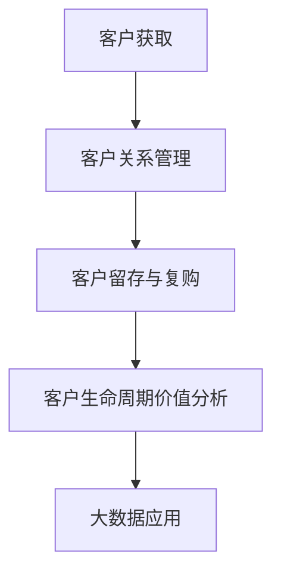

                 

# 信息差的商业客户生命周期管理：大数据如何管理客户生命周期

> **关键词**：信息差、商业、客户生命周期、大数据、客户管理

> **摘要**：本文探讨了信息差在商业客户生命周期管理中的重要作用，以及大数据技术在客户生命周期管理中的应用。通过分析客户获取、客户分析与细分、客户关系管理、客户留存与复购、客户生命周期价值分析等方面，深入探讨了大数据如何助力企业更好地管理客户生命周期，提高客户满意度和忠诚度。同时，还分析了大数据在客户生命周期管理中的挑战与未来趋势，提供了相关案例和实用的技术资源。

### 第一部分：引言与背景

#### 第1章：信息差的商业潜力

##### 1.1 信息差的定义与商业应用

**信息差**是指在特定领域中，一方拥有而另一方缺乏的信息差异。在商业领域，信息差的存在导致了商业机会的出现。以下是对信息差的定义与商业应用的详细分析：

**信息差的本质**：信息差可以表现为知识、资源、市场机会等多种形式。例如，在市场中，生产商可能拥有关于产品成本和利润的信息，而消费者则缺乏这些信息，从而形成了价格优势。在行业内，大型企业可能拥有更多的市场资源和数据，而小型企业则处于信息劣势。

**信息差在商业中的重要性**：信息差在商业中具有重要作用。首先，信息差可以帮助企业发现和利用市场机会。例如，通过对市场数据的深入分析，企业可以发现潜在的客户需求，从而开发出针对性的产品。其次，信息差有助于企业建立竞争优势。通过掌握关键信息，企业可以更好地制定战略，提高运营效率，从而在市场中脱颖而出。

**案例分析**：以电商行业为例，电商平台通过大数据分析用户行为和购买历史，能够准确预测用户的消费需求，从而提供个性化的产品推荐。这种信息差使得电商平台在竞争激烈的市场中脱颖而出，吸引了大量用户。

##### 1.2 客户生命周期的基本概念

**客户生命周期**是指客户与企业之间关系的整个生命周期，包括客户获取、客户关系管理、客户留存与复购等阶段。

**客户生命周期的定义**：客户生命周期是指客户与企业之间建立关系并保持关系的过程。它包括以下几个关键阶段：

1. **获取**：指企业通过各种渠道吸引潜在客户，并将其转化为实际客户的过程。
2. **关系管理**：指企业与客户建立并维护良好关系的过程，包括客户满意度管理、客户忠诚度管理等。
3. **留存与复购**：指企业通过一系列策略和措施，保持客户持续购买和使用产品或服务的状态。
4. **流失**：指客户因各种原因停止购买或使用企业产品或服务，导致客户关系终止的过程。

**客户生命周期的关键阶段**：

1. **客户获取**：此阶段的主要目标是吸引潜在客户，并通过促销活动、广告投放等方式将潜在客户转化为实际客户。有效的客户获取策略有助于扩大企业的市场份额，提高品牌知名度。
2. **关系管理**：此阶段的主要目标是建立和维护良好的客户关系，提高客户满意度和忠诚度。通过个性化的服务和沟通，企业可以增强客户的归属感和忠诚度，从而降低客户流失率。
3. **留存与复购**：此阶段的主要目标是保持客户持续购买和使用产品或服务的状态。通过优惠活动、会员制度、个性化推荐等方式，企业可以激发客户的购买欲望，提高复购率。
4. **流失**：此阶段的主要目标是减少客户流失率，提高客户留存率。通过分析客户流失原因，企业可以采取相应的措施，如改进产品和服务质量，提高客户满意度，从而降低客户流失率。

##### 1.3 大数据与客户生命周期管理

**大数据的基本概念**：大数据是指无法用传统数据处理工具在合理时间内进行捕捉、管理和处理的大量数据。它具有“4V”特征，即海量（Volume）、高速（Velocity）、多样（Variety）和低价值密度（Veracity）。

**大数据的特点**：

1. **海量**：大数据的数据量非常庞大，无法用传统的存储和处理工具进行管理和分析。
2. **高速**：大数据的产生和处理速度非常快，需要实时处理和分析。
3. **多样**：大数据的数据来源广泛，包括结构化数据、半结构化数据和非结构化数据。
4. **低价值密度**：大数据中的有效信息占比相对较低，需要通过深度分析和挖掘才能发现价值。

**大数据在客户生命周期管理中的应用**：

1. **数据收集与整合**：大数据技术可以帮助企业收集和整合来自多个渠道的客户数据，如网站日志、社交媒体数据、购买行为数据等。通过对这些数据的整合，企业可以建立完整的客户画像，从而更好地了解客户需求和行为。
2. **数据分析和挖掘**：大数据技术可以对客户数据进行分析和挖掘，发现客户行为模式、偏好和需求。通过分析客户数据，企业可以制定更精准的营销策略，提高客户满意度和忠诚度。

### 第二部分：大数据在客户生命周期管理中的应用

#### 第2章：客户获取与数据收集

##### 2.1 客户获取策略

**客户获取策略**是指企业通过不同的渠道和方法吸引潜在客户，并将其转化为实际客户的过程。以下介绍几种常见的客户获取策略：

1. **搜索引擎营销（SEM）**：搜索引擎营销是指通过在搜索引擎平台上投放广告，吸引潜在客户访问企业网站的过程。这种策略利用了搜索引擎的广泛覆盖和高度相关性，能够快速吸引目标客户。

2. **社交媒体营销**：社交媒体营销是指通过社交媒体平台（如微信、微博、Facebook等）发布内容、互动和广告，吸引潜在客户关注并访问企业网站的过程。社交媒体营销具有广泛的传播效果和较低的投放成本。

3. **内容营销**：内容营销是指通过创作和发布高质量的内容，吸引潜在客户并促进其购买决策的过程。内容营销的核心是提供有价值的信息，从而建立品牌信任和吸引客户。

**案例**：某电商企业通过搜索引擎营销、社交媒体营销和内容营销等多种策略，成功吸引了大量潜在客户。在搜索引擎营销方面，该企业通过竞价排名和搜索引擎优化（SEO）提高了网站在搜索结果中的排名，从而吸引了大量目标客户。在社交媒体营销方面，该企业通过微信公众号、微博等平台发布有价值的内容，与粉丝互动，提高了品牌知名度和用户粘性。在内容营销方面，该企业通过撰写购物指南、产品评测等高质量内容，提供了有价值的信息，吸引了大量潜在客户。

##### 2.2 数据收集方法

**数据收集方法**是指企业通过不同的方式收集客户数据的手段。以下介绍几种常见的客户数据收集方法：

1. **用户行为数据**：用户行为数据是指用户在使用企业产品或服务过程中产生的数据，如浏览记录、购买行为、评论等。这些数据可以帮助企业了解用户的需求和行为习惯，从而优化产品和服务。

2. **社交媒体数据**：社交媒体数据是指用户在社交媒体平台上发布和互动的数据，如微博、微信、Facebook等。这些数据可以帮助企业了解用户的社交行为和社交关系，从而制定更精准的营销策略。

3. **第三方数据源**：第三方数据源是指来自其他企业或机构的客户数据，如市场调研公司、数据服务商等。这些数据可以帮助企业补充和完善客户数据，提高数据分析的准确性。

**案例**：某金融企业通过多种数据收集方法，建立了全面的客户数据体系。在用户行为数据方面，该企业通过网站日志和行为跟踪技术收集用户浏览记录、购买行为等数据，从而了解用户偏好和需求。在社交媒体数据方面，该企业通过分析用户在社交媒体平台上的发布和互动，了解用户的社交行为和社交关系。在第三方数据源方面，该企业通过购买市场调研公司和数据服务商的数据，补充了客户的社会人口属性和财务状况等信息。

### 第3章：客户分析与细分

##### 3.1 客户数据分析方法

**客户数据分析方法**是指企业通过数据分析工具和技术对客户数据进行处理和分析的方法。以下介绍几种常见的客户数据分析方法：

1. **描述性分析**：描述性分析是指对客户数据的基本统计描述，如客户数量、年龄分布、性别比例等。这种方法可以帮助企业了解客户的基本特征和整体状况。

2. **趋势分析**：趋势分析是指对客户数据的变化趋势进行分析，如客户增长率、购买频率等。这种方法可以帮助企业发现客户行为和需求的趋势，从而制定相应的营销策略。

3. **原因分析**：原因分析是指对客户数据的变化原因进行分析，如客户流失原因、购买决策因素等。这种方法可以帮助企业了解客户行为和需求的深层次原因，从而优化产品和服务。

**案例**：某零售企业通过描述性分析、趋势分析和原因分析等多种方法，对客户数据进行了深入分析。在描述性分析方面，该企业统计了客户的年龄、性别、地域等基本特征，了解了客户的整体状况。在趋势分析方面，该企业分析了客户的购买频率、消费金额等数据，发现了客户的行为趋势。在原因分析方面，该企业分析了客户流失原因和购买决策因素，了解了客户的需求和痛点，从而优化了产品和服务。

##### 3.2 客户细分策略

**客户细分策略**是指企业根据客户特征和行为，将客户划分为不同的群体，以便制定针对性的营销策略。以下介绍几种常见的客户细分策略：

1. **基于行为的细分**：基于行为的细分是指根据客户的行为特征（如浏览记录、购买行为等）进行细分。这种方法可以帮助企业发现不同行为特征客户的共同点，从而制定相应的营销策略。

2. **基于价值的细分**：基于价值的细分是指根据客户的消费价值（如消费金额、购买频率等）进行细分。这种方法可以帮助企业识别高价值客户和潜在高价值客户，从而制定针对性的服务策略。

3. **基于需求的细分**：基于需求的细分是指根据客户的需求特征（如产品偏好、购买动机等）进行细分。这种方法可以帮助企业发现不同需求特征客户的需求差异，从而提供个性化的产品和服务。

**案例**：某电商企业通过基于行为的细分、基于价值的细分和基于需求的细分等多种策略，对客户进行了深入细分。在基于行为的细分方面，该企业分析了客户的浏览记录和购买行为，将客户分为高活跃客户、一般客户和沉默客户等。在基于价值的细分方面，该企业根据客户的消费金额和购买频率，将客户分为高价值客户、中价值客户和低价值客户等。在基于需求的细分方面，该企业分析了客户的购买动机和产品偏好，将客户分为时尚型客户、实用型客户和性价比型客户等。通过对客户的深入细分，该企业能够更好地了解客户需求，提供个性化的产品和服务。

### 第三部分：客户生命周期管理策略

#### 第4章：客户关系管理

##### 4.1 客户关系管理概述

**客户关系管理（CRM）**是一种以客户为中心的商业策略，旨在通过提高客户满意度和忠诚度，实现客户价值最大化。以下是对客户关系管理的基本概念和重要性的详细分析：

**客户关系管理的定义**：客户关系管理是指企业通过整合各种资源和手段，与客户建立、维护和发展长期稳定的关系，以满足客户需求和提升企业竞争力的一系列策略和活动。

**客户关系管理的重要性**：

1. **提高客户满意度**：良好的客户关系管理能够提高客户满意度，从而增强客户的忠诚度和满意度。通过持续关注客户需求，提供个性化服务和解决方案，企业能够满足客户的期望，提高客户的满意度和忠诚度。

2. **降低客户流失率**：客户关系管理有助于降低客户流失率。通过建立和维护良好的客户关系，企业能够及时发现客户的需求变化和潜在问题，采取针对性的措施，避免客户流失。

3. **提升客户价值**：良好的客户关系管理能够挖掘客户的潜在价值，实现客户价值的最大化。通过深入了解客户需求，提供定制化的产品和服务，企业能够满足客户的个性化需求，提高客户的生命周期价值。

4. **提升企业竞争力**：客户关系管理能够提升企业的竞争力。通过有效的客户关系管理，企业能够更好地了解市场和客户需求，制定有针对性的营销策略，提高市场份额和品牌影响力。

**客户关系管理的核心要素**：

1. **数据管理**：客户关系管理的核心是数据管理。企业需要建立完整、准确的客户数据仓库，收集、整合和分析客户的个人信息、购买历史、互动记录等数据，为后续的客户分析和决策提供数据支持。

2. **沟通与互动**：与客户建立良好的沟通和互动是企业成功实施客户关系管理的关键。企业需要通过电话、邮件、社交媒体等多种渠道与客户保持持续沟通，了解客户的需求和反馈，提供及时、个性化的服务。

3. **客户满意度评估**：客户满意度评估是客户关系管理的重要环节。企业需要定期对客户满意度进行调查和评估，了解客户的满意度和不满意度，识别问题和改进机会，提升客户满意度。

4. **客户忠诚度管理**：客户忠诚度管理是客户关系管理的核心目标之一。企业需要通过提供优质的客户体验、个性化的服务和奖励机制，增强客户的忠诚度，降低客户流失率。

**案例分析**：某大型零售企业通过实施客户关系管理，取得了显著的效果。该企业建立了完整的客户数据仓库，收集并整合了客户的个人信息、购买历史和互动记录等数据。通过数据分析，该企业能够准确了解客户的需求和行为，提供个性化的产品推荐和优惠活动。此外，该企业通过电话、邮件和社交媒体等多种渠道与客户保持沟通，及时了解客户的反馈和需求，提供及时、个性化的服务。通过这些措施，该企业显著提高了客户满意度和忠诚度，降低了客户流失率，提升了企业的竞争力。

##### 4.2 客户满意度管理

**客户满意度管理**是指企业通过一系列策略和措施，评估、提升和维持客户满意度的过程。以下是对客户满意度管理的基本概念、评估方法和提升策略的详细分析：

**客户满意度管理的定义**：客户满意度管理是指企业通过对客户满意度的评估和改进，以满足客户需求和提升客户体验为核心目标的一系列管理活动。

**客户满意度管理的重要性**：

1. **客户忠诚度**：客户满意度直接影响客户的忠诚度。满意的客户更愿意与企业建立长期合作关系，重复购买产品或服务，从而降低客户流失率。

2. **口碑传播**：满意的客户会向他人推荐企业，产生良好的口碑效应，吸引更多新客户，从而提高市场份额。

3. **业务增长**：客户满意度管理有助于提高客户生命周期价值，增加客户忠诚度和重复购买率，从而带动业务增长。

**客户满意度评估方法**：

1. **客户满意度调查**：通过问卷调查、电话访谈、在线调查等方式收集客户反馈，评估客户满意度。问卷调查是最常用的方法，可以量化客户满意度，提供具体的分数和排名。

2. **Net Promoter Score（NPS）**：NPS是一种衡量客户忠诚度的指标，通过询问客户“您有多大可能向他人推荐我们的产品或服务？”来评估客户的满意度。NPS分为0-10分，分为三个等级：忠诚客户（9-10分）、被动客户（7-8分）和不满客户（0-6分）。

3. **关键绩效指标（KPI）**：通过设置关键绩效指标，如客户投诉率、响应时间、解决率等，评估客户满意度。这些指标可以反映企业在客户服务方面的表现和改进空间。

**客户满意度提升策略**：

1. **个性化服务**：了解客户需求，提供个性化的产品和服务，提升客户体验。通过数据分析，识别客户的偏好和习惯，为客户提供定制化的解决方案。

2. **持续沟通**：与客户保持持续沟通，及时了解客户的需求和反馈。通过电话、邮件、社交媒体等多种渠道与客户互动，建立良好的信任关系。

3. **快速响应**：对客户的投诉和问题快速响应，提供有效的解决方案。建立高效的客户服务流程，确保问题得到及时解决，提高客户满意度。

4. **员工培训**：提高员工的服务意识和技能，确保为客户提供优质的服务。定期对员工进行培训，提升员工的沟通能力和解决问题的能力。

5. **奖励机制**：建立激励机制，鼓励员工提升客户满意度。对优秀员工进行奖励和表彰，激发员工的积极性和创造力。

**案例分析**：某电信企业通过实施客户满意度管理，显著提高了客户满意度。该企业通过客户满意度调查，了解客户的满意度和不满意度，识别改进机会。同时，该企业通过数据分析，识别客户的偏好和需求，提供个性化的产品和服务。此外，该企业建立了高效的客户服务流程，对客户的投诉和问题快速响应，提供有效的解决方案。通过这些措施，该企业提高了客户满意度，降低了客户流失率，提升了企业的竞争力。

##### 4.3 客户忠诚度管理

**客户忠诚度管理**是指企业通过一系列策略和措施，提高客户忠诚度，降低客户流失率，实现客户价值最大化的过程。以下是对客户忠诚度管理的基本概念、衡量方法和提升策略的详细分析：

**客户忠诚度管理的定义**：客户忠诚度管理是指企业通过识别、培养和激励忠诚客户，提高客户忠诚度，从而降低客户流失率，实现客户价值最大化的过程。

**客户忠诚度管理的重要性**：

1. **降低客户流失率**：忠诚客户更愿意与企业建立长期合作关系，重复购买产品或服务，从而降低客户流失率。

2. **提升客户价值**：忠诚客户通常具有更高的购买频率和更高的消费金额，从而提高客户生命周期价值。

3. **口碑传播**：忠诚客户会向他人推荐企业，产生良好的口碑效应，吸引更多新客户，从而提高市场份额。

**客户忠诚度衡量方法**：

1. **重复购买率**：重复购买率是衡量客户忠诚度的重要指标，表示客户在一定时间内重复购买产品或服务的次数。重复购买率越高，表明客户忠诚度越高。

2. **客户保留率**：客户保留率是指企业在一定时间内保持客户的能力，表示客户流失率。客户保留率越高，表明客户忠诚度越高。

3. **客户生命周期价值（CLV）**：客户生命周期价值是客户在生命周期内为企业带来的总价值，包括购买次数、购买金额和客户生命周期长度。客户生命周期价值越高，表明客户忠诚度越高。

4. **Net Promoter Score（NPS）**：NPS是一种衡量客户忠诚度的指标，通过询问客户“您有多大可能向他人推荐我们的产品或服务？”来评估客户的忠诚度。NPS分为0-10分，分为三个等级：忠诚客户（9-10分）、被动客户（7-8分）和不满客户（0-6分）。

**客户忠诚度提升策略**：

1. **个性化服务**：了解客户需求，提供个性化的产品和服务，提升客户体验。通过数据分析，识别客户的偏好和习惯，为客户提供定制化的解决方案。

2. **忠诚度奖励机制**：建立忠诚度奖励机制，对忠诚客户提供优惠、礼品、积分等奖励，激励客户重复购买。

3. **客户关怀**：与客户保持持续沟通，提供优质的客户服务。通过电话、邮件、社交媒体等多种渠道与客户互动，了解客户的需求和反馈，提供及时的帮助和支持。

4. **会员制度**：建立会员制度，为会员客户提供特殊优惠、专属活动等权益，提高会员客户的忠诚度。

5. **客户体验优化**：优化产品和服务质量，提升客户体验。通过客户满意度调查和反馈，及时发现和解决客户问题，提高客户满意度。

**案例分析**：某零售企业通过实施客户忠诚度管理，显著提高了客户忠诚度。该企业通过数据分析，识别客户的偏好和习惯，提供个性化的产品推荐和优惠活动。同时，该企业建立了会员制度，为会员客户提供专属优惠和活动。此外，该企业通过持续沟通和客户关怀，与客户保持良好的关系。通过这些措施，该企业提高了客户忠诚度，降低了客户流失率，提升了企业的竞争力。

### 第5章：客户留存与复购

##### 5.1 客户留存策略

**客户留存策略**是指企业通过一系列措施和手段，降低客户流失率，提高客户留存率的过程。以下是对客户留存策略的定义、核心要素和案例分析：

**客户留存策略的定义**：客户留存策略是企业通过提供优质的产品和服务，增强客户满意度，降低客户流失率，提高客户留存率的一系列措施。

**客户留存策略的核心要素**：

1. **优质产品和服务**：提供高质量的产品和服务是客户留存的基础。企业需要确保产品的性能、质量和可靠性，为客户提供满意的使用体验。

2. **个性化体验**：通过了解客户的需求和偏好，提供个性化的产品和服务，提升客户体验。个性化体验可以增强客户的归属感和满意度，从而提高客户留存率。

3. **快速响应和解决问题**：建立高效的客户服务流程，对客户的投诉和问题快速响应，提供有效的解决方案。快速解决问题的能力可以降低客户的流失率，提高客户留存率。

4. **客户关怀**：与客户保持持续沟通，提供优质的客户服务。通过电话、邮件、社交媒体等多种渠道与客户互动，了解客户的需求和反馈，提供及时的帮助和支持。

5. **优惠和奖励机制**：建立优惠和奖励机制，激励客户重复购买。例如，提供会员折扣、积分兑换、赠品等优惠，增加客户的购买意愿和忠诚度。

**案例分析**：某在线零售平台通过实施客户留存策略，显著提高了客户留存率。该平台通过数据分析，识别客户的偏好和需求，提供个性化的产品推荐和优惠活动。同时，该平台建立了高效的客户服务流程，对客户的投诉和问题快速响应，提供有效的解决方案。此外，该平台通过持续沟通和客户关怀，与客户保持良好的关系。通过这些措施，该平台提高了客户满意度，降低了客户流失率，提升了企业的竞争力。

##### 5.2 客户复购策略

**客户复购策略**是指企业通过一系列措施和手段，提高客户重复购买率，增加销售额的过程。以下是对客户复购策略的定义、核心要素和案例分析：

**客户复购策略的定义**：客户复购策略是企业通过提供优质的产品和服务，增强客户满意度，提高客户重复购买率，增加销售额的一系列措施。

**客户复购策略的核心要素**：

1. **个性化推荐**：通过分析客户的购买历史和行为数据，提供个性化的产品推荐。个性化推荐可以增加客户的购买机会，提高复购率。

2. **优惠和促销活动**：提供优惠和促销活动，刺激客户的购买欲望。例如，限时折扣、满减优惠、赠品等促销手段可以有效提高客户的复购率。

3. **会员制度**：建立会员制度，为会员客户提供专属优惠和权益。会员制度可以增强客户的归属感和忠诚度，提高复购率。

4. **客户体验优化**：优化产品和服务质量，提升客户体验。通过改善产品性能、提高服务质量和提升客户满意度，可以增强客户的购买意愿，提高复购率。

5. **客户关怀**：与客户保持持续沟通，提供优质的客户服务。通过电话、邮件、社交媒体等多种渠道与客户互动，了解客户的需求和反馈，提供及时的帮助和支持。

**案例分析**：某电商平台通过实施客户复购策略，显著提高了客户复购率。该平台通过数据分析，识别客户的偏好和需求，提供个性化的产品推荐和优惠活动。同时，该平台建立了会员制度，为会员客户提供专属优惠和活动。此外，该平台通过持续沟通和客户关怀，与客户保持良好的关系。通过这些措施，该平台提高了客户满意度，增加了客户复购率，提升了企业的销售额。

### 第6章：客户生命周期价值分析

##### 6.1 客户生命周期价值（CLV）的定义

**客户生命周期价值（Customer Lifetime Value，简称CLV）**是指一个客户在整个生命周期内为企业带来的总价值。CLV是企业制定客户管理策略的重要指标，它反映了客户对企业盈利能力的贡献。以下是对客户生命周期价值（CLV）的定义、计算方法和影响因素的详细分析：

**客户生命周期价值（CLV）的定义**：客户生命周期价值是指一个客户在从初次购买到最终流失的整个生命周期内，为企业带来的总收益。CLV是一个财务指标，用于衡量客户对企业盈利能力的贡献。

**客户生命周期价值（CLV）的计算方法**：

CLV的计算公式为：
\[ CLV = \sum_{t=1}^{n} \frac{RFV}{(1+r)^t} \]
其中：
- \( RFV \)（Recurrent Future Value）：客户的未来总收益，包括购买频率、平均订单价值和生命周期长度。
- \( r \)（Discount Rate）：折现率，用于考虑时间价值。

**客户生命周期价值（CLV）的计算步骤**：

1. **确定客户生命周期长度**：根据历史数据和预测模型，估算客户从首次购买到最终流失的平均时间长度。

2. **计算客户未来总收益**：根据客户的购买频率、平均订单价值和生命周期长度，计算客户在未来一段时间内的总收益。

3. **计算折现因子**：根据折现率，计算每个时间段的折现因子，即 \(\frac{1}{(1+r)^t}\)。

4. **计算客户生命周期价值**：将客户未来总收益乘以每个时间段的折现因子，并求和，得到客户生命周期价值。

**客户生命周期价值（CLV）的影响因素**：

1. **购买频率**：客户在一定时间内购买的次数，频率越高，CLV越高。

2. **平均订单价值**：客户的平均购买金额，平均订单价值越高，CLV越高。

3. **生命周期长度**：客户从首次购买到最终流失的平均时间长度，生命周期长度越长，CLV越高。

4. **客户忠诚度**：忠诚客户的CLV通常较高，因为他们更愿意重复购买，且流失率较低。

5. **市场需求**：市场需求旺盛时，客户的购买意愿和购买频率较高，CLV较高。

6. **产品或服务质量**：高质量的产品和服务可以增强客户满意度，提高客户的重复购买意愿，从而提高CLV。

##### 6.2 CLV在客户生命周期管理中的应用

**客户生命周期价值（CLV）**在客户生命周期管理中的应用主要体现在以下几个方面：

1. **客户细分**：通过计算客户的CLV，企业可以将客户划分为高价值客户、中价值客户和低价值客户。针对不同价值的客户，企业可以采取差异化的营销策略和服务，提高客户的满意度和服务质量。

2. **资源分配**：CLV是企业决策的重要依据，企业可以根据CLV对资源进行合理分配。高价值客户应得到更多的关注和资源投入，以确保其忠诚度和长期价值。

3. **客户保留策略**：通过分析CLV的变化趋势，企业可以识别潜在流失客户，采取相应的客户保留策略，如提供个性化优惠、增值服务等，以降低客户流失率，提高客户留存率。

4. **营销策略**：CLV有助于企业制定有针对性的营销策略。高价值客户可以接受更高级别的营销活动和优惠，从而提高购买转化率和复购率。

5. **产品和服务优化**：通过分析CLV的影响因素，企业可以优化产品和服务，提高客户满意度，从而提高客户的CLV。

**案例分析**：某电子商务平台通过计算客户的CLV，成功优化了客户管理策略。该平台将客户划分为高价值客户、中价值客户和低价值客户，并为不同价值的客户制定差异化的营销策略。高价值客户享受到更高级别的会员服务、个性化的产品推荐和专属优惠。同时，该平台通过分析CLV的变化趋势，识别出潜在流失客户，并采取针对性的保留策略，如提供限时优惠、赠品等。通过这些措施，该平台显著提高了客户满意度和忠诚度，降低了客户流失率，提升了企业的盈利能力。

### 第7章：大数据在客户生命周期管理中的挑战与未来趋势

##### 7.1 大数据在客户生命周期管理中的挑战

尽管大数据在客户生命周期管理中具有巨大的潜力，但企业在应用大数据技术时也面临一系列挑战。以下是对这些挑战的详细分析：

**数据隐私与安全性**：大数据技术涉及大量客户数据，包括个人信息、购买行为和互动记录等。这些数据的安全性和隐私保护至关重要。企业必须确保数据在收集、存储、传输和处理过程中得到有效保护，以防止数据泄露和滥用。

**数据整合与标准化**：大数据来源广泛，包括结构化数据、半结构化数据和非结构化数据。这些数据的格式和结构可能不一致，给数据整合带来了挑战。企业需要建立统一的数据标准和规范，确保数据能够有效整合和共享。

**数据分析技术与人才需求**：大数据分析需要先进的技术和专业的分析人员。企业需要投入大量资源来培养和引进数据分析人才，确保能够充分利用大数据技术，为业务决策提供有力支持。

**数据质量和准确性**：大数据的质量直接影响分析结果的准确性。企业需要建立数据质量控制机制，确保数据的完整性和准确性，以避免错误的业务决策。

**数据合规与法规遵守**：企业在应用大数据技术时需要遵守相关法规和合规要求，如《通用数据保护条例》（GDPR）等。违规可能导致严重的法律后果和声誉损失。

##### 7.2 大数据在客户生命周期管理中的未来趋势

随着大数据技术的不断进步和成熟，客户生命周期管理也在向更智能化、自动化和全面化的方向发展。以下是大数据在客户生命周期管理中的未来趋势：

**新兴技术的应用**：人工智能、机器学习、物联网等新兴技术将进一步推动大数据在客户生命周期管理中的应用。这些技术可以帮助企业更准确地预测客户行为、提供个性化服务、优化营销策略。

**跨部门协作与整合**：大数据的应用不仅限于市场营销部门，还将涉及销售、客户服务、产品开发等多个部门。跨部门协作和整合将成为大数据在客户生命周期管理中的重要趋势，以实现全面的客户体验和优化业务流程。

**客户生命周期管理的智能化与自动化**：通过大数据和人工智能技术的结合，客户生命周期管理将变得更加智能化和自动化。企业可以通过自动化工具和算法，实时分析客户数据，自动化客户获取、客户关系管理、客户留存和复购等过程，提高效率，降低成本。

**个性化服务与体验**：大数据技术将使企业能够更深入地了解客户需求和行为，提供更加个性化的产品和服务。通过个性化推荐、定制化营销和服务，企业可以提升客户满意度和忠诚度。

**数据驱动的决策**：大数据将为企业的决策提供强有力的支持。基于大数据分析，企业可以更准确地预测市场趋势、优化产品和服务、制定有针对性的营销策略，实现数据驱动的业务决策。

**案例研究**

**案例一：互联网公司的客户生命周期管理实践**

某互联网公司通过大数据技术实现了全面的客户生命周期管理。以下是其主要实践：

1. **客户获取**：通过搜索引擎营销、社交媒体营销和内容营销等多种策略，该公司吸引了大量潜在客户。同时，利用大数据技术分析用户行为和购买历史，精准定位目标客户，提高客户转化率。

2. **客户关系管理**：该公司建立了完整的客户数据仓库，收集并整合了客户的个人信息、购买历史和互动记录等数据。通过数据分析，了解客户需求和行为，提供个性化的产品推荐和优惠活动，提高客户满意度和忠诚度。

3. **客户留存与复购**：该公司通过持续沟通和客户关怀，与客户保持良好的关系。同时，利用大数据分析客户行为，预测客户流失风险，采取针对性的保留策略，如提供限时优惠、赠品等，降低客户流失率，提高复购率。

4. **客户生命周期价值分析**：该公司通过计算客户的生命周期价值，将客户划分为高价值客户、中价值客户和低价值客户。针对不同价值的客户，采取差异化的营销策略和服务，提高客户忠诚度和生命周期价值。

**案例二：零售行业的客户生命周期管理策略**

某零售企业通过大数据技术实现了全面的客户生命周期管理。以下是其主要策略：

1. **数据收集**：该企业通过用户行为数据、社交媒体数据和第三方数据源等多种渠道收集客户数据，建立了全面的客户数据仓库。

2. **数据分析**：通过对客户数据的分析，该企业识别了不同细分市场的客户特征和需求，制定了针对性的营销策略和服务方案。

3. **客户细分**：该企业基于客户行为、价值和需求等维度，对客户进行细分，制定了个性化的客户管理策略。

4. **客户关系管理**：该企业通过电话、邮件、社交媒体等多种渠道与客户保持沟通，提供个性化的产品推荐和优惠活动，增强客户满意度和忠诚度。

5. **客户留存与复购**：该企业通过优化产品和服务质量、提供优质的客户体验、实施忠诚度奖励机制等措施，提高客户留存率和复购率。

6. **客户生命周期价值分析**：该企业通过计算客户的生命周期价值，将客户划分为高价值客户、中价值客户和低价值客户，为不同价值的客户提供差异化的产品和服务，提高客户生命周期价值。

**案例三：金融行业的客户生命周期价值分析**

某金融企业通过大数据技术实现了客户生命周期价值分析，以下是其主要实践：

1. **数据收集**：该企业通过收集客户的财务状况、信用记录、交易记录等数据，建立了全面的客户数据仓库。

2. **数据分析**：通过对客户数据的分析，该企业识别了不同风险等级的客户，并制定了差异化的风险管理策略。

3. **客户细分**：该企业基于客户的风险等级、财务状况和需求等维度，对客户进行细分，制定了个性化的产品推荐和营销策略。

4. **客户生命周期价值分析**：该企业通过计算客户的生命周期价值，将客户划分为高价值客户、中价值客户和低价值客户，为不同价值的客户提供差异化的产品和服务。

5. **客户关系管理**：该企业通过电话、邮件、在线客服等多种渠道与客户保持沟通，提供个性化的产品推荐和优惠活动，增强客户满意度和忠诚度。

6. **客户留存与复购**：该企业通过优化产品和服务质量、提供优质的客户体验、实施忠诚度奖励机制等措施，提高客户留存率和复购率。

### 附录

**附录A：常用大数据工具与技术概览**

**A.1 Hadoop生态系统**

- **Hadoop**：分布式数据处理框架，可用于存储和处理大规模数据。
- **HDFS**：分布式文件系统，用于存储大数据。
- **MapReduce**：分布式数据处理模型，用于处理大规模数据。
- **HBase**：分布式列存储数据库，用于存储和分析大规模数据。
- **Spark**：分布式数据处理框架，支持快速数据处理和分析。
- **Hive**：数据仓库工具，用于存储、查询和分析大数据。
- **Presto**：分布式查询引擎，支持大规模数据的快速查询。

**A.2 Spark**

- **Spark Core**：Spark的基本组件，提供分布式任务调度和内存计算能力。
- **Spark SQL**：用于处理结构化数据的组件，支持SQL查询和数据分析。
- **Spark Streaming**：用于实时数据流处理的组件，支持实时数据处理和分析。
- **MLlib**：用于机器学习的组件，提供各种机器学习算法和工具。
- **GraphX**：用于图计算的组件，支持大规模图的存储和处理。

**A.3 数据库技术**

- **关系型数据库**：如MySQL、Oracle、PostgreSQL等，用于存储和管理结构化数据。
- **非关系型数据库**：如MongoDB、Redis、Cassandra等，用于存储和管理非结构化数据。

**A.4 机器学习框架**

- **Scikit-learn**：Python机器学习库，提供各种机器学习算法和工具。
- **TensorFlow**：Google开发的深度学习框架，支持大规模深度神经网络训练和推理。
- **PyTorch**：Facebook开发的深度学习框架，支持动态计算图和灵活的模型构建。

**附录B：客户生命周期管理相关资源**

- **行业报告与研究报告**：如《全球客户生命周期管理市场研究报告》、《零售行业客户生命周期管理白皮书》等，提供市场趋势和案例分析。
- **实践指南与案例研究**：如《客户生命周期管理实践指南》、《互联网公司客户生命周期管理案例研究》等，提供实际操作经验和成功案例。
- **在线课程与培训资源**：如Coursera、edX、Udemy等在线教育平台上的客户生命周期管理相关课程，提供系统学习和实践机会。

**附录C：Mermaid流程图与算法伪代码**

**C.1 客户生命周期管理流程图**



**C.2 数据分析算法伪代码**

```python
def descriptive_analysis(data):
    # 描述性分析
    statistics = {
        'average': sum(data) / len(data),
        'median': median(data),
        'standard_deviation': standard_deviation(data),
    }
    return statistics

def trend_analysis(data):
    # 趋势分析
    trends = {
        'increasing': data[1:] > data[:-1],
        'decreasing': data[1:] < data[:-1],
    }
    return trends

def reason_analysis(data):
    # 原因分析
    reasons = []
    for i in range(1, len(data)):
        if data[i] != data[i-1]:
            reasons.append(i)
    return reasons
```

**C.3 客户细分与价值评估算法伪代码**

```python
def customer_segmentation(data):
    # 客户细分
    segments = {
        'high_value': [],
        'medium_value': [],
        'low_value': [],
    }
    for customer in data:
        if customer['value'] > threshold_high:
            segments['high_value'].append(customer)
        elif customer['value'] > threshold_medium:
            segments['medium_value'].append(customer)
        else:
            segments['low_value'].append(customer)
    return segments

def customer_value_evaluation(data):
    # 客户价值评估
    clvs = []
    for customer in data:
        clv = calculate_clv(customer)
        clvs.append(clv)
    return clvs
```

**附录D：项目实战案例**

**D.1 客户数据分析项目实战**

**项目背景**：某电子商务平台希望通过数据分析提升客户满意度和忠诚度。

**项目目标**：通过分析客户数据，识别客户需求和行为模式，制定个性化的营销策略，提高客户转化率和复购率。

**项目步骤**：

1. **数据收集**：从电商平台收集客户的购买记录、浏览记录、互动记录等数据。

2. **数据清洗**：对收集到的数据进行清洗，去除重复和错误数据，确保数据质量。

3. **数据分析**：使用描述性分析、趋势分析和原因分析等方法，对客户数据进行分析，识别客户需求和行为模式。

4. **客户细分**：根据客户数据的特点和需求，将客户划分为不同的细分市场。

5. **营销策略制定**：根据客户细分结果，制定个性化的营销策略，如针对高价值客户的专属优惠、针对沉默客户的唤醒活动等。

6. **策略实施与跟踪**：实施营销策略，并跟踪效果，调整和优化策略。

**项目成果**：通过客户数据分析项目，电商平台成功提高了客户转化率和复购率，客户满意度也得到显著提升。

**D.2 客户生命周期管理项目实战**

**项目背景**：某零售企业希望通过客户生命周期管理提高客户忠诚度和生命周期价值。

**项目目标**：通过客户生命周期管理，降低客户流失率，提高客户忠诚度和生命周期价值。

**项目步骤**：

1. **客户数据收集**：从零售企业的各个渠道收集客户数据，包括购买记录、互动记录、会员信息等。

2. **客户数据分析**：对客户数据进行清洗、整合和分析，识别客户需求和行为模式。

3. **客户细分**：根据客户数据的特点和需求，将客户划分为不同的细分市场。

4. **客户关系管理**：针对不同细分市场的客户，制定差异化的客户关系管理策略，如个性化服务、忠诚度奖励等。

5. **客户留存与复购策略**：实施客户留存与复购策略，如会员制度、优惠活动、客户关怀等。

6. **客户生命周期价值分析**：计算客户的生命周期价值，制定针对性的客户保留和增值策略。

7. **项目评估与优化**：定期评估项目效果，优化客户生命周期管理策略。

**项目成果**：通过客户生命周期管理项目，零售企业显著降低了客户流失率，提高了客户忠诚度和生命周期价值。

**D.3 大数据分析平台搭建与优化**

**项目背景**：某互联网公司希望通过大数据分析提升业务运营效率和决策能力。

**项目目标**：搭建一个高效、可扩展的大数据分析平台，支持实时数据处理和分析。

**项目步骤**：

1. **需求分析**：明确数据分析平台的功能需求和技术架构要求。

2. **技术选型**：选择合适的大数据技术，如Hadoop、Spark、Flink等。

3. **系统设计**：设计数据分析平台的架构，包括数据采集、存储、处理、分析和展示等模块。

4. **平台搭建**：按照系统设计，搭建大数据分析平台，并进行系统集成和测试。

5. **数据分析与优化**：利用大数据分析平台，进行数据分析和挖掘，优化业务运营策略和决策。

6. **平台运维与维护**：定期对大数据分析平台进行运维和优化，确保平台的稳定运行。

**项目成果**：通过大数据分析平台搭建与优化项目，互联网公司实现了实时数据处理和分析，提高了业务运营效率和决策能力。

