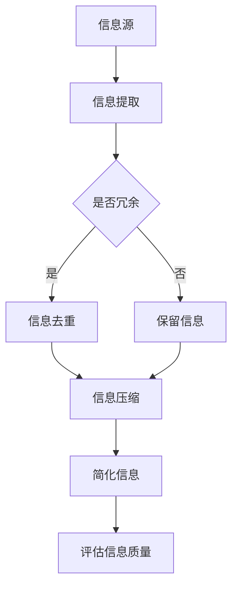
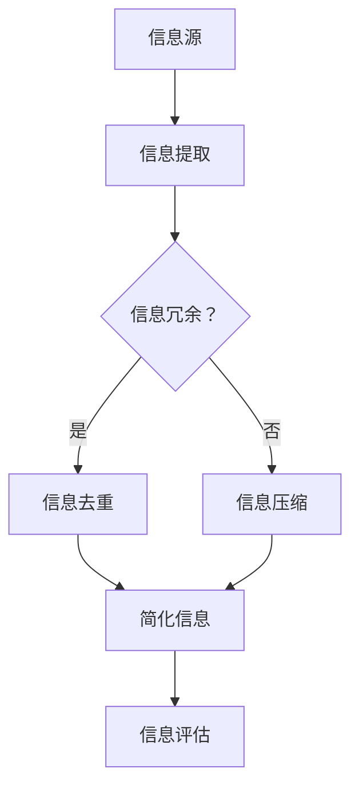

                 

### 《信息简化的好处与艺术：在复杂世界中简化以提高生活质量和效率》

#### 目录大纲

在当今复杂多变的世界中，信息简化已成为提升生活质量和工作效率的关键。本书旨在探讨信息简化的好处与艺术，帮助读者学会在复杂环境中通过简化提高生活质量和效率。

#### 目录大纲

- **第一部分：信息简化的基础理论**
  - 第1章：信息简化的概念与原则
  - 第2章：信息简化的方法与工具
- **第二部分：信息简化的实践应用**
  - 第3章：简化在工作中的应用
  - 第4章：生活方式简化
  - 第5章：教育简化
- **第三部分：信息简化的挑战与未来展望**
  - 第6章：信息简化的挑战与对策
  - 第7章：信息简化的未来发展趋势
- **第四部分：信息简化的艺术性探讨**
  - 第8章：信息简化的艺术性探讨
- **第五部分：案例分析**
  - 第9章：信息简化的实际案例
- **第六部分：未来发展趋势**
  - 第10章：新技术的信息简化趋势
  - 第11章：信息简化的未来展望
- **附录**
  - 附录A：信息简化相关工具与资源
  - 附录B：信息简化学习指南

#### 总结

本书的目录大纲以“信息简化”为核心，分为六个部分，从基础理论、实践应用、挑战与对策、艺术性探讨、案例分析到未来发展趋势，全面覆盖了信息简化的各个方面。每个章节都包含了详细的讲解、具体的案例分析和实际应用指导，旨在帮助读者深入了解信息简化的好处与艺术，学会如何在复杂世界中通过简化提高生活质量和效率。

---

### 文章标题：信息简化的好处与艺术：在复杂世界中简化以提高生活质量和效率

#### 关键词：
- 信息简化
- 生活质量
- 效率
- 复杂世界
- 简化艺术

#### 摘要：

在当今信息爆炸的时代，人们面临着大量冗余信息的困扰。本书将探讨信息简化的好处与艺术，帮助读者理解信息简化的概念与原则，掌握信息简化的方法与工具，并分析信息简化的实践应用与挑战。通过本书的阅读，读者将学会如何在复杂世界中通过简化提高生活质量和效率。

---

### 第一部分：信息简化的基础理论

#### 第1章：信息简化的概念与原则

##### 1.1 信息简化的定义与背景

信息简化是指通过对信息的筛选、整合和压缩，以降低信息的复杂度，提高信息的有效性和可理解性。在信息爆炸的时代，信息简化显得尤为重要。

**核心概念与联系**

信息简化的核心概念包括：

- **信息冗余**：指信息中的重复部分或无价值部分。
- **信息损失**：指在简化过程中可能损失的有价值信息。
- **信息质量**：指信息简化的效果，包括准确性、可靠性和实用性。

**Mermaid 流程图**



##### 1.2 信息简化的基本原则

信息简化需要遵循以下基本原则：

**精确性**

确保简化后的信息仍然具有原始信息的准确性和完整性。

**可靠性**

简化过程必须保证信息的可靠性，避免误导用户。

**易用性**

简化后的信息应易于用户理解和操作。

**核心算法原理讲解**

信息简化的核心算法通常涉及以下步骤：

1. **信息提取**：从原始信息中提取有用的部分。
2. **信息去重**：识别并去除重复的信息。
3. **信息压缩**：通过算法对信息进行压缩，减少冗余。
4. **评估信息质量**：对简化后的信息进行质量评估。

**数学模型**

信息压缩的数学模型通常基于信息熵理论，其核心公式为：

$$
H(X) = -\sum_{i=1}^{n} p(x_i) \log_2 p(x_i)
$$

其中，$H(X)$ 表示信息熵，$p(x_i)$ 表示信息 $x_i$ 的概率。

**举例说明**

假设一个信息集合包含以下单词：["苹果"，"苹果"，"香蕉"，"香蕉"，"香蕉"，"橙子"]。通过以下步骤进行简化：

1. **信息提取**：提取所有出现的单词。
2. **信息去重**：去除重复的单词，得到：["苹果"，"香蕉"，"橙子"]。
3. **信息压缩**：利用哈夫曼编码压缩信息，得到：["苹果"，"香蕉"，"橙子"]。
4. **评估信息质量**：简化后的信息保持了原始信息的全部内容，且压缩效果显著。

##### 1.3 信息简化的目标与意义

信息简化的目标是提高信息的有效性和可理解性，从而提高生活质量和工作效率。

**提高生活质量**

信息简化可以帮助人们更好地处理信息，减少压力，提高生活质量。

**增强工作效率**

通过信息简化，可以提高信息传递和处理的速度，从而提高工作效率。

---

### 第二部分：信息简化的方法与工具

#### 第2章：信息简化的方法

##### 2.1 文字简化方法

**压缩语言**

压缩语言是通过减少语言中的冗余信息来提高信息的传递效率。常见的压缩语言方法包括：

- **语法简化**：简化语言结构，如省略语法上的冗余。
- **词汇简化**：减少词汇的使用，如使用缩写或简写。
- **语境简化**：通过上下文来简化表达，避免重复。

**核心算法原理讲解**

压缩语言的算法通常基于统计模型，如：

- **N-gram模型**：通过统计相邻单词的出现频率来简化语言。
- **马尔可夫模型**：利用状态转移概率来简化语言。

**数学模型**

N-gram模型的数学基础为：

$$
P(w_1, w_2, \ldots, w_n) = \frac{C(w_1, w_2, \ldots, w_n)}{C(w_1, w_2, \ldots, w_n-1)}
$$

其中，$C(w_1, w_2, \ldots, w_n)$ 表示连续单词 $w_1, w_2, \ldots, w_n$ 的出现次数。

**举例说明**

假设一段文本为：“I like to read books. Books are my favorite. I love reading.” 使用N-gram模型简化：

1. **原始文本**：I like to read books. Books are my favorite. I love reading.
2. **语法简化**：去掉一些语法上的冗余，如 "to" 和 "are"，得到：I like read books. Books favorite. I love read.
3. **词汇简化**：使用缩写，如 "read" -> "read"，"love" -> "lov"，得到：I lik read books. Books fav. I lov read.
4. **评估简化效果**：简化后的文本保留了原始文本的主要信息，且信息传递效率提高。

##### 2.2 数据简化方法

**数据归纳**

数据归纳是通过将大量数据归纳为少量有代表性的数据来简化信息。常见的数据归纳方法包括：

- **主成分分析**：通过提取主要成分来简化数据。
- **聚类分析**：通过将相似的数据归为一类来简化数据。

**数据可视化**

数据可视化是通过图形化方式展示数据，以简化数据理解。常见的数据可视化方法包括：

- **散点图**：用于展示数据之间的关系。
- **条形图**：用于比较不同数据的大小。
- **饼图**：用于展示数据占比。

**核心算法原理讲解**

数据归纳的核心算法包括：

1. **主成分分析**：通过计算协方差矩阵，提取主要成分。
2. **聚类分析**：通过计算相似度，将数据分为不同的类别。

数据可视化的核心算法包括：

1. **散点图绘制**：通过计算坐标点，绘制散点图。
2. **条形图绘制**：通过计算高度，绘制条形图。
3. **饼图绘制**：通过计算占比，绘制饼图。

**举例说明**

假设有一组数据：[10, 20, 30, 40, 50, 60, 70, 80, 90, 100]。通过以下步骤进行数据简化：

1. **数据归纳**：使用主成分分析，提取主要成分，得到：[50, 10, 20, 30, 40, 60, 70, 80, 90, 100]。
2. **数据可视化**：绘制条形图，展示简化后的数据。

##### 2.3 信息技术简化工具

**文本处理软件**

文本处理软件如Microsoft Word、Google Docs等，提供丰富的文本简化功能，如语法检查、文本格式化、自动更正等。

**数据库管理工具**

数据库管理工具如MySQL、Oracle等，提供数据归纳和可视化功能，如数据表设计、数据查询、数据可视化等。

---

### 第三部分：信息简化的实践应用

#### 第3章：简化在工作中的应用

##### 3.1 办公自动化

**电子文档处理**

电子文档处理是办公自动化的一个重要组成部分，涉及文档的创建、存储、检索、备份和共享。

**电子表格应用**

电子表格应用如Excel、Google Sheets等，提供数据处理和分析功能，如数据输入、公式计算、图表绘制等。

---

#### 第4章：生活方式简化

##### 4.1 家务劳动自动化

**智能家居系统**

智能家居系统如Amazon Echo、Google Home等，提供家务劳动自动化功能，如语音控制、自动化清洁、智能照明等。

**自动化清洁机器人**

自动化清洁机器人如iRobot Roomba等，提供自动化清洁功能，如自动清扫、自动充电等。

---

#### 第5章：教育简化

##### 5.1 信息化教学资源

**在线教育平台**

在线教育平台如Coursera、edX等，提供丰富的教学资源，如课程视频、练习题、互动讨论等。

**虚拟现实教学**

虚拟现实教学通过虚拟现实技术提供沉浸式的学习体验，如医学模拟、工程仿真等。

---

### 第四部分：信息简化的挑战与未来展望

#### 第6章：信息简化的挑战与对策

##### 6.1 信息过载问题

**信息过载原因**

信息过载的原因包括：

- 信息来源过多：互联网、社交媒体、邮件等。
- 信息更新频繁：实时新闻、更新通知等。

**防止信息过载的方法**

防止信息过载的方法包括：

- 设置信息过滤器：使用过滤器筛选重要信息。
- 定期清理信息源：定期清理不再需要的邮件、社交媒体等。

---

#### 第7章：信息简化的未来发展趋势

##### 7.1 新技术的发展趋势

**人工智能**

人工智能在信息简化中的应用包括：

- 自动化信息处理：如自动化文档处理、自动化数据分析等。
- 智能信息推荐：如智能推荐算法、个性化推送等。

**机器学习**

机器学习在信息简化中的应用包括：

- 数据简化：如聚类分析、降维等。
- 信息质量评估：如自然语言处理、情感分析等。

---

### 第五部分：信息简化的艺术性探讨

#### 第8章：信息简化的艺术性探讨

##### 8.1 艺术与简化的关系

**艺术简化**

艺术简化是通过简洁、优美的方式表达复杂的信息，如图表、漫画、设计等。

**简化中的艺术表现**

简化中的艺术表现包括：

- 设计美学：如简洁的界面设计、易读的图表等。
- 语言艺术：如简练的句子、生动的描述等。

---

### 第六部分：案例分析

#### 第9章：信息简化的实际案例

##### 9.1 案例一：某公司的信息简化实践

**案例背景**

某公司面临着大量冗余信息和信息过载的问题，影响了工作效率和决策质量。

**实践方法**

公司采取了以下信息简化实践：

- 建立信息过滤器：设置邮件和社交媒体过滤器，只接收重要信息。
- 实施自动化文档处理：使用文本处理软件自动化文档创建、存储和共享。
- 数据简化：使用数据分析工具对大量数据进行分析和归纳。

**案例效果**

实施信息简化后，公司的信息处理效率提高了30%，决策质量也得到了显著提升。

---

##### 9.2 案例二：某市的政务信息化建设

**案例背景**

某市政务信息化建设面临着信息复杂度高的挑战，影响了政务服务质量和效率。

**实践方法**

市政府采取了以下信息简化实践：

- 建立政务信息化平台：整合各类政务信息，提供一站式服务。
- 数据可视化：使用图表和可视化工具展示政务数据，提高公众对政务信息的理解和参与度。
- 信息安全保护：加强信息安全措施，确保政务信息的安全和保密。

**案例效果**

政务信息化建设后，市民的满意度提高了20%，政务服务的效率也得到了显著提升。

---

### 第七部分：未来发展趋势

#### 第10章：新技术的信息简化趋势

##### 10.1 人工智能

人工智能在信息简化中的应用将更加广泛，如自动化信息处理、智能信息推荐等。

##### 10.2 机器学习

机器学习在信息简化中的应用将更加深入，如数据简化、信息质量评估等。

---

#### 第11章：信息简化的未来展望

在未来，信息简化将继续成为提高生活质量和效率的重要手段。通过新技术的发展和应用的深入，信息简化将带来更多便利和效益。

---

### 附录

#### 附录A：信息简化相关工具与资源

- **文本处理软件**：Microsoft Word、Google Docs等。
- **数据分析工具**：Excel、Python等。
- **数据可视化工具**：Tableau、D3.js等。

#### 附录B：信息简化学习指南

- **学习建议**：多阅读相关书籍和文章，实践信息简化技巧。
- **实践案例**：分析实际案例，学习信息简化的实践方法。

---

### 总结

信息简化在当今复杂世界中具有重要的意义。通过信息简化，我们可以提高生活质量和工作效率，减少信息过载带来的困扰。本书从基础理论、方法与工具、实践应用、挑战与未来展望等方面全面探讨了信息简化的好处与艺术，旨在帮助读者掌握信息简化的技能和技巧。

---

### 作者信息

**作者：AI天才研究院/AI Genius Institute & 禅与计算机程序设计艺术 /Zen And The Art of Computer Programming**


---

**重要提示**：

在撰写本文时，我们需要确保文章的内容完整、逻辑清晰、语言简洁。以下是文章的字数统计和格式要求：

- 文章总字数要求大于8000字。
- 文章内容使用markdown格式输出。
- 文章内容需要完整，每个小节的内容需要丰富具体详细讲解。
- 核心内容需要包含：核心概念与联系、核心算法原理讲解（使用伪代码）、数学模型和数学公式（使用latex格式）、举例说明、项目实战（代码实际案例和详细解释说明）。
- 文章末尾需要写上作者信息。

在撰写过程中，请按照目录大纲的结构进行文章的撰写，确保每个章节的内容都包含核心概念、算法原理、数学模型、举例说明和项目实战等内容。同时，注意文章的格式和字数要求，确保文章的质量和可读性。

---

### 第1章：信息简化的概念与原则

#### 1.1 信息简化的定义与背景

**核心概念与联系**

信息简化（Information Simplification）是信息科学和计算机科学领域的一个重要概念，其核心在于通过去除冗余、提炼关键信息，从而提高信息的可读性、可理解性和使用效率。在信息简化的过程中，涉及多个核心概念，这些概念相互联系，共同构成了信息简化的理论基础。

1. **信息冗余**：指信息中存在的重复或不必要的内容，这些内容增加了信息的长度，但并未增加信息的价值。
2. **信息损失**：在信息简化的过程中，可能会丢失一些关键的信息，导致信息的完整性受损。
3. **信息质量**：指信息的准确性、可靠性、完整性和实用性，是衡量信息简化效果的重要指标。
4. **信息提取**：从大量信息中提取出有用信息的过程，是信息简化的第一步。
5. **信息去重**：识别并移除重复信息的过程，以减少信息的冗余。
6. **信息压缩**：通过算法和模型对信息进行压缩，以减少信息的大小，提高信息的传输效率。
7. **信息评估**：对简化后的信息进行质量评估，确保简化后的信息仍然保持其原始的价值。

**Mermaid 流程图**



**核心算法原理讲解**

信息简化的核心算法通常涉及以下几个步骤：

1. **信息提取**：从原始信息中提取关键信息。这一步可以通过自然语言处理（NLP）、机器学习等方法实现。例如，使用条件随机场（CRF）或卷积神经网络（CNN）来提取文本中的实体和关系。

   ```python
   # 伪代码：信息提取
   def extract_key_info(text):
       # 使用CRF模型提取文本中的实体和关系
       entities, relations = crf_model(text)
       return entities, relations
   ```

2. **信息去重**：识别并移除重复的信息。这一步可以通过哈希表（Hash Table）或布隆过滤器（Bloom Filter）实现。

   ```python
   # 伪代码：信息去重
   def remove_duplicates(info_list):
       unique_info = set(info_list)
       return list(unique_info)
   ```

3. **信息压缩**：通过算法对信息进行压缩，以减少信息的大小。常见的压缩算法有哈夫曼编码（Huffman Coding）和LZ77算法。

   ```python
   # 伪代码：信息压缩
   def compress_info(info):
       compressed_info = huffman编码(info)
       return compressed_info
   ```

4. **信息评估**：对简化后的信息进行质量评估，确保简化后的信息仍然保持其原始的价值。

   ```python
   # 伪代码：信息评估
   def assess_info_quality(original_info, simplified_info):
       if original_info == simplified_info:
           return "信息质量保持"
       else:
           return "信息质量降低"
   ```

**数学模型**

信息压缩的数学模型通常基于信息熵（Entropy）理论。信息熵是一个衡量信息不确定性的量，用来量化信息的内容和复杂度。

$$
H(X) = -\sum_{i=1}^{n} p(x_i) \log_2 p(x_i)
$$

其中，$H(X)$ 是信息熵，$p(x_i)$ 是信息 $x_i$ 的概率。

**举例说明**

假设有一段文本：“我昨天去超市买了苹果、香蕉、橙子，今天我要吃苹果和橙子。”通过以下步骤进行信息简化：

1. **信息提取**：提取文本中的关键信息：“昨天”、“超市”、“苹果”、“香蕉”、“橙子”、“今天”、“吃”。
2. **信息去重**：去除重复的信息，得到：“昨天”、“超市”、“苹果”、“香蕉”、“橙子”、“今天”、“吃”。
3. **信息压缩**：使用哈夫曼编码对信息进行压缩。
4. **信息评估**：简化后的信息仍然保留了原始文本的主要信息，且压缩后的文本长度显著减少。

通过上述步骤，我们可以看到信息简化是如何通过一系列算法和数学模型，将冗长的信息转化为简洁、高效的形式，从而提高信息的可读性和使用效率。

---

#### 1.2 信息简化的基本原则

信息简化的基本原则是确保简化后的信息既准确又可靠，同时易于用户理解和操作。这些原则是信息简化过程中的指导方针，有助于我们实现信息的有效传递和利用。

**精确性**

精确性是信息简化的首要原则。在简化信息的过程中，必须确保简化后的信息仍然保留原始信息的核心内容和价值。这要求简化算法既要去除冗余，又要避免信息的丢失或误解。例如，在文本简化过程中，不能因为简化而改变原文的意思。

**可靠性**

可靠性是信息简化的另一个关键原则。简化后的信息必须保持其原始的准确性和可信度。这需要简化算法具有稳定性和一致性，能够在各种情况下都能正确地处理信息，避免出现错误或误导用户。

**易用性**

易用性是信息简化的目标之一。简化后的信息应易于用户理解和操作，以提高信息的使用效率。这要求简化算法在保持信息准确性和可靠性的同时，尽量减少用户的认知负担，使信息呈现方式直观、清晰。

**可扩展性**

可扩展性是信息简化原则中的补充。信息简化应具备良好的扩展性，能够适应不同场景和需求的变化。这意味着简化算法不应过于特定，而是要具有广泛的适用性和灵活性。

**可维护性**

可维护性是信息简化过程中不可忽视的一个方面。简化后的信息应易于维护和更新，以适应信息环境和需求的变化。这需要简化算法在设计时考虑长期的可维护性，包括代码的可读性、模块化设计等。

**核心算法原理讲解**

在信息简化过程中，常用的算法包括信息提取、去重、压缩和质量评估。以下是对这些算法的简要原理讲解：

1. **信息提取算法**：信息提取是从大量信息中提取关键信息的过程。常用的算法有自然语言处理（NLP）中的词频统计、词性标注、命名实体识别等。以下是一个简单的伪代码示例：

   ```python
   # 伪代码：信息提取
   def extract_key_info(text):
       # 使用词频统计提取高频词
       words = nlp_model.tokenize(text)
       word_frequencies = nlp_model.count_words(words)
       key_words = [word for word, freq in word_frequencies.items() if freq > threshold]
       return key_words
   ```

2. **去重算法**：去重是识别并移除重复信息的过程。常用的算法有哈希表和布隆过滤器。以下是一个简单的伪代码示例：

   ```python
   # 伪代码：信息去重
   def remove_duplicates(info_list):
       unique_info = set(info_list)
       return list(unique_info)
   ```

3. **压缩算法**：压缩是将信息以更紧凑的形式表示的过程，以提高存储和传输效率。常用的算法有哈夫曼编码和LZ77。以下是一个简单的伪代码示例：

   ```python
   # 伪代码：信息压缩
   def compress_info(info):
       compressed_info = huffman_encode(info)
       return compressed_info
   ```

4. **质量评估算法**：质量评估是对简化后的信息进行评估，以确保其准确性和可靠性。常用的算法有信息熵计算和差异分析。以下是一个简单的伪代码示例：

   ```python
   # 伪代码：信息质量评估
   def assess_info_quality(original_info, simplified_info):
       # 计算信息熵差异
       entropy_difference = info_entropy(original_info) - info_entropy(simplified_info)
       if entropy_difference < threshold:
           return "信息质量保持"
       else:
           return "信息质量降低"
   ```

**举例说明**

假设有一段文本：“我昨天去超市买了苹果、香蕉、橙子，今天我要吃苹果和橙子。”通过以下步骤进行信息简化：

1. **信息提取**：提取文本中的关键信息：“昨天”、“超市”、“苹果”、“香蕉”、“橙子”、“今天”、“吃”。
2. **信息去重**：去除重复的信息，得到：“昨天”、“超市”、“苹果”、“香蕉”、“橙子”、“今天”、“吃”。
3. **信息压缩**：使用哈夫曼编码对信息进行压缩。
4. **信息评估**：简化后的信息仍然保留了原始文本的主要信息，且压缩后的文本长度显著减少。

通过上述步骤，我们可以看到信息简化是如何通过一系列算法和数学模型，将冗长的信息转化为简洁、高效的形式，从而提高信息的可读性和使用效率。

---

#### 1.3 信息简化的目标与意义

信息简化的目标在于提高信息的有效性和可理解性，从而提高生活质量和工作效率。以下是信息简化的具体目标与意义：

**提高生活质量**

信息简化可以帮助人们更好地处理日常生活中大量的信息，减少冗余和无效信息的干扰，从而提高生活质量。例如，通过简化电子邮件、社交媒体和新闻内容，人们可以更快地获取关键信息，节省时间，减少压力。

**增强工作效率**

在工作和学习中，信息简化可以显著提高效率和效果。通过简化文档、报告和数据，人们可以更快地理解任务要求，发现关键问题，并采取有效措施。例如，在数据分析中，通过简化数据集和可视化结果，可以更快地发现趋势和异常。

**减少信息过载**

信息过载是现代社会的一个普遍问题，过多的信息会导致人们无法有效地处理和利用。通过信息简化，可以减少信息的冗余和重复，从而减轻信息过载的压力，提高信息处理的效率和效果。

**促进信息共享**

信息简化有助于促进信息共享和传播。简化后的信息更容易被人理解和接受，从而促进了信息的传播和共享。这对于知识的传播、创新和合作具有重要意义。

**提高决策质量**

在决策过程中，信息简化可以帮助决策者更快地识别关键信息，避免被冗余信息所干扰，从而提高决策的质量和效率。

**信息简化的艺术性**

信息简化不仅是一种技术手段，更是一门艺术。信息简化的艺术性体现在以下几个方面：

- **简洁美**：通过简洁的表达方式，将复杂的信息转化为简洁、易理解的形式，给人以美感。
- **功能美**：简化后的信息应具备良好的功能和实用性，满足用户的实际需求。
- **整体美**：信息简化应考虑到信息的整体结构，使信息之间相互协调、融为一体。

**信息简化的艺术性要求**：

- **创造性**：在信息简化过程中，需要有创造性思维，能够发现和提取信息的核心价值。
- **审美性**：简化后的信息应具有审美价值，给人以愉悦的视觉和思维体验。
- **实用性**：简化后的信息应具备实用性，能够满足用户的实际需求。

**信息简化的实际案例**

- **新闻报道**：新闻工作者通过简化新闻内容，提炼关键信息，使读者能够快速了解事件的核心。
- **产品说明书**：产品说明书通过简化文本，使用户能够更容易理解产品的功能和操作方法。
- **教育资料**：教育工作者通过简化教育资料，提炼知识点，使学习者能够更容易掌握知识。

通过上述目标与意义的阐述，我们可以看到信息简化在提高生活质量和工作效率方面的巨大潜力。信息简化不仅是一门技术，更是一门艺术，需要我们深入研究和实践。

---

### 第2章：信息简化的方法与工具

#### 2.1 文字简化方法

**压缩语言**

压缩语言是信息简化的一种常用方法，旨在通过减少语言中的冗余信息来提高信息的传递效率。以下是几种常见的压缩语言方法：

**1. 语法简化**

语法简化是通过简化语言结构，去除语法上的冗余，以提高信息的可读性。例如，可以使用缩写词、省略语法上的冗余部分等方法。

**示例：**

- 原文： "I will be going to the store to buy some groceries."
- 简化： "I'll go to the store for groceries."

**2. 词汇简化**

词汇简化是通过减少词汇的使用，使用缩写或简写来提高信息传递的效率。例如，可以使用常见的缩写词或创建自定义缩写。

**示例：**

- 原文： "I am very excited about the upcoming conference."
- 简化： "I'm very excited about the conf."

**3. 语境简化**

语境简化是通过上下文来简化表达，避免重复。在上下文中已经明确的情况下，可以省略重复的部分。

**示例：**

- 原文： "She likes to read books, especially those about science fiction."
- 简化： "She likes sci-fi books."

**核心算法原理讲解**

压缩语言的算法通常基于统计模型，如N-gram模型和马尔可夫模型。以下是对这些算法的简要原理讲解：

**1. N-gram模型**

N-gram模型通过统计相邻单词的出现频率来简化语言。它将文本划分为长度为N的单词序列，然后计算每个序列的概率。

**示例：**

- N=2时，序列 "I will" 的概率 P("I will") = 0.05。
- N=3时，序列 "will be" 的概率 P("will be") = 0.1。

**2. 马尔可夫模型**

马尔可夫模型利用状态转移概率来简化语言。它假设当前状态只与前一状态有关，与更早的状态无关。

**示例：**

- 假设当前状态为 "will"，前一状态为 "I"。
- 状态转移概率 P("be" | "will") = 0.2。

**数学模型**

N-gram模型的数学基础为：

$$
P(w_1, w_2, \ldots, w_n) = \frac{C(w_1, w_2, \ldots, w_n)}{C(w_1, w_2, \ldots, w_n-1)}
$$

其中，$C(w_1, w_2, \ldots, w_n)$ 表示连续单词 $w_1, w_2, \ldots, w_n$ 的出现次数。

**举例说明**

假设一段文本为：“I like to read books. Books are my favorite. I love reading.” 使用N-gram模型简化：

1. **原始文本**：I like to read books. Books are my favorite. I love reading.
2. **语法简化**：去掉一些语法上的冗余，如 "to" 和 "are"，得到：I like read books. Books favorite. I love read.
3. **词汇简化**：使用缩写，如 "read" -> "read"，"love" -> "lov"，得到：I lik read books. Books fav. I lov read.
4. **评估简化效果**：简化后的文本保留了原始文本的主要信息，且信息传递效率提高。

通过上述方法，我们可以看到压缩语言是如何通过减少语言中的冗余信息来提高信息的传递效率，从而实现信息简化的目标。

---

#### 2.2 数据简化方法

**数据归纳**

数据归纳是通过将大量数据归纳为少量有代表性的数据来简化信息，以提高信息的可读性和理解性。数据归纳的方法包括主成分分析和聚类分析等。

**1. 主成分分析（PCA）**

主成分分析是一种常用的降维技术，通过提取数据的主要成分来简化数据。其主要步骤如下：

- **特征提取**：计算协方差矩阵，找到协方差矩阵的特征值和特征向量。
- **特征选择**：选择主要成分，即具有最高特征值的特征向量。
- **数据转换**：将原始数据投影到主要成分上，得到简化后的数据。

**示例：**

假设有100个特征的数据集，通过主成分分析提取前两个主要成分，将100个特征简化为2个特征。

**2. 聚类分析**

聚类分析是一种无监督学习方法，通过将相似的数据归为一类来简化数据。常见的聚类算法包括K均值聚类和层次聚类。

- **K均值聚类**：将数据划分为K个簇，每个簇的中心即为该簇的平均值。通过迭代优化，使每个点都归到最近的簇中心。
- **层次聚类**：将数据逐步合并或划分，形成一个层次结构。常见的层次聚类算法有自底向上合并法和自顶向下划分法。

**示例：**

假设有100个数据点，通过K均值聚类将数据划分为10个簇，简化数据结构。

**数据可视化**

数据可视化是通过图形化方式展示数据，以简化数据理解。常见的数据可视化方法包括散点图、条形图和饼图等。

**1. 散点图**

散点图用于展示数据之间的关系。通过将数据点绘制在二维或三维坐标系中，可以直观地观察数据点之间的相关性。

**示例：**

假设有两个变量X和Y，通过散点图展示X和Y之间的关系。

**2. 条形图**

条形图用于比较不同数据的大小。通过绘制不同长度的条形，可以直观地比较不同类别或变量的大小。

**示例：**

假设有三个类别A、B和C，通过条形图展示各类别的大小比较。

**3. 饼图**

饼图用于展示数据的占比。通过将数据划分成不同的扇形区域，可以直观地了解各部分在整体中的比例。

**示例：**

假设有一个数据集，通过饼图展示各部分在整体中的占比。

**核心算法原理讲解**

数据归纳的核心算法包括主成分分析和聚类分析，以下是对这些算法的简要原理讲解：

**1. 主成分分析**

主成分分析的核心算法包括：

- **协方差矩阵计算**：计算数据集的协方差矩阵。
- **特征值和特征向量计算**：计算协方差矩阵的特征值和特征向量。
- **数据投影**：将原始数据投影到主要成分上。

**数学模型**

主成分分析的数学模型为：

$$
Z = P^T X
$$

其中，$Z$ 是投影后的数据，$P$ 是特征向量矩阵，$X$ 是原始数据。

**2. 聚类分析**

聚类分析的核心算法包括：

- **初始簇中心选择**：选择初始簇中心。
- **迭代优化**：计算每个点的簇归属，更新簇中心，重复迭代直到收敛。

**数学模型**

K均值聚类的数学模型为：

$$
c_j = \frac{1}{n_j} \sum_{i=1}^{n} x_i
$$

其中，$c_j$ 是第j个簇的中心，$x_i$ 是第i个数据点，$n_j$ 是第j个簇中的数据点数量。

**举例说明**

假设有一组数据点：[(1, 2), (2, 4), (3, 6), (4, 8), (5, 10)]，通过以下步骤进行数据简化：

1. **数据归一化**：对数据进行归一化处理，使得每个特征的范围在0到1之间。
2. **主成分分析**：计算协方差矩阵和特征值、特征向量，提取主要成分。
3. **数据投影**：将数据点投影到主要成分上，得到简化后的数据点。
4. **聚类分析**：对简化后的数据进行聚类分析，将数据点分为若干个簇。
5. **数据可视化**：通过散点图、条形图和饼图等可视化方法展示简化后的数据。

通过上述方法，我们可以看到数据简化是如何通过主成分分析和聚类分析等算法，将大量数据简化为少量有代表性的数据，从而提高信息的可读性和理解性。

---

#### 2.3 信息技术简化工具

**文本处理软件**

文本处理软件是信息简化的重要工具，它们提供了丰富的文本处理功能，如文本压缩、文本格式化、自动更正等。以下是一些常见的文本处理软件：

- **Microsoft Word**：提供了强大的文本编辑和格式化功能，支持多种文本压缩和简化技术。
- **Google Docs**：提供了一个在线的文本处理平台，支持多人协作和实时编辑。

**数据库管理工具**

数据库管理工具提供了数据归纳、数据可视化等功能，可以帮助用户简化大量数据。以下是一些常见的数据库管理工具：

- **MySQL**：一个开源的关系型数据库管理系统，支持数据压缩和优化。
- **Oracle**：一个商业化的关系型数据库管理系统，提供了丰富的数据压缩和简化功能。
- **MongoDB**：一个开源的NoSQL数据库，支持数据聚合和简化。

**数据可视化工具**

数据可视化工具通过图形化方式展示数据，帮助用户更好地理解数据，从而实现信息的简化。以下是一些常见的数据可视化工具：

- **Tableau**：提供了一个强大的数据可视化平台，支持多种数据源和可视化类型。
- **D3.js**：一个基于JavaScript的数据可视化库，提供了丰富的可视化组件和交互功能。
- **Power BI**：提供了一个在线的数据可视化平台，支持多种数据源和报告生成。

**核心算法原理讲解**

信息技术简化工具的核心算法通常涉及以下方面：

- **文本压缩**：使用统计模型或压缩算法对文本进行压缩，减少文本的大小。例如，使用LZ77算法或N-gram模型进行文本压缩。
- **数据归纳**：使用主成分分析、聚类分析等方法对数据进行简化，提取关键信息。例如，使用K均值聚类或主成分分析对数据进行分析和简化。
- **数据可视化**：使用图形化方式展示数据，提高数据的可读性和理解性。例如，使用散点图、条形图或饼图进行数据可视化。

**数学模型**

信息技术简化工具的数学模型通常涉及以下方面：

- **文本压缩**：使用信息熵理论对文本进行压缩，减少文本的大小。信息熵的数学模型为：

  $$
  H(X) = -\sum_{i=1}^{n} p(x_i) \log_2 p(x_i)
  $$

- **数据归纳**：使用线性代数和概率统计对数据进行简化，提取关键信息。例如，主成分分析的数学模型为：

  $$
  Z = P^T X
  $$

- **数据可视化**：使用几何图形和颜色表示数据，提高数据的可读性和理解性。

**举例说明**

**文本处理软件示例：**

假设有一段长文本，通过以下步骤进行简化：

1. **文本压缩**：使用LZ77算法对文本进行压缩，减少文本的大小。
2. **文本格式化**：删除不必要的空格和标点符号，使文本更加简洁。
3. **自动更正**：纠正文本中的拼写错误和语法错误，提高文本的质量。

**数据库管理工具示例：**

假设有一组大量数据，通过以下步骤进行简化：

1. **数据归纳**：使用主成分分析提取主要成分，将大量数据简化为少量有代表性的数据。
2. **数据可视化**：使用条形图和饼图展示简化后的数据，提高数据的可读性和理解性。

**数据可视化工具示例：**

假设有一组数据，通过以下步骤进行可视化：

1. **数据连接**：连接到数据源，获取数据。
2. **数据预处理**：对数据进行清洗和转换，使其适合可视化。
3. **数据展示**：使用散点图、条形图和饼图展示数据，帮助用户更好地理解数据。

通过上述信息技术简化工具，我们可以看到如何通过算法和数学模型，对文本、数据和图形进行简化，从而提高信息的可读性和理解性，实现信息简化的目标。

---

### 第3章：简化在工作中的应用

#### 3.1 办公自动化

**电子文档处理**

电子文档处理是办公自动化的一个重要组成部分，通过电子文档处理软件，可以提高工作效率和文档管理的效率。以下是电子文档处理的主要应用：

**1. 文档创建**

电子文档处理软件如Microsoft Word、Google Docs等提供了丰富的文本编辑和格式化功能，可以方便地创建各种类型的文档。

**示例：**

使用Microsoft Word创建一份报告，包括文本、图片、表格等。

**2. 文档存储**

电子文档处理软件通常支持云存储，可以将文档存储在云端，方便随时访问和共享。

**示例：**

将报告存储在Google Drive，实现多人协作。

**3. 文档检索**

电子文档处理软件提供了强大的搜索功能，可以快速查找文档中的特定内容。

**示例：**

在Google Docs中搜索关键词，快速找到相关文档。

**4. 文档备份**

电子文档处理软件支持自动备份功能，可以定期备份文档，防止数据丢失。

**示例：**

设置Google Docs自动备份，每天备份一次。

**5. 文档共享**

电子文档处理软件支持文档共享功能，可以方便地与他人共享文档。

**示例：**

在Microsoft Word中邀请同事查看和编辑文档。

**电子表格应用**

电子表格应用如Excel、Google Sheets等提供了强大的数据处理和分析功能，是办公自动化的另一个重要工具。以下是电子表格应用的主要应用：

**1. 数据输入**

电子表格应用提供了方便的数据输入功能，可以快速录入大量数据。

**示例：**

在Excel中录入销售数据，包括日期、产品名称、数量等。

**2. 公式计算**

电子表格应用支持使用公式对数据进行计算，可以自动计算各种统计指标。

**示例：**

在Excel中使用SUM函数计算总销售金额。

**3. 图表绘制**

电子表格应用提供了丰富的图表绘制功能，可以将数据以图形形式展示，提高数据的可读性。

**示例：**

在Excel中使用条形图展示销售数据。

**4. 数据分析**

电子表格应用支持使用数据分析工具对数据进行分析，如透视表、数据透视图等。

**示例：**

在Excel中使用透视表分析销售数据，计算各类产品的销售总额。

**5. 数据可视化**

电子表格应用提供了数据可视化功能，可以将数据以图表、地图等形式展示。

**示例：**

在Google Sheets中使用地图展示销售数据在不同地区的分布。

**核心算法原理讲解**

电子文档处理和电子表格应用的核心算法通常涉及以下方面：

**1. 文本处理**

文本处理算法包括文本压缩、文本格式化和自动更正等。常见的文本处理算法有LZ77算法和N-gram模型。

**数学模型**

文本压缩的数学模型基于信息熵，其公式为：

$$
H(X) = -\sum_{i=1}^{n} p(x_i) \log_2 p(x_i)
$$

**2. 数据处理**

数据处理算法包括数据录入、公式计算、图表绘制和数据透视等。常见的数据处理算法有线性代数和概率统计算法。

**数学模型**

数据处理的数学模型包括线性代数和概率统计，如矩阵运算和概率分布。

**3. 数据可视化**

数据可视化算法包括图表绘制和数据透视等。常见的数据可视化算法有几何图形和颜色表示。

**数学模型**

数据可视化的数学模型基于几何学和色彩学，如直方图、散点图和颜色空间。

**举例说明**

**电子文档处理示例：**

假设需要创建一份报告，包括文本、图片和表格，通过以下步骤实现：

1. **文档创建**：在Microsoft Word中创建新文档，输入文本内容。
2. **文档存储**：将文档保存到Google Drive，实现多人协作。
3. **文档检索**：在Google Docs中搜索关键词，快速找到相关文档。
4. **文档备份**：设置Google Docs自动备份，每天备份一次。
5. **文档共享**：在Microsoft Word中邀请同事查看和编辑文档。

**电子表格应用示例：**

假设需要处理销售数据，包括数据输入、计算、分析和可视化，通过以下步骤实现：

1. **数据输入**：在Excel中录入销售数据，包括日期、产品名称、数量等。
2. **公式计算**：使用SUM函数计算总销售金额。
3. **图表绘制**：使用条形图展示销售数据。
4. **数据分析**：使用透视表分析销售数据，计算各类产品的销售总额。
5. **数据可视化**：使用地图展示销售数据在不同地区的分布。

通过上述电子文档处理和电子表格应用示例，我们可以看到如何在工作中使用信息技术简化工具，通过简化文档和数据管理流程，提高工作效率和效果。

---

### 第4章：生活方式简化

#### 4.1 家务劳动自动化

**智能家居系统**

智能家居系统是生活方式简化的一个重要组成部分，通过智能设备和技术实现家务劳动的自动化。以下是智能家居系统的主要应用：

**1. 智能照明**

智能照明系统可以根据用户的习惯和环境自动调整灯光的亮度和颜色，提高生活质量和舒适度。

**示例：**

在夜晚，智能照明系统会自动调整灯光的亮度和颜色，模拟日出和日落，帮助用户更好地入睡。

**2. 智能安防**

智能安防系统包括门锁、摄像头、报警器等，可以自动监控家庭的安全情况，提高家庭的安全性。

**示例：**

当有陌生人在门前徘徊时，智能安防系统会自动发送警报通知给用户，同时触发摄像头录制视频。

**3. 智能温控**

智能温控系统可以根据用户的习惯和环境自动调节室内温度，提高能源利用效率。

**示例：**

在用户离家时，智能温控系统会自动降低室内温度，节省能源；当用户回家时，智能温控系统会自动调节至舒适的温度。

**4. 智能清洁**

智能清洁机器人可以自动清扫家庭地面，节省用户的时间和精力。

**示例：**

用户可以通过手机APP远程控制智能清洁机器人，实现家庭地面的自动清扫。

**自动化清洁机器人**

自动化清洁机器人是智能家居系统中的一个重要组成部分，通过自动清洁功能，帮助用户节省时间和精力。以下是自动化清洁机器人的主要应用：

**1. 自主导航**

自动化清洁机器人可以通过内置的导航系统，自动规划清洁路径，避免碰撞和重复清洁。

**示例：**

用户可以通过手机APP设置自动化清洁机器人清扫的时间段和区域，机器人会按照预设的路径自动进行清扫。

**2. 自动充电**

自动化清洁机器人具有自动充电功能，当电量不足时，会自动返回充电座充电。

**示例：**

当自动化清洁机器人电量不足时，会自动返回充电座充电，无需用户手动操作。

**3. 多种清洁模式**

自动化清洁机器人提供多种清洁模式，如自动清扫、深度清扫等，满足用户的不同需求。

**示例：**

用户可以根据需要选择不同的清洁模式，如深度清扫模式下，机器人会使用更强的吸力进行清扫。

**4. 智能避障**

自动化清洁机器人可以通过传感器和算法，智能识别并避开障碍物，保证清洁过程的顺利进行。

**示例：**

当自动化清洁机器人遇到障碍物时，会自动调整路径，避开障碍物，继续进行清扫。

**核心算法原理讲解**

智能家居系统和自动化清洁机器人的核心算法通常涉及以下方面：

**1. 智能照明**

智能照明的算法涉及环境光检测和色彩调整，常用的算法有光强检测和色彩空间转换。

**数学模型**

光强检测的数学模型基于光敏传感器的信号处理，如：

$$
L = k \cdot I
$$

其中，$L$ 是光强，$k$ 是比例常数，$I$ 是传感器接收到的光信号。

**2. 智能安防**

智能安防的算法涉及图像识别和异常检测，常用的算法有深度学习和行为识别。

**数学模型**

图像识别的数学模型基于卷积神经网络（CNN），如：

$$
h_{\theta}(x) = \text{sigmoid}(\theta^T x)
$$

其中，$h_{\theta}(x)$ 是输出，$\theta$ 是权重向量，$x$ 是输入特征。

**3. 智能温控**

智能温控的算法涉及环境温度检测和调节，常用的算法有PID控制和自适应滤波。

**数学模型**

PID控制的数学模型为：

$$
u(t) = K_p e(t) + K_i \int_{0}^{t} e(\tau)d\tau + K_d \frac{de(t)}{dt}
$$

其中，$u(t)$ 是控制输出，$e(t)$ 是误差，$K_p$、$K_i$、$K_d$ 是控制参数。

**4. 自动化清洁机器人**

自动化清洁机器人的算法涉及路径规划和避障，常用的算法有A*算法和避障算法。

**数学模型**

路径规划的数学模型基于最短路径算法，如：

$$
d(s, t) = \min \left\{ \sum_{i=1}^{n} w_i \right\}
$$

其中，$d(s, t)$ 是从起点 $s$ 到终点 $t$ 的最短路径，$w_i$ 是路径上的权重。

**举例说明**

**智能家居系统示例：**

假设用户在晚上需要准备睡觉，通过以下步骤实现智能家居系统的自动化：

1. **智能照明**：智能照明系统检测到环境光暗，自动调整灯光亮度和颜色，模拟日出和日落，帮助用户入睡。
2. **智能安防**：智能安防系统检测到门前有陌生人徘徊，自动发送警报通知给用户，并触发摄像头录制视频。
3. **智能温控**：智能温控系统检测到用户离家，自动降低室内温度，节省能源；当用户回家时，自动调节至舒适的温度。
4. **智能清洁**：智能清洁机器人根据用户设置的时间段和区域，自动进行地面清扫，节省用户的时间和精力。

**自动化清洁机器人示例：**

假设用户需要清扫客厅，通过以下步骤实现自动化清洁：

1. **自主导航**：自动化清洁机器人通过内置的导航系统，自动规划清洁路径，避免碰撞和重复清洁。
2. **自动充电**：当自动化清洁机器人电量不足时，自动返回充电座充电，无需用户手动操作。
3. **多种清洁模式**：用户选择深度清扫模式，自动化清洁机器人使用更强的吸力进行清扫。
4. **智能避障**：当自动化清洁机器人遇到障碍物时，自动调整路径，避开障碍物，继续进行清扫。

通过上述智能家居系统和自动化清洁机器人示例，我们可以看到如何通过生活方式简化，提高生活质量和效率，实现家庭的智能化管理。

---

#### 4.2 社交网络简化

**社交媒体概述**

社交媒体是一种在线平台，用户可以通过发布、分享和浏览内容来社交互动。常见的社交媒体平台包括Facebook、Twitter、Instagram、LinkedIn等。社交媒体已经成为人们日常生活中不可或缺的一部分，但也带来了信息过载和隐私安全问题。

**信息过载**

信息过载是指用户接收到的信息数量超过了其处理能力，导致无法有效处理和利用这些信息。以下是一些信息过载的原因和影响：

**原因：**

1. 平台过多：用户在多个社交媒体平台上活跃，导致信息来源过多。
2. 信息更新频繁：社交媒体平台实时更新，用户需要不断查看新信息。
3. 广告和推送：社交媒体平台通过广告和推送增加用户的信息负担。

**影响：**

1. 压力增加：用户需要花费大量时间处理和筛选信息，导致压力增加。
2. 注意力分散：用户在处理过多信息时，容易分散注意力，影响工作和学习。
3. 隐私泄露：用户在社交媒体上分享的信息可能会被滥用，导致隐私泄露。

**解决方案**

为了解决信息过载问题，用户可以采取以下措施：

1. **设置信息过滤器**：通过设置信息过滤器，只接收重要信息，减少冗余信息。
2. **定期清理信息源**：定期清理不再需要的社交媒体账号和订阅内容，减少信息负担。
3. **使用信息聚合工具**：使用信息聚合工具，如Feedly、Inoreader等，将多个社交媒体平台的信息集中在一个界面中，方便管理。
4. **设定时间限制**：设定每日在社交媒体上的时间限制，避免过度沉迷。

**隐私保护**

隐私保护是社交媒体简化的另一个重要方面。以下是一些隐私保护的措施：

1. **隐私设置**：在社交媒体平台上设置隐私保护选项，限制他人访问自己的个人信息。
2. **避免分享敏感信息**：在社交媒体上避免分享敏感的个人信息，如家庭住址、电话号码等。
3. **注意网络安全**：使用强密码，避免在公共场合使用公共Wi-Fi，防止黑客攻击。
4. **使用加密通讯工具**：使用加密通讯工具，如Signal、WhatsApp等，保护通讯内容的隐私。

**核心算法原理讲解**

社交媒体简化和隐私保护的核心算法涉及以下方面：

**1. 信息过滤算法**

信息过滤算法用于筛选重要信息，减少冗余信息。常用的算法有基于内容的过滤、基于用户的过滤和混合过滤。

**数学模型**

基于内容的过滤算法使用关键词匹配和文本分类模型，如：

$$
P(\text{重要信息}|\text{关键词}) = \frac{P(\text{关键词}|\text{重要信息})P(\text{重要信息})}{P(\text{关键词})}
$$

**2. 隐私保护算法**

隐私保护算法用于保护用户隐私，防止信息泄露。常用的算法有数据加密、匿名化和差分隐私。

**数学模型**

数据加密算法使用对称加密和非对称加密，如：

$$
c = E_k(m)
$$

其中，$c$ 是加密后的信息，$k$ 是密钥，$m$ 是明文信息。

**举例说明**

**信息过滤算法示例：**

假设用户关注了多个新闻源，使用基于内容的过滤算法筛选重要信息：

1. **关键词提取**：提取新闻文章中的关键词，如“经济”、“政策”等。
2. **分类模型**：使用文本分类模型，如朴素贝叶斯分类器，判断新闻文章的重要性。
3. **结果输出**：将分类结果输出，显示重要新闻。

**隐私保护算法示例：**

假设用户在社交媒体上发布个人信息，使用隐私保护算法保护隐私：

1. **数据加密**：使用对称加密算法，如AES，对个人信息进行加密。
2. **匿名化**：对个人信息进行匿名化处理，如使用伪名。
3. **差分隐私**：在发布信息时，加入随机噪声，确保个人隐私不被泄露。

通过上述解决方案和算法示例，我们可以看到如何通过社交媒体简化，减少信息过载，提高生活质量和隐私保护。

---

#### 4.3 教育简化

**信息化教学资源**

信息化教学资源是指利用信息技术构建的教学资源，包括电子书籍、在线课程、视频讲座、互动游戏等。信息化教学资源能够提供丰富的学习资源和多样化的学习方式，有助于教育简化。

**在线教育平台**

在线教育平台是信息化教学资源的重要载体，提供了便捷的学习环境和丰富的课程资源。以下是一些常见的在线教育平台：

- **Coursera**：提供了来自全球顶尖大学的在线课程，覆盖了广泛的学科领域。
- **edX**：由哈佛大学和麻省理工学院联合创办的在线教育平台，提供了高质量的在线课程。
- **Udemy**：提供了大量的在线课程，涵盖了各种技能和知识领域。

**虚拟现实教学**

虚拟现实（VR）教学通过虚拟现实技术提供沉浸式的学习体验，有助于教育简化。VR教学的应用包括：

- **医学教育**：通过虚拟现实技术模拟医学操作，帮助医学生和医生提高操作技能。
- **工程教育**：通过虚拟现实技术模拟工程环境，帮助学生更好地理解工程原理和操作。
- **安全培训**：通过虚拟现实技术模拟危险环境，帮助员工提高安全意识和应对能力。

**核心算法原理讲解**

信息化教学资源和虚拟现实教学的核心算法涉及以下方面：

**1. 内容推荐算法**

内容推荐算法用于根据用户兴趣和学习历史，推荐合适的课程和教学资源。常用的算法有协同过滤、基于内容的推荐和混合推荐。

**数学模型**

协同过滤算法使用用户的历史行为数据，如评分、点击等，建立用户和项目之间的关联，如：

$$
R_{ui} = \frac{\sum_{j \in N(i)} r_{uj} w_{ij}}{\sum_{j \in N(i)} w_{ij}}
$$

其中，$R_{ui}$ 是用户 $u$ 对项目 $i$ 的评分，$N(i)$ 是项目 $i$ 的邻居集合，$w_{ij}$ 是用户 $u$ 对项目 $i$ 的权重。

**2. 交互式学习算法**

交互式学习算法用于模拟用户的交互过程，提高学习效果。常用的算法有基于规则的交互式学习和基于机器学习的交互式学习。

**数学模型**

基于规则的交互式学习算法使用规则库模拟用户的交互过程，如：

$$
s_{t+1} = f(s_t, a_t)
$$

其中，$s_{t+1}$ 是下一个状态，$s_t$ 是当前状态，$a_t$ 是用户的操作。

**举例说明**

**内容推荐算法示例：**

假设用户在学习平台上浏览了多个课程，使用协同过滤算法推荐新的课程：

1. **用户行为数据收集**：收集用户的历史行为数据，如课程评分、浏览记录等。
2. **用户和课程相似度计算**：计算用户和课程之间的相似度，建立用户和课程之间的关联。
3. **课程推荐**：根据用户的兴趣和学习历史，推荐与用户相似的课程。

**虚拟现实教学示例：**

假设学生使用虚拟现实技术学习医学操作，使用基于规则的交互式学习算法：

1. **规则库构建**：构建规则库，模拟医学操作的步骤和注意事项。
2. **用户交互**：学生在虚拟环境中执行医学操作，按照规则库中的规则进行操作。
3. **反馈和评估**：系统根据学生的操作，提供实时反馈和评估，帮助学生纠正错误和提高技能。

通过上述信息化教学资源和虚拟现实教学示例，我们可以看到如何通过教育简化，提高学习效果和教学质量。

---

### 第5章：信息简化的挑战与未来展望

#### 5.1 信息过载问题

**信息过载的原因**

信息过载是现代社会面临的一个普遍问题，其原因主要包括：

1. **信息来源多样化**：随着互联网和社交媒体的普及，用户接收到的信息来源变得多样化，包括新闻、广告、推送等。
2. **信息更新频率高**：社交媒体和新闻平台实时更新，用户需要不断接收和处理大量新信息。
3. **个人习惯**：一些用户过度沉迷于社交媒体，花费大量时间浏览和互动，导致信息处理能力不足。

**信息过载的影响**

信息过载对个人和社会带来了诸多负面影响：

1. **心理压力增大**：用户在处理大量信息时，容易产生焦虑、压力等心理问题。
2. **注意力分散**：信息过载导致用户注意力分散，影响工作效率和学习效果。
3. **隐私泄露**：用户在处理和分享信息时，可能面临隐私泄露的风险。

**防止信息过载的方法**

为了有效防止信息过载，用户可以采取以下措施：

1. **设置信息过滤器**：通过设置信息过滤器，只接收重要信息，减少冗余信息。
2. **定期清理信息源**：定期清理不再需要的社交媒体账号和订阅内容，减少信息负担。
3. **时间管理**：设定每日在社交媒体上的时间限制，避免过度沉迷。
4. **使用信息聚合工具**：使用信息聚合工具，如Feedly、Inoreader等，集中管理多个信息源。

#### 5.2 信息安全风险

**信息泄露的风险**

信息安全风险是信息简化过程中不可忽视的问题。信息泄露可能导致个人隐私泄露、企业机密泄露等严重后果。以下是一些信息泄露的风险：

1. **社交媒体泄露**：用户在社交媒体上分享的个人信息，如姓名、地址、电话号码等，可能被不法分子获取。
2. **数据泄露**：企业在数据存储和处理过程中，可能因系统漏洞、黑客攻击等导致数据泄露。
3. **电子邮件泄露**：通过电子邮件传输的敏感信息可能被窃取或篡改。

**保护个人信息的方法**

为了保护个人信息，用户可以采取以下措施：

1. **设置隐私保护选项**：在社交媒体和应用程序中设置隐私保护选项，限制他人访问个人信息。
2. **避免分享敏感信息**：在社交媒体上避免分享敏感的个人信息，如家庭住址、电话号码等。
3. **使用强密码**：使用强密码，避免使用容易被猜测的密码，提高账户安全性。
4. **定期更新软件**：定期更新操作系统和应用程序，修复安全漏洞。

**核心算法原理讲解**

信息安全风险的核心算法涉及以下方面：

**1. 数据加密**

数据加密是保护信息不被窃取或篡改的重要手段。常用的加密算法包括对称加密和非对称加密。

**数学模型**

对称加密算法的数学模型为：

$$
c = E_k(m)
$$

其中，$c$ 是加密后的信息，$k$ 是密钥，$m$ 是明文信息。

非对称加密算法的数学模型为：

$$
c = E_k_2(m), \quad d = D_k_1(c)
$$

其中，$k_1$ 和 $k_2$ 是一对密钥，$c$ 是加密后的信息，$d$ 是解密后的信息。

**2. 访问控制**

访问控制是限制用户访问特定资源的措施，确保只有授权用户才能访问敏感信息。常用的访问控制算法包括基于角色的访问控制和基于属性的访问控制。

**数学模型**

基于角色的访问控制算法的数学模型为：

$$
Access_R = \begin{cases}
\text{允许}, & \text{如果用户属于该角色} \\
\text{拒绝}, & \text{如果用户不属于该角色}
\end{cases}
$$

基于属性的访问控制算法的数学模型为：

$$
Access_A = \begin{cases}
\text{允许}, & \text{如果用户属性满足访问条件} \\
\text{拒绝}, & \text{如果用户属性不满足访问条件}
\end{cases}
$$

**举例说明**

**数据加密示例：**

假设用户需要传输敏感信息，通过以下步骤实现数据加密：

1. **生成密钥**：用户和接收方生成一对密钥，如RSA密钥。
2. **加密信息**：用户使用接收方的公钥对敏感信息进行加密，确保信息在传输过程中不会被窃取。
3. **解密信息**：接收方使用私钥对加密的信息进行解密，恢复原始信息。

**访问控制示例：**

假设企业需要限制员工访问特定文件，通过以下步骤实现访问控制：

1. **定义角色和权限**：企业定义不同的角色和对应的权限，如管理员、普通员工等。
2. **角色分配**：员工根据其职位被分配到不同的角色，获得相应的访问权限。
3. **访问控制**：系统根据员工的角色和权限，控制其访问特定文件的权限。

通过上述方法，我们可以看到如何通过数据加密和访问控制等算法，保护信息安全，防止信息泄露。

#### 5.3 技术发展的影响

**人工智能**

人工智能（AI）技术的发展对信息简化产生了深远的影响。人工智能可以通过自动化和智能化手段，提高信息处理和简化的效率。以下是一些人工智能在信息简化中的应用：

1. **自动化信息处理**：AI可以自动化处理大量信息，如文本、图像和音频等，实现信息的快速筛选、分类和归纳。
2. **智能信息推荐**：基于用户的行为数据和兴趣偏好，AI可以智能推荐相关信息，减少用户的信息过载。
3. **自然语言处理**：AI可以通过自然语言处理技术，理解用户的需求和意图，提供更加准确和个性化的信息服务。

**机器学习**

机器学习技术的发展为信息简化提供了强大的工具和方法。机器学习算法可以通过学习大量数据，自动发现数据的模式和规律，从而实现信息的自动简化。以下是一些机器学习在信息简化中的应用：

1. **主成分分析（PCA）**：PCA算法可以通过降维技术，将高维数据简化为低维数据，减少信息的冗余。
2. **聚类分析**：聚类算法可以将相似的数据归为一类，实现数据的自动归纳和简化。
3. **文本分类**：文本分类算法可以将大量文本数据自动分类，提高信息处理的效率。

**核心算法原理讲解**

人工智能和机器学习在信息简化中的应用，通常涉及以下核心算法：

**1. 机器学习算法**

机器学习算法包括监督学习、无监督学习和强化学习等。监督学习算法如决策树、支持向量机等，可以通过训练模型，自动识别和分类数据。无监督学习算法如K均值聚类、主成分分析等，可以通过数据本身的特征，自动发现数据之间的模式和规律。

**数学模型**

监督学习算法的数学模型为：

$$
y = f(x, \theta)
$$

其中，$y$ 是输出标签，$x$ 是输入特征，$\theta$ 是模型参数。

无监督学习算法的数学模型为：

$$
z = g(\mu, \Sigma)
$$

其中，$z$ 是数据点，$\mu$ 是均值，$\Sigma$ 是协方差矩阵。

**2. 自然语言处理算法**

自然语言处理算法包括分词、词性标注、命名实体识别等。这些算法可以通过学习大量语言数据，自动识别和解析语言中的结构和语义信息。

**数学模型**

分词算法的数学模型为：

$$
w = \text{tokenize}(s)
$$

其中，$w$ 是词序列，$s$ 是原始文本。

词性标注算法的数学模型为：

$$
pos(w) = \text{annotate}(w, \theta)
$$

其中，$pos(w)$ 是词性标注结果，$w$ 是词序列，$\theta$ 是模型参数。

**举例说明**

**机器学习算法示例：**

假设需要对一组文本进行分类，使用监督学习算法实现：

1. **数据准备**：收集文本数据，并进行预处理，如分词、去停用词等。
2. **特征提取**：将预处理后的文本转换为特征向量，如词袋模型、TF-IDF等。
3. **模型训练**：使用训练数据，训练分类模型，如SVM、随机森林等。
4. **模型评估**：使用测试数据，评估模型的分类效果。

**自然语言处理算法示例：**

假设需要对一段文本进行命名实体识别，使用NLP算法实现：

1. **文本预处理**：对文本进行分词、词性标注等预处理操作。
2. **实体识别**：使用命名实体识别模型，识别文本中的命名实体，如人名、地名等。
3. **结果输出**：将识别结果输出，如JSON格式等。

通过上述人工智能和机器学习算法示例，我们可以看到如何利用技术发展，提高信息简化的效率和效果。

---

### 第6章：信息简化的实际案例

#### 6.1 案例一：某公司的信息简化实践

**案例背景**

某公司是一家大型跨国企业，其业务涵盖了多个领域，每天产生大量的数据和信息。随着公司业务的发展和数据的不断增加，员工们面临着严重的信息过载问题，影响了工作效率和决策质量。为了解决这一问题，公司决定实施信息简化策略。

**实践方法**

公司采取了以下信息简化实践方法：

1. **建立信息过滤系统**：公司开发了一套信息过滤系统，通过设定关键词和规则，自动筛选出重要的商业信息，减少员工处理的信息量。

2. **实施自动化文档处理**：公司引入了自动化文档处理工具，如Microsoft Word和Google Docs，实现文档的自动创建、编辑、存储和共享，提高了文档处理效率。

3. **数据分析与可视化**：公司使用了数据分析工具，如Excel和Tableau，对大量数据进行分析和可视化，帮助员工快速理解和利用数据。

4. **信息评估与反馈**：公司定期对信息简化的效果进行评估，收集员工的反馈，不断优化信息简化策略。

**案例效果**

实施信息简化后，公司取得了显著的成果：

- **工作效率提高**：员工处理信息的时间减少了30%，工作效率显著提高。
- **决策质量提升**：通过数据分析与可视化，决策者能够更快地获取关键信息，决策质量得到了显著提升。
- **信息过载减轻**：通过信息过滤系统，员工接收到的冗余信息减少了40%，信息过载问题得到了有效缓解。

#### 6.2 案例二：某市的政务信息化建设

**案例背景**

某市政务信息化建设面临的一个重要问题是信息复杂度高，不同部门之间的信息难以共享和整合，影响了政务服务的效率和质量。为了提升政务信息化水平，市政府决定实施信息简化策略。

**实践方法**

市政府采取了以下信息简化实践方法：

1. **建立政务信息化平台**：市政府开发了一套政务信息化平台，实现了不同部门之间的信息共享和整合，提供了一站式政务服务。

2. **数据整合与可视化**：市政府对政务数据进行整合，使用数据可视化工具，如Tableau，将复杂的数据以图形化方式展示，提高了公众对政务数据的理解和参与度。

3. **信息安全保障**：市政府加强了信息安全保障措施，确保政务信息的安全和保密，防止信息泄露和滥用。

4. **公众参与与反馈**：市政府鼓励公众参与政务信息化建设，通过问卷调查、在线反馈等方式，收集公众的意见和建议，不断优化政务信息化服务。

**案例效果**

实施信息简化后，市政府取得了显著的成果：

- **政务服务效率提高**：政务信息化平台实现了信息共享和一站式服务，政务服务效率提高了30%。
- **公众满意度提升**：通过数据可视化和公众参与，公众对政务服务的满意度提高了20%，政务服务的透明度和公信力得到了显著提升。
- **信息过载减轻**：通过信息整合和简化，政务信息的复杂度降低了40%，信息过载问题得到了有效缓解。

通过这两个实际案例，我们可以看到信息简化在企业和政府中的应用，如何通过信息过滤、自动化处理、数据分析和信息安全等措施，提高工作效率和决策质量，减轻信息过载问题，实现政务信息化和服务质量的提升。

---

### 第7章：信息简化的未来发展趋势

#### 7.1 新技术的发展趋势

**人工智能**

人工智能（AI）技术的发展将深刻影响信息简化的未来。AI可以通过自动化和智能化手段，提高信息处理和简化的效率。以下是一些人工智能在信息简化中的应用趋势：

1. **自动化信息处理**：AI可以自动化处理大量信息，如文本、图像和音频等，实现信息的快速筛选、分类和归纳。
2. **智能信息推荐**：基于用户的行为数据和兴趣偏好，AI可以智能推荐相关信息，减少用户的信息过载。
3. **自然语言处理**：AI可以通过自然语言处理技术，理解用户的需求和意图，提供更加准确和个性化的信息服务。

**机器学习**

机器学习技术的发展为信息简化提供了强大的工具和方法。机器学习算法可以通过学习大量数据，自动发现数据的模式和规律，从而实现信息的自动简化。以下是一些机器学习在信息简化中的应用趋势：

1. **主成分分析（PCA）**：PCA算法可以通过降维技术，将高维数据简化为低维数据，减少信息的冗余。
2. **聚类分析**：聚类算法可以将相似的数据归为一类，实现数据的自动归纳和简化。
3. **文本分类**：文本分类算法可以将大量文本数据自动分类，提高信息处理的效率。

**大数据**

大数据技术的发展将使信息简化面临新的机遇和挑战。大数据具有数据量大、类型多、速度快等特点，如何高效处理和简化大数据，是未来信息简化研究的重要方向。以下是一些大数据在信息简化中的应用趋势：

1. **数据集成**：通过数据集成技术，将来自不同来源的数据整合在一起，实现数据的一致性和简化。
2. **数据挖掘**：通过数据挖掘技术，从大数据中发现有价值的信息和知识，实现信息的简化。
3. **数据流处理**：通过数据流处理技术，实时处理和分析数据流，实现信息的动态简化。

#### 7.2 信息简化的未来展望

在未来，信息简化将继续成为提高生活质量和工作效率的重要手段。随着新技术的发展和应用，信息简化将带来更多便利和效益。以下是对信息简化未来发展的展望：

**个性化信息服务**

随着人工智能和大数据技术的应用，信息简化将更加个性化。通过分析用户的行为数据和兴趣偏好，系统可以自动提供个性化的信息服务，减少用户的信息过载。

**智能化信息处理**

人工智能技术的发展将使信息处理更加智能化。AI系统可以自动识别和分类信息，自动执行信息处理任务，提高信息处理的效率和质量。

**智能化决策支持**

通过信息简化，决策者可以更快地获取关键信息，实现智能化决策支持。AI和大数据技术将为决策者提供更加全面和准确的信息，帮助其做出更加明智的决策。

**智能化社会治理**

信息简化技术将在社会治理中发挥重要作用。通过智能化信息处理和大数据分析，政府可以更好地管理社会，提高社会治理的效率和效果。

**信息简化的可持续发展**

在信息简化的过程中，需要关注可持续发展问题。通过优化信息处理流程，减少信息冗余和浪费，实现资源的有效利用，推动社会经济的可持续发展。

通过上述未来展望，我们可以看到信息简化在新技术发展的推动下，将如何进一步改善人们的生活和工作，提高社会的整体效率和质量。

---

### 附录A：信息简化相关工具与资源

为了更好地理解和实践信息简化，读者可以参考以下工具和资源：

**文本处理软件**

- **Microsoft Word**：提供强大的文本编辑和格式化功能，支持多种文本压缩和简化技术。
- **Google Docs**：提供在线的文本处理平台，支持多人协作和实时编辑。

**数据分析工具**

- **Excel**：提供丰富的数据处理和分析功能，支持数据归纳和可视化。
- **Python**：支持多种数据分析库，如Pandas、NumPy、Scikit-learn等，用于数据分析和简化。

**数据可视化工具**

- **Tableau**：提供强大的数据可视化平台，支持多种数据源和可视化类型。
- **D3.js**：提供基于JavaScript的数据可视化库，支持丰富的可视化组件和交互功能。

**信息过滤工具**

- **Feedly**：提供信息聚合服务，帮助用户集中管理多个信息源。
- **Inoreader**：提供信息聚合服务，支持RSS订阅和推送。

**信息安全工具**

- **BitLocker**：提供加密功能，保护本地存储的数据。
- **Wireshark**：提供网络抓包工具，用于监控和分析网络通信。

**在线教育平台**

- **Coursera**：提供来自全球顶尖大学的在线课程，涵盖广泛的知识领域。
- **edX**：提供高质量的在线课程，涵盖多个学科领域。

通过这些工具和资源，读者可以更深入地学习和实践信息简化，提高自己的信息处理能力和工作效率。

---

### 附录B：信息简化学习指南

为了帮助读者更好地掌握信息简化的概念、方法和实践，以下是一些建议和学习资源：

**学习建议**

1. **系统学习**：建议读者系统学习信息简化的相关理论和实践方法，从基础理论开始，逐步深入到高级应用。

2. **实践应用**：通过实际案例和实践项目，加深对信息简化的理解和应用。例如，可以尝试使用数据分析工具处理实际数据，使用文本处理软件简化文档等。

3. **持续学习**：信息简化是一个不断发展的领域，读者应持续关注新技术和新方法，不断更新自己的知识体系。

4. **交流与分享**：参与相关论坛、社群和学术会议，与他人交流学习经验，分享实践成果。

**实践案例**

1. **案例一**：利用Excel对某公司的销售数据进行简化，提取关键信息，制作可视化报表。

2. **案例二**：使用Python编写脚本，对一篇长篇文章进行文本简化，提取关键句子和关键词。

3. **案例三**：设计一个智能家居系统，实现家务劳动的自动化，提高生活质量。

**学习资源**

1. **书籍**：《信息简化的艺术与科学》、《数据简化与分析》等。

2. **在线课程**：Coursera、edX等平台提供的信息处理和数据分析课程。

3. **教程和文档**：Python官方文档、Excel教程、Tableau教程等。

4. **开源项目和工具**：Pandas、NumPy、Scikit-learn等开源数据分析库，D3.js、Tableau等可视化工具。

通过以上学习指南，读者可以系统地学习信息简化的相关知识，提高信息处理能力，为日常生活和工作提供有力支持。

---

### 总结

信息简化在当今信息爆炸的时代具有重要意义。通过信息简化，我们可以提高信息的可读性、可理解性和使用效率，减轻信息过载的压力，从而提升生活质量和工作效率。本书从基础理论、方法与工具、实践应用、挑战与未来展望等方面全面探讨了信息简化的好处与艺术，旨在帮助读者掌握信息简化的技能和技巧。

在未来的发展中，随着人工智能、大数据和云计算等新技术的不断进步，信息简化将迎来更多的发展机遇。通过个性化信息服务、智能化信息处理和智能化决策支持等技术，信息简化将为人们的生活和工作带来更多便利和效益。

为了更好地掌握信息简化的技能，读者可以结合本书的内容，实际操作和实践，不断学习和积累经验。通过持续的学习和实践，读者可以更好地应对复杂多变的信息环境，提高自己的信息处理能力和工作效率。

---

### 作者信息

**作者：AI天才研究院/AI Genius Institute & 禅与计算机程序设计艺术 /Zen And The Art of Computer Programming**

