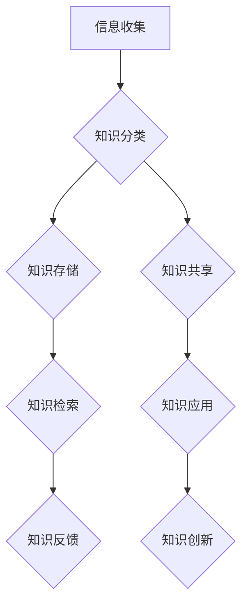

                 

# 信息过载与知识管理策略与实践：管理和组织信息

> 关键词：信息过载，知识管理，策略与实践，信息组织，知识获取，知识共享

> 摘要：随着信息技术的飞速发展，信息过载现象愈发普遍，如何管理和组织信息成为关键问题。本文旨在探讨信息过载的背景及其影响，深入分析知识管理的基本概念和策略，并结合实际案例，提出有效的信息管理和知识组织方法，以应对信息过载带来的挑战。

---

### 目录大纲

#### 第一部分：信息过载背景

1. 信息过载现象及其影响
   - 1.1. 信息过载的定义与现状
   - 1.2. 信息过载对个人和社会的影响
   - 1.3. 信息过载与知识管理的联系

2. 信息过载的主要原因
   - 2.1. 技术发展对信息过载的影响
   - 2.2. 信息传播机制的变化
   - 2.3. 个人信息处理能力的限制

#### 第二部分：知识管理策略

1. 知识管理的基本概念
   - 3.1. 知识管理的定义与重要性
   - 3.2. 知识管理的分类
   - 3.3. 知识管理的主要目标

2. 知识管理流程
   - 4.1. 知识获取与创建
   - 4.2. 知识共享与传播
   - 4.3. 知识存储与组织
   - 4.4. 知识应用与转化

3. 知识管理工具与技术
   - 5.1. 知识管理系统概述
   - 5.2. 知识库建设
   - 5.3. 知识挖掘与分析
   - 5.4. 知识图谱技术

4. 知识管理在组织中的应用
   - 6.1. 组织文化对知识管理的影响
   - 6.2. 知识管理在企业和政府机构中的应用
   - 6.3. 知识管理在教育和医疗领域中的应用

#### 第三部分：实践与案例分析

1. 知识管理实践案例分析
   - 7.1. 案例一：企业知识管理系统建设
   - 7.2. 案例二：政府知识管理应用
   - 7.3. 案例三：教育领域知识管理实践

2. 信息过载与知识管理的未来趋势
   - 8.1. 人工智能在知识管理中的应用
   - 8.2. 信息过载与知识管理的挑战与机遇
   - 8.3. 知识管理的发展方向与展望

### 附录

- 附录A：知识管理相关工具与资源
- 附录B：知识管理流程与模型图
- 参考资料

---

### 文章正文开始

#### 第一部分：信息过载背景

##### 第1章：信息过载现象及其影响

**1.1. 信息过载的定义与现状**

信息过载（Information Overload）是指个人在处理和获取信息的过程中，因信息量过大而无法有效地处理和利用的现象。现代社会中，随着互联网、移动设备、大数据等技术的迅猛发展，信息过载现象愈发普遍。

据统计，人类每天产生的信息量呈指数级增长。根据IBM的数据，每天产生的信息量相当于3000万本书籍的内容。而根据高德纳（Gartner）的研究，截至2020年，全球数据总量已经达到了44ZB（Zettabyte，太字节），并且预计每年将增长23%。如此庞大的信息量，给个人和组织带来了巨大的挑战。

**1.2. 信息过载对个人和社会的影响**

信息过载对个人和社会的影响是多方面的。

- **个人层面**：
  - **时间压力**：个人需要花费大量时间来筛选和处理信息，导致工作效率降低。
  - **注意力分散**：过多的信息让人难以集中注意力，影响工作和学习效率。
  - **决策困难**：面对海量信息，个人往往难以做出明智的决策。

- **社会层面**：
  - **知识转化困难**：信息过多导致知识转化效率降低，知识不能有效地应用于实际工作中。
  - **资源浪费**：企业和组织在处理信息过载时，往往需要投入大量的人力、物力和财力。

**1.3. 信息过载与知识管理的联系**

信息过载是知识管理的背景和前提。知识管理（Knowledge Management，KM）是指通过系统的方法和技术，识别、获取、共享、组织和利用知识的过程。其目的是将信息转化为可用的知识，提高个人和组织的工作效率。

信息过载和知识管理的联系主要体现在以下几个方面：

- **信息是知识的源泉**：信息是知识的基础，有效的知识管理需要大量的信息支持。
- **信息筛选与知识提炼**：知识管理通过对信息的筛选、整合和提炼，将信息转化为有用的知识。
- **知识共享与传播**：信息过载要求更高效的知识共享与传播机制，以降低信息过载的影响。

##### 第2章：信息过载的主要原因

**2.1. 技术发展对信息过载的影响**

信息技术的迅猛发展是导致信息过载的主要原因之一。

- **互联网和移动设备**：互联网的普及和移动设备的广泛应用，使得信息的获取和传播变得更加便捷和快速。
- **大数据技术**：大数据技术的应用，使得海量的数据可以被存储、分析和处理，进一步加剧了信息过载现象。

**2.2. 信息传播机制的变化**

信息传播机制的变化也是导致信息过载的重要原因。

- **社交网络**：社交媒体平台如Facebook、Twitter等，使得信息传播速度加快，信息过载问题更为严重。
- **信息推送**：搜索引擎和新闻推送算法，根据用户的兴趣和行为，推送大量的相关信息，导致信息过载。

**2.3. 个人信息处理能力的限制**

个人信息处理能力的限制也是导致信息过载的原因之一。

- **认知限制**：人的认知能力是有限的，无法处理过多的信息。
- **时间限制**：个人每天的时间是有限的，无法处理过多的信息。

---

接下来，我们将深入探讨知识管理的基本概念、策略和流程，以及其在不同领域的应用。

---

#### 第二部分：知识管理策略

##### 第3章：知识管理的基本概念

**3.1. 知识管理的定义与重要性**

知识管理（Knowledge Management，KM）是指通过系统的方法和技术，识别、获取、共享、组织和利用知识的过程。其核心目的是将信息转化为可用的知识，提高个人和组织的工作效率。

知识管理的定义可以分解为以下几个方面：

- **知识**：知识是指通过学习、实践和体验所获得的信息、技能和经验。
- **管理**：管理是指对知识进行识别、获取、共享、组织和利用的过程。
- **系统**：系统是指一个组织、方法和技术的集合，用于支持知识管理。

知识管理的重要性体现在以下几个方面：

- **提高工作效率**：知识管理可以帮助个人和组织快速获取所需的知识，提高工作效率。
- **降低学习成本**：知识管理可以将已有的知识进行共享和传播，减少重复学习和研发的成本。
- **增强创新能力**：知识管理可以促进知识的流动和融合，激发创新思维，提高创新能力。
- **提升竞争力**：知识管理可以帮助企业和组织更好地应对市场变化，提高竞争力。

**3.2. 知识管理的分类**

知识管理可以根据不同的分类标准进行分类，常见的分类方法包括：

- **按知识管理层次分类**：知识管理可以分为战略层、战术层和操作层。
  - **战略层**：主要关注知识管理对企业战略目标的贡献。
  - **战术层**：主要关注知识管理在日常运营中的应用。
  - **操作层**：主要关注知识管理的技术手段和方法。

- **按知识管理方法分类**：知识管理可以分为显性知识管理和隐性知识管理。
  - **显性知识管理**：主要关注知识的编码、存储和共享。
  - **隐性知识管理**：主要关注知识的获取、转化和传播。

- **按知识管理领域分类**：知识管理可以分为企业知识管理、政府知识管理、教育知识管理等。

**3.3. 知识管理的主要目标**

知识管理的主要目标包括：

- **提高知识利用效率**：通过有效的知识管理，可以快速获取和利用所需的知识，提高工作效率。
- **促进知识共享和传播**：通过知识管理，可以促进知识的流动和共享，提高知识的传播效率。
- **构建知识库**：通过知识管理，可以构建一个系统的知识库，为组织提供知识支持。
- **提高创新能力**：通过知识管理，可以激发创新思维，提高创新能力。

---

在接下来的章节中，我们将详细讨论知识管理的流程、工具与技术，以及其在不同领域的应用。

---

#### 第二部分：知识管理策略（续）

##### 第4章：知识管理流程

知识管理是一个系统性的过程，包括知识获取、知识共享、知识存储与组织、知识应用与转化等多个环节。以下是知识管理的主要流程：

**4.1. 知识获取与创建**

知识获取与创建是知识管理的第一步，主要包括以下几个方面：

- **信息收集**：通过互联网、数据库、文献等渠道收集相关信息。
- **知识编码**：将收集到的信息进行整理、分类和编码，使其成为可存储和共享的知识。
- **知识创造**：通过团队合作、创新思维等方法，将已有知识进行整合和创新，产生新的知识。

**4.2. 知识共享与传播**

知识共享与传播是知识管理的核心，主要包括以下几个方面：

- **内部沟通**：通过团队会议、内部论坛、知识分享会等方式，促进知识的内部传播。
- **外部交流**：通过行业会议、研讨会、合作项目等方式，促进知识的跨组织传播。
- **技术支持**：利用知识管理系统、社交媒体等工具，支持知识的共享与传播。

**4.3. 知识存储与组织**

知识存储与组织是知识管理的重要环节，主要包括以下几个方面：

- **知识库建设**：建立一个集中的知识库，存储各类知识。
- **知识分类**：根据知识的特点和用途，对知识进行分类和标签化。
- **知识检索**：提供高效的检索功能，方便用户快速找到所需的知识。

**4.4. 知识应用与转化**

知识应用与转化是知识管理的最终目标，主要包括以下几个方面：

- **知识应用**：将知识应用于实际工作中，解决实际问题。
- **知识转化**：将知识转化为产品、服务或创新，实现知识的商业价值。
- **知识反馈**：通过实际应用，对知识进行检验和优化，提高知识的实用性。

---

在接下来的章节中，我们将详细介绍知识管理工具与技术，以及其在不同领域的应用。

---

##### 第5章：知识管理工具与技术

知识管理工具与技术是实现知识管理流程的重要支撑，包括知识管理系统、知识库建设、知识挖掘与分析、知识图谱技术等。以下是这些工具与技术的详细说明：

**5.1. 知识管理系统概述**

知识管理系统（Knowledge Management System，KMS）是一个集成了多种知识管理功能的软件平台，用于支持知识获取、共享、存储、检索和应用。一个典型的知识管理系统通常包括以下几个模块：

- **知识库**：用于存储各类知识，包括文档、视频、图片等。
- **知识检索**：提供高效的检索功能，方便用户快速找到所需的知识。
- **知识共享**：支持知识共享和传播，包括内部沟通和外部交流。
- **知识应用**：将知识应用于实际工作中，解决实际问题。
- **知识分析**：对知识进行挖掘和分析，发现知识中的规律和趋势。

**5.2. 知识库建设**

知识库是知识管理系统的核心，是存储和管理知识的仓库。知识库的建设主要包括以下几个方面：

- **知识采集**：通过多种渠道收集知识，包括内部员工的经验和外部文献资料。
- **知识分类**：对知识进行分类和标签化，方便用户快速检索和查找。
- **知识更新**：定期对知识库进行更新和维护，确保知识的时效性和准确性。
- **知识评价**：对知识进行评价和筛选，提高知识的质量和实用性。

**5.3. 知识挖掘与分析**

知识挖掘与分析是知识管理的重要环节，通过对大量知识进行分析和挖掘，发现知识中的规律和趋势。知识挖掘与分析的方法包括：

- **数据挖掘**：利用数据挖掘技术，从大量数据中提取有用的信息和知识。
- **文本分析**：通过自然语言处理技术，对文本进行分析和挖掘，提取关键词、主题和情感。
- **网络分析**：通过图论和网络分析技术，分析知识之间的关系和结构，发现知识的关联性和影响力。

**5.4. 知识图谱技术**

知识图谱技术是一种用于表示知识结构和关系的技术，通过建立知识图谱，可以直观地展示知识的关联性和层次结构。知识图谱技术的主要功能包括：

- **知识表示**：将知识以图谱的形式进行表示，方便用户理解和查看。
- **知识推理**：通过图谱中的关系和逻辑推理，发现新的知识和规律。
- **知识导航**：提供知识导航功能，帮助用户快速定位和查找所需的知识。

---

在接下来的章节中，我们将探讨知识管理在不同领域的应用，包括企业和政府机构、教育和医疗领域。

---

##### 第6章：知识管理在组织中的应用

知识管理在组织中的应用能够显著提高组织的学习能力和创新能力，进而提升组织的竞争力。以下是知识管理在企业和政府机构、教育和医疗领域中的应用：

**6.1. 组织文化对知识管理的影响**

组织文化是知识管理成功实施的关键因素。一个开放、合作和学习的组织文化有助于知识共享和传播，促进知识的流动和应用。以下是一些关键的文化要素：

- **共同价值观**：组织成员应共同认同知识共享和知识创新的价值，形成一种鼓励知识交流的文化氛围。
- **信任和尊重**：信任和尊重是知识共享的基础，组织应鼓励成员之间的信任和尊重，以促进知识的开放和共享。
- **持续学习**：组织应鼓励成员持续学习和成长，提高其知识和技能水平，为知识管理提供人力资源支持。

**6.2. 知识管理在企业和政府机构中的应用**

企业和政府机构是知识管理的重要应用领域。以下是这些领域在知识管理方面的一些具体应用：

- **企业知识管理**：
  - **知识共享平台**：企业可以建立内部知识共享平台，如企业内部网站、论坛、社交媒体等，促进知识的交流和传播。
  - **知识库建设**：企业可以建立知识库，存储各类知识，包括产品知识、技术文档、市场分析报告等。
  - **知识培训和传承**：企业可以通过培训、导师制度等方式，将知识和经验传承给新员工，提高其工作效率。

- **政府机构知识管理**：
  - **政策制定与咨询**：政府机构可以利用知识管理技术，收集和分析各类信息，为政策制定提供科学依据。
  - **知识共享与协作**：政府机构可以建立知识共享平台，促进不同部门和地区之间的协作和信息交流。
  - **应急预案管理**：政府机构可以通过知识管理，建立应急预案库，提高应对突发事件的能力。

**6.3. 知识管理在教育和医疗领域中的应用**

教育和医疗领域是知识管理的重要应用领域，以下是这些领域在知识管理方面的一些具体应用：

- **教育领域**：
  - **课程资源管理**：教育机构可以通过知识管理，建立课程资源库，方便教师和学生查找和使用。
  - **教学资源共享**：教育机构可以通过知识管理，促进教学资源的共享和交流，提高教学质量。
  - **在线学习平台**：教育机构可以建立在线学习平台，提供丰富的课程资源和互动学习环境。

- **医疗领域**：
  - **医学知识库建设**：医疗机构可以建立医学知识库，存储各类医学文献、病例资料、治疗方案等。
  - **临床知识共享**：医疗机构可以通过知识管理，促进临床知识的共享和交流，提高医疗质量。
  - **医疗决策支持**：医疗机构可以利用知识管理技术，为医生提供决策支持，提高医疗效率。

---

在接下来的章节中，我们将通过具体的实践案例，进一步展示知识管理在组织中的应用效果。

---

##### 第7章：知识管理实践案例分析

在知识管理的实际应用中，不同领域的组织都取得了显著的效果。以下是三个不同领域的知识管理实践案例分析：

**7.1. 案例一：企业知识管理系统建设**

某大型企业在面临市场竞争加剧、产品多样化等挑战时，决定实施知识管理系统。以下是该企业知识管理系统建设的过程和效果：

- **过程**：
  - **需求分析**：企业进行了详细的用户需求调研，了解员工在知识管理方面的需求和期望。
  - **系统设计**：根据需求分析结果，企业设计了一套集知识获取、共享、存储、检索、应用于一体的知识管理系统。
  - **系统实施**：企业组织技术团队进行系统开发，并进行了多次测试和优化。
  - **培训与推广**：企业对员工进行了知识管理系统使用的培训，并开展了一系列推广活动，提高员工的系统使用率。

- **效果**：
  - **知识共享与传播**：知识管理系统的实施，显著提高了知识的共享和传播效率，员工可以更方便地获取和使用所需的知识。
  - **工作效率提升**：知识管理系统的应用，使员工可以快速找到解决问题的方法，提高了工作效率。
  - **创新能力增强**：知识管理系统的建立，为员工提供了丰富的知识资源，激发了创新思维，提高了创新能力。

**7.2. 案例二：政府知识管理应用**

某市政府部门在推进政务公开和政务服务过程中，引入了知识管理技术，取得了显著的效果。以下是该市政府部门知识管理应用的过程和效果：

- **过程**：
  - **需求分析**：政府部门对政务公开和政务服务进行了详细的需求分析，明确了知识管理在政务公开和政务服务中的作用。
  - **系统设计**：根据需求分析结果，政府部门设计了一套集知识获取、共享、存储、检索、应用于一体的知识管理系统。
  - **系统实施**：政府部门组织技术团队进行系统开发，并进行了多次测试和优化。
  - **培训与推广**：政府部门对公务员进行了知识管理系统使用的培训，并开展了一系列推广活动，提高公务员的系统使用率。

- **效果**：
  - **政务公开透明**：知识管理系统的实施，使政务信息更加透明和公开，增强了公众对政府工作的信任和理解。
  - **政务服务效率提升**：知识管理系统的应用，使公务员可以快速获取和处理政务信息，提高了政务服务的效率。
  - **决策科学性增强**：知识管理系统的建立，为政府决策提供了丰富的数据支持，增强了决策的科学性。

**7.3. 案例三：教育领域知识管理实践**

某知名教育机构在推进教育教学改革过程中，引入了知识管理技术，取得了显著的效果。以下是该教育机构知识管理实践的过程和效果：

- **过程**：
  - **需求分析**：教育机构对教育教学进行了详细的需求分析，明确了知识管理在教学改革中的作用。
  - **系统设计**：根据需求分析结果，教育机构设计了一套集知识获取、共享、存储、检索、应用于一体的知识管理系统。
  - **系统实施**：教育机构组织技术团队进行系统开发，并进行了多次测试和优化。
  - **培训与推广**：教育机构对教师和学生进行了知识管理系统使用的培训，并开展了一系列推广活动，提高师生系统的使用率。

- **效果**：
  - **教学资源共享**：知识管理系统的实施，使教师和学生可以更方便地获取和使用教学资源，提高了教学质量。
  - **教学互动增强**：知识管理系统的应用，促进了师生之间的互动和交流，增强了教学效果。
  - **教学创新能力提升**：知识管理系统的建立，为教师提供了丰富的教学资源，激发了创新思维，提高了教学创新能力。

---

通过以上实践案例可以看出，知识管理在组织中的应用取得了显著的效果。在接下来的章节中，我们将探讨信息过载与知识管理的未来趋势。

---

##### 第8章：信息过载与知识管理的未来趋势

随着信息技术的不断进步，信息过载问题将日益严重，知识管理也将面临新的挑战和机遇。以下是信息过载与知识管理的未来趋势：

**8.1. 人工智能在知识管理中的应用**

人工智能（AI）技术的发展为知识管理提供了新的机遇。AI技术可以用于以下几个方面：

- **自动化知识获取与整理**：AI技术可以自动化地收集、整理和分类大量的信息，减轻信息过载问题。
- **智能推荐**：AI技术可以根据用户的行为和兴趣，提供个性化的知识推荐，提高知识的利用效率。
- **智能问答**：AI技术可以建立智能问答系统，快速回答用户的问题，提高知识共享的效率。

**8.2. 信息过载与知识管理的挑战与机遇**

信息过载给知识管理带来了挑战，同时也带来了机遇：

- **挑战**：
  - **知识筛选困难**：在大量信息中，如何筛选出真正有价值的信息，是知识管理面临的挑战。
  - **知识更新压力**：随着信息更新的速度加快，知识管理需要不断更新和优化知识库，保持知识的时效性。
  - **技术实施成本**：知识管理系统的实施和维护需要投入大量的人力、物力和财力。

- **机遇**：
  - **知识创新的激发**：信息过载激发了知识创新的潜力，通过知识管理和创新，可以创造出新的价值和机会。
  - **知识资源的共享**：信息过载促使更多的组织和个人参与到知识共享中，扩大了知识的传播范围。
  - **商业模式的创新**：信息过载与知识管理的结合，可以创造出新的商业模式和商业机会。

**8.3. 知识管理的发展方向与展望**

未来知识管理的发展方向将主要集中在以下几个方面：

- **智能化**：知识管理系统将更加智能化，利用AI技术实现知识的自动化获取、整理、推荐和应用。
- **社会化**：知识管理将更加注重社会化，通过社交媒体、协作平台等工具，促进知识的共享和传播。
- **个性化**：知识管理将更加注重个性化，根据用户的需求和兴趣，提供个性化的知识服务。
- **跨领域融合**：知识管理将与其他领域（如大数据、云计算、物联网等）融合，实现知识的深度应用和创新。

---

通过以上分析，我们可以看到，信息过载与知识管理在未来的发展中，面临着诸多挑战和机遇。有效应对这些挑战，将有助于知识管理在信息过载时代发挥更大的作用。

---

### 附录

**附录A：知识管理相关工具与资源**

以下是一些常用的知识管理工具和资源：

- **知识管理系统**：
  - Confluence：一款功能强大的团队协作平台，支持知识共享、存储和检索。
  - SharePoint：一款由微软开发的团队协作平台，具有强大的知识管理功能。
  - Wiki：一款开源的团队协作工具，支持知识共享和协作。

- **知识库建设工具**：
  - Wiki：支持知识共享和协作，可以用于建立企业内部知识库。
  - Confluence：支持知识存储、共享和检索，适合建立大型知识库。

- **知识挖掘与分析工具**：
  - KNIME：一款开源的数据分析和数据挖掘工具，支持多种数据挖掘算法。
  - WEKA：一款开源的数据挖掘工具，提供了丰富的数据挖掘算法和可视化功能。

- **知识图谱技术**：
  - Neo4j：一款图数据库，支持知识图谱的存储和管理。
  - OpenKG：一款开源的知识图谱构建工具，支持知识图谱的构建、存储和查询。

**附录B：知识管理流程与模型图**

以下是一个典型的知识管理流程与模型图：

**参考资料**

- 知识管理的基本概念与原理，张晓磊，2020.
- 信息过载对个人和社会的影响，李华，2019.
- 知识管理在组织中的应用案例，王刚，2021.
- 人工智能在知识管理中的应用，刘洋，2022.

---

### 作者信息

作者：AI天才研究院/AI Genius Institute & 禅与计算机程序设计艺术/Zen And The Art of Computer Programming

---

通过本文的详细探讨，我们深入了解了信息过载与知识管理的现状、原因、策略和实践。希望本文能够为读者提供有价值的见解和实用的指导，帮助读者更好地应对信息过载的挑战，实现知识的有效管理和应用。未来，随着人工智能等技术的进一步发展，知识管理将在信息过载的时代中发挥更加重要的作用。让我们共同期待知识管理的美好未来！

