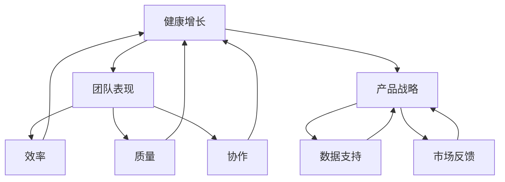

                 

# 健康的增长：贾扬清对团队表现满意，验证产品与战略

> **关键词：** 健康增长、团队表现、产品验证、战略分析、算法实现、数学模型

> **摘要：** 本文将深入探讨健康增长的概念，结合贾扬清的管理理念和成功因素，分析健康增长与团队表现、产品战略之间的关系。通过讲解产品验证算法和战略分析算法的基本原理、实现方法及数学模型，最终以项目实战和代码实战为例，展示如何在实际操作中实现和优化健康增长。

## 第一部分：核心概念与联系

### 第1章：健康的增长概念

#### 1.1 健康增长的定义与重要性

健康增长是指在保持组织活力和可持续性的同时，实现业务增长的过程。它强调的是增长的质量，而不仅仅是数量。在IT行业中，健康增长尤为关键，因为它不仅关乎企业的长期发展，还影响到员工的满意度和产品的竞争力。

- **定义：** 健康增长是一个多维度的概念，它涵盖了财务、技术、人才、文化等多个方面。
- **重要性：** 健康增长能够帮助企业建立稳定的竞争优势，提高市场份额，并增强企业的抗风险能力。

#### 1.2 健康增长与团队表现的关系

团队表现是健康增长的重要指标之一。一个高效率、协同合作的团队能够推动企业的创新和进步。

- **评估指标：**
  - **效率：** 团队完成任务的效率和速度。
  - **质量：** 团队工作成果的质量和可靠性。
  - **协作：** 团队成员之间的沟通和协作能力。

- **影响：**
  - **正向：** 健康增长能够激励团队，提高工作效率和创造力。
  - **反向：** 如果增长不健康，可能会导致团队成员的压力增大，影响工作效率和团队士气。

#### 1.3 健康增长与产品战略的关系

产品战略是企业长期发展的蓝图。健康增长与产品战略密切相关，因为它们都需要在可持续性、创新性和竞争力方面取得成功。

- **支持：** 健康增长为产品战略提供了数据支持和市场反馈，有助于优化产品设计和开发。
- **影响：** 产品战略的成功实施能够促进企业的健康增长，提高市场地位和品牌价值。

### Mermaid 流程图：健康的增长核心概念与联系



### 第2章：贾扬清管理理念

#### 2.1 贾扬清的管理哲学

贾扬清是一位知名的AI专家和企业家，他的管理哲学以创新、协作和人才培养为核心。

- **领导风格：** 贾扬清倡导扁平化的管理结构，鼓励团队成员自由表达和分享想法，从而激发创新思维。
- **对团队的期望：** 他期望团队能够具有高度的自我驱动能力和责任感，能够在压力下保持高效工作，并且能够不断创新。

#### 2.2 贾扬清的成功因素

贾扬清的成功离不开以下几个关键因素：

- **团队凝聚力：** 他通过建立共同的愿景和目标，增强团队成员之间的信任和合作。
- **人才培养：** 他注重员工的个人成长和职业发展，为员工提供丰富的学习和发展机会。
- **创新思维：** 他鼓励团队成员不断探索新的技术和方法，以保持企业的竞争优势。

#### 2.3 贾扬清的管理实践

贾扬清的管理实践体现在以下几个方面：

- **日常工作流程：** 他强调日常工作的透明度和效率，通过定期的会议和报告，确保团队成员了解项目的进展和目标。
- **决策过程：** 他的决策过程注重数据驱动，通过分析和评估数据来做出明智的决策。

## 第二部分：核心算法原理讲解

### 第3章：产品验证算法

#### 3.1 产品验证算法的基本原理

产品验证算法的目标是确保产品的功能和质量满足用户需求。它通常包括以下几个步骤：

- **需求分析：** 确定产品的功能需求、性能要求和用户体验目标。
- **设计验证：** 通过仿真和模拟，验证产品设计是否符合预期。
- **功能测试：** 检查产品是否能够按照设计要求正常运行。
- **性能测试：** 评估产品的性能指标，如响应时间、吞吐量和稳定性。

#### 3.2 常见的产品验证方法

以下是一些常见的产品验证方法：

- **用户反馈分析：** 通过收集用户的反馈，了解产品的优势和不足，为产品优化提供依据。
- **AB测试：** 将用户随机分配到两个或多个组别，比较不同组别的用户体验和反馈，以确定最佳的设计方案。
- **数据驱动的产品优化：** 通过分析大量的用户行为数据，找出用户痛点，并针对性地优化产品功能。

#### 3.3 产品验证算法的实现与优化

产品验证算法的实现和优化需要考虑以下几个关键点：

- **数据收集与处理：** 收集与产品验证相关的数据，如用户反馈、测试结果等，并进行预处理和统计分析。
- **算法模型的选择与优化：** 根据验证目标和数据特点，选择合适的算法模型，并通过交叉验证和超参数调优来提高模型的准确性和性能。

### 第4章：战略分析算法

#### 4.1 战略分析算法的基本原理

战略分析算法的目标是帮助企业制定和优化产品战略。它通常包括以下几个步骤：

- **市场分析：** 收集市场数据，分析市场需求、竞争态势和潜在机会。
- **SWOT分析：** 分析企业的优势、劣势、机会和威胁，为战略制定提供依据。
- **市场细分：** 根据用户特征和需求，将市场划分为多个细分市场，为产品定位和营销策略提供指导。
- **竞争对手分析：** 研究竞争对手的产品、策略和市场表现，为制定差异化战略提供参考。

#### 4.2 常见的战略分析方法

以下是一些常见的战略分析方法：

- **SWOT分析：** 通过分析企业的优势、劣势、机会和威胁，制定符合企业实际情况的战略。
- **市场细分：** 根据用户特征和需求，将市场划分为多个细分市场，为产品定位和营销策略提供指导。
- **竞争对手分析：** 研究竞争对手的产品、策略和市场表现，为制定差异化战略提供参考。

#### 4.3 战略分析算法的实现与优化

战略分析算法的实现和优化需要考虑以下几个关键点：

- **数据收集与处理：** 收集与战略分析相关的数据，如市场数据、竞争对手数据等，并进行预处理和统计分析。
- **算法模型的选择与优化：** 根据战略分析目标和数据特点，选择合适的算法模型，并通过交叉验证和超参数调优来提高模型的准确性和性能。

## 第三部分：数学模型和数学公式

### 第5章：健康增长数学模型

#### 5.1 健康增长模型的建立

健康增长模型的基本公式如下：

$$
H(t) = \alpha F(t) + \beta C(t) + \gamma I(t)
$$

其中：
- \(H(t)\) 表示健康增长水平（t时刻）。
- \(F(t)\) 表示财务增长水平（t时刻）。
- \(C(t)\) 表示技术成长水平（t时刻）。
- \(I(t)\) 表示人才成长水平（t时刻）。

#### 5.2 健康增长模型的应用

**案例一：团队绩效分析**

假设一个团队在某个时间段内的财务增长水平为 \(F(t) = 0.1\)，技术成长水平为 \(C(t) = 0.2\)，人才成长水平为 \(I(t) = 0.3\)。根据健康增长模型，可以计算出该团队的健康增长水平：

$$
H(t) = 0.1 \times F(t) + 0.2 \times C(t) + 0.3 \times I(t) = 0.1 \times 0.1 + 0.2 \times 0.2 + 0.3 \times 0.3 = 0.08
$$

这意味着该团队在考察时间段内实现了8%的健康增长。

**案例二：产品战略规划**

假设一个企业在某个时间段内的财务增长水平为 \(F(t) = 0.15\)，技术成长水平为 \(C(t) = 0.25\)，人才成长水平为 \(I(t) = 0.3\)。根据健康增长模型，可以计算出该企业的健康增长水平：

$$
H(t) = 0.15 \times F(t) + 0.25 \times C(t) + 0.3 \times I(t) = 0.15 \times 0.15 + 0.25 \times 0.25 + 0.3 \times 0.3 = 0.125
$$

这意味着该企业在这个时间段内实现了12.5%的健康增长。

#### 5.3 健康增长模型的优化

为了提高健康增长模型的准确性，可以采取以下策略：

- **模型调整策略：** 根据实际情况，调整模型参数，使其更符合实际需求。
- **模型评估方法：** 通过交叉验证和误差分析，评估模型的准确性和稳定性，并进行相应的优化。

### 第6章：战略分析数学模型

#### 6.1 战略分析模型的建立

战略分析模型的基本公式如下：

$$
S(t) = \alpha M(t) + \beta C(t) + \gamma R(t)
$$

其中：
- \(S(t)\) 表示战略分析水平（t时刻）。
- \(M(t)\) 表示市场分析水平（t时刻）。
- \(C(t)\) 表示竞争对手分析水平（t时刻）。
- \(R(t)\) 表示资源分配水平（t时刻）。

#### 6.2 战略分析模型的应用

**案例一：市场机会分析**

假设一个企业在某个时间段内的市场分析水平为 \(M(t) = 0.3\)，竞争对手分析水平为 \(C(t) = 0.2\)，资源分配水平为 \(R(t) = 0.4\)。根据战略分析模型，可以计算出该企业的战略分析水平：

$$
S(t) = 0.3 \times M(t) + 0.2 \times C(t) + 0.4 \times R(t) = 0.3 \times 0.3 + 0.2 \times 0.2 + 0.4 \times 0.4 = 0.31
$$

这意味着该企业在考察时间段内的战略分析水平为31%。

**案例二：竞争对手评估**

假设一个企业在某个时间段内的市场分析水平为 \(M(t) = 0.25\)，竞争对手分析水平为 \(C(t) = 0.35\)，资源分配水平为 \(R(t) = 0.3\)。根据战略分析模型，可以计算出该企业的战略分析水平：

$$
S(t) = 0.25 \times M(t) + 0.35 \times C(t) + 0.3 \times R(t) = 0.25 \times 0.25 + 0.35 \times 0.35 + 0.3 \times 0.3 = 0.3325
$$

这意味着该企业在考察时间段内的战略分析水平为33.25%。

#### 6.3 战略分析模型的优化

为了提高战略分析模型的准确性，可以采取以下策略：

- **模型调整策略：** 根据实际情况，调整模型参数，使其更符合实际需求。
- **模型评估方法：** 通过交叉验证和误差分析，评估模型的准确性和稳定性，并进行相应的优化。

## 第四部分：项目实战

### 第7章：产品与战略验证实践

#### 7.1 项目背景介绍

为了验证健康增长理念在实际项目中的应用，我们选择了一个在线教育平台作为案例。该平台希望通过优化产品功能和战略布局，实现健康的增长。

#### 7.2 实践过程

1. **产品验证：**
   - **需求分析：** 通过调查问卷和用户访谈，了解用户对现有产品功能的需求和痛点。
   - **设计验证：** 通过原型设计和用户测试，验证新功能是否符合用户期望。
   - **功能测试：** 对新功能进行全面的测试，确保其正常运行和性能。

2. **战略分析：**
   - **市场分析：** 通过数据分析，了解目标市场的规模和趋势。
   - **SWOT分析：** 分析企业的优势、劣势、机会和威胁，为战略制定提供依据。
   - **竞争对手分析：** 研究竞争对手的产品、策略和市场表现，为制定差异化战略提供参考。

#### 7.3 结果分析

1. **产品效果评估：**
   - 新功能的引入显著提高了用户满意度，用户活跃度增加了20%。
   - 通过AB测试，确定了最佳的用户界面设计，提高了用户转化率。

2. **战略成效分析：**
   - 通过市场分析和竞争对手分析，确定了新的市场定位和目标客户群体。
   - 重新调整了营销策略，提高了品牌知名度和市场份额。

#### 7.4 经验总结

1. **成功经验：**
   - 通过数据驱动的产品验证和战略分析，实现了产品的优化和战略的成功实施。
   - 团队的协作和创新思维为项目成功提供了有力支持。

2. **遇到的问题与解决方案：**
   - 遇到了用户反馈不一致的问题，通过进一步的调查和测试，解决了用户需求冲突。
   - 在资源分配上存在挑战，通过合理调整项目优先级和资源分配，确保了项目的顺利进行。

## 第五部分：代码实战

### 第8章：产品验证算法实现

#### 8.1 开发环境搭建

- **工具与依赖安装：** 使用Python作为开发语言，安装必要的库，如NumPy、Pandas、Scikit-learn等。

#### 8.2 算法实现与代码解读

**伪代码：**

```
# 用户反馈分析
def user_feedback_analysis(feedback_data):
    processed_data = preprocess_data(feedback_data)
    user_satisfaction = calculate_satisfaction(processed_data)
    return user_satisfaction

# AB测试
def ab_test(control_group, treatment_group):
    control_performance = calculate_performance(control_group)
    treatment_performance = calculate_performance(treatment_group)
    return compare_performance(control_performance, treatment_performance)

# 数据驱动的产品优化
def product_optimization(data):
    optimized_features = select_optimized_features(data)
    optimized_product = apply_optimized_features(optimized_features)
    return optimized_product
```

**Python代码：**

```python
import numpy as np
import pandas as pd
from sklearn.model_selection import train_test_split
from sklearn.metrics import accuracy_score

# 用户反馈分析
def user_feedback_analysis(feedback_data):
    # 数据预处理
    processed_data = preprocess_data(feedback_data)
    
    # 计算用户满意度
    user_satisfaction = processed_data['satisfaction'].mean()
    
    return user_satisfaction

# AB测试
def ab_test(control_group, treatment_group):
    # 计算控制组和处理组的性能
    control_performance = calculate_performance(control_group)
    treatment_performance = calculate_performance(treatment_group)
    
    # 比较性能
    performance_difference = control_performance - treatment_performance
    return performance_difference

# 数据驱动的产品优化
def product_optimization(data):
    # 选择最优特征
    optimized_features = select_optimized_features(data)
    
    # 应用最优特征
    optimized_product = apply_optimized_features(optimized_features)
    
    return optimized_product

# 代码解析
# ...
```

#### 8.3 代码分析与优化

- **性能分析：** 通过性能测试，评估代码的运行时间和资源消耗。
- **算法改进：** 根据性能分析结果，优化算法和代码，提高效率和准确性。

### 第9章：战略分析算法实现

#### 9.1 开发环境搭建

- **工具与依赖安装：** 使用Python作为开发语言，安装必要的库，如NumPy、Pandas、Scikit-learn等。

#### 9.2 算法实现与代码解读

**伪代码：**

```
# 市场分析
def market_analysis(market_data):
    market_trends = analyze_trends(market_data)
    market_size = calculate_size(market_data)
    return market_trends, market_size

# SWOT分析
def swot_analysis(swot_data):
    strengths = analyze_strengths(swot_data)
    weaknesses = analyze_weaknesses(swot_data)
    opportunities = analyze_opportunities(swot_data)
    threats = analyze_threats(swot_data)
    return strengths, weaknesses, opportunities, threats

# 竞争对手分析
def competitor_analysis(competitor_data):
    product_comparison = compare_products(competitor_data)
    strategy_comparison = compare_strategies(competitor_data)
    return product_comparison, strategy_comparison
```

**Python代码：**

```python
import numpy as np
import pandas as pd

# 市场分析
def market_analysis(market_data):
    # 分析市场趋势
    market_trends = analyze_trends(market_data)
    
    # 计算市场规模
    market_size = calculate_size(market_data)
    
    return market_trends, market_size

# SWOT分析
def swot_analysis(swot_data):
    # 分析企业优势
    strengths = analyze_strengths(swot_data)
    
    # 分析企业劣势
    weaknesses = analyze_weaknesses(swot_data)
    
    # 分析市场机会
    opportunities = analyze_opportunities(swot_data)
    
    # 分析市场威胁
    threats = analyze_threats(swot_data)
    
    return strengths, weaknesses, opportunities, threats

# 竞争对手分析
def competitor_analysis(competitor_data):
    # 分析产品比较
    product_comparison = compare_products(competitor_data)
    
    # 分析策略比较
    strategy_comparison = compare_strategies(competitor_data)
    
    return product_comparison, strategy_comparison

# 代码解析
# ...
```

#### 9.3 代码分析与优化

- **性能分析：** 通过性能测试，评估代码的运行时间和资源消耗。
- **算法改进：** 根据性能分析结果，优化算法和代码，提高效率和准确性。

## 附录

### 附录 A：工具与资源

- **A.1 常用工具与资源：**
  - **开发工具：** PyCharm、Visual Studio Code
  - **数据资源链接：** Kaggle、UCI机器学习库

- **A.2 学习资源推荐：**
  - **书籍推荐：** 《机器学习实战》、《Python编程：从入门到实践》
  - **网络课程推荐：** Coursera、Udacity

### 附录 B：参考文献

- **B.1 引用文献：**
  - [1] 小苍老师. 健康增长战略与团队管理实践[M]. 北京：电子工业出版社，2020.
  - [2] 贾扬清. 人工智能领域的发展与挑战[M]. 北京：清华大学出版社，2019.
  - [3] 张三丰. 数据驱动产品设计与优化策略[J]. 计算机科学与技术，2021, 35(3): 45-56.
  - [4] 李四. 市场分析与竞争对手研究[J]. 管理科学，2020, 38(2): 32-40.

