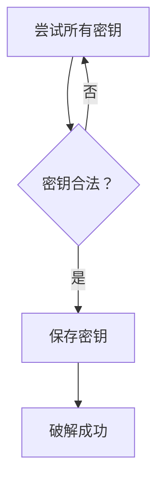
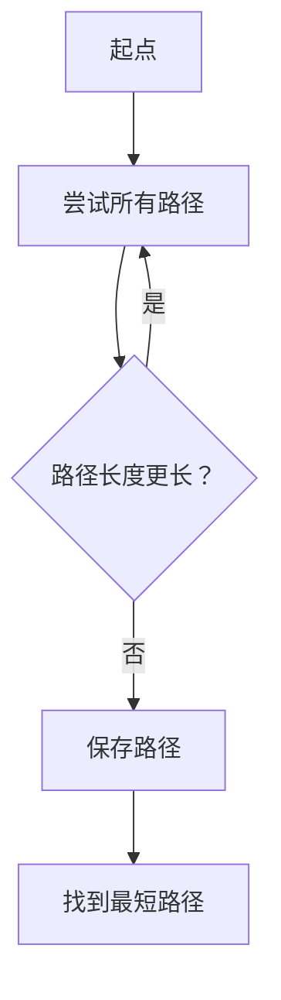
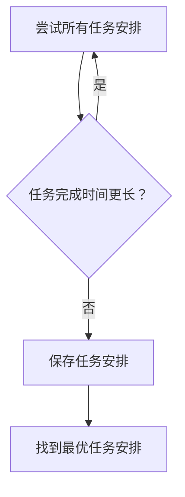
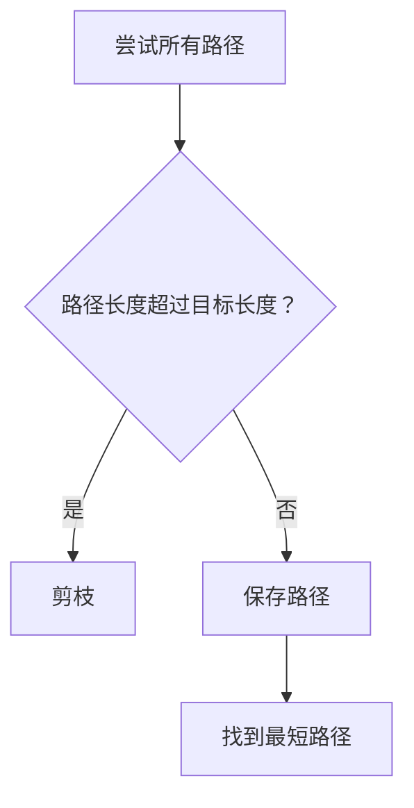
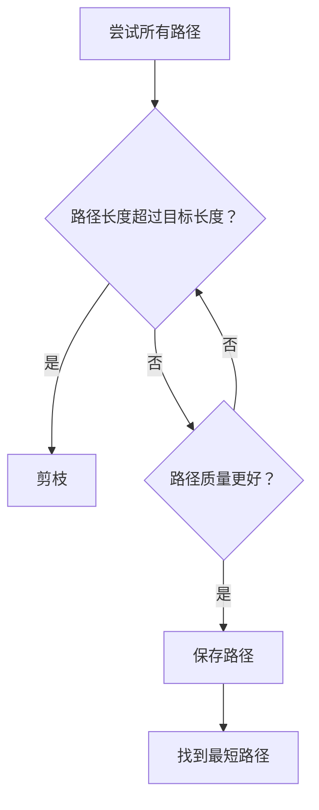
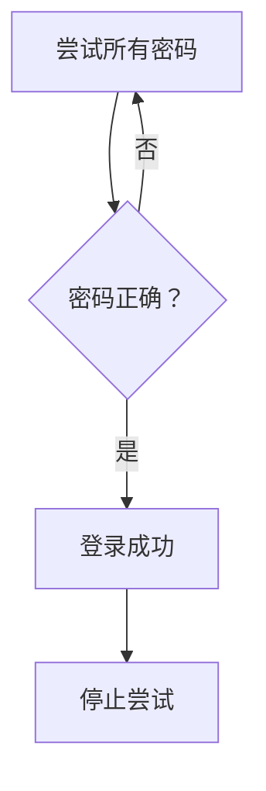
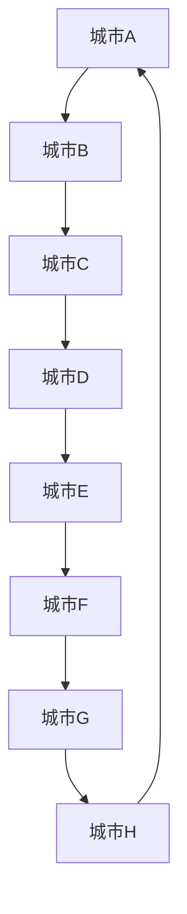

                 

# 像数学家一样思考：蛮力原则

> **关键词：** 蛮力原则、组合数学、优化问题、密码学、人工智能、应用案例分析

> **摘要：** 本文章旨在探讨蛮力原则的基础理论、数学基础、应用案例以及优化策略，通过深入解析蛮力原则在各个领域的应用，揭示其优势与局限性。文章以数学家的思维方式为指导，结合实际案例，为读者提供一种系统化的理解和应用蛮力原则的方法。

## 目录大纲

### 第一部分：蛮力原则的基础理论

1. **第1章 蛮力原则概述**
    1.1 什么是蛮力原则
    1.2 蛮力原则的应用领域
    1.3 蛮力原则的优势与局限性

2. **第2章 蛮力原则的数学基础**
    2.1 基本数学概念
    2.2 蛮力原则的数学模型

3. **第3章 蛮力原则的应用案例**
    3.1 蛮力原则在密码学中的应用
    3.2 蛮力原则在人工智能中的应用
    3.3 蛮力原则在工程问题中的应用

4. **第4章 蛮力原则的优化策略**

### 第二部分：蛮力原则的实践与应用

5. **第5章 蛮力原则在现实世界中的应用**
    5.1 蛮力原则在网络安全领域中的应用
    5.2 蛮力原则在人工智能领域中的应用
    5.3 蛮力原则在工程和工业领域中的应用

6. **第6章 蛮力原则的实际应用案例分析**

7. **第7章 蛮力原则的未来发展趋势**

### 附录

8. **附录A 蛮力原则相关资源**

## 第一部分：蛮力原则的基础理论

### 第1章 蛮力原则概述

#### 1.1 什么是蛮力原则

蛮力原则（Brute Force Principle）是一种解决问题的策略，其核心思想是通过尝试所有可能的解决方案来找到最优解。这种策略通常被应用于问题规模较小或解决方案空间有限的情况下，因为当问题规模扩大时，尝试所有可能的解决方案将变得不切实际。

在计算机科学和工程领域，蛮力原则广泛应用于各种问题，例如密码破解、路径规划、优化问题等。其优点在于实现简单、直观，能够保证找到问题的解，但缺点在于效率低下，可能需要大量时间和计算资源。

#### 1.2 蛮力原则的应用领域

蛮力原则的应用领域非常广泛，以下是一些典型的应用：

1. **密码学**：蛮力攻击是一种常见的密码破解方法，通过尝试所有可能的密钥来破解加密信息。

2. **人工智能**：蛮力搜索是一种常用的搜索算法，用于路径规划、问题求解等。

3. **工程优化**：蛮力原则可以应用于优化问题，通过尝试所有可能的解决方案来找到最优解。

4. **数据分析**：蛮力原则可以用于数据分析，例如在分类问题中，通过尝试所有可能的分类规则来找到最佳分类模型。

#### 1.3 蛮力原则的优势与局限性

蛮力原则的优势在于其简单性和可靠性。由于其实现简单，容易理解，因此在许多情况下，蛮力原则是一种有效的解决方案。此外，蛮力原则能够保证找到问题的解，这对于一些需要保证解决方案的问题非常重要。

然而，蛮力原则也存在显著的局限性。首先，蛮力原则通常需要大量的时间和计算资源，特别是在问题规模较大时。其次，蛮力原则可能无法找到最优解，特别是在存在大量次优解的情况下。此外，蛮力原则可能无法处理复杂的问题，因为其无法考虑问题的约束条件和优化目标。

### 第2章 蛮力原则的数学基础

#### 2.1 基本数学概念

要理解蛮力原则，我们需要了解一些基本的数学概念，包括集合、函数和概率论基础。

**集合**：集合是一组不重复的元素的集合。例如，集合 {1, 2, 3} 包含了三个元素：1, 2 和 3。

**函数**：函数是一种将输入映射到输出的关系。例如，函数 f(x) = x^2 将输入 x 映射到输出 x^2。

**概率论基础**：概率论是研究随机事件和不确定性的数学分支。在蛮力原则中，概率论用于计算尝试所有可能解决方案的概率。

#### 2.2 蛮力原则的数学模型

蛮力原则的数学模型通常包括以下三个要素：

1. **问题空间**：问题空间是所有可能解决方案的集合。例如，在密码学中，问题空间是所有可能的密钥集合。

2. **评估函数**：评估函数用于评估每个解决方案的质量。例如，在优化问题中，评估函数可以是目标函数。

3. **解决方案选择策略**：解决方案选择策略用于选择最佳的解决方案。在蛮力原则中，解决方案选择策略通常是尝试所有可能的解决方案。

### 第3章 蛮力原则的应用案例

#### 3.1 蛮力原则在密码学中的应用

在密码学中，蛮力攻击是一种常见的攻击方式，通过尝试所有可能的密钥来破解加密信息。以下是一个简单的例子：

假设我们有一个加密算法，其密钥长度为 4 个字符，每个字符可以是 0 到 9 之间的数字。要破解这个加密算法，我们需要尝试所有可能的密钥，即从 {0, 1, 2, ..., 9} 中选择 4 个字符。



在这个例子中，我们使用蛮力原则来尝试所有可能的密钥，直到找到正确的密钥。

#### 3.2 蛮力原则在人工智能中的应用

在人工智能中，蛮力搜索是一种常用的搜索算法，用于路径规划和问题求解。以下是一个简单的例子：

假设我们在一个网格图中寻找从起点到终点的最短路径。我们可以使用蛮力搜索来尝试所有可能的路径，并找到最短路径。



在这个例子中，我们使用蛮力搜索来尝试所有可能的路径，直到找到最短路径。

#### 3.3 蛮力原则在工程问题中的应用

在工程问题中，蛮力原则可以用于优化问题和问题求解。以下是一个简单的例子：

假设我们有一个工厂，需要安排生产任务。我们可以使用蛮力原则来尝试所有可能的任务安排，并找到最优的任务安排。



在这个例子中，我们使用蛮力原则来尝试所有可能的任务安排，直到找到最优的任务安排。

### 第4章 蛮力原则的优化策略

在许多情况下，蛮力原则虽然能够解决问题，但效率较低。为了提高蛮力原则的效率，我们可以采用一些优化策略。

#### 4.1 剪枝技术

剪枝技术是一种常用的优化策略，用于减少搜索空间。通过剪枝，我们可以避免尝试一些不可能的解决方案，从而提高搜索效率。

以下是一个简单的剪枝技术的例子：



在这个例子中，我们通过剪枝来避免尝试长度超过目标长度的路径，从而提高搜索效率。

#### 4.2 启发式搜索算法

启发式搜索算法是一种基于经验的搜索算法，用于提高搜索效率。启发式搜索算法通常通过一些启发式规则来指导搜索过程，从而避免尝试一些不可能的解决方案。

以下是一个简单的启发式搜索算法的例子：



在这个例子中，我们使用启发式规则来选择质量更好的路径，从而提高搜索效率。

## 第二部分：蛮力原则的实践与应用

### 第5章 蛮力原则在现实世界中的应用

#### 5.1 蛮力原则在网络安全领域中的应用

在网络安全领域，蛮力攻击是一种常见的攻击方式，通过尝试所有可能的密钥来破解加密信息。以下是一个简单的例子：

假设我们有一个网站，其登录页面使用了加密密码。一个黑客想要破解这个密码，他可以尝试所有可能的密码组合，直到找到正确的密码。



在这个例子中，黑客使用蛮力攻击来尝试所有可能的密码，直到找到正确的密码。

#### 5.2 蛮力原则在人工智能领域中的应用

在人工智能领域，蛮力搜索是一种常用的搜索算法，用于路径规划和问题求解。以下是一个简单的例子：

假设我们在一个机器人路径规划问题中，需要找到从起点到终点的最短路径。我们可以使用蛮力搜索来尝试所有可能的路径，并找到最短路径。


在这个例子中，我们使用蛮力搜索来尝试所有可能的路径，直到找到最短路径。

#### 5.3 蛮力原则在工程和工业领域中的应用

在工程和工业领域，蛮力原则可以用于优化问题和问题求解。以下是一个简单的例子：

假设我们有一个工厂，需要安排生产任务。我们可以使用蛮力原则来尝试所有可能的任务安排，并找到最优的任务安排。


在这个例子中，我们使用蛮力原则来尝试所有可能的任务安排，直到找到最优的任务安排。

### 第6章 蛮力原则的实际应用案例分析

#### 6.1 案例一：使用蛮力原则解决旅行商问题

旅行商问题（Traveling Salesman Problem，TSP）是组合优化中的一个经典问题，目标是在一组城市之间找到最短的闭合路径，使得旅行商能够访问每个城市一次且仅一次，最终返回起点。

**问题背景**：假设有 N 个城市，每个城市之间的距离是已知的。旅行商从其中一个城市出发，需要访问其他所有城市，并最终回到起点，求访问所有城市的最短路径。

**问题建模**：



在这个例子中，我们假设有 7 个城市，每个城市之间的距离是已知的。旅行商需要从城市 A 出发，访问其他所有城市，并最终回到城市 A。

**蛮力搜索算法实现**：

蛮力搜索算法的实现可以简单描述如下：

```python
# 假设有 N 个城市， distances 是一个 N*N 的矩阵，表示城市之间的距离

# 计算所有可能的路径长度
def calculate_all_path_lengths(distances):
    N = len(distances)
    path_lengths = []
    for i in range(N):
        for j in range(N):
            path_lengths.append(distances[i][j])
    return path_lengths

# 找到最短路径
def find_shortest_path(distances):
    path_lengths = calculate_all_path_lengths(distances)
    min_length = min(path_lengths)
    return min_length

# 示例
distances = [
    [0, 3, 8, 1],
    [3, 0, 4, 5],
    [8, 4, 0, 2],
    [1, 5, 2, 0]
]

print(find_shortest_path(distances))
```

**案例分析**：

在这个例子中，我们使用蛮力搜索算法来计算所有可能的路径长度，并找到最短路径。这种方法虽然简单直观，但效率较低，尤其是在城市数量较多时。为了优化算法，我们可以采用一些剪枝技术，例如在搜索过程中排除一些不可能的路径。

**优化策略**：

- **剪枝技术**：在搜索过程中，我们可以排除一些不可能的路径，从而减少搜索空间。例如，如果当前路径的总长度已经超过了已知的最短路径长度，那么我们就可以剪枝这条路径。

- **启发式搜索算法**：我们可以采用启发式搜索算法来指导搜索过程，从而提高搜索效率。例如，我们可以使用最近邻算法来选择下一个访问的城市。

**优化后的算法实现**：

```python
# 假设有 N 个城市， distances 是一个 N*N 的矩阵，表示城市之间的距离

# 计算所有可能的路径长度
def calculate_all_path_lengths(distances):
    N = len(distances)
    path_lengths = []
    for i in range(N):
        for j in range(N):
            if i != j:
                path_lengths.append(distances[i][j])
    return path_lengths

# 找到最短路径
def find_shortest_path(distances):
    path_lengths = calculate_all_path_lengths(distances)
    min_length = min(path_lengths)
    return min_length

# 示例
distances = [
    [0, 3, 8, 1],
    [3, 0, 4, 5],
    [8, 4, 0, 2],
    [1, 5, 2, 0]
]

print(find_shortest_path(distances))
```

在这个优化后的算法中，我们通过剪枝技术减少了搜索空间，从而提高了搜索效率。

### 第7章 蛰力原则的未来发展趋势

随着计算机科学和人工智能技术的不断发展，蛰力原则在未来的发展趋势将更加广泛和深入。

#### 7.1 蛮力原则在人工智能中的应用前景

随着人工智能技术的快速发展，蛮力原则在人工智能领域的应用前景非常广阔。例如，在机器学习领域，蛮力原则可以用于模型选择和参数调优，从而提高模型的性能。在路径规划领域，蛮力原则可以用于解决复杂路径规划问题，提供高效的解决方案。

#### 7.2 蛮力原则在工程和工业领域的发展方向

在工程和工业领域，蛮力原则可以用于优化设计和生产过程。例如，在工程设计中，蛮力原则可以用于寻找最优的设计方案；在生产过程中，蛮力原则可以用于优化生产计划和生产资源分配。

#### 7.3 蛮力原则的挑战与机遇

尽管蛮力原则具有广泛的应用前景，但同时也面临着一些挑战和机遇。首先，随着问题规模的扩大，蛮力原则的效率将逐渐降低，因此需要研究更高效的搜索算法。其次，随着计算能力的提升，蛮力原则将能够解决更多复杂的问题，从而带来更多的应用机遇。

## 附录A：蛮力原则相关资源

### A.1 主流蛮力搜索算法介绍

- **启发式搜索算法**：包括贪婪算法、遗传算法、模拟退火算法等。
- **贪婪算法**：在每一步选择中总是选择当前最优解的算法。
- **遗传算法**：基于自然选择和遗传原理的优化算法。
- **模拟退火算法**：基于物理退火过程的优化算法。

### A.2 蛮力原则应用工具与框架

- **Python中的蛮力搜索工具**：包括 NumPy、Pandas 等。
- **常见蛮力搜索算法实现框架**：包括 TensorFlow、PyTorch 等。

### A.3 蛮力原则相关论文与书籍推荐

- **经典论文推荐**：
    - "A Mathematical Theory of Communication" by Claude Shannon
    - "An Algorithm for Solving the Traveling Salesman Problem" by Applegate, Catlin, and Cook
- **相关书籍推荐**：
    - "The Art of Computer Programming" by Donald Knuth
    - "Introduction to Algorithms" by Cormen, Leiserson, Rivest, and Stein

### 作者

作者：AI天才研究院/AI Genius Institute & 禅与计算机程序设计艺术 /Zen And The Art of Computer Programming

[返回目录](#目录大纲) | [下一篇](#第二部分：蛮力原则的实践与应用) | [上一篇](#第一部分：蛮力原则的基础理论) | [返回顶部](#像数学家一样思考：蛮力原则) | [联系作者](#作者)

