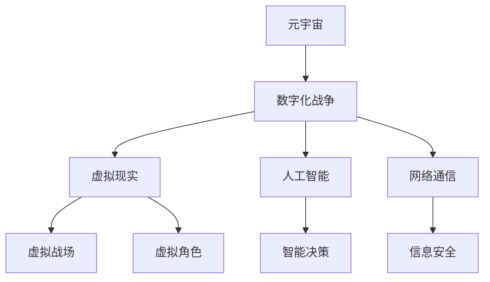

                 

# 《元宇宙军事：数字化战争的演练场》

> 关键词：元宇宙，数字化战争，军事训练，情报搜集，安全与伦理问题，未来发展趋势

> 摘要：本文深入探讨了元宇宙在军事领域的重要作用，分析了数字化战争的理论基础、应用场景及安全与伦理问题。通过案例分析，展示了元宇宙军事的实际应用，并探讨了未来发展趋势。本文旨在为读者提供关于元宇宙军事的全面视角和深入思考。

### 《元宇宙军事：数字化战争的演练场》目录大纲

---

#### 第一部分：元宇宙军事概述

**1.1 元宇宙与数字化战争的关系**

**1.1.1 元宇宙的定义与特征**

**1.1.2 数字化战争的演变与元宇宙的结合**

**1.2 元宇宙军事的重要性**

**1.2.1 元宇宙军事的背景**

**1.2.2 元宇宙军事的战略意义**

**1.2.3 元宇宙军事的应用前景**

**1.3 元宇宙军事的核心概念与联系**

**1.3.1 元宇宙军事中的核心概念**

**1.3.2 元宇宙军事架构的 Mermaid 流程图**

---

#### 第二部分：数字化战争的理论基础

**2.1 数字化战争的概念与特点**

**2.1.1 数字化战争的定义**

**2.1.2 数字化战争的主要特点**

**2.1.3 数字化战争与传统战争的对比**

**2.2 数字化战争的核心算法原理**

**2.2.1 算法原理讲解（伪代码）**

**2.2.2 算法原理的应用**

**2.3 数学模型与数学公式**

**2.3.1 数学模型的介绍**

**2.3.2 数学公式（使用latex格式）**

**2.3.3 数学公式的举例说明**

---

#### 第三部分：元宇宙军事的应用场景

**3.1 元宇宙军事在军事训练中的应用**

**3.1.1 军事训练的数字化转型**

**3.1.2 元宇宙军事训练的优点与挑战**

**3.2 元宇宙军事在情报搜集与分析中的应用**

**3.2.1 情报搜集的数字化手段**

**3.2.2 情报分析的元宇宙平台**

**3.3 元宇宙军事在作战模拟与演习中的应用**

**3.3.1 作战模拟的元宇宙平台**

**3.3.2 军事演习的元宇宙实践**

---

#### 第四部分：元宇宙军事的安全与伦理问题

**4.1 元宇宙军事的安全隐患**

**4.1.1 元宇宙军事面临的安全挑战**

**4.1.2 安全对策与防范措施**

**4.2 元宇宙军事的伦理问题**

**4.2.1 伦理问题的背景**

**4.2.2 伦理问题的讨论与建议**

**4.3 国际合作与法规框架**

**4.3.1 国际合作的重要性**

**4.3.2 法规框架的建设与发展**

---

#### 第五部分：元宇宙军事的未来发展趋势

**5.1 元宇宙军事的技术发展趋势**

**5.1.1 关键技术的发展方向**

**5.1.2 技术创新对未来战争的影响**

**5.2 元宇宙军事的战略规划**

**5.2.1 国家战略与军事规划**

**5.2.2 元宇宙军事的长期发展目标**

**5.3 元宇宙军事的国际合作与竞争**

**5.3.1 国际合作机制的建设**

**5.3.2 国际竞争格局与战略应对**

---

#### 第六部分：案例研究

**6.1 元宇宙军事经典案例解析**

**6.1.1 案例一：元宇宙军事演习案例**

**6.1.2 案例二：情报搜集与分析的元宇宙实践**

**6.2 创新案例研究**

**6.2.1 创新一：基于元宇宙的军事训练应用**

**6.2.2 创新二：元宇宙军事安全防护方案**

---

#### 第七部分：源代码与实战应用

**7.1 开发环境搭建**

**7.1.1 开发环境配置指南**

**7.1.2 开发工具与软件推荐**

**7.2 源代码详细实现**

**7.2.1 源代码结构与功能说明**

**7.2.2 关键代码解读与分析**

**7.3 实战应用解读**

**7.3.1 实战案例一：元宇宙军事训练系统**

**7.3.2 实战案例二：情报分析与决策支持系统**

---

#### 附录

**附录 A：元宇宙军事资源与工具**

**附录 B：术语解释**

---

**作者：AI天才研究院/AI Genius Institute & 禅与计算机程序设计艺术 /Zen And The Art of Computer Programming**

---

本文将逐步深入探讨元宇宙军事的各个方面，通过逻辑清晰的分析和详尽的案例研究，帮助读者全面了解这一新兴领域的本质和未来发展方向。接下来，我们将从元宇宙与数字化战争的关系入手，逐步展开讨论。

---

### 第一部分：元宇宙军事概述

#### 1.1 元宇宙与数字化战争的关系

随着科技的飞速发展，元宇宙（Metaverse）这个概念逐渐进入人们的视野。元宇宙不仅被视为下一代互联网的形态，也被认为是数字化战争的重要平台。数字化战争是一种基于信息技术和网络通信的新型战争形式，它利用数字化的手段对军事行动进行规划和执行。

**1.1.1 元宇宙的定义与特征**

元宇宙是一个虚拟的、三维的、可以互动的数字世界，它由多个独立的虚拟空间组成，通过互联网和虚拟现实技术连接在一起。在元宇宙中，人们可以创建和体验各种虚拟场景，进行社交、娱乐、教育、工作等活动。元宇宙的特征主要包括以下几个方面：

- **虚拟性**：元宇宙是一个虚拟的世界，所有的体验和活动都是通过计算机生成的。
- **互动性**：元宇宙中的用户可以与其他用户进行实时互动，交流信息和协作完成任务。
- **多样性**：元宇宙中有各种虚拟环境和角色，用户可以根据自己的需求和兴趣选择参与不同的场景和活动。
- **沉浸感**：虚拟现实技术使得用户在元宇宙中的体验更加真实和沉浸，提高互动性和参与感。

**1.1.2 数字化战争的演变与元宇宙的结合**

数字化战争是现代战争的一种形式，它利用信息技术和网络通信手段，实现战争的高效、精确和智能化。数字化战争的演变可以分为以下几个阶段：

- **机械化战争**：以机械化装备为主，依赖传统的指挥和通信方式。
- **信息化战争**：以信息技术为核心，实现信息的高效传递和处理，提高指挥和控制能力。
- **数字化战争**：利用数字化手段，实现战场环境的数字化模拟和作战行动的自动化执行。

元宇宙与数字化战争的结合主要体现在以下几个方面：

- **战场模拟与演练**：元宇宙提供了一个虚拟的战场环境，可以模拟各种作战行动，进行军事训练和演习。
- **情报搜集与分析**：元宇宙中的虚拟环境和角色可以模拟战场情况，用于情报搜集和决策支持。
- **装备研发与测试**：元宇宙可以模拟各种装备的性能和作战效果，用于装备研发和测试。

**1.2 元宇宙军事的重要性**

元宇宙军事的重要性体现在以下几个方面：

- **战略意义**：元宇宙军事是一种新的战略资源，可以增强国家的防御能力，提升国际竞争力。
- **技术优势**：元宇宙军事利用信息技术和虚拟现实技术，实现军事行动的高效、精确和智能化。
- **人才培养**：元宇宙提供了一个虚拟的训练环境，可以培养军事人才的战略思维和技术能力。
- **国际合作**：元宇宙军事可以促进国际军事合作，共享资源和信息，提高全球安全水平。

**1.2.1 元宇宙军事的背景**

元宇宙军事的兴起背景主要包括以下几个方面：

- **科技发展**：信息技术、虚拟现实技术和网络通信技术的快速发展，为元宇宙军事提供了技术基础。
- **军事需求**：现代战争对信息化和数字化能力的要求不断提高，元宇宙军事可以满足这一需求。
- **战略竞争**：国际军事竞争日趋激烈，元宇宙军事成为各国争夺军事优势的重要手段。

**1.2.2 元宇宙军事的战略意义**

元宇宙军事的战略意义主要体现在以下几个方面：

- **防御能力**：元宇宙军事可以提高国家的防御能力，增强对敌对行为的预警和应对能力。
- **作战能力**：元宇宙军事可以实现军事行动的智能化和高效化，提高作战效果。
- **情报优势**：元宇宙军事可以增强情报搜集和分析能力，为决策提供支持。
- **国际竞争**：元宇宙军事可以提升国家的国际竞争地位，增强在国际事务中的影响力。

**1.2.3 元宇宙军事的应用前景**

元宇宙军事的应用前景非常广阔，主要体现在以下几个方面：

- **军事训练**：元宇宙军事可以提供虚拟的军事训练环境，提高士兵的作战技能和战术意识。
- **情报搜集**：元宇宙军事可以模拟战场环境，用于情报搜集和决策支持。
- **装备研发**：元宇宙军事可以模拟装备性能，用于装备研发和测试。
- **作战模拟**：元宇宙军事可以模拟各种作战行动，进行作战模拟和演习。

**1.3 元宇宙军事的核心概念与联系**

元宇宙军事涉及多个核心概念，包括元宇宙、数字化战争、虚拟现实、人工智能、网络通信等。这些概念相互联系，构成了元宇宙军事的基本架构。

- **元宇宙**：元宇宙是数字化战争的基础平台，提供了一个虚拟的、互动的数字世界。
- **数字化战争**：数字化战争是元宇宙军事的核心内容，利用数字化的手段实现军事行动的高效、精确和智能化。
- **虚拟现实**：虚拟现实技术为元宇宙军事提供了沉浸式的体验，提高了军事训练和作战模拟的效果。
- **人工智能**：人工智能技术为元宇宙军事提供了智能化的决策支持和自动化执行能力。
- **网络通信**：网络通信技术是元宇宙军事的基础设施，确保了信息的快速传递和实时互动。

**1.3.1 元宇宙军事中的核心概念**

元宇宙军事中的核心概念包括以下几个方面：

- **虚拟战场**：虚拟战场是元宇宙军事的重要组成部分，用于军事训练、作战模拟和情报搜集。
- **虚拟角色**：虚拟角色是元宇宙军事中的虚拟士兵、敌人和装备，用于模拟真实的军事行动。
- **智能决策**：智能决策是元宇宙军事的核心能力，通过人工智能技术实现军事行动的自动化执行。
- **信息安全**：信息安全是元宇宙军事的重要保障，确保军事行动的安全性和保密性。

**1.3.2 元宇宙军事架构的 Mermaid 流程图**

下面是一个简单的元宇宙军事架构的 Mermaid 流程图：

通过这个流程图，我们可以清晰地看到元宇宙军事的核心概念及其相互联系。

### 总结

本部分对元宇宙军事进行了概述，分析了元宇宙与数字化战争的关系，探讨了元宇宙军事的重要性、背景、战略意义、应用前景以及核心概念。在接下来的部分，我们将进一步探讨数字化战争的理论基础，为读者提供更深入的理解。

---

在下一部分，我们将深入探讨数字化战争的理论基础，分析数字化战争的概念、特点以及与传统战争的对比。我们将介绍数字化战争的核心算法原理，并探讨数学模型与数学公式在其中的应用。敬请期待。

