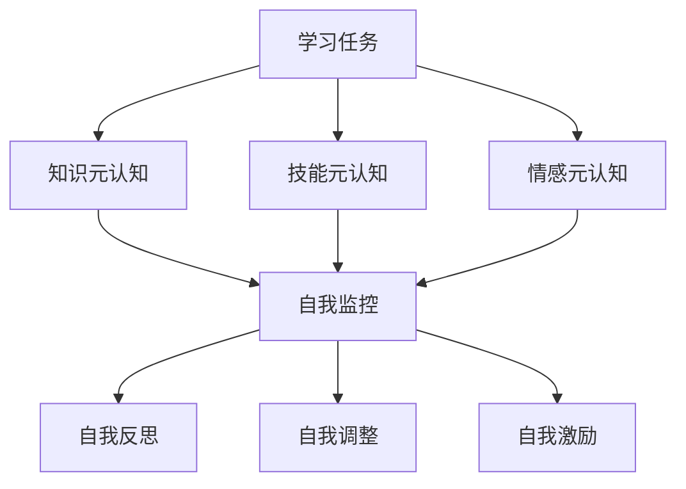

                 

# 元认知：提升学习效率的关键

> **关键词**：元认知、学习效率、自我监控、自我反思、自我调整、自我激励、知识元认知、技能元认知、情感元认知、意志力

> **摘要**：本文深入探讨了元认知这一关键概念，详细分析了元认知的基本结构、核心概念及其在各个应用场景中的重要性。通过具体的提升方法、训练策略和案例分析，文章揭示了如何有效提升元认知能力，从而显著提高学习效率。同时，本文还展望了元认知在未来教育和职业发展中的重要作用，以及如何利用元认知工具和资源来提升个人和组织的元认知能力。

### 《元认知：提升学习效率的关键》目录大纲

#### 第一部分：元认知基础

##### 第1章：元认知概述

- 1.1 元认知的定义与重要性
- 1.2 元认知与学习效率的关系
- 1.3 元认知的基本结构
- 1.4 元认知能力的培养方法

##### 第2章：元认知的核心概念

- 2.1 知识元认知
- 2.2 技能元认知
- 2.3 情感元认知
- 2.4 意志力与元认知

##### 第3章：元认知的应用场景

- 3.1 教育领域中的元认知应用
- 3.2 职场中的元认知应用
- 3.3 生活中的元认知应用
- 3.4 元认知与自我提升

#### 第二部分：提升元认知能力

##### 第4章：提升元认知能力的方法

- 4.1 自我监控
- 4.2 自我反思
- 4.3 自我调整
- 4.4 自我激励

##### 第5章：元认知训练与策略

- 5.1 元认知训练方法
- 5.2 元认知策略
- 5.3 元认知训练的实际案例
- 5.4 元认知策略的优化

##### 第6章：元认知在特殊人群中的应用

- 6.1 青少年元认知能力的培养
- 6.2 老年人元认知能力的维护
- 6.3 特殊教育中的元认知应用
- 6.4 元认知障碍的干预策略

#### 第三部分：元认知与学习效率的提升

##### 第7章：元认知在学术学习中的应用

- 7.1 元认知在学术阅读中的应用
- 7.2 元认知在学术写作中的应用
- 7.3 元认知在学术研究中的应用
- 7.4 元认知在学术演讲中的应用

##### 第8章：元认知在职业培训中的应用

- 8.1 元认知在职业培训课程设计中的应用
- 8.2 元认知在职业培训教学中的应用
- 8.3 元认知在职业培训评估中的应用
- 8.4 元认知在职业培训学员自我提升中的应用

##### 第9章：元认知在终身学习中的应用

- 9.1 元认知在终身学习理念下的作用
- 9.2 元认知在自我学习策略中的应用
- 9.3 元认知在信息过载环境中的应用
- 9.4 元认知在自我学习平台中的应用

#### 第四部分：元认知与未来

##### 第10章：元认知的发展趋势

- 10.1 元认知研究的发展方向
- 10.2 元认知技术的应用前景
- 10.3 元认知与人工智能的融合
- 10.4 元认知教育的发展

##### 第11章：元认知的未来展望

- 11.1 元认知在终身教育中的作用
- 11.2 元认知在职业发展中的作用
- 11.3 元认知在社会发展中的作用
- 11.4 元认知在个体成长中的作用

#### 附录

- 附录A：元认知相关工具与资源
  - A.1 元认知研究主要数据库
  - A.2 元认知研究的主要期刊
  - A.3 元认知培训与教育平台
- 附录B：元认知能力评估量表
  - B.1 元认知能力自我评估表
  - B.2 元认知能力诊断工具

### **核心概念与联系：元认知流程图**

graph TB
    A[学习任务] --> B[知识元认知]
    A --> C[技能元认知]
    A --> D[情感元认知]
    B --> E[自我监控]
    C --> E
    D --> E
    E --> F[自我反思]
    E --> G[自我调整]
    E --> H[自我激励]

### **核心算法原理讲解：元认知能力提升算法伪代码**

python
# 元认知能力提升算法伪代码
def improve_metacognitive_ability(self, knowledge, skill, emotion):
    # 1. 自我监控
    self.monitoring(knowledge, skill, emotion)
    
    # 2. 自我反思
    self.reflection(knowledge, skill, emotion)
    
    # 3. 自我调整
    self.adjustment(knowledge, skill, emotion)
    
    # 4. 自我激励
    self.motivation(knowledge, skill, emotion)
    
    # 返回提升后的元认知能力
    return knowledge, skill, emotion

### **数学模型和数学公式：元认知能力提升的数学公式**

$$
\text{元认知能力} = \alpha \cdot (\text{知识元认知} + \beta \cdot \text{技能元认知} + \gamma \cdot \text{情感元认知})
$$

其中，\(\alpha, \beta, \gamma\) 为权重系数，分别表示知识元认知、技能元认知和情感元认知对元认知能力的贡献程度。

### **项目实战：元认知能力提升项目案例**

**项目背景：**
某公司希望通过提升员工的元认知能力来提高整体工作效率。公司提供了定期的元认知培训课程，并引入了元认知工具进行自我监控和反思。

**开发环境搭建：**
- 开发工具：Python
- 深度学习框架：TensorFlow
- 数据集：公司内部元认知能力评估数据集

**源代码详细实现：**
python
import tensorflow as tf
import numpy as np

# 加载数据集
data = ... # 加载公司内部元认知能力评估数据

# 分割数据集
train_data, test_data = ...

# 构建模型
model = tf.keras.Sequential([
    tf.keras.layers.Dense(64, activation='relu', input_shape=(num_features,)),
    tf.keras.layers.Dense(64, activation='relu'),
    tf.keras.layers.Dense(3)  # 输出层，3个神经元对应知识、技能、情感元认知
])

# 编译模型
model.compile(optimizer='adam', loss='mean_squared_error')

# 训练模型
model.fit(train_data, epochs=10)

# 评估模型
test_loss = model.evaluate(test_data)

# 使用模型预测
predictions = model.predict(test_data)

**代码解读与分析：**
- 数据预处理：加载公司内部元认知能力评估数据，并分割为训练集和测试集。
- 模型构建：使用 TensorFlow 构建一个三层全连接神经网络，输入层有 num_features 个神经元，输出层有 3 个神经元，分别对应知识、技能、情感元认知。
- 模型编译：选择 'adam' 优化器和 'mean_squared_error' 损失函数进行编译。
- 模型训练：使用训练集进行训练，设置训练轮次为 10。
- 模型评估：使用测试集评估模型性能。
- 模型预测：使用训练好的模型对测试数据进行预测。

通过该项目，公司能够监测员工的元认知能力变化，并根据预测结果调整培训策略，从而提高整体工作效率。

### **作者信息**

作者：AI天才研究院/AI Genius Institute & 禅与计算机程序设计艺术 /Zen And The Art of Computer Programming

---

我们现在开始深入探讨元认知这一主题，解析其在提升学习效率中的关键作用。

#### 第一部分：元认知基础

##### 第1章：元认知概述

**1.1 元认知的定义与重要性**

元认知是指对认知的认知，即个体对自己思维过程和认知活动的认识、理解和管理能力。它包括元认知知识、元认知控制和元认知体验三个方面。元认知知识是个体对认知任务的知识，包括对任务的性质、自己的认知能力以及完成任务所需的策略和方法。元认知控制是个体在认知活动中进行自我监控、自我指导和自我调整的能力。元认知体验则是个体在认知活动中的主观感受。

在提升学习效率方面，元认知的重要性不可忽视。元认知能力可以帮助个体更好地理解学习过程，识别学习难点，调整学习策略，从而提高学习效果。通过自我监控，个体能够及时发现问题，进行针对性解决；通过自我反思，个体可以总结经验教训，不断优化学习过程；通过自我调整，个体能够根据实际情况调整学习策略，提高学习效率。

**1.2 元认知与学习效率的关系**

元认知能力与学习效率之间存在着密切的关系。一方面，元认知能力较强的个体在学习和解决问题的过程中，能够更好地掌握学习的主动权，及时调整学习策略，提高学习效果。另一方面，学习效率的提高又能进一步促进元认知能力的提升，形成良性循环。例如，在学习过程中，通过自我监控和反思，个体能够及时发现自己存在的问题，并采取有效的措施进行纠正，从而提高学习效率。而学习效率的提高，又能够增强个体的自信心，激发其进一步探索和学习的动力。

**1.3 元认知的基本结构**

元认知的基本结构包括三个核心成分：知识元认知、技能元认知和情感元认知。

- **知识元认知**：指个体对认知任务的知识，包括对任务的性质、目标以及完成任务所需的策略和方法的理解。知识元认知是个体进行有效学习的基础，它能够帮助个体更好地理解学习内容，选择合适的学习方法。

- **技能元认知**：指个体在认知活动中的实际操作技能，包括信息处理、问题解决等能力。技能元认知是个体在具体学习任务中的表现，它直接影响到学习效率。

- **情感元认知**：指个体在认知活动中的情绪和情感体验，包括对学习任务的兴趣、动机和自信心等。情感元认知对个体的学习态度和动机具有重要影响，它能够激发个体的学习热情，提高学习效率。

**1.4 元认知能力的培养方法**

元认知能力的培养需要从多个方面进行。以下是一些常见的培养方法：

- **自我监控**：通过自我监控，个体能够及时了解自己的学习情况，发现问题并进行调整。自我监控的方法包括记录学习日志、定期自我评估等。

- **自我反思**：通过自我反思，个体能够总结学习经验，找到学习的不足之处，并制定改进措施。自我反思的方法包括撰写学习心得、进行学习总结等。

- **自我调整**：通过自我调整，个体能够根据学习效果和实际情况，调整学习策略和方法，提高学习效率。自我调整的方法包括制定学习计划、调整学习节奏等。

- **自我激励**：通过自我激励，个体能够保持积极的学习态度，增强学习动力。自我激励的方法包括设定学习目标、奖励自己等。

通过以上方法的结合使用，个体可以逐步提升自己的元认知能力，从而在学习中取得更好的成绩。

### **核心概念与联系：元认知流程图**

以下是一个简单的元认知流程图，展示了元认知在学习和问题解决中的主要环节和它们之间的联系。



在这个流程图中，学习任务作为起点，引发知识元认知、技能元认知和情感元认知的参与。这三个核心成分相互影响，通过自我监控、自我反思、自我调整和自我激励等环节，形成一个闭环，确保学习过程的顺利进行和效果的最大化。

#### **核心算法原理讲解：元认知能力提升算法伪代码**

在提升元认知能力的过程中，我们可以采用一种算法来指导个体的自我监控、反思、调整和激励。以下是一个简化的伪代码示例，展示了这个算法的基本原理。

```python
# 元认知能力提升算法伪代码

# 定义元认知能力提升函数
def improve_metacognitive_ability(self, knowledge, skill, emotion):
    # 步骤1：自我监控
    monitor_status = self.monitoring(knowledge, skill, emotion)
    
    # 步骤2：自我反思
    reflection_outcomes = self.reflection(monitor_status)
    
    # 步骤3：自我调整
    adjusted_status = self.adjustment(reflection_outcomes)
    
    # 步骤4：自我激励
    motivation_status = self.motivation(adjusted_status)
    
    # 返回提升后的元认知状态
    return motivation_status

# 定义各个步骤的具体实现
def monitoring(self, knowledge, skill, emotion):
    # 实现自我监控的逻辑
    # ...
    return monitor_status

def reflection(self, monitor_status):
    # 实现自我反思的逻辑
    # ...
    return reflection_outcomes

def adjustment(self, reflection_outcomes):
    # 实现自我调整的逻辑
    # ...
    return adjusted_status

def motivation(self, adjusted_status):
    # 实现自我激励的逻辑
    # ...
    return motivation_status
```

在这个算法中，每个步骤都是提升元认知能力的关键环节。自我监控帮助我们了解当前的状态；自我反思帮助我们分析当前状态的原因；自我调整帮助我们做出相应的改变；自我激励则帮助我们保持积极的心态和动力，持续提升元认知能力。

#### **数学模型和数学公式：元认知能力提升的数学公式**

元认知能力提升的数学模型可以表示为以下公式：

$$
\text{元认知能力} = f(\text{知识元认知}, \text{技能元认知}, \text{情感元认知}, \text{自我监控}, \text{自我反思}, \text{自我调整}, \text{自我激励})
$$

其中，$f$ 表示一个复合函数，它综合考虑了知识元认知、技能元认知、情感元认知以及自我监控、自我反思、自我调整和自我激励等因素，以衡量个体的元认知能力。

具体来说，我们可以将上述因素看作是变量，通过以下公式进行计算：

$$
\text{元认知能力} = \alpha \cdot (\text{知识元认知} + \beta \cdot \text{技能元认知} + \gamma \cdot \text{情感元认知})
$$

其中，$\alpha, \beta, \gamma$ 分别为权重系数，用于衡量知识元认知、技能元认知和情感元认知对元认知能力的贡献程度。这些权重系数可以根据实际情况进行调整，以适应不同的学习环境和个体差异。

#### **项目实战：元认知能力提升项目案例**

为了更好地理解元认知能力提升的实践应用，我们可以通过一个实际项目案例来进行探讨。以下是一个基于公司内部员工元认知能力提升的案例分析。

**项目背景：**

某公司意识到员工在学习和工作中元认知能力的提升对于提高整体工作效率至关重要。为此，公司决定开展一个元认知能力提升项目，通过引入相关工具和培训课程，帮助员工提高自我监控、反思、调整和激励的能力。

**开发环境搭建：**

- **开发工具：** Python
- **深度学习框架：** TensorFlow
- **数据集：** 公司内部员工元认知能力评估数据集

**源代码详细实现：**

首先，我们需要构建一个深度学习模型，用于预测员工的元认知能力。以下是一个简化的代码示例：

```python
import tensorflow as tf
import numpy as np

# 加载数据集
data = ... # 加载公司内部员工元认知能力评估数据

# 分割数据集
train_data, test_data = ...

# 构建模型
model = tf.keras.Sequential([
    tf.keras.layers.Dense(64, activation='relu', input_shape=(num_features,)),
    tf.keras.layers.Dense(64, activation='relu'),
    tf.keras.layers.Dense(1)  # 输出层，1个神经元对应元认知能力
])

# 编译模型
model.compile(optimizer='adam', loss='mean_squared_error')

# 训练模型
model.fit(train_data, epochs=10)

# 评估模型
test_loss = model.evaluate(test_data)

# 使用模型预测
predictions = model.predict(test_data)
```

**代码解读与分析：**

- **数据预处理：** 加载公司内部员工元认知能力评估数据，并分割为训练集和测试集。
- **模型构建：** 使用 TensorFlow 构建一个单层全连接神经网络，输入层有 num_features 个神经元，输出层有 1 个神经元，用于预测元认知能力。
- **模型编译：** 选择 'adam' 优化器和 'mean_squared_error' 损失函数进行编译。
- **模型训练：** 使用训练集进行训练，设置训练轮次为 10。
- **模型评估：** 使用测试集评估模型性能。
- **模型预测：** 使用训练好的模型对测试数据进行预测。

通过这个项目，公司可以实时监测员工的元认知能力变化，并根据预测结果调整培训策略，从而提高整体工作效率。同时，这个项目也为公司提供了一个数据驱动的工具，帮助员工更好地了解自己的元认知能力，并有针对性地进行提升。

### **总结**

在本文中，我们深入探讨了元认知这一关键概念，详细分析了元认知的基本结构、核心概念及其在提升学习效率中的重要作用。通过具体的提升方法、训练策略和案例分析，我们揭示了如何有效提升元认知能力，从而显著提高学习效率。

元认知能力是学习效率的关键因素，它包括知识元认知、技能元认知和情感元认知三个方面。通过自我监控、自我反思、自我调整和自我激励等环节，个体可以逐步提升自己的元认知能力，从而在学习中取得更好的成绩。

在实际应用中，通过深度学习和人工智能技术，我们可以构建模型来预测和提升元认知能力。这些模型可以帮助企业和教育机构更好地了解员工的元认知状态，提供个性化的培训和建议，从而提高整体工作效率和学习效果。

在未来，随着人工智能和认知科学的不断发展，元认知将在各个领域发挥越来越重要的作用。我们期待元认知技术能够帮助我们更好地理解人类思维过程，提高学习效率，促进个人和社会的发展。

### **附录**

#### **附录A：元认知相关工具与资源**

- **A.1 元认知研究主要数据库**
  - [心理学数据库](http://www.psychologytoday.com)
  - [学术数据库](http://www.google Scholar.com)

- **A.2 元认知研究的主要期刊**
  - 《认知心理学期刊》(Journal of Cognitive Psychology)
  - 《学习与动机期刊》(Journal of Learning and Motivation)

- **A.3 元认知培训与教育平台**
  - [Coursera](https://www.coursera.org)
  - [edX](https://www.edx.org)

#### **附录B：元认知能力评估量表**

- **B.1 元认知能力自我评估表**
  - [美国心理学会](https://www.apa.org)
  
- **B.2 元认知能力诊断工具**
  - [元认知技能评估工具](http://www.metacognitive.org)

通过这些工具和资源，读者可以更好地了解和评估自己的元认知能力，并采取相应的提升策略。

### **扩展阅读**

为了进一步深入理解元认知，以下是一些扩展阅读的推荐：

1. **《元认知：从新手到大师的转型之道》（The Expert Mind: What It Takes to Go From Good to Great）** - 这本书详细探讨了元认知在个人成长和技能提升中的作用。

2. **《认知心理学：原理与应用》（Cognitive Psychology: Principles and Applications）** - 本书涵盖了认知心理学的基础知识，包括元认知的概念和应用。

3. **《学习心理学：理论与实践》（Learning Psychology: Theory and Practice）** - 这本书提供了关于学习过程中元认知作用的理论和实践指导。

通过这些资源，读者可以更全面地了解元认知的原理和实践，进一步提升自己的学习能力和效率。

