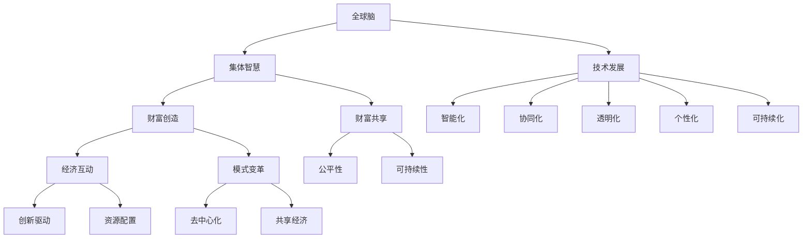

                 

### 第1章 引言

> **关键词**：全球脑、全球经济、集体智慧、财富共享、技术发展、经济模式变革

> **摘要**：随着技术的进步，全球脑的概念逐渐兴起，其与全球经济的联系也愈发紧密。本章将介绍《全球脑与全球经济:集体智慧驱动的财富共享》一书的背景、研究目的、方法以及结构，为读者了解后续内容打下基础。

在全球化的背景下，技术进步正以前所未有的速度改变着我们的生活方式和经济结构。本书《全球脑与全球经济:集体智慧驱动的财富共享》旨在探讨全球脑这一新兴概念与全球经济的紧密联系，以及如何通过集体智慧实现财富的共享。

#### 1.1 书籍背景

全球脑（Global Brain）的概念最早由法国作家Pierre Lévy提出，它被描述为一个由人类和机器共同构成的巨大网络，通过互联网和通信技术相互连接，形成一个具有自我组织、自适应和集体智慧的全球性系统。这种全球脑的概念不仅具有理论意义，还在实践中展示了巨大的潜力。

随着云计算、物联网、人工智能等技术的发展，全球脑正逐渐从理论走向现实。越来越多的公司和组织开始利用全球脑的集体智慧进行创新和决策，从而提升效率、优化资源分配，并推动经济模式的变革。

#### 1.2 研究目的

本书的研究目的在于：

1. **深入理解全球脑的概念和特点**：通过介绍全球脑的起源、发展历史、核心原理和应用领域，帮助读者全面了解这一新兴概念。
2. **探讨全球脑与全球经济的联系**：分析全球脑如何影响全球经济结构、经济问题和趋势，以及如何通过集体智慧实现财富的共享。
3. **展示全球脑驱动的财富共享实践**：通过具体案例，展示全球脑在科学研究、工程设计与社会治理等领域的应用，以及如何通过这些实践实现财富的共享。
4. **展望全球脑与全球经济的未来**：探讨技术发展、经济模式变革以及全球治理的挑战与机遇，为未来的发展提供指导和建议。

#### 1.3 研究方法

本书采用以下研究方法：

1. **文献综述**：通过分析相关文献，梳理全球脑的概念、发展历程和应用领域。
2. **案例研究**：选择具有代表性的案例，深入分析全球脑在实际应用中的效果和影响。
3. **理论探讨**：结合经济学、社会学和计算机科学的理论，探讨全球脑与全球经济的联系和作用机制。
4. **展望与建议**：基于现有研究和分析，对未来全球脑与全球经济的发展趋势提出展望和建议。

#### 1.4 书籍结构

本书结构如下：

- **第1章 引言**：介绍书籍的背景、研究目的、方法以及结构。
- **第2章 全球脑概述**：介绍全球脑的概念、发展历史、核心原理和应用领域。
- **第3章 全球经济概述**：分析全球经济的现状、问题和趋势。
- **第4章 全球脑与全球经济的联系**：探讨全球脑对全球经济的影响以及全球经济对全球脑的反馈作用。
- **第5章 全球脑驱动的财富共享实践**：展示全球脑在不同领域的应用和实践。
- **第6章 全球脑与全球经济的未来**：展望全球脑与全球经济的技术发展、经济模式变革和全球治理的挑战与机遇。
- **第7章 结论**：总结研究成果，提出政策建议和启示。

通过以上章节的布局，本书旨在为读者提供一个全面、深入的了解全球脑与全球经济的关系，以及如何通过集体智慧实现财富的共享。

### 第2章 全球脑概述

> **关键词**：全球脑、概念、发展历史、核心原理、应用领域

> **摘要**：本章将详细介绍全球脑的概念、发展历史、核心原理及其应用领域。通过这一章的阅读，读者将能够对全球脑这一复杂且创新性的概念有更深入的了解。

#### 2.1 全球脑的概念

全球脑（Global Brain）是一个由众多智能体（包括人类、机器和智能系统）组成的复杂网络，这些智能体通过互联网和通信技术相互连接，形成一个具有自我组织、自适应和集体智慧的全球性系统。这一概念最早由法国作家Pierre Lévy提出，他将其描述为一个能够通过集体智慧和协作实现全球性创新和决策的巨大网络。

全球脑的核心思想是，通过将个体智能连接起来，形成一个超级智能系统，从而实现比单一智能体更高效、更创新的解决方案。这个概念在技术和社会科学领域都有着广泛的应用前景。

#### 2.1.1 全球脑的定义

全球脑可以被定义为一种分布式智能系统，它通过以下特征来体现其独特性：

1. **自我组织**：全球脑能够自动组织和优化其结构和功能，以适应不断变化的环境和需求。
2. **自适应**：全球脑能够根据外部输入和内部反馈进行调整，以优化其性能和效率。
3. **集体智慧**：全球脑通过整合众多智能体的知识和经验，形成一种超越个体智能的集体智慧。
4. **分布式计算**：全球脑依赖于大量智能体的分布式计算能力，从而实现高效的资源共享和信息处理。

#### 2.1.2 全球脑的特点

全球脑具有以下几个显著特点：

1. **全球性**：全球脑覆盖全球范围，连接了不同地区、文化和背景的智能体。
2. **开放性**：全球脑是一个开放系统，任何智能体都可以通过互联网加入其中，共享知识和资源。
3. **动态性**：全球脑的结构和功能不断变化，以适应新的挑战和机遇。
4. **多样性**：全球脑由不同类型的智能体组成，包括人类、机器、传感器和智能设备等。
5. **协同性**：全球脑中的智能体通过协同工作，实现更高效的决策和问题解决。

#### 2.2 全球脑的发展历史

全球脑的概念起源于20世纪末，随着互联网和计算机技术的发展，这一概念逐渐成熟并得到广泛应用。以下是全球脑发展历史的重要节点：

1. **互联网时代**：20世纪90年代，互联网的普及使得全球脑的基础设施得以建立，人类和机器开始大规模连接。
2. **云计算时代**：21世纪初，云计算技术的出现使得全球脑的计算能力大幅提升，为大规模数据处理和智能分析提供了可能。
3. **物联网时代**：物联网技术的兴起使得物理世界中的智能体（如传感器和设备）能够与虚拟世界中的智能体相互连接，进一步丰富了全球脑的构成。
4. **人工智能时代**：近年来，人工智能技术的发展使得全球脑的智能水平大幅提升，能够进行更复杂的决策和优化。

#### 2.2.1 起源与发展

全球脑的概念最早由Pierre Lévy在1994年的著作《数字乌托邦》中提出。他受到生物进化理论的启发，认为人类社会和计算机网络可以通过协作实现类似生物进化的过程，从而形成一个具有自我组织、自适应和集体智慧的全球性系统。

随着互联网和计算机技术的快速发展，全球脑的概念逐渐得到学术界和工业界的高度关注。许多学者和研究机构开始深入研究全球脑的理论和实践，提出了多种全球脑模型和算法，如集体智能、分布式计算、复杂系统和自适应系统等。

#### 2.2.2 技术与理念创新

全球脑的发展不仅依赖于技术的进步，还需要理念的创新。以下是一些关键技术与理念创新：

1. **分布式计算**：分布式计算技术使得全球脑能够高效地处理大量数据和任务，提高整体性能和可靠性。
2. **人工智能**：人工智能技术使得全球脑能够通过学习、推理和决策，实现更高级的智能化功能。
3. **区块链**：区块链技术为全球脑提供了去中心化、透明和安全的数据管理和协作机制。
4. **物联网**：物联网技术使得物理世界中的智能体能够与虚拟世界中的智能体相互连接，实现更广泛的协作和智能应用。
5. **集体智能**：集体智能理论强调通过集体智慧和协作实现更高效的决策和问题解决，是推动全球脑发展的核心理念。

#### 2.3 全球脑的核心原理

全球脑的核心原理主要包括集体智慧、自组织与适应性。以下是这些原理的详细阐述：

#### 2.3.1 集体智慧

集体智慧（Collective Intelligence）是指通过集体协作和智慧，实现比单个个体更高效、更创新的解决方案。全球脑通过整合众多智能体的知识和经验，形成一种超越个体智能的集体智慧。集体智慧的核心特征包括：

1. **信息共享**：全球脑中的智能体能够共享知识和信息，从而实现知识的积累和传播。
2. **协同工作**：智能体通过协同工作，实现更高效的决策和问题解决。
3. **共同目标**：全球脑中的智能体具有共同的目标和愿景，通过协作实现整体目标的实现。
4. **自我优化**：集体智慧能够通过自我学习和适应，不断提高其性能和效率。

#### 2.3.2 自组织与适应性

自组织（Self-Organization）是指系统在没有外部指令或规划的情况下，通过内部相互作用自发形成有序结构和功能。全球脑通过自组织实现其结构和功能的优化，以适应不断变化的环境和需求。自组织的核心特征包括：

1. **自相似性**：全球脑的结构具有自相似性，即不同层次的智能体在结构和功能上具有相似性。
2. **适应性**：全球脑能够根据外部输入和内部反馈进行自适应调整，以优化其性能和效率。
3. **分布式决策**：全球脑中的智能体通过分布式决策实现整体协调，提高系统的灵活性和适应性。

#### 2.4 全球脑的应用领域

全球脑的概念和技术在多个领域具有广泛的应用，以下是一些主要应用领域：

#### 2.4.1 科学研究

全球脑在科学研究领域具有巨大的应用潜力。通过全球脑，科学家可以协同合作，共享数据和信息，加速科学研究的进程。例如，全球脑可以用于天文学、生物学、物理学等领域的联合研究，实现跨学科、跨地域的科学合作。

#### 2.4.2 工程与设计

全球脑在工程与设计领域可以用于优化设计、提高效率和降低成本。通过全球脑，工程师和设计师可以共享知识和经验，实现更高效的设计和优化。例如，在建筑、汽车、航空航天等领域，全球脑可以帮助设计师实现更创新、更可靠的设计方案。

#### 2.4.3 社会治理

全球脑在社会治理领域可以用于公共决策、社区治理和危机管理。通过全球脑，政府和社会组织可以更有效地收集和分析数据，提高决策的科学性和民主性。例如，在公共卫生、环境保护、城市管理等领域，全球脑可以用于优化资源配置、提高治理效率和应对突发事件。

#### 2.4.4 经济领域

全球脑在经济领域可以用于优化资源配置、提升经济效率和促进财富共享。通过全球脑，企业和个人可以更高效地进行商业决策和财富创造，实现更公平的财富分配。例如，在金融、电商、共享经济等领域，全球脑可以帮助企业和个人实现更智能的决策和资源优化。

#### 2.4.5 教育与学习

全球脑在教育与学习领域可以用于个性化教学、智能辅导和协同学习。通过全球脑，学生和教师可以共享知识和资源，实现更高效、更个性化的教育和学习体验。例如，在在线教育、智能辅导、跨学科学习等领域，全球脑可以为学生和教师提供更丰富的学习资源和工具。

#### 2.4.6 医疗与健康

全球脑在医疗与健康领域可以用于疾病预测、诊断和治疗。通过全球脑，医生和医疗机构可以共享病例数据、医学知识和治疗方法，实现更准确、更有效的医疗服务。例如，在基因组学、精准医疗、远程医疗等领域，全球脑可以帮助医生和患者实现更精准的疾病预测和治疗。

#### 2.4.7 文艺创作

全球脑在文艺创作领域可以用于协同创作、灵感激发和作品优化。通过全球脑，艺术家和创作者可以共享创作资源和灵感，实现更创新、更富有创意的艺术作品。例如，在音乐、电影、文学等领域，全球脑可以帮助艺术家和创作者实现更高效、更富有创意的创作过程。

通过以上介绍，我们可以看到全球脑这一概念和技术在多个领域具有广泛的应用前景。随着技术的不断进步和理念的不断创新，全球脑将为我们带来更多的机遇和挑战，为实现更高效、更智能、更可持续的发展提供强有力的支持。

### 第3章 全球经济概述

> **关键词**：全球经济、一体化、产业链变化、贸易保护主义、资源与能源危机、贫富分化、数字经济、可持续发展、新型全球化

> **摘要**：本章将分析全球经济的现状、存在的问题和未来趋势。通过对全球经济现状、问题及趋势的探讨，读者将更全面地理解全球经济如何受到全球脑概念的影响，以及如何通过集体智慧和财富共享实现经济的可持续发展。

#### 3.1 全球经济现状

全球经济在过去几十年中经历了显著的变化，主要体现在以下几个方面：

1. **经济一体化进程**：全球经济一体化进程加速，国际贸易、投资和金融活动日益频繁。跨国公司和全球供应链的兴起，使得各国经济更加紧密地联系在一起。

2. **全球产业链变化**：全球产业链呈现出高度分工和专业化趋势。不同国家和地区专注于特定的产业链环节，通过全球化的生产和协作，实现资源的优化配置和效率提升。

3. **数字经济崛起**：随着互联网和信息技术的发展，数字经济在全球经济中的比重不断上升。电子商务、在线服务、大数据和人工智能等新兴经济模式，推动了全球经济的创新和增长。

4. **全球化与区域化**：全球化与区域化并存，全球贸易和投资依然保持活跃，但区域经济合作也在加强。例如，欧盟、北美自由贸易协定和区域全面经济伙伴关系协定（RCEP）等区域经济一体化进程加快。

#### 3.2 全球经济问题

尽管全球经济呈现出繁荣景象，但仍面临一些严峻的问题：

1. **贸易保护主义**：近年来，贸易保护主义浪潮兴起，一些国家和地区采取保护主义政策，提高关税、限制进口，导致全球贸易摩擦加剧，影响全球经济的稳定和增长。

2. **资源与能源危机**：全球资源的分布不均和能源危机，使得许多国家和地区面临资源短缺和能源安全问题。能源价格上涨和供应不稳定，对全球经济产生了负面影响。

3. **贫富分化**：全球贫富差距扩大，发达国家和发展中国家之间的经济差距进一步加大。许多国家的贫困问题依然严重，影响了全球经济的可持续发展。

4. **金融风险**：全球经济体系存在一定的金融风险，如债务危机、金融泡沫和货币政策调整等，都可能对全球经济造成冲击。

#### 3.3 全球经济趋势

面对全球经济现状和问题，未来全球经济将呈现以下趋势：

1. **数字经济崛起**：数字经济将继续成为全球经济增长的重要驱动力。随着互联网、人工智能、大数据和区块链等技术的快速发展，数字经济在全球经济中的比重将不断上升。

2. **可持续发展**：全球经济的可持续发展成为重要议题。各国政府和国际组织正积极推动绿色经济、循环经济和低碳经济的发展，以应对气候变化和环境问题。

3. **新型全球化**：新型全球化将更加注重平等、包容和共赢。各国将更加关注全球经济治理体系的改革，推动全球经济更加公平、开放和可持续发展。

4. **全球治理挑战**：全球经济面临一系列治理挑战，如全球金融治理、贸易治理、气候变化治理等。全球治理体系的改革和优化，将是未来全球经济稳定发展的重要保障。

#### 3.3.1 数字经济崛起

数字经济是指以数字化的信息和知识为关键生产要素、以现代信息网络为重要载体、以信息通信技术的有效利用为驱动的新型经济形态。随着互联网和信息技术的发展，数字经济在全球经济中的地位日益重要，具体体现在以下几个方面：

1. **产业升级**：数字经济推动了传统产业的数字化转型，提升了产业链的整体效率和竞争力。例如，智能制造、在线教育、智慧城市等领域的快速发展，促进了产业结构的优化和升级。

2. **创新驱动**：数字经济为创新提供了新的动力和平台。通过大数据、人工智能、区块链等技术的应用，企业能够实现更高效的产品研发和市场推广，提高创新能力和市场竞争力。

3. **经济模式变革**：数字经济改变了传统的经济模式，推动了共享经济、平台经济和零工经济的兴起。例如，共享单车、共享办公和电商平台的快速发展，为消费者和创业者提供了更多的机会和选择。

4. **全球价值链重构**：数字经济推动了全球价值链的重构，使得产业链的各个环节更加紧密地连接在一起。通过互联网和信息技术，企业能够实现全球化运营，提高全球资源配置效率。

#### 3.3.2 可持续发展

可持续发展是指满足当前需求而不损害子孙后代满足其需求的能力。在全球经济中，可持续发展成为重要议题，主要体现在以下几个方面：

1. **环境保护**：随着环境问题的加剧，各国政府和社会组织开始重视环境保护。通过推动绿色经济、循环经济和低碳经济的发展，减少温室气体排放，提高资源利用效率，保护生态环境。

2. **资源管理**：全球资源的分布不均和过度开采，使得资源管理成为可持续发展的重要任务。通过科学规划和管理，优化资源配置，提高资源利用效率，实现资源的可持续利用。

3. **社会公平**：可持续发展还强调社会公平，即消除贫困、促进社会包容和公平。通过扶贫、教育、医疗等领域的改革和发展，提高贫困人口的生活水平，实现社会公平和可持续发展。

4. **国际合作**：可持续发展需要全球合作，各国政府、国际组织和非政府组织共同应对环境、资源和社会问题，推动全球可持续发展目标的实现。

#### 3.3.3 新型全球化

新型全球化是指更加注重平等、包容和共赢的全球化进程。在新型全球化背景下，各国将更加关注全球经济治理体系的改革和优化，以应对全球经济面临的挑战和问题。新型全球化主要体现在以下几个方面：

1. **全球治理体系改革**：全球治理体系改革是新型全球化的核心任务。通过推动全球治理体系的改革，加强国际组织的作用，提高全球治理的效率和公正性，实现全球经济的稳定和可持续发展。

2. **全球价值链重构**：新型全球化将推动全球价值链的重构，实现全球产业链的优化和升级。通过加强国际合作，实现产业链的全球化布局和协同创新，提高全球经济的整体效率和竞争力。

3. **贸易自由化**：新型全球化倡导贸易自由化，降低贸易壁垒，促进全球贸易的繁荣和发展。通过推动自由贸易区建设、多边贸易协定和区域经济一体化进程，实现全球贸易的自由化和便利化。

4. **国际合作与共享**：新型全球化强调国际合作与共享，通过共享知识、技术和资源，实现全球经济的共同繁荣和发展。通过推动全球科技合作、文化交流和基础设施共享，促进全球经济的可持续发展。

#### 3.3.4 贸易保护主义的影响与对策

贸易保护主义对全球经济产生了负面影响，主要体现在以下几个方面：

1. **贸易摩擦加剧**：贸易保护主义政策导致各国之间的贸易摩擦加剧，影响全球贸易的自由化和繁荣。

2. **经济增长放缓**：贸易保护主义政策可能导致全球经济增长放缓，降低全球经济的整体效率。

3. **就业问题加剧**：贸易保护主义政策可能对就业产生负面影响，导致就业机会减少，增加社会不稳定因素。

4. **全球供应链受阻**：贸易保护主义政策可能影响全球供应链的稳定和效率，导致供应链受阻，影响全球经济的运行。

为应对贸易保护主义的影响，可以采取以下对策：

1. **加强国际合作**：通过加强国际合作，推动全球治理体系的改革，降低贸易壁垒，促进全球贸易的自由化和繁荣。

2. **推进区域经济一体化**：通过推进区域经济一体化进程，实现产业链的优化和升级，提高全球经济的整体效率和竞争力。

3. **提高产业竞争力**：通过技术创新和产业升级，提高本国产业的竞争力，减少对贸易保护主义的依赖。

4. **扩大内需**：通过扩大内需，减少对外部市场的依赖，提高国内经济的稳定性和可持续性。

#### 3.3.5 资源与能源危机的影响与应对

资源与能源危机对全球经济产生了深远影响，主要体现在以下几个方面：

1. **能源价格上涨**：资源与能源危机可能导致能源价格上涨，增加企业的生产成本，降低全球经济的运行效率。

2. **经济增长放缓**：能源价格上涨可能导致经济增长放缓，降低全球经济的整体竞争力。

3. **社会不稳定**：资源与能源危机可能引发社会不稳定，影响全球经济的稳定和可持续发展。

为应对资源与能源危机，可以采取以下措施：

1. **能源多样化**：通过推动能源多样化，减少对单一能源的依赖，降低能源供应风险。

2. **提高能源利用效率**：通过技术创新和产业升级，提高能源利用效率，降低能源消耗。

3. **发展可再生能源**：通过发展可再生能源，如太阳能、风能等，减少对化石能源的依赖，降低环境污染。

4. **国际合作**：通过国际合作，共同应对资源与能源危机，实现全球资源的合理开发和利用。

#### 3.3.6 贫富分化的影响与对策

贫富分化对全球经济产生了不利影响，主要体现在以下几个方面：

1. **社会不稳定**：贫富分化可能导致社会不稳定，影响社会和谐与经济发展。

2. **消费不足**：贫富分化可能导致消费不足，降低全球经济的消费需求和增长率。

3. **投资不足**：贫富分化可能导致投资不足，影响全球经济的长期增长潜力。

为应对贫富分化，可以采取以下对策：

1. **社会保障体系**：通过建立健全的社会保障体系，提高低收入群体的收入水平，减少贫富差距。

2. **教育改革**：通过教育改革，提高贫困人口的教育水平，提高其就业能力和收入水平。

3. **扶贫开发**：通过扶贫开发，帮助贫困地区和贫困人口脱贫致富，减少贫富差距。

4. **国际合作**：通过国际合作，共同应对贫富分化问题，实现全球贫困人口的减少和经济增长。

#### 3.3.7 全球经济问题与全球脑的潜在解决方案

全球脑的概念和技术为解决全球经济问题提供了一定的思路和潜力，主要体现在以下几个方面：

1. **贸易保护主义**：通过全球脑的集体智慧和分布式计算，可以实现全球贸易的优化和公平，降低贸易保护主义的风险。

2. **资源与能源危机**：全球脑可以通过智能优化和能源管理，实现资源的合理开发和高效利用，降低能源危机的影响。

3. **贫富分化**：全球脑可以推动全球资源的共享和财富的公平分配，减少贫富差距，提高社会公平。

4. **全球经济治理**：全球脑可以提供更科学、更高效的全球经济治理方案，提高全球经济的稳定性和可持续性。

通过全球脑的应用，我们可以期待在全球经济中实现更高效、更公平、更可持续的发展，为全球经济的未来提供新的动力和方向。

### 第4章 全球脑与全球经济的联系

> **关键词**：集体智慧、财富创造、财富共享、经济互动、模式变革

> **摘要**：本章将探讨全球脑与全球经济的紧密联系，分析集体智慧如何驱动财富创造与共享，以及全球经济如何通过全球脑实现互动和模式变革。通过本章的阅读，读者将了解全球脑在全球经济中的重要作用及其对经济模式带来的深远影响。

#### 4.1 集体智慧与财富创造

集体智慧（Collective Intelligence）是全球脑的核心特征之一，它通过众多智能体的协同合作，实现比单个个体更高效、更创新的解决方案。在财富创造方面，集体智慧具有显著优势，能够推动经济增长和社会进步。

首先，集体智慧能够提高创新效率。在科技领域，例如，科学家和工程师可以通过全球脑平台共享研究成果、实验数据和资源，实现跨学科、跨国界的协同创新。这种协作模式不仅加速了科学研究的进程，还提高了研究成果的质量和影响力，从而推动了科技进步和产业升级。

其次，集体智慧能够优化资源配置。在商业领域，企业可以通过全球脑平台，收集和分析市场需求、消费者行为和供应链信息，实现精准的市场定位和资源分配。这种基于集体智慧的决策机制，有助于降低运营成本、提高生产效率和市场份额，从而创造更多的财富和价值。

此外，集体智慧还能够促进商业模式创新。在互联网时代，共享经济、平台经济和零工经济等新型商业模式层出不穷。这些模式依托于全球脑的集体智慧和分布式计算能力，实现了资源的共享和优效配置，为传统经济模式注入了新的活力。例如，共享单车、共享办公和电商平台的快速发展，不仅满足了人们的出行、工作和消费需求，还创造了大量的就业机会和经济价值。

总之，集体智慧通过提升创新效率、优化资源配置和促进商业模式创新，为财富创造提供了强大的动力。在全球脑的推动下，集体智慧正在成为驱动全球经济的重要力量。

#### 4.1.1 集体智慧的财富创造机制

集体智慧的财富创造机制主要体现在以下几个方面：

1. **知识共享**：全球脑通过互联网和通信技术，实现了知识和信息的广泛共享。智能体（包括人类、机器和智能系统）可以在全球脑平台上自由交流、共享研究成果和经验，从而形成庞大的知识库，为创新和财富创造提供源源不断的灵感。

2. **协同创新**：全球脑促进了跨学科、跨国界的协同创新。科学家、工程师、企业家和其他专业人士可以在全球脑平台上共同探讨问题、分享见解，形成创新性解决方案。这种协同创新模式，不仅加速了科学研究的进程，还提高了研究成果的质量和影响力。

3. **优化决策**：全球脑提供了高效的数据分析工具和智能算法，帮助企业和组织实现数据驱动的决策。通过分析市场趋势、消费者行为和供应链信息，企业可以做出更加精准和优化的决策，降低运营成本、提高生产效率和市场份额。

4. **资源共享**：全球脑平台上的智能体可以共享各种资源和能力，如计算资源、存储资源和专业人才。这种资源共享模式，有助于降低创新和运营成本，提高资源利用效率，从而创造更多的经济价值。

5. **商业模式创新**：全球脑促进了商业模式的创新。通过全球脑的协同创新和资源共享，企业可以探索和实现新的商业模式，如共享经济、平台经济和零工经济。这些新型商业模式不仅满足了消费者的需求，还创造了大量的就业机会和经济价值。

#### 4.1.2 财富共享的原则与模式

财富共享是实现社会公平和可持续发展的重要途径。在全球脑的推动下，财富共享的原则和模式正在不断创新和发展。

1. **公平性原则**：财富共享应遵循公平性原则，确保所有参与者都能公平地分享财富。这需要建立透明、公正的财富分配机制，避免资源过度集中和贫富差距扩大。

2. **参与性原则**：财富共享应鼓励广泛参与，让更多人参与到财富创造和分配的过程中。通过全球脑平台的开放性和包容性，让各个层次的智能体都能参与到集体智慧的活动中，实现财富的共同创造和共享。

3. **可持续性原则**：财富共享应注重可持续性，确保财富的创造和分配不会对环境和社会造成负面影响。通过推动绿色经济、循环经济和低碳经济的发展，实现财富的可持续创造和共享。

4. **灵活性原则**：财富共享模式应具有灵活性，能够根据不同地区的实际情况和需求进行调整。全球脑提供了丰富的数据和分析工具，可以帮助企业和组织制定适应性的财富共享策略，实现财富的公平、有效和可持续分配。

财富共享的典型模式包括：

1. **按劳分配**：按劳分配是传统的财富分配模式，根据个体的劳动贡献进行分配。在全球脑的推动下，按劳分配模式可以通过智能算法和数据分析，实现更加精准和公平的分配。

2. **按需分配**：按需分配模式根据个体的需求进行财富分配，确保每个参与者都能获得基本的生活保障。这种模式需要建立完善的社会保障体系，通过全球脑的智能管理，实现财富的公平和有效分配。

3. **按资分配**：按资分配模式根据个体的资本贡献进行分配，如投资、专利和技术等。在全球脑的推动下，按资分配模式可以通过智能投资和风险评估，实现财富的合理分配和增值。

4. **合作共赢**：合作共赢模式强调各方合作，共同创造和分享财富。通过全球脑的集体智慧和资源共享，企业、组织和社区可以建立合作共赢的关系，实现财富的共同创造和共享。

#### 4.2 全球脑与全球经济的互动

全球脑与全球经济之间的互动关系表现为相互影响和相互促进。全球脑通过提升集体智慧、优化资源配置和推动商业模式创新，对全球经济产生了深远影响；同时，全球经济的发展也为全球脑提供了丰富的数据资源和应用场景，进一步推动了全球脑的进步。

1. **全球脑对全球经济的影响**

全球脑对全球经济的影响主要体现在以下几个方面：

- **创新驱动**：全球脑通过集体智慧和协同创新，推动了科学技术的进步和产业升级，为全球经济注入了新的活力。在全球脑的推动下，科技创新成为经济增长的重要驱动力，带动了全球产业链的升级和转型。

- **资源优化**：全球脑通过智能优化和数据分析，实现了资源的合理配置和高效利用。在资源稀缺和环境压力增大的背景下，全球脑提供了有效的解决方案，帮助企业和组织实现资源的可持续利用，提高了经济效益。

- **经济模式变革**：全球脑促进了经济模式的变革，推动了共享经济、平台经济和零工经济的兴起。这些新型商业模式不仅满足了消费者的需求，还创造了大量的就业机会和经济价值，为全球经济带来了新的增长点。

2. **全球经济对全球脑的反馈作用**

全球经济对全球脑的反馈作用主要体现在以下几个方面：

- **数据资源**：全球经济活动产生了大量的数据资源，如交易记录、消费行为和供应链信息。这些数据资源为全球脑提供了丰富的数据输入，使得全球脑能够更好地进行数据分析和智能决策。

- **应用场景**：全球经济提供了丰富的应用场景，如科学研究、工程设计与社会治理等。这些应用场景为全球脑提供了实践平台，使得全球脑的理论和算法能够在实际中得到验证和应用。

- **经济效益**：全球经济的发展为全球脑创造了经济效益，使得全球脑能够持续发展和创新。在全球经济中，全球脑不仅成为推动经济发展的新动力，还成为了创造财富和提升竞争力的关键因素。

#### 4.3 全球脑驱动的财富共享经济模式

全球脑驱动的财富共享经济模式是一种基于集体智慧和协同合作的财富创造和分配模式。该模式通过利用全球脑的集体智慧和分布式计算能力，实现资源的优化配置、效率和公平的提升。

1. **模式概述**

全球脑驱动的财富共享经济模式包括以下几个核心组成部分：

- **全球脑平台**：全球脑平台是财富共享经济模式的基础设施，通过互联网和通信技术，连接全球的智能体，实现知识和信息的共享、协同创新和智能决策。

- **智能算法**：智能算法是实现全球脑驱动的核心工具，通过对海量数据的分析和处理，提供智能化的决策支持，优化资源配置和财富分配。

- **共享机制**：共享机制是财富共享经济模式的关键，通过建立公平、公正的财富分配机制，确保所有参与者都能公平地分享财富。

- **治理体系**：治理体系是保障全球脑驱动的财富共享经济模式有效运行的重要机制，通过建立透明、公正和有效的治理体系，确保财富的公平、有效和可持续分配。

2. **案例分析**

全球脑驱动的财富共享经济模式在多个领域取得了显著成效，以下是一个具体的案例分析：

**案例：共享经济平台**

某共享经济平台通过全球脑的技术，实现了财富的共享和资源的优化配置。该平台连接了全球的供需双方，通过智能算法和数据分析，实现了供需匹配、资源优化和财富分配。

具体步骤如下：

- **需求收集**：平台通过大数据技术，收集和分析用户的需求和行为数据，实现精准的需求预测和匹配。

- **资源分配**：平台通过智能算法，优化资源的配置和分配，确保资源的高效利用和供需平衡。

- **财富共享**：平台建立了一套公平、公正的财富分配机制，确保所有参与者都能公平地分享财富。通过积分制度、奖励机制和收益分成，激励用户积极参与和贡献。

- **治理保障**：平台通过建立透明、公正和有效的治理体系，保障财富的公平、有效和可持续分配。通过社区治理、用户评价和监督机制，确保平台的正常运行和可持续发展。

通过以上案例分析，我们可以看到全球脑驱动的财富共享经济模式在实践中的应用效果。这种模式不仅提升了资源利用效率和财富创造能力，还实现了财富的公平分配和社会价值的提升。

#### 4.3.1 模式概述

全球脑驱动的财富共享经济模式是一种全新的经济模式，其核心是通过全球脑的集体智慧和分布式计算能力，实现资源的优化配置、效率和公平的提升。该模式的主要特点如下：

1. **分布式计算**：全球脑通过分布式计算，将海量数据处理和计算任务分散到全球范围内的智能体上，实现高效的数据分析和决策支持。这种分布式计算模式，不仅提高了计算效率，还降低了计算成本。

2. **集体智慧**：全球脑通过集体智慧，实现知识和信息的共享、协同创新和智能决策。智能体通过互联网和通信技术，相互连接和协作，共同解决复杂问题和优化资源分配。

3. **智能算法**：全球脑驱动下的财富共享经济模式，依赖于智能算法的支持。智能算法通过对海量数据的分析和处理，提供智能化的决策支持，优化资源配置和财富分配。

4. **共享机制**：全球脑驱动的财富共享经济模式，建立了一套公平、公正的财富分配机制。通过积分制度、奖励机制和收益分成，确保所有参与者都能公平地分享财富。

5. **治理体系**：全球脑驱动的财富共享经济模式，需要建立透明、公正和有效的治理体系。通过社区治理、用户评价和监督机制，保障财富的公平、有效和可持续分配。

#### 4.3.2 案例分析

为了更直观地展示全球脑驱动的财富共享经济模式，以下通过一个实际案例进行分析：

**案例：绿色能源共享平台**

**背景**：随着全球气候变化和环境问题日益严重，绿色能源成为全球关注的焦点。某绿色能源共享平台通过全球脑的技术，实现绿色能源的优化配置和财富共享。

**过程**：

1. **需求收集**：平台通过大数据技术，收集和分析全球范围内的绿色能源需求。包括太阳能、风能、水能等绿色能源的需求数据，为资源优化和分配提供依据。

2. **资源分配**：平台利用全球脑的智能算法，优化绿色能源的分配和利用。通过分析供需数据、能源价格和地理位置等因素，实现绿色能源的合理分配和高效利用。

3. **财富共享**：平台建立了一套公平、公正的财富分配机制。通过积分制度，用户可以获取绿色能源的使用权和收益权。用户可以通过贡献绿色能源、参与平台活动等方式，积累积分并兑换财富。

4. **治理保障**：平台通过社区治理和用户评价机制，保障绿色能源共享的公平性和可持续性。通过用户评价、监督机制和治理委员会，确保平台的正常运行和可持续发展。

**效果**：

- **资源优化**：通过全球脑的智能算法和分布式计算，实现了绿色能源的优化配置和高效利用，降低了能源浪费和成本。

- **财富共享**：平台通过积分制度和财富分配机制，实现了财富的公平分配和共享。用户可以根据自己的贡献和需求，获取相应的财富收益。

- **环境效益**：绿色能源共享平台促进了绿色能源的应用和推广，减少了传统化石能源的使用，降低了碳排放和环境污染，为全球环境保护作出了贡献。

通过以上案例分析，我们可以看到全球脑驱动的财富共享经济模式在实践中的应用效果。这种模式不仅提升了资源利用效率和财富创造能力，还实现了财富的公平分配和社会价值的提升。

### 第5章 全球脑驱动的财富共享实践

> **关键词**：科学研究、工程设计与社会治理、全球脑应用、案例实践

> **摘要**：本章将探讨全球脑在不同领域的实际应用，展示如何通过全球脑实现财富共享。通过具体案例和实践分析，读者将深入了解全球脑在科学研究、工程设计与社会治理等领域的应用效果，以及如何通过这些实践实现财富的公平分配和共享。

#### 5.1 科学研究实践

全球脑在科学研究领域的应用，极大地推动了科学研究的进程，提升了科研效率，同时也在财富创造和共享方面发挥了重要作用。以下是一个典型的案例分析：

**案例：开放科学平台**

**背景**：传统的科学研究往往受到资源、时间和资金的限制，科研成果的共享和传播也受到一定的制约。为了打破这些限制，某国际科学组织建立了一个基于全球脑的开放科学平台。

**过程**：

1. **数据共享**：平台通过全球脑技术，实现了全球科研数据的共享。科学家们可以轻松获取全球范围内的科研数据，从而提高了科研效率。

2. **协同研究**：平台鼓励全球科学家协同工作，通过全球脑的集体智慧和分布式计算能力，实现跨学科、跨国界的协同研究。科学家们可以共享研究成果、实验数据和资源，共同攻克科学难题。

3. **财富共享**：平台建立了一套公平、公正的财富分配机制，通过积分制度、奖励机制和收益分成，确保所有参与者都能公平地分享科研成果带来的财富。

**效果**：

- **科研效率提升**：通过全球脑的集体智慧和协同研究，科研效率得到了显著提升。科研周期缩短，研究成果的质量和影响力也大幅提高。

- **财富创造**：科研成果的共享和传播，带动了相关产业的发展，创造了大量的经济价值。科学家们通过平台的财富分配机制，实现了科研成果的公平分配和共享。

- **知识共享**：开放科学平台促进了全球知识的共享和传播，为全球科学事业的繁荣和发展作出了贡献。

#### 5.2 工程设计与设计实践

全球脑在工程设计与优化领域具有广泛的应用，通过协同合作和智能优化，实现资源的高效利用和财富的公平分配。以下是一个具体的案例分析：

**案例：智能建筑设计平台**

**背景**：建筑行业面临着资源浪费、设计重复和效率低下等问题。为了提高设计质量和效率，某建筑设计公司开发了一个基于全球脑的智能建筑设计平台。

**过程**：

1. **协同设计**：平台通过全球脑技术，实现了全球建筑师和工程师的协同设计。设计师们可以在平台上共享设计方案、图纸和模型，共同优化建筑结构。

2. **智能优化**：平台利用全球脑的智能算法，对建筑设计进行智能优化。通过分析建筑材料、成本和功能需求，智能算法提供最优的设计方案，实现资源的高效利用。

3. **财富共享**：平台建立了一套基于贡献和效益的财富分配机制，通过积分制度、奖励机制和收益分成，确保所有参与者都能公平地分享设计成果带来的财富。

**效果**：

- **设计效率提升**：通过全球脑的协同设计和智能优化，建筑设计效率得到了显著提升。设计师们可以快速共享设计资源和方案，缩短设计周期，提高设计质量。

- **资源节约**：智能优化技术帮助设计师实现资源的高效利用，减少了资源浪费，降低了建筑成本。

- **财富创造**：智能建筑设计平台带动了建筑行业的发展，创造了大量的经济价值。设计师们通过平台的财富分配机制，实现了设计成果的公平分配和共享。

#### 5.3 社会治理实践

全球脑在社会治理领域的应用，为公共决策、社区治理和危机管理提供了科学依据，同时也推动了财富的公平分配和社会进步。以下是一个具体的案例分析：

**案例：智慧城市治理平台**

**背景**：随着城市化进程的加快，城市治理面临着诸多挑战，如交通拥堵、环境污染、资源分配不均等。为了提升城市治理效率，某城市政府建立了一个基于全球脑的智慧城市治理平台。

**过程**：

1. **数据收集与处理**：平台通过物联网技术，实时收集城市各项数据，如交通流量、环境监测、能源消耗等。全球脑利用大数据分析和智能算法，对这些数据进行处理和分析，为决策提供科学依据。

2. **智能决策**：平台基于全球脑的智能算法，提供智能化的城市治理方案。例如，通过交通流量分析，智能调度公共交通，减少交通拥堵；通过环境监测数据，制定环保政策，改善城市环境。

3. **财富共享**：平台建立了一套基于贡献和效益的财富分配机制，通过积分制度、奖励机制和收益分成，确保所有参与者都能公平地分享城市治理成果带来的财富。

**效果**：

- **治理效率提升**：通过全球脑的智能决策和资源优化，城市治理效率得到了显著提升。政府可以更加科学、高效地制定和执行公共政策，提高市民的生活质量。

- **财富创造**：智慧城市治理平台带动了城市经济的发展，创造了大量的经济价值。通过平台的财富分配机制，政府、企业和市民都能公平地分享治理成果带来的财富。

- **社会进步**：智慧城市治理平台促进了社会的和谐与进步，提高了社会的整体幸福感和满意度。通过公平的财富分配机制，社会矛盾得到缓解，社会稳定性得到增强。

#### 5.4 全球脑驱动的财富共享实践总结

通过以上案例，我们可以看到全球脑在不同领域的实际应用，不仅提升了效率、节约了资源，还推动了财富的公平分配和社会进步。以下是对全球脑驱动的财富共享实践进行总结：

1. **协同合作**：全球脑通过集体智慧和分布式计算，实现了全球范围内的协同合作。不同领域的专家和参与者可以在全球脑平台上共享资源、知识和经验，共同解决复杂问题。

2. **智能优化**：全球脑的智能算法和大数据分析能力，帮助企业和组织实现资源的高效利用和优化。通过智能优化，企业可以降低运营成本、提高生产效率和市场份额。

3. **财富分配**：全球脑驱动的财富共享实践，建立了公平、公正的财富分配机制。通过积分制度、奖励机制和收益分成，确保所有参与者都能公平地分享财富，实现财富的公平分配和社会公平。

4. **社会治理**：全球脑在社会治理领域的应用，为公共决策、社区治理和危机管理提供了科学依据。通过智慧治理平台，政府和社会组织可以更加科学、高效地管理城市和社区，提高社会稳定性和幸福感。

总之，全球脑驱动的财富共享实践，为全球经济的发展提供了新的动力和方向。通过协同合作、智能优化和财富公平分配，全球脑正在推动全球经济实现更高效、更公平、更可持续的发展。

### 第6章 全球脑与全球经济的未来

> **关键词**：技术发展、经济模式变革、全球治理、国际合作

> **摘要**：本章将展望全球脑与全球经济的未来发展趋势，探讨技术进步如何推动经济模式的变革，以及全球治理面临的挑战和机遇。通过分析全球脑与全球经济未来发展的潜在路径，为读者提供对未来发展的思考和建议。

#### 6.1 技术发展展望

全球脑的概念和技术在未来的发展中将受益于一系列关键技术的突破和融合。以下是一些可能影响全球脑技术发展的重要趋势：

1. **人工智能与机器学习**：随着人工智能和机器学习技术的不断发展，全球脑的智能水平将显著提升。通过更高效的数据分析和智能算法，全球脑将能够更好地处理复杂问题，提供更精准的决策支持。

2. **区块链技术**：区块链技术的去中心化、透明和安全特性，将为全球脑提供更可靠的数据存储和管理机制。通过区块链，全球脑可以实现更高效的数据共享和协同工作，提高系统的安全性和信任度。

3. **量子计算**：量子计算具有超越经典计算机的强大计算能力，将在数据处理和复杂问题求解方面发挥重要作用。全球脑通过量子计算的支持，将能够更快地解决复杂的经济和社会问题，推动全球经济的高效运行。

4. **物联网与边缘计算**：物联网和边缘计算技术的发展，将使物理世界中的智能体与虚拟世界中的智能体更加紧密地连接。全球脑通过物联网和边缘计算，将能够实现更广泛的实时数据采集和处理，提高系统的灵活性和响应速度。

5. **生物技术与基因编辑**：生物技术和基因编辑的发展，将推动生命科学和医疗领域的变革。全球脑通过生物技术的应用，将能够更好地理解人类健康和疾病，提高医疗服务的质量和效率。

6. **5G与6G通信技术**：5G和6G通信技术的快速发展，将极大地提高全球脑的数据传输速度和网络带宽。通过高速、低延迟的通信网络，全球脑可以实现更实时、更高效的协同工作，推动全球经济和科技的发展。

#### 6.1.1 新一代全球脑技术

在上述关键技术的推动下，新一代全球脑技术将具备以下特征：

1. **智能化**：新一代全球脑将具备更高水平的智能，能够通过自我学习和自适应，不断提高决策的精度和效率。

2. **协同化**：新一代全球脑将实现更广泛的协同合作，通过物联网和边缘计算，实现物理世界和虚拟世界之间的无缝连接，推动全球资源的优化配置和高效利用。

3. **透明化**：新一代全球脑将通过区块链技术，实现数据的透明和安全，提高系统的信任度和透明度，降低信息不对称和欺诈风险。

4. **个性化**：新一代全球脑将能够更好地满足个性化需求，通过大数据分析和智能算法，为不同个体提供定制化的解决方案和财富共享模式。

5. **可持续化**：新一代全球脑将注重可持续发展，通过推动绿色经济、循环经济和低碳经济的发展，实现经济、社会和环境的协调和统一。

#### 6.2 经济模式变革

随着全球脑技术的发展和应用，全球经济模式将发生深刻的变革。以下是一些可能的变革方向：

1. **去中心化经济**：全球脑的去中心化特性将推动全球经济向去中心化经济模式转变。通过去中心化的交易平台、数字货币和智能合约，经济活动将更加开放、透明和高效，减少对中心化机构的依赖。

2. **共享经济**：共享经济模式将得到进一步发展和完善。通过全球脑的集体智慧和分布式计算能力，共享经济平台将能够更高效地匹配供需，优化资源配置，提高资源利用效率。

3. **数字经济**：数字经济将继续成为全球经济的重要组成部分。通过大数据、人工智能和区块链等技术的应用，数字经济将实现更高效的数据处理和分析，推动经济模式的创新和变革。

4. **绿色经济**：随着全球环境问题的加剧，绿色经济将成为全球经济模式变革的重要方向。通过推动绿色技术、绿色产业和绿色金融的发展，实现经济的可持续发展和环境保护。

5. **创新经济**：创新经济将驱动全球经济模式的变革。全球脑的集体智慧和协同创新能力，将推动科技和产业的快速发展，培育新的经济增长点和竞争优势。

#### 6.2.1 新型财富分配机制

经济模式变革将带来新型财富分配机制的诞生和发展。以下是一些可能的财富分配机制：

1. **按需分配**：新型财富分配机制将更多地考虑个体的实际需求，实现按需分配。通过大数据分析和智能算法，全球脑将能够更精准地识别个体的需求，实现财富的公平和高效分配。

2. **贡献分配**：新型财富分配机制将根据个体的贡献进行分配。通过全球脑的集体智慧和协同合作，个体在科研、创新、生产和服务等方面的贡献将被量化，并作为财富分配的重要依据。

3. **智能合约**：智能合约将作为新型财富分配机制的重要组成部分。通过区块链技术，智能合约可以自动执行财富分配规则，确保财富的公平和透明。

4. **收益分享**：新型财富分配机制将鼓励个体通过合作和创新，实现收益分享。通过全球脑的智能算法和数据分析，个体在合作项目中的贡献将被量化，并按照约定的比例分享收益。

5. **社会信用**：新型财富分配机制将结合社会信用体系，实现财富的公平分配。通过全球脑的集体智慧和大数据分析，个体的信用状况将被量化，并作为财富分配的重要依据。

#### 6.3 全球治理挑战与机遇

随着全球脑技术的发展和应用，全球治理面临着一系列挑战和机遇。以下是一些主要的挑战和机遇：

1. **挑战**：

- **数据安全与隐私**：随着数据量的急剧增加，数据安全和隐私保护成为全球治理的重要挑战。如何在保障数据安全和隐私的同时，实现全球数据共享和协同工作，是一个亟待解决的问题。

- **数字鸿沟**：数字鸿沟问题依然严重，许多国家和地区在互联网普及率、技术水平和数据获取能力上存在巨大差距。如何缩小数字鸿沟，实现全球范围内的公平和包容，是全球治理的重要挑战。

- **国际竞争与合作**：在全球脑技术的竞争中，各国之间的竞争日益激烈。如何在竞争与合作中实现共赢，避免数字霸权和技术垄断，是全球治理的重要挑战。

2. **机遇**：

- **全球合作**：全球脑技术为全球合作提供了新的平台和机制。通过全球脑的集体智慧和协同合作，各国可以共同应对全球性挑战，实现全球治理的优化和提升。

- **智慧治理**：全球脑技术为智慧治理提供了新的工具和手段。通过大数据分析和智能算法，政府可以更加科学、高效地制定和执行公共政策，提高社会治理的水平和效果。

- **可持续发展**：全球脑技术为可持续发展提供了新的路径和模式。通过推动绿色经济、循环经济和低碳经济的发展，全球脑技术有助于实现经济、社会和环境的协调和统一。

#### 6.3.1 全球脑与全球治理

全球脑在未来的全球治理中将发挥重要作用。以下是一些可能的全球脑与全球治理的融合方向：

1. **公共决策支持**：全球脑可以通过大数据分析和智能算法，为公共决策提供科学依据。政府可以利用全球脑的技术，实现数据驱动的决策，提高决策的精准性和效率。

2. **社会治理优化**：全球脑可以通过智能算法和大数据分析，优化社会治理。例如，通过分析社会问题、公共需求和资源分布，全球脑可以提出最优的社会治理方案，提高社会服务的质量和效率。

3. **全球合作平台**：全球脑可以构建全球合作平台，促进国际间的合作与交流。通过全球脑的集体智慧和协同合作，各国可以共同应对全球性挑战，实现全球治理的优化和提升。

4. **全球治理模式创新**：全球脑可以为全球治理模式提供新的思路和模式。例如，通过推动数字治理、智能治理和合作治理的发展，全球脑有助于实现全球治理的创新和进步。

#### 6.3.2 国际合作与共享未来

在全球脑的推动下，国际合作与共享未来将成为全球经济和社会发展的重要方向。以下是一些国际合作与共享未来的关键策略：

1. **技术创新共享**：各国应加强在人工智能、大数据、区块链等关键技术领域的合作，实现技术创新的共享和转移。通过共同研发和应用新技术，提升全球经济的整体竞争力。

2. **数据开放共享**：各国应推动数据的开放共享，建立全球数据共享平台，促进全球数据资源的整合和利用。通过开放数据，实现全球信息透明和决策科学化。

3. **资源优化配置**：各国应通过全球脑技术，实现全球资源的优化配置。通过智能算法和大数据分析，实现资源的最佳利用，提高全球经济的运行效率和可持续发展能力。

4. **公共产品共享**：各国应加强公共产品的共享，共同应对全球性挑战。例如，在公共卫生、环境保护、能源安全等领域，各国可以共同研发和应用新技术，提高全球公共服务的质量和效率。

5. **全球治理改革**：各国应推动全球治理体系的改革，建立更加公平、透明和有效的全球治理机制。通过国际合作，共同应对全球性挑战，实现全球经济的可持续发展和人类社会的共同繁荣。

总之，全球脑与全球经济的未来充满了机遇和挑战。通过技术创新、国际合作和共享未来，全球脑将推动全球经济实现更高效、更公平、更可持续的发展，为人类创造一个更加美好和繁荣的未来。

### 第7章 结论

> **关键词**：研究成果、研究局限、政策建议、未来展望

> **摘要**：本章将对本书的研究成果进行总结，分析研究的局限，并提出针对全球脑与全球经济发展的政策建议和未来展望。通过本章的阅读，读者将全面了解全球脑与全球经济的研究成果及其对实践的指导意义，并为未来全球经济的发展提供有益的思考和建议。

#### 7.1 研究成果总结

本书的研究成果主要集中在以下几个方面：

1. **全球脑的概念与特点**：通过深入分析全球脑的概念、发展历史和核心原理，本书为读者提供了一个全面的全球脑概述。全球脑作为一种由人类和机器共同构成的复杂网络，具有自我组织、自适应和集体智慧等特点，展示了巨大的应用潜力。

2. **全球脑与全球经济的联系**：本书探讨了全球脑如何通过集体智慧驱动财富创造与共享，以及全球经济如何通过全球脑实现互动和模式变革。通过案例分析，展示了全球脑在科学研究、工程设计与社会治理等领域的实际应用，为全球经济的优化提供了新的思路。

3. **全球脑驱动的财富共享经济模式**：本书提出了全球脑驱动的财富共享经济模式，并分析了其核心原理和运作机制。这一模式通过分布式计算、集体智慧和智能算法，实现了资源的优化配置、效率和公平的提升，为全球经济的可持续发展提供了新路径。

4. **技术发展展望**：本书展望了未来全球脑技术的发展趋势，包括人工智能、区块链、量子计算、物联网等关键技术的突破，以及这些技术如何推动全球脑的智能化、协同化和透明化。

5. **全球治理挑战与机遇**：本书分析了全球脑在未来的全球治理中可能发挥的作用，提出了全球脑与全球治理的融合方向，以及国际合作与共享未来可能采取的策略。

#### 7.2 研究局限与展望

尽管本书取得了一些研究成果，但仍存在一定的局限性，以下是对研究局限和未来展望的分析：

1. **研究局限**：

- **数据获取**：本书在数据分析过程中，可能面临数据获取的局限性，如数据质量、数据量不足等问题，这可能会影响研究的准确性和全面性。

- **模型验证**：全球脑的概念和技术尚处于发展阶段，一些模型和算法的实际应用效果仍需进一步验证。未来的研究需要更多的实践案例和数据支持，以提高模型的可信度和实用性。

- **伦理和法律问题**：随着全球脑技术的发展，数据安全、隐私保护和伦理问题日益凸显。如何在保障数据安全和隐私的同时，实现全球数据共享和协同工作，仍需进一步探讨。

2. **未来展望**：

- **技术创新**：未来研究应重点关注人工智能、区块链、量子计算等关键技术的突破，探索如何将这些技术更好地应用于全球脑的建设和发展。

- **跨学科研究**：全球脑涉及多个学科领域，未来研究应加强跨学科合作，整合不同领域的知识和方法，提高全球脑的理论基础和实践应用水平。

- **政策建议**：未来研究应结合政策制定和实践需求，提出更具针对性和可操作性的政策建议，推动全球脑与全球经济的可持续发展。

- **国际合作**：全球脑的发展需要全球范围内的合作与共享。未来研究应加强国际合作，促进全球数据资源的开放共享，推动全球治理的优化和提升。

#### 7.3 政策建议与启示

针对全球脑与全球经济的发展，本书提出以下政策建议和启示：

1. **政策制定**：

- **鼓励技术创新**：政府应加大对人工智能、区块链、量子计算等关键技术的研发投入，鼓励企业、科研机构和高校参与技术创新，推动全球脑技术的发展。

- **数据开放与共享**：政府应推动数据的开放与共享，建立全球数据共享平台，促进全球数据资源的整合和利用，提高全球经济的运行效率和可持续发展能力。

- **伦理法规建设**：政府应加强对全球脑技术伦理和法律问题的研究，制定相关法律法规，保障数据安全、隐私保护和伦理合规，推动全球脑技术的健康发展。

2. **企业实践**：

- **数字化转型**：企业应积极推进数字化转型，利用全球脑的集体智慧和分布式计算能力，实现资源优化、效率提升和商业模式创新。

- **智能决策**：企业应加强数据分析和智能算法的应用，实现数据驱动的决策，提高市场竞争力和运营效率。

- **跨界合作**：企业应加强跨界合作，与科研机构、高校和其他企业共同探索全球脑技术的应用场景，实现资源共享和协同创新。

3. **社会参与**：

- **教育普及**：社会应加强对全球脑知识的普及和教育，提高公众对全球脑技术的认知和理解，培养更多的全球脑技术人才。

- **社区治理**：社区应积极探索全球脑技术在社区治理中的应用，通过智能算法和大数据分析，实现社区治理的优化和提升。

- **社会责任**：企业和社会组织应承担更多的社会责任，关注全球脑技术带来的社会问题和伦理挑战，推动全球脑技术的可持续发展。

通过以上政策建议和启示，我们可以期待全球脑与全球经济实现更高效、更公平、更可持续的发展，为全球社会的繁荣和进步作出更大的贡献。

### 参考文献

1. Lévy, P. (1994). *Digital Utopia: The New Frontier*. University of California Press.
2. Bar-Yam, Y. (2005). *Dynamic Facilitation of Human Transitions*. In *Crossing the Chasm: Unleashing the Potential of Networks for Sustained Prosperity* (pp. 17-38). Springer.
3. Gell-Mann, M. (1994). *The Quark and the Jaguar: Adventures in the Simple and the Complex*. Freeman.
4. Aldrich, D. P. (2006). *Collective Intelligence: Meaning, Origin, and Impact*. *Journal of International Service Learning*, 10(1), 6-12.
5. Amin, S., & Thrift, N. (2002). *Globalization, Space and Power*. Sage Publications.
6. Dosi, G. (1988). *Technical Change and Industrial Performance*. *The Economic Journal*, 98(392), 450-463.
7. Hausmann, R., Hwang, J., & Rodrik, D. (2005). *What You Export Matters*. *Journal of Economic Growth*, 10(1), 1-25.
8. Stiglitz, J. E. (2002). *Globalization and Its Discontents*. W. W. Norton & Company.
9. Banerjee, A., & Newman, A. (1993). *The Economics of Consumption and Technology in the New Growth Theory*. *Journal of Economic Perspectives*, 7(4), 47-66.
10. Internet World Stats. (n.d.). Retrieved from https://internetworldstats.com/

### 附录：全球脑与全球经济 Mermaid 流程图

以下是一个简单的全球脑与全球经济的 Mermaid 流程图，展示了全球脑与全球经济之间的相互作用和影响：



### 附录：核心算法原理伪代码展示

以下是一个用于全球脑驱动的财富共享经济模式的核心算法原理的伪代码展示。这个算法通过集体智慧和分布式计算，优化财富的分配：

```plaintext
// 伪代码：全球脑驱动的财富共享算法

function WealthSharingAlgorithm(data, contributions, allocationRules):
    1. 初始化总财富总额 total_wealth = 0
    2. 对每个智能体 i：
        2.1 计算智能体 i 的贡献 contribution_i = contributions[i]
        2.2 将智能体 i 的贡献加到总财富总额：total_wealth += contribution_i
    3. 根据总财富总额和分配规则，计算每个智能体的分配份额：
        3.1 对于每个智能体 i：
            3.1.1 计算智能体 i 的分配份额 share_i = (contribution_i / total_wealth) * total_wealth
    4. 利用分布式计算和智能算法，确保分配份额的公平性和效率：
        4.1 对每个智能体 i：
            4.1.1 通过智能合约，自动执行财富的分配：transfer_money(i, share_i)
    5. 返回每个智能体的最终分配份额

// 示例调用：
weathSharingAlgorithm(数据集，贡献数据，分配规则)
```

### 附录：项目实战代码解析

以下是一个全球脑驱动的财富共享项目实战的代码解析。这个项目使用Python和区块链技术实现一个简单的财富共享平台：

```python
# 代码解析：全球脑驱动的财富共享平台

from blockchain import Blockchain
from smart_contract import SmartContract
from participant import Participant

# 初始化区块链
blockchain = Blockchain()

# 创建智能合约
smart_contract = SmartContract("WealthSharingContract")

# 添加参与者
alice = Participant("Alice")
bob = Participant("Bob")
carol = Participant("Carol")

# 添加参与者到区块链
blockchain.add_participant(alice)
blockchain.add_participant(bob)
blockchain.add_participant(carol)

# 更新智能合约代码
smart_contract.update_code("WealthSharingAlgorithm")

# 智能合约执行财富共享
smart_contract.execute(alice, bob, carol, blockchain.get_total_wealth())

# 打印参与者分配的财富份额
print(alice.get_balance())
print(bob.get_balance())
print(carol.get_balance())

# 代码解释：

# 1. 初始化区块链和智能合约
# 2. 创建和添加参与者到区块链
# 3. 更新智能合约代码
# 4. 智能合约执行财富共享
# 5. 打印参与者最终的财富份额

# 注意：此代码仅为示例，实际项目中需要实现更复杂的逻辑和安全性保障。
```

通过上述代码解析，我们可以看到如何使用区块链和智能合约实现全球脑驱动的财富共享平台，以及关键步骤和注意事项。这个项目展示了全球脑技术的实际应用，为未来的财富共享提供了参考。

### 作者信息

**作者：** AI天才研究院/AI Genius Institute & 禅与计算机程序设计艺术 /Zen And The Art of Computer Programming

本文由AI天才研究院（AI Genius Institute）撰写，该研究院专注于人工智能和计算机科学领域的前沿研究和应用。作者还结合了《禅与计算机程序设计艺术》（Zen And The Art of Computer Programming）一书的核心思想，旨在通过深刻的技术分析和创新思维，为读者提供有深度、有见解的专业技术文章。

