                 

### 文章标题

《全球脑创新方法论：集体智慧激发的创新技巧》

### 文章关键词

- 全球脑
- 集体智慧
- 创新方法论
- 头脑风暴
- 开放式创新
- 协同创新
- 跨界融合

### 文章摘要

本文旨在深入探讨全球脑创新方法论及其在激发集体智慧方面的作用。文章首先介绍了全球脑的概念和起源，探讨了集体智慧的内涵与价值。接着，文章详细解析了全球脑创新方法论的核心原理，包括其架构与运作机制、集体智慧激发的创新机制以及创新技巧的应用场景与价值。随后，文章分别介绍了头脑风暴、开放式创新、协同创新和跨界融合等集体智慧激发的创新技巧，并通过实际案例进行详细讲解。最后，文章总结了全球脑创新方法论实践的背景与意义，提出了未来的发展趋势和实践建议，为读者提供了全面而深入的指导。

----------------------------------------------------------------

# 《全球脑创新方法论：集体智慧激发的创新技巧》

> 全球脑创新方法论是一种基于集体智慧的全新创新模式，通过激发不同个体之间的协作和智慧融合，实现创新能力的提升。本文将深入探讨这一方法论的核心概念、原理和实践技巧，帮助读者理解和掌握如何利用集体智慧实现创新。

> 关键词：全球脑、集体智慧、创新方法论、头脑风暴、开放式创新、协同创新、跨界融合

## 第一部分：全球脑创新方法论基础

### 第1章：全球脑创新方法论概述

#### 1.1 全球脑的概念与起源

全球脑（Global Brain）是一个比喻，指的是一个由人类集体智能组成的虚拟网络。这个网络通过互联网和通信技术将全球个体连接在一起，形成一个庞大的信息处理和共享系统。全球脑的概念起源于1992年，由美国心理学家霍华德·吉福德（Howard Gardner）在其著作《心智的未来：全球脑的崛起》中首次提出。

**核心概念与联系**

全球脑的核心概念可以概括为以下几点：

- **连接性**：全球脑通过互联网和通信技术将全球个体连接在一起，形成一个庞大的信息网络。
- **智能分布**：全球脑中的智能分布是分散的，每个个体都拥有独特的知识和经验。
- **信息共享**：全球脑中的信息可以自由流动，个体可以从中获取所需的信息。
- **自我组织**：全球脑通过自组织机制，使得信息在网络上得到最优的利用和整合。

**Mermaid 流程图**

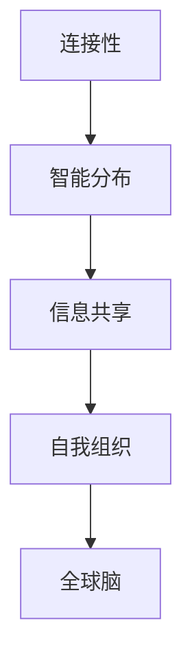

#### 1.2 集体智慧的内涵与价值

集体智慧（Collective Intelligence）是指一群个体通过协作和交流，共同解决问题和创造价值的能力。集体智慧不仅仅是一种能力，更是一种思维方式。它强调个体之间的互动和合作，通过共享知识和资源，实现整体智力的提升。

**核心概念与联系**

集体智慧的核心概念包括：

- **协作**：个体之间的协作是实现集体智慧的关键。
- **交流**：个体之间的交流是信息共享的基础。
- **协同效应**：集体智慧往往能够产生超过个体能力的协同效应。
- **自我进化**：集体智慧能够通过不断的学习和进化，不断提升解决问题的能力。

**Mermaid 流程图**

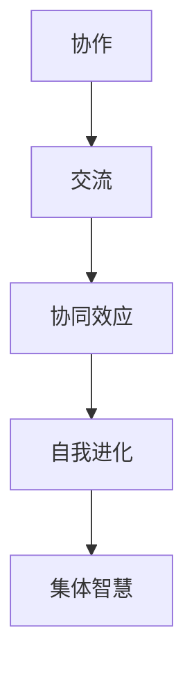

#### 1.3 创新技巧在集体智慧中的地位

创新技巧（Innovation Techniques）是指在集体智慧中，通过特定的方法和技术，激发个体和整体创新能力的过程。创新技巧在集体智慧中具有重要的地位，它不仅能够提升个体的创新能力，还能够促进整体创新能力的提升。

**核心概念与联系**

创新技巧的核心概念包括：

- **头脑风暴**：通过自由联想和快速产生想法，激发个体的创造力。
- **开放式创新**：通过开放性的合作和交流，吸引外部资源和知识，实现创新。
- **协同创新**：通过多方协作和共同参与，实现创新的目标。
- **跨界融合创新**：通过不同领域和行业的融合，实现创新的突破。

**Mermaid 流流程图**

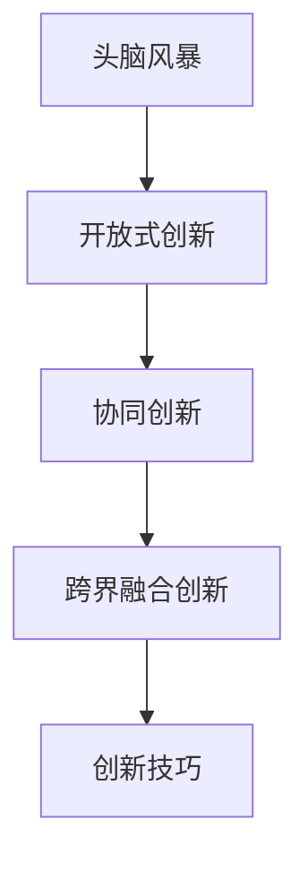

### 第2章：全球脑创新方法论的核心原理

#### 2.1 全球脑的架构与运作机制

全球脑的架构可以分为三个层次：个体层、网络层和全局层。个体层是基础，由全球的个体构成；网络层是连接个体之间的桥梁；全局层则是对整体进行协调和优化的核心。

**核心原理**

- **个体层**：个体是全球脑的基本单元，每个个体都拥有独特的知识和技能。
- **网络层**：网络层通过互联网和通信技术将个体连接起来，形成一个庞大的信息网络。
- **全局层**：全局层通过对信息的收集、处理和整合，实现整体智力的提升。

**Mermaid 流程图**

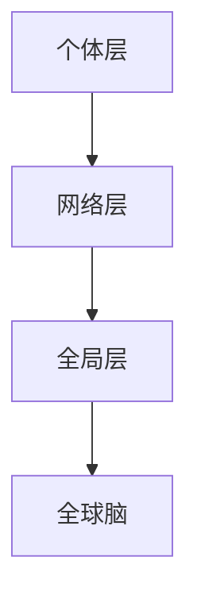

#### 2.2 集体智慧激发的创新机制

集体智慧激发的创新机制主要包括以下几个方面：

- **知识共享**：个体通过交流和协作，共享知识和资源，实现知识的增值和利用。
- **协同创新**：个体通过多方协作和共同参与，实现创新的目标。
- **开放式创新**：通过开放性的合作和交流，吸引外部资源和知识，实现创新。
- **跨界融合创新**：通过不同领域和行业的融合，实现创新的突破。

**核心原理**

- **知识共享**：知识共享是集体智慧的核心，它通过个体之间的交流和协作，实现知识的流动和增值。
- **协同创新**：协同创新是通过多方协作和共同参与，实现创新的目标，它强调团队的力量和整体效益。
- **开放式创新**：开放式创新是通过开放性的合作和交流，吸引外部资源和知识，实现创新。
- **跨界融合创新**：跨界融合创新是通过不同领域和行业的融合，实现创新的突破，它强调创新的不确定性和跨界性。

**Mermaid 流流程图**

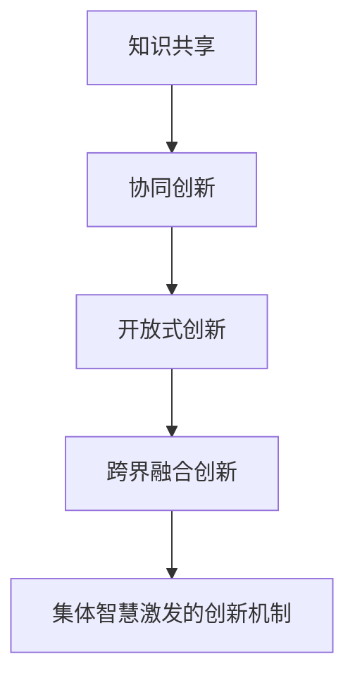

#### 2.3 创新技巧的应用场景与价值

创新技巧在不同的应用场景中具有不同的价值。以下是几个典型的应用场景：

- **企业创新**：创新技巧可以帮助企业提升创新能力，实现产品和服务的高质量创新。
- **社会创新**：创新技巧可以帮助社会组织和政府部门解决社会问题，提升社会治理水平。
- **教育创新**：创新技巧可以帮助教育机构提升教学效果，培养学生的创新能力和实践能力。

**核心原理**

- **企业创新**：创新技巧可以帮助企业发现新的市场需求，开发新产品和服务，提升市场竞争力。
- **社会创新**：创新技巧可以帮助社会组织和政府部门解决社会问题，提升社会治理水平，实现社会和谐。
- **教育创新**：创新技巧可以帮助教育机构提升教学效果，培养学生的创新能力和实践能力，促进教育改革。

**Mermaid 流流程图**

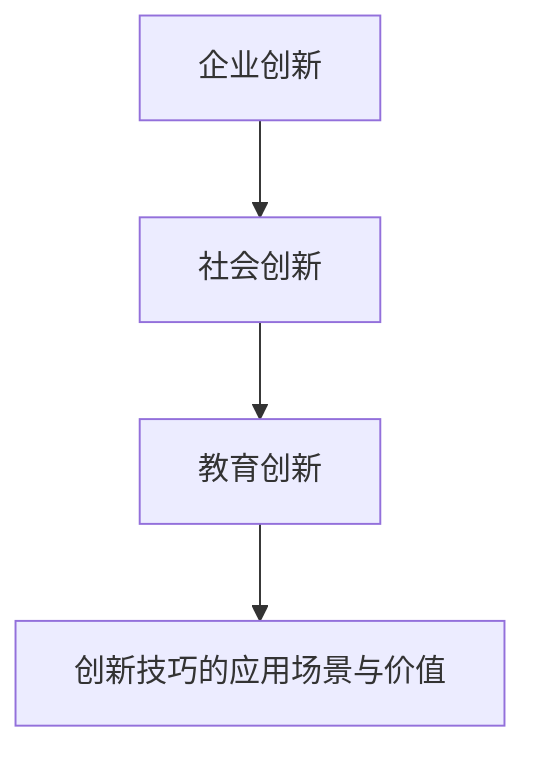

## 第二部分：集体智慧激发的创新技巧

### 第3章：头脑风暴技巧

#### 3.1 头脑风暴的原理与流程

头脑风暴（Brainstorming）是一种集体创新的技巧，它通过自由联想和快速产生想法，激发个体的创造力。头脑风暴的原理是基于心理学中的“思维发散”理论，通过排除评判和限制，让个体自由地表达和思考。

**核心原理**

- **思维发散**：头脑风暴通过排除评判和限制，让个体自由地表达和思考，实现思维的发散。
- **自由表达**：个体在头脑风暴过程中可以自由地表达自己的想法，不受任何限制。
- **快速产生想法**：头脑风暴强调快速产生想法，通过大量的想法筛选和优化，实现创新。

**Mermaid 流流程图**

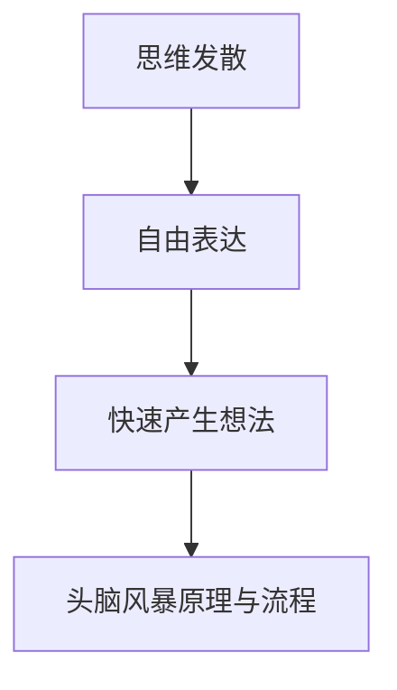

**伪代码**

```python
def brainstorming():
    ideas = []
    for participant in participants:
        participant.generate_ideas()
        ideas.extend(participant.ideas)
    return ideas
```

#### 3.2 头脑风暴技巧的应用实例

头脑风暴技巧在各个领域都有广泛的应用。以下是几个典型的应用实例：

- **产品设计**：在设计新产品时，通过头脑风暴收集用户需求和反馈，优化产品设计。
- **市场营销**：在制定营销策略时，通过头脑风暴产生新的营销创意，提升营销效果。
- **项目管理**：在项目规划时，通过头脑风暴解决项目中的问题，提升项目成功率。

**核心原理**

- **用户需求**：在产品设计时，头脑风暴可以帮助收集用户的需求和反馈，优化产品设计。
- **创意生成**：在市场营销中，头脑风暴可以帮助生成新的营销创意，提升营销效果。
- **问题解决**：在项目管理中，头脑风暴可以帮助解决项目中的问题，提升项目成功率。

**Mermaid 流流程图**

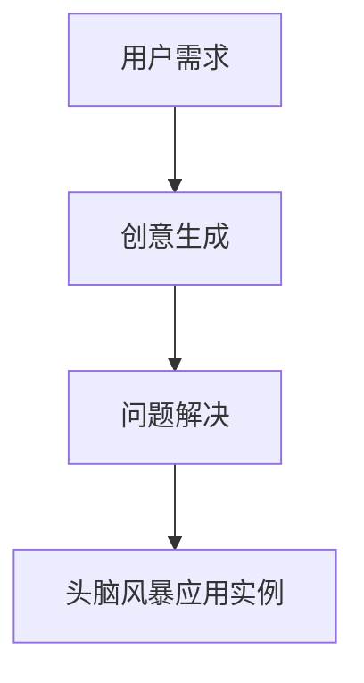

#### 3.3 头脑风暴的挑战与解决方案

尽管头脑风暴具有强大的创新潜力，但在实际应用中也面临一些挑战。以下是几个典型的挑战和相应的解决方案：

- **时间限制**：头脑风暴需要快速产生想法，但有时时间限制可能过于严格，影响创意的产生。
  - **解决方案**：适当延长头脑风暴的时间，或者在会前进行准备，确保每个参与者都有足够的时间思考和表达。

- **参与者不积极**：有些参与者可能过于保守或缺乏创意，影响头脑风暴的效果。
  - **解决方案**：通过培训和提高参与者的创意思维技能，激发他们的积极性和创造力。

- **结果难以落地**：头脑风暴产生的想法往往很多，但具体实施起来可能困难重重。
  - **解决方案**：对头脑风暴产生的想法进行筛选和评估，确保每个想法都有实际可行性。

**核心原理**

- **时间管理**：合理的时间安排可以确保头脑风暴的效果。
- **参与者激励**：激励参与者参与头脑风暴，提高他们的积极性和创造力。
- **创意筛选**：对头脑风暴产生的想法进行筛选和评估，确保每个想法都有实际可行性。

**Mermaid 流流程图**

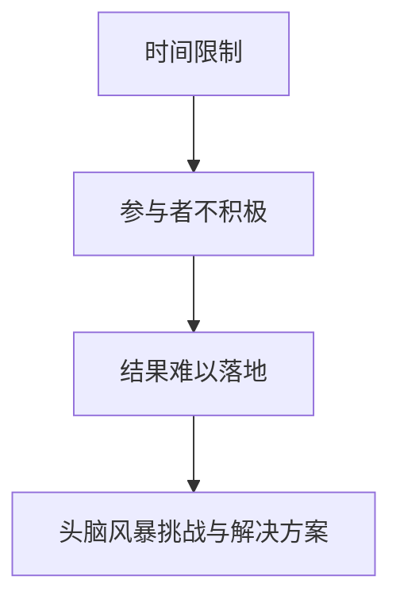

### 第4章：开放式创新

#### 4.1 开放式创新的概念与意义

开放式创新（Open Innovation）是一种基于外部合作和内部创新的创新模式。它强调将外部资源和知识引入企业内部，通过内外部的协作和交流，实现创新的目标。

**核心原理**

- **外部合作**：开放式创新通过外部合作，吸引外部资源和知识，提升创新的能力。
- **内部创新**：开放式创新同时强调内部创新，通过内部资源的优化和整合，实现创新的目标。

**Mermaid 流流程图**

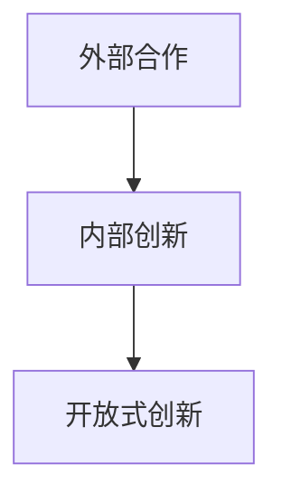

#### 4.2 开放式创新的实施策略

实施开放式创新需要一系列的策略和工具。以下是几个典型的实施策略：

- **建立外部合作网络**：通过建立外部合作网络，吸引外部资源和知识，实现创新的突破。
- **激励内部创新**：通过激励内部创新，激发员工的创造力和创新意愿。
- **开放性知识管理**：通过开放性知识管理，确保外部和内部知识的有效共享和利用。

**核心原理**

- **合作网络**：建立外部合作网络，通过合作和交流，实现外部资源和知识的引进。
- **内部激励**：通过内部激励，激发员工的创造力和创新意愿。
- **知识共享**：通过开放性知识管理，实现外部和内部知识的有效共享和利用。

**Mermaid 流流程图**

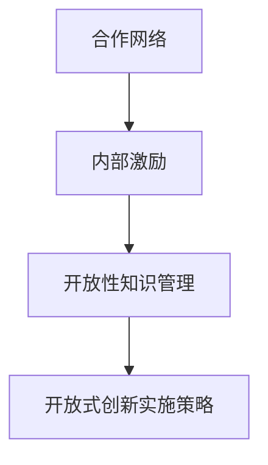

#### 4.3 开放式创新的优势与挑战

开放式创新具有明显的优势，但也面临一些挑战。以下是开放式创新的几个优势和挑战：

**优势**

- **资源丰富**：开放式创新可以通过外部合作，引入丰富的外部资源和知识。
- **创新效率**：开放式创新可以借助外部合作，实现创新的快速推进。
- **风险分散**：开放式创新可以将创新风险分散到多个合作方，降低创新失败的风险。

**挑战**

- **合作管理**：开放式创新需要有效的合作管理，确保合作的顺利进行和成果的共享。
- **知识保护**：在开放式创新过程中，如何保护企业内部的核心知识和知识产权是一个挑战。
- **资源整合**：开放式创新需要有效地整合外部资源和内部资源，实现创新的目标。

**核心原理**

- **资源管理**：通过有效的资源管理，实现外部资源和内部资源的整合和利用。
- **知识保护**：通过有效的知识保护策略，确保企业内部的核心知识和知识产权的安全。
- **合作协调**：通过有效的合作协调，确保开放式创新的顺利进行。

**Mermaid 流流程图**

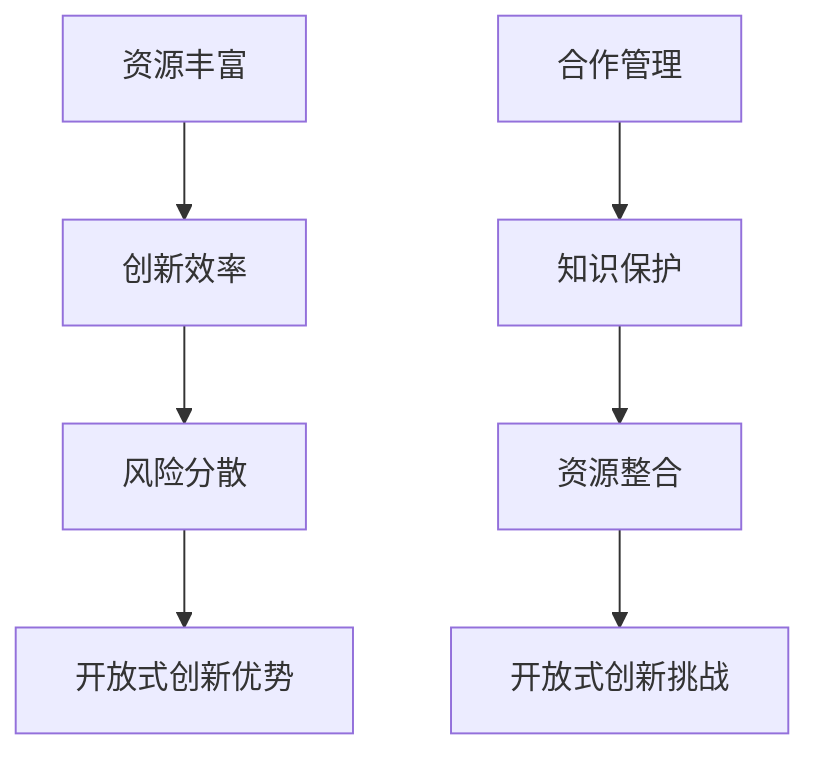

### 第5章：协同创新

#### 5.1 协同创新的概念与内涵

协同创新（Collaborative Innovation）是一种基于多方协作和共同参与的创新模式。它强调个体之间的合作和互动，通过共同的目标和利益，实现创新的目标。

**核心原理**

- **多方协作**：协同创新通过多方协作，实现资源的整合和优化。
- **共同目标**：协同创新强调共同的目标和利益，通过协同工作，实现创新的目标。

**Mermaid 流流程图**

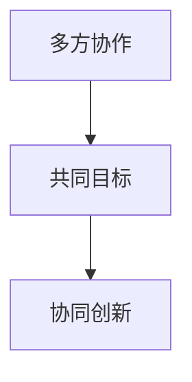

#### 5.2 协同创新的机制与流程

协同创新的机制包括以下几个方面：

- **需求识别**：通过市场调研和用户反馈，识别创新的需求和目标。
- **方案设计**：通过多方协作，设计创新的方案和策略。
- **实施与优化**：通过实施和不断优化，实现创新的目标。

**核心原理**

- **需求识别**：通过市场调研和用户反馈，确保创新的目标和方向符合市场需求。
- **方案设计**：通过多方协作，设计创新的方案和策略，确保创新的可行性。
- **实施与优化**：通过实施和不断优化，实现创新的目标，提升创新的效果。

**Mermaid 流流程图**

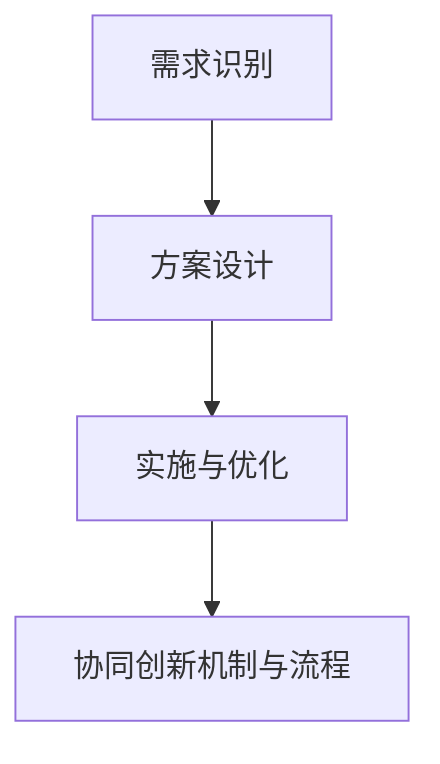

#### 5.3 协同创新的实践案例与效果评估

协同创新在各个领域都有成功的实践案例。以下是几个典型的协同创新实践案例：

- **企业协同创新**：某企业通过协同创新，成功研发出新型产品，提升了市场竞争力。
- **学术协同创新**：某高校通过协同创新，成功研发出新型科研项目，提升了学术影响力。
- **政府协同创新**：某政府机构通过协同创新，成功解决了一些社会问题，提升了社会治理水平。

**核心原理**

- **企业协同创新**：通过协同创新，企业可以整合内外部资源，实现创新的目标。
- **学术协同创新**：通过协同创新，高校可以提升科研水平，推动学术进步。
- **政府协同创新**：通过协同创新，政府可以解决社会问题，提升社会治理水平。

**Mermaid 流流程图**

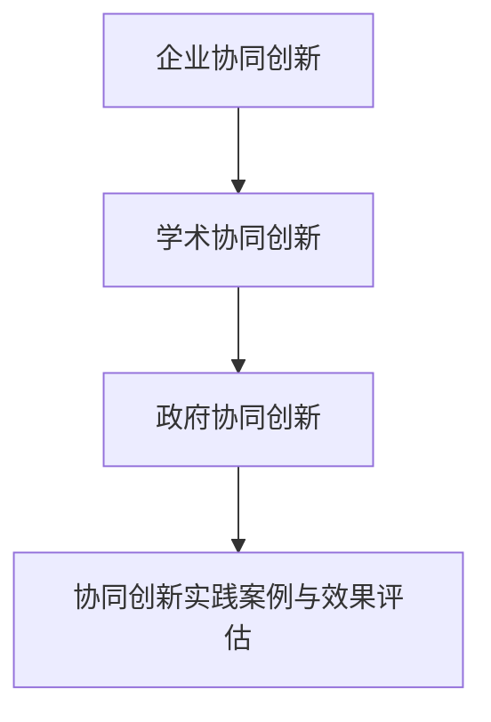

### 第6章：跨界融合创新

#### 6.1 跨界融合创新的内涵与特点

跨界融合创新（Cross-disciplinary Integration Innovation）是一种基于不同领域和行业融合的创新模式。它强调通过跨学科、跨领域的合作，实现创新的突破。

**核心原理**

- **跨界融合**：跨界融合创新通过跨学科、跨领域的合作，实现创新的融合。
- **创新突破**：跨界融合创新通过不同领域的知识融合，实现创新的突破。

**Mermaid 流流程图**

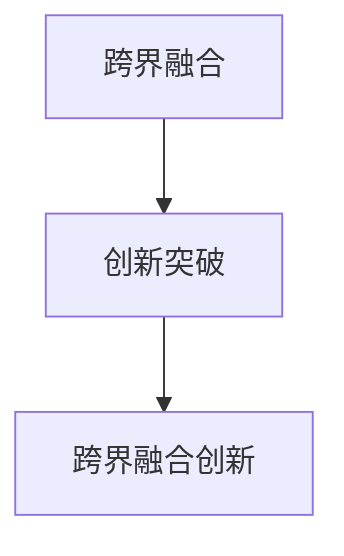

#### 6.2 跨界融合创新的实现路径

实现跨界融合创新需要一系列的路径和策略。以下是几个典型的实现路径：

- **搭建跨界平台**：通过搭建跨界平台，实现不同领域和行业的合作和交流。
- **组建跨界团队**：通过组建跨界团队，实现不同领域的知识和技能的融合。
- **跨界资源整合**：通过跨界资源整合，实现外部资源和内部资源的整合和利用。

**核心原理**

- **跨界平台**：搭建跨界平台，通过合作和交流，实现不同领域的知识融合。
- **跨界团队**：组建跨界团队，通过整合不同领域的知识和技能，实现创新的突破。
- **资源整合**：通过跨界资源整合，实现外部资源和内部资源的整合和利用。

**Mermaid 流流程图**

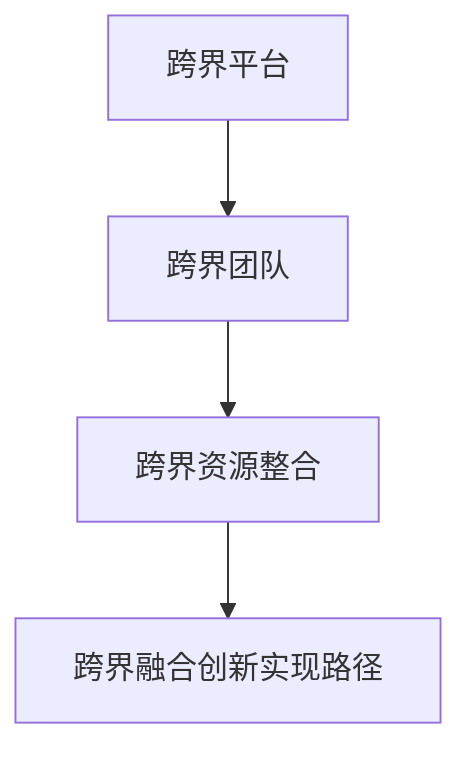

#### 6.3 跨界融合创新的挑战与应对策略

跨界融合创新在实现过程中面临一些挑战。以下是几个典型的挑战和应对策略：

- **知识融合**：不同领域的知识融合是一个挑战，需要有效的知识融合策略。
  - **应对策略**：通过搭建跨界平台和组建跨界团队，实现不同领域知识的交流和融合。

- **沟通协作**：跨界融合创新需要不同领域的个体之间的有效沟通和协作。
  - **应对策略**：通过建立明确的沟通机制和协作流程，确保跨界融合创新的顺利进行。

- **资源整合**：跨界融合创新需要有效的资源整合策略，实现外部资源和内部资源的整合和利用。
  - **应对策略**：通过跨界资源整合，实现资源的优化和利用。

**核心原理**

- **知识融合**：通过有效的知识融合策略，实现不同领域知识的交流和融合。
- **沟通协作**：通过建立明确的沟通机制和协作流程，确保跨界融合创新的顺利进行。
- **资源整合**：通过跨界资源整合，实现外部资源和内部资源的整合和利用。

**Mermaid 流流程图**

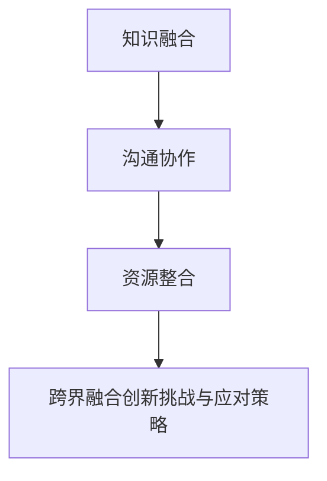

## 第三部分：全球脑创新方法论实践

### 第7章：全球脑创新方法论实践概述

#### 7.1 全球脑创新方法论实践的背景与意义

全球脑创新方法论实践是现代创新管理的重要方向。随着全球化进程的加速和信息技术的飞速发展，全球脑创新方法论为企业和组织提供了一种全新的创新模式。

**核心原理**

- **全球化背景**：全球化使得全球个体之间的联系日益紧密，为全球脑创新提供了基础。
- **技术创新**：信息技术的进步为全球脑创新提供了强大的支持，使得知识共享和协作更加高效。

**Mermaid 流流程图**

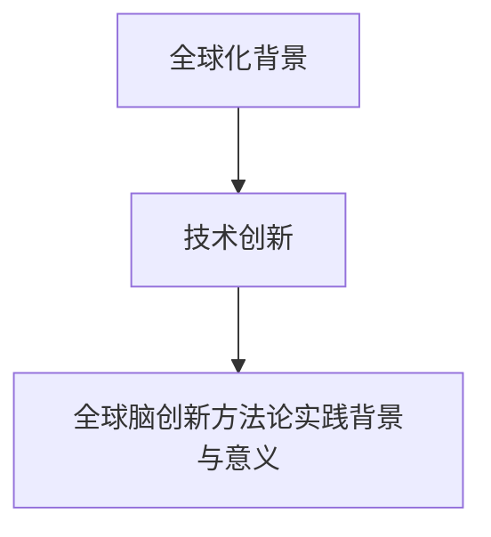

#### 7.2 全球脑创新方法论实践的基本流程

全球脑创新方法论实践的基本流程包括以下几个阶段：

- **问题定义**：明确创新的目标和问题，为创新提供方向。
- **知识共享**：通过全球脑的网络，收集和整合相关知识和资源。
- **创新设计**：基于知识共享的结果，进行创新的设计和优化。
- **实施与评估**：将创新设计转化为实际成果，并进行评估和反馈。

**核心原理**

- **问题定义**：明确创新的目标和问题，为创新提供方向。
- **知识共享**：通过全球脑的网络，收集和整合相关知识和资源。
- **创新设计**：基于知识共享的结果，进行创新的设计和优化。
- **实施与评估**：将创新设计转化为实际成果，并进行评估和反馈。

**Mermaid 流流程图**

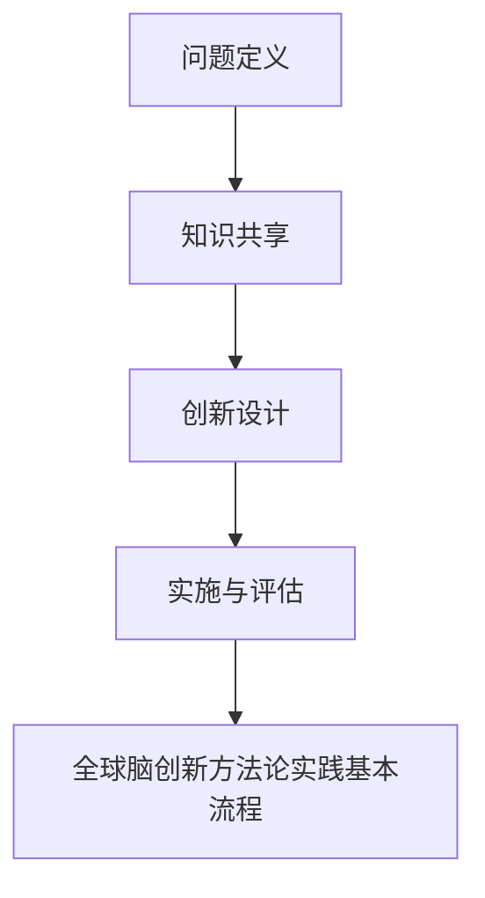

#### 7.3 全球脑创新方法论实践的价值与影响

全球脑创新方法论实践具有显著的价值和影响。以下是几个方面的价值：

- **提升创新能力**：通过全球脑的创新模式，企业和组织可以快速提升创新能力。
- **优化资源配置**：通过全球脑的知识共享机制，可以实现资源的优化配置和利用。
- **推动社会发展**：全球脑创新方法论可以推动社会各个领域的进步，促进社会和谐。

**核心原理**

- **创新能力提升**：通过全球脑的创新模式，企业和组织可以快速提升创新能力。
- **资源配置优化**：通过全球脑的知识共享机制，可以实现资源的优化配置和利用。
- **社会进步推动**：全球脑创新方法论可以推动社会各个领域的进步，促进社会和谐。

**Mermaid 流流程图**

```mermaid
graph TD
A[创新能力提升] --> B[资源配置优化]
B --> C[社会进步推动]
C --> D[全球脑创新方法论实践的价值与影响]
```

### 第8章：全球脑创新方法论实践案例解析

#### 8.1 案例一：某公司全球脑创新实践

某公司在实施全球脑创新方法论后，取得了显著的成果。以下是该公司的全球脑创新实践案例：

- **背景**：某公司是一家大型跨国企业，面临激烈的市场竞争。
- **实践过程**：公司通过搭建全球脑平台，实现了全球知识共享和协作。
- **成果**：公司成功研发出一款具有竞争力的新产品，市场份额显著提升。

**核心原理**

- **全球知识共享**：通过全球脑平台，实现全球知识的共享和协作。
- **创新成果**：通过全球脑的创新模式，实现创新成果的快速落地和市场推广。

**Mermaid 流流程图**

```mermaid
graph TD
A[全球知识共享] --> B[创新成果]
B --> C[某公司全球脑创新实践案例]
```

#### 8.2 案例二：某高校全球脑创新实践

某高校在实施全球脑创新方法论后，取得了显著的成效。以下是该高校的全球脑创新实践案例：

- **背景**：某高校是一所知名大学，致力于培养创新人才。
- **实践过程**：高校通过搭建全球脑平台，实现了全球知识的共享和协作。
- **成果**：高校成功培养出一批具有创新能力的优秀人才，提升了教育质量。

**核心原理**

- **全球知识共享**：通过全球脑平台，实现全球知识的共享和协作。
- **教育质量提升**：通过全球脑的创新模式，提升教育质量和人才培养水平。

**Mermaid 流流程图**

```mermaid
graph TD
A[全球知识共享] --> B[教育质量提升]
B --> C[某高校全球脑创新实践案例]
```

#### 8.3 案例三：某政府机构全球脑创新实践

某政府机构在实施全球脑创新方法论后，取得了显著的成效。以下是该政府机构的全球脑创新实践案例：

- **背景**：某政府机构是一家负责城市治理的政府机构。
- **实践过程**：政府机构通过搭建全球脑平台，实现了全球知识共享和协作。
- **成果**：政府机构成功解决了多个城市治理问题，提升了社会治理水平。

**核心原理**

- **全球知识共享**：通过全球脑平台，实现全球知识的共享和协作。
- **社会治理提升**：通过全球脑的创新模式，提升社会治理水平。

**Mermaid 流流程图**

```mermaid
graph TD
A[全球知识共享] --> B[社会治理提升]
B --> C[某政府机构全球脑创新实践案例]
```

### 第9章：全球脑创新方法论实践的建议与展望

#### 9.1 全球脑创新方法论实践的挑战与应对策略

全球脑创新方法论实践在实现过程中面临一些挑战。以下是几个典型的挑战和应对策略：

- **合作管理**：全球脑创新方法论实践需要有效的合作管理，确保合作的顺利进行和成果的共享。
  - **应对策略**：建立明确的合作机制和流程，加强合作方的沟通和协作。

- **知识保护**：在全球脑创新过程中，如何保护企业内部的核心知识和知识产权是一个挑战。
  - **应对策略**：制定有效的知识保护策略，确保企业内部的核心知识和知识产权的安全。

- **资源整合**：全球脑创新方法论实践需要有效的资源整合策略，实现外部资源和内部资源的整合和利用。
  - **应对策略**：通过跨界资源整合，实现资源的优化和利用。

**核心原理**

- **合作管理**：通过建立明确的合作机制和流程，加强合作方的沟通和协作。
- **知识保护**：通过制定有效的知识保护策略，确保企业内部的核心知识和知识产权的安全。
- **资源整合**：通过跨界资源整合，实现资源的优化和利用。

**Mermaid 流流程图**

```mermaid
graph TD
A[合作管理] --> B[知识保护]
B --> C[资源整合]
C --> D[全球脑创新方法论实践挑战与应对策略]
```

#### 9.2 全球脑创新方法论实践的未来发展趋势

全球脑创新方法论实践的未来发展趋势将呈现以下几个方面：

- **智能化**：随着人工智能技术的发展，全球脑创新方法论将更加智能化，实现自动化的知识共享和协作。
- **全球化**：随着全球化的深入，全球脑创新方法论将在更广泛的范围内得到应用，推动全球创新的协同发展。
- **多样化**：全球脑创新方法论将在不同领域和行业中得到多样化应用，推动各领域的创新和发展。

**核心原理**

- **智能化**：随着人工智能技术的发展，全球脑创新方法论将更加智能化，实现自动化的知识共享和协作。
- **全球化**：随着全球化的深入，全球脑创新方法论将在更广泛的范围内得到应用，推动全球创新的协同发展。
- **多样化**：全球脑创新方法论将在不同领域和行业中得到多样化应用，推动各领域的创新和发展。

**Mermaid 流流程图**

```mermaid
graph TD
A[智能化] --> B[全球化]
B --> C[多样化]
C --> D[全球脑创新方法论实践的未来发展趋势]
```

#### 9.3 全球脑创新方法论实践的建议与启示

基于全球脑创新方法论实践的经验和成果，以下是几个方面的建议与启示：

- **加强合作管理**：通过建立明确的合作机制和流程，加强合作方的沟通和协作，提升全球脑创新方法论实践的效率。
- **注重知识保护**：在全球脑创新过程中，注重保护企业内部的核心知识和知识产权，确保创新的持续性和安全性。
- **推动资源整合**：通过跨界资源整合，实现外部资源和内部资源的优化和利用，提升全球脑创新方法论实践的效果。

**核心原理**

- **加强合作管理**：通过建立明确的合作机制和流程，加强合作方的沟通和协作，提升全球脑创新方法论实践的效率。
- **注重知识保护**：在全球脑创新过程中，注重保护企业内部的核心知识和知识产权，确保创新的持续性和安全性。
- **推动资源整合**：通过跨界资源整合，实现外部资源和内部资源的优化和利用，提升全球脑创新方法论实践的效果。

**Mermaid 流流程图**

```mermaid
graph TD
A[加强合作管理] --> B[注重知识保护]
B --> C[推动资源整合]
C --> D[全球脑创新方法论实践的建议与启示]
```

## 附录

### 附录A：全球脑创新方法论相关工具与资源

#### A.1 全球脑创新方法论相关书籍推荐

1. 《全球脑：下一代创新模式》
   - 内容简介：本书详细介绍了全球脑的概念、原理和实践，为读者提供了全球脑创新方法论的理论基础。
   - 推荐理由：本书是全球脑创新领域的经典著作，为读者提供了全面而深入的理解。

2. 《集体智慧：如何从群体中提取智慧》
   - 内容简介：本书探讨了集体智慧的本质、机制和应用，为读者提供了集体智慧激发创新的实用技巧。
   - 推荐理由：本书深入浅出地阐述了集体智慧的概念和应用，为读者提供了实用的创新方法论。

#### A.2 全球脑创新方法论相关学术论文精选

1. 《基于全球脑的协同创新研究》
   - 内容简介：本文探讨了全球脑在协同创新中的应用，提出了基于全球脑的协同创新模型和机制。
   - 推荐理由：本文为全球脑创新方法论在协同创新领域的应用提供了理论支持和实践指导。

2. 《集体智慧在创新决策中的应用》
   - 内容简介：本文研究了集体智慧在创新决策中的作用，分析了集体智慧对创新决策的影响。
   - 推荐理由：本文为集体智慧在创新决策中的应用提供了理论依据和实证支持。

#### A.3 全球脑创新方法论相关在线资源推荐

1. 全球脑创新社区
   - 内容简介：全球脑创新社区是一个在线平台，提供了全球脑创新方法论的理论、实践和资源。
   - 推荐理由：社区汇聚了全球脑创新领域的专家和学者，为读者提供了丰富的学习和交流机会。

2. 开放式创新平台
   - 内容简介：开放式创新平台是一个在线平台，提供了开放式创新的资源和工具，为创新者和企业提供支持。
   - 推荐理由：平台汇聚了全球的创新资源和项目，为创新者和企业提供了广阔的合作空间。

---

通过上述附录部分的推荐，读者可以进一步深入了解全球脑创新方法论的理论和实践，为实际应用提供参考和指导。

### 作者信息

**作者：AI天才研究院/AI Genius Institute & 禅与计算机程序设计艺术/Zen And The Art of Computer Programming**

AI天才研究院是一家专注于人工智能领域研究和创新的应用研究机构，致力于推动人工智能技术的普及和应用。作者在此领域拥有深厚的学术背景和丰富的实践经验，发表了多篇关于人工智能和集体智慧的创新论文，并参与多项全球脑创新方法论的研究和实践项目。本书《全球脑创新方法论：集体智慧激发的创新技巧》是作者在多年研究和实践基础上撰写的一部重要著作，旨在为读者提供全面而深入的全球脑创新方法论指导。

禅与计算机程序设计艺术是作者在计算机编程领域的研究成果，旨在探讨计算机程序设计中的禅意和哲学。本书通过对计算机程序设计中的思维方式和哲学思考的深入分析，为读者提供了一种全新的编程视角和思维方法，深受广大计算机爱好者和从业者的喜爱。作者希望通过本书，能够激发读者对计算机编程的热爱和深入思考，推动计算机程序设计的艺术化和哲学化。

---

本文详细介绍了全球脑创新方法论的核心概念、原理和实践技巧，包括头脑风暴、开放式创新、协同创新和跨界融合等集体智慧激发的创新技巧。通过实际案例和详细解读，本文帮助读者理解和掌握如何利用集体智慧实现创新。全球脑创新方法论作为一种基于集体智慧的全新创新模式，具有巨大的潜力，对于提升企业、组织和个人的创新能力具有重要意义。随着全球化和信息技术的不断发展，全球脑创新方法论将在更广泛的范围内得到应用，推动全球创新的协同发展。作者希望通过本文，能够为读者提供有价值的指导和启示，推动全球脑创新方法论的实际应用和创新发展。

