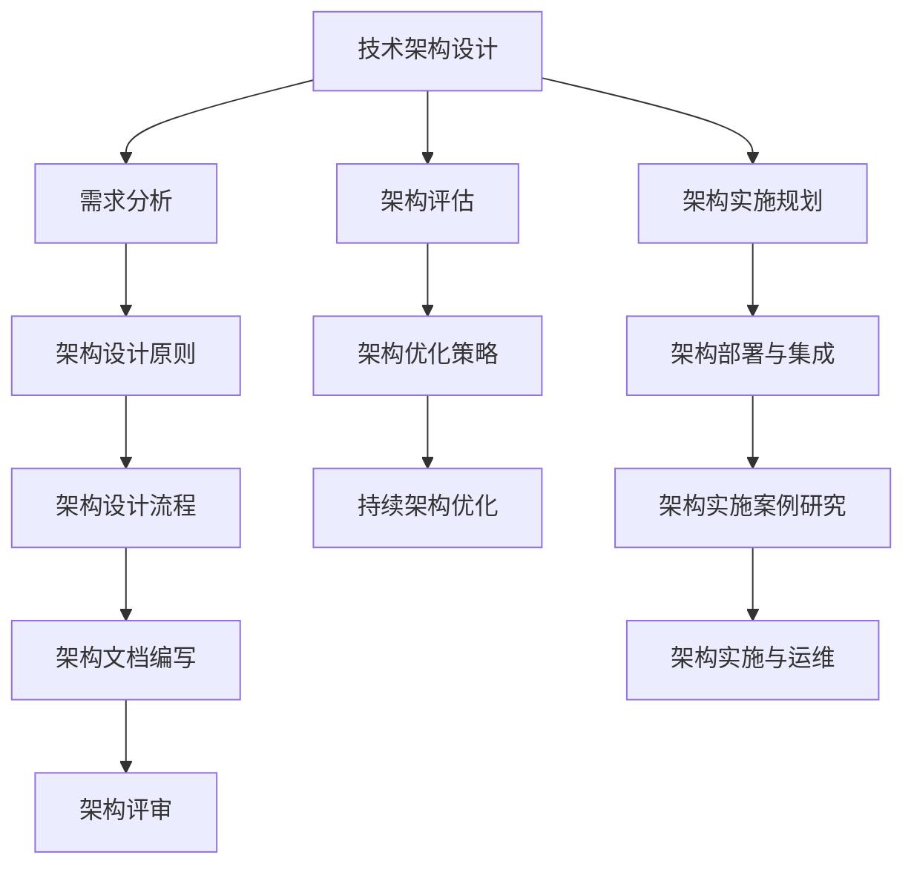

                 

# 公司整体技术架构的设计、评估、优化与实施

> **关键词：** 技术架构，设计原则，评估方法，优化策略，实施流程

> **摘要：** 本文旨在详细阐述公司整体技术架构的设计、评估、优化与实施的全过程，包括基础设计原则、需求分析、架构设计流程、评估与优化策略、实施与部署步骤，以及相关的案例研究和实践总结。

### 引言

在现代企业的运营中，技术架构的重要性日益凸显。技术架构不仅仅是一个软件或系统的设计蓝图，它更是一个组织业务和技术战略的核心体现。一个高效、灵活、可扩展的技术架构能够帮助企业应对快速变化的市场需求，提升业务的竞争力。

**技术架构概述**

技术架构是指一个系统或组织在技术层面的总体结构和设计原则，它涵盖了软件、硬件、网络、数据库等各个方面。技术架构的演变经历了从单体架构到分布式架构，再到微服务架构，最终演变为如今云原生架构的过程。

**设计、评估、优化与实施的重要性**

1. **设计**：技术架构的设计是整个过程的起点，它决定了系统的基础结构和扩展能力。良好的设计能够确保系统的高可用性、高性能和高可靠性。
2. **评估**：技术架构评估是确保设计有效性的关键步骤。通过评估，可以发现潜在的问题和风险，从而进行调整和优化。
3. **优化**：技术架构优化是不断改进和适应新需求的过程。优化能够提高系统的效率，减少维护成本，延长系统生命周期。
4. **实施**：技术架构的实施是将设计转化为现实的过程。实施的成功与否直接影响系统的稳定性和用户体验。

### 第一部分：设计基础

#### 第1章：企业技术架构概述

**技术架构的定义与演变**

技术架构是指将业务需求转化为技术实现的整体结构和方法。它的演变过程反映了信息技术的发展趋势：

1. **单体架构**：早期的系统设计通常采用单体架构，所有组件都集成在一个单一的代码库中。
2. **分布式架构**：随着系统规模的扩大，分布式架构逐渐流行，系统被拆分为多个独立的组件，通过网络进行通信。
3. **微服务架构**：微服务架构进一步将系统细分为更小的服务单元，每个服务独立部署和扩展。
4. **云原生架构**：云原生架构利用云计算的优势，实现动态伸缩、自动化管理和高性能。

**技术架构的基本组成部分**

技术架构包括以下几个基本组成部分：

1. **应用层**：负责业务逻辑的实现。
2. **数据层**：包括数据库、缓存、消息队列等。
3. **网络层**：负责系统之间的通信。
4. **基础设施层**：包括服务器、存储、网络设备等。

**技术架构在企业中的价值**

1. **提高业务敏捷性**：灵活的技术架构能够快速响应市场变化，支持业务创新。
2. **降低成本**：通过优化资源利用，降低运维成本。
3. **提升用户体验**：高效的技术架构能够提供快速、稳定的服务，提升用户满意度。
4. **确保系统稳定性**：合理的架构设计能够保证系统的高可用性和可靠性。

#### 第2章：企业技术需求分析

**业务需求分析**

业务需求分析是技术架构设计的基础。它包括以下几个步骤：

1. **确定业务目标**：明确企业的发展方向和业务目标。
2. **需求收集**：与业务团队紧密合作，收集业务需求。
3. **需求分类**：将需求分为功能需求和非功能需求。
4. **需求分析**：对需求进行详细分析，确定需求实现的优先级。

**技术需求分析**

技术需求分析是基于业务需求，确定实现需求所需的技术方案。它包括以下几个步骤：

1. **技术选型**：根据业务需求，选择合适的技术栈。
2. **技术可行性分析**：评估所选技术方案的可行性，包括性能、兼容性、维护性等方面。
3. **技术风险评估**：识别潜在的技术风险，并制定应对策略。
4. **技术方案设计**：设计技术方案，确保能够满足业务需求。

**需求分析工具与方法**

1. **用户故事地图**：用于梳理用户需求和工作流程。
2. **业务流程图**：用于描述业务流程和业务逻辑。
3. **用例图**：用于描述用户与系统之间的交互。
4. **需求规格说明书**：用于详细描述业务需求和技术需求。

#### 第3章：技术架构设计原则与策略

**技术架构设计原则**

技术架构设计原则是确保架构设计合理性和有效性的指导原则。以下是几个关键原则：

1. **模块化**：将系统拆分为独立的模块，提高可维护性和扩展性。
2. **松耦合**：减少组件之间的依赖关系，提高系统的灵活性和可测试性。
3. **高内聚**：确保组件内部的功能紧密相关，提高代码复用性和可读性。
4. **可扩展性**：设计时应考虑系统的可扩展性，以应对未来业务增长。
5. **可靠性**：确保系统在故障情况下能够快速恢复，提高系统的稳定性。

**技术架构设计策略**

技术架构设计策略是基于业务需求和技术选型，制定具体的设计方案。以下是几个关键策略：

1. **分层设计**：将系统分为多个层次，如应用层、数据层、网络层等，实现功能分离和职责清晰。
2. **分布式设计**：采用分布式架构，提高系统的可用性和性能。
3. **微服务设计**：将系统拆分为微服务，实现服务的独立部署和扩展。
4. **云原生设计**：利用云计算的优势，实现动态伸缩和自动化管理。
5. **安全性设计**：确保系统的安全性，包括数据加密、访问控制、网络安全等。

**技术选型**

技术选型是技术架构设计的关键步骤，涉及以下方面：

1. **语言与框架**：选择适合业务需求的技术栈，如Java、Spring、MySQL等。
2. **数据库**：根据业务需求，选择合适的数据库技术，如关系型数据库、NoSQL数据库等。
3. **中间件**：选择合适的中间件，如消息队列、缓存、负载均衡等。
4. **云平台**：选择适合业务需求的云平台，如AWS、Azure、阿里云等。

#### 第4章：技术架构设计流程

**技术架构设计流程概述**

技术架构设计流程是一个系统性的过程，包括以下几个关键步骤：

1. **需求分析**：明确业务需求和技术需求。
2. **架构设计**：根据需求进行技术架构设计。
3. **架构评审**：对架构设计进行评审，确保设计合理性和可行性。
4. **架构文档编写**：编写详细的架构文档，包括架构图、组件描述、接口设计等。

**技术架构文档编写**

技术架构文档是架构设计的重要输出，包括以下内容：

1. **架构图**：描述系统架构和组件之间的关系。
2. **组件描述**：详细描述每个组件的功能、接口和实现方式。
3. **接口设计**：描述组件之间的接口规范。
4. **架构约束**：列出架构设计中的约束条件，如性能、可靠性等。

**技术架构评审**

技术架构评审是确保架构设计合理性和可行性的关键步骤，包括以下内容：

1. **评审目的**：明确评审的目标和范围。
2. **评审过程**：组织评审会议，对架构设计进行详细讨论。
3. **评审输出**：输出评审报告，列出存在的问题和建议。

### 第二部分：评估与优化

#### 第5章：技术架构评估方法

**技术架构评估的重要性**

技术架构评估是确保技术架构满足业务需求的关键步骤。通过评估，可以发现潜在的问题和风险，为后续的优化提供依据。

**技术架构评估指标**

技术架构评估指标包括以下几个方面：

1. **稳定性**：系统在长时间运行中的稳定性和可靠性。
2. **灵活性**：系统在业务变化和需求变更中的适应能力。
3. **可扩展性**：系统在处理业务增长时的扩展能力。
4. **成本效益**：系统在性能和成本之间的平衡。

**技术架构评估工具**

1. **静态分析工具**：用于分析代码质量和架构设计问题。
2. **动态分析工具**：用于评估系统在运行中的性能和稳定性。
3. **自动化测试工具**：用于验证系统功能和行为是否符合预期。

#### 第6章：技术架构优化策略

**技术架构优化目标**

技术架构优化目标是提升系统的性能、稳定性和灵活性，同时降低成本和维护难度。

**技术架构优化方法**

1. **性能优化**：通过优化数据库查询、缓存策略、网络通信等，提升系统性能。
2. **稳定性优化**：通过改进错误处理、日志记录、监控告警等，提高系统的稳定性。
3. **灵活性优化**：通过模块化设计、接口标准化等，提高系统的灵活性。

**技术架构优化实践**

1. **定期评估**：定期对技术架构进行评估，发现潜在问题。
2. **持续改进**：基于评估结果，持续优化技术架构。
3. **代码审查**：通过代码审查，识别潜在的性能和稳定性问题。
4. **自动化测试**：通过自动化测试，确保系统的稳定性和性能。

#### 第7章：技术债务管理与优化

**技术债务的定义与分类**

技术债务是指由于时间、资源或技术限制，在系统开发过程中未能完全解决的技术问题。根据产生原因，可以分为以下几类：

1. **技术缺陷**：由于代码质量或设计问题导致的缺陷。
2. **技术限制**：由于技术选型或架构设计问题导致的限制。
3. **功能妥协**：为了满足业务需求，牺牲了某些非功能需求。

**技术债务管理策略**

1. **定期评估**：定期评估技术债务的规模和影响。
2. **优先级排序**：根据技术债务的影响和紧急程度，排序处理。
3. **分阶段解决**：分阶段解决技术债务，确保系统的稳定性和持续性。

**技术债务优化实践**

1. **代码重构**：对存在技术缺陷的代码进行重构，提高代码质量和可维护性。
2. **架构调整**：对存在技术限制的架构进行调整，提高系统的扩展性和灵活性。
3. **功能优化**：在满足业务需求的前提下，优化系统的非功能性需求。

#### 第8章：持续架构优化与演进

**持续架构优化的原则与方法**

1. **原则**：以业务需求为导向，持续优化技术架构。
2. **方法**：采用迭代和增量方法，逐步优化技术架构。

**架构演进策略**

1. **技术演进**：根据技术发展趋势，持续引入新技术和工具。
2. **业务演进**：根据业务需求变化，调整和优化技术架构。
3. **风险管理**：识别和应对技术演进和业务演进中的风险。

**架构演进实践**

1. **技术评估**：定期评估现有技术的性能和稳定性，识别改进点。
2. **技术迁移**：根据评估结果，逐步迁移到新技术或工具。
3. **架构重构**：在必要时进行架构重构，提高系统的可维护性和扩展性。

### 第三部分：实施与部署

#### 第9章：技术架构实施规划

**技术架构实施规划概述**

技术架构实施规划是确保技术架构设计成功实施的关键步骤。它包括以下几个关键环节：

1. **需求确认**：确保实施计划符合业务需求。
2. **资源准备**：准备必要的硬件、软件和网络资源。
3. **项目计划**：制定详细的项目计划，包括时间表、任务分配和里程碑。
4. **风险管理**：识别和应对实施过程中可能遇到的风险。

**技术架构实施计划**

1. **需求分析**：详细分析业务需求，确保实施计划与业务需求一致。
2. **技术选型**：选择适合业务需求的技术栈和工具。
3. **架构设计**：根据技术选型，进行技术架构设计。
4. **开发与测试**：开发系统组件并进行测试，确保质量。
5. **部署与集成**：将系统组件部署到生产环境，并进行集成测试。
6. **验收与上线**：进行系统验收，确保满足业务需求，然后进行上线。

**技术架构实施风险管理**

1. **风险识别**：识别实施过程中可能遇到的风险，如技术问题、资源不足、项目延期等。
2. **风险分析**：分析风险的影响和可能性，确定风险优先级。
3. **风险应对**：制定应对策略，包括风险预防、风险缓解和风险转移。

#### 第10章：技术架构部署与集成

**技术架构部署流程**

技术架构部署是将设计好的系统组件部署到生产环境的过程。部署流程包括以下几个步骤：

1. **环境准备**：准备部署环境，包括服务器、存储和网络。
2. **组件部署**：部署各个系统组件，如应用服务器、数据库、缓存等。
3. **配置管理**：配置系统组件，确保它们能够正常运行。
4. **监控与告警**：设置系统监控和告警，确保系统在运行中能够及时发现和解决故障。

**系统集成方法**

系统集成是将各个系统组件连接在一起，使其协同工作。集成方法包括：

1. **接口集成**：通过定义和实现接口，使系统组件能够互相通信。
2. **数据集成**：通过数据交换格式，如JSON、XML等，实现数据在不同系统之间的传输和共享。
3. **服务集成**：通过服务总线或API网关，实现服务的注册、发现和调用。

**部署与集成工具**

1. **自动化部署工具**：如Jenkins、Docker、Kubernetes等，用于自动化部署和发布系统组件。
2. **配置管理工具**：如Ansible、Puppet等，用于自动化配置和管理系统组件。
3. **监控工具**：如Prometheus、Grafana等，用于监控系统的性能和健康状态。
4. **集成工具**：如Apache Camel、MuleSoft等，用于实现复杂的系统集成。

#### 第11章：技术架构实施案例研究

##### 案例研究1：大型电商平台技术架构实施

**案例背景**

某大型电商平台计划进行技术升级，以支持更高的并发量和更多的业务功能。新架构需要具备高可用性、高性能和可扩展性。

**技术选型**

1. **应用层**：采用Spring Boot和Spring Cloud构建微服务架构。
2. **数据层**：使用MySQL进行数据存储，使用Redis进行缓存。
3. **网络层**：使用Docker和Kubernetes进行容器化和编排。

**架构设计**

1. **应用层**：分为用户服务、订单服务、商品服务等多个微服务。
2. **数据层**：使用数据库集群进行数据存储和备份。
3. **网络层**：使用Nginx进行负载均衡，使用Kubernetes进行容器编排和自动化管理。

**实施与部署**

1. **环境搭建**：使用Docker搭建容器化环境，安装Nginx、MySQL、Redis等软件。
2. **组件部署**：将微服务组件部署到Kubernetes集群，进行容器化部署。
3. **集成测试**：进行集成测试，确保各个组件能够正常协同工作。

**总结**

通过上述实施过程，大型电商平台成功实现了技术架构升级，提高了系统的可用性和性能。

##### 案例研究2：金融行业技术架构优化与实施

**案例背景**

某金融行业公司需要进行技术架构优化，以支持更高的交易量和更复杂的金融业务。

**技术选型**

1. **应用层**：采用Spring Cloud构建分布式服务架构。
2. **数据层**：使用Kafka进行消息队列处理，使用Elasticsearch进行日志分析。
3. **基础设施层**：使用Kubernetes进行容器编排，使用Hadoop和Spark进行大数据处理。

**架构设计**

1. **应用层**：分为交易服务、账户服务、风险控制服务等多个微服务。
2. **数据层**：使用Kafka进行实时数据传输和处理，使用Elasticsearch进行日志收集和分析。
3. **基础设施层**：使用Kubernetes进行容器编排，使用Hadoop和Spark进行大数据处理和存储。

**实施与部署**

1. **环境搭建**：使用Kubernetes搭建容器化环境，安装Kafka、Elasticsearch、Hadoop和Spark等软件。
2. **组件部署**：将微服务组件部署到Kubernetes集群，进行容器化部署。
3. **集成测试**：进行集成测试，确保各个组件能够正常协同工作。

**总结**

通过上述实施过程，金融行业公司成功实现了技术架构优化，提高了系统的交易处理能力和数据处理效率。

#### 第12章：技术架构实施与运维

**技术架构实施后的运维管理**

1. **监控管理**：使用监控系统对系统性能和健康状态进行实时监控。
2. **日志管理**：使用日志管理系统收集、存储和分析系统日志。
3. **告警管理**：设置告警规则，及时发现和处理系统故障。

**技术架构实施中的常见问题及解决方案**

1. **性能瓶颈**：通过性能测试和监控，识别性能瓶颈，并采取优化措施，如数据库索引优化、缓存策略优化等。
2. **系统稳定性**：通过故障模拟和压力测试，识别系统稳定性问题，并采取优化措施，如改进错误处理、增加冗余设计等。
3. **部署问题**：通过自动化部署工具，确保部署过程的顺利进行，如使用Jenkins进行持续集成和持续部署。

**技术架构实施的持续改进**

1. **需求调研**：定期与业务团队沟通，了解业务需求和技术发展趋势。
2. **技术评估**：定期评估现有技术栈的适应性和性能，识别改进点。
3. **代码审查**：定期进行代码审查，提高代码质量和可维护性。
4. **自动化测试**：采用自动化测试工具，提高测试覆盖率和测试效率。

### 总结

本文详细阐述了公司整体技术架构的设计、评估、优化与实施全过程。技术架构设计是整个过程的起点，评估和优化是确保设计有效性的关键步骤，实施与部署是将设计转化为现实的重要环节。随着业务的不断发展和市场需求的变化，技术架构也需要不断演进和优化。

### 附录

**技术架构设计文档模板**

1. **项目背景**：简要介绍项目的背景和目标。
2. **需求分析**：详细描述业务需求和技术需求。
3. **架构设计**：包括架构图、组件描述、接口设计等。
4. **技术选型**：选择的技术栈和工具。
5. **风险评估**：识别潜在的风险和应对策略。
6. **实施计划**：详细的实施步骤和时间表。

**常用技术架构评估工具列表**

1. **静态分析工具**：SonarQube、Checkstyle、PMD等。
2. **动态分析工具**：JMeter、LoadRunner、Gatling等。
3. **自动化测试工具**：Selenium、JUnit、TestNG等。
4. **监控工具**：Prometheus、Grafana、Zabbix等。

**技术架构实施常见问题解答**

1. **Q：如何保证系统的高可用性？**
   A：通过冗余设计、故障转移和负载均衡等措施，确保系统的高可用性。

2. **Q：如何优化数据库性能？**
   A：通过索引优化、查询优化、缓存策略等，提高数据库性能。

3. **Q：如何确保系统的安全性？**
   A：通过数据加密、访问控制、网络安全等，确保系统的安全性。

### Mermaid 流程图



### 核心算法原理讲解（伪代码）

```python
# 伪代码：技术架构评估指标计算
def calculate_evaluation_metrics(architecture):
    # 计算稳定性指标
    stability = calculate_stability(architecture)

    # 计算灵活性指标
    flexibility = calculate_flexibility(architecture)

    # 计算可扩展性指标
    scalability = calculate_scalability(architecture)

    # 计算成本效益指标
    cost_efficiency = calculate_cost_efficiency(architecture)

    return stability, flexibility, scalability, cost_efficiency

# 伪代码：技术架构优化策略
def optimize_architecture(architecture):
    # 根据评估结果调整架构
    if architecture['stability'] < threshold:
        architecture['stability'] = increase_stability(architecture)

    if architecture['flexibility'] < threshold:
        architecture['flexibility'] = increase_flexibility(architecture)

    if architecture['scalability'] < threshold:
        architecture['scalability'] = increase_scalability(architecture)

    if architecture['cost_efficiency'] < threshold:
        architecture['cost_efficiency'] = increase_cost_efficiency(architecture)

    return optimized_architecture
```

### 数学模型和数学公式讲解

#### 技术债务模型

$$
D = \sum_{i=1}^{n} (L_i \times P_i \times C_i)
$$

其中：
- \(D\) 是技术债务总额
- \(L_i\) 是第 \(i\) 个技术问题的生命周期（通常以年为单位）
- \(P_i\) 是第 \(i\) 个技术问题的优先级
- \(C_i\) 是第 \(i\) 个技术问题的成本

#### 技术架构评估指标计算公式

稳定性：

$$
Stability = \frac{1}{n} \sum_{i=1}^{n} (C_i - \frac{C_i}{L_i})
$$

灵活性：

$$
Flexibility = \frac{1}{n} \sum_{i=1}^{n} (\frac{C_i}{L_i} - \frac{C_i}{2L_i})
$$

可扩展性：

$$
Scalability = \frac{1}{n} \sum_{i=1}^{n} (\frac{C_i}{L_i} - \frac{C_i}{3L_i})
$$

成本效益：

$$
Cost\_Efficiency = \frac{Stability + Flexibility + Scalability}{3}
$$

### 项目实战：代码实际案例和详细解释说明

#### 案例研究1：大型电商平台技术架构实施

##### 开发环境搭建

**步骤1：搭建容器化环境**

```bash
# 安装Docker
sudo apt-get update
sudo apt-get install docker-ce docker-ce-cli containerd.io

# 启动Docker服务
sudo systemctl start docker

# 添加用户到docker组
sudo usermod -aG docker ${USER}

# 重启终端并验证
newgrp docker
docker --version
```

**步骤2：安装必要的软件和工具**

```bash
# 安装Nginx
sudo docker pull nginx
sudo docker run -d -p 80:80 nginx

# 安装MySQL
sudo docker pull mysql:8.0
sudo docker run -d -p 3306:3306 --name some-mysql -e MYSQL_ROOT_PASSWORD=my-secret-pw mysql:8.0

# 安装Redis
sudo docker pull redis
sudo docker run -d -p 6379:6379 --name some-redis redis
```

##### 源代码实现

**步骤1：搭建微服务架构**

```bash
# 创建订单服务
mkdir order-service
cd order-service
mvn archetype:generate -DarchetypeArtifactId=maven-archetype-quickstart -DgroupId=com.example -DartifactId=order-service -Dversion=1.0.0-SNAPSHOT

# 添加依赖
cd src/main
mkdir java
touch java/OrderServiceApplication.java
touch java/service/OrderService.java
touch java/repository/OrderRepository.java

# 编写代码
# OrderServiceApplication.java
package com.example.orderservice;

import org.springframework.boot.SpringApplication;
import org.springframework.boot.autoconfigure.SpringBootApplication;

@SpringBootApplication
public class OrderServiceApplication {
    public static void main(String[] args) {
        SpringApplication.run(OrderServiceApplication.class, args);
    }
}

# OrderService.java
package com.example.orderservice.service;

import com.example.orderservice.repository.OrderRepository;
import org.springframework.beans.factory.annotation.Autowired;
import org.springframework.stereotype.Service;

@Service
public class OrderService {
    @Autowired
    private OrderRepository orderRepository;

    // 订单服务实现
}

# OrderRepository.java
package com.example.orderservice.repository;

import com.example.orderservice.model.Order;
import org.springframework.data.jpa.repository.JpaRepository;
import org.springframework.stereotype.Repository;

@Repository
public interface OrderRepository extends JpaRepository<Order, Long> {
    // 订单数据库操作
}
```

**步骤2：配置数据库连接信息**

```properties
# application.properties
spring.datasource.url=jdbc:mysql://localhost:3306/order_db?useSSL=false&serverTimezone=UTC
spring.datasource.username=root
spring.datasource.password=my-secret-pw
spring.jpa.hibernate.ddl-auto=update
```

**步骤3：使用Redis进行缓存**

```properties
# application.properties
spring.cache.jcache.config=classpath:ehcache/ehcache.xml
spring.cache.redis.host=localhost
spring.cache.redis.port=6379
spring.cache.redis.timeout=10000
spring.cache.redis.password=my-secret-pw
```

**步骤4：编写集成测试**

```java
package com.example.orderservice;

import com.example.orderservice.model.Order;
import com.example.orderservice.repository.OrderRepository;
import org.junit.jupiter.api.BeforeEach;
import org.junit.jupiter.api.Test;
import org.springframework.beans.factory.annotation.Autowired;
import org.springframework.boot.test.context.SpringBootTest;

import static org.junit.jupiter.api.Assertions.assertNotNull;

@SpringBootTest
public class OrderServiceTest {

    @Autowired
    private OrderService orderService;

    @Autowired
    private OrderRepository orderRepository;

    @BeforeEach
    public void setUp() {
        // 初始化数据库
    }

    @Test
    public void testCreateOrder() {
        Order order = new Order();
        // 设置订单属性
        order = orderService.createOrder(order);

        assertNotNull(order);
        assertEquals(order.getStatus(), "CREATED");
    }
}
```

##### 代码解读与分析

**解析Spring Boot配置文件**

```properties
# application.properties
spring.datasource.url=jdbc:mysql://localhost:3306/order_db?useSSL=false&serverTimezone=UTC
spring.datasource.username=root
spring.datasource.password=my-secret-pw
spring.jpa.hibernate.ddl-auto=update

spring.cache.jcache.config=classpath:ehcache/ehcache.xml
spring.cache.redis.host=localhost
spring.cache.redis.port=6379
spring.cache.redis.timeout=10000
spring.cache.redis.password=my-secret-pw
```

**分析微服务之间的调用关系和接口设计**

- **订单服务**：提供创建、查询、更新和删除订单的接口。
- **用户服务**：提供用户认证和授权的接口。
- **商品服务**：提供查询商品信息的接口。

**分析数据存储与缓存策略**

- **数据库**：使用MySQL存储订单数据，确保数据的持久性和一致性。
- **缓存**：使用Redis进行缓存，提高系统的响应速度和性能。

#### 案例研究2：金融行业技术架构优化与实施

##### 开发环境搭建

**步骤1：搭建容器化环境**

```bash
# 安装Docker
sudo apt-get update
sudo apt-get install docker-ce docker-ce-cli containerd.io

# 启动Docker服务
sudo systemctl start docker

# 添加用户到docker组
sudo usermod -aG docker ${USER}

# 重启终端并验证
newgrp docker
docker --version
```

**步骤2：安装必要的软件和工具**

```bash
# 安装Kafka
sudo docker pull kafka:2.8.0
sudo docker run -d -p 9092:9092 --name some-kafka kafka:2.8.0

# 安装Elasticsearch
sudo docker pull elasticsearch:7.10.0
sudo docker run -d -p 9200:9200 --name some-elasticsearch -e "discovery.type=single-node" elasticsearch:7.10.0

# 安装Kibana
sudo docker pull kibana:7.10.0
sudo docker run -d -p 5601:5601 --name some-kibana -e "ELASTICSEARCH_URL=http://elasticsearch:9200" kibana:7.10.0
```

##### 源代码实现

**步骤1：搭建分布式服务架构**

```bash
# 创建交易服务
mkdir trading-service
cd trading-service
mvn archetype:generate -DarchetypeArtifactId=maven-archetype-quickstart -DgroupId=com.example -DartifactId=trading-service -Dversion=1.0.0-SNAPSHOT

# 添加依赖
cd src/main
mkdir java
touch java/TradingServiceApplication.java
touch java/service/TradingService.java
touch java/repository/TradeRepository.java

# 编写代码
# TradingServiceApplication.java
package com.example.tradingservice;

import org.springframework.boot.SpringApplication;
import org.springframework.boot.autoconfigure.SpringBootApplication;

@SpringBootApplication
public class TradingServiceApplication {
    public static void main(String[] args) {
        SpringApplication.run(TradingServiceApplication.class, args);
    }
}

# TradingService.java
package com.example.tradingservice.service;

import com.example.tradingservice.repository.TradeRepository;
import org.springframework.beans.factory.annotation.Autowired;
import org.springframework.stereotype.Service;

@Service
public class TradingService {
    @Autowired
    private TradeRepository tradeRepository;

    // 交易服务实现
}

# TradeRepository.java
package com.example.tradingservice.repository;

import com.example.tradingservice.model.Trade;
import org.springframework.data.jpa.repository.JpaRepository;
import org.springframework.stereotype.Repository;

@Repository
public interface TradeRepository extends JpaRepository<Trade, Long> {
    // 交易数据库操作
}
```

**步骤2：配置Kafka进行消息队列处理**

```properties
# application.properties
spring.kafka.bootstrap-servers=localhost:9092
spring.kafka.consumer.group-id=my-group
spring.kafka.consumer.auto-commit=true
spring.kafka.consumer.fetch-size=500
spring.kafka.consumer.max-poll-records=500

spring.kafka.producer.bootstrap-servers=localhost:9092
spring.kafka.producer.retries=0
spring.kafka.producer.batch-size=16384
spring.kafka.producer.buffer-memory=33554432
spring.kafka.producer.key-serializer=org.apache.kafka.common.serialization.StringSerializer
spring.kafka.producer.value-serializer=org.apache.kafka.common.serialization.StringSerializer
```

**步骤3：配置Elasticsearch进行日志分析**

```properties
# application.properties
spring.elasticsearch.uris=http://localhost:9200
spring.elasticsearch.username=elasticsearch
spring.elasticsearch.password=my-secret-pw
spring.elasticsearch.index=trades
spring.elasticsearch.restOperationsuran=rest-high-level
spring.elasticsearch.template=classpath:templates/es-template.json
```

**步骤4：编写集成测试**

```java
package com.example.tradingservice;

import com.example.tradingservice.model.Trade;
import com.example.tradingservice.repository.TradeRepository;
import org.junit.jupiter.api.BeforeEach;
import org.junit.jupiter.api.Test;
import org.springframework.beans.factory.annotation.Autowired;
import org.springframework.boot.test.context.SpringBootTest;

import static org.junit.jupiter.api.Assertions.assertNotNull;

@SpringBootTest
public class TradingServiceTest {

    @Autowired
    private TradingService tradingService;

    @Autowired
    private TradeRepository tradeRepository;

    @BeforeEach
    public void setUp() {
        // 初始化数据库
    }

    @Test
    public void testCreateTrade() {
        Trade trade = new Trade();
        // 设置交易属性
        trade = tradingService.createTrade(trade);

        assertNotNull(trade);
        assertEquals(trade.getStatus(), "CREATED");
    }
}
```

##### 代码解读与分析

**分析分布式服务架构的设计与实现**

- **交易服务**：提供创建、查询、更新和删除交易的接口。
- **Kafka**：用于处理消息队列，实现分布式服务之间的异步通信。
- **Elasticsearch**：用于存储和分析交易日志，提供实时搜索和分析功能。

**解析配置文件**

- **Kafka配置**：定义Kafka的连接参数和消费者/生产者的属性。
- **Elasticsearch配置**：定义Elasticsearch的连接参数和索引的设置。

**分析消息队列的处理流程和接口设计**

- **消息生产者**：将交易数据发送到Kafka主题。
- **消息消费者**：从Kafka主题接收交易数据，进行处理和存储。

**分析日志分析系统的设计与实现**

- **日志收集**：使用Elasticsearch摄取交易日志。
- **日志分析**：使用Kibana对交易日志进行实时分析和可视化。

### 总结

本文通过两个实际案例，详细讲解了大型电商平台和金融行业技术架构的实施过程。从开发环境搭建、源代码实现、代码解读与分析等方面，展示了技术架构实施的全过程。这些案例不仅提供了具体的实施步骤和解决方案，还分析了系统架构设计和配置文件的重要性。通过这些实践经验，读者可以更好地理解技术架构的设计、评估、优化与实施全过程。

