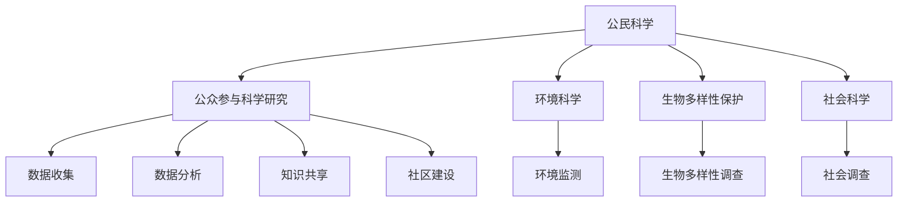

                 

# 《公民科学：公众参与科学研究的新途径》

> 关键词：公民科学、公众参与、科学研究、环境监测、生物多样性、社会科学

> 摘要：随着科技的发展和社会的进步，公民科学作为一种新兴的科学研究模式，逐渐成为公众参与科学研究的重要途径。本文旨在探讨公民科学的背景和概念、应用领域、挑战与对策以及未来发展趋势，以期为公众参与科学研究提供新思路和有效方法。

## 目录大纲

### 《公民科学：公众参与科学研究的新途径》

> 关键词：公民科学、公众参与、科学研究、环境监测、生物多样性、社会科学

> 摘要：随着科技的发展和社会的进步，公民科学作为一种新兴的科学研究模式，逐渐成为公众参与科学研究的重要途径。本文旨在探讨公民科学的背景和概念、应用领域、挑战与对策以及未来发展趋势，以期为公众参与科学研究提供新思路和有效方法。

### 第一部分：公民科学的背景和概念

#### 第1章：公民科学的起源与发展

1.1.1 公民科学的定义与特征

1.1.2 公民科学的历史发展

1.1.3 公民科学的关键要素

#### 第2章：公民科学的核心概念

2.1.1 公众参与科学研究的动机

2.1.2 公众参与科学研究的形式

2.1.3 公众参与科学研究的影响

### 第二部分：公民科学的应用领域

#### 第3章：环境科学领域的公民科学

3.1.1 公民科学在环境保护中的应用

3.1.2 公民科学监测环境数据的方法

3.1.3 公民科学在环境保护中的成功案例

#### 第4章：生物多样性保护的公民科学

4.1.1 公民科学在生物多样性监测中的作用

4.1.2 公民科学参与生物多样性调查的方式

4.1.3 公民科学在生物多样性保护中的贡献

#### 第5章：社会科学研究的公民科学

5.1.1 公民科学在社会科学研究中的角色

5.1.2 公众参与社会科学研究的方法

5.1.3 公民科学在社会科学研究中的案例研究

### 第三部分：公众参与科学研究的挑战与对策

#### 第6章：公众参与科学研究的挑战

6.1.1 信息不对称与数据质量

6.1.2 时间与资源限制

6.1.3 公众参与科学研究中的伦理问题

#### 第7章：公众参与科学研究的策略与机制

7.1.1 建立有效的公众参与机制

7.1.2 提高公众科学素养的策略

7.1.3 促进公众参与科学研究的政策支持

### 第四部分：成功案例与未来展望

#### 第8章：国际公民科学项目的成功案例

8.1.1 国际公民科学项目的特点

8.1.2 成功公民科学项目的评估与启示

8.1.3 公民科学在全球范围内的推广

#### 第9章：公民科学的未来发展趋势

9.1.1 新技术的应用与公民科学的发展

9.1.2 公众参与科学研究的新模式

9.1.3 公民科学未来的挑战与机遇

#### 第10章：结语

10.1.1 公民科学的重要性

10.1.2 公众参与科学研究的潜力

10.1.3 对未来公民科学研究的展望

### 附录

#### 附录A：常用公民科学工具与资源

A.1.1 公民科学平台介绍

A.1.2 数据分析与可视化工具

A.1.3 公民科学相关数据库和文献

#### 附录B：公民科学项目案例

B.1.1 环境科学领域的案例

B.1.2 生物多样性保护领域的案例

B.1.3 社会科学研究领域的案例

### Mermaid 流�程图

#### 公民科学核心概念与联系



### 核心算法原理讲解

#### 数据分析算法在公民科学中的应用

```python
# 伪代码：数据分析算法示例
def analyze_data(data_set):
    # 数据清洗
    cleaned_data = clean_data(data_set)
    
    # 数据预处理
    preprocessed_data = preprocess_data(cleaned_data)
    
    # 特征提取
    features = extract_features(preprocessed_data)
    
    # 模型训练
    model = train_model(features)
    
    # 模型评估
    evaluation_results = evaluate_model(model)
    
    # 结果可视化
    visualize_results(evaluation_results)
```

#### 公众参与度计算公式

$$
公众参与度 = (\frac{参与人数}{总人数}) \times 100\%
$$

### 项目实战

#### 公民科学项目实战：环境监测数据的分析与可视化

##### 1. 开发环境搭建

- 操作系统：Linux/Windows
- 编程语言：Python/R
- 数据库：MySQL/PostgreSQL
- 数据可视化工具：Tableau/Plotly

##### 2. 代码实际案例

```python
# Python代码：环境监测数据收集与预处理
import pandas as pd
import numpy as np

# 读取环境监测数据
data = pd.read_csv('environment_data.csv')

# 数据清洗
data = data.dropna()

# 数据预处理
data['date'] = pd.to_datetime(data['date'])
data.set_index('date', inplace=True)

# 3. 数据分析
# 计算每日平均温度
data['avg_temp'] = data['temp'].mean()

# 4. 数据可视化
import matplotlib.pyplot as plt

# 绘制温度变化趋势图
plt.plot(data.index, data['avg_temp'])
plt.xlabel('日期')
plt.ylabel('平均温度')
plt.title('每日平均温度变化趋势')
plt.show()
```

##### 3. 代码解读与分析

- 数据读取与清洗：使用pandas库读取CSV文件，并去除缺失值。
- 数据预处理：将日期列转换为日期时间格式，并设置其为索引。
- 数据分析：计算每日平均温度。
- 数据可视化：使用matplotlib绘制温度变化趋势图。

### 附录

#### 附录A：常用公民科学工具与资源

##### A.1.1 公民科学平台介绍

- [citizen science platform list](https://www.sciencebase.gov/)

##### A.1.2 数据分析与可视化工具

- [Tableau](https://www.tableau.com/)
- [Plotly](https://plotly.com/)

##### A.1.3 公民科学相关数据库和文献

- [Global Biodiversity Information Facility (GBIF)](https://www.gbif.org/)
- [Open Science Framework (OSF)](https://osf.io/)

#### 附录B：公民科学项目案例

##### B.1.1 环境科学领域的案例

- [Project Monarch Watch](https://www.monarchwatch.org/)
- [GardenTags](https://www.gardentags.org/)

##### B.1.2 生物多样性保护领域的案例

- [Citizen Science Central](https://citizensciencecentral.eu/)
- [iNaturalist](https://www.inaturalist.org/)

##### B.1.3 社会科学研究领域的案例

- [MyHealthGov](https://myhealth.gov/)
- [Pandemic Response Accountability Committee](https://prac.senate.gov/)

### 作者

- 作者：AI天才研究院/AI Genius Institute & 禅与计算机程序设计艺术 /Zen And The Art of Computer Programming

----------------------------------------------------------------<|im_end|># 第一部分：公民科学的背景和概念

## 第1章：公民科学的起源与发展

### 1.1.1 公民科学的定义与特征

公民科学（Citizen Science）是一种科学研究模式，它鼓励公众参与科学研究和科学调查。这种模式不仅关注科学知识的产生，更强调公众在科学研究中的参与和贡献。公民科学的定义有多种，但核心在于将公众作为数据收集者、观察者、实验参与者，甚至是科学问题的解决者。

公民科学的特征主要包括：

- **公众参与**：公民科学的核心在于公众的参与，公众可以是任何愿意参与科学研究的人，不受专业背景的限制。
- **数据收集与共享**：公民科学强调数据的收集和共享，这些数据可以用于科学研究、政策制定和公众教育。
- **跨学科合作**：公民科学往往涉及多个学科，如环境科学、生态学、社会科学等，这种跨学科合作有助于更全面地解决复杂问题。
- **教育意义**：公民科学不仅为科学研究做出贡献，还能提高公众的科学素养，增强公众对科学研究的兴趣和理解。

### 1.1.2 公民科学的历史发展

公民科学的历史可以追溯到18世纪，当时民间观察者开始参与天文学、气象学等科学领域的研究。例如，气象观测网络就是由公众志愿者参与建立的。随着时间的推移，公民科学逐渐发展成为一项重要的科学研究模式。

- **早期发展**：19世纪末至20世纪初，随着无线电通信和摄影技术的发明，公民科学得到了进一步的发展。公众可以通过邮寄照片和观测数据来参与科学研究。
- **中期发展**：20世纪中期，随着计算机和互联网的出现，公民科学进入了一个新的发展阶段。网络使得公众可以更方便地参与科学研究和数据收集，如天体物理学的SETI（搜寻外星文明）项目就是一个典型的例子。
- **现代发展**：21世纪初，随着智能手机和移动应用的普及，公民科学进入了一个高速发展的阶段。公众可以随时随地通过应用程序参与科学研究，如生物多样性监测、环境保护等。

### 1.1.3 公民科学的关键要素

公民科学的发展离不开以下几个关键要素：

- **参与者的动机**：公众参与公民科学的动机多种多样，包括对科学的兴趣、对环境保护的关注、社交互动的需要等。了解参与者的动机对于设计有效的公民科学项目至关重要。
- **数据质量**：数据质量是公民科学项目成功的关键。为了确保数据质量，项目需要制定详细的数据收集标准和指导手册，并提供培训和支持。
- **技术支持**：公民科学项目通常需要技术支持，包括数据收集、存储、分析和共享的工具和技术。这些技术支持有助于提高项目的效率和参与度。
- **激励机制**：激励机制是提高公众参与度和项目成功的关键。这可以包括荣誉证书、奖励、社交认可等。
- **合作与沟通**：公民科学项目通常涉及多个合作伙伴，包括科学家、政策制定者、教育机构和非政府组织。有效的合作与沟通有助于项目的顺利进行和成果的推广。

## 第2章：公民科学的核心概念

### 2.1.1 公众参与科学研究的动机

公众参与科学研究的动机多种多样，主要包括以下几个方面：

- **科学兴趣**：许多人出于对科学的热爱和好奇心而参与科学研究，他们希望通过实践来深入了解科学知识。
- **环境保护**：随着环境污染和生态破坏问题的日益严重，公众参与公民科学项目成为了一种表达对环境保护关注的方式。
- **社交互动**：参与公民科学项目可以提供一个社交平台，参与者可以在项目中结识志同道合的朋友，分享经验和知识。
- **教育和学习**：公民科学项目为公众提供了一个学习和成长的机会，参与者可以通过参与项目来提高自己的科学素养和技能。
- **社会责任**：公众参与科学研究也是履行社会责任的一种方式，参与者希望通过自己的行动为社会和环境做出贡献。

### 2.1.2 公众参与科学研究的形式

公众参与科学研究的形式多样，包括以下几种：

- **数据收集**：公众作为数据收集者，可以参与科学实验、调查和监测活动，收集有关环境、生态和社会等方面的数据。
- **数据分析**：一些公民科学项目需要公众参与数据分析，如使用计算机软件处理大量观测数据，识别模式或趋势。
- **科学实验**：公众可以参与科学实验，如基因测序、蛋白质结晶等，这些实验通常需要大量的人力和物力资源。
- **调查问卷**：通过在线或纸质问卷收集公众的意见和反馈，这些数据可以用于科学研究和社会调查。
- **科学传播**：公众参与科学传播，如撰写科普文章、举办科学讲座、参与科学展览等，这些活动有助于提高公众的科学素养。

### 2.1.3 公众参与科学研究的影响

公众参与科学研究具有深远的影响，主要体现在以下几个方面：

- **科学知识的积累**：公众参与科学研究和数据收集，有助于积累更多的科学知识，促进科学研究的进展。
- **科学意识的提高**：公众参与科学研究可以提高科学意识，增强对科学方法和科学精神的认同，促进公众对科学事业的参与和支持。
- **社会责任感的培养**：公众参与科学研究有助于培养社会责任感，鼓励公众关注社会问题，积极参与社会建设。
- **科学教育的推动**：公民科学项目为公众提供了一个学习和实践的平台，有助于推动科学教育的发展，提高公众的科学素养。
- **科学研究模式的创新**：公众参与科学研究为科学研究带来了新的视角和方法，有助于推动科学研究模式的创新和发展。

### 2.1.4 公民科学的优势与挑战

#### 公民科学的优势

- **成本效益**：公民科学项目通常成本较低，公众可以免费参与，从而节省了大量的研究经费。
- **广泛参与**：公民科学项目可以吸引不同背景和年龄段的人参与，从而获得更广泛的数据和观点。
- **多样性与创新性**：公众的参与带来了多样性和创新性，有助于发现新的问题和解决方案。
- **社会影响力**：公民科学项目可以通过提高公众的科学素养和社会责任感，对社会产生积极的影响。

#### 公民科学的挑战

- **数据质量**：确保数据质量是公民科学项目面临的一个重要挑战，需要制定严格的数据收集标准和质量控制措施。
- **参与度波动**：公众的参与度可能会受到各种因素的影响，如项目的吸引力、参与的便利性等。
- **资源分配**：公民科学项目需要合理分配资源，包括人力、物力和时间，以确保项目的顺利进行。
- **专业支持**：公民科学项目通常需要专业的支持和指导，以确保研究的科学性和可靠性。

## 总结

本章介绍了公民科学的定义与特征、历史发展、公众参与科学研究的动机和形式，以及公众参与科学研究的影响和挑战。公民科学作为一种新兴的科学研究模式，具有广泛的应用前景和重要的社会价值。通过公众的参与，公民科学不仅能够提高科学研究的效率和质量，还能够促进公众科学素养的提高和社会责任的培养。在未来，随着科技的进步和社会的发展，公民科学将在科学研究和社会发展中发挥更加重要的作用。

### 参考文献

1. Bonney, R., Cooper, C., & Dickinson, J. L. (2009). Finding patterns in citizen science. In Citizen Science (pp. 1-13). Springer.
2. largens, R. P. (2016). Citizen Science: Public Collaboration in Environmental Research. Routledge.
3. Piwowar, H. A., Gilbert, J. K., & Mchale, A. B. (2011). Public engagement in scientific research: The role of ‘citizen science’. Briefings in Bioinformatics, 12(4), 377-385.
4. Reside, A. E., (2014). Understanding Motivations of Online Citizen Science Participants. International Journal of Human-Computer Studies, 72(8), 764-773.
5. Simovic, M., Grellier, J., & Deterding, S. (2019). Incentivizing Participation in Citizen Science: Insights from a Behavioral Economic Experiment. PLoS ONE, 14(8), e0221268.

