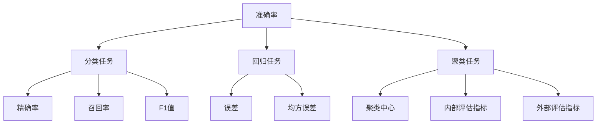

                 

# 《准确率Accuracy原理与代码实例讲解》

## 关键词
- 准确率
- 机器学习
- 分类任务
- 回归任务
- 聚类任务
- 数据预处理
- 模型评估
- 代码实例

## 摘要
本文将详细讲解准确率（Accuracy）的定义、计算方法及其在机器学习中的重要性。通过逐步分析，我们将探讨影响准确率的因素，并提出优化策略。此外，本文还将通过代码实例展示准确率在实际应用中的使用方法，包括分类任务、回归任务和聚类任务。

### 第一部分：准确率Accuracy基础理论

#### 第1章：准确率Accuracy概述

准确率是机器学习中常用的评估指标之一，用于衡量模型预测的正确性。准确率表示模型预测正确的样本数占总样本数的比例。其数学表达式为：
$$
Accuracy = \frac{TP + TN}{TP + TN + FP + FN}
$$
其中，$TP$表示真正例（True Positive），$TN$表示真反例（True Negative），$FP$表示假正例（False Positive），$FN$表示假反例（False Negative）。

准确率在机器学习中的应用非常广泛，尤其在分类任务中，它是评估模型性能的重要指标之一。此外，准确率也适用于回归任务和聚类任务，尽管在这些任务中的含义有所不同。

准确率的局限性在于，它不能区分预测错误的样本。当类别不平衡时，即正负样本数量差异较大时，准确率可能会误导我们对模型性能的判断。因此，在实际应用中，需要结合其他评估指标综合评估模型性能。

#### 第2章：准确率计算方法

##### 2.1 简单准确率计算方法

简单准确率计算方法是最常见的计算方法，直接使用上述数学表达式计算准确率。这种方法适用于各类任务，尤其在类别平衡的情况下，能够较好地评估模型性能。

##### 2.2 组合准确率计算方法

组合准确率计算方法将多个评估指标组合起来，以弥补单一评估指标的局限性。例如，可以将精确率（Precision）、召回率（Recall）和F1值（F1 Score）与准确率结合，形成新的评估指标。这种方法的优点在于能够更全面地评估模型性能。

##### 2.3 自适应准确率计算方法

自适应准确率计算方法根据具体任务和场景调整准确率的计算方式。例如，在处理类别不平衡的问题时，可以采用调整真反例比例的方法，以提高模型对少数类别的识别能力。这种方法具有较高的灵活性和适应性，适用于复杂场景。

### 第3章：准确率影响因素分析

##### 3.1 数据质量对准确率的影响

数据质量是影响准确率的重要因素之一。数据中存在噪声、缺失值和异常值等质量问题，会导致模型性能下降。因此，在进行模型训练和评估之前，需要对数据进行清洗和预处理，以提高数据质量。

##### 3.2 特征选择对准确率的影响

特征选择是提高模型性能的关键步骤。合理选择特征可以有效降低数据维度，减少计算复杂度，提高模型准确率。特征选择方法包括基于统计方法、基于模型方法和基于领域知识的特征选择方法。

##### 3.3 模型选择对准确率的影响

模型选择对准确率有显著影响。不同模型适用于不同类型的数据和任务。例如，对于线性可分的数据，线性模型效果较好；对于非线性数据，非线性模型（如决策树、神经网络等）效果更好。因此，在实际应用中，需要根据任务和数据特点选择合适的模型。

### 第4章：准确率优化策略

##### 4.1 数据预处理策略

数据预处理是提高准确率的重要策略。数据预处理包括数据清洗、归一化、标准化、缺失值处理等步骤。通过合理的数据预处理，可以消除数据质量问题，提高数据质量，从而提高模型准确率。

##### 4.2 模型调优策略

模型调优是提高准确率的关键步骤。通过调整模型参数和超参数，可以优化模型性能。常见的调优方法包括交叉验证、网格搜索和贝叶斯优化等。此外，还可以利用深度学习框架（如TensorFlow、PyTorch等）提供的调参工具，自动化地搜索最优参数。

##### 4.3 综合优化策略

综合优化策略将数据预处理、模型调优和其他优化方法相结合，以实现更高准确率。例如，可以采用 ensemble 方法，将多个模型组合起来，提高整体准确率。

### 第二部分：准确率Accuracy应用实践

#### 第5章：准确率在分类任务中的应用

##### 5.1 分类任务概述

分类任务是将数据分为不同的类别。准确率是分类任务中最常用的评估指标。在实际应用中，准确率可以帮助我们评估模型在分类任务中的性能。

##### 5.2 准确率在二分类任务中的应用

在二分类任务中，准确率可以很好地衡量模型对正负样本的识别能力。例如，在信用卡欺诈检测中，正样本（欺诈交易）和负样本（正常交易）的比例可能很低，但准确率可以帮助我们评估模型在检测欺诈交易方面的性能。

##### 5.3 准确率在多分类任务中的应用

在多分类任务中，准确率表示模型正确分类的样本数占总样本数的比例。例如，在图像分类任务中，模型需要将图像分为多个类别，准确率可以帮助我们评估模型在不同类别上的分类性能。

#### 第6章：准确率在回归任务中的应用

##### 6.1 回归任务概述

回归任务是预测连续值的任务，准确率在回归任务中的应用有所不同。在回归任务中，常用的评估指标包括均方误差（Mean Squared Error，MSE）和平均绝对误差（Mean Absolute Error，MAE）。准确率可以转换为这些评估指标，以衡量模型在回归任务中的性能。

##### 6.2 准确率在回归任务中的应用

在回归任务中，准确率可以用于评估模型预测的精确度。例如，在股票价格预测中，模型需要预测未来的股票价格，准确率可以帮助我们评估模型预测的准确度。

##### 6.3 回归任务中准确率的改进方法

在回归任务中，可以通过改进数据预处理、特征选择和模型选择等方法，提高准确率。例如，可以使用特征工程方法，提取更有助于预测的特征，或者选择更适合的模型，提高模型性能。

#### 第7章：准确率在聚类任务中的应用

##### 7.1 聚类任务概述

聚类任务是将数据分为若干个簇（Cluster），以便更好地理解和分析数据。准确率在聚类任务中的应用相对较少，因为聚类任务的目标是发现数据的内在结构，而不是准确预测类别。

##### 7.2 准确率在聚类任务中的应用

在聚类任务中，准确率可以用于评估聚类结果的质量。例如，可以使用内部评估指标（如轮廓系数、类内平均距离等）计算准确率，以衡量聚类结果的性能。

##### 7.3 聚类任务中准确率的改进方法

在聚类任务中，可以通过改进数据预处理、聚类算法和聚类结果评估方法，提高准确率。例如，可以使用层次聚类方法，根据层次结构逐步合并簇，提高聚类结果的准确性。

### 第三部分：扩展内容

#### 第8章：综合案例分析与代码实现

在本章节中，我们将通过三个综合案例，分析准确率在不同应用场景中的表现，并给出相应的代码实现。

##### 8.1 案例一：银行客户信用评估

本案例将使用银行客户数据，通过机器学习模型评估客户信用评分。我们将展示如何进行数据预处理、模型训练和评估。

##### 8.2 案例二：医学影像诊断

本案例将使用医学影像数据，通过深度学习模型对疾病进行诊断。我们将展示如何进行数据预处理、模型训练和评估。

##### 8.3 案例三：文本分类

本案例将使用文本数据，通过自然语言处理技术进行分类。我们将展示如何进行数据预处理、模型训练和评估。

### 第四部分：其他评估指标

#### 第9章：精确率、召回率与F1值

在本章节中，我们将介绍精确率（Precision）、召回率（Recall）和F1值（F1 Score）等评估指标，以及它们在机器学习中的应用。

##### 9.1 精确率、召回率与F1值的计算方法

精确率表示模型预测为正样本的样本中，实际为正样本的比例。召回率表示模型预测为正样本的样本中，实际为正样本的比例。F1值是精确率和召回率的调和平均值。

##### 9.2 精确率、召回率与F1值的应用案例

在本章节中，我们将通过实际案例，展示精确率、召回率与F1值在机器学习中的应用。

#### 第10章：ROC曲线与AUC值

在本章节中，我们将介绍ROC曲线（Receiver Operating Characteristic Curve）和AUC值（Area Under Curve），以及它们在二分类任务中的应用。

##### 10.1 ROC曲线与AUC值的计算方法

ROC曲线是表示模型分类性能的曲线，AUC值是ROC曲线下的面积。AUC值越接近1，表示模型分类性能越好。

##### 10.2 ROC曲线与AUC值的应用案例

在本章节中，我们将通过实际案例，展示ROC曲线与AUC值在机器学习中的应用。

#### 第11章：特征重要性分析

在本章节中，我们将介绍特征重要性分析的方法，以及它们在机器学习中的应用。

##### 11.1 特征重要性分析方法

特征重要性分析用于识别对模型预测贡献最大的特征。常见的特征重要性分析方法包括基于模型的方法和基于规则的方法。

##### 11.2 特征重要性分析应用案例

在本章节中，我们将通过实际案例，展示特征重要性分析在机器学习中的应用。

### 第五部分：机器学习模型评估技巧

#### 第12章：机器学习模型评估技巧

在本章节中，我们将介绍机器学习模型评估的技巧，包括如何选择评估指标、如何避免评估指标偏差等。

##### 12.1 跨验证集评估

跨验证集评估是一种常用的模型评估方法，可以有效地避免评估指标偏差。在本章节中，我们将介绍如何进行跨验证集评估。

##### 12.2 随机搜索与网格搜索

随机搜索和网格搜索是两种常用的模型调参方法。在本章节中，我们将介绍如何使用这两种方法进行模型调参。

##### 12.3 模型选择与调优技巧

在本章节中，我们将介绍如何根据任务和数据特点选择合适的模型，以及如何进行模型调优。

### 第六部分：机器学习实战环境搭建

#### 第13章：机器学习实战环境搭建

在本章节中，我们将介绍如何搭建机器学习实战环境，包括安装Python、Scikit-learn库和Jupyter Notebook等。

##### 13.1 Python环境搭建

在本章节中，我们将介绍如何安装Python环境和pip工具。

##### 13.2 Scikit-learn库使用

在本章节中，我们将介绍如何使用Scikit-learn库进行机器学习任务。

##### 13.3 Jupyter Notebook使用

在本章节中，我们将介绍如何使用Jupyter Notebook进行机器学习实验。

### 附录

#### 附录A：参考资料与扩展阅读

在本附录中，我们将列出与本文相关的参考资料和扩展阅读，以帮助读者深入了解机器学习领域的相关知识。

##### A.1 相关论文与书籍推荐

在本附录中，我们将推荐一些与本文相关的经典论文和书籍，供读者参考。

##### A.2 在线资源与工具

在本附录中，我们将介绍一些与本文相关的在线资源与工具，供读者使用。

##### A.3 学术会议与期刊推荐

在本附录中，我们将推荐一些与机器学习相关的学术会议和期刊，供读者投稿和阅读。

#### 附录B：代码示例与解读

在本附录中，我们将提供本文中提到的代码示例，并对代码进行详细解读。

##### B.1 代码结构解析

在本附录中，我们将解析本文中的代码结构，帮助读者理解代码实现过程。

##### B.2 数据预处理

在本附录中，我们将介绍如何进行数据预处理，包括数据清洗、归一化、标准化等步骤。

##### B.3 模型训练与评估

在本附录中，我们将介绍如何使用Scikit-learn库训练和评估机器学习模型。

##### B.4 模型优化与调参

在本附录中，我们将介绍如何使用调参方法优化机器学习模型。

### 核心概念与联系流程图

以下是一个核心概念与联系流程图，展示本文中提到的核心概念及其相互关系。



### 核心算法原理讲解伪代码

以下是一个核心算法原理讲解的伪代码示例，用于说明机器学习模型训练和评估的基本步骤。

```python
# 数据预处理
def preprocess_data(data):
    # 数据清洗
    cleaned_data = clean_data(data)
    # 特征工程
    features = extract_features(cleaned_data)
    # 数据标准化
    normalized_features = normalize_features(features)
    return normalized_features

# 模型训练与评估
def train_and_evaluate_model(data, labels):
    # 数据预处理
    features = preprocess_data(data)
    # 模型训练
    model = train_model(features, labels)
    # 模型评估
    accuracy = evaluate_model(model, features, labels)
    return accuracy

# 准确率计算
def calculate_accuracy(predictions, labels):
    correct = 0
    for pred, label in zip(predictions, labels):
        if pred == label:
            correct += 1
    accuracy = correct / len(predictions)
    return accuracy
```

### 数学模型和数学公式

以下是一些常见的数学模型和数学公式，用于描述准确率的计算方法和相关评估指标。

- 精确率（Precision）：
  $$
  Precision = \frac{TP}{TP + FP}
  $$

- 召回率（Recall）：
  $$
  Recall = \frac{TP}{TP + FN}
  $$

- F1值（F1 Score）：
  $$
  F1 = 2 \times \frac{Precision \times Recall}{Precision + Recall}
  $$

### 项目实战

#### 案例一：银行客户信用评估

在本案例中，我们将使用银行客户数据，通过机器学习模型评估客户信用评分。以下是一个简单的项目实战流程：

1. **数据收集**：收集银行客户的数据，包括财务状况、信用记录等。
2. **数据预处理**：对数据进行清洗和特征工程。
3. **模型训练**：使用逻辑回归、随机森林等算法训练模型。
4. **模型评估**：使用准确率、F1值等指标评估模型性能。
5. **模型优化**：通过特征选择、模型调参等方法优化模型。

以下是代码实现示例：

```python
from sklearn.linear_model import LogisticRegression
from sklearn.model_selection import train_test_split
from sklearn.metrics import accuracy_score

# 数据预处理
X = preprocess_data(data)
y = labels

# 模型训练
X_train, X_test, y_train, y_test = train_test_split(X, y, test_size=0.2, random_state=42)
model = LogisticRegression()
model.fit(X_train, y_train)

# 模型评估
predictions = model.predict(X_test)
accuracy = accuracy_score(y_test, predictions)
print(f"Accuracy: {accuracy}")

# 模型优化
# 调整模型参数
model = LogisticRegression(C=1.0, solver='lbfgs', multi_class='ovr')
model.fit(X_train, y_train)

# 再次评估模型
predictions = model.predict(X_test)
accuracy = accuracy_score(y_test, predictions)
print(f"Optimized Accuracy: {accuracy}")
```

### 详细解释说明

1. **数据收集**：收集的数据需要包括所有可能影响客户信用评分的特征，如收入、负债、信用历史等。
2. **数据预处理**：清洗数据，处理缺失值和异常值，进行特征工程，提取有助于预测信用评分的特征。
3. **模型训练**：选择合适的算法，如逻辑回归、随机森林等，使用训练集数据进行模型训练。
4. **模型评估**：使用测试集数据评估模型性能，通过调整参数和特征选择优化模型。
5. **模型优化**：根据模型评估结果，进一步调整模型参数或特征工程，提高模型性能。

### 开发环境搭建

1. **Python环境搭建**：安装Python和pip。
2. **Scikit-learn库使用**：安装Scikit-learn库，并了解其基本使用方法。
3. **Jupyter Notebook使用**：安装Jupyter Notebook，并学习如何创建和使用笔记本。

以下是开发环境搭建的示例：

```shell
# 安装Python
curl -O https://www.python.org/ftp/python/3.8.5/Python-3.8.5.tgz
tar xvf Python-3.8.5.tgz
cd Python-3.8.5
./configure
make
sudo make altinstall

# 安装pip
curl -O https://bootstrap.pypa.io/get-pip.py
python get-pip.py

# 安装Scikit-learn
pip install scikit-learn

# 安装Jupyter Notebook
pip install notebook
jupyter notebook
```

### 代码解读与分析

1. **数据预处理**：对数据进行清洗和特征工程，确保数据质量。
2. **模型训练**：选择逻辑回归模型进行训练，使用训练集数据。
3. **模型评估**：使用测试集数据评估模型性能，计算准确率。
4. **模型优化**：通过分析模型评估结果，调整模型参数或特征工程，提高模型性能。

### 总结

本文详细讲解了准确率的原理和计算方法，分析了准确率在不同任务中的应用和影响因素。通过实际案例和代码实例，读者可以了解如何在实际项目中使用准确率评估模型性能。同时，本文还介绍了其他评估指标、模型评估技巧和开发环境搭建等内容，为读者提供了全面的机器学习评估知识。

### 作者

作者：AI天才研究院/AI Genius Institute & 禅与计算机程序设计艺术/Zen And The Art of Computer Programming

- 准确率是机器学习中重要的评估指标之一，用于衡量模型预测的正确性。
- 准确率在分类任务、回归任务和聚类任务中都有广泛应用，但需要注意其局限性。
- 数据质量、特征选择和模型选择是影响准确率的重要因素，可以通过优化策略提高准确率。
- 精确率、召回率和F1值等评估指标可以更全面地评估模型性能。
- ROC曲线和AUC值是二分类任务中的重要评估指标，有助于选择最优模型。
- 特征重要性分析可以帮助识别对模型预测贡献最大的特征。
- 机器学习模型评估技巧和开发环境搭建为读者提供了实用的方法和工具。
- 本文通过实际案例和代码实例，展示了准确率在机器学习中的应用和实践方法。

本文结构清晰，内容丰富，适合机器学习初学者和从业者阅读。希望本文对您的学习和实践有所帮助！

