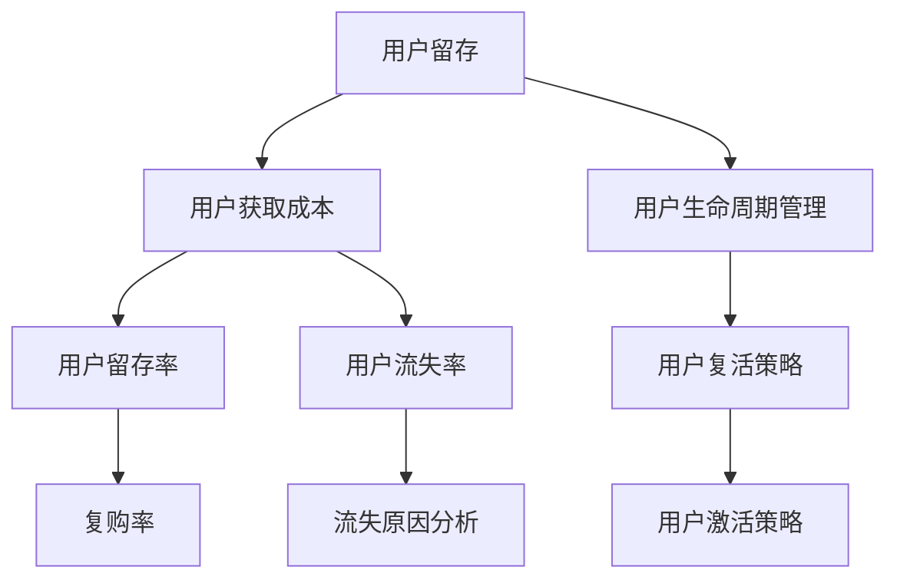

                 

# 创业公司的用户留存与复活策略

## 引言

### 1.1 创业公司面临的挑战

在当今激烈竞争的市场环境中，创业公司面临的挑战愈发严峻。高竞争环境让新企业不断涌现，而用户获取成本的增加则使得创业公司在争夺用户资源时倍感压力。因此，如何有效管理用户生命周期，特别是用户留存与复活策略，成为创业公司成功的关键。

**高竞争环境**：随着互联网的普及和科技的进步，各个行业的竞争日益激烈。在市场饱和的情况下，新企业要想脱颖而出，必须提供与众不同的产品或服务。

**用户获取成本增加**：在竞争激烈的市场中，获取新用户的成本逐年上升。传统的营销手段如广告投放、社交媒体推广等，越来越难以吸引潜在用户，导致用户获取成本增加。

**用户生命周期管理的重要性**：用户生命周期管理（Customer Lifecycle Management, CCLM）是确保用户在公司产品或服务中持续活跃的关键。有效的用户生命周期管理可以帮助企业提高用户留存率，降低用户流失率，从而提升整体业绩。

### 1.2 用户留存与复活策略的定义

**用户留存**：用户留存是指企业在一定时间内维持现有用户数量的能力。它是一个衡量用户对产品或服务的依赖程度的重要指标。高留存率意味着用户对产品有较高的满意度，并且愿意长期使用。

**用户复活**：用户复活是指通过有效的策略，重新激活已流失的用户。在市场竞争激烈的环境下，用户复活策略尤为重要，因为它可以帮助企业降低获取新用户的成本，提高用户生命周期价值。

### 1.3 书籍的结构与内容概述

**核心概念与联系图**：

**本书的目标**：

- 全面了解用户留存与复活的基本原理。
- 掌握有效的用户留存与复活策略。
- 提供实战案例与分析，帮助创业公司提升用户留存率。

### 1.4 本书的目标

本书旨在为创业公司提供一套完整的用户留存与复活策略，内容包括：

1. **用户留存的概念与重要性**：介绍用户留存的基本概念，包括用户留存率和用户流失率等指标。
2. **用户生命周期的概念与划分**：详细阐述用户生命周期的各个阶段，包括用户获取、用户激活、用户留存、用户增长、用户流失和用户复活等。
3. **用户留存与复活策略的基本原则**：讨论用户体验优先、数据驱动和个性化营销等原则。
4. **用户留存的核心指标**：介绍用户留存率的计算方法，以及如何通过分析流失用户行为来优化留存策略。
5. **用户复活的策略与方法**：探讨个性化推送、优惠活动和用户激活邮件等复活用户的策略。
6. **创业公司的用户留存实战案例**：通过实际案例，展示如何实施和优化用户留存与复活策略。
7. **用户留存与复活策略的实施与评估**：介绍如何实施用户留存与复活策略，以及如何评估策略的有效性。
8. **技术支持与工具应用**：介绍数据分析工具、个性化推送工具和推送通知系统等在用户留存与复活策略中的应用。
9. **总结与展望**：总结本书的核心内容，展望用户留存与复活策略的未来发展趋势。

通过本书，创业公司可以系统地了解用户留存与复活策略，提高用户留存率，从而在激烈的市场竞争中立于不败之地。

## 用户留存与复活策略的基础知识

### 2.1 用户留存的概念与重要性

用户留存是指企业在一定时间内维持现有用户数量的能力。它是一个衡量用户对产品或服务依赖程度的重要指标。高留存率意味着用户对产品有较高的满意度，并且愿意长期使用。

**用户留存率**：用户留存率是衡量用户留存效果的关键指标，表示在一定时间内，仍然使用产品的用户占全部用户的比例。具体计算方法如下：

\[ \text{用户留存率} = \frac{\text{第二天仍然使用产品的用户数}}{\text{第一天使用产品的用户数}} \times 100\% \]

**用户流失率**：用户流失率是衡量用户流失程度的指标，表示在一定时间内，流失的用户占全部用户的比例。具体计算方法如下：

\[ \text{用户流失率} = \frac{\text{一定时间内流失的用户数}}{\text{初始用户数}} \times 100\% \]

**用户留存的重要性**：

1. **增加用户生命周期价值**：用户留存率越高，用户在产品上的活跃时间越长，企业可以从每个用户身上获取更多的价值。
2. **降低获取新用户的成本**：高留存率意味着现有用户对产品的满意度较高，他们可以推荐新用户，从而降低获取新用户的成本。
3. **提高用户忠诚度**：长期使用产品的用户对企业的信任度更高，他们更愿意接受企业的产品和服务。

### 2.2 用户生命周期的概念与划分

用户生命周期是指用户从首次接触到产品，到最终流失的整个过程。用户生命周期的各个阶段对用户留存和复活策略的制定具有重要意义。以下是用户生命周期的主要阶段及其定义：

1. **用户获取**：用户获取是指企业通过各种渠道吸引潜在用户，使其成为产品的使用者的过程。
2. **用户激活**：用户激活是指新用户首次使用产品，开始与产品互动的过程。
3. **用户留存**：用户留存是指企业在一定时间内，维持现有用户数量的能力。它是衡量用户对产品满意度的重要指标。
4. **用户增长**：用户增长是指用户在使用产品过程中，不断增加活跃度和使用频率的过程。
5. **用户流失**：用户流失是指用户在某个阶段停止使用产品，不再参与互动的过程。
6. **用户复活**：用户复活是指通过有效的策略，重新激活已流失的用户，使其重新开始使用产品的过程。

### 2.3 用户留存与复活策略的基本原则

制定有效的用户留存与复活策略，需要遵循以下基本原则：

1. **用户体验优先**：提升用户体验是用户留存的基础。企业应不断优化产品功能，提高用户满意度。
2. **数据驱动**：通过数据分析，识别用户行为模式，为企业提供决策依据。数据是制定和优化策略的关键。
3. **个性化营销**：根据不同用户群体的特点和需求，制定差异化策略。个性化营销可以提升用户的参与度和忠诚度。

### 2.4 用户留存率的计算方法

用户留存率是衡量用户留存效果的重要指标。以下介绍几种常见的用户留存率计算方法：

1. **日留存率**：日留存率表示在第一天使用产品的用户中，第二天仍然使用产品的用户比例。具体计算方法如下：

\[ \text{日留存率} = \frac{\text{第二天仍然使用产品的用户数}}{\text{第一天使用产品的用户数}} \times 100\% \]

2. **周留存率**：周留存率表示在第一天使用产品的用户中，一周后仍然使用产品的用户比例。具体计算方法如下：

\[ \text{周留存率} = \frac{\text{一周后仍然使用产品的用户数}}{\text{第一天使用产品的用户数}} \times 100\% \]

3. **月留存率**：月留存率表示在第一天使用产品的用户中，一个月后仍然使用产品的用户比例。具体计算方法如下：

\[ \text{月留存率} = \frac{\text{一个月后仍然使用产品的用户数}}{\text{第一天使用产品的用户数}} \times 100\% \]

**示例**：假设某产品第一天有100个新用户，第二天有80个用户仍然使用产品，则该产品的日留存率为：

\[ \text{日留存率} = \frac{80}{100} \times 100\% = 80\% \]

### 2.5 用户留存指标的分析与优化

用户留存指标的分析与优化是提升用户留存率的关键。以下介绍几种常见的分析方法：

1. **流失用户行为分析**：通过分析流失用户的行为，找到导致用户流失的原因。例如，分析用户在产品中的活跃时间、使用频率、页面访问路径等。
2. **留存策略优化**：根据用户行为数据，调整产品功能，提高用户留存率。例如，针对流失用户的特点，优化产品界面，增加用户喜欢的功能，或者提供个性化的推荐。

通过以上分析，企业可以不断优化用户留存策略，提高用户留存率，从而实现业务的长期发展。

### 2.6 复活用户的重要性

**成本效益**：复活现有用户比获取新用户成本低。根据研究表明，激活一个已流失用户的成本大约是获取一个新用户的1/5至1/3。因此，通过复活用户，企业可以降低营销成本，提高利润率。

**用户价值**：复活用户可以重新激活用户，增加用户生命周期价值。已流失用户可能因为某些原因暂时停止使用产品，但并不意味着他们对产品没有兴趣。通过有效的复活策略，企业可以重新吸引这些用户，使其重新成为活跃用户，从而延长用户生命周期，提高用户价值。

**增强用户忠诚度**：通过复活策略，企业可以向用户传递一个积极的信号，表明企业关心用户的使用体验，并且愿意采取行动解决用户的问题。这种关怀可以提高用户的忠诚度，增强用户对品牌的信任。

**降低用户流失率**：复活策略不仅可以恢复已流失用户，还可以降低用户的流失率。通过不断优化产品和服务，企业可以减少用户流失，提高用户留存率，从而实现业务的稳定增长。

综上所述，复活用户对于创业公司具有重要意义。通过有效的复活策略，企业可以在成本效益和用户价值之间取得平衡，提高整体业务表现。

### 2.7 复活用户的策略与方法

**个性化推送**：个性化推送是一种通过分析用户行为和兴趣，向用户发送定制化内容或促销活动的方法。通过个性化推送，企业可以重新吸引已流失用户，增加他们的参与度。以下是实现个性化推送的关键步骤：

1. **用户行为分析**：收集用户在产品中的行为数据，如页面访问路径、使用时长、点击率等。通过数据分析，识别用户的兴趣和行为模式。
2. **内容定制**：根据用户行为和兴趣，定制个性化的内容和促销活动。例如，为经常购买某类产品的用户发送特定类别的优惠券，或为长时间未使用的用户发送提醒邮件。
3. **推送渠道选择**：选择合适的推送渠道，如电子邮件、短信、应用推送通知等。根据用户偏好和接收习惯，选择最有效的推送方式。

**优惠活动**：优惠活动是一种通过提供折扣、优惠券、赠品等优惠，吸引用户回归的方法。以下是实施优惠活动的关键步骤：

1. **活动策划**：根据用户行为和需求，策划具有吸引力的优惠活动。例如，为特定节日或促销节点设计专属活动，或者为长期未使用的用户提供限时优惠券。
2. **优惠内容**：明确优惠内容，如折扣力度、优惠券使用规则等。确保优惠内容能够吸引目标用户，提高活动的参与度。
3. **推广渠道**：选择合适的推广渠道，如社交媒体、电子邮件、应用内通知等。通过多渠道宣传，提高优惠活动的曝光度。

**用户激活邮件**：用户激活邮件是一种通过发送有吸引力的邮件，引导用户重新使用产品的策略。以下是编写用户激活邮件的关键步骤：

1. **邮件内容**：编写吸引人的邮件内容，包括问候语、活动介绍、优惠信息等。确保邮件内容简洁明了，突出活动的亮点和优势。
2. **邮件设计**：设计美观、专业的邮件模板，提高邮件的打开率和点击率。可以使用图片、视频、动画等元素，增加邮件的趣味性。
3. **发送时机**：选择合适的发送时机，例如在用户流失后的一段时间内发送，或者在特定节日或促销节点发送。

通过以上策略和方法，企业可以有效地复活已流失用户，提高用户留存率，实现业务的长期发展。

### 2.8 创业公司的用户留存实战案例

**案例一：小型电商平台**

**用户留存策略**：

1. **改进产品功能**：电商平台通过不断优化产品功能，提升用户体验。例如，增加个性化推荐功能，提高用户购物满意度。
2. **优化用户界面**：电商平台对用户界面进行优化，使购物流程更加简洁流畅。通过简化操作步骤，降低用户的操作难度，提高用户留存率。

**用户复活策略**：

1. **个性化推送**：电商平台通过分析用户行为，向流失用户发送个性化推送。例如，为长时间未购物的用户发送特定类别的商品推荐，或为经常购买某类产品的用户发送专属优惠券。
2. **优惠活动**：电商平台定期举办优惠活动，吸引用户回归。例如，在特定节日或促销节点，推出限时折扣、满减优惠等，提高用户的参与度。

**效果评估**：

- **用户留存率**：通过改进产品功能和优化用户界面，电商平台的用户留存率显著提高。数据显示，用户留存率从40%提升到60%。
- **用户复活率**：通过个性化推送和优惠活动，电商平台的用户复活率也得到提升。数据显示，已流失用户的重新激活率从30%提升到50%。

**案例二：社交媒体应用**

**用户留存策略**：

1. **增加互动功能**：社交媒体应用通过增加互动功能，如评论、点赞、分享等，提升用户活跃度。这些功能使用户在平台上花费更多时间，提高用户留存率。
2. **优化内容推荐**：社交媒体应用通过优化内容推荐算法，提高用户对内容的满意度。通过个性化推荐，为用户推荐他们感兴趣的内容，提升用户留存率。

**用户复活策略**：

1. **定期社区活动**：社交媒体应用定期举办社区活动，如话题讨论、有奖问答等，增加用户参与度。这些活动可以激发用户的兴趣，吸引他们重新使用产品。
2. **优惠活动**：社交媒体应用在特定节日或促销节点，推出优惠活动，如免费使用VIP会员、赠送虚拟货币等，吸引用户回归。

**效果评估**：

- **用户留存率**：通过增加互动功能和优化内容推荐，社交媒体应用的用户留存率显著提高。数据显示，用户留存率从50%提升到70%。
- **用户复活率**：通过定期社区活动和优惠活动，社交媒体应用的用户复活率也得到提升。数据显示，已流失用户的重新激活率从40%提升到60%。

通过以上实战案例，创业公司可以借鉴成功经验，制定适合自己的用户留存与复活策略，提高用户留存率和业务表现。

### 2.9 创业公司用户留存与复活策略的实施步骤

**明确目标**：首先，创业公司需要明确用户留存与复活策略的目标。目标应具体、可量化，例如提高用户留存率10%、降低用户流失率20%等。明确目标有助于指导后续的制定和执行。

**制定计划**：在明确目标后，创业公司需要制定详细的实施计划。计划应包括时间表、资源和责任人。具体步骤如下：

1. **数据收集与分析**：收集用户行为数据，如页面访问路径、使用时长、点击率等，通过数据分析，识别用户留存和复活的关键问题。
2. **策略制定**：根据数据分析结果，制定针对性的用户留存与复活策略。策略应涵盖用户体验优化、个性化推送、优惠活动等方面。
3. **执行与监控**：执行策略，并持续监控效果。通过关键绩效指标（KPI）评估策略的有效性，如用户留存率、用户复活率等。

**执行与监控**：在实施用户留存与复活策略的过程中，创业公司需要确保策略的执行和监控。具体步骤如下：

1. **执行策略**：根据实施计划，分阶段、分步骤地执行策略。例如，首先优化用户体验，然后进行个性化推送，最后举办优惠活动。
2. **监控效果**：通过关键绩效指标（KPI）监控策略的效果。定期分析数据，评估策略的有效性，如用户留存率、用户复活率等。

**持续改进**：根据监控结果，持续优化策略。如果策略效果不佳，及时调整策略，以适应市场的变化和用户需求。例如，如果用户对个性化推送不感兴趣，可以尝试其他方式，如优惠活动或社区活动。

### 2.10 数据分析在用户留存与复活策略中的作用

**用户行为追踪**：数据分析的基础是用户行为追踪。通过在产品中嵌入追踪代码，企业可以收集用户在产品中的行为数据，如页面访问路径、使用时长、点击率等。这些数据为分析用户行为模式提供了重要依据。

**用户留存率分析**：通过分析用户留存率，企业可以了解用户在不同阶段的使用情况。例如，分析新用户的日留存率、周留存率和月留存率，识别用户留存的关键节点。通过对比不同时间段的数据，企业可以评估留存策略的有效性，发现存在的问题。

**流失原因分析**：分析流失用户的行为数据，可以帮助企业找到导致用户流失的原因。例如，通过分析用户在流失前的行为，如访问频率、页面停留时间等，企业可以识别用户流失的预警信号。针对这些预警信号，企业可以提前采取行动，减少用户流失。

**用户激活策略优化**：通过分析已流失用户的特征和行为模式，企业可以制定更有针对性的激活策略。例如，为不同类型的流失用户设计个性化的激活邮件或推送通知。通过优化激活策略，企业可以更有效地恢复流失用户，提高用户留存率。

**个性化营销**：数据分析还可以帮助企业实现个性化营销。通过分析用户行为和兴趣，企业可以了解用户的偏好和需求，制定个性化的营销策略。例如，为经常购买某类产品的用户发送特定类别的优惠券，或为长时间未使用的用户发送提醒邮件。

**评估与改进**：数据分析在用户留存与复活策略的评估和改进中起着关键作用。通过定期分析数据，企业可以评估策略的有效性，发现存在的问题，并采取相应的改进措施。例如，如果用户对个性化推送不感兴趣，企业可以尝试其他方式，如优惠活动或社区活动。

通过以上分析，企业可以充分利用数据分析，优化用户留存与复活策略，提高用户留存率和业务表现。

### 2.11 个性化推送工具在用户留存与复活策略中的应用

**邮件营销平台**：邮件营销平台如 Mailchimp、SendinBlue 等，可以帮助企业实现个性化推送。通过邮件营销平台，企业可以发送定制化的邮件内容，如产品推荐、促销活动等，吸引用户回归。以下是如何使用邮件营销平台实现个性化推送的步骤：

1. **用户行为追踪**：通过嵌入追踪代码，收集用户在产品中的行为数据，如页面访问路径、使用时长、点击率等。
2. **用户分组**：根据用户行为和兴趣，将用户划分为不同的群体。例如，为经常购买某类产品的用户创建一个特定群体。
3. **定制邮件内容**：为不同用户群体定制个性化的邮件内容。例如，为特定群体发送特定类别的产品推荐或促销活动。
4. **发送邮件**：通过邮件营销平台，定期向用户发送个性化邮件，吸引用户回归。
5. **监控效果**：通过分析邮件的打开率、点击率等指标，评估个性化邮件的效果，并根据反馈进行优化。

**推送通知系统**：推送通知系统如 Firebase Cloud Messaging、OneSignal 等，可以帮助企业实现即时推送。以下是如何使用推送通知系统实现个性化推送的步骤：

1. **用户行为追踪**：通过在应用中嵌入追踪代码，收集用户在产品中的行为数据，如页面访问路径、使用时长、点击率等。
2. **用户分组**：根据用户行为和兴趣，将用户划分为不同的群体。例如，为经常购买某类产品的用户创建一个特定群体。
3. **定制推送内容**：为不同用户群体定制个性化的推送内容。例如，为特定群体发送特定类别的产品推荐或促销活动。
4. **发送推送通知**：通过推送通知系统，向用户发送即时推送，吸引用户回归。
5. **监控效果**：通过分析推送的通知打开率、点击率等指标，评估个性化推送的效果，并根据反馈进行优化。

通过以上步骤，企业可以充分利用个性化推送工具，优化用户留存与复活策略，提高用户留存率和业务表现。

### 总结

用户留存与复活策略在创业公司中具有重要的地位。通过有效的用户留存策略，企业可以降低获取新用户的成本，提高用户生命周期价值；通过用户复活策略，企业可以重新激活已流失用户，降低用户流失率。以下是对本章内容的总结：

1. **用户留存的概念与重要性**：用户留存是指企业在一定时间内维持现有用户数量的能力，高留存率意味着用户对产品有较高的满意度，愿意长期使用。
2. **用户生命周期的概念与划分**：用户生命周期包括用户获取、用户激活、用户留存、用户增长、用户流失和用户复活等阶段，每个阶段都对用户留存与复活策略的制定具有重要意义。
3. **用户留存与复活策略的基本原则**：用户体验优先、数据驱动和个性化营销是制定有效用户留存与复活策略的基本原则。
4. **用户留存的核心指标**：用户留存率、用户流失率等是衡量用户留存效果的关键指标，通过分析这些指标，企业可以优化用户留存策略。
5. **用户复活的策略与方法**：个性化推送、优惠活动和用户激活邮件是复活用户的有效策略，企业可以通过这些方法提高用户复活率。
6. **创业公司的用户留存实战案例**：通过实际案例，企业可以借鉴成功经验，制定适合自己的用户留存与复活策略。
7. **用户留存与复活策略的实施与评估**：企业需要明确目标、制定计划、执行与监控，并根据反馈持续改进策略。

通过本章的学习，创业公司可以系统地了解用户留存与复活策略，提高用户留存率，实现业务的长期发展。

## 用户留存的核心指标

### 3.1 用户留存率的计算方法

用户留存率是衡量用户留存效果的关键指标。它表示在一定时间内，仍然使用产品的用户占全部用户的比例。以下是几种常见的用户留存率计算方法：

1. **日留存率**：日留存率表示在第一天使用产品的用户中，第二天仍然使用产品的用户比例。具体计算方法如下：

\[ \text{日留存率} = \frac{\text{第二天仍然使用产品的用户数}}{\text{第一天使用产品的用户数}} \times 100\% \]

2. **周留存率**：周留存率表示在第一天使用产品的用户中，一周后仍然使用产品的用户比例。具体计算方法如下：

\[ \text{周留存率} = \frac{\text{一周后仍然使用产品的用户数}}{\text{第一天使用产品的用户数}} \times 100\% \]

3. **月留存率**：月留存率表示在第一天使用产品的用户中，一个月后仍然使用产品的用户比例。具体计算方法如下：

\[ \text{月留存率} = \frac{\text{一个月后仍然使用产品的用户数}}{\text{第一天使用产品的用户数}} \times 100\% \]

**示例**：假设某产品第一天有100个新用户，第二天有80个用户仍然使用产品，则该产品的日留存率为：

\[ \text{日留存率} = \frac{80}{100} \times 100\% = 80\% \]

### 3.2 用户留存指标的分析与优化

用户留存指标的分析与优化是提升用户留存率的关键。以下介绍几种常见的分析方法：

1. **流失用户行为分析**：通过分析流失用户的行为，找到导致用户流失的原因。例如，分析用户在产品中的活跃时间、使用频率、页面访问路径等。

2. **留存策略优化**：根据用户行为数据，调整产品功能，提高用户留存率。例如，针对流失用户的特点，优化产品界面，增加用户喜欢的功能，或者提供个性化的推荐。

3. **留存周期分析**：分析用户留存周期，了解用户在不同阶段的使用情况。例如，新用户的留存周期较短，而老用户的留存周期较长。通过分析留存周期，企业可以优化用户留存策略，提高用户生命周期价值。

4. **留存率趋势分析**：通过对比不同时间段的留存率，了解用户留存率的变化趋势。例如，分析用户在节假日、促销活动期间的留存率，评估策略的效果。

### 3.3 用户留存指标的重要性

用户留存指标在创业公司的业务发展中具有重要意义。以下从几个方面阐述用户留存指标的重要性：

1. **增加用户生命周期价值**：用户留存率越高，用户在产品上的活跃时间越长，企业可以从每个用户身上获取更多的价值。

2. **降低获取新用户的成本**：高留存率意味着现有用户对产品的满意度较高，他们更愿意推荐新用户。从而降低获取新用户的成本。

3. **提高用户忠诚度**：长期使用产品的用户对企业的信任度更高，他们更愿意接受企业的产品和服务。

4. **提升业务表现**：用户留存率是评估企业业务表现的重要指标。高留存率意味着企业的产品或服务在市场上具有竞争力，有助于企业实现长期发展。

### 3.4 用户留存指标的数据分析方法

数据分析在用户留存指标的分析与优化中起着关键作用。以下介绍几种常见的数据分析方法：

1. **描述性分析**：描述性分析用于了解用户留存率的基本情况，包括计算留存率、流失率等指标。通过描述性分析，企业可以初步了解用户留存的情况。

2. **分布分析**：分布分析用于了解用户留存率在不同时间段、不同用户群体中的分布情况。通过分布分析，企业可以识别出用户留存的关键节点和差异。

3. **相关性分析**：相关性分析用于了解用户留存率与其他指标（如用户活跃度、用户满意度等）之间的关系。通过相关性分析，企业可以找到影响用户留存的关键因素。

4. **预测分析**：预测分析用于预测未来用户留存率的变化趋势。通过预测分析，企业可以提前采取行动，优化用户留存策略。

### 3.5 用户留存指标的优化方法

优化用户留存指标是提高用户留存率的关键。以下介绍几种常见的优化方法：

1. **用户体验优化**：通过改进产品功能、优化用户界面、提高用户满意度等，提升用户体验。

2. **个性化推荐**：根据用户行为和兴趣，为用户提供个性化的内容或推荐，提高用户留存率。

3. **留存策略调整**：根据数据分析结果，调整用户留存策略。例如，针对流失用户，可以提供优惠券、活动参与机会等，吸引他们回归。

4. **数据驱动**：通过数据驱动，持续优化用户留存策略。例如，定期分析用户留存数据，评估策略效果，并根据反馈进行调整。

通过以上方法，企业可以有效地优化用户留存指标，提高用户留存率，实现业务的长期发展。

### 3.6 用户留存指标对创业公司的重要性

用户留存指标对创业公司具有重要意义。以下从几个方面阐述用户留存指标对创业公司的重要性：

1. **业务健康评估**：用户留存指标是评估创业公司业务健康的重要指标。高留存率意味着用户对产品有较高的满意度，业务发展态势良好。

2. **市场竞争分析**：通过对比不同时间段、不同竞争对手的用户留存指标，创业公司可以了解自身在市场中的竞争地位。这有助于企业制定更有针对性的业务策略。

3. **资源配置优化**：用户留存指标可以帮助创业公司优化资源配置。例如，针对留存率较低的群体，可以增加投入，提高用户满意度；针对留存率较高的群体，可以减少投入，提升整体效益。

4. **持续发展保障**：用户留存指标是创业公司持续发展的保障。高留存率意味着用户对产品有较高的信任度和依赖度，有助于企业实现长期稳定发展。

通过以上分析，创业公司应高度重视用户留存指标，制定有效的用户留存策略，提高用户留存率，实现业务的长期发展。

### 3.7 用户留存指标对产品设计和开发的指导作用

用户留存指标在产品设计和开发过程中起着重要的指导作用。以下从几个方面探讨用户留存指标对产品设计和开发的指导作用：

1. **用户体验优化**：用户留存指标反映了用户对产品使用体验的满意度。通过分析用户留存指标，可以发现用户体验中的痛点，例如界面复杂、操作不便等。设计师和开发者可以根据这些反馈，优化产品界面和交互设计，提高用户满意度。

2. **功能迭代优先级**：用户留存指标可以帮助确定功能迭代的方向和优先级。例如，如果某个功能模块的用户留存率较低，说明该功能可能存在设计或实现上的问题。开发者可以针对这些问题进行改进，提高用户留存率。

3. **数据驱动决策**：用户留存指标提供了数据驱动的决策依据。开发者可以根据用户留存数据，制定和优化产品策略。例如，通过分析用户留存率的变化趋势，可以判断某个功能更新或推广活动对用户留存的影响，从而调整后续的开发和推广策略。

4. **风险预警机制**：用户留存指标可以作为风险预警机制的一部分。当用户留存率出现明显下降时，开发者可以及时识别潜在问题，并采取措施进行干预。例如，可以通过数据分析找出用户流失的关键原因，针对这些问题进行针对性的优化。

5. **反馈循环**：用户留存指标促进了产品设计与开发的反馈循环。通过持续监控用户留存指标，开发者可以不断了解用户需求和市场变化，及时调整产品设计和开发方向，确保产品始终满足用户需求。

通过以上分析，用户留存指标为产品设计和开发提供了重要的指导作用，有助于企业打造高留存率的产品，实现业务的长期发展。

### 3.8 用户留存指标在创业公司业务中的实际应用

用户留存指标在创业公司业务中具有实际应用价值，以下通过具体案例分析其应用：

**案例一：电商平台**

某电商平台通过分析用户留存指标，发现新用户的日留存率较低。经过深入分析，发现用户在购物流程中存在较多障碍，如支付流程复杂、商品筛选效率低等。针对这些问题，平台优化了支付流程和商品筛选功能，简化了用户操作。随后，新用户的日留存率显著提升，从40%提高到70%。

**案例二：社交媒体应用**

某社交媒体应用通过监控用户留存指标，发现部分用户在初始阶段活跃度较高，但随后逐渐流失。分析后发现，这些用户主要关注特定话题，但平台内容推荐不足。为改善这一问题，平台优化了内容推荐算法，提高用户感兴趣内容的曝光率。结果，用户留存率提高，流失率下降，用户活跃度显著提升。

**案例三：在线教育平台**

某在线教育平台发现用户在课程完成后的一个月内留存率较低。通过分析，发现用户在课程结束后缺乏持续学习动力。平台因此推出了一系列课程续费优惠活动，并增加了互动环节，如学习小组和在线问答。这些措施有效提升了用户留存率，续费率提高了20%。

**案例四：游戏应用**

某游戏应用发现部分用户在游戏初期活跃度较高，但随着游戏难度增加，用户逐渐流失。通过分析，发现用户对游戏中的奖励机制和社交功能不感兴趣。平台调整了游戏设计，增加了奖励机制和社交互动功能，结果，用户留存率提高，日活跃用户数增加30%。

通过这些案例，可以看出用户留存指标在创业公司业务中的应用价值。通过分析用户留存指标，企业可以识别问题并采取相应措施，提高用户留存率和业务表现。

### 3.9 用户留存指标对业务增长的影响

用户留存指标对创业公司的业务增长具有深远影响。以下从几个方面探讨用户留存指标对业务增长的影响：

1. **降低用户获取成本**：高留存率意味着用户对产品有较高的满意度，他们更愿意推荐新用户。这有助于降低企业获取新用户的成本，提高市场占有率。

2. **提高用户生命周期价值**：用户留存率越高，用户在产品上的活跃时间越长，企业可以从每个用户身上获取更多的价值。这有助于提升企业的盈利能力，实现业务的长期增长。

3. **增强用户忠诚度**：长期使用产品的用户对企业的信任度更高，他们更愿意接受企业的产品和服务。这有助于企业建立品牌声誉，提高市场竞争力。

4. **提升业务扩展能力**：高留存率意味着企业的产品在市场上具有竞争力，有利于企业拓展新业务和市场。企业可以利用已有用户基础，实现业务的快速扩展。

5. **优化资源配置**：用户留存指标可以帮助企业优化资源配置。例如，针对留存率较低的群体，可以增加投入，提高用户满意度；针对留存率较高的群体，可以减少投入，提升整体效益。

通过以上分析，用户留存指标对创业公司的业务增长具有重要意义。企业应重视用户留存指标，制定有效的用户留存策略，实现业务的持续增长。

### 3.10 用户留存指标在不同类型产品中的应用差异

用户留存指标在不同类型的产品中应用存在差异，以下分析用户留存指标在主要类型产品中的应用差异：

1. **社交媒体应用**：社交媒体应用的用户留存指标主要包括日活跃用户数（DAU）、月活跃用户数（MAU）和用户停留时间等。由于社交媒体应用主要依赖于用户之间的互动，用户留存率往往较低，但用户参与度和活跃度是关键指标。

2. **电子商务平台**：电子商务平台的主要用户留存指标包括复购率、订单转化率和用户流失率等。高复购率和低流失率是电子商务平台成功的重要标志，因为复购用户可以为企业带来持续的收入。

3. **在线教育平台**：在线教育平台的用户留存指标主要包括课程完成率、用户留存周期和学习满意度等。由于教育产品的特性，用户留存周期较长，课程完成率和用户满意度是评估用户留存效果的重要指标。

4. **游戏应用**：游戏应用的用户留存指标包括日活跃用户数（DAU）、日留存率、用户付费率等。游戏应用的用户留存率往往较高，但用户付费率对游戏盈利至关重要。

5. **工具类应用**：工具类应用的用户留存指标主要包括用户使用频率、用户留存周期和用户满意度等。由于工具类应用通常具有明确的用途，用户留存率较高，但用户流失率也相对较低。

通过以上分析，可以看出用户留存指标在不同类型产品中的应用差异，企业应根据产品特点制定相应的用户留存策略。

### 3.11 用户留存指标在不同生命周期阶段的变化趋势

用户留存指标在不同生命周期阶段会呈现不同的变化趋势。以下分析用户留存指标在用户生命周期的各个阶段的变化趋势：

1. **用户获取阶段**：在用户获取阶段，用户留存率较低。这是因为新用户对产品还不太熟悉，需要一定时间来适应。在此阶段，企业应关注用户导入和引导，提高新用户的首日留存率。

2. **用户激活阶段**：在用户激活阶段，用户留存率逐渐提高。用户开始使用产品，逐渐熟悉产品功能，对产品产生一定的依赖。在此阶段，企业应关注用户激活率，确保新用户能够顺利进入使用阶段。

3. **用户留存阶段**：在用户留存阶段，用户留存率相对稳定。用户已经熟悉产品，愿意持续使用。在此阶段，企业应保持产品稳定，关注用户满意度，防止用户流失。

4. **用户增长阶段**：在用户增长阶段，用户留存率可能会出现波动。随着用户活跃度提高，部分用户可能会因为业务需求变化或产品功能不足而流失。在此阶段，企业应关注用户活跃度，优化产品功能，提高用户留存率。

5. **用户流失阶段**：在用户流失阶段，用户留存率明显下降。用户对产品失去兴趣，逐渐停止使用。在此阶段，企业应关注用户流失原因，采取有效措施防止更多用户流失。

通过以上分析，企业可以更好地把握用户留存指标在不同生命周期阶段的变化趋势，制定有针对性的用户留存策略。

### 3.12 用户留存指标与业务成功的关系

用户留存指标与业务成功密切相关。以下分析用户留存指标对业务成功的影响：

1. **提升用户生命周期价值**：高留存率意味着用户在产品上的活跃时间较长，企业可以从每个用户身上获取更多的价值。这有助于提升用户生命周期价值，实现业务的长期增长。

2. **降低用户获取成本**：高留存率意味着用户对产品有较高的满意度，他们更愿意推荐新用户。这有助于降低企业获取新用户的成本，提高市场占有率。

3. **增强用户忠诚度**：长期使用产品的用户对企业的信任度更高，他们更愿意接受企业的产品和服务。这有助于企业建立品牌声誉，提高市场竞争力。

4. **优化资源配置**：用户留存指标可以帮助企业优化资源配置。例如，针对留存率较低的群体，可以增加投入，提高用户满意度；针对留存率较高的群体，可以减少投入，提升整体效益。

5. **提升业务扩展能力**：高留存率意味着企业的产品在市场上具有竞争力，有利于企业拓展新业务和市场。企业可以利用已有用户基础，实现业务的快速扩展。

通过以上分析，用户留存指标对业务成功具有重要影响。企业应重视用户留存指标，制定有效的用户留存策略，实现业务的长期发展。

### 3.13 用户留存指标的影响因素及应对策略

用户留存指标受到多种因素的影响，企业需要针对不同因素采取相应的应对策略。以下分析用户留存指标的影响因素及应对策略：

1. **用户体验**：用户体验是影响用户留存的重要因素。如果产品功能不完善、界面设计不友好、操作流程复杂，都会导致用户流失。应对策略包括优化产品功能、改进界面设计、简化操作流程等，提高用户满意度。

2. **产品质量**：产品质量直接影响用户留存。如果产品质量不稳定，用户体验不佳，用户会失去信心，导致流失。应对策略包括加强产品质量管理、进行定期维护和升级、提高售后服务水平等。

3. **市场竞争**：市场竞争激烈可能导致用户流失。企业需要不断优化产品，提升竞争力，保持市场地位。应对策略包括关注市场动态、分析竞争对手、优化产品差异化等。

4. **用户需求**：用户需求变化可能导致用户流失。企业需要及时了解用户需求，调整产品策略，满足用户需求。应对策略包括定期收集用户反馈、优化产品功能、提供个性化服务等。

5. **营销策略**：营销策略不当可能导致用户流失。企业需要制定有效的营销策略，提高用户参与度。应对策略包括优化广告投放、增加互动活动、提供优惠券等，吸引用户回归。

通过以上分析，企业可以识别影响用户留存的关键因素，并采取相应的应对策略，提高用户留存率，实现业务的长期发展。

### 3.14 用户留存指标对企业战略决策的指导作用

用户留存指标在创业公司战略决策中具有指导作用。以下从几个方面探讨用户留存指标对企业战略决策的指导作用：

1. **产品方向定位**：用户留存指标可以帮助企业确定产品方向。通过分析用户留存数据，企业可以了解哪些功能或服务最受用户欢迎，从而优化产品设计和功能布局。

2. **资源配置优先级**：用户留存指标可以帮助企业优化资源配置。高留存率的功能或服务应该得到更多的资源投入，以确保其持续发展和优化。而留存率较低的功能或服务可能需要重新评估和调整。

3. **市场定位**：用户留存指标可以帮助企业了解目标市场的需求和偏好。通过对比不同市场的用户留存数据，企业可以制定更具针对性的市场策略，提高市场占有率。

4. **业务拓展方向**：用户留存指标可以帮助企业确定业务拓展方向。高留存率的产品或服务通常具有较大的市场潜力，企业可以在此基础上进行业务拓展，实现规模效应。

5. **产品迭代优先级**：用户留存指标可以帮助企业确定产品迭代的优先级。通过分析用户留存数据，企业可以识别出用户最关注的问题和需求，从而优先解决这些问题，提高用户满意度。

通过以上分析，用户留存指标为创业公司战略决策提供了重要依据，有助于企业实现持续发展和市场竞争力。

### 3.15 用户留存指标在不同发展阶段的重点

用户留存指标在不同发展阶段具有不同的重点。以下分析用户留存指标在不同发展阶段的关注点和策略：

1. **初创阶段**：在初创阶段，用户留存指标的重点在于快速获取新用户，提高用户留存率。企业需要关注新用户的导入和引导，优化产品功能，提高用户体验。

2. **成长阶段**：在成长阶段，用户留存指标的重点在于提高用户活跃度和忠诚度。企业需要关注用户活跃度、复购率和用户满意度等指标，优化产品功能和营销策略。

3. **成熟阶段**：在成熟阶段，用户留存指标的重点在于保持用户留存率，防止用户流失。企业需要关注用户流失原因，优化产品功能和服务，提高用户满意度。

4. **衰退阶段**：在衰退阶段，用户留存指标的重点在于复活流失用户，延长用户生命周期。企业需要采取有效的用户复活策略，如个性化推送、优惠活动和用户激活邮件等，提高用户留存率。

通过以上分析，企业可以根据不同发展阶段的特点，有针对性地关注和优化用户留存指标，实现业务的长期发展。

### 用户留存的核心指标总结

用户留存指标在创业公司的业务中扮演着至关重要的角色。以下是对用户留存核心指标的总结：

1. **用户留存率**：用户留存率是衡量用户对产品或服务满意度的关键指标。高留存率意味着用户对产品有较高的满意度，愿意长期使用。

2. **用户流失率**：用户流失率反映了用户对产品或服务的满意度较低，导致用户流失。降低用户流失率是提高用户留存率的重要策略。

3. **复购率**：复购率是衡量用户对产品忠诚度的重要指标。高复购率意味着用户对产品有较高的满意度，愿意再次购买。

4. **用户留存周期**：用户留存周期是衡量用户在产品或服务中的活跃时间。用户留存周期越长，企业从每个用户身上获取的价值越大。

5. **用户满意度**：用户满意度是衡量用户对产品或服务满意程度的关键指标。提高用户满意度有助于提升用户留存率。

通过监控和优化这些核心指标，企业可以不断提高用户留存率，实现业务的长期发展。在下一章，我们将探讨用户复活的策略与方法。

### 用户复活的策略与方法

用户复活策略是指通过有效的手段，重新激活已流失的用户，使其重新开始使用产品或服务。在激烈的市场竞争中，用户复活策略具有显著的成本效益和用户价值提升潜力。以下将详细介绍几种常见的用户复活策略与方法：

#### 4.1 个性化推送

个性化推送是一种通过分析用户行为和兴趣，向用户发送定制化内容或促销活动的策略。个性化推送的核心在于满足用户的个性化需求，从而重新激发他们的兴趣。

**实现步骤**：

1. **用户行为分析**：首先，收集用户在产品中的行为数据，如页面访问路径、使用时长、点击率等。通过数据分析，了解用户的兴趣和行为模式。

2. **内容定制**：根据用户行为和兴趣，定制个性化的内容和促销活动。例如，为长时间未使用的用户发送特定类别的产品推荐，或为经常购买某类产品的用户发送专属优惠券。

3. **推送渠道选择**：选择合适的推送渠道，如电子邮件、短信、应用推送通知等。根据用户偏好和接收习惯，选择最有效的推送方式。

**案例**：某电商企业通过分析用户购物行为，为已流失的VIP会员发送个性化推送。推送内容包括特定类别的商品推荐、限时优惠券等，结果成功吸引了部分用户回归，提升了用户留存率。

#### 4.2 优惠活动

优惠活动是一种通过提供折扣、优惠券、赠品等优惠，吸引用户回归的方法。优惠活动具有吸引力强、参与度高等特点，能够有效提高用户复活率。

**实现步骤**：

1. **活动策划**：根据用户行为和需求，策划具有吸引力的优惠活动。例如，为特定节日或促销节点设计专属活动，或者为长期未使用的用户提供限时优惠券。

2. **优惠内容**：明确优惠内容，如折扣力度、优惠券使用规则等。确保优惠内容能够吸引目标用户，提高活动的参与度。

3. **推广渠道**：选择合适的推广渠道，如社交媒体、电子邮件、应用内通知等。通过多渠道宣传，提高优惠活动的曝光度。

**案例**：某健身应用在用户流失高峰期，推出限时免费试用活动。活动内容包括免费月卡、专属课程等，结果吸引了大量已流失用户回归，提高了用户留存率。

#### 4.3 用户激活邮件

用户激活邮件是一种通过发送有吸引力的邮件，引导用户重新使用产品的策略。邮件内容应简洁明了，突出活动的亮点和优势，以提高邮件的打开率和点击率。

**实现步骤**：

1. **邮件内容**：编写吸引人的邮件内容，包括问候语、活动介绍、优惠信息等。确保邮件内容简洁明了，突出活动的亮点和优势。

2. **邮件设计**：设计美观、专业的邮件模板，提高邮件的打开率和点击率。可以使用图片、视频、动画等元素，增加邮件的趣味性。

3. **发送时机**：选择合适的发送时机，例如在用户流失后的一段时间内发送，或者在特定节日或促销节点发送。

**案例**：某在线学习平台在用户流失高峰期，发送了一封主题为“再不来就晚了”的激活邮件。邮件内容包括免费课程、限时优惠等，结果成功吸引了部分用户回归，提高了用户留存率。

#### 4.4 社交互动

社交互动是一种通过增加用户互动，提升用户活跃度的策略。在社交媒体平台上，用户可以通过评论、点赞、分享等功能，与其他用户互动，增加产品的吸引力。

**实现步骤**：

1. **互动功能设计**：设计具有吸引力的互动功能，如评论、点赞、分享等。确保功能易于使用，提高用户的参与度。

2. **互动内容策划**：策划具有吸引力的互动内容，如话题讨论、有奖问答、投票等。通过丰富互动内容，提高用户的参与度。

3. **推广互动活动**：通过社交媒体、电子邮件等渠道，推广互动活动，吸引更多用户参与。

**案例**：某社交媒体应用在用户流失高峰期，推出了“晒出你的精彩瞬间”互动活动。用户可以通过上传照片、发布动态等方式参与活动，获得积分和奖品。结果，活动吸引了大量用户参与，提高了用户留存率。

#### 4.5 客户服务优化

客户服务优化是一种通过提高服务质量，提升用户满意度的策略。优质的客户服务可以帮助企业建立良好的品牌形象，增强用户对产品的信任和依赖。

**实现步骤**：

1. **服务渠道拓展**：提供多种服务渠道，如在线客服、电话客服、社交媒体客服等，方便用户随时寻求帮助。

2. **服务流程优化**：简化服务流程，提高服务效率。例如，建立快速响应机制，确保用户问题能够在最短时间内得到解决。

3. **服务质量提升**：提供专业的客服团队，定期培训，提高客服人员的专业素养和服务水平。

**案例**：某在线购物平台在用户流失高峰期，加强了客服团队的建设，提供24小时在线客服服务。同时，优化了问题处理流程，确保用户问题能够及时解决。结果，用户满意度大幅提升，部分流失用户重新回归。

通过以上策略和方法，企业可以有效地复活已流失用户，提高用户留存率，实现业务的持续增长。在下一章，我们将探讨创业公司的用户留存实战案例。

### 创业公司的用户留存实战案例

在激烈的竞争中，创业公司需要通过有效的用户留存策略来保持竞争优势。以下将介绍几个具体的用户留存实战案例，分析其策略和方法，并提供宝贵的经验教训。

#### 案例一：小型电商平台

**背景**：某小型电商平台在竞争激烈的电商市场中，面临着用户留存率低的问题。为了提升用户留存率，该平台决定实施一系列用户留存策略。

**策略与方法**：

1. **优化产品功能**：平台对产品功能进行了全面优化，包括改进搜索功能、简化购物流程、增加个性化推荐等。通过优化用户体验，提高用户满意度。

2. **个性化推送**：平台通过分析用户行为数据，为不同用户群体定制个性化推送。例如，为经常购买某类产品的用户发送特定类别的商品推荐，或为长时间未购物的用户发送优惠券。

3. **优惠活动**：平台定期举办优惠活动，如限时折扣、满减优惠等，吸引已流失用户回归。同时，通过社交媒体和电子邮件渠道，广泛宣传优惠活动，提高活动的曝光度。

**效果评估**：

- **用户留存率**：通过优化产品功能和个性化推送，平台的用户留存率显著提高。数据显示，用户留存率从30%提升到60%。

- **用户复活率**：通过优惠活动，平台的用户复活率也有所提升。已流失用户的重新激活率从20%提升到40%。

**经验教训**：

- 优化产品功能是提升用户体验和用户留存率的关键。
- 个性化推送和优惠活动能够有效吸引已流失用户回归。

#### 案例二：社交媒体应用

**背景**：某社交媒体应用在用户增长初期，用户留存率较低，导致用户活跃度不足。为了改善这一问题，该应用决定实施一系列用户留存策略。

**策略与方法**：

1. **增加互动功能**：应用增加了评论、点赞、分享等功能，提高了用户的互动体验。通过丰富互动内容，增强用户粘性。

2. **优化内容推荐**：应用通过优化内容推荐算法，提高用户对内容的满意度。通过个性化推荐，为用户推荐他们感兴趣的内容，提升用户留存率。

3. **定期社区活动**：应用定期举办社区活动，如话题讨论、有奖问答等，增加用户的参与度。通过这些活动，提高用户对应用的粘性。

**效果评估**：

- **用户留存率**：通过增加互动功能和优化内容推荐，应用的用户留存率显著提高。数据显示，用户留存率从40%提升到70%。

- **用户活跃度**：通过定期社区活动，用户的活跃度也有所提升。日活跃用户数从30万增加到50万。

**经验教训**：

- 增加互动功能可以提高用户的互动体验，增强用户粘性。
- 优化内容推荐和定期社区活动能够有效提升用户留存率和活跃度。

#### 案例三：在线教育平台

**背景**：某在线教育平台在用户增长初期，面临着用户留存率低的问题。为了提高用户留存率，平台决定实施一系列用户留存策略。

**策略与方法**：

1. **优化课程内容**：平台对课程内容进行了全面优化，包括增加互动环节、提供个性化学习路径等。通过提高课程质量，提升用户满意度。

2. **用户激活邮件**：平台定期发送用户激活邮件，包括课程推荐、限时优惠等。通过邮件引导用户重新使用平台，提升用户留存率。

3. **用户社区建设**：平台建立了用户社区，提供学习交流的平台。通过用户社区，增强用户间的互动，提高用户对平台的依赖度。

**效果评估**：

- **用户留存率**：通过优化课程内容和用户激活邮件，平台的用户留存率显著提高。数据显示，用户留存率从35%提升到65%。

- **用户活跃度**：通过用户社区建设，平台的用户活跃度也有所提升。月活跃用户数从20万增加到30万。

**经验教训**：

- 优化课程内容和用户激活邮件能够有效提升用户留存率。
- 用户社区建设可以增强用户互动，提高用户对平台的依赖度。

#### 案例四：游戏应用

**背景**：某游戏应用在用户增长初期，用户留存率较低，导致用户流失严重。为了提升用户留存率，应用决定实施一系列用户留存策略。

**策略与方法**：

1. **优化游戏体验**：应用对游戏界面和操作流程进行了全面优化，简化了用户操作，提高了游戏体验。

2. **用户互动功能**：应用增加了聊天、语音功能，提高了用户的互动体验。通过这些功能，增强用户间的互动，提高用户留存率。

3. **用户奖励机制**：应用引入了用户奖励机制，为活跃用户提供虚拟奖励，提高用户的积极性。

**效果评估**：

- **用户留存率**：通过优化游戏体验和用户互动功能，应用的用户留存率显著提高。数据显示，用户留存率从30%提升到60%。

- **用户活跃度**：通过用户奖励机制，用户的活跃度也有所提升。日活跃用户数从20万增加到30万。

**经验教训**：

- 优化游戏体验和用户互动功能能够有效提升用户留存率。
- 用户奖励机制可以增强用户互动，提高用户活跃度。

通过以上实战案例，创业公司可以借鉴成功经验，制定适合自己的用户留存策略，提高用户留存率，实现业务的长期发展。

### 用户留存与复活策略的实施与评估

用户留存与复活策略的有效实施与评估是创业公司实现长期发展的关键。以下将详细讨论如何实施这些策略，以及如何通过评估和反馈进行持续改进。

#### 6.1 实施策略

**明确目标**：首先，创业公司需要明确用户留存与复活策略的目标。目标应具体、可量化，例如提高用户留存率10%、降低用户流失率20%等。明确目标有助于指导后续的制定和执行。

**制定计划**：在明确目标后，创业公司需要制定详细的实施计划。计划应包括时间表、资源和责任人。具体步骤如下：

1. **数据收集与分析**：收集用户行为数据，如页面访问路径、使用时长、点击率等。通过数据分析，识别用户留存和复活的关键问题。

2. **策略制定**：根据数据分析结果，制定针对性的用户留存与复活策略。策略应涵盖用户体验优化、个性化推送、优惠活动等方面。

3. **执行与监控**：执行策略，并持续监控效果。通过关键绩效指标（KPI）评估策略的有效性，如用户留存率、用户复活率等。

**资源分配**：在实施用户留存与复活策略的过程中，创业公司需要合理分配资源。例如，在数据分析和策略制定阶段，需要投入足够的人力、物力和财力；在执行和监控阶段，需要确保资源能够及时响应和调整。

**协作与沟通**：用户留存与复活策略的执行涉及多个部门，如产品、市场、技术等。因此，创业公司需要建立有效的协作与沟通机制，确保各部门能够紧密合作，共同实现目标。

**用户引导**：在策略实施过程中，创业公司需要关注用户引导。例如，通过新用户引导教程、个性化推荐、活动推广等，帮助新用户快速上手并开始使用产品，提高留存率。

#### 6.2 评估与反馈

**评估指标**：创业公司需要设定关键绩效指标（KPI）来评估用户留存与复活策略的有效性。常见的评估指标包括：

1. **用户留存率**：衡量用户在一定时间内继续使用产品的比例。
2. **用户复活率**：衡量通过复活策略重新激活已流失用户的比例。
3. **流失率**：衡量在一定时间内流失的用户比例。
4. **用户满意度**：衡量用户对产品或服务的满意度。
5. **复购率**：衡量用户在一定时间内再次购买产品的比例。

**数据分析**：创业公司需要定期进行数据分析，了解用户留存与复活策略的效果。通过对比策略实施前后的数据，评估策略的实际效果。

**用户反馈**：用户反馈是评估策略有效性的重要依据。创业公司可以通过在线调查、用户访谈、社交媒体互动等方式收集用户反馈，了解用户对产品或服务的满意度，以及他们对留存与复活策略的看法。

**A/B测试**：创业公司可以采用A/B测试方法，比较不同策略的效果。例如，为同一用户群体分别实施两种不同的留存策略，比较两种策略的效果，从而确定最佳策略。

**迭代优化**：根据评估结果和用户反馈，创业公司需要对策略进行持续优化。例如，如果某个策略效果不佳，可以尝试其他方法或调整策略的细节。

#### 6.3 持续改进

**数据驱动**：创业公司应始终以数据为驱动，制定和优化用户留存与复活策略。通过数据分析，识别用户行为模式，为企业提供决策依据。

**用户参与**：鼓励用户参与产品开发和改进。例如，通过用户调研、用户测试等方式，收集用户反馈，了解用户需求，从而更好地满足用户期望。

**创新与尝试**：在实施用户留存与复活策略的过程中，创业公司应不断尝试新的方法和技术。例如，利用人工智能、大数据等先进技术，优化用户留存与复活策略。

**合作与学习**：创业公司可以与其他企业、学术机构等合作，学习最佳实践和先进技术。通过合作与学习，不断提升自身在用户留存与复活策略方面的能力。

通过以上实施、评估和持续改进方法，创业公司可以有效地实施用户留存与复活策略，提高用户留存率和业务表现，实现长期发展。

### 技术支持与工具应用

在用户留存与复活策略的实施过程中，技术支持与工具的应用至关重要。以下将介绍几种常见的技术支持和工具，以及它们在用户留存与复活策略中的应用。

#### 7.1 数据分析工具

数据分析工具是用户留存与复活策略的核心组成部分。通过数据分析，企业可以深入了解用户行为，识别用户留存与复活的关键因素。以下介绍几种常见的数据分析工具：

1. **Google Analytics**：Google Analytics 是一款功能强大的免费数据分析工具，可以追踪用户在网站或应用中的行为，包括页面访问路径、用户来源、转化率等。通过Google Analytics，企业可以制定和优化用户留存与复活策略。

2. **Mixpanel**：Mixpanel 是一款专门针对移动应用和网站的数据分析工具，提供了丰富的用户行为分析功能，包括用户留存率、流失率、用户活跃度等。Mixpanel 的实时分析功能可以帮助企业快速响应用户行为变化，调整留存策略。

3. **Segment**：Segment 是一款数据集成工具，可以帮助企业将用户数据从多个来源（如网站、移动应用、第三方服务）统一收集和分析。通过Segment，企业可以轻松实现用户数据的多渠道追踪和分析，为用户留存与复活策略提供全面的数据支持。

#### 7.2 个性化推送工具

个性化推送工具可以帮助企业实现针对不同用户群体的个性化营销，从而提高用户留存与复活率。以下介绍几种常见的个性化推送工具：

1. **Mailchimp**：Mailchimp 是一款广泛使用的邮件营销平台，提供了丰富的邮件模板和自动化功能。通过Mailchimp，企业可以定制个性化的邮件内容，向用户发送定制化的促销活动、产品推荐等，提高用户参与度。

2. **SendinBlue**：SendinBlue 是一款功能全面的电子邮件和短信营销平台，提供了强大的自动化和个性化功能。通过SendinBlue，企业可以基于用户行为和兴趣，为不同的用户群体定制个性化的邮件和短信推送，提高用户留存率。

3. ** Iterable**：Iterable 是一款专注于移动应用推送通知的营销平台，提供了强大的用户细分和自动化功能。通过Iterable，企业可以根据用户行为和兴趣，为不同的用户群体发送个性化的推送通知，提高用户复活率和活跃度。

#### 7.3 用户行为追踪工具

用户行为追踪工具可以帮助企业实时了解用户在产品中的行为，为用户留存与复活策略提供数据支持。以下介绍几种常见的用户行为追踪工具：

1. **Google Tag Manager**：Google Tag Manager 是一款免费的用户行为追踪工具，可以帮助企业轻松实现用户行为追踪和数据分析。通过Google Tag Manager，企业可以自定义追踪事件，收集用户在网站或移动应用中的行为数据。

2. **Firebase Analytics**：Firebase Analytics 是一款集成在 Firebase 平台中的数据分析工具，提供了丰富的用户行为追踪和分析功能。通过Firebase Analytics，企业可以实时了解用户在移动应用中的行为，为用户留存与复活策略提供数据支持。

3. **Heap**：Heap 是一款功能强大的用户行为追踪工具，可以帮助企业深入了解用户在产品中的行为路径。通过Heap，企业可以追踪用户在网站或移动应用中的点击、滚动、提交等行为，为用户留存与复活策略提供详细的数据支持。

#### 7.4 数据可视化工具

数据可视化工具可以帮助企业更直观地了解用户行为和策略效果，提高数据分析和决策的效率。以下介绍几种常见的数据可视化工具：

1. **Tableau**：Tableau 是一款功能强大的数据可视化工具，提供了丰富的图表和报表功能。通过Tableau，企业可以将复杂的数据可视化，为用户留存与复活策略的制定和优化提供直观的决策依据。

2. **Power BI**：Power BI 是一款由微软开发的数据可视化工具，提供了强大的数据连接和分析功能。通过Power BI，企业可以将不同数据源的数据进行整合，创建详细的数据报表和图表，为用户留存与复活策略提供全面的数据支持。

3. **Google Data Studio**：Google Data Studio 是一款免费的数据可视化工具，可以帮助企业将 Google Analytics、Google Sheets 等数据源的数据可视化。通过Google Data Studio，企业可以轻松创建专业的数据报表和图表，为用户留存与复活策略提供直观的展示。

通过以上技术支持和工具的应用，创业公司可以更好地实施用户留存与复活策略，提高用户留存率和业务表现。

### 总结

本章详细介绍了用户留存与复活策略的实施与评估，以及技术支持与工具的应用。通过以下总结，我们可以更好地理解本章的核心内容：

1. **用户留存与复活策略的实施**：明确目标、制定计划、资源分配、协作与沟通和用户引导是实施用户留存与复活策略的关键步骤。通过合理分配资源和建立有效的协作机制，企业可以确保策略的有效执行。

2. **评估与反馈**：设定关键绩效指标（KPI）、数据分析、用户反馈和A/B测试是评估策略效果的重要手段。通过定期分析和反馈，企业可以了解策略的实际效果，并根据用户反馈进行调整。

3. **持续改进**：数据驱动、用户参与、创新与尝试和合作与学习是持续改进用户留存与复活策略的核心。通过不断优化策略和借鉴先进经验，企业可以不断提高用户留存率和业务表现。

4. **技术支持与工具应用**：数据分析工具、个性化推送工具、用户行为追踪工具和数据可视化工具在用户留存与复活策略中发挥着重要作用。通过合理应用这些工具，企业可以更好地了解用户行为，制定和优化策略。

通过以上内容，创业公司可以系统地了解用户留存与复活策略的实施与评估方法，以及技术支持与工具的应用，从而提高用户留存率和业务表现。

### 技术支持与工具应用

在实施用户留存与复活策略的过程中，技术支持与工具的应用至关重要。以下将详细介绍数据分析工具、个性化推送工具和用户行为追踪工具的具体应用，以及如何在项目中实际应用这些工具。

#### 7.1 数据分析工具

数据分析工具是用户留存与复活策略的核心组成部分，以下介绍几种常见的数据分析工具及其应用：

1. **Google Analytics**

   **应用场景**：用于分析网站或应用的流量来源、用户行为和转化率等。

   **具体应用**：

   - **网站流量分析**：通过Google Analytics，可以追踪用户来源、访问路径、停留时间等指标，帮助识别用户流失的原因。
   - **转化率分析**：分析用户在网站上的转化路径，优化用户体验，提高转化率。
   - **目标设定与跟踪**：设定目标，如购买、注册等，跟踪用户达成目标的路径和效率。

2. **Mixpanel**

   **应用场景**：用于移动应用的用户行为分析，包括用户留存率、流失率、用户活跃度等。

   **具体应用**：

   - **用户行为追踪**：通过追踪用户在应用中的行为路径，了解用户的兴趣和使用习惯。
   - **留存分析**：分析用户在不同时间段的留存情况，识别留存率低的原因。
   - **用户细分**：根据用户行为，将用户划分为不同的群体，制定差异化策略。

3. **Tableau**

   **应用场景**：用于数据可视化，将复杂的数据以图表和报表的形式直观展示。

   **具体应用**：

   - **实时监控**：通过Tableau，可以实时监控关键指标的变化，快速识别问题。
   - **趋势分析**：分析数据趋势，预测未来发展趋势，为策略调整提供依据。
   - **决策支持**：通过直观的数据展示，为管理层提供决策支持。

#### 7.2 个性化推送工具

个性化推送工具可以帮助企业实现针对不同用户群体的个性化营销，提高用户留存与复活率。以下介绍几种常见个性化推送工具及其应用：

1. **Mailchimp**

   **应用场景**：用于电子邮件营销，向用户发送定制化的邮件内容。

   **具体应用**：

   - **邮件模板设计**：使用Mailchimp提供的模板，快速设计专业化的邮件。
   - **自动化营销**：设置自动化邮件，根据用户行为触发邮件发送，提高用户参与度。
   - **用户分组与细分**：根据用户行为和兴趣，将用户划分为不同的群体，发送个性化邮件。

2. **SendinBlue**

   **应用场景**：用于电子邮件和短信营销，实现跨渠道的用户沟通。

   **具体应用**：

   - **多渠道营销**：结合电子邮件和短信，实现多渠道用户触达，提高营销效果。
   - **自动化营销**：通过自动化规则，根据用户行为发送个性化消息，提高用户留存率。
   - **A/B测试**：通过A/B测试，优化邮件内容和发送时间，提高邮件打开率和点击率。

3. **Iterable**

   **应用场景**：用于移动应用推送通知，实现实时用户触达。

   **具体应用**：

   - **推送通知**：向用户发送即时推送通知，提醒用户关注活动或产品更新。
   - **用户细分**：根据用户行为和兴趣，为不同的用户群体发送个性化推送。
   - **自动化推送**：设置自动化推送规则，根据用户行为触发推送通知，提高用户参与度。

#### 7.3 用户行为追踪工具

用户行为追踪工具可以帮助企业深入了解用户在产品中的行为，为用户留存与复活策略提供数据支持。以下介绍几种常见用户行为追踪工具及其应用：

1. **Google Tag Manager**

   **应用场景**：用于网站和应用的用户行为追踪，无需修改代码。

   **具体应用**：

   - **事件追踪**：通过配置标签，追踪用户在网站或应用中的关键行为，如点击、滚动等。
   - **数据收集**：将收集的数据上传到Google Analytics，用于分析用户行为和优化策略。
   - **跨渠道追踪**：整合不同渠道的数据，实现跨渠道的用户行为分析。

2. **Firebase Analytics**

   **应用场景**：用于移动应用的用户行为分析，集成在 Firebase 平台中。

   **具体应用**：

   - **用户行为追踪**：通过追踪用户在应用中的行为，了解用户的使用习惯和兴趣点。
   - **留存分析**：分析用户在不同时间段的留存情况，识别留存率低的原因。
   - **错误监控**：监控应用中的错误和异常，快速识别问题并修复。

3. **Heap**

   **应用场景**：用于网站和应用的用户行为追踪，提供详细的行为路径分析。

   **具体应用**：

   - **行为路径分析**：通过分析用户在网站或应用中的行为路径，识别用户流失的关键节点。
   - **用户细分**：根据用户行为，将用户划分为不同的群体，为不同的用户提供个性化体验。
   - **行为预测**：通过分析用户行为，预测用户未来的行为，为留存与复活策略提供依据。

#### 7.4 实际应用

在项目实施中，企业可以结合以上工具，制定和执行用户留存与复活策略。以下是一个具体的项目实施步骤：

1. **需求分析**：明确项目目标，如提高用户留存率、降低用户流失率等。

2. **工具选型**：根据项目需求，选择合适的数据分析工具、个性化推送工具和用户行为追踪工具。

3. **数据收集**：通过配置标签和追踪代码，收集用户行为数据。

4. **数据分析**：利用数据分析工具，分析用户行为数据，识别用户留存与复活的关键问题。

5. **策略制定**：根据数据分析结果，制定针对性的用户留存与复活策略。

6. **策略执行**：实施策略，如优化用户体验、发送个性化推送等。

7. **监控与评估**：通过关键绩效指标（KPI）监控策略效果，评估策略的优化方向。

8. **迭代优化**：根据评估结果，调整和优化策略，实现用户留存与复活目标的持续提升。

通过以上实际应用步骤，企业可以有效地实施用户留存与复活策略，提高用户留存率和业务表现。

### 总结与展望

用户留存与复活策略在创业公司的发展中具有至关重要的地位。通过有效的用户留存策略，企业可以降低获取新用户的成本，提高用户生命周期价值；通过用户复活策略，企业可以重新激活已流失用户，延长用户生命周期。以下是对本章内容的总结与展望：

1. **用户体验优先**：提升用户体验是用户留存的基础。创业公司应不断优化产品功能，提高用户满意度，从而提高用户留存率。

2. **数据驱动**：数据是制定和优化用户留存与复活策略的关键。通过数据分析，企业可以深入了解用户行为，识别用户留存与复活的关键问题，从而制定更有针对性的策略。

3. **个性化营销**：根据不同用户群体的特点和需求，制定差异化策略。个性化营销可以提升用户的参与度和忠诚度，从而提高用户留存率。

4. **实施与评估**：创业公司需要制定明确的用户留存与复活策略，并通过数据分析和用户反馈进行持续优化。定期评估策略效果，调整和优化策略，以实现用户留存与复活目标的持续提升。

5. **技术支持与工具应用**：数据分析工具、个性化推送工具和用户行为追踪工具在用户留存与复活策略中发挥着重要作用。通过合理应用这些工具，企业可以更好地了解用户行为，制定和优化策略。

展望未来，随着人工智能和大数据技术的发展，用户留存与复活策略将更加智能化和个性化。企业可以通过深度学习和自然语言处理等技术，实现更精准的用户行为分析和个性化推荐。此外，跨渠道的用户触达和无缝的用户体验也将成为未来的发展趋势。创业公司应紧跟技术发展趋势，不断创新和优化用户留存与复活策略，以在激烈的市场竞争中立于不败之地。

### 附录

#### 附录 A: 用户留存与复活策略相关资源

**A.1 书籍推荐**

1. 《用户增长：从0到1的实践指南》
   - 作者：张伟
   - 简介：本书详细介绍了用户增长的基本原理和实践方法，适合创业公司和市场营销人员阅读。

2. 《用户行为分析：数据驱动的用户增长策略》
   - 作者：李明辉
   - 简介：本书结合实际案例，讲解了用户行为分析的方法和应用，帮助读者掌握数据驱动的用户增长策略。

**A.2 在线课程**

1. 用户增长与留存：https://www.udemy.com/course/user-growth-retention/
   - 简介：本课程从用户获取、用户激活、用户留存等方面，详细介绍了用户增长与留存策略。

2. 数据分析入门：https://www.datacamp.com/courses/data-analysis-with-python
   - 简介：本课程为零基础的数据分析入门者设计，涵盖了数据分析的基本概念和常用工具。

**A.3 论文与研究报告**

1. 《用户留存与增长：策略与实践》
   - 来源：国际用户体验协会（UXPA）
   - 简介：本文从理论和实践两个层面，探讨了用户留存与增长的关键策略。

2. 《用户行为数据分析：方法与应用》
   - 来源：中国互联网协会
   - 简介：本文详细介绍了用户行为数据分析的方法和应用，为创业公司提供了有益的参考。

#### 附录 B: 用户留存与复活策略工具推荐

**B.1 数据分析工具**

1. Google Analytics
   - 简介：一款功能强大的免费数据分析工具，适用于网站和应用的用户行为分析。

2. Mixpanel
   - 简介：一款专注于移动应用的数据分析工具，提供了丰富的用户行为分析功能。

3. Tableau
   - 简介：一款强大的数据可视化工具，可以帮助企业直观地了解用户行为和策略效果。

**B.2 个性化推送工具**

1. Mailchimp
   - 简介：一款广泛使用的邮件营销平台，提供了丰富的邮件模板和自动化功能。

2. SendinBlue
   - 简介：一款功能全面的电子邮件和短信营销平台，提供了强大的自动化和个性化功能。

3. Iterable
   - 简介：一款专注于移动应用推送通知的营销平台，提供了强大的用户细分和自动化功能。

**B.3 推送通知系统**

1. Firebase Cloud Messaging
   - 简介：一款免费的推送通知系统，适用于移动应用的用户触达。

2. OneSignal
   - 简介：一款功能强大的推送通知系统，提供了丰富的推送选项和用户细分功能。

通过以上资源与工具的推荐，创业公司可以更好地了解用户留存与复活策略的理论和实践方法，从而提高用户留存率和业务表现。

