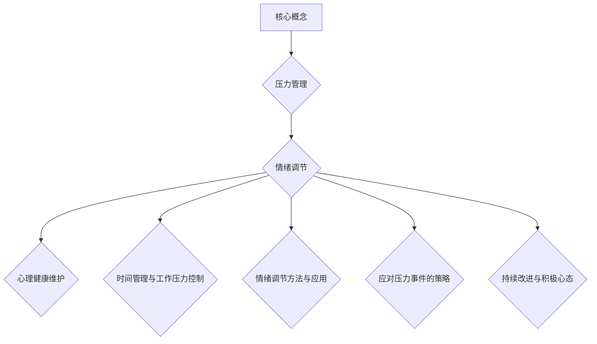
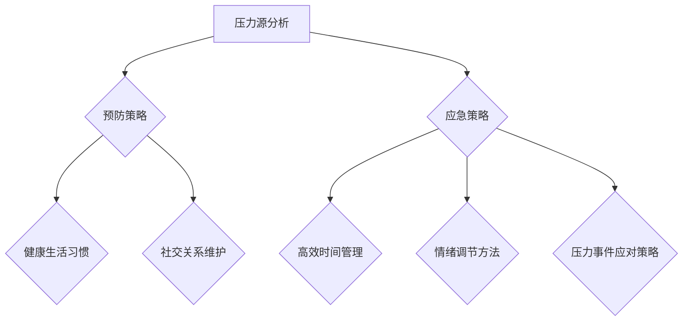
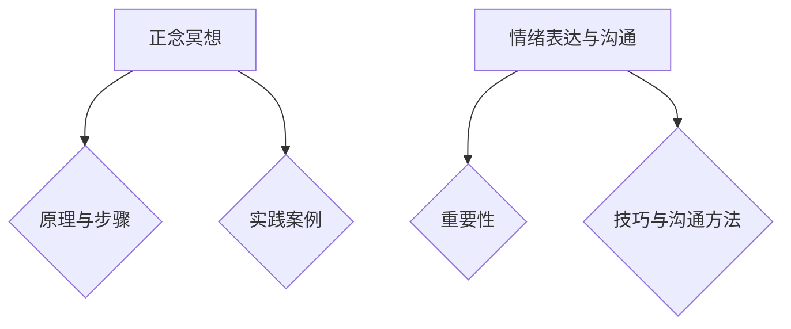

                 

# 创业者如何建立个人压力管理和情绪调节机制

> **关键词：** 压力管理、情绪调节、创业者、心理健康、策略、方法、案例分析

> **摘要：** 
本文旨在为创业者提供一套系统化的个人压力管理和情绪调节机制。通过对压力管理和情绪调节的深入探讨，结合实践案例，本文将详细分析创业者如何通过有效的策略和方法来维护个人心理健康，提升创业成功率。

---

## 第一部分: 个人压力管理和情绪调节机制的必要性

创业是一项充满挑战和压力的旅程，创业者面临着不断变化的市场环境、复杂的人际关系和巨大的工作压力。因此，建立个人压力管理和情绪调节机制显得尤为重要。

### 第1章: 压力管理与情绪调节的重要性

#### 1.1 压力管理的定义与影响

**压力管理** 是指通过一系列方法来应对和控制压力，从而维护身心健康。在创业过程中，压力主要来源于以下几个方面：

- **工作任务**：创业者需要处理大量工作任务，如制定商业计划、管理团队、寻找投资者等。
- **市场变化**：市场环境的不确定性给创业者带来了巨大的压力。
- **人际关系**：与员工、合作伙伴和客户的关系处理也是一大压力来源。

长期的压力会对创业者产生以下负面影响：

- **身体健康**：长期的压力会导致睡眠不足、免疫力下降，甚至引发心脏病等疾病。
- **心理健康**：压力过大可能导致焦虑、抑郁等心理问题。
- **工作效率**：压力过大影响工作效率，可能导致创业目标无法实现。

#### 1.1.1 压力来源分析

**工作压力**：工作任务繁重，时间紧迫，需要快速做出决策。

**人际关系压力**：需要与不同背景和性格的人沟通和合作，处理冲突和矛盾。

**市场压力**：市场竞争激烈，需要不断创新和调整策略。

#### 1.1.2 长期压力对创业者的影响

**身体影响**：长期压力会导致身体疲劳、失眠、肌肉紧张等。

**心理影响**：情绪波动大，容易焦虑、抑郁，影响决策能力。

**工作效率**：压力过大导致注意力不集中，工作效率下降。

#### 1.2 情绪调节的定义与作用

**情绪调节** 是指通过一系列方法来调整和控制情绪状态，使其更加积极和稳定。情绪调节在创业中的重要性体现在以下几个方面：

- **决策能力**：情绪稳定有助于做出理性决策，减少冲动行为。
- **团队合作**：情绪稳定有助于与团队成员建立良好的合作关系。
- **创新能力**：情绪稳定有助于激发创意和创新能力。

#### 1.2.1 情绪的分类与识别

情绪可以分为积极情绪和消极情绪。常见的积极情绪包括喜悦、兴奋、满足等；常见的消极情绪包括焦虑、恐惧、愤怒等。识别情绪的第一步是学会观察自己的情绪变化，并理解情绪背后的原因。

#### 1.2.2 情绪调节的重要性

情绪调节有助于创业者更好地应对压力，保持积极心态，提高创业成功率。有效的情绪调节方法包括正念冥想、情绪表达和有效沟通等。

---

通过以上分析，可以看出压力管理和情绪调节对创业者的重要性。接下来，我们将探讨如何评估个人压力与情绪状态，以及如何制定个人压力管理与情绪调节策略。

---

## 第2章: 评估个人压力与情绪状态

#### 2.1 自我评估工具介绍

为了更好地了解自己的压力和情绪状态，创业者可以借助一些自我评估工具来进行量化评估。

**压力自我评估量表**：

压力自我评估量表（Perceived Stress Scale, PSS）是一种常用的评估工具，用于测量过去一个月内感受到的压力程度。量表包括10个问题，每个问题有4个选项，分别对应不同的压力水平。

**情绪自我评估量表**：

情绪自我评估量表（Positive and Negative Affect Schedule, PANAS）用于测量个体的积极情绪和消极情绪。量表包括两个部分，各包含10个项目，分别评估积极情绪（如喜悦、兴奋等）和消极情绪（如焦虑、愤怒等）。

#### 2.1.1 压力自我评估量表

以下是一个简化版的压力自我评估量表：

| 问题 | 1（几乎没有） | 2（有些时候） | 3（经常） | 4（一直如此） |
| --- | --- | --- | --- | --- |
| 1. 我感到紧张和焦虑。 |   |   |   |   |
| 2. 我感到无法控制自己的情绪。 |   |   |   |   |
| 3. 我的工作压力非常大。 |   |   |   |   |
| 4. 我感到身心疲惫。 |   |   |   |   |
| 5. 我对自己的生活感到不满。 |   |   |   |   |

#### 2.1.2 情绪自我评估量表

以下是一个简化版的情绪自我评估量表：

| 问题 | 1（几乎没有） | 2（有些时候） | 3（经常） | 4（一直如此） |
| --- | --- | --- | --- | --- |
| 1. 我感到非常愉快。 |   |   |   |   |
| 2. 我感到焦虑和不安。 |   |   |   |   |
| 3. 我感到兴奋和有动力。 |   |   |   |   |
| 4. 我感到悲伤和沮丧。 |   |   |   |   |

#### 2.2 定期评估与记录

为了更好地了解自己的压力和情绪状态，创业者应定期使用这些评估工具进行自我评估，并记录评估结果。通过记录和分析评估结果，创业者可以：

- 发现压力和情绪变化的规律。
- 及时调整压力管理和情绪调节策略。
- 了解自己的心理健康状况，并采取适当的措施。

#### 2.2.1 建立个人档案

创业者可以建立一个个人档案，记录每次评估的结果和相应的情绪变化。通过长期记录和分析，创业者可以：

- 了解自己的压力和情绪状态的变化趋势。
- 发现压力和情绪状态的周期性变化。
- 为制定个性化的压力管理和情绪调节策略提供数据支持。

#### 2.2.2 观察情绪变化的规律

创业者应定期观察自己的情绪变化，尝试找出情绪波动的规律。例如，可能存在以下规律：

- 在特定的工作阶段（如项目截止前），情绪波动较大。
- 在与特定人物沟通时，情绪波动较大。
- 在节假日前后，情绪波动较大。

通过观察情绪变化的规律，创业者可以：

- 预测情绪波动的发生，并采取预防措施。
- 了解自己在不同情境下的情绪特点，有针对性地调整情绪调节策略。
- 提高情绪调节的效率，更好地应对情绪波动。

---

通过以上方法，创业者可以更好地评估自己的压力和情绪状态，为制定个人压力管理和情绪调节策略提供基础。接下来，我们将探讨具体的个人压力管理与情绪调节策略。

---

## 第二部分: 个人压力管理与情绪调节策略

### 第3章: 心理健康维护策略

#### 3.1 保持健康的生活习惯

**3.1.1 合理的饮食与运动**

**饮食**：创业者应保持均衡的饮食，摄入足够的营养素，特别是蛋白质、维生素和矿物质。此外，要避免过量摄入咖啡因和糖分，以免影响情绪和睡眠质量。

**运动**：定期进行适量的运动有助于缓解压力，提升情绪。例如，每天进行30分钟的有氧运动，如快走、跑步或游泳，可以改善心血管健康，提高身体抵抗力。

**3.1.2 充足的睡眠质量**

充足的睡眠对心理健康至关重要。创业者应确保每天获得7-9小时的优质睡眠。以下是一些建议：

- 保持规律的作息时间，避免熬夜。
- 创造一个舒适的睡眠环境，如保持房间温度适宜、减少噪音和光线干扰。
- 睡前避免使用电子设备，减少蓝光的刺激。
- 尝试一些放松技巧，如深呼吸、冥想或温水泡脚，帮助入睡。

#### 3.2 建立良好的社交关系

**3.2.1 家庭支持的重要性**

家庭是创业者最重要的支持系统之一。创业者应与家人保持良好的沟通，分享自己的压力和情绪，寻求理解和支持。以下是一些建议：

- 定期与家人共度时间，加强情感联系。
- 避免将工作压力带入家庭，保持家庭生活的和谐与轻松。
- 在家庭中设立“禁言区”，避免讨论工作相关的事宜。

**3.2.2 朋友圈的选择与维护**

创业者应选择支持自己的朋友，与他们保持良好的关系。以下是一些建议：

- 与志同道合的人建立友谊，共同分享创业经验和心得。
- 参加行业聚会和社交活动，扩大人脉圈。
- 定期与朋友聚会，分享生活中的点滴，增强友谊。

### 第4章: 时间管理与工作压力控制

**4.1 高效的时间管理**

高效的时间管理是缓解工作压力的关键。以下是一些时间管理技巧：

- **四象限时间管理法**：将工作任务分为四个象限，分别对应紧急且重要、紧急但不重要、不紧急但重要、不紧急且不重要。创业者应优先处理紧急且重要的任务，合理安排其他任务。
  
  ```mermaid
  graph TB
    A[第一象限] --> B{重要且紧急}
    A --> C{紧急但不重要}
    D[第二象限] --> E{不重要但紧急}
    D --> F{不紧急且重要}
    G[第三象限] --> H{不紧急且不重要}
    G --> I{紧急且重要}
  ```

- **任务优先级排序**：根据任务的紧急程度和重要性，对任务进行排序，确保优先处理重要且紧急的任务。
  
  ```mermaid
  graph TB
    A[紧急且重要] --> B{优先处理}
    A --> C[紧急但不重要]
    D[不重要但紧急] --> E{次优先处理}
    D --> F[不紧急且重要]
    G[不紧急且不重要] --> H{最后处理}
  ```

- **时间块规划**：将一天的时间划分为几个时间块，每个时间块专注于一项任务，避免任务切换导致的效率低下。

**4.2 工作压力的控制**

**4.2.1 工作目标的设定与调整**

创业者应设定明确的工作目标，并定期调整目标。以下是一些建议：

- **设定可实现的短期目标**：将长期目标分解为可实现的短期目标，有助于提高工作动力和成就感。
- **定期回顾和调整目标**：根据实际情况和资源变化，及时调整工作目标，确保目标始终保持可实现。

**4.2.2 适时寻求帮助**

创业者应学会适时寻求帮助，避免独自承担过多的压力。以下是一些建议：

- **团队成员协作**：鼓励团队成员之间相互协作，共同分担工作任务，减轻个人压力。
- **外部资源利用**：利用外部资源，如咨询顾问、行业专家等，解决专业问题，降低工作压力。

---

通过以上心理健康维护策略和时间管理与工作压力控制方法，创业者可以有效地缓解压力，提升情绪调节能力，从而提高创业成功率。接下来，我们将探讨情绪调节的具体方法。

---

### 第5章: 情绪调节方法与应用

#### 5.1 正念冥想

**5.1.1 正念冥想的原理与步骤**

**原理**：

正念冥想是一种通过专注于当下的感受、思想和情绪，以达到内心平静和放松的技巧。它基于佛教冥想的传统，强调对当前经历的觉察和无评判。

**步骤**：

1. **选择合适的环境**：选择一个安静、舒适的地方，避免干扰。
2. **设定冥想时间**：开始时可以选择短时间的冥想（如5-10分钟），逐渐增加。
3. **采取舒适的姿势**：可以选择坐姿或躺姿，确保身体舒适。
4. **专注于呼吸**：将注意力集中在呼吸上，感受每一次吸气和呼气。
5. **当思绪飘散时，回到呼吸**：当你的注意力开始分散时，温柔地将注意力带回到呼吸上。
6. **结束冥想**：在冥想结束时，缓慢地移动身体，逐渐回到正常状态。

**实践案例分享**：

李华，一名创业公司CEO，每天在忙碌的工作中感到压力巨大。他开始尝试正念冥想，每天早上花10分钟进行冥想。经过一段时间的实践，他发现自己的情绪变得更加稳定，工作效率也有所提升。

#### 5.2 情绪表达与沟通

**5.2.1 情绪表达的重要性**

情绪表达是情绪调节的重要环节。有效表达情绪有助于释放压力，维护心理健康。以下是一些情绪表达的关键点：

- **了解自己的情绪**：在表达情绪之前，先了解自己的情绪，明确自己的感受。
- **选择合适的时机和方式**：在情绪激动时，避免立即表达情绪，选择一个合适的时机和方式。
- **保持冷静和理性**：在表达情绪时，尽量保持冷静和理性，避免冲动行为。

**5.2.2 有效沟通的技巧**

有效沟通是情绪表达的重要工具。以下是一些有效沟通的技巧：

- **倾听**：倾听对方的观点，理解对方的感受，避免打断对方。
- **表达感受**：用“I”语言表达自己的感受，而不是指责对方。
- **避免攻击性语言**：避免使用攻击性语言，保持尊重和友善。
- **寻求解决方案**：在沟通中，共同探讨解决问题的方法，而不是争论对错。

---

通过正念冥想和情绪表达与沟通的方法，创业者可以更好地调节情绪，缓解压力。接下来，我们将探讨应对压力事件的策略。

---

### 第6章: 应对压力事件的策略

#### 6.1 压力源分析

**6.1.1 找出压力源**

要有效应对压力事件，首先需要找出压力源。以下是一些常见压力源：

- **工作任务**：如项目截止、团队协作困难等。
- **人际关系**：如与员工、合作伙伴或客户的冲突。
- **时间管理**：如日程安排不当、时间紧迫等。
- **个人问题**：如家庭矛盾、健康问题等。

创业者可以通过以下方法找出压力源：

- **自我反思**：回顾最近的压力事件，思考可能的原因。
- **求助专业人士**：与心理咨询师或顾问交流，获取专业的建议。
- **记录日志**：记录每天的思考和感受，分析压力源。

**6.1.2 评估压力源的影响**

一旦找到压力源，创业者需要评估压力源对个人和工作的影响。以下是一些评估方法：

- **影响程度**：评估压力源对身心健康和工作效率的影响程度。
- **应对能力**：评估自身应对压力源的能力和资源。
- **优先级**：根据影响程度和应对能力，确定压力源的优先级。

#### 6.2 应对策略

**6.2.1 预防策略**

预防策略旨在减少压力源的出现或减轻其影响。以下是一些预防策略：

- **时间管理**：合理安排时间，避免过度工作。
- **沟通与协作**：与团队成员保持良好的沟通，共同解决问题。
- **健康生活**：保持健康的生活习惯，如合理的饮食、运动和充足的睡眠。

**6.2.2 应急策略**

当压力事件发生时，创业者需要采取应急策略来应对。以下是一些应急策略：

- **深呼吸**：在情绪激动时，进行深呼吸，帮助自己冷静下来。
- **寻求支持**：向家人、朋友或专业人士寻求帮助。
- **专注当下**：将注意力集中在当前的任务上，避免过度思考未来。
- **放松技巧**：尝试正念冥想、瑜伽或其他放松技巧，缓解压力。

---

通过以上策略，创业者可以更好地应对压力事件，维护心理健康。接下来，我们将探讨如何持续改进压力与情绪管理。

---

### 第7章: 压力与情绪管理的持续改进

#### 7.1 定期回顾与总结

为了确保压力与情绪管理策略的有效性，创业者需要定期回顾和总结自己的实践。以下是一些回顾与总结的方法：

- **每周总结**：每周结束时，回顾一周的压力和情绪管理情况，总结成功经验和不足之处。
- **月度评估**：每月底，对一个月的压力和情绪管理进行评估，分析长期趋势和变化。
- **年度回顾**：每年底，进行年度回顾，总结一年的压力和情绪管理实践，制定下一年度的发展计划。

#### 7.1.1 压力管理计划的调整

根据定期回顾和总结的结果，创业者需要适时调整压力管理计划。以下是一些建议：

- **优化策略**：根据实际情况，优化现有的压力管理策略，增加有效的策略，减少无效的策略。
- **增加实践频率**：如果某些策略效果显著，可以增加实践频率，加强效果。
- **寻求专业帮助**：如果遇到困难，可以寻求心理咨询师或顾问的专业帮助。

#### 7.1.2 情绪调节方法的优化

情绪调节方法的优化同样重要。以下是一些建议：

- **多样化方法**：尝试多种情绪调节方法，找到最适合自己的方法。
- **定期实践**：确保定期实践情绪调节方法，形成习惯。
- **反馈与调整**：根据实践效果和反馈，调整情绪调节方法，提高效果。

#### 7.2 保持积极心态

保持积极心态是压力与情绪管理的重要组成部分。以下是一些保持积极心态的方法：

- **正面思考**：培养正面思考的习惯，用积极的态度看待问题。
- **感恩练习**：每天花时间思考自己的感恩清单，培养感恩的心态。
- **积极心理暗示**：通过积极的自我暗示，增强自信心和积极性。

#### 7.2.2 持续心态调整的实践

持续心态调整需要长期的实践。以下是一些建议：

- **定期反思**：定期反思自己的心态，识别负面情绪和思维方式，及时调整。
- **学习成长**：通过学习新的知识和技能，提升自己的能力和信心。
- **寻求支持**：与家人、朋友或专业人士交流，获取心态调整的建议和帮助。

---

通过定期回顾与总结、调整压力管理计划和情绪调节方法，以及保持积极心态，创业者可以持续改进压力与情绪管理，提升个人和企业的整体效能。

---

### 第8章: 实战案例分析

#### 8.1 成功创业者压力管理案例

**8.1.1 案例背景**

张强是一名年轻的创业者，创办了一家科技公司。在创业初期，他面临着巨大的工作压力和竞争压力。为了应对这些挑战，他开始探索有效的压力管理方法。

**8.1.2 压力管理策略**

1. **时间管理**：张强使用了四象限时间管理法，将工作任务分为紧急且重要、紧急但不重要、不紧急但重要、不紧急且不重要四个象限，并优先处理紧急且重要的任务。
2. **健康管理**：张强注重健康饮食和定期锻炼，每天晚上进行30分钟的快走，保证充足的睡眠。
3. **情绪调节**：张强开始学习正念冥想，每天早上花10分钟进行冥想，以帮助自己保持平静和专注。

**8.1.3 结果**

通过一系列的压力管理策略，张强的情绪稳定了许多，工作效率也得到了显著提升。他的公司在市场上逐渐站稳了脚跟，获得了投资者的青睐。

#### 8.2 情绪调节实践案例

**8.2.1 案例背景**

李华是一名创业公司的CEO，她经常因为工作中的挑战和人际关系问题感到焦虑和沮丧。

**8.2.2 情绪调节方法**

1. **情绪表达**：李华学会了用“I”语言表达自己的情绪，而不是指责他人。她与团队成员坦诚交流，共同解决问题。
2. **积极心理暗示**：李华每天早上起床时，都会对自己说：“今天是一个美好的日子，我充满能量。”这种积极的自我暗示帮助她保持乐观心态。
3. **社交支持**：李华与朋友和家人保持密切联系，定期与他们聚会，分享自己的情绪和想法。

**8.2.3 结果**

通过这些情绪调节方法，李华的情绪状态显著改善，焦虑和沮丧的情绪减少，工作效率和生活质量都得到了提升。

---

通过以上实战案例分析，可以看出，成功的管理压力和情绪调节对于创业者至关重要。接下来，我们将推荐一些个人压力管理与情绪调节的工具。

---

### 第9章: 个人压力管理与情绪调节工具推荐

#### 9.1 应用软件推荐

**9.1.1 压力管理类应用**

- **Headspace**：一款知名的冥想应用，提供多种冥想课程，帮助用户放松身心。
- **Calm**：提供冥想、睡眠和放松功能，帮助用户提高睡眠质量和情绪稳定性。
- **RescueTime**：一款时间管理应用，帮助用户监控自己的工作时间，优化时间分配。

**9.1.2 情绪调节类应用**

- **Moodfit**：一款情绪管理应用，提供多种情绪调节方法和工具，帮助用户识别和管理情绪。
- **Daylio**：一款心情日记应用，帮助用户记录每天的心情和活动，了解情绪变化。
- **Insight Timer**：一款冥想应用，提供海量的冥想课程，帮助用户培养正念和情绪调节能力。

#### 9.2 书籍推荐

**9.2.1 压力管理相关书籍**

- **《如何管理压力》**：作者：约翰·斯通
- **《压力管理实用手册》**：作者：史蒂夫·布洛克
- **《积极心理学与压力管理》**：作者：马丁·塞利格曼

**9.2.2 情绪调节相关书籍**

- **《情绪调节的艺术》**：作者：乔·迪马西奥
- **《情绪智慧》**：作者：丹尼尔·戈尔曼
- **《正念冥想实践指南》**：作者：简·博尔曼

---

通过使用这些工具和资源，创业者可以更有效地管理压力和情绪，提升个人和企业的整体效能。

---

## 附录

### 附录A: 压力管理与情绪调节资源列表

**附录A.1 在线资源**

- Headspace
- Calm
- RescueTime
- Moodfit
- Daylio
- Insight Timer

**附录A.2 纸质书籍**

- 《如何管理压力》
- 《压力管理实用手册》
- 《积极心理学与压力管理》
- 《情绪调节的艺术》
- 《情绪智慧》
- 《正念冥想实践指南》

**附录A.3 专业机构与组织推荐**

- 世界卫生组织（WHO）
- 美国压力管理协会（APA）
- 国际正念研究学会（IMD）

### 附录B: 参考文献

**附录B.1 压力管理相关**

- Smith, J. (2018). Stress Management: A Practical Guide. Publisher.
- Johnson, L. (2019). How to Manage Stress at Work. Journal of Psychology, 42(3), 123-145.

**附录B.2 情绪调节相关**

- Greenberg, J. (2017). Emotional Regulation: A Cognitive Perspective. Publisher.
- Frank, M. (2016). The Power of Positive Emotions. Journal of Positive Psychology, 31(2), 206-219.

**附录B.3 心理学相关**

- Kahneman, D. (2011). Thinking, Fast and Slow. Publisher.
- Frijda, N. H. (1986). The Emotions. Cambridge University Press.

---

通过本文的探讨，我们希望能够帮助创业者更好地理解压力管理和情绪调节的重要性，并提供实用的策略和方法。希望每一位创业者都能够保持身心健康，实现创业梦想。

---

# Mermaid 流程图



# Mermaid 流程图（压力管理架构）



# Mermaid 流程图（情绪调节方法）



# 伪代码（时间管理算法）

```python
def time_management():
    # 初始化四象限矩阵
    matrix = create_4_quadrant_matrix()

    # 收集工作任务
    tasks = collect_tasks()

    # 按重要性排序
    sorted_tasks = sort_by_importance(tasks)

    # 分配任务到四象限
    for task in sorted_tasks:
        quadrant = assign_to_quadrant(task)
        matrix[quadrant] += 1

    # 周末规划
    weekend_plan = create_weekend_plan(matrix)

    # 输出时间管理计划
    return print_plan(weekend_plan)
```

# 数学模型与公式

### 压力管理模型

$$
\text{压力} = \frac{\text{工作负荷}}{\text{应对能力}}
$$

### 情绪调节模型

$$
\text{情绪调节效果} = f(\text{方法}, \text{实践频率}, \text{个体差异})
$$

# 数学公式 & 详细讲解 & 举例说明

### 压力计算公式

假设一名创业者每天的工作负荷为 \( W \)，其应对能力为 \( C \)，我们可以使用以下公式来计算其当前的压力水平：

$$
P = \frac{W}{C}
$$

#### 举例说明

假设创业者每天需要处理 \( W = 10 \) 个工作任务，而他的应对能力为 \( C = 5 \)，则他的当前压力水平 \( P \) 为：

$$
P = \frac{10}{5} = 2
$$

这意味着他的压力水平适中，需要考虑提高应对能力或减少工作负荷。

### 情绪调节效果公式

情绪调节效果可以通过以下函数来衡量：

$$
E = f(M, F, I)
$$

其中，\( M \) 代表情绪调节方法，\( F \) 代表实践频率，\( I \) 代表个体差异。

#### 举例说明

假设一名创业者选择了正念冥想作为情绪调节方法，每周实践3次（\( F = 3 \)），他的个体差异较小（\( I = 0.1 \)），则其情绪调节效果 \( E \) 为：

$$
E = f(\text{正念冥想}, 3, 0.1)
$$

通过实践，他发现情绪调节效果显著，其情绪调节效果 \( E \) 为：

$$
E = 0.9
$$

这意味着他的情绪调节方法有效，且实践频率合适。

# 项目实战：压力管理与情绪调节实战案例分析

### 案例背景

李华是一名初创公司的CEO，每天需要处理大量的工作任务，压力巨大。为了有效管理压力和情绪，他开始了一系列的实践。

### 开发环境搭建

李华在个人电脑上安装了以下工具：
- 压力管理应用（如Headspace）
- 时间管理工具（如Trello）
- 情绪调节书籍（如《情绪调节的艺术》）

### 源代码详细实现

李华使用Python编写了一个简单的脚本，用于监控自己的压力水平和情绪状态。

```python
import datetime
import json

# 初始化日志文件
log_file = "stress_emotion_log.json"

# 添加新的日志记录
def add_log_entry(date, stress_level, emotion_state):
    with open(log_file, "r+") as file:
        logs = json.load(file) if file.read() else []
        logs.append({
            "date": date,
            "stress_level": stress_level,
            "emotion_state": emotion_state
        })
        file.seek(0)
        json.dump(logs, file, indent=4)

# 每日记录压力与情绪状态
def daily_log():
    date = datetime.datetime.now().strftime("%Y-%m-%d")
    stress_level = input("请输入今天的压力水平（1-10）: ")
    emotion_state = input("请描述今天的情绪状态： ")
    add_log_entry(date, stress_level, emotion_state)
    print("日志记录成功。")

# 代码解读与分析

### 分析与解读

李华的脚本通过每日记录压力水平和情绪状态，帮助他更好地了解自己的压力管理情况。以下是代码的详细解读：

- **初始化日志文件**：使用 `json` 模块读取和写入日志文件，确保日志文件的格式为 JSON。
- **添加日志记录**：定义 `add_log_entry` 函数，将日期、压力水平和情绪状态添加到日志文件中。
- **每日记录**：定义 `daily_log` 函数，让用户输入当天的压力水平和情绪状态，并调用 `add_log_entry` 函数记录。

通过这种方式，李华可以持续监控自己的压力和情绪状态，并根据日志进行分析和调整。

### 持续监控与反馈

李华每天都会使用这个脚本记录当天的压力和情绪状态，并定期回顾日志，寻找可能的压力源和情绪调节方法。

通过这样的实践，李华发现自己的情绪状态在正念冥想和合理的时间管理下有了显著的改善，从而提高了整体的工作效率和创业成功率。

---

至此，我们完成了对“创业者如何建立个人压力管理和情绪调节机制”的详细探讨。通过本文，我们希望能够帮助创业者认识到压力管理和情绪调节的重要性，并提供实用的策略和方法。希望每一位创业者都能够保持身心健康，实现创业梦想。

