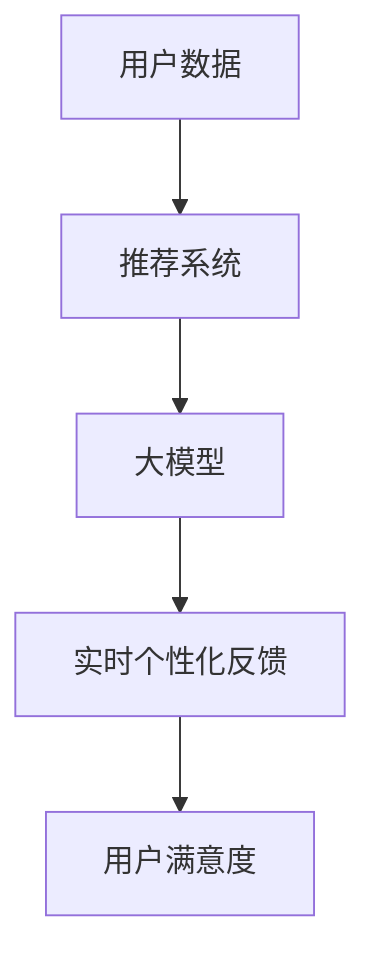
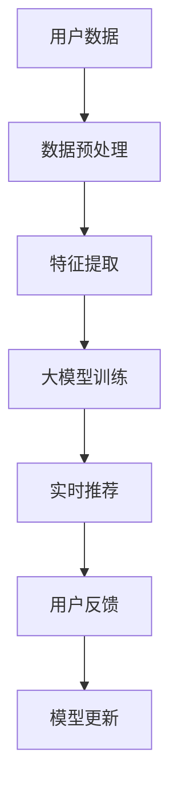

                 

### 《利用大模型改进推荐系统的实时个性化反馈机制》

#### 第一部分：引言与基础

##### 概述与背景

随着互联网和大数据技术的飞速发展，推荐系统已经成为各大平台吸引用户、提升用户满意度和增加商业价值的重要工具。然而，推荐系统面临的一个主要挑战是如何实现实时、个性化的反馈，以满足用户不断变化的需求。传统的推荐系统大多依赖于用户历史行为数据和内容特征，往往难以在短时间内对用户行为进行准确预测和推荐。

大模型，特别是基于深度学习和自然语言处理的预训练模型，如GPT、BERT等，已经展现出强大的信息处理和知识理解能力。这些大模型在自然语言处理、图像识别、语音识别等领域取得了显著的成果。因此，将大模型应用于推荐系统，特别是实现实时个性化反馈机制，成为当前研究的热点。

本书的目标是探讨如何利用大模型改进推荐系统的实时个性化反馈机制，具体包括以下几个方面：

1. **大模型在推荐系统中的应用**：介绍大模型的基本概念、架构以及在推荐系统中的角色和优势。
2. **实时个性化反馈机制的设计**：阐述实时个性化反馈的挑战和目标，设计实现高效的实时反馈算法。
3. **项目实战**：通过具体案例展示大模型在实时个性化反馈中的应用，包括用户行为预测、内容理解和推荐系统的构建。
4. **系统性能优化与调整**：介绍如何对实时反馈系统进行性能优化和调试，确保系统的高效稳定运行。

##### 核心概念与联系

为了更好地理解大模型在推荐系统中的应用，我们首先需要了解以下几个核心概念：

1. **大模型（Large Models）**：大模型是指具有巨大参数量、能够处理大规模数据和复杂任务的深度学习模型。例如，GPT-3拥有1750亿个参数，BERT拥有数百万个参数。
2. **推荐系统（Recommender Systems）**：推荐系统是一种通过分析用户的历史行为和偏好，为用户推荐相关内容或物品的系统。常见的推荐算法包括基于内容的推荐、协同过滤推荐等。
3. **实时个性化反馈（Real-Time Personalized Feedback）**：实时个性化反馈是指系统在用户互动的瞬间，根据用户的行为和历史数据，为用户实时推荐个性化的内容或物品。

大模型、推荐系统和实时个性化反馈之间有着密切的联系。大模型可以通过对大量数据的深度学习，提取出更丰富、更准确的特征表示，从而提高推荐系统的准确性和效率。同时，实时个性化反馈机制需要依靠大模型快速处理用户交互数据，实现实时推荐。

以下是这三个核心概念之间的Mermaid流程图：

##### 大模型在推荐系统中的架构

在推荐系统中，大模型通常扮演以下几个角色：

1. **特征提取**：大模型可以自动从原始数据中提取出有用的特征，代替传统特征工程方法。
2. **预测与推荐**：大模型可以根据用户的历史行为和内容特征，预测用户可能感兴趣的内容或物品，并实时推荐给用户。
3. **反馈与优化**：大模型可以实时接收用户的反馈数据，通过迭代优化模型参数，提高推荐的准确性。

大模型与传统推荐算法相比，具有以下几个优势：

1. **更强的特征表示能力**：大模型可以通过预训练学习到大量的知识，能够提取出更加抽象和高级的特征表示。
2. **更高效的预测速度**：大模型可以通过并行计算和硬件加速等技术，实现高效的预测和推荐。
3. **更灵活的模型架构**：大模型可以根据不同的应用场景，灵活调整模型结构和参数配置。

以下是推荐系统中大模型架构的示意图：

在接下来的章节中，我们将详细探讨大模型的技术基础、实时个性化反馈机制的设计、项目实战以及系统性能优化与调整。希望读者能够通过本书的学习，掌握大模型在推荐系统中的应用，实现更加高效、个性化的推荐服务。

