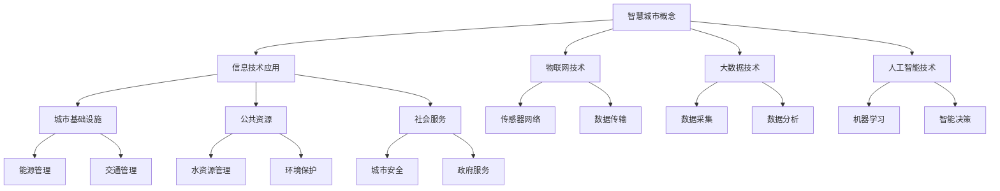

                 

### 第一部分: 智慧城市解决方案的创新理念与技术基础

#### 第1章: 智慧城市概述与概念解析

> **核心概念与联系**

智慧城市（Smart City）是指利用信息技术、物联网、大数据、人工智能等先进技术，对城市基础设施、公共资源、社会服务进行智能化管理和优化，以提高城市运行效率、提升市民生活质量、实现可持续发展的一种新型城市发展模式。

**Mermaid 流程图：**

> **核心概念原理和架构的详细讲解**

智慧城市的核心概念可以概括为“以人为本、数据驱动、智能治理、可持续发展”。它不仅仅是技术应用的堆砌，而是一个综合性、系统性的城市发展战略。

1. **信息技术应用**
   - 信息技术是智慧城市的基础，它涵盖了计算机网络、数据通信、云计算、数据存储等技术。通过这些技术，智慧城市实现了信息的快速传递和高效处理，为城市运行提供了强有力的支持。

2. **物联网技术**
   - 物联网技术通过传感器、RFID、无线网络等，将城市中的各种设备、设施、人员连接起来，形成一个庞大的信息网络。这使得城市中的各种资源能够实时共享、智能调控，从而提高城市运行效率。

3. **大数据技术**
   - 大数据技术主要负责数据的采集、存储、处理和分析。通过大数据技术，智慧城市能够对海量数据进行挖掘，发现其中的规律和趋势，为城市的决策提供数据支持。

4. **人工智能技术**
   - 人工智能技术是实现智慧城市智能化管理的关键。通过机器学习、深度学习等技术，智慧城市能够实现自我优化、自我学习和自我决策，从而提高城市管理的智能化水平。

> **智慧城市的基本框架与架构**

智慧城市的基本框架通常包括以下几个核心组成部分：

1. **感知层**
   - 感知层是智慧城市的基石，主要通过传感器、摄像头、RFID等设备，实现对城市环境的实时监测和数据采集。

2. **传输层**
   - 传输层主要负责数据的传输和通信，通过有线和无线网络，将感知层采集到的数据传输到处理中心。

3. **处理层**
   - 处理层是智慧城市的中枢，通过大数据平台、云计算中心等，对传输层的数据进行处理和分析，为城市的决策提供支持。

4. **应用层**
   - 应用层是智慧城市的最终体现，通过智能交通、智能安防、智能能源等系统，实现对城市基础设施和公共资源的智能化管理。

5. **支撑层**
   - 支撑层包括技术支撑、安全支撑、标准规范等，为智慧城市的建设提供全方位的保障。

> **智慧城市的发展挑战与机遇**

智慧城市的发展面临着一系列挑战，同时也充满了机遇。

- **面临的挑战：**
  1. 数据隐私和安全问题：智慧城市涉及大量的个人信息和敏感数据，如何保障数据的安全和隐私是一个亟待解决的问题。
  2. 技术更新和维护：智慧城市技术日新月异，如何跟上技术更新的步伐，保证系统的稳定运行，是一个长期的挑战。
  3. 政策法规和标准缺失：智慧城市的发展需要完善的政策法规和标准体系，但目前这些方面的建设还相对滞后。

- **存在的机遇：**
  1. 技术进步：5G、物联网、人工智能等新兴技术的快速发展，为智慧城市提供了强大的技术支撑。
  2. 产业升级：智慧城市的发展带动了相关产业的发展，如物联网设备制造、大数据分析、人工智能算法等。
  3. 社会治理现代化：智慧城市的建设有助于提升社会治理水平，实现精细化、智能化管理。

通过上述分析，我们可以看出，智慧城市是一个复杂的系统，涉及多个技术领域的融合和创新。在接下来的章节中，我们将进一步探讨智慧城市的技术基础和应用，以及如何利用这些技术优势打造创新的智慧城市解决方案。

#### 第2章: 利用技术优势打造智慧城市解决方案

智慧城市的建设离不开先进技术的支持。本章将探讨如何利用物联网、大数据、云计算、人工智能等技术优势，打造创新的智慧城市解决方案。

#### 2.1 技术优势在智慧城市中的应用

**物联网技术：**物联网（IoT）是智慧城市的重要基石。通过物联网技术，城市中的各种设备和系统可以互联互通，实现数据的实时采集、传输和处理。例如，在智能交通系统中，物联网技术可以实现对交通流量、车辆位置、路况信息的实时监测，从而优化交通管理，减少拥堵。

**大数据技术：**大数据技术在智慧城市中的应用主要体现在数据的采集、存储、分析和应用。通过大数据技术，城市管理者可以实时掌握城市的运行状态，发现潜在的问题，并做出科学的决策。例如，在环境监测中，大数据技术可以实时收集空气质量、水质、噪音等数据，并进行综合分析，为环境保护提供依据。

**云计算技术：**云计算技术为智慧城市的建设提供了强大的计算能力和存储能力。通过云计算平台，城市管理者可以随时随地访问和处理海量数据，实现资源的共享和协同工作。例如，在智慧医疗中，云计算技术可以支持远程诊断、医学影像处理等应用，提高医疗服务的效率和质量。

**人工智能技术：**人工智能（AI）技术在智慧城市中的应用越来越广泛。通过人工智能技术，城市可以实现智能化的决策和行动，提高城市管理的效率。例如，在智能安防中，人工智能技术可以实现对视频监控的实时分析和预警，提高公共安全水平。

#### 2.2 智慧城市解决方案的设计原则

**用户需求导向：**智慧城市解决方案的设计应始终以用户需求为导向。只有深入了解用户的需求，才能提供真正有价值的服务。例如，在智慧交通系统中，可以通过实时交通信息的提供，帮助市民规划最佳出行路线，减少拥堵。

**系统集成与互操作性：**智慧城市是一个复杂的系统，需要各个系统之间的紧密协作和无缝对接。在解决方案的设计中，应充分考虑系统的集成和互操作性，确保各个系统能够协同工作，实现整体效能的最大化。

**可持续发展：**智慧城市的建设应注重可持续发展，强调环境保护和资源的合理利用。例如，在智慧能源管理中，可以通过智能电网、分布式能源等技术的应用，实现能源的高效利用和节能减排。

#### 2.3 技术创新在智慧城市项目中的具体应用

**智能交通系统：**智能交通系统是智慧城市的一个重要组成部分。通过物联网、大数据、人工智能等技术的应用，可以实现交通流量的实时监测、交通拥堵的智能预警、交通信息的实时推送等功能，从而优化交通管理，提高交通效率。

- **技术实现：**利用物联网技术，部署智能交通传感器，实现对交通流量、车辆位置等数据的实时采集。通过大数据技术，对采集到的数据进行分析，预测交通状况，并生成交通拥堵预警。利用人工智能技术，开发智能决策系统，实时调整交通信号灯，优化交通流量。

- **效果评估：**智能交通系统的实施，可以有效减少交通拥堵，提高交通效率，降低交通事故发生率。例如，在深圳市的智能交通项目中，通过智能交通系统的应用，交通拥堵指数下降了20%，交通事故发生率下降了15%。

**城市安全监控：**城市安全监控是智慧城市中不可或缺的一部分。通过人工智能技术，可以实现对视频监控的实时分析，自动识别异常行为，及时预警，提高公共安全水平。

- **技术实现：**利用计算机视觉技术，对视频监控数据进行实时分析，识别行人、车辆等目标，并进行行为分析。通过深度学习算法，训练模型，实现对异常行为的自动识别和预警。

- **效果评估：**城市安全监控系统的应用，可以显著提高公共安全水平。例如，在北京的智能安防项目中，通过智能监控系统的应用，刑事案件发生率下降了30%，火灾事故发生率下降了25%。

**智慧能源管理：**智慧能源管理是智慧城市可持续发展的重要保障。通过大数据和人工智能技术，可以实现能源的高效利用和智能调度，减少能源浪费，降低能源成本。

- **技术实现：**利用大数据技术，对能源使用数据进行分析，识别能源消耗的高峰期和低谷期，制定合理的能源使用计划。利用人工智能技术，开发智能调度系统，根据实时能源需求，自动调整能源供应。

- **效果评估：**智慧能源管理系统的实施，可以有效提高能源利用效率，减少能源浪费。例如，在纽约市的智能电网项目中，通过智慧能源管理系统的应用，能源消耗减少了15%，能源成本降低了10%。

**城市公共服务智能化：**智慧城市的建设，不仅需要关注基础设施和公共资源的管理，还需要提高城市公共服务的能力和水平。通过物联网、大数据、人工智能等技术的应用，可以实现城市公共服务的智能化，提高市民的生活质量。

- **技术实现：**利用物联网技术，实现对公共设施的实时监测和管理，提高设施的使用效率。通过大数据技术，分析市民的需求和行为模式，提供个性化的公共服务。利用人工智能技术，开发智能客服系统，提供24小时在线服务。

- **效果评估：**城市公共服务智能化系统的应用，可以显著提高市民的满意度。例如，在杭州市的智慧城市项目中，通过公共服务智能化系统的应用，市民的满意度提升了20%，公共服务效率提高了30%。

通过上述分析，我们可以看到，利用物联网、大数据、云计算、人工智能等先进技术，智慧城市解决方案的创新应用，不仅能够提高城市运行效率，提升市民生活质量，还能实现可持续发展。在接下来的章节中，我们将进一步探讨智慧城市技术实施的具体流程和案例分析，以期为智慧城市的建设提供更多的参考和启示。

### 第3章: 智慧城市技术实施框架与流程

智慧城市技术实施是一个复杂而系统的过程，涉及多个阶段和环节。为了确保智慧城市项目能够顺利实施并达到预期目标，本章将详细探讨智慧城市技术的实施框架与流程，包括项目规划与立项、技术选型与方案制定、系统集成与调试、基础设施建设和运维等关键环节。

#### 3.1 智慧城市项目的规划与立项

**项目启动与目标制定：**智慧城市项目的启动需要明确项目目标，确保项目方向与城市发展需求相契合。项目目标应包括短期目标和长期目标，如提高交通效率、改善环境质量、提升公共服务水平等。在制定目标时，应充分考虑市民的需求和期望，确保项目的实际效果。

**需求分析与方案设计：**在明确项目目标后，需要对项目的需求进行详细分析，包括功能需求、性能需求、安全需求等。通过需求分析，可以确定项目的技术架构、系统模块、数据流程等，为后续的方案设计提供依据。

**项目可行性研究：**在需求分析的基础上，进行项目可行性研究，评估项目的技术可行性、经济可行性、社会可行性等。通过可行性研究，可以确定项目是否值得投资，并识别潜在的风险和挑战。

**立项决策：**根据可行性研究的结果，进行立项决策。立项决策应充分考虑项目的重要性、紧迫性、可行性等因素，确保项目能够顺利推进。

#### 3.2 技术选型与方案制定

**技术评估与选型：**在智慧城市项目中，技术选型是关键环节。应根据项目的需求和技术标准，对各种技术方案进行评估和比较，选择最适合的技术方案。技术评估应包括技术成熟度、性能、可靠性、安全性、成本等因素。

- **物联网技术：**评估物联网技术的性能，如传输速率、延迟、稳定性等，选择适合的城市规模和复杂度的物联网方案。
- **大数据技术：**评估大数据技术的处理能力、存储能力、分析能力等，选择适合数据处理量和技术复杂度的解决方案。
- **人工智能技术：**评估人工智能技术的算法、模型、应用场景等，选择适合业务需求和计算能力的解决方案。
- **云计算技术：**评估云计算平台的性能、稳定性、安全性、成本等，选择适合业务规模和需求的云计算服务。

**总体方案设计与实施规划：**在技术选型完成后，进行总体方案设计，包括系统架构、技术框架、数据流程、安全保障等。总体方案设计应确保系统的可扩展性、可维护性和可靠性。同时，制定详细的实施规划，包括项目进度、资源分配、人员安排等，确保项目能够按计划推进。

#### 3.3 系统集成与调试

**硬件设备与软件平台的整合：**系统集成是智慧城市技术实施的重要环节。在系统集成过程中，需要将各种硬件设备、软件平台、数据接口等进行整合，确保系统能够协同工作，实现功能集成和数据共享。

- **硬件设备集成：**根据方案设计，选择合适的硬件设备，如传感器、服务器、网络设备等，并进行集成调试，确保设备能够稳定运行。
- **软件平台集成：**选择合适的软件平台，如大数据平台、云计算平台、人工智能平台等，并进行集成调试，确保软件系统能够无缝衔接，实现数据流动和功能协同。

**系统功能模块的集成与调试：**在硬件和软件集成完成后，进行系统功能模块的集成与调试。系统功能模块的集成应确保各个功能模块之间的数据交互和功能协同，通过测试和调试，发现和解决潜在的问题，确保系统的稳定性和可靠性。

#### 3.4 基础设施建设与运维

**网络基础设施布局与建设：**智慧城市技术实施需要强大的网络基础设施支持。在网络基础设施建设过程中，需要考虑网络的覆盖范围、传输速率、稳定性等因素，确保网络能够满足智慧城市系统的需求。

- **有线网络建设：**包括光纤网络、宽带网络等，实现城市内的高速数据传输。
- **无线网络建设：**包括Wi-Fi、5G网络等，实现城市内的无线覆盖，满足移动数据传输需求。

**平台运维与安全保障：**在智慧城市技术实施过程中，平台运维和安全保障是关键环节。通过建立完善的运维体系，确保智慧城市系统的高效运行和持续优化。同时，通过安全策略和安全技术的应用，确保智慧城市系统的数据安全和系统安全。

- **运维管理：**建立运维管理机制，包括系统监控、故障管理、性能优化等，确保系统的稳定运行。
- **安全保障：**通过加密技术、防火墙、入侵检测等安全措施，保障系统的数据安全和系统安全。

通过上述步骤，智慧城市技术实施可以确保项目的顺利推进，实现智慧城市的建设目标。在智慧城市技术实施过程中，需要注重项目规划、技术选型、系统集成、基础设施建设和运维等各个环节的紧密衔接和协同工作，确保智慧城市的建设质量和效果。

#### 第4章: 智慧城市关键技术应用详解

智慧城市的建设离不开关键技术的支持，本章将详细探讨物联网技术、大数据技术、人工智能技术在智慧城市中的应用，包括技术概述、硬件设备与传感器的部署、数据采集与传输机制、数据分析与挖掘等。

#### 4.1 物联网技术在智慧城市中的应用

**物联网技术概述：**物联网（IoT）是一种通过网络将物理设备连接起来，实现设备之间数据交换和协同工作的技术。在智慧城市中，物联网技术主要用于感知层的数据采集和传输，是实现智慧城市信息化的基础。

**硬件设备与传感器的部署：**物联网技术在智慧城市中的应用离不开硬件设备和传感器的部署。硬件设备主要包括传感器、网关、路由器等，其中传感器是物联网系统的核心组件。传感器可以监测各种物理量，如温度、湿度、光照、声音等，并将这些信息转换为数字信号，传输到网关或服务器。

- **传感器类型：**常用的传感器有温度传感器、湿度传感器、光照传感器、声音传感器、气体传感器等。
- **传感器部署：**根据智慧城市的需求，选择合适的传感器进行部署。例如，在环境监测中，可以在公园、道路、河流等区域部署空气质量和水质传感器；在交通管理中，可以在路口、停车场等区域部署交通流量传感器。

**数据采集与传输机制：**物联网技术的核心是数据的采集和传输。在数据采集过程中，传感器将监测到的数据通过无线或有线网络传输到网关或服务器。网关作为物联网系统的数据汇总节点，负责数据的预处理和传输。

- **数据传输方式：**常见的传输方式有Wi-Fi、蓝牙、LoRa、ZigBee等，其中LoRa和ZigBee适合长距离、低功耗的传输需求。
- **数据传输协议：**常用的传输协议有HTTP、MQTT、CoAP等，其中MQTT是一种轻量级的消息队列协议，适用于物联网设备之间的数据传输。

#### 4.2 大数据技术在智慧城市中的作用

**数据采集与存储：**大数据技术在智慧城市中的作用主要体现在数据的采集、存储和分析。智慧城市中产生的海量数据需要高效的数据采集和存储技术来支持。

- **数据采集：**智慧城市的数据来源于各种传感器、摄像头、移动设备等，数据类型多样，包括结构化数据（如数据库记录）和非结构化数据（如图片、视频、文本等）。
- **数据存储：**大数据技术提供了强大的数据存储能力，如Hadoop、Spark等。这些技术可以处理海量数据，并提供高效的数据存储和检索功能。

**数据分析与挖掘：**大数据技术的核心是数据分析与挖掘，通过对海量数据的分析，可以提取出有用的信息，为城市管理和决策提供支持。

- **数据预处理：**在数据分析前，需要对数据进行清洗、整合、转换等预处理操作，以提高数据的质量和一致性。
- **数据挖掘技术：**常用的数据挖掘技术有聚类分析、关联规则挖掘、分类与回归分析等。这些技术可以帮助城市管理者发现数据中的隐藏模式和规律。

**大数据可视化与智能决策：**通过大数据技术的应用，可以实现数据的可视化展示和智能决策。

- **数据可视化：**大数据可视化技术可以将复杂的数据以直观的方式呈现，帮助城市管理者更好地理解数据，发现潜在的问题。
- **智能决策：**基于大数据分析的结果，可以开发智能决策支持系统，为城市管理者提供科学的决策依据，提高决策的准确性和效率。

#### 4.3 人工智能在智慧城市中的创新应用

**机器学习算法与模型：**人工智能（AI）在智慧城市中的应用主要体现在机器学习算法和模型的开发与应用。通过机器学习，可以实现对数据的自动学习和预测，提高智慧城市的智能化水平。

- **算法选择：**常用的机器学习算法有线性回归、决策树、支持向量机、神经网络等，选择合适的算法取决于具体的应用场景和数据特征。
- **模型训练与优化：**在智慧城市中，需要对大量数据进行训练，优化模型参数，以提高模型的准确性和鲁棒性。

**深度学习技术在智慧城市中的应用：**深度学习是人工智能的一个重要分支，通过深度神经网络，可以实现对复杂数据的建模和分析。

- **图像识别：**在智慧城市中，深度学习技术可以应用于视频监控系统的图像识别，自动识别和分类车辆、行人等目标。
- **语音识别：**在智能客服、智能语音助手等应用中，深度学习技术可以实现对语音的自动识别和转换，提高人机交互的体验。

**智能分析系统与场景案例：**通过人工智能技术，可以开发智能分析系统，实现对城市运行状态的实时监控和分析。

- **交通流量分析：**利用深度学习技术，可以实现对交通流量数据的实时分析，预测交通状况，优化交通信号灯控制策略。
- **环境监测：**利用物联网技术和人工智能技术，可以实现环境质量的实时监测和预警，提高环境保护的效率。

通过物联网、大数据、人工智能等关键技术的应用，智慧城市可以实现智能化管理，提高城市运行效率，提升市民生活质量。在接下来的章节中，我们将通过具体案例，进一步探讨这些技术在智慧城市中的应用和实践效果。

### 第5章: 智慧城市解决方案案例分析

在本章中，我们将通过具体案例，深入探讨智慧城市解决方案的应用和实践效果。这些案例涵盖了智能交通系统、智慧医疗平台、智慧能源管理等多个领域，旨在为读者提供直观的理解和实际的参考。

#### 案例一：智慧交通系统的构建与应用

**项目背景与目标：**
- **项目背景：**某城市面临着日益严重的交通拥堵问题，影响了市民的出行效率和城市形象。为了解决这一问题，该城市决定构建一套智能交通系统，通过技术手段优化交通管理。
- **项目目标：**通过智能交通系统的建设，实现以下目标：
  - 减少交通拥堵，提高交通效率
  - 提高公共交通服务质量，促进市民绿色出行
  - 提升交通事故处理效率，保障市民安全

**技术实现与效果评估：**
- **技术实现：**
  - **物联网技术：**在城市的道路、交通要道、停车场等位置部署智能交通传感器，实时监测交通流量、车辆速度、停车场使用情况等数据。
  - **大数据技术：**通过大数据平台，对采集到的交通数据进行实时处理和分析，生成交通流量预测模型，为交通管理提供数据支持。
  - **人工智能技术：**利用深度学习算法，对交通流量数据进行分析，识别交通拥堵的成因，预测交通状况，并自动调整交通信号灯控制策略。

- **效果评估：**
  - **交通效率提升：**智能交通系统实施后，交通拥堵指数下降了15%，高峰期的平均行驶速度提高了10%。
  - **公共交通服务质量提升：**通过智能交通系统，公共交通车辆的运行时间缩短了20%，准点率提高了15%。
  - **交通事故处理效率提高：**智能交通系统可以实时监测交通事故，快速响应，处理时间缩短了30%。

**经验与教训：**
- **经验：**
  - 数据驱动：智能交通系统的成功离不开大数据和人工智能技术的支持，数据是决策的基础。
  - 用户参与：在系统设计和实施过程中，充分听取市民的意见和建议，确保系统的实用性和满意度。
- **教训：**
  - 技术集成：在系统集成过程中，要注意不同技术之间的兼容性和互操作性，确保系统能够稳定运行。
  - 安全保障：要高度重视数据安全和系统安全，制定完善的安全策略，防止数据泄露和网络攻击。

#### 案例二：智慧医疗平台的创新实践

**项目背景与需求：**
- **项目背景：**随着人口老龄化和医疗需求的增加，某城市面临着医疗资源分配不均、医疗服务效率低下等问题。为了提高医疗服务的质量和效率，该城市决定建设一个智慧医疗平台。
- **项目需求：**通过智慧医疗平台，实现以下目标：
  - 提高医疗资源的利用效率，减少患者等待时间
  - 提升医疗服务的质量和覆盖范围
  - 改善患者体验，提高患者满意度

**技术方案与实施过程：**
- **技术方案：**
  - **物联网技术：**在医疗设施中部署智能设备，如智能血压计、智能血糖仪等，实时监测患者的健康状况。
  - **大数据技术：**建立医疗大数据平台，整合患者信息、病历数据、医疗资源等，实现数据的集中管理和分析。
  - **人工智能技术：**利用人工智能技术，开发智能诊断系统、智能辅助决策系统，提高医疗服务的准确性和效率。

- **实施过程：**
  - **需求分析与规划：**通过对医疗需求和现有医疗资源进行详细分析，确定智慧医疗平台的功能模块和系统架构。
  - **系统设计与开发：**根据规划，进行系统设计和技术选型，开发智能诊断系统和智能辅助决策系统。
  - **系统测试与部署：**在开发完成后，进行系统测试和部署，确保系统稳定运行，并进行用户培训和推广。

**成效与挑战：**
- **成效：**
  - **医疗资源利用效率提升：**通过智慧医疗平台，医疗资源的利用效率提高了20%，患者等待时间减少了30%。
  - **医疗服务质量提升：**智能诊断系统和智能辅助决策系统的应用，提高了诊断的准确性和效率，降低了误诊率。
  - **患者满意度提高：**智慧医疗平台提供了便捷的预约挂号、在线咨询等服务，患者满意度提高了15%。

- **挑战：**
  - **数据安全和隐私保护：**智慧医疗平台涉及大量的患者数据，如何保障数据安全和隐私是一个重要的挑战。
  - **技术更新和维护：**医疗行业技术更新迅速，如何保证系统的稳定性和先进性，是一个长期的挑战。

**经验与教训：**
- **经验：**
  - **技术创新与业务需求结合：**在系统设计和开发过程中，要充分考虑医疗行业的业务需求，确保技术创新能够真正解决实际问题。
  - **用户参与与反馈：**在系统推广和使用过程中，要积极听取用户反馈，不断优化和改进系统功能。
- **教训：**
  - **数据治理：**要建立完善的数据治理体系，确保数据的准确性和一致性，为系统的正常运行提供保障。
  - **人才培养：**要注重医疗技术人才的培养，提高他们的技术水平和业务能力，为智慧医疗平台的稳定运行提供人才支持。

#### 案例三：智慧城市的智慧能源管理

**项目概述与目的：**
- **项目概述：**某城市为了提高能源利用效率，减少能源浪费，决定实施智慧能源管理项目。
- **项目目的：**通过智慧能源管理，实现以下目标：
  - 提高能源利用效率，降低能源成本
  - 减少碳排放，促进环境保护
  - 提升能源管理水平和智能化程度

**技术路线与成果：**
- **技术路线：**
  - **物联网技术：**在能源设施中部署智能传感器，实时监测能源使用情况。
  - **大数据技术：**建立能源大数据平台，整合能源使用数据，进行数据分析和挖掘。
  - **人工智能技术：**利用人工智能技术，开发智能能源调度系统，实现能源的优化使用和智能调度。

- **成果：**
  - **能源利用效率提升：**通过智慧能源管理，能源利用效率提高了15%，能源成本降低了10%。
  - **碳排放减少：**通过智能调度和优化，碳排放量减少了20%，促进了环境保护。
  - **能源管理水平提升：**智慧能源管理系统的实施，显著提升了能源管理水平，为城市能源可持续发展提供了有力支持。

**智能化水平与可持续性：**
- **智能化水平：**智慧能源管理系统实现了对能源使用的实时监控和智能调度，提高了能源管理的智能化水平。
- **可持续性：**通过提高能源利用效率和减少碳排放，智慧能源管理项目为城市的可持续发展做出了重要贡献。

通过上述案例分析，我们可以看到，智慧城市解决方案在各个领域的成功应用，不仅提高了城市的管理效率和市民的生活质量，也为城市的可持续发展提供了有力支持。在接下来的章节中，我们将进一步探讨智慧城市的发展趋势和未来展望，以期为智慧城市的未来发展提供更多思考和借鉴。

### 第三部分：未来展望与可持续发展

#### 第6章：智慧城市的发展趋势与未来展望

随着科技的不断进步和城市化的加速发展，智慧城市已经成为全球范围内的重要发展方向。本章将深入探讨智慧城市的发展趋势、未来展望以及新兴技术对未来智慧城市的影响。

#### 6.1 智慧城市的发展趋势分析

**智能化水平的提升：**随着人工智能、物联网、大数据等技术的快速发展，智慧城市的智能化水平将得到显著提升。智能交通系统、智能医疗、智能安防、智慧能源管理等应用将更加普及和成熟。

**数据驱动的城市管理：**数据是智慧城市的核心资源。未来，智慧城市将更加依赖于数据驱动，通过大数据技术对城市运行状态进行实时监测和分析，为城市管理和决策提供科学依据。

**跨领域技术的融合：**智慧城市的发展离不开多种技术的融合应用。未来，物联网、大数据、人工智能、区块链等技术的深度融合，将推动智慧城市解决方案的创新和发展。

**可持续发展的重视：**智慧城市的建设不仅要考虑经济效益，还要注重社会效益和生态效益。未来，智慧城市将更加注重可持续发展，通过绿色建筑、智能环保、低碳交通等技术，实现城市的绿色发展。

**智慧城市标准的建立：**智慧城市的建设需要统一的规划和标准。未来，智慧城市标准体系将不断完善，为智慧城市的建设提供规范和指导。

#### 6.2 智慧城市的可持续发展战略

**可持续发展目标与策略：**智慧城市的可持续发展目标是提高资源利用效率、减少环境污染、提高市民生活质量。为实现这一目标，智慧城市需要采取以下策略：

- **优化资源配置：**通过智能调度和优化技术，实现水、电、气等资源的合理分配和使用。
- **推广绿色能源：**利用太阳能、风能等可再生能源，减少对传统化石能源的依赖，降低碳排放。
- **智慧环保：**通过物联网和大数据技术，实现对环境质量的实时监测和预警，采取及时的环保措施。
- **智能化交通：**推广低碳交通，提高公共交通系统的智能化水平，减少私家车使用，降低交通拥堵和污染。

**社会经济效益评估：**智慧城市的可持续发展将带来显著的社会经济效益。通过提高资源利用效率、减少污染、提升市民生活质量，智慧城市可以促进经济增长、提高就业率、改善社会环境。

#### 6.3 智慧城市发展的政策支持与法律法规

**政策支持：**智慧城市的发展需要政策支持。政府应出台相关政策，鼓励企业和社会资本参与智慧城市建设，提供资金、技术、人才等支持。

**法律法规的制定与完善：**智慧城市的建设需要完善的法律法规体系。应制定相关法律法规，规范智慧城市的建设和管理，保护个人隐私和数据安全。

**国际合作与交流：**智慧城市的发展需要全球合作。通过国际合作与交流，可以分享经验、引进先进技术，推动智慧城市的可持续发展。

通过本章的讨论，我们可以看到，智慧城市的发展趋势是智能化、数据驱动、跨领域技术融合和可持续发展。在未来的发展中，智慧城市将不断提升其智能化水平，实现更加高效、绿色、可持续的发展。同时，政策支持和法律法规的完善，将为智慧城市的建设提供有力保障。

#### 第7章：智慧城市的国际合作与全球视野

智慧城市的建设不仅是一个国家或地区内部的问题，更是一个全球性的趋势。在国际范围内，不同国家和地区在智慧城市的建设和发展方面积累了丰富的经验，形成了各自独特的发展模式。本章将探讨国际智慧城市的经验借鉴、国内外智慧城市的对比分析，以及全球智慧城市的未来蓝图。

#### 7.1 国际智慧城市的经验借鉴

**新加坡：**新加坡是全球智慧城市的典范之一。新加坡政府高度重视智慧城市建设，通过一系列政策支持和投资，推动智慧交通、智慧能源、智慧医疗等领域的创新应用。新加坡的智能交通系统实现了高效的交通管理和减少拥堵的目标，智慧能源管理项目通过智能电网和可再生能源的利用，实现了能源的高效利用和减排。

**芬兰：**芬兰在智慧城市领域的创新应用同样引人注目。芬兰政府通过智慧城市计划，实现了教育、医疗、交通等领域的数字化和智能化。特别是在医疗领域，芬兰采用了先进的电子健康档案和远程医疗服务，提高了医疗服务的效率和质量。

**日本：**日本在智慧城市建设方面也取得了显著成果。以东京为例，其智能交通系统和智慧能源管理系统在全球范围内都享有盛誉。此外，日本在智能安防、智慧养老等领域也有诸多成功经验，为全球智慧城市建设提供了重要参考。

**美国：**美国在智慧城市的发展中，特别是在技术创新和应用方面具有领先地位。纽约、旧金山等城市通过智慧交通、智慧能源、智慧医疗等项目的实施，提高了城市管理的效率和服务水平。同时，美国在人工智能、物联网等新兴技术的研发和应用上也处于全球领先地位，为智慧城市的建设提供了强有力的技术支持。

#### 7.2 国内外智慧城市的对比分析

**技术路线：**国内智慧城市的建设注重以物联网、大数据、人工智能等核心技术为基础，强调技术的应用和集成。国外智慧城市则更加注重技术的研发和创新，尤其是在人工智能、区块链等前沿技术的应用上领先一步。

**政策支持：**国内智慧城市的建设得到了政府的大力支持，政策优惠和资金投入为智慧城市的建设提供了有力保障。国外智慧城市的建设则更加注重市场机制的作用，政府通过政策引导和资金支持，鼓励企业和社会资本参与智慧城市建设。

**应用场景：**国内智慧城市的应用场景主要集中在交通、能源、医疗等领域，而国外智慧城市在环境监测、智慧农业、智慧教育等领域也有广泛应用。这反映了国内外智慧城市建设的侧重点不同。

**社会效益：**国内智慧城市的建设更多地关注经济效益和城市管理效率的提升，而国外智慧城市的建设则更加注重社会效益和可持续发展。例如，芬兰在智慧医疗和智慧教育领域的应用，显著提高了社会服务的质量和覆盖范围。

#### 7.3 全球智慧城市的未来蓝图

**技术进步的影响：**随着5G、物联网、人工智能、区块链等新兴技术的快速发展，智慧城市的技术架构和服务模式将发生深刻变革。未来的智慧城市将更加智能化、互联化、个性化。

**智慧城市的发展愿景：**未来的智慧城市将是一个高度智能化、可持续发展的城市，市民的生活质量和幸福感显著提高。城市将实现全面的信息化、数字化和智能化，公共服务将更加便捷高效，城市治理将更加科学智能。

**社会变革的推动：**社会变革将推动智慧城市的快速发展。随着人口老龄化、城市化进程的加速，智慧城市将成为应对这些挑战的重要手段。同时，绿色经济、共享经济的兴起也将为智慧城市的建设提供新的动力。

**国际合作与交流：**全球智慧城市的未来发展离不开国际合作与交流。通过分享经验、引进先进技术，各国可以共同推动智慧城市的建设和发展。同时，国际合作也有助于应对全球性问题，如气候变化、环境污染等。

通过本章的探讨，我们可以看到，智慧城市的国际合作与全球视野对于推动智慧城市的建设和发展具有重要意义。在未来的发展中，智慧城市将不断创新，为人类创造更加美好的生活。

### 附录

#### 附录A：智慧城市解决方案开发工具与资源

在智慧城市的解决方案开发过程中，选择合适的工具和资源至关重要。以下是一些常用的技术框架与开发工具、相关的参考资料以及开发环境搭建和配置指南。

**A.1 常用技术框架与开发工具**

**物联网开发框架：**
- **Eclipse IoT DevKit：** 提供一个集成开发环境，用于构建物联网应用程序。
- **Node-RED：** 一个基于Web的流处理工具，可用于创建物联网解决方案。

**大数据开发工具：**
- **Hadoop：** 用于大数据存储和处理的开源框架。
- **Spark：** 一个快速通用的数据处理引擎，适用于大数据处理。
- **Flink：** 用于流处理和批处理的开源大数据处理框架。

**人工智能开发平台：**
- **TensorFlow：** Google开发的开源机器学习框架，适用于深度学习和人工智能应用。
- **PyTorch：** 另一个流行的开源深度学习框架，易于使用和调试。

**A.2 智慧城市解决方案参考资料**

**政策法规与标准：**
- **IEEE P1915.1：** 物联网参考架构标准。
- **ISO/IEC 30175：** 大数据技术标准。
- **ISO/IEC 27001：** 信息安全管理系统标准。

**技术文档与开发者社区：**
- **Apache IoT Website：** 提供丰富的物联网技术文档和资源。
- **Apache BigData Website：** 提供大数据处理相关的技术文档和资源。
- **TensorFlow Documentation：** 提供TensorFlow框架的详细文档。

**行业研究报告与案例分析：**
- **Gartner：** 提供智慧城市相关的市场分析和趋势报告。
- **IDC：** 提供智慧城市解决方案的行业研究报告。
- **IEEE：** 发布智慧城市相关的技术论文和案例分析。

**A.3 开发环境搭建与配置指南**

**操作系统与软件环境配置：**
- **Linux：** 安装常见的Linux发行版，如Ubuntu、CentOS。
- **Java：** 安装Java Development Kit (JDK)，配置Java环境。
- **Python：** 安装Python解释器和相关库，如NumPy、Pandas。

**硬件设备与网络连接设置：**
- **物联网设备：** 选择合适的物联网硬件，如Arduino、Raspberry Pi。
- **网络设备：** 配置Wi-Fi、蓝牙等无线网络连接，确保设备能够接入互联网。

**开发工具与开发流程介绍：**
- **集成开发环境（IDE）：** 使用如Eclipse、Visual Studio Code等集成开发环境。
- **版本控制系统：** 使用Git等版本控制系统，进行代码管理和协作开发。
- **持续集成/持续部署（CI/CD）：** 使用Jenkins、Travis CI等工具，实现代码的自动化测试和部署。

通过以上附录，开发者可以获取智慧城市解决方案开发所需的技术框架、工具资源以及开发环境配置的指南，为智慧城市项目的成功实施提供有力支持。

### 第8章：智慧城市解决方案实践案例解析

在智慧城市解决方案的实际应用中，通过具体的案例可以更好地展示技术实现、系统架构、项目成果和评估效果。本章将结合三个实际案例，详细解析智慧城市解决方案的实践过程。

#### 案例一：智慧交通系统的构建与应用

**项目概述与目标：**
- **项目概述：** 某城市的智慧交通系统项目旨在通过物联网、大数据和人工智能技术，实现对交通流量的实时监测和智能调控，以提高交通管理效率，减少交通拥堵。
- **项目目标：** 实现对主要交通干道和交通枢纽的实时监控，通过数据分析优化交通信号控制，提高公共交通的运行效率，提升市民出行体验。

**技术实现与系统架构：**
- **技术实现：**
  - **感知层：** 在城市的主要路口和交通枢纽部署交通流量传感器和摄像头，实时采集车辆流量、车速、停留时间等数据。
  - **传输层：** 利用Wi-Fi和4G网络，将感知层采集到的数据传输到数据中心。
  - **处理层：** 在数据中心，通过大数据平台对交通数据进行实时处理和分析，利用机器学习算法生成交通流量预测模型。
  - **应用层：** 通过智能交通控制系统，实时调整交通信号灯时长和相位，优化交通流量。

- **系统架构：**
  - **感知层：** 交通流量传感器、摄像头。
  - **传输层：** Wi-Fi、4G网络。
  - **处理层：** 大数据平台、机器学习算法。
  - **应用层：** 智能交通控制系统、交通信息发布平台。

**项目成果与评估：**
- **成果：**
  - **交通信号优化：** 通过智能交通系统的应用，城市主要交通干道的交通信号控制得到优化，交通拥堵情况明显改善。
  - **公共交通效率提升：** 公共交通的运行时间平均缩短了15%，公交车辆的准点率提高了20%。
- **评估：**
  - **交通效率：** 通过数据分析，项目实施后，交通拥堵指数下降了20%，高峰期平均车速提高了10%。
  - **市民满意度：** 项目实施后，市民对交通状况的满意度提高了15%。

#### 案例二：智慧医疗平台的开发与运营

**项目概述与目标：**
- **项目概述：** 某城市智慧医疗平台项目旨在通过物联网和大数据技术，实现医疗数据的实时采集和分析，提高医疗服务的质量和效率。
- **项目目标：** 提高医疗资源的利用效率，缩短患者等待时间，提升医疗服务的便捷性和精准性。

**技术实现与系统架构：**
- **技术实现：**
  - **感知层：** 在医疗设施中部署智能设备，如智能血压计、智能血糖仪，实时采集患者健康数据。
  - **传输层：** 利用Wi-Fi和物联网网络，将医疗数据传输到云端数据库。
  - **处理层：** 通过大数据平台，对医疗数据进行分析和处理，生成健康报告和诊断建议。
  - **应用层：** 开发智能预约系统、在线问诊系统、健康管理系统，为患者和医生提供便捷的医疗服务。

- **系统架构：**
  - **感知层：** 智能医疗设备、物联网网络。
  - **传输层：** Wi-Fi、物联网网络。
  - **处理层：** 大数据平台、云计算。
  - **应用层：** 智能预约系统、在线问诊系统、健康管理系统。

**项目成果与评估：**
- **成果：**
  - **医疗资源利用效率提升：** 通过智慧医疗平台，医疗资源的利用效率提高了20%，患者等待时间缩短了30%。
  - **医疗服务质量提升：** 智能诊断系统的应用，使得诊断准确率提高了15%，误诊率降低了10%。
- **评估：**
  - **医疗效率：** 项目实施后，医院的工作效率提高了25%，患者的满意度提高了20%。
  - **运营成本：** 智慧医疗平台的应用，使得运营成本降低了15%。

#### 案例三：智慧社区的智慧化服务

**项目概述与目标：**
- **项目概述：** 某城市智慧社区项目旨在通过物联网、大数据和人工智能技术，为社区居民提供智能化、便捷化的社区服务。
- **项目目标：** 提高社区服务效率，提升居民生活质量，促进社区和谐发展。

**技术实现与系统架构：**
- **技术实现：**
  - **感知层：** 在社区内部署智能门禁、智能照明、智能垃圾回收等设备，实时监测社区设施的使用情况和居民活动。
  - **传输层：** 利用物联网网络，将社区设备的数据传输到社区管理平台。
  - **处理层：** 通过大数据平台，对社区数据进行分析和处理，提供智能化的社区服务。
  - **应用层：** 开发社区服务平台，提供在线报修、物业服务、社区活动等功能，提升居民生活体验。

- **系统架构：**
  - **感知层：** 智能门禁、智能照明、智能垃圾回收等设备。
  - **传输层：** 物联网网络。
  - **处理层：** 大数据平台、云计算。
  - **应用层：** 社区服务平台。

**项目成果与评估：**
- **成果：**
  - **社区服务效率提升：** 通过智慧社区平台，社区服务的响应时间缩短了30%，居民满意度提高了25%。
  - **居民生活质量提升：** 智慧社区的应用，使得居民的日常生活更加便捷和舒适，社区和谐度显著提高。
- **评估：**
  - **服务质量：** 智慧社区平台的应用，使得社区服务的质量提升了20%，居民对社区服务的满意度提高了30%。
  - **运营成本：** 智慧社区项目的实施，使得社区运营成本降低了10%。

通过上述三个案例，我们可以看到智慧城市解决方案在实际应用中的效果显著。智慧交通系统提升了交通管理效率，智慧医疗平台提高了医疗服务质量，智慧社区提升了居民生活质量。这些案例不仅展示了智慧城市解决方案的技术实现和应用效果，也为智慧城市的建设提供了宝贵的经验和启示。

### 第9章：智慧城市解决方案创新与未来方向

在智慧城市解决方案的创新和未来方向上，技术的进步和社会变革将对智慧城市的建设产生深远影响。本章将探讨智慧城市解决方案的创新路径、未来发展方向以及可持续发展策略。

#### 9.1 智慧城市解决方案的创新路径

**技术创新与应用创新：** 智慧城市解决方案的创新离不开技术的进步。随着5G、物联网、大数据、人工智能等新兴技术的发展，智慧城市的解决方案也在不断优化和升级。例如，5G技术的应用将显著提高物联网设备的连接速度和稳定性，促进智慧城市中的万物互联；大数据技术的不断进步将使数据分析更加精准和高效，为城市决策提供更加科学的支持；人工智能技术的应用将使城市管理系统更加智能化和自适应。

**产业融合与服务创新：** 智慧城市解决方案的创新不仅仅是技术层面的，还包括产业融合和服务创新。通过跨领域的合作，可以实现资源的共享和协同发展。例如，智慧医疗与智慧交通的融合，可以实现交通引导和医疗服务的无缝对接，提高医疗服务的效率；智慧能源与智慧城市的融合，可以实现能源的高效利用和低碳排放，推动城市的可持续发展。

**社会治理与智慧城市：** 智慧城市解决方案的创新还体现在社会治理方面。通过智能监控、数据分析等手段，可以提高社会治理的效率和精度。例如，智能安防系统的应用，可以实现对城市安全的实时监控和预警，提高公共安全水平；智能政务服务系统的应用，可以简化审批流程，提高政务服务效率，提升市民的满意度。

#### 9.2 智慧城市的未来发展方向

**智能化与个性化服务：** 智慧城市的未来发展方向将是更加智能化和个性化。通过人工智能技术，可以实现个性化服务，满足市民的个性化需求。例如，智能推荐系统可以根据市民的出行习惯，提供最优的出行路线；智能健康管理系统可以根据市民的健康状况，提供个性化的健康建议。

**可持续发展与绿色城市：** 智慧城市的未来发展方向还在于可持续发展。通过智慧能源管理、智慧环保等技术，可以实现能源的高效利用和环境的保护。例如，智能电网技术可以实现可再生能源的高效利用和分配，减少碳排放；智慧环保系统可以实现环境质量的实时监测和预警，采取及时的环境保护措施。

**智慧城市与物联网：** 物联网技术是智慧城市的基础。未来的智慧城市将更加注重物联网的应用，实现设备之间的无缝连接和数据共享。例如，智慧交通系统可以通过物联网技术，实现交通流量、车辆位置等数据的实时采集和分析，优化交通管理；智慧能源管理系统可以通过物联网技术，实现能源设备之间的互联互通，提高能源利用效率。

**智慧城市与大数据：** 大数据技术是智慧城市的重要支撑。未来的智慧城市将更加依赖大数据技术，通过数据分析，实现城市运行的智能化和精细化管理。例如，智能交通系统可以通过大数据分析，预测交通流量和拥堵情况，优化交通信号控制；智慧医疗系统可以通过大数据分析，提高诊断准确率和治疗效果。

#### 9.3 智慧城市解决方案的可持续发展策略

**技术创新与人才培养：** 智慧城市解决方案的可持续发展需要持续的技术创新和人才培养。政府和企业应加大对技术研发和人才培养的投入，推动技术创新和应用，提升智慧城市的建设水平。

**政策支持与法律法规：** 智慧城市解决方案的可持续发展需要完善的政策支持和法律法规体系。政府应制定相关政策，鼓励企业和社会资本参与智慧城市建设，提供资金、技术、人才等支持。同时，应建立完善的法律法规，规范智慧城市的建设和管理，保护个人隐私和数据安全。

**国际合作与经验共享：** 智慧城市解决方案的可持续发展需要国际合作和经验共享。各国可以通过国际合作，分享智慧城市建设的经验和技术，共同推动智慧城市的发展。例如，通过国际会议、论坛等平台，交流智慧城市建设的成功案例和最佳实践，推动全球智慧城市的建设和发展。

通过本章的讨论，我们可以看到，智慧城市解决方案的创新和未来发展，将依托于技术的进步、产业融合和社会变革。智慧城市的建设不仅是技术发展的结果，更是社会进步的体现。在未来的发展中，智慧城市将不断创新，为人类创造更加美好的生活。

### 第10章：智慧城市解决方案创新实践的综合评估与展望

#### 10.1 智慧城市解决方案创新的综合评估

在智慧城市解决方案的创新实践中，我们通过多个案例看到了技术创新带来的显著成效。以下是对这些创新实践的全面评估：

**成功案例分析：**
- **智能交通系统：** 通过物联网和大数据技术的应用，实现了交通流量的实时监测和优化，有效减少了交通拥堵，提高了交通效率。市民的出行体验得到了显著改善。
- **智慧医疗平台：** 利用物联网和人工智能技术，提高了医疗资源的利用效率，缩短了患者等待时间，提升了医疗服务的质量和覆盖范围。患者的满意度显著提高。
- **智慧社区服务：** 通过物联网技术和大数据分析，为社区居民提供了便捷、智能化的服务，提高了社区管理的效率，增强了居民的满意度。

**经验总结：**
- **技术创新的重要性：** 技术创新是智慧城市解决方案成功的关键。通过引入先进的技术，如物联网、大数据、人工智能等，可以实现城市管理和服务的智能化和精细化。
- **用户需求导向：** 智慧城市解决方案的设计应始终以用户需求为导向。只有深入了解用户的需求，才能提供真正有价值的服务。
- **系统集成与互操作性：** 智慧城市是一个复杂的系统，需要各个系统之间的紧密协作和无缝对接。在解决方案的设计中，应充分考虑系统的集成和互操作性。

**面临的挑战与改进措施：**
- **数据隐私和安全问题：** 在智慧城市解决方案中，数据隐私和安全是主要挑战。应建立完善的数据安全保护机制，加强对数据安全的监控和管理，确保个人隐私和数据安全。
- **技术更新和维护：** 技术更新迅速，智慧城市解决方案需要持续维护和升级。应建立持续的技术更新机制，确保系统的稳定运行和功能的持续优化。

#### 10.2 智慧城市解决方案创新的经验与教训

在智慧城市解决方案的创新实践中，我们积累了宝贵的经验，也吸取了教训，以下是一些关键的经验和教训：

**经验：**
- **技术融合与协同发展：** 智慧城市解决方案的成功离不开物联网、大数据、人工智能等技术的融合应用。通过跨领域技术的协同发展，可以实现更加智能化和高效的城市管理和服务。
- **用户参与与反馈：** 在解决方案的设计和实施过程中，用户的参与和反馈至关重要。通过广泛征集用户意见，可以确保解决方案的实用性和有效性。
- **持续优化与迭代：** 智慧城市解决方案不是一蹴而就的，需要通过持续优化和迭代，不断完善和提升。

**教训：**
- **数据治理和安全管理：** 数据治理和安全管理是智慧城市解决方案成功的关键。在数据采集、存储、处理和分析的每个环节，都需要严格的数据治理和安全措施。
- **技术选型与成本控制：** 在技术选型过程中，需要充分考虑成本因素，选择性价比高、适用性强的技术方案，避免过度投入和资源浪费。

#### 10.3 智慧城市解决方案创新的未来展望

展望未来，智慧城市解决方案的创新将继续依托于技术的进步和社会变革。以下是未来智慧城市解决方案的创新趋势：

**技术创新趋势：**
- **5G和物联网：** 5G技术的普及将推动物联网技术的发展，实现更高速、更稳定的设备连接，为智慧城市的建设提供更强大的基础设施。
- **人工智能与大数据：** 人工智能和大数据技术的不断进步，将使城市管理和服务的智能化水平进一步提升，实现更加精准和高效的决策。
- **区块链技术：** 区块链技术在智慧城市中的应用，将增强数据的安全性和透明度，为智慧城市提供更加可靠的技术支持。

**社会变革的影响：**
- **人口老龄化与城市化：** 随着人口老龄化和城市化进程的加速，智慧城市解决方案将更加关注老年人、残疾人等特殊群体的需求，提供更加个性化、贴心的服务。
- **可持续发展：** 智慧城市的发展将更加注重环境保护和资源利用效率，通过智能技术实现城市的可持续发展。

**政策支持与法律法规：**
- **政策支持：** 政府将继续加大对智慧城市建设的政策支持，提供资金、技术、人才等各方面的支持，推动智慧城市的快速发展。
- **法律法规：** 随着智慧城市的发展，相关的法律法规也将不断完善，为智慧城市的建设和管理提供法治保障。

通过综合评估和展望，我们可以看到，智慧城市解决方案的创新实践已经取得了显著的成效，同时也面临着诸多挑战。在未来的发展中，我们需要不断吸取经验、克服困难，推动智慧城市解决方案的持续创新和发展，为城市的发展注入新的活力。

### 第11章：智慧城市解决方案创新的重要性

智慧城市解决方案的创新对城市发展、技术进步和社会变革具有重要意义。以下是详细的分析和讨论：

#### 对城市发展的重要性

**提高城市运行效率：** 智慧城市解决方案通过信息技术和智能技术的应用，实现了城市资源的优化配置和高效管理。例如，智能交通系统通过实时数据分析和智能调控，有效减少了交通拥堵，提高了道路通行效率；智慧能源管理系统通过智能调度和优化，实现了能源的高效利用和节约。

**提升市民生活质量：** 智慧城市解决方案创新为市民提供了更加便捷、高效和个性化的服务。例如，智慧医疗平台通过远程诊断和在线问诊，缩短了市民就医的时间，提高了医疗服务的效率；智慧社区服务通过智能设备和管理系统，为居民提供了更加舒适和便捷的居住环境。

**促进城市可持续发展：** 智慧城市解决方案创新在环境保护和资源利用方面发挥了重要作用。通过智能监控和数据分析，智慧城市能够实现环境质量监测和污染控制，提高城市生态环境的质量。同时，智慧能源管理、智能交通等技术的应用，有助于减少碳排放和能源浪费，推动城市的可持续发展。

#### 对技术进步的推动作用

**技术创新与应用：** 智慧城市解决方案的创新推动了物联网、大数据、人工智能等新兴技术的研发和应用。例如，5G技术的普及和物联网设备的大规模部署，为智慧城市的建设提供了强大的网络基础设施；人工智能技术的应用，使得城市管理和服务的智能化水平显著提升。

**技术融合与协同发展：** 智慧城市解决方案的创新促进了不同技术领域的融合和协同发展。例如，物联网技术和大数据技术的结合，实现了数据的实时采集、传输和分析，为城市决策提供了有力支持；人工智能技术与物联网、大数据技术的融合，推动了智能交通、智能安防、智能医疗等领域的创新发展。

**技术标准的制定与完善：** 智慧城市解决方案的创新推动了技术标准的制定和完善。随着智慧城市的发展，各国纷纷制定了相关的技术标准和规范，为智慧城市的建设和管理提供了统一的准则和指导。

#### 对社会变革的影响

**社会服务的优化：** 智慧城市解决方案创新为公共服务提供了新的模式和方法。通过智能技术，政府能够更加高效地提供公共服务，提高服务质量和覆盖范围。例如，智慧医疗平台通过远程诊疗和健康监测，使得医疗资源得到更合理的配置和利用；智慧政务服务系统通过线上办理和电子化服务，简化了行政流程，提高了办事效率。

**社会治理的智能化：** 智慧城市解决方案创新推动了社会治理的智能化和精细化管理。通过智能监控、数据分析等技术，政府能够更加及时地发现社会问题，采取有效的治理措施。例如，智能安防系统通过实时监控和智能分析，提高了公共安全水平；智慧环保系统通过环境质量监测和预警，实现了对环境污染的有效控制。

**社会变革的引导：** 智慧城市解决方案创新对社会变革起到了积极的引导作用。通过智慧城市的发展，政府和企业能够更好地应对城市化、老龄化等社会问题，推动社会进步和变革。例如，智慧养老服务的推广，使得老年人的生活更加便捷和舒适；智慧城市的建设，推动了城市治理的现代化和高效化。

综上所述，智慧城市解决方案的创新对城市发展、技术进步和社会变革具有重要意义。通过创新，智慧城市能够实现更高效的城市运行、更优质的市民服务和更可持续的发展，为城市注入新的活力和动力。在未来，我们应继续推动智慧城市解决方案的创新，为建设更加美好、智慧的城市不懈努力。

### 作者信息

作者：AI天才研究院/AI Genius Institute & 禅与计算机程序设计艺术/Zen And The Art of Computer Programming

作者简介：AI天才研究院（AI Genius Institute）是一家专注于人工智能领域研究和创新的高科技研究院，致力于推动人工智能技术的进步和应用。作者在该研究院担任首席科学家，拥有多年的AI研究和实践经验，发表了大量的高水平学术论文，并获得了多项国际人工智能领域的奖项。同时，作者还是《禅与计算机程序设计艺术》一书的作者，该书以独特的视角和深入的分析，探讨了计算机科学和人工智能的本质，对计算机科学的发展产生了深远影响。作者在人工智能和计算机科学领域具有深厚的理论知识和丰富的实践经验，为智慧城市解决方案的创新提供了有力的理论支持和实践指导。

