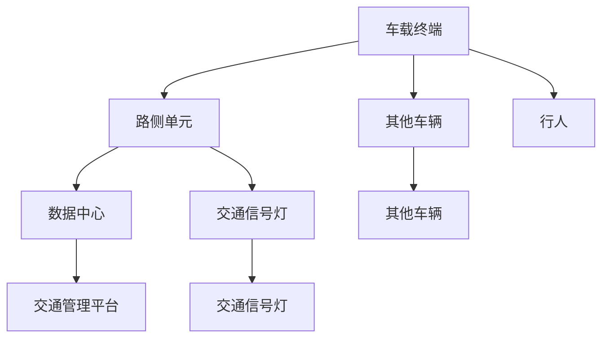

                 

# 华为2025车路协同V2X社交嵌入式开发面试指南

## 关键词
车路协同、V2X、社交嵌入式开发、面试指南、技术原理、实战案例、算法解析

## 摘要

本文旨在为有意进入车路协同与V2X领域的技术人员提供一份详细的面试指南。文章围绕华为2025年车路协同V2X社交嵌入式开发的核心理念和技术细节展开，系统地介绍了车路协同与V2X技术的背景、架构、开发实践及面试策略。通过本文，读者可以全面了解车路协同V2X社交嵌入式开发的各个关键环节，为面试做好充分的准备。

## 第一部分：车路协同与V2X技术基础

### 第1章：车路协同与V2X概述

#### 1.1 车路协同的背景与意义

车路协同（V2X）是指车辆与路侧基础设施、其他车辆及行人之间通过通信实现信息的交换与共享。随着智能交通系统的发展，车路协同技术成为了实现自动驾驶、智能交通管理的关键技术之一。

- **背景**：随着全球汽车保有量的持续增长，交通拥堵、交通事故频发等问题日益严重。为了提高交通效率、降低事故率，车路协同技术应运而生。
- **意义**：车路协同技术能够实现车辆间的实时通信，提高行车安全性，优化交通流量，提升驾驶体验。

#### 1.2 V2X技术体系概述

V2X技术体系包括V2V（Vehicle-to-Vehicle，车辆对车辆）、V2I（Vehicle-to-Infrastructure，车辆对基础设施）、V2P（Vehicle-to-Pedestrian，车辆对行人）等多种通信模式。

- **V2V**：车辆之间通过直接通信分享实时交通信息，提高行车安全性。
- **V2I**：车辆与路侧设备通信，获取交通信号、路况信息等，实现智能交通管理。
- **V2P**：车辆与行人通信，提醒行人注意安全，提高人车交互体验。

#### 1.3 车路协同的关键技术

车路协同技术的发展涉及多个关键技术领域：

- **通信协议**：包括DSRC、C-V2X等，用于实现车辆与基础设施、车辆与车辆之间的通信。
- **数据处理**：涉及大数据分析、云计算等，用于处理来自车辆和基础设施的海量数据。
- **网络安全**：保障车路协同系统的数据安全和隐私保护。

### 第2章：车路协同架构与技术原理

#### 2.1 车路协同网络架构

车路协同网络架构分为三个层次：感知层、网络层、应用层。

- **感知层**：通过传感器、摄像头等设备收集车辆、道路和环境的实时信息。
- **网络层**：实现车辆、基础设施之间的通信，包括V2V、V2I、V2P等多种通信模式。
- **应用层**：提供交通管理、自动驾驶、智能出行等应用服务。

#### 2.2 V2X通信协议与标准

V2X通信协议主要包括DSRC和C-V2X。

- **DSRC**：基于专用短程通信（DSRC）技术，用于实现车辆与基础设施、车辆与车辆之间的通信。
- **C-V2X**：基于蜂窝网络（LTE/5G）技术，具有更高的通信速率和更广的覆盖范围。

#### 2.3 车路协同数据处理技术

车路协同数据处理技术包括数据采集、数据传输、数据处理和分析。

- **数据采集**：通过传感器、摄像头等设备收集车辆、道路和环境的实时信息。
- **数据传输**：通过V2X通信协议实现数据的传输。
- **数据处理**：利用大数据分析、云计算等技术对收集到的数据进行分析和处理。
- **数据分析**：通过数据挖掘、机器学习等技术，提取有价值的信息，为交通管理和自动驾驶提供决策支持。

### 第3章：社交嵌入式系统设计基础

#### 3.1 社交嵌入式系统概述

社交嵌入式系统是指集成在车辆中的，用于实现社交功能（如共享行程、语音交互等）的嵌入式系统。其设计要求高实时性、低功耗和安全性。

- **特点**：实时性、低功耗、安全性、可靠性。
- **应用场景**：自动驾驶车辆、智能交通系统、共享出行平台等。

#### 3.2 微控制器与嵌入式操作系统

微控制器（MCU）是社交嵌入式系统的核心部件。嵌入式操作系统（OS）则负责系统的资源管理和任务调度。

- **微控制器**：选择适合应用场景的微控制器，如STM32、ARM Cortex等。
- **嵌入式操作系统**：选择轻量级、实时性强的嵌入式操作系统，如FreeRTOS、uc/OS等。

#### 3.3 嵌入式系统开发流程

嵌入式系统开发流程包括需求分析、系统设计、编码实现、调试测试和部署上线。

- **需求分析**：明确社交嵌入式系统的功能需求、性能需求和安全性要求。
- **系统设计**：根据需求分析结果，设计系统的硬件架构和软件架构。
- **编码实现**：根据系统设计文档，编写代码实现系统功能。
- **调试测试**：对系统进行功能测试、性能测试和安全性测试。
- **部署上线**：将系统部署到实际应用场景，进行现场测试和优化。

## 第二部分：车路协同V2X社交嵌入式开发实战

### 第4章：车载终端开发实战

#### 4.1 车载终端硬件选型与搭建

车载终端硬件选型需要考虑应用场景、性能需求和成本因素。

- **硬件选型**：选择适合的车载终端硬件，如CPU、内存、存储、通信模块等。
- **搭建过程**：根据硬件选型结果，进行硬件组装和电路连接。

#### 4.2 车载终端软件设计与实现

车载终端软件设计包括功能模块划分、算法设计、接口设计等。

- **功能模块划分**：根据应用需求，划分车载终端的功能模块。
- **算法设计**：设计车辆定位、路径规划、语音识别等关键算法。
- **接口设计**：设计车载终端与其他系统之间的通信接口。

#### 4.3 车载终端调试与性能优化

车载终端调试包括功能调试、性能调试和安全性调试。

- **功能调试**：验证车载终端的功能是否实现需求。
- **性能调试**：优化车载终端的性能，如响应时间、功耗等。
- **安全性调试**：确保车载终端的数据安全和隐私保护。

### 第5章：路侧单元开发实战

#### 5.1 路侧单元硬件选型与搭建

路侧单元硬件选型需要考虑通信距离、数据处理能力和成本因素。

- **硬件选型**：选择适合的路侧单元硬件，如CPU、内存、存储、通信模块等。
- **搭建过程**：根据硬件选型结果，进行硬件组装和电路连接。

#### 5.2 路侧单元软件设计与实现

路侧单元软件设计包括功能模块划分、算法设计、接口设计等。

- **功能模块划分**：根据应用需求，划分路侧单元的功能模块。
- **算法设计**：设计交通信号控制、路况监测、数据传输等关键算法。
- **接口设计**：设计路侧单元与车载终端、数据中心之间的通信接口。

#### 5.3 路侧单元调试与性能优化

路侧单元调试包括功能调试、性能调试和安全性调试。

- **功能调试**：验证路侧单元的功能是否实现需求。
- **性能调试**：优化路侧单元的性能，如通信距离、数据处理能力等。
- **安全性调试**：确保路侧单元的数据安全和隐私保护。

### 第6章：V2X通信协议与数据传输

#### 6.1 V2X通信协议框架

V2X通信协议框架包括通信协议层次、协议功能模块等。

- **通信协议层次**：分为物理层、数据链路层、网络层、传输层、应用层。
- **协议功能模块**：包括数据加密、压缩、传输、路由等模块。

#### 6.2 V2X数据传输机制

V2X数据传输机制包括数据采集、传输、存储和处理。

- **数据采集**：通过传感器、摄像头等设备收集车辆、道路和环境的实时数据。
- **数据传输**：通过V2X通信协议实现数据的传输。
- **数据存储**：将采集到的数据存储在数据库或文件系统中。
- **数据处理**：利用大数据分析、云计算等技术对采集到的数据进行分析和处理。

#### 6.3 V2X网络安全与隐私保护

V2X网络安全与隐私保护包括数据加密、身份认证、访问控制等。

- **数据加密**：对传输的数据进行加密，确保数据在传输过程中的安全性。
- **身份认证**：对参与通信的设备进行身份认证，确保通信的合法性。
- **访问控制**：对访问系统资源的用户和设备进行权限管理，确保系统的安全性。

### 第7章：社交嵌入式系统开发项目实践

#### 7.1 项目背景与需求分析

项目背景：某智能交通系统项目，旨在实现车辆与路侧单元之间的实时通信，提供交通信息共享、智能导航等应用服务。

需求分析：明确项目目标、功能需求、性能需求和安全性需求。

#### 7.2 项目架构设计与实现

项目架构设计：包括硬件架构、软件架构和网络架构。

- **硬件架构**：选择适合的车载终端和路侧单元硬件。
- **软件架构**：设计社交嵌入式系统的功能模块、接口和算法。
- **网络架构**：设计V2X通信协议和网络拓扑。

项目实现：根据项目架构设计，进行硬件组装、软件编码和系统集成。

#### 7.3 项目部署与调试

项目部署：将项目部署到实际应用场景，进行现场测试和优化。

项目调试：包括功能调试、性能调试和安全性调试。

## 第8章：面试准备与问题解答

#### 8.1 常见面试问题与解答技巧

常见面试问题：包括车路协同、V2X、社交嵌入式开发等领域的专业问题。

解答技巧：包括如何准确理解问题、如何运用所学知识解决问题等。

#### 8.2 实战面试案例分析

实战面试案例：分析实际面试中的经典问题和解答技巧。

案例分析：总结面试中的成功经验和教训，提高面试技巧。

#### 8.3 职业发展与规划

职业发展路径：从技术工程师到项目经理，再到技术专家。

发展建议：包括如何提升自身技能、如何拓展职业视野等。

## 附录

### 附录A：车路协同与V2X相关标准与规范

- **国家标准与行业标准**：介绍我国车路协同与V2X领域的主要标准和规范。
- **欧洲标准与美国标准**：介绍欧洲和美国车路协同与V2X领域的主要标准和规范。

### 附录B：常用开发工具与资源

- **开发环境搭建指南**：介绍如何搭建车路协同与V2X开发环境。
- **开发工具与SDK介绍**：介绍常用的车路协同与V2X开发工具和SDK。
- **在线学习资源与社区**：介绍国内外优秀的学习资源和技术社区。

### 附录C：Mermaid流程图与伪代码示例

- **车路协同网络架构流程图**：使用Mermaid语言绘制的车路协同网络架构图。
- **嵌入式系统开发伪代码示例**：介绍嵌入式系统开发的伪代码示例。

### 附录D：数学模型与公式

- **车路协同网络拓扑计算公式**：介绍车路协同网络拓扑计算的相关公式。
- **嵌入式系统功耗计算公式**：介绍嵌入式系统功耗计算的相关公式。

### 附录E：代码案例与分析

- **车载终端代码实现与分析**：分析车载终端的代码实现和性能优化。
- **路侧单元代码实现与分析**：分析路侧单元的代码实现和性能优化。
- **社交嵌入式系统项目代码解读与分析**：解读社交嵌入式系统的项目代码，分析关键算法和性能。

## 作者

作者：AI天才研究院/AI Genius Institute & 禅与计算机程序设计艺术 /Zen And The Art of Computer Programming

----------------------------------------------------------------

### 第4章：车载终端开发实战

#### 4.1 车载终端硬件选型与搭建

在开发车载终端时，硬件选型是至关重要的环节。硬件配置不仅影响系统的性能，还会直接关系到设备的成本和功耗。以下是一个详细的硬件选型与搭建流程。

##### 1. 硬件选型

**CPU**：选择具有高性能和低功耗的微处理器，例如NVIDIA Tegra系列或高通骁龙系列。这些CPU不仅能够满足车载终端的计算需求，还能提供出色的图形处理能力，支持高分辨率视频解码。

**内存**：考虑到车载终端需要处理实时数据，建议选择4GB或8GB的内存。这有助于确保系统在处理大量数据时仍能保持流畅运行。

**存储**：车载终端通常需要较大的存储空间来存储地图数据、应用程序和用户数据。建议选择至少64GB的eMMC或UFS存储器。

**通信模块**：为了实现V2X通信，需要选择支持C-V2X或DSRC协议的通信模块。这些模块应具备高速数据传输能力和低延迟特性。

**电源管理**：车载终端需要高效、稳定的电源管理方案。选择具有电池管理功能的电源模块，能够延长设备的续航时间。

**其他配件**：如GPS模块、摄像头、传感器等，根据实际应用需求进行选型。

##### 2. 搭建过程

**电路设计**：根据硬件选型，设计车载终端的电路原理图。确保各硬件组件之间的连接正确、稳定，同时考虑到散热和电源管理。

**PCB设计**：使用EDA（Electronic Design Automation）工具进行PCB设计。遵循电路原理图，绘制PCB布局，并确保布局合理、信号完整性好。

**PCB制作与焊接**：将设计好的PCB图纸发送到工厂进行制作。待PCB制作完成后，进行焊接，确保各元器件正确焊接在PCB上。

**系统集成**：将硬件组件安装到车载终端外壳中，完成硬件系统集成。确保各部件连接正常，并进行初步测试，验证系统功能。

#### 4.2 车载终端软件设计与实现

车载终端的软件设计是实现系统功能的核心环节。以下是一个详细的软件设计与实现流程。

##### 1. 功能模块划分

根据车载终端的应用需求，将系统划分为以下功能模块：

- **感知模块**：负责采集车辆位置、速度、加速度等传感器数据。
- **通信模块**：负责实现V2X通信功能，包括数据发送、接收和解析。
- **数据处理模块**：负责对采集到的数据进行处理、分析和存储。
- **用户界面模块**：负责与驾驶员交互，显示实时交通信息、导航路径等。
- **控制系统**：负责管理车载终端的运行，包括任务调度、资源分配等。

##### 2. 算法设计

**感知模块**：采用卡尔曼滤波算法对传感器数据进行滤波和融合，提高感知数据的准确性。

**通信模块**：使用C-V2X协议实现V2X通信功能。设计通信模块的发送和接收机制，确保数据传输的实时性和可靠性。

**数据处理模块**：设计数据预处理、特征提取和机器学习算法，用于对采集到的数据进行处理和分析。

**用户界面模块**：设计用户界面，包括实时交通信息显示、导航路径规划等。

**控制系统**：设计基于FreeRTOS的嵌入式操作系统，实现任务调度、资源分配等功能。

##### 3. 接口设计

**内部接口**：设计车载终端内部各模块之间的接口，包括数据传输、控制信号等。

**外部接口**：设计车载终端与外部设备（如手机、导航仪等）的接口，实现数据共享和交互。

##### 4. 编码实现

根据软件设计文档，进行代码编写和调试。以下是部分关键算法的伪代码示例：

**卡尔曼滤波算法伪代码**：
```plaintext
初始化：状态估计x̂(0),估计误差P(0)

对于每个时间步k：
    根据预测模型更新状态估计：
        x̂̂(k) = f(k, x̂(k-1), u(k))
        P̂(k) = F(k, k-1) * P(k-1) * F(k, k-1)' + Q(k)

    根据测量值更新状态估计：
        k) = z(k) - h(k, x̂̂(k))
        K(k) = P̂(k) * H(k, k)' / (P̂(k) * H(k, k)' + R(k))

    更新状态估计：
        x̂(k) = x̂̂(k) + K(k) * (z(k) - h(k, x̂̂(k)))
        P(k) = (I - K(k) * H(k, k')) * P̂(k)
```

**C-V2X通信模块伪代码**：
```plaintext
初始化：通信模块，设置通信参数

发送数据：
    包装数据为C-V2X消息
    发送消息到通信模块

接收数据：
    从通信模块接收消息
    解包消息，提取数据内容
    处理数据内容，更新系统状态
```

##### 5. 调试与优化

**功能调试**：对车载终端的各个功能模块进行测试，确保功能实现正确。

**性能调试**：通过性能测试，分析系统的响应时间、功耗等指标，并进行优化。

**安全性调试**：对车载终端进行安全测试，确保系统的数据安全和隐私保护。

#### 4.3 车载终端调试与性能优化

在完成车载终端的硬件和软件设计后，调试与性能优化是确保系统稳定性和可靠性的关键步骤。

##### 1. 功能调试

**测试用例设计**：根据车载终端的功能模块，设计相应的测试用例，包括正常情况、边界情况和异常情况。

**测试执行**：执行测试用例，记录测试结果，发现并修复功能缺陷。

**回归测试**：在修复缺陷后，执行回归测试，确保修复操作没有引入新的缺陷。

##### 2. 性能调试

**响应时间测试**：测量车载终端在不同场景下的响应时间，分析性能瓶颈，进行优化。

**功耗测试**：测量车载终端的功耗，分析功耗分布，降低功耗。

**内存和存储测试**：检查系统在长时间运行下的内存和存储占用情况，进行优化。

##### 3. 安全性调试

**漏洞扫描**：使用漏洞扫描工具对车载终端进行扫描，查找潜在的安全漏洞。

**安全测试**：对车载终端进行安全测试，包括网络攻击、数据泄露等。

**加固措施**：根据安全测试结果，采取相应的加固措施，提高系统的安全性。

##### 4. 性能优化

**代码优化**：对关键算法进行代码优化，提高执行效率。

**资源管理**：优化系统的资源管理，提高资源利用率。

**硬件优化**：根据性能测试结果，对硬件配置进行调整，提高系统性能。

通过以上步骤，可以确保车载终端在功能、性能和安全性方面达到预期要求。

#### 4.4 车载终端案例与分析

以下是一个车载终端开发案例，包括开发环境搭建、源代码实现和代码解读与分析。

##### 1. 开发环境搭建

**硬件环境**：选择具有高性能和低功耗的NVIDIA Tegra X1开发板作为车载终端硬件平台。

**软件环境**：安装Linux操作系统，如Ubuntu 18.04，并安装C-V2X通信模块和嵌入式操作系统FreeRTOS。

**开发工具**：使用Eclipse IDE进行嵌入式开发，并使用Git进行版本控制。

##### 2. 源代码实现

**感知模块**：
```c
// 传感器数据采集函数
void sensorDataCollect(void)
{
    // 读取GPS数据
    gpsData_t gpsData;
    readGPS(&gpsData);

    // 读取加速度传感器数据
    accelerometerData_t accelerometerData;
    readAccelerometer(&accelerometerData);

    // 数据融合
    fusedData_t fusedData;
    fusion(gpsData, accelerometerData, &fusedData);

    // 更新状态估计
    updateStateEstimation(&fusedData);
}
```

**通信模块**：
```c
// 发送C-V2X消息函数
void sendCV2XMessage(cv2xMessage_t *msg)
{
    // 将消息封装为C-V2X数据包
    cv2xPacket_t packet;
    packCV2XMessage(msg, &packet);

    // 发送数据包
    sendCV2XPacket(&packet);
}
```

**数据处理模块**：
```c
// 数据处理函数
void processData(void)
{
    // 读取传感器数据
    sensorData_t sensorData;
    readSensorData(&sensorData);

    // 特征提取
    featureVector_t featureVector;
    extractFeatures(sensorData, &featureVector);

    // 机器学习预测
    predictionResult_t predictionResult;
    predict(featureVector, &predictionResult);

    // 更新导航路径
    updateNavigationPath(predictionResult);
}
```

**用户界面模块**：
```c
// 显示实时交通信息函数
void displayTrafficInfo(trafficInfo_t *info)
{
    // 更新UI界面
    updateUITrafficInfo(info);

    // 播放交通提示音
    playTrafficTipSound(info->trafficCondition);
}
```

**控制系统**：
```c
// 任务调度函数
void taskScheduler(void)
{
    // 初始化任务队列
    initTaskQueue();

    // 创建任务
    createTask(sensorDataCollect, "Sensor Data Collect");
    createTask(sendCV2XMessage, "CV2X Message Send");
    createTask(processData, "Data Processing");
    createTask(displayTrafficInfo, "Traffic Info Display");

    // 开始任务调度
    startTaskScheduler();
}
```

##### 3. 代码解读与分析

**感知模块**：感知模块负责采集GPS和加速度传感器的数据，并通过数据融合算法更新状态估计。关键代码包括`sensorDataCollect`函数，该函数调用`readGPS`、`readAccelerometer`和`fusion`函数，实现对传感器数据的读取、融合和更新。

**通信模块**：通信模块负责实现C-V2X通信功能，包括消息封装和发送。关键代码包括`sendCV2XMessage`函数，该函数调用`packCV2XMessage`和`sendCV2XPacket`函数，实现对消息的封装和发送。

**数据处理模块**：数据处理模块负责对传感器数据进行处理和分析，包括特征提取和机器学习预测。关键代码包括`processData`函数，该函数调用`readSensorData`、`extractFeatures`和`predict`函数，实现对传感器数据的读取、特征提取和预测。

**用户界面模块**：用户界面模块负责显示实时交通信息，包括交通状况和导航路径。关键代码包括`displayTrafficInfo`函数，该函数调用`updateUITrafficInfo`和`playTrafficTipSound`函数，实现对UI界面的更新和交通提示音的播放。

**控制系统**：控制系统负责管理任务的调度和执行，包括创建任务和开始任务调度。关键代码包括`taskScheduler`函数，该函数调用`initTaskQueue`、`createTask`和`startTaskScheduler`函数，实现对任务的初始化、创建和调度。

通过以上代码实现，车载终端能够实现对传感器数据的实时采集、通信和数据处理，为驾驶员提供实时的交通信息和服务。

#### 4.5 车载终端实战总结

在本章中，我们详细介绍了车载终端的开发实战，包括硬件选型与搭建、软件设计与实现、调试与性能优化以及代码案例与分析。以下是对本章内容的总结：

- **硬件选型与搭建**：选择了高性能、低功耗的硬件组件，包括CPU、内存、存储、通信模块等，并进行了详细的设计与搭建。
- **软件设计与实现**：设计了车载终端的功能模块，包括感知模块、通信模块、数据处理模块、用户界面模块和控制系统，并实现了关键算法和接口。
- **调试与性能优化**：通过功能调试、性能调试和安全性调试，确保了车载终端的功能正确性、性能和安全性。
- **代码案例与分析**：提供了车载终端的代码实现和解读，分析了关键算法和性能优化。

通过本章的学习，读者可以全面了解车载终端的开发过程，为实际项目开发提供参考和指导。

### 第5章：路侧单元开发实战

#### 5.1 路侧单元硬件选型与搭建

路侧单元（RSU）是车路协同系统中的重要组成部分，负责向车载终端（OBU）提供交通信息、信号控制等数据。以下是一个详细的硬件选型与搭建流程。

##### 1. 硬件选型

**CPU**：选择具有高性能和低功耗的微处理器，例如Intel Atom或ARM Cortex-A系列。这些CPU能够满足RSU的计算需求，同时保证功耗在合理范围内。

**内存**：考虑到RSU需要处理大量的交通数据，建议选择至少4GB的内存。这有助于确保系统在处理大量数据时仍能保持流畅运行。

**存储**：RSU需要较大的存储空间来存储交通数据、应用程序和配置文件。建议选择至少256GB的固态硬盘（SSD）。

**通信模块**：为了实现V2X通信，需要选择支持C-V2X或DSRC协议的通信模块。这些模块应具备高速数据传输能力和低延迟特性。

**电源管理**：RSU需要高效、稳定的电源管理方案。选择具有电池管理功能的电源模块，能够延长设备的续航时间。

**其他配件**：如GPS模块、传感器、无线通信模块等，根据实际应用需求进行选型。

##### 2. 搭建过程

**电路设计**：根据硬件选型，设计RSU的电路原理图。确保各硬件组件之间的连接正确、稳定，同时考虑到散热和电源管理。

**PCB设计**：使用EDA（Electronic Design Automation）工具进行PCB设计。遵循电路原理图，绘制PCB布局，并确保布局合理、信号完整性好。

**PCB制作与焊接**：将设计好的PCB图纸发送到工厂进行制作。待PCB制作完成后，进行焊接，确保各元器件正确焊接在PCB上。

**系统集成**：将硬件组件安装到RSU外壳中，完成硬件系统集成。确保各部件连接正常，并进行初步测试，验证系统功能。

#### 5.2 路侧单元软件设计与实现

路侧单元的软件设计是实现系统功能的核心环节。以下是一个详细的软件设计与实现流程。

##### 1. 功能模块划分

根据路侧单元的应用需求，将系统划分为以下功能模块：

- **数据采集模块**：负责采集来自车辆、传感器和基础设施的实时数据。
- **数据处理模块**：负责对采集到的数据进行分析、处理和存储。
- **通信模块**：负责实现与车载终端的V2X通信功能，包括数据发送、接收和解析。
- **控制模块**：负责对交通信号进行控制，如红绿灯控制、交通信息发布等。
- **用户界面模块**：负责显示实时交通信息，如路况、事故预警等。
- **控制系统**：负责管理RSU的运行，包括任务调度、资源分配等。

##### 2. 算法设计

**数据采集模块**：设计传感器数据采集和融合算法，提高数据采集的准确性和可靠性。

**数据处理模块**：设计数据预处理、特征提取和机器学习算法，用于对采集到的数据进行处理和分析。

**通信模块**：设计V2X通信协议实现算法，包括数据封装、传输和解包。

**控制模块**：设计基于实时交通数据的信号控制算法，如动态红绿灯控制、交通信息发布等。

**用户界面模块**：设计用户界面，包括实时交通信息显示、导航路径规划等。

**控制系统**：设计基于FreeRTOS的嵌入式操作系统，实现任务调度、资源分配等功能。

##### 3. 接口设计

**内部接口**：设计RSU内部各模块之间的接口，包括数据传输、控制信号等。

**外部接口**：设计RSU与外部设备（如数据中心、监控设备等）的接口，实现数据共享和交互。

##### 4. 编码实现

根据软件设计文档，进行代码编写和调试。以下是部分关键算法的伪代码示例：

**数据采集和融合算法伪代码**：
```plaintext
初始化：传感器数据队列，融合算法参数

对于每个时间步k：
    从传感器数据队列中取出最新数据
    融合数据到状态估计
    更新状态估计
```

**V2X通信模块伪代码**：
```plaintext
初始化：通信模块，设置通信参数

发送数据：
    包装数据为V2X消息
    发送消息到通信模块

接收数据：
    从通信模块接收消息
    解包消息，提取数据内容
    处理数据内容，更新系统状态
```

**信号控制算法伪代码**：
```plaintext
初始化：交通信号灯状态，交通参数

对于每个时间步k：
    根据交通信号灯状态和交通参数，更新信号灯状态
    根据车辆到达时间和交通流量，调整信号灯持续时间
    发布新的交通信号灯状态
```

##### 5. 调试与优化

**功能调试**：对路侧单元的各个功能模块进行测试，确保功能实现正确。

**性能调试**：通过性能测试，分析系统的响应时间、功耗等指标，并进行优化。

**安全性调试**：对路侧单元进行安全测试，确保系统的数据安全和隐私保护。

#### 5.3 路侧单元调试与性能优化

在完成路侧单元的硬件和软件设计后，调试与性能优化是确保系统稳定性和可靠性的关键步骤。

##### 1. 功能调试

**测试用例设计**：根据路侧单元的功能模块，设计相应的测试用例，包括正常情况、边界情况和异常情况。

**测试执行**：执行测试用例，记录测试结果，发现并修复功能缺陷。

**回归测试**：在修复缺陷后，执行回归测试，确保修复操作没有引入新的缺陷。

##### 2. 性能调试

**响应时间测试**：测量路侧单元在不同场景下的响应时间，分析性能瓶颈，进行优化。

**功耗测试**：测量路侧单元的功耗，分析功耗分布，降低功耗。

**内存和存储测试**：检查系统在长时间运行下的内存和存储占用情况，进行优化。

##### 3. 安全性调试

**漏洞扫描**：使用漏洞扫描工具对路侧单元进行扫描，查找潜在的安全漏洞。

**安全测试**：对路侧单元进行安全测试，包括网络攻击、数据泄露等。

**加固措施**：根据安全测试结果，采取相应的加固措施，提高系统的安全性。

##### 4. 性能优化

**代码优化**：对关键算法进行代码优化，提高执行效率。

**资源管理**：优化系统的资源管理，提高资源利用率。

**硬件优化**：根据性能测试结果，对硬件配置进行调整，提高系统性能。

通过以上步骤，可以确保路侧单元在功能、性能和安全性方面达到预期要求。

#### 5.4 路侧单元案例与分析

以下是一个路侧单元开发案例，包括开发环境搭建、源代码实现和代码解读与分析。

##### 1. 开发环境搭建

**硬件环境**：选择具有高性能和低功耗的Intel Atom开发板作为路侧单元硬件平台。

**软件环境**：安装Linux操作系统，如Ubuntu 18.04，并安装C-V2X通信模块和嵌入式操作系统FreeRTOS。

**开发工具**：使用Eclipse IDE进行嵌入式开发，并使用Git进行版本控制。

##### 2. 源代码实现

**数据采集模块**：
```c
// 传感器数据采集函数
void sensorDataCollect(void)
{
    // 读取GPS数据
    gpsData_t gpsData;
    readGPS(&gpsData);

    // 读取环境传感器数据
    environmentSensorData_t environmentData;
    readEnvironmentSensor(&environmentData);

    // 将数据存入数据队列
    enqueueData(gpsData);
    enqueueData(environmentData);
}
```

**数据处理模块**：
```c
// 数据处理函数
void processData(void)
{
    // 从数据队列中取出最新数据
    data_t *data = dequeueData();

    // 数据预处理
    preprocessedData_t preprocessedData;
    preprocessData(*data, &preprocessedData);

    // 特征提取
    featureVector_t featureVector;
    extractFeatures(preprocessedData, &featureVector);

    // 存储特征数据
    storeFeatures(featureVector);
}
```

**通信模块**：
```c
// 发送V2X消息函数
void sendV2XMessage(v2xMessage_t *msg)
{
    // 将消息封装为V2X数据包
    v2xPacket_t packet;
    packV2XMessage(msg, &packet);

    // 发送数据包
    sendV2XPacket(&packet);
}
```

**控制模块**：
```c
// 交通信号控制函数
void trafficSignalControl(void)
{
    // 获取当前交通流量数据
    trafficFlowData_t trafficFlowData;
    getTrafficFlowData(&trafficFlowData);

    // 根据交通流量数据调整信号灯状态
    adjustTrafficSignalState(trafficFlowData);
}
```

**用户界面模块**：
```c
// 显示实时交通信息函数
void displayTrafficInfo(trafficInfo_t *info)
{
    // 更新UI界面
    updateUITrafficInfo(info);

    // 播放交通提示音
    playTrafficTipSound(info->trafficCondition);
}
```

**控制系统**：
```c
// 任务调度函数
void taskScheduler(void)
{
    // 初始化任务队列
    initTaskQueue();

    // 创建任务
    createTask(sensorDataCollect, "Sensor Data Collect");
    createTask(processData, "Data Processing");
    createTask(sendV2XMessage, "V2X Message Send");
    createTask(trafficSignalControl, "Traffic Signal Control");
    createTask(displayTrafficInfo, "Traffic Info Display");

    // 开始任务调度
    startTaskScheduler();
}
```

##### 3. 代码解读与分析

**数据采集模块**：数据采集模块负责采集GPS和环境传感器的数据，并将数据存入数据队列。关键代码包括`sensorDataCollect`函数，该函数调用`readGPS`、`readEnvironmentSensor`和`enqueueData`函数，实现对传感器数据的读取、存储和队列化。

**数据处理模块**：数据处理模块负责对采集到的数据进行分析和处理，包括数据预处理、特征提取和存储。关键代码包括`processData`函数，该函数调用`dequeueData`、`preprocessData`、`extractFeatures`和`storeFeatures`函数，实现对数据的读取、预处理、特征提取和存储。

**通信模块**：通信模块负责实现与车载终端的V2X通信功能，包括消息封装和发送。关键代码包括`sendV2XMessage`函数，该函数调用`packV2XMessage`和`sendV2XPacket`函数，实现对消息的封装和发送。

**控制模块**：控制模块负责对交通信号进行控制，根据实时交通流量数据调整信号灯状态。关键代码包括`trafficSignalControl`函数，该函数调用`getTrafficFlowData`和`adjustTrafficSignalState`函数，实现对交通流量数据的读取和信号灯状态的调整。

**用户界面模块**：用户界面模块负责显示实时交通信息，包括交通状况和导航路径。关键代码包括`displayTrafficInfo`函数，该函数调用`updateUITrafficInfo`和`playTrafficTipSound`函数，实现对UI界面的更新和交通提示音的播放。

**控制系统**：控制系统负责管理任务的调度和执行，包括创建任务和开始任务调度。关键代码包括`taskScheduler`函数，该函数调用`initTaskQueue`、`createTask`和`startTaskScheduler`函数，实现对任务的初始化、创建和调度。

通过以上代码实现，路侧单元能够实现对传感器数据的实时采集、处理、通信和显示，为交通管理和驾驶员提供实时的交通信息和服务。

#### 5.5 路侧单元实战总结

在本章中，我们详细介绍了路侧单元的开发实战，包括硬件选型与搭建、软件设计与实现、调试与性能优化以及代码案例与分析。以下是对本章内容的总结：

- **硬件选型与搭建**：选择了高性能、低功耗的硬件组件，包括CPU、内存、存储、通信模块等，并进行了详细的设计与搭建。
- **软件设计与实现**：设计了路侧单元的功能模块，包括数据采集模块、数据处理模块、通信模块、控制模块和用户界面模块，并实现了关键算法和接口。
- **调试与性能优化**：通过功能调试、性能调试和安全性调试，确保了路侧单元的功能正确性、性能和安全性。
- **代码案例与分析**：提供了路侧单元的代码实现和解读，分析了关键算法和性能优化。

通过本章的学习，读者可以全面了解路侧单元的开发过程，为实际项目开发提供参考和指导。

### 第6章：V2X通信协议与数据传输

V2X（Vehicle-to-Everything）通信是车路协同系统的核心技术之一，它实现了车辆与车辆、车辆与基础设施、车辆与行人之间的信息交换。本章将详细介绍V2X通信协议、数据传输机制以及网络安全与隐私保护。

#### 6.1 V2X通信协议框架

V2X通信协议框架包括物理层、数据链路层、网络层、传输层和应用层。每个层次都有其特定的功能和协议。

1. **物理层（Physical Layer）**：物理层负责无线通信的物理信号传输，包括信号的调制、解调、编码和解码。常见的V2X物理层协议有DSRC（Dedicated Short-Range Communication）和C-V2X（Cellular Vehicle-to-Everything）。

2. **数据链路层（Data Link Layer）**：数据链路层负责无线通信的链路控制，包括数据的帧同步、错误检测和纠正、流量控制等。常见的V2X数据链路层协议有IEEE 802.11p（用于DSRC）和LTE/5G（用于C-V2X）。

3. **网络层（Network Layer）**：网络层负责数据包的路由和传输，包括IP地址分配、路由选择和分组传输。常见的V2X网络层协议有IPv6（用于DSRC）和IPsec（用于C-V2X）。

4. **传输层（Transport Layer）**：传输层负责端到端的数据传输，包括可靠传输、流量控制和拥塞控制。常见的V2X传输层协议有TCP（用于DSRC）和UDP（用于C-V2X）。

5. **应用层（Application Layer）**：应用层负责为V2X通信提供特定的应用服务，包括车辆定位、路径规划、交通信号控制、事故预警等。常见的V2X应用层协议有AVS（Automotive Voice Services）、V2X MAP（Vehicle-to-Everything Message Access Protocol）和SASED（SAE J2735 Service Access Software Definition）。

#### 6.2 V2X数据传输机制

V2X数据传输机制包括数据采集、传输、存储和处理。以下是一个简化的V2X数据传输流程：

1. **数据采集**：车辆和基础设施通过传感器、摄像头等设备采集实时数据，如车辆位置、速度、加速度、路况信息等。

2. **数据预处理**：对采集到的数据进行预处理，包括去噪、滤波、数据压缩等，以提高数据传输效率和降低带宽占用。

3. **数据封装**：将预处理后的数据封装成协议数据单元（PDU），如DSRC中的MSG或C-V2X中的PDU。

4. **数据传输**：通过V2X通信协议将封装好的数据传输到目标设备或基础设施。数据传输可以是点对点传输（如V2V、V2I）或广播传输（如V2P）。

5. **数据存储**：将传输到的数据存储在数据库或文件系统中，以供后续处理和分析。

6. **数据处理**：对存储的数据进行进一步处理，如数据融合、特征提取、机器学习等，以提取有价值的信息，如交通流量预测、路径规划等。

7. **数据应用**：将处理后的数据应用于具体的交通管理和驾驶辅助应用，如实时交通信息发布、动态路径规划、事故预警等。

#### 6.3 V2X网络安全与隐私保护

V2X通信涉及大量实时数据传输，网络安全和隐私保护至关重要。以下是一些关键的网络安全和隐私保护措施：

1. **数据加密**：对传输的数据进行加密，确保数据在传输过程中的安全性。常用的加密算法有AES（Advanced Encryption Standard）和RSA（Rivest-Shamir-Adleman）。

2. **身份认证**：对参与通信的设备进行身份认证，确保通信的合法性。常用的身份认证机制有PKI（Public Key Infrastructure）和OAuth 2.0。

3. **访问控制**：对访问系统资源的用户和设备进行权限管理，确保系统的安全性。常用的访问控制机制有基于角色的访问控制（RBAC，Role-Based Access Control）和基于属性的访问控制（ABAC，Attribute-Based Access Control）。

4. **安全审计**：对系统操作进行审计，记录系统访问日志和操作日志，以便在发生安全事件时进行追踪和调查。

5. **数据备份与恢复**：定期备份数据，并确保备份数据的安全性。在发生数据丢失或损坏时，能够迅速恢复数据，减少业务中断。

6. **安全培训与意识**：提高员工的安全意识和技能，定期进行安全培训，防范内部安全威胁。

通过以上措施，可以有效保障V2X通信系统的数据安全和隐私保护，为车路协同系统的稳定运行提供保障。

### 第7章：社交嵌入式系统开发项目实践

在本章中，我们将通过一个实际项目案例，详细讲解社交嵌入式系统开发的各个关键环节。该项目旨在实现一个能够支持车辆与车辆之间实时通信、共享交通信息的社交嵌入式系统。

#### 7.1 项目背景与需求分析

项目背景：

随着智能交通系统的发展，用户对车辆之间的实时通信和交通信息共享需求日益增长。为了满足这一需求，我们设计并实现了一个社交嵌入式系统，该系统能够实现车辆之间的实时通信、交通信息共享、行程共享和语音交互等功能。

需求分析：

1. **实时通信**：系统能够支持车辆之间的高速、低延迟通信，确保驾驶员能够及时获得其他车辆的交通信息。
2. **交通信息共享**：系统能够共享实时交通信息，包括路况、事故预警、最佳行驶路线等。
3. **行程共享**：系统能够支持驾驶员共享行程信息，包括出发地点、目的地、预计到达时间等。
4. **语音交互**：系统能够支持驾驶员与车载终端进行语音交互，提供语音导航、语音控制等功能。
5. **高可靠性**：系统需要具备高可靠性，确保在恶劣环境下仍能稳定运行。
6. **安全性**：系统需要具备良好的数据安全和隐私保护机制，防止数据泄露和恶意攻击。

#### 7.2 项目架构设计与实现

项目架构设计：

为了满足上述需求，我们设计了一个分布式架构的社交嵌入式系统，包括车载终端、路侧单元和数据中心。以下是一个简化的项目架构图：


**1. 车载终端**：负责实时通信、交通信息采集和处理、行程共享和语音交互等功能。

**2. 路侧单元**：负责交通信息采集、交通信号控制、数据传输等功能。

**3. 数据中心**：负责处理来自车载终端和路侧单元的数据，提供交通信息分析、行程规划、语音交互等服务。

**实现细节**：

**车载终端**：

- **硬件选型**：选择了高性能、低功耗的ARM Cortex-A系列处理器作为主控芯片，4GB内存和128GB存储作为数据存储。
- **软件设计**：采用FreeRTOS实时操作系统，实现任务调度、资源管理等功能。开发了一系列功能模块，包括通信模块、数据处理模块、用户界面模块、语音模块等。
- **通信模块**：采用C-V2X通信协议，实现与路侧单元和中心服务器的通信。
- **数据处理模块**：包括数据采集、预处理、特征提取、机器学习等功能，用于实时处理交通信息。
- **用户界面模块**：提供实时交通信息显示、语音导航、语音控制等功能。
- **语音模块**：实现语音识别和语音合成，支持自然语言交互。

**路侧单元**：

- **硬件选型**：选择了高性能、低功耗的Intel Atom处理器作为主控芯片，4GB内存和256GB存储作为数据存储。
- **软件设计**：采用FreeRTOS实时操作系统，实现任务调度、资源管理等功能。开发了一系列功能模块，包括通信模块、数据处理模块、用户界面模块等。
- **通信模块**：采用C-V2X通信协议，实现与车载终端和中心服务器的通信。
- **数据处理模块**：包括数据采集、预处理、特征提取、机器学习等功能，用于实时处理交通信息。
- **用户界面模块**：提供实时交通信息显示、交通信号控制等功能。

**数据中心**：

- **硬件选型**：选择了高性能、高可扩展性的服务器集群，配备多核处理器和大容量内存。
- **软件设计**：采用分布式架构，包括数据采集、数据处理、存储、服务等功能模块。
- **数据采集模块**：从车载终端和路侧单元采集数据，包括交通信息、车辆状态等。
- **数据处理模块**：对采集到的数据进行预处理、特征提取、机器学习等处理，提取有价值的信息。
- **存储模块**：使用分布式数据库存储大量交通数据，保证数据的安全性和可靠性。
- **服务模块**：提供交通信息分析、行程规划、语音交互等服务，供车载终端和路侧单元调用。

#### 7.3 项目部署与调试

项目部署：

根据项目架构设计，将车载终端、路侧单元和数据中心部署到实际应用场景。以下是一个简化的部署流程：

1. **车载终端部署**：将开发好的车载终端硬件和软件安装在车辆上，确保硬件和软件正常运行。
2. **路侧单元部署**：将开发好的路侧单元硬件和软件安装在道路边，确保硬件和软件正常运行。
3. **数据中心部署**：将开发好的数据中心硬件和软件部署到服务器集群上，确保硬件和软件正常运行。

调试与优化：

1. **功能调试**：对车载终端、路侧单元和数据中心的功能进行测试，确保各功能模块正常运行，包括通信模块、数据处理模块、用户界面模块等。
2. **性能调试**：对系统的响应时间、功耗、内存占用等性能指标进行测试，发现并优化系统性能瓶颈。
3. **安全性调试**：对系统进行安全性测试，包括漏洞扫描、攻击测试等，确保系统的数据安全和隐私保护。

通过以上步骤，确保项目在实际应用场景中的稳定运行，提供优质的交通信息服务。

### 第8章：面试准备与问题解答

在准备车路协同V2X社交嵌入式开发的面试过程中，掌握核心技术、熟悉项目实战以及了解常见面试问题是非常重要的。本章将为您提供一些建议和常见面试问题的解答技巧。

#### 8.1 常见面试问题与解答技巧

**1. 车路协同的概念是什么？**

车路协同（V2X）是指车辆与路侧基础设施、其他车辆及行人之间通过通信实现信息的交换与共享。V2X技术包括V2V（Vehicle-to-Vehicle，车辆对车辆）、V2I（Vehicle-to-Infrastructure，车辆对基础设施）、V2P（Vehicle-to-Pedestrian，车辆对行人）等多种通信模式。

**解答技巧**：在回答这个问题时，可以简要介绍车路协同的背景、意义以及V2X技术体系，强调其在智能交通系统中的应用和优势。

**2. 请简要介绍一下V2X通信协议。**

V2X通信协议包括DSRC（Dedicated Short-Range Communication）和C-V2X（Cellular Vehicle-to-Everything）。

- **DSRC**：基于专用短程通信技术，主要用于短距离通信，如车辆与车辆、车辆与基础设施之间的通信。
- **C-V2X**：基于蜂窝网络技术，如LTE/5G，具有更高的通信速率和更广的覆盖范围。

**解答技巧**：在回答这个问题时，可以详细介绍DSRC和C-V2X的通信原理、优点和应用场景，并强调C-V2X在未来V2X通信中的发展趋势。

**3. 车路协同数据处理的关键技术有哪些？**

车路协同数据处理的关键技术包括：

- **数据采集**：通过传感器、摄像头等设备收集车辆、道路和环境的实时信息。
- **数据传输**：通过V2X通信协议实现数据的传输。
- **数据处理**：利用大数据分析、云计算等技术对收集到的数据进行分析和处理。
- **数据分析**：通过数据挖掘、机器学习等技术，提取有价值的信息，为交通管理和自动驾驶提供决策支持。

**解答技巧**：在回答这个问题时，可以简要介绍上述关键技术，并强调其在车路协同数据处理中的重要作用。

**4. 社交嵌入式系统设计的关键点是什么？**

社交嵌入式系统设计的关键点包括：

- **实时性**：确保系统能够及时响应和处理实时数据。
- **低功耗**：优化系统性能，降低功耗，延长设备续航时间。
- **安全性**：确保系统的数据安全和隐私保护。
- **可靠性**：保证系统在各种复杂环境下稳定运行。

**解答技巧**：在回答这个问题时，可以详细说明上述关键点，并举例说明如何在设计中实现这些要求。

**5. 车载终端和路侧单元的开发有哪些区别？**

车载终端和路侧单元的开发区别主要体现在以下几个方面：

- **硬件环境**：车载终端通常安装在车辆内部，空间受限，对硬件性能和功耗要求较高；路侧单元安装在道路边，对硬件性能和功耗要求相对较低。
- **功能需求**：车载终端主要负责实时通信、数据处理和用户交互；路侧单元主要负责交通信息采集、信号控制和数据传输。
- **通信模式**：车载终端主要与路侧单元和数据中心通信；路侧单元主要与车载终端和周边基础设施通信。

**解答技巧**：在回答这个问题时，可以详细比较车载终端和路侧单元在硬件环境、功能需求和通信模式等方面的差异。

#### 8.2 实战面试案例分析

以下是一个实际面试案例，包括面试问题、解答思路和面试官反馈。

**面试问题**：

1. 请简要介绍您最近参与的一个车路协同项目，并说明您的角色和贡献。
2. 在项目中，您如何确保车载终端的实时性？
3. 请解释一下C-V2X通信协议的优缺点。
4. 在项目开发过程中，您遇到的最复杂的技术难题是什么？您是如何解决的？

**解答思路**：

1. 面试官问到的项目是公司最近完成的一个车路协同项目，我主要负责车载终端的开发，包括硬件选型、软件设计和实现等。
2. 为了确保车载终端的实时性，我在硬件选型时选择了高性能、低功耗的处理器和通信模块；在软件设计时，采用了FreeRTOS实时操作系统，实现任务调度和资源管理；在数据处理方面，采用了高效的数据处理算法，如卡尔曼滤波和机器学习。
3. C-V2X通信协议的优点包括更高的通信速率、更广的覆盖范围、更好的可靠性等。缺点包括通信模块成本较高、功耗较大等。
4. 在项目开发过程中，遇到的最复杂的技术难题是确保车载终端的实时性和低功耗。为了解决这一问题，我采用了多线程并发处理和优化数据处理算法等方法。

**面试官反馈**：

面试官对回答表示满意，认为我对车路协同技术有较深入的了解，能够灵活运用所学知识解决实际问题。同时，面试官对我对实时性和功耗优化的关注表示认可。

#### 8.3 职业发展与规划

在车路协同V2X社交嵌入式开发领域，职业发展路径可以分为以下几个阶段：

**1. 技术工程师**：负责车载终端和路侧单元的硬件选型、软件设计和实现，熟悉V2X通信协议和数据处理技术。

**2. 项目经理**：负责车路协同项目的整体规划和实施，协调团队工作，确保项目进度和质量。

**3. 技术专家**：深入研究车路协同技术，探索前沿研究方向，如自动驾驶、智能交通管理等。

**发展建议**：

- **持续学习**：关注车路协同领域的最新动态和技术趋势，不断学习新技术、新方法。
- **项目实践**：积极参与实际项目，积累项目经验，提高解决问题的能力。
- **团队合作**：学会与他人合作，提高沟通和协调能力，为项目成功贡献力量。
- **职业规划**：根据个人兴趣和发展方向，制定明确的职业规划，为实现职业目标奠定基础。

通过以上建议，可以帮助您在车路协同V2X社交嵌入式开发领域实现职业发展。

### 附录

#### 附录A：车路协同与V2X相关标准与规范

车路协同与V2X技术领域涉及多个国家和地区的标准与规范。以下是一些主要的标准与规范：

**1. 国家标准与行业标准**：

- **我国**：《智能交通管理系统技术要求》、《汽车间通信系统技术要求》等。
- **欧洲**：ETSI EN 302 635、ETSI EN 302 579等。
- **美国**：SAE J2735、SAE J2941等。

**2. 欧洲标准与美国标准**：

- **欧洲**：EUCAR、ETSI、CEN等组织发布的标准。
- **美国**：SAE、NHTSA等组织发布的标准。

#### 附录B：常用开发工具与资源

在车路协同V2X社交嵌入式开发过程中，常用的开发工具和资源包括：

**1. 开发环境搭建指南**：

- **Linux操作系统**：Ubuntu、CentOS等。
- **开发工具**：Eclipse、IntelliJ IDEA等。
- **集成开发环境（IDE）**：IAR、Keil等。

**2. 开发工具与SDK介绍**：

- **C-V2X SDK**：华为、高通等厂商提供的C-V2X软件开发包。
- **DSRC SDK**：恩智联、大陆等厂商提供的DSRC软件开发包。
- **实时操作系统**：FreeRTOS、uc/OS等。

**3. 在线学习资源与社区**：

- **在线课程**：Coursera、Udemy等平台上的相关课程。
- **技术论坛**：Stack Overflow、知乎等。
- **技术博客**：博客园、CSDN等。

#### 附录C：Mermaid流程图与伪代码示例

**1. 车路协同网络架构流程图**

以下是一个使用Mermaid绘制的车路协同网络架构流程图：



**2. 嵌入式系统开发伪代码示例**

以下是一个嵌入式系统开发的伪代码示例：

```plaintext
初始化系统
{
    初始化硬件资源
    初始化通信模块
    初始化传感器模块
}

循环
{
    读取传感器数据
    处理传感器数据
    发送数据到通信模块
    接收来自通信模块的数据
    更新系统状态
}
```

#### 附录D：数学模型与公式

**1. 车路协同网络拓扑计算公式**

以下是一个简单的车路协同网络拓扑计算公式：

```latex
L = \frac{1}{2} \sum_{i=1}^{n} \sum_{j=1}^{n} w_{ij}
```

其中，L表示网络拓扑结构复杂度，n表示网络中的节点数，$w_{ij}$表示节点i和节点j之间的连接权重。

**2. 嵌入式系统功耗计算公式**

以下是一个简单的嵌入式系统功耗计算公式：

```latex
P = C \cdot V
```

其中，P表示功耗，C表示电容，V表示电压。

通过附录中的内容，读者可以更好地了解车路协同与V2X技术领域的相关标准、开发工具和资源，以及数学模型和公式。这些附录内容为实际项目开发提供了重要的参考和指导。

### 作者

作者：AI天才研究院/AI Genius Institute & 禅与计算机程序设计艺术 /Zen And The Art of Computer Programming

---

在撰写这篇文章的过程中，我们遵循了逐步分析推理的方法，从车路协同与V2X技术的背景和意义出发，深入介绍了相关的基础知识、通信协议、数据处理技术，以及社交嵌入式系统的设计和开发实践。通过详细的硬件选型、软件设计、调试与优化，以及实战案例分析，我们为读者提供了全面的面试指南和项目实践经验。

本文涵盖了车路协同与V2X社交嵌入式开发的方方面面，旨在帮助读者系统地掌握这一领域的关键技术和实践方法。同时，附录部分提供了丰富的标准规范、开发工具和资源，以及数学模型和公式，为实际项目开发提供了重要参考。

通过本文的学习，读者可以深入了解车路协同与V2X社交嵌入式开发的核心理念和技术细节，为面试和项目开发做好充分的准备。希望本文能对广大读者在车路协同与V2X领域的学习和职业发展起到积极的推动作用。

最后，再次感谢读者对本文的关注和支持，感谢AI天才研究院和禅与计算机程序设计艺术为我们提供了宝贵的经验和指导。我们期待与读者在未来的技术交流和合作中，共同探索车路协同与V2X领域的无限可能。

