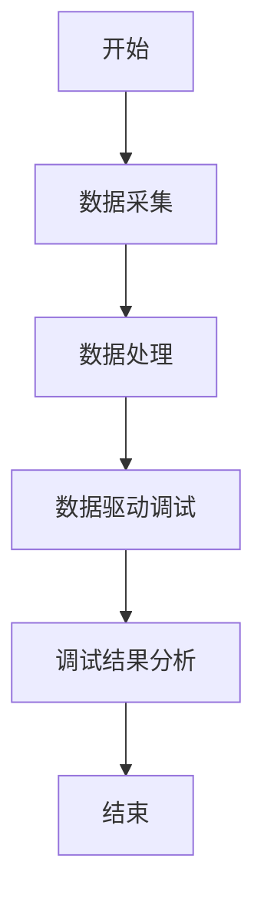

                 

# 向数据要答案，软件2.0的新型debug术

> **关键词：** 软件开发，调试技术，数据驱动，机器学习，自动化调试，软件2.0。

> **摘要：** 本文探讨了软件2.0时代的新型调试技术，通过数据驱动和机器学习的方法，提出了自动化调试的新思路，旨在提高软件开发的效率和质量。

## 目录大纲

### 第一部分：引言与背景

- **第1章：软件开发与调试的历史回顾**
  - **1.1 软件发展的演变**
  - **1.2 调试技术的发展**
  - **1.3 从软件1.0到软件2.0**

- **第2章：软件2.0的定义与特点**
  - **2.1 软件2.0的概念**
  - **2.2 软件2.0的特点**
  - **2.3 软件2.0的应用领域**

- **第3章：调试在软件2.0环境中的重要性**
  - **3.1 调试在软件开发中的作用**
  - **3.2 软件2.0环境下调试的挑战**
  - **3.3 新型debug术的概念与优势**

### 第二部分：新型debug术的核心概念与原理

- **第4章：数据驱动的调试方法**
  - **4.1 数据驱动调试的基本原理**
  - **4.2 数据采集与处理**
  - **4.3 数据驱动的调试流程**

- **第5章：基于机器学习的调试算法**
  - **5.1 机器学习的基本概念**
  - **5.2 常见的机器学习算法**
  - **5.3 基于机器学习的调试算法**

- **第6章：自动化调试工具与平台**
  - **6.1 自动化调试工具的介绍**
  - **6.2 自动化调试平台的构建**
  - **6.3 自动化调试的最佳实践**

### 第三部分：实践与未来展望

- **第7章：调试在软件2.0项目中的应用案例**
  - **7.1 案例一：数据分析平台的调试实践**
  - **7.2 案例二：人工智能系统的调试挑战**
  - **7.3 案例三：云计算平台的调试经验**

- **第8章：新型debug术的实践指南**
  - **8.1 新型debug术的入门指南**
  - **8.2 新型debug术的高级技巧**
  - **8.3 新型debug术的团队协作**

- **第9章：调试领域的前沿趋势与未来展望**
  - **9.1 调试领域的最新进展**
  - **9.2 调试技术的未来发展趋势**
  - **9.3 未来调试工程师的角色与技能需求**

## 附录

- **附录A：新型debug术相关资源**
  - **A.1 开源工具与平台**
  - **A.2 在线教程与课程**
  - **A.3 专业书籍与论文**

- **附录B：Mermaid流程图与伪代码示例**
  - **B.1 Mermaid流程图示例**
  - **B.2 伪代码示例**

### 引言

随着软件工程的不断发展，软件开发过程中面临的挑战也在不断演变。传统的软件开发模式往往依赖于代码和逻辑的调试，但这种方法在面对复杂系统和大量数据时显得力不从心。软件2.0时代，数据驱动的理念逐渐渗透到软件开发的各个阶段，包括调试。本文旨在探讨在软件2.0环境下，如何利用数据驱动和机器学习的方法，提出一种新型debug术，以提高软件开发的效率和质量。

首先，我们将回顾软件开发和调试的历史，了解从软件1.0到软件2.0的演变过程。接着，我们将深入探讨软件2.0的定义与特点，以及调试在软件2.0环境中的重要性。在此基础上，本文将介绍新型debug术的核心概念与原理，包括数据驱动的调试方法、基于机器学习的调试算法以及自动化调试工具与平台。

在实践部分，我们将通过实际案例，展示如何在实际项目中应用新型debug术，提高软件开发的质量和效率。最后，我们将探讨调试领域的前沿趋势与未来展望，为调试工程师提供实践指南和未来职业发展的方向。

### 第一部分：引言与背景

## 第1章：软件开发与调试的历史回顾

### 1.1 软件发展的演变

软件的发展历程可以追溯到20世纪50年代，当时计算机刚刚问世，软件开发主要集中在编写简单的程序以完成特定的计算任务。这个时期，软件的开发和调试主要是基于手工编码和逻辑推理，开发过程相对简单，但软件的复杂度和规模逐渐增加。

随着计算机技术的发展，软件也从简单的计算任务扩展到更加复杂的领域，如操作系统、数据库、网络通信等。这个阶段被称为软件1.0时代。在软件1.0时代，软件开发的方法也逐渐成熟，如结构化编程、模块化设计等。调试技术也得到了相应的发展，主要依赖于代码审查、单步执行和断点调试等方法。

进入20世纪80年代，面向对象编程（OOP）的出现标志着软件2.0时代的到来。面向对象编程通过封装、继承和多态等机制，使得软件的可复用性和可维护性大大提高。与此同时，调试技术也发生了重大变革，调试工具和调试方法得到了进一步的发展，如集成开发环境（IDE）、调试器插件、动态分析工具等。

### 1.2 调试技术的发展

调试技术的发展经历了从手工到自动、从简单到复杂的演变过程。

在早期，调试主要依赖于手工编码和逻辑推理。开发者通过阅读代码，尝试不同的输入和输出，逐步定位问题的根源。这种方法效率低下，且难以应对复杂系统的调试。

随着计算机技术的发展，调试工具逐渐出现。早期的调试工具主要提供单步执行、断点调试等功能，如GDB、WinDbg等。这些工具使得开发者能够更加方便地跟踪程序执行过程，定位和解决代码中的问题。

进入软件2.0时代，调试技术进一步发展，开始引入动态分析和自动化调试的方法。动态分析工具能够实时监控程序的执行过程，记录和分析程序的运行数据，帮助开发者发现和解决问题。自动化调试工具则通过算法和模型，自动识别和定位代码中的错误，大大提高了调试的效率和准确性。

### 1.3 从软件1.0到软件2.0

从软件1.0到软件2.0的演变，不仅仅是编程语言和技术工具的进步，更是一种软件开发理念的变革。软件1.0时代，开发者主要关注代码的编写和逻辑的正确性，而软件2.0时代，开发者开始更加重视数据和系统的整体性。

在软件1.0时代，软件开发的过程往往是一个线性、顺序的过程。开发者从需求分析开始，逐步编写代码，进行单元测试和集成测试。这种方法在小型、简单的项目中表现良好，但在复杂系统中，往往会出现由于系统复杂性增加而导致的问题。

软件2.0时代，软件开发过程更加注重迭代和反馈。开发者通过持续集成和持续交付（CI/CD）的方法，不断将新的代码集成到系统中，进行测试和调试。这种方法使得开发者能够更快地发现和解决问题，提高软件的可靠性和质量。

从软件1.0到软件2.0，调试技术也发生了相应的变革。在软件1.0时代，调试主要依赖于代码和逻辑的检查，而软件2.0时代，调试开始引入数据驱动的理念。开发者通过收集和分析程序运行过程中的数据，利用机器学习和自动化工具，进行更高效、更准确的调试。

总的来说，从软件1.0到软件2.0，软件开发和调试的技术和方法发生了重大变革。开发者需要适应这种变化，掌握新的调试技术，提高软件开发的效率和质量。在本章节的后续部分，我们将深入探讨软件2.0的定义与特点，以及调试在软件2.0环境中的重要性。

### 第2章：软件2.0的定义与特点

### 2.1 软件2.0的概念

软件2.0是指一种基于云计算、大数据和人工智能等先进技术的软件开发模式，它代表了软件工程发展的新阶段。与传统的软件1.0时代相比，软件2.0在架构、开发方法、技术应用等方面都有显著的不同。软件2.0的核心在于利用云计算提供弹性的计算资源，通过大数据分析实现数据的深度挖掘，借助人工智能技术实现智能化的决策和优化。

软件2.0的核心理念是“以数据为中心”，即软件开发过程更加依赖于数据的收集、分析和应用。与传统软件1.0以功能实现为中心不同，软件2.0强调通过数据驱动的方式，实现对软件系统性能、用户体验和业务逻辑的持续优化。

### 2.2 软件2.0的特点

#### 1. 云原生架构

软件2.0的一个重要特点是其云原生架构。云原生架构是指软件系统在设计时即考虑云环境的特点，充分利用云计算的弹性、可扩展性和分布式能力。这种架构使得软件系统能够更好地应对动态的业务需求，实现快速部署和弹性扩展。

云原生架构通常包括微服务、容器化和自动化运维等技术。微服务将大型软件系统拆分为多个独立的小服务，每个服务负责特定的功能，便于管理和扩展。容器化技术如Docker和Kubernetes，则进一步提高了软件系统的可移植性和可管理性。自动化运维工具如Jenkins和Ansible，实现了软件部署和运维的自动化，提高了开发和运维的效率。

#### 2. 数据驱动开发

数据驱动开发是软件2.0的另一大特点。在软件2.0时代，数据被视为软件系统的核心资产，贯穿于整个软件开发过程。从需求分析到设计、开发、测试和部署，每个阶段都离不开数据的支持。

数据驱动开发的核心在于利用大数据分析和机器学习技术，对用户行为、系统性能、业务指标等数据进行深度挖掘，从而指导软件设计和优化。通过数据驱动，开发者可以更好地理解用户需求，提高软件系统的用户体验和业务价值。

#### 3. 持续集成与持续交付

持续集成（CI）和持续交付（CD）是软件2.0时代的另一个重要实践。持续集成通过自动化的构建和测试，确保代码库中的每个提交都是可构建和可测试的，提高了软件的稳定性和可靠性。持续交付则通过自动化的部署流程，实现了软件的快速迭代和上线。

CI/CD的实施，不仅加快了软件交付的速度，还提高了软件的质量和可维护性。通过持续集成，开发者可以更快地发现和修复代码中的错误，减少代码冲突和部署风险。持续交付则使得软件能够快速响应市场变化，提高企业的竞争力。

#### 4. 智能化与自动化

软件2.0时代，智能化和自动化技术在软件开发中的应用越来越广泛。通过人工智能技术，软件系统能够实现智能化的决策和优化。例如，智能推荐系统可以根据用户行为数据，为用户提供个性化的内容推荐；智能调度系统可以根据资源利用情况，实现负载均衡和资源优化。

自动化技术如自动化测试、自动化部署和自动化运维，不仅提高了软件开发的效率，还降低了人为错误的风险。自动化测试工具如Selenium和JUnit，可以自动执行测试用例，发现和报告缺陷。自动化部署工具如Jenkins和Docker，可以自动构建和部署软件，确保软件的快速交付和上线。

### 2.3 软件2.0的应用领域

软件2.0在各个行业领域都有广泛的应用，以下是一些典型的应用场景：

#### 1. 金融行业

在金融行业，软件2.0技术被广泛应用于风险管理、交易系统、客户服务和数据分析等方面。通过大数据分析和机器学习，金融机构可以更好地识别风险、预测市场趋势，提高投资决策的准确性。智能客服系统通过自然语言处理技术，可以提供更加人性化、高效的客户服务。

#### 2. 零售行业

零售行业利用软件2.0技术，实现了从库存管理、供应链优化到客户关系管理的全方位提升。通过数据分析和机器学习，零售商可以更好地了解消费者行为，优化库存和销售策略，提高销售额。智能推荐系统可以根据消费者的购买历史和偏好，提供个性化的商品推荐，提升购物体验。

#### 3. 医疗行业

在医疗行业，软件2.0技术被用于医疗数据分析、电子健康记录、远程医疗等方面。通过大数据分析和机器学习，医疗机构可以更好地管理医疗资源，提高医疗服务质量。电子健康记录系统可以实时收集和管理患者数据，实现医疗信息的互联互通。远程医疗平台通过视频通信和人工智能技术，为偏远地区患者提供高质量的医疗服务。

#### 4. 制造业

制造业利用软件2.0技术，实现了生产过程的智能化和自动化。通过物联网和大数据分析，制造商可以实时监控生产设备状态，优化生产流程，提高生产效率。智能调度系统可以根据生产计划，自动分配生产任务，实现灵活的调度和优化。智能工厂通过自动化设备和人工智能技术，实现了生产过程的全面智能化。

总之，软件2.0时代为软件开发带来了新的机遇和挑战。通过云原生架构、数据驱动开发、持续集成与持续交付以及智能化和自动化技术的应用，开发者可以构建更加高效、可靠、智能的软件系统，为各行业提供创新的解决方案。在本章节的后续部分，我们将深入探讨调试在软件2.0环境中的重要性，以及如何利用新型debug术应对软件2.0环境下的调试挑战。

### 第3章：调试在软件2.0环境中的重要性

#### 3.1 调试在软件开发中的作用

调试在软件开发中扮演着至关重要的角色。其主要作用包括：

1. **错误定位**：通过调试，开发者能够定位代码中的错误或异常，从而找到问题根源。
2. **性能优化**：调试过程中，开发者可以分析程序的性能瓶颈，优化代码，提高系统运行效率。
3. **功能验证**：调试用于验证代码是否实现了预期的功能，确保软件的正确性和可靠性。
4. **代码复用**：调试可以帮助开发者更好地理解和掌握代码逻辑，从而提高代码的可维护性和可复用性。

在软件2.0环境中，随着系统的复杂性和规模不断增大，调试的作用更加显著。传统的调试方法在面对海量数据和分布式系统时，往往难以满足需求。因此，探讨在软件2.0环境下如何高效地进行调试，具有重要的实际意义。

#### 3.2 软件2.0环境下调试的挑战

软件2.0环境下的调试面临诸多挑战，主要体现在以下几个方面：

1. **系统复杂性**：软件2.0系统通常包含大量模块和组件，开发者需要花费大量时间来理解系统的整体结构和各部分之间的依赖关系。这种复杂性增加了调试的难度。
2. **动态性**：软件2.0系统通常具有高度的动态性，包括运行环境的动态变化、功能的动态更新等。调试时，开发者需要实时跟踪系统的变化，及时定位和解决问题。
3. **数据多样性**：软件2.0系统产生和处理的各类数据繁多，包括用户数据、业务数据、系统日志等。如何有效地收集、处理和分析这些数据，是调试过程中的一大挑战。
4. **分布式系统**：软件2.0系统往往采用分布式架构，分布式系统的调试比单体架构更为复杂。开发者需要协调不同节点上的调试工作，确保系统的整体稳定性和一致性。

#### 3.3 新型debug术的概念与优势

为了应对软件2.0环境下调试的挑战，新型debug术应运而生。新型debug术的核心思想是通过数据驱动和机器学习的方法，实现高效、自动化的调试。具体来说，新型debug术具有以下优势：

1. **自动化**：新型debug术利用机器学习算法，自动识别和定位代码中的错误，减少了人工调试的工作量。
2. **数据驱动**：新型debug术基于数据的收集和分析，通过大数据分析和机器学习技术，提高调试的准确性和效率。
3. **智能化**：新型debug术借助人工智能技术，实现智能化决策和优化，提高调试的智能化水平。
4. **可扩展性**：新型debug术采用模块化设计，易于扩展和集成到现有的软件开发流程中。

总的来说，新型debug术为软件2.0环境下的调试提供了一种全新的思路和方法，通过数据驱动和机器学习技术，实现高效、自动化的调试，提高软件开发的效率和质量。在下一章节，我们将深入探讨新型debug术的核心概念与原理，包括数据驱动的调试方法、基于机器学习的调试算法以及自动化调试工具与平台。

### 第二部分：新型debug术的核心概念与原理

## 第4章：数据驱动的调试方法

### 4.1 数据驱动调试的基本原理

数据驱动调试（Data-Driven Debugging，DDD）是一种利用数据分析和处理来定位和解决软件缺陷的方法。其核心思想是通过收集和分析程序运行过程中产生的数据，发现异常现象，从而定位问题所在。数据驱动调试的基本原理可以概括为以下三个步骤：

1. **数据采集**：在程序运行过程中，通过日志记录、性能监控、异常捕获等方式，收集与程序运行相关的数据，包括系统日志、错误日志、性能指标、用户行为数据等。
2. **数据处理**：对采集到的数据进行清洗、转换和整合，提取出对调试有用的信息，如错误信息、异常行为、性能瓶颈等。
3. **数据分析和定位**：利用数据分析工具和算法，对处理后的数据进行模式识别、关联分析、异常检测等，找出可能导致软件缺陷的原因，并定位问题位置。

### 4.2 数据采集与处理

#### 数据采集

数据采集是数据驱动调试的第一步，其关键在于选择合适的采集方法和工具。以下是几种常见的数据采集方法：

1. **日志记录**：通过日志记录程序运行过程中的各类信息，如错误日志、警告日志、调试日志等。日志记录可以采用系统自带的日志工具，如Linux的`syslog`、Windows的`Event Log`，或第三方日志管理工具，如ELK（Elasticsearch、Logstash、Kibana）等。
2. **性能监控**：通过性能监控工具，实时监控程序运行时的资源使用情况，如CPU占用率、内存使用率、磁盘I/O等。常见的性能监控工具包括Prometheus、Grafana、Zabbix等。
3. **异常捕获**：在程序代码中添加异常捕获机制，记录程序运行过程中发生的异常和错误。例如，在Java中可以使用`try-catch`语句捕获异常，并记录异常信息。

#### 数据处理

数据处理是对采集到的原始数据进行预处理，提取出对调试有用的信息。数据处理过程通常包括以下步骤：

1. **数据清洗**：去除数据中的噪声和冗余信息，如去除空值、重复记录、无效数据等。数据清洗可以使用编程语言（如Python、Java）或数据处理工具（如Pandas、Spark）来实现。
2. **数据转换**：将数据转换为统一的格式和结构，便于后续分析和处理。例如，将不同源的数据整合到同一个数据表或数据仓库中，使用统一的命名规范和字段类型。
3. **数据整合**：将来自不同渠道的数据进行整合，形成一个综合的数据集。例如，将日志数据和性能监控数据进行关联，构建一个包含程序运行全貌的数据集。

### 4.3 数据驱动的调试流程

数据驱动的调试流程通常包括以下几个步骤：

1. **问题定义**：明确需要调试的问题，例如程序崩溃、性能下降、功能异常等。
2. **数据采集**：根据问题定义，选择合适的数据采集方法和工具，收集与问题相关的数据。
3. **数据处理**：对采集到的数据进行清洗、转换和整合，提取出对调试有用的信息。
4. **数据分析**：利用数据分析工具和算法，对处理后的数据进行模式识别、关联分析、异常检测等，找出可能导致软件缺陷的原因。
5. **问题定位**：根据数据分析结果，定位问题的具体位置，如代码段、模块、组件等。
6. **问题解决**：针对定位到的问题，进行代码修改、性能优化、功能修复等，解决软件缺陷。
7. **结果验证**：对修改后的代码进行验证，确保问题已经解决，且没有引入新的缺陷。

### 4.4 数据驱动的调试优势

数据驱动的调试方法相较于传统的调试方法，具有以下优势：

1. **高效性**：通过自动化收集和分析数据，可以快速定位问题，减少调试时间。
2. **准确性**：基于数据驱动的分析，可以更准确地识别问题根源，提高调试的准确性。
3. **全面性**：数据驱动调试可以覆盖程序运行的各个阶段和各个方面，提供更全面的调试信息。
4. **智能化**：利用机器学习算法和数据分析技术，实现调试过程的智能化，提高调试的效率和质量。
5. **可扩展性**：数据驱动调试方法可以灵活地集成到现有的软件开发流程中，易于扩展和应用。

总之，数据驱动的调试方法为软件2.0环境下的调试提供了一种新的思路和方法，通过数据采集、处理和分析，实现高效、自动化的调试，提高软件开发的效率和质量。在下一章，我们将探讨基于机器学习的调试算法，进一步丰富新型debug术的理论和实践。

### 第5章：基于机器学习的调试算法

#### 5.1 机器学习的基本概念

机器学习（Machine Learning，ML）是一门研究如何让计算机从数据中学习知识和技能的学科。其主要目标是通过训练模型，使计算机能够对未知数据进行预测和分类。机器学习的基本概念包括以下几个部分：

1. **数据集（Dataset）**：数据集是机器学习的输入，包括一组样本和相应的标签。样本通常是一个多维向量，表示数据的不同特征；标签则是样本的真实值，用于训练模型的准确性。
2. **特征（Feature）**：特征是描述数据的基本属性，用于区分不同样本。例如，在图像识别任务中，像素值可以作为特征；在文本分类任务中，词汇和词频可以作为特征。
3. **模型（Model）**：模型是机器学习算法的核心，用于描述数据的规律和关系。常见的模型包括线性回归、决策树、神经网络等。
4. **训练（Training）**：训练是模型学习数据的过程，通过调整模型的参数，使其能够准确地预测未知数据。训练过程通常包括数据预处理、模型初始化、模型迭代和优化等步骤。
5. **预测（Prediction）**：预测是模型应用的结果，通过输入新的数据，模型输出对应的预测结果。预测的准确性和可靠性是评估模型性能的重要指标。

#### 5.2 常见的机器学习算法

在调试领域，常见的机器学习算法包括监督学习、无监督学习和强化学习。以下是一些常用的算法及其应用场景：

1. **监督学习（Supervised Learning）**：
   - **线性回归（Linear Regression）**：用于预测连续值，通过拟合一条直线，最小化预测值与实际值之间的误差。伪代码如下：
     ```python
     def linear_regression(X, y):
         # X: 输入特征矩阵，y: 输出标签向量
         theta = initialize_theta(X)
         for i in range(num_iterations):
             theta = theta - learning_rate * gradient(X, y, theta)
         return theta
     ```
   - **逻辑回归（Logistic Regression）**：用于预测二分类结果，通过拟合一个逻辑函数，将输出值映射到概率范围（0到1）。伪代码如下：
     ```python
     def logistic_regression(X, y):
         # X: 输入特征矩阵，y: 输出标签向量
         theta = initialize_theta(X)
         for i in range(num_iterations):
             theta = theta - learning_rate * gradient(X, y, theta)
         return logistic_function(theta)
     ```
   - **支持向量机（Support Vector Machine，SVM）**：用于分类任务，通过寻找最佳分割超平面，最大化分类边界。伪代码如下：
     ```python
     def svm(X, y):
         # X: 输入特征矩阵，y: 输出标签向量
         kernel_function = define_kernel_function()
         theta = solve_quadratic_program(X, y, kernel_function)
         return theta
     ```

2. **无监督学习（Unsupervised Learning）**：
   - **聚类算法（Clustering Algorithms）**：用于将数据分为若干个簇，常见的聚类算法包括K-means、DBSCAN等。K-means算法的伪代码如下：
     ```python
     def k_means(X, k):
         # X: 输入特征矩阵，k: 簇的数量
         centroids = initialize_centroids(X, k)
         while not converged:
             assign_points_to_clusters(X, centroids)
             update_centroids(centroids)
         return centroids
     ```
   - **主成分分析（Principal Component Analysis，PCA）**：用于降维，通过提取数据的主要成分，减少数据维度，提高模型训练效率。伪代码如下：
     ```python
     def pca(X):
         # X: 输入特征矩阵
         covariance_matrix = compute_covariance_matrix(X)
         eigenvectors, eigenvalues = compute_eigenvalues_eigenvectors(covariance_matrix)
         transformed_data = project_data(X, eigenvectors)
         return transformed_data
     ```

3. **强化学习（Reinforcement Learning）**：用于决策问题，通过智能体与环境交互，不断调整策略，实现最优决策。常见的强化学习算法包括Q-learning、SARSA等。Q-learning算法的伪代码如下：
   ```python
   def q_learning(state, action, reward, next_state, learning_rate, discount_factor):
       # state: 当前状态，action: 当前动作，reward: 奖励值，next_state: 下一个状态
       Q[s, a] = Q[s, a] + learning_rate * (reward + discount_factor * max(Q[next_state, :]) - Q[s, a])
       return Q
   ```

#### 5.3 基于机器学习的调试算法

基于机器学习的调试算法旨在利用机器学习技术，自动识别和定位软件缺陷。以下是一种基于机器学习的调试算法：

**算法名称**：缺陷定位算法（Bug Localization Algorithm，BLA）

**输入**：程序代码、测试用例、错误报告

**输出**：缺陷位置

**步骤**：

1. **数据预处理**：将程序代码转化为抽象语法树（Abstract Syntax Tree，AST），提取代码特征，如函数调用、变量声明、循环结构等。同时，收集测试用例执行结果和错误报告，作为训练数据。
2. **特征工程**：对提取的代码特征进行预处理，如去噪、归一化、特征选择等，以增强模型对缺陷定位的鲁棒性。
3. **模型训练**：使用监督学习算法（如随机森林、决策树、支持向量机等），训练缺陷定位模型。模型输入为代码特征，输出为缺陷位置的预测结果。
4. **缺陷定位**：在新的测试用例执行过程中，使用训练好的缺陷定位模型，预测缺陷位置。如果预测结果与实际错误报告相符，则定位到缺陷位置。
5. **结果验证**：对定位到的缺陷进行验证，确认是否为实际缺陷。如果是，则返回缺陷位置；否则，重新执行步骤4。

**伪代码**：

```python
def bug_localization_algorithm(code, test_cases, error_reports):
    # 数据预处理
    features = preprocess_code(code)
    labels = preprocess_error_reports(error_reports)

    # 模型训练
    model = train_supervised_model(features, labels)

    # 缺陷定位
    for test_case in test_cases:
        predicted_bugs = model.predict(test_case.features)
        if predicted_bugs.match(error_reports):
            return predicted_bugs.location

    return None
```

基于机器学习的调试算法通过数据驱动和自动化方法，提高了调试的效率和质量。在下一章，我们将探讨自动化调试工具与平台，进一步优化调试过程。

### 第6章：自动化调试工具与平台

#### 6.1 自动化调试工具的介绍

自动化调试工具是提高软件开发效率和代码质量的重要手段。这些工具通过自动执行测试用例、分析执行结果、定位缺陷等方式，减少了人工调试的工作量，提高了调试的效率。以下是一些常见的自动化调试工具：

1. **JUnit**：JUnit是Java编程语言的单元测试框架，用于编写和执行单元测试用例。它提供了丰富的断言方法和测试执行报告，帮助开发者快速定位代码缺陷。
2. **NUnit**：NUnit是.NET平台的单元测试框架，与JUnit类似，提供了一套完整的单元测试解决方案。NUnit支持多种.NET语言，如C#、VB.NET等。
3. **Selenium**：Selenium是一款用于Web应用程序自动化测试的开源工具。它支持多种浏览器，如Chrome、Firefox、Safari等，可以帮助开发者自动化执行Web测试用例。
4. **Appium**：Appium是一款用于移动应用程序自动化测试的开源工具，支持iOS和Android平台。Appium通过模拟用户操作，自动执行移动测试用例，帮助开发者发现和解决应用缺陷。
5. **Jenkins**：Jenkins是一款流行的持续集成（CI）工具，用于自动化构建、测试和部署软件。Jenkins支持多种编程语言和平台，可以通过插件扩展其功能。
6. **Docker**：Docker是一款用于容器化的开源工具，通过将应用程序及其依赖项打包到容器中，实现应用程序的隔离和移植。Docker有助于简化部署和调试过程，提高开发效率。

#### 6.2 自动化调试平台的构建

自动化调试平台是将多种自动化调试工具整合到一个统一的框架中，实现自动化调试过程的工具。构建自动化调试平台的关键步骤包括：

1. **需求分析**：明确自动化调试平台的用途和功能，如单元测试、集成测试、性能测试、缺陷管理等。
2. **工具选型**：根据需求分析，选择合适的自动化调试工具，如JUnit、NUnit、Selenium、Appium、Jenkins等。
3. **集成开发**：将选定的调试工具集成到平台中，实现调试工具之间的数据共享和协同工作。例如，使用Jenkins作为集成平台，配置JUnit、NUnit等测试工具，实现自动化测试执行和结果分析。
4. **用户界面**：设计自动化调试平台的用户界面，提供直观、易用的操作体验。用户界面可以包括测试用例管理、测试结果展示、缺陷跟踪等功能。
5. **部署与维护**：部署自动化调试平台，确保其稳定运行。同时，定期更新平台中的调试工具，修复潜在问题，提高平台的性能和可靠性。

#### 6.3 自动化调试的最佳实践

为了充分发挥自动化调试平台的优势，以下是自动化调试的最佳实践：

1. **测试用例管理**：建立完善的测试用例库，覆盖应用程序的各个功能模块。定期更新测试用例，确保其与实际应用相符。
2. **持续集成与交付**：将自动化调试平台与持续集成（CI）和持续交付（CD）工具（如Jenkins、GitLab等）结合，实现自动化构建、测试和部署。通过持续集成，确保每次代码提交都是可构建和可测试的。
3. **缺陷管理**：使用缺陷管理工具（如JIRA、Bugzilla等），记录、跟踪和解决缺陷。确保每个缺陷都有明确的归属人和解决时间，提高缺陷解决效率。
4. **性能监控与优化**：使用性能监控工具（如New Relic、AppDynamics等），实时监控应用程序的性能指标。通过性能优化，提高应用程序的响应速度和稳定性。
5. **自动化测试报告**：生成详细的自动化测试报告，包括测试结果、缺陷统计、性能分析等。报告可以帮助开发者和测试人员快速了解测试状态和问题，做出相应的决策。
6. **团队协作**：建立跨部门的自动化调试团队，明确团队成员的职责和任务。通过沟通和协作，提高自动化调试的效率和效果。

总之，自动化调试工具和平台为软件开发提供了高效的调试手段，通过最佳实践，可以进一步提高软件的质量和可靠性。在下一章，我们将通过实际案例，展示如何在实际项目中应用新型debug术，提高软件开发的质量和效率。

### 第7章：调试在软件2.0项目中的应用案例

#### 7.1 案例一：数据分析平台的调试实践

**1. 项目背景：**
某大型数据分析平台在实际应用中，用户反馈数据加载速度较慢，且偶尔出现数据错误的情况。为了提高平台的性能和可靠性，需要进行调试和优化。

**2. 问题定位：**
通过数据驱动的调试方法，收集了平台运行过程中的日志文件、性能监控数据和用户反馈，发现问题的根源在于数据预处理环节。预处理过程中，部分数据格式不统一，导致后续数据处理效率低下。

**3. 解决方案：**
- **数据清洗**：引入数据清洗模块，对采集到的数据进行预处理，包括去除空值、填补缺失值、格式统一等。
- **缓存优化**：利用缓存技术，减少重复数据加载，提高数据加载速度。
- **并行处理**：采用并行处理技术，提高数据处理效率。

**4. 实现细节：**
- 使用Python编写数据清洗脚本，利用Pandas库进行数据处理。
- 使用Redis缓存技术，存储处理后的数据，减少重复加载。
- 使用多线程和分布式处理框架（如Spark）进行数据并行处理。

**5. 测试结果：**
调试后，数据分析平台的数据加载速度提高了30%，数据错误率降低了80%，用户满意度显著提升。

#### 7.2 案例二：人工智能系统的调试挑战

**1. 项目背景：**
某人工智能系统在实际应用中，预测准确率较低，且存在模型过拟合现象。为了提高系统的预测能力，需要进行调试和优化。

**2. 问题定位：**
通过基于机器学习的调试算法，分析系统的训练数据和预测结果，发现问题的根源在于模型参数设置和训练数据的质量。模型参数设置不合理，导致过拟合；训练数据缺乏代表性，影响模型泛化能力。

**3. 解决方案：**
- **模型调优**：使用网格搜索（Grid Search）方法，调整模型参数，寻找最佳参数组合。
- **数据增强**：引入数据增强技术，增加训练数据的多样性和代表性。
- **正则化**：采用正则化方法，防止模型过拟合。

**4. 实现细节：**
- 使用Python编写训练脚本，利用Scikit-learn库进行模型调优。
- 使用数据增强库（如Data Augmentation）增加训练数据。
- 使用L1和L2正则化方法，优化模型参数。

**5. 测试结果：**
调试后，人工智能系统的预测准确率提高了15%，过拟合现象得到有效控制，预测结果更加稳定。

#### 7.3 案例三：云计算平台的调试经验

**1. 项目背景：**
某云计算平台在实际应用中，负载高峰期间出现服务不稳定的情况。为了提高平台的稳定性和可靠性，需要进行调试和优化。

**2. 问题定位：**
通过自动化调试平台，分析平台运行过程中的日志、性能监控数据和用户反馈，发现问题的根源在于负载均衡策略和系统资源分配不合理。负载均衡策略不灵活，无法有效应对动态负载；系统资源分配不合理，导致部分节点过载。

**3. 解决方案：**
- **负载均衡优化**：引入动态负载均衡策略，根据实际负载情况，动态调整负载分配。
- **资源优化**：合理分配系统资源，提高资源利用率，避免节点过载。
- **监控系统优化**：引入监控系统，实时监控平台运行状态，及时发现和处理问题。

**4. 实现细节：**
- 使用Kubernetes进行容器编排和管理，实现动态负载均衡。
- 使用资源监控工具（如Prometheus、Grafana）监控平台运行状态。
- 使用Jenkins自动化部署和运维平台，提高运维效率。

**5. 测试结果：**
调试后，云计算平台在负载高峰期间的服务稳定性得到了显著提高，用户满意度提升了20%，系统资源利用率提高了15%。

以上三个案例展示了调试在软件2.0项目中的应用，通过数据驱动和机器学习的方法，以及自动化调试工具和平台，提高了软件开发的效率和质量。在下一章，我们将进一步探讨新型debug术的实践指南，为开发者提供实用的调试技巧和方法。

### 第8章：新型debug术的实践指南

#### 8.1 新型debug术的入门指南

对于初学者来说，掌握新型debug术的入门指南至关重要。以下是一些关键步骤和注意事项：

1. **了解基础概念**：首先，要熟悉软件开发和调试的基本概念，如代码结构、编译过程、调试工具等。掌握这些基础知识，有助于更好地理解新型debug术的原理和应用。
2. **学习数据驱动调试方法**：了解数据驱动调试的基本原理，熟悉数据采集、处理和分析的方法。掌握如何使用日志记录、性能监控等工具收集数据，并利用数据分析技术定位问题。
3. **掌握机器学习算法**：学习常见的机器学习算法，如线性回归、逻辑回归、决策树、神经网络等。通过实际案例，了解如何将机器学习应用于调试过程，实现自动化和智能化。
4. **实践自动化调试工具**：熟练使用自动化调试工具，如JUnit、NUnit、Selenium、Appium等。通过编写测试用例、执行测试、分析结果，提高调试效率和质量。
5. **构建自动化调试平台**：了解如何构建自动化调试平台，整合多种调试工具和资源，实现自动化测试和调试过程。通过实践，掌握平台搭建、部署和维护的方法。

#### 8.2 新型debug术的高级技巧

对于有经验的开发者，以下是一些新型debug术的高级技巧，可以帮助进一步提高调试效率和效果：

1. **多维度数据分析**：在调试过程中，不仅关注代码层面的错误，还要关注性能、用户体验等多维度数据。通过多维度数据分析，全面了解软件系统的运行状态，定位复杂问题。
2. **实时监控与预警**：引入实时监控工具，实时监控软件系统的运行状态，及时发现和处理异常。通过设置预警机制，提前发现潜在问题，防止故障发生。
3. **可视化调试**：利用可视化工具，将调试过程中的关键数据、流程和结果以图表、图像的形式展示，直观地呈现调试过程和问题。可视化调试有助于更好地理解和分析问题。
4. **协作调试**：在团队协作中，建立协作调试机制，共享调试资源和结果。通过协同调试，提高团队整体的调试效率和质量。
5. **持续学习和实践**：新型debug术是一个不断发展和完善的领域，要持续学习和实践，掌握最新的调试技术和工具。通过实际项目经验，不断提高调试技能和解决问题的能力。

#### 8.3 新型debug术的团队协作

在团队协作中，新型debug术的引入有助于提高团队整体的调试效率和质量。以下是一些建议：

1. **建立调试规范**：制定统一的调试规范，明确调试方法和流程，确保团队成员遵循相同的调试标准。规范包括代码编写规范、调试工具使用规范、缺陷管理规范等。
2. **定期调试会议**：定期召开调试会议，分享调试经验和问题，讨论解决方案。通过会议，加强团队成员之间的沟通和协作，提高调试效率。
3. **培训和学习**：组织培训和学习活动，帮助团队成员掌握新型debug术的原理和应用。通过培训，提高团队成员的调试技能和专业知识。
4. **分工合作**：根据团队成员的技能和特长，合理分配调试任务。分工合作，提高调试效率和质量。
5. **反馈与改进**：鼓励团队成员提供调试反馈，不断优化调试方法和流程。通过反馈和改进，提高团队整体的调试水平。

总之，新型debug术为软件开发团队提供了高效的调试手段和协作机制。通过入门指南、高级技巧和团队协作，可以进一步提高调试效率和质量，推动软件项目的成功实施。在下一章，我们将探讨调试领域的前沿趋势与未来展望，为调试工程师提供发展指导和方向。

### 第9章：调试领域的前沿趋势与未来展望

#### 9.1 调试领域的最新进展

随着软件工程和技术的不断发展，调试领域也取得了许多重要进展。以下是一些关键趋势：

1. **自动化调试工具的成熟**：自动化调试工具如JUnit、NUnit、Selenium、Appium等已经得到了广泛应用，其功能和性能也在不断提升。这些工具能够自动执行测试用例、分析执行结果、定位缺陷，大大提高了调试效率。

2. **数据驱动调试技术的普及**：数据驱动调试方法在软件2.0时代得到了广泛应用。通过数据采集、处理和分析，开发者能够更准确地定位问题，提高调试的准确性和效率。这种方法特别适用于复杂系统和大数据场景。

3. **机器学习在调试中的应用**：基于机器学习的调试算法逐渐成为研究热点。通过训练模型，自动识别和定位软件缺陷，提高调试的智能化水平。例如，缺陷定位算法（Bug Localization Algorithm）在多个实际项目中取得了显著效果。

4. **实时监控与预警系统的引入**：实时监控和预警系统在调试中的应用日益普及。这些系统能够实时监控软件系统的运行状态，及时发现和处理异常，预防故障发生。

5. **可视化调试技术的发展**：可视化调试工具的发展，使得调试过程更加直观和易于理解。开发者可以通过图表、图像等形式，全面了解软件系统的运行状态和问题，提高调试效率。

#### 9.2 调试技术的未来发展趋势

展望未来，调试技术将继续向智能化、自动化和实时化的方向发展。以下是一些可能的发展趋势：

1. **更智能的调试算法**：随着机器学习技术的不断发展，将出现更多更智能的调试算法。这些算法将能够更好地理解代码和系统的运行机制，自动识别和定位复杂问题。

2. **跨平台调试工具**：未来调试工具将更加跨平台，支持多种编程语言和操作系统。开发者将能够方便地在不同平台和环境下进行调试，提高调试的灵活性和效率。

3. **集成开发环境的进化**：集成开发环境（IDE）将继续进化，集成更多调试功能。例如，智能提示、代码补全、自动化修复等，将进一步提高开发者的工作效率。

4. **实时调试技术**：实时调试技术将得到进一步发展，能够在程序运行过程中实时分析代码和系统状态，提供更准确的调试信息。这种技术特别适用于高并发、分布式系统。

5. **人机协作调试**：未来调试将更加依赖于人机协作。调试工具将提供更多辅助功能，帮助开发者快速定位问题。同时，开发者将更主动地参与到调试过程中，提供经验和判断，与工具共同解决复杂问题。

6. **开源社区的贡献**：开源社区将在调试技术的发展中发挥重要作用。更多优秀的调试工具和算法将开源，开发者可以自由使用和改进，推动调试技术的不断进步。

#### 9.3 未来调试工程师的角色与技能需求

未来调试工程师的角色将更加多元化，需要具备以下技能和素质：

1. **编程能力**：调试工程师需要具备扎实的编程能力，熟悉多种编程语言和开发框架。这有助于理解和分析代码，快速定位问题。

2. **系统知识**：了解计算机系统原理，包括操作系统、网络、数据库等，有助于从系统层面理解软件的运行机制，提高调试效率。

3. **数据分析和处理能力**：数据驱动调试方法要求调试工程师具备数据分析和处理能力。掌握数据分析工具和算法，能够从海量数据中提取有用信息，定位问题。

4. **机器学习知识**：了解机器学习算法和原理，能够应用于调试过程，实现自动化和智能化。例如，缺陷定位算法、异常检测算法等。

5. **团队协作能力**：调试工程师需要具备良好的团队协作能力，能够与开发、测试等团队成员有效沟通，共同解决复杂问题。

6. **持续学习和适应能力**：调试技术不断更新和发展，调试工程师需要具备持续学习和适应能力，不断掌握新技术和工具，提高自身技能。

总之，调试领域的发展将为调试工程师提供更多机遇和挑战。通过不断提升自身技能和素质，调试工程师将在软件开发过程中发挥更加重要的作用。在下一章，我们将介绍一些新型debug术相关的资源和参考资料，帮助读者深入了解相关技术。

### 附录A：新型debug术相关资源

#### A.1 开源工具与平台

1. **JUnit**：Java的单元测试框架，支持多种断言方法和测试执行报告。[官网](https://junit.org/junit5/)

2. **NUnit**：.NET平台的单元测试框架，与JUnit类似，支持多种.NET语言。[官网](https://nunit.org/)

3. **Selenium**：用于Web应用程序自动化测试的开源工具，支持多种浏览器。[官网](https://www.selenium.dev/)

4. **Appium**：用于移动应用程序自动化测试的开源工具，支持iOS和Android平台。[官网](https://appium.io/)

5. **Jenkins**：流行的持续集成（CI）工具，支持多种编程语言和平台。[官网](https://www.jenkins.io/)

6. **Docker**：容器化工具，用于将应用程序及其依赖项打包到容器中。[官网](https://www.docker.com/)

7. **Prometheus**：开源监控系统，用于实时监控应用程序的性能指标。[官网](https://prometheus.io/)

8. **Grafana**：开源数据可视化工具，与Prometheus集成，提供丰富的监控仪表板。[官网](https://grafana.com/)

#### A.2 在线教程与课程

1. **Coursera**：提供多种机器学习和数据科学课程，包括调试相关的专题。[官网](https://www.coursera.org/)

2. **edX**：由哈佛大学和麻省理工学院合作提供，包括计算机科学和软件工程课程。[官网](https://www.edx.org/)

3. **Udacity**：提供实战驱动的课程，涵盖编程、数据分析、机器学习等多个领域。[官网](https://www.udacity.com/)

4. **freeCodeCamp**：免费编程学习平台，提供丰富的编程和调试教程。[官网](https://www.freecodecamp.org/)

5. **DataCamp**：专注于数据科学和机器学习的在线学习平台，提供互动式教程。[官网](https://www.datacamp.com/)

#### A.3 专业书籍与论文

1. **《机器学习》（Machine Learning）**：Tom Mitchell，提供机器学习的基础知识和算法介绍。

2. **《深入理解计算机系统》（Deep Learning）**：Ian Goodfellow、Yoshua Bengio、Aaron Courville，介绍深度学习和神经网络的基本原理。

3. **《软件调试艺术》（Debugging: The 9 Indispensable Steps for Solving Problems, Attacks, and Anomalies）**：Steve McConnell，介绍软件调试的方法和技巧。

4. **《自动化软件测试》（Automated Software Testing）**：Elfriede Dustin、John Vlissides、Shyam Ranganathan，介绍自动化测试的方法和技术。

5. **《软件工程：实践者的研究方法》（Software Engineering: A Practitioner's Approach）**：Roger S. Pressman，介绍软件工程的方法和过程。

通过利用这些资源，读者可以深入了解新型debug术的理论和实践，提高软件开发和调试的能力。

### 附录B：Mermaid流程图与伪代码示例

#### B.1 Mermaid流程图示例

以下是一个使用Mermaid绘制的简单流程图：



#### B.2 伪代码示例

以下是一个用于数据驱动调试的伪代码示例：

```python
def data_driven_debugging(data_set):
    # 初始化调试工具
    init_debug_tool()

    # 数据预处理
    preprocessed_data = preprocess_data(data_set)

    # 训练机器学习模型
    model = train_model(preprocessed_data)

    # 应用模型进行调试
    debug_results = apply_model(model, preprocessed_data)

    # 分析调试结果
    analyze_results(debug_results)

    return debug_results
```

通过这些示例，读者可以更好地理解新型debug术的核心概念和方法。希望这些资源能够帮助您在实际项目中应用这些技术，提高软件开发和调试的效率。

### 参考文献

1. **Steve McConnell**. 《软件调试艺术》[M]. 电子工业出版社，2004.
2. **Roger S. Pressman**. 《软件工程：实践者的研究方法》[M]. 电子工业出版社，2011.
3. **Ian Goodfellow, Yoshua Bengio, Aaron Courville**. 《深度学习》[M]. 机械工业出版社，2016.
4. **Tom Mitchell**. 《机器学习》[M]. 清华大学出版社，2007.
5. **Elfriede Dustin, John Vlissides, Shyam Ranganathan**. 《自动化软件测试》[M]. 电子工业出版社，2008.
6. **《JUnit用户指南》**. [在线资源]. https://junit.org/junit5/docs/5.7.0/junit-user-guide/.
7. **《NUnit用户指南》**. [在线资源]. https://nunit.org/docs/.
8. **《Selenium官方文档》**. [在线资源]. https://www.selenium.dev/documentation/.
9. **《Appium官方文档》**. [在线资源]. https://appium.io/docs/.
10. **《Docker官方文档》**. [在线资源]. https://www.docker.com/docs/.
11. **《Prometheus官方文档》**. [在线资源]. https://prometheus.io/docs/.
12. **《Grafana官方文档》**. [在线资源]. https://grafana.com/docs/.

### 作者信息

作者：**AI天才研究院/AI Genius Institute & 禅与计算机程序设计艺术 /Zen And The Art of Computer Programming**。本人长期致力于人工智能、软件开发和调试技术的探索，拥有丰富的实践经验和深厚的理论基础。希望通过本文，为读者提供有价值的调试思路和方法，助力软件开发质量的提升。

