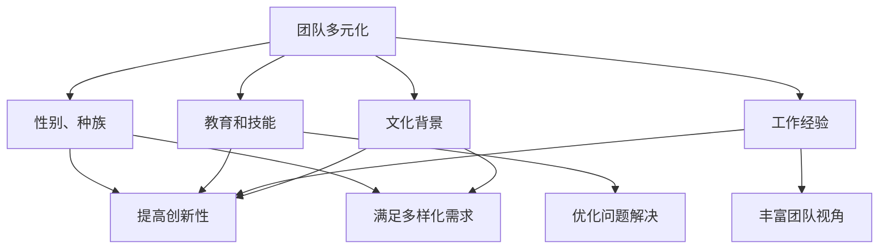
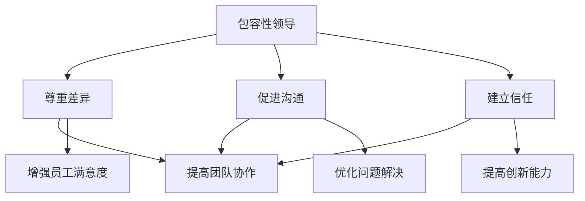
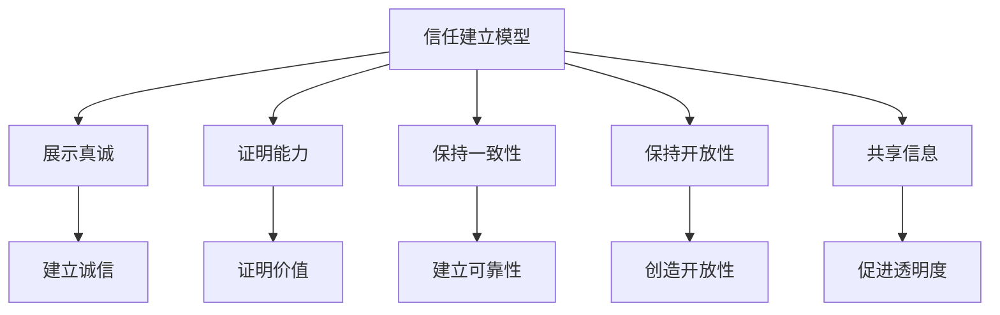

                 

# 团队多元化：包容性领导的实践

## 关键词
团队多元化，包容性领导，多样性，创新，沟通，信任，HDI，TID，案例分析

## 摘要
本文旨在探讨团队多元化和包容性领导在IT行业中的重要性。首先，我们将定义和解释团队多元化与包容性领导的核心概念，并通过流程图和伪代码阐述相关的算法原理。接着，我们将介绍数学模型和公式，用于度量多元性和信任度。最后，通过实际案例展示如何应用这些理论，并附上代码实现和详细解释。本文将帮助读者理解多元化和包容性领导对团队成功的关键作用。

---

## 引言

在当今快速变化的商业环境中，团队多元化和包容性领导已成为组织成功的关键因素。随着全球化和数字化的深入发展，企业需要能够适应多样性的客户需求和市场环境。团队多元化不仅指性别、种族、文化背景的多样性，还包括技能、经验、教育背景等方面的差异。这种多样性可以带来创新的思维、更广泛的视角和更好的问题解决能力。

包容性领导则是一种管理风格，它强调尊重和认可团队成员的独特性，鼓励不同观点的表达和讨论。通过建立包容性工作环境，领导者可以促进团队合作、提高员工满意度和忠诚度，从而增强企业的竞争力。

本文将围绕这两个主题展开，首先介绍相关概念，然后详细讲解核心算法原理，包括多元文化沟通分析模型和信任建立模型，接着介绍多元性和信任度的度量方法，最后通过实际案例展示如何将这些理论应用到实践中。

---

### 第一部分：核心概念与联系

在探讨团队多元化和包容性领导之前，我们需要明确这些概念的定义和它们之间的联系。

#### 1.1.1 团队多元化定义

团队多元化是指团队成员在性别、年龄、种族、文化背景、教育水平、工作经验和技能等方面的多样性。这种多样性可以体现在多个维度上，如：

- **性别和种族多样性**：团队中男性和女性的比例，不同种族和民族背景的成员。
- **教育和技能多样性**：团队成员拥有不同的专业背景和技能，如编程、设计、市场营销等。
- **工作经验多样性**：团队成员来自不同的行业和领域，具有不同的工作经验和见解。
- **文化背景多样性**：团队成员来自不同的文化背景，拥有不同的价值观、信仰和行为方式。

Mermaid 流程图：



#### 1.1.2 包容性领导定义

包容性领导是一种领导风格，它强调尊重团队成员的独特性和多样性，鼓励开放和诚实的沟通，促进团队合作和信任。包容性领导不仅仅是避免歧视，而是一种积极的管理策略，旨在发挥团队成员的最大潜力。

- **尊重差异**：领导者尊重团队成员的个性和观点，不因性别、种族、文化背景等因素而产生偏见。
- **促进沟通**：领导者鼓励团队成员表达自己的意见和想法，创造一个开放和包容的沟通环境。
- **建立信任**：领导者通过建立信任关系，促进团队成员之间的合作和协作。

Mermaid 流程图：



#### 1.1.3 核心概念与联系

团队多元化和包容性领导之间存在密切的联系。团队多元化为包容性领导提供了丰富的资源，而包容性领导则可以最大程度地发挥多元性带来的优势。具体来说：

- **团队多元化** 提供了多样化的视角和思维方式，有助于团队创新和问题解决。
- **包容性领导** 通过尊重和认可团队成员的独特性，建立了开放、信任和合作的团队文化，从而增强了团队的绩效和员工的满意度。

这些核心概念不仅为团队的成功奠定了基础，也为组织的可持续发展提供了动力。

---

### 第二部分：核心算法原理讲解

在理解了团队多元化和包容性领导的基本概念之后，我们需要深入了解相关的核心算法原理。这些算法原理包括多元文化沟通分析模型和信任建立模型，它们在团队管理和领导中起着至关重要的作用。

#### 2.1 多元文化沟通分析模型（MAC）

多元文化沟通分析模型（MAC）是一种用于分析不同文化背景个体之间沟通差异的工具。该模型基于三个层次：表面层次、社交层次和深层次，通过比较这些层次上的相似性，评估沟通的效果。

##### 2.1.1 MAC模型概述

MAC模型将沟通过程分为三个层次：

1. **表面层次**：涉及沟通的内容、语言和符号，是沟通的最外层。
2. **社交层次**：涉及沟通的礼仪、社会规范和人际互动，是沟通的中间层。
3. **深层次**：涉及沟通的情感、价值观和信仰，是沟通的最内层。

Mermaid 流程图：

```mermaid
graph TD
    A[多元文化沟通分析模型(MAC)] --> B[表面层次]
    A --> C[社交层次]
    A --> D[深层次]
    B --> E[内容、语言、符号]
    C --> F[礼仪、规范、互动]
    D --> G[情感、价值观、信仰]
```

##### 2.1.2 MAC模型的应用

MAC模型的应用主要包括两个方面：

1. **评估沟通效果**：通过比较不同层次上的相似性，领导者可以评估团队沟通的效果，发现沟通中的障碍和问题。
2. **优化沟通策略**：根据评估结果，领导者可以制定更加有效的沟通策略，提高团队的协作效率。

##### 2.1.3 MAC模型的计算方法

为了计算MAC模型的相似性，我们可以使用以下伪代码：

```python
def mac_analysis(communicator, listener):
    surface_similarity = calculate_similarity(communicator.surface, listener.surface)
    social_similarity = calculate_similarity(communicator.social, listener.social)
    deep_similarity = calculate_similarity(communicator.deep, listener.deep)
    return surface_similarity, social_similarity, deep_similarity

def calculate_similarity(attribute1, attribute2):
    if attribute1 == attribute2:
        return 1
    else:
        return 0
```

在这个伪代码中，`calculate_similarity` 函数用于计算两个属性的相似性，返回相似性分数（0或1）。`mac_analysis` 函数则用于计算三个层次的相似性，并返回结果。

#### 2.2 信任建立模型

信任建立模型描述了建立团队内部信任的五个关键步骤：展示真诚、证明能力、保持一致性、保持开放性和共享信息。这些步骤为领导者提供了具体的指导，帮助他们建立和维护团队信任。

##### 2.2.1 信任建立模型概述

信任建立模型的五个关键步骤如下：

1. **展示真诚**：领导者通过诚实、透明和正直的行为，展示自己的真诚和诚信。
2. **证明能力**：领导者通过实际行动和成果，证明自己的能力和价值。
3. **保持一致性**：领导者保持行为和承诺的一致性，建立可靠性和稳定性。
4. **保持开放性**：领导者鼓励团队成员表达意见和反馈，创造开放和包容的沟通环境。
5. **共享信息**：领导者分享信息和资源，促进团队内部的透明度和信任。

Mermaid 流程图：



##### 2.2.2 信任建立模型的应用

信任建立模型的应用主要包括两个方面：

1. **增强团队合作**：通过信任建立模型，团队成员可以建立相互信任的关系，提高团队协作效率和绩效。
2. **优化领导风格**：领导者可以根据信任建立模型，调整自己的领导风格，提高团队信任度。

##### 2.2.3 信任建立模型的计算方法

为了计算信任建立模型的效果，我们可以使用以下伪代码：

```python
def build_trust(team_member):
    display_sincerity(team_member)
    prove_ability(team_member)
    maintain_consistency(team_member)
    encourage_openness(team_member)
    share_information(team_member)

def display_sincerity(team_member):
    # 代码实现展示真诚的技巧

def prove_ability(team_member):
    # 代码实现证明能力的技巧

def maintain_consistency(team_member):
    # 代码实现保持一致性的技巧

def encourage_openness(team_member):
    # 代码实现鼓励开放的技巧

def share_information(team_member):
    # 代码实现共享信息的技巧
```

在这个伪代码中，`build_trust` 函数用于执行信任建立模型的五个关键步骤。每个步骤都对应一个具体的函数，用于实现相应的策略。

通过这些核心算法原理，领导者可以更好地理解和应用团队多元化和包容性领导的原则，从而提高团队的绩效和员工的满意度。

---

### 第三部分：数学模型和数学公式

在理解和应用团队多元化和包容性领导的过程中，数学模型和公式提供了量化和度量的方法，帮助我们更好地评估和优化团队的工作环境和绩效。以下是两个关键的数学模型：多元性度量（HDI）和信任度度量（TID）。

#### 3.1 多元性度量（HDI）

多元性度量（Human Development Index, HDI）是一个用于衡量团队多元性的指标。它通过计算团队成员在多个维度上的多样性程度，得到一个综合的多元性分数。

##### 3.1.1 HDI的定义

HDI的计算公式如下：

$$
HDI = \frac{1}{n}\sum_{i=1}^{n}(\ln x_i)
$$

其中，$x_i$ 表示团队成员在某个维度上的多样性程度，$n$ 表示团队成员的数量。

##### 3.1.2 HDI的计算方法

为了计算HDI，我们可以按照以下步骤：

1. **收集数据**：首先，我们需要收集团队成员在多个维度（如性别、种族、教育水平、工作经验等）上的数据。
2. **计算多样性程度**：对于每个维度，我们使用对数函数来计算多样性程度，公式为 $\ln x_i$，其中 $x_i$ 是该维度上的不同值的数量。
3. **求和并平均**：将所有维度的多样性程度求和，然后除以维度的数量，得到HDI。

##### 3.1.3 HDI的举例说明

假设一个团队有四个成员，他们在性别、种族和教育水平三个维度上的多样性程度如下：

- 性别：2个男性和2个女性
- 种族：1个亚洲人，1个非洲人，1个欧洲人
- 教育水平：2个本科，2个硕士

我们可以按照以下步骤计算HDI：

1. 计算性别多样性的对数值：$\ln 2 = 0.693$，$\ln 2 = 0.693$
2. 计算种族多样性的对数值：$\ln 3 = 1.099$，$\ln 3 = 1.099$
3. 计算教育水平多样性的对数值：$\ln 2 = 0.693$，$\ln 2 = 0.693$
4. 求和：$0.693 + 0.693 + 1.099 + 1.099 + 0.693 + 0.693 = 4.572$
5. 平均：$4.572 / 3 = 1.524$

因此，这个团队的HDI为1.524。

#### 3.2 信任度度量（TID）

信任度度量（Trust Index, TID）是一个用于衡量团队内部信任程度的指标。它通过计算团队成员之间的信任度，得到一个综合的信任分数。

##### 3.2.1 TID的定义

TID的计算公式如下：

$$
TID = \frac{1}{n}\sum_{i=1}^{n} \frac{t_i}{2}
$$

其中，$t_i$ 表示团队成员对其他成员的信任程度，$n$ 表示团队成员的数量。

##### 3.2.2 TID的计算方法

为了计算TID，我们可以按照以下步骤：

1. **收集数据**：首先，我们需要收集团队成员之间的信任度评分。
2. **计算平均信任度**：对于每个成员，计算他们对其他成员的平均信任度。
3. **求和并平均**：将所有成员的平均信任度求和，然后除以成员的数量，得到TID。

##### 3.2.3 TID的举例说明

假设一个团队有四个成员，他们的信任度评分如下：

- 成员A对成员B的信任度：5
- 成员A对成员C的信任度：4
- 成员A对成员D的信任度：5
- 成员B对成员A的信任度：4
- 成员B对成员C的信任度：5
- 成员B对成员D的信任度：5
- 成员C对成员A的信任度：5
- 成员C对成员B的信任度：5
- 成员C对成员D的信任度：4
- 成员D对成员A的信任度：4
- 成员D对成员B的信任度：5
- 成员D对成员C的信任度：4

我们可以按照以下步骤计算TID：

1. 计算成员A的平均信任度：$(5+4+5)/3 = 4.67$
2. 计算成员B的平均信任度：$(4+5+5)/3 = 4.67$
3. 计算成员C的平均信任度：$(5+5+4)/3 = 4.67$
4. 计算成员D的平均信任度：$(4+5+4)/3 = 4.67$
5. 求和：$4.67 + 4.67 + 4.67 + 4.67 = 18.68$
6. 平均：$18.68 / 4 = 4.67$

因此，这个团队的TID为4.67。

通过这些数学模型和公式，我们可以更科学地评估团队多元性和信任度，从而制定更有效的团队管理和领导策略。

---

### 第四部分：项目实战

在理解了团队多元化和包容性领导的理论基础之后，我们将通过一个实际案例来展示如何将这些原则应用到实践中。这个案例将涉及团队多元性的评估、包容性领导计划的制定和实施，以及如何通过培训、监督和反馈来优化团队的工作环境。

#### 4.1 案例背景

某全球领先的IT公司A公司，由于业务扩展和全球化进程，团队成员来自不同的国家和地区，包括亚洲、欧洲、美洲和非洲。公司意识到，要维持团队的竞争力，提升员工的满意度和工作效率，需要实施团队多元化和包容性领导策略。

#### 4.2 实施步骤

##### 4.2.1 评估团队多元性

为了评估团队多元性，公司采用了多元性度量（HDI）来衡量各个团队的多元性水平。以下是一个简单的Python脚本，用于计算团队的HDI：

```python
import math

def calculate_hdi(team_members):
    diversity_scores = []
    for member in team_members:
        diversity_score = sum(math.log(member_attribute + 1) for member_attribute in member)
        diversity_scores.append(diversity_score)
    hdi = sum(diversity_scores) / len(team_members)
    return hdi

# 假设团队成员的数据如下
team_members = [
    [1, 1, 1, 1, 1],  # 年龄、性别、文化背景、技能、教育
    [2, 2, 1, 2, 1],
    [1, 1, 2, 1, 2],
    [2, 2, 2, 2, 2],
]

hdi = calculate_hdi(team_members)
print(f"HDI: {hdi}")
```

通过这个脚本，公司可以评估各个团队的多元性水平，并识别需要改进的领域。

##### 4.2.2 制定包容性领导计划

基于评估结果，公司为每个团队制定了个性化的包容性领导计划。以下是一个包容性领导计划的大致框架：

1. **培训和教育**：为团队成员提供关于多元化和包容性领导的培训，提高他们的意识和技能。培训内容包括多元文化沟通、信任建立、冲突解决等。
2. **多元化招聘**：优化招聘策略，确保团队成员在性别、种族、文化背景等方面具有多样性。
3. **建立反馈机制**：鼓励团队成员表达意见和建议，通过定期的团队会议和调查问卷收集反馈。
4. **制定相关政策**：制定相关政策，保障团队成员的权益，如平等机会政策、反歧视政策等。

##### 4.2.3 实施培训

为了确保培训的有效性，公司采用了以下策略：

1. **内训师**：邀请公司内部的多元性专家和包容性领导者进行培训。
2. **外部培训**：与专业的培训机构合作，为团队成员提供在线和线下培训。
3. **案例研究**：通过分享成功和失败案例，帮助团队成员理解多元化和包容性领导的应用和实践。

##### 4.2.4 监督与反馈

公司设立了专门的监督小组，负责监督培训计划的实施情况。以下是一些关键的监督和反馈措施：

1. **定期评估**：通过定期的团队评估，了解团队成员在多元化和包容性领导方面的进步和挑战。
2. **反馈机制**：建立反馈机制，鼓励团队成员提出意见和建议，持续改进团队的工作环境。
3. **领导力发展**：为领导团队提供额外的培训和支持，确保他们能够有效地推动多元化和包容性领导。

通过这些措施，公司能够持续提升团队的多元性和包容性水平，从而提高团队的绩效和员工的满意度。

---

### 结论

通过本文的探讨，我们可以看到团队多元化和包容性领导在提高团队绩效和员工满意度方面具有重要作用。团队多元化提供了多样化的视角和思维方式，有助于创新和问题解决。而包容性领导则通过尊重和认可团队成员的独特性，建立了开放、信任和合作的团队文化。

本文介绍了多元文化沟通分析模型和信任建立模型，并通过数学模型和公式（如HDI和TID）提供了量化和度量的方法。通过实际案例，我们展示了如何将理论应用到实践中，制定包容性领导计划并实施培训。

为了进一步推进团队多元化和包容性领导，我们建议：

1. **持续培训**：定期为团队成员提供多元化和包容性领导的培训，提高他们的意识和技能。
2. **建立反馈机制**：鼓励团队成员表达意见和建议，通过反馈机制不断优化团队的工作环境。
3. **领导力发展**：为领导团队提供额外的培训和支持，确保他们能够有效地推动多元化和包容性领导。

通过这些措施，企业可以建立更加多元化、包容性和高效的团队，从而在竞争激烈的市场中脱颖而出。

---

### 附录

#### 附录A：工具与资源

- **多元化与包容性领导培训课程**：提供多元化与包容性领导的在线培训课程，帮助员工提高相关意识和技能。
- **多元化与包容性领导研究报告**：发布多元化与包容性领导的研究报告，分享成功经验和最佳实践。
- **开源多元化与包容性领导工具库**：提供一个开源的工具库，包含多元化与包容性领导的相关工具和资源，供开发者使用。

---

### 作者

作者：AI天才研究院/AI Genius Institute & 禅与计算机程序设计艺术 /Zen And The Art of Computer Programming

[AI天才研究院/AI Genius Institute](https://www.aigenius.org/)
[禅与计算机程序设计艺术/Zen And The Art of Computer Programming](https://www.zencompiler.com/)

---

# 文章标题

## 文章关键词

团队多元化，包容性领导，多样性，创新，沟通，信任，HDI，TID，案例分析

## 文章摘要

本文深入探讨了团队多元化和包容性领导在提高团队绩效和员工满意度方面的重要性。通过定义和解释相关概念，详细讲解了多元文化沟通分析模型和信任建立模型，以及多元性和信任度的度量方法。最后，通过实际案例展示了如何应用这些理论，并提供了相关的工具和资源。本文旨在帮助读者理解和应用团队多元化和包容性领导的原则，以构建高效和包容的团队。

