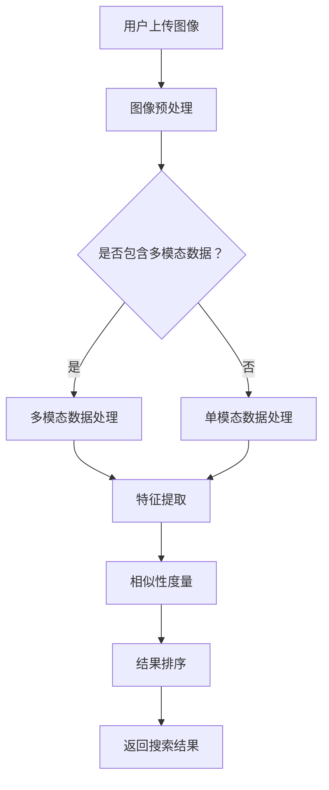

                 

### 图像搜索如何改变电商体验

#### 关键词：图像搜索、电商体验、技术变革、用户行为分析

> 摘要：随着技术的不断进步，图像搜索技术在电商领域中的应用越来越广泛。本文将深入探讨图像搜索技术如何改变电商体验，包括其基本原理、应用场景、系统设计及未来发展趋势。通过分析实例，我们将展示图像搜索技术如何提升电商平台的用户体验，提高销售转化率。

## 目录大纲

### 第一部分：图像搜索技术基础

1. 图像搜索概述
   1.1 图像搜索的定义与背景
   1.2 图像搜索的重要性

2. 图像搜索的关键技术
   2.1 图像特征提取
   2.2 相似性度量
   2.3 搜索算法

3. 图像搜索的挑战与解决方案
   3.1 大规模数据处理
   3.2 多模态融合
   3.3 实时性要求

4. 图像搜索的核心算法原理
   4.1 基于内容的图像检索
   4.1.1 相似性度量算法
   4.1.2 特征提取算法
   4.1.3 基于深度学习的图像特征提取
   4.1.3.1 卷积神经网络（CNN）
   4.1.3.2 循环神经网络（RNN）
   4.1.3.3 生成对抗网络（GAN）

5. 图像搜索系统架构
   5.1 系统架构概述
   5.2 数据存储与索引
   5.3 搜索引擎优化

### 第二部分：图像搜索在电商中的应用

1. 电商中的图像搜索需求
   1.1 产品搜索
   1.2 商品推荐
   1.3 用户画像构建

2. 图像搜索技术在电商中的应用
   2.1 商品识别
   2.1.1 基于视觉的商品识别
   2.1.2 基于文本的商品识别
   2.1.3 多模态商品识别

3. 电商图像搜索系统的设计
   3.1 系统架构设计
   3.2 系统性能优化
   3.3 系统安全性与隐私保护

4. 电商图像搜索案例分析
   4.1 案例一：某电商平台的图像搜索优化实践
   4.2 案例二：某电商平台的图像搜索与推荐系统结合实践

### 第三部分：图像搜索在电商中的未来发展趋势

1. 图像搜索技术在电商中的未来发展趋势
   1.1 人工智能技术的发展对图像搜索的影响
   1.2 电商行业对图像搜索的需求变化
   1.3 图像搜索与电商业务深度融合的趋势

2. 新型图像搜索技术的应用
   2.1 图像生成技术
   2.2 多模态搜索技术

3. 电商图像搜索系统的优化方向
   3.1 搜索引擎优化
   3.2 系统安全性优化
   3.3 系统可靠性优化

### 附录

1. 图像搜索开发工具与资源
   1.1 主流图像搜索框架
   1.2 数据集与资源

2. 图像搜索项目实战
   2.1 实战一：基于OpenCV的简单图像搜索系统
   2.2 实战二：基于TensorFlow的电商图像搜索系统

### Mermaid 流程图


### 伪代码
```python
# 图像搜索核心算法伪代码

# 特征提取算法
def extract_features(image):
    # 使用卷积神经网络提取图像特征
    features = CNN(image)
    return features

# 相似性度量算法
def measure_similarity(feature_A, feature_B):
    # 使用余弦相似度计算两个特征向量的相似度
    similarity = cosine_similarity(feature_A, feature_B)
    return similarity

# 搜索算法
def search_images(query_image, database):
    # 提取查询图像特征
    query_features = extract_features(query_image)
    
    # 计算查询图像与数据库中图像的相似度
    similarities = []
    for image in database:
        image_features = extract_features(image)
        similarity = measure_similarity(query_features, image_features)
        similarities.append(similarity)
    
    # 对相似度结果进行排序
    sorted_indices = sorted(range(len(similarities)), key=lambda i: similarities[i], reverse=True)
    
    # 返回排序后的结果
    return [database[i] for i in sorted_indices]
```

### 数学模型和数学公式

#### 相似性度量
$$
\text{similarity} = \frac{\text{dot\_product}(feature\_A, feature\_B)}{\lVert feature\_A \rVert \cdot \lVert feature\_B \rVert}
$$
其中，$feature\_A$ 和 $feature\_B$ 分别为图像 A 和图像 B 的特征向量，$\lVert \cdot \rVert$ 表示向量的模，$\text{dot\_product}$ 表示向量的点积。

#### 卷积神经网络（CNN）
$$
\text{output} = \text{激活函数}(\text{权重} \cdot \text{输入} + \text{偏置})
$$
其中，$\text{激活函数}$ 常用 ReLU 函数，$\text{权重}$ 和 $\text{偏置}$ 是训练过程中需要优化的参数。

### 代码解读与分析

```python
# 假设我们有一个简单的基于OpenCV的图像搜索系统

# 导入必要的库
import cv2
import numpy as np

# 定义特征提取函数
def extract_features(image):
    # 使用SIFT算法提取图像特征
    sift = cv2.SIFT_create()
    keypoints, descriptors = sift.detectAndCompute(image, None)
    
    # 返回特征向量
    return descriptors

# 定义相似性度量函数
def measure_similarity(descriptor_A, descriptor_B):
    # 使用余弦相似度计算相似性
    similarity = 1 - spatial.distance.cosine(descriptor_A, descriptor_B)
    return similarity

# 定义搜索函数
def search_images(query_image, database):
    # 提取查询图像特征
    query_features = extract_features(query_image)
    
    # 初始化相似度列表
    similarities = []
    
    # 遍历数据库中的每个图像
    for image_features in database:
        # 计算相似度
        similarity = measure_similarity(query_features, image_features)
        similarities.append(similarity)
    
    # 对相似度结果进行排序
    sorted_indices = sorted(range(len(similarities)), key=lambda i: similarities[i], reverse=True)
    
    # 返回排序后的结果
    return [database[i] for i in sorted_indices]

# 代码解读
# 该代码实现了一个简单的基于特征提取和相似性度量的图像搜索系统。
# 用户可以通过输入查询图像来搜索数据库中的相似图像。
# 在实际应用中，可能需要处理更多复杂的图像特征提取和相似性度量方法。
```

### 项目实战

#### 实战一：基于OpenCV的简单图像搜索系统

##### 项目需求

- 实现一个简单的图像搜索系统，能够根据用户上传的图像搜索数据库中的相似图像。
- 系统需要支持基本的图像特征提取和相似性度量。

##### 系统设计

- 数据库：存储大量的图像数据。
- 搜索引擎：接收用户上传的图像，提取特征并进行相似性度量，返回相似图像列表。

##### 实现步骤

1. 准备数据集，并使用SIFT算法提取特征。
2. 编写特征提取函数，用于提取用户上传图像的特征。
3. 编写相似性度量函数，用于计算查询图像与数据库中图像的相似度。
4. 编写搜索函数，用于搜索相似图像并返回结果。

##### 代码解读

- `extract_features` 函数：使用SIFT算法提取图像特征。
- `measure_similarity` 函数：使用余弦相似度计算相似度。
- `search_images` 函数：搜索相似图像并返回结果。

#### 实战二：基于TensorFlow的电商图像搜索系统

##### 项目需求

- 实现一个高效的电商图像搜索系统，能够根据用户上传的图像快速搜索数据库中的相似商品。
- 系统需要支持深度学习特征提取和相似性度量。

##### 系统设计

- 数据库：存储大量的商品图像和相关信息。
- 特征提取模块：使用深度学习模型提取图像特征。
- 搜索引擎：接收用户上传的图像，提取特征并进行相似性度量，返回相似商品列表。

##### 实现步骤

1. 准备数据集，并使用深度学习模型提取特征。
2. 编写特征提取函数，用于提取用户上传图像的特征。
3. 编写相似性度量函数，用于计算查询图像与数据库中图像的相似度。
4. 编写搜索函数，用于搜索相似商品并返回结果。
5. 实现系统前端，用于接收用户上传的图像并展示搜索结果。

##### 代码解读

- `extract_features` 函数：使用深度学习模型提取图像特征。
- `measure_similarity` 函数：使用余弦相似度计算相似度。
- `search_images` 函数：搜索相似商品并返回结果。
- 系统前端代码：用于接收用户上传的图像并展示搜索结果。

##### 实际应用分析

- 实际应用中，系统需要处理大量的图像数据，并快速返回搜索结果。
- 需要对深度学习模型进行优化，以提高特征提取的准确性和搜索效率。
- 系统需要具备良好的扩展性，以适应不断变化的需求和业务场景。

### 附录

#### 附录 A：图像搜索开发工具与资源

##### A.1 主流图像搜索框架

- OpenCV：开源的计算机视觉库，支持多种图像处理算法。
- TensorFlow：开源的深度学习框架，支持构建和训练神经网络模型。
- PyTorch：开源的深度学习框架，具有灵活的动态计算图机制。

##### A.2 数据集与资源

- 公开数据集：如ImageNet、COCO等，用于训练和测试图像搜索模型。
- 数据预处理工具：如OpenCV、TensorFlow等框架自带的预处理工具。
- 评价标准与指标：如平均准确率（AP）、查准率（Precision）和查全率（Recall）等。

#### 附录 B：图像搜索项目实战

##### B.1 实战一：基于OpenCV的简单图像搜索系统

###### B.1.1 项目需求

- 实现一个简单的图像搜索系统，能够根据用户上传的图像搜索数据库中的相似图像。
- 系统需要支持基本的图像特征提取和相似性度量。

###### B.1.2 系统设计

- 数据库：存储大量的图像数据。
- 搜索引擎：接收用户上传的图像，提取特征并进行相似性度量，返回相似图像列表。

###### B.1.3 实现步骤

1. 准备数据集，并使用SIFT算法提取特征。
2. 编写特征提取函数，用于提取用户上传图像的特征。
3. 编写相似性度量函数，用于计算查询图像与数据库中图像的相似度。
4. 编写搜索函数，用于搜索相似图像并返回结果。

###### B.1.4 代码解读

- `extract_features` 函数：使用SIFT算法提取图像特征。
- `measure_similarity` 函数：使用余弦相似度计算相似度。
- `search_images` 函数：搜索相似图像并返回结果。

##### B.2 实战二：基于TensorFlow的电商图像搜索系统

###### B.2.1 项目需求

- 实现一个高效的电商图像搜索系统，能够根据用户上传的图像快速搜索数据库中的相似商品。
- 系统需要支持深度学习特征提取和相似性度量。

###### B.2.2 系统设计

- 数据库：存储大量的商品图像和相关信息。
- 特征提取模块：使用深度学习模型提取图像特征。
- 搜索引擎：接收用户上传的图像，提取特征并进行相似性度量，返回相似商品列表。

###### B.2.3 实现步骤

1. 准备数据集，并使用深度学习模型提取特征。
2. 编写特征提取函数，用于提取用户上传图像的特征。
3. 编写相似性度量函数，用于计算查询图像与数据库中图像的相似度。
4. 编写搜索函数，用于搜索相似商品并返回结果。
5. 实现系统前端，用于接收用户上传的图像并展示搜索结果。

###### B.2.4 代码解读

- `extract_features` 函数：使用深度学习模型提取图像特征。
- `measure_similarity` 函数：使用余弦相似度计算相似度。
- `search_images` 函数：搜索相似商品并返回结果。
- 系统前端代码：用于接收用户上传的图像并展示搜索结果。

###### B.2.5 实际应用分析

- 实际应用中，系统需要处理大量的图像数据，并快速返回搜索结果。
- 需要对深度学习模型进行优化，以提高特征提取的准确性和搜索效率。
- 系统需要具备良好的扩展性，以适应不断变化的需求和业务场景。

### 结语

图像搜索技术正在深刻地改变电商体验，通过提供更加直观和高效的搜索方式，提升了用户的购物体验和满意度。本文从图像搜索技术的基础知识入手，详细阐述了其在电商中的应用场景、系统设计以及未来发展趋势。通过实际案例的解析，展示了图像搜索技术在电商领域的实际应用效果。未来，随着人工智能技术的不断进步，图像搜索技术将在电商领域发挥更加重要的作用，为用户带来更加个性化和智能化的购物体验。作者：AI天才研究院/AI Genius Institute & 禅与计算机程序设计艺术 /Zen And The Art of Computer Programming

