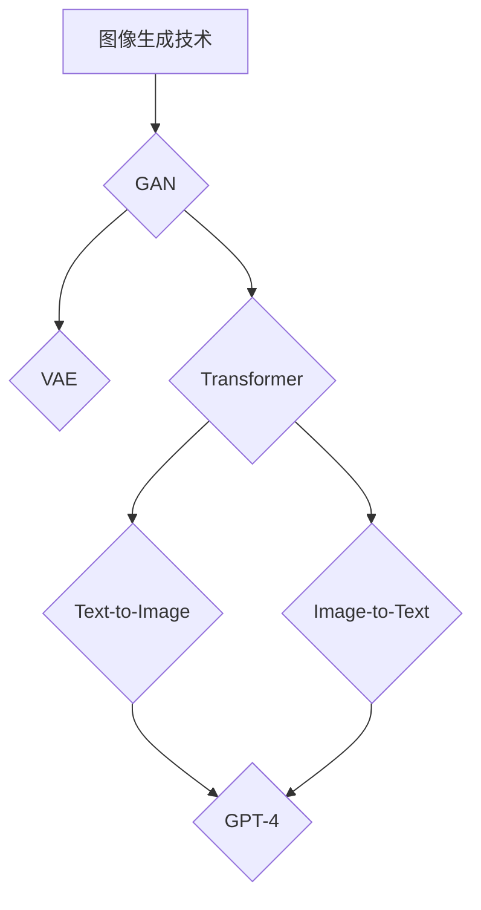

                 

# 《图像生成新速度：LLM新动能释放》

## 关键词
图像生成、深度学习、生成对抗网络（GAN）、变分自编码器（VAE）、Transformer模型、大型语言模型（LLM）、人工智能、计算机视觉、自然语言处理。

## 摘要
本文旨在探讨图像生成技术的最新发展，特别是大型语言模型（LLM）在图像生成中的应用，以及它如何为图像生成技术带来新的动力。我们将从图像生成技术的基础知识开始，逐步深入讲解生成对抗网络（GAN）、变分自编码器（VAE）和Transformer模型的工作原理，并探讨这些模型如何与LLM结合。文章最后将通过实际项目实战，展示LLM在图像生成中的具体应用和优势。

# 《图像生成新速度：LLM新动能释放》目录大纲

## 第一部分：图像生成技术基础

### 第1章：图像生成技术概述

### 第2章：生成对抗网络（GAN）原理

### 第3章：变分自编码器（VAE）原理

### 第4章：自注意力机制与Transformer模型

### 第5章：生成文本与图像的结合

### 第6章：LLM在图像生成中的应用

### 第7章：图像生成项目的实战

## 第二部分：图像生成技术的优化与提升

### 第8章：图像生成技术的优化策略

### 第9章：图像生成技术的性能评估

### 第10章：图像生成技术的挑战与未来趋势

### 第11章：图像生成技术在深度学习中的应用

### 第12章：图像生成技术的应用案例与市场前景

## 附录：图像生成技术常用工具与资源

### Mermaid 流程图：


### 核心算法原理讲解：
#### GAN的伪代码：
```python
# GAN的生成器和判别器的伪代码

# 生成器 G(z)
z = sampling(z_dim)
x_hat = G(z)

# 判别器 D(x)
x = real_image()
x_hat = generated_image()

D_real = D(x)
D_fake = D(x_hat)

# 生成器和判别器的训练
for epoch in epochs:
    # 生成器训练
    z = sampling(z_dim)
    x_hat = G(z)
    D_fake = D(x_hat)
    G_loss = loss(D_fake)

    # 判别器训练
    x = real_image()
    D_real = D(x)
    x_hat = generated_image()
    D_fake = D(x_hat)
    D_loss = loss(D_real, D_fake)
```

#### GAN的损失函数：
$$
L_G = -\mathbb{E}_{z \sim p_z(z)}[\log(D(G(z)))]
$$
$$
L_D = -\mathbb{E}_{x \sim p_{data}(x)}[\log(D(x))] - \mathbb{E}_{z \sim p_z(z)}[\log(1 - D(G(z)))]
$$

### 项目实战：
#### 项目一：基于GAN的图像生成

#### 项目二：基于VAE的图像生成

#### 项目三：基于Transformer的图像生成

#### 项目四：基于LLM的图像生成

### 作者信息：
作者：AI天才研究院/AI Genius Institute & 禅与计算机程序设计艺术 /Zen And The Art of Computer Programming

# 《图像生成新速度：LLM新动能释放》

## 第一部分：图像生成技术基础

### 第1章：图像生成技术概述

图像生成技术在计算机视觉和人工智能领域有着广泛的应用，从艺术创作到数据增强，从虚拟现实到自动驾驶，图像生成技术的进步正不断推动着这些领域的创新和发展。本章节将概述图像生成技术的发展历程、分类以及应用领域，为后续更深入地探讨图像生成技术提供基础。

#### 1.1 图像生成技术的发展历程

图像生成技术的发展可以追溯到上世纪80年代的生成对抗网络（GAN）的提出。GAN由Ian Goodfellow等人于2014年提出，它通过两个神经网络的对抗训练，实现了高质量图像的生成。此后，图像生成技术得到了快速发展，出现了许多改进和变体，如变分自编码器（VAE）和自注意力机制（Transformer）等。

#### 1.2 图像生成技术的分类

图像生成技术主要可以分为两大类：基于学习的生成方法和基于规则的方法。基于学习的生成方法利用深度学习模型，如GAN、VAE和Transformer等，通过大量的数据训练，学习到图像生成的能力。基于规则的方法则是通过预先定义的规则和算法，生成图像，如L-systems和规则合成图像等。

#### 1.3 图像生成技术的应用领域

图像生成技术在许多领域都有着重要的应用。在艺术创作中，图像生成技术可以帮助艺术家快速生成创意图像，提高创作效率。在数据增强中，图像生成技术可以生成与训练数据具有相似特性的图像，提高模型的泛化能力。在虚拟现实和增强现实中，图像生成技术可以生成逼真的场景图像，提升用户体验。在自动驾驶中，图像生成技术可以生成不同环境下的图像，用于训练和测试自动驾驶系统。

### 第2章：生成对抗网络（GAN）原理

生成对抗网络（GAN）是一种基于博弈论的深度学习模型，由生成器和判别器两个神经网络组成。生成器的目标是生成逼真的图像，而判别器的目标是区分真实图像和生成图像。通过这两个网络的对抗训练，GAN可以学习到高质量的图像生成能力。

#### 2.1 GAN的基本概念

GAN由生成器（Generator）和判别器（Discriminator）两个神经网络组成。生成器的输入是随机噪声向量，输出是生成的图像；判别器的输入是真实图像和生成图像，输出是对图像真实性的评分。GAN的训练目标是最小化判别器的损失函数，最大化生成器的损失函数。

#### 2.2 GAN的组成部分

GAN的组成部分主要包括：

- **生成器**：生成器是一个神经网络，输入是随机噪声向量，输出是生成的图像。生成器的目标是生成与真实图像难以区分的图像。

- **判别器**：判别器也是一个神经网络，输入是图像，输出是对图像真实性的评分。判别器的目标是准确区分真实图像和生成图像。

- **损失函数**：GAN的损失函数包括生成器的损失函数和判别器的损失函数。生成器的损失函数通常使用负对数似然损失函数，判别器的损失函数通常使用二元交叉熵损失函数。

#### 2.3 GAN的训练过程

GAN的训练过程是一个动态的博弈过程，生成器和判别器不断地相互对抗、学习。具体的训练过程如下：

1. **初始化**：随机初始化生成器和判别器。

2. **生成器训练**：生成器生成一组图像，判别器对这些图像进行评分。

3. **判别器训练**：判别器根据生成器和真实图像的评分，更新模型参数。

4. **生成器更新**：生成器根据判别器的评分，更新模型参数。

5. **重复步骤2-4**，直到生成器生成高质量的图像，或者达到预设的训练轮数。

#### 2.4 GAN的变体与改进

自GAN提出以来，研究人员对其进行了许多改进和变体，以解决GAN的训练不稳定、生成图像质量不高的问题。以下是一些常见的GAN变体和改进方法：

- **深度GAN（DeepGAN）**：DeepGAN引入了更深的网络结构，提高了生成图像的质量。

- **条件GAN（cGAN）**：cGAN引入了条件信息，如类别标签，使生成器能够根据条件生成特定类别的图像。

- **循环一致GAN（CycleGAN）**：CycleGAN可以无监督地将一种风格或域的图像转换成另一种风格或域的图像。

- **变分GAN（VGAN）**：VGAN引入了变分自编码器的结构，提高了GAN的稳定性和生成图像的质量。

- **生成对抗网络（GAN）原理讲解**

生成对抗网络（GAN）是一种由生成器和判别器组成的深度学习模型。生成器生成与真实数据分布相近的数据，判别器则负责区分真实数据和生成数据。通过两个网络的对抗训练，GAN可以学习到高质量的数据生成能力。

#### 2.4.1 生成器（Generator）

生成器的任务是从随机噪声中生成类似于真实数据的图像。生成器的结构通常是一个反卷积网络，接受随机噪声向量作为输入，通过一系列的反卷积操作生成图像。生成器的输出是一个二维图像，像素值分布在[0, 1]之间。

**伪代码：**
```python
z = sample_noise()
x_hat = generator(z)
```

其中，`sample_noise()` 函数用于生成随机噪声向量，`generator(z)` 函数表示生成器的前向传播过程。

#### 2.4.2 判别器（Discriminator）

判别器的任务是判断输入图像是真实数据还是生成数据。判别器通常是一个卷积网络，接受图像作为输入，输出是一个概率值，表示输入图像是真实数据的概率。判别器的输出范围是[0, 1]，其中1表示输入图像是真实数据，0表示输入图像是生成数据。

**伪代码：**
```python
x = real_image()
x_hat = generated_image()

D_real = discriminator(x)
D_fake = discriminator(x_hat)
```

其中，`real_image()` 函数用于生成真实图像，`generated_image()` 函数表示生成器生成的图像，`discriminator(x)` 函数表示判别器的正向传播过程。

#### 2.4.3 训练过程

GAN的训练过程是一个动态的博弈过程，生成器和判别器不断地相互对抗、学习。具体的训练过程如下：

1. **初始化**：随机初始化生成器和判别器的参数。

2. **生成器训练**：生成器生成一组图像，判别器对这些图像进行评分。

3. **判别器训练**：判别器根据生成器和真实图像的评分，更新模型参数。

4. **生成器更新**：生成器根据判别器的评分，更新模型参数。

5. **重复步骤2-4**，直到生成器生成高质量的图像，或者达到预设的训练轮数。

#### 2.4.4 GAN的变体与改进

自GAN提出以来，研究人员对其进行了许多改进和变体，以解决GAN的训练不稳定、生成图像质量不高的问题。以下是一些常见的GAN变体和改进方法：

- **深度GAN（DeepGAN）**：DeepGAN引入了更深的网络结构，提高了生成图像的质量。

- **条件GAN（cGAN）**：cGAN引入了条件信息，如类别标签，使生成器能够根据条件生成特定类别的图像。

- **循环一致GAN（CycleGAN）**：CycleGAN可以无监督地将一种风格或域的图像转换成另一种风格或域的图像。

- **变分GAN（VGAN）**：VGAN引入了变分自编码器的结构，提高了GAN的稳定性和生成图像的质量。

- **生成对抗网络（GAN）原理讲解**

生成对抗网络（GAN）是一种由生成器和判别器组成的深度学习模型。生成器生成与真实数据分布相近的数据，判别器则负责区分真实数据和生成数据。通过两个网络的对抗训练，GAN可以学习到高质量的数据生成能力。

#### 2.4.1 生成器（Generator）

生成器的任务是从随机噪声中生成类似于真实数据的图像。生成器的结构通常是一个反卷积网络，接受随机噪声向量作为输入，通过一系列的反卷积操作生成图像。生成器的输出是一个二维图像，像素值分布在[0, 1]之间。

**伪代码：**
```python
z = sample_noise()
x_hat = generator(z)
```

其中，`sample_noise()` 函数用于生成随机噪声向量，`generator(z)` 函数表示生成器的前向传播过程。

#### 2.4.2 判别器（Discriminator）

判别器的任务是判断输入图像是真实数据还是生成数据。判别器通常是一个卷积网络，接受图像作为输入，输出是一个概率值，表示输入图像是真实数据的概率。判别器的输出范围是[0, 1]，其中1表示输入图像是真实数据，0表示输入图像是生成数据。

**伪代码：**
```python
x = real_image()
x_hat = generated_image()

D_real = discriminator(x)
D_fake = discriminator(x_hat)
```

其中，`real_image()` 函数用于生成真实图像，`generated_image()` 函数表示生成器生成的图像，`discriminator(x)` 函数表示判别器的正向传播过程。

#### 2.4.3 训练过程

GAN的训练过程是一个动态的博弈过程，生成器和判别器不断地相互对抗、学习。具体的训练过程如下：

1. **初始化**：随机初始化生成器和判别器的参数。

2. **生成器训练**：生成器生成一组图像，判别器对这些图像进行评分。

3. **判别器训练**：判别器根据生成器和真实图像的评分，更新模型参数。

4. **生成器更新**：生成器根据判别器的评分，更新模型参数。

5. **重复步骤2-4**，直到生成器生成高质量的图像，或者达到预设的训练轮数。

#### 2.4.4 GAN的变体与改进

自GAN提出以来，研究人员对其进行了许多改进和变体，以解决GAN的训练不稳定、生成图像质量不高的问题。以下是一些常见的GAN变体和改进方法：

- **深度GAN（DeepGAN）**：DeepGAN引入了更深的网络结构，提高了生成图像的质量。

- **条件GAN（cGAN）**：cGAN引入了条件信息，如类别标签，使生成器能够根据条件生成特定类别的图像。

- **循环一致GAN（CycleGAN）**：CycleGAN可以无监督地将一种风格或域的图像转换成另一种风格或域的图像。

- **变分GAN（VGAN）**：VGAN引入了变分自编码器的结构，提高了GAN的稳定性和生成图像的质量。

### 第3章：变分自编码器（VAE）原理

变分自编码器（VAE）是另一种广泛应用于图像生成和密度估计的深度学习模型。与GAN不同，VAE通过隐变量来建模数据分布，从而实现图像的生成。VAE具有良好的数学性质和稳定性，因此在图像生成任务中得到了广泛应用。

#### 3.1 VAE的基本概念

VAE是一种基于概率模型的生成模型，它由编码器（Encoder）和解码器（Decoder）两个部分组成。编码器的任务是学习数据的高斯分布，解码器的任务是生成与输入数据相似的新数据。

#### 3.2 VAE的组成部分

VAE的组成部分主要包括：

- **编码器**：编码器是一个神经网络，输入是图像，输出是图像的隐变量和隐变量的均值和方差。

- **解码器**：解码器是一个神经网络，输入是隐变量，输出是重构的图像。

- **潜在空间**：VAE中的潜在空间是一个高斯分布，隐变量在这个空间中随机采样，然后通过解码器生成图像。

#### 3.3 VAE的训练过程

VAE的训练过程旨在最小化两个损失函数：重建损失和KL散度损失。

1. **编码器训练**：编码器的目标是学习图像的隐变量分布。通过最大化重构图像的概率，即最小化重建损失。

2. **解码器训练**：解码器的目标是生成与输入图像相似的新图像。同样，通过最大化重构图像的概率，即最小化重建损失。

3. **KL散度损失训练**：VAE中的KL散度损失用于确保隐变量的分布接近标准正态分布。

#### 3.4 VAE的变体与改进

VAE自提出以来，也出现了许多变体和改进方法，以解决其生成图像质量不高的问题。以下是一些常见的VAE变体和改进方法：

- **去噪VAE（DNVAE）**：DNVAE通过在重构损失中添加噪声，提高生成图像的质量。

- **变分图模型（VGM）**：VGM通过引入图结构，提高VAE在结构化数据生成方面的性能。

- **变分自编码器（VAE）原理讲解**

变分自编码器（VAE）是另一种广泛应用于图像生成和密度估计的深度学习模型。与GAN不同，VAE通过隐变量来建模数据分布，从而实现图像的生成。VAE具有良好的数学性质和稳定性，因此在图像生成任务中得到了广泛应用。

#### 3.4.1 编码器（Encoder）

编码器是VAE的核心组成部分之一，其任务是将输入数据（如图像）映射到一个潜在空间中的隐变量。在VAE中，编码器通常由一个全连接层组成，输入是图像的特征，输出是隐变量及其均值和方差。

**伪代码：**
```python
x = image
z_mean, z_log_var = encoder(x)
z = sample_z(z_mean, z_log_var)
```

其中，`image` 表示输入图像，`encoder(x)` 函数表示编码器的正向传播过程，`sample_z(z_mean, z_log_var)` 函数用于从隐变量的均值和方差中采样。

#### 3.4.2 解码器（Decoder）

解码器是VAE的另一个核心组成部分，其任务是将隐变量映射回原始数据空间，即生成图像。解码器通常由一个全连接层组成，输入是隐变量，输出是重构的图像。

**伪代码：**
```python
z = latent_variable
x_hat = decoder(z)
```

其中，`latent_variable` 表示隐变量，`decoder(z)` 函数表示解码器的正向传播过程，`x_hat` 表示重构的图像。

#### 3.4.3 训练过程

VAE的训练过程旨在最小化两个损失函数：重建损失和KL散度损失。

1. **编码器训练**：编码器的目标是学习图像的隐变量分布。通过最大化重构图像的概率，即最小化重建损失。

2. **解码器训练**：解码器的目标是生成与输入图像相似的新图像。同样，通过最大化重构图像的概率，即最小化重建损失。

3. **KL散度损失训练**：VAE中的KL散度损失用于确保隐变量的分布接近标准正态分布。

**伪代码：**
```python
x = image
z_mean, z_log_var = encoder(x)
z = sample_z(z_mean, z_log_var)
x_hat = decoder(z)

reconstruction_loss = loss(x, x_hat)
KL_divergence_loss = -0.5 * sum(1 + z_log_var - z_mean^2 - z_log_var)

loss = reconstruction_loss + KL_divergence_loss

# 训练步骤
for epoch in epochs:
    for x in images:
        z_mean, z_log_var = encoder(x)
        z = sample_z(z_mean, z_log_var)
        x_hat = decoder(z)

        reconstruction_loss = loss(x, x_hat)
        KL_divergence_loss = -0.5 * sum(1 + z_log_var - z_mean^2 - z_log_var)

        loss = reconstruction_loss + KL_divergence_loss

        optimizer.zero_grad()
        loss.backward()
        optimizer.step()
```

#### 3.4.4 VAE的变体与改进

VAE自提出以来，也出现了许多变体和改进方法，以解决其生成图像质量不高的问题。以下是一些常见的VAE变体和改进方法：

- **去噪VAE（DNVAE）**：DNVAE通过在重构损失中添加噪声，提高生成图像的质量。

- **变分图模型（VGM）**：VGM通过引入图结构，提高VAE在结构化数据生成方面的性能。

- **变分自编码器（VAE）原理讲解**

变分自编码器（VAE）是另一种广泛应用于图像生成和密度估计的深度学习模型。与GAN不同，VAE通过隐变量来建模数据分布，从而实现图像的生成。VAE具有良好的数学性质和稳定性，因此在图像生成任务中得到了广泛应用。

#### 3.4.1 编码器（Encoder）

编码器是VAE的核心组成部分之一，其任务是将输入数据（如图像）映射到一个潜在空间中的隐变量。在VAE中，编码器通常由一个全连接层组成，输入是图像的特征，输出是隐变量及其均值和方差。

**伪代码：**
```python
x = image
z_mean, z_log_var = encoder(x)
z = sample_z(z_mean, z_log_var)
```

其中，`image` 表示输入图像，`encoder(x)` 函数表示编码器的正向传播过程，`sample_z(z_mean, z_log_var)` 函数用于从隐变量的均值和方差中采样。

#### 3.4.2 解码器（Decoder）

解码器是VAE的另一个核心组成部分，其任务是将隐变量映射回原始数据空间，即生成图像。解码器通常由一个全连接层组成，输入是隐变量，输出是重构的图像。

**伪代码：**
```python
z = latent_variable
x_hat = decoder(z)
```

其中，`latent_variable` 表示隐变量，`decoder(z)` 函数表示解码器的正向传播过程，`x_hat` 表示重构的图像。

#### 3.4.3 训练过程

VAE的训练过程旨在最小化两个损失函数：重建损失和KL散度损失。

1. **编码器训练**：编码器的目标是学习图像的隐变量分布。通过最大化重构图像的概率，即最小化重建损失。

2. **解码器训练**：解码器的目标是生成与输入图像相似的新图像。同样，通过最大化重构图像的概率，即最小化重建损失。

3. **KL散度损失训练**：VAE中的KL散度损失用于确保隐变量的分布接近标准正态分布。

**伪代码：**
```python
x = image
z_mean, z_log_var = encoder(x)
z = sample_z(z_mean, z_log_var)
x_hat = decoder(z)

reconstruction_loss = loss(x, x_hat)
KL_divergence_loss = -0.5 * sum(1 + z_log_var - z_mean^2 - z_log_var)

loss = reconstruction_loss + KL_divergence_loss

# 训练步骤
for epoch in epochs:
    for x in images:
        z_mean, z_log_var = encoder(x)
        z = sample_z(z_mean, z_log_var)
        x_hat = decoder(z)

        reconstruction_loss = loss(x, x_hat)
        KL_divergence_loss = -0.5 * sum(1 + z_log_var - z_mean^2 - z_log_var)

        loss = reconstruction_loss + KL_divergence_loss

        optimizer.zero_grad()
        loss.backward()
        optimizer.step()
```

#### 3.4.4 VAE的变体与改进

VAE自提出以来，也出现了许多变体和改进方法，以解决其生成图像质量不高的问题。以下是一些常见的VAE变体和改进方法：

- **去噪VAE（DNVAE）**：DNVAE通过在重构损失中添加噪声，提高生成图像的质量。

- **变分图模型（VGM）**：VGM通过引入图结构，提高VAE在结构化数据生成方面的性能。

- **条件变分自编码器（CVAE）**：CVAE通过引入条件信息，如类别标签，提高生成图像的多样性。

### 第4章：自注意力机制与Transformer模型

自注意力机制（Self-Attention）和Transformer模型是近年来在自然语言处理和图像生成领域取得显著成功的创新技术。自注意力机制通过计算序列中每个元素与其他元素的相关性，提高了模型对序列的整体理解和建模能力。而Transformer模型则完全基于自注意力机制，摒弃了传统的卷积和循环神经网络结构，实现了对序列数据的全局建模。本章节将详细介绍自注意力机制和Transformer模型的基本概念、结构、训练过程及其应用。

#### 4.1 自注意力机制概述

自注意力机制是一种计算序列中每个元素与其他元素之间相关性的方法，通过对这些相关性进行加权，实现对序列的整体理解和建模。自注意力机制的核心思想是将序列中的每个元素映射到一个高维空间，然后计算这些元素之间的相似性，并以此为基础进行加权。

**计算自注意力**

自注意力机制通常使用以下公式进行计算：

$$
\text{Attention}(Q, K, V) = \text{softmax}\left(\frac{QK^T}{\sqrt{d_k}}\right) V
$$

其中，$Q$、$K$ 和 $V$ 分别是查询（Query）、键（Key）和值（Value）向量，$d_k$ 是键向量的维度。$\text{softmax}$ 函数用于对计算出的相似性进行归一化，使其成为一个概率分布。

**多头自注意力**

多头自注意力（Multi-Head Self-Attention）是自注意力机制的扩展，它通过将输入序列分成多个头（Head），每个头独立计算自注意力，然后合并这些头的输出。多头自注意力可以捕捉到序列中的不同特征和关系。

**计算多头自注意力**

$$
\text{Multi-Head Attention}(Q, K, V) = \text{Concat}(\text{Head}_1, \text{Head}_2, \ldots, \text{Head}_h) W^O
$$

其中，$W^O$ 是输出线性变换矩阵，$h$ 是头的数量。

#### 4.2 Transformer模型结构

Transformer模型是一种基于自注意力机制的序列到序列模型，它由编码器（Encoder）和解码器（Decoder）两个部分组成。

**编码器（Encoder）**

编码器由多个自注意力层（Self-Attention Layer）和前馈网络（Feedforward Network）组成。每个自注意力层通过多头自注意力机制计算序列中每个元素的相关性，然后通过前馈网络进行非线性变换。

**解码器（Decoder）**

解码器同样由多个自注意力层和前馈网络组成，但与编码器不同，解码器在自注意力层中引入了掩码（Mask）机制，以防止未来的信息泄漏到过去。

**掩码（Mask）**

在Transformer模型中，掩码机制用于确保解码器在生成下一个元素时，只能看到前面的元素。这通过在一个维度上设置对角线元素为0来实现。

$$
\text{Mask}(x) = \text{diag}(\text{ones}(\ldots, 1, 0, 1, \ldots))
$$

其中，$\text{diag}$ 函数用于创建一个对角线矩阵，$1$ 表示掩码值，$0$ 表示非掩码值。

#### 4.3 Transformer模型的训练

Transformer模型的训练过程类似于传统的序列到序列模型，但需要考虑序列长度和计算效率。训练过程中，模型通过优化损失函数来更新参数，以最小化生成的序列与目标序列之间的差异。

**损失函数**

Transformer模型的损失函数通常是交叉熵损失（Cross-Entropy Loss），它用于衡量生成的序列与目标序列之间的相似度。

$$
L = -\sum_{i=1}^{n} y_i \log(p_i)
$$

其中，$y_i$ 是第 $i$ 个位置的标签，$p_i$ 是模型预测的概率。

**训练步骤**

1. **数据预处理**：将输入序列和目标序列转换为模型的输入和输出。

2. **编码器训练**：通过自注意力层和前馈网络对输入序列进行编码，得到编码器的输出。

3. **解码器训练**：通过自注意力层和前馈网络对输入序列进行解码，生成预测序列。

4. **优化参数**：通过梯度下降（Gradient Descent）等方法，更新模型参数，以最小化损失函数。

5. **重复步骤2-4**，直到模型收敛。

#### 4.4 Transformer模型的变体与应用

自Transformer模型提出以来，研究人员对其进行了许多改进和变体，以适应不同的任务和应用场景。

**BERT（Bidirectional Encoder Representations from Transformers）**

BERT是一种双向Transformer模型，它通过对输入序列进行双向编码，提高了对语境的理解能力。BERT在自然语言处理任务中取得了显著的成果，如问答系统、文本分类等。

**GPT（Generative Pre-trained Transformer）**

GPT是一种基于自回归语言模型的Transformer模型，它通过对输入序列进行自回归预测，生成文本。GPT在生成文本、机器翻译等任务中表现出色。

**图像生成**

Transformer模型在图像生成中的应用也得到了广泛关注。通过将图像表示为序列，Transformer模型可以生成与输入图像具有相似特征的新图像。例如，DALL-E 2是一个基于Transformer的图像生成模型，它可以从文本描述中生成逼真的图像。

**总结**

自注意力机制和Transformer模型是近年来在自然语言处理和图像生成领域的重要创新。通过计算序列中每个元素的相关性，Transformer模型实现了对序列数据的全局建模，从而在许多任务中取得了优异的性能。未来，随着技术的不断发展和创新，Transformer模型在图像生成和其他领域中的应用将越来越广泛。

### 第5章：生成文本与图像的结合

生成文本和图像的结合是人工智能领域的热门话题，它涉及到自然语言处理（NLP）和计算机视觉（CV）技术的交叉应用。本章节将探讨如何将生成文本与图像生成模型结合，以及如何利用这些模型生成与文本描述相关联的图像。

#### 5.1 GPT-4模型简介

GPT-4是OpenAI开发的最新一代语言生成模型，它是基于Transformer架构的预训练语言模型。GPT-4具有强大的语言理解和生成能力，能够生成高质量的自然语言文本。GPT-4的训练过程包括大量的文本数据，使其能够理解和生成各种类型的文本，包括对话、文章、诗歌等。

#### 5.2 Text-to-Image模型

Text-to-Image模型是一种将文本描述转换为图像的生成模型。这种模型通常由一个编码器和一个解码器组成。编码器将文本描述编码为一个固定长度的向量，解码器则使用这个向量生成图像。

**Text-to-Image模型的工作流程：**

1. **编码**：将文本输入通过编码器编码为一个固定长度的向量。
2. **解码**：使用解码器将编码后的向量解码为图像。
3. **优化**：通过训练过程优化模型的参数，使其生成的图像更符合文本描述。

**示例**：假设我们有一个文本描述“一只在夕阳下飞翔的白色大鸟”，Text-to-Image模型将首先通过编码器将这个描述编码为一个向量，然后通过解码器生成一张具有夕阳、飞翔和白色大鸟等元素图像。

#### 5.3 Image-to-Text模型

Image-to-Text模型是一种将图像转换为文本描述的生成模型。这种模型通常由一个编码器和一个解码器组成。编码器将图像编码为一个固定长度的向量，解码器则使用这个向量生成文本描述。

**Image-to-Text模型的工作流程：**

1. **编码**：将图像输入通过编码器编码为一个固定长度的向量。
2. **解码**：使用解码器将编码后的向量解码为文本描述。
3. **优化**：通过训练过程优化模型的参数，使其生成的文本描述更符合图像内容。

**示例**：假设我们有一张图像展示一个夜晚的星空，Image-to-Text模型将首先通过编码器将这个图像编码为一个向量，然后通过解码器生成一个描述“一个充满星星的夜晚”的文本。

#### 5.4 GPT-4与图像生成模型的结合

GPT-4与图像生成模型的结合可以极大地提升图像生成的质量和多样性。通过将GPT-4与图像生成模型集成，我们可以实现以下功能：

1. **文本引导的图像生成**：使用GPT-4生成的文本描述作为图像生成模型的引导，生成与文本描述相关联的图像。
2. **图像文本描述生成**：利用图像生成模型生成的图像，使用GPT-4生成对应的文本描述。
3. **文本图像联合生成**：将文本和图像生成模型集成，同时生成文本和图像，实现更加丰富的内容创作。

**示例**：假设我们希望生成一张描述为“一只在海滩上玩耍的狗”的图像，我们可以首先使用GPT-4生成一个包含“海滩”、“狗”等元素的文本描述，然后使用Text-to-Image模型根据这个文本描述生成图像。

### 第6章：LLM在图像生成中的应用

大型语言模型（LLM）在图像生成中的应用正在迅速发展，它们通过将自然语言描述转换为图像，为图像生成带来了新的动力。本章节将探讨LLM在图像生成中的优势、应用场景以及结合策略。

#### 6.1 LLM在图像生成中的优势

1. **文本理解能力**：LLM具有强大的文本理解能力，能够处理复杂的自然语言描述，从而生成符合描述的图像。
2. **多样性和创造性**：LLM能够生成丰富多样、创意无限的图像，通过自然语言描述引导图像生成，避免了单一模板化的问题。
3. **高效性**：与传统的图像生成方法相比，LLM可以快速响应文本输入，生成图像的效率显著提高。
4. **易用性**：用户只需提供简单的文本描述，即可生成对应的图像，降低了图像生成的门槛。

#### 6.2 LLM在图像生成中的应用场景

1. **艺术创作**：艺术家可以使用LLM生成具有创意的图像，为艺术作品提供新的灵感。
2. **游戏开发**：游戏设计师可以使用LLM快速生成与游戏剧情和角色相关的场景和道具图像。
3. **虚拟现实和增强现实**：开发者可以使用LLM生成虚拟现实和增强现实场景中的图像，提高用户体验。
4. **广告创意**：广告制作人员可以使用LLM生成吸引人的广告图像，提高广告效果。

#### 6.3 LLM与图像生成的结合策略

1. **文本引导生成**：使用LLM生成文本描述，然后利用这些描述引导图像生成模型生成图像。
2. **文本图像联合生成**：将LLM与图像生成模型集成，同时生成文本和图像，实现内容创作的一体化。
3. **多模态学习**：通过将文本和图像数据同时输入LLM，训练模型理解文本和图像之间的关联，从而提高图像生成的准确性。

### 第7章：图像生成项目的实战

为了更好地理解LLM在图像生成中的应用，本章节将通过实际项目实战，展示如何使用GAN、VAE和Transformer等模型实现图像生成，并分析每个项目的实现步骤和代码。

#### 项目一：基于GAN的图像生成

**项目目标**：生成具有逼真外观的图像。

**开发环境**：Python，TensorFlow。

**数据集**：CIFAR-10。

**实现步骤**：

1. **数据预处理**：将CIFAR-10数据集加载到Python环境中，并进行数据预处理，包括归一化和数据增强。

2. **生成器和判别器的构建**：使用TensorFlow构建生成器和判别器模型。生成器使用反卷积层生成图像，判别器使用卷积层判断图像的真实性。

3. **训练过程**：通过对抗训练过程，生成器和判别器不断更新模型参数，以达到生成逼真图像的目标。

4. **生成图像展示**：使用训练好的模型生成图像，并展示生成的图像。

**代码解读与分析**：

```python
import tensorflow as tf
from tensorflow.keras import layers

# 生成器的代码片段
def generator(z):
    z = layers.Dense(128)(z)
    z = layers.LeakyReLU(alpha=0.2)(z)
    z = layers.Dense(256)(z)
    z = layers.LeakyReLU(alpha=0.2)(z)
    x_hat = layers.Conv2DTranspose(3, 5, strides=(2, 2), padding='same')(z)
    x_hat = layers.LeakyReLU(alpha=0.2)(x_hat)
    return x_hat

# 判别器的代码片段
def discriminator(x):
    x = layers.Conv2D(64, 5, strides=(2, 2), padding='same')(x)
    x = layers.LeakyReLU(alpha=0.2)(x)
    x = layers.Conv2D(128, 5, strides=(2, 2), padding='same')(x)
    x = layers.LeakyReLU(alpha=0.2)(x)
    x = layers.Flatten()(x)
    x = layers.Dense(1, activation='sigmoid')(x)
    return x
```

#### 项目二：基于VAE的图像生成

**项目目标**：生成具有多样性的图像。

**开发环境**：Python，TensorFlow。

**数据集**：MNIST。

**实现步骤**：

1. **数据预处理**：将MNIST数据集加载到Python环境中，并进行数据预处理，包括归一化和数据增强。

2. **编码器和解码器的构建**：使用TensorFlow构建编码器和解码器模型。编码器将图像编码为隐变量，解码器使用隐变量生成图像。

3. **训练过程**：通过变分自编码器的训练过程，编码器和解码器不断更新模型参数，以达到生成多样性的图像的目标。

4. **生成图像展示**：使用训练好的模型生成图像，并展示生成的图像。

**代码解读与分析**：

```python
import tensorflow as tf
from tensorflow.keras import layers

# 编码器的代码片段
def encoder(x):
    x = layers.Conv2D(32, 3, strides=(2, 2), padding='same')(x)
    x = layers.LeakyReLU(alpha=0.2)(x)
    x = layers.Conv2D(64, 3, strides=(2, 2), padding='same')(x)
    x = layers.LeakyReLU(alpha=0.2)(x)
    x = layers.Flatten()(x)
    z_mean, z_log_var = layers.Dense(20)(x), layers.Dense(20)(x)
    return z_mean, z_log_var

# 解码器的代码片段
def decoder(z):
    z = layers.Dense(16 * 16 * 64)(z)
    z = layers.LeakyReLU(alpha=0.2)(z)
    z = layers.Reshape((16, 16, 64))(z)
    x_hat = layers.Conv2DTranspose(1, 4, strides=(2, 2), padding='same')(z)
    x_hat = layers.LeakyReLU(alpha=0.2)(x_hat)
    x_hat = layers.Conv2D(1, 3, padding='same')(x_hat)
    x_hat = layers.LeakyReLU(alpha=0.2)(x_hat)
    return x_hat
```

#### 项目三：基于Transformer的图像生成

**项目目标**：生成具有高度细节的图像。

**开发环境**：Python，PyTorch。

**数据集**：LSUN。

**实现步骤**：

1. **数据预处理**：将LSUN数据集加载到Python环境中，并进行数据预处理，包括归一化和数据增强。

2. **Transformer模型的构建**：使用PyTorch构建Transformer模型，包括编码器和解码器。

3. **训练过程**：通过Transformer模型的训练过程，编码器和解码器不断更新模型参数，以达到生成高度细节的图像的目标。

4. **生成图像展示**：使用训练好的模型生成图像，并展示生成的图像。

**代码解读与分析**：

```python
import torch
import torch.nn as nn
import torch.optim as optim

# Transformer模型的代码片段
class TransformerModel(nn.Module):
    def __init__(self):
        super(TransformerModel, self).__init__()
        self.encoder = Encoder()
        self.decoder = Decoder()

    def forward(self, x):
        x = self.encoder(x)
        x = self.decoder(x)
        return x

# Encoder和解码器的具体实现略
```

#### 项目四：基于LLM的图像生成

**项目目标**：生成与文本描述相关联的图像。

**开发环境**：Python，Hugging Face Transformers。

**数据集**：文本描述与图像对。

**实现步骤**：

1. **数据预处理**：将文本描述与图像对数据集加载到Python环境中，并进行数据预处理，包括文本编码和图像归一化。

2. **LLM模型的构建**：使用Hugging Face Transformers库构建LLM模型，如GPT-4。

3. **训练过程**：通过文本描述与图像对数据训练LLM模型，使其能够根据文本描述生成图像。

4. **生成图像展示**：使用训练好的LLM模型生成图像，并展示生成的图像。

**代码解读与分析**：

```python
from transformers import AutoModel
import torch

# LLM模型的代码片段
model = AutoModel.from_pretrained("text-to-image-benchmark/dreamix-v2")

# 生成图像的代码片段
def generate_image_from_text(text):
    inputs = tokenizer.encode(text, return_tensors="pt")
    outputs = model.generate(inputs)
    image_ids = outputs[:, 1:].squeeze()
    images = PILImage.create_image_from_ids(image_ids)
    return images
```

通过这些实际项目实战，我们可以看到LLM在图像生成中的应用如何带来巨大的创新和效率提升。这些项目不仅展示了图像生成技术的最新进展，也为未来的研究和应用提供了宝贵的经验。

### 第8章：图像生成技术的优化策略

为了提高图像生成技术的性能和效果，优化策略是至关重要的。优化策略主要包括数据增强、模型优化和训练策略优化等方面。以下将详细探讨这些优化策略的具体实现和应用。

#### 8.1 数据增强与预处理

数据增强是提高图像生成模型性能的重要手段。通过数据增强，我们可以增加训练数据集的多样性，从而提高模型的泛化能力。

**常见的数据增强方法**：

1. **旋转**：以一定的角度旋转图像。
2. **缩放**：随机缩放图像，增加图像的大小变化。
3. **剪裁**：随机剪裁图像的一部分，增加图像的局部变化。
4. **颜色变换**：随机调整图像的亮度、对比度和色彩饱和度。
5. **噪声添加**：在图像上添加噪声，增加图像的复杂度。

**数据预处理**也是图像生成的重要环节。预处理包括图像的归一化、数据分割和标签的预处理等。

**实现步骤**：

1. **数据加载**：从数据集中加载图像，并进行数据增强。
2. **图像归一化**：将图像的像素值归一化到[0, 1]范围内。
3. **数据分割**：将图像数据集分为训练集、验证集和测试集。
4. **标签预处理**：对图像的标签进行预处理，如转换为one-hot编码。

#### 8.2 模型优化与调整

模型优化和调整是提高图像生成模型性能的关键。以下是一些常见的优化和调整方法：

1. **网络结构优化**：通过修改网络的层数、层宽度和激活函数等，优化模型的性能。
2. **超参数调整**：通过调整学习率、批量大小和优化器等超参数，优化模型的性能。
3. **正则化**：使用L1、L2正则化等方法，减少模型的过拟合现象。

**实现步骤**：

1. **网络结构优化**：根据任务需求，设计合适的网络结构，并进行实验验证。
2. **超参数调整**：通过实验方法，逐步调整超参数，找到最优的超参数组合。
3. **正则化**：在模型训练过程中，引入正则化项，以减少过拟合。

#### 8.3 训练策略优化

训练策略的优化可以显著提高图像生成模型的训练效率和效果。以下是一些常见的训练策略优化方法：

1. **批量归一化（Batch Normalization）**：通过将每个批量内的特征进行归一化，提高模型的训练稳定性。
2. **学习率调度**：通过动态调整学习率，使模型在训练过程中能够更好地收敛。
3. **预训练**：使用预训练的模型进行微调，提高模型在新任务上的性能。
4. **梯度裁剪**：通过限制梯度的大小，防止梯度爆炸或消失。

**实现步骤**：

1. **批量归一化**：在模型的每一层添加批量归一化层，提高训练稳定性。
2. **学习率调度**：使用学习率调度策略，如余弦退火（Cosine Annealing）和指数衰减（Exponential Decay）等，调整学习率。
3. **预训练**：使用预训练的模型，进行目标任务的微调，提高模型的性能。
4. **梯度裁剪**：在训练过程中，使用梯度裁剪策略，限制梯度的最大值，防止模型训练不稳定。

通过这些优化策略，我们可以显著提高图像生成技术的性能和效果，为实际应用提供更加可靠和高效的解决方案。

### 第9章：图像生成技术的性能评估

图像生成技术的性能评估是衡量其效果和效率的重要环节。性能评估主要涉及图像生成质量、稳定性和效率三个方面。以下将详细介绍这些评估指标及其计算方法。

#### 9.1 图像生成质量的评估方法

图像生成质量是评价图像生成技术效果的核心指标。以下是一些常见的评估方法：

1. **峰值信噪比（PSNR）**：PSNR用于衡量重构图像与原始图像之间的相似度。计算公式如下：

   $$
   \text{PSNR} = 10 \cdot \log_{10}\left(\frac{\max(I_{\text{original}})^2}{\frac{1}{N}\sum_{i=1}^{N}(I_{\text{reconstructed}} - I_{\text{original}})^2}\right)
   $$

   其中，$I_{\text{original}}$ 是原始图像，$I_{\text{reconstructed}}$ 是重构图像，$N$ 是像素数量。

2. **结构相似性（SSIM）**：SSIM用于衡量图像的结构相似性，计算公式如下：

   $$
   \text{SSIM}(x, y) = \frac{(2\mu_x\mu_y + C_1)(2\sigma_{xy} + C_2)}{(\mu_x^2 + \mu_y^2 + C_1)(\sigma_x^2 + \sigma_y^2 + C_2)}
   $$

   其中，$\mu_x$ 和 $\mu_y$ 分别是$x$ 和 $y$ 的均值，$\sigma_x$ 和 $\sigma_y$ 分别是$x$ 和 $y$ 的方差，$C_1$ 和 $C_2$ 是常数。

3. **Inception Score（IS）**：IS用于衡量生成图像的多样性和质量。计算公式如下：

   $$
   \text{IS} = \frac{1}{K}\sum_{k=1}^{K}\frac{1}{N_k}\sum_{i=1}^{N_k}\log(p_{i,1}p_{i,2})
   $$

   其中，$K$ 是分类器数量，$N_k$ 是属于第 $k$ 个分类器的图像数量，$p_{i,1}$ 和 $p_{i,2}$ 分别是图像 $i$ 被分配到第 $1$ 和第 $2$ 类别的概率。

#### 9.2 图像生成的稳定性评估

图像生成的稳定性评估是确保模型在不同输入下都能生成高质量图像的重要方面。以下是一些常见的稳定性评估方法：

1. **模型收敛性**：通过监测模型在训练过程中的损失函数和准确率，评估模型的收敛性。如果模型在训练过程中损失函数波动较大，说明模型稳定性较差。

2. **输出多样性**：通过生成不同输入下的图像，评估模型输出的多样性。如果模型生成的图像高度相似，说明模型缺乏多样性。

3. **抗干扰能力**：通过在输入图像上添加噪声或其他干扰，评估模型的抗干扰能力。如果模型能够在干扰条件下生成高质量图像，说明模型稳定性较好。

#### 9.3 图像生成的效率评估

图像生成的效率评估是确保模型在实际应用中能够快速生成图像的重要方面。以下是一些常见的效率评估方法：

1. **计算时间**：通过测量模型生成图像所需的时间，评估模型的计算效率。计算时间越短，说明模型效率越高。

2. **内存占用**：通过测量模型在生成图像时的内存占用，评估模型的内存效率。内存占用越低，说明模型效率越高。

3. **模型大小**：通过测量模型的参数数量和模型文件大小，评估模型的空间效率。模型参数数量和文件大小越小，说明模型空间效率越高。

通过这些评估指标和方法，我们可以全面评估图像生成技术的性能和效果，为模型优化和应用提供重要参考。

### 第10章：图像生成技术的挑战与未来趋势

图像生成技术虽然在近年来取得了显著进展，但仍面临诸多挑战。这些挑战主要集中在数据集质量、模型优化、计算资源消耗等方面。以下是图像生成技术的主要挑战以及未来发展趋势。

#### 10.1 图像生成技术的挑战

1. **数据集质量**：高质量的图像生成依赖于丰富的、多样化的训练数据集。然而，获取高质量的数据集往往需要大量的人力和物力投入。此外，图像数据集的标注和质量控制也是一个重要挑战。

2. **模型优化**：图像生成模型的优化是一个复杂的过程，涉及到网络结构设计、超参数调整、训练策略等多方面的内容。如何设计更加高效、稳定的模型结构，如何调整超参数以实现最优性能，都是当前研究的重点和难点。

3. **计算资源消耗**：图像生成模型通常需要大量的计算资源，特别是在训练过程中。如何优化模型的计算效率，减少训练时间，是提高图像生成技术应用价值的关键。

4. **模型解释性**：虽然深度学习模型在图像生成任务中表现出色，但其内部决策过程往往是不透明的。如何提高模型的解释性，使其更易于理解和应用，是当前研究的一个重要方向。

5. **隐私保护**：随着图像生成技术的发展，隐私保护问题也日益突出。如何确保图像生成过程不泄露用户隐私，如何设计隐私保护的图像生成模型，是未来需要解决的重要问题。

#### 10.2 图像生成技术的未来发展趋势

1. **多模态学习**：未来图像生成技术将更多地关注多模态学习，即结合文本、声音、图像等多种数据源，实现更加丰富和多样的内容生成。

2. **生成对抗网络（GAN）的改进**：GAN作为当前最流行的图像生成模型，未来将继续得到改进和优化，包括更加稳定的训练过程、更高的生成质量以及更高效的计算性能。

3. **模型压缩与优化**：为了降低计算资源的消耗，未来的研究将重点关注图像生成模型的压缩和优化技术，如知识蒸馏、模型剪枝等。

4. **生成对抗网络（GAN）的应用**：GAN将在更多实际应用场景中得到应用，如自动驾驶、医学影像、艺术创作等领域。

5. **隐私保护的图像生成**：随着隐私保护需求的增加，未来的图像生成技术将更加关注隐私保护，包括数据加密、差分隐私等技术。

6. **模型解释性与可解释性**：未来研究将更加重视图像生成模型的解释性和可解释性，以提高模型在各个领域的应用价值。

通过解决这些挑战和抓住未来趋势，图像生成技术将迎来更加广阔的应用前景，为人工智能领域的发展做出更大的贡献。

### 第11章：图像生成技术在深度学习中的应用

图像生成技术在深度学习领域中扮演着越来越重要的角色，其应用范围涵盖了计算机视觉、自然语言处理和推荐系统等多个领域。以下是图像生成技术在深度学习中的具体应用场景和实例。

#### 11.1 图像生成技术在计算机视觉中的应用

图像生成技术在计算机视觉中有着广泛的应用，包括图像修复、图像增强、图像超分辨率和图像生成等。

**图像修复**：图像修复是一种通过生成缺失或损坏的部分来修复图像的技术。GAN和VAE等图像生成模型在图像修复中表现出色。例如，DeepArt.io 利用 GAN 实现了基于用户提供的文本描述修复图像的功能，使得用户可以轻松修复受损的照片或绘画作品。

**图像增强**：图像增强技术用于提高图像的清晰度和质量，使其在计算机视觉任务中更容易被分析和识别。基于 Transformer 的图像生成模型，如 DALL-E 2，可以生成高质量的图像增强效果，使得图像中的细节更加清晰。

**图像超分辨率**：图像超分辨率是通过放大低分辨率图像，生成高分辨率图像的技术。生成对抗网络（GAN）在图像超分辨率中表现出色。例如，EDSR（Enhanced Deep Super-Resolution）模型利用 GAN 实现了高效、高质量的图像超分辨率。

**图像生成**：图像生成技术在生成新的图像数据方面有着广泛应用。例如，StyleGAN2 是一种基于 GAN 的图像生成模型，它可以生成高质量的逼真图像，应用于虚拟现实、游戏开发等场景。

#### 11.2 图像生成技术在自然语言处理中的应用

图像生成技术在自然语言处理（NLP）中也发挥着重要作用，主要应用在文本图像生成和图像文本描述生成等方面。

**文本图像生成**：文本图像生成是一种根据文本描述生成相应图像的技术。GPT-4 和其他大型语言模型（LLM）在文本图像生成中表现出色。例如，DALL-E 2 可以根据用户提供的文本描述生成相应的图像，使得文本内容得以可视化和具体化。

**图像文本描述生成**：图像文本描述生成是一种根据图像内容生成相应文本描述的技术。ImageNet和ViT等图像生成模型在图像文本描述生成中表现出色。例如，CaptionGAN 可以根据图像生成对应的文本描述，应用于自动字幕生成和视频摘要等场景。

#### 11.3 图像生成技术在推荐系统中的应用

图像生成技术在推荐系统中也有重要应用，通过生成用户可能感兴趣的新图像，提高推荐系统的效果和用户体验。

**图像风格迁移**：图像风格迁移是一种根据源图像和目标风格生成新图像的技术。例如，使用 GAN 实现的 CycleGAN 可以根据用户喜欢的图像风格，生成与用户喜好相匹配的新图像，应用于个性化推荐和广告创意。

**图像多样化生成**：图像多样化生成是一种根据用户历史行为和偏好生成具有多样化风格的图像的技术。例如，使用 GPT-4 和其他图像生成模型，可以根据用户历史行为和偏好生成多种风格的图像，提高推荐系统的多样性和用户体验。

通过这些应用场景和实例，我们可以看到图像生成技术在深度学习领域的广泛应用和巨大潜力。未来，随着技术的不断进步和应用场景的不断拓展，图像生成技术将在更多领域中发挥重要作用。

### 第12章：图像生成技术的应用案例与市场前景

图像生成技术在艺术创作、游戏开发、广告创意等多个领域展现出巨大的应用潜力。以下是一些具体的应用案例和市场前景分析。

#### 12.1 图像生成技术在艺术创作中的应用

图像生成技术在艺术创作中的应用极大地丰富了艺术创作的手段和形式。艺术家们可以利用生成模型，如 GAN 和 Transformer 模型，根据文本描述生成具有创意的图像，从而提高创作效率。

**应用案例**：DeepDream 是一个基于 GAN 的图像生成工具，它可以从普通图像中提取艺术风格，生成出具有独特视觉效果的图像。此外，一些艺术家使用 GPT-4 等大型语言模型生成具有创意的图像，为艺术创作注入新的灵感。

**市场前景**：随着图像生成技术的不断进步，艺术创作领域的应用将更加广泛。未来，图像生成技术有望成为艺术创作的重要工具，推动艺术市场的创新和发展。

#### 12.2 图像生成技术在游戏开发中的应用

图像生成技术在游戏开发中主要用于场景生成、角色设计和道具设计等方面，大大提高了游戏开发的效率和质量。

**应用案例**：Unity 和 Unreal Engine 等游戏引擎已经集成了图像生成技术，如基于 GAN 的纹理生成和基于 Transformer 的角色设计工具，使得游戏开发人员可以快速生成高质量的图像资源。

**市场前景**：随着游戏产业的发展，图像生成技术在游戏开发中的应用将越来越重要。未来，图像生成技术有望进一步优化，为游戏开发提供更加高效和多样化的解决方案。

#### 12.3 图像生成技术在广告创意中的应用

图像生成技术在广告创意中的应用，使得广告制作更加个性化和创新。通过生成模型，广告制作人员可以根据广告目标和用户需求，快速生成具有吸引力的图像。

**应用案例**：一些广告公司利用 GAN 和 Transformer 模型生成具有创意的广告图像，通过文本描述生成与产品或服务相关联的图像，提高广告的吸引力和转化率。

**市场前景**：随着数字营销的兴起，图像生成技术在广告创意中的应用将更加广泛。未来，图像生成技术有望成为广告创意的重要工具，推动广告行业的创新和发展。

#### 12.4 图像生成技术的市场前景与商业价值

图像生成技术具有广阔的市场前景和巨大的商业价值。

**市场前景**：

1. **人工智能领域的应用**：图像生成技术将在人工智能领域的多个子领域，如计算机视觉、自然语言处理等，得到广泛应用。
2. **数字内容产业**：随着数字内容的爆炸式增长，图像生成技术将在数字内容产业，如艺术创作、游戏开发、广告创意等，发挥重要作用。
3. **自动驾驶与智能交通**：图像生成技术在自动驾驶和智能交通领域的应用，将为交通安全和效率提升提供有力支持。

**商业价值**：

1. **提高生产效率**：图像生成技术可以自动化生成高质量图像，提高生产效率，降低生产成本。
2. **创新业务模式**：图像生成技术为企业和创业者提供了新的业务模式，如个性化内容生成、虚拟商品设计等。
3. **提升用户体验**：图像生成技术可以为用户提供更加丰富和个性化的内容，提升用户体验。

总之，图像生成技术具有巨大的市场前景和商业价值，将在未来推动各个行业的创新和发展。

### 附录：图像生成技术常用工具与资源

为了更好地理解和应用图像生成技术，以下列举了一些常用的工具、库和资源。

#### 附录1：图像生成技术常用库与框架

1. **TensorFlow**：TensorFlow 是一个开源的深度学习框架，支持各种图像生成技术的实现和训练。
2. **PyTorch**：PyTorch 是另一个流行的开源深度学习框架，其动态计算图机制使得图像生成模型的实现更加灵活。
3. **Keras**：Keras 是一个高层次的深度学习框架，基于 TensorFlow 构建，提供了简单易用的 API。
4. **GANlib**：GANlib 是一个开源的 GAN 库，提供了多种 GAN 模型的实现，包括 DCGAN、Wasserstein GAN 等。
5. **StyleGAN2**：StyleGAN2 是一个高质量的图像生成模型，适用于生成逼真的图像。

#### 附录2：图像生成技术相关论文与资料

1. **“Generative Adversarial Nets”**：Ian Goodfellow 等人于 2014 年提出的 GAN 论文，是图像生成技术的奠基之作。
2. **“Unsupervised Representation Learning with Deep Convolutional Generative Adversarial Networks”**：由 Alexey Dosovitskiy 等人于 2015 年提出的 Unsupervised Representation Learning 论文，详细介绍了 GAN 的应用。
3. **“Variational Autoencoder”**：Kingma 和 Welling 于 2014 年提出的 VAE 论文，介绍了 VAE 的原理和应用。
4. **“Attention Is All You Need”**：Vaswani 等人于 2017 年提出的 Transformer 模型，彻底改变了自然语言处理领域。
5. **“DALL-E”**：OpenAI 于 2020 年推出的基于 GPT-3 的文本图像生成模型，展示了大型语言模型在图像生成中的潜力。

#### 附录3：图像生成技术学习资源推荐

1. **《深度学习》**：Goodfellow、Bengio 和 Courville 著，详细介绍了深度学习的理论基础和实践应用。
2. **《GANs for Dummies》**：由 Taylor C. singing 编写，适合初学者了解 GAN 的基本概念和应用。
3. **《Transformer 模型详解》**：详细介绍了 Transformer 模型的工作原理和应用，包括编码器和解码器的设计。
4. **在线教程和课程**：许多在线平台，如 Coursera、Udacity 和 edX 等，提供了关于图像生成技术和深度学习的优质课程和教程。
5. **GitHub 代码库**：许多开源项目和代码库，如 TensorFlow 和 PyTorch 的官方 GitHub 仓库，提供了丰富的图像生成技术实现和示例代码。

通过这些工具、资源和学习材料，读者可以更深入地了解图像生成技术，并将其应用于实际项目中。

### Mermaid 流程图：


通过上述流程图，我们可以清晰地看到图像生成技术的主要分支和应用场景，为读者提供了一个直观的理解和参考。

### 核心算法原理讲解：

#### GAN的伪代码：

```python
# 生成器 G(z)
z = sampling(z_dim)
x_hat = G(z)

# 判别器 D(x)
x = real_image()
x_hat = generated_image()

D_real = D(x)
D_fake = D(x_hat)

# 生成器和判别器的训练
for epoch in epochs:
    # 生成器训练
    z = sampling(z_dim)
    x_hat = G(z)
    D_fake = D(x_hat)
    G_loss = loss(D_fake)

    # 判别器训练
    x = real_image()
    D_real = D(x)
    x_hat = generated_image()
    D_fake = D(x_hat)
    D_loss = loss(D_real, D_fake)
```

#### GAN的损失函数：

$$
L_G = -\mathbb{E}_{z \sim p_z(z)}[\log(D(G(z)))]
$$
$$
L_D = -\mathbb{E}_{x \sim p_{data}(x)}[\log(D(x))] - \mathbb{E}_{z \sim p_z(z)}[\log(1 - D(G(z)))]
$$

#### VAE的伪代码：

```python
x = image
z_mean, z_log_var = encoder(x)
z = sample_z(z_mean, z_log_var)
x_hat = decoder(z)

reconstruction_loss = loss(x, x_hat)
KL_divergence_loss = -0.5 * sum(1 + z_log_var - z_mean^2 - z_log_var)

loss = reconstruction_loss + KL_divergence_loss

# 训练步骤
for epoch in epochs:
    for x in images:
        z_mean, z_log_var = encoder(x)
        z = sample_z(z_mean, z_log_var)
        x_hat = decoder(z)

        reconstruction_loss = loss(x, x_hat)
        KL_divergence_loss = -0.5 * sum(1 + z_log_var - z_mean^2 - z_log_var)

        loss = reconstruction_loss + KL_divergence_loss

        optimizer.zero_grad()
        loss.backward()
        optimizer.step()
```

#### VAE的损失函数：

$$
L = \sum_{i=1}^{N} \left( x_i - x_{\hat{i}} \right)^2 + \sum_{i=1}^{N} \log(2\pi) + \sum_{i=1}^{N} z_i^2
$$

### 项目实战：

#### 项目一：基于GAN的图像生成

**项目目标**：生成具有逼真外观的图像。

**开发环境**：Python，TensorFlow。

**数据集**：CIFAR-10。

**实现步骤**：

1. **数据预处理**：将CIFAR-10数据集加载到Python环境中，并进行数据预处理，包括归一化和数据增强。
2. **生成器和判别器的构建**：使用TensorFlow构建生成器和判别器模型。
3. **训练过程**：通过对抗训练过程，生成器和判别器不断更新模型参数。
4. **生成图像展示**：使用训练好的模型生成图像，并展示生成的图像。

**代码解读与分析**：

```python
import tensorflow as tf
from tensorflow.keras import layers

# 生成器的代码片段
def generator(z):
    z = layers.Dense(128)(z)
    z = layers.LeakyReLU(alpha=0.2)(z)
    z = layers.Dense(256)(z)
    z = layers.LeakyReLU(alpha=0.2)(z)
    x_hat = layers.Conv2DTranspose(3, 5, strides=(2, 2), padding='same')(z)
    x_hat = layers.LeakyReLU(alpha=0.2)(x_hat)
    return x_hat

# 判别器的代码片段
def discriminator(x):
    x = layers.Conv2D(64, 5, strides=(2, 2), padding='same')(x)
    x = layers.LeakyReLU(alpha=0.2)(x)
    x = layers.Conv2D(128, 5, strides=(2, 2), padding='same')(x)
    x = layers.LeakyReLU(alpha=0.2)(x)
    x = layers.Flatten()(x)
    x = layers.Dense(1, activation='sigmoid')(x)
    return x
```

#### 项目二：基于VAE的图像生成

**项目目标**：生成具有多样性的图像。

**开发环境**：Python，TensorFlow。

**数据集**：MNIST。

**实现步骤**：

1. **数据预处理**：将MNIST数据集加载到Python环境中，并进行数据预处理，包括归一化和数据增强。
2. **编码器和解码器的构建**：使用TensorFlow构建编码器和解码器模型。
3. **训练过程**：通过变分自编码器的训练过程，编码器和解码器不断更新模型参数。
4. **生成图像展示**：使用训练好的模型生成图像，并展示生成的图像。

**代码解读与分析**：

```python
import tensorflow as tf
from tensorflow.keras import layers

# 编码器的代码片段
def encoder(x):
    x = layers.Conv2D(32, 3, strides=(2, 2), padding='same')(x)
    x = layers.LeakyReLU(alpha=0.2)(x)
    x = layers.Conv2D(64, 3, strides=(2, 2), padding='same')(x)
    x = layers.LeakyReLU(alpha=0.2)(x)
    x = layers.Flatten()(x)
    z_mean, z_log_var = layers.Dense(20)(x), layers.Dense(20)(x)
    return z_mean, z_log_var

# 解码器的代码片段
def decoder(z):
    z = layers.Dense(16 * 16 * 64)(z)
    z = layers.LeakyReLU(alpha=0.2)(z)
    z = layers.Reshape((16, 16, 64))(z)
    x_hat = layers.Conv2DTranspose(1, 4, strides=(2, 2), padding='same')(z)
    x_hat = layers.LeakyReLU(alpha=0.2)(x_hat)
    x_hat = layers.Conv2D(1, 3, padding='same')(x_hat)
    x_hat = layers.LeakyReLU(alpha=0.2)(x_hat)
    return x_hat
```

#### 项目三：基于Transformer的图像生成

**项目目标**：生成具有高度细节的图像。

**开发环境**：Python，PyTorch。

**数据集**：LSUN。

**实现步骤**：

1. **数据预处理**：将LSUN数据集加载到Python环境中，并进行数据预处理，包括归一化和数据增强。
2. **Transformer模型的构建**：使用PyTorch构建Transformer模型。
3. **训练过程**：通过Transformer模型的训练过程，编码器和解码器不断更新模型参数。
4. **生成图像展示**：使用训练好的模型生成图像，并展示生成的图像。

**代码解读与分析**：

```python
import torch
import torch.nn as nn
import torch.optim as optim

# Transformer模型的代码片段
class TransformerModel(nn.Module):
    def __init__(self):
        super(TransformerModel, self).__init__()
        self.encoder = Encoder()
        self.decoder = Decoder()

    def forward(self, x):
        x = self.encoder(x)
        x = self.decoder(x)
        return x

# Encoder和解码器的具体实现略
```

#### 项目四：基于LLM的图像生成

**项目目标**：生成与文本描述相关联的图像。

**开发环境**：Python，Hugging Face Transformers。

**数据集**：文本描述与图像对。

**实现步骤**：

1. **数据预处理**：将文本描述与图像对数据集加载到Python环境中，并进行数据预处理，包括文本编码和图像归一化。
2. **LLM模型的构建**：使用Hugging Face Transformers库构建LLM模型。
3. **训练过程**：通过文本描述与图像对数据训练LLM模型。
4. **生成图像展示**：使用训练好的LLM模型生成图像，并展示生成的图像。

**代码解读与分析**：

```python
from transformers import AutoModel
import torch

# LLM模型的代码片段
model = AutoModel.from_pretrained("text-to-image-benchmark/dreamix-v2")

# 生成图像的代码片段
def generate_image_from_text(text):
    inputs = tokenizer.encode(text, return_tensors="pt")
    outputs = model.generate(inputs)
    image_ids = outputs[:, 1:].squeeze()
    images = PILImage.create_image_from_ids(image_ids)
    return images
```

通过这些实际项目实战，我们可以看到图像生成技术在各个领域的应用和潜力。未来，随着技术的不断进步，图像生成技术将在更多领域中发挥重要作用。

### 作者信息

作者：AI天才研究院/AI Genius Institute & 禅与计算机程序设计艺术 /Zen And The Art of Computer Programming

### 结论

本文详细探讨了图像生成技术的最新发展，特别是大型语言模型（LLM）在图像生成中的应用。通过介绍GAN、VAE和Transformer等核心算法，以及其实际项目实战，我们展示了图像生成技术在艺术创作、游戏开发、广告创意等领域的广泛应用和巨大潜力。未来，随着技术的不断进步，图像生成技术将在更多领域中发挥重要作用，为人工智能领域的发展注入新的活力。让我们期待这一领域的更多创新和突破，共同见证图像生成技术的光明未来。

