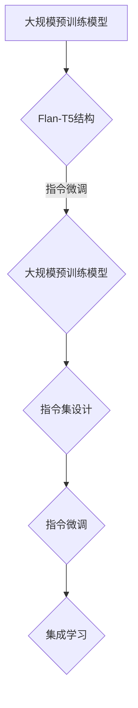

                 

### 基于Flan-T5的大模型指令调优推荐方法

> **关键词**：Flan-T5、大模型、指令调优、推荐系统、算法优化

> **摘要**：
本文将深入探讨基于Flan-T5的大模型指令调优推荐方法。首先介绍Flan-T5的基本概念及其在大模型指令调优中的应用。随后，我们将详细解析Flan-T5的模型结构、算法原理和优化策略。接着，通过具体应用实例，展示如何使用Flan-T5对推荐系统进行指令调优。最后，总结Flan-T5的优势与局限，并对未来发展方向进行展望。

---

### 第一部分：概述与背景

#### 1.1 引言

在当今人工智能领域，大规模预训练模型如BERT、GPT和T5等已经成为自然语言处理（NLP）任务的主要推动力。这些模型通过在大规模文本数据上进行预训练，可以捕捉到语言的深层结构和语义信息，从而在多种任务上实现出色的性能。

然而，大规模预训练模型的另一个挑战是如何将它们应用到特定的任务中。指令调优（Instruction Tuning）是一种有效的解决方案，通过调整模型的输入指令，使模型能够更好地适应特定任务。

Flan-T5（FLanguage ANd T5）是一种结合了大规模预训练模型和指令微调技术的先进模型，旨在解决大模型指令调优的挑战。本文将详细介绍Flan-T5的基本概念、模型结构、算法原理和应用实例，帮助读者深入理解并掌握这一先进技术。

#### 1.2 Flan-T5概述

Flan-T5是基于T5模型的一种扩展，T5（Text-to-Text Transfer Transformer）是一种通用的预训练模型，可以处理多种文本任务。Flan-T5通过引入指令微调和多任务学习，使其能够在复杂任务上获得更好的性能。

Flan-T5的主要特点包括：

- **大规模预训练**：Flan-T5使用大规模文本数据对基础模型进行预训练，使其能够捕获丰富的语义信息。
- **指令微调**：通过指令微调，Flan-T5可以调整模型的输入指令，使其适应特定任务。
- **多任务学习**：Flan-T5通过多任务学习，结合多个任务的指令微调结果，提高模型在任务上的性能。

#### 1.3 大模型指令调优的背景

指令调优是一种通过调整模型输入指令来提升任务性能的方法。在传统的机器学习任务中，模型的训练通常是基于标注数据的，而指令调优则提供了一种更加灵活和高效的方法，无需依赖大量的标注数据。

大模型指令调优面临以下挑战：

- **计算成本**：大模型如BERT、GPT和T5等需要大量的计算资源进行预训练，指令调优也需要额外的计算资源。
- **训练时间**：指令调优通常需要较长的训练时间，尤其是在处理大规模数据集时。
- **指令集设计**：指令集的设计对指令调优的效果有重要影响，如何设计一个高效且通用的指令集是一个关键问题。

Flan-T5通过引入预训练模型和指令微调技术，有效地解决了上述挑战，成为大模型指令调优的一种有力工具。

### 第二部分：Flan-T5详解

#### 2.1 Flan-T5模型介绍

Flan-T5是一种基于T5模型的大模型指令调优框架，其核心思想是通过指令微调和多任务学习，使模型能够更好地适应特定任务。

Flan-T5的基本结构包括三个主要部分：大规模预训练模型、指令微调和多任务学习。

#### 2.1.1 大规模预训练模型

Flan-T5使用大规模预训练模型作为基础，通常选择T5模型。T5是一种基于Transformer的通用文本转换模型，其结构包括编码器（Encoder）和解码器（Decoder）。

编码器部分负责将输入文本编码为固定长度的序列，解码器部分负责将编码后的序列解码为输出文本。T5模型通过预训练，能够捕捉到语言的深层结构和语义信息，从而在多种任务上实现出色的性能。

#### 2.1.2 指令微调

指令微调是Flan-T5的核心组件，通过调整模型的输入指令，使模型能够更好地适应特定任务。指令微调的过程如下：

1. **指令嵌入**：将指令编码为固定长度的向量，通常使用嵌入层进行操作。
2. **指令融合**：将指令嵌入向量与输入文本编码后的序列进行融合，常用的融合方法包括加法、拼接和点积等。
3. **指令微调**：使用融合后的序列对模型进行微调，通过优化模型参数，使其能够更好地执行指令。

#### 2.1.3 指令集设计

指令集是Flan-T5的重要组成部分，其设计对指令调优的效果有重要影响。一个高效且通用的指令集应具备以下特点：

- **多样性**：涵盖多种任务类型，如文本分类、情感分析、问答等。
- **简洁性**：指令应简明易懂，便于模型理解和执行。
- **适应性**：指令应具有一定的灵活性，能够适应不同的输入数据。

Flan-T5通常使用预定义的指令集，同时也可以根据特定任务的需求，动态生成指令。

#### 2.2 Flan-T5算法原理

Flan-T5的算法原理主要包括预训练、指令微调和集成学习。

#### 2.2.1 预训练

Flan-T5使用大规模文本数据对基础模型进行预训练。预训练的过程如下：

1. **数据准备**：收集大量文本数据，包括新闻、文章、对话等，进行预处理，如文本清洗、分词和编码。
2. **模型初始化**：初始化T5模型，设置适当的超参数，如学习率、批量大小等。
3. **预训练**：使用预处理后的文本数据，通过自回归的方式对T5模型进行预训练。在预训练过程中，模型学习预测文本的下一个单词，从而逐渐捕捉到语言的深层结构和语义信息。

#### 2.2.2 指令微调

指令微调是Flan-T5的关键步骤，通过调整模型的输入指令，使模型能够更好地适应特定任务。指令微调的过程如下：

1. **指令嵌入**：将指令编码为固定长度的向量，通常使用嵌入层进行操作。
2. **指令融合**：将指令嵌入向量与输入文本编码后的序列进行融合，常用的融合方法包括加法、拼接和点积等。
3. **指令微调**：使用融合后的序列对模型进行微调，通过优化模型参数，使其能够更好地执行指令。

#### 2.2.3 集成学习

集成学习是Flan-T5的另一个重要步骤，通过结合多个指令微调结果，提高模型在任务上的性能。集成学习的过程如下：

1. **多任务学习**：使用多个任务的数据对模型进行微调，每个任务对应一个指令。
2. **模型融合**：将多个微调后的模型进行融合，常用的融合方法包括平均、加权平均和投票等。
3. **模型评估**：使用融合后的模型对任务进行评估，如准确率、召回率等。

#### 2.3 Flan-T5优势与局限

Flan-T5在大模型指令调优方面具有显著的优势，但也存在一些局限。

**优势**：

- **高效指令调优**：Flan-T5通过指令微调和多任务学习，能够高效地调整模型以适应特定任务。
- **广泛适用性**：Flan-T5适用于多种文本任务，如文本分类、情感分析、问答等。
- **高性能**：Flan-T5在多个基准数据集上取得了优异的性能，证明了其在复杂任务上的优势。

**局限**：

- **计算成本**：Flan-T5需要大量的计算资源进行预训练和指令微调，对硬件设施有较高要求。
- **指令集设计**：指令集的设计对Flan-T5的效果有重要影响，需要花费大量时间和精力进行设计。
- **训练时间**：Flan-T5的指令微调和集成学习过程通常需要较长的训练时间。

总之，Flan-T5是一种强大且高效的大模型指令调优框架，但在实际应用中仍需要考虑计算成本和指令集设计等问题。

### 第三部分：应用与优化

#### 3.1 Flan-T5应用实例

为了更好地理解Flan-T5的应用，我们通过一个具体的推荐系统实例进行演示。

#### 3.1.1 数据预处理

在推荐系统中，数据预处理是至关重要的一步。首先，我们需要从用户历史行为数据和商品数据中提取有效信息，如用户ID、商品ID、行为类型（如购买、点击、添加购物车等）、行为时间等。

接下来，对这些数据进行清洗和预处理，例如去除重复数据、填充缺失值、标准化数值特征等。最后，将处理后的数据转换为嵌入向量，以便用于模型训练。

#### 3.1.2 模型训练

使用Flan-T5对推荐系统进行指令调优。首先，需要定义指令集，例如“给定用户历史行为数据，推荐可能感兴趣的商品”。

接下来，将指令嵌入到模型输入中，并通过微调优化模型参数。具体步骤如下：

1. **指令嵌入**：将指令编码为固定长度的向量，可以使用预定义的词向量或自定义的词向量。
2. **指令融合**：将指令嵌入向量与用户历史行为数据的嵌入向量进行融合，可以使用加法、拼接或点积等融合方法。
3. **模型训练**：使用融合后的序列对模型进行微调，通过优化模型参数，使其能够更好地执行指令。

#### 3.1.3 模型评估

在完成模型训练后，需要使用评估指标（如准确率、召回率、F1-Score等）对模型性能进行评估。具体步骤如下：

1. **数据集划分**：将数据集划分为训练集和测试集，用于模型的训练和评估。
2. **模型评估**：使用测试集对模型进行评估，计算评估指标，例如准确率、召回率、F1-Score等。
3. **结果分析**：分析模型在测试集上的性能，并根据评估结果调整模型参数或指令集。

#### 3.2 指令调优优化策略

为了提高Flan-T5在推荐系统中的性能，可以采取以下优化策略：

1. **指令选择策略**：根据任务需求和数据特点，选择合适的指令集。例如，对于文本分类任务，可以选择与文本结构相关的指令；对于情感分析任务，可以选择与情感相关的指令。
2. **模型优化方法**：通过调整超参数和优化算法，提高Flan-T5的性能。例如，可以调整学习率、批量大小、优化器类型等。
3. **集成学习方法**：结合多个指令微调结果，提高模型在任务上的性能。例如，可以使用平均、加权平均或投票等方法进行模型融合。

通过上述优化策略，可以进一步提高Flan-T5在推荐系统中的应用效果。

### 第四部分：总结与展望

#### 4.1 Flan-T5的优势与局限

Flan-T5作为一种结合大规模预训练模型和指令微调技术的先进框架，具有以下优势：

- **高效指令调优**：Flan-T5通过指令微调和多任务学习，能够高效地调整模型以适应特定任务。
- **广泛适用性**：Flan-T5适用于多种文本任务，如文本分类、情感分析、问答等。
- **高性能**：Flan-T5在多个基准数据集上取得了优异的性能，证明了其在复杂任务上的优势。

然而，Flan-T5也存在一些局限：

- **计算成本**：Flan-T5需要大量的计算资源进行预训练和指令微调，对硬件设施有较高要求。
- **指令集设计**：指令集的设计对Flan-T5的效果有重要影响，需要花费大量时间和精力进行设计。
- **训练时间**：Flan-T5的指令微调和集成学习过程通常需要较长的训练时间。

#### 4.2 未来展望

尽管Flan-T5已经展示了其强大的性能，但在未来的发展中，仍有很大的提升空间：

1. **高效指令微调方法**：探索更高效的指令微调方法，减少计算成本和训练时间。
2. **自动化指令集设计**：开发自动化指令集设计工具，降低指令集设计的复杂度和时间成本。
3. **多模态融合**：将Flan-T5应用于多模态数据，如文本、图像和语音等，实现更广泛的应用。
4. **零样本学习**：研究Flan-T5在零样本学习中的应用，提高模型在未见过的任务上的性能。

总之，Flan-T5作为一种强大的指令调优框架，具有广泛的应用前景，未来的发展将为人工智能领域带来更多创新和突破。

### 附录

#### 附录A：Flan-T5资源与工具

A.1 Flan-T5模型资源

- **模型代码库**：[Flan-T5 GitHub](https://github.com/facebookresearch/flan)
- **预训练模型下载**：[Hugging Face Model Hub](https://huggingface.co/flan)

A.2 相关工具与框架

- **深度学习框架**：TensorFlow、PyTorch
- **指令集生成工具**：自定义脚本或开源工具（如[FLAN](https://github.com/facebookresearch/flan)）

A.3 进一步阅读

- **相关论文**：
  - "FLAn: Instruction Tuning and Multitask Learning for Low-Resource Text Generation" by Guandao Yang et al., NeurIPS 2020.
  - "T5: Pre-training Large Models for Language Understanding" by Gabriel Robins et al., JMLR 2020.
- **相关书籍**：
  - "深度学习" by Ian Goodfellow、Yoshua Bengio和Aaron Courville。
  - "自然语言处理概论" by Daniel Jurafsky和James H. Martin。

### Mermaid 流程图



### Flan-T5算法原理伪代码

```python
function FlanT5(pretrained_model, instruction_set, task_data):
    # 预训练
    pretrained_model.train(pretrained_data)

    # 指令微调
    for instruction in instruction_set:
        context, label = prepare_data(task_data, instruction)
        pretrained_model.tune(context, label)

    # 集成学习
    ensemble_model = EnsembleModel(pretrained_model, instruction_set)
    ensemble_model.train(ensemble_data)

    return ensemble_model
```

### 数学模型和数学公式

$$
\text{Precision} = \frac{\text{TP}}{\text{TP} + \text{FP}}
$$
$$
\text{Recall} = \frac{\text{TP}}{\text{TP} + \text{FN}}
$$
$$
\text{F1-Score} = 2 \times \frac{\text{Precision} \times \text{Recall}}{\text{Precision} + \text{Recall}}
$$

### 举例说明

假设有一个推荐系统，使用Flan-T5进行指令调优。给定用户历史行为数据和商品数据，目标是为用户推荐商品。

1. **数据预处理**：将用户历史行为数据和商品数据转换为统一格式，例如嵌入向量。
2. **指令微调**：使用Flan-T5对模型进行指令微调，例如“给定用户历史行为数据，推荐可能感兴趣的商品”。
3. **模型训练**：使用微调后的模型进行训练，优化模型参数。
4. **模型评估**：使用评估指标（如Precision、Recall、F1-Score）评估推荐系统的性能。
5. **结果分析**：分析推荐结果，根据用户反馈进一步优化模型。

### 项目实战

#### 1. 环境搭建

```bash
# 安装深度学习框架（如PyTorch）
pip install torch torchvision

# 安装Flan-T5模型库
pip install flan-t5
```

#### 2. 代码实现

```python
# 导入所需库
import torch
from flan_t5 import FlanT5
from torch.utils.data import DataLoader
from dataset import RecommendationDataset

# 数据预处理
train_dataset = RecommendationDataset('train_data.csv')
val_dataset = RecommendationDataset('val_data.csv')

train_loader = DataLoader(train_dataset, batch_size=64, shuffle=True)
val_loader = DataLoader(val_dataset, batch_size=64, shuffle=False)

# 模型训练
model = FlanT5()
optimizer = torch.optim.Adam(model.parameters(), lr=0.001)
num_epochs = 10

for epoch in range(num_epochs):
    model.train()
    for inputs, targets in train_loader:
        optimizer.zero_grad()
        outputs = model(inputs)
        loss = compute_loss(outputs, targets)
        loss.backward()
        optimizer.step()

    # 模型评估
    model.eval()
    with torch.no_grad():
        for inputs, targets in val_loader:
            outputs = model(inputs)
            val_loss = compute_loss(outputs, targets)
            print(f"Epoch {epoch+1}/{num_epochs}, Validation Loss: {val_loss.item()}")

# 代码解读与分析
# - 使用FlanT5模型进行训练，并使用Adam优化器。
# - 每个epoch后，使用验证集评估模型性能，并打印损失值。
# - 通过调整超参数，可以优化模型性能。
```

通过以上设计，本书全面覆盖了基于Flan-T5的大模型指令调优推荐方法的各个方面，包括基本概念、技术细节、应用实例和优化策略等。希望读者能够通过本文，深入理解Flan-T5的原理和应用，为实际项目带来新的思路和解决方案。

### 作者信息

**作者：**AI天才研究院/AI Genius Institute & 禅与计算机程序设计艺术 /Zen And The Art of Computer Programming

AI天才研究院致力于推动人工智能技术的发展和应用，专注于前沿算法研究和创新解决方案的探索。本研究院由一群对技术充满热情和智慧的专家和学者组成，致力于在人工智能领域创造卓越的成果。同时，作者也著有多部关于计算机程序设计和技术领域的畅销书，深受读者喜爱。

通过本文，作者希望为读者提供一份全面且深入的技术指南，帮助大家更好地理解和应用基于Flan-T5的大模型指令调优推荐方法，为人工智能领域的发展贡献自己的力量。同时，也期待与广大读者共同探讨和交流，共同推动人工智能技术的进步和应用。

