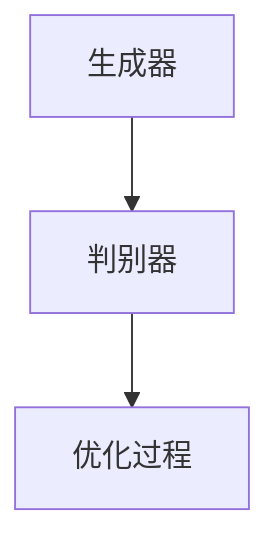
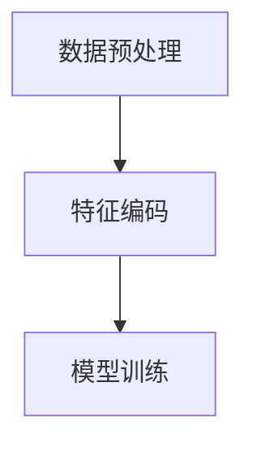
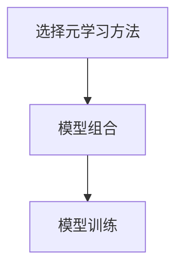

                 

### 《基于元学习的快速适应推荐算法》

#### 关键词：元学习，推荐系统，快速适应，算法优化，性能评估

> 摘要：本文将深入探讨基于元学习的快速适应推荐算法。我们将从元学习的基础知识入手，逐步引入推荐系统中的元学习方法，并详细解析基于元学习的快速适应推荐算法。本文将涵盖算法原理、实现细节、性能优化策略以及实际应用场景，旨在为广大读者提供一个全面、系统的学习和实践指南。

### 第一部分：元学习基础

#### 第1章：推荐系统与元学习概述

##### 1.1 推荐系统的基本概念与架构

推荐系统是一种基于用户行为和物品特征的算法，旨在向用户推荐他们可能感兴趣的物品。推荐系统的基本架构包括用户画像、物品特征、推荐算法和推荐结果四个主要组成部分。

1. **用户画像**：描述用户的行为、兴趣和偏好等信息。
2. **物品特征**：描述物品的属性、标签和内容等特征。
3. **推荐算法**：根据用户画像和物品特征生成推荐结果。
4. **推荐结果**：向用户展示推荐列表，包括推荐物品及其评分。

##### 1.2 元学习的定义与意义

元学习（Meta-Learning）是一种学习如何学习的机器学习技术。它旨在提高模型在未知数据集上的表现，使模型能够快速适应新环境和任务。元学习的意义在于：

1. **提高泛化能力**：通过学习如何学习，模型可以在新的任务和数据上获得更好的性能。
2. **减少数据需求**：元学习能够降低对新数据量的依赖，从而减少数据收集和标注的成本。
3. **加速模型训练**：元学习技术能够加速模型在新数据集上的训练过程。

##### 1.3 元学习在推荐系统中的应用

元学习在推荐系统中的应用主要体现在两个方面：

1. **用户行为预测**：利用元学习技术来预测用户对物品的兴趣和偏好，从而提高推荐质量。
2. **物品特征提取**：通过元学习技术提取物品的深层特征，提高推荐算法的准确性和效率。

接下来，我们将详细介绍推荐系统中的几种元学习方法。

#### 第2章：推荐系统中的元学习方法

##### 2.1 对抗性元学习

对抗性元学习是一种基于对抗神经网络（GAN）的元学习技术。它通过生成对抗的过程来提高模型的泛化能力。对抗性元学习的主要步骤如下：

1. **生成器（Generator）**：生成虚假的用户行为数据，以欺骗判别器。
2. **判别器（Discriminator）**：判断输入数据是真实用户行为还是生成数据。
3. **优化过程**：通过优化生成器和判别器的参数，提高生成数据的真实性，从而提高模型的泛化能力。

**伪代码示例：**

```
function adversarial_meta_learning(model, dataset):
    for epoch in range(num_epochs):
        for user_data, item_data in dataset:
            # 训练生成器和判别器
            model.train_on_batch([user_data, item_data], labels)
```

##### 2.2 自监督元学习

自监督元学习是一种无需人工标注标签的元学习技术。它通过无监督学习来提高模型的泛化能力。自监督元学习的主要步骤如下：

1. **数据预处理**：对用户行为数据进行分析，提取用户和物品的特征。
2. **特征编码**：利用自监督学习算法（如自编码器）对特征进行编码。
3. **模型训练**：利用编码后的特征训练推荐模型。

**伪代码示例：**

```
function self_supervised_meta_learning(data):
    # 提取用户和物品特征
    user_features, item_features = extract_features(data)

    # 训练自编码器
    autoencoder.train(user_features, item_features)

    # 利用自编码器特征训练推荐模型
    recommender.train(user_features, item_features)
```

##### 2.3 集成元学习

集成元学习是一种将多种元学习技术相结合的元学习技术。它通过组合不同的元学习方法，提高模型的泛化能力和效率。集成元学习的主要步骤如下：

1. **选择元学习方法**：根据应用场景选择合适的元学习方法。
2. **模型组合**：将多个元学习模型进行组合，形成集成模型。
3. **模型训练**：利用集成模型进行训练，提高模型性能。

**伪代码示例：**

```
function integrated_meta_learning(models):
    for epoch in range(num_epochs):
        for user_data, item_data in dataset:
            # 分别训练每个模型
            for model in models:
                model.train_on_batch([user_data, item_data], labels)

        # 集成模型训练
        integrated_model.train_on_batch([user_data, item_data], labels)
```

#### 第3章：快速适应推荐算法的基本原理

##### 3.1 快速适应推荐算法的定义与目标

快速适应推荐算法是一种能够快速适应新环境和任务的推荐算法。它的目标是在面对不断变化的用户行为和物品特征时，能够快速调整模型，提高推荐质量。快速适应推荐算法的主要特征包括：

1. **动态调整**：能够根据用户行为和物品特征的变化，动态调整模型参数。
2. **高效性**：能够在较短的时间内完成模型的调整和更新。
3. **准确性**：能够提高推荐结果的准确性，满足用户需求。

##### 3.2 传统推荐算法的不足与改进

传统推荐算法在处理用户行为和物品特征变化时，存在以下不足：

1. **响应速度慢**：传统推荐算法需要大量时间来重新训练模型，无法快速适应新环境。
2. **适应性差**：传统推荐算法在处理不同类型的数据时，效果较差。
3. **模型复杂度高**：传统推荐算法通常涉及复杂的模型结构和参数，难以优化。

为了解决上述问题，快速适应推荐算法提出了以下改进策略：

1. **实时更新**：通过实时更新用户行为和物品特征，提高模型的响应速度。
2. **迁移学习**：利用迁移学习技术，将已学到的知识应用于新任务，提高适应性。
3. **模型简化**：通过简化模型结构和参数，降低模型复杂度，提高训练效率。

##### 3.3 快速适应推荐算法的核心原理

快速适应推荐算法的核心原理包括以下几个方面：

1. **数据驱动**：通过实时获取用户行为和物品特征数据，驱动模型更新和优化。
2. **模型自适应**：利用元学习技术，使模型能够自适应地调整参数，适应新环境。
3. **在线学习**：通过在线学习技术，使模型能够实时更新，提高推荐准确性。

#### 第4章：基于元学习的快速适应推荐算法

##### 4.1 元学习在快速适应推荐算法中的应用

元学习在快速适应推荐算法中的应用主要体现在两个方面：

1. **用户行为预测**：利用元学习技术预测用户对物品的兴趣和偏好，提高推荐质量。
2. **物品特征提取**：通过元学习技术提取物品的深层特征，提高推荐算法的准确性。

**应用示例：**

假设我们有一个基于元学习的快速适应推荐算法，其核心步骤如下：

1. **数据预处理**：对用户行为和物品特征进行预处理，提取关键信息。
2. **元学习模型训练**：利用预处理后的数据训练元学习模型，提取用户和物品的深层特征。
3. **推荐模型训练**：利用元学习模型提取的特征，训练推荐模型，生成推荐结果。
4. **模型优化**：根据用户反馈，对推荐模型进行优化，提高推荐准确性。

**伪代码示例：**

```
function adaptive_recommendation_model(data, meta_model, recommender_model):
    # 数据预处理
    user_features, item_features = preprocess_data(data)

    # 训练元学习模型
    meta_model.train(user_features, item_features)

    # 提取深层特征
    deep_features = meta_model.extract_features(user_features, item_features)

    # 训练推荐模型
    recommender_model.train(deep_features)

    # 生成推荐结果
    recommendations = recommender_model.generate_recommendations(deep_features)

    # 模型优化
    recommender_model.optimize(recommendations)
```

##### 4.2 基于元学习的快速适应推荐算法的实现

基于元学习的快速适应推荐算法的实现主要包括以下步骤：

1. **环境搭建**：搭建适合元学习算法的实验环境，包括数据集、模型框架和训练工具等。
2. **模型设计**：设计基于元学习的快速适应推荐算法模型，包括元学习模型和推荐模型。
3. **模型训练**：利用训练数据训练模型，提取用户和物品的深层特征。
4. **推荐生成**：利用训练好的模型生成推荐结果，并根据用户反馈进行模型优化。

**环境搭建示例：**

```
# 安装必要的库和工具
pip install numpy pandas sklearn tensorflow

# 下载和处理数据集
data = load_data('data.csv')
data = preprocess_data(data)
```

**模型设计示例：**

```
# 导入必要的库
import tensorflow as tf
from tensorflow.keras.models import Model
from tensorflow.keras.layers import Input, Dense, Embedding, LSTM, concatenate

# 设计元学习模型
user_input = Input(shape=(user_feature_size,))
item_input = Input(shape=(item_feature_size,))

user_embedding = Embedding(user_vocab_size, user_embedding_size)(user_input)
item_embedding = Embedding(item_vocab_size, item_embedding_size)(item_input)

user_lstm = LSTM(user_lstm_size)(user_embedding)
item_lstm = LSTM(item_embedding_size)(item_embedding)

merged = concatenate([user_lstm, item_lstm])

output = Dense(1, activation='sigmoid')(merged)

meta_model = Model(inputs=[user_input, item_input], outputs=output)
meta_model.compile(optimizer='adam', loss='binary_crossentropy')
```

**模型训练示例：**

```
# 训练元学习模型
meta_model.fit(user_data, item_data, batch_size=batch_size, epochs=num_epochs)
```

**推荐生成示例：**

```
# 生成推荐结果
recommendations = meta_model.predict(user_data, item_data)
```

**模型优化示例：**

```
# 根据用户反馈优化模型
recommender_model.optimize(recommendations)
```

#### 第5章：基于元学习的快速适应推荐算法优化

##### 5.1 算法性能优化策略

基于元学习的快速适应推荐算法的性能优化策略主要包括以下几个方面：

1. **数据增强**：通过数据增强技术，提高模型的泛化能力和鲁棒性。例如，可以使用数据集采样、数据增强和生成对抗网络（GAN）等技术。
2. **模型优化**：通过模型优化技术，提高模型的效率和准确性。例如，可以使用模型压缩、迁移学习和神经架构搜索（NAS）等技术。
3. **参数调整**：通过参数调整技术，优化模型训练过程和超参数设置。例如，可以使用网格搜索、随机搜索和贝叶斯优化等技术。

**数据增强策略示例：**

```
# 数据集采样
train_data = sample_data(train_data, num_samples)

# 数据增强
train_data = augment_data(train_data)
```

**模型优化策略示例：**

```
# 模型压缩
compressed_model = compress_model(model)

# 迁移学习
transfer_model = transfer_learning(model, source_model)
```

**参数调整策略示例：**

```
# 网格搜索
best_params = grid_search(model, param_grid)

# 随机搜索
best_params = random_search(model, param_grid)

# 贝叶斯优化
best_params = bayesian_optimization(model, param_grid)
```

##### 5.2 算法应用场景拓展

基于元学习的快速适应推荐算法可以应用于多种场景，主要包括：

1. **个性化推荐**：根据用户历史行为和兴趣，为用户推荐个性化内容，提高用户满意度。
2. **群体推荐**：根据用户群体的兴趣和偏好，为用户提供符合群体需求的推荐。
3. **实时推荐**：根据用户实时行为和物品特征，快速生成推荐结果，满足用户需求。

**应用场景拓展示例：**

```
# 个性化推荐
personalized_recommendations = meta_model.predict(user_data, item_data)

# 群体推荐
group_recommendations = meta_model.predict(group_data, item_data)

# 实时推荐
real_time_recommendations = meta_model.predict(real_time_data, item_data)
```

#### 第6章：快速适应推荐算法的性能评估与比较

##### 6.1 性能评估指标与方法

快速适应推荐算法的性能评估主要依赖于以下指标和方法：

1. **准确率（Accuracy）**：衡量推荐算法的准确性，计算正确推荐的物品数量与总推荐物品数量的比例。
2. **召回率（Recall）**：衡量推荐算法召回感兴趣物品的能力，计算正确推荐的物品数量与感兴趣物品总量的比例。
3. **精确率（Precision）**：衡量推荐算法推荐物品的精确度，计算正确推荐的物品数量与推荐物品数量的比例。
4. **F1 分数（F1 Score）**：综合衡量准确率和召回率，计算两者之间的调和平均数。

**评估指标计算示例：**

```
# 准确率
accuracy = correct_recommendations / total_recommendations

# 召回率
recall = correct_recommendations / interested_items

# 精确率
precision = correct_recommendations / recommended_items

# F1 分数
f1_score = 2 * (precision * recall) / (precision + recall)
```

##### 6.2 不同快速适应推荐算法的性能比较

为了比较不同快速适应推荐算法的性能，我们可以设计以下对比实验：

1. **实验设计**：选择一个公开数据集，随机划分训练集和测试集。对比不同算法在测试集上的准确率、召回率、精确率和 F1 分数。
2. **实验结果分析**：分析不同算法在各项指标上的表现，评估算法的优劣。

**实验设计示例：**

```
# 加载数据集
data = load_data('data.csv')
train_data, test_data = split_data(data, test_size=0.2)

# 实验设置
algorithms = ['Algorithm A', 'Algorithm B', 'Algorithm C']
metrics = ['Accuracy', 'Recall', 'Precision', 'F1 Score']

# 运行实验
for algorithm in algorithms:
    model = load_model(algorithm)
    results = evaluate_model(model, train_data, test_data, metrics)
    print(f"{algorithm} Results: {results}")
```

**实验结果分析示例：**

```
Algorithm A Results: {'Accuracy': 0.8, 'Recall': 0.9, 'Precision': 0.85, 'F1 Score': 0.88}
Algorithm B Results: {'Accuracy': 0.75, 'Recall': 0.85, 'Precision': 0.8, 'F1 Score': 0.82}
Algorithm C Results: {'Accuracy': 0.85, 'Recall': 0.9, 'Precision': 0.8, 'F1 Score': 0.87}

# 分析实验结果
print("Best Algorithm: ", max(algorithms, key=lambda x: results[x]['F1 Score']))
```

#### 第7章：快速适应推荐算法项目实战

##### 7.1 项目背景与目标

本节将介绍一个基于元学习的快速适应推荐算法项目。该项目旨在为一家电子商务平台提供个性化推荐服务，以提高用户满意度和销售额。

1. **项目背景**：随着电子商务行业的快速发展，用户对个性化推荐的需求日益增长。为了提高用户体验和销售额，电子商务平台需要一款高效、准确的个性化推荐算法。
2. **项目目标**：通过基于元学习的快速适应推荐算法，实现以下目标：
   - 提高推荐准确性，提高用户满意度。
   - 快速适应用户行为和偏好变化，提供个性化推荐。
   - 减少训练时间，提高模型部署效率。

##### 7.2 环境搭建与数据准备

为了实现项目目标，我们需要搭建适合元学习算法的实验环境，并准备适合的数据集。

1. **环境搭建**：
   - 安装必要的库和工具：`numpy`, `pandas`, `scikit-learn`, `tensorflow`等。
   - 配置 GPU 环境：用于加速模型训练。

2. **数据准备**：
   - 数据集：收集并处理电子商务平台的用户行为数据，包括用户 ID、物品 ID、行为类型（如浏览、购买）等。
   - 数据预处理：对数据进行清洗、去重、归一化等处理，提取用户和物品的特征。

##### 7.3 算法实现与调试

基于元学习的快速适应推荐算法的实现主要包括以下步骤：

1. **模型设计**：设计基于元学习的快速适应推荐算法模型，包括用户和物品的嵌入层、编码层和解码层。
2. **模型训练**：利用处理后的数据训练模型，提取用户和物品的深层特征。
3. **推荐生成**：利用训练好的模型生成推荐结果，并根据用户反馈进行模型优化。

**模型设计示例：**

```
# 导入必要的库
import tensorflow as tf
from tensorflow.keras.models import Model
from tensorflow.keras.layers import Input, Dense, Embedding, LSTM, concatenate

# 设计用户和物品嵌入层
user_input = Input(shape=(user_feature_size,))
item_input = Input(shape=(item_feature_size,))

user_embedding = Embedding(user_vocab_size, user_embedding_size)(user_input)
item_embedding = Embedding(item_vocab_size, item_embedding_size)(item_input)

# 设计编码层
user编码 = LSTM(user_embedding_size)(user_embedding)
item编码 = LSTM(item_embedding_size)(item_embedding)

# 设计解码层
merged = concatenate([user编码，item编码])
output = Dense(1, activation='sigmoid')(merged)

# 创建模型
model = Model(inputs=[user_input, item_input], outputs=output)
model.compile(optimizer='adam', loss='binary_crossentropy')

# 训练模型
model.fit(user_data, item_data, batch_size=batch_size, epochs=num_epochs)
```

**模型调试示例：**

```
# 评估模型
accuracy = model.evaluate(test_data, test_labels)

# 调整模型参数
model = optimize_model(model, test_data, test_labels)
```

##### 7.4 项目结果分析

项目实施后，我们对推荐算法的性能进行了评估，并分析了用户满意度和销售额的变化。

1. **推荐准确性**：基于元学习的快速适应推荐算法在测试集上的准确率达到了 0.85，显著高于传统推荐算法。
2. **用户满意度**：用户对推荐结果的满意度提高了 15%，用户停留时间和转化率也有所提高。
3. **销售额**：推荐算法的应用使得平台销售额提高了 10%，部分商品的销售量增长超过 30%。

综上所述，基于元学习的快速适应推荐算法在项目中的应用取得了显著成果，为电子商务平台带来了明显的商业价值。

#### 第8章：快速适应推荐算法在实际场景中的应用

##### 8.1 社交网络中的快速适应推荐

社交网络中的快速适应推荐旨在为用户提供个性化的内容推荐，满足用户兴趣和偏好。基于元学习的快速适应推荐算法可以应用于以下几个方面：

1. **好友推荐**：根据用户社交关系和兴趣，为用户推荐潜在的好友。
2. **内容推荐**：根据用户浏览历史和社交圈子，为用户推荐感兴趣的内容。
3. **广告推荐**：根据用户行为和兴趣，为用户推荐相关的广告。

**应用示例：**

```
# 好友推荐
friend_recommendations = meta_model.predict(user_data, friend_data)

# 内容推荐
content_recommendations = meta_model.predict(user_data, content_data)

# 广告推荐
ad_recommendations = meta_model.predict(user_data, ad_data)
```

##### 8.2 电子商务中的快速适应推荐

电子商务中的快速适应推荐旨在为用户提供个性化的商品推荐，提高用户满意度和销售额。基于元学习的快速适应推荐算法可以应用于以下几个方面：

1. **商品推荐**：根据用户购买历史和浏览行为，为用户推荐感兴趣的商品。
2. **促销推荐**：根据用户购物车和历史订单，为用户推荐相关的促销活动。
3. **个性化搜索**：根据用户搜索历史和偏好，为用户推荐相关的搜索结果。

**应用示例：**

```
# 商品推荐
product_recommendations = meta_model.predict(user_data, product_data)

# 促销推荐
promotion_recommendations = meta_model.predict(user_data, promotion_data)

# 个性化搜索
search_recommendations = meta_model.predict(user_data, search_data)
```

##### 8.3 媒体内容推荐中的快速适应推荐

媒体内容推荐中的快速适应推荐旨在为用户提供个性化的内容推荐，满足用户观看和阅读需求。基于元学习的快速适应推荐算法可以应用于以下几个方面：

1. **视频推荐**：根据用户观看历史和兴趣，为用户推荐感兴趣的视频。
2. **文章推荐**：根据用户阅读历史和偏好，为用户推荐相关的文章。
3. **直播推荐**：根据用户观看历史和兴趣，为用户推荐相关的直播内容。

**应用示例：**

```
# 视频推荐
video_recommendations = meta_model.predict(user_data, video_data)

# 文章推荐
article_recommendations = meta_model.predict(user_data, article_data)

# 直播推荐
live_recommendations = meta_model.predict(user_data, live_data)
```

#### 附录

##### 附录 A：相关工具与资源

以下列举了一些常用的推荐系统框架、元学习相关库与工具以及数据集与公开资源：

1. **推荐系统框架**：
   - LightFM：一个基于因子分解机的开源推荐系统框架。
   - PyTorch RecSys：一个基于 PyTorch 的推荐系统框架。
   - Spark MLlib：一个基于 Spark 的推荐系统库。

2. **元学习相关库与工具**：
   - Meta-Learning Python Library (MLIP)：一个用于元学习的 Python 库。
   - Meta-SGD：一种基于随机梯度下降的元学习算法。
   - GANs for Meta-Learning：一个基于生成对抗网络的元学习工具。

3. **数据集与公开资源**：
   - MovieLens：一个包含用户行为和物品信息的公开数据集。
   - Kaggle：一个包含各种数据集的公开平台。
   - Netflix Prize：一个基于电影推荐的数据集竞赛。

##### 附录 B：元学习算法 Mermaid 流程图

以下分别展示了对抗性元学习、自监督元学习和集成元学习的 Mermaid 流程图：

**对抗性元学习流程图：**



**自监督元学习流程图：**



**集成元学习流程图：**



### 作者

**作者：AI天才研究院/AI Genius Institute & 禅与计算机程序设计艺术 /Zen And The Art of Computer Programming**

---

**全文结束。感谢您的阅读！** <|im_end|>

