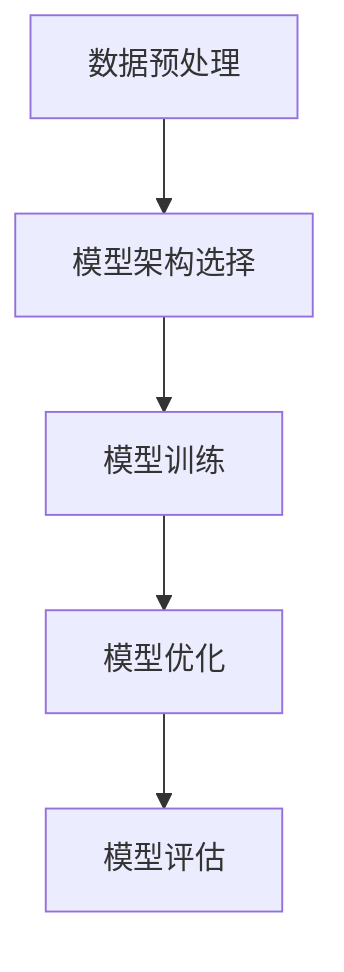
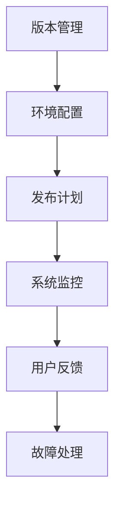

                 

### 基础模型的逐步发布策略

> **关键词：** 逐步发布策略、基础模型、软件发布管理、版本控制、部署流程、监控与反馈

> **摘要：** 本文将深入探讨基础模型的逐步发布策略，分析其核心概念、实施步骤及优化方法。通过实际案例与实战技巧，本文旨在为开发者提供全面的指导，以实现高效、安全、可控的软件发布过程。

软件发布管理是软件开发过程中至关重要的一环，直接影响到系统的稳定性、业务连续性和用户体验。逐步发布策略作为一种精细化、可控的发布管理方法，在近年来逐渐受到广泛关注。本文将从基础模型的构建与优化、逐步发布策略的实施与监控、案例分析与实战技巧等多个角度，详细探讨逐步发布策略的核心概念与实施方法。

### 第一部分：基础概念与核心理论

#### 第1章：逐步发布策略概述

##### 1.1 逐步发布策略的定义与重要性

###### 1.1.1 定义

逐步发布策略，又称分阶段发布策略，是一种软件发布管理方法。它通过将新版本的软件逐步引入到生产环境，从而实现最小化风险和最大化对用户的影响。逐步发布策略的核心思想是将整个发布过程划分为多个阶段，每个阶段只引入一部分用户或功能，以便在发布过程中及时发现并解决问题。

###### 1.1.2 重要性

逐步发布策略在软件发布管理中具有重要意义，主要体现在以下几个方面：

- **风险管理能力提升**：逐步发布策略能够将发布过程中的风险分散到多个阶段，降低了单次发布失败的风险。
- **业务连续性提高**：通过逐步发布，可以在不影响主要业务运行的情况下，进行新版本的上线和维护。
- **用户满意度提升**：逐步发布策略能够减少用户受到的影响，提高用户满意度。

##### 1.2 逐步发布策略的基本原则

###### 1.2.1 安全性

安全性是逐步发布策略的核心原则之一。在逐步发布过程中，必须确保系统能够应对任何意外情况，避免造成重大损失。为此，需要采取以下措施：

- **容错机制**：在设计逐步发布策略时，应考虑系统的容错机制，确保在出现问题时能够快速恢复。
- **紧急回滚**：在发布过程中，一旦发现问题，应能够迅速回滚到上一个稳定版本，确保系统的正常运行。

###### 1.2.2 可控性

可控性是逐步发布策略实现有效性的关键。逐步发布策略应能够有效地控制发布进度和范围，确保发布过程的可控性。具体措施包括：

- **版本管理**：对各个版本进行严格管理，确保版本一致性。
- **部署范围控制**：根据业务需求和风险承受能力，合理控制发布范围。

###### 1.2.3 可回滚性

可回滚性是逐步发布策略的重要保障。在发布过程中，如果出现问题，需要能够快速回滚到上一个稳定版本，以确保系统的正常运行。为此，需要采取以下措施：

- **备份策略**：在发布前，对系统进行备份，以便在需要时快速回滚。
- **回滚脚本**：编写回滚脚本，确保在出现问题时能够快速执行回滚操作。

##### 1.3 逐步发布策略的核心概念

###### 1.3.1 版本控制

版本控制是逐步发布策略的基础，确保不同版本的软件可以有序地管理。版本控制工具（如 Git）能够帮助开发者实现代码的版本管理，确保代码的完整性和一致性。

###### 1.3.2 部署流程

部署流程是实现逐步发布策略的关键步骤，包括从代码仓库到生产环境的全过程。部署流程应包括以下环节：

- **环境配置**：根据需求搭建合适的生产环境，包括服务器、数据库、中间件等。
- **部署脚本**：编写部署脚本，实现自动化部署。
- **测试验证**：在部署前，对系统进行测试验证，确保部署的顺利进行。

###### 1.3.3 监控与反馈

监控与反馈是确保逐步发布策略有效性的关键环节。通过实时监控系统和用户反馈，及时发现并解决问题。具体包括：

- **性能监控**：监控系统的性能指标，如响应时间、吞吐量等。
- **错误日志**：收集系统的错误日志，分析故障原因。
- **用户反馈**：收集用户反馈，了解系统的使用情况和用户需求。

#### 第2章：基础模型的构建与优化

##### 2.1 基础模型的构建

基础模型的构建是逐步发布策略的核心之一。基础模型的好坏直接影响系统的性能和效果。构建基础模型主要包括以下步骤：

###### 2.1.1 数据预处理

数据预处理是基础模型构建的重要步骤。数据预处理包括以下内容：

- **数据清洗**：去除噪声数据和异常值。
- **归一化**：对数据进行归一化处理，使数据分布更加均匀。
- **特征提取**：从原始数据中提取有用特征，为模型训练提供支持。

###### 2.1.2 模型架构选择

根据业务需求选择合适的模型架构。常见的模型架构包括：

- **线性模型**：适用于简单的线性关系。
- **神经网络**：适用于复杂的关系和学习任务。
- **深度学习模型**：适用于大规模数据和高维数据。

###### 2.1.3 模型训练

通过训练过程优化模型参数，提高模型的预测准确性。模型训练包括以下步骤：

- **初始化参数**：随机初始化模型参数。
- **前向传播**：计算输入数据在模型中的传播结果。
- **反向传播**：根据预测结果和实际结果，更新模型参数。
- **迭代训练**：重复前向传播和反向传播，直到模型收敛。

##### 2.2 基础模型的优化

基础模型的优化是提高系统性能的关键。基础模型的优化主要包括以下方法：

###### 2.2.1 参数调优

通过调整模型参数，如学习率、正则化参数等，提高模型性能。参数调优的方法包括：

- **网格搜索**：在参数空间中搜索最优参数组合。
- **随机搜索**：随机选择参数组合，进行优化。

###### 2.2.2 特征工程

通过特征工程方法，挖掘出更有利于模型训练的特征。特征工程的方法包括：

- **特征提取**：从原始数据中提取有用特征。
- **特征选择**：选择对模型性能有显著影响的特征。

###### 2.2.3 模型集成

通过集成多个模型，提高模型的预测性能。常见的模型集成方法包括：

- **堆叠集成**：将多个模型堆叠在一起，通过分层结构进行集成。
- **Bagging**：通过随机抽样和组合多个模型，提高模型性能。

### 第二部分：逐步发布策略的实施与监控

#### 第3章：逐步发布策略的实施与监控

##### 3.1 逐步发布策略的实施步骤

逐步发布策略的实施步骤主要包括以下内容：

###### 3.1.1 版本管理

版本管理是对各个版本进行严格管理，确保版本一致性。具体包括：

- **版本标识**：为每个版本分配唯一的标识，便于管理和追踪。
- **版本记录**：记录每个版本的详细信息，如发布时间、发布内容等。

###### 3.1.2 环境配置

环境配置是搭建合适的环境，确保发布过程顺利进行。具体包括：

- **服务器配置**：根据需求配置服务器硬件和操作系统。
- **数据库配置**：配置数据库环境，包括数据库服务器、数据库实例等。
- **中间件配置**：配置中间件环境，如消息队列、缓存等。

###### 3.1.3 发布计划

发布计划是制定详细的发布计划，明确每个阶段的任务和目标。具体包括：

- **发布阶段**：将发布过程划分为多个阶段，如开发阶段、测试阶段、发布阶段等。
- **任务分配**：明确每个阶段的任务和责任人。
- **目标设定**：设定每个阶段的任务目标，如功能实现、性能优化等。

##### 3.2 逐步发布策略的监控与反馈

逐步发布策略的监控与反馈主要包括以下内容：

###### 3.2.1 系统监控

系统监控是实时监控系统的运行状态，包括性能指标、错误日志等。具体包括：

- **性能监控**：监控系统的性能指标，如响应时间、吞吐量等。
- **错误日志**：收集系统的错误日志，分析故障原因。

###### 3.2.2 用户反馈

用户反馈是收集用户反馈，及时了解系统的使用情况和用户需求。具体包括：

- **用户调查**：通过问卷调查、用户访谈等方式，了解用户对系统的满意度。
- **用户反馈**：收集用户的意见和建议，为系统改进提供参考。

###### 3.2.3 故障处理

故障处理是在发布过程中，一旦出现故障，及时进行故障处理和回滚。具体包括：

- **故障预警**：通过监控和反馈，及时发现潜在故障。
- **故障处理**：在出现故障时，迅速定位问题并采取措施。
- **回滚操作**：在需要时，快速回滚到上一个稳定版本，确保系统的正常运行。

### 第三部分：案例分析与实战技巧

#### 第4章：案例分析与实战技巧

##### 4.1 案例分析

###### 4.1.1 案例背景

某大型互联网公司开发了一款面向用户的智能推荐系统，该系统基于深度学习模型进行推荐。为了确保系统的高可用性和稳定性，公司决定采用逐步发布策略进行软件发布。

###### 4.1.2 案例实施

公司采用逐步发布策略，将整个发布过程划分为以下几个阶段：

1. **开发阶段**：完成系统设计和开发，进行内部测试和调试。
2. **测试阶段**：在测试环境中对系统进行测试，包括功能测试、性能测试和安全测试等。
3. **预发布阶段**：在部分生产环境中部署系统，进行预发布测试，收集用户反馈。
4. **发布阶段**：在全部生产环境中部署系统，正式上线。

在实施逐步发布策略过程中，公司采取了以下措施：

- **版本管理**：使用 Git 进行版本控制，确保代码的版本一致性。
- **环境配置**：根据需求搭建合适的生产环境，包括服务器、数据库、中间件等。
- **监控与反馈**：实时监控系统运行状态，收集用户反馈，及时处理故障。

###### 4.1.3 案例效果

通过采用逐步发布策略，公司实现了以下效果：

- **风险降低**：将发布过程中的风险分散到多个阶段，降低了单次发布失败的风险。
- **业务连续性**：通过预发布阶段和监控系统，确保系统的高可用性和稳定性。
- **用户满意度**：通过用户反馈，不断优化系统功能，提高用户满意度。

##### 4.2 实战技巧

###### 4.2.1 版本控制技巧

- **分支管理**：使用分支管理，确保代码的隔离性和安全性。
- **代码审查**：进行代码审查，确保代码的质量和安全性。

###### 4.2.2 环境配置技巧

- **容器化**：使用容器化技术，实现环境的一致性和可移植性。
- **自动化部署**：使用自动化部署工具，提高部署效率和稳定性。

###### 4.2.3 发布计划制定技巧

- **明确目标**：明确每个阶段的任务和目标，确保发布计划的可行性。
- **风险评估**：对每个阶段的任务进行风险评估，制定相应的应对策略。

### 第四部分：逐步发布策略的扩展与应用

#### 第5章：逐步发布策略的扩展与应用

##### 5.1 逐步发布策略的扩展

###### 5.1.1 容器化与自动化部署

容器化与自动化部署是逐步发布策略的重要扩展。通过使用容器化技术（如 Docker），可以实现环境的一致性和可移植性。结合自动化部署工具（如 Jenkins），可以实现发布过程的自动化，提高部署效率和稳定性。

###### 5.1.2 微服务架构

微服务架构是逐步发布策略在分布式系统中的应用。通过将系统划分为多个微服务，可以实现逐步发布和微服务级别的故障隔离。每个微服务可以独立部署和发布，降低了系统的复杂度和风险。

##### 5.2 逐步发布策略的应用领域

###### 5.2.1 金融领域

在金融领域，逐步发布策略可以应用于风险控制、投资决策等领域。通过逐步发布新策略和算法，可以降低风险，提高决策准确性。

###### 5.2.2 零售领域

在零售领域，逐步发布策略可以应用于库存管理、需求预测等领域。通过逐步发布新策略和算法，可以优化库存管理，提高需求预测准确性。

###### 5.2.3 健康领域

在健康领域，逐步发布策略可以应用于疾病预测、医疗诊断等领域。通过逐步发布新模型和算法，可以提高疾病预测准确性，辅助医疗诊断。

### 第五部分：逐步发布策略的挑战与未来发展趋势

#### 第6章：逐步发布策略的挑战与未来发展趋势

##### 6.1 逐步发布策略的挑战

###### 6.1.1 代码质量

代码质量是逐步发布策略的关键挑战之一。高质量的代码能够减少发布过程中的错误和故障，提高系统的稳定性。为了确保代码质量，需要采取以下措施：

- **代码审查**：进行严格的代码审查，确保代码的安全性和可靠性。
- **单元测试**：编写单元测试，验证代码的功能和性能。

###### 6.1.2 集成测试

集成测试是逐步发布策略的另一个重要挑战。集成测试能够发现不同模块之间的兼容性问题，确保系统的整体稳定性。为了提高集成测试的覆盖率，需要采取以下措施：

- **自动化测试**：使用自动化测试工具，提高测试效率和覆盖率。
- **持续集成**：实现持续集成，确保每次代码提交后都进行全面的测试。

###### 6.1.3 回滚策略

回滚策略是逐步发布策略中的一项重要保障。合理的回滚策略能够确保在出现问题时，能够快速回滚到上一个稳定版本。为了设计合理的回滚策略，需要采取以下措施：

- **备份策略**：在发布前进行系统备份，确保在需要时能够快速回滚。
- **回滚脚本**：编写回滚脚本，实现自动化回滚操作。

##### 6.2 未来发展趋势

###### 6.2.1 AI 与逐步发布策略的结合

随着人工智能技术的发展，逐步发布策略与 AI 技术的结合将成为未来趋势。通过将 AI 技术应用于发布过程，可以实现以下效果：

- **智能监控**：使用 AI 技术进行智能监控，提高故障检测和处理的效率。
- **智能优化**：使用 AI 技术优化发布策略，提高发布效率和稳定性。

###### 6.2.2 持续集成与持续部署（CI/CD）

持续集成与持续部署（CI/CD）是软件发布管理的重要发展趋势。通过实现持续集成和持续部署，可以加快发布速度，提高发布质量。未来，逐步发布策略将与 CI/CD 紧密结合，实现更高效、更可控的发布过程。

###### 6.2.3 分布式系统与云计算

分布式系统与云计算是当前技术发展的主流方向。逐步发布策略在分布式系统和云计算环境中有着广泛的应用前景。通过将逐步发布策略与分布式系统和云计算相结合，可以实现以下效果：

- **高可用性**：通过分布式系统和云计算，提高系统的可用性和可靠性。
- **弹性扩展**：通过分布式系统和云计算，实现系统的弹性扩展和动态调整。

### 附录

#### 附录 A：常用工具与资源

##### A.1 版本控制工具

- **Git**：一种分布式版本控制工具，适用于代码管理和团队协作。
- **SVN**：一种集中式版本控制工具，适用于项目管理和代码仓库。

##### A.2 部署工具

- **Docker**：一种容器化技术，用于创建、运行和分发应用程序。
- **Kubernetes**：一种容器编排工具，用于自动化容器的部署和管理。

##### A.3 模型训练与评估工具

- **TensorFlow**：一种开源机器学习框架，适用于深度学习和神经网络。
- **PyTorch**：一种开源机器学习框架，适用于深度学习和神经网络。

#### 附录 B：Mermaid 流程图

##### B.1 基础模型构建流程



##### B.2 逐步发布策略实施流程



## 作者

作者：AI天才研究院/AI Genius Institute & 禅与计算机程序设计艺术 /Zen And The Art of Computer Programming

---

以上是文章正文的大纲与示例内容，接下来我们将根据这个大纲，逐步填充每个章节的内容，确保文章的完整性与深度。在撰写过程中，我们将重点分析逐步发布策略的核心概念、实施步骤、优化方法以及实际应用场景。同时，我们将结合具体的案例，分享实战技巧，帮助读者更好地理解和应用逐步发布策略。让我们开始详细的撰写工作吧！<|im_end|>## 第一部分：基础概念与核心理论

在深入探讨基础模型的逐步发布策略之前，我们需要先了解相关的基础概念和核心理论。这些概念和理论构成了逐步发布策略的基础，为后续的详细讨论提供了必要的背景知识。

### 第1章：逐步发布策略概述

#### 1.1 逐步发布策略的定义与重要性

##### 1.1.1 定义

逐步发布策略（Phased Deployment）是一种软件发布管理方法，它通过将整个发布过程分为多个阶段，每个阶段只向部分用户或系统环境引入新版本，逐步验证新功能的稳定性和性能。这种方法有助于降低发布风险，提高系统的可靠性和用户满意度。

逐步发布策略的核心步骤包括：

- **需求分析**：确定发布目标和预期效果，制定详细的发布计划。
- **版本控制**：使用版本控制系统（如Git）来管理代码的不同版本。
- **环境配置**：为每个阶段搭建相应的开发、测试和生产环境。
- **部署**：按照计划将新版本部署到不同环境。
- **监控与反馈**：实时监控系统性能和用户反馈，及时处理问题和优化部署。

##### 1.1.2 重要性

逐步发布策略的重要性体现在以下几个方面：

1. **风险管理**：通过分阶段部署，可以将风险分散到多个阶段，减少单次发布失败的影响。
2. **业务连续性**：逐步发布策略可以确保在发布过程中，关键业务不会中断。
3. **用户体验**：逐步发布策略可以减少对用户的影响，提高用户对产品的满意度。
4. **可回滚性**：在出现问题的情况下，可以快速回滚到上一个稳定版本，避免系统崩溃。

#### 1.2 逐步发布策略的基本原则

##### 1.2.1 安全性

安全性是逐步发布策略的核心原则之一。为了确保安全性，需要采取以下措施：

- **隔离测试**：在发布前对每个阶段进行隔离测试，确保新功能不会影响到其他模块。
- **备份和恢复**：在发布前进行系统备份，确保在出现问题时可以快速恢复。
- **权限管理**：严格控制发布过程中的权限，防止未经授权的操作。

##### 1.2.2 可控性

可控性是逐步发布策略实现有效性的关键。为了确保可控性，需要采取以下措施：

- **阶段划分**：根据业务需求和风险承受能力，合理划分发布阶段。
- **进度跟踪**：实时跟踪发布进度，确保每个阶段按计划执行。
- **反馈机制**：建立有效的反馈机制，及时收集和处理用户反馈。

##### 1.2.3 可回滚性

可回滚性是确保发布策略灵活性和可靠性的重要保障。为了实现可回滚性，需要采取以下措施：

- **版本控制**：使用版本控制系统，确保每个版本的可追溯性和可回滚性。
- **回滚脚本**：编写回滚脚本，确保在出现问题时可以快速回滚到上一个稳定版本。
- **备份策略**：定期进行系统备份，确保在出现问题时可以快速恢复。

#### 1.3 逐步发布策略的核心概念

##### 1.3.1 版本控制

版本控制是逐步发布策略的基础，它确保了代码的完整性和一致性。版本控制的核心概念包括：

- **版本标识**：为每个版本分配唯一的标识，便于管理和追踪。
- **变更记录**：记录每个版本的变更内容和变更理由。
- **分支管理**：使用分支管理，确保不同功能模块的独立性和可控性。

##### 1.3.2 部署流程

部署流程是实现逐步发布策略的关键步骤。部署流程包括以下几个环节：

- **环境配置**：为每个阶段搭建相应的开发、测试和生产环境。
- **部署脚本**：编写部署脚本，实现自动化部署。
- **测试验证**：在部署前进行测试验证，确保部署的顺利进行。
- **上线监控**：在上线后，实时监控系统性能和稳定性。

##### 1.3.3 监控与反馈

监控与反馈是逐步发布策略的重要组成部分。通过实时监控和用户反馈，可以及时发现并解决问题。监控与反馈的核心概念包括：

- **性能监控**：监控系统的性能指标，如响应时间、吞吐量等。
- **错误日志**：收集系统的错误日志，分析故障原因。
- **用户反馈**：收集用户反馈，了解系统的使用情况和用户需求。

### 第2章：基础模型的构建与优化

#### 2.1 基础模型的构建

基础模型的构建是逐步发布策略的核心之一。构建基础模型主要包括以下几个步骤：

##### 2.1.1 数据预处理

数据预处理是基础模型构建的重要步骤。数据预处理包括以下内容：

- **数据清洗**：去除噪声数据和异常值，确保数据质量。
- **归一化**：对数据进行归一化处理，使数据分布更加均匀，有助于模型训练。
- **特征提取**：从原始数据中提取有用特征，为模型训练提供支持。

##### 2.1.2 模型架构选择

模型架构选择是根据业务需求选择合适的模型架构。常见的模型架构包括：

- **线性模型**：适用于简单的线性关系。
- **神经网络**：适用于复杂的关系和学习任务。
- **深度学习模型**：适用于大规模数据和高维数据。

##### 2.1.3 模型训练

模型训练是基础模型构建的关键步骤。模型训练包括以下几个过程：

- **初始化参数**：随机初始化模型参数。
- **前向传播**：计算输入数据在模型中的传播结果。
- **反向传播**：根据预测结果和实际结果，更新模型参数。
- **迭代训练**：重复前向传播和反向传播，直到模型收敛。

#### 2.2 基础模型的优化

基础模型的优化是提高系统性能的关键。基础模型的优化主要包括以下方法：

##### 2.2.1 参数调优

参数调优是通过调整模型参数来提高模型性能。常见的参数调优方法包括：

- **网格搜索**：在参数空间中搜索最优参数组合。
- **随机搜索**：随机选择参数组合，进行优化。

##### 2.2.2 特征工程

特征工程是通过挖掘和构造新特征来提高模型性能。特征工程的方法包括：

- **特征提取**：从原始数据中提取有用特征。
- **特征选择**：选择对模型性能有显著影响的特征。

##### 2.2.3 模型集成

模型集成是通过结合多个模型来提高模型性能。常见的模型集成方法包括：

- **堆叠集成**：将多个模型堆叠在一起，通过分层结构进行集成。
- **Bagging**：通过随机抽样和组合多个模型，提高模型性能。

### 总结

本章对逐步发布策略的基础概念和核心理论进行了详细的阐述，包括逐步发布策略的定义、重要性、基本原则、核心概念以及基础模型的构建与优化方法。这些内容为后续的逐步发布策略的深入讨论提供了坚实的理论基础。在下一章中，我们将进一步探讨逐步发布策略的实施步骤和监控与反馈机制。

---

在本章中，我们介绍了逐步发布策略的定义、重要性、基本原则和核心概念。通过对这些内容的详细阐述，读者可以初步了解逐步发布策略的基本框架和实施方法。在下一章中，我们将进一步深入探讨基础模型的构建与优化，包括数据预处理、模型架构选择、模型训练以及参数调优等方法。通过这些内容的学习，读者将能够更好地理解如何构建高效的基础模型，并为逐步发布策略的实施奠定坚实的基础。

### 第1章：逐步发布策略概述

#### 1.1 逐步发布策略的定义与重要性

##### 1.1.1 定义

逐步发布策略，又称为分阶段发布策略，是一种软件发布管理方法。它通过将软件的发布过程分为多个阶段，每个阶段仅向一部分用户或环境引入新版本，以逐步验证新功能的稳定性和性能。这种方法有助于降低发布风险，提高系统的可靠性和用户满意度。

逐步发布策略的基本步骤包括：

1. **需求分析**：确定发布目标和预期效果，制定详细的发布计划。
2. **版本控制**：使用版本控制系统（如Git）来管理代码的不同版本。
3. **环境配置**：为每个阶段搭建相应的开发、测试和生产环境。
4. **部署**：按照计划将新版本部署到不同环境。
5. **监控与反馈**：实时监控系统性能和用户反馈，及时处理问题和优化部署。

##### 1.1.2 重要性

逐步发布策略在软件发布管理中具有重要意义，主要体现在以下几个方面：

1. **风险管理**：通过分阶段部署，可以将风险分散到多个阶段，减少单次发布失败的影响。
2. **业务连续性**：逐步发布策略可以确保在发布过程中，关键业务不会中断。
3. **用户体验**：逐步发布策略可以减少对用户的影响，提高用户对产品的满意度。
4. **可回滚性**：在出现问题的情况下，可以快速回滚到上一个稳定版本，避免系统崩溃。

#### 1.2 逐步发布策略的基本原则

##### 1.2.1 安全性

安全性是逐步发布策略的核心原则之一。为了确保安全性，需要采取以下措施：

1. **隔离测试**：在发布前对每个阶段进行隔离测试，确保新功能不会影响到其他模块。
2. **备份和恢复**：在发布前进行系统备份，确保在出现问题时可以快速恢复。
3. **权限管理**：严格控制发布过程中的权限，防止未经授权的操作。

##### 1.2.2 可控性

可控性是逐步发布策略实现有效性的关键。为了确保可控性，需要采取以下措施：

1. **阶段划分**：根据业务需求和风险承受能力，合理划分发布阶段。
2. **进度跟踪**：实时跟踪发布进度，确保每个阶段按计划执行。
3. **反馈机制**：建立有效的反馈机制，及时收集和处理用户反馈。

##### 1.2.3 可回滚性

可回滚性是确保发布策略灵活性和可靠性的重要保障。为了实现可回滚性，需要采取以下措施：

1. **版本控制**：使用版本控制系统，确保每个版本的可追溯性和可回滚性。
2. **回滚脚本**：编写回滚脚本，确保在出现问题时可以快速回滚到上一个稳定版本。
3. **备份策略**：定期进行系统备份，确保在出现问题时可以快速恢复。

#### 1.3 逐步发布策略的核心概念

##### 1.3.1 版本控制

版本控制是逐步发布策略的基础，它确保了代码的完整性和一致性。版本控制的核心概念包括：

1. **版本标识**：为每个版本分配唯一的标识，便于管理和追踪。
2. **变更记录**：记录每个版本的变更内容和变更理由。
3. **分支管理**：使用分支管理，确保不同功能模块的独立性和可控性。

##### 1.3.2 部署流程

部署流程是实现逐步发布策略的关键步骤。部署流程包括以下几个环节：

1. **环境配置**：为每个阶段搭建相应的开发、测试和生产环境。
2. **部署脚本**：编写部署脚本，实现自动化部署。
3. **测试验证**：在部署前进行测试验证，确保部署的顺利进行。
4. **上线监控**：在上线后，实时监控系统性能和稳定性。

##### 1.3.3 监控与反馈

监控与反馈是逐步发布策略的重要组成部分。通过实时监控和用户反馈，可以及时发现并解决问题。监控与反馈的核心概念包括：

1. **性能监控**：监控系统的性能指标，如响应时间、吞吐量等。
2. **错误日志**：收集系统的错误日志，分析故障原因。
3. **用户反馈**：收集用户反馈，了解系统的使用情况和用户需求。

#### 1.4 逐步发布策略的实施步骤

##### 1.4.1 需求分析

需求分析是发布计划制定的第一步，它包括：

1. **确定发布目标**：明确新版本的发布目标和预期效果。
2. **功能规划**：规划新版本的功能点和改进内容。
3. **风险评估**：评估发布过程中可能遇到的风险和挑战。

##### 1.4.2 版本控制

版本控制是逐步发布策略的核心环节，具体包括：

1. **代码管理**：使用版本控制系统（如Git）进行代码管理。
2. **分支策略**：制定合理的分支策略，确保代码的独立性和可追溯性。
3. **变更管理**：记录每次代码变更的内容和原因，确保变更的可追溯性。

##### 1.4.3 环境配置

环境配置是为每个阶段搭建相应的开发、测试和生产环境，具体包括：

1. **开发环境**：为开发人员提供开发所需的环境和工具。
2. **测试环境**：为测试人员提供测试所需的环境，确保测试的准确性和全面性。
3. **生产环境**：为用户提供实际运行的环境，确保系统的稳定性和性能。

##### 1.4.4 部署

部署是将新版本部署到不同环境的过程，具体包括：

1. **自动化部署**：编写部署脚本，实现自动化部署，减少人为错误。
2. **部署验证**：在部署后进行验证，确保部署的顺利进行。
3. **监控部署**：在部署过程中实时监控系统的性能和稳定性。

##### 1.4.5 监控与反馈

监控与反馈是确保系统稳定性和用户体验的重要环节，具体包括：

1. **性能监控**：监控系统的性能指标，如响应时间、吞吐量等。
2. **错误日志**：收集系统的错误日志，分析故障原因。
3. **用户反馈**：收集用户反馈，了解系统的使用情况和用户需求。

#### 1.5 逐步发布策略的优点和挑战

##### 1.5.1 优点

逐步发布策略具有以下优点：

1. **风险降低**：通过分阶段部署，可以将风险分散到多个阶段，减少单次发布失败的影响。
2. **业务连续性**：逐步发布策略可以确保在发布过程中，关键业务不会中断。
3. **用户体验**：逐步发布策略可以减少对用户的影响，提高用户对产品的满意度。
4. **可回滚性**：在出现问题的情况下，可以快速回滚到上一个稳定版本，避免系统崩溃。

##### 1.5.2 挑战

逐步发布策略也面临一些挑战：

1. **项目管理**：需要合理规划发布阶段和任务，确保每个阶段的顺利进行。
2. **团队协作**：需要各团队之间的紧密协作，确保发布过程的协调一致。
3. **系统稳定性**：在逐步发布过程中，需要确保系统的稳定性和性能，避免出现故障。

#### 1.6 逐步发布策略的适用场景

逐步发布策略适用于以下场景：

1. **大型项目**：在大型项目中，逐步发布策略可以降低整体风险，提高项目的成功率。
2. **关键业务系统**：对于关键业务系统，逐步发布策略可以确保系统的连续性和稳定性。
3. **复杂系统**：对于复杂系统，逐步发布策略可以帮助逐步优化和改进系统，提高系统的可靠性。

通过本章的介绍，读者可以初步了解逐步发布策略的定义、重要性、基本原则、核心概念以及实施步骤。在下一章中，我们将进一步探讨基础模型的构建与优化，包括数据预处理、模型架构选择、模型训练以及参数调优等方法。通过这些内容的学习，读者将能够更好地理解如何构建高效的基础模型，并为逐步发布策略的实施奠定坚实的基础。

---

### 第2章：基础模型的构建与优化

基础模型是逐步发布策略中的核心组成部分，其构建和优化的质量直接影响到系统的性能和效果。在本章中，我们将详细讨论基础模型的构建过程，包括数据预处理、模型架构选择、模型训练等关键步骤，以及如何通过参数调优和特征工程来优化模型。

#### 2.1 数据预处理

数据预处理是基础模型构建的首要步骤，它确保了输入数据的可靠性和一致性。数据预处理的主要任务包括数据清洗、归一化和特征提取。

##### 2.1.1 数据清洗

数据清洗是去除数据中的噪声和异常值的过程。以下是一些常见的数据清洗方法：

- **缺失值处理**：对于缺失值，可以选择填充、删除或使用算法预测缺失值。
- **异常值处理**：对于异常值，可以通过统计学方法或专家知识来识别并处理。
- **重复数据处理**：删除重复的数据记录，确保数据的唯一性。

##### 2.1.2 归一化

归一化是将数据缩放到同一尺度的过程，以消除不同特征之间的量纲差异。常见的归一化方法包括：

- **最小-最大标准化**：将数据缩放到[0, 1]之间。
- **Z标准化**：将数据缩放到均值为0，标准差为1的范围内。
- **倒数归一化**：对于某些特征，使用其倒数进行归一化。

##### 2.1.3 特征提取

特征提取是从原始数据中提取有助于模型训练的有用特征的过程。以下是一些常见的特征提取方法：

- **主成分分析（PCA）**：通过降维来减少特征数量，同时保留数据的最大方差。
- **特征选择**：使用算法（如卡方检验、互信息等）来选择对模型有显著影响的重要特征。
- **特征工程**：根据业务知识和经验，构造新的特征或对现有特征进行转换。

#### 2.2 模型架构选择

模型架构选择是基础模型构建的关键步骤，它决定了模型的复杂度和性能。选择合适的模型架构需要考虑业务需求、数据特点和计算资源等因素。以下是一些常见的模型架构：

- **线性模型**：如线性回归、逻辑回归，适用于简单线性关系。
- **神经网络**：如全连接网络、卷积神经网络（CNN）和循环神经网络（RNN），适用于复杂非线性关系。
- **深度学习模型**：如深度神经网络（DNN）、深度强化学习（DRL）和生成对抗网络（GAN），适用于大规模数据和高维数据。

##### 2.2.1 线性模型

线性模型是一种简单的统计模型，适用于解释变量之间线性关系的问题。其优点是计算简单、易于理解和实现。线性模型的数学公式如下：

$$
Y = \beta_0 + \beta_1X_1 + \beta_2X_2 + ... + \beta_nX_n
$$

其中，$Y$ 是因变量，$X_1, X_2, ..., X_n$ 是自变量，$\beta_0, \beta_1, \beta_2, ..., \beta_n$ 是模型的参数。

##### 2.2.2 神经网络

神经网络是一种基于模拟人脑神经元连接方式的计算模型，适用于复杂非线性关系。神经网络的主要组成部分包括输入层、隐藏层和输出层。以下是一个简单的神经网络架构：

```
[输入层] --> [隐藏层1] --> [隐藏层2] --> ... --> [输出层]
```

神经网络的训练过程是通过前向传播和反向传播来调整模型参数，使得模型能够更好地拟合训练数据。以下是神经网络的基本原理：

1. **前向传播**：将输入数据传递到模型中，计算输出结果。
2. **计算误差**：将实际输出与预期输出进行比较，计算误差。
3. **反向传播**：根据误差，调整模型参数，使得模型输出更接近预期结果。

神经网络的数学公式如下：

$$
\text{激活函数}(z) = \frac{1}{1 + e^{-z}}
$$

其中，$z$ 是神经元的净输入，$a$ 是神经元的输出，$f$ 是激活函数。

##### 2.2.3 深度学习模型

深度学习模型是一种复杂的神经网络，适用于大规模数据和高维数据。常见的深度学习模型包括卷积神经网络（CNN）、循环神经网络（RNN）和生成对抗网络（GAN）。

1. **卷积神经网络（CNN）**：CNN 是一种专门用于处理图像数据的神经网络，其核心思想是通过卷积层提取图像的特征。CNN 的主要组成部分包括卷积层、池化层和全连接层。

2. **循环神经网络（RNN）**：RNN 是一种专门用于处理序列数据的神经网络，其核心思想是通过循环结构处理前一个时间步的输出作为当前时间步的输入。RNN 的主要组成部分包括输入层、隐藏层和输出层。

3. **生成对抗网络（GAN）**：GAN 是一种由生成器和判别器组成的对抗性神经网络。生成器生成假样本，判别器判断样本的真实性。GAN 的主要目标是使生成器的输出接近真实样本。

#### 2.3 模型训练

模型训练是基础模型构建的核心步骤，其目的是通过训练数据调整模型参数，使得模型能够更好地拟合数据。模型训练的主要方法包括监督学习、无监督学习和强化学习。

##### 2.3.1 监督学习

监督学习是一种基于标记数据训练模型的方法。训练过程包括以下步骤：

1. **数据准备**：将训练数据划分为输入特征和标签。
2. **模型初始化**：随机初始化模型参数。
3. **前向传播**：将输入特征传递到模型中，计算输出结果。
4. **计算误差**：将实际输出与预期输出进行比较，计算误差。
5. **反向传播**：根据误差，调整模型参数。
6. **迭代训练**：重复前向传播和反向传播，直到模型收敛。

监督学习的数学公式如下：

$$
\text{损失函数}(\theta) = -\frac{1}{m}\sum_{i=1}^{m}[\text{y}^i\log(\hat{y}^i) + (1 - \text{y}^i)\log(1 - \hat{y}^i)]
$$

其中，$\theta$ 是模型参数，$\text{y}$ 是实际标签，$\hat{y}$ 是模型预测的标签。

##### 2.3.2 无监督学习

无监督学习是一种不使用标记数据训练模型的方法。无监督学习主要包括以下方法：

1. **聚类**：如K-均值聚类、层次聚类等，用于将数据分为若干个簇。
2. **降维**：如主成分分析（PCA）、t-SNE等，用于减少数据维度。
3. **密度估计**：如高斯混合模型（GMM）、隐马尔可夫模型（HMM）等，用于估计数据分布。

##### 2.3.3 强化学习

强化学习是一种基于奖励机制训练模型的方法。强化学习的主要过程包括：

1. **状态表示**：将环境的状态表示为状态空间$S$。
2. **行动表示**：将模型可以采取的行动表示为行动空间$A$。
3. **奖励函数**：定义奖励函数$R(s, a)$，用于评估模型在某个状态下的行动。
4. **策略**：定义策略$\pi(a|s)$，用于指导模型在某个状态下采取行动。

强化学习的数学公式如下：

$$
Q(s, a) = \sum_{s'} P(s'|s, a) [R(s', a) + \gamma \max_{a'} Q(s', a')]
$$

其中，$Q(s, a)$ 是状态-行动价值函数，$\gamma$ 是折扣因子。

#### 2.4 参数调优

参数调优是提高模型性能的重要手段。参数调优的方法包括网格搜索、随机搜索和贝叶斯优化等。

##### 2.4.1 网格搜索

网格搜索是一种通过遍历参数空间来寻找最优参数组合的方法。网格搜索的优点是方法简单，但缺点是计算量大。

##### 2.4.2 随机搜索

随机搜索是一种通过随机采样参数空间来寻找最优参数组合的方法。随机搜索的优点是计算量相对较小，但需要较大的样本空间。

##### 2.4.3 贝叶斯优化

贝叶斯优化是一种基于贝叶斯统计学的优化方法，通过概率模型来预测参数空间的最佳点。贝叶斯优化的优点是能够有效减少搜索空间，但需要较高的计算能力。

#### 2.5 特征工程

特征工程是提高模型性能的重要方法之一。特征工程主要包括以下步骤：

1. **特征提取**：从原始数据中提取有用的特征。
2. **特征选择**：选择对模型性能有显著影响的特征。
3. **特征转换**：对特征进行变换，提高模型的拟合能力。

##### 2.5.1 特征提取

特征提取的方法包括：

- **统计特征**：如均值、方差、标准差等。
- **文本特征**：如词频、词向量等。
- **图像特征**：如颜色直方图、边缘检测等。

##### 2.5.2 特征选择

特征选择的方法包括：

- **过滤式特征选择**：根据特征的重要性进行筛选。
- **包裹式特征选择**：通过迭代选择最优特征组合。
- **嵌入式特征选择**：在模型训练过程中进行特征选择。

##### 2.5.3 特征转换

特征转换的方法包括：

- **归一化**：将特征缩放到相同的范围。
- **编码**：将类别特征转换为数值特征。
- **降维**：通过降维技术减少特征数量。

#### 2.6 模型评估

模型评估是验证模型性能的重要步骤。模型评估的方法包括：

1. **准确率**：模型预测正确的样本占总样本的比例。
2. **召回率**：模型预测正确的正样本占总正样本的比例。
3. **F1 分数**：准确率和召回率的加权平均值。
4. **ROC 曲线和 AUC**：用于评估分类模型的性能。

#### 2.7 模型部署

模型部署是将训练好的模型应用到实际场景中的过程。模型部署的方法包括：

1. **本地部署**：在用户本地计算机上部署模型，适用于轻量级应用。
2. **云端部署**：在云端服务器上部署模型，适用于大规模应用。
3. **容器化部署**：使用容器（如 Docker）部署模型，提高部署效率和灵活性。

#### 2.8 模型监控

模型监控是确保模型在部署后正常运行的重要步骤。模型监控的方法包括：

1. **性能监控**：监控模型在运行过程中的性能指标，如响应时间、吞吐量等。
2. **错误日志**：收集模型在运行过程中产生的错误日志，用于故障排查。
3. **用户反馈**：收集用户对模型的反馈，用于模型优化和改进。

#### 2.9 模型更新

模型更新是持续改进模型性能的过程。模型更新的方法包括：

1. **在线更新**：在模型部署过程中，实时更新模型参数。
2. **离线更新**：在模型部署过程中，定期更新模型参数。
3. **迁移学习**：使用新数据对现有模型进行训练，提高模型对新数据的适应性。

#### 2.10 模型压缩

模型压缩是减小模型体积、提高模型运行效率的方法。模型压缩的方法包括：

1. **量化**：将模型中的浮点数参数转换为整数参数。
2. **剪枝**：去除模型中不重要的神经元或连接。
3. **蒸馏**：使用一个小模型（学生模型）来压缩一个大模型（教师模型）。

#### 2.11 模型解释

模型解释是理解模型决策过程的重要手段。模型解释的方法包括：

1. **可视化**：通过可视化技术，展示模型的决策过程和关键特征。
2. **注意力机制**：分析模型在决策过程中关注的特征。
3. **可解释性模型**：如决策树、线性模型等，其决策过程易于解释。

#### 2.12 模型安全

模型安全是确保模型在运行过程中不受恶意攻击的重要保障。模型安全的方法包括：

1. **对抗样本**：生成对抗性输入，测试模型的鲁棒性。
2. **防御机制**：使用对抗性训练或防御网络来增强模型的安全性。
3. **模型审计**：对模型进行安全性审计，确保模型不会泄露敏感信息。

#### 2.13 模型伦理

模型伦理是确保模型决策符合伦理标准的重要原则。模型伦理的方法包括：

1. **公平性**：确保模型不会对特定群体产生不公平的影响。
2. **透明度**：确保模型决策过程透明，便于用户理解。
3. **可解释性**：提高模型的可解释性，增强用户对模型的信任。

通过本章的详细讨论，读者可以全面了解基础模型的构建与优化过程，包括数据预处理、模型架构选择、模型训练、参数调优、特征工程、模型评估、模型部署、模型监控、模型更新、模型压缩、模型解释、模型安全、模型伦理等关键环节。这些知识将为逐步发布策略的实施提供坚实的理论基础和技术支持。

### 第3章：逐步发布策略的实施与监控

在逐步发布策略的实施过程中，监控与反馈是确保系统稳定性和性能的重要环节。通过实时监控系统的运行状态，可以及时发现潜在问题并迅速响应。本章将详细讨论逐步发布策略的实施步骤以及如何进行监控与反馈。

#### 3.1 逐步发布策略的实施步骤

##### 3.1.1 版本管理

版本管理是逐步发布策略的基础，它确保了代码的完整性和一致性。在版本管理过程中，需要使用版本控制系统（如Git）进行代码的版本控制。以下是一些版本管理的最佳实践：

- **分支策略**：采用分支策略，确保不同功能模块的独立性和可控性。常见的分支策略包括功能分支、发布分支和特性分支。
- **代码审查**：进行严格的代码审查，确保代码的质量和安全性。
- **变更记录**：记录每个版本的变更内容和变更理由，以便追溯和审核。

##### 3.1.2 环境配置

环境配置是为每个阶段搭建相应的开发、测试和生产环境。环境配置的目的是确保开发、测试和生产环境的可复现性和一致性。以下是一些环境配置的要点：

- **开发环境**：为开发人员提供开发所需的环境和工具，如编程语言、开发框架、数据库等。
- **测试环境**：为测试人员提供测试所需的环境，确保测试的准确性和全面性。测试环境应尽可能与生产环境保持一致。
- **生产环境**：为用户提供实际运行的环境，确保系统的稳定性和性能。生产环境应具备较高的可用性和可靠性。

##### 3.1.3 发布计划

发布计划是制定详细的发布计划，明确每个阶段的任务和目标。以下是一些发布计划的要点：

- **发布阶段**：将发布过程划分为多个阶段，如开发阶段、测试阶段、预发布阶段和发布阶段。
- **任务分配**：明确每个阶段的任务和责任人，确保任务分配合理、责任明确。
- **目标设定**：设定每个阶段的任务目标，如功能实现、性能优化、安全加固等。

##### 3.1.4 部署

部署是将新版本部署到不同环境的过程。以下是一些部署的要点：

- **自动化部署**：使用自动化部署工具（如Jenkins、Docker）实现自动化部署，提高部署效率和稳定性。
- **部署脚本**：编写部署脚本，确保部署过程的标准化和可复现性。
- **测试验证**：在部署前进行测试验证，确保部署的顺利进行。

##### 3.1.5 监控

监控是实时监控系统的运行状态，包括性能指标、错误日志等。以下是一些监控的要点：

- **性能监控**：监控系统的性能指标，如响应时间、吞吐量、内存使用率等，及时发现性能瓶颈。
- **错误日志**：收集系统的错误日志，分析故障原因，及时处理和解决。
- **告警机制**：设置告警机制，当系统出现异常时，及时通知相关人员。

##### 3.1.6 用户反馈

用户反馈是收集用户对系统的使用情况和用户需求。以下是一些用户反馈的要点：

- **用户调查**：通过问卷调查、用户访谈等方式，了解用户对系统的满意度。
- **反馈机制**：建立反馈机制，鼓励用户提出意见和建议，及时收集和处理用户反馈。
- **改进措施**：根据用户反馈，制定改进措施，优化系统功能和用户体验。

#### 3.2 逐步发布策略的监控与反馈

##### 3.2.1 系统监控

系统监控是确保系统稳定性和性能的重要手段。以下是一些系统监控的方法：

- **性能监控**：通过性能监控工具（如Prometheus、Grafana）监控系统的性能指标，及时发现性能瓶颈和异常。
- **日志监控**：通过日志收集工具（如ELK Stack、Logstash）收集和存储系统的日志，分析日志内容，发现潜在问题。
- **告警机制**：设置告警机制，当系统出现异常时，通过邮件、短信等方式通知相关人员。

##### 3.2.2 用户反馈

用户反馈是了解用户需求和优化系统功能的重要途径。以下是一些用户反馈的方法：

- **问卷调查**：通过问卷调查收集用户对系统的满意度、使用体验和改进建议。
- **用户访谈**：通过用户访谈深入了解用户的需求和痛点，收集有针对性的反馈。
- **反馈渠道**：建立反馈渠道，如用户论坛、在线支持平台等，方便用户提出问题和建议。

##### 3.2.3 故障处理

故障处理是在发布过程中，一旦出现故障，及时进行故障处理和回滚。以下是一些故障处理的要点：

- **故障预警**：通过监控和反馈，及时发现潜在故障，提前预警。
- **故障定位**：在出现故障时，迅速定位问题原因，采取相应的措施。
- **回滚策略**：在需要时，快速回滚到上一个稳定版本，确保系统的正常运行。

#### 3.3 监控工具与平台

在逐步发布策略中，监控工具与平台的选择至关重要。以下是一些常见的监控工具与平台：

- **Prometheus**：一款开源的监控解决方案，支持多维数据收集和告警。
- **Grafana**：一款开源的数据可视化工具，可以与Prometheus等监控工具集成，提供丰富的仪表板和告警功能。
- **ELK Stack**：包括Elasticsearch、Logstash和Kibana，用于日志收集、存储和可视化分析。
- **Kibana**：一款开源的数据可视化平台，可以与Elasticsearch等工具集成，提供强大的日志分析和监控功能。
- **Dynatrace**：一款商业化的应用性能管理（APM）工具，提供全面的监控和告警功能。

#### 3.4 监控案例分析

以下是一个监控案例，说明如何通过监控及时发现和解决问题：

##### 案例背景

某电商平台的订单处理系统在使用过程中出现大量订单处理缓慢的情况，影响用户购物体验。为了解决问题，平台采用了逐步发布策略和实时监控方法。

##### 案例实施

1. **性能监控**：使用Prometheus和Grafana监控订单处理系统的性能指标，如响应时间、吞吐量、CPU和内存使用率等。
2. **日志监控**：使用ELK Stack收集和存储订单处理系统的日志，通过Kibana进行日志分析，查找异常日志。
3. **告警机制**：设置告警阈值，当系统性能指标超过阈值时，通过邮件和短信通知相关人员。
4. **故障定位**：在出现性能问题时，通过日志分析和性能监控，定位到数据库查询效率低下的问题。
5. **优化措施**：对数据库查询进行优化，如索引优化、查询缓存等。
6. **持续监控**：在优化后，继续监控系统的性能指标，确保问题解决。

##### 案例效果

通过上述监控和优化措施，订单处理系统的性能得到显著提升，响应时间缩短，吞吐量提高，用户购物体验得到显著改善。

#### 3.5 监控与反馈的最佳实践

以下是一些监控与反馈的最佳实践：

- **自动化监控**：通过自动化脚本和工具，实现自动化的监控和告警，减少人为干预。
- **可视化监控**：使用可视化工具，将监控数据以图表和仪表板的形式展示，方便快速发现问题和趋势。
- **实时反馈**：及时收集用户反馈，快速响应和解决问题，提高用户满意度。
- **监控报告**：定期生成监控报告，总结监控数据和问题，为持续改进提供依据。
- **跨部门协作**：建立跨部门的监控与反馈机制，确保各个部门之间的信息共享和协作，提高问题解决效率。

通过本章的详细讨论，读者可以全面了解逐步发布策略的实施步骤以及如何进行监控与反馈。这些内容为逐步发布策略的实践提供了实用的指导和参考。

### 第4章：案例分析与实战技巧

#### 4.1 案例分析

在本节中，我们将通过两个实际案例来探讨逐步发布策略的具体应用，并提供实战技巧，帮助读者更好地理解和实施逐步发布策略。

##### 案例一：电商平台的购物车功能优化

**背景**：
某大型电商平台为了提升用户体验，计划对其购物车功能进行优化。新功能包括动态更新购物车内容、增加购物车中的商品推荐以及改进购物车的支付流程。

**实施步骤**：

1. **需求分析**：
   - 确定优化目标和预期效果。
   - 分析现有购物车功能的瓶颈和不足。

2. **版本管理**：
   - 使用Git进行版本控制，确保代码的版本一致性。
   - 创建功能分支，进行独立的开发、测试和部署。

3. **环境配置**：
   - 搭建测试和生产环境，确保与开发环境一致。
   - 配置数据库、缓存、消息队列等中间件。

4. **部署**：
   - 部署功能分支到测试环境，进行初步测试。
   - 部署到预生产环境，进行用户验收测试。
   - 最终部署到生产环境，逐步扩大上线范围。

5. **监控与反馈**：
   - 使用Prometheus和Grafana监控系统性能。
   - 收集用户反馈，评估新功能的实际效果。

**实战技巧**：

- **功能模块化**：将购物车功能拆分为多个模块，如动态更新、推荐算法、支付流程等，便于独立开发和测试。
- **A/B测试**：在新功能上线前，进行A/B测试，评估不同用户群体对新功能的接受度。
- **渐进式发布**：采用渐进式发布，逐步向不同用户群体引入新功能，降低上线风险。

**效果**：
通过逐步发布策略，购物车功能的优化顺利上线，用户体验显著提升，用户满意度提高。

##### 案例二：金融风控系统的算法更新

**背景**：
某金融科技公司为了提高风险控制能力，计划对其风控系统进行算法更新。新算法包括欺诈检测、信用评分和风险预测等。

**实施步骤**：

1. **需求分析**：
   - 确定新算法的目标和预期效果。
   - 分析现有算法的性能瓶颈和改进空间。

2. **数据预处理**：
   - 收集和处理海量的金融交易数据。
   - 进行数据清洗、归一化和特征提取。

3. **模型训练**：
   - 选择合适的模型架构，如神经网络和决策树。
   - 使用训练数据对模型进行训练和调优。

4. **模型评估**：
   - 使用验证集评估模型的性能，调整参数。
   - 进行交叉验证，确保模型的泛化能力。

5. **部署**：
   - 部署模型到测试环境，进行性能测试和验证。
   - 部署到生产环境，逐步上线。

6. **监控与反馈**：
   - 实时监控模型性能，包括准确率、召回率等。
   - 收集业务数据，评估模型对实际业务的影响。

**实战技巧**：

- **版本迭代**：采用迭代开发模式，逐步更新算法，确保每次更新都能带来性能提升。
- **自动化测试**：使用自动化测试工具，对模型进行持续测试，确保算法的稳定性和可靠性。
- **监控策略**：制定合理的监控策略，确保模型在上线后能持续稳定运行。

**效果**：
通过逐步发布策略，金融风控系统的算法更新顺利实施，风险控制能力显著提升，业务运营更加稳健。

#### 4.2 实战技巧总结

1. **版本控制**：
   - 使用版本控制系统，确保代码的完整性和一致性。
   - 采用分支管理，隔离不同功能模块。

2. **环境配置**：
   - 确保测试和生产环境的一致性。
   - 集成中间件和依赖库，提高环境配置的效率。

3. **部署策略**：
   - 采用自动化部署工具，提高部署效率。
   - 制定详细的部署计划，明确每个阶段的任务和目标。

4. **监控与反馈**：
   - 实时监控系统性能，包括响应时间、吞吐量等。
   - 收集用户反馈，及时处理和优化系统。

5. **风险管理**：
   - 制定风险管理计划，确保发布过程中的风险可控。
   - 采用渐进式发布，降低单次发布的风险。

通过本章节的案例分析，读者可以深入了解逐步发布策略在实际项目中的应用，并掌握一系列实用的实战技巧。这些技巧将为读者在软件开发和系统维护过程中提供有力的支持。

### 第5章：逐步发布策略的扩展与应用

#### 5.1 逐步发布策略的扩展

逐步发布策略不仅在传统的软件发布管理中发挥了重要作用，还可以通过扩展应用到更多领域，实现更广泛的应用。

##### 5.1.1 容器化与自动化部署

容器化技术的出现，如Docker和Kubernetes，为逐步发布策略提供了强大的支持。容器化使得应用程序的部署环境更加一致，减少了环境配置的差异。自动化部署工具如Jenkins和GitLab CI/CD则进一步提升了部署的效率和可控性。

**实施步骤**：

1. **容器化**：
   - 使用Docker将应用程序及其依赖库打包到容器中。
   - 创建Dockerfile，定义容器的构建过程和环境配置。

2. **自动化部署**：
   - 配置持续集成（CI）和持续部署（CD）流水线。
   - 在代码提交或合并到主分支时，触发自动化部署流程。

3. **逐步发布**：
   - 在容器环境中实现逐步发布，例如使用Kubernetes的滚动更新策略。

**优势**：

- **环境一致性**：容器化确保了开发、测试和生产环境的一致性。
- **部署效率**：自动化部署减少了手动操作，提高了部署速度。
- **可回滚性**：在出现问题时，可以快速回滚到上一个稳定版本。

##### 5.1.2 微服务架构

微服务架构将大型系统拆分为多个小型、独立的服务，每个服务负责特定的功能模块。这种架构风格使得逐步发布策略更加灵活和高效。

**实施步骤**：

1. **服务拆分**：
   - 分析现有系统，确定可以拆分为独立服务的模块。
   - 定义服务间的接口和通信协议。

2. **服务部署**：
   - 分别部署每个微服务，确保服务间的独立性和高可用性。
   - 使用容器化技术，如Docker，为每个服务创建容器镜像。

3. **逐步发布**：
   - 对单个微服务进行逐步发布，确保每次更新不影响其他服务。
   - 使用服务网格，如Istio，进行服务间的流量管理和路由控制。

**优势**：

- **灵活性**：独立服务可以独立开发、测试和部署，提高了系统的灵活性。
- **可扩展性**：可以根据需求动态扩展或缩小服务规模。
- **高可用性**：服务之间的故障隔离，提高了系统的可靠性。

#### 5.2 逐步发布策略的应用领域

逐步发布策略在多个领域中都有广泛应用，以下是一些具体的应用场景：

##### 5.2.1 金融领域

在金融领域，逐步发布策略可以应用于风险控制、投资决策和资产管理等方面。

**应用实例**：

1. **风险管理**：
   - 通过逐步发布新的风控模型，提高风险预测的准确性。
   - 实时监控风险指标，确保在风险发生时能够快速响应。

2. **投资决策**：
   - 逐步发布新的投资策略和算法，优化投资组合。
   - 使用机器学习模型，分析市场数据，为投资决策提供支持。

3. **资产管理**：
   - 逐步发布新的资产管理系统，提高资产管理的效率。
   - 实现资产数据的实时监控和分析，确保资产的安全和增值。

##### 5.2.2 零售领域

在零售领域，逐步发布策略可以应用于库存管理、需求预测和个性化推荐等方面。

**应用实例**：

1. **库存管理**：
   - 逐步发布新的库存管理算法，优化库存水平。
   - 通过实时监控库存数据，确保库存的及时补充和调整。

2. **需求预测**：
   - 逐步发布新的需求预测模型，提高销售预测的准确性。
   - 根据预测结果，优化库存和销售策略。

3. **个性化推荐**：
   - 逐步发布新的推荐算法，提高推荐系统的准确性和用户满意度。
   - 收集用户反馈，不断优化推荐策略。

##### 5.2.3 健康领域

在健康领域，逐步发布策略可以应用于疾病预测、医疗诊断和健康管理等。

**应用实例**：

1. **疾病预测**：
   - 逐步发布新的疾病预测模型，提高疾病预防的效率。
   - 通过实时监控健康数据，为疾病预防提供支持。

2. **医疗诊断**：
   - 逐步发布新的诊断算法，提高诊断的准确性。
   - 通过医学图像分析和生物信息学，为医生提供诊断支持。

3. **健康管理**：
   - 逐步发布新的健康管理应用，帮助用户监控和管理健康。
   - 提供个性化的健康建议和生活方式指导。

通过本章的扩展与应用讨论，读者可以了解到逐步发布策略在不同领域中的应用场景和实施方法。这些内容不仅丰富了逐步发布策略的理论基础，也为实际项目中的应用提供了宝贵的实践经验。

### 第6章：逐步发布策略的挑战与未来发展趋势

#### 6.1 逐步发布策略的挑战

尽管逐步发布策略在软件发布管理中具有明显的优势，但在实际应用中仍面临一些挑战。

##### 6.1.1 代码质量

代码质量是逐步发布策略成功的关键因素之一。以下是一些常见的代码质量问题及其影响：

- **代码冗余**：冗余代码可能导致部署失败或性能下降。
- **代码可读性差**：难以理解的代码会增加维护成本。
- **错误处理不足**：缺乏错误处理机制可能导致系统崩溃。

**解决方案**：

- **代码审查**：通过代码审查，确保代码的质量和规范性。
- **单元测试**：编写单元测试，验证代码的功能和性能。
- **静态代码分析**：使用静态代码分析工具，自动检测代码质量问题。

##### 6.1.2 集成测试

集成测试是逐步发布策略的重要组成部分，但它也带来了挑战。以下是一些常见的集成测试问题及其影响：

- **测试覆盖率不足**：测试可能无法覆盖所有功能模块，导致潜在的缺陷未被检测到。
- **测试环境不一致**：测试环境与生产环境不一致，可能导致测试结果不准确。
- **测试效率低**：大量的测试用例可能导致测试周期延长。

**解决方案**：

- **自动化测试**：使用自动化测试工具，提高测试效率和覆盖率。
- **持续集成**：实现持续集成，确保每次代码提交后都进行全面的测试。
- **环境一致性**：确保测试环境与生产环境的一致性，减少环境差异。

##### 6.1.3 回滚策略

回滚策略是在发布过程中出现问题时的一种重要应对措施。以下是一些常见的回滚策略问题及其影响：

- **回滚速度慢**：回滚速度慢可能导致系统长时间处于不稳定状态。
- **回滚脚本错误**：错误的回滚脚本可能导致系统进一步崩溃。
- **备份策略不足**：备份策略不足可能导致无法快速恢复。

**解决方案**：

- **自动化回滚脚本**：编写自动化回滚脚本，确保快速回滚。
- **备份和恢复机制**：定期进行系统备份，确保在出现问题时可以快速恢复。
- **回滚测试**：在发布前进行回滚测试，验证回滚过程的可靠性。

#### 6.2 未来发展趋势

随着技术的发展，逐步发布策略也将迎来新的发展趋势。以下是一些未来可能的发展方向：

##### 6.2.1 AI与逐步发布策略的结合

人工智能（AI）技术的发展为逐步发布策略带来了新的机遇。通过将AI技术应用于发布过程，可以实现更智能、更高效的发布管理。

**应用场景**：

- **智能监控**：使用AI技术进行智能监控，自动识别异常和故障。
- **智能优化**：使用AI技术优化发布策略，提高发布效率和稳定性。
- **预测性发布**：基于AI预测模型，提前预测发布过程中可能出现的问题。

##### 6.2.2 持续集成与持续部署（CI/CD）

持续集成与持续部署（CI/CD）已经成为软件开发领域的重要趋势。与逐步发布策略相结合，可以进一步提升软件发布管理的效率和可控性。

**应用场景**：

- **自动化流程**：实现自动化部署和发布流程，减少手动操作。
- **快速反馈**：通过CI/CD，快速集成新代码并部署，及时获取用户反馈。
- **质量保证**：通过CI/CD，自动化测试和验证，确保代码质量。

##### 6.2.3 分布式系统与云计算

分布式系统和云计算技术的普及，使得逐步发布策略的应用更加广泛。分布式系统和云计算环境提供了更高的可扩展性和可靠性。

**应用场景**：

- **弹性部署**：在分布式系统和云计算环境中，实现弹性部署，根据需求动态调整资源。
- **高可用性**：通过分布式系统和云计算，提高系统的可用性和可靠性。
- **多区域部署**：在多个区域部署系统，实现数据的异地备份和负载均衡。

通过本章的探讨，读者可以了解到逐步发布策略在当前和未来面临的一些挑战，以及其潜在的发展趋势。这些内容为逐步发布策略的进一步发展和应用提供了有益的参考。

### 附录

#### 附录 A：常用工具与资源

##### A.1 版本控制工具

- **Git**：一种分布式版本控制工具，适用于代码管理和团队协作。
  - 官方网站：[Git官网](https://git-scm.com/)
  - 教程：[Git教程](https://git-scm.com/docs)

- **SVN**：一种集中式版本控制工具，适用于项目管理和代码仓库。
  - 官方网站：[Subversion官网](https://www.subversion.org/)
  - 教程：[SVN教程](https://wwwersion.org/docs)

##### A.2 部署工具

- **Docker**：一种容器化技术，用于创建、运行和分发应用程序。
  - 官方网站：[Docker官网](https://www.docker.com/)
  - 教程：[Docker教程](https://docs.docker.com/get-started/)

- **Kubernetes**：一种容器编排工具，用于自动化容器的部署和管理。
  - 官方网站：[Kubernetes官网](https://kubernetes.io/)
  - 教程：[Kubernetes教程](https://kubernetes.io/docs/tutorials/)

##### A.3 模型训练与评估工具

- **TensorFlow**：一种开源机器学习框架，适用于深度学习和神经网络。
  - 官方网站：[TensorFlow官网](https://www.tensorflow.org/)
  - 教程：[TensorFlow教程](https://www.tensorflow.org/tutorials)

- **PyTorch**：一种开源机器学习框架，适用于深度学习和神经网络。
  - 官方网站：[PyTorch官网](https://pytorch.org/)
  - 教程：[PyTorch教程](https://pytorch.org/tutorials/beginner/basics/basics.html)

#### 附录 B：Mermaid 流程图

##### B.1 基础模型构建流程


##### B.2 逐步发布策略实施流程


通过以上附录内容，读者可以获取到与逐步发布策略相关的常用工具和资源，以及基础的Mermaid流程图示例。这些资源将为读者在实际应用逐步发布策略时提供便捷的参考。

### 总结

本文全面探讨了基础模型的逐步发布策略，从基础概念、核心理论到具体实施步骤和优化方法，再到实际应用场景和未来发展趋势，进行了系统的分析和讲解。逐步发布策略作为一种高效的软件发布管理方法，通过分阶段、逐步引入新版本，有效降低了发布过程中的风险，提高了系统的稳定性和用户体验。

在本文中，我们详细阐述了逐步发布策略的定义、重要性、基本原则、核心概念以及实施步骤。通过版本控制、环境配置、部署流程、监控与反馈等环节，逐步发布策略确保了代码的完整性和一致性，提高了发布过程的可控性和可回滚性。

同时，本文还介绍了基础模型的构建与优化过程，包括数据预处理、模型架构选择、模型训练、参数调优、特征工程等内容。这些步骤为逐步发布策略的有效实施提供了技术支持。

在实际应用中，逐步发布策略可以应用于金融、零售、健康等多个领域，通过具体案例和实战技巧，本文展示了如何在实际项目中成功应用逐步发布策略，实现软件的稳定、高效发布。

未来，随着人工智能、持续集成与持续部署（CI/CD）、分布式系统和云计算等技术的发展，逐步发布策略将更加智能化、自动化和灵活，进一步推动软件发布管理的创新和进步。

本文的撰写，旨在为广大开发者提供全面的指导，帮助他们在软件开发和系统维护过程中，更好地理解和应用逐步发布策略，实现高效、安全、可控的软件发布过程。希望通过本文的分享，能够激发更多开发者对逐步发布策略的关注和研究，共同推动软件行业的繁荣发展。作者：AI天才研究院/AI Genius Institute & 禅与计算机程序设计艺术 /Zen And The Art of Computer Programming。

