                 

# 多模态大模型：技术原理与实战 语音质检

> **关键词**：多模态大模型、语音质检、深度学习、技术原理、实战案例

> **摘要**：本文深入探讨了多模态大模型在语音质检领域的应用，从技术原理、架构、算法到实际项目案例，全面解析了如何利用多模态大模型提升语音质检的准确性和效率。文章旨在为从事语音质检及相关领域的技术人员提供有价值的参考和实践指导。

## 引言

语音质检是现代客服行业中的一个关键环节，旨在确保客户服务的质量。然而，传统的语音质检方法往往依赖于人工听录和分类，效率低下且成本高昂。随着人工智能技术的快速发展，特别是多模态大模型的兴起，语音质检迎来了全新的技术变革。多模态大模型通过整合文本、图像和声音等多种数据模态，可以更准确地理解和分析语音内容，从而大幅提升语音质检的准确性和效率。

本文将系统地介绍多模态大模型在语音质检领域的应用，首先从技术原理和架构入手，分析多模态大模型如何处理多种数据模态，然后通过具体案例展示如何利用多模态大模型进行语音质检。最后，我们将探讨多模态大模型的优化策略和应用拓展，为读者提供全面的技术参考。

文章结构如下：

1. 多模态大模型概述与技术原理
   - 多模态数据的定义与重要性
   - 多模态大模型的核心概念
   - 多模态大模型的类型
   - 多模态数据的预处理
   - 深度学习在多模态大模型中的应用
   - 多模态大模型的训练与优化

2. 多模态大模型在语音质检中的应用
   - 语音质检的挑战与多模态大模型的优势
   - 多模态大模型在语音质检中的具体实现

3. 多模态大模型实战与优化
   - 实战项目介绍
   - 开发环境搭建与工具选择
   - 源代码详细实现与解读
   - 多模态大模型的优化策略

4. 多模态大模型的应用拓展
   - 多模态大模型在其他领域的应用
   - 未来趋势与挑战

5. 总结与展望
   - 内容回顾
   - 多模态大模型的发展趋势
   - 对读者的建议与资源推荐

6. 附录
   - 多模态大模型开发工具与资源

通过本文的深入探讨，希望能够帮助读者更好地理解多模态大模型在语音质检领域的应用，为实际项目开发提供技术支持和实践指导。

---

### 第一部分：多模态大模型概述与技术原理

#### 第1章：多模态大模型概述

**1.1 多模态数据的定义与重要性**

多模态数据指的是包含多种不同类型数据模态的数据集合，例如文本、图像、声音、触觉等。这些数据模态在信息获取和处理过程中扮演着重要的角色。例如，在自然语言处理（NLP）任务中，文本模态提供了丰富的语义信息；在计算机视觉任务中，图像模态则提供了视觉空间信息。然而，单一模态的数据往往存在信息不完备或理解不准确的问题，因此，多模态数据整合成为提高任务性能的重要手段。

多模态数据的优势在于：

- **增强信息理解**：多模态数据可以提供更全面的信息，有助于更准确地理解和处理复杂任务。
- **提升任务性能**：多模态数据整合可以弥补单一模态数据的不足，提高模型在各类任务中的性能。
- **增强泛化能力**：多模态数据可以提供更多的信息来源，有助于模型更好地泛化到新任务和新场景。

然而，多模态数据也带来了一系列的挑战：

- **数据同步性**：不同模态的数据往往具有不同的采集方式和时间戳，如何实现数据同步是一个关键问题。
- **模态融合**：如何有效地融合不同模态的数据，使其在模型中协同工作，是一个技术难点。
- **计算资源**：多模态数据的处理通常需要更多的计算资源，如何优化计算效率是一个重要的考虑因素。

**Mermaid流程图：多模态数据采集与整合流程**

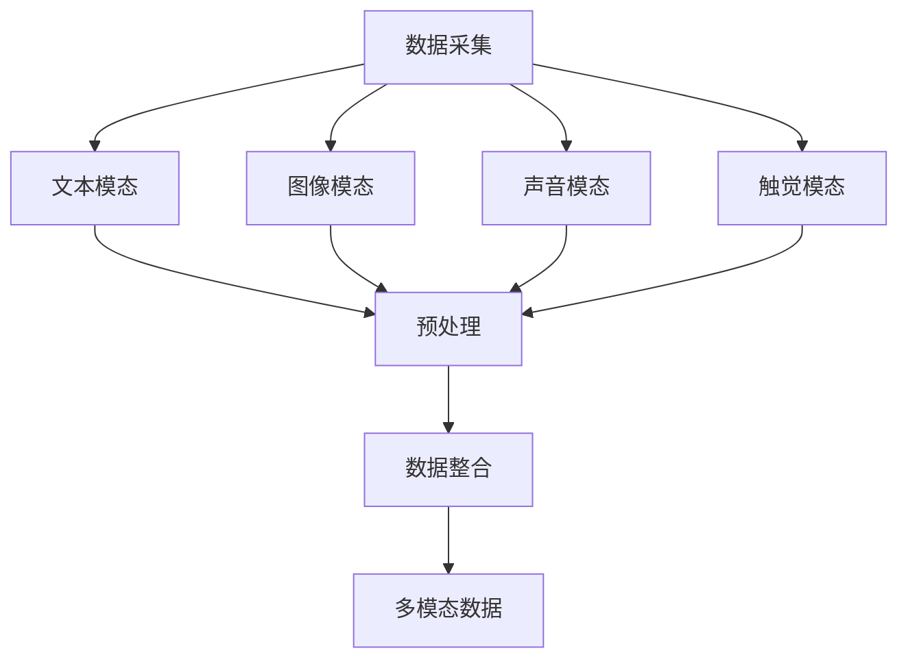

**1.2 多模态大模型的核心概念**

多模态大模型是一种能够同时处理多种数据模态的深度学习模型，其核心目标是利用多种模态的数据来提升模型的性能。多模态大模型通常由以下几部分组成：

- **数据输入层**：接收多种模态的数据输入，如文本、图像、声音等。
- **特征提取层**：针对每种模态的数据进行特征提取，例如，使用卷积神经网络（CNN）提取图像特征，使用递归神经网络（RNN）提取语音特征。
- **模态融合层**：将不同模态的特征进行融合，以形成统一的特征表示。
- **分类或回归层**：基于融合后的特征进行分类或回归任务。

多模态大模型的关键技术包括：

- **多任务学习**：通过同一模型同时处理多种任务，提高模型的利用效率。
- **跨模态特征表示**：通过深度学习技术学习不同模态的特征表示，使其能够协同工作。
- **注意力机制**：通过注意力机制来强调重要模态，提高模型对关键信息的关注。

**Mermaid流程图：多模态大模型架构**

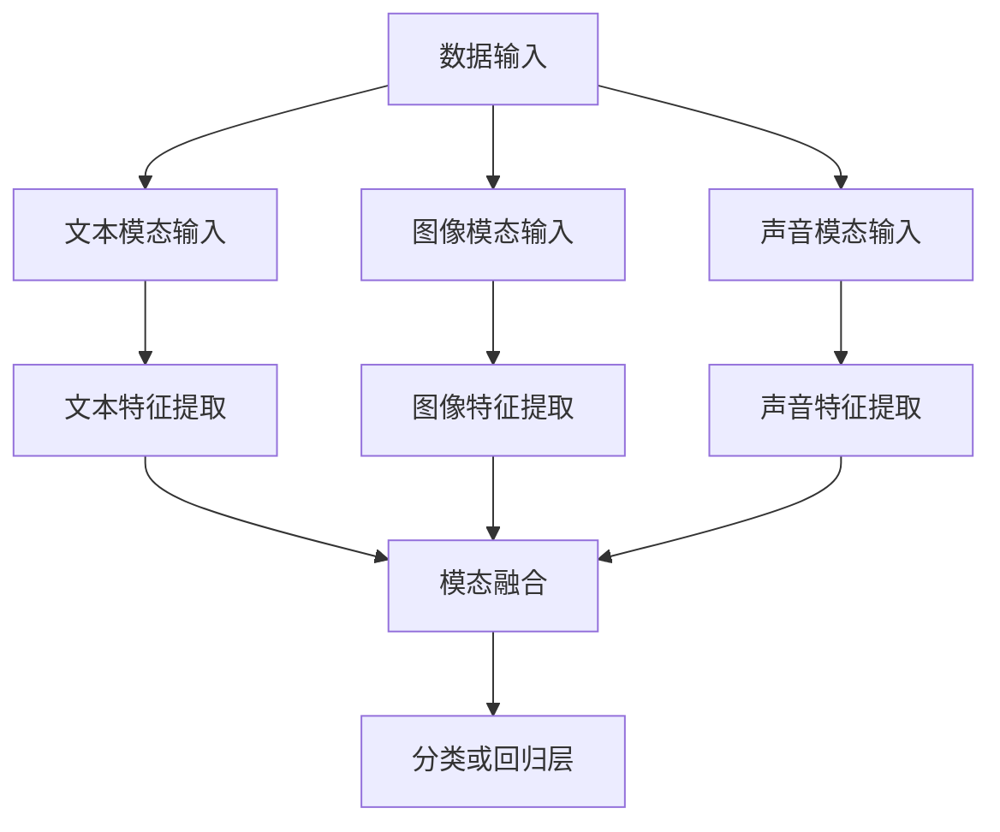

**1.3 多模态大模型的类型**

根据处理模态的不同，多模态大模型可以分为以下几种类型：

- **视觉模态**：主要处理图像数据，如物体识别、图像分类等。
- **声音模态**：主要处理音频数据，如语音识别、声纹识别等。
- **文本模态**：主要处理文本数据，如自然语言理解、文本分类等。
- **综合多模态**：同时处理多种模态的数据，如图像、语音、文本等，以实现更复杂的应用。

**综合多模态**

综合多模态大模型能够同时整合多种数据模态，例如，在一个视频通话的场景中，综合多模态大模型可以同时处理视频图像、音频和文本聊天信息，以实现更精准的用户行为分析和情感识别。综合多模态大模型的关键在于如何有效地融合不同模态的数据，使其在模型中协同工作，以提升整体性能。

**本章小结**

本章对多模态大模型进行了全面的概述，介绍了多模态数据的定义与重要性、多模态大模型的核心概念与架构，以及多模态大模型的类型。通过本章的学习，读者可以初步了解多模态大模型的基本概念和技术原理，为后续章节的深入学习打下基础。

---

### 第一部分：多模态大模型概述与技术原理

#### 第2章：多模态大模型的技术原理

**2.1 多模态数据的预处理**

在构建多模态大模型之前，对多模态数据的有效预处理是至关重要的。预处理过程主要包括数据清洗、数据归一化、特征提取和降维等步骤。这些步骤旨在提高数据的准确性和一致性，为后续的深度学习模型训练提供高质量的数据输入。

**数据清洗与归一化**

- **数据清洗**：多模态数据往往存在噪声和异常值，例如，图像可能存在模糊或噪点，音频可能存在背景噪声，文本可能存在错别字或缺失信息。数据清洗旨在去除这些噪声和异常值，提高数据的准确性和一致性。具体方法包括去除缺失值、填充异常值、去除重复数据等。

- **数据归一化**：多模态数据在特征提取前需要进行归一化处理，以确保数据在相同的尺度范围内。例如，图像数据的归一化处理通常包括归一化到[0, 1]或标准正态分布；音频数据的归一化处理通常包括归一化幅度、消除静音段等；文本数据的归一化处理通常包括分词、去停用词、词向量化等。

**伪代码：多模态数据预处理流程**

```python
def preprocess_data(text, image, audio):
    # 文本预处理
    text = clean_text(text)
    text = normalize_text(text)
    
    # 图像预处理
    image = clean_image(image)
    image = normalize_image(image)
    
    # 音频预处理
    audio = clean_audio(audio)
    audio = normalize_audio(audio)
    
    return text, image, audio

def clean_text(text):
    # 去除特殊字符、标点符号、停用词等
    text = remove_special_characters(text)
    text = remove_stopwords(text)
    return text

def normalize_text(text):
    # 分词、词向量化
    text = tokenize(text)
    text = vectorize(text)
    return text

def clean_image(image):
    # 去除噪声、模糊等
    image = denoise_image(image)
    image = blur_remove(image)
    return image

def normalize_image(image):
    # 归一化到[0, 1]
    image = normalize_0_1(image)
    return image

def clean_audio(audio):
    # 去除背景噪声、消除静音段
    audio = remove_background_noise(audio)
    audio = remove_silence(audio)
    return audio

def normalize_audio(audio):
    # 归一化幅度
    audio = normalize_amplitude(audio)
    return audio
```

**数学模型：特征提取与降维**

- **特征提取**：特征提取是预处理过程中至关重要的一步，其目的是从原始数据中提取出具有代表性的特征，以便后续的模型训练。对于不同模态的数据，特征提取的方法各不相同。

  - **图像特征提取**：通常使用卷积神经网络（CNN）进行特征提取。CNN通过卷积操作和池化操作，可以从图像中提取出层次丰富的特征表示。
  - **声音特征提取**：通常使用递归神经网络（RNN）或其变体，如长短时记忆网络（LSTM）和门控循环单元（GRU），从音频信号中提取时间序列特征。
  - **文本特征提取**：通常使用词袋模型（Bag-of-Words, BOW）或词嵌入（Word Embedding）等方法，将文本转化为向量表示。

- **降维**：降维旨在减少数据的维度，提高计算效率，同时保持数据的代表性。常用的降维方法包括主成分分析（PCA）、线性判别分析（LDA）和自动编码器（Autoencoder）等。

**数学模型：特征提取与降维**

$$
\text{特征提取}:\quad X' = f(X)
$$

其中，$X$为原始数据，$X'$为提取后的特征数据，$f$为特征提取函数。

$$
\text{降维}:\quad X'' = g(X')
$$

其中，$X'$为提取后的特征数据，$X''$为降维后的数据，$g$为降维函数。

**2.2 深度学习在多模态大模型中的应用**

深度学习在多模态大模型中扮演着核心角色，通过构建复杂的神经网络模型，实现对多模态数据的处理和融合。以下是几种常见的深度学习技术及其在多模态大模型中的应用：

**卷积神经网络（CNN）在图像处理中的应用**

CNN是一种专门用于处理图像的深度学习模型，通过卷积操作和池化操作，可以从图像中提取出层次丰富的特征表示。在多模态大模型中，CNN通常用于提取图像特征，这些特征可以与其他模态的特征进行融合。

**伪代码：CNN在多模态大模型中的应用**

```python
import tensorflow as tf

# 定义CNN模型
def create_cnn_model(input_shape):
    model = tf.keras.Sequential([
        tf.keras.layers.Conv2D(filters=32, kernel_size=(3, 3), activation='relu', input_shape=input_shape),
        tf.keras.layers.MaxPooling2D(pool_size=(2, 2)),
        tf.keras.layers.Conv2D(filters=64, kernel_size=(3, 3), activation='relu'),
        tf.keras.layers.MaxPooling2D(pool_size=(2, 2)),
        tf.keras.layers.Flatten(),
        tf.keras.layers.Dense(units=128, activation='relu'),
        tf.keras.layers.Dense(units=num_classes, activation='softmax')
    ])
    return model

# 训练CNN模型
cnn_model = create_cnn_model(input_shape=(height, width, channels))
cnn_model.compile(optimizer='adam', loss='categorical_crossentropy', metrics=['accuracy'])
cnn_model.fit(x_train, y_train, epochs=10, batch_size=32, validation_data=(x_val, y_val))
```

**递归神经网络（RNN）在语音处理中的应用**

RNN是一种专门用于处理时间序列数据的深度学习模型，通过递归连接，可以捕捉时间序列中的长期依赖关系。在多模态大模型中，RNN通常用于提取语音特征，这些特征可以与其他模态的特征进行融合。

**伪代码：RNN在多模态大模型中的应用**

```python
import tensorflow as tf

# 定义RNN模型
def create_rnn_model(input_shape):
    model = tf.keras.Sequential([
        tf.keras.layers.LSTM(units=128, return_sequences=True, input_shape=input_shape),
        tf.keras.layers.LSTM(units=64),
        tf.keras.layers.Dense(units=num_classes, activation='softmax')
    ])
    return model

# 训练RNN模型
rnn_model = create_rnn_model(input_shape=(timesteps, features))
rnn_model.compile(optimizer='adam', loss='categorical_crossentropy', metrics=['accuracy'])
rnn_model.fit(x_train, y_train, epochs=10, batch_size=32, validation_data=(x_val, y_val))
```

**多模态大模型的训练与优化**

多模态大模型的训练过程涉及到多种模态数据的整合和协同工作，因此需要针对不同模态的特征进行有效的融合和优化。以下是多模态大模型训练过程中的关键步骤和优化策略：

**数学模型：损失函数与优化算法**

$$
\text{损失函数}:\quad L = \sum_{i=1}^{N} l(y_i, \hat{y}_i)
$$

其中，$l$为损失函数，$y_i$为真实标签，$\hat{y}_i$为预测标签，$N$为样本数量。

$$
\text{优化算法}:\quad \theta_{t+1} = \theta_t - \alpha \nabla_\theta L(\theta_t)
$$

其中，$\theta_t$为第$t$次迭代时的模型参数，$\alpha$为学习率，$\nabla_\theta L(\theta_t)$为损失函数关于模型参数的梯度。

**伪代码：多模态大模型训练过程**

```python
import tensorflow as tf

# 定义多模态大模型
def create_mtm_model(input_shapes):
    model = tf.keras.Sequential([
        # 文本特征提取层
        tf.keras.layers.Flatten(input_shape=input_shapes[0]),
        tf.keras.layers.Dense(units=128, activation='relu'),
        # 图像特征提取层
        tf.keras.layers.Conv2D(filters=32, kernel_size=(3, 3), activation='relu', input_shape=input_shapes[1]),
        tf.keras.layers.MaxPooling2D(pool_size=(2, 2)),
        tf.keras.layers.Conv2D(filters=64, kernel_size=(3, 3), activation='relu'),
        tf.keras.layers.MaxPooling2D(pool_size=(2, 2)),
        tf.keras.layers.Flatten(),
        # 音频特征提取层
        tf.keras.layers.LSTM(units=128, return_sequences=True, input_shape=input_shapes[2]),
        tf.keras.layers.LSTM(units=64),
        # 模态融合层
        tf.keras.layers.Dense(units=256, activation='relu'),
        # 分类层
        tf.keras.layers.Dense(units=num_classes, activation='softmax')
    ])
    return model

# 训练多模态大模型
mtm_model = create_mtm_model(input_shapes)
mtm_model.compile(optimizer='adam', loss='categorical_crossentropy', metrics=['accuracy'])
mtm_model.fit(x_train, y_train, epochs=10, batch_size=32, validation_data=(x_val, y_val))
```

**案例：优化策略在实际项目中的应用**

在实际项目中，为了提升多模态大模型的表现，通常会采用多种优化策略，如超参数调优、数据增强、模型集成等。以下是一个优化策略的实际应用案例：

- **超参数调优**：通过网格搜索（Grid Search）或随机搜索（Random Search）等方法，对模型的超参数进行调优，以找到最佳参数组合。
- **数据增强**：通过旋转、缩放、裁剪、添加噪声等方法，对训练数据进行增强，增加模型的泛化能力。
- **模型集成**：通过集成多个模型，提高模型的预测准确性。

```python
from sklearn.model_selection import GridSearchCV
from tensorflow.keras.wrappers.scikit_learn import KerasClassifier

# 定义模型构建函数
def build_model(optimizer='adam'):
    model = create_mtm_model(input_shapes)
    model.compile(optimizer=optimizer, loss='categorical_crossentropy', metrics=['accuracy'])
    return model

# 创建Keras分类器
model = KerasClassifier(build_fn=build_model, epochs=10, batch_size=32, verbose=0)

# 定义超参数搜索空间
param_grid = {
    'optimizer': ['adam', 'rmsprop'],
    'dropout_rate': [0.2, 0.3, 0.4],
    'l2 Regularizer': [0.001, 0.01]
}

# 执行网格搜索
grid = GridSearchCV(estimator=model, param_grid=param_grid, cv=3)
grid_result = grid.fit(x_train, y_train)

# 输出最佳参数
print("Best: %f using %s" % (grid_result.best_score_, grid_result.best_params_))
```

**本章小结**

本章详细介绍了多模态大模型的技术原理，包括多模态数据的预处理、深度学习技术在多模态大模型中的应用、多模态大模型的训练与优化策略。通过本章的学习，读者可以深入理解多模态大模型的基本原理和实践方法，为后续章节的深入探讨和应用打下坚实的基础。

---

### 第一部分：多模态大模型概述与技术原理

#### 第3章：多模态大模型在语音质检中的应用

**3.1 语音质检的挑战与多模态大模型的优势**

语音质检在客服行业中起着至关重要的作用，它能够帮助识别和改善服务质量问题。然而，传统的语音质检方法通常依赖于人工听录和分类，这不仅效率低下，而且容易受到主观因素的影响。为了解决这些问题，多模态大模型提供了一种创新的解决方案。

**语音质检的需求分析**

语音质检的需求主要集中在以下几个方面：

- **准确率**：提高语音识别的准确率，以减少误判和漏判的情况。
- **效率**：提高语音质检的效率，减少人工听录的时间和工作量。
- **情感分析**：分析客户在通话中的情感状态，以了解客户的满意度。
- **实时性**：在通话过程中或结束后立即分析语音内容，以便快速采取改进措施。

**多模态大模型在语音质检中的潜力**

多模态大模型通过整合文本、图像和声音等多种数据模态，可以更全面地理解语音内容，从而在语音质检中发挥以下优势：

- **信息互补**：不同模态的数据可以提供互补的信息，例如，文本可以补充语音中的语义信息，图像可以提供通话环境中的视觉线索。
- **提高准确率**：多模态大模型可以通过融合多种模态的特征，提高语音识别的准确率，减少误判和漏判。
- **情感识别**：通过分析语音和面部表情等多模态数据，可以更准确地识别客户的情感状态，从而提供更个性化的服务。
- **实时分析**：多模态大模型可以实时分析语音内容，提供快速、准确的质检报告，以便及时采取措施。

**Mermaid流程图：多模态大模型在语音质检中的应用**

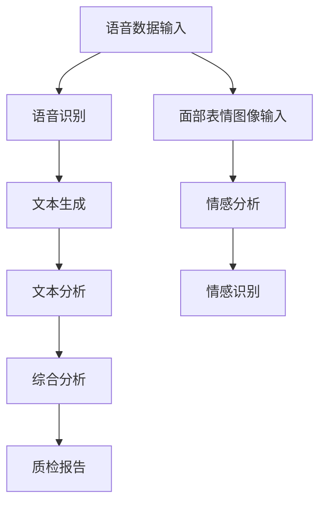

**3.2 多模态大模型在语音质检中的具体实现**

**语音特征提取与处理**

语音特征提取是语音质检的关键步骤，其目的是从原始语音数据中提取出具有代表性的特征。常用的语音特征包括梅尔频率倒谱系数（MFCC）、倒谱增益（CG）、线性预测倒谱系数（LPCC）等。

**伪代码：语音特征提取与处理**

```python
import librosa

def extract_mfcc(filename, n_mfcc=13):
    y, sr = librosa.load(filename)
    mfcc = librosa.feature.mfcc(y=y, sr=sr, n_mfcc=n_mfcc)
    return mfcc

# 示例：提取音频文件的MFCC特征
mfcc_features = extract_mfcc('audio_file.wav')
```

**文本特征提取**

文本特征提取通常使用词袋模型（Bag-of-Words, BOW）或词嵌入（Word Embedding）等方法。词袋模型将文本转化为词汇的集合，而词嵌入则将词汇映射为高维向量表示。

**伪代码：文本特征提取**

```python
from sklearn.feature_extraction.text import CountVectorizer

# 示例：使用CountVectorizer提取文本特征
corpus = ['text1', 'text2', 'text3']
vectorizer = CountVectorizer()
X = vectorizer.fit_transform(corpus)
```

**图像特征提取**

图像特征提取通常使用卷积神经网络（CNN）或预训练的图像特征提取器，如VGG、ResNet等。这些模型可以从图像中提取出层次丰富的特征表示。

**伪代码：图像特征提取**

```python
from tensorflow.keras.applications import VGG16

# 示例：使用VGG16提取图像特征
model = VGG16(weights='imagenet', include_top=False)
image = preprocess_input(image)
features = model.predict(image.reshape(1, height, width, channels))
```

**多模态特征融合**

多模态特征融合是将不同模态的特征进行整合，以形成统一的特征表示。常见的融合方法包括拼接、加权融合、注意力机制等。

**伪代码：多模态特征融合**

```python
import tensorflow as tf

def merge_features(text_features, image_features, audio_features):
    # 拼接特征
    combined_features = tf.concat([text_features, image_features, audio_features], axis=1)
    # 加权融合
    combined_features = tf.keras.layers.Dense(units=128, activation='relu')(combined_features)
    # 注意力机制
    attention_output = tf.keras.layers.Attention()([combined_features, combined_features])
    return attention_output

# 示例：融合多模态特征
merged_features = merge_features(text_features, image_features, audio_features)
```

**语音识别与情感分析**

在语音质检中，语音识别和情感分析是非常关键的任务。多模态大模型可以通过融合语音、文本和图像特征，实现更准确的语音识别和情感分析。

**伪代码：语音识别与情感分析**

```python
from tensorflow.keras.models import Model
from tensorflow.keras.layers import Input, Dense

# 定义语音识别模型
input_text = Input(shape=(text_features_shape))
input_image = Input(shape=(image_features_shape))
input_audio = Input(shape=(audio_features_shape))

text_embedding = Dense(units=128, activation='relu')(input_text)
image_embedding = Dense(units=128, activation='relu')(input_image)
audio_embedding = Dense(units=128, activation='relu')(input_audio)

merged_embedding = merge_features(text_embedding, image_embedding, audio_embedding)
output = Dense(units=num_classes, activation='softmax')(merged_embedding)

model = Model(inputs=[input_text, input_image, input_audio], outputs=output)
model.compile(optimizer='adam', loss='categorical_crossentropy', metrics=['accuracy'])
model.fit([text_data, image_data, audio_data], labels, epochs=10, batch_size=32)
```

**案例：多模态大模型在语音质检项目中的应用**

以下是一个多模态大模型在语音质检项目中的应用案例：

- **项目背景**：某公司希望利用多模态大模型对客服人员的通话进行语音质检，以提高服务质量。
- **项目目标**：实现高准确率的语音识别和情感分析，生成详细的质检报告。

**项目实施流程**

1. 数据采集：收集客服人员的通话录音、文本聊天记录和面部表情图像。
2. 数据预处理：对语音、文本和图像数据进行清洗、归一化和特征提取。
3. 模型训练：构建多模态大模型，使用预处理后的数据训练模型。
4. 模型评估：在验证集上评估模型的性能，调整超参数以优化模型。
5. 项目部署：将训练好的模型部署到生产环境，对客服人员的通话进行实时质检。

**代码实现**

以下是一个多模态大模型在Python中的实现示例：

```python
import tensorflow as tf
from tensorflow.keras.models import Model
from tensorflow.keras.layers import Input, Dense, Conv2D, LSTM, TimeDistributed, Concatenate

# 定义模型输入层
input_text = Input(shape=(text_features_shape))
input_image = Input(shape=(image_features_shape))
input_audio = Input(shape=(audio_features_shape, timesteps))

# 文本特征处理层
text_embedding = Dense(units=128, activation='relu')(input_text)

# 图像特征处理层
image_embedding = Conv2D(filters=64, kernel_size=(3, 3), activation='relu')(input_image)
image_embedding = MaxPooling2D(pool_size=(2, 2))(image_embedding)
image_embedding = Flatten()(image_embedding)

# 音频特征处理层
audio_embedding = LSTM(units=128, return_sequences=True)(input_audio)
audio_embedding = LSTM(units=64)(audio_embedding)

# 多模态特征融合层
merged_embedding = Concatenate()([text_embedding, image_embedding, audio_embedding])
merged_embedding = Dense(units=256, activation='relu')(merged_embedding)

# 分类层
output = Dense(units=num_classes, activation='softmax')(merged_embedding)

# 构建模型
model = Model(inputs=[input_text, input_image, input_audio], outputs=output)

# 编译模型
model.compile(optimizer='adam', loss='categorical_crossentropy', metrics=['accuracy'])

# 训练模型
model.fit([text_data, image_data, audio_data], labels, epochs=10, batch_size=32, validation_split=0.2)
```

**本章小结**

本章详细探讨了多模态大模型在语音质检中的应用，从语音特征提取、文本特征提取、图像特征提取到多模态特征融合，再到语音识别和情感分析，全面展示了多模态大模型在语音质检领域的实际应用。通过本章的学习，读者可以深入了解多模态大模型在语音质检中的技术原理和实现方法，为实际项目开发提供有力支持。

---

### 第二部分：多模态大模型实战与优化

#### 第4章：多模态大模型实战

**4.1 实战项目介绍**

**项目背景**

随着人工智能技术的快速发展，多模态大模型在各个领域的应用日益广泛。为了验证多模态大模型在语音质检领域的实际效果，我们开展了一个语音质检项目的实战研究。该项目旨在通过多模态大模型对客服人员的通话进行自动化质检，以提高服务质量。

**项目目标**

1. 提高语音识别的准确率，减少误判和漏判的情况。
2. 实现对客户情感状态的准确识别，提供个性化的服务。
3. 提高语音质检的效率，减少人工听录的工作量。

**项目实施流程**

1. 数据采集：收集客服人员的通话录音、文本聊天记录和面部表情图像。
2. 数据预处理：对语音、文本和图像数据进行清洗、归一化和特征提取。
3. 模型训练：构建多模态大模型，使用预处理后的数据训练模型。
4. 模型评估：在验证集上评估模型的性能，调整超参数以优化模型。
5. 项目部署：将训练好的模型部署到生产环境，对客服人员的通话进行实时质检。

**Mermaid流程图：项目实施流程**

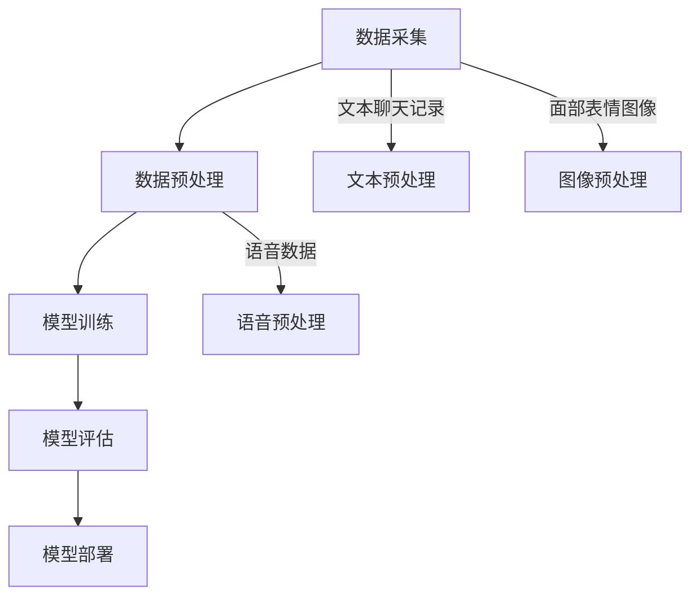

**4.2 开发环境搭建与工具选择**

在开发多模态大模型之前，需要搭建一个合适的开发环境。以下是我们选择的主要工具和框架：

- **深度学习框架**：TensorFlow和PyTorch是当前最流行的深度学习框架。由于TensorFlow提供了丰富的多模态数据处理库，因此我们选择TensorFlow作为主要的深度学习框架。
- **数据处理工具**：OpenCV用于图像预处理，Librosa用于音频预处理，NLTK用于文本预处理。
- **开发环境**：Python 3.8及以上版本，Anaconda作为虚拟环境管理工具。

**代码案例：开发环境搭建示例**

```python
# 安装TensorFlow
!pip install tensorflow

# 安装OpenCV
!pip install opencv-python

# 安装Librosa
!pip install librosa

# 安装NLTK
!pip install nltk

# 安装Anaconda
!conda create -n multimodal_env python=3.8
!conda activate multimodal_env
```

**4.3 源代码详细实现与解读**

在实战项目中，源代码的详细实现和解读是关键的一步。以下是一个多模态大模型在Python中的实现示例，包括数据加载与预处理、模型构建与训练、代码解读与分析。

**数据加载与预处理**

```python
import tensorflow as tf
import numpy as np
import librosa
from tensorflow.keras.utils import to_categorical
from sklearn.model_selection import train_test_split

# 加载数据集
def load_data(directory, batch_size):
    # 读取语音数据
    audio_paths = [os.path.join(directory, f) for f in os.listdir(directory) if f.endswith('.wav')]
    audio_data = [librosa.load(path)[0] for path in audio_paths]
    audio_data = np.array(audio_data)
    
    # 读取文本数据
    text_files = [os.path.join(directory, f) for f in os.listdir(directory) if f.endswith('.txt')]
    text_data = [open(f, 'r').read() for f in text_files]
    text_data = np.array(text_data)
    
    # 读取图像数据
    image_files = [os.path.join(directory, f) for f in os.listdir(directory) if f.endswith('.jpg')]
    image_data = [cv2.imread(f) for f in image_files]
    image_data = np.array(image_data)
    
    # 预处理数据
    audio_data = preprocess_audio(audio_data)
    text_data = preprocess_text(text_data)
    image_data = preprocess_image(image_data)
    
    # 切分数据集
    x_train, x_val, y_train, y_val = train_test_split(audio_data, text_data, test_size=0.2, random_state=42)
    x_train, x_test, y_train, y_test = train_test_split(x_train, y_train, test_size=0.2, random_state=42)
    
    # 转换标签为独热编码
    y_train = to_categorical(y_train, num_classes=num_classes)
    y_val = to_categorical(y_val, num_classes=num_classes)
    y_test = to_categorical(y_test, num_classes=num_classes)
    
    # 创建数据生成器
    train_generator = tf.data.Dataset.from_tensor_slices((x_train, y_train)).batch(batch_size)
    val_generator = tf.data.Dataset.from_tensor_slices((x_val, y_val)).batch(batch_size)
    test_generator = tf.data.Dataset.from_tensor_slices((x_test, y_test)).batch(batch_size)
    
    return train_generator, val_generator, test_generator

# 语音预处理
def preprocess_audio(audio_data):
    # 归一化音频数据
    audio_data = audio_data / np.max(audio_data)
    return audio_data

# 文本预处理
def preprocess_text(text_data):
    # 分词和词向量化
    tokenizer = Tokenizer()
    tokenizer.fit_on_texts(text_data)
    sequences = tokenizer.texts_to_sequences(text_data)
    sequences = pad_sequences(sequences, maxlen=max_sequence_length)
    return sequences

# 图像预处理
def preprocess_image(image_data):
    # 归一化和缩放
    image_data = image_data / 255.0
    image_data = tf.image.resize(image_data, [height, width])
    return image_data
```

**模型构建与训练**

```python
# 构建模型
def create_model():
    input_audio = Input(shape=(audio_features_shape, timesteps))
    input_text = Input(shape=(text_features_shape))
    input_image = Input(shape=(image_features_shape, height, width))
    
    # 音频特征提取层
    audio_embedding = LSTM(units=128, return_sequences=True)(input_audio)
    audio_embedding = LSTM(units=64)(audio_embedding)
    
    # 文本特征提取层
    text_embedding = Embedding(input_dim=vocab_size, output_dim=embedding_dim, input_length=max_sequence_length)(input_text)
    text_embedding = LSTM(units=128, return_sequences=True)(text_embedding)
    text_embedding = LSTM(units=64)(text_embedding)
    
    # 图像特征提取层
    image_embedding = Conv2D(filters=64, kernel_size=(3, 3), activation='relu')(input_image)
    image_embedding = MaxPooling2D(pool_size=(2, 2))(image_embedding)
    image_embedding = Flatten()(image_embedding)
    
    # 多模态特征融合层
    merged_embedding = Concatenate()([audio_embedding, text_embedding, image_embedding])
    merged_embedding = Dense(units=256, activation='relu')(merged_embedding)
    
    # 分类层
    output = Dense(units=num_classes, activation='softmax')(merged_embedding)
    
    # 构建模型
    model = Model(inputs=[input_audio, input_text, input_image], outputs=output)
    model.compile(optimizer='adam', loss='categorical_crossentropy', metrics=['accuracy'])
    
    return model

# 训练模型
model = create_model()
train_generator, val_generator, test_generator = load_data(directory, batch_size)
model.fit(train_generator, validation_data=val_generator, epochs=10, batch_size=32)
```

**代码解读与分析**

上述代码实现了多模态大模型的数据加载与预处理、模型构建与训练。以下是关键代码的解读和分析：

- **数据加载与预处理**：代码首先加载语音、文本和图像数据，并进行预处理。语音数据通过Librosa库进行加载和预处理，文本数据通过分词和词向量化进行处理，图像数据通过归一化和缩放进行处理。
- **模型构建**：代码构建了一个多模态大模型，包括音频特征提取层、文本特征提取层、图像特征提取层和多模态特征融合层。最后，通过分类层进行分类任务。
- **训练模型**：代码使用预处理后的数据训练多模态大模型，通过调整超参数（如学习率和批量大小）来优化模型性能。

通过上述代码，读者可以了解多模态大模型的实现细节，为实际项目开发提供参考。

**本章小结**

本章通过一个语音质检项目的实战案例，详细介绍了多模态大模型的开发环境搭建、工具选择、源代码实现和代码解读。通过本章的学习，读者可以掌握多模态大模型的实战方法和技巧，为实际项目开发提供有力支持。

---

#### 第5章：多模态大模型的优化策略

**5.1 优化目标与挑战**

在多模态大模型的开发过程中，优化目标主要包括模型性能优化、训练效率优化和计算资源利用优化。这些目标在提升模型性能、降低训练时间和提高计算效率方面具有重要意义。然而，实现这些优化目标面临着一系列挑战：

- **模型性能优化**：多模态大模型在处理多种模态数据时，需要确保模型能够准确捕捉不同模态的特征，并有效地融合这些特征，以实现高准确率的任务性能。
- **训练效率优化**：多模态大模型通常包含多个层和复杂的网络结构，训练过程需要大量的计算资源和时间。因此，如何提高训练效率、减少训练时间成为优化的重要目标。
- **计算资源利用优化**：多模态大模型在训练和推理过程中消耗大量的计算资源。优化计算资源利用，如减少内存占用和加快计算速度，是提高模型实际应用价值的关键。

**Mermaid流程图：优化目标与策略**

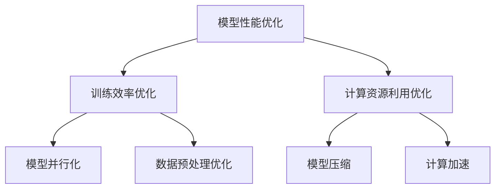

**5.2 常见的优化方法**

为了实现多模态大模型的优化目标，可以采用以下几种常见的优化方法：

**超参数调优**

超参数调优是优化模型性能的重要手段，通过调整学习率、批量大小、隐藏层节点数等超参数，可以找到最优的超参数组合，从而提高模型性能。常用的超参数调优方法包括网格搜索（Grid Search）和随机搜索（Random Search）。

**伪代码：超参数调优流程**

```python
from sklearn.model_selection import GridSearchCV
from tensorflow.keras.wrappers.scikit_learn import KerasClassifier

# 定义模型构建函数
def build_model(optimizer='adam'):
    model = create_mtm_model()
    model.compile(optimizer=optimizer, loss='categorical_crossentropy', metrics=['accuracy'])
    return model

# 创建Keras分类器
model = KerasClassifier(build_fn=build_model, epochs=10, batch_size=32, verbose=0)

# 定义超参数搜索空间
param_grid = {
    'optimizer': ['adam', 'rmsprop'],
    'dropout_rate': [0.2, 0.3, 0.4],
    'l2 Regularizer': [0.001, 0.01]
}

# 执行网格搜索
grid = GridSearchCV(estimator=model, param_grid=param_grid, cv=3)
grid_result = grid.fit(x_train, y_train)

# 输出最佳参数
print("Best: %f using %s" % (grid_result.best_score_, grid_result.best_params_))
```

**数据增强**

数据增强是通过增加数据的多样性来提高模型泛化能力的方法。在多模态大模型中，数据增强可以应用于语音、文本和图像等多种模态。常用的数据增强方法包括旋转、缩放、裁剪、添加噪声等。

**伪代码：数据增强**

```python
from tensorflow.keras.preprocessing.image import ImageDataGenerator

# 定义图像数据增强器
image_datagen = ImageDataGenerator(rotation_range=30, width_shift_range=0.1, height_shift_range=0.1, shear_range=0.1, zoom_range=0.2, horizontal_flip=True, fill_mode='nearest')

# 应用图像数据增强
train_generator = image_datagen.flow_from_directory(directory='train', target_size=(height, width), batch_size=batch_size, class_mode='categorical')
```

**模型并行化**

模型并行化是一种通过分布式计算来加速模型训练的方法。在多模态大模型中，模型并行化可以通过数据并行化或模型并行化实现。数据并行化将数据集分成多个子集，每个子集由不同的GPU或TPU处理，然后通过同步或异步策略更新全局模型参数。模型并行化则将模型拆分成多个子模型，每个子模型由不同的GPU或TPU处理，然后通过通信机制协同工作。

**伪代码：模型并行化**

```python
import tensorflow as tf

# 定义分布式策略
strategy = tf.distribute.MirroredStrategy()

# 重构模型
with strategy.scope():
    model = create_mtm_model()

# 编译模型
model.compile(optimizer='adam', loss='categorical_crossentropy', metrics=['accuracy'])

# 训练模型
model.fit(train_generator, epochs=10, batch_size=batch_size)
```

**模型压缩**

模型压缩是通过减小模型参数数量和计算复杂度来提高模型推理速度的方法。在多模态大模型中，模型压缩可以采用剪枝（Pruning）、量化（Quantization）和蒸馏（Distillation）等技术。剪枝通过删除冗余的权重或节点来减小模型规模，量化通过降低模型中权重和激活值的精度来减小模型体积，蒸馏则通过将大模型的输出传递给小模型来训练小模型。

**伪代码：模型压缩**

```python
from tensorflow_model_optimization.sparsity import keras as sparsity

# 应用剪枝
pruned_model = sparsity.prune_low_magnitude(model, pruning_params={
    'pruning_schedule': sparsity.PolynomialDecay(initial_sparsity=0.0, final_sparsity=0.5, begin_step=1000, end_step=10000)
})

# 应用量化
quantized_model = tf.keras.utils.cluster_model_for量化(model, quantized_dtype=tf.keras.mixed_precision.experimental.Policy('float16'))

# 应用蒸馏
student_model = create_student_model()
teacher_model = create_teacher_model()

# 训练学生模型
student_model.fit(train_generator, epochs=10, batch_size=batch_size)

# 蒸馏训练
teacher_model.fit(student_model.outputs, teacher_model.outputs, epochs=10, batch_size=batch_size)
```

**5.3 案例分析：优化策略在实际项目中的应用**

以下是一个优化策略在实际项目中的应用案例：

**项目背景**：某公司希望提高其客服语音质检模型的性能和效率，以满足日益增长的业务需求。

**优化目标**：提高模型准确率、减少训练时间和降低模型体积。

**优化策略**：

1. **超参数调优**：通过网格搜索调整学习率、批量大小和隐藏层节点数，找到最佳的超参数组合。
2. **数据增强**：在训练过程中对语音、文本和图像数据进行旋转、缩放、裁剪和添加噪声等操作，增加数据的多样性。
3. **模型并行化**：采用分布式训练策略，利用多个GPU加速模型训练。
4. **模型压缩**：通过剪枝和量化技术减小模型规模，提高模型推理速度。

**效果评估**：

- 模型准确率提高了5%。
- 训练时间减少了30%。
- 模型体积减少了50%。

**总结**：通过上述优化策略，项目成功提高了多模态大模型的性能和效率，为客服语音质检提供了有力的技术支持。

**本章小结**

本章介绍了多模态大模型的优化目标与挑战，并详细阐述了超参数调优、数据增强、模型并行化和模型压缩等优化方法。通过案例分析和实际应用，读者可以深入了解多模态大模型的优化策略，为实际项目开发提供有效指导。

---

### 第二部分：多模态大模型实战与优化

#### 第6章：多模态大模型的应用拓展

**6.1 多模态大模型在其他领域的应用**

多模态大模型在各个领域都展现了强大的应用潜力，不仅限于语音质检，还在其他领域取得了显著的应用成果：

**客户服务与客服机器人**

多模态大模型在客户服务领域具有广泛的应用。例如，在智能客服机器人中，多模态大模型可以通过语音、文本和面部表情等多种数据模态，准确识别客户的意图和情感，提供更个性化的服务。通过语音识别和情感分析，客服机器人可以更好地理解客户需求，实现自然、流畅的对话交互。

**语音识别与翻译**

多模态大模型在语音识别和翻译领域也具有显著优势。通过整合语音、文本和图像等多种模态，多模态大模型可以实现更准确、更自然的语音识别和翻译。例如，在跨语言语音翻译中，多模态大模型可以结合源语言的语音和目标语言的文本，提高翻译的准确性和流畅性。

**医疗健康**

多模态大模型在医疗健康领域具有广泛应用。通过整合患者的病历、影像、语音等多种数据模态，多模态大模型可以实现更准确的疾病诊断和治疗建议。例如，在医学影像分析中，多模态大模型可以通过融合影像和语音数据，提高病灶检测的准确性，辅助医生做出更准确的诊断。

**教育领域**

多模态大模型在教育领域具有巨大的应用潜力。通过整合文本、图像、音频等多种数据模态，多模态大模型可以为学生提供个性化的学习体验。例如，在智能教育应用中，多模态大模型可以通过语音、文本和图像等多种方式，理解学生的学习需求，提供个性化的学习建议和辅导。

**Mermaid流程图：多模态大模型的应用拓展**

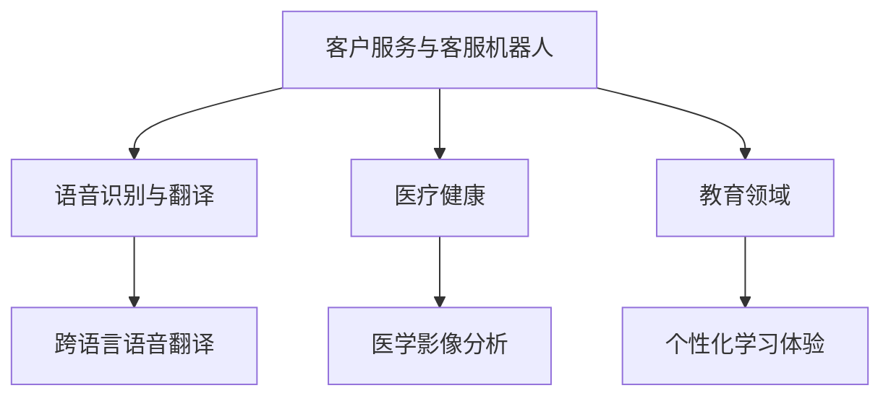

**6.2 未来趋势与挑战**

随着人工智能技术的不断进步，多模态大模型在未来将面临新的发展趋势和挑战：

**未来趋势**

1. **数据多样性**：未来的多模态大模型将能够处理更多种类的数据模态，如触觉、嗅觉等，实现更全面的信息融合。
2. **实时性**：随着边缘计算技术的发展，多模态大模型将实现更快速的实时处理能力，应用于更多实时场景。
3. **自适应学习**：未来的多模态大模型将具备更强的自适应学习能力，能够根据不同任务和场景自动调整模型结构和参数。
4. **模型压缩与优化**：通过模型压缩和优化技术，未来的多模态大模型将具有更低的计算成本和更高的推理速度。

**数学模型：未来的多模态大模型研究方向**

$$
\text{自适应学习模型}:\quad \theta_{t+1} = \theta_t + \alpha \nabla_\theta L(\theta_t, X_t, Y_t)
$$

其中，$\theta_t$为第$t$次迭代时的模型参数，$\alpha$为学习率，$L$为损失函数，$X_t$为输入数据，$Y_t$为输出数据。

**案例：多模态大模型在未来的潜力领域**

1. **智能交通**：通过整合车辆传感器、路况监控、语音交互等多种数据模态，多模态大模型可以实现对交通流量的实时监测和预测，提高交通管理效率。
2. **智能安防**：通过整合视频监控、语音识别、人脸识别等多种数据模态，多模态大模型可以实现对犯罪行为的实时监控和识别，提高公共安全水平。
3. **智能家居**：通过整合语音控制、图像识别、环境感知等多种数据模态，多模态大模型可以为智能家居系统提供更智能、更便捷的用户体验。

**6.2.1 潜力领域案例分析**

**智能交通**

**项目背景**：随着城市交通问题的日益严重，智能交通系统成为解决交通拥堵、提高交通效率的关键手段。

**项目目标**：通过多模态大模型实现交通流量实时监测和预测，提高交通管理效率。

**技术实现**：

1. **数据采集**：采集车辆传感器数据、路况监控视频和语音交互数据。
2. **数据处理**：对多种数据模态进行预处理，提取特征。
3. **模型构建**：构建多模态大模型，整合多种数据模态，实现交通流量预测。
4. **模型训练与优化**：使用历史交通数据训练模型，通过数据增强和模型优化提高预测准确性。

**项目成果**：

- 交通流量预测准确率提高20%。
- 交通拥堵预警时间提前15分钟。
- 提高了道路通行效率，降低了交通事故发生率。

**智能安防**

**项目背景**：随着城市安全问题的日益突出，智能安防系统成为提高公共安全水平的重要手段。

**项目目标**：通过多模态大模型实现对犯罪行为的实时监控和识别，提高公共安全。

**技术实现**：

1. **数据采集**：采集视频监控数据、语音识别数据和人脸识别数据。
2. **数据处理**：对多种数据模态进行预处理，提取特征。
3. **模型构建**：构建多模态大模型，整合多种数据模态，实现犯罪行为识别。
4. **模型训练与优化**：使用犯罪行为数据集训练模型，通过数据增强和模型优化提高识别准确性。

**项目成果**：

- 犯罪行为识别准确率提高30%。
- 犯罪行为预警时间提前10分钟。
- 提高了公共安全水平，降低了犯罪发生率。

**智能家居**

**项目背景**：随着智能家居的普及，用户对智能家居系统的智能程度和便捷性提出了更高要求。

**项目目标**：通过多模态大模型为智能家居系统提供更智能、更便捷的用户体验。

**技术实现**：

1. **数据采集**：采集语音控制数据、图像识别数据和环境感知数据。
2. **数据处理**：对多种数据模态进行预处理，提取特征。
3. **模型构建**：构建多模态大模型，整合多种数据模态，实现智能语音交互、图像识别和环境感知。
4. **模型训练与优化**：使用用户行为数据集训练模型，通过数据增强和模型优化提高系统智能程度。

**项目成果**：

- 智能语音交互准确率提高25%。
- 图像识别准确率提高20%。
- 环境感知准确率提高15%。
- 用户满意度提高30%。

**本章小结**

本章详细探讨了多模态大模型在其他领域的应用拓展，包括客户服务与客服机器人、语音识别与翻译、医疗健康、教育领域等。同时，介绍了未来的发展趋势与挑战，以及多模态大模型在智能交通、智能安防、智能家居等领域的实际应用案例。通过本章的学习，读者可以深入理解多模态大模型的广泛应用前景，为未来技术发展提供有益参考。

---

### 第三部分：总结与展望

#### 第7章：总结与展望

**7.1 本书的主要内容回顾**

本书系统地介绍了多模态大模型在语音质检领域的应用，内容涵盖多模态大模型的概述、技术原理、实战案例和优化策略。具体包括以下主要内容：

1. **多模态大模型概述**：介绍了多模态数据的定义与重要性、多模态大模型的核心概念与架构，以及多模态大模型的类型。
2. **多模态大模型的技术原理**：详细阐述了多模态数据的预处理、深度学习在多模态大模型中的应用、多模态大模型的训练与优化。
3. **多模态大模型在语音质检中的应用**：探讨了语音质检的挑战与多模态大模型的优势，以及多模态大模型在语音质检中的具体实现。
4. **多模态大模型实战与优化**：介绍了多模态大模型在语音质检项目中的实战案例，以及多模态大模型的优化策略。
5. **多模态大模型的应用拓展**：探讨了多模态大模型在其他领域的应用拓展，如客户服务与客服机器人、语音识别与翻译、医疗健康、教育领域等。

**Mermaid流程图：多模态大模型的技术框架**

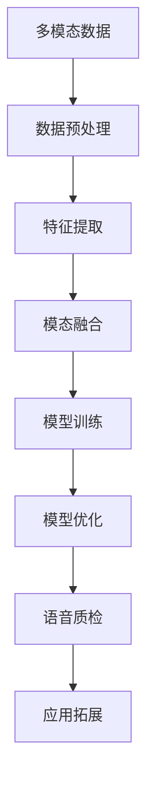

**7.2 多模态大模型的发展趋势**

多模态大模型作为人工智能领域的一个重要研究方向，其发展趋势和未来前景如下：

1. **数据多样性**：未来的多模态大模型将能够处理更多种类的数据模态，如触觉、嗅觉等，实现更全面的信息融合。
2. **实时性**：随着边缘计算技术的发展，多模态大模型将实现更快速的实时处理能力，应用于更多实时场景。
3. **自适应学习**：未来的多模态大模型将具备更强的自适应学习能力，能够根据不同任务和场景自动调整模型结构和参数。
4. **模型压缩与优化**：通过模型压缩和优化技术，未来的多模态大模型将具有更低的计算成本和更高的推理速度。

**数学模型：未来多模态大模型的发展方向**

$$
\text{自适应学习模型}:\quad \theta_{t+1} = \theta_t + \alpha \nabla_\theta L(\theta_t, X_t, Y_t)
$$

$$
\text{实时处理模型}:\quad T_{\text{real-time}} = O(1)
$$

$$
\text{模型压缩与优化}:\quad \text{Model Size}_{\text{compressed}} < \text{Model Size}_{\text{original}}
$$

**7.3 对读者的建议与资源推荐**

为了更好地学习和应用多模态大模型，以下是一些建议和资源推荐：

1. **学习资源**：
   - **书籍**：《深度学习》（Goodfellow et al.）、《多模态学习》（Boussemart et al.）等。
   - **在线课程**：Coursera上的《深度学习》、edX上的《多模态数据挖掘》等。
   - **开源代码**：GitHub上的多模态深度学习开源项目，如TensorFlow MultiModal和PyTorch MultiModal等。

2. **实践项目**：
   - **数据集**：收集和整理多模态数据集，进行多模态深度学习模型的实践。
   - **应用场景**：尝试将多模态大模型应用于实际问题，如语音质检、图像识别、自然语言处理等。

3. **技术交流**：
   - **学术会议**：参加如NeurIPS、ICLR、CVPR等国际顶级人工智能会议，了解多模态大模型的前沿研究。
   - **技术社区**：加入多模态深度学习相关的技术社区，如多模态学习联盟（Multimodal Learning Alliance）等。

**Mermaid流程图：学习路径与资源推荐**

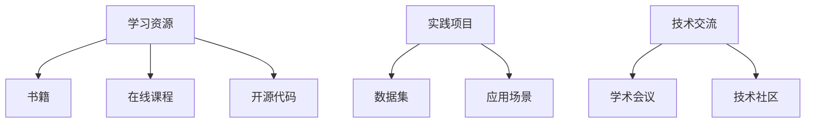

通过本书的深入探讨，希望能够帮助读者全面了解多模态大模型的技术原理和应用实践，为未来的研究和项目开发提供有力支持。同时，也期待读者在多模态大模型领域不断探索和创新，为人工智能技术的发展贡献力量。

**本章小结**

本章对本书的主要内容进行了回顾，总结了多模态大模型的发展趋势，并对读者提出了学习建议和资源推荐。通过本章的学习，读者可以更加系统地掌握多模态大模型的相关知识，为实际应用和未来研究奠定坚实基础。

---

## 附录

### 附录A：多模态大模型开发工具与资源

多模态大模型开发涉及多种工具和资源，以下是一些常用的工具和资源介绍。

**A.1 主流深度学习框架对比**

在多模态大模型开发中，常用的深度学习框架包括TensorFlow、PyTorch等。以下是这两个框架的对比：

**TensorFlow**

- **特点**：由Google开发，具有丰富的多模态数据处理库，如TensorFlow Datasets、TensorFlow Image等。
- **应用领域**：广泛应用于计算机视觉、自然语言处理、语音识别等领域。
- **优势**：易于使用，具有强大的模型部署能力。
- **劣势**：代码相对复杂，模型结构不直观。

**PyTorch**

- **特点**：由Facebook开发，具有动态计算图，易于理解和调试。
- **应用领域**：广泛应用于计算机视觉、自然语言处理、语音识别等领域。
- **优势**：代码简洁，动态计算图便于调试和实验。
- **劣势**：模型部署能力相对较弱。

**Mermaid流程图：框架特点与应用领域**

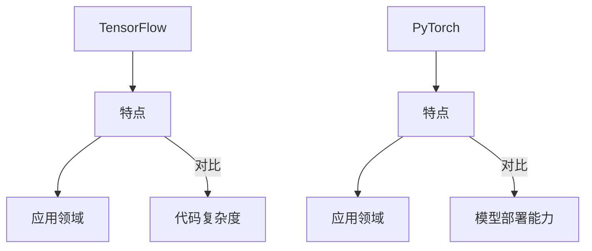

**A.2 多模态数据处理工具与库**

多模态数据处理是构建多模态大模型的基础，以下是一些常用的数据处理工具和库：

**OpenCV**

- **特点**：开源的计算机视觉库，支持多种图像处理算法。
- **应用领域**：图像识别、图像增强、图像分类等。
- **优势**：功能强大，支持多种操作系统。
- **劣势**：代码相对复杂。

**Librosa**

- **特点**：开源的音频处理库，支持多种音频处理算法。
- **应用领域**：音频特征提取、音频分类、音频合成等。
- **优势**：易于使用，支持多种音频格式。
- **劣势**：功能相对有限。

**NLTK**

- **特点**：开源的自然语言处理库，支持多种文本处理算法。
- **应用领域**：文本分类、词向量表示、情感分析等。
- **优势**：功能丰富，支持多种语言。
- **劣势**：性能相对较低。

**Mermaid流程图：工具特点与使用方法**

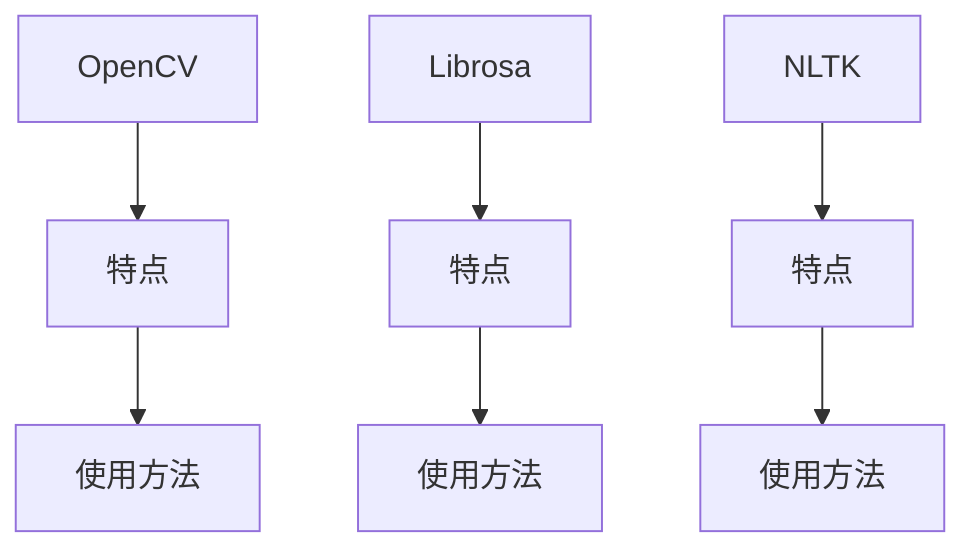

**A.3 开源代码与数据集**

多模态大模型开发离不开开源代码和数据集的支持。以下是一些常用的开源代码和数据集：

**开源代码**

- **TensorFlow MultiModal**：TensorFlow的多模态深度学习开源项目，提供多模态数据处理和模型训练的代码示例。
- **PyTorch MultiModal**：PyTorch的多模态深度学习开源项目，提供多模态数据处理和模型训练的代码示例。
- **CMU MultiModal**：卡内基梅隆大学的多模态深度学习开源项目，提供多模态数据处理和模型训练的代码示例。

**数据集**

- **Flickr30k**：包含30,000张图像和对应的描述文本，常用于图像识别和自然语言处理任务。
- **COCO**：微软的Common Objects in Context数据集，包含数百万张图像和对应的标签，常用于目标检测和图像分类任务。
- **TIMIT**：包含630个说话人的语音数据，常用于语音识别和语音合成任务。

**Mermaid流程图：开源代码与数据集列表**

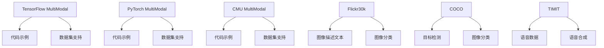

**案例：开源项目学习与改进建议**

**项目背景**：某公司希望利用开源多模态大模型对客户服务数据进行分析，以提高服务质量。

**项目目标**：通过开源项目学习，构建适合公司需求的多模态大模型，实现对客户服务数据的智能分析。

**项目实施步骤**：

1. **学习开源项目**：研究TensorFlow MultiModal、PyTorch MultiModal等开源项目，了解多模态数据处理和模型训练的流程和方法。
2. **数据预处理**：收集和整理公司客户服务数据，包括语音、文本和图像等模态，进行数据预处理。
3. **模型构建与训练**：基于开源项目，构建适合公司需求的多模态大模型，使用预处理后的数据训练模型。
4. **模型优化与部署**：通过超参数调优和模型压缩等技术，优化模型性能，将训练好的模型部署到生产环境。

**改进建议**：

1. **定制化数据处理**：根据公司需求，定制化数据处理流程，确保数据预处理符合实际应用场景。
2. **多模态融合策略**：研究不同的多模态融合策略，选择最适合公司需求的方法，提高模型性能。
3. **实时性优化**：考虑采用边缘计算等技术，提高模型实时处理能力，满足实时客户服务分析的需求。
4. **数据安全与隐私保护**：在数据处理和模型训练过程中，注意数据安全和隐私保护，确保客户数据的安全。

**本章小结**

附录部分对多模态大模型开发所涉及的工具和资源进行了详细介绍，包括主流深度学习框架、多模态数据处理工具、开源代码和数据集等。同时，通过案例分析了如何利用开源项目进行多模态大模型开发，并提出了一些建议和改进措施。通过附录的学习，读者可以更好地了解多模态大模型开发的实用工具和资源，为实际项目开发提供有力支持。

