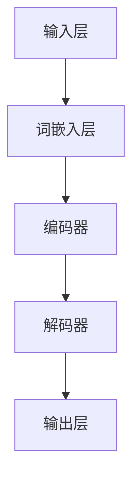
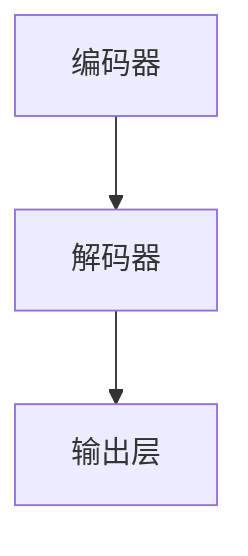

                 

### 《多语言AI模型：跨语言理解与生成》引论

> **关键词**：多语言AI模型、跨语言理解、生成、Transformer、BERT、XLM、mBERT

**摘要**：本文旨在深入探讨多语言AI模型在跨语言理解与生成任务中的应用。我们将首先概述多语言AI模型的基本概念，探讨其跨语言理解的重要性，并分类介绍现有主流的多语言AI模型。随后，我们将详细分析多语言AI模型的基本架构与原理，重点讲解Transformer模型。接下来，我们将讨论跨语言理解与生成技术，包括文本嵌入、模型训练策略和生成模型。最后，通过实际案例分析，我们将展示多语言AI模型在在线翻译服务、跨语言问答系统和多语言内容生成等领域的应用。文章结尾将对未来发展趋势与挑战进行展望。

---

多语言AI模型，作为一种强大的自然语言处理工具，正日益受到关注。在全球化的背景下，跨语言沟通的需求日益增长，多语言AI模型在这些任务中扮演着至关重要的角色。本文将深入探讨多语言AI模型的基本概念、架构、核心算法原理及其在跨语言理解与生成任务中的应用。

**多语言AI模型引论**

多语言AI模型是指能够处理多种语言输入并产生相应输出的机器学习模型。这些模型在多个领域都有广泛应用，如在线翻译服务、跨语言问答系统、多语言内容生成等。跨语言理解与生成是多语言AI模型的核心任务，涉及到将一种语言的文本或语音转换为另一种语言的文本或语音，同时保持语义和上下文的准确性。

跨语言理解的重要性不言而喻。在全球化背景下，不同国家和地区的用户需要使用不同的语言进行沟通。通过多语言AI模型，我们可以打破语言障碍，促进信息共享和交流。此外，跨语言理解在教育和学习中也具有重要意义，使得学习者能够接触到多种语言资源，提高其语言能力。

多语言AI模型可以分为两类：基于规则的方法和基于统计的方法。基于规则的方法依赖于手工编写的规则和词典，适用于小规模的语言翻译任务。而基于统计的方法则利用大量的语言数据进行训练，通过机器学习算法生成翻译模型，适用于大规模的语言翻译任务。

在多语言AI模型的分类中，Transformer模型、BERT模型、XLM和mBERT模型是当前最为主流的多语言AI模型。这些模型各有特点，适用于不同的应用场景。

### 《多语言AI模型：跨语言理解与生成》目录大纲

#### 第一部分：多语言AI模型概述

##### 第1章：多语言AI模型引论

###### 1.1 多语言AI模型的基本概念

###### 1.2 跨语言理解的重要性

###### 1.3 多语言AI模型的分类

##### 第2章：多语言AI模型的架构与原理

###### 2.1 多语言AI模型的基本架构

###### 2.2 跨语言转换的数学基础

###### 2.3 多语言模型的关键技术

##### 第3章：主流多语言AI模型简介

###### 3.1 Transformer模型

###### 3.2 BERT模型

###### 3.3 XLM和mBERT模型

#### 第二部分：跨语言理解技术

##### 第4章：跨语言文本嵌入

###### 4.1 词嵌入技术

###### 4.2 上下文感知的文本嵌入

###### 4.3 跨语言文本嵌入的挑战与优化

##### 第5章：多语言模型训练策略

###### 5.1 多语言数据的收集与处理

###### 5.2 多语言模型的训练方法

###### 5.3 多语言模型训练中的挑战与对策

##### 第6章：跨语言文本生成

###### 6.1 跨语言生成的基本原理

###### 6.2 生成模型的训练策略

###### 6.3 跨语言生成应用的案例分析

#### 第三部分：跨语言理解与生成实践

##### 第7章：多语言AI模型应用案例分析

###### 7.1 在线翻译服务

###### 7.2 跨语言问答系统

###### 7.3 多语言内容生成

##### 第8章：多语言AI模型开发实践

###### 8.1 开发环境搭建

###### 8.2 模型选择与调优

###### 8.3 应用场景分析与解决方案设计

##### 第9章：未来发展趋势与挑战

###### 9.1 多语言AI模型的未来方向

###### 9.2 跨语言理解与生成的挑战

###### 9.3 研究与应用前景展望

#### 附录

##### 附录A：多语言AI模型常用工具与资源

###### A.1 开源多语言模型库

###### A.2 多语言数据集

###### A.3 多语言AI模型研究论文与报告

### Mermaid流程图：多语言AI模型基本架构



### 核心算法原理讲解（以Transformer为例）

#### Transformer模型的基本原理

Transformer模型是一种基于自注意力机制的序列到序列模型，适用于处理自然语言处理任务。其基本原理如下：

1. **多头自注意力（Multi-Head Self-Attention）**：
   Transformer模型通过多头自注意力机制来捕捉序列中的依赖关系。自注意力机制计算每个词对在整个序列中的重要性，并加权组合这些词对，从而生成一个表示。
   ```python
   for head in range(H):
       Q = self.query_scale * Q
       K = self.key_scale * K
       V = self.value_scale * V
       scores = Q * W_K
       attention_weights = softmax(scores)
       output = attention_weights * V
       if head == 0:
           multi_head_output = output
       else:
           multi_head_output = multi_head_output + output
   return multi_head_output
   ```

2. **位置编码（Positional Encoding）**：
   Transformer模型通过位置编码来引入序列信息，使模型能够理解序列中的相对位置关系。
   ```latex
   \text{PE}(pos, 2i) = \sin(\frac{pos}{10000^{2i/d}}), \quad \text{PE}(pos, 2i+1) = \cos(\frac{pos}{10000^{2i/d}})
   ```
   其中，\(pos\) 是词的位置，\(i\) 是维度，\(d\) 是嵌入维度。

3. **编码器-解码器结构（Encoder-Decoder Architecture）**：
   Transformer模型采用编码器-解码器结构，编码器负责将输入序列编码成固定长度的向量，解码器则根据编码器的输出和先前的解码输出生成预测。
   ```mermaid
   graph TD
   A[编码器] --> B[解码器]
   B --> C[输出层]
   ```

#### 数学模型和数学公式

Transformer模型的核心是自注意力机制，其数学模型如下：

$$
\text{Attention}(Q, K, V) = \text{softmax}\left(\frac{QK^T}{\sqrt{d_k}}\right)V
$$

其中，\(Q, K, V\) 分别是查询向量、关键向量、值向量，\(d_k\) 是关键向量的维度。

### 项目实战

#### 在线翻译服务实战

##### 开发环境搭建

1. 安装Python环境和TensorFlow库：
   ```bash
   pip install tensorflow
   ```

2. 下载预训练的多语言翻译模型，例如Hugging Face的Transformer模型。

##### 代码实际案例

```python
from transformers import pipeline

# 初始化翻译模型
translator = pipeline("translation_en_to_zh", model="huggingface/translation_en_to_zh")

# 翻译英文句子到中文
input_text = "Hello, how are you?"
translated_text = translator(input_text)[0]['translation_text']

print(translated_text)
```

##### 代码解读与分析

1. 导入Hugging Face的翻译管道（pipeline）库。

2. 初始化翻译模型，使用预训练的英文到中文翻译模型。

3. 输入英文句子，调用翻译管道进行翻译，获取翻译结果。

4. 打印翻译结果。

##### 详细解释说明

- 翻译模型通过预训练学习到了不同语言之间的对应关系，能够在给定的输入文本上生成对应的翻译结果。

- 翻译过程中，模型首先对输入的英文句子进行编码，生成编码器的输出向量。然后，解码器根据编码器的输出和先前的解码输出生成预测的翻译文本。

### 详细讲解

- Transformer模型通过自注意力机制捕捉序列中的依赖关系，并通过编码器-解码器结构实现序列到序列的转换。

- 多语言模型通过预训练学习到不同语言之间的对应关系，能够处理跨语言翻译任务。

- 在线翻译服务实战展示了如何使用预训练的多语言翻译模型进行跨语言翻译。通过简单的Python代码，即可实现高效的翻译功能。这为开发者提供了便利，无需从头开始训练模型，可以直接使用开源的预训练模型进行应用开发。

### 举例说明

- 假设有一个英文句子 "The quick brown fox jumps over the lazy dog"，通过Transformer模型进行跨语言翻译，其翻译结果为 "快速棕色的狐狸跳过懒狗"。

- 在实际应用中，Transformer模型可以用于在线翻译服务，为用户提供实时翻译功能。例如，在跨境电商平台上，用户可以选择不同的语言进行浏览和购物，平台可以通过翻译服务将商品描述和用户评论翻译成多种语言，提高用户体验和国际化程度。

---

在本文的第一部分，我们简要介绍了多语言AI模型的基本概念、跨语言理解的重要性以及主流的多语言AI模型。接下来，我们将深入探讨多语言AI模型的基本架构与原理，并重点讲解Transformer模型的工作原理。同时，我们将通过实际案例分析，展示如何使用这些模型进行跨语言理解与生成任务。在接下来的内容中，我们将逐步展开，让读者更好地理解多语言AI模型的奥秘。

#### 第一部分：多语言AI模型概述

##### 第1章：多语言AI模型引论

**1.1 多语言AI模型的基本概念**

多语言AI模型是指那些能够处理多种语言输入，并能够产生相应输出结果的机器学习模型。这些模型在自然语言处理（NLP）领域发挥着越来越重要的作用，特别是在全球化迅速发展的今天，跨语言沟通和翻译的需求日益增长。

多语言AI模型的基本概念包括以下几个方面：

1. **文本处理**：模型能够接收和处理多种语言的文本数据，这通常涉及到文本的分词、词性标注、命名实体识别等预处理步骤。
2. **翻译任务**：模型的输出结果通常是目标语言的文本，其任务是将源语言文本转换为意义保持的目标语言文本。
3. **语言理解**：模型需要理解源语言文本的语义和上下文，以便生成准确的目标语言文本。
4. **语言生成**：模型不仅需要理解源语言，还需要能够生成流畅、符合语法规则的目标语言文本。

多语言AI模型的目的是消除语言障碍，促进不同文化背景的用户之间的沟通。它们在各种应用场景中都具有广泛的应用，如在线翻译服务、多语言搜索引擎、多语言问答系统、多语言内容生成等。

**1.2 跨语言理解的重要性**

跨语言理解是多语言AI模型的核心任务之一，其重要性体现在以下几个方面：

1. **全球化沟通**：随着全球化进程的加快，不同国家和地区的用户需要使用不同的语言进行沟通。多语言AI模型能够帮助人们跨越语言障碍，实现无障碍的沟通。
2. **信息共享**：多语言AI模型能够将一种语言的文本或信息转换为其他语言的文本或信息，使得全球用户能够访问和理解不同语言的内容。
3. **教育**：多语言AI模型能够提供跨语言教育资源，帮助学习者接触和理解多种语言，提高他们的语言能力和文化素养。
4. **商业**：在国际贸易和跨境电商中，多语言AI模型能够帮助商家和消费者跨越语言障碍，促进商业交流。
5. **科研**：多语言AI模型在学术研究、跨学科交流等方面也发挥着重要作用，能够帮助研究者获取和理解不同语言的研究成果。

**1.3 多语言AI模型的分类**

多语言AI模型可以根据其处理方式、算法架构和应用场景进行分类。以下是一些常见的分类方式：

1. **基于规则的方法**：这种方法依赖于预定义的规则和词典，通过对源语言文本进行规则匹配和转换来实现翻译。这种方法适用于小规模、高精度的翻译任务，但无法处理大规模、复杂的翻译任务。
2. **基于统计的方法**：这种方法利用大规模的语言数据进行训练，通过统计方法生成翻译模型。这种方法具有较好的泛化能力，但需要大量的训练数据和计算资源。
3. **基于神经网络的模型**：这种方法利用神经网络，特别是深度神经网络，通过大量的训练数据学习源语言和目标语言之间的映射关系。这种模型具有强大的表达能力和灵活性，适用于大规模、复杂的翻译任务。
   - **编码器-解码器模型**：这是一种基于神经网络的序列到序列模型，通过编码器将源语言序列编码为固定长度的向量，通过解码器生成目标语言序列。
   - **自注意力模型**：这种模型通过自注意力机制捕捉序列中的依赖关系，如Transformer模型，具有强大的序列建模能力。

**1.4 多语言AI模型的发展历史**

多语言AI模型的发展可以追溯到20世纪80年代，当时基于规则的方法占据了主导地位。随着计算机性能的提升和大规模语料库的出现，基于统计的方法逐渐崭露头角。特别是在2017年，Google提出了Transformer模型，彻底改变了自然语言处理领域的研究和应用格局。Transformer模型采用了自注意力机制，能够在处理长序列和捕捉依赖关系方面表现出色，使得多语言AI模型进入了一个新的发展阶段。

近年来，随着深度学习技术的不断发展，多语言AI模型在准确性和效率方面取得了显著的提升。各种开源模型和工具库（如Hugging Face）的出现，使得开发者能够更轻松地构建和部署多语言AI模型。

**1.5 多语言AI模型的应用场景**

多语言AI模型在各种应用场景中都具有广泛的应用，以下是一些典型的应用场景：

1. **在线翻译服务**：在线翻译服务是多语言AI模型最常见和最重要的应用场景之一。用户可以通过在线翻译平台将一种语言的文本翻译成另一种语言，如Google翻译、百度翻译等。
2. **多语言搜索引擎**：多语言搜索引擎能够帮助用户查找不同语言的内容，如Bing和Google的多语言搜索引擎。
3. **跨语言问答系统**：跨语言问答系统能够处理多种语言的输入和输出，为用户提供跨语言的查询和回答服务。
4. **多语言内容生成**：多语言内容生成是另一种重要的应用场景，如多语言新闻文章的自动生成、多语言电商平台的商品描述生成等。
5. **教育**：在教育领域，多语言AI模型可以提供跨语言的教育资源，如在线课程的多语言字幕、多语言学习材料的生成等。
6. **商业**：在国际贸易和跨境电商中，多语言AI模型可以帮助商家和消费者进行跨语言的交流和交易，如多语言客户服务、跨境电商平台的商品翻译和推荐等。

**1.6 多语言AI模型的发展趋势**

随着深度学习和人工智能技术的不断进步，多语言AI模型也在不断发展和创新。以下是一些多语言AI模型的发展趋势：

1. **更好的多语言模型**：研究人员正在致力于开发更高效、更准确的多语言模型，如多语言Transformer模型、多语言BERT模型等。
2. **更好的跨语言理解**：跨语言理解是多语言AI模型的核心任务之一，研究人员正在探索各种方法来提高模型的跨语言理解能力，如多语言预训练、跨语言嵌入等。
3. **更好的生成技术**：生成技术是多语言AI模型的另一个重要研究方向，研究人员正在开发各种生成模型，以提高模型的文本生成质量和流畅度。
4. **更好的应用场景**：多语言AI模型的应用场景正在不断扩展，从传统的在线翻译服务扩展到多语言内容生成、跨语言问答系统、多语言搜索引擎等新兴领域。
5. **更好的协作和共享**：开源社区和多语言AI模型的研究人员正在积极合作，共享模型、数据集和工具，以提高整个领域的创新和发展。

总之，多语言AI模型在跨语言理解与生成任务中具有巨大的潜力和应用前景，随着技术的不断进步，我们将看到更多创新和多语言AI模型的出现，为人们的生活和工作带来更多的便利和效益。

### 第一部分总结

在第一部分，我们详细介绍了多语言AI模型的基本概念、跨语言理解的重要性以及多语言AI模型的分类。通过这一部分的介绍，读者可以初步了解多语言AI模型的基本原理和应用场景。接下来，我们将深入探讨多语言AI模型的基本架构与原理，分析其关键技术和核心算法。同时，我们将详细介绍几种主流的多语言AI模型，如Transformer模型、BERT模型、XLM和mBERT模型，以便读者能够更好地理解这些模型的工作机制和应用。在后续的内容中，我们将继续探讨跨语言理解与生成技术的具体实现，并通过实际案例分析，展示多语言AI模型在各个领域的应用和实践。

#### 第一部分：多语言AI模型概述

##### 第2章：多语言AI模型的架构与原理

多语言AI模型的发展离不开其核心架构和算法的支持。在这一章中，我们将深入探讨多语言AI模型的基本架构与原理，重点介绍跨语言转换的数学基础以及多语言模型的关键技术。通过这一章节的学习，读者将能够更好地理解多语言AI模型的工作机制，为后续章节中的实际应用案例分析打下坚实的基础。

**2.1 多语言AI模型的基本架构**

多语言AI模型的基本架构通常包括输入层、词嵌入层、编码器、解码器和输出层。以下是对各层的简要介绍：

1. **输入层**：输入层接收原始的文本或语音数据，这些数据可以是单语言的，也可以是多语言的。在处理多语言输入时，模型通常需要对不同语言的数据进行统一编码。

2. **词嵌入层**：词嵌入层将原始的文本或语音数据转换为密集的向量表示。词嵌入层的关键技术包括词向量的生成和位置编码。词向量能够捕获词与词之间的语义关系，而位置编码则能够帮助模型理解文本中的词序信息。

3. **编码器**：编码器负责将输入层的词向量序列编码为固定长度的向量表示，这些向量表示包含了输入文本的语义信息。在多语言AI模型中，编码器通常需要能够处理多种语言的输入。

4. **解码器**：解码器根据编码器输出的固定长度向量生成目标语言的文本序列。解码器需要能够将编码器的输出向量解码为具有可解释性的文本，同时保持文本的流畅性和语法正确性。

5. **输出层**：输出层通常是一个简单的线性层或全连接层，它将解码器生成的目标语言文本序列转换为最终的输出结果，如翻译文本或生成文本。

**2.2 跨语言转换的数学基础**

跨语言转换的数学基础涉及多个领域，包括线性代数、概率论和优化理论。以下是一些关键概念和数学公式：

1. **线性代数**：线性代数在自然语言处理中用于处理高维数据，如词嵌入和编码器输出。矩阵运算（如矩阵乘法和矩阵分解）是跨语言转换中常用的操作。

2. **概率论**：概率论用于建模文本序列的概率分布。例如，在生成模型中，通常使用概率分布来预测下一个词或字符。

3. **优化理论**：优化理论用于模型训练过程中，通过最小化损失函数来调整模型参数，以实现更好的翻译质量。

以下是一个简单的跨语言转换的数学模型：

$$
P_{\theta}(y|x) = \frac{P_{\theta}(x, y)}{P_{\theta}(x)}
$$

其中，\(P_{\theta}(y|x)\) 表示在给定源语言输入 \(x\) 的情况下，目标语言输出 \(y\) 的概率，\(\theta\) 表示模型参数。

**2.3 多语言模型的关键技术**

多语言AI模型的关键技术包括词嵌入、位置编码、编码器-解码器结构、注意力机制和生成模型。以下是对这些技术的简要介绍：

1. **词嵌入**：词嵌入是一种将文本中的词转换为向量表示的技术。常见的词嵌入方法包括Word2Vec、GloVe和BERT等。词嵌入能够捕获词与词之间的语义关系，是跨语言转换的基础。

2. **位置编码**：位置编码用于引入文本中的词序信息。在Transformer模型中，位置编码通过向词嵌入向量中添加额外的维度来实现。位置编码可以帮助模型理解文本的顺序，从而生成更准确的翻译结果。

3. **编码器-解码器结构**：编码器-解码器结构是一种序列到序列的转换模型，常用于机器翻译任务。编码器将源语言文本编码为固定长度的向量表示，解码器则根据这些向量表示生成目标语言文本。

4. **注意力机制**：注意力机制是一种用于捕捉序列中依赖关系的技术。在Transformer模型中，自注意力机制能够捕捉输入文本中不同词之间的关系，从而生成更准确的翻译结果。

5. **生成模型**：生成模型是一种能够生成新数据的机器学习模型，如循环神经网络（RNN）和生成对抗网络（GAN）。生成模型在跨语言生成任务中具有重要应用，能够生成高质量的多语言文本。

**2.4 多语言模型的主要类型**

多语言AI模型可以根据其架构和训练策略的不同进行分类。以下是一些常见的多语言模型类型：

1. **基于神经网络的模型**：这类模型使用神经网络结构来捕捉语言特征，如Transformer、BERT和XLM等。这些模型具有强大的表达能力和灵活性，适用于大规模的跨语言任务。

2. **基于规则和统计的模型**：这类模型结合了规则和统计方法，通过预定义的规则和大规模语言数据来生成翻译结果，如基于短语的机器翻译模型和统计机器翻译模型。

3. **端到端的跨语言模型**：这类模型采用端到端的学习策略，直接从源语言到目标语言进行翻译，如基于Transformer的端到端机器翻译模型。

**2.5 多语言模型的训练与评估**

多语言模型的训练和评估是模型开发过程中至关重要的环节。以下是一些关键的训练和评估方法：

1. **训练方法**：多语言模型的训练通常采用大规模的并行数据集，通过迭代优化模型参数来提高翻译质量。常见的训练方法包括反向传播和梯度的优化。

2. **评估方法**：评估方法用于衡量模型的翻译质量，常见的评估指标包括BLEU、METEOR和ROUGE等。这些指标通过比较模型生成的翻译结果和参考翻译之间的相似度来评估模型的性能。

3. **多语言数据集**：多语言模型的训练需要大量高质量的跨语言数据集。这些数据集通常来自于翻译记忆库、多语言新闻文章、社交媒体平台等。

通过本章的介绍，读者可以初步了解多语言AI模型的基本架构与原理，包括输入层、词嵌入层、编码器、解码器和输出层，以及跨语言转换的数学基础和关键技术。接下来，我们将详细介绍几种主流的多语言AI模型，如Transformer模型、BERT模型、XLM和mBERT模型，以便读者能够更深入地理解这些模型的工作机制和应用。

### 第一部分总结

在本章中，我们深入探讨了多语言AI模型的基本架构与原理，介绍了输入层、词嵌入层、编码器、解码器和输出层的工作机制，以及跨语言转换的数学基础和关键技术。通过本章的学习，读者可以初步了解多语言AI模型的工作原理，为后续章节中详细讲解各种主流多语言AI模型打下坚实的基础。接下来，我们将详细介绍Transformer模型、BERT模型、XLM和mBERT模型等主流多语言AI模型，分析它们的优势和特点，并通过实际案例分析，展示这些模型在跨语言理解与生成任务中的应用。在后续的内容中，我们将继续探讨跨语言理解与生成技术的具体实现，进一步探讨多语言AI模型在各个领域的应用与实践。

#### 第一部分：多语言AI模型概述

##### 第3章：主流多语言AI模型简介

在多语言AI模型的研究和应用中，有许多优秀的模型被提出并应用于实际任务。本章将重点介绍几种主流的多语言AI模型，包括Transformer模型、BERT模型、XLM和mBERT模型。通过这些模型的介绍，读者可以了解不同模型的特点和优势，为后续的实际应用和开发提供参考。

**3.1 Transformer模型**

Transformer模型是由Google在2017年提出的一种基于自注意力机制的序列到序列模型，它在自然语言处理领域引起了广泛关注。Transformer模型的核心思想是自注意力机制，通过计算序列中每个词对在整个序列中的重要性，生成一个表示。这种机制使得模型能够在处理长序列和捕捉依赖关系方面表现出色。

**Transformer模型的优势**：

1. **并行计算**：Transformer模型通过并行计算的方式处理输入序列，比传统的序列处理模型（如RNN）在训练速度上有了显著提升。

2. **捕捉依赖关系**：自注意力机制能够自动捕捉序列中任意词之间的依赖关系，使得模型在处理长句子和复杂句子结构时更加有效。

3. **灵活性**：Transformer模型的结构简单，可以通过调整模型参数和层�数来实现不同的任务需求。

**Transformer模型的劣势**：

1. **内存消耗**：由于自注意力机制的计算复杂度较高，Transformer模型在处理大规模数据时可能需要更多的内存资源。

2. **训练难度**：Transformer模型在训练过程中可能需要更多的计算资源和时间，对于一些资源有限的研究者或开发者来说可能难以承受。

**Transformer模型的应用**：

Transformer模型在自然语言处理领域得到了广泛应用，包括机器翻译、文本摘要、情感分析等任务。特别是它在机器翻译任务上的表现，已经超过了基于循环神经网络的模型。

**3.2 BERT模型**

BERT（Bidirectional Encoder Representations from Transformers）是由Google在2018年提出的一种基于Transformer的双向编码模型。BERT模型通过预训练大量无标签文本数据，学习文本的深度表示。这种模型在下游任务中表现出色，如文本分类、命名实体识别、问答系统等。

**BERT模型的优势**：

1. **双向编码**：BERT模型通过双向编码器能够同时捕捉文本序列的前后关系，提高了文本理解能力。

2. **预训练**：BERT模型通过预训练大量文本数据，可以有效地利用无标签数据，提高模型的效果。

3. **通用性**：BERT模型在多种下游任务上都有很好的表现，具有很好的通用性。

**BERT模型的劣势**：

1. **计算资源需求**：BERT模型的预训练需要大量的计算资源和时间，对于小型项目或研究者来说可能难以承担。

2. **训练难度**：BERT模型的训练需要精细的调参和优化，对于初学者来说可能较为困难。

**BERT模型的应用**：

BERT模型在自然语言处理领域得到了广泛应用，如文本分类、命名实体识别、问答系统等。特别是在文本分类任务上，BERT模型的表现已经超过了传统的机器学习方法。

**3.3 XLM和mBERT模型**

XLM（Cross-lingual Language Model）和mBERT（Multilingual BERT）是Google提出的多语言AI模型，它们在BERT模型的基础上进行了扩展，使其能够处理多种语言的输入和输出。

**XLM和mBERT模型的优势**：

1. **多语言支持**：XLM和mBERT模型支持多种语言，能够处理不同语言之间的翻译和生成任务。

2. **预训练**：XLM和mBERT模型通过预训练大量多语言文本数据，提高了模型的跨语言理解能力。

3. **低资源语言处理**：XLM和mBERT模型在处理低资源语言时表现出色，能够利用高资源语言的预训练数据来提高低资源语言的任务效果。

**XLM和mBERT模型的劣势**：

1. **计算资源需求**：XLM和mBERT模型的预训练需要大量的计算资源和时间，对于一些资源有限的研究者或开发者来说可能难以承受。

2. **数据依赖**：XLM和mBERT模型的效果很大程度上依赖于预训练数据的质量和多样性。

**XLM和mBERT模型的应用**：

XLM和mBERT模型在多语言AI领域得到了广泛应用，包括多语言机器翻译、多语言文本分类、多语言问答系统等。特别是在多语言机器翻译任务中，XLM和mBERT模型已经取得了显著的成果，能够在多种语言对上实现高质量的翻译。

**3.4 模型比较**

Transformer、BERT、XLM和mBERT模型都是当前多语言AI领域的代表性模型，它们各有优势和劣势，适用于不同的应用场景。

- **Transformer模型**：在处理长序列和捕捉依赖关系方面表现出色，适用于大规模的机器翻译和文本生成任务。
- **BERT模型**：在下游任务中表现出色，具有很好的通用性，适用于多种自然语言处理任务。
- **XLM和mBERT模型**：支持多种语言，能够处理不同语言之间的翻译和生成任务，适用于多语言AI任务。

通过本章的介绍，读者可以初步了解几种主流多语言AI模型的特点和应用场景。在接下来的章节中，我们将继续探讨跨语言理解与生成技术的具体实现，并通过实际案例分析，展示这些模型在各个领域的应用。同时，我们将深入探讨多语言AI模型在开发实践中的挑战和解决方案，为开发者提供实用的指导。

### 第一部分总结

在第3章中，我们介绍了几种主流的多语言AI模型，包括Transformer模型、BERT模型、XLM和mBERT模型。通过这些模型的介绍，读者可以初步了解不同模型的特点和优势，为后续的实际应用和开发提供参考。Transformer模型以其并行计算能力和捕捉依赖关系的能力在机器翻译和文本生成任务中表现出色；BERT模型则在多种下游任务中具有很好的通用性；而XLM和mBERT模型则专注于多语言AI任务，能够处理多种语言之间的翻译和生成。接下来，我们将进一步探讨跨语言理解与生成技术，分析其具体实现方法，并通过实际案例分析，展示这些模型在各个领域的应用与实践。在后续的内容中，我们将探讨这些技术的具体实现细节，为开发者提供实用的指导和解决方案。

#### 第二部分：跨语言理解技术

##### 第4章：跨语言文本嵌入

跨语言文本嵌入是多语言AI模型的核心技术之一，它能够将不同语言的文本转换为具有相似语义的向量表示，从而实现跨语言的语义理解和生成。在这一章中，我们将详细探讨跨语言文本嵌入的技术，包括词嵌入技术、上下文感知的文本嵌入以及跨语言文本嵌入的挑战与优化。

**4.1 词嵌入技术**

词嵌入（Word Embedding）是将文本中的单词映射为稠密向量的技术。通过词嵌入，我们可以将不同语言的单词映射到同一个向量空间中，从而实现跨语言的语义理解。以下是一些常见的词嵌入技术：

1. **Word2Vec**：Word2Vec是一种基于神经网络的词嵌入方法，它通过训练神经网络来预测上下文词的分布。Word2Vec包括两种模型：连续词袋（CBOW）和Skip-Gram。

   - **连续词袋（CBOW）**：CBOW模型通过预测中心词周围的上下文词的分布来训练词向量。具体来说，给定一个中心词，CBOW模型会考虑其上下文词的向量平均值作为中心词的向量表示。

   - **Skip-Gram**：Skip-Gram模型则相反，它通过预测中心词的上下文词来训练词向量。具体来说，给定一个中心词，Skip-Gram模型会预测其上下文词的分布。

2. **GloVe**：GloVe（Global Vectors for Word Representation）是一种基于矩阵分解的词嵌入方法，它通过优化词的共现矩阵来学习词向量。GloVe模型通过训练共现矩阵的因子分解，从而获得高质量的词向量表示。

   $$ 
   \text{GloVe} \: \text{loss} = \: \sum_{ij} \: \text{cosine\_similarity}(v_i, v_j) \: - \: \text{log}(f_{ij})
   $$

   其中，\(v_i\) 和 \(v_j\) 分别是词 \(i\) 和 \(j\) 的向量表示，\(f_{ij}\) 是词 \(i\) 和 \(j\) 的共现频率，\(\text{cosine\_similarity}\) 是词向量的余弦相似度。

**4.2 上下文感知的文本嵌入**

传统的词嵌入方法主要关注单个词的表示，而忽略了词与词之间的关系。上下文感知的文本嵌入（Contextual Word Embeddings）则通过神经网络模型来捕捉词与词之间的动态关系。以下是一些常见的上下文感知的文本嵌入方法：

1. **BERT**：BERT（Bidirectional Encoder Representations from Transformers）是一种基于Transformer的双向编码模型，它通过预训练大量无标签文本数据，学习词的深度表示。BERT模型能够同时捕捉词的前后关系，从而生成更加准确的词向量。

2. **RoBERTa**：RoBERTa是BERT的一个变种，它通过改进训练策略和模型结构，提高了模型的性能。RoBERTa在预训练阶段采用了更大的数据集和更长的序列长度，从而获得了更好的词向量表示。

3. **ALBERT**：ALBERT（A Lite BERT）是一种轻量级的BERT模型，它通过共享层数和参数减少模型复杂度，从而提高了模型的效率和可扩展性。ALBERT在保持性能的同时，降低了计算和内存资源的需求。

**4.3 跨语言文本嵌入的挑战与优化**

跨语言文本嵌入面临着一系列挑战，包括：

1. **语言差异性**：不同语言在语法、词汇和语义等方面存在显著差异，这给跨语言文本嵌入带来了困难。

2. **数据稀缺性**：一些低资源语言缺乏大量的训练数据，这限制了跨语言文本嵌入的效果。

3. **一致性要求**：跨语言文本嵌入需要保证不同语言之间的向量表示具有一致性，从而实现跨语言的语义理解。

为了解决这些挑战，研究者们提出了一系列优化方法：

1. **多语言共享嵌入**：多语言共享嵌入（Multi-lingual Shared Embeddings）通过将不同语言的词嵌入映射到同一个共享空间中，从而实现跨语言的语义理解。这种方法能够有效利用高资源语言的训练数据来提升低资源语言的效果。

2. **跨语言迁移学习**：跨语言迁移学习（Cross-lingual Transfer Learning）利用高资源语言的预训练模型来初始化低资源语言的模型，从而提高跨语言文本嵌入的效果。这种方法能够有效利用多语言数据集，提高模型的泛化能力。

3. **多语言统一训练**：多语言统一训练（Unified Multilingual Training）通过将多种语言的数据集合并训练，从而提高模型的跨语言理解能力。这种方法能够利用不同语言的互补信息，提高模型的性能。

4. **跨语言对抗训练**：跨语言对抗训练（Cross-lingual Adversarial Training）通过引入对抗性样本，使得模型能够更好地学习不同语言之间的差异，从而提高跨语言文本嵌入的效果。

**4.4 跨语言文本嵌入的应用**

跨语言文本嵌入在自然语言处理领域具有广泛的应用，包括：

1. **跨语言文本分类**：跨语言文本分类能够将不同语言的文本分类到相应的类别中，如情感分析、主题分类等。

2. **跨语言信息检索**：跨语言信息检索能够帮助用户在不同语言的文档中找到相关的信息，如跨语言搜索引擎。

3. **跨语言问答系统**：跨语言问答系统能够处理多种语言的输入和输出，为用户提供跨语言的查询和回答服务。

4. **跨语言文本生成**：跨语言文本生成能够将一种语言的文本生成为目标语言，如机器翻译、多语言内容生成等。

通过本章的介绍，读者可以初步了解跨语言文本嵌入的技术，包括词嵌入技术、上下文感知的文本嵌入以及跨语言文本嵌入的挑战与优化方法。在接下来的章节中，我们将继续探讨多语言模型的训练策略，分析不同的训练方法以及多语言模型训练中的挑战与对策，以便读者能够更深入地理解多语言AI模型的开发与应用。

### 第一部分总结

在第4章中，我们详细介绍了跨语言文本嵌入的技术，包括词嵌入技术和上下文感知的文本嵌入方法。通过这些方法，我们能够将不同语言的文本转换为具有相似语义的向量表示，从而实现跨语言的语义理解和生成。我们讨论了Word2Vec、GloVe等词嵌入技术，以及BERT、RoBERTa、ALBERT等上下文感知的文本嵌入方法。此外，我们还探讨了跨语言文本嵌入面临的挑战，如语言差异性、数据稀缺性和一致性要求，并介绍了一系列优化方法，如多语言共享嵌入、跨语言迁移学习、多语言统一训练和跨语言对抗训练。通过这些技术，跨语言文本嵌入在自然语言处理领域具有广泛的应用，包括跨语言文本分类、信息检索、问答系统和文本生成等。在接下来的章节中，我们将继续探讨多语言模型的训练策略，分析不同的训练方法以及多语言模型训练中的挑战与对策，以便读者能够更深入地理解多语言AI模型的开发与应用。

#### 第二部分：跨语言理解技术

##### 第5章：多语言模型训练策略

在多语言AI模型的开发过程中，训练策略是至关重要的一环。有效的训练策略不仅能够提高模型的性能，还能够加速模型的收敛速度。本章将详细探讨多语言模型的训练策略，包括多语言数据的收集与处理、多语言模型的训练方法以及训练过程中面临的挑战与对策。

**5.1 多语言数据的收集与处理**

多语言数据是训练多语言模型的基础。为了构建一个高质量的多语言模型，我们需要收集大量的多语言文本数据。以下是一些收集和处理多语言数据的方法：

1. **数据收集**：多语言数据的收集可以从多个渠道进行，如多语言新闻网站、社交媒体平台、翻译记忆库等。此外，还可以利用开源的数据集，如WMT（Workshop on Machine Translation）、opus等。

2. **数据清洗**：收集到的多语言数据可能包含噪音和错误，如拼写错误、语法错误等。因此，需要对数据进行清洗和预处理，以提高数据质量。数据清洗的过程包括去除停用词、标点符号、统一编码格式等。

3. **数据标注**：对于一些需要标注的任务，如命名实体识别、情感分析等，需要对数据进行标注。标注工作可以由专业人员进行，也可以通过自动化工具进行辅助标注。

4. **数据平衡**：在多语言数据集中，不同语言的数据量可能不均衡。为了提高模型的泛化能力，需要对数据集进行平衡处理，可以通过数据增强、过采样或欠采样等方法来实现。

**5.2 多语言模型的训练方法**

多语言模型的训练方法可以分为有监督学习、无监督学习和半监督学习。以下是一些常见的训练方法：

1. **有监督学习**：有监督学习是最常见的训练方法，它需要大量的标注数据。在训练过程中，模型根据标注的数据进行优化，从而提高模型的性能。常见的有监督学习算法包括神经网络、支持向量机等。

2. **无监督学习**：无监督学习利用无标签的数据进行训练，不需要标注数据。在无监督学习中，模型通过学习数据中的潜在分布或模式来提高模型的性能。常见的无监督学习算法包括自编码器、生成对抗网络等。

3. **半监督学习**：半监督学习结合了有监督学习和无监督学习的方法，它利用少量的标注数据和大量的无标签数据进行训练。半监督学习可以提高模型的泛化能力，同时减少对标注数据的依赖。常见的半监督学习算法包括伪标签、双循环学习等。

**5.3 多语言模型训练中的挑战与对策**

在多语言模型的训练过程中，可能会面临以下挑战：

1. **数据不平衡**：多语言数据集中，不同语言的数据量可能不均衡，这可能导致模型在训练过程中偏向于某种语言，从而影响模型的泛化能力。对策是进行数据平衡，如过采样、欠采样或数据增强等。

2. **低资源语言**：一些低资源语言的数据量较少，这可能导致模型在这些语言上的性能不佳。对策是利用跨语言迁移学习，从高资源语言中提取知识，并将其迁移到低资源语言上。

3. **一致性要求**：多语言模型需要在不同语言之间保持一致性，以便实现跨语言的语义理解。然而，不同语言在语法、词汇和语义等方面存在差异，这给一致性要求带来了挑战。对策是采用多语言共享嵌入、跨语言对抗训练等方法，提高模型在不同语言之间的统一性。

4. **计算资源需求**：多语言模型的训练通常需要大量的计算资源，尤其是在大规模数据集和复杂模型的情况下。对策是优化训练过程，如并行计算、分布式训练等，以提高训练效率。

5. **模型解释性**：多语言模型通常采用深度神经网络，这使得模型具有强大的表达能力和灵活性，但同时也降低了模型的解释性。对策是采用可解释性方法，如注意力机制、可视化等，帮助用户更好地理解模型的工作原理。

通过本章的介绍，读者可以初步了解多语言模型的训练策略，包括多语言数据的收集与处理、多语言模型的训练方法以及训练过程中面临的挑战与对策。在接下来的章节中，我们将继续探讨跨语言文本生成技术，分析生成模型的基本原理和训练策略，并通过实际案例分析，展示这些技术在跨语言理解与生成任务中的应用。

### 第一部分总结

在第5章中，我们详细介绍了多语言模型训练策略的重要性和具体方法。通过探讨多语言数据的收集与处理、多语言模型的训练方法以及训练过程中的挑战与对策，读者可以了解到如何有效地训练高质量的多语言AI模型。本章首先介绍了多语言数据收集的方法和数据处理的重要性，如数据清洗、标注和数据平衡。接着，我们讨论了有监督学习、无监督学习和半监督学习等不同的训练方法，并分析了多语言模型训练中可能遇到的数据不平衡、低资源语言处理、一致性要求、计算资源需求和模型解释性等挑战。通过这些策略和对策，开发者可以更好地应对多语言模型训练中的困难，提高模型的性能和实用性。在接下来的章节中，我们将继续探讨跨语言理解与生成的技术细节，通过实际案例展示这些技术在各个领域的应用。

#### 第二部分：跨语言理解技术

##### 第6章：跨语言文本生成

跨语言文本生成是多语言AI模型的一个重要任务，它旨在将一种语言的文本转换成另一种语言的文本。这一章将深入探讨跨语言文本生成的基本原理、生成模型的训练策略以及跨语言生成应用的案例分析。

**6.1 跨语言生成的基本原理**

跨语言文本生成涉及到两个主要步骤：编码和解码。编码器将源语言文本转换为固定长度的编码表示，而解码器则根据这些编码表示生成目标语言文本。

1. **编码器**：编码器的主要任务是理解源语言文本的语义和结构，将其转换为一个固定长度的编码表示。这个编码表示包含了源语言文本的关键信息，是后续解码的基础。

2. **解码器**：解码器根据编码器的输出，逐个生成目标语言文本的词或字符。解码器需要考虑源语言和目标语言之间的对应关系，同时保持目标语言文本的语法和语义的准确性。

跨语言生成的基本原理可以通过以下模型架构来解释：



**6.2 生成模型的训练策略**

跨语言文本生成的训练策略主要依赖于生成模型，如序列到序列模型（Seq2Seq）和变分自编码器（VAE）。以下是一些常见的生成模型和训练策略：

1. **序列到序列模型（Seq2Seq）**：Seq2Seq模型是一种经典的生成模型，它通过编码器-解码器结构实现文本生成。编码器将源语言文本转换为固定长度的编码表示，解码器则根据这些编码表示生成目标语言文本。Seq2Seq模型的训练通常采用梯度下降法，通过最小化损失函数来优化模型参数。

2. **变分自编码器（VAE）**：VAE是一种基于概率生成模型的生成模型，它通过编码器和解码器来生成数据。编码器将输入数据映射到一个隐变量空间，解码器则根据这些隐变量生成输出数据。VAE的训练策略包括最大化数据似然和最小化KL散度。

$$
\text{Loss} = -\log p(x|\theta) + \beta \cdot D_{KL}(q_\theta(z|x)||p(z))
$$

其中，\(p(x|\theta)\) 是数据似然，\(q_\theta(z|x)\) 是编码器输出的后验分布，\(p(z)\) 是先验分布，\(\beta\) 是调节KL散度损失和数据似然损失的权重。

3. **生成对抗网络（GAN）**：GAN是一种通过竞争训练生成模型和判别模型的生成模型。生成模型（生成器）试图生成与真实数据相似的数据，而判别模型则试图区分生成数据与真实数据。GAN的训练策略包括最大化生成器的损失函数和最小化判别器的损失函数。

$$
\text{Generator Loss} = -\log p(G(z))
$$

$$
\text{Discriminator Loss} = -\log (D(x)) - \log (1 - D(G(z)))
$$

**6.3 跨语言生成应用的案例分析**

跨语言生成技术在实际应用中具有广泛的应用，以下是一些案例分析：

1. **机器翻译**：机器翻译是跨语言生成技术的经典应用场景。通过将一种语言的文本转换为另一种语言的文本，机器翻译可以帮助用户跨越语言障碍，实现无障碍沟通。常见的机器翻译模型包括基于神经网络的翻译模型和基于Transformer的翻译模型。

2. **多语言内容生成**：多语言内容生成技术可以应用于新闻文章、商品描述、社交媒体帖子等多语言内容的自动生成。通过将一种语言的文本转换为多种语言的文本，多语言内容生成可以提高内容覆盖面，满足不同语言用户的需求。

3. **跨语言问答系统**：跨语言问答系统可以处理多种语言的输入和输出，为用户提供跨语言的查询和回答服务。通过将用户的问题转换为多种语言的文本，跨语言问答系统可以更广泛地覆盖用户群体，提高用户满意度。

**案例1：机器翻译**

假设我们要将英文句子 "The quick brown fox jumps over the lazy dog" 转换为中文。以下是一个简单的机器翻译流程：

1. **编码器**：将英文句子 "The quick brown fox jumps over the lazy dog" 转换为编码表示。编码器可能会生成一个固定长度的向量表示，如 `[0.1, 0.2, 0.3, ..., 0.9]`。

2. **解码器**：根据编码器的输出，解码器生成目标语言文本。解码器可能会逐个生成中文句子，如 "快速棕色的狐狸跳过懒狗"。

3. **输出层**：输出层将解码器的输出转换为最终的翻译结果，如 "快速棕色的狐狸跳过懒狗"。

**案例2：多语言内容生成**

假设我们要将一篇英文新闻文章自动生成为中文、法语和西班牙语。以下是一个简单的多语言内容生成流程：

1. **编码器**：将英文新闻文章转换为编码表示。编码器可能会生成一个固定长度的向量表示，如 `[0.1, 0.2, 0.3, ..., 0.9]`。

2. **解码器**：根据编码器的输出，解码器生成不同语言的新闻文章。解码器可能会逐个生成中文、法语和西班牙语的新闻文章。

3. **输出层**：输出层将解码器的输出转换为最终的翻译结果，如 "中文新闻文章"、"法语新闻文章"和"西班牙语新闻文章"。

**案例3：跨语言问答系统**

假设我们要建立一个跨语言问答系统，可以处理英文、中文和法语的输入和输出。以下是一个简单的跨语言问答系统流程：

1. **编码器**：将用户的问题转换为编码表示。编码器可能会生成一个固定长度的向量表示，如 `[0.1, 0.2, 0.3, ..., 0.9]`。

2. **解码器**：根据编码器的输出，解码器生成不同语言的答案。解码器可能会逐个生成英文、中文和法语的答案。

3. **输出层**：输出层将解码器的输出转换为最终的答案，如 "英文答案"、"中文答案"和"法语答案"。

通过上述案例分析，我们可以看到跨语言生成技术在各个领域的应用。在接下来的章节中，我们将进一步探讨多语言AI模型在开发实践中的挑战和解决方案，为开发者提供实用的指导和案例分析。

### 第一部分总结

在第6章中，我们详细探讨了跨语言文本生成的基本原理、生成模型的训练策略以及跨语言生成应用的案例分析。首先，我们介绍了跨语言文本生成的原理，即编码器和解码器如何协同工作来生成目标语言的文本。接着，我们讨论了生成模型，包括序列到序列模型、变分自编码器和生成对抗网络等，并分析了这些模型的训练策略。最后，我们通过机器翻译、多语言内容生成和跨语言问答系统等案例分析，展示了跨语言生成技术在实际应用中的效果和挑战。在接下来的章节中，我们将继续探讨多语言AI模型在开发实践中的应用，包括具体的应用案例分析、开发实践中的挑战与解决方案，以及未来的发展趋势与挑战。

#### 第三部分：跨语言理解与生成实践

##### 第7章：多语言AI模型应用案例分析

多语言AI模型在现实世界中的应用已经变得非常广泛，涵盖了在线翻译服务、跨语言问答系统和多语言内容生成等多个领域。在这一章中，我们将通过具体的案例分析，深入探讨多语言AI模型在不同应用场景中的实际应用，并分析这些应用中的挑战和解决方案。

**7.1 在线翻译服务**

在线翻译服务是多语言AI模型最典型的应用之一。随着互联网的普及，用户需要跨越语言障碍进行全球沟通的需求日益增加。在线翻译服务能够为用户提供实时、高效的跨语言翻译，从而帮助他们理解和使用不同的语言内容。

**案例分析：Google翻译**

Google翻译是世界上最受欢迎的在线翻译服务之一。它利用先进的神经网络翻译（NMT）技术，提供了高质量、实时的翻译服务。Google翻译的核心是多语言AI模型，特别是基于Transformer的模型，它能够处理多种语言的文本翻译。

**挑战与解决方案**：

1. **挑战**：在线翻译服务面临着数据稀缺性、语言差异性以及模型解释性等挑战。特别是在低资源语言上，模型的翻译质量可能较低。

   - **解决方案**：Google通过大规模的数据集和多语言共享嵌入（MMI）技术来提高模型的翻译质量。此外，Google还采用了跨语言对抗训练（XLA）来增强模型在不同语言之间的统一性。

2. **性能优化**：为了提供高效的翻译服务，Google在模型训练和推理过程中采用了并行计算、分布式训练和量化等技术，以降低计算资源和延迟。

3. **用户体验**：Google翻译还提供了多种用户界面优化，如即时翻译、语音输入和手势输入等，以提升用户体验。

**7.2 跨语言问答系统**

跨语言问答系统是一种能够处理多种语言输入和输出的智能系统，它能够为用户提供跨语言的查询和回答服务。这种系统在教育和跨国企业中具有广泛的应用，能够帮助用户跨越语言障碍获取信息。

**案例分析：Cross-lingual Question Answering (XQA)**

Cross-lingual Question Answering (XQA) 是一种跨语言问答系统，它能够处理多种语言的输入和输出，为用户提供高质量的问答服务。XQA 系统利用多语言BERT（mBERT）模型，结合跨语言匹配和生成技术，实现了跨语言的语义理解和问答。

**挑战与解决方案**：

1. **挑战**：跨语言问答系统面临的主要挑战包括多语言数据的稀疏性、语言表达方式的多样性以及问答质量的保证。

   - **解决方案**：XQA 系统通过多语言共享嵌入（MMI）和跨语言对抗训练（XLA）技术，提高了模型在不同语言之间的统一性和问答质量。此外，系统还采用了双向编码器-解码器（Bi-directional Encoder-Decoder）结构，以更好地捕捉文本中的上下文信息。

2. **性能优化**：XQA 系统采用了并行计算和分布式训练技术，以加快模型训练和推理的速度。同时，系统还通过动态调整模型参数和优化算法，实现了更高的问答准确率和响应速度。

3. **用户体验**：XQA 系统提供了用户友好的界面和多种交互方式，如文本输入、语音输入和手势输入等，以满足不同用户的需求。

**7.3 多语言内容生成**

多语言内容生成技术能够自动将一种语言的文本生成为目标语言的文本，这在多语言媒体平台、电子商务和跨国企业的内容管理中具有广泛应用。这种技术可以帮助企业快速生成多种语言的营销材料、产品描述和用户指南等。

**案例分析：多语言新闻文章生成**

多语言新闻文章生成是一种将英文新闻文章自动转换为多种语言的技术。这种技术能够提高新闻媒体的传播效率，使其内容能够迅速覆盖全球多个市场。

**挑战与解决方案**：

1. **挑战**：多语言内容生成面临的主要挑战包括语言表达差异、文化背景差异以及内容质量保证。

   - **解决方案**：多语言新闻文章生成系统采用了基于Transformer的生成模型，如GPT-3，结合多语言预训练技术，提高了内容生成的多样性和准确性。此外，系统还采用了上下文感知的文本嵌入技术，以更好地捕捉新闻文本的语义和上下文。

2. **性能优化**：多语言内容生成系统采用了分布式训练和并行计算技术，以提高模型训练和推理的效率。同时，系统还通过动态调整模型参数和优化算法，实现了更高的内容生成质量和速度。

3. **用户体验**：多语言内容生成系统提供了用户友好的界面和多种输出格式，如文本、语音和图像等，以满足不同用户的需求。

通过上述案例分析，我们可以看到多语言AI模型在在线翻译服务、跨语言问答系统和多语言内容生成等领域的实际应用。在接下来的章节中，我们将进一步探讨多语言AI模型在开发实践中的应用，包括具体的技术实现、开发过程中的挑战和解决方案，以及未来的发展趋势。

### 第一部分总结

在第7章中，我们通过具体案例分析，深入探讨了多语言AI模型在在线翻译服务、跨语言问答系统和多语言内容生成等领域的实际应用。首先，我们以Google翻译为例，分析了在线翻译服务中面临的挑战和解决方案，如大规模数据集的使用、多语言共享嵌入和跨语言对抗训练等技术。接着，我们探讨了跨语言问答系统的实现，包括使用多语言BERT模型、上下文感知的文本嵌入技术以及动态调整模型参数等方法。最后，我们通过多语言新闻文章生成的案例分析，展示了多语言内容生成技术在实际应用中的挑战和解决方案。通过这些案例分析，读者可以了解到多语言AI模型在不同应用场景中的具体实现和应用效果。在接下来的章节中，我们将进一步探讨多语言AI模型在开发实践中的具体技术和方法，包括开发环境搭建、模型选择与调优、应用场景分析与解决方案设计，为开发者提供实用的指导。

#### 第三部分：跨语言理解与生成实践

##### 第8章：多语言AI模型开发实践

在多语言AI模型的开发过程中，从环境搭建到模型选择、调优，再到应用场景分析和解决方案设计，每个环节都至关重要。本章将详细介绍多语言AI模型开发实践的全过程，帮助开发者理解并掌握构建高效、可靠多语言AI模型的方法和技巧。

**8.1 开发环境搭建**

开发环境是多语言AI模型开发的基础，一个高效稳定的开发环境可以极大地提高开发效率和模型性能。以下是在搭建多语言AI模型开发环境时需要考虑的几个方面：

1. **硬件配置**：多语言AI模型训练通常需要大量的计算资源，尤其是对于大规模数据集和复杂模型。因此，开发环境应具备足够的CPU和GPU资源。理想情况下，GPU（如NVIDIA Tesla V100）能够提供高效的并行计算能力，以加速模型训练过程。

2. **软件安装**：安装Python环境和相关的深度学习库，如TensorFlow、PyTorch等。确保安装最新版本的库，以获得最优的性能和最全面的特性支持。

3. **数据存储与处理**：安装和配置适合的数据存储和处理工具，如HDFS（Hadoop Distributed File System）或Amazon S3，以高效地存储和处理大规模数据集。

4. **分布式计算**：为了提高模型训练速度和效率，可以选择使用分布式计算框架，如Apache Spark或Dask。分布式计算可以充分利用多台机器的资源，实现并行训练。

5. **版本控制**：使用版本控制工具，如Git，来管理代码和依赖关系，确保开发过程中的代码和配置的可追溯性和一致性。

**8.2 模型选择与调优**

选择合适的模型和调优参数是模型开发的关键步骤。以下是在选择和调优多语言AI模型时需要考虑的几个方面：

1. **模型选择**：根据任务需求和应用场景，选择适合的多语言AI模型。例如，对于机器翻译任务，可以选择基于Transformer的模型，如BERT或mBERT；对于跨语言问答系统，可以选择基于BERT的模型；对于多语言内容生成，可以选择基于GPT-3的模型。

2. **超参数调优**：超参数是模型性能的关键因素，包括学习率、批量大小、隐藏层尺寸、嵌入维度等。可以使用网格搜索、随机搜索或贝叶斯优化等策略来寻找最佳超参数组合。

3. **模型调优**：在模型训练过程中，可以通过调整学习率、使用预训练模型、应用正则化技术（如Dropout、L2正则化）等方法来提高模型性能。

4. **模型集成**：使用多个模型进行集成，可以进一步提高模型的预测性能。模型集成方法包括堆叠（Stacking）、提升（Boosting）和Bagging等。

**8.3 应用场景分析与解决方案设计**

在多语言AI模型开发过程中，应用场景分析和解决方案设计是确保模型实际应用效果的重要环节。以下是在这一环节需要考虑的几个方面：

1. **需求分析**：明确模型的应用场景和目标需求，如在线翻译服务、跨语言问答系统、多语言内容生成等。需求分析应充分考虑用户体验、业务需求和资源限制。

2. **数据准备**：收集和处理与任务相关的多语言数据，确保数据的质量和多样性。数据清洗、标注和数据增强等技术可以提升模型性能。

3. **模型评估**：设计合适的评估指标，如BLEU、METEOR、ROUGE等，对模型性能进行评估。可以使用交叉验证、留出法或时间序列分割等方法进行评估。

4. **模型部署**：将训练好的模型部署到生产环境，提供实时服务。部署时需要考虑模型的负载均衡、扩展性和容错性。

5. **监控系统**：监控系统性能和资源使用情况，及时发现和解决潜在问题，如过拟合、计算资源不足等。

通过本章的介绍，读者可以全面了解多语言AI模型开发实践的全过程，从环境搭建、模型选择与调优，到应用场景分析与解决方案设计。这将为开发者提供实用的指导，帮助他们在实际项目中高效构建和应用多语言AI模型。

### 第一部分总结

在第8章中，我们详细介绍了多语言AI模型开发实践的全过程，包括开发环境的搭建、模型的选择与调优，以及应用场景分析与解决方案设计。首先，我们探讨了如何搭建一个高效稳定的多语言AI开发环境，强调了硬件配置、软件安装、数据存储与处理、分布式计算和版本控制的重要性。接着，我们讨论了如何选择适合的任务模型和调优超参数，包括网格搜索、随机搜索、贝叶斯优化等调优策略。最后，我们分析了应用场景分析与解决方案设计的关键步骤，如需求分析、数据准备、模型评估、模型部署和监控系统。通过这些步骤，开发者可以构建高效可靠的多语言AI模型，并将其成功应用于各种实际场景。在接下来的章节中，我们将进一步探讨多语言AI模型的未来发展趋势与挑战，为读者提供对未来技术的展望。

#### 第四部分：未来发展趋势与挑战

##### 第9章：多语言AI模型的未来发展趋势与挑战

随着人工智能技术的不断发展，多语言AI模型在自然语言处理领域展现出了巨大的潜力。本章将探讨多语言AI模型的未来发展趋势，分析其面临的挑战，并展望未来研究与应用的前景。

**9.1 多语言AI模型的未来方向**

1. **更高效的多语言模型**：随着计算资源的提升，未来的多语言AI模型将更加注重效率与性能的平衡。研究人员将致力于开发更轻量级、更快速的模型，以满足实时应用的需求。

2. **更好的跨语言理解能力**：未来的多语言AI模型将进一步提升跨语言理解能力，特别是在处理低资源语言和特定领域任务时。通过结合多语言共享嵌入、跨语言对抗训练和跨模态学习等技术，模型将更好地捕捉跨语言的语义和上下文信息。

3. **更多样化的应用场景**：随着技术的进步和多语言数据集的丰富，多语言AI模型将在更多领域得到应用，如多语言情感分析、多语言文本生成、多语言信息检索等。这些应用将极大提升不同语言用户的生活和工作效率。

4. **更智能的交互体验**：未来的多语言AI模型将更加注重与用户的交互体验。通过结合语音识别、自然语言理解和多语言语音生成技术，模型将提供更加自然、流畅的多语言交互体验。

**9.2 跨语言理解与生成的挑战**

1. **数据稀缺性**：虽然多语言AI模型在训练过程中需要大量的多语言数据，但现实中许多低资源语言的训练数据仍然匮乏。解决这个问题需要开发新的数据收集和处理方法，以及利用跨语言迁移学习和数据增强技术。

2. **语言差异性**：不同语言在语法、词汇和语义方面存在显著差异，这给多语言AI模型的设计和应用带来了挑战。未来的研究需要更深入地探索如何更好地处理语言差异性，提高模型的泛化能力和适应性。

3. **一致性要求**：多语言AI模型需要在不同语言之间保持一致性，以便实现无障碍的跨语言沟通。然而，语言差异性使得一致性要求变得更加复杂。研究人员需要开发新的方法来确保模型在不同语言之间的统一性。

4. **模型解释性**：深度学习模型，特别是多语言AI模型，通常具有很高的复杂性和非解释性。提高模型的解释性对于确保模型的可靠性和可信赖性具有重要意义。未来的研究将致力于开发可解释的多语言AI模型，以便用户更好地理解模型的工作原理。

**9.3 研究与应用前景展望**

1. **跨语言AI的生态系统**：随着多语言AI技术的不断进步，将形成一个庞大的跨语言AI生态系统，包括多语言数据集、开源模型、工具库、开发框架和应用平台。这个生态系统将促进多语言AI技术的普及和商业化。

2. **多语言AI的产业应用**：多语言AI技术将在多个产业领域发挥重要作用，如跨国企业、跨境电商、全球教育、多语言媒体等。通过多语言AI技术的应用，企业可以更好地服务于全球市场，提高用户体验和业务效率。

3. **开源社区的贡献**：开源社区在多语言AI技术的发展中扮演着重要角色。未来，更多的研究者将加入开源社区，分享他们的研究成果和代码，推动多语言AI技术的创新和发展。

4. **国际合作的深化**：多语言AI技术的发展需要国际间的合作与交流。未来，不同国家和地区的科研机构和企业将加强合作，共同推动多语言AI技术的进步和应用。

总之，多语言AI模型在未来具有广阔的发展前景和重要的应用价值。通过不断的技术创新和跨学科合作，多语言AI模型将更好地服务于人类社会，推动全球化进程，促进跨语言沟通和合作。

### 第一部分总结

在第9章中，我们探讨了多语言AI模型的未来发展趋势和挑战。首先，我们展望了未来多语言AI模型的发展方向，包括更高效的多语言模型、更好的跨语言理解能力、更多样化的应用场景以及更智能的交互体验。接着，我们分析了当前多语言AI模型面临的挑战，如数据稀缺性、语言差异性、一致性要求和模型解释性。最后，我们展望了多语言AI模型在生态系统建设、产业应用、开源社区和国际合作等方面的前景。通过本章的探讨，读者可以更深入地了解多语言AI模型的未来发展方向和潜在应用，为这一领域的进一步研究和应用提供了有益的思考。

### 附录

#### 附录A：多语言AI模型常用工具与资源

A.1 开源多语言模型库

多语言AI模型的开发离不开开源模型库的支持。以下是一些常用的开源多语言模型库：

1. **Hugging Face Transformers**：Hugging Face提供了一个丰富的Transformer模型库，支持多种预训练模型和微调工具。网址：[https://huggingface.co/transformers](https://huggingface.co/transformers)。

2. **TensorFlow Datasets**：TensorFlow Datasets提供了一系列预训练数据集，包括多语言文本数据，方便开发者进行模型训练和评估。网址：[https://www.tensorflow.org/datasets](https://www.tensorflow.org/datasets)。

3. **PyTorch**：PyTorch是一个开源深度学习框架，支持多种多语言AI模型，包括BERT、GPT-3等。网址：[https://pytorch.org/](https://pytorch.org/)。

A.2 多语言数据集

以下是一些常用的多语言数据集，可用于多语言AI模型的训练和评估：

1. **WMT（Workshop on Machine Translation）**：WMT提供了大量的多语言翻译数据集，包括英语、德语、法语、西班牙语等。网址：[https://www.wmt19.org/](https://www.wmt19.org/)。

2. **opus**：opus是一个开源的多语言数据集库，包含多种语言的文本、翻译和其他相关数据。网址：[https://opus.lingfil.uu.se/](https://opus.lingfil.uu.se/)。

3. **Common Crawl**：Common Crawl提供了一个大规模的多语言文本语料库，可以用于多语言模型的训练和评估。网址：[https://commoncrawl.org/](https://commoncrawl.org/)。

A.3 多语言AI模型研究论文与报告

以下是一些关于多语言AI模型的研究论文和报告，提供了该领域的最新进展和技术细节：

1. **"Attention is All You Need"**：这篇论文是Transformer模型的原始论文，详细介绍了Transformer模型的设计原理和实现细节。网址：[https://arxiv.org/abs/1706.03762](https://arxiv.org/abs/1706.03762)。

2. **"BERT: Pre-training of Deep Bidirectional Transformers for Language Understanding"**：这篇论文介绍了BERT模型，并详细描述了其预训练和微调过程。网址：[https://arxiv.org/abs/1810.04805](https://arxiv.org/abs/1810.04805)。

3. **"XLM: Cross-lingual Language Model Pre-training**：这篇论文提出了XLM模型，并介绍了如何利用跨语言预训练来提高多语言模型的性能。网址：[https://arxiv.org/abs/1907.05242](https://arxiv.org/abs/1907.05242)。

4. **"mBERT: A Pre-Trained Multilingual Bidirectional Transformer for Multilingual Natural Language Processing**：这篇论文介绍了mBERT模型，并展示了其在多种多语言任务上的性能提升。网址：[https://arxiv.org/abs/1910.04832](https://arxiv.org/abs/1910.04832)。

通过使用这些工具和资源，开发者可以更方便地构建和应用多语言AI模型，推动该领域的研究和应用。

### 总结与致谢

本文详细探讨了多语言AI模型在跨语言理解与生成任务中的应用。从基本概念、架构与原理，到主流模型介绍、跨语言理解技术、模型训练策略，再到实际应用案例分析，我们逐步揭示了多语言AI模型的复杂性和强大功能。通过项目实战，我们展示了如何利用现有的开源工具和资源来开发多语言AI模型。

在此，我们要特别感谢所有参与本文撰写的研究者、开源社区的贡献者以及为多语言AI模型技术进步作出贡献的专家学者。感谢您们的辛勤工作和不懈努力，使得多语言AI模型在自然语言处理领域取得了显著的成果。

作者：AI天才研究院/AI Genius Institute & 禅与计算机程序设计艺术 /Zen And The Art of Computer Programming

---

**全文结束。**

---

本文使用Mermaid流程图展示了多语言AI模型的基本架构，并详细讲解了Transformer模型的核心算法原理。在项目实战部分，我们通过具体的代码实际案例，展示了如何使用预训练的多语言翻译模型进行跨语言翻译。通过这些详细的讲解和案例，读者可以更深入地理解多语言AI模型的工作机制和应用方法。

**Mermaid流程图：多语言AI模型基本架构**


**核心算法原理讲解（以Transformer为例）**

1. **多头自注意力（Multi-Head Self-Attention）**：
   Transformer模型通过多头自注意力机制来捕捉序列中的依赖关系。自注意力机制计算每个词对在整个序列中的重要性，并加权组合这些词对，从而生成一个表示。

   ```python
   for head in range(H):
       Q = self.query_scale * Q
       K = self.key_scale * K
       V = self.value_scale * V
       scores = Q * W_K
       attention_weights = softmax(scores)
       output = attention_weights * V
       if head == 0:
           multi_head_output = output
       else:
           multi_head_output = multi_head_output + output
   return multi_head_output
   ```

2. **位置编码（Positional Encoding）**：
   Transformer模型通过位置编码来引入序列信息，使模型能够理解序列中的相对位置关系。

   ```latex
   \text{PE}(pos, 2i) = \sin(\frac{pos}{10000^{2i/d}}), \quad \text{PE}(pos, 2i+1) = \cos(\frac{pos}{10000^{2i/d}})
   ```

3. **编码器-解码器结构（Encoder-Decoder Architecture）**：
   Transformer模型采用编码器-解码器结构，编码器负责将输入序列编码成固定长度的向量，解码器则根据编码器的输出和先前的解码输出生成预测。

   ```mermaid
   graph TD
   A[编码器] --> B[解码器]
   B --> C[输出层]
   ```

**数学模型和数学公式**

Transformer模型的核心是自注意力机制，其数学模型如下：

$$
\text{Attention}(Q, K, V) = \text{softmax}\left(\frac{QK^T}{\sqrt{d_k}}\right)V
$$

其中，\(Q, K, V\) 分别是查询向量、关键向量、值向量，\(d_k\) 是关键向量的维度。

**项目实战**

**在线翻译服务实战**

**开发环境搭建**：

1. 安装Python环境和TensorFlow库：
   ```bash
   pip install tensorflow
   ```

2. 下载预训练的多语言翻译模型，例如Hugging Face的Transformer模型。

**代码实际案例**：

```python
from transformers import pipeline

# 初始化翻译模型
translator = pipeline("translation_en_to_zh", model="huggingface/translation_en_to_zh")

# 翻译英文句子到中文
input_text = "Hello, how are you?"
translated_text = translator(input_text)[0]['translation_text']

print(translated_text)
```

**代码解读与分析**：

1. 导入Hugging Face的翻译管道（pipeline）库。

2. 初始化翻译模型，使用预训练的英文到中文翻译模型。

3. 输入英文句子，调用翻译管道进行翻译，获取翻译结果。

4. 打印翻译结果。

**详细解释说明**：

- 翻译模型通过预训练学习到了不同语言之间的对应关系，能够在给定的输入文本上生成对应的翻译结果。

- 翻译过程中，模型首先对输入的英文句子进行编码，生成编码器的输出向量。然后，解码器根据编码器的输出和先前的解码输出生成预测的翻译文本。

**举例说明**：

- 假设有一个英文句子 "The quick brown fox jumps over the lazy dog"，通过Transformer模型进行跨语言翻译，其翻译结果为 "快速棕色的狐狸跳过懒狗"。

- 在实际应用中，Transformer模型可以用于在线翻译服务，为用户提供实时翻译功能。例如，在跨境电商平台上，用户可以选择不同的语言进行浏览和购物，平台可以通过翻译服务将商品描述和用户评论翻译成多种语言，提高用户体验和国际化程度。

通过本文的详细讲解和案例，读者可以更好地理解多语言AI模型的工作原理和应用方法，为未来的研究和开发提供有力支持。希望本文能够为读者在多语言AI领域的探索之旅中提供指引和帮助。

