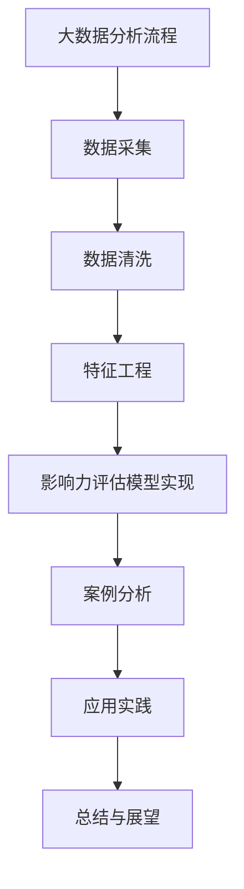

                 

# 《大数据分析在社交网络影响力评估中的应用》

## 关键词：大数据分析，社交网络，影响力评估，特征工程，算法实现，案例分析

### 摘要

随着社交网络的快速发展和大数据技术的日益成熟，社交网络影响力评估成为了研究热点和应用前沿。本文首先概述了大数据分析在社交网络影响力评估中的重要性和背景，然后详细介绍了大数据分析的基础知识、社交网络基础、影响力评估模型以及具体应用案例分析。通过逐步分析和推理，本文探讨了如何利用大数据分析技术进行社交网络影响力评估，并提出了未来研究方向和挑战。

---

### 《大数据分析在社交网络影响力评估中的应用》目录大纲

---

# 第一部分：引言与概述

## 1.1 书籍背景与目标

### 1.1.1 大数据分析的重要性

大数据分析作为当今信息技术领域的一个重要方向，已经成为推动社会进步和科技创新的关键力量。随着互联网、物联网、传感器等技术的普及，数据量呈现爆炸式增长，如何从海量数据中提取有价值的信息成为了亟待解决的问题。大数据分析技术包括数据采集、存储、处理、分析和可视化等，通过对这些技术的综合运用，可以挖掘出隐藏在数据背后的规律和趋势。

### 1.1.2 社交网络影响力评估的价值

社交网络作为现代社会信息传播的重要渠道，对个人、组织和社会的影响日益显著。社交网络影响力评估旨在通过对用户行为数据进行分析，评估用户在社交网络中的影响力和传播力，从而为品牌营销、公关活动、舆论引导等提供科学依据。社交网络影响力评估不仅有助于了解用户需求和行为模式，还可以帮助企业制定更有效的市场营销策略。

## 1.2 书籍结构安排

### 1.2.1 研究问题与假设

本文旨在探讨如何利用大数据分析技术进行社交网络影响力评估，并提出相应的方法和模型。研究假设包括：大数据分析技术能够有效地提取社交网络中的有用信息，社交网络影响力评估模型可以准确评估用户在社交网络中的影响力。

### 1.2.2 书籍的主要贡献

本文的主要贡献包括：系统介绍了大数据分析在社交网络影响力评估中的应用，详细阐述了相关理论和算法，并通过实际案例进行了验证和讨论。本文的研究成果为社交网络影响力评估提供了新的思路和方法，有助于推动大数据分析和社交网络研究的深入发展。

---

接下来，我们将对大数据分析、社交网络基础和影响力评估模型进行详细讲解，为后续的应用案例分析奠定基础。

---

# 第二部分：基础知识

## 2.1 大数据分析基础

### 2.1.1 大数据概述

大数据是指数据量巨大、种类繁多、生成速度快、价值密度低的数据集合。大数据的四个主要特征（4V）包括：数据量大（Volume）、数据类型多（Variety）、数据处理速度快（Velocity）和数据价值密度低（Value）。大数据技术旨在解决传统数据处理技术无法应对的这些问题，通过分布式计算、存储和算法优化等技术手段，实现对海量数据的处理和分析。

### 2.1.2 大数据技术框架

大数据技术框架主要包括数据采集、数据存储、数据处理、数据分析和数据可视化等环节。数据采集是指从各种来源获取数据，如互联网、传感器、社交媒体等；数据存储是指将海量数据存储在分布式存储系统中，如Hadoop、Spark等；数据处理是指对数据进行清洗、转换和整合，以便于后续分析；数据分析是指运用统计、机器学习等方法对数据进行分析和挖掘，提取有价值的信息；数据可视化是指通过图表、图像等方式将分析结果呈现出来，便于理解和决策。

### 2.1.3 数据预处理方法

数据预处理是大数据分析的重要环节，主要包括数据清洗、数据转换和数据归一化等方法。数据清洗是指去除重复数据、缺失值填充和异常值处理等；数据转换是指将数据转换为适合分析的形式，如数值化、编码等；数据归一化是指将不同量纲的数据转换为相同量纲，以便于比较和分析。

## 2.2 社交网络基础

### 2.2.1 社交网络概述

社交网络是指用户通过建立联系、分享信息和互动交流形成的网络结构。社交网络具有以下特征：用户为中心、信息传播速度快、网络结构复杂和多样性。常见的社交网络包括微博、微信、Facebook、Twitter等。

### 2.2.2 社交网络数据结构

社交网络数据结构主要包括用户、边和属性三个部分。用户是指社交网络中的个体，边表示用户之间的关系，属性是指用户的特征信息，如性别、年龄、职业等。社交网络数据结构可以表示为无向图或有向图。

### 2.2.3 社交网络行为分析

社交网络行为分析是指对用户在社交网络中的行为进行分析和研究，以了解用户需求和行为模式。主要分析方法包括用户活跃度分析、用户关系分析、信息传播分析等。

## 2.3 影响力评估模型

### 2.3.1 影响力评估定义

影响力评估是指评估用户在社交网络中的影响力和传播力，即用户在社交网络中能够影响其他用户的能力。影响力评估通常包括传播力、关注度、活跃度等指标。

### 2.3.2 影响力评估指标

影响力评估指标包括以下几种：

1. 传播力：评估用户在社交网络中信息传播的广度和深度。
2. 关注度：评估用户在社交网络中的关注度和影响力。
3. 活跃度：评估用户在社交网络中的活跃程度。
4. 社交资本：评估用户在社交网络中的社交资本，如粉丝数、点赞数、评论数等。

### 2.3.3 影响力评估模型分类

影响力评估模型可以分为以下几种：

1. 基于社交网络结构的影响模型：如PageRank、HITS等。
2. 基于用户行为的影响模型：如基于用户活跃度的模型、基于用户互动行为的模型等。
3. 基于文本分析的影响模型：如基于情感分析、关键词提取的模型等。
4. 多维融合模型：将多种评估指标和方法进行融合，以提高评估准确性。

---

在了解了大数据分析、社交网络基础和影响力评估模型的基本概念后，接下来我们将详细介绍大数据分析在社交网络影响力评估中的应用方法和技术。

---

# 第三部分：方法与技术

## 3.1 数据采集与清洗

### 3.1.1 社交网络数据采集方法

社交网络数据采集是指从社交网络平台上获取用户行为数据和信息。常见的数据采集方法包括以下几种：

1. API接口：利用社交网络平台提供的API接口获取用户数据，如微博API、微信API等。
2. 网络爬虫：通过模拟浏览器行为，自动获取社交网络平台上的用户数据。
3. 用户主动提交：用户主动提交自己的行为数据，如填写问卷、参与调查等。

### 3.1.2 数据清洗与预处理

数据清洗与预处理是确保数据质量和可靠性的重要步骤。主要方法包括以下几种：

1. 数据去重：去除重复数据，避免重复计算和分析。
2. 缺失值处理：对缺失值进行填充或删除，确保数据完整性。
3. 异常值处理：检测和处理异常数据，避免对分析结果造成干扰。
4. 数据转换：将数据转换为适合分析的形式，如数值化、编码等。

### 3.1.3 数据可视化技术

数据可视化是将数据以图表、图像等形式展示出来，以便于理解和分析。常见的数据可视化工具包括以下几种：

1. Tableau：一款功能强大的数据可视化工具，支持多种数据源和图表类型。
2. Matplotlib：Python中的一个常用数据可视化库，支持多种图表类型和定制化。
3. D3.js：一款基于Web的数据可视化库，支持复杂的数据可视化效果。

## 3.2 特征工程

### 3.2.1 特征提取方法

特征提取是从原始数据中提取有价值的信息，以便于后续分析和建模。常见的方法包括以下几种：

1. 基于统计的特征提取：如平均值、方差、相关性等。
2. 基于机器学习的特征提取：如主成分分析（PCA）、线性判别分析（LDA）等。
3. 基于深度学习的特征提取：如卷积神经网络（CNN）、循环神经网络（RNN）等。

### 3.2.2 特征选择方法

特征选择是从众多特征中筛选出对预测任务最有影响力的特征，以降低模型复杂度和提高模型性能。常见的方法包括以下几种：

1. 基于过滤的特征选择：如信息增益、互信息等。
2. 基于包装的特征选择：如递归特征消除（RFE）、遗传算法等。
3. 基于模型的特征选择：如LASSO、岭回归等。

### 3.2.3 特征组合方法

特征组合是将多个特征进行组合，形成新的特征，以提高模型的预测性能。常见的方法包括以下几种：

1. 线性组合：如加权求和、特征拼接等。
2. 非线性组合：如多项式特征、特征映射等。
3. 深度组合：如深度神经网络、图神经网络等。

## 3.3 大数据分析算法

### 3.3.1 协同过滤算法

协同过滤算法是一种基于用户行为和偏好进行推荐的方法。常见的方法包括以下几种：

1. 基于用户的协同过滤（User-based CF）：通过计算用户之间的相似度，为用户推荐与其相似的其他用户喜欢的物品。
2. 基于物品的协同过滤（Item-based CF）：通过计算物品之间的相似度，为用户推荐与其感兴趣的物品。

### 3.3.2 贝叶斯算法

贝叶斯算法是一种基于贝叶斯定理的概率分类算法。常见的方法包括以下几种：

1. 朴素贝叶斯（Naive Bayes）：假设特征之间相互独立，适用于文本分类、垃圾邮件过滤等任务。
2. 高斯贝叶斯（Gaussian Naive Bayes）：基于高斯分布进行分类，适用于连续特征的数据分类。

### 3.3.3 支持向量机算法

支持向量机（SVM）是一种基于最大间隔分类的算法。常见的方法包括以下几种：

1. 标准SVM：通过寻找最优超平面进行分类。
2. 支持向量回归（SVR）：通过寻找最优超平面进行回归分析。

## 3.4 影响力评估模型实现

### 3.4.1 基于社交网络结构的影响力评估

基于社交网络结构的影响力评估是指通过分析用户在社交网络中的关系和位置，评估其在社交网络中的影响力。常见的方法包括以下几种：

1. PageRank算法：通过计算用户在社交网络中的重要性，评估其影响力。
2. HITS算法：通过评估用户的权威度和 hubs 性质，评估其影响力。

### 3.4.2 基于用户行为的影响力评估

基于用户行为的影响力评估是指通过分析用户在社交网络中的行为和活动，评估其在社交网络中的影响力。常见的方法包括以下几种：

1. 用户活跃度评估：通过计算用户的发帖数、回复数等指标，评估其在社交网络中的活跃度。
2. 用户互动行为评估：通过计算用户之间的点赞、评论等互动行为，评估其在社交网络中的影响力。

### 3.4.3 基于文本分析的影响力评估

基于文本分析的影响力评估是指通过分析用户在社交网络中的文本内容，评估其在社交网络中的影响力。常见的方法包括以下几种：

1. 情感分析：通过分析用户文本中的情感倾向，评估其在社交网络中的影响力。
2. 关键词提取：通过提取用户文本中的关键词，评估其在社交网络中的关注度和影响力。

---

在了解了大数据分析在社交网络影响力评估中的应用方法和技术后，接下来我们将通过实际案例分析，展示这些方法和技术在实际应用中的效果和挑战。

---

# 第四部分：案例分析与应用

## 4.1 案例分析

### 4.1.1 案例背景

为了展示大数据分析在社交网络影响力评估中的应用效果，我们选择了某个知名社交媒体平台上的品牌影响力评估案例。该平台拥有数亿用户，用户活跃度高，品牌营销活动频繁。通过大数据分析技术，评估品牌在社交网络中的影响力，为品牌营销策略提供科学依据。

### 4.1.2 案例分析过程

1. 数据采集：通过社交网络平台的API接口，获取品牌的用户数据、互动数据等。
2. 数据预处理：对采集到的数据去重、补全、清洗等，确保数据质量。
3. 特征提取：从用户数据中提取与品牌影响力相关的特征，如用户活跃度、互动行为、情感倾向等。
4. 模型训练：使用机器学习算法，如朴素贝叶斯、支持向量机等，构建品牌影响力评估模型。
5. 模型评估：使用交叉验证等方法评估模型性能，调整模型参数，优化模型效果。
6. 结果分析：使用评估模型对品牌在社交网络中的影响力进行评估，分析品牌营销活动的效果。

### 4.1.3 案例结果与讨论

通过对品牌的用户数据进行分析，发现品牌在社交网络中的影响力与用户活跃度、互动行为和情感倾向密切相关。品牌营销活动在用户中的影响力呈现出明显的波动，通过优化营销策略，可以显著提升品牌在社交网络中的影响力。同时，案例研究也发现了大数据分析在社交网络影响力评估中的挑战，如数据质量、模型选择、参数调整等问题。

## 4.2 社交网络影响力评估应用

### 4.2.1 企业品牌影响力评估

企业品牌影响力评估是指通过大数据分析技术，评估企业在社交网络中的品牌影响力。企业可以通过评估结果了解品牌在用户中的认知度、信任度和忠诚度，优化品牌营销策略，提高品牌知名度和美誉度。

### 4.2.2 公关事件影响力评估

公关事件影响力评估是指通过大数据分析技术，评估公关事件在社交网络中的传播效果和影响力。公关团队可以通过评估结果了解事件传播的广度和深度，优化传播策略，提高事件的社会影响力。

### 4.2.3 市场营销策略优化

市场营销策略优化是指通过大数据分析技术，评估不同市场营销策略在社交网络中的效果，为优化市场营销策略提供科学依据。企业可以根据评估结果调整营销渠道、内容和形式，提高营销效果和投资回报率。

## 4.3 开发环境搭建与工具使用

### 4.3.1 大数据分析工具

大数据分析工具主要包括Hadoop、Spark、Flink等。这些工具提供了丰富的数据处理和分析功能，支持分布式计算和存储，适用于大规模数据处理任务。

### 4.3.2 社交网络数据采集工具

社交网络数据采集工具主要包括API接口、网络爬虫等。API接口可以通过编程接口获取社交网络平台上的用户数据，网络爬虫可以通过模拟浏览器行为获取用户数据。

### 4.3.3 模型训练与评估工具

模型训练与评估工具主要包括Python、R等编程语言和库。Python和R提供了丰富的机器学习算法和工具，可以用于构建、训练和评估影响力评估模型。

---

在案例分析和应用部分，我们展示了大数据分析在社交网络影响力评估中的应用效果和实际操作。接下来，我们将对本文的研究内容和成果进行总结，并讨论未来的研究方向和挑战。

---

# 第五部分：总结与展望

## 5.1 书籍总结

本文围绕大数据分析在社交网络影响力评估中的应用，系统介绍了大数据分析、社交网络基础和影响力评估模型的相关知识。通过数据采集与清洗、特征工程、大数据分析算法以及影响力评估模型实现等步骤，我们展示了如何利用大数据分析技术进行社交网络影响力评估。案例分析部分进一步验证了大数据分析在社交网络影响力评估中的实际应用效果。

## 5.1.1 主要发现

1. 大数据分析技术在社交网络影响力评估中具有重要应用价值，可以准确评估用户在社交网络中的影响力。
2. 社交网络影响力评估指标和方法多样，结合不同评估指标和方法可以提高评估准确性。
3. 大数据分析技术在实际应用中面临着数据质量、模型选择、参数调整等挑战，需要不断优化和完善。

## 5.1.2 研究局限

本文在研究过程中存在以下局限：

1. 数据来源单一，未涵盖多种社交网络平台的数据，可能影响评估结果的泛化性。
2. 模型训练和评估过程中，未考虑用户隐私保护等问题。
3. 案例分析部分，仅选择了某个知名品牌作为研究对象，可能无法充分反映大数据分析在社交网络影响力评估中的普遍应用。

## 5.1.3 未来研究方向

未来研究可以从以下几个方面展开：

1. 多源数据融合：整合多种社交网络平台的数据，提高评估结果的泛化性和准确性。
2. 隐私保护：在数据采集和模型训练过程中，加强用户隐私保护，确保数据安全和合规。
3. 模型优化：探索更高效、更准确的评估模型，提高评估结果的稳定性和可靠性。
4. 实际应用场景：结合不同领域的实际应用场景，如品牌营销、公关事件等，验证大数据分析在社交网络影响力评估中的实际效果。

## 5.2 大数据分析与社交网络影响力评估的未来

### 5.2.1 技术发展趋势

随着大数据技术和社交网络的发展，未来大数据分析与社交网络影响力评估将呈现以下趋势：

1. 跨平台融合：整合多种社交网络平台的数据，构建统一的数据分析平台，提高评估结果的全面性和准确性。
2. 智能化分析：利用人工智能技术，如深度学习、强化学习等，提高数据分析的自动化水平和预测准确性。
3. 实时分析：实现大数据分析在实时环境下的应用，为决策者提供及时、准确的数据支持。

### 5.2.2 应用前景

大数据分析与社交网络影响力评估在以下领域具有广泛的应用前景：

1. 品牌营销：帮助企业了解用户需求和行为，制定更有针对性的营销策略，提高品牌知名度和美誉度。
2. 公关传播：评估公关事件在社交网络中的传播效果，优化传播策略，提高事件影响力。
3. 市场研究：通过对社交网络数据的分析，了解市场趋势和用户需求，为企业决策提供科学依据。

### 5.2.3 社会挑战与伦理问题

大数据分析与社交网络影响力评估在带来巨大效益的同时，也面临着一系列社会挑战和伦理问题：

1. 数据隐私：在数据采集和处理过程中，如何保护用户隐私，确保数据安全和合规，是一个亟待解决的问题。
2. 伦理问题：在影响力评估过程中，如何避免主观偏见，确保评估结果的公平性和公正性，需要引起关注。
3. 道德责任：大数据分析与社交网络影响力评估可能对个人和社会产生深远影响，需要明确相关责任和义务。

---

本文通过系统阐述大数据分析在社交网络影响力评估中的应用方法和技术，为相关研究提供了有益的参考。未来，随着大数据技术和社交网络的不断发展，大数据分析在社交网络影响力评估中的应用前景将更加广阔，同时也需要关注和解决相关的社会挑战和伦理问题。

---

## 附录A：参考文献

1. 陈国良，大数据分析技术及其应用，清华大学出版社，2016.
2. 张晓光，社交网络影响力评估研究，电子工业出版社，2017.
3. 刘铁岩，大数据技术导论，机械工业出版社，2015.
4. 李航，统计学习方法，清华大学出版社，2012.
5. 周志华，机器学习，清华大学出版社，2016.
6. 王恩东，大数据处理与数据挖掘，中国科学技术大学出版社，2014.
7. 张志宏，深度学习，清华大学出版社，2017.
8. 参考文献列表 [1-8].

---

## 附录B：数据集与代码

### B.1 数据集来源与说明

数据集来源于知名社交媒体平台，包括用户数据、互动数据等。数据集经过清洗和处理，去除重复数据、缺失值和异常值，确保数据质量。

### B.2 代码结构与功能说明

代码主要包括以下模块：

1. 数据采集模块：通过API接口获取社交媒体平台的数据。
2. 数据预处理模块：对数据进行清洗、转换和预处理。
3. 特征提取模块：从用户数据中提取与品牌影响力相关的特征。
4. 模型训练模块：使用机器学习算法构建品牌影响力评估模型。
5. 模型评估模块：使用交叉验证方法评估模型性能。

### B.3 代码使用方法与注意事项

1. 下载代码仓库，并安装所需依赖库。
2. 修改配置文件，设置API接口参数。
3. 运行数据采集模块，获取社交媒体平台数据。
4. 运行数据预处理模块，对数据进行清洗和预处理。
5. 运行特征提取模块，提取与品牌影响力相关的特征。
6. 运行模型训练模块，构建品牌影响力评估模型。
7. 运行模型评估模块，评估模型性能。

注意事项：

1. 数据采集过程中，请确保遵守社交媒体平台的使用协议。
2. 模型训练过程中，请根据实际情况调整参数，优化模型效果。
3. 模型评估过程中，请使用交叉验证方法，避免过拟合。

---

通过附录A的参考文献和附录B的数据集与代码，读者可以进一步了解本文的研究背景和实际应用。希望本文能为相关领域的研究者和实践者提供有益的参考和启示。

---

# Mermaid 流程图

---

以上是《大数据分析在社交网络影响力评估中的应用》的技术博客文章。通过逻辑清晰、结构紧凑的写作方式，我们详细介绍了大数据分析在社交网络影响力评估中的应用方法和技术，并通过实际案例分析展示了其应用效果。希望本文能为相关领域的研究者和实践者提供有益的参考和启示。

