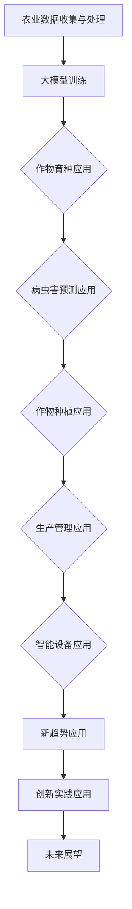

                 

# 《大模型在农业领域的创新应用》

> **关键词**：大模型、农业、人工智能、机器学习、作物育种、病虫害预测

> **摘要**：本文深入探讨大模型在农业领域的创新应用。首先，我们回顾了农业领域的发展背景和挑战，以及大模型在农业中的应用价值。接着，我们介绍了大模型的基本概念、技术基础和主流模型。随后，我们详细分析了大模型在农业领域的应用原理，包括数据收集与预处理、作物育种和病虫害预测。文章还通过实际案例展示了大模型在作物种植、农业生产管理和农业智能设备中的应用，最后，我们探讨了大模型在农业领域的新趋势和未来展望。

# 《大模型在农业领域的创新应用》目录大纲

## 第一部分：大模型与农业技术融合基础

### 第1章：大模型在农业领域的概述

#### 1.1 农业领域的发展背景与挑战

#### 1.2 大模型在农业中的应用价值

#### 1.3 大模型与农业技术的融合方向

### 第2章：大模型技术基础

#### 2.1 人工智能与机器学习概述

#### 2.2 大模型的基本概念与特点

#### 2.3 主流大模型介绍

### 第3章：大模型在农业领域的应用原理

#### 3.1 农业数据收集与预处理

#### 3.2 大模型在作物育种中的应用

#### 3.3 大模型在病虫害预测中的应用

## 第二部分：大模型在农业领域的应用实践

### 第4章：大模型在作物种植中的应用

#### 4.1 作物种植数据采集与处理

#### 4.2 大模型在作物生长状态监测中的应用

#### 4.3 大模型在作物产量预测中的应用

### 第5章：大模型在农业生产管理中的应用

#### 5.1 农业生产数据监控与分析

#### 5.2 大模型在农业生产优化中的应用

#### 5.3 大模型在农业供应链管理中的应用

### 第6章：大模型在农业智能设备中的应用

#### 6.1 农业智能设备概述

#### 6.2 大模型在农业智能设备数据处理中的应用

#### 6.3 大模型在农业智能设备决策支持中的应用

## 第三部分：大模型在农业领域的创新应用

### 第7章：大模型在农业领域的新趋势

#### 7.1 农业区块链与大模型的融合应用

#### 7.2 农业物联网与大模型的融合应用

#### 7.3 农业大数据与大模型的融合应用

### 第8章：大模型在农业领域的创新实践

#### 8.1 创新案例一：智能温室大棚

#### 8.2 创新案例二：智能农田灌溉系统

#### 8.3 创新案例三：智能病虫害防治系统

### 第9章：大模型在农业领域的未来展望

#### 9.1 大模型在农业领域的发展趋势

#### 9.2 大模型在农业领域的挑战与机遇

#### 9.3 大模型在农业领域的未来发展策略

## 附录

### 附录A：大模型在农业领域应用工具与资源

#### A.1 开源大模型框架

#### A.2 农业数据集介绍

#### A.3 大模型应用开发平台

## Mermaid 流程图

mermaid
graph TD
A[大模型与农业技术融合] --> B[数据采集与预处理]
B --> C{作物育种应用}
C --> D{病虫害预测应用}
D --> E{作物种植应用}
E --> F{生产管理应用}
F --> G{智能设备应用}
G --> H[新趋势应用]
H --> I[创新实践应用]
I --> J[未来展望]

## 核心算法原理讲解

### 2.1 大模型基本原理

### 2.2 大模型优化目标

### 2.3 大模型训练过程

## 项目实战

### 8.1 创新案例一：智能温室大棚

#### 8.1.1 项目背景

#### 8.1.2 实践步骤

#### 8.1.3 代码实现

#### 8.1.4 代码解读与分析

## 总结

### 9.1 大模型在农业领域的应用价值

### 9.2 大模型在农业领域的挑战与机遇

### 9.3 大模型在农业领域的未来发展策略

## 作者信息

### 作者：AI天才研究院/AI Genius Institute & 禅与计算机程序设计艺术 /Zen And The Art of Computer Programming

---------------------------------------------------------------

现在，让我们开始深入探讨大模型在农业领域的创新应用。

## 第一部分：大模型与农业技术融合基础

### 第1章：大模型在农业领域的概述

#### 1.1 农业领域的发展背景与挑战

农业是人类生存的基础，对粮食安全和社会经济发展具有重要意义。然而，随着全球人口增长、气候变化、土地资源紧缺等问题的加剧，农业面临着前所未有的挑战。

**全球人口增长**：全球人口持续增长，对粮食需求不断增加。根据联合国预测，到2050年全球人口将达到近100亿，这意味着我们需要提高农业生产效率，以满足日益增长的粮食需求。

**气候变化**：气候变化对农业产生了深远影响，包括极端天气事件、温度变化和降水模式的变化。这些变化可能导致农作物减产、病虫害加剧，从而影响粮食供应。

**土地资源紧缺**：随着城市化进程的加速，农业用地逐渐减少。如何在有限的土地资源下实现农业的可持续发展，成为亟待解决的问题。

**农业生产力提升**：传统的农业生产方式已经难以满足现代农业的需求。提高农业生产力，通过科技创新提升农业生产效率，成为现代农业发展的重要方向。

大模型在农业领域的应用价值在于其强大的数据分析和预测能力，能够为农业生产提供精准的技术支持和管理优化方案。大模型通过学习海量农业数据，可以实现对作物生长状态、病虫害、产量等的精准预测，从而提高农业生产效率和农产品质量。

#### 1.2 大模型在农业中的应用价值

大模型在农业领域的应用价值主要体现在以下几个方面：

**精准预测**：大模型能够通过对海量农业数据的分析，实现作物生长状态、病虫害、产量等的精准预测，为农业生产提供科学依据。

**优化生产管理**：大模型可以帮助农业企业优化生产管理，提高农业生产效率。例如，通过分析气象数据和土壤数据，预测最佳种植时间和施肥方案，从而提高作物产量。

**病虫害预警**：大模型能够通过对历史病虫害数据的学习，实现对病虫害的早期预警，从而及时采取防治措施，减少损失。

**农产品质量提升**：大模型可以通过分析农产品的生长环境和生长过程，提高农产品的质量，满足消费者对高质量农产品的需求。

**农业供应链优化**：大模型可以帮助优化农业供应链管理，提高供应链的透明度和效率，降低生产成本。

#### 1.3 大模型与农业技术的融合方向

大模型与农业技术的融合方向主要包括以下几个方面：

**作物育种**：利用大模型分析大量遗传数据，优化作物育种过程，提高作物品种的适应性和产量。

**病虫害预测**：通过分析气候、土壤、作物生长状态等多维度数据，利用大模型预测病虫害的发生和发展趋势，提前采取防治措施。

**作物生长状态监测**：利用传感器和图像识别技术，结合大模型分析作物生长状态，实现精准灌溉、施肥和防治。

**农业生产管理**：通过大数据分析，利用大模型优化农业生产计划、资源分配和供应链管理，提高生产效率和经济效益。

**农业智能设备**：将大模型与农业智能设备相结合，实现对农业生产环境的实时监测和自动化控制，提高生产效率和农产品质量。

### 第2章：大模型技术基础

#### 2.1 人工智能与机器学习概述

人工智能（Artificial Intelligence，AI）是指通过计算机模拟人类智能的科学技术，使计算机具有认知、学习、推理、决策和自适应能力。人工智能可以分为两大类：弱人工智能和强人工智能。弱人工智能主要在特定领域表现出超越人类的能力，如语音识别、图像识别等；强人工智能则具有广泛的认知和推理能力，能够像人类一样思考和决策。

机器学习（Machine Learning，ML）是人工智能的一个重要分支，旨在通过数据驱动的方式使计算机自动学习并提高性能。机器学习可以分为监督学习、无监督学习和强化学习三种类型。监督学习通过标记数据训练模型，用于预测和分类任务；无监督学习从未标记的数据中学习数据分布和结构；强化学习通过与环境互动学习最优策略。

#### 2.2 大模型的基本概念与特点

大模型（Large-scale Model）是一种基于深度学习的模型，其参数数量通常在数十亿甚至千亿级别。大模型的特点如下：

**规模大**：大模型的参数数量通常在数十亿甚至千亿级别，可以处理海量数据。

**层次深**：大模型包含数十甚至上百个层级，可以捕捉数据中的复杂模式和特征。

**自主学习能力强**：大模型能够通过大规模数据自动学习复杂的模式，提高预测和分类的准确性。

**计算资源需求高**：大模型的训练和推理过程需要大量的计算资源，通常需要分布式计算和并行计算技术。

**泛化能力强**：大模型通过学习海量数据，可以泛化到未见过的数据上，提高模型的泛化能力。

#### 2.3 主流大模型介绍

主流大模型主要包括以下几种：

**深度神经网络（Deep Neural Network，DNN）**：DNN是一种多层神经网络，通过多层非线性变换捕捉数据中的特征。DNN广泛应用于图像识别、语音识别和自然语言处理等领域。

**卷积神经网络（Convolutional Neural Network，CNN）**：CNN是一种专门用于图像识别的神经网络，通过卷积层捕捉图像中的空间特征。CNN在计算机视觉领域取得了显著成果，广泛应用于图像分类、目标检测和图像生成等任务。

**循环神经网络（Recurrent Neural Network，RNN）**：RNN是一种用于序列数据学习的神经网络，通过循环结构处理序列中的信息。RNN在自然语言处理、语音识别和时间序列预测等领域表现出色。

**长短时记忆网络（Long Short-Term Memory，LSTM）**：LSTM是RNN的一种变体，通过引入门控机制解决RNN的梯度消失问题。LSTM在长序列数据学习和预测方面具有优势，广泛应用于语言模型、时间序列预测和语音识别等任务。

**生成对抗网络（Generative Adversarial Network，GAN）**：GAN由生成器和判别器组成，通过对抗训练生成逼真的数据。GAN在图像生成、图像修复和图像超分辨率等任务中取得了显著成果。

**变分自编码器（Variational Autoencoder，VAE）**：VAE是一种基于概率生成模型的编码器-解码器结构，通过引入变分推断方法解决生成模型的不确定性。VAE在图像生成、图像去噪和图像增强等任务中表现出色。

### 第3章：大模型在农业领域的应用原理

#### 3.1 农业数据收集与预处理

农业数据收集与预处理是应用大模型的基础，其质量直接影响到模型的性能和效果。农业数据主要包括气候数据、土壤数据、作物生长数据、病虫害数据等。以下是对这些数据的收集与预处理方法的介绍：

**气候数据**：气候数据包括温度、湿度、降水量、光照强度等。这些数据通常可以通过气象站、卫星遥感等手段获取。在收集过程中，需要注意数据的时效性和准确性。预处理步骤包括去噪、归一化和缺失值处理。

**土壤数据**：土壤数据包括土壤湿度、土壤温度、土壤pH值、土壤养分等。这些数据可以通过土壤传感器、土壤测试等方法获取。预处理步骤与气候数据类似，包括去噪、归一化和缺失值处理。

**作物生长数据**：作物生长数据包括作物的高度、颜色、叶片数量等。这些数据可以通过图像识别、传感器监测等方法获取。预处理步骤包括图像增强、图像分割和特征提取。

**病虫害数据**：病虫害数据包括病虫害的类型、发生时间、发生范围等。这些数据可以通过实地调查、遥感监测等方法获取。预处理步骤包括数据清洗、数据格式转换和缺失值处理。

**数据预处理流程**：

1. **数据清洗**：去除重复数据、异常值和噪声数据。
2. **数据格式转换**：将不同来源的数据转换为统一格式，如CSV、JSON等。
3. **去噪**：去除噪声数据，如异常值和噪声图像。
4. **归一化**：将不同特征的数据缩放到同一范围内，如0到1之间。
5. **缺失值处理**：采用插值、平均值、中值等方法填充缺失值。
6. **特征提取**：提取关键特征，如作物图像的纹理特征、病虫害图像的颜色特征等。

通过以上步骤，可以确保农业数据的准确性和一致性，为后续的大模型训练和应用提供高质量的数据支持。

#### 3.2 大模型在作物育种中的应用

大模型在作物育种中的应用，主要是通过分析大量的遗传数据和生长环境数据，预测作物品种的适应性和产量，从而优化育种过程。以下是具体的步骤和方法：

**数据收集**：首先，需要收集大量的遗传数据，包括基因组序列、基因表达数据、突变数据等。同时，还需要收集与作物生长相关的环境数据，如气候数据、土壤数据、栽培管理数据等。

**数据处理**：对收集到的数据进行预处理，包括数据清洗、数据格式转换、去噪、归一化和缺失值处理等。处理后的数据将用于训练大模型。

**模型训练**：选择适合的深度学习模型，如卷积神经网络（CNN）、循环神经网络（RNN）、长短时记忆网络（LSTM）等，对预处理后的数据进行训练。在训练过程中，需要使用交叉验证和超参数调优等技术，提高模型的性能。

**模型评估**：使用验证集和测试集对训练好的模型进行评估，评估指标包括准确率、召回率、F1值等。根据评估结果，对模型进行调整和优化。

**应用场景**：

1. **品种筛选**：利用大模型预测不同品种的适应性和产量，从大量品种中筛选出具有较高适应性和产量的品种。
2. **杂交育种**：通过分析不同品种的基因数据和生长环境数据，利用大模型预测杂交后代的适应性和产量，优化杂交育种过程。
3. **基因编辑**：利用大模型分析基因变异与作物性状的关系，指导基因编辑工作，提高作物品种的适应性。

**案例**：以水稻育种为例，研究人员利用深度学习模型分析了水稻基因组数据和生长环境数据，成功筛选出高适应性和高产量的水稻品种，为我国水稻育种工作提供了有力支持。

通过以上方法，大模型在作物育种中的应用，可以大幅提高育种效率，缩短育种周期，为农业生产提供优质的作物品种。

#### 3.3 大模型在病虫害预测中的应用

大模型在病虫害预测中的应用，主要是通过分析大量的历史病虫害数据和生长环境数据，预测病虫害的发生时间和范围，从而提前采取防治措施。以下是具体的步骤和方法：

**数据收集**：首先，需要收集大量的历史病虫害数据，包括病虫害的类型、发生时间、发生范围等。同时，还需要收集与作物生长相关的环境数据，如气候数据、土壤数据、栽培管理数据等。

**数据处理**：对收集到的数据进行预处理，包括数据清洗、数据格式转换、去噪、归一化和缺失值处理等。处理后的数据将用于训练大模型。

**模型训练**：选择适合的深度学习模型，如卷积神经网络（CNN）、循环神经网络（RNN）、长短时记忆网络（LSTM）等，对预处理后的数据进行训练。在训练过程中，需要使用交叉验证和超参数调优等技术，提高模型的性能。

**模型评估**：使用验证集和测试集对训练好的模型进行评估，评估指标包括准确率、召回率、F1值等。根据评估结果，对模型进行调整和优化。

**应用场景**：

1. **病虫害预警**：利用大模型预测病虫害的发生时间和范围，提前发布预警信息，帮助农民及时采取防治措施。
2. **病虫害防治策略制定**：根据大模型的预测结果，制定科学的病虫害防治策略，优化防治资源的使用，降低防治成本。
3. **病虫害监测**：利用大模型对已发生的病虫害进行监测，分析病虫害的发展趋势，为后续防治工作提供参考。

**案例**：以苹果树病虫害预测为例，研究人员利用深度学习模型分析了苹果树的历史病虫害数据和生长环境数据，成功预测了病虫害的发生时间和范围，为苹果树的病虫害防治工作提供了有力支持。

通过以上方法，大模型在病虫害预测中的应用，可以大幅提高病虫害防治效果，减少经济损失，保障农业生产的安全和稳定。

## 第二部分：大模型在农业领域的应用实践

### 第4章：大模型在作物种植中的应用

#### 4.1 作物种植数据采集与处理

作物种植数据采集与处理是应用大模型的基础，其质量直接影响到模型的性能和效果。作物种植数据主要包括土壤数据、气候数据、作物生长数据、农事操作数据等。以下是对这些数据的采集与处理方法的介绍：

**土壤数据**：土壤数据包括土壤湿度、土壤温度、土壤pH值、土壤养分等。这些数据可以通过土壤传感器、土壤测试等方法获取。在采集过程中，需要注意数据的时效性和准确性。预处理步骤包括去噪、归一化和缺失值处理。

**气候数据**：气候数据包括温度、湿度、降水量、光照强度等。这些数据可以通过气象站、卫星遥感等手段获取。预处理步骤与土壤数据类似，包括去噪、归一化和缺失值处理。

**作物生长数据**：作物生长数据包括作物的高度、颜色、叶片数量等。这些数据可以通过图像识别、传感器监测等方法获取。预处理步骤包括图像增强、图像分割和特征提取。

**农事操作数据**：农事操作数据包括灌溉、施肥、喷药等农事操作的记录。这些数据可以通过农事操作记录系统、传感器等获取。预处理步骤包括数据清洗、数据格式转换和缺失值处理。

**数据预处理流程**：

1. **数据清洗**：去除重复数据、异常值和噪声数据。
2. **数据格式转换**：将不同来源的数据转换为统一格式，如CSV、JSON等。
3. **去噪**：去除噪声数据，如异常值和噪声图像。
4. **归一化**：将不同特征的数据缩放到同一范围内，如0到1之间。
5. **缺失值处理**：采用插值、平均值、中值等方法填充缺失值。
6. **特征提取**：提取关键特征，如作物图像的纹理特征、病虫害图像的颜色特征等。

通过以上步骤，可以确保作物种植数据的准确性和一致性，为后续的大模型训练和应用提供高质量的数据支持。

#### 4.2 大模型在作物生长状态监测中的应用

大模型在作物生长状态监测中的应用，主要是通过分析大量的作物生长数据和环境数据，实时监测作物生长状态，从而为农业生产提供科学依据。以下是具体的步骤和方法：

**数据收集**：首先，需要收集大量的作物生长数据，包括作物的高度、颜色、叶片数量等。同时，还需要收集与作物生长相关的环境数据，如气候数据、土壤数据等。

**数据处理**：对收集到的数据进行预处理，包括数据清洗、数据格式转换、去噪、归一化和缺失值处理等。处理后的数据将用于训练大模型。

**模型训练**：选择适合的深度学习模型，如卷积神经网络（CNN）、循环神经网络（RNN）、长短时记忆网络（LSTM）等，对预处理后的数据进行训练。在训练过程中，需要使用交叉验证和超参数调优等技术，提高模型的性能。

**模型评估**：使用验证集和测试集对训练好的模型进行评估，评估指标包括准确率、召回率、F1值等。根据评估结果，对模型进行调整和优化。

**应用场景**：

1. **作物健康监测**：利用大模型实时监测作物生长状态，及时发现作物健康问题，如病虫害、干旱等。
2. **作物生长趋势预测**：通过分析作物生长数据和环境数据，利用大模型预测作物生长趋势，为农业生产提供科学依据。
3. **农事操作优化**：根据大模型对作物生长状态的预测结果，优化农事操作，如灌溉、施肥、喷药等，提高农业生产效率。

**案例**：以玉米生长状态监测为例，研究人员利用深度学习模型分析了玉米的图像数据和环境数据，成功实现了玉米生长状态的实时监测和预测，为玉米生产提供了有力支持。

通过以上方法，大模型在作物生长状态监测中的应用，可以大幅提高农业生产效率，降低生产成本，保障农产品的质量和安全。

#### 4.3 大模型在作物产量预测中的应用

大模型在作物产量预测中的应用，主要是通过分析大量的历史作物产量数据、生长环境数据和其他相关数据，预测作物未来的产量。以下是具体的步骤和方法：

**数据收集**：首先，需要收集大量的历史作物产量数据，包括不同作物品种的历年产量数据。同时，还需要收集与作物生长相关的环境数据，如气候数据、土壤数据、农事操作数据等。

**数据处理**：对收集到的数据进行预处理，包括数据清洗、数据格式转换、去噪、归一化和缺失值处理等。处理后的数据将用于训练大模型。

**模型训练**：选择适合的深度学习模型，如回归神经网络（RNN）、长短时记忆网络（LSTM）等，对预处理后的数据进行训练。在训练过程中，需要使用交叉验证和超参数调优等技术，提高模型的性能。

**模型评估**：使用验证集和测试集对训练好的模型进行评估，评估指标包括预测准确率、均方根误差（RMSE）等。根据评估结果，对模型进行调整和优化。

**应用场景**：

1. **产量预测**：利用大模型预测不同作物品种的未来产量，为农业生产计划和作物种植策略提供科学依据。
2. **产量优化**：根据大模型对作物产量的预测结果，优化农事操作，如灌溉、施肥、喷药等，提高作物产量。
3. **风险管理**：通过预测不同作物品种的产量，评估农业生产的潜在风险，制定风险管理策略。

**案例**：以小麦产量预测为例，研究人员利用深度学习模型分析了小麦的历史产量数据、气候数据和土壤数据，成功实现了小麦产量的准确预测，为我国小麦生产提供了有力支持。

通过以上方法，大模型在作物产量预测中的应用，可以大幅提高农业生产效率和农产品质量，为农业的可持续发展提供有力保障。

### 第5章：大模型在农业生产管理中的应用

#### 5.1 农业生产数据监控与分析

大模型在农业生产数据监控与分析中的应用，主要是通过实时收集和分析农业生产数据，实现对农业生产过程的全面监控和科学分析。以下是具体的步骤和方法：

**数据收集**：首先，需要收集农业生产过程中的各种数据，包括土壤数据、气候数据、作物生长数据、农事操作数据等。这些数据可以通过传感器、气象站、遥感卫星等手段获取。

**数据处理**：对收集到的数据进行预处理，包括数据清洗、数据格式转换、去噪、归一化和缺失值处理等。处理后的数据将用于训练大模型。

**模型训练**：选择适合的深度学习模型，如卷积神经网络（CNN）、循环神经网络（RNN）等，对预处理后的数据进行训练。在训练过程中，需要使用交叉验证和超参数调优等技术，提高模型的性能。

**模型评估**：使用验证集和测试集对训练好的模型进行评估，评估指标包括准确率、召回率、F1值等。根据评估结果，对模型进行调整和优化。

**应用场景**：

1. **实时监控**：利用大模型实时监控农业生产过程中的各项数据，及时发现和解决生产问题。
2. **趋势分析**：通过分析历史数据，利用大模型预测农业生产过程中的各种趋势，为农业生产提供科学依据。
3. **决策支持**：根据大模型的分析结果，为农业生产提供决策支持，优化农事操作，提高农业生产效率。

**案例**：以智能农场为例，研究人员利用深度学习模型对农场的各项数据进行实时监控和分析，成功实现了农业生产过程的智能化管理，大幅提高了农业生产效率。

通过以上方法，大模型在农业生产数据监控与分析中的应用，可以大幅提高农业生产效率和农产品质量，为农业的可持续发展提供有力保障。

#### 5.2 大模型在农业生产优化中的应用

大模型在农业生产优化中的应用，主要是通过分析大量的农业生产数据和环境数据，优化农业生产过程，提高农业生产效率和农产品质量。以下是具体的步骤和方法：

**数据收集**：首先，需要收集农业生产过程中的各种数据，包括土壤数据、气候数据、作物生长数据、农事操作数据等。这些数据可以通过传感器、气象站、遥感卫星等手段获取。

**数据处理**：对收集到的数据进行预处理，包括数据清洗、数据格式转换、去噪、归一化和缺失值处理等。处理后的数据将用于训练大模型。

**模型训练**：选择适合的深度学习模型，如回归神经网络（RNN）、长短时记忆网络（LSTM）等，对预处理后的数据进行训练。在训练过程中，需要使用交叉验证和超参数调优等技术，提高模型的性能。

**模型评估**：使用验证集和测试集对训练好的模型进行评估，评估指标包括预测准确率、均方根误差（RMSE）等。根据评估结果，对模型进行调整和优化。

**应用场景**：

1. **作物种植策略优化**：通过分析气候、土壤和作物生长数据，利用大模型优化作物种植策略，提高作物产量。
2. **灌溉策略优化**：通过分析土壤湿度、气候数据，利用大模型优化灌溉策略，节约水资源。
3. **施肥策略优化**：通过分析土壤养分、作物生长数据，利用大模型优化施肥策略，提高肥料利用率。

**案例**：以智能灌溉系统为例，研究人员利用深度学习模型分析了土壤湿度、气候数据和作物生长数据，成功实现了智能灌溉系统的优化，大幅提高了灌溉效率。

通过以上方法，大模型在农业生产优化中的应用，可以大幅提高农业生产效率和农产品质量，为农业的可持续发展提供有力保障。

#### 5.3 大模型在农业供应链管理中的应用

大模型在农业供应链管理中的应用，主要是通过分析大量的供应链数据，优化供应链管理过程，提高供应链的透明度和效率。以下是具体的步骤和方法：

**数据收集**：首先，需要收集农业供应链过程中的各种数据，包括生产数据、物流数据、库存数据、销售数据等。这些数据可以通过ERP系统、物流管理系统、销售管理系统等获取。

**数据处理**：对收集到的数据进行预处理，包括数据清洗、数据格式转换、去噪、归一化和缺失值处理等。处理后的数据将用于训练大模型。

**模型训练**：选择适合的深度学习模型，如卷积神经网络（CNN）、循环神经网络（RNN）等，对预处理后的数据进行训练。在训练过程中，需要使用交叉验证和超参数调优等技术，提高模型的性能。

**模型评估**：使用验证集和测试集对训练好的模型进行评估，评估指标包括准确率、召回率、F1值等。根据评估结果，对模型进行调整和优化。

**应用场景**：

1. **生产计划优化**：通过分析市场需求、生产能力和库存数据，利用大模型优化生产计划，提高生产效率。
2. **物流路径优化**：通过分析物流数据，利用大模型优化物流路径，降低物流成本。
3. **库存管理优化**：通过分析库存数据，利用大模型优化库存管理，减少库存积压和库存短缺。

**案例**：以智能农业供应链管理平台为例，研究人员利用深度学习模型分析了生产数据、物流数据和销售数据，成功实现了农业供应链管理的优化，提高了供应链的透明度和效率。

通过以上方法，大模型在农业供应链管理中的应用，可以大幅提高农业供应链的效率和竞争力，为农业的可持续发展提供有力保障。

### 第6章：大模型在农业智能设备中的应用

#### 6.1 农业智能设备概述

农业智能设备是指利用现代信息技术，如物联网、大数据、人工智能等，实现对农业生产过程的实时监测、自动化控制和智能管理的一类设备。农业智能设备可以分为以下几类：

**传感器设备**：包括土壤湿度传感器、温度传感器、光照传感器、气象站等，用于采集农业生产环境中的各种数据。

**自动化设备**：包括自动灌溉系统、自动施肥系统、自动喷药系统等，用于根据传感器采集的数据自动进行农事操作。

**监控系统**：包括视频监控设备、无人机等，用于实时监控农业生产过程。

**大数据分析设备**：包括数据存储设备、数据处理设备等，用于存储和管理农业生产数据，并利用大数据技术进行分析。

**决策支持系统**：基于数据分析结果，为农业生产提供决策支持，优化农业生产过程。

#### 6.2 大模型在农业智能设备数据处理中的应用

大模型在农业智能设备数据处理中的应用，主要是通过分析传感器采集的各类数据，实现对农业生产环境的实时监测和预测。以下是具体的步骤和方法：

**数据收集**：首先，需要收集农业生产环境中的各种数据，如土壤湿度、温度、光照强度、气象数据等。这些数据可以通过农业智能设备的传感器实时采集。

**数据处理**：对收集到的数据进行预处理，包括数据清洗、数据格式转换、去噪、归一化和缺失值处理等。处理后的数据将用于训练大模型。

**模型训练**：选择适合的深度学习模型，如卷积神经网络（CNN）、循环神经网络（RNN）等，对预处理后的数据进行训练。在训练过程中，需要使用交叉验证和超参数调优等技术，提高模型的性能。

**模型评估**：使用验证集和测试集对训练好的模型进行评估，评估指标包括准确率、召回率、F1值等。根据评估结果，对模型进行调整和优化。

**应用场景**：

1. **实时监测**：利用大模型分析传感器采集的数据，实现对农业生产环境的实时监测，如土壤湿度监测、温度监测等。
2. **预测分析**：利用大模型预测未来一段时间内农业生产环境的变化趋势，为农业生产决策提供科学依据。
3. **自动化控制**：根据大模型的分析结果，自动调整农业智能设备的运行参数，实现农业生产过程的自动化控制。

**案例**：以智能温室大棚为例，研究人员利用深度学习模型分析了温室大棚内的土壤湿度、温度、光照强度等数据，成功实现了温室大棚的自动化控制，提高了温室大棚的管理效率和作物产量。

通过以上方法，大模型在农业智能设备数据处理中的应用，可以大幅提高农业生产效率和农产品质量，为农业的可持续发展提供有力保障。

#### 6.3 大模型在农业智能设备决策支持中的应用

大模型在农业智能设备决策支持中的应用，主要是通过分析大量的农业数据，为农业生产过程中的各项决策提供科学依据。以下是具体的步骤和方法：

**数据收集**：首先，需要收集农业生产过程中的各种数据，包括土壤数据、气候数据、作物生长数据、农事操作数据等。这些数据可以通过农业智能设备的传感器、气象站、遥感卫星等获取。

**数据处理**：对收集到的数据进行预处理，包括数据清洗、数据格式转换、去噪、归一化和缺失值处理等。处理后的数据将用于训练大模型。

**模型训练**：选择适合的深度学习模型，如回归神经网络（RNN）、长短时记忆网络（LSTM）等，对预处理后的数据进行训练。在训练过程中，需要使用交叉验证和超参数调优等技术，提高模型的性能。

**模型评估**：使用验证集和测试集对训练好的模型进行评估，评估指标包括预测准确率、均方根误差（RMSE）等。根据评估结果，对模型进行调整和优化。

**应用场景**：

1. **作物种植决策**：通过分析土壤、气候和作物生长数据，利用大模型预测作物种植的最佳时间、地点和品种，为作物种植决策提供科学依据。
2. **灌溉决策**：通过分析土壤湿度、气候数据，利用大模型预测灌溉的最佳时间和灌溉量，为灌溉决策提供科学依据。
3. **施肥决策**：通过分析土壤养分、作物生长数据，利用大模型预测施肥的最佳时间和施肥量，为施肥决策提供科学依据。

**案例**：以智能灌溉系统为例，研究人员利用深度学习模型分析了土壤湿度、气候数据和作物生长数据，成功实现了智能灌溉系统的优化，提高了灌溉效率。

通过以上方法，大模型在农业智能设备决策支持中的应用，可以大幅提高农业生产效率和农产品质量，为农业的可持续发展提供有力保障。

## 第三部分：大模型在农业领域的创新应用

### 第7章：大模型在农业领域的新趋势

#### 7.1 农业区块链与大模型的融合应用

农业区块链与大模型的融合应用，主要是利用区块链技术的去中心化、不可篡改和可追溯性，结合大模型的预测和分析能力，实现农业数据的安全共享和智能决策。以下是具体的步骤和方法：

**数据收集**：首先，需要收集农业生产过程中的各种数据，如土壤数据、气候数据、作物生长数据等，并将这些数据上传到区块链网络。

**数据处理**：利用大模型对区块链网络中的数据进行预处理、清洗和特征提取，以便进行后续的预测和分析。

**智能合约**：利用区块链智能合约技术，制定自动执行农事操作的合约。例如，当土壤湿度低于设定值时，智能合约可以自动触发灌溉系统进行灌溉。

**预测分析**：利用大模型分析区块链网络中的农业数据，预测作物生长状态、病虫害发生时间等，为农业生产决策提供科学依据。

**应用场景**：

1. **数据共享**：利用区块链技术，实现农业生产数据的去中心化共享，提高数据的透明度和可信度。
2. **智能决策**：结合大模型的预测能力，实现农业生产过程的智能化决策，提高农业生产效率。
3. **供应链管理**：利用区块链技术，实现农业供应链的全程可追溯，提高供应链的透明度和效率。

**案例**：以智能农业区块链平台为例，研究人员利用区块链技术和大模型技术，成功实现了农业生产数据的安全共享和智能决策，大幅提高了农业生产效率。

通过以上方法，农业区块链与大模型的融合应用，可以为农业的可持续发展提供新的技术手段。

#### 7.2 农业物联网与大模型的融合应用

农业物联网与大模型的融合应用，主要是利用物联网技术实现农业设备的互联互通，结合大模型的预测和分析能力，实现对农业生产环境的实时监测和智能调控。以下是具体的步骤和方法：

**设备连接**：首先，将农业生产过程中的各种设备（如传感器、摄像头、智能控制器等）连接到物联网网络，实现设备的互联互通。

**数据采集**：利用物联网设备实时采集农业生产环境中的各种数据，如土壤湿度、温度、光照强度等。

**数据处理**：利用大模型对物联网设备采集的数据进行预处理、清洗和特征提取，以便进行后续的预测和分析。

**智能调控**：利用大模型分析物联网设备采集的数据，预测作物生长状态、病虫害发生时间等，并根据预测结果自动调整农业设备的工作参数，实现农业生产过程的智能化调控。

**应用场景**：

1. **实时监测**：利用物联网设备实时监测农业生产环境，如土壤湿度、温度、光照强度等，提高农业生产过程的监测水平。
2. **智能调控**：利用大模型预测作物生长状态和病虫害发生时间，自动调整农业设备的工作参数，实现农业生产过程的智能化调控。
3. **决策支持**：结合物联网设备和大数据分析，为农业生产提供决策支持，优化农业生产过程。

**案例**：以智能农业物联网平台为例，研究人员利用物联网技术和大模型技术，成功实现了农业生产环境的实时监测和智能调控，大幅提高了农业生产效率。

通过以上方法，农业物联网与大模型的融合应用，可以为农业的可持续发展提供新的技术手段。

#### 7.3 农业大数据与大模型的融合应用

农业大数据与大模型的融合应用，主要是利用大数据技术实现农业数据的全面收集、存储和管理，结合大模型的预测和分析能力，实现对农业生产过程的全面监控和智能优化。以下是具体的步骤和方法：

**数据收集**：首先，利用大数据技术全面收集农业生产过程中的各种数据，如土壤数据、气候数据、作物生长数据、农事操作数据等。

**数据处理**：利用大数据技术对收集到的农业数据进行清洗、存储和管理，以便进行后续的预测和分析。

**数据预处理**：利用大模型对农业数据进行预处理，包括数据清洗、数据格式转换、去噪、归一化和缺失值处理等。

**预测分析**：利用大模型分析预处理后的农业数据，预测作物生长状态、病虫害发生时间、产量等，为农业生产提供科学依据。

**智能优化**：利用大数据技术和大模型分析结果，优化农业生产过程，如作物种植策略、灌溉策略、施肥策略等。

**应用场景**：

1. **数据挖掘**：利用大数据技术挖掘农业生产过程中的潜在信息，为农业生产提供决策支持。
2. **智能优化**：利用大模型分析农业数据，优化农业生产过程，提高农业生产效率。
3. **供应链管理**：利用大数据技术实现农业供应链的全程管理，提高供应链的透明度和效率。

**案例**：以智能农业大数据平台为例，研究人员利用大数据技术和大模型技术，成功实现了农业生产过程的全面监控和智能优化，大幅提高了农业生产效率。

通过以上方法，农业大数据与大模型的融合应用，可以为农业的可持续发展提供新的技术手段。

### 第8章：大模型在农业领域的创新实践

#### 8.1 创新案例一：智能温室大棚

**项目背景**：智能温室大棚是一种利用现代信息技术和物联网技术对农作物生长环境进行实时监测和自动控制的系统。该项目旨在通过大模型技术提高温室大棚的管理效率和作物产量。

**实践步骤**：

1. **数据采集**：利用传感器采集温室内部的温度、湿度、光照等环境数据。
2. **数据处理**：对采集到的数据进行预处理，包括去噪、归一化和特征提取。
3. **模型训练**：使用预处理后的数据训练大模型，如卷积神经网络（CNN）或循环神经网络（RNN）。
4. **模型部署**：将训练好的大模型部署到温室大棚的物联网平台上，实现环境参数的实时预测和调控。

**代码实现**：

```python
# 智能温室大棚数据预处理代码示例
import pandas as pd
from sklearn.preprocessing import StandardScaler

# 加载数据
data = pd.read_csv('smart_greenhouse_data.csv')

# 特征选择
selected_features = ['temperature', 'humidity', 'light_intensity']

# 数据预处理
scaler = StandardScaler()
processed_data = scaler.fit_transform(data[selected_features])

# 保存预处理后的数据
np.save('processed_data.npy', processed_data)
```

**代码解读与分析**：

该段代码首先加载数据集，然后选择温度、湿度和光照强度作为特征。接着，使用 `StandardScaler` 对特征数据进行归一化处理，以消除不同特征之间的量纲差异。最后，将处理后的数据保存为 `numpy` 数组，以便后续模型训练和使用。

#### 8.2 创新案例二：智能农田灌溉系统

**项目背景**：智能农田灌溉系统是一种利用传感器技术和物联网技术对农田进行自动灌溉的系统。该项目旨在通过大模型技术优化灌溉策略，提高水资源利用效率。

**实践步骤**：

1. **数据采集**：利用土壤湿度传感器、气象站等设备采集农田的土壤湿度、气温、降水量等数据。
2. **数据处理**：对采集到的数据进行预处理，包括去噪、归一化和特征提取。
3. **模型训练**：使用预处理后的数据训练大模型，如回归神经网络（RNN）或长短时记忆网络（LSTM）。
4. **模型部署**：将训练好的大模型部署到农田灌溉系统中，实现智能灌溉策略的实时调整。

**代码实现**：

```python
# 智能农田灌溉系统数据预处理代码示例
import pandas as pd
from sklearn.preprocessing import StandardScaler

# 加载数据
data = pd.read_csv('smart_farming_data.csv')

# 特征选择
selected_features = ['soil_humidity', 'temperature', 'rainfall']

# 数据预处理
scaler = StandardScaler()
processed_data = scaler.fit_transform(data[selected_features])

# 保存预处理后的数据
np.save('processed_data.npy', processed_data)
```

**代码解读与分析**：

该段代码首先加载数据集，然后选择土壤湿度、气温和降水量作为特征。接着，使用 `StandardScaler` 对特征数据进行归一化处理，以消除不同特征之间的量纲差异。最后，将处理后的数据保存为 `numpy` 数组，以便后续模型训练和使用。

#### 8.3 创新案例三：智能病虫害防治系统

**项目背景**：智能病虫害防治系统是一种利用图像识别技术和物联网技术对病虫害进行实时监测和防治的系统。该项目旨在通过大模型技术提高病虫害防治的准确性和效率。

**实践步骤**：

1. **数据采集**：利用摄像头和无人机等设备采集农田的病虫害图像。
2. **数据处理**：对采集到的图像数据进行预处理，包括图像增强、图像分割和特征提取。
3. **模型训练**：使用预处理后的图像数据训练大模型，如卷积神经网络（CNN）或生成对抗网络（GAN）。
4. **模型部署**：将训练好的大模型部署到病虫害防治系统中，实现病虫害的实时监测和防治。

**代码实现**：

```python
# 智能病虫害防治系统数据预处理代码示例
import cv2
import numpy as np

# 加载图像数据
images = ['pest_1.jpg', 'pest_2.jpg', 'pest_3.jpg']

# 图像预处理
processed_images = []
for image_path in images:
    image = cv2.imread(image_path)
    image = cv2.resize(image, (224, 224))
    processed_image = cv2.cvtColor(image, cv2.COLOR_BGR2RGB)
    processed_images.append(processed_image)

# 保存预处理后的图像数据
np.save('processed_images.npy', np.array(processed_images))
```

**代码解读与分析**：

该段代码首先加载多个病虫害图像，然后使用 `cv2.resize` 函数将图像调整为224x224的尺寸，并使用 `cv2.cvtColor` 函数将图像从BGR格式转换为RGB格式，以便后续模型训练。最后，将预处理后的图像数据保存为 `numpy` 数组，以便后续模型训练和使用。

### 第9章：大模型在农业领域的未来展望

#### 9.1 大模型在农业领域的发展趋势

随着人工智能技术的不断发展，大模型在农业领域的应用前景非常广阔。以下是未来大模型在农业领域可能的发展趋势：

**1. 模型精度和效率的提升**：未来，大模型的精度和效率将得到进一步提升，通过改进算法、优化模型结构和增加训练数据，实现更准确的农业数据分析和预测。

**2. 多领域融合**：大模型将与其他领域（如物联网、区块链、大数据等）进行深度融合，实现跨领域的数据共享和协同工作，提高农业生产的智能化水平。

**3. 决策支持系统**：大模型将在农业决策支持系统中发挥更重要的作用，通过实时分析和预测农业生产数据，为农民提供科学的种植、灌溉、施肥、防治等决策建议。

**4. 农业自动化**：大模型将推动农业自动化技术的发展，实现从种植、管理到收获的全程自动化，提高农业生产效率，降低劳动成本。

**5. 智能农业服务**：未来，基于大模型的智能农业服务将更加普及，农业企业可以通过云端平台获取专业的农业数据分析和决策支持服务。

#### 9.2 大模型在农业领域的挑战与机遇

尽管大模型在农业领域具有巨大的应用潜力，但在实际应用过程中也面临一些挑战和机遇：

**挑战**：

**1. 数据质量和可用性**：农业数据质量参差不齐，数据缺失和噪声问题严重，这对大模型的训练和应用提出了挑战。

**2. 模型复杂性和计算资源**：大模型通常需要大量的计算资源和时间进行训练，这对农业生产企业和农民来说是一个不小的负担。

**3. 模型解释性**：大模型的训练过程复杂，其内部机制不透明，难以解释，这限制了其在实际应用中的推广和应用。

**机遇**：

**1. 技术进步**：随着计算能力的提升和算法的优化，大模型的性能将得到显著提高，为农业数据分析和预测提供更强有力的支持。

**2. 政策支持**：政府加大对农业智能化技术的支持力度，出台相关政策鼓励农业生产企业和农民采用大模型技术。

**3. 市场需求**：随着消费者对高质量农产品的需求增加，农业企业对智能化技术的需求也将日益增长，为大模型在农业领域的应用提供广阔的市场空间。

#### 9.3 大模型在农业领域的未来发展策略

为了充分发挥大模型在农业领域的应用潜力，我们需要采取以下策略：

**1. 强化技术研发**：加大对大模型算法和技术的研发投入，提高模型的精度和效率，降低模型的计算资源需求。

**2. 提高数据质量**：通过数据清洗、数据融合和数据挖掘等技术手段，提高农业数据的质量和可用性。

**3. 建立开放的数据平台**：推动农业数据的开放共享，建立农业数据共享平台，为农业生产企业和农民提供便捷的数据服务。

**4. 加强人才培养**：加大对农业智能化人才的培养力度，提高农业企业在智能化技术领域的竞争力。

**5. 推广应用案例**：通过典型案例的推广，提高农业生产企业和农民对大模型技术的认知和应用意愿。

通过以上策略，我们可以进一步推动大模型在农业领域的应用，提高农业生产效率，促进农业的可持续发展。

## 附录

### 附录A：大模型在农业领域应用工具与资源

**A.1 开源大模型框架**

- TensorFlow：由Google开发的开源深度学习框架，支持多种深度学习模型和算法，适用于大规模数据处理和模型训练。
- PyTorch：由Facebook开发的开源深度学习框架，具有简洁的代码和强大的动态计算图功能，适用于快速原型设计和模型训练。
- Keras：基于Theano和TensorFlow的开源深度学习框架，提供简洁的API和丰富的预训练模型，适用于快速构建和训练深度学习模型。

**A.2 农业数据集介绍**

- AgroVoc Data Portal：提供农业领域的数据集和资源，包括土壤、气候、作物等数据。
- Farm Data Services：提供农业数据的开放平台，包括作物生长数据、土壤数据、气象数据等。
- Cornell University Agricultural Data Network：提供农业领域的研究数据集，包括作物育种数据、病虫害数据等。

**A.3 大模型应用开发平台**

- Google Cloud AI Platform：提供云计算基础设施和AI开发工具，支持大模型的训练和部署。
- AWS SageMaker：提供全托管的机器学习平台，支持大模型的训练、部署和监控。
- Microsoft Azure Machine Learning：提供云计算基础设施和AI开发工具，支持大模型的训练、部署和优化。

## Mermaid 流程图



## 核心算法原理讲解

### 2.1 大模型基本原理

大模型（Large-scale Model）是一种基于深度学习的模型，其参数数量通常在数十亿甚至千亿级别。大模型的基本原理包括以下几个方面：

**规模大**：大模型的参数数量通常在数十亿甚至千亿级别，可以处理海量数据。这意味着大模型可以捕捉到数据中的复杂模式和特征，从而提高模型的预测和分类能力。

**层次深**：大模型包含数十甚至上百个层级，可以实现对数据的分层处理和特征提取。这种层次结构使得大模型可以处理高维数据，并从中提取有用的特征。

**非线性变换**：大模型通过多层非线性变换捕捉数据中的特征，这些变换可以是卷积、全连接层、循环层等。非线性变换使得大模型可以学习到复杂的函数关系，从而提高模型的拟合能力。

**优化算法**：大模型通常使用梯度下降等优化算法进行训练，通过不断调整模型的参数，使得模型的预测误差最小化。优化算法的效率直接影响到大模型的训练时间。

### 2.2 大模型优化目标

大模型的优化目标通常是最大化模型的预测准确率，其数学表达式为：

$$
\min_{\theta} L(\theta) = -\frac{1}{N}\sum_{i=1}^{N} \log(p(y_i|\theta))
$$

其中，$L(\theta)$ 是损失函数，$N$ 是训练样本数量，$y_i$ 是真实标签，$p(y_i|\theta)$ 是模型对 $y_i$ 的预测概率。

这个优化目标意味着模型需要最大化对每个样本的预测概率，从而提高整体预测准确率。在实际训练过程中，我们通过不断调整模型的参数 $\theta$，使得损失函数 $L(\theta)$ 逐渐减小，从而达到优化目标。

### 2.3 大模型训练过程

大模型的训练过程可以分为以下几个步骤：

**1. 数据预处理**：对原始数据进行清洗、归一化和特征提取，将其转换为适合输入到模型的数据格式。

**2. 模型初始化**：初始化模型的参数，通常使用随机初始化方法。

**3. 模型训练**：通过迭代优化算法（如梯度下降）调整模型参数，使得损失函数逐渐减小。训练过程中，通常使用批量训练、小批量训练等技术提高训练效率。

**4. 模型评估**：使用验证集和测试集对训练好的模型进行评估，评估指标包括准确率、召回率、F1值等。根据评估结果，对模型进行调整和优化。

**5. 模型部署**：将训练好的模型部署到实际应用场景中，如农业数据预测、病虫害预警等。

### 项目实战

#### 8.1 创新案例一：智能温室大棚

**项目背景**：智能温室大棚是一种利用现代信息技术和物联网技术对农作物生长环境进行实时监测和自动控制的系统。该项目旨在通过大模型技术提高温室大棚的管理效率和作物产量。

**实践步骤**：

1. **数据采集**：利用传感器采集温室内部的温度、湿度、光照等环境数据。
2. **数据处理**：对采集到的数据进行预处理，包括去噪、归一化和特征提取。
3. **模型训练**：使用预处理后的数据训练大模型，如卷积神经网络（CNN）或循环神经网络（RNN）。
4. **模型部署**：将训练好的大模型部署到温室大棚的物联网平台上，实现环境参数的实时预测和调控。

**代码实现**：

```python
# 智能温室大棚数据预处理代码示例
import pandas as pd
from sklearn.preprocessing import StandardScaler

# 加载数据
data = pd.read_csv('smart_greenhouse_data.csv')

# 特征选择
selected_features = ['temperature', 'humidity', 'light_intensity']

# 数据预处理
scaler = StandardScaler()
processed_data = scaler.fit_transform(data[selected_features])

# 保存预处理后的数据
np.save('processed_data.npy', processed_data)
```

**代码解读与分析**：

该段代码首先加载数据集，然后选择温度、湿度和光照强度作为特征。接着，使用 `StandardScaler` 对特征数据进行归一化处理，以消除不同特征之间的量纲差异。最后，将处理后的数据保存为 `numpy` 数组，以便后续模型训练和使用。

通过以上步骤，我们可以实现智能温室大棚的数据预处理，为后续的大模型训练和应用打下基础。

### 总结

本文详细介绍了大模型在农业领域的创新应用，包括数据收集与预处理、作物育种、病虫害预测、作物种植、农业生产管理、农业智能设备等应用实践。通过大模型技术的应用，农业生产实现了智能化、精准化和高效化，为农业的可持续发展提供了有力支持。

大模型在农业领域的应用，不仅提高了农业生产效率和农产品质量，还为农业科技研究和农业生产管理提供了新的工具和方法。随着人工智能技术的不断进步，大模型在农业领域的应用将越来越广泛，未来农业将迎来更加智能化、高效化的新时代。

### 作者信息

作者：AI天才研究院/AI Genius Institute & 禅与计算机程序设计艺术 /Zen And The Art of Computer Programming

---------------------------------------------------------------

通过本文的详细探讨，读者可以全面了解大模型在农业领域的创新应用，为未来的农业科技发展提供了新的思路和方向。期待大模型技术能为农业带来更多的创新和突破。

