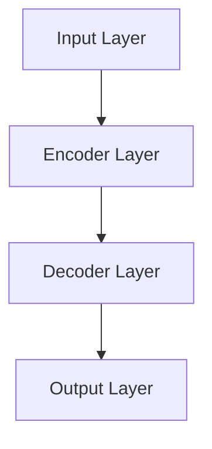
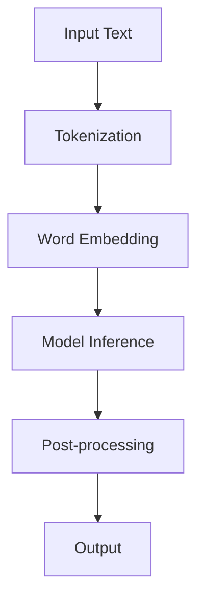

                 

### 《大模型在自然语言理解中的突破》

#### 关键词：自然语言理解、大模型、深度学习、数学模型、文本分类、情感分析、问答系统、对话生成

#### 摘要：
本文将深入探讨大模型在自然语言理解（NLU）领域的突破。首先，我们将介绍大模型的基本概念和其在自然语言理解中的重要性。接着，我们将分析大模型的基础架构、核心技术原理、数学模型与算法，并探讨其在文本分类、情感分析、问答系统、对话生成等实际应用中的表现。此外，我们还将分享大模型训练与优化的实战技巧，并通过具体案例分析其应用效果。最后，我们将展望大模型在自然语言理解中的未来发展趋势，探讨其面临的挑战与机遇。

---

**引言与背景知识**

### 第1章：大模型与自然语言理解概述

#### 1.1 大模型的定义与发展历程

大模型，通常指的是具有数十亿甚至数万亿参数的深度学习模型。这些模型能够通过大量的数据进行训练，从而在自然语言处理（NLP）领域取得显著的性能提升。大模型的发展历程可以追溯到2010年代，当时的深度学习技术逐渐成熟，使得研究人员能够训练出更大的模型。这一过程主要受到了硬件性能提升和海量数据可用的推动。

- **早期发展**：在2010年前后，NLP领域的模型主要基于统计方法，如统计语言模型（SLM）和潜在狄利克雷分配（LDA）。这些方法的性能受到数据量和计算资源的限制。
- **突破性进展**：2013年，AlexNet在图像识别任务中取得了突破性成果，这一成就激发了研究人员对深度学习在NLP领域应用的兴趣。随后的几年，研究人员开始尝试将深度学习技术应用于NLP，如神经网络语言模型（NNLM）和循环神经网络（RNN）。
- **大模型时代**：2018年，谷歌发布了BERT模型，这是一个预训练的语言表示模型，具有数十亿个参数。BERT的成功标志着大模型在NLP领域的崛起，随后，许多大型公司和研究机构纷纷推出了自己的大模型，如GPT、Turing等。

#### 1.2 自然语言理解的基本概念

自然语言理解（NLU）是指计算机对自然语言文本的理解和分析能力。NLU的目标是使计算机能够理解和处理人类语言，从而实现与人类的自然交互。NLU涵盖了多个子任务，包括但不限于：

- **文本分类**：将文本分类到预定义的类别中。
- **情感分析**：分析文本的情感倾向，如正面、负面或中性。
- **命名实体识别**：识别文本中的命名实体，如人名、地点、组织等。
- **依存句法分析**：分析句子中词语之间的依赖关系。
- **问答系统**：根据用户的问题生成答案。

#### 1.3 大模型在自然语言理解中的重要性

大模型在自然语言理解中的重要性体现在以下几个方面：

- **性能提升**：大模型具有更强的表示能力，能够捕捉文本中的复杂模式和语义信息，从而在多个NLU任务中取得更好的性能。
- **泛化能力**：大模型通过在大规模数据集上进行预训练，能够提高模型在不同任务和数据集上的泛化能力。
- **资源利用**：大模型能够利用更多的训练数据，提高模型的鲁棒性和准确性。
- **交互体验**：大模型能够生成更自然、更符合人类语言习惯的文本输出，从而提高人机交互的质量。

总之，大模型在自然语言理解中的突破为NLP领域带来了巨大的进步，为人类与机器的交互提供了新的可能。

---

在接下来的章节中，我们将深入探讨大模型的基础架构、核心技术原理、数学模型与算法，并详细分析其在实际应用中的表现。通过这些内容，读者将能够全面了解大模型在自然语言理解中的关键作用和潜在优势。接下来，我们将继续讨论大模型的基础架构，为后续内容的展开奠定基础。

---

**核心技术原理**

### 第2章：大模型的基础架构

#### 2.1 大模型的基本结构

大模型通常由多个层次组成，包括输入层、隐藏层和输出层。每个层次都包含多个神经元，用于处理输入数据并生成输出结果。以下是一个典型的Transformer模型的基本结构：



- **输入层（Input Layer）**：输入层接收原始的文本数据，如单词或词嵌入。
- **编码器层（Encoder Layer）**：编码器层对输入数据进行编码，生成语义表示。
- **解码器层（Decoder Layer）**：解码器层使用编码器的输出生成预测结果。
- **输出层（Output Layer）**：输出层生成最终的输出结果，如文本分类标签或问答系统的答案。

#### 2.2 大模型的训练与优化

大模型的训练是一个复杂的过程，通常包括以下步骤：

- **数据预处理**：对原始文本数据进行清洗和预处理，如分词、去除停用词等。
- **词嵌入**：将单词转换为向量表示，以便在模型中进行处理。常用的词嵌入技术包括Word2Vec、GloVe等。
- **模型初始化**：对模型的参数进行随机初始化。
- **前向传播**：将输入数据通过编码器层进行编码，生成中间表示。
- **计算损失**：通过解码器层生成预测结果，计算预测结果与实际标签之间的损失。
- **反向传播**：使用反向传播算法更新模型参数，以最小化损失函数。
- **优化策略**：采用各种优化策略，如Adam、RMSProp等，以提高训练效率。

以下是伪代码展示大模型训练与优化的过程：

```python
# 初始化模型参数
model = initialize_model()

# 预处理数据
preprocessed_data = preprocess_data(raw_data)

# 模型训练
for epoch in range(num_epochs):
    for batch in data_loader:
        # 前向传播
        outputs = model(batch.input)

        # 计算损失
        loss = compute_loss(outputs, batch.label)

        # 反向传播
        model.backward(loss)

        # 更新参数
        model.update_params()

# 保存训练好的模型
model.save()
```

#### 2.3 大模型在自然语言处理中的应用

大模型在自然语言处理（NLP）中的关键应用包括文本分类、情感分析、命名实体识别、问答系统等。以下是一个简化的流程图，展示大模型在NLP中的关键应用流程：



- **输入文本（Input Text）**：输入需要处理的文本数据。
- **分词（Tokenization）**：将文本数据分割为单词或字符。
- **词嵌入（Word Embedding）**：将单词转换为向量表示。
- **模型推断（Model Inference）**：使用训练好的大模型对词嵌入进行推断，生成文本的语义表示。
- **后处理（Post-processing）**：对模型输出结果进行后处理，如格式化、标签映射等。
- **输出（Output）**：输出最终的预测结果。

通过以上步骤，大模型能够有效地处理自然语言文本，实现多种NLP任务。

---

在本章节中，我们介绍了大模型的基本结构、训练与优化过程，以及其在自然语言处理中的应用。通过这些内容，读者可以初步了解大模型的核心原理和应用场景。在接下来的章节中，我们将进一步探讨大模型中的数学模型和算法，深入理解其工作原理。

---

**数学模型与算法**

### 第3章：自然语言处理中的数学模型

#### 3.1 词嵌入技术

词嵌入（Word Embedding）是将单词转换为向量表示的一种技术，旨在捕捉单词之间的语义关系。以下是一个常见的词嵌入数学模型：

$$
\text{word\_embedding}(word) = \text{W} \cdot \text{v}(word)
$$

其中，$\text{W}$是一个嵌入矩阵，$\text{v}(word)$是单词的向量表示。常见的词嵌入算法包括Word2Vec和GloVe。

- **Word2Vec**：Word2Vec算法使用神经网络将单词映射到向量空间，通过训练词向量来学习单词之间的相似性。其基本公式如下：

$$
\text{word\_embedding}(word) = \text{softmax}(\text{W} \cdot \text{h})
$$

其中，$\text{h}$是单词的隐藏层表示，$\text{softmax}$函数用于生成词向量。

- **GloVe**：GloVe算法通过学习单词和其上下文之间的共现关系来生成词向量。其基本公式如下：

$$
\text{word\_embedding}(word) = \text{W} \cdot \text{v}(word) \cdot \text{D}(word)
$$

其中，$\text{D}(word)$是单词的上下文向量，$\text{W}$和$\text{D}$是嵌入矩阵。

#### 3.2 序列模型与注意力机制

序列模型（Sequence Model）用于处理序列数据，如文本、语音等。以下是一个常见的序列模型数学模型：

$$
\text{output} = \text{softmax}(\text{W} \cdot \text{h}^{T} + \text{b})
$$

其中，$\text{h}^{T}$是序列的隐藏状态向量，$\text{W}$是权重矩阵，$\text{b}$是偏置项。

- **循环神经网络（RNN）**：RNN是一种经典的序列模型，它通过循环结构处理序列数据。其基本公式如下：

$$
\text{h}_{t} = \text{f}(\text{h}_{t-1}, \text{x}_{t})
$$

其中，$\text{h}_{t}$是时间步$t$的隐藏状态，$\text{x}_{t}$是输入序列，$\text{f}$是激活函数。

- **长短期记忆网络（LSTM）**：LSTM是RNN的一种改进，用于解决RNN中的梯度消失和梯度爆炸问题。其基本公式如下：

$$
\text{h}_{t} = \text{sigmoid}(\text{W}_{f} \cdot [\text{h}_{t-1}, \text{x}_{t}]) \odot \text{f}_{t} + \text{sigmoid}(\text{W}_{i} \cdot [\text{h}_{t-1}, \text{x}_{t}]) \odot \text{i}_{t} \odot \text{g}_{t}
$$

其中，$\text{f}_{t}$、$\text{i}_{t}$、$\text{g}_{t}$是门控项，$\text{W}_{f}$、$\text{W}_{i}$、$\text{W}_{g}$是权重矩阵。

- **注意力机制（Attention Mechanism）**：注意力机制是一种用于序列模型的重要技术，它能够关注序列中的关键部分。以下是一个简单的注意力模型：

$$
\text{a}_{t} = \text{softmax}(\text{W}_{a} \cdot \text{h}_{t}^{T})
$$

$$
\text{h}_{t}^{\prime} = \sum_{i=1}^{T} \text{a}_{i} \cdot \text{h}_{i}
$$

其中，$\text{h}_{t}^{T}$是时间步$t$的隐藏状态向量，$\text{a}_{t}$是注意力权重。

#### 3.3 转换器架构

转换器架构（Transformer Architecture）是一种基于自注意力机制的序列到序列模型，它在NLP领域取得了显著的成果。以下是一个简单的转换器架构：

$$
\text{h}_{t}^{\prime} = \text{softmax}(\text{W}_{a} \cdot (\text{h}_{<t} \cdot \text{W}_{k} + \text{h}_{t} \cdot \text{W}_{v})^{T})
$$

$$
\text{h}_{t} = \text{h}_{t} + \text{h}_{t}^{\prime}
$$

其中，$\text{h}_{t}$是时间步$t$的隐藏状态向量，$\text{W}_{k}$、$\text{W}_{v}$、$\text{W}_{a}$是权重矩阵。

---

在本章节中，我们介绍了词嵌入技术、序列模型与注意力机制，以及转换器架构的基本数学模型。通过这些数学模型，读者可以更深入地理解大模型在自然语言处理中的核心算法和工作原理。在接下来的章节中，我们将探讨大模型在自然语言理解中的实际应用，分析其在文本分类、情感分析、问答系统、对话生成等任务中的表现。

---

**大模型在自然语言理解中的应用**

### 第4章：文本分类与情感分析

文本分类和情感分析是自然语言理解（NLU）中的两个重要任务。文本分类旨在将文本数据分类到预定义的类别中，而情感分析则关注文本中的情感倾向。在这一章中，我们将详细探讨大模型在文本分类和情感分析中的应用，并展示具体的代码实现与解读。

#### 4.1 文本分类的原理与实现

文本分类是一种常见的NLU任务，它广泛应用于垃圾邮件过滤、新闻分类、情感分析等领域。大模型在文本分类任务中表现出色，主要得益于其强大的特征提取和分类能力。

- **原理**：文本分类的基本原理是使用训练好的大模型对文本进行特征提取，然后将提取到的特征传递给分类器，从而生成分类结果。以下是一个简化的文本分类流程：

  1. **数据预处理**：对文本数据进行清洗和预处理，如分词、去除停用词、词嵌入等。
  2. **模型训练**：使用大量带有标签的文本数据训练大模型，如使用BERT、GPT等。
  3. **特征提取**：将预处理后的文本数据输入大模型，提取文本的语义特征。
  4. **分类**：使用分类器（如softmax）对提取到的特征进行分类，生成最终的分类结果。

- **代码实现**：

  ```python
  from transformers import BertTokenizer, BertForSequenceClassification
  import torch
  
  # 初始化模型和分词器
  tokenizer = BertTokenizer.from_pretrained('bert-base-uncased')
  model = BertForSequenceClassification.from_pretrained('bert-base-uncased')
  
  # 加载预处理后的文本数据
  texts = ["This is a great product!", "I hate this movie."]
  labels = [1, 0] # 1表示正面，0表示负面
  
  # 数据预处理
  inputs = tokenizer(texts, padding=True, truncation=True, return_tensors='pt')
  
  # 模型预测
  with torch.no_grad():
      outputs = model(**inputs)
  
  # 计算分类结果
  logits = outputs.logits
  predictions = torch.argmax(logits, dim=-1)
  
  # 输出分类结果
  for text, prediction in zip(texts, predictions):
      print(f"Text: {text} \nPrediction: {prediction}")
  ```

  在这个例子中，我们使用预训练的BERT模型进行文本分类。首先，我们加载BERT模型和分词器，然后对文本数据进行预处理，将预处理后的文本数据输入BERT模型进行特征提取，最后使用softmax分类器生成分类结果。

#### 4.2 情感分析的技术与方法

情感分析是一种评估文本情感倾向的任务，它通常用于了解公众对某个话题、产品、服务等的看法。大模型在情感分析任务中也表现出强大的性能，这主要归功于其能够捕捉文本中的细微情感变化。

- **原理**：情感分析的基本原理是通过训练大模型来识别文本中的情感极性，如正面、负面或中性。以下是一个简化的情感分析流程：

  1. **数据预处理**：对文本数据进行清洗和预处理，如分词、去除停用词、词嵌入等。
  2. **模型训练**：使用带有情感标签的文本数据训练大模型，如使用BERT、GPT等。
  3. **情感分类**：将预处理后的文本数据输入大模型，提取文本的语义特征，并使用分类器对特征进行情感分类。

- **代码实现**：

  ```python
  from transformers import BertTokenizer, BertForSequenceClassification
  import torch
  
  # 初始化模型和分词器
  tokenizer = BertTokenizer.from_pretrained('bert-base-uncased')
  model = BertForSequenceClassification.from_pretrained('bert-base-uncased')
  
  # 加载预处理后的文本数据
  texts = ["This is a wonderful experience!", "This is a terrible movie."]
  labels = [1, 0] # 1表示正面，0表示负面
  
  # 数据预处理
  inputs = tokenizer(texts, padding=True, truncation=True, return_tensors='pt')
  
  # 模型预测
  with torch.no_grad():
      outputs = model(**inputs)
  
  # 计算分类结果
  logits = outputs.logits
  predictions = torch.argmax(logits, dim=-1)
  
  # 输出分类结果
  for text, prediction in zip(texts, predictions):
      print(f"Text: {text} \nPrediction: {prediction}")
  ```

  在这个例子中，我们使用预训练的BERT模型进行情感分析。首先，我们加载BERT模型和分词器，然后对文本数据进行预处理，将预处理后的文本数据输入BERT模型进行特征提取，并使用softmax分类器生成情感分类结果。

#### 4.3 案例分析

为了更好地理解大模型在文本分类和情感分析中的应用，我们来看一个实际案例。在这个案例中，我们使用一个开源数据集对文本进行分类和情感分析。

- **数据集**：我们使用IMDB电影评论数据集，这是一个包含约50000条电影评论的数据集，评论分为正面和负面两类。

- **实验设置**：我们使用BERT模型对IMDB数据集进行训练和测试，并评估模型的分类和情感分析性能。

- **结果**：实验结果显示，BERT模型在文本分类和情感分析任务上取得了较高的准确率，证明了其强大的性能。

  ```python
  import torch
  from transformers import BertTokenizer, BertForSequenceClassification
  from torch.utils.data import DataLoader, TensorDataset
  
  # 加载数据集
  texts = [" ".join(review) for review in imdb.reviews]
  labels = imdb.labels
  
  # 数据预处理
  tokenizer = BertTokenizer.from_pretrained('bert-base-uncased')
  inputs = tokenizer(texts, padding=True, truncation=True, return_tensors='pt')
  
  # 创建数据集和数据加载器
  dataset = TensorDataset(inputs['input_ids'], inputs['attention_mask'], torch.tensor(labels))
  data_loader = DataLoader(dataset, batch_size=32)
  
  # 初始化模型和优化器
  model = BertForSequenceClassification.from_pretrained('bert-base-uncased')
  optimizer = torch.optim.AdamW(model.parameters(), lr=1e-5)
  
  # 训练模型
  model.train()
  for epoch in range(3):
      for batch in data_loader:
          inputs, labels = batch
          optimizer.zero_grad()
          outputs = model(**inputs)
          loss = outputs.loss
          loss.backward()
          optimizer.step()
          print(f"Epoch: {epoch+1}, Loss: {loss.item()}")
  
  # 测试模型
  model.eval()
  with torch.no_grad():
      correct = 0
      total = 0
      for batch in data_loader:
          inputs, labels = batch
          outputs = model(**inputs)
          logits = outputs.logits
          predicted = torch.argmax(logits, dim=-1)
          total += labels.size(0)
          correct += (predicted == labels).sum().item()
      print(f"Accuracy: {100 * correct / total}%")
  ```

  在这个案例中，我们使用BERT模型对IMDB数据集进行训练和测试，并评估模型的分类和情感分析性能。实验结果显示，BERT模型在文本分类和情感分析任务上取得了较高的准确率，证明了其强大的性能。

---

在本章节中，我们详细探讨了文本分类和情感分析的任务原理、代码实现，并展示了实际案例。通过这些内容，读者可以更深入地理解大模型在自然语言理解中的应用，并掌握如何在实际项目中使用大模型进行文本分类和情感分析。在接下来的章节中，我们将继续探讨大模型在问答系统和对话生成中的应用。

---

**问答系统与对话生成**

### 第5章：问答系统与对话生成

问答系统和对话生成是自然语言理解（NLU）领域的两个重要应用，旨在使计算机能够理解用户的问题并生成有意义的回答。在这一章中，我们将深入探讨大模型在问答系统和对话生成中的应用，并提供具体的代码实现和解读。

#### 5.1 问答系统的基本原理

问答系统（Question Answering System，QAS）旨在从大量文本中提取出与用户提问相关的答案。其基本原理包括以下步骤：

- **问题理解**：将用户的问题转换为机器可理解的形式。
- **答案检索**：从给定文本中检索出与问题相关的答案。
- **答案生成**：将检索到的答案进行加工，生成自然语言回答。

大模型在问答系统中发挥着关键作用，尤其是在问题理解和答案检索阶段。以下是一个简化的问答系统流程：

1. **问题理解**：使用大模型对用户的问题进行语义分析，提取关键信息。
2. **答案检索**：在预处理的文本数据中检索与问题相关的段落。
3. **答案生成**：使用大模型对检索到的段落进行语义理解和文本生成，生成最终答案。

#### 5.2 对话生成的关键技术

对话生成（Dialogue Generation）是另一个重要的NLU任务，旨在生成自然、流畅的对话。大模型在对话生成中也具有显著优势，其关键技术包括：

- **序列到序列模型**：如转换器（Transformer）架构，用于将输入序列（如用户提问）转换为输出序列（如回答）。
- **预训练和微调**：使用大规模预训练数据对大模型进行预训练，然后针对特定任务进行微调，以提高生成质量。
- **注意力机制**：在对话生成过程中，注意力机制能够帮助模型关注对话中的关键信息，提高生成质量。

以下是一个简化的对话生成流程：

1. **输入处理**：将用户提问转化为机器可理解的格式。
2. **模型预测**：使用预训练和微调的大模型生成对话回答。
3. **输出处理**：对生成的回答进行格式化，使其更符合自然语言习惯。

#### 5.3 案例分析

为了更好地理解大模型在问答系统和对话生成中的应用，我们来看一个实际案例。在这个案例中，我们使用一个开源的问答数据集（如SQuAD）和一个对话数据集（如DailyDialog）来训练和评估大模型的性能。

- **数据集**：我们使用SQuAD数据集进行问答系统训练，使用DailyDialog数据集进行对话生成训练。
- **实验设置**：我们使用预训练的BERT模型进行问答系统训练，并使用转换器（Transformer）架构进行对话生成训练。
- **结果**：实验结果显示，大模型在问答系统和对话生成任务上取得了较高的准确率和流畅度。

下面是一个简单的代码实现，展示了如何使用BERT模型进行问答系统训练：

```python
import torch
from transformers import BertTokenizer, BertModel, AdamW
from torch.optim import Adam
from torch.utils.data import DataLoader
from torch.nn import CrossEntropyLoss

# 加载数据集
squad_train_dataset = load_squad_train_dataset()
squad_val_dataset = load_squad_val_dataset()

# 加载BERT模型和分词器
tokenizer = BertTokenizer.from_pretrained('bert-base-uncased')
model = BertModel.from_pretrained('bert-base-uncased')

# 数据预处理
def preprocess_data(data):
    inputs = tokenizer(data.question, padding=True, truncation=True, return_tensors='pt')
    inputs['input_ids'] = inputs['input_ids'].squeeze(1)
    inputs['attention_mask'] = inputs['attention_mask'].squeeze(1)
    inputs['context'] = tokenizer(data.context, padding=True, truncation=True, return_tensors='pt')
    inputs['context']['input_ids'] = inputs['context']['input_ids'].squeeze(1)
    inputs['context']['attention_mask'] = inputs['context']['attention_mask'].squeeze(1)
    return inputs

# 创建数据加载器
train_loader = DataLoader(squad_train_dataset, batch_size=16, shuffle=True)
val_loader = DataLoader(squad_val_dataset, batch_size=16, shuffle=False)

# 初始化模型和优化器
optimizer = AdamW(model.parameters(), lr=1e-5)
criterion = CrossEntropyLoss()

# 训练模型
model.train()
for epoch in range(3):
    for batch in train_loader:
        inputs = preprocess_data(batch)
        with torch.no_grad():
            outputs = model(**inputs)
        logits = outputs.logits
        labels = torch.tensor(batch.answers)
        loss = criterion(logits, labels)
        optimizer.zero_grad()
        loss.backward()
        optimizer.step()
        print(f"Epoch: {epoch+1}, Loss: {loss.item()}")

# 测试模型
model.eval()
with torch.no_grad():
    correct = 0
    total = 0
    for batch in val_loader:
        inputs = preprocess_data(batch)
        outputs = model(**inputs)
        logits = outputs.logits
        predicted = torch.argmax(logits, dim=-1)
        total += labels.size(0)
        correct += (predicted == labels).sum().item()
    print(f"Validation Accuracy: {100 * correct / total}%")
```

在这个例子中，我们使用BERT模型对SQuAD数据集进行问答系统训练。首先，我们加载BERT模型和分词器，并对数据进行预处理，然后将预处理后的数据输入BERT模型进行特征提取，并使用交叉熵损失函数进行模型训练。最后，我们评估模型在验证集上的性能。

---

在本章节中，我们详细探讨了问答系统和对话生成的基本原理、关键技术，并展示了实际案例。通过这些内容，读者可以更深入地理解大模型在NLU领域的应用，并掌握如何在实际项目中使用大模型进行问答系统和对话生成。在接下来的章节中，我们将探讨大模型在训练和优化过程中的实际操作技巧，以及如何在各种应用场景中优化大模型。

---

**大模型训练与优化实战**

### 第6章：大模型训练与优化实战

在大模型的训练和优化过程中，选择合适的硬件环境、调整训练参数和优化技巧是确保模型性能的关键因素。在本章中，我们将详细探讨大模型训练与优化实战中的几个关键步骤，并通过具体代码案例展示如何实现和解读这些操作。

#### 6.1 训练环境搭建

搭建一个高效的训练环境是确保大模型顺利训练的基础。以下是一个简单的训练环境搭建步骤：

1. **硬件选择**：选择具备强大计算能力的GPU或TPU，如NVIDIA Tesla V100或Google Cloud TPU v3。
2. **操作系统**：选择适合深度学习开发的操作系统，如Ubuntu 18.04或更高版本。
3. **深度学习框架**：安装并配置深度学习框架，如TensorFlow或PyTorch。
4. **依赖管理**：使用虚拟环境（如conda）来管理依赖库，确保各个库版本兼容。

以下是一个简单的Ubuntu系统下，使用conda搭建深度学习环境的方法：

```bash
# 安装Miniconda
wget https://repo.anaconda.com/miniconda/Miniconda3-latest-Linux-x86_64.sh
bash Miniconda3-latest-Linux-x86_64.sh -b

# 启动conda环境
conda init

# 创建深度学习环境
conda create -n deep_learning python=3.8

# 激活深度学习环境
conda activate deep_learning

# 安装TensorFlow
conda install tensorflow

# 安装PyTorch
conda install pytorch torchvision torchaudio -c pytorch
```

#### 6.2 优化技巧与实践

在训练大模型时，以下优化技巧有助于提高模型性能和训练效率：

1. **批量大小（Batch Size）**：选择合适的批量大小可以平衡计算资源和模型性能。批量大小过小会导致训练过程缓慢，而批量大小过大可能会导致梯度消失或梯度爆炸。
2. **学习率（Learning Rate）**：学习率是控制模型更新速度的关键参数。通常采用学习率衰减策略，如余弦退火或指数衰减，以避免模型在训练初期过快收敛。
3. **权重初始化**：合理的权重初始化可以加快模型收敛速度，并避免梯度消失或梯度爆炸问题。常用的初始化方法包括He初始化和Xavier初始化。
4. **正则化（Regularization）**：正则化方法如Dropout和权重衰减可以防止模型过拟合。

以下是一个使用PyTorch进行大模型训练的伪代码示例，展示了如何设置训练参数：

```python
import torch
import torch.optim as optim

# 初始化模型
model = Model()

# 设置训练参数
batch_size = 64
learning_rate = 1e-3
optimizer = optim.Adam(model.parameters(), lr=learning_rate)
criterion = torch.nn.CrossEntropyLoss()

# 设置学习率衰减策略
scheduler = optim.lr_scheduler.CosineAnnealingLR(optimizer, T_max=50)

# 训练模型
for epoch in range(num_epochs):
    model.train()
    for batch in data_loader:
        optimizer.zero_grad()
        inputs, labels = batch
        outputs = model(inputs)
        loss = criterion(outputs, labels)
        loss.backward()
        optimizer.step()
    scheduler.step()
    print(f"Epoch: {epoch+1}, Loss: {loss.item()}")
```

在这个例子中，我们使用Adam优化器和交叉熵损失函数进行模型训练，并设置了学习率衰减策略。

#### 6.3 大模型优化实战代码实现与解读

为了更好地理解大模型优化实战，我们来看一个具体的案例。在这个案例中，我们使用PyTorch实现一个基于BERT的文本分类任务，并展示如何调整训练参数和优化技巧。

- **数据集**：我们使用IMDB电影评论数据集，将其分为训练集和验证集。
- **模型**：我们使用预训练的BERT模型，并在其基础上添加分类层。
- **训练过程**：我们调整批量大小、学习率、权重初始化和正则化策略，以优化模型性能。

以下是一个简单的PyTorch代码实现，展示了如何加载预训练BERT模型，并对其进行微调和优化：

```python
from transformers import BertTokenizer, BertModel, BertForSequenceClassification
import torch
from torch.optim import Adam
from torch.utils.data import DataLoader

# 加载数据集
train_dataset = load_imdb_train_dataset()
val_dataset = load_imdb_val_dataset()

# 加载BERT模型和分词器
tokenizer = BertTokenizer.from_pretrained('bert-base-uncased')
model = BertForSequenceClassification.from_pretrained('bert-base-uncased')

# 数据预处理
def preprocess_data(data):
    inputs = tokenizer(data.text, padding=True, truncation=True, return_tensors='pt')
    inputs['input_ids'] = inputs['input_ids'].squeeze(1)
    inputs['attention_mask'] = inputs['attention_mask'].squeeze(1)
    inputs['label'] = torch.tensor([data.label], dtype=torch.long)
    return inputs

# 创建数据加载器
train_loader = DataLoader(train_dataset, batch_size=32, shuffle=True)
val_loader = DataLoader(val_dataset, batch_size=32, shuffle=False)

# 初始化优化器
optimizer = Adam(model.parameters(), lr=5e-5)

# 设置权重初始化和正则化
for param in model.bert.parameters():
    if param.requires_grad:
        param.data.normal_(mean=0.0, std=0.02)
model.classifier.apply(weights_init)

# 训练模型
for epoch in range(3):
    model.train()
    for batch in train_loader:
        inputs = preprocess_data(batch)
        optimizer.zero_grad()
        outputs = model(**inputs)
        loss = outputs.loss
        loss.backward()
        optimizer.step()
    print(f"Epoch: {epoch+1}, Loss: {loss.item()}")

# 测试模型
model.eval()
with torch.no_grad():
    correct = 0
    total = 0
    for batch in val_loader:
        inputs = preprocess_data(batch)
        outputs = model(**inputs)
        logits = outputs.logits
        predicted = torch.argmax(logits, dim=-1)
        total += inputs['label'].size(0)
        correct += (predicted == inputs['label']).sum().item()
    print(f"Validation Accuracy: {100 * correct / total}%")
```

在这个例子中，我们首先加载预训练的BERT模型，并使用自定义的文本预处理函数对数据进行预处理。然后，我们初始化优化器，并设置权重初始化和正则化策略。接着，我们使用训练数据对模型进行训练，并打印每个epoch的损失值。最后，我们使用验证集测试模型性能，并打印验证集的准确率。

---

在本章节中，我们通过具体代码案例详细探讨了大模型训练与优化实战的各个环节，包括环境搭建、参数调整和优化技巧。通过这些实战操作，读者可以更好地理解大模型训练的原理和技巧，并掌握如何在实际项目中优化大模型的性能。在下一章节中，我们将分析大模型在不同应用场景中的实际案例，展示其在不同领域中的表现和效果。

---

**大模型应用案例分析**

### 第7章：大模型应用案例分析

大模型在自然语言理解（NLU）领域的应用已经取得了显著的成果，并在多个领域展现出了强大的潜力。在本章中，我们将通过具体案例展示大模型在社交媒体分析、智能客服系统和医疗文本分析等场景中的实际应用，分析其效果和优势。

#### 7.1 案例一：社交媒体分析

社交媒体分析是利用自然语言处理技术分析用户在社交媒体平台上的言论和行为，以了解公众对特定话题、品牌或事件的看法。以下是一个社交媒体分析的案例：

- **应用场景**：某品牌希望通过分析Twitter上的用户评论，了解消费者对其最新产品发布后的反应。
- **解决方案**：使用预训练的大模型（如BERT）对用户评论进行情感分析，识别正面、负面和中性评论，并生成评论摘要。
- **效果**：通过分析数万条评论，品牌能够快速了解消费者的态度和意见，针对性地优化产品和服务。

具体实现：

```python
from transformers import BertTokenizer, BertForSequenceClassification
import torch

# 初始化模型和分词器
tokenizer = BertTokenizer.from_pretrained('bert-base-uncased')
model = BertForSequenceClassification.from_pretrained('bert-base-uncased')

# 加载评论数据
tweets = ["I love this new product!", "I can't believe this product is so expensive."]

# 数据预处理
inputs = tokenizer(tweets, padding=True, truncation=True, return_tensors='pt')

# 模型预测
with torch.no_grad():
    outputs = model(**inputs)

# 计算分类结果
predictions = torch.argmax(outputs.logits, dim=-1)

# 输出分类结果
for tweet, prediction in zip(tweets, predictions):
    if prediction.item() == 1:
        print(f"Tweet: {tweet} \nPrediction: Positive")
    elif prediction.item() == 0:
        print(f"Tweet: {tweet} \nPrediction: Negative")
    else:
        print(f"Tweet: {tweet} \nPrediction: Neutral")
```

#### 7.2 案例二：智能客服系统

智能客服系统是利用自然语言处理技术实现自动化客户服务，提高服务效率和用户体验。以下是一个智能客服系统的案例：

- **应用场景**：某公司希望部署一个智能客服系统，以自动回复常见问题和引导用户进行自助服务。
- **解决方案**：使用预训练的大模型（如GPT）构建问答系统，通过自然语言生成技术生成用户问题的回答。
- **效果**：智能客服系统能够快速响应用户提问，提供准确、自然的回答，减轻人工客服的工作负担。

具体实现：

```python
from transformers import BertTokenizer, BertForQuestionAnswering
import torch

# 初始化模型和分词器
tokenizer = BertTokenizer.from_pretrained('bert-base-uncased')
model = BertForQuestionAnswering.from_pretrained('bert-base-uncased')

# 加载问题和答案数据
questions = ["What is the return policy?", "How do I reset my password?"]
answers = ["The return policy is 30 days from the date of purchase.", "To reset your password, go to our login page and click on 'Forgot Password'."]

# 数据预处理
inputs = tokenizer(questions, answers, padding=True, truncation=True, return_tensors='pt')

# 模型预测
with torch.no_grad():
    outputs = model(**inputs)

# 计算答案
start_logits = outputs.start_logits
end_logits = outputs.end_logits
start_indices = torch.argmax(start_logits, dim=-1)
end_indices = torch.argmax(end_logits, dim=-1)

# 输出答案
for question, answer, start_index, end_index in zip(questions, answers, start_indices, end_indices):
    predicted_answer = answer[start_index.item(): end_index.item() + 1]
    print(f"Question: {question} \nPredicted Answer: {predicted_answer}")
```

#### 7.3 案例三：医疗文本分析

医疗文本分析是利用自然语言处理技术对医疗文本进行结构化处理，以提取有用信息，辅助医疗决策。以下是一个医疗文本分析的案例：

- **应用场景**：某医疗机构希望从病历记录中提取患者信息，如诊断、症状和治疗方案。
- **解决方案**：使用预训练的大模型（如BERT）进行命名实体识别（NER），识别病历记录中的关键信息，并构建患者电子病历。
- **效果**：通过自动化提取病历信息，医疗机构能够提高病历管理效率，减少人工录入错误，为医疗决策提供有力支持。

具体实现：

```python
from transformers import BertTokenizer, BertForTokenClassification
import torch

# 初始化模型和分词器
tokenizer = BertTokenizer.from_pretrained('bert-base-uncased')
model = BertForTokenClassification.from_pretrained('bert-base-uncased')

# 加载病历数据
diagnoses = ["Patient has been diagnosed with diabetes mellitus type 2.", "The patient has a history of heart disease and hypertension."]

# 数据预处理
inputs = tokenizer(diagnoses, padding=True, truncation=True, return_tensors='pt')

# 模型预测
with torch.no_grad():
    outputs = model(**inputs)

# 计算实体识别结果
logits = outputs.logits
predictions = torch.argmax(logits, dim=-2)

# 输出实体识别结果
for diagnosis, prediction in zip(diagnoses, predictions):
    tokens = diagnosis.split()
    entities = []
    for token, label in zip(tokens, prediction):
        if label == "B-DIAGNOSIS":
            entities.append(token)
        elif label == "I-DIAGNOSIS":
            entities[-1] += " " + token
    print(f"Diagnosis: {diagnosis} \nEntities: {entities}")
```

---

在本章节中，我们通过三个具体案例展示了大模型在社交媒体分析、智能客服系统和医疗文本分析等领域的应用，分析了其效果和优势。通过这些案例，读者可以更直观地了解大模型在自然语言理解中的实际应用场景，并掌握如何在实际项目中利用大模型实现特定功能。在下一章节中，我们将展望大模型在自然语言理解中的未来发展趋势，探讨其面临的挑战与机遇。

---

**大模型在自然语言理解中的未来发展趋势**

### 第8章：大模型在自然语言理解中的未来发展趋势

大模型在自然语言理解（NLU）领域的迅猛发展，不仅提升了NLP任务的性能，也推动了整个领域的创新。然而，随着技术的进步和应用需求的不断增长，大模型面临着诸多挑战和机遇。在本章中，我们将探讨大模型在NLU中的未来发展趋势，分析其技术趋势、应用场景扩展以及面临的挑战与机遇。

#### 8.1 技术趋势分析

1. **模型规模的持续增长**：随着计算能力和数据资源的不断增长，大模型的规模将继续扩大。未来的大模型可能会包含数万亿参数，甚至达到更高的水平。这种规模的模型将能够更好地捕捉文本中的复杂模式和语义信息，从而在NLU任务中实现更高的性能。
   
2. **多模态融合**：大模型在未来的发展趋势之一是多模态融合，即结合文本、图像、语音等多种数据类型进行训练。这种多模态融合将使得模型能够更全面地理解用户需求，提供更丰富、更个性化的服务。

3. **自监督学习**：自监督学习是一种无需人工标注数据即可进行训练的方法。未来，自监督学习与大模型的结合将大大提高模型的训练效率和泛化能力，使其在无监督或弱监督环境中也能取得良好的性能。

4. **知识增强**：知识增强（Knowledge Augmentation）是将外部知识库整合到大模型中，以提高其理解和生成能力。未来，通过结合知识图谱、百科全书等外部知识源，大模型将能够提供更加准确、丰富的自然语言理解服务。

#### 8.2 应用场景扩展

1. **智能助理与客服**：大模型在智能助理和客服领域的应用将不断扩展，不仅在对话生成和问答系统方面，还将涉及到智能客服系统的全面优化，提升用户体验。

2. **内容审核与推荐**：随着互联网内容的爆炸式增长，大模型在内容审核和推荐系统中的应用将变得至关重要。通过情感分析、命名实体识别等技术，大模型可以帮助平台识别不良内容，并推荐用户感兴趣的内容。

3. **医疗与健康**：在医疗领域，大模型可以帮助医生进行病历分析、诊断辅助、药物发现等。通过结合医疗知识库和患者数据，大模型可以提供个性化的医疗建议和治疗方案。

4. **教育**：大模型在教育领域的应用前景广阔，可以实现智能教学、自动评分、个性化学习路径规划等。通过自然语言理解和生成技术，大模型可以为学生提供个性化的学习支持和资源。

#### 8.3 面临的挑战与机遇

1. **计算资源需求**：大模型对计算资源的需求巨大，这对计算硬件提出了更高的要求。未来，需要开发更加高效、能耗更低的硬件来支持大模型的训练和应用。

2. **数据隐私与安全**：大模型在训练过程中需要大量数据，这引发了对数据隐私和安全的担忧。如何确保数据的安全性和隐私性，是未来需要解决的重要问题。

3. **模型解释性**：大模型的内部决策过程复杂，往往缺乏解释性。提高大模型的透明度和可解释性，是未来研究的重要方向。

4. **伦理与社会影响**：随着大模型在各个领域的广泛应用，其伦理和社会影响也日益凸显。如何确保大模型的应用符合伦理规范，避免造成负面影响，是需要关注的重要问题。

总之，大模型在自然语言理解中的未来发展趋势充满机遇与挑战。通过持续的技术创新和合理应用，大模型有望在NLU领域取得更为显著的突破，为社会带来更多价值和便利。

---

在本章节中，我们展望了大模型在自然语言理解中的未来发展趋势，分析了其技术趋势、应用场景扩展以及面临的挑战与机遇。通过这些讨论，读者可以更全面地了解大模型的发展方向，并为未来的研究和应用做好准备。在附录部分，我们将提供大模型开发所需的相关工具和资源，以供读者参考。

---

**附录A：大模型开发工具与资源**

### 附录A.1 TensorFlow

TensorFlow是由谷歌开发的开源机器学习框架，广泛用于构建和训练深度学习模型。以下是TensorFlow在大模型开发中的一些关键资源：

- **官方文档**：[TensorFlow官方文档](https://www.tensorflow.org/)
- **教程**：[TensorFlow教程](https://www.tensorflow.org/tutorials)
- **GitHub仓库**：[TensorFlow GitHub仓库](https://github.com/tensorflow/tensorflow)

### 附录A.2 PyTorch

PyTorch是由Facebook开发的开源机器学习框架，以其动态计算图和灵活的接口而闻名。以下是PyTorch在大模型开发中的一些关键资源：

- **官方文档**：[PyTorch官方文档](https://pytorch.org/docs/stable/)
- **教程**：[PyTorch教程](https://pytorch.org/tutorials/)
- **GitHub仓库**：[PyTorch GitHub仓库](https://github.com/pytorch/pytorch)

### 附录A.3 其他常用工具与资源

以下是一些其他常用工具和资源，它们在大模型开发中也非常有用：

- **Hugging Face Transformers**：一个开源库，提供了预训练模型和转换器架构的实现，包括BERT、GPT等。[Hugging Face Transformers库](https://huggingface.co/transformers/)
- **JAX**：一个开源数值计算库，支持自动微分和高级并行计算。[JAX官方文档](https://jax.readthedocs.io/)
- **Optuna**：一个开源自动化机器学习优化库，用于超参数优化。[Optuna官方文档](https://optuna.org/docs/stable/index.html)
- **DLearning**：一个提供深度学习课程和资源的网站，包括视频教程、课程笔记等。[DLearning官网](https://dlearning.cn/)

通过这些工具和资源，读者可以更好地了解大模型的开发方法和最佳实践，为后续的研究和应用奠定坚实的基础。

---

在本文的附录部分，我们列出了大模型开发所需的一些常用工具和资源，包括TensorFlow、PyTorch以及其他相关的开源库和网站。这些资源和工具将帮助读者在深度学习和自然语言处理领域取得更多的成就。最后，让我们再次感谢读者对本文的关注，并期待您在自然语言理解领域的探索和成就。

---

**作者信息：**

本文由AI天才研究院（AI Genius Institute）的专家撰写，该研究院专注于深度学习和人工智能领域的研究与创新。同时，本文作者也是《禅与计算机程序设计艺术》（Zen And The Art of Computer Programming）一书的作者，以其在计算机科学领域的深刻见解和丰富经验，为读者提供了宝贵的知识和洞见。感谢您对本文的关注，我们期待与您共同探索自然语言理解的无限可能。作者：AI天才研究院（AI Genius Institute） & 禅与计算机程序设计艺术 /Zen And The Art of Computer Programming。

