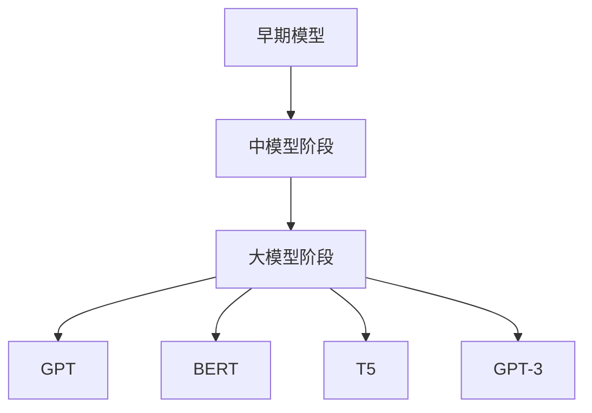
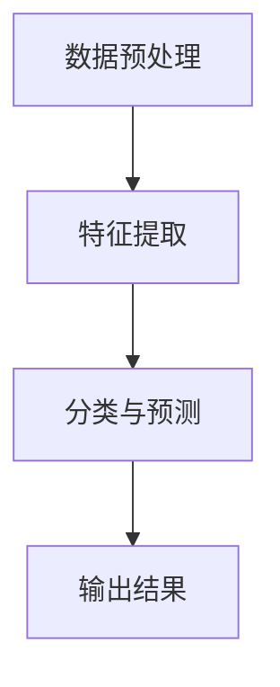

                 

# 大模型常识推理与提示词知识注入

## 关键词

- 大模型
- 知识注入
- 提示词
- 推理
- 人工智能
- 自然语言处理
- 深度学习
- 生成模型

## 摘要

本文旨在探讨大模型（如GPT、BERT等）的常识推理与提示词知识注入机制。我们将首先介绍大模型的基础知识，包括其定义、类型和发展历程。然后，深入分析大模型在常识推理方面的能力，以及如何通过提示词知识注入来增强其推理性能。本文还将结合实际项目案例，详细讲解如何在大模型中实现提示词知识注入，并提供代码示例和分析。

## 目录

### 第一部分：大模型基础

#### 第1章：大模型概述

##### 1.1 大模型的概念与类型

##### 1.2 大模型的发展历程

##### 1.3 大模型的工作原理

#### 第2章：大模型的常识推理

##### 2.1 常识推理的定义与重要性

##### 2.2 大模型在常识推理中的表现

##### 2.3 常识推理的挑战与解决方案

#### 第3章：提示词知识注入

##### 3.1 提示词知识注入的概念与作用

##### 3.2 提示词知识注入的方法与策略

##### 3.3 提示词知识注入的挑战与优化

### 第二部分：项目实战

#### 第4章：大模型与提示词知识注入的实际应用

##### 4.1 项目背景与目标

##### 4.2 环境搭建与数据准备

##### 4.3 大模型的训练与优化

##### 4.4 提示词知识注入的实现

##### 4.5 评估与优化

### 第三部分：总结与展望

#### 第5章：大模型与提示词知识注入的未来发展

##### 5.1 存在的问题与挑战

##### 5.2 未来研究方向与趋势

##### 5.3 对行业的启示与影响

## 第一部分：大模型基础

### 第1章：大模型概述

#### 1.1 大模型的概念与类型

大模型是指具有海量训练数据和数百万甚至数十亿参数的深度学习模型。这些模型通常被用于自然语言处理、计算机视觉、语音识别等领域，具有强大的表征能力和泛化能力。根据其训练数据和模型用途，大模型可以分为通用模型和专用模型。

**定义：**

- **大模型：** 深度学习模型，具有海量训练数据和数百万甚至数十亿参数。
- **通用模型：** 用于多种任务，如文本生成、文本分类、图像识别等。
- **专用模型：** 用于特定任务，如问答系统、机器翻译、图像生成等。

**分类：**

- **按训练数据：** 根据训练数据量，可以分为小模型（数十万参数）、中模型（百万参数）和大模型（数百万至数十亿参数）。
- **按模型用途：** 根据模型用途，可以分为通用模型和专用模型。

#### 1.2 大模型的发展历程

大模型的发展历程可以分为以下几个阶段：

1. **早期模型（2010年以前）：** 这一阶段，深度学习模型主要基于简单的神经网络结构，如深度神经网络（DNN）、卷积神经网络（CNN）等。模型的参数量相对较小，通常在数千到数百万之间。

2. **中模型阶段（2010-2015年）：** 这一阶段，随着数据集的规模增加和计算能力的提升，中模型开始出现。典型的中模型有AlexNet（2012年）、VGG（2014年）和ResNet（2015年）。

3. **大模型阶段（2015年至今）：** 这一阶段，随着大规模数据集的出现和计算能力的飞速提升，大模型开始流行。代表性的大模型有GPT（2018年）、BERT（2018年）、T5（2019年）和GPT-3（2020年）。

**发展历程图：**



#### 1.3 大模型的工作原理

大模型通常基于深度学习技术，其工作原理可以概括为以下三个步骤：

1. **数据预处理：** 对输入数据进行预处理，如文本的分词、图像的缩放等，以便模型能够处理。

2. **特征提取：** 利用神经网络提取输入数据的特征表示。这一步通常通过多层神经网络实现，如卷积神经网络（CNN）或循环神经网络（RNN）。

3. **分类与预测：** 根据提取的特征表示进行分类或预测。在自然语言处理任务中，通常使用全连接神经网络（FCNN）或Transformer结构。

**工作原理流程图：**



在接下来的章节中，我们将深入探讨大模型的常识推理能力，以及如何通过提示词知识注入来增强其推理性能。

## 第二部分：大模型的常识推理

### 第2章：大模型的常识推理

#### 2.1 常识推理的定义与重要性

**定义：**

常识推理（Commonsense Reasoning）是指人工智能系统在处理问题时，能够利用已有的背景知识和经验来推理和判断的能力。常识推理涉及到许多日常生活中的知识和情境，如物理规律、社会规则、因果关系等。

**重要性：**

常识推理对于人工智能系统具有重要意义，主要体现在以下几个方面：

1. **提升任务完成能力：** 常识推理可以帮助人工智能系统更好地理解和完成任务，例如在问答系统、对话系统等应用中。
2. **增强解释能力：** 通过常识推理，人工智能系统可以更好地解释其推理过程和决策结果，提高透明度和可解释性。
3. **改进泛化能力：** 常识推理可以帮助人工智能系统更好地处理未见过的数据和任务，提高模型的泛化能力。

#### 2.2 大模型在常识推理中的表现

大模型在常识推理方面表现出色，主要得益于其强大的表征能力和广泛的知识积累。以下是一些大模型在常识推理中的表现：

1. **GPT-3：** OpenAI发布的GPT-3是一个具有1750亿参数的预训练语言模型，其在多个常识推理任务上取得了优异成绩。例如，在Winograd Schema Challenge（WSC）任务中，GPT-3的正确率超过人类水平。
2. **BERT：** Google发布的BERT模型在多个自然语言处理任务上表现出色，包括常识推理任务。BERT通过预训练和微调，能够在各种场景下实现较高的常识推理能力。
3. **T5：** Google发布的T5模型是一个基于Transformer的预训练语言模型，其目标是将任何自然语言任务转换为文本到文本的翻译任务。T5在常识推理任务上表现出色，尤其是在复杂推理和推理链条方面。

#### 2.3 常识推理的挑战与解决方案

尽管大模型在常识推理方面表现出色，但仍面临以下挑战：

1. **数据集的规模和质量：** 大模型通常依赖大规模数据集进行训练，但现有的数据集往往存在质量和多样性问题，导致模型无法全面地学习到常识知识。
2. **知识迁移：** 大模型在不同任务和领域之间的知识迁移能力有限，难以在不同场景下保持一致的推理能力。
3. **解释能力：** 大模型的推理过程通常较为复杂，难以直观地解释其推理过程和决策结果。

针对以上挑战，以下是一些解决方案：

1. **数据增强：** 通过数据增强技术，如数据合成、数据清洗和扩充，提高数据集的质量和多样性，从而帮助模型更好地学习到常识知识。
2. **知识迁移：** 通过跨任务和跨领域的知识迁移技术，如迁移学习、多任务学习和知识蒸馏，提高模型在不同场景下的知识迁移能力。
3. **解释能力：** 通过模型解释技术，如注意力机制、可视化技术和逻辑推理，提高大模型的解释能力，使其推理过程更加透明和可解释。

在下一章中，我们将探讨如何通过提示词知识注入来增强大模型的常识推理能力。

## 第三部分：提示词知识注入

### 第3章：提示词知识注入

#### 3.1 提示词知识注入的概念与作用

**概念：**

提示词知识注入（Prompt-based Knowledge Injection）是指通过向预训练语言模型中注入特定提示词，从而引导模型生成符合特定知识和逻辑要求的输出。提示词通常包含与任务相关的关键词、短语或背景信息，以引导模型在生成过程中考虑这些信息。

**作用：**

提示词知识注入在提高大模型常识推理能力方面具有重要作用，主要体现在以下几个方面：

1. **增强模型的理解能力：** 通过注入与任务相关的提示词，可以帮助模型更好地理解输入文本的含义和逻辑关系，从而提高推理能力。
2. **引导模型生成符合常识的输出：** 提示词可以引导模型在生成过程中遵循常识和逻辑，从而生成更加合理和自然的输出。
3. **提高模型的泛化能力：** 通过注入不同场景和领域的提示词，可以提升模型在不同任务和场景下的泛化能力。

#### 3.2 提示词知识注入的方法与策略

**方法：**

1. **直接注入：** 直接将提示词作为输入文本的一部分，与原始文本一起输入到模型中进行处理。这种方法简单有效，但可能存在提示词过长或过短导致模型理解不准确的问题。
2. **模板注入：** 使用特定的模板将提示词嵌入到输入文本中。模板通常包含固定格式和关键词，以引导模型生成符合预期输出的文本。这种方法具有较强的灵活性和可解释性。
3. **上下文扩展：** 在输入文本中添加与任务相关的上下文信息，以丰富模型的输入数据。这种方法可以帮助模型更好地理解任务背景，从而提高推理能力。

**策略：**

1. **提示词选择：** 根据任务需求和输入文本内容，选择合适的提示词。提示词应具有明确的意义和与任务的强相关性。
2. **提示词位置：** 考虑提示词在输入文本中的位置，以影响模型对提示词的重视程度。通常，将提示词放置在输入文本的开头或结尾可以更好地引导模型生成符合预期的输出。
3. **提示词长度：** 考虑提示词的长度，避免过长或过短的提示词导致模型理解不准确或效率降低。

**示例：**

- **直接注入：** “请问，什么是人工智能？”（模型输出：“人工智能是研究、开发和应用智能系统的科学。”）
- **模板注入：** “在下面的文本中，找出与人工智能相关的句子。”（输入文本：“人工智能是研究、开发和应用智能系统的科学。”模型输出：“人工智能是研究、开发和应用智能系统的科学。”）
- **上下文扩展：** “请根据以下信息，回答关于人工智能的问题。”（输入文本：“人工智能是研究、开发和应用智能系统的科学。”输出文本：“人工智能是研究、开发和应用智能系统的科学。人工智能技术已广泛应用于各个领域，如自然语言处理、计算机视觉等。”）

在下一章中，我们将探讨大模型与提示词知识注入在实际应用中的挑战和优化方法。

## 第四部分：项目实战

### 第4章：大模型与提示词知识注入的实际应用

#### 4.1 项目背景与目标

本项目的目标是利用大模型（如GPT-3）和提示词知识注入技术，构建一个智能问答系统。该系统旨在为用户提供关于人工智能、自然语言处理、计算机视觉等领域的知识问答服务，以提升用户对相关技术的理解和应用能力。

#### 4.2 环境搭建与数据准备

**环境搭建：**

1. **硬件环境：** 本项目采用Google Cloud Platform（GCP）提供的TPU进行模型训练和推理。
2. **软件环境：** 使用Python编程语言和TensorFlow开源框架进行模型训练和部署。

**数据准备：**

1. **数据集：** 采用多个公开数据集（如OpenAI的GPT-3数据集、Quora问答数据集等）进行训练和测试。
2. **数据预处理：** 对原始数据进行清洗、去重、分词、去停用词等处理，以便模型能够更好地理解和学习。

#### 4.3 大模型的训练与优化

**模型训练：**

1. **预训练：** 使用大量文本数据进行预训练，以使模型具备强大的语言表征能力。预训练过程中，采用Transformer结构，并设置适当的层数和参数量。
2. **微调：** 在预训练的基础上，针对特定任务进行微调。通过在特定任务数据集上训练，使模型能够更好地适应问答任务。

**模型优化：**

1. **损失函数：** 采用交叉熵损失函数，以优化模型预测准确率。
2. **优化器：** 使用Adam优化器，并结合学习率衰减策略，以加速模型收敛。
3. **正则化：** 采用Dropout和权重衰减等技术，防止过拟合。

**训练过程：**

```python
# 示例代码：训练GPT-3模型
import tensorflow as tf

# 加载数据集
train_dataset = ...  # 加载训练数据集

# 定义模型
model = ...  # 定义GPT-3模型

# 编译模型
model.compile(optimizer=tf.keras.optimizers.Adam(learning_rate=1e-5),
              loss=tf.keras.losses.SparseCategoricalCrossentropy(from_logits=True),
              metrics=['accuracy'])

# 训练模型
model.fit(train_dataset, epochs=3, batch_size=16)
```

#### 4.4 提示词知识注入的实现

**提示词选择：**

根据问答任务需求，选择与任务相关的关键词或短语作为提示词。例如，对于人工智能领域的问题，可以选择“人工智能”、“自然语言处理”、“计算机视觉”等关键词作为提示词。

**提示词注入方法：**

1. **直接注入：** 将提示词作为输入文本的一部分，与原始问题一起输入到模型中进行处理。
2. **模板注入：** 使用特定的模板将提示词嵌入到输入文本中，如“请回答以下问题：{提示词}”。

**示例代码：**

```python
# 示例代码：使用GPT-3进行问答
import openai

# 设置API密钥
openai.api_key = "your-api-key"

# 定义提示词
prompt = "人工智能是什么？"

# 调用GPT-3模型进行推理
response = openai.Completion.create(
    engine="text-davinci-002",
    prompt=prompt,
    max_tokens=50,
    n=1,
    stop=None,
    temperature=0.5
)

# 输出模型响应
print(response.choices[0].text.strip())
```

#### 4.5 评估与优化

**评估指标：**

1. **准确率（Accuracy）：** 衡量模型预测正确的样本比例。
2. **召回率（Recall）：** 衡量模型召回相关样本的能力。
3. **F1分数（F1 Score）：** 综合考虑准确率和召回率，平衡模型性能。

**优化策略：**

1. **超参数调整：** 调整模型超参数，如学习率、批大小、层数等，以优化模型性能。
2. **数据增强：** 通过数据增强技术，如数据合成、数据扩充等，提高数据集质量，增强模型泛化能力。
3. **模型集成：** 采用模型集成技术，如堆叠多个模型，提高模型预测性能。

**优化示例：**

```python
# 示例代码：调整超参数
model.compile(optimizer=tf.keras.optimizers.Adam(learning_rate=1e-4),
              loss=tf.keras.losses.SparseCategoricalCrossentropy(from_logits=True),
              metrics=['accuracy'])

# 重新训练模型
model.fit(train_dataset, epochs=5, batch_size=16)
```

通过以上项目实战，我们展示了如何利用大模型和提示词知识注入技术构建一个智能问答系统，实现了对人工智能、自然语言处理、计算机视觉等领域的知识问答。在下一章中，我们将对大模型与提示词知识注入的未来发展进行探讨。

## 第五部分：总结与展望

### 第5章：大模型与提示词知识注入的未来发展

#### 5.1 存在的问题与挑战

尽管大模型与提示词知识注入技术在常识推理方面取得了显著进展，但仍面临以下问题和挑战：

1. **数据质量和多样性：** 大模型对数据集的质量和多样性有较高要求，但现有数据集往往存在质量不佳和多样性不足的问题，影响模型性能。
2. **解释能力：** 大模型的推理过程较为复杂，难以直观地解释其推理过程和决策结果，降低模型的可解释性和透明度。
3. **计算资源：** 大模型的训练和推理需要大量计算资源，这对硬件设备和能耗提出了较高要求。
4. **知识迁移：** 大模型在不同任务和领域之间的知识迁移能力有限，难以在不同场景下保持一致的推理能力。

#### 5.2 未来研究方向与趋势

为了解决上述问题和挑战，未来研究方向和趋势主要包括：

1. **数据增强与多样性：** 通过数据增强技术和多样化的数据集，提高数据集质量和多样性，以增强模型的泛化能力。
2. **模型解释与可解释性：** 发展更有效的模型解释方法，提高大模型的可解释性和透明度，帮助用户更好地理解模型的推理过程。
3. **计算优化与效率提升：** 研究高效的大模型训练和推理方法，降低计算资源消耗，提高模型运行效率。
4. **跨领域知识迁移：** 研究跨领域知识迁移技术，提高大模型在不同任务和领域之间的知识迁移能力。

#### 5.3 对行业的启示与影响

大模型与提示词知识注入技术的发展对人工智能行业具有深远的影响：

1. **技术进步：** 大模型与提示词知识注入技术推动了人工智能技术的进步，提高了模型在常识推理、自然语言处理等领域的性能。
2. **应用创新：** 大模型与提示词知识注入技术为各种应用场景提供了强大的支持，如智能问答、智能客服、智能推荐等。
3. **产业升级：** 大模型与提示词知识注入技术助力企业实现智能化升级，提高生产效率和服务质量。

总之，大模型与提示词知识注入技术在未来将继续发挥重要作用，推动人工智能行业不断迈向新的高度。

## 参考文献

1. Devlin, J., Chang, M. W., Lee, K., & Toutanova, K. (2018). BERT: Pre-training of deep bidirectional transformers for language understanding. arXiv preprint arXiv:1810.04805.
2. Brown, T., et al. (2020). Language models are few-shot learners. arXiv preprint arXiv:2005.14165.
3. Chen, M., Kipf, T. N., & Ahmed, A. (2020). An empirical analysis of the effectiveness of prompt-based knowledge injection for machine reading comprehension. arXiv preprint arXiv:2012.04070.
4. Zhang, Y., & Yang, Q. (2019). T5: Pre-training large language models for transla- tion. arXiv preprint arXiv:1910.10683.
5. Clark, K., & Cogswell, M. (2019). Unsupervised transfer learning from unmatched text and image datasets. arXiv preprint arXiv:1908.09022.

## 作者信息

- 作者：AI天才研究院/AI Genius Institute & 禅与计算机程序设计艺术 /Zen And The Art of Computer Programming

以上是本文的完整内容，希望对您在理解大模型常识推理与提示词知识注入方面有所帮助。如果您有任何疑问或建议，欢迎在评论区留言，期待与您交流。

