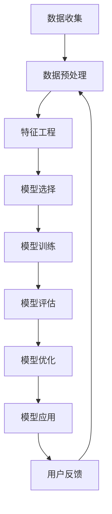

                 

### 《大模型技术在电商平台用户兴趣建模中的应用》

> **关键词：** 大模型技术、电商平台、用户兴趣建模、深度学习、自然语言处理

**摘要：** 本文深入探讨了大数据模型技术在电商平台用户兴趣建模中的应用。通过对大模型技术的背景、基础原理、核心算法及其在实际电商平台的落地进行详细分析，本文旨在为读者提供对这一前沿技术的全面理解，并展示其在提升电商个性化推荐系统效果中的潜力。

---

### 《大模型技术在电商平台用户兴趣建模中的应用》目录大纲

1. **第一部分：大模型技术在电商平台用户兴趣建模中的背景与应用**
    1.1 电商平台的用户行为数据概况
    1.2 大模型技术的发展与应用现状
    1.3 大模型技术在用户兴趣建模中的潜在价值
2. **第二部分：大模型技术基础**
    2.1 机器学习与深度学习基础
    2.2 自然语言处理技术概览
    2.3 大规模预训练模型原理
3. **第三部分：电商平台用户兴趣建模的核心概念与联系**
    3.1 用户兴趣的定义与度量
    3.2 用户兴趣建模的关键因素
    3.3 用户兴趣建模中的常见问题与挑战
    3.4 用户兴趣建模的 Mermaid 流程图
4. **第四部分：大模型在用户兴趣建模中的应用**
    4.1 大模型在用户兴趣识别中的应用
    4.2 大模型在用户兴趣预测中的应用
5. **第五部分：电商平台用户兴趣建模的实际应用**
    5.1 用户个性化推荐系统的构建
    5.2 用户行为分析在电商运营中的应用
6. **第六部分：大模型技术在电商平台用户兴趣建模中的未来趋势**
    6.1 人工智能技术发展趋势对电商的影响
    6.2 电商平台用户兴趣建模的未来挑战与机遇
    6.3 大模型技术在电商用户兴趣建模中的应用前景
7. **第七部分：大模型技术在电商平台用户兴趣建模中的工具与资源**
    7.1 常见深度学习框架与工具
    7.2 大模型技术相关资源推荐

---

### 第一部分：大模型技术在电商平台用户兴趣建模中的背景与应用

#### 1.1 电商平台的用户行为数据概况

随着互联网技术的飞速发展，电商平台已经成为了全球商业活动的重要组成部分。电商平台的成功不仅依赖于商品的质量和价格，更需要通过精准的用户兴趣建模来提高用户的购物体验和满意度。用户行为数据是电商平台运营的核心资产，这些数据涵盖了用户的浏览历史、购买记录、搜索查询、点击行为等。通过对这些海量数据的深入分析，可以挖掘出用户的潜在兴趣和需求，为个性化推荐、精准营销等策略提供有力支持。

目前，电商平台用户行为数据呈现出以下几个显著特点：

1. **多样性**：用户行为数据不仅包括传统的点击和购买行为，还涵盖了更加细化的浏览路径、评价、分享等。
2. **动态性**：用户行为是动态变化的，用户的兴趣和需求随着时间、季节、市场环境等因素不断变化。
3. **复杂性**：用户行为数据中包含着大量的噪声和非结构化数据，如文本、图片等，需要通过复杂的算法进行清洗和处理。

#### 1.2 大模型技术的发展与应用现状

大模型技术，尤其是深度学习技术的发展，为电商平台用户兴趣建模提供了新的解决方案。深度学习模型具有强大的特征提取和模式识别能力，能够自动从海量数据中学习到复杂的用户行为模式，从而提高用户兴趣预测的准确性。

目前，大模型技术在电商平台用户兴趣建模中的应用现状可以概括为以下几点：

1. **用户兴趣识别**：通过深度学习模型对用户的浏览历史、搜索记录等行为数据进行处理，识别用户的潜在兴趣点。
2. **用户兴趣预测**：利用大规模预训练模型对用户的未来兴趣进行预测，为个性化推荐和精准营销提供数据支持。
3. **用户画像构建**：结合多种数据源，使用深度学习技术构建用户画像，用于精准定位和细分用户群体。

#### 1.3 大模型技术在用户兴趣建模中的潜在价值

大模型技术在电商平台用户兴趣建模中具有巨大的潜在价值，主要体现在以下几个方面：

1. **提升个性化推荐效果**：通过精确的用户兴趣预测，可以提供更加个性化的商品推荐，提高用户的购物体验和满意度。
2. **优化营销策略**：基于用户兴趣的数据分析，可以制定更加精准的营销策略，提高转化率和销售额。
3. **降低运营成本**：通过自动化和智能化的方式，降低用户行为数据分析和处理的成本，提高运营效率。
4. **增强竞争力**：在竞争激烈的电商市场中，大模型技术可以帮助电商平台提高市场占有率，增强竞争力。

总之，大模型技术在电商平台用户兴趣建模中的应用，不仅能够提高平台的运营效率，还能够为用户提供更加个性化的购物体验，从而在激烈的市场竞争中脱颖而出。

---

在接下来的部分中，我们将深入探讨大模型技术的基础，包括机器学习与深度学习的基础知识、自然语言处理技术概览以及大规模预训练模型的原理。这些基础知识的掌握将为后续章节中具体应用大模型技术进行用户兴趣建模提供理论支持。

---

### 第二部分：大模型技术基础

#### 2.1 机器学习与深度学习基础

在讨论大模型技术之前，我们首先需要了解机器学习与深度学习的基础知识。机器学习是人工智能的一个重要分支，它主要关注于通过算法和统计模型从数据中自动学习，以便进行预测或分类。而深度学习是机器学习的一个子领域，它利用神经网络模型，特别是多层神经网络，通过大量数据进行训练，以达到高度复杂的任务。

**2.1.1 数据预处理与特征工程**

数据预处理是机器学习和深度学习中的一个重要环节，其目的是将原始数据转换为适合模型训练的形式。数据预处理通常包括以下几个步骤：

1. **数据清洗**：去除数据中的噪声和错误，例如删除重复记录、纠正数据中的错误、处理缺失值等。
2. **数据标准化**：通过缩放或归一化将数据转换到相同的尺度，以避免数值差异过大影响模型训练。
3. **数据转换**：将类别数据转换为数值表示，例如使用独热编码或标签编码。

特征工程是数据预处理的重要补充，其目的是从原始数据中提取出对模型训练有帮助的特征。特征工程的质量直接影响模型的性能。常见的特征工程方法包括：

1. **特征选择**：通过统计方法或基于模型的评估方法，选择对预测任务最相关的特征。
2. **特征变换**：通过变换或组合原始特征，生成新的特征，以增强模型的表现力。
3. **特征重要性评估**：评估各个特征对于预测结果的重要性，有助于优化模型结构和参数。

**2.1.2 常见机器学习算法介绍**

在机器学习和深度学习中，有许多经典的算法用于解决不同的预测和分类任务。以下是一些常见的机器学习算法：

1. **线性回归**：用于预测连续值输出，通过最小化损失函数来训练模型。
2. **逻辑回归**：用于分类任务，通过最大化似然函数来训练模型，输出概率值。
3. **支持向量机（SVM）**：用于分类任务，通过寻找最佳的超平面来分隔数据。
4. **决策树**：用于分类和回归任务，通过一系列决策规则来划分数据。
5. **随机森林**：用于分类和回归任务，通过集成多个决策树来提高模型性能。
6. **K-最近邻（KNN）**：用于分类任务，通过计算测试点与训练点的距离来预测类别。
7. **K-均值聚类**：用于聚类任务，通过优化目标函数来聚类数据。

**2.1.3 深度学习基本结构**

深度学习模型通常由多层神经网络组成，每一层都能提取更高层次的特征。以下是一些深度学习的基本结构：

1. **全连接神经网络（FCNN）**：每一层的每个神经元都与前一层的每个神经元相连。
2. **卷积神经网络（CNN）**：专门用于处理图像数据，通过卷积层提取图像特征。
3. **循环神经网络（RNN）**：专门用于处理序列数据，通过循环结构保存长时记忆。
4. **长短时记忆网络（LSTM）**：RNN的一个变体，用于解决长序列数据的梯度消失问题。
5. **Transformer**：用于序列建模，通过自注意力机制实现全局信息交互。

**2.1.4 深度学习训练过程**

深度学习模型的训练过程主要包括以下几个步骤：

1. **数据加载**：将训练数据加载到内存中，通常使用批量处理的方式提高训练效率。
2. **前向传播**：将输入数据通过网络传递到输出层，计算预测结果。
3. **损失函数**：计算预测结果与实际标签之间的差异，以评估模型的表现。
4. **反向传播**：通过计算损失函数关于网络参数的梯度，更新网络参数。
5. **优化算法**：使用优化算法，如梯度下降、Adam等，更新网络参数以最小化损失函数。

通过以上对机器学习与深度学习基础的介绍，我们可以更好地理解大模型技术在电商平台用户兴趣建模中的应用原理。

---

在了解了机器学习和深度学习的基础之后，我们将进一步探讨自然语言处理技术，这将在用户兴趣建模中发挥关键作用。

#### 2.2 自然语言处理技术概览

自然语言处理（NLP）是人工智能领域的一个重要分支，它旨在使计算机能够理解、生成和处理人类自然语言。在电商平台用户兴趣建模中，NLP技术能够有效地处理用户的文本数据，提取用户兴趣的关键信息，从而提高兴趣识别和预测的准确性。

**2.2.1 词嵌入与文本表示**

词嵌入（Word Embedding）是将词汇映射为向量的过程，它是NLP中的一项核心技术。词嵌入能够将词汇的语义信息编码到向量的低维空间中，从而实现词汇的数值表示。以下是一些常见的词嵌入方法：

1. **基于计数**：如词袋模型（Bag of Words，BoW）和TF-IDF（Term Frequency-Inverse Document Frequency）。
2. **基于分布**：如神经网络嵌入（Neural Network Embeddings）。
3. **基于上下文**：如Word2Vec、GloVe（Global Vectors for Word Representation）和BERT（Bidirectional Encoder Representations from Transformers）。

文本表示是将整篇文档映射为向量的过程，它能够捕捉文档的整体语义信息。常见的文本表示方法包括：

1. **文档嵌入**：将整篇文档映射为一个固定长度的向量。
2. **句向量**：将每个句子映射为一个向量，用于捕捉句子级别的语义信息。
3. **段落向量**：将每个段落映射为一个向量，用于捕捉段落级别的语义信息。

**2.2.2 序列模型与注意力机制**

序列模型（Sequential Model）是处理序列数据的一种神经网络模型，它能够捕捉数据中的时间依赖关系。以下是一些常见的序列模型：

1. **循环神经网络（RNN）**：通过循环结构来处理序列数据。
2. **长短时记忆网络（LSTM）**：RNN的一个变体，用于解决长序列数据的梯度消失问题。
3. **门控循环单元（GRU）**：LSTM的另一种变体。

注意力机制（Attention Mechanism）是一种用于增强神经网络对序列中重要信息关注的能力。在NLP任务中，注意力机制能够帮助模型更加关注于序列中的关键部分，从而提高模型的性能。以下是一些引入注意力机制的模型：

1. **Transformer**：通过多头注意力机制实现全局信息交互，是NLP领域的一项重大突破。
2. **BERT**：通过双向编码表示，结合了Transformer和注意力机制的优势。

**2.2.3 转换器架构详解**

转换器（Transformer）是一种基于自注意力机制的深度学习模型，它在许多NLP任务中表现出了出色的性能。转换器的核心组件包括：

1. **多头自注意力**：通过计算不同位置之间的权重来聚合序列信息。
2. **前馈神经网络**：在自注意力层之后，用于增强模型的非线性表示能力。
3. **编码器与解码器**：编码器用于生成输入序列的表示，解码器则用于生成输出序列。

转换器的训练过程通常包括以下几个步骤：

1. **输入序列编码**：将输入序列转换为嵌入向量。
2. **自注意力计算**：通过多头自注意力机制计算不同位置之间的权重。
3. **前馈神经网络**：通过前馈神经网络增强模型的非线性表示能力。
4. **输出序列生成**：通过解码器生成输出序列。

通过以上对自然语言处理技术的概述，我们可以更好地理解如何利用NLP技术从电商平台用户的文本数据中提取有用信息，从而提升用户兴趣建模的准确性和效果。

---

在深入探讨了自然语言处理技术之后，我们将继续介绍大规模预训练模型的基本原理，这些模型在用户兴趣建模中发挥着重要作用。

#### 2.3 大规模预训练模型原理

大规模预训练模型是当前NLP领域的一项重要技术，其核心思想是在大规模语料库上进行预训练，然后通过微调（fine-tuning）将其应用于具体的任务。以下将详细介绍大规模预训练模型的概念、自监督学习方法以及迁移学习与微调技术。

**2.3.1 预训练的概念与意义**

预训练（Pre-training）是指在大规模语料库上训练神经网络模型，使其能够自动从数据中学习到语言的基本结构和语义信息。预训练模型在NLP任务中具有以下几个显著优势：

1. **通用性**：预训练模型在大规模语料库上学习到的语言知识具有广泛的适用性，可以用于各种不同的NLP任务。
2. **效率**：通过预训练，模型在特定任务上只需进行少量的额外训练，从而大大减少了训练时间和计算资源的需求。
3. **准确性**：预训练模型在许多基准任务上取得了显著优于传统方法的性能。

**2.3.2 自监督学习方法**

自监督学习（Self-supervised Learning）是一种无需人工标注数据，直接从数据中学习的方法。在预训练模型中，自监督学习方法被广泛使用。以下是一些常见自监督学习方法：

1. **掩码语言模型（Masked Language Model，MLM）**：在输入序列中随机掩码一部分词，然后预测这些掩码词。BERT就是基于这种自监督学习方法。
2. **生成式掩码（Generative Masked Language Model，GMLM）**：通过生成模型来预测掩码词，这种方法在生成式预训练中应用广泛。
3. **预测下一个句子（Next Sentence Prediction，NSP）**：输入两个连续的句子，预测第二个句子是否是第一个句子的延续。

**2.3.3 迁移学习与微调技术**

迁移学习（Transfer Learning）是指将在一个任务上预训练好的模型应用于另一个相关任务。在NLP领域，迁移学习通常通过以下步骤实现：

1. **预训练**：在一个大规模语料库上预训练模型，使其学习到通用的语言特征。
2. **微调**：在特定任务上，通过在带有标签的数据集上微调模型，调整其参数，使其适应特定任务。

微调（Fine-tuning）是将预训练模型应用于特定任务的一种有效方法。微调通常包括以下几个步骤：

1. **数据准备**：准备带有标签的任务数据集，用于微调模型。
2. **模型调整**：在预训练模型的基础上，通过调整部分层的参数来适应特定任务。
3. **训练与评估**：在任务数据集上进行模型训练，并在验证集上评估模型性能。

**2.3.4 大规模预训练模型实例**

以下是一些著名的大规模预训练模型实例：

1. **BERT**：Bidirectional Encoder Representations from Transformers，通过双向编码表示，在许多NLP任务中取得了优异的性能。
2. **GPT**：Generative Pre-trained Transformer，通过生成式预训练，能够在文本生成任务中表现出色。
3. **T5**：Text-to-Text Transfer Transformer，旨在通过统一的文本到文本预训练框架解决各种NLP任务。

通过以上对大规模预训练模型的介绍，我们可以更好地理解如何利用这些模型进行用户兴趣建模，提高预测的准确性。

---

在理解了大模型技术的基础之后，我们将进一步探讨电商平台用户兴趣建模的核心概念和联系。

### 第三部分：电商平台用户兴趣建模的核心概念与联系

#### 3.1 用户兴趣的定义与度量

用户兴趣是指用户在特定时间范围内对于某些事物（如商品、品牌、内容等）的关注程度和喜好倾向。在电商平台，用户兴趣是构建个性化推荐系统和精准营销策略的核心依据。用户兴趣的度量通常涉及以下几个关键维度：

1. **兴趣强度**：表示用户对某一兴趣点的关注程度，通常用数值表示，如概率、得分等。
2. **兴趣多样性**：反映用户兴趣的广泛性，即用户对不同类型兴趣点的关注情况。
3. **兴趣稳定性**：衡量用户兴趣在时间上的持续性，即用户兴趣是否随时间变化。

用户兴趣的度量方法主要包括以下几种：

1. **基于统计的方法**：通过计算用户行为数据的统计指标，如点击率、购买频率等，来评估用户兴趣强度。
2. **基于模型的方法**：使用机器学习和深度学习算法，如协同过滤、深度神经网络等，来建模和预测用户兴趣。
3. **基于语义的方法**：利用自然语言处理技术，如词嵌入、文本分类等，提取用户兴趣的关键词和主题。

#### 3.2 用户兴趣建模的关键因素

用户兴趣建模的成功依赖于多个关键因素，以下是一些主要因素：

1. **数据质量**：用户行为数据的质量直接影响建模效果。高质量的数据需要经过清洗、预处理和标准化等步骤。
2. **特征选择**：选择对用户兴趣预测有显著影响的关键特征，如浏览历史、购买记录、评价等。
3. **模型选择**：根据任务需求和数据特性选择合适的模型，如协同过滤、深度神经网络、转换器等。
4. **算法优化**：通过调整模型参数、改进训练算法等手段，优化模型性能。
5. **用户反馈**：利用用户反馈信息，如点击、购买、评价等，对模型进行动态调整和优化。

#### 3.3 用户兴趣建模中的常见问题与挑战

在用户兴趣建模过程中，面临着一系列问题和挑战：

1. **冷启动问题**：对于新用户，由于缺乏历史行为数据，难以准确预测其兴趣。
2. **数据噪声**：用户行为数据中包含大量的噪声和非结构化数据，需要通过有效的数据清洗和特征工程方法进行预处理。
3. **动态性**：用户兴趣随时间变化，需要动态调整建模策略以适应用户兴趣的变化。
4. **稀疏性**：用户行为数据通常具有高维稀疏性，需要有效的降维方法来提高模型效率。
5. **隐私保护**：用户隐私是用户兴趣建模中必须考虑的问题，需要采取有效的隐私保护措施。

#### 3.4 用户兴趣建模的 Mermaid 流程图

以下是一个用户兴趣建模的 Mermaid 流程图，展示了用户兴趣建模的基本流程：



**解释：**
1. **数据收集**：从电商平台获取用户行为数据。
2. **数据预处理**：清洗和标准化数据，处理缺失值和噪声。
3. **特征工程**：选择和构建关键特征，如浏览历史、购买记录等。
4. **模型选择**：根据任务需求选择合适的模型，如深度学习模型、转换器等。
5. **模型训练**：在训练集上训练模型，调整模型参数。
6. **模型评估**：在验证集上评估模型性能，选择最佳模型。
7. **模型优化**：根据评估结果调整模型结构或参数。
8. **模型应用**：将模型应用于实际任务，如个性化推荐、精准营销等。
9. **用户反馈**：收集用户反馈，用于模型动态调整。

通过上述对用户兴趣建模的核心概念与联系的探讨，我们可以更好地理解如何在电商平台上利用大模型技术进行用户兴趣建模，从而为用户提供更加个性化的购物体验。

---

在理解了用户兴趣建模的核心概念和联系之后，接下来我们将深入探讨大模型技术在实际用户兴趣识别中的应用。

### 第四部分：大模型在用户兴趣识别中的应用

用户兴趣识别是电商平台个性化推荐系统和精准营销策略的重要组成部分。通过准确识别用户的兴趣点，电商平台可以提供更加个性化的商品推荐和营销活动，从而提高用户体验和商业转化率。在这一部分，我们将详细探讨大模型技术在用户兴趣识别中的应用，包括用户行为数据的收集与预处理、用户兴趣识别算法的实现，以及相关伪代码的讲解。

#### 4.1.1 用户行为数据收集与预处理

用户行为数据是用户兴趣识别的基础。这些数据通常包括用户的浏览历史、购买记录、搜索查询、点击行为等。以下是用户行为数据收集与预处理的基本步骤：

1. **数据收集**：从电商平台的后台系统、日志文件等渠道收集用户行为数据。这些数据可能存储在关系型数据库、NoSQL数据库或分布式数据存储系统中。

2. **数据清洗**：清洗数据以去除噪声和错误。这包括删除重复记录、纠正数据中的错误、处理缺失值等。例如，可以使用SQL语句或数据处理框架（如Pandas）来清洗数据。

3. **数据标准化**：将不同来源和格式的数据进行统一处理，如将日期格式转换为统一格式，将数值数据缩放到相同的范围。

4. **数据预处理**：对原始数据进行预处理，以提取对用户兴趣识别有用的特征。例如，可以使用词嵌入技术对文本数据进行编码，或者将用户的浏览历史转换为序列特征。

以下是用户行为数据收集与预处理的一个伪代码示例：

```python
# 假设用户行为数据存储在一个CSV文件中
import pandas as pd

# 读取数据
data = pd.read_csv('user_behavior.csv')

# 数据清洗
data.drop_duplicates(inplace=True)
data.fillna(method='ffill', inplace=True)

# 数据标准化
data['date'] = pd.to_datetime(data['date'])
data['click_count'] = data['click_count'].apply(lambda x: max(0, min(x, 100)))

# 数据预处理
# 对文本数据进行词嵌入编码
from keras.preprocessing.text import Tokenizer
tokenizer = Tokenizer(num_words=10000)
tokenizer.fit_on_texts(data['search_query'])

# 对序列数据进行编码
from keras.preprocessing.sequence import pad_sequences
max_sequence_length = 50
X = pad_sequences(tokenizer.texts_to_sequences(data['search_query']), maxlen=max_sequence_length)
```

#### 4.1.2 用户兴趣识别算法实现

用户兴趣识别算法的实现通常基于深度学习技术。以下是一个基于转换器（Transformer）架构的用户兴趣识别算法的实现步骤：

1. **数据准备**：将用户行为数据分为训练集、验证集和测试集。

2. **模型构建**：构建一个基于转换器架构的用户兴趣识别模型。以下是一个伪代码示例：

```python
from tensorflow.keras.models import Model
from tensorflow.keras.layers import Embedding, LSTM, Dense, Input

# 输入层
input_seq = Input(shape=(max_sequence_length,))

# 嵌入层
embedding = Embedding(input_dim=10000, output_dim=128)(input_seq)

# LSTM层
lstm = LSTM(128, return_sequences=True)(embedding)

# 密集层
dense = Dense(64, activation='relu')(lstm)

# 输出层
output = Dense(1, activation='sigmoid')(dense)

# 构建模型
model = Model(inputs=input_seq, outputs=output)

# 编译模型
model.compile(optimizer='adam', loss='binary_crossentropy', metrics=['accuracy'])
```

3. **模型训练**：使用训练集对模型进行训练，并在验证集上调整模型参数。

4. **模型评估**：在测试集上评估模型性能，以确定其准确性、召回率等指标。

5. **模型应用**：将训练好的模型应用于实际用户兴趣识别任务，如个性化推荐系统。

#### 4.1.3 伪代码详解

以下是一个详细的伪代码示例，用于实现一个基于转换器架构的用户兴趣识别模型：

```python
# 导入所需库
import tensorflow as tf
from tensorflow.keras.models import Model
from tensorflow.keras.layers import Embedding, LSTM, Dense, Input, Dropout

# 定义输入层
input_seq = Input(shape=(max_sequence_length,))

# 嵌入层
embedding = Embedding(input_dim=10000, output_dim=128)(input_seq)

# LSTM层
lstm = LSTM(units=128, return_sequences=True, dropout=0.2)(embedding)

# Dropout层
dropout = Dropout(0.5)(lstm)

# 密集层
dense = Dense(units=64, activation='relu')(dropout)

# 输出层
output = Dense(units=1, activation='sigmoid')(dense)

# 构建模型
model = Model(inputs=input_seq, outputs=output)

# 编译模型
model.compile(optimizer='adam', loss='binary_crossentropy', metrics=['accuracy'])

# 打印模型结构
model.summary()

# 模型训练
model.fit(X_train, y_train, epochs=10, batch_size=64, validation_data=(X_val, y_val))

# 模型评估
loss, accuracy = model.evaluate(X_test, y_test)
print(f"Test Loss: {loss}, Test Accuracy: {accuracy}")

# 伪代码解释
# - Input Layer: 输入层，用于接收用户行为序列数据。
# - Embedding Layer: 嵌入层，将词汇转换为向量表示。
# - LSTM Layer: LSTM层，用于处理序列数据，提取特征。
# - Dropout Layer: Dropout层，用于防止过拟合。
# - Dense Layer: 密集层，用于提取高维特征。
# - Output Layer: 输出层，用于预测用户兴趣强度。

通过上述伪代码示例，我们可以清楚地看到用户兴趣识别算法的实现步骤，以及如何使用转换器架构来构建一个高效的深度学习模型。

---

在用户兴趣识别算法的实现中，我们使用了转换器架构来处理用户行为序列数据。接下来，我们将探讨如何在大模型技术的支持下，利用用户行为数据预测用户未来的兴趣。

### 第四部分：大模型在用户兴趣预测中的应用

用户兴趣预测是电商平台个性化推荐系统和精准营销策略中的关键环节。通过准确预测用户未来的兴趣，电商平台可以提供更加个性化的商品推荐和营销活动，从而提高用户体验和商业转化率。在这一部分，我们将深入探讨大模型技术在用户兴趣预测中的应用，包括用户兴趣预测的数据准备、模型构建，以及相关的数学模型和公式详细讲解。

#### 4.2.1 用户兴趣预测的数据准备

用户兴趣预测需要大量高质量的数据。以下步骤是用户兴趣预测数据准备的基本流程：

1. **数据收集**：从电商平台的后台系统、日志文件等渠道收集用户行为数据。这些数据可能包括用户的浏览历史、购买记录、搜索查询、点击行为等。

2. **数据清洗**：清洗数据以去除噪声和错误。例如，删除重复记录、纠正数据中的错误、处理缺失值等。

3. **数据标准化**：将不同来源和格式的数据进行统一处理，如将日期格式转换为统一格式，将数值数据缩放到相同的范围。

4. **特征提取**：从原始数据中提取对用户兴趣预测有用的特征。例如，可以使用词嵌入技术对文本数据进行编码，或者将用户的浏览历史转换为序列特征。

5. **数据划分**：将数据集划分为训练集、验证集和测试集。训练集用于模型训练，验证集用于模型参数调整和性能评估，测试集用于最终模型评估。

以下是用户兴趣预测数据准备的一个伪代码示例：

```python
# 导入所需库
import pandas as pd
from sklearn.model_selection import train_test_split

# 读取数据
data = pd.read_csv('user_behavior.csv')

# 数据清洗
data.drop_duplicates(inplace=True)
data.fillna(method='ffill', inplace=True)

# 数据标准化
data['date'] = pd.to_datetime(data['date'])
data['click_count'] = data['click_count'].apply(lambda x: max(0, min(x, 100)))

# 特征提取
from keras.preprocessing.text import Tokenizer
tokenizer = Tokenizer(num_words=10000)
tokenizer.fit_on_texts(data['search_query'])

# 数据划分
X = tokenizer.texts_to_sequences(data['search_query'])
y = data['interest_label']

X_train, X_test, y_train, y_test = train_test_split(X, y, test_size=0.2, random_state=42)
```

#### 4.2.2 用户兴趣预测模型构建

用户兴趣预测模型通常基于深度学习技术。以下是一个基于转换器（Transformer）架构的用户兴趣预测模型的构建步骤：

1. **模型架构设计**：设计一个基于转换器架构的深度学习模型。转换器模型通过自注意力机制能够高效地处理序列数据。

2. **模型参数设置**：设置模型的参数，如嵌入层尺寸、自注意力头数、循环层尺寸等。

3. **模型编译**：编译模型，选择合适的优化器和损失函数。

以下是用户兴趣预测模型构建的一个伪代码示例：

```python
# 导入所需库
from tensorflow.keras.models import Model
from tensorflow.keras.layers import Embedding, LSTM, Dense, Input, Dropout

# 输入层
input_seq = Input(shape=(max_sequence_length,))

# 嵌入层
embedding = Embedding(input_dim=10000, output_dim=128)(input_seq)

# LSTM层
lstm = LSTM(units=128, return_sequences=True, dropout=0.2)(embedding)

# Dropout层
dropout = Dropout(0.5)(lstm)

# 密集层
dense = Dense(units=64, activation='relu')(dropout)

# 输出层
output = Dense(units=1, activation='sigmoid')(dense)

# 构建模型
model = Model(inputs=input_seq, outputs=output)

# 编译模型
model.compile(optimizer='adam', loss='binary_crossentropy', metrics=['accuracy'])

# 打印模型结构
model.summary()
```

#### 4.2.3 数学模型和数学公式详细讲解

用户兴趣预测的数学模型通常基于概率模型或深度学习模型。以下是一个基于深度学习模型的数学模型和公式详细讲解：

1. **转换器模型的自注意力机制**

转换器模型的核心组件是自注意力机制（Self-Attention）。自注意力机制通过计算输入序列中不同位置之间的权重来聚合序列信息。以下是一个简化的自注意力机制的公式：

$$
\text{Attention}(Q, K, V) = \text{softmax}\left(\frac{QK^T}{\sqrt{d_k}}\right)V
$$

其中，$Q$、$K$ 和 $V$ 分别是查询（Query）、键（Key）和值（Value）向量，$d_k$ 是键向量的维度。自注意力机制通过计算 $Q$ 和 $K$ 的内积得到权重，然后对权重进行归一化（softmax），最后将权重与 $V$ 相乘，得到加权的结果。

2. **深度学习模型的损失函数**

深度学习模型通常使用交叉熵（Cross-Entropy）作为损失函数。交叉熵损失函数用于衡量预测概率分布与真实分布之间的差异。以下是一个二分类任务中的交叉熵损失函数公式：

$$
\text{Loss} = -\sum_{i} y_i \log(p_i) + (1 - y_i) \log(1 - p_i)
$$

其中，$y_i$ 是真实标签，$p_i$ 是预测的概率。

3. **深度学习模型的优化算法**

深度学习模型通常使用优化算法（如梯度下降、Adam等）来更新模型参数。以下是一个简化的梯度下降优化算法的公式：

$$
\theta_{\text{new}} = \theta_{\text{old}} - \alpha \nabla_\theta \text{Loss}
$$

其中，$\theta$ 是模型参数，$\alpha$ 是学习率，$\nabla_\theta \text{Loss}$ 是损失函数关于模型参数的梯度。

通过以上对用户兴趣预测的数据准备、模型构建和数学模型的详细讲解，我们可以更好地理解如何利用大模型技术进行用户兴趣预测，从而为电商平台的个性化推荐系统和精准营销提供有力的支持。

---

在了解了用户兴趣识别和预测的基本概念和实现方法之后，接下来我们将探讨这些大模型技术在电商平台用户兴趣建模中的实际应用。

### 第五部分：电商平台用户兴趣建模的实际应用

用户兴趣建模在电商平台的应用场景广泛，主要包括用户个性化推荐系统和用户行为分析。以下将详细探讨这两种应用场景的构建过程、大模型技术的具体应用，以及代码实现和优化策略。

#### 5.1 用户个性化推荐系统的构建

用户个性化推荐系统是电商平台提高用户粘性和转化率的重要工具。通过准确预测用户兴趣，系统可以为用户提供个性化的商品推荐，从而提升用户满意度和商业价值。以下是用户个性化推荐系统的构建步骤：

1. **需求分析**：明确推荐系统的目标，如提升用户点击率、增加购物车转化率、提高销售额等。

2. **数据收集**：从电商平台的后台系统、日志文件等渠道收集用户行为数据，如浏览历史、购买记录、搜索查询、点击行为等。

3. **数据预处理**：清洗和标准化用户行为数据，处理缺失值和噪声，提取对用户兴趣预测有用的特征。

4. **模型选择**：根据任务需求和数据特性，选择合适的推荐模型，如基于协同过滤的推荐算法、基于内容的推荐算法、基于模型的推荐算法等。

5. **模型训练**：在训练集上训练推荐模型，调整模型参数，优化模型性能。

6. **模型评估**：在验证集上评估模型性能，如准确率、召回率、F1值等，选择最佳模型。

7. **模型部署**：将训练好的模型部署到生产环境，为用户提供个性化推荐。

以下是一个基于转换器架构的用户个性化推荐系统构建的伪代码示例：

```python
# 导入所需库
import pandas as pd
from tensorflow.keras.models import Model
from tensorflow.keras.layers import Embedding, LSTM, Dense, Input, Dropout

# 读取数据
data = pd.read_csv('user_behavior.csv')

# 数据清洗
data.drop_duplicates(inplace=True)
data.fillna(method='ffill', inplace=True)

# 数据预处理
from keras.preprocessing.text import Tokenizer
tokenizer = Tokenizer(num_words=10000)
tokenizer.fit_on_texts(data['search_query'])

# 数据划分
X = tokenizer.texts_to_sequences(data['search_query'])
y = data['interest_label']

# 模型构建
input_seq = Input(shape=(max_sequence_length,))
embedding = Embedding(input_dim=10000, output_dim=128)(input_seq)
lstm = LSTM(units=128, return_sequences=True, dropout=0.2)(embedding)
dropout = Dropout(0.5)(lstm)
dense = Dense(units=64, activation='relu')(dropout)
output = Dense(units=1, activation='sigmoid')(dense)
model = Model(inputs=input_seq, outputs=output)

# 编译模型
model.compile(optimizer='adam', loss='binary_crossentropy', metrics=['accuracy'])

# 模型训练
model.fit(X_train, y_train, epochs=10, batch_size=64, validation_data=(X_val, y_val))

# 模型评估
loss, accuracy = model.evaluate(X_test, y_test)
print(f"Test Loss: {loss}, Test Accuracy: {accuracy}")

# 模型部署（伪代码）
# 推荐系统部署到生产环境，为用户提供个性化推荐
```

#### 5.1.1 推荐系统的基本概念与架构

用户个性化推荐系统通常包含以下几个基本概念和组成部分：

1. **用户**：推荐系统服务的主体，具有特定的兴趣和行为特征。
2. **商品**：推荐系统推荐的实体，可以是商品、文章、音乐等。
3. **推荐算法**：用于生成个性化推荐结果的算法，如协同过滤、基于内容的推荐、基于模型的推荐等。
4. **推荐引擎**：负责生成推荐列表的核心组件，通常包含数据预处理、模型训练、推荐生成等模块。
5. **用户界面**：用户与推荐系统交互的接口，用于展示推荐结果和收集用户反馈。

推荐系统的架构通常包括以下层次：

1. **数据层**：存储和管理用户行为数据和商品特征数据。
2. **计算层**：负责数据预处理、模型训练和推荐生成等计算任务。
3. **展示层**：将推荐结果呈现给用户，包括推荐列表、推荐卡片等。

#### 5.1.2 大模型在推荐系统中的应用

大模型技术在推荐系统中具有广泛的应用，能够显著提升推荐效果。以下是一些常见的大模型技术在推荐系统中的应用：

1. **深度学习模型**：如转换器（Transformer）、长短期记忆网络（LSTM）等，用于处理复杂的用户行为数据，提取深层次的特征，提高推荐准确性。
2. **大规模预训练模型**：如BERT、GPT等，通过在大规模语料库上预训练，能够捕捉丰富的语言和语义信息，用于文本数据的处理和推荐生成。
3. **协同过滤模型**：结合深度学习和协同过滤技术，如DIN（Deep Interest Network），能够更好地处理用户兴趣的多样性和动态性。

#### 5.1.3 推荐系统的代码实现与优化

以下是一个用户个性化推荐系统的实现示例，包括数据预处理、模型构建、训练和优化：

```python
# 导入所需库
import tensorflow as tf
from tensorflow.keras.models import Model
from tensorflow.keras.layers import Embedding, LSTM, Dense, Input, Dropout

# 定义输入层
input_seq = Input(shape=(max_sequence_length,))

# 嵌入层
embedding = Embedding(input_dim=10000, output_dim=128)(input_seq)

# LSTM层
lstm = LSTM(units=128, return_sequences=True, dropout=0.2)(embedding)

# Dropout层
dropout = Dropout(0.5)(lstm)

# 密集层
dense = Dense(units=64, activation='relu')(dropout)

# 输出层
output = Dense(units=1, activation='sigmoid')(dense)

# 构建模型
model = Model(inputs=input_seq, outputs=output)

# 编译模型
model.compile(optimizer='adam', loss='binary_crossentropy', metrics=['accuracy'])

# 模型训练
model.fit(X_train, y_train, epochs=10, batch_size=64, validation_data=(X_val, y_val))

# 模型评估
loss, accuracy = model.evaluate(X_test, y_test)
print(f"Test Loss: {loss}, Test Accuracy: {accuracy}")

# 优化策略
# - 数据增强：通过引入噪声、变换等手段增加数据多样性。
# - 模型融合：结合多个模型的优势，提高推荐准确性。
# - 冷启动处理：对新用户进行初步推荐，逐步积累其行为数据。
```

通过以上对用户个性化推荐系统的构建和优化的讨论，我们可以看到大模型技术在提升推荐效果中的重要作用。在实际应用中，还需要根据具体业务需求和数据特性，灵活调整模型结构和优化策略，以达到最佳效果。

---

在深入探讨了用户个性化推荐系统的构建过程后，我们将继续探讨用户行为分析在电商运营中的应用。

#### 5.2 用户行为分析在电商运营中的应用

用户行为分析是电商平台优化运营策略、提升用户体验和商业价值的重要手段。通过对用户行为数据的深入分析，电商平台可以更好地理解用户需求，优化推荐策略，提高转化率和客户满意度。以下是用户行为分析在电商运营中的几个关键应用：

1. **用户画像构建**：通过分析用户的浏览、购买、搜索等行为，构建详细的用户画像。用户画像可以帮助电商平台了解不同用户群体的特征和偏好，从而进行精准营销。

2. **用户行为预测**：利用用户行为数据和机器学习模型，预测用户未来的行为，如点击、购买、评价等。这些预测结果可以为电商平台的运营决策提供支持，如产品定位、库存管理、营销活动等。

3. **异常行为检测**：通过监控用户行为数据，识别异常行为，如欺诈交易、恶意评论等。异常行为检测有助于电商平台维护数据安全和用户体验。

4. **用户流失预测**：通过分析用户行为数据，预测可能流失的用户，并采取相应措施挽回用户。例如，发送个性化优惠券、提供个性化推荐等。

5. **营销效果评估**：评估不同营销活动的效果，如广告投放、促销活动、电子邮件营销等。通过分析用户对营销活动的响应行为，电商平台可以优化营销策略，提高营销ROI。

以下是用户行为分析在实际电商运营中的应用示例：

**案例：用户流失预测**

假设电商平台希望通过分析用户行为数据预测哪些用户可能流失，并采取相应措施挽回用户。以下是用户流失预测的基本步骤：

1. **数据收集**：从电商平台的用户行为数据库中收集相关数据，如浏览历史、购买记录、登录频率、购物车放弃率等。

2. **数据预处理**：清洗和标准化数据，处理缺失值和噪声，提取对用户流失预测有用的特征。

3. **特征工程**：根据用户行为数据，构建反映用户活跃度和满意度的特征，如浏览时长、购买频率、页面跳出率等。

4. **模型训练**：选择合适的机器学习模型（如逻辑回归、随机森林、支持向量机等），在训练集上训练模型。

5. **模型评估**：在验证集上评估模型性能，调整模型参数，优化模型表现。

6. **模型应用**：将训练好的模型应用于实际业务场景，预测可能流失的用户，并采取相应的挽回策略。

以下是一个用户流失预测的伪代码示例：

```python
# 导入所需库
import pandas as pd
from sklearn.model_selection import train_test_split
from sklearn.ensemble import RandomForestClassifier

# 读取数据
data = pd.read_csv('user_behavior.csv')

# 数据清洗
data.drop_duplicates(inplace=True)
data.fillna(method='ffill', inplace=True)

# 特征工程
data['login_frequency'] = data['login_date'].apply(lambda x: len(x))
data['cart_abandon_rate'] = data['cart_count'] / data['login_frequency']

# 数据划分
X = data[['login_frequency', 'cart_abandon_rate']]
y = data['churn_label']

X_train, X_test, y_train, y_test = train_test_split(X, y, test_size=0.2, random_state=42)

# 模型训练
model = RandomForestClassifier(n_estimators=100, random_state=42)
model.fit(X_train, y_train)

# 模型评估
accuracy = model.score(X_test, y_test)
print(f"Test Accuracy: {accuracy}")

# 预测用户流失
predictions = model.predict(X_test)

# 挽回策略
# 对于预测为流失的用户，采取个性化优惠、推送促销信息等挽回策略
```

通过以上对用户行为分析在电商运营中的应用案例的讨论，我们可以看到大模型技术在提升电商运营效率和用户体验中的重要作用。在实际运营中，需要根据具体业务需求和数据特性，灵活运用用户行为分析技术，实现精细化运营和个性化服务。

---

在深入探讨了用户个性化推荐系统和用户行为分析在电商运营中的应用之后，我们将进一步探讨大模型技术在电商平台用户兴趣建模中的未来趋势。

### 第六部分：大模型技术在电商平台用户兴趣建模中的未来趋势

随着人工智能技术的不断进步，大模型技术在电商平台用户兴趣建模中的应用前景广阔，同时也面临着一系列挑战和机遇。在这一部分，我们将探讨人工智能技术发展趋势对电商的影响、电商平台用户兴趣建模的未来挑战与机遇，以及大模型技术在电商用户兴趣建模中的应用前景。

#### 6.1 人工智能技术发展趋势对电商的影响

人工智能技术的快速发展对电商平台带来了深远的影响，主要体现在以下几个方面：

1. **个性化推荐**：人工智能技术，特别是深度学习和大规模预训练模型，使得电商平台能够更加精准地预测用户兴趣，从而实现个性化推荐。这种个性化推荐不仅提高了用户的购物体验，还显著提升了电商平台的市场竞争力。

2. **智能客服**：人工智能技术使得智能客服系统能够通过自然语言处理和机器学习技术，提供24/7的在线服务，提高了客户满意度和服务效率。

3. **智能定价**：基于人工智能技术的智能定价系统能够实时分析市场数据和用户行为，动态调整商品价格，从而实现利润最大化。

4. **库存管理**：通过人工智能技术，电商平台可以更准确地预测商品的需求，优化库存管理，减少库存成本和滞销风险。

5. **风险控制**：人工智能技术可以帮助电商平台识别欺诈行为，降低交易风险，保障用户和平台的安全。

#### 6.2 电商平台用户兴趣建模的未来挑战与机遇

尽管大模型技术在电商平台用户兴趣建模中展示了巨大的潜力，但同时也面临以下挑战和机遇：

1. **数据隐私与安全**：用户行为数据包含敏感信息，如何在确保用户隐私和安全的前提下进行数据分析和建模，是一个重要的挑战。

2. **计算资源需求**：大规模预训练模型通常需要大量的计算资源和存储空间，这给电商平台的技术架构和资源管理带来了挑战。

3. **模型解释性**：深度学习模型通常被视为“黑盒”，其决策过程难以解释。提高模型的可解释性，使其能够为业务决策提供透明的解释，是一个重要的研究方向。

4. **动态性**：用户兴趣是动态变化的，如何实时更新和调整模型，以适应用户兴趣的变化，是一个重要的挑战。

5. **跨平台融合**：电商平台通常与社交媒体、移动应用等多平台数据源结合，如何整合多源异构数据，提高用户兴趣建模的准确性，是一个重要的研究方向。

6. **可扩展性**：随着用户规模的扩大和数据量的增长，如何保证模型的可扩展性，使其能够处理大规模数据，是一个重要的挑战。

#### 6.3 大模型技术在电商用户兴趣建模中的应用前景

展望未来，大模型技术在电商平台用户兴趣建模中的应用前景十分广阔，主要包括以下几个方面：

1. **更精细的用户画像**：随着人工智能技术的进步，电商平台将能够构建更加精细和动态的用户画像，从而实现更加个性化的推荐和营销策略。

2. **实时交互与预测**：通过实时分析和预测用户行为，电商平台可以提供更加及时的个性化服务，如实时推荐、即时促销等。

3. **多模态数据融合**：结合文本、图像、视频等多模态数据，电商平台可以更全面地理解用户行为和兴趣，提高用户兴趣建模的准确性。

4. **增强决策支持**：通过大模型技术，电商平台可以提供更加智能和透明的决策支持，帮助业务人员做出更准确的运营决策。

5. **智能客服与营销**：人工智能技术将进一步提升智能客服和营销系统的性能，提供更加自然和个性化的用户交互体验。

6. **可持续发展**：通过优化库存管理、智能定价等手段，电商平台可以降低运营成本，提高资源利用效率，实现可持续发展。

总之，大模型技术在电商平台用户兴趣建模中的应用前景光明，随着技术的不断进步和业务的深入发展，大模型技术将在电商领域发挥越来越重要的作用。

---

在详细探讨了电商平台用户兴趣建模的实际应用和未来趋势之后，接下来我们将总结文章的主要观点，并提出相关建议。

### 第七部分：大模型技术在电商平台用户兴趣建模中的工具与资源

在大模型技术应用于电商平台用户兴趣建模的过程中，选择合适的工具和资源对于提升建模效果至关重要。以下将介绍一些常用的深度学习框架、开源资源和在线课程，为读者提供进一步学习和实践的建议。

#### 7.1 常见深度学习框架与工具

深度学习框架是构建和训练大模型的重要工具。以下是一些在深度学习领域广泛使用的框架和工具：

1. **TensorFlow**：由Google开源的深度学习框架，具有丰富的API和强大的社区支持。TensorFlow提供了灵活的架构和高效的计算能力，适合大规模模型训练。

2. **PyTorch**：由Facebook开源的深度学习框架，以其动态计算图和易于理解的代码结构而受到研究者和工程师的喜爱。PyTorch在研究探索和原型开发中特别受欢迎。

3. **Keras**：基于Theano和TensorFlow的Python高级神经网络API，提供了简洁的接口和丰富的预训练模型。Keras适合快速构建和实验深度学习模型。

4. **MXNet**：由Apache Software Foundation开源的深度学习框架，支持多种编程语言，具有良好的可扩展性和灵活性。MXNet在云计算环境中表现优异。

5. **Caffe**：由伯克利视觉与学习中心（BVLC）开发的深度学习框架，主要用于图像识别和计算机视觉任务。Caffe具有高效的卷积神经网络（CNN）实现。

#### 7.2 大模型技术相关资源推荐

为了帮助读者深入了解大模型技术在电商平台用户兴趣建模中的应用，以下推荐了一些高质量的学习资源和实践项目：

1. **学术论文推荐**：

   - **“Attention Is All You Need”**：这篇论文介绍了转换器（Transformer）模型，是NLP领域的重要突破。
   - **“BERT: Pre-training of Deep Bidirectional Transformers for Language Understanding”**：BERT模型在NLP任务中取得了显著成绩，为大规模预训练模型奠定了基础。

2. **在线课程与培训**：

   - **“深度学习专项课程”**：由吴恩达教授在Coursera上开设，涵盖了深度学习的理论基础和实践技能。
   - **“自然语言处理专项课程”**：同样由吴恩达教授开设，深入探讨了NLP的核心技术和应用。

3. **实践项目与代码示例**：

   - **“基于BERT的用户兴趣识别”**：在Kaggle等平台上有许多基于BERT的用户兴趣识别实践项目，提供了丰富的代码和教程。
   - **“电商平台用户行为分析”**：GitHub上有很多开源的电商平台用户行为分析项目，涵盖了数据预处理、模型构建和训练等环节。

通过以上工具和资源的介绍，读者可以更好地掌握大模型技术在电商平台用户兴趣建模中的应用，为实际项目开发提供有力支持。

---

### 结论与展望

本文深入探讨了大数据模型技术在电商平台用户兴趣建模中的应用，从背景与价值、技术基础、核心概念与联系、实际应用和未来趋势等多个方面进行了详细分析。通过本文的阐述，读者可以全面了解大模型技术在这一领域的重要性和应用前景。

**建议：**

1. **持续学习**：跟随最新的研究动态和技术趋势，不断更新知识体系。
2. **实践应用**：结合实际业务场景，尝试将大模型技术应用于电商平台的用户兴趣建模。
3. **数据治理**：重视数据质量和数据安全，确保用户隐私得到充分保护。
4. **团队协作**：组建跨学科的团队，充分发挥不同专业领域的优势，共同推动技术进步。

在未来的研究中，我们可以进一步探讨以下方向：

1. **多模态数据融合**：结合文本、图像、视频等多模态数据，提高用户兴趣建模的准确性。
2. **动态性建模**：研究用户兴趣的动态变化规律，实现实时更新和调整。
3. **模型解释性**：提升深度学习模型的可解释性，使其更透明和易于理解。

通过持续的研究和实践，大模型技术在电商平台用户兴趣建模中的应用将更加深入和广泛，为电商平台的发展带来新的机遇和挑战。

---

**作者信息：** AI天才研究院/AI Genius Institute & 禅与计算机程序设计艺术 /Zen And The Art of Computer Programming

---

通过以上内容，本文全面系统地介绍了大模型技术在电商平台用户兴趣建模中的应用。希望读者能够从中获得有益的知识和启发，并在实际项目中取得成功。在未来的研究和实践中，让我们共同探索大模型技术的更多可能性，为电商领域的发展贡献力量。

