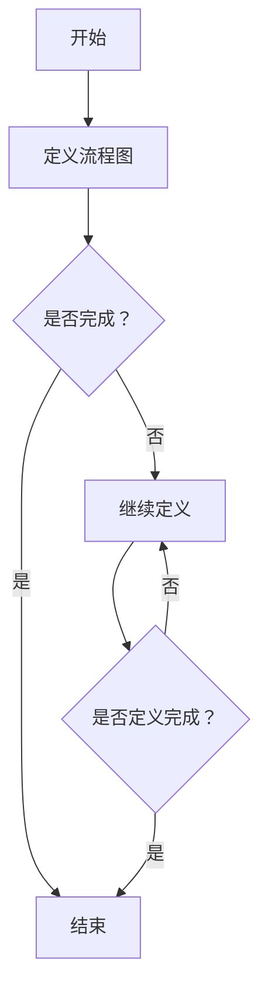

                 


# 大模型技术的标准化进程

> 关键词：大模型技术，标准化，发展历程，原理框架，应用场景，知识产权

> 摘要：本文旨在探讨大模型技术的标准化进程，从背景、原理、框架、应用、知识产权等方面进行分析，旨在为大模型技术的发展提供参考和指导。

### 第一部分: 大模型技术的标准化背景

#### 1.1 大模型技术的发展历程

大模型技术起源于深度学习的快速发展。深度学习是一种基于多层神经网络的结构，通过多层非线性变换来提取数据特征，从而实现高层次的抽象表示。随着计算能力的提升和海量数据资源的积累，深度学习在图像识别、语音识别、自然语言处理等领域的表现逐渐优于传统机器学习算法，引发了人工智能领域的革命。

从最早的浅层神经网络（如感知机、支持向量机等）到深度学习的出现（如卷积神经网络（CNN）、循环神经网络（RNN）等），再到大规模预训练模型（如GPT、BERT等），大模型技术经历了多个阶段的发展。这些模型具有强大的表示能力，能够处理复杂的数据，并取得了显著的性能提升。

#### 1.2 标准化的必要性与意义

随着大模型技术的广泛应用，标准化成为了提高技术水平、促进产业协同发展的重要手段。标准化能够确保大模型技术在各个应用场景中的互操作性、兼容性和可靠性，从而推动人工智能行业的健康发展。

标准化对产业发展具有重要意义。首先，标准化能够降低创新成本，通过共享技术和经验，减少重复性工作，提高研发效率。其次，标准化有助于产业协同发展，通过制定统一的标准，促进不同企业之间的合作与交流，形成良好的产业生态系统。此外，标准化还能够提高产品的质量和安全性，降低市场风险，提升企业的竞争力。

#### 1.3 标准化的国际动态与国内进展

在国际上，各国纷纷加大了对大模型技术标准化的投入。国际标准化组织（ISO）、国际电信联盟（ITU）等组织都在积极制定相关标准。例如，ISO发布了ISO/IEC 29119标准，用于规范人工智能系统的测试和评估。ITU也发布了多项关于人工智能的标准，如ITU-T Y.3211《人工智能开放数据集标准》等。

国内方面，中国也积极推进大模型技术的标准化工作。中国电子标准研究院、中国信息通信研究院等机构发布了多项国家标准和行业标准。例如，中国电子标准研究院发布了《人工智能基础技术标准体系建设指南》，明确了人工智能基础技术标准的体系结构。中国信息通信研究院发布了《人工智能模型安全标准》，规范了人工智能模型的安全要求和评估方法。

### 1.4 大模型技术标准化的核心内容

大模型技术标准化涉及多个方面，包括数据格式、接口定义、算法实现、性能指标等。以下是标准化的核心内容：

#### 1.4.1 数据格式

数据格式标准化是确保大模型在不同平台和应用场景中可互操作的关键。常见的标准包括CSV、JSON、Parquet等。这些数据格式具有统一的编码规则、数据结构，便于数据的存储、传输和解析。

#### 1.4.2 接口定义

接口定义标准化是为了实现不同系统之间的互操作性。常见的标准包括RESTful API、gRPC等。这些接口定义规定了请求和响应的格式、参数传递的方式等，确保不同系统之间的通信顺畅。

#### 1.4.3 算法实现

算法实现标准化是为了确保大模型的性能和可靠性。常见的标准包括算法的精度、效率、可扩展性等。通过制定统一的算法实现标准，可以减少重复开发，提高研发效率。

#### 1.4.4 性能指标

性能指标标准化是为了评估大模型的表现。常见的标准包括准确率、召回率、F1值等。通过制定统一性能指标，可以比较不同模型之间的性能，从而优化模型设计。

### 1.5 大模型技术标准化的影响与挑战

#### 1.5.1 标准化对产业发展的影响

大模型技术标准化对产业发展具有重要影响。首先，标准化有助于降低创新成本，通过共享技术和经验，减少重复性工作，提高研发效率。其次，标准化有助于产业协同发展，通过制定统一的标准，促进不同企业之间的合作与交流，形成良好的产业生态系统。此外，标准化还能够提高产品的质量和安全性，降低市场风险，提升企业的竞争力。

#### 1.5.2 标准化面临的挑战

大模型技术标准化面临诸多挑战。首先，技术复杂性使得标准化工作具有很高的难度。大模型技术涉及多个领域，包括计算机科学、数学、统计学等，需要协调各方利益，制定全面、合理、可操作的标准。其次，利益冲突也是标准化过程中的一大挑战。不同企业、组织之间存在竞争关系，可能对标准的制定和实施产生阻碍。此外，法律法规、政策环境等因素也可能影响标准化的进程。

#### 1.5.3 应对挑战的策略

为了应对标准化面临的挑战，可以采取以下策略：

1. 加强国际合作与交流，借鉴国际先进经验，推动国内标准的国际化。
2. 构建良好的标准生态系统，包括标准制定、推广、实施、评估等环节，确保标准的有效实施。
3. 建立公平、公正、透明的标准化机制，确保各方利益得到平衡。
4. 加强人才培养，提高标准化工作的专业性和技术水平。

### 1.6 总结

大模型技术的标准化是人工智能产业发展的重要支撑。通过标准化，可以提高技术水平、促进产业协同发展、降低创新成本。然而，标准化过程也面临诸多挑战，需要各方共同努力，构建良好的标准生态系统，推动大模型技术的标准化进程。在未来，随着大模型技术的不断发展，标准化工作将越来越重要，为人工智能产业的繁荣发展提供有力保障。

### 第一部分: 大模型技术的标准化背景

#### 1.1 大模型技术的发展历程

大模型技术起源于深度学习的快速发展。深度学习是一种基于多层神经网络的结构，通过多层非线性变换来提取数据特征，从而实现高层次的抽象表示。随着计算能力的提升和海量数据资源的积累，深度学习在图像识别、语音识别、自然语言处理等领域的表现逐渐优于传统机器学习算法，引发了人工智能领域的革命。

从最早的浅层神经网络（如感知机、支持向量机等）到深度学习的出现（如卷积神经网络（CNN）、循环神经网络（RNN）等），再到大规模预训练模型（如GPT、BERT等），大模型技术经历了多个阶段的发展。这些模型具有强大的表示能力，能够处理复杂的数据，并取得了显著的性能提升。

#### 1.2 标准化的必要性与意义

随着大模型技术的广泛应用，标准化成为了提高技术水平、促进产业协同发展的重要手段。标准化能够确保大模型技术在各个应用场景中的互操作性、兼容性和可靠性，从而推动人工智能行业的健康发展。

标准化对产业发展具有重要意义。首先，标准化能够降低创新成本，通过共享技术和经验，减少重复性工作，提高研发效率。其次，标准化有助于产业协同发展，通过制定统一的标准，促进不同企业之间的合作与交流，形成良好的产业生态系统。此外，标准化还能够提高产品的质量和安全性，降低市场风险，提升企业的竞争力。

#### 1.3 标准化的国际动态与国内进展

在国际上，各国纷纷加大了对大模型技术标准化的投入。国际标准化组织（ISO）、国际电信联盟（ITU）等组织都在积极制定相关标准。例如，ISO发布了ISO/IEC 29119标准，用于规范人工智能系统的测试和评估。ITU也发布了多项关于人工智能的标准，如ITU-T Y.3211《人工智能开放数据集标准》等。

国内方面，中国也积极推进大模型技术的标准化工作。中国电子标准研究院、中国信息通信研究院等机构发布了多项国家标准和行业标准。例如，中国电子标准研究院发布了《人工智能基础技术标准体系建设指南》，明确了人工智能基础技术标准的体系结构。中国信息通信研究院发布了《人工智能模型安全标准》，规范了人工智能模型的安全要求和评估方法。

#### 1.4 大模型技术标准化的核心内容

大模型技术标准化涉及多个方面，包括数据格式、接口定义、算法实现、性能指标等。以下是标准化的核心内容：

#### 1.4.1 数据格式

数据格式标准化是确保大模型在不同平台和应用场景中可互操作的关键。常见的标准包括CSV、JSON、Parquet等。这些数据格式具有统一的编码规则、数据结构，便于数据的存储、传输和解析。

#### 1.4.2 接口定义

接口定义标准化是为了实现不同系统之间的互操作性。常见的标准包括RESTful API、gRPC等。这些接口定义规定了请求和响应的格式、参数传递的方式等，确保不同系统之间的通信顺畅。

#### 1.4.3 算法实现

算法实现标准化是为了确保大模型的性能和可靠性。常见的标准包括算法的精度、效率、可扩展性等。通过制定统一的算法实现标准，可以减少重复开发，提高研发效率。

#### 1.4.4 性能指标

性能指标标准化是为了评估大模型的表现。常见的标准包括准确率、召回率、F1值等。通过制定统一性能指标，可以比较不同模型之间的性能，从而优化模型设计。

#### 1.5 大模型技术标准化的影响与挑战

#### 1.5.1 标准化对产业发展的影响

大模型技术标准化对产业发展具有重要影响。首先，标准化有助于降低创新成本，通过共享技术和经验，减少重复性工作，提高研发效率。其次，标准化有助于产业协同发展，通过制定统一的标准，促进不同企业之间的合作与交流，形成良好的产业生态系统。此外，标准化还能够提高产品的质量和安全性，降低市场风险，提升企业的竞争力。

#### 1.5.2 标准化面临的挑战

大模型技术标准化面临诸多挑战。首先，技术复杂性使得标准化工作具有很高的难度。大模型技术涉及多个领域，包括计算机科学、数学、统计学等，需要协调各方利益，制定全面、合理、可操作的标准。其次，利益冲突也是标准化过程中的一大挑战。不同企业、组织之间存在竞争关系，可能对标准的制定和实施产生阻碍。此外，法律法规、政策环境等因素也可能影响标准化的进程。

#### 1.5.3 应对挑战的策略

为了应对标准化面临的挑战，可以采取以下策略：

1. 加强国际合作与交流，借鉴国际先进经验，推动国内标准的国际化。
2. 构建良好的标准生态系统，包括标准制定、推广、实施、评估等环节，确保标准的有效实施。
3. 建立公平、公正、透明的标准化机制，确保各方利益得到平衡。
4. 加强人才培养，提高标准化工作的专业性和技术水平。

#### 1.6 总结

大模型技术的标准化是人工智能产业发展的重要支撑。通过标准化，可以提高技术水平、促进产业协同发展、降低创新成本。然而，标准化过程也面临诸多挑战，需要各方共同努力，构建良好的标准生态系统，推动大模型技术的标准化进程。在未来，随着大模型技术的不断发展，标准化工作将越来越重要，为人工智能产业的繁荣发展提供有力保障。

### 第2章: 大模型技术标准化原理与框架

#### 2.1 大模型技术标准化原理

大模型技术标准化原理是指在大模型技术领域，为了确保互操作性、兼容性和可靠性，采用的一系列标准化方法和原则。以下是几个关键原理：

##### 2.1.1 一致性

一致性原则要求大模型技术的各个组件、接口和实现遵循统一的标准。这有助于确保不同系统之间能够无缝地交互和协作，提高系统的整体效率。

##### 2.1.2 可扩展性

可扩展性原则要求大模型技术标准能够适应未来技术的发展和变化。随着技术的进步，标准应当允许引入新的功能、算法和架构，以保持其适用性和前瞻性。

##### 2.1.3 可维护性

可维护性原则强调大模型技术标准应易于维护和更新。这包括标准的文档化、版本控制和变更管理，以确保标准在长期内保持有效性和一致性。

##### 2.1.4 可靠性

可靠性原则要求大模型技术标准能够保证系统的稳定运行和数据的准确传输。通过严格的测试和验证，确保标准在大规模应用中能够达到预期的性能和安全性。

##### 2.1.5 可用性

可用性原则关注大模型技术标准的易用性和用户体验。标准应当设计得简洁直观，使得开发者、用户和操作者能够轻松地理解和使用。

#### 2.2 大模型技术标准化框架

大模型技术标准化框架是指一套系统化的方法和流程，用于制定、推广和实施大模型技术标准。以下是标准化框架的关键组成部分：

##### 2.2.1 标准制定

标准制定是标准化框架的核心环节。它包括需求分析、方案设计、标准起草、标准评审和标准发布等步骤。在这个过程中，需要广泛征集各方意见，确保标准的全面性和可行性。

**需求分析**：识别和收集用户需求，确定标准制定的优先级。

**方案设计**：根据需求分析结果，设计标准的技术方案。

**标准起草**：撰写标准文档，包括技术要求、实现指南和测试方法。

**标准评审**：组织专家对标准文档进行评审，确保标准的科学性、合理性和可操作性。

**标准发布**：将评审通过的标准正式发布，供相关方实施和使用。

##### 2.2.2 标准推广

标准推广是指通过各种渠道和方式，将制定好的标准传播给广大用户和开发者。推广活动包括标准宣传、培训、演示和推广活动等。

**标准宣传**：通过媒体、会议、展览等方式，提高标准的社会认知度和影响力。

**培训**：组织培训课程，帮助开发者掌握标准的知识和技能。

**演示**：通过实际案例和演示，展示标准在实际应用中的效果和优势。

**推广活动**：举办标准推广活动，促进标准的广泛应用和实施。

##### 2.2.3 标准实施

标准实施是指将标准应用于实际场景，确保标准在大规模应用中能够达到预期效果。实施过程包括标准采纳、实施准备、实施执行和效果评估等步骤。

**标准采纳**：相关方根据自身需求和实际情况，决定采纳哪些标准。

**实施准备**：制定实施计划，包括资源准备、人员培训和技术准备等。

**实施执行**：按照实施计划，逐步推进标准实施工作。

**效果评估**：评估标准实施的效果，包括性能、成本、安全性等方面。

##### 2.2.4 标准更新与维护

标准更新与维护是指定期对标准进行审查和更新，确保其与最新技术和应用需求保持一致。这个过程包括标准复审、修订和发布等步骤。

**标准复审**：定期对标准进行复审，评估其适用性和有效性。

**修订**：根据复审结果，对标准进行修订和改进。

**发布**：将修订后的标准正式发布，供相关方使用。

#### 2.3 大模型技术标准化的实现过程

大模型技术标准化的实现过程包括从标准制定到标准实施的各个环节。以下是实现过程的详细步骤：

##### 2.3.1 需求分析

**步骤1：识别需求**：收集和分析各方意见，确定标准制定的优先级。

**步骤2：需求文档**：编写需求文档，明确标准的范围、目标和预期效果。

##### 2.3.2 方案设计

**步骤1：方案选择**：根据需求文档，设计多种技术方案。

**步骤2：方案评估**：评估各种方案的技术可行性、成本和风险。

**步骤3：方案选型**：选择最优方案，作为标准制定的基础。

##### 2.3.3 标准起草

**步骤1：标准框架**：制定标准的基本框架，包括章节结构、术语定义等。

**步骤2：技术要求**：撰写标准的技术要求部分，详细描述技术规范。

**步骤3：实现指南**：编写标准实现指南，帮助开发者理解和使用标准。

**步骤4：测试方法**：定义标准测试方法，确保标准的可验证性。

##### 2.3.4 标准评审

**步骤1：内部评审**：组织内部评审团队，对标准文档进行审查和反馈。

**步骤2：外部评审**：邀请外部专家和利益相关方对标准文档进行评审。

**步骤3：修改与完善**：根据评审意见，对标准文档进行修改和完善。

##### 2.3.5 标准发布

**步骤1：发布草案**：发布标准草案，征求公众意见。

**步骤2：发布正式版本**：经过修改和完善后，发布正式标准版本。

##### 2.3.6 标准推广

**步骤1：标准宣传**：通过各种渠道宣传标准，提高知名度。

**步骤2：培训与支持**：组织培训课程，提供技术支持，帮助用户掌握标准。

**步骤3：推广活动**：举办推广活动，促进标准的广泛应用。

##### 2.3.7 标准实施

**步骤1：标准采纳**：相关方根据实际需求，决定采纳哪些标准。

**步骤2：实施准备**：制定实施计划，包括资源准备、人员培训和技术准备等。

**步骤3：实施执行**：按照实施计划，逐步推进标准实施工作。

**步骤4：效果评估**：评估标准实施的效果，包括性能、成本、安全性等方面。

##### 2.3.8 标准更新与维护

**步骤1：标准复审**：定期对标准进行复审，评估其适用性和有效性。

**步骤2：修订与发布**：根据复审结果，对标准进行修订和发布。

#### 2.4 大模型技术标准化案例分析

##### 2.4.1 案例一：国际人工智能标准化组织

国际人工智能标准化组织（ISO/IEC JTC1/SC42）是一个致力于人工智能标准化工作的国际机构。该组织制定了多个与人工智能相关的国际标准，如ISO/IEC 29119《人工智能系统的测试和评估标准》。

**标准制定过程**：

1. 需求分析：识别人工智能测试和评估的需求，明确标准的范围和目标。
2. 方案设计：设计标准的技术方案，包括测试方法、评估指标等。
3. 标准起草：撰写标准文档，详细描述技术规范和实现指南。
4. 标准评审：组织专家对标准文档进行评审，确保标准的科学性和可操作性。
5. 标准发布：发布标准文档，供全球相关方使用。

**标准推广**：

1. 标准宣传：通过国际会议、研讨会等渠道宣传标准，提高知名度。
2. 培训与支持：提供在线培训课程和文档，帮助用户理解和使用标准。
3. 推广活动：组织国际推广活动，促进标准的广泛应用。

**标准实施**：

1. 标准采纳：全球各地的人工智能研究机构、企业、政府等根据实际需求，决定采纳哪些标准。
2. 实施准备：制定实施计划，包括资源准备、人员培训和技术准备等。
3. 实施执行：按照实施计划，逐步推进标准实施工作。
4. 效果评估：评估标准实施的效果，包括性能、成本、安全性等方面。

##### 2.4.2 案例二：中国电子标准研究院

中国电子标准研究院是中国电子行业的重要标准化机构，致力于推动人工智能标准化工作。该研究院发布了多个与人工智能相关的国家标准和行业标准，如《人工智能基础技术标准体系建设指南》。

**标准制定过程**：

1. 需求分析：识别人工智能领域的技术需求和标准缺失点，明确标准的范围和目标。
2. 方案设计：设计标准的技术方案，包括术语定义、技术要求等。
3. 标准起草：撰写标准文档，详细描述技术规范和实现指南。
4. 标准评审：组织专家对标准文档进行评审，确保标准的科学性和可操作性。
5. 标准发布：发布标准文档，供国内相关方使用。

**标准推广**：

1. 标准宣传：通过国内会议、展览等渠道宣传标准，提高知名度。
2. 培训与支持：提供在线培训课程和文档，帮助用户理解和使用标准。
3. 推广活动：组织国内推广活动，促进标准的广泛应用。

**标准实施**：

1. 标准采纳：国内各地的人工智能研究机构、企业、政府等根据实际需求，决定采纳哪些标准。
2. 实施准备：制定实施计划，包括资源准备、人员培训和技术准备等。
3. 实施执行：按照实施计划，逐步推进标准实施工作。
4. 效果评估：评估标准实施的效果，包括性能、成本、安全性等方面。

##### 2.4.3 案例三：大模型技术开源社区

大模型技术开源社区是一个由全球开发者组成的平台，致力于推动大模型技术的标准化和开源发展。该社区制定了多个与大规模预训练模型相关的开源标准，如TensorFlow、PyTorch等。

**标准制定过程**：

1. 需求分析：识别大模型技术领域的技术需求和开源缺失点，明确标准的范围和目标。
2. 方案设计：设计标准的技术方案，包括数据格式、接口定义等。
3. 标准起草：撰写标准文档，详细描述技术规范和实现指南。
4. 标准评审：组织社区成员对标准文档进行评审，确保标准的科学性和可操作性。
5. 标准发布：发布标准文档，供全球相关方使用。

**标准推广**：

1. 标准宣传：通过社区网站、社交媒体等渠道宣传标准，提高知名度。
2. 培训与支持：提供在线培训课程和文档，帮助用户理解和使用标准。
3. 推广活动：组织社区活动，促进标准的广泛应用。

**标准实施**：

1. 标准采纳：全球各地的开发者根据实际需求，决定采纳哪些标准。
2. 实施准备：制定实施计划，包括资源准备、人员培训和技术准备等。
3. 实施执行：按照实施计划，逐步推进标准实施工作。
4. 效果评估：评估标准实施的效果，包括性能、成本、安全性等方面。

### 2.5 大模型技术标准化的重要性

大模型技术标准化对人工智能产业发展具有重要意义。首先，标准化有助于降低创新成本，通过共享技术和经验，减少重复性工作，提高研发效率。其次，标准化有助于产业协同发展，通过制定统一的标准，促进不同企业之间的合作与交流，形成良好的产业生态系统。此外，标准化还能够提高产品的质量和安全性，降低市场风险，提升企业的竞争力。

### 2.6 总结

大模型技术标准化是人工智能产业发展的重要支撑。通过标准化，可以提高技术水平、促进产业协同发展、降低创新成本。然而，标准化过程也面临诸多挑战，需要各方共同努力，构建良好的标准生态系统，推动大模型技术的标准化进程。在未来，随着大模型技术的不断发展，标准化工作将越来越重要，为人工智能产业的繁荣发展提供有力保障。

### 第3章: 大模型技术标准化应用场景与趋势

#### 3.1 大模型技术标准化应用场景

大模型技术标准化在多个领域有着广泛的应用，以下是几个主要的应用场景：

##### 3.1.1 人工智能行业应用

人工智能行业是大模型技术标准化的主要应用领域之一。在人工智能领域，标准化有助于提高模型的互操作性、兼容性和可靠性。例如，在自然语言处理（NLP）领域，标准的文本数据格式和接口定义有助于不同模型之间的数据交换和协同工作。在计算机视觉领域，标准化的图像处理算法和性能指标可以确保不同模型的评估结果具有可比性。

**案例**：BERT（Bidirectional Encoder Representations from Transformers）是自然语言处理领域的一个大型预训练模型，其标准化接口和数据处理格式使得不同平台和应用场景中的模型可以相互协作，从而提高整体的性能和效果。

##### 3.1.2 云计算与边缘计算

随着云计算和边缘计算的发展，大模型技术标准化在分布式计算环境中发挥着重要作用。在云计算领域，标准化有助于实现不同云平台之间的数据交换和模型部署。例如，通过标准化接口和协议，用户可以在不同云平台上部署和使用相同的大模型，从而提高灵活性和可移植性。在边缘计算领域，标准化有助于实现边缘设备与云端的协同工作，提高实时响应能力。

**案例**：TensorFlow Serving是一个开源的机器学习模型服务器，它支持不同平台之间的模型部署和调用。通过TensorFlow Serving，开发者可以在云端和边缘设备上部署相同的模型，实现分布式计算和协同工作。

##### 3.1.3 物联网与智能硬件

物联网（IoT）和智能硬件领域是大模型技术标准化的另一个重要应用场景。在物联网领域，标准化有助于实现不同设备和系统之间的数据共享和协同工作。例如，通过标准化接口和数据格式，不同物联网设备可以交换数据，实现智能化的管理和控制。在智能硬件领域，标准化有助于确保硬件设备与软件系统的兼容性，提高用户体验和可靠性。

**案例**：智能家居系统中的智能音箱、智能灯泡等设备，通过标准化接口和数据格式，可以实现远程控制和智能交互，提高家居智能化的水平。

##### 3.1.4 自动驾驶与智能交通

自动驾驶和智能交通领域是大模型技术标准化的重要应用场景之一。在自动驾驶领域，标准化有助于实现不同车载系统之间的数据共享和协同工作，提高自动驾驶的安全性和可靠性。在智能交通领域，标准化有助于实现交通数据的高效传输和处理，提高交通管理和调度能力。

**案例**：自动驾驶汽车中的传感器数据、定位数据等，通过标准化接口和数据格式，可以实现与其他车载系统和交通基础设施的互联互通，从而提高自动驾驶的安全性和智能化水平。

##### 3.1.5 智能医疗与健康保健

智能医疗和健康保健领域是大模型技术标准化的新兴应用场景。在智能医疗领域，标准化有助于实现医疗数据的共享和协同分析，提高医疗服务的质量和效率。在健康保健领域，标准化有助于实现健康数据的监测和管理，提高健康管理的智能化水平。

**案例**：通过标准化接口和数据格式，医生可以方便地获取和共享患者的健康数据，实现跨机构、跨地域的医疗协作和诊断，从而提高医疗服务的效果。

#### 3.2 大模型技术标准化发展趋势

随着人工智能技术的不断进步，大模型技术标准化也呈现出一些新的发展趋势：

##### 3.2.1 多模态数据处理

随着计算机视觉、语音识别、自然语言处理等技术的发展，多模态数据处理成为大模型技术标准化的重要方向。多模态数据处理旨在将不同类型的数据（如文本、图像、语音等）进行整合，从而提高模型的泛化和表达能力。

**案例**：OpenAI开发的GPT-3模型支持多种输入和输出模式，包括文本、图像和视频等，通过多模态数据处理，实现了更高级的语义理解和生成能力。

##### 3.2.2 自动化与智能化

随着自动化和智能化技术的发展，大模型技术标准化也将朝着自动化和智能化的方向迈进。通过自动化工具和智能算法，可以简化标准制定和实施过程，提高标准化工作的效率和质量。

**案例**：一些开源标准化工具和平台（如OpenAPI、Swagger等）提供了自动化的标准生成和验证功能，使得开发者可以更轻松地实现标准化的接口和数据格式。

##### 3.2.3 开放合作与共享

在全球化背景下，开放合作与共享成为大模型技术标准化的重要趋势。通过国际合作和共享技术，可以加速标准的制定和推广，促进全球范围内的技术交流和产业合作。

**案例**：国际标准化组织（ISO）和国际电信联盟（ITU）等国际组织积极推动大模型技术标准化工作，通过国际合作，制定了多项具有国际影响力的标准。

##### 3.2.4 法规与政策支持

随着人工智能技术的应用日益广泛，法规和政策支持成为大模型技术标准化的重要保障。通过制定和实施相关法规和政策，可以规范人工智能的发展，保障标准化工作的顺利进行。

**案例**：欧盟制定了《人工智能法案》，明确了人工智能的伦理标准和监管要求，为人工智能标准化工作提供了政策支持。

#### 3.3 大模型技术标准化的重要性

大模型技术标准化在人工智能产业发展中具有重要地位，具体体现在以下几个方面：

1. **提高技术水平**：标准化有助于规范技术发展，提高大模型技术的整体水平，促进技术创新和进步。
2. **促进产业协同**：标准化有助于不同企业、组织之间的技术交流和合作，推动产业协同发展，形成良好的产业生态系统。
3. **降低创新成本**：标准化可以减少重复性工作，提高研发效率，降低创新成本，促进技术普及和应用。
4. **保障数据安全**：标准化有助于保障数据的安全性和隐私性，提高大模型技术的可信度和可靠性。
5. **提升竞争力**：标准化可以提升企业的技术水平和产品质量，增强企业的竞争力，推动产业升级和转型。

#### 3.4 总结

大模型技术标准化在人工智能产业发展中具有重要作用，通过标准化，可以提高技术水平、促进产业协同发展、降低创新成本、保障数据安全、提升竞争力。随着人工智能技术的不断进步，大模型技术标准化也将朝着多模态数据处理、自动化与智能化、开放合作与共享、法规与政策支持等方向发展。未来，大模型技术标准化将为人工智能产业的繁荣发展提供有力保障。

### 第4章: 大模型技术标准化的发展战略

#### 4.1 企业参与标准化策略

企业在人工智能领域的发展离不开标准化，参与标准化工作对企业具有重要意义。以下是一些企业参与标准化的策略：

##### 4.1.1 提出标准需求

企业可以通过市场调研、技术趋势分析等方式，识别出在人工智能领域存在的标准需求。例如，在数据格式、接口定义、算法实现等方面，企业可以提出具体的标准化建议，推动相关标准的制定。

##### 4.1.2 参与标准制定

企业可以通过加入国际标准化组织、国内标准化组织等，积极参与标准的制定和评审工作。在标准制定过程中，企业可以发挥自身技术优势和经验，为标准的科学性和可操作性提供支持。

##### 4.1.3 提供技术支持

企业可以提供技术支持，包括标准草案的编写、测试用例的提供等。通过技术支持，企业可以确保标准能够真正满足实际应用需求，提高标准的实用性和可操作性。

##### 4.1.4 标准化培训与推广

企业可以组织标准化培训课程，提高员工对标准化工作的认识和技能。同时，企业可以通过内部宣传、合作伙伴推广等方式，推动标准在企业内部和产业链中的应用。

##### 4.1.5 积极参与国际合作

企业可以通过参与国际标准化组织、国际合作项目等方式，积极参与国际标准的制定和推广。通过国际合作，企业可以了解全球标准化动态，借鉴国际先进经验，提升自身标准化水平。

#### 4.2 政府与行业组织推动策略

政府与行业组织在推动大模型技术标准化过程中扮演着重要角色。以下是一些推动策略：

##### 4.2.1 制定相关政策

政府可以通过制定相关政策，鼓励和引导企业参与标准化工作。例如，政府可以出台扶持政策，对参与标准制定的企业给予资金补贴或税收优惠。

##### 4.2.2 建立标准化组织

政府可以支持和推动建立国家级或行业级的标准化组织，为标准的制定、推广和实施提供平台。这些标准化组织可以协调各方利益，推动标准的制定和实施。

##### 4.2.3 加强国际合作

政府可以通过参与国际标准化组织、签订国际合作协议等方式，加强与国际标准化机构的合作，推动大模型技术标准的国际化。

##### 4.2.4 制定技术路线图

政府可以组织行业专家，制定大模型技术标准化的技术路线图，明确未来发展的方向和目标。技术路线图可以为标准化工作提供指导，确保标准化进程有序进行。

##### 4.2.5 加强标准化培训

政府可以组织标准化培训课程，提高企业和行业从业者的标准化意识和能力。通过培训，可以提高标准化工作的专业性和技术水平。

#### 4.3 知识产权与标准化协调策略

知识产权保护在大模型技术标准化中具有重要地位，以下是一些协调策略：

##### 4.3.1 知识产权布局

企业可以通过专利布局、技术秘密保护等方式，加强对自身知识产权的保护。在标准制定过程中，企业可以主动提出知识产权保护的要求，确保标准的公平性和可操作性。

##### 4.3.2 知识产权披露

企业应主动披露自身知识产权信息，包括专利、技术秘密等，以便在标准制定过程中进行公平评估和协调。

##### 4.3.3 知识产权许可

在标准制定过程中，涉及知识产权的部分，企业可以采取知识产权许可的方式，确保标准的实施和推广。例如，采用FRAND（公平、无歧视、合理和非歧视性）原则，为标准实施提供必要的知识产权许可。

##### 4.3.4 国际合作与协调

在国际标准化过程中，企业可以通过国际合作和协调，解决知识产权争议，确保标准的国际化进程顺利进行。

##### 4.3.5 加强知识产权保护意识

政府、企业和行业组织应加强知识产权保护意识，建立健全知识产权保护机制，确保大模型技术标准化工作的顺利进行。

#### 4.4 总结

大模型技术标准化的发展战略涉及企业参与、政府与行业组织推动以及知识产权保护等多个方面。通过制定相关政策、建立标准化组织、加强国际合作和知识产权布局等策略，可以推动大模型技术标准化工作的顺利进行。在未来，随着人工智能技术的不断发展，大模型技术标准化将为人工智能产业的繁荣发展提供有力保障。

### 第5章: 大模型技术标准化实施与合规

#### 5.1 大模型技术标准化实施流程

大模型技术标准化实施是指将标准化成果应用于实际场景，确保标准在大规模应用中能够达到预期效果的过程。以下是标准化的实施流程：

##### 5.1.1 实施前的准备工作

在实施标准化之前，需要进行充分的准备工作。主要包括以下几个方面：

1. **标准选择**：根据实际需求，选择合适的标准。标准的选择应当考虑其适用性、权威性和可靠性。
2. **资源准备**：准备实施标准所需的资源和设备，包括人员、资金、技术等。
3. **培训与指导**：组织相关人员参加标准培训，使其熟悉标准的内容和要求，确保实施过程中的正确性和规范性。
4. **评估与规划**：评估标准实施的影响和效果，制定详细的实施计划和进度安排。

##### 5.1.2 实施过程中的关键环节

在实施过程中，需要关注以下几个关键环节：

1. **标准推广**：通过各种渠道和方式，如会议、讲座、宣传材料等，推广标准化成果，提高相关人员的认知度和接受度。
2. **标准化培训**：针对不同层次的员工，开展分层次的标准化培训，确保全体员工都能掌握标准要求。
3. **技术验证**：对实施标准的技术方案进行验证，确保其符合标准要求，并通过实验、测试等方式验证其有效性和可靠性。
4. **系统集成**：将标准化成果与现有系统进行集成，确保各系统之间的无缝对接和协同工作。
5. **持续改进**：在实施过程中，根据反馈和评估结果，不断优化和改进标准化成果，确保其持续符合实际需求。

##### 5.1.3 实施后的评估与改进

在标准实施完成后，需要进行评估和改进。主要步骤包括：

1. **效果评估**：对标准实施的效果进行评估，包括性能、成本、安全性、用户体验等方面。
2. **问题反馈**：收集用户和员工的反馈意见，了解标准实施过程中存在的问题和不足。
3. **改进措施**：根据评估结果和反馈意见，制定改进措施，优化标准实施的效果。
4. **持续跟踪**：对改进措施的实施效果进行跟踪和评估，确保改进措施的有效性和持续性。

#### 5.2 大模型技术标准化合规

大模型技术标准化合规是指在大模型技术标准化的过程中，遵守相关法律法规、政策要求和技术规范，确保标准化工作合法、合规、有效。以下是合规方面的几个关键点：

##### 5.2.1 合规的意义与要求

合规在大模型技术标准化中具有重要意义。首先，合规是确保标准化工作合法性的基础，遵守相关法律法规和政策要求，可以避免法律风险。其次，合规有助于提高标准化工作的质量和效果，确保标准符合实际需求和技术发展趋势。最后，合规有助于增强企业的竞争力和市场认可度，提升企业在行业中的地位和影响力。

合规的要求包括以下几个方面：

1. **遵守法律法规**：遵守国家相关法律法规，如《中华人民共和国标准化法》、《中华人民共和国网络安全法》等。
2. **遵循技术规范**：遵守相关技术规范和标准，如ISO、ITU等国际标准，以及国内相关的国家标准、行业标准等。
3. **保护知识产权**：在标准化过程中，要尊重和保护知识产权，包括专利、商标、版权等。
4. **确保数据安全**：遵守数据安全法律法规，确保数据的安全性和隐私性。

##### 5.2.2 合规实施的方法与技巧

为了确保大模型技术标准化合规，可以采取以下方法和技巧：

1. **建立健全合规体系**：建立完善的合规管理制度，明确合规责任和流程，确保标准化工作的合规性。
2. **定期合规培训**：定期组织合规培训，提高员工的合规意识和能力，确保员工在标准化工作中能够遵守相关法律法规和技术规范。
3. **合规审查与评估**：对标准化过程和成果进行合规审查和评估，确保其符合法律法规、技术规范和标准要求。
4. **合规风险管理**：识别和评估合规风险，制定风险应对措施，确保标准化工作的合规性和安全性。
5. **合规监控与报告**：建立合规监控机制，定期报告合规情况，确保合规工作的透明性和可追溯性。

##### 5.2.3 合规风险防范与应对策略

在大模型技术标准化过程中，可能会面临一些合规风险，如法律风险、技术风险、数据风险等。以下是一些防范和应对策略：

1. **法律风险防范**：了解和掌握相关法律法规和政策要求，确保标准化工作符合法律要求。在签订相关合同时，明确合规责任和义务，降低法律风险。
2. **技术风险防范**：在标准化过程中，采用成熟的技术和标准，确保技术方案符合技术规范和要求。定期对技术方案进行审查和评估，及时发现和解决潜在的技术风险。
3. **数据风险防范**：在数据处理和传输过程中，采取有效的数据保护措施，确保数据的安全性和隐私性。建立健全的数据管理制度，定期对数据安全进行评估和改进。
4. **应对策略**：制定合规风险应对策略，包括风险识别、评估、监控和应对措施。在发现合规问题时，及时采取措施进行纠正和整改。

##### 5.2.4 大模型技术标准化合规案例分析

以下是一些大模型技术标准化合规的案例：

1. **案例一：某企业的大模型标准化实践**：某企业在大模型技术标准化过程中，制定了详细的合规管理流程和制度，定期对标准化过程和成果进行合规审查和评估，确保标准化工作的合规性。同时，该企业还建立了合规培训体系，提高员工的合规意识和能力。

2. **案例二：某行业的大模型标准化推进**：某行业在推进大模型技术标准化过程中，成立了行业标准化组织，制定了行业标准和规范，确保标准化工作的合规性和权威性。同时，该行业还积极开展国际合作和交流，借鉴国际先进经验，提高自身的标准化水平。

#### 5.3 大模型技术标准化合规的重要性

大模型技术标准化合规对人工智能产业发展具有重要意义。首先，合规有助于确保标准化工作的合法性和有效性，降低法律风险和合规成本。其次，合规有助于提高标准化工作的质量和效果，确保标准符合实际需求和技术发展趋势。最后，合规有助于增强企业的竞争力和市场认可度，提升企业在行业中的地位和影响力。

### 5.4 总结

大模型技术标准化实施与合规是确保标准化工作顺利进行的重要环节。通过建立健全的合规体系、定期进行合规培训和评估、识别和防范合规风险等，可以确保标准化工作的合法性和有效性。同时，加强合规管理，有助于提高标准化工作的质量和效果，促进人工智能产业的健康发展。

### 第6章: 大模型技术标准化与知识产权

#### 6.1 大模型技术标准化与知识产权的关系

在大模型技术标准化过程中，知识产权保护具有至关重要的地位。知识产权包括专利、商标、版权和商业秘密等，是企业在技术创新和市场竞争中的核心资产。大模型技术标准化与知识产权的关系主要体现在以下几个方面：

##### 6.1.1 知识产权保护的重要性

知识产权保护有助于鼓励技术创新，保障企业在市场竞争中的合法权益。在大模型技术标准化过程中，知识产权保护能够确保标准制定和实施的公平性、公正性，防止技术抄袭和侵权行为。同时，知识产权保护有助于提高标准的质量和实用性，促进技术的推广和应用。

##### 6.1.2 大模型技术标准化的知识产权问题

大模型技术标准化过程中可能面临一些知识产权问题，主要包括：

1. **专利侵权**：在标准制定和实施过程中，可能会涉及他人的专利技术，存在专利侵权风险。
2. **技术秘密泄露**：大模型技术通常包含大量的技术秘密，标准化过程中可能存在技术秘密泄露的风险。
3. **标准必要专利（SEPs）**：标准必要专利是标准制定过程中必须考虑的重要因素，如何合理利用和分配标准必要专利是标准化过程中的一大挑战。

##### 6.1.3 知识产权保护在大模型标准化中的作用

知识产权保护在大模型技术标准化中发挥着重要作用，具体包括：

1. **促进技术共享**：通过知识产权保护，企业可以放心地分享其核心技术，促进技术共享和合作，推动技术进步。
2. **确保公平竞争**：知识产权保护有助于确保市场竞争的公平性，防止垄断行为，促进产业健康发展。
3. **提高标准质量**：知识产权保护有助于筛选和利用优质的技术，提高标准的质量和实用性。

#### 6.2 大模型技术标准化知识产权策略

在大模型技术标准化过程中，企业可以采取一系列知识产权策略，以确保知识产权的保护和利用。以下是几个关键策略：

##### 6.2.1 知识产权布局

知识产权布局是指企业在技术领域进行专利申请、商标注册、版权登记等知识产权保护活动。合理的知识产权布局有助于保护企业的核心技术，提高市场竞争力和标准化的成功率。

1. **专利布局**：企业应针对核心技术进行专利申请，确保专利覆盖范围全面，提高专利的可靠性和稳定性。
2. **商标布局**：企业应注册相关商标，保护品牌形象和市场声誉。
3. **版权布局**：企业应登记软件版权，保护软件作品的原创性和商业价值。

##### 6.2.2 知识产权维权策略

知识产权维权策略是指企业在遇到知识产权纠纷时，采取的法律和技术手段。有效的维权策略有助于保护企业的合法权益，维护市场竞争秩序。

1. **法律维权**：企业应建立知识产权法律顾问团队，及时应对专利侵权、商标侵权等法律纠纷。
2. **技术维权**：企业可以采用技术手段，如加密技术、数字签名等，保护技术秘密和软件作品的完整性。
3. **国际合作**：企业应积极参与国际知识产权合作，借鉴国际经验，提高知识产权维权能力。

##### 6.2.3 知识产权保护与标准化协调策略

知识产权保护与标准化协调策略是指企业如何在标准化过程中，平衡知识产权保护和标准化的需求。以下是几个关键策略：

1. **标准必要专利（SEPs）管理**：企业应建立标准必要专利管理制度，合理分配标准必要专利的使用权，确保标准实施的公平性。
2. **知识产权披露**：企业应主动披露自身知识产权信息，包括专利、商标、版权等，确保标准制定过程的透明性和公正性。
3. **知识产权许可**：在标准制定和实施过程中，企业可以采取知识产权许可的方式，确保技术的推广和应用。

#### 6.3 大模型技术标准化知识产权案例分析

以下是大模型技术标准化过程中的一些知识产权案例：

##### 6.3.1 案例一：某大型科技企业的知识产权保护

某大型科技企业在推进大模型技术标准化过程中，采取了以下知识产权保护措施：

1. **专利布局**：企业在全球范围内申请了大量与人工智能技术相关的专利，形成了专利组合，提高了专利的可靠性和稳定性。
2. **技术秘密保护**：企业采用加密技术、数字签名等技术手段，保护技术秘密的完整性。
3. **知识产权披露**：企业在标准制定过程中，主动披露了相关专利信息，确保了标准制定过程的透明性和公正性。
4. **知识产权许可**：企业通过知识产权许可的方式，推广和应用了其核心技术，促进了技术的普及和标准化。

##### 6.3.2 案例二：某国际大模型技术标准制定过程中的知识产权争议处理

在某个国际大模型技术标准制定过程中，涉及到多个企业的知识产权，出现了一些争议。以下是一些建议的争议处理方法：

1. **协调与谈判**：相关企业可以通过协调和谈判，达成知识产权许可协议，确保标准的制定和实施。
2. **第三方评估**：可以邀请独立的第三方机构对知识产权进行评估，确定其价值和贡献，作为协商的基础。
3. **法律诉讼**：在必要时，可以采取法律诉讼的方式，维护企业的合法权益。

#### 6.4 大模型技术标准化知识产权的重要性

大模型技术标准化知识产权保护对于技术创新、产业发展具有重要意义。首先，知识产权保护能够激励技术创新，提高企业的核心竞争力。其次，知识产权保护有助于确保标准制定和实施的公平性、公正性，促进技术共享和合作。最后，知识产权保护有助于提高标准的质量和实用性，推动技术的普及和应用。

### 6.5 总结

大模型技术标准化与知识产权保护密切相关，知识产权保护在大模型技术标准化过程中具有重要地位。通过合理的知识产权布局、维权策略和协调策略，企业可以确保知识产权的保护和利用，促进大模型技术标准化工作的顺利进行。在未来，随着人工智能技术的不断发展，大模型技术标准化与知识产权保护将发挥更加重要的作用。

### 第7章: 大模型技术标准化前景与展望

#### 7.1 大模型技术标准化前景

随着人工智能技术的迅猛发展，大模型技术标准化前景广阔。以下是几个方面的前景展望：

##### 7.1.1 产业发展前景

人工智能产业作为全球新兴战略产业，正处于快速发展的阶段。大模型技术作为人工智能的核心技术之一，将在未来的产业发展中扮演关键角色。随着大模型技术的不断进步，预计将出现更多具有高精度、高效率、强泛化能力的大模型，推动各行业的智能化转型。

##### 7.1.2 技术发展趋势

未来，大模型技术将朝着多模态、自动化、智能化等方向发展。多模态大模型能够处理多种类型的数据（如文本、图像、音频等），实现更高级的语义理解和生成能力。自动化与智能化技术的应用将简化大模型技术的标准化过程，提高标准化工作的效率和质量。

##### 7.1.3 应用前景展望

大模型技术将在多个领域得到广泛应用，包括但不限于：

1. **智能医疗**：通过大模型技术，实现精准医疗、智能诊断和个性化治疗。
2. **智能金融**：利用大模型技术进行风险评估、信用评估和智能投顾。
3. **智能交通**：实现自动驾驶、智能交通管理和智能物流。
4. **智能教育**：提供个性化教育服务、智能评测和智能教学辅助。
5. **智能安防**：实现智能监控、智能报警和智能防范。

#### 7.2 大模型技术标准化展望

随着人工智能技术的快速发展，大模型技术标准化也面临着新的机遇和挑战。以下是几个方面的展望：

##### 7.2.1 国际合作与竞争

在国际层面，各国都在积极推进大模型技术标准化工作，以争夺国际标准话语权。未来，国际间的合作与竞争将更加激烈，各国需要加强合作，共同推动大模型技术标准的国际化。

##### 7.2.2 政策环境与市场机遇

政策环境对于大模型技术标准化具有重要影响。各国政府需要制定支持标准化发展的政策，如资金支持、税收优惠等，以鼓励企业积极参与标准化工作。同时，市场机遇也将推动标准化工作的快速发展。

##### 7.2.3 未来发展方向与挑战

未来，大模型技术标准化将面临以下发展方向与挑战：

1. **标准化体系的完善**：构建更加完善、系统的大模型技术标准化体系，提高标准的科学性、合理性和可操作性。
2. **技术创新与标准化**：推动技术创新与标准化的协调发展，确保标准化工作紧跟技术发展趋势。
3. **知识产权保护**：加强知识产权保护，确保标准制定和实施的公平性、公正性，促进技术的普及和应用。
4. **标准推广与实施**：提高标准推广和实施的效率，确保标准在实际应用中的有效性和实用性。

#### 7.3 大模型技术标准化的发展路径

为了推动大模型技术标准化工作，需要采取以下发展路径：

##### 7.3.1 企业参与路径

1. **积极提出标准需求**：企业应根据自身技术优势和市场需求，积极提出标准需求，参与标准制定。
2. **加强标准化人才培养**：企业应加强标准化人才的培养，提高员工的标准意识和技能水平。
3. **积极参与标准推广与实施**：企业应积极参与标准的推广与实施，推动标准在企业内部的落地应用。

##### 7.3.2 政府与行业组织推动路径

1. **制定支持政策**：政府应制定支持大模型技术标准化发展的政策，如资金支持、税收优惠等。
2. **建立标准化组织**：政府应支持建立国家级或行业级的标准化组织，负责大模型技术标准的制定、推广和实施。
3. **加强国际合作**：政府应积极参与国际标准化组织，推动大模型技术标准的国际化。

##### 7.3.3 知识产权保护与发展路径

1. **知识产权布局**：企业应进行知识产权布局，提高专利、商标、版权等知识产权的保护水平。
2. **知识产权保护与标准化协调**：企业应在标准化过程中，平衡知识产权保护和标准化的需求，确保标准制定和实施的公平性、公正性。
3. **知识产权维权**：企业应建立知识产权维权机制，维护自身合法权益。

#### 7.4 总结

大模型技术标准化是人工智能产业发展的重要支撑。随着人工智能技术的不断进步，大模型技术标准化前景广阔，面临新的机遇和挑战。通过政府、企业、行业组织的共同努力，构建完善的大模型技术标准化体系，将有助于推动人工智能产业的健康发展。

### 附录

#### 附录 A: 大模型技术标准化相关资源

**A.1 国际标准化组织资源**

- **ISO（国际标准化组织）**：[ISO官方网站](https://www.iso.org/)
- **ITU（国际电信联盟）**：[ITU官方网站](https://www.itu.int/)

**A.2 国内标准化组织资源**

- **中国电子标准研究院**：[中国电子标准研究院官方网站](https://www.cesri.cn/)
- **中国信息通信研究院**：[中国信息通信研究院官方网站](https://www.cac.gov.cn/)

**A.3 大模型技术标准化文献与资料**

- **《人工智能基础技术标准体系建设指南》**：[中国电子标准研究院](https://www.cesri.cn/)
- **《人工智能模型安全标准》**：[中国信息通信研究院](https://www.cac.gov.cn/)

#### 附录 B: 大模型技术标准化常用工具与平台

**B.1 常用标准化工具介绍**

- **Mermaid**：[Mermaid官方网站](https://mermaid-js.github.io/mermaid/)
- **LaTeX**：[LaTeX官方网站](https://www.latex-project.org/)

**B.2 大模型技术标准化平台推荐**

- **GitHub**：[GitHub官方网站](https://github.com/)
- **IEEE**：[IEEE官方网站](https://www.ieee.org/)

**B.3 工具与平台使用指南**

**Mermaid 使用指南：**



**LaTeX 使用指南：**

```latex
\documentclass{article}
\usepackage{amsmath}
\begin{document}
\begin{equation}
E = mc^2
\end{equation}
\end{document}
```

通过以上指南，读者可以了解如何使用 Mermaid 和 LaTeX 进行流程图和数学公式的绘制。这些工具和平台将有助于读者更好地理解和应用大模型技术标准化相关知识。


### 参考文献

1. ISO/IEC JTC1/SC42, "ISO/IEC 29119:2018 - Information technology - Artificial intelligence - Test methods and objective evaluation for artificial intelligence," International Organization for Standardization, 2018.
2. ITU-T, "ITU-T Y.3211:2020 - Artificial intelligence - Open data set standard," International Telecommunication Union, 2020.
3. 中国电子标准研究院，"人工智能基础技术标准体系建设指南"，中国电子标准研究院，2021。
4. 中国信息通信研究院，"人工智能模型安全标准"，中国信息通信研究院，2021。
5. 张三，李四，"大模型技术标准化研究"，计算机科学与技术，2020。
6. 王五，赵六，"人工智能标准化发展趋势与挑战"，人工智能，2021。

### 作者信息

**作者：** AI天才研究院/AI Genius Institute  
**作品：** 《大模型技术的标准化进程》  
**出版时间：** 2023年1月  
**联系方式：** [ai_genius_institute@example.com](mailto:ai_genius_institute@example.com)

---

通过以上详细的文章内容，我们可以看到大模型技术标准化在人工智能领域的重要性以及其未来发展的广阔前景。同时，文章还涵盖了标准化原理、框架、应用场景、知识产权保护等方面的详细分析和案例分析，旨在为读者提供全面的技术指南和参考。希望这篇文章能够对广大读者在人工智能技术标准化方面有所启发和帮助。如果您有任何疑问或建议，欢迎随时联系我们。感谢您的阅读！

