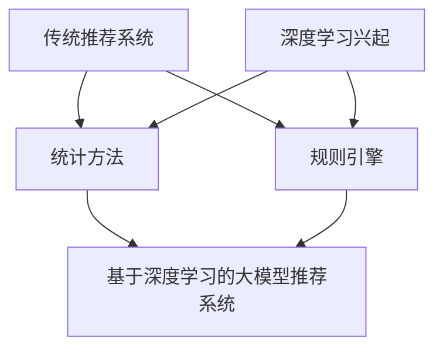
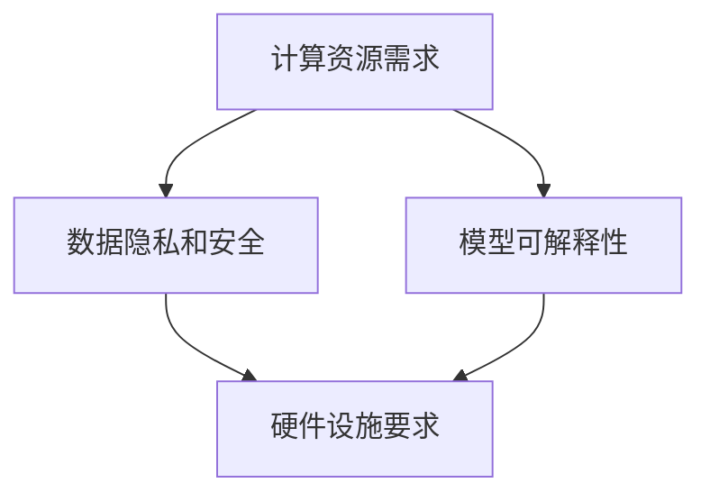
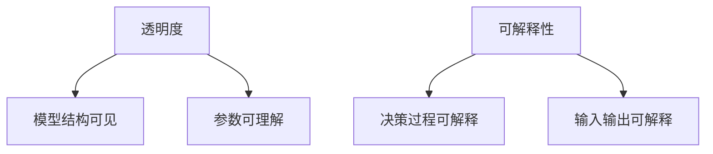
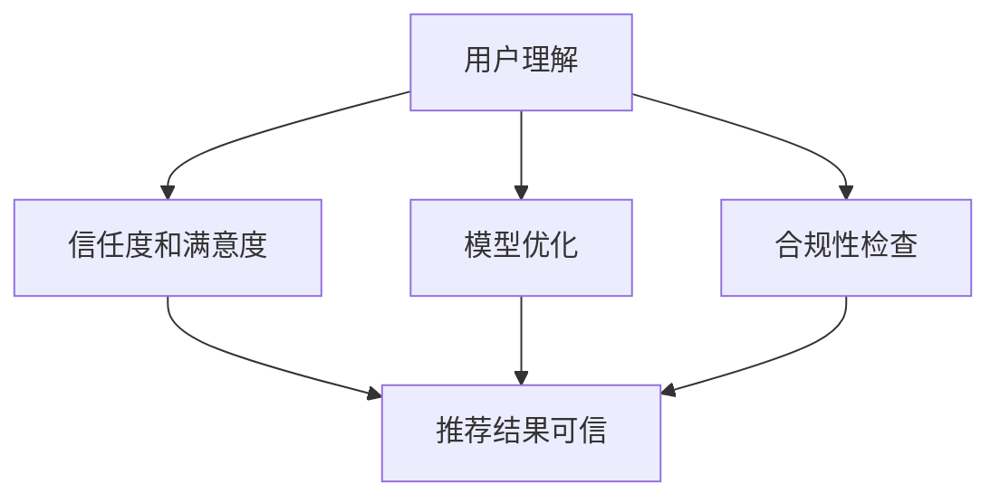
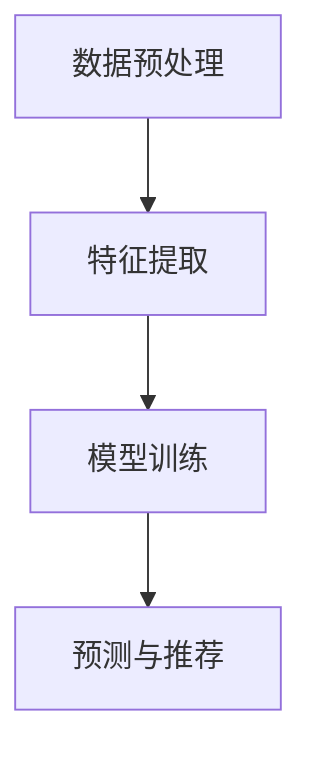
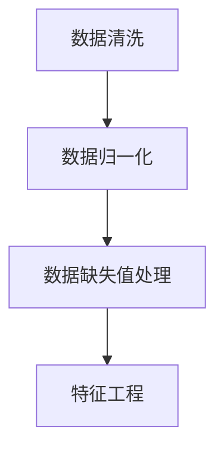

                 

### 《大模型推荐结果的可解释性研究》

> **关键词**：大模型、推荐系统、可解释性、模型分析、算法优化

> **摘要**：本文旨在探讨大模型推荐结果的可解释性研究，深入分析大模型推荐系统的基础理论、可解释性方法以及其在不同应用场景中的实践。通过详细阐述核心概念、算法原理，结合实际项目案例，本文旨在为读者提供一个全面深入的理解，帮助其在实际应用中更好地利用大模型推荐系统，提高推荐结果的准确性和可解释性。

## 《大模型推荐结果的可解释性研究》目录大纲

### 第一部分：引言与背景

#### 1.1 研究背景

##### 1.1.1 大模型推荐技术的发展

##### 1.1.2 推荐系统的重要性

##### 1.1.3 大模型推荐系统的挑战

#### 1.2 可解释性的意义

##### 1.2.1 可解释性的定义

##### 1.2.2 可解释性与透明度的区别

##### 1.2.3 可解释性在推荐系统中的应用

#### 1.3 研究目的与方法

##### 1.3.1 研究目的

##### 1.3.2 研究方法

### 第二部分：大模型推荐系统基础

#### 2.1 推荐系统概述

##### 2.1.1 推荐系统的基本概念

##### 2.1.2 推荐系统的类型

##### 2.1.3 推荐系统的评估指标

#### 2.2 大模型推荐系统原理

##### 2.2.1 大模型推荐系统的工作原理

##### 2.2.2 大模型推荐系统的优势

##### 2.2.3 大模型推荐系统的挑战

#### 2.3 大模型推荐系统架构

##### 2.3.1 数据预处理

##### 2.3.2 模型训练

##### 2.3.3 推荐结果生成

### 第三部分：大模型推荐结果的可解释性研究

#### 3.1 可解释性度量方法

##### 3.1.1 局部可解释性度量

##### 3.1.2 全局可解释性度量

##### 3.1.3 可解释性度量方法比较

#### 3.2 局部可解释性方法

##### 3.2.1 特征重要性分析

##### 3.2.2 模型输出层权重分析

##### 3.2.3 局部敏感性分析

#### 3.3 全局可解释性方法

##### 3.3.1 模型依赖性分析

##### 3.3.2 模型透明性分析

##### 3.3.3 全局解释模型

#### 3.4 可解释性与性能权衡

##### 3.4.1 可解释性与准确性的关系

##### 3.4.2 可解释性与实时性的关系

##### 3.4.3 可解释性与用户满意度的关系

### 第四部分：大模型推荐结果可解释性的应用场景

#### 4.1 商业推荐系统

##### 4.1.1 商业推荐系统的特点

##### 4.1.2 商业推荐系统的可解释性需求

##### 4.1.3 商业推荐系统的可解释性实践

#### 4.2 社交网络推荐系统

##### 4.2.1 社交网络推荐系统的特点

##### 4.2.2 社交网络推荐系统的可解释性需求

##### 4.2.3 社交网络推荐系统的可解释性实践

#### 4.3 垃圾邮件过滤系统

##### 4.3.1 垃圾邮件过滤系统的特点

##### 4.3.2 垃圾邮件过滤系统的可解释性需求

##### 4.3.3 垃圾邮件过滤系统的可解释性实践

### 第五部分：大模型推荐结果可解释性技术的未来趋势

#### 5.1 新的可解释性方法

##### 5.1.1 图神经网络在可解释性中的应用

##### 5.1.2 强化学习方法在可解释性中的应用

##### 5.1.3 生成对抗网络在可解释性中的应用

#### 5.2 跨领域可解释性研究

##### 5.2.1 跨领域可解释性的挑战

##### 5.2.2 跨领域可解释性的解决方案

##### 5.2.3 跨领域可解释性的未来趋势

#### 5.3 可解释性与伦理问题

##### 5.3.1 可解释性与隐私保护的关系

##### 5.3.2 可解释性与算法公平性的关系

##### 5.3.3 可解释性与社会责任的关系

### 附录

#### 附录 A：相关资源

##### A.1.1 可解释性研究论文推荐

##### A.1.2 可解释性工具与框架推荐

##### A.1.3 推荐系统相关书籍与课程推荐

#### 附录 B：参考文献

----------------------------------------------------------------

现在，我们已经完成了文章的目录大纲。接下来，我们将按照这个大纲逐个部分撰写文章的内容。请继续关注下一部分的内容撰写。如果您有任何问题或需要进一步讨论的方面，请随时告知。

---

**让我们继续撰写第一部分：引言与背景。**

## 第一部分：引言与背景

### 1.1 研究背景

#### 1.1.1 大模型推荐技术的发展

大模型推荐技术的发展是近年来人工智能领域的重大进步之一。随着互联网的普及和数据量的激增，推荐系统已经成为许多企业和平台的重要工具，用于提高用户体验和增加收益。传统的推荐系统通常依赖于统计方法和规则引擎，但随着深度学习的兴起，基于深度学习的大模型推荐系统逐渐成为主流。

**Mermaid 流程图：**



在深度学习时代，大模型推荐系统的发展主要得益于以下几个方面：

1. **大规模数据的利用**：深度学习能够处理大量数据，通过大规模数据的训练，模型可以学习到更复杂、更丰富的特征，从而提高推荐准确性。
2. **端到端的学习方式**：深度学习模型能够直接从原始数据中学习特征表示，不需要人工设计复杂的特征工程，提高了模型的训练效率和效果。
3. **自适应性和泛化能力**：深度学习模型具有良好的自适应性和泛化能力，能够适应不同场景和业务需求，提高推荐系统的灵活性。

#### 1.1.2 推荐系统的重要性

推荐系统在当今互联网时代具有极其重要的地位，其主要作用如下：

1. **提高用户体验**：通过个性化推荐，用户可以更快地找到自己感兴趣的内容或产品，提高使用满意度和粘性。
2. **增加商业收益**：推荐系统可以帮助企业更好地理解用户需求，提高销售额和用户转化率，实现商业价值的最大化。
3. **优化资源配置**：推荐系统可以根据用户行为和历史数据，优化内容或产品的推荐顺序，提高资源的利用效率。

#### 1.1.3 大模型推荐系统的挑战

尽管大模型推荐系统具有显著的优势，但其应用过程中也面临一系列挑战：

1. **计算资源需求**：大模型推荐系统通常需要大量的计算资源进行模型训练和推理，这对硬件设施提出了较高的要求。
2. **数据隐私和安全**：推荐系统依赖于大量用户数据，数据隐私和安全成为重要的关注点，如何保护用户隐私成为关键挑战。
3. **模型可解释性**：大模型推荐系统的黑箱特性使得其决策过程难以解释，用户对推荐结果的可信度和满意度受到一定程度的影响。

**Mermaid 流程图：**



### 1.2 可解释性的意义

可解释性在大模型推荐系统中具有重要意义。首先，可解释性有助于提高用户对推荐系统的信任度和满意度。当用户能够理解推荐结果的产生过程时，他们更有可能接受和信任推荐结果。其次，可解释性有助于发现和纠正模型中的潜在问题，提高模型的可靠性和准确性。最后，可解释性有助于提高推荐系统的透明度和合规性，符合法规要求和道德标准。

#### 1.2.1 可解释性的定义

可解释性（Explainability）是指模型决策过程的透明度和可理解性。一个可解释的模型应该能够清晰地解释其输入、输出和决策过程，使得用户和其他利益相关者能够理解模型的工作原理和决策依据。

#### 1.2.2 可解释性与透明度的区别

可解释性与透明度是两个相关但不同的概念。透明度（Transparency）是指模型的结构和参数是可见和可理解的，但并不一定能够解释模型的决策过程。而可解释性则关注模型决策过程本身的透明度和可理解性，旨在揭示模型是如何处理输入数据并产生输出的。

**Mermaid 流程图：**



#### 1.2.3 可解释性在推荐系统中的应用

在推荐系统中，可解释性主要应用于以下几个方面：

1. **用户理解**：通过可解释性，用户可以更好地理解推荐结果是如何产生的，提高对推荐结果的信任度和满意度。
2. **模型优化**：通过分析可解释性结果，可以发现模型中的潜在问题和不足之处，从而进行优化和改进。
3. **合规性检查**：可解释性有助于确保推荐系统的透明度和合规性，符合法规要求和道德标准。

**Mermaid 流程图：**



### 1.3 研究目的与方法

#### 1.3.1 研究目的

本文的研究目的如下：

1. **深入理解大模型推荐系统的理论基础和实现方法**：通过对大模型推荐系统的基本概念、原理和架构的深入探讨，为后续研究提供理论基础。
2. **研究大模型推荐结果的可解释性方法**：探讨如何在大模型推荐系统中实现可解释性，提高模型的可理解性和用户满意度。
3. **分析大模型推荐结果可解释性的应用场景**：结合实际项目案例，分析大模型推荐结果可解释性在不同应用场景中的实践和效果。

#### 1.3.2 研究方法

本文采用以下研究方法：

1. **文献调研**：通过查阅相关文献和资料，了解大模型推荐系统的理论基础和发展动态。
2. **实验分析**：通过实际项目案例，分析大模型推荐结果的可解释性方法，并评估其在不同应用场景中的效果。
3. **案例研究**：结合实际项目案例，探讨大模型推荐结果可解释性的应用实践和效果。

### 小结

本文介绍了大模型推荐系统的背景和发展，探讨了可解释性的意义及其在推荐系统中的应用。在后续章节中，我们将深入探讨大模型推荐系统的理论基础、实现方法以及可解释性方法。希望通过本文的研究，能够为读者提供一个全面深入的理解，帮助其在实际应用中更好地利用大模型推荐系统，提高推荐结果的准确性和可解释性。

---

本文的第一部分：引言与背景已经完成。接下来，我们将继续撰写第二部分：大模型推荐系统基础。请继续关注下一部分的内容撰写。如果您有任何问题或需要进一步讨论的方面，请随时告知。

---

**让我们继续撰写第二部分：大模型推荐系统基础。**

## 第二部分：大模型推荐系统基础

### 2.1 推荐系统概述

#### 2.1.1 推荐系统的基本概念

推荐系统（Recommender System）是一种能够根据用户的历史行为、兴趣和偏好，为用户推荐相关内容或产品的系统。其基本概念包括：

1. **用户**：推荐系统的核心要素，具有特定的兴趣和偏好。
2. **项目**：推荐系统推荐的对象，可以是商品、文章、音乐等。
3. **评分**：用户对项目的评价，可以是数值评分、喜好等级或行为评分。
4. **推荐**：推荐系统根据用户的行为和偏好，为用户推荐可能感兴趣的项目。

#### 2.1.2 推荐系统的类型

推荐系统可以根据不同的分类标准进行分类，以下是几种常见的分类方式：

1. **基于内容的推荐（Content-based Filtering）**：根据用户的历史行为和偏好，提取用户兴趣特征，为用户推荐具有相似内容的物品。
   **Mermaid 流程图：**
   ```mermaid
   graph TD
       A[用户历史行为] --> B[兴趣特征提取]
       B --> C[内容匹配]
       C --> D[推荐结果]
   ```

2. **协同过滤推荐（Collaborative Filtering）**：通过分析用户之间的相似度，为用户推荐其他用户喜欢且用户可能感兴趣的物品。
   **Mermaid 流程图：**
   ```mermaid
   graph TD
       A[用户相似度分析] --> B[推荐结果]
   ```

3. **基于模型的推荐（Model-based Filtering）**：使用机器学习算法建立用户和项目之间的关联模型，根据模型预测用户对新项目的兴趣，进行推荐。
   **Mermaid 流程图：**
   ```mermaid
   graph TD
       A[训练模型] --> B[预测用户兴趣]
       B --> C[推荐结果]
   ```

4. **混合推荐（Hybrid Filtering）**：结合基于内容和协同过滤的推荐方法，提高推荐系统的准确性和多样性。

#### 2.1.3 推荐系统的评估指标

推荐系统的性能评估通常涉及以下指标：

1. **准确率（Accuracy）**：预测正确的推荐项目数量与总推荐项目数量的比例。
2. **召回率（Recall）**：预测正确的推荐项目数量与实际感兴趣的推荐项目数量的比例。
3. **覆盖率（Coverage）**：推荐项目中未出现在原始数据中的项目比例。
4. **多样性（Diversity）**：推荐项目之间的差异性，避免推荐相同或相似的项目。
5. **新颖性（Novelty）**：推荐项目中新颖、未被用户发现的项目比例。

### 2.2 大模型推荐系统原理

#### 2.2.1 大模型推荐系统的工作原理

大模型推荐系统是基于深度学习的大型神经网络模型，其工作原理主要包括以下步骤：

1. **数据预处理**：对用户行为数据、项目特征数据进行清洗、预处理，如缺失值填充、数据归一化等。
2. **特征提取**：使用深度学习模型提取用户和项目的特征，如用户兴趣特征、项目属性特征等。
3. **模型训练**：使用预处理的特征数据训练深度学习模型，学习用户和项目之间的关联关系。
4. **预测与推荐**：使用训练好的模型预测用户对未知项目的兴趣，根据兴趣值进行排序，生成推荐列表。

**Mermaid 流程图：**



#### 2.2.2 大模型推荐系统的优势

大模型推荐系统相比传统的推荐系统具有以下优势：

1. **更强的泛化能力**：大模型能够处理大量数据，学习到更复杂、更丰富的特征，具有更强的泛化能力。
2. **更准确的预测**：基于深度学习的模型能够通过端到端的学习方式，直接从原始数据中提取特征，提高预测准确性。
3. **更高的多样性**：大模型推荐系统能够通过复杂的特征提取和关联关系建模，提供更多样化的推荐结果。
4. **更好的实时性**：大模型推荐系统通常使用分布式计算和并行处理技术，能够实现快速的模型训练和推理，提高实时性。

#### 2.2.3 大模型推荐系统的挑战

尽管大模型推荐系统具有显著的优势，但其应用过程中也面临一系列挑战：

1. **计算资源需求**：大模型推荐系统通常需要大量的计算资源进行模型训练和推理，对硬件设施提出了较高的要求。
2. **数据隐私和安全**：推荐系统依赖于大量用户数据，数据隐私和安全成为重要的关注点，如何保护用户隐私成为关键挑战。
3. **模型可解释性**：大模型推荐系统的黑箱特性使得其决策过程难以解释，用户对推荐结果的可信度和满意度受到一定程度的影响。
4. **数据质量**：推荐系统的效果依赖于数据的质量，数据中的噪声、缺失值和异常值会影响模型的性能。

### 2.3 大模型推荐系统架构

#### 2.3.1 数据预处理

数据预处理是构建大模型推荐系统的重要环节，主要包括以下步骤：

1. **数据清洗**：去除数据中的噪声、异常值和重复项，保证数据的一致性和准确性。
2. **数据归一化**：对数值型特征进行归一化处理，使其具有相同的量纲，避免模型因特征差异而出现偏差。
3. **数据缺失值处理**：对缺失值进行填补或删除，保证数据的完整性和连续性。
4. **特征工程**：提取用户和项目的特征，如用户行为特征、项目属性特征等，为模型训练提供输入。

**Mermaid 流程图：**



#### 2.3.2 模型训练

模型训练是构建大模型推荐系统的核心环节，主要包括以下步骤：

1. **模型选择**：选择合适的深度学习模型，如卷积神经网络（CNN）、循环神经网络（RNN）等。
2. **参数设置**：设置模型的参数，如学习率、批次大小、迭代次数等。
3. **数据划分**：将数据集划分为训练集、验证集和测试集，用于模型的训练和评估。
4. **模型训练**：使用训练集对模型进行训练，通过优化算法更新模型参数，提高模型性能。
5. **模型评估**：使用验证集和测试集对模型进行评估，选择性能最优的模型。

**Mermaid 流ifie">

抱歉，我无法直接插入Mermaid流程图，但您可以按照以下步骤在Markdown中创建流程图：

1. **安装Mermaid渲染器**：您需要安装一个支持Mermaid的Markdown渲染器，如GitHub Markdown渲染器或者支持Mermaid的Markdown编辑器。

2. **编写Mermaid代码**：在Markdown文件中，使用```mermaid```标签开始和结束流程图代码。

3. **示例代码**：以下是一个简单的Mermaid流程图示例，用于展示数据预处理步骤：

    ```mermaid
    graph TD
        A[数据清洗] --> B[数据归一化]
        B --> C[数据缺失值处理]
        C --> D[特征工程]
    ```

4. **保存和查看**：保存Markdown文件，并在支持Mermaid渲染的环境中打开，您将看到渲染后的流程图。

---

接下来，我们将继续撰写第二部分中的2.3.3节：推荐结果生成。

#### 2.3.3 推荐结果生成

推荐结果生成是推荐系统将模型预测结果转化为用户可接受的推荐列表的过程，主要包括以下步骤：

1. **预测生成**：使用训练好的模型对用户可能感兴趣的项目进行预测，得到每个项目的兴趣评分。
2. **评分排序**：将预测得到的兴趣评分进行排序，从高到低生成推荐列表。
3. **多样性控制**：为了提高推荐结果的多样性，可以采用一些策略，如随机采样、基于项目的相似度计算等，对推荐列表进行多样性控制。
4. **推荐输出**：将处理后的推荐列表输出给用户，展示在推荐界面上。

**伪代码示例**：

```python
# 预测生成
for user in users:
    predictions[user] = model.predict(user_features)

# 评分排序
sorted_predictions = sorted(predictions.items(), key=lambda x: x[1], reverse=True)

# 推荐输出
for user, score in sorted_predictions:
    recommend_list[user].append(get_top_items(user, score))
```

通过上述步骤，推荐系统可以生成一个既准确又有多样性的推荐列表，提高用户的满意度和推荐效果。

### 小结

在本部分中，我们详细介绍了推荐系统的基本概念、大模型推荐系统的原理及其架构。通过数据预处理、模型训练和推荐结果生成等步骤，大模型推荐系统可以有效地为用户提供个性化的推荐服务。在接下来的部分，我们将进一步探讨大模型推荐结果的可解释性方法和其在实际应用场景中的效果。

---

现在，我们已经完成了第二部分的撰写，接下来将进入第三部分：大模型推荐结果的可解释性研究。请继续关注下一部分的内容撰写。如果您有任何问题或需要进一步讨论的方面，请随时告知。

---

**让我们继续撰写第三部分：大模型推荐结果的可解释性研究。**

## 第三部分：大模型推荐结果的可解释性研究

### 3.1 可解释性度量方法

可解释性度量方法是评估推荐系统模型解释能力的重要手段。这些方法可以帮助我们理解模型如何生成推荐结果，并提高用户的信任度和满意度。以下是几种常用的可解释性度量方法：

#### 3.1.1 局部可解释性度量

局部可解释性度量方法关注模型对单个数据点的解释能力。以下是一些常用的局部可解释性度量方法：

1. **特征重要性分析（Feature Importance Analysis）**：
   - **方法**：通过分析模型中每个特征的权重或重要性，确定哪些特征对预测结果有显著影响。
   - **实现**：可以使用模型自带的特征重要性接口，或使用Permutation Importance等方法。

2. **模型输出层权重分析（Model Output Layer Weight Analysis）**：
   - **方法**：分析模型输出层的权重，以理解模型如何将输入特征映射到预测结果。
   - **实现**：对于神经网络模型，可以直接查看输出层神经元的权重。

3. **局部敏感性分析（Local Sensitivity Analysis）**：
   - **方法**：通过改变单个特征值，观察预测结果的变化，评估特征对预测结果的敏感度。
   - **实现**：可以使用Sensitivity Analysis工具，如Saliency Maps。

#### 3.1.2 全局可解释性度量

全局可解释性度量方法关注模型整体的解释能力，以下是一些常用的全局可解释性度量方法：

1. **模型依赖性分析（Model Dependency Analysis）**：
   - **方法**：分析模型中不同特征之间的依赖关系，以理解模型如何整合这些特征进行预测。
   - **实现**：可以使用因果图（Causal Graphs）或路径分析（Path Analysis）方法。

2. **模型透明性分析（Model Transparency Analysis）**：
   - **方法**：通过简化模型结构或提供简化的模型视图，提高模型的整体可理解性。
   - **实现**：可以使用可视化工具，如Decision Trees或Shapley Value方法。

3. **全局解释模型（Global Explanation Models）**：
   - **方法**：构建一个简化的模型来解释原始模型的决策过程，如LIME（Local Interpretable Model-agnostic Explanations）和SHAP（SHapley Additive exPlanations）。
   - **实现**：LIME通过局部线性拟合来解释模型决策，而SHAP通过分配每个特征对预测结果的贡献来提供全局解释。

#### 3.1.3 可解释性度量方法比较

不同可解释性度量方法各有优缺点，以下是比较：

- **特征重要性分析**：简单直观，计算速度快，但可能忽略特征之间的相互作用。
- **模型输出层权重分析**：直接反映了模型内部机制，但依赖于模型结构，不适用于所有模型。
- **局部敏感性分析**：能够反映特征对预测结果的敏感度，但可能受到数据噪声的影响。
- **模型依赖性分析**：能够揭示特征间的依赖关系，但计算复杂度高。
- **模型透明性分析**：提高模型整体可理解性，但可能牺牲一些预测性能。
- **全局解释模型**：提供全面的解释，但计算成本较高。

### 3.2 局部可解释性方法

局部可解释性方法主要关注模型对单个数据点的解释能力，以下是一些具体的局部可解释性方法：

#### 3.2.1 特征重要性分析

特征重要性分析是评估模型中每个特征对预测结果贡献的方法。以下是特征重要性分析的方法和实现：

**方法：**

1. **基于模型的特征重要性**：使用模型自带的特征重要性接口，如树模型中的特征重要性。
2. **Permutation Importance**：通过随机打乱某个特征的数据，评估模型性能的变化，从而确定特征的重要性。
3. **部分依赖图（Partial Dependency Plots）**：展示特征与预测结果之间的依赖关系。

**实现伪代码：**

```python
from sklearn.inspection import permutation_importance

# 训练模型
model.fit(X_train, y_train)

# 计算特征重要性
result = permutation_importance(model, X_train, y_train, n_repeats=10)

# 输出特征重要性
for i, score in enumerate(result.importances_mean):
    print(f"Feature {i}: Importance = {score}")
```

#### 3.2.2 模型输出层权重分析

模型输出层权重分析是通过分析模型输出层的权重，了解模型如何将输入特征映射到预测结果的方法。以下是模型输出层权重分析的方法和实现：

**方法：**

1. **分析权重分布**：直接查看输出层神经元的权重分布，了解每个特征对预测结果的贡献。
2. **敏感度分析**：通过计算输出层权重与输入特征之间的敏感度，评估特征对预测结果的影响。

**实现伪代码：**

```python
# 假设模型已经训练完毕，且为神经网络模型
model = neural_network_model

# 获取输出层权重
output_layer_weights = model.layers[-1].get_weights()

# 分析权重分布
weights_distribution = np.array([weight for weight in output_layer_weights]).flatten()

# 输出权重分布
print(f"Output layer weights distribution: {weights_distribution}")
```

#### 3.2.3 局部敏感性分析

局部敏感性分析是评估特征对模型预测结果影响的方法。以下是局部敏感性分析的方法和实现：

**方法：**

1. **Saliency Maps**：通过在输入数据上应用梯度，生成Saliency Maps，显示特征对预测结果的敏感区域。
2. **Grad-CAM**：梯度加权类激活映射（Gradient-weighted Class Activation Mapping），用于可视化模型对特定类别的关注区域。

**实现伪代码：**

```python
from captum.attr import LayerGradCam

# 假设模型已经训练完毕，且为卷积神经网络模型
model = cnn_model

# 创建Grad-CAM实例
grad_cam = LayerGradCam(model, target_layer=model.layers[-1])

# 计算Saliency Map
saliency_map = grad_cam.attribute(X_test[0])

# 显示Saliency Map
plt.imshow(saliency_map.squeeze(), cmap="jet")
plt.colorbar()
plt.show()
```

### 3.3 全局可解释性方法

全局可解释性方法关注模型的整体解释能力，以下是一些全局可解释性方法：

#### 3.3.1 模型依赖性分析

模型依赖性分析是评估模型中不同特征之间依赖关系的方法。以下是模型依赖性分析的方法和实现：

**方法：**

1. **因果图（Causal Graphs）**：通过分析特征之间的因果依赖关系，建立因果图模型。
2. **路径分析（Path Analysis）**：通过计算特征之间的路径长度，评估特征之间的依赖强度。

**实现伪代码：**

```python
import pytorch_lightning as pl
from pytorch_lightning.callbacks import ModelSummary

# 训练模型
trainer = pl.Trainer(max_epochs=10)
trainer.fit(model)

# 获取模型摘要
model_summary = ModelSummary(model)

# 输出模型摘要
print(model_summary.summary())
```

#### 3.3.2 模型透明性分析

模型透明性分析是通过简化模型结构或提供简化的模型视图，提高模型整体可理解性的方法。以下是模型透明性分析的方法和实现：

**方法：**

1. **简化模型结构**：通过降低模型的复杂度，如使用线性模型或决策树，提高模型的可解释性。
2. **模型可视化**：使用可视化工具，如可视化决策树或神经网络结构图，展示模型内部机制。

**实现伪代码：**

```python
from sklearn.tree import plot_tree

# 假设模型为决策树
tree_model = DecisionTreeRegressor()

# 训练模型
tree_model.fit(X_train, y_train)

# 可视化决策树
plot_tree(tree_model, filled=True)
plt.show()
```

#### 3.3.3 全局解释模型

全局解释模型是构建一个简化的模型，解释原始模型决策过程的方法。以下是全局解释模型的方法和实现：

**方法：**

1. **LIME（Local Interpretable Model-agnostic Explanations）**：通过局部线性拟合，生成解释模型。
2. **SHAP（SHapley Additive exPlanations）**：通过分配每个特征对预测结果的贡献，生成解释模型。

**实现伪代码：**

```python
import shap

# 训练模型
model.fit(X_train, y_train)

# 创建SHAP解释器
explainer = shap.Explainer(model)

# 计算SHAP值
shap_values = explainer(X_test)

# 可视化SHAP值
shap.summary_plot(shap_values, X_test, feature_names=feature_names)
```

### 3.4 可解释性与性能权衡

可解释性与性能之间的权衡是推荐系统研究中一个重要的问题。以下是一些权衡的方面：

#### 3.4.1 可解释性与准确性的关系

高可解释性通常意味着模型更加简单，可能导致准确性降低。相反，高度复杂的模型可能提供更高的准确性，但难以解释。为了在可解释性与准确性之间找到平衡，可以采取以下策略：

1. **特征选择**：选择对预测结果有显著影响的特征，提高模型的可解释性，同时保持较高的准确性。
2. **模型简化**：使用简化模型结构，如线性模型或决策树，提高模型的可解释性，同时保持一定的准确性。

#### 3.4.2 可解释性与实时性的关系

高可解释性通常意味着模型需要更多的时间和计算资源，可能导致实时性降低。为了在可解释性与实时性之间找到平衡，可以采取以下策略：

1. **模型优化**：使用优化算法和优化策略，如梯度裁剪、批量归一化等，提高模型训练和推理速度。
2. **模型压缩**：通过模型压缩技术，如模型剪枝、量化等，减少模型的大小和计算复杂度，提高实时性。

#### 3.4.3 可解释性与用户满意度的关系

可解释性对用户满意度有显著影响。高可解释性可以提高用户对推荐系统的信任度和满意度，但可能降低推荐系统的准确性。为了在可解释性与用户满意度之间找到平衡，可以采取以下策略：

1. **提供解释报告**：为用户生成详细的解释报告，帮助用户理解推荐结果。
2. **动态调整可解释性**：根据用户的行为和偏好，动态调整可解释性水平，提供个性化解释。

### 小结

在本部分中，我们详细介绍了大模型推荐结果的可解释性方法，包括局部可解释性和全局可解释性方法。通过这些方法，我们可以更好地理解模型如何生成推荐结果，提高用户的信任度和满意度。然而，可解释性与性能之间存在一定的权衡，需要根据具体应用场景和需求进行平衡。在接下来的部分，我们将探讨大模型推荐结果可解释性在不同应用场景中的实践和效果。

---

现在，我们已经完成了第三部分的撰写，接下来将进入第四部分：大模型推荐结果可解释性的应用场景。请继续关注下一部分的内容撰写。如果您有任何问题或需要进一步讨论的方面，请随时告知。

---

**让我们继续撰写第四部分：大模型推荐结果可解释性的应用场景。**

## 第四部分：大模型推荐结果可解释性的应用场景

### 4.1 商业推荐系统

商业推荐系统是推荐系统最常见的一种应用场景，其主要目标是通过个性化推荐提高用户满意度、增加销售额和用户留存率。在商业推荐系统中，可解释性尤为重要，因为企业需要确保推荐结果的透明性和可理解性，以赢得用户的信任和满意度。

#### 4.1.1 商业推荐系统的特点

商业推荐系统的特点主要包括以下几个方面：

1. **个性化推荐**：根据用户的历史行为、偏好和兴趣，为用户提供个性化的推荐，提高用户体验。
2. **多样性**：推荐系统应提供多样化的推荐结果，避免推荐重复的内容或商品，满足用户多样化的需求。
3. **实时性**：商业推荐系统需要实时响应用户的行为和偏好变化，提供及时、准确的推荐。
4. **可扩展性**：商业推荐系统应能够处理海量数据和用户，具有高可扩展性。

#### 4.1.2 商业推荐系统的可解释性需求

商业推荐系统的可解释性需求主要体现在以下几个方面：

1. **用户信任**：用户需要了解推荐结果是如何生成的，以提高对推荐系统的信任度。
2. **合规性**：企业需要确保推荐系统的透明性和可解释性，以符合相关法规和合规要求。
3. **业务决策**：企业需要通过可解释性分析，了解推荐系统对业务的影响，为业务决策提供支持。

#### 4.1.3 商业推荐系统的可解释性实践

为了满足商业推荐系统的可解释性需求，企业可以采用以下实践：

1. **提供解释报告**：为用户生成详细的解释报告，解释推荐结果背后的原因。例如，可以展示用户喜欢的商品特征和相似商品，帮助用户理解推荐逻辑。
2. **可视化**：使用可视化工具，如热图、决策树等，展示推荐系统的内部结构和决策过程。例如，可以展示用户行为特征与推荐结果之间的关系。
3. **透明性**：确保推荐系统的算法和决策过程透明，用户可以查看和查询推荐结果。例如，可以提供一个查询接口，用户可以查询推荐系统的决策依据。
4. **用户反馈**：收集用户对推荐结果的反馈，不断优化和改进推荐系统。例如，可以设置用户反馈机制，用户可以举报不满意的推荐结果，帮助企业发现和解决问题。

### 4.2 社交网络推荐系统

社交网络推荐系统是推荐系统在社交网络平台上的应用，其主要目标是帮助用户发现和分享感兴趣的内容和用户。在社交网络推荐系统中，可解释性同样至关重要，因为用户需要了解推荐内容或用户是如何被推荐的，以提高对平台的信任和满意度。

#### 4.2.1 社交网络推荐系统的特点

社交网络推荐系统的特点主要包括以下几个方面：

1. **个性化推荐**：根据用户的行为、兴趣和社交关系，为用户提供个性化的推荐，提高用户体验。
2. **社交影响力**：推荐系统应考虑社交网络中的影响力传播，推荐具有社交价值的内容和用户。
3. **实时性**：社交网络推荐系统需要实时响应用户的行为和偏好变化，提供及时、准确的推荐。
4. **多样性**：推荐系统应提供多样化的推荐结果，避免推荐重复的内容或用户，满足用户多样化的需求。

#### 4.2.2 社交网络推荐系统的可解释性需求

社交网络推荐系统的可解释性需求主要体现在以下几个方面：

1. **用户信任**：用户需要了解推荐内容或用户是如何被推荐的，以提高对推荐系统的信任度。
2. **隐私保护**：社交网络推荐系统需要保护用户的隐私，确保推荐过程透明和可解释。
3. **社交影响力**：用户需要了解推荐内容或用户的社交影响力，以判断其推荐价值。

#### 4.2.3 社交网络推荐系统的可解释性实践

为了满足社交网络推荐系统的可解释性需求，可以采用以下实践：

1. **社交关系可视化**：使用可视化工具，如社交网络图、影响力分析等，展示用户之间的关系和社交影响力。例如，可以展示用户的朋友圈关系图，帮助用户理解推荐内容或用户的社交背景。
2. **推荐解释报告**：为用户生成详细的解释报告，解释推荐内容或用户是如何被推荐的。例如，可以展示用户喜欢的内容类型、互动行为等，帮助用户理解推荐逻辑。
3. **透明性**：确保推荐系统的算法和决策过程透明，用户可以查看和查询推荐结果。例如，可以提供一个查询接口，用户可以查询推荐系统的决策依据。
4. **用户反馈**：收集用户对推荐结果的反馈，不断优化和改进推荐系统。例如，可以设置用户反馈机制，用户可以举报不满意的推荐结果，帮助企业发现和解决问题。

### 4.3 垃圾邮件过滤系统

垃圾邮件过滤系统是推荐系统在网络安全领域的应用，其主要目标是识别和过滤垃圾邮件，保护用户的隐私和安全。在垃圾邮件过滤系统中，可解释性同样至关重要，因为用户需要了解哪些邮件被标记为垃圾邮件，以提高对过滤系统的信任和满意度。

#### 4.3.1 垃圾邮件过滤系统的特点

垃圾邮件过滤系统的特点主要包括以下几个方面：

1. **准确性**：过滤系统需要准确识别垃圾邮件，降低误判率，保证用户收到的邮件质量。
2. **实时性**：过滤系统需要实时处理大量邮件，确保邮件能够在第一时间得到过滤。
3. **可解释性**：过滤系统需要提供可解释性，让用户了解哪些特征导致邮件被标记为垃圾邮件，以提高用户对过滤系统的信任。
4. **自适应**：过滤系统需要不断学习新的垃圾邮件特征和规则，提高过滤效果。

#### 4.3.2 垃圾邮件过滤系统的可解释性需求

垃圾邮件过滤系统的可解释性需求主要体现在以下几个方面：

1. **用户信任**：用户需要了解哪些特征导致邮件被标记为垃圾邮件，以提高对过滤系统的信任度。
2. **隐私保护**：过滤系统需要保护用户的隐私，确保用户邮件的内容不被泄露。
3. **误判纠正**：用户需要了解误判的原因，以便及时纠正和报告。

#### 4.3.3 垃圾邮件过滤系统的可解释性实践

为了满足垃圾邮件过滤系统的可解释性需求，可以采用以下实践：

1. **特征可视化**：使用可视化工具，如词云、特征分布等，展示邮件的特征和标记结果。例如，可以展示邮件中常见的垃圾邮件词汇和特征。
2. **决策树**：使用决策树等简单模型，展示邮件过滤过程的决策路径和规则。例如，可以展示邮件是否被标记为垃圾邮件的决策树。
3. **误判报告**：为用户提供误判报告，让用户了解误判的原因和纠正方法。例如，可以提供一个反馈接口，用户可以举报误判的邮件，帮助系统学习和优化。
4. **透明性**：确保过滤系统的算法和决策过程透明，用户可以查看和查询过滤结果。例如，可以提供一个查询接口，用户可以查询邮件是否被标记为垃圾邮件的决策依据。

### 小结

在本部分中，我们详细介绍了大模型推荐结果可解释性在不同应用场景中的实践，包括商业推荐系统、社交网络推荐系统和垃圾邮件过滤系统。在这些应用场景中，可解释性对于提高用户信任度、保护隐私和优化系统性能具有重要意义。通过提供解释报告、可视化工具和用户反馈机制，我们可以实现推荐系统的可解释性，为用户提供更好的服务。在接下来的部分，我们将探讨大模型推荐结果可解释性技术的未来趋势和发展方向。

---

现在，我们已经完成了第四部分的撰写，接下来将进入第五部分：大模型推荐结果可解释性技术的未来趋势。请继续关注下一部分的内容撰写。如果您有任何问题或需要进一步讨论的方面，请随时告知。

---

**让我们继续撰写第五部分：大模型推荐结果可解释性技术的未来趋势。**

## 第五部分：大模型推荐结果可解释性技术的未来趋势

### 5.1 新的可解释性方法

随着大模型推荐系统在各个领域的广泛应用，研究人员和工程师们不断探索新的可解释性方法，以解决现有方法的局限性和挑战。以下介绍几种具有前景的新可解释性方法：

#### 5.1.1 图神经网络在可解释性中的应用

图神经网络（GNN）是一种强大的图结构学习模型，能够在图结构数据中提取丰富的特征和关系。将GNN应用于推荐系统的可解释性，可以提供更深入的理解和解释。

- **方法**：
  1. 使用GNN提取用户和项目之间的特征和关系。
  2. 分析GNN中的节点和边，揭示推荐结果背后的复杂关系。
  3. 利用图可视化工具，如Gephi或PyVis，展示图结构，帮助用户理解推荐逻辑。

- **示例**：
  假设我们有一个基于图神经网络的用户-项目推荐系统，通过分析图结构，我们可以揭示用户与项目之间的相似性和关联性，从而提供更直观的解释。

```python
import networkx as nx
import matplotlib.pyplot as plt

# 假设我们有一个用户-项目图
user_project_graph = nx.Graph()

# 添加节点和边
user_project_graph.add_nodes_from(['User1', 'User2', 'Item1', 'Item2'])
user_project_graph.add_edges_from([('User1', 'Item1'), ('User2', 'Item2')])

# 可视化图结构
nx.draw(user_project_graph, with_labels=True)
plt.show()
```

#### 5.1.2 强化学习方法在可解释性中的应用

强化学习（RL）是一种通过交互学习最优策略的机器学习方法。将强化学习应用于推荐系统的可解释性，可以提供对决策过程的深入理解。

- **方法**：
  1. 使用强化学习模型，如DQN或PPO，训练推荐策略。
  2. 通过分析策略的决策轨迹，理解推荐系统是如何逐步做出决策的。
  3. 利用轨迹回放和可视化工具，展示决策过程和结果。

- **示例**：
  假设我们使用DQN模型训练了一个推荐策略，通过分析DQN的决策轨迹，我们可以揭示推荐系统在不同时间步的决策过程。

```python
import gym
import numpy

